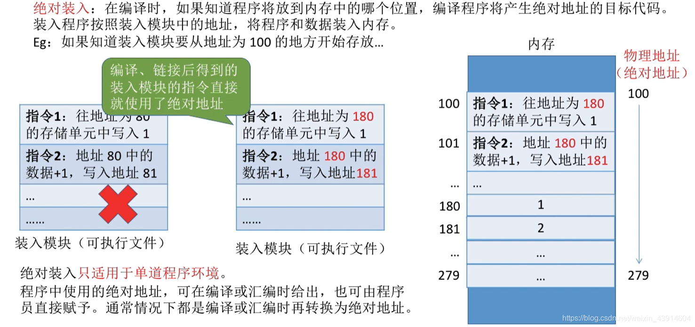
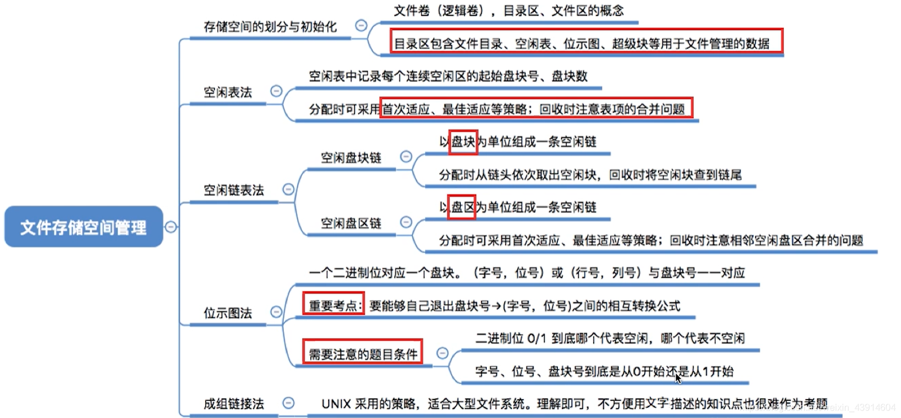
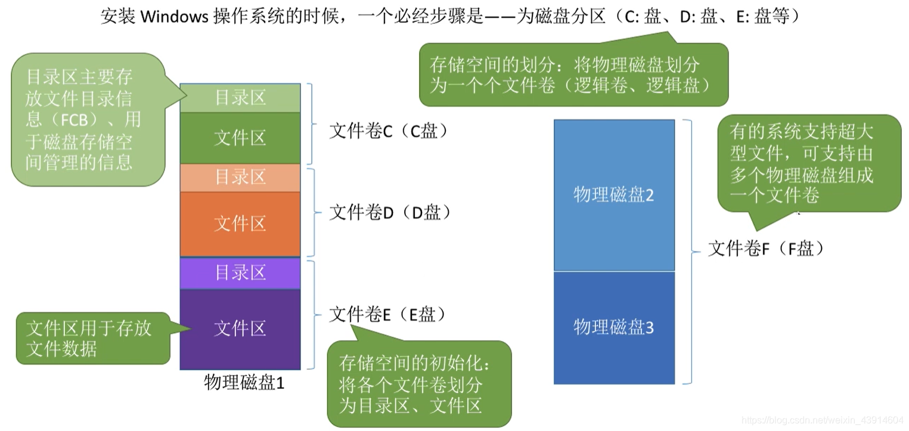
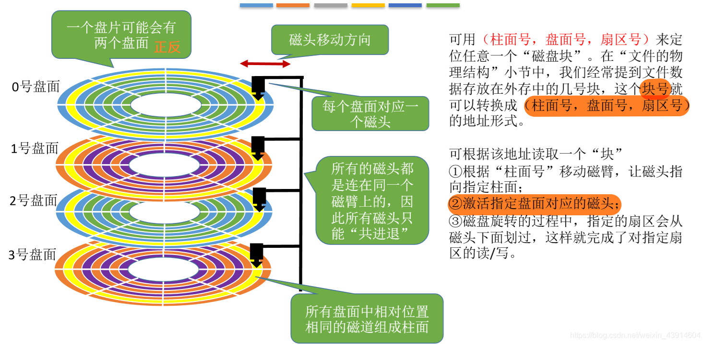
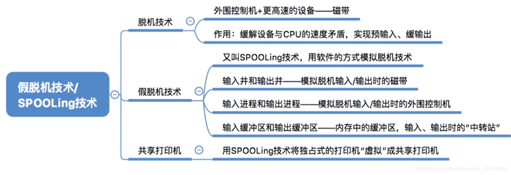
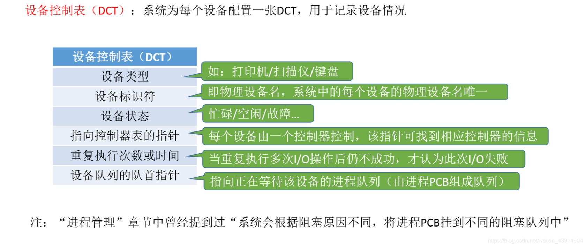
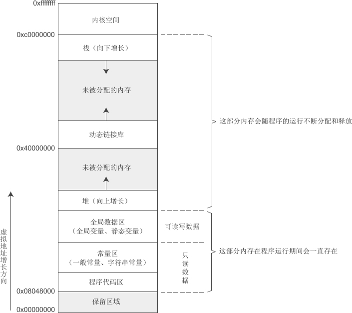
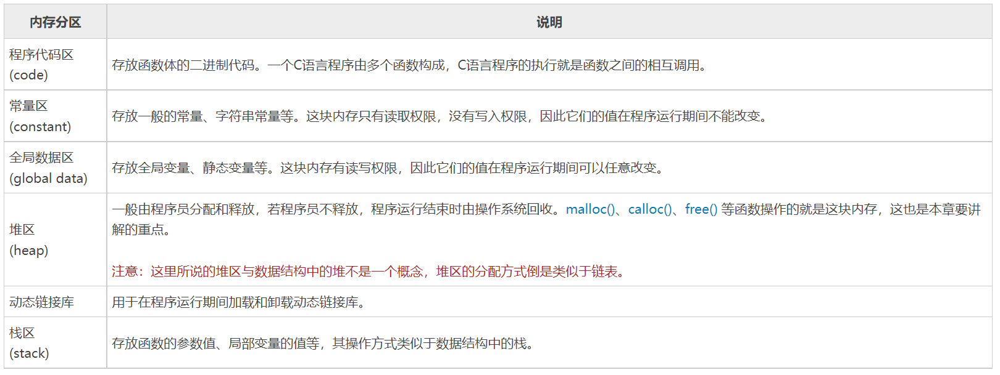

[《王道操作系统》学习笔记总目录+思维导图_王道操作系统思维导图-CSDN博客](https://blog.csdn.net/weixin_43914604/article/details/104415990)

## 一、概述

操作系统是指控制和管理整个计算机系统的硬件与软件资源，合理地组织、调度计算机的工作与资源的分配，进而为用户和其他软件提供方便接口与环境的程序集合

### 1.1 操作系统功能

> 命令接口比如cmd终端、脚本
>
> 程序接口就是一组系统调用指令

### 1.2 操作系统特征

#### 1. 并发

- `并发`：两个或多个事件在同一`时间间隔内`发生，这些事件在宏观上是同时发生的，在微观上是交替发生的， 操作系统的并发性指系统中同时存在着多个运行的程序
- `并行`：两个或多个事件在同一`时刻`发生

#### 2. 共享

- 资源共享即共享，是指系统中的资源可以`供内存中多个并发执行的进程`共同使用
- 共享分为两类：互斥共享和同时共享

#### 3. 虚拟

虚拟是把一个物理上的实体变为若干逻辑上的对应物

1. 虚拟处理器（CPU）：通过多道程序设计技术，采用让多道程序并发执行的方法，分时来使用一个CPU，实际物理上只有一个CPU，但是用户感觉到有多个CPU
2. 虚拟存储器：从逻辑上扩充存储器容量，用户感觉到的但实际不存在的存储器
3. 虚拟设备：将一台物理设备虚拟为逻辑上的多台设备，使多个用户在同一时间段内访问同一台设备，即同时共享，用户宏观上感觉是同时的，但实际上是微观交替访问同一台设备的

#### 4. 异步

多道程序环境允许多个程序`并发`执行，但由于资源有限，如cpu只有一个，进程的执行并不是一贯到底的，而是走走停停的，它以不可预知的速度向前推进

### 1.3 操作系统发展历程

### 1.4 操作系统体系结构

用户态只能使用非内核功能，如果要使用内核功能(或者使用特权指令)需要切换到内核态

用户态-》核心态通过中断实现，且**中断是唯一途径**

核心态-》用户态是通过执行一个特权指令，将程序状态字(psw)的标志位设置为”用户态“

### 1.5 操作系统运行机制

用户通过操作系统上层程序(如系统提供的命令解释程序或用户自编程序)，而这个上层程序的运行依赖于操作系统的底层管理程序提供服务支持。

当需要管理程序服务(比如说需要访问IO)时，系统则通过硬件中断机制进入核心态，运行管理程序(该进程主动阻塞，等待IO完成；cpu处理完中断程序之后可以调度其他进程)；也可能是程序运行出现异常情况，被动地需要管理程序的服务，这时就通过异常处理来进入核心态。

管理程序(中断处理程序)运行结束时，用户程序需要继续运行，此时通过相应的保存的程序现场退出中断处理程序或异常处理程序，返回断点继续执行。

#### 1. 中断和异常

#### 2. 系统调用

系统调用属于(内)中断，比如trap(陷入)指令，是系统提供给用户的获取操作系统服务的接口

陷入指令是唯一一个只能在用户态执行，而不能在内核态执行的指令

### 1.6 操作系统引导

Windows系统的启动管理器的位置：C:\Windows\Boot

## 二、进程管理

即解释抽象层面上不同的程序是如何被CPU并发执行的，结合计组硬件层面的指令和CPU

### 2.1 进程

#### 1. 进程与程序

程序：就是一个指令序列，程序的代码段放在代码段内，程序运行过程中处理的数据放在数据段内

进程：引入多道程序技术之后，**为了实现程序的并发**，引入了进程的概念；PCB、程序段、数据段构成了进程实体(进程映像)

> 进程是程序运行时的状态，进程是动态的;程序是静态的

#### 2. 进程的特征

#### 3. 进程的组成

进程由程序段、数据段、PCB三部分组成

##### 1. **进程控制块PCB（Process Control Block）**

1. 进程**创建**时，操作系统为它创建一个PCB，常驻在内存，是进程存在的唯一标志
2. 进程**执行**时，系统通过PCB了解进程的状态信息，当需要和与之合作的进程实现同步，通信或者访问文件时，也都需要访问PCB
3. 当OS要**调度**某进程执行时，要从该进程的PCB中查处其现行状态及优先级；在调度到某进程后，要根据该被调度进程的PCB中所保存的处理机状态信息，设置该进程恢复运行的现场，并根据其PCB中的程序和数据的内存始址，找到其程序和数据
4. 当进程由于某种原因而**暂停**执行时，又须将器断点的处理机环境保存在PCB中。

##### 2. 程序段

又叫代码段，就是能被进程调度程序调度到CPU执行的程序代码段，注意，程序可被多个进程共享，即多个进程可以运行同一个程序

##### 3. 数据段

即程序的原始数据(程序开始前的全局变量)和程序执行时产生的中间或者最终数据

#### 4. 进程的组织

进程的组成考虑的是进程内部由哪些部分构成的问题，而进程的组织讨论的是多个进程之间组织方式之间的问题

##### 1. 链接方式

##### 2. 索引方式

> 跟文件逻辑存储很像

#### 5. 进程的状态和转换

进程状态之间的转换：

#### 6. 进程的控制

进程控制的主要功能是对系统中的所有进程实施有效的管理，它具有创建新进程、撤销已有进程、实现进程状态转换等功能(**即实现进程状态的转换**)

这个控制主要是由**原语**来控制的，原语的特点是执行期间不允许中断，这种操作叫原子操作

##### 1. 进程创建原语

##### 2. 进程终止原语

##### 3. 进程的唤醒和阻塞原语

- 进程的阻塞和唤醒原语是`成对存在`的，必须`成对使用`。
- `阻塞原语`是由被阻塞进程自我调用实现的
- `唤醒原语`是由一个被唤醒进程合作或被其他相关的进程调用实现的

##### 4. 进程的切换原语

#### 7. 进程之间的通信

进程通信是指进程之间的信息交换。PV操作是低级通信方式，高级通信方式是指以较高的效率传输大量数据的通信方式。主要有以下三种

##### 1. 共享存储

需要使用同步互斥工具如(PV操作)

##### 2. 消息传递

发送信息的进程将消息头写好，接受信息进程根据消息头读取信息或寻找信封是哪一个

分为直接通信方式(消息缓冲队列)和间接通信方式(信箱)两种

##### 3. 管道通信

### 2.2 线程

#### 1. 为什么要引入线程

#### 2. 什么是线程

同一个程序(进程)中，“同时”(并发)进行不同的操作。在只占用一个CPU(单核单CPU下)，有些操作不需要一直使用CPU，比如打印机等其他IO设备，这时就可以把一个进程中的多个线程并发操作

#### 3. 进程与线程的比较

#### 4. 线程的性质

#### 5. 线程的实现方式

线程的实现分为两类：`用户级线程`(User-Level Thread,UTL)和`内核级线程`(Kernel-Level Thread, KTL)l。内核级线程又称`内核支持的线程`

##### 1. 用户级线程

优点：线程切换在用户空间，不用切换到内核态，开销小

缺点：1. 发生一个系统调用时，所有该进程其他线程都阻塞 2. 多CPU下一个进程只能同时执行一个线程

##### 2. 内核级线程

优点：1. 同一个进程的某个线程被阻塞，不影响其他线程 2. 多CPU下同一个进程的不同线程可以同时执行

缺点：同一个进程之间的线程切换需要从用户态转为内核态，开销大

##### 3. 组合线程

#### 6. 多线程模型

前面我们提到了线程的实现方式，有用户级和内核级。那么这两种模式的交叉组合就会产生几种不一样的组织结构，即不一样的模型。

##### 1. 多对一模型

##### 2. 一对一模型

##### 3. 多对多模型

此种模型效率是三种模型中最好的

### 2.3 处理机调度

在多道程序系统中，进程的数量往往多于处理机的个数，进程争用处理机在所难免。处理机调度是对处理机进行分配，即从就绪队列中按照一定算法选择进程给处理机

#### 1.  处理机调度层次

##### 1. 高级调度（作业调度）

> 联想磁盘调度算法

##### 2. 中级调度（内存调度）

> 中级调度实际上是存储器管理的对换功能(即页面置换)
>
> 中级调度与高级调度的区别在于：中级调度是选择一个挂起状态的进程调度到内存中，而高级调度是选择一个作业(程序)建立相对应的进程

##### 3. 低级调度（进程调度）

##### 4. 三种调度的对比

#### 2. 进程调度时机

##### 1. 需要调度的时机

>  只能在程序终止或者中断/异常/系统调用之后，因为只有中断可以打断一个进程的执行状态

##### 2. 不能调度的时机

##### 3. OS内核程序临界区与普通临界区的进程调度情况

#### 3. 进程调度方式

当某个进程正在处理机上执行时，若有某个更为重要或紧迫的进程需要处理，即有优先权更高的进程进入就绪队列，此时应如何分配处理机。

#### 4. 进程切换过程

#### 5. 中断、系统调用、进程切换、程序调用

1. 中断分为内中断和外中断，中断是CPU从用户态转为核心态的唯一途径
2. 系统调用即由用户程序主动发出“陷入”指令请求内核态的服务，**本质上为内中断**

3. 广义上的进程调度分为狭义上的进程调度(根据算法选择要调度的进程)和进程切换
4. 进程调度就是控制进程从进程的就绪队列、阻塞队列、运行队列选择进程在不同队列来回调度
5. 进程切换指切换下一个进程给CPU处理，因为是多道程序允许进程并发，只有中断可以打断一个进程，所以**进程切换发生在中断／异常／系统调用处理过程后**，中断使CPU的用户态转为内核态，**在内核态转为用户态之前，考虑是否要发生进程切换(处理机调度只能发生在内核态)**
6. 子程序是微机基本程序结构中的1种，基本程序结构包括顺序（简单）、分支（判断）、循环、子程序和查表等5种；**程序调用即程序使用call指令将pc转移到子程序入口地址的过程**

##### 1. 中断和程序调用的区别

相同点：中断与调用子程序两过程属于完全不同的概念，但它们也有不少相似之处。两者都需要保护断点（即下一条指令地址）、跳至子程序或中断服务程序、保护现场、子程序或中断处理、恢复现场、恢复断点（即返回主程序）。两者都可实现嵌套，即正在执行的子程序再调另一子程序或正在处理的中断程序又被另一新中断请求所中断，嵌套可为多级。

不同点：两者的根本区别主要表现在服务时间与服务对象不一样上；调用子程序过程发生的时间是已知和固定的，中断过程发生的时间一般的随机的；子程序完全为主程序服务的，两者属于主从关系，主程序需要子程序时就去调用子程序，并把调用结果带回主程序继续执行，而中断服务程序与主程序两者一般是无关的，不存在谁为谁服务的问题，两者是平行关系

##### 2. 中断和进程切换的区别

发生中断不一定发生了进程的切换，如缺页中断，处理后重新执行当前指令

发生了进程切换一定发生了中断。进程切换发生在中断处理之后。

#### 6. 作业/进程调度算法

> 作业调度和进程调度可以共用一些调度算法

##### 1. 先来先服务—FCFS

##### 2. 短作业优先—SJF

##### 3. 高响应比优先—HRRN

##### 4. 时间片轮转—RR

##### 5. 优先级调度算法

##### 6. 多级反馈队列调度算法

### 2.4 进程的同步与互斥

#### 1. 基本概念

1. 临界区：我们把一个时间段内只允许一个进程使用的资源称为临界资源(临界区)。许多物理设备(比如摄像头、打印机)都属于临界资源。此外还有许多变量、数据、内存缓冲区等都属于临界资源

2. 进程同步：同步也称为直接制约关系，在多道程序环境下，进程是并发执行的，不同进程之间存在着不同的相互制约关系。为了协调进程之间的相互制约关系,如等待、传递信息等，引入了进程同步的概念。进程同步是为了解决进程的异步问题
3. 进程互斥：互斥，亦称间接制约关系。进程互斥指当一个进程访问某临界资源时，另一个想要访问该临界资源的进程必须等待。当前访问临界资源的进程访问结束，释放该资源之后，另一个进程才能去访问临界资源

#### 2. 进程互斥软件实现

#### 3. 进程互斥硬件实现

#### 4. 信号量机制PV

##### 1. 为什么提出信号量机制

因为前面的软件和硬件实现存在问题，为了更好的解决进程互斥与同步的问题

##### 2. 什么是信号量机制

##### 3. 信号量机制使用

##### 4. 信号量实现进程同步

##### 5. 信号量实现进程互斥

#### 5. 进程同步与互斥经典问题

> 使用PV信号量实现这些问题的同步与互斥

##### 1. 生产者-消费者问题

##### 2. 理发师问题

##### 3. 读者-写者问题

##### 4. 哲学家进餐问题

#### 6. 管程

##### 1. 为什么引入管程

##### 2. 管程的组成与特征

##### 3. 管程实现生产者消费者问题

> 实际上就是封装了一个类，在类里面实现PV操作(实现同一时间只能有一个进程)，用户不需要关注细节；生产和消费都通过一个对象进行(调用insert和remove)

### 2.5 死锁

#### 1. 什么是死锁

#### 2. 死锁、饥饿、死循环

#### 3. 死锁产生的原因

#### 4. 产生死锁的必要条件

#### 5. 预防死锁

> 即破坏四个必要条件其中一个

##### 1. 破坏互斥条件

##### 2. 破坏不可剥夺条件

##### 3. 破坏请求和保持条件

##### 4. 破坏循环等待条件

#### 6. 死锁避免

##### 1. 安全状态

死锁状态一定处于不安全状态，不安全状态不一定是死锁状态

##### 2. 银行家算法

#### 7. 死锁检测

> 如果能将资源分配图消除所有边，则无死锁发生

#### 8. 死锁解除

## 三、内存管理

进程/程序如何存放在内存中的

### 3.1 进程运行原理

程序通过作业调度进入到内存，操作系统给他分配内存和CPU时间等其他资源，信息保存在PCB中，即为该作业创建进程，然后放入就绪队列等待调度

#### 1. 指令工作原理

编译链接之后的程序(二进制文件)包含了代码段和数据段，**代码段就是CPU要执行的一系列指令，数据段就是存放程序(指令)运行中间数据**

#### 2. 逻辑地址和物理地址

编译时产生的指令只关心相对地址，实际放入内存中再想办法根据起始位置得到绝对地址

#### 3. 程序装入内存的过程

编译-》汇编-》链接-》装入

##### 1. 编译

即将源文件编译成多个二进制代码obj文件

##### 2. 链接

将不同的二进制目标文件和程序所需的库文件链接一起成exe可执行文件，链接的过程可以有三种方式

> 动态链接是分段存储独有的特点

1. ==静态链接==

2. ==装入时动态链接--分段存储==

3. ==运行时动态链接--分段存储==

##### 3. 装入

即将可执行程序的的逻辑地址转为物理地址的过程

1. ==绝对装入--单任务系统==

2. ==静态重定位--固定分区==

3. ==动态重定位--动态分区+段页==

### 3.2 内存管理功能

#### 1. 内存空间的分配与回收

分配：分配方式分为连续分配和非连续分配两种，连续分配包括单一连续分配、固定分区分配、动态分区分配；非连续分配包括分页分段和段页式存储

回收：只对于连续存储方式，使用紧凑的技术，将相邻两块空闲块合并成一个空闲块

#### 2. 内存空间的扩充

#### 3. 地址转换

#### 4. 存储保护

### 3.3 内存空间的连续分配

#### 1. 单一连续分配

#### 2. 固定分区分配

#### 3. 动态分区分配

四种分配算法：

1. 首次适应----按地址递增分配
2. 最佳适应----按容量递增分配 
3. 最坏适应----按容量递减来分配
4. 循环首次适应---即首次适应后不返回初始地址，直接从当前继续找

> 使用空闲分区表或者空闲分区链，来查找分配空闲分区

### 3.4 内存空间的非连续分配

#### 1. 分页存储

##### 1.1 分页思想

##### 1.2 地址转换

###### 逻辑地址结构

###### 页表

> 使用页表来实现动态重定位

每个操作系统都有自己的方法来保存页表。绝大多数都会为每个进程分配一个页表。现在由于页表都比较大，所以放在内存中(以往是放在一组专用寄存器里)，**其指针存在进程控制块(PCB)里**，当进程被调度程序选中投入运行时，系统将其页表指针从进程控制块中取出并送入用户寄存器中。随后可以根据此首地址访问页表。

###### 页表寄存器

##### 1.3 快表TLB

TBL实际上是一组硬件缓冲所关联的快速内存(存放在CPU中)。若没有TBL，操作系统需要两次内存访问来完成逻辑地址到物理地址的转换，访问页表算一次，在页表中查找算一次。TBL中存储页表中的一小部分条目，条目以键值对方式存储

##### 1.4 二级页表

###### 为什么要用二级页表

###### 二级页表地址转换

#### 2. 分段存储

#### 3. 段页式存储

### 3.5 虚拟内存管理

#### 1. 请求分页

##### 1. 页表机制

##### 2. 缺页中断

##### 3. 地址变换机构

#### 2. 页面置换算法

#### 3. 页面分配策略

## 四、文件管理

程序在磁盘中如何存储

### 4.1 文件管理概述

#### 1.文件的属性

#### 2.文件内部的数据如何组织起来？

#### 3.文件之间应该如何组织起来？

#### 4.操作系统应该向上提供哪些功能？

#### 5.从上往下看，文件应该如何存放在外存？

#### 6.其他需要由操作系统实现的文件管理功能

### 4.2 文件的逻辑结构

> 文件内部该如何组织起来

#### 1. 无结构文件

> 流式文件

#### 2. 有结构文件

> 也叫记录式文件

##### 1. 记录分类

根据各记录的长度(占用存储空间)是否相等，又可分为定长记录和变长记录两种

有结构文件的逻辑结构如下几种：

##### 2. 顺序文件

##### 3. 索引文件

##### 4. 索引顺序文件

##### 5. 多级索引顺序文件

### 4.3 文件目录结构

> 文件之间的逻辑组织方式

#### 1. FCB

> windows系统下的使用，物理存储上显式连接分配使用FAT表

#### 2. 索引结点

> unix系统的使用，物理存储上混合索引分配

### 4.4 文件的物理结构

> 文件该怎样存放在外存中

#### 1. 文件块和磁盘块

#### 2. 连续分配

#### 3. 链接分配

##### 隐式链接

##### 显式链接

> window下使用FAT表结合FCB

#### 4. 索引分配

#### 5. 混合索引

> unix系统使用Inode区，一个inode对应一个文件

#### 6. 不同分配方式比较

### 4.5 空闲存储管理

#### 1. 存储空间划分

#### 2. 空闲表法

#### 3. 空闲链表法

#### 4. 位示图法

#### 5. 成组链接法

### 4.6 文件基本操作

#### 1. 创建文件

#### 2. 删除文件

#### 3. 打开文件

打开文件表有两种：用户进程的打开文件表和系统的打开文件表

#### 4. 关闭文件

#### 5.读文件

#### 6.写文件

### 4.7 文件共享

#### 1. 硬链接

#### 2. 软连接

> 复制目标文件的count

### 4.8 文件保护

### 4.9 文件系统的层次结构

### 4.10 磁盘

#### 1. 磁盘的结构

##### 1.1 磁盘、磁道、扇区

1. **簇/块 是操作系统读写文件的基本单位。**
2. **磁盘读写基本单位是扇区。操作系统是通过块和簇来做为单位读取等操作数据的。**
3. **扇区是磁盘最小的物理存储单元**，是磁头从磁盘中读取数据的最小单位（一般512B），即磁头每次从磁盘中读取数据，都是一个扇区一个扇区读的。但由于操作系统无法对数目众多的扇区进行寻址，所以操作系统就将相邻的扇区组合在一起形成一个簇，然后再对簇进行管理(每个簇可以包括2、4、8、16、 32或64个扇区。)

4. **块（簇）是 操作系统与磁盘（硬盘）交互的最小数据单元**（在linux系统中称为块，在windows系统中称为簇）。操作系统从硬盘中拿一块数据，即完成一次磁盘IO。

5. **块（数据块）的大小在硬盘格式化时被指定，一般有1K，2K，4K（最常用）。如果块的大小设置为4K，那么磁盘要读取8个扇区之后，才将数据块传给操作系统**。另外，数据块也是DOS下数据存储的最小单元。例如，如果一个文件的大小为1K，而块的大小为4K，那么该文件还是会占用一个块，块中剩下的3K被空闲出来，不能用于存储其他数据。因此，设置块的大小时，需要考虑要存储文件的大小。

##### 1.2 如何在磁盘中读/写数据

##### 1.3 盘面、柱面

#### 2. 磁盘调度算法

#### 3. 减少磁盘延迟时间

#### 4. 磁盘管理

磁盘初始化过程：物理格式化-》分区格式化-》逻辑格式化-》安装os

> 不同的分区里面可以有不同的操作系统，不同的操作系统建立不同的文件系统，而操作系统作为一个文件夹放在文件系统中。

操作系统的引导：bios-》磁盘引导块-》盘引导块-》操作系统启动管理器

## 五、IO管理

### 1. IO设备分类

### 2. IO控制器

##### 1. IO控制器组成

##### 2.  IO控制器的两种寄存器编址方式

### 3. IO控制方式

#### 3.1 程序直接控制方式

#### 3.2 中断驱动方式

- 由于`程序直接控制方式`CPU利用率低，忙等，所以提出了中断驱动方式。

#### 3.3 DMA方式

- 虽然`中断驱动方式解决了程序直接控制方式`的问题，但是每一次只能读/写一个字，导致CPU频繁切换，耗费了很多时间。于是人们又发明了DMA方式。

#### 4. 通道控制方式

- 通道控制方式是为了解决DMA方式连续存储的问题

#### 5. 四种方式总结

### 4. IO软件的层次

IO核心子系统：

### 5. 假脱机SPooling

> 独改共：类似于消息队列

#### 1. 输入进程与输出进程

#### 2. 输入输出缓冲区

### 6. IO设备分配与回收

#### 1. 设备控制表—DCT

#### 2. 控制器控制表—COCT

#### 3. 通道控制表—CHCT

#### 4. 系统设备表—SDT

### 7. 缓冲区管理

> 即在内存中分配一块区域，适配内存和外存的速度

#### 1. 缓冲区是什么

#### 2. 单缓冲

#### 3. 双缓冲

#### 4. 循环缓冲

#### 5. 缓冲池

# 补充

### 一、翻译程序、编译程序和解释程序

**翻译程序**是指把高级语言源程序翻译成机器语言程序（目标代码），主要包含编译程序和解释程序

**编译程序**将整个高级语言文件先编译成汇编语言再汇编才称为目标可执行二进制文件

**解释程序**将高级语言<u>每一句直接转换成对应的一句二进制</u>并直接执行

### 二、计算机内存分布

#### 用户空间内存分布模型

### 三、软连接和硬链接

硬链接和软链接都是用于链接文件的方法。硬链接通过相同的inode号码将多个文件名链接到同一个文件的数据块上，而软链接则是通过存储目标文件的路径信息来实现链接。硬链接具有共享的inode和数据块，不能跨文件系统使用，而软链接有自己的inode和数据块，可以跨文件系统使用，并且只是存储了路径信息。

