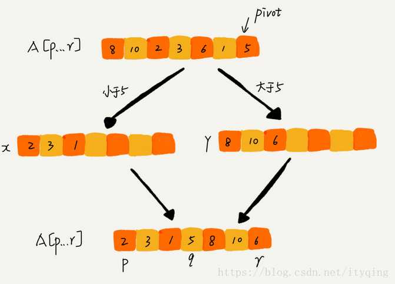
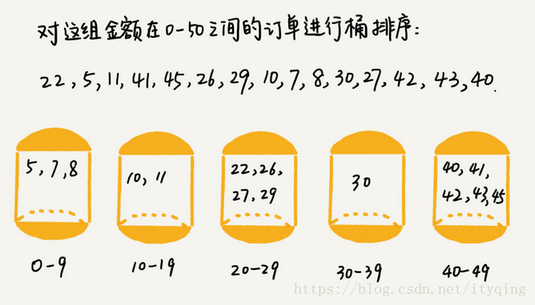

# 数据结构

## 1. 数据结构概述


### 1.1 定义

数据结构是计算机组织、存储数据的方式

根据如何组织起来分化为逻辑结构，如何存储数据分化为存储结构


### 1.2 逻辑结构

反应元素之间的逻辑关系，其中的逻辑关系是指元素之间前后等关系

- 线形结构：数据结构中元素存在一对一的关系

- 树形结构：数据结构中的元素存在一对多的关系

- 图形结构：数据结构中的元素存在多对多的关系

|   线性结构    | 非线性结构 |
| :-----------: | :--------: |
|      栈       |     树     |
|     队列      |     图     |
| 动态/静态数组 |    集合    |
|      串       |            |


### 1.3 存储结构

数据的逻辑结构在计算机存储空间中的存放方式称为数据的存储结构也叫**物理结构**

一种逻辑结构根据需要可以使用多种存储结构

- 顺序存储--把逻辑上相邻的元素存储在物理位置也相邻的存储单元中，一般形式为数组
- 链式存储--逻辑上相邻的元素在物理位置上可以不相邻，借助指示元素存储地址的指针来表示元素之间的逻辑关系，一般形式为链表(指针)
- 索引存储--在存储元素信息的同时，还建立附加的索引表，索引表中的每项称为索引项，索引项的一般形式是（关键字，地址）
- 散列存储-=根据元素的关键字直接计算出该元素的存储地址，又称哈希（Hash）存储

| 存储结构 |     顺序存储     |            链式存储            |
| :------: | :--------------: | :----------------------------: |
| 实现方式 |       数组       |              链表              |
| 存储特点 | 物理地址空间连续 | 物理地址空间通过指针跳转不连续 |


## 2. 线性表

### 2.1 线性表基本概念

##### 1. 定义

线性表是由零个或者多个数据元素组成的有序序列

##### 2. 特点

1. 数据元素之间是有顺序的

2. 数据元素的个数是有限的
3. 一般情况下，数据元素的类型要相同


### 2.2 线性表的顺序结构

#### 1. 定义

线性表的顺序存储结构，指的是用一段**连续的存储空间**来存储线性表中的数据元素。

#### 2. 实现

底层使用数组，比如动态数组vector，静态数组array，普通数组等

#### 3. 动态数组实例

1. 头文件

```c++
#pragma once
class DynamicArray {
private:
	int* data;		//数组空间
	int size;		//数组大小
	int capacity;	//数组的容量
public:
	DynamicArray();
	DynamicArray(int capacity);
	~DynamicArray();

	//添加元素
	void pushBack(int value); //尾部添加元素
	void insertByIndex(int index, int value);	//在指定位置之前插入元素
	//打印动态数组
	void printArray();

	//查找相关操作
	int getCapacity();				//返回容量
	int getSize();					//返回大小
	int getValueByIndex(int index);	//指定指针下的元素
	int front();		//返回第一个元素
	int back();			//返回最后一个元素


	//删除相关操作
	void pop_back();
	void delByIndex(int index);		//删除指定位置的元素
};
```

2. 实现

```c++
#include<iostream>
#include"dynamicArray.h"
using namespace std;

//无参构造，默认数组大小
DynamicArray::DynamicArray() {
	capacity = 5;
	size = 0;
	data = new int[capacity];
}
//带参构造，设置数组大小
DynamicArray::DynamicArray(int capacity) {
	this->capacity = capacity;
	size = 0;
	data = new int[capacity];
}
//析构函数，释放内存
DynamicArray::~DynamicArray() {
	if (data != nullptr) {
		delete[] data;
		data = nullptr;
	}
}

//尾部插入
void DynamicArray::pushBack(int value) {
	if (size==capacity) {
		//需要扩容
		capacity *= 2;
		int* newdata = new int[capacity];
		//赋值原有空间中的数据到原有空间
		int newsize = size;
		while (size >= 0) {
			newdata[size] = data[size];
			size--;
		}
		delete[] data;	//释放指针指向的内存，但是指针仍然存在，等到作用域结束才会释放
		data = newdata;
		size = newsize;
		cout << "扩容成功" << endl;
	}

	data[size++] = value;
}

//指定下标位置插入
void DynamicArray::insertByIndex(int index, int value) {
	if (index<0 || index>size - 1) {
		return;
	}
	else {
		if (size == capacity) {		//比较运算符==
			//需要扩容
			int* newdata = new int[capacity * 2];
			for (int i = 0; i < size; i++) {
				if (i < index) {
					newdata[i] = data[i];
				}
				else if (i > index) {
					newdata[i + 1] = data[i];
				}
				else {
					newdata[i] = value;
				}
			}
			delete[] data;
			data = newdata;
			size++;
			capacity *= 2;
		}
		else {
			for (int i = size-1; i >= index; i--) {
				data[i + 1] = data[i];
			}
			data[index] = value;
			size++;
		}

		cout << "插入成功" << endl;

	}
}

//打印
void DynamicArray::printArray() {
	for (int i = 0; i < size; i++) {
		cout << *(data + i) << " ";
	}
	cout << endl;
}


//查找
int DynamicArray::getCapacity() {
	return capacity;
}
//大小
int DynamicArray::getSize() {
	return size;
}
//通过下标获取值
int DynamicArray::getValueByIndex(int index) {
	if(index<size) return data[index];
	return NULL;
}
//获取首元素
int DynamicArray::front() {
	if (size > 0) return data[0];
	return NULL;
}
//获取尾元素
int DynamicArray::back() {
	if (size > 0) return data[size - 1];
	return NULL;
}


//删除操作
void DynamicArray::pop_back() {
	if(size>0) size--;
}
//删除指定下标的值
void DynamicArray::delByIndex(int index) {
	if (index < 0 || index > size - 1) return;
	else {
		for (int i = index; i < size - 1; i++) {
			data[i] = data[i + 1];
		}
		size--;
		cout << "删除成功" << endl;
	}
}
```


### 2.3 线性表的链式存储

#### 1. 定义

线性表的链式存储结构，用一段不连续的存储空间来存储线性表中的数据元素

#### 2. 实现

1. 使用`struct`，成员变量为数据和下一个指针，初始化使用结构体的初始化
2. 使用`class`，成员变量和成员指针，需要使用构造函数初始化

|        | 默认权限 |                       初始化                        | 功能           |
| :----: | :------: | :-------------------------------------------------: | -------------- |
| struct |  public  | 作为类时和class一样，作为普通结构体使用结构体初始化 | 作为结构体或类 |
| class  | private  |                      构造函数                       | 作为类         |

#### 3. 分类

1. 单向链表：结点中只有一个指向其后继元素的指针

2. 双向链表：节点中含有指向前驱元素的前指针和指向后继的后指针

3. 循环链表：一般指单向循环链表，尾部next指向头结点

   约瑟夫问题：n个人围成一圈，首先从第一个人开始，从1开始报数，报到m个人，令其出列，然后再从下一人开始报m个，出列，直到全部出列，打印出数列顺序

> `DoubleLinkList* temp = head;`
>
> 1. `head->next = temp->next->next;`
>
>    等式左边看作是一个结点的一个成员指针变量，等式右边看作是一个具体的结点的地址
>
> 2. `temp = head;`
>
>    这样就看作给结点指针赋值，此时temp指针的值就是head(另一个结点的地址)---

#### 4. 单向链表实例

1. 头文件

```c++
#pragma once
//元素结点
class LinkNode {
public:
	int data;
	LinkNode* next;
public:
	LinkNode();
	LinkNode(int value);
};
//头结点
class LinkList {
private:
	LinkNode* head;
	int size;
public:
	LinkList();
	~LinkList();
	//尾插
	void pushBack(int value);
	//指定下标插入
	void insertByIndex(int index, int value);
	//打印
	void printList();
	//大小
	int getSize();
	//获取指定下标位置的元素
	int getByIndex(int index);
	//通过值获取下标
	int findIndexByValue(int value);
	//头
	int front();
	//尾
	int back();
	//尾部删除
	void popBack();
	//通过索引删除结点
	void delByIndex(int index);
};

```

2. 实现

```c++
#include<iostream>
#include"linkList.h"
using namespace std;

LinkNode::LinkNode() {
	data = NULL;
	next = nullptr;
}
LinkNode::LinkNode(int value) {
	data = value;
	next = nullptr;
}
//通过头结点来创建一个链表
LinkList::LinkList() {
	head = new LinkNode();
	size = 0;
}
//析构：从头清除结点内存
LinkList::~LinkList() {
	LinkNode* temp = nullptr;
	LinkNode* curr = head;
	while (curr != nullptr) {
		temp = curr;
		curr = curr->next;
		delete temp;
	}
	delete curr;
}
//尾部插入元素
void LinkList::pushBack(int value){
	//新建结点
	LinkNode* newNode = new LinkNode(value);
	//遍历链表，直到最后一个结点
	LinkNode* temp = head;;
	while (temp->next != nullptr) {
		temp = temp->next;
	}
	temp->next = newNode;
	
	size++;
}
//任意位置插入元素
void LinkList::insertByIndex(int index, int value) {
	if (index <0 || index > size-1) return;
	else {
		//新建结点
		LinkNode* new_node = new LinkNode();
		new_node->data = value;
		LinkNode* temp = head;
		//遍历到插入位置之前
		for (int i = 0; i < index; i++) {
			temp = temp->next;
		}
		//将结点插入目标位置
		new_node->next = temp->next;
		temp->next = new_node;

		size++;
	}
}
//遍历链表
void LinkList::printList() {
	LinkNode* temp = head;
	while (temp->next != nullptr) {
		temp = temp->next;
		cout << temp->data << "  " ;
	}

	cout << endl;
}
//获取长度
int LinkList::getSize() {
	return size;
}
//根据下标返回值
int LinkList::getByIndex(int index) {
	if (index <0 || index >size - 1) return -1;
	else {
		LinkNode* temp = head;
		for (int i = 0; i <= index; i++) {
			temp = temp->next;
		}
		return temp->data;
	}
}
//根据value返回第一个匹配到的下标
int LinkList::findIndexByValue(int value) {
	int index = -1;
	LinkNode* temp = head;
	while (temp->next != nullptr) {
		temp = temp->next;
		index++;
		if (temp->data == value) return index;
	}
	return -1;
}
//返回第一个元素
int LinkList::front() {
	if (head->next != nullptr) {
		return head->next->data;
	}
	return NULL;
}
//返回最后一个元素
int LinkList::back() {
	if (head->next == nullptr) return NULL;
	LinkNode* temp = head;
	while (temp->next != nullptr) {
		temp = temp->next;
	}
	return temp->data;
}
//删除最后一个元素
void LinkList::popBack() {
	if (head->next == nullptr) return;
	LinkNode* temp = head;
	while (temp->next != nullptr) {
		if (temp->next->next == nullptr) {
			delete temp->next;
			temp->next = nullptr;
		}
		else {
			temp = temp->next;
		}
	}

	size--;
}
//删除指定下标位置的元素
void LinkList::delByIndex(int index) {
	if (index < 0 || index > size - 1) return;
	LinkNode* front = head;
	LinkNode* rear = head->next;
	for (int i = 0; i < index; i++) {
		front = front->next;
		rear = rear->next;
	}
	front->next = rear->next;
	delete rear;
	rear = nullptr;

	size--;

}
```


#### 5. 双向链表实例

1. 头文件

```c++
#pragma once
//每个结点有头尾两个指针
class DoubleLinkNode {
public:
	int data;		
	DoubleLinkNode* prev;
	DoubleLinkNode* next;
public:
	DoubleLinkNode();
	DoubleLinkNode(int value);
};
//双向链表
class DoubleLinkList {
private:
	DoubleLinkNode* head;
	int size;
public:
	DoubleLinkList();
	~DoubleLinkList();

	//添加结点
	void push_front(int value);
	void push_back(int value);

	//查找
	int getSize();	//获取双向链表的长度
	int front();	//获取第一个元素
	int back();		//过去最后一个元素

	//删除
	void popFront();	//删除第一个
	void popBack();		//删除最后一个

	//打印
	void printDoubleLinkList();
};
```

2. 实现

```c++
#include<iostream>
#include"doubleLinkList.h"

DoubleLinkNode::DoubleLinkNode() {
	data = NULL;
	prev = nullptr;
	next = nullptr;
}
//结点的带参构造
DoubleLinkNode::DoubleLinkNode(int value) {
	data = value;
	prev = next = nullptr;
}
//双向链表的构造
DoubleLinkList::DoubleLinkList() {
	head = new DoubleLinkNode();
	size = 0;
}
//双向链表的析构
DoubleLinkList::~DoubleLinkList() {
	DoubleLinkNode* curr = head;
	DoubleLinkNode* temp = nullptr;

	while (curr != nullptr) {
		temp = curr;
		curr = curr->next;
		delete temp;
	}
}

//尾部插入
void DoubleLinkList::push_back(int value) {
	DoubleLinkNode* new_node = new DoubleLinkNode(value);
	DoubleLinkNode* temp = head;
	while (temp->next != nullptr) {
		temp = temp->next;
	}
	temp->next = new_node;
	new_node->prev = temp;

	size++;
}

//头部插入
void DoubleLinkList::push_front(int value) {
	DoubleLinkNode* new_node = new DoubleLinkNode(value);
	if (head->next == nullptr) {
		head->next = new_node;
		new_node->prev = head;
	}
	else {
		DoubleLinkNode* temp = head->next;
		head->next = new_node;
		new_node->prev = head;
		new_node->next = temp;
		temp->prev = new_node;
	}

	size++;
}
//打印
void DoubleLinkList::printDoubleLinkList() {
	DoubleLinkNode* temp = head;
	while (temp->next != nullptr) {
		temp = temp->next;
		std::cout << temp->data << "  ";
	}
	std::cout << std::endl;
}

//获取双向链表的长度
int DoubleLinkList::getSize() {
	return size;
}
//获取第一个元素
int DoubleLinkList::front() {
	if (head->next == nullptr) {
		return NULL;
	}
	else {
		return head->next->data;
	}
}
//获取最后一个元素
int DoubleLinkList::back() {
	DoubleLinkNode* temp = head;
	while (temp->next != nullptr) {
		temp = temp->next;
	}
	return temp->data;
}
//删除第一个
void DoubleLinkList::popFront() {
	if (head->next == nullptr) {
		return;
	}
	DoubleLinkNode* temp = head->next;
	if (temp->next != nullptr) {
		temp->next->prev = temp->prev;
	}
	head->next = temp->next;
	delete temp;
	size--;
}
//删除最后一个
void  DoubleLinkList::popBack() {
	if (size == 0) {
		return;
	}
	else {
		DoubleLinkNode* temp = head;
		while (temp->next != nullptr) {
			temp = temp->next;
		}
		temp->prev->next = nullptr;
		delete temp;
	}

	size--;
}
```


#### 6. 循环链表实例

1. 头文件

```c++
#pragma once
class CircleLinkNode {
public:
	int data;
	CircleLinkNode* next;
public:
	CircleLinkNode();
	CircleLinkNode(int value);
};

class CircleLinkList {
	CircleLinkNode* head;
	int size;
public:
	CircleLinkList();
	~CircleLinkList();

	//添加结点
	void pushBack(int value);	//尾部添加结点
	void pushFront(int value);	//尾部添加结点

	//打印
	void printCircleLinkList();

	//查找相关
	int getSize();    //获取长度
	int front();	 //获取第一个元素
	int back();		 //获取最后一个元素

	//删除相关
	void popFront();	//删除第一个结点
	void popBack();		//删除最后一个结点

	//约瑟夫问题
	void yuesefu(int m);  
};
```

2. 实现

```c++
#include<iostream>
#include"circleLinkList.h"


CircleLinkNode::CircleLinkNode() {
	data = NULL;
	next = nullptr;
}

CircleLinkNode::CircleLinkNode(int value) {
	data = value;
	next = nullptr;
}

CircleLinkList::CircleLinkList() {
	head = new CircleLinkNode();
	head->next = head;
	size = 0;
}

CircleLinkList::~CircleLinkList() {
	CircleLinkNode* curr = head->next;
	CircleLinkNode* temp = nullptr;
	while (curr != head) {
		temp = curr;
		curr = curr->next;
		delete temp;
	}
	delete curr;
}

//添加结点
//头部添加结点
void CircleLinkList::pushFront(int value) {
	CircleLinkNode* new_node = new CircleLinkNode(value);
	new_node->next = head->next;
	head->next = new_node;

	size++;
}
//尾部添加结点
void CircleLinkList::pushBack(int value) {
	CircleLinkNode* temp = head;
	while (temp->next != head) {
		temp = temp->next;
	}
	CircleLinkNode* new_node = new CircleLinkNode(value);
	temp->next = new_node;
	new_node->next = head;

	size++;
}

//打印
void CircleLinkList::printCircleLinkList() {
	CircleLinkNode* temp = head;
	while (temp->next != head) {
		temp = temp->next;
		std::cout << temp->data << " ";
	}
	std::cout << std::endl;
}
//获取长度
int CircleLinkList::getSize() {
	return size;
}
//获取第一个元素
int CircleLinkList::front() {
	if (head->next == head) {
		return NULL;
	}
	return head->next->data;
}
//获取最后一个元素
int CircleLinkList::back() {
	if (head->next == head) {
		return NULL;
	}
	CircleLinkNode* temp = head;
	while (temp->next != head) {
		temp = temp->next;
	}
	return temp->data;
}
//删除第一个结点
void CircleLinkList::popFront() {
	if (head->next == head) {
		return;
	}
	CircleLinkNode* temp = head->next;
	head->next = temp->next;
	delete temp;

	size--;
}
//删除最后一个结点
void CircleLinkList::popBack() {
	if (head->next == head) {
		return;
	}
	CircleLinkNode* pre = head;
	CircleLinkNode* temp = head->next;
	while (temp->next != head) {
		pre = temp;
		temp = temp->next;
	}
	pre->next = temp->next;
	delete temp;

	size--;
}
```


---

## 3. 受限的线性表

### 3.1 基本概念

受限的线性表主要包括栈和队列，栈先进后出，队列先进先出；


### 3.2 栈

栈是一个特殊的线性表，只能在线性表的表尾(栈顶)进行插入和删除操作，先进后出

#### 1. 栈的顺序存储

1. 头文件

```c++
#pragma once
#define MAX_SIZE 512

class SeqStack {
private:
	int* data;
	int size;

public:
	SeqStack();
	~SeqStack();
	//入栈
	void push(int value);
	//出栈
	int pop();
	//返回大小
	int getSize();
	//返回栈顶
	int top();
	//判空
	bool isEmpty();
	//清空栈
	void clear();
};
```

2. 实现

```c++
#include<iostream>
#include"seqStack.h"

SeqStack::SeqStack() {
	data = new int[MAX_SIZE];
	size = 0;
}

SeqStack::~SeqStack() {
	if (data != nullptr) {
		delete[] data;
		data = nullptr;
	}
}

//压栈
void SeqStack::push(int value) {
	if (size == MAX_SIZE) {
		return;
	}
	data[size++] = value;
}
//出栈
int SeqStack::pop() {
	if (size == 0) return NULL;
	return data[--size];
}
//大小
int SeqStack::getSize() {
	return size;
}
//获取头结点
int SeqStack::top() {
	if (size > 0) {
		return data[size - 1];
	}
	return NULL;
}
//判空
bool SeqStack::isEmpty() {
	return size == 0;
}
//清空元素
void SeqStack::clear() {
	size = 0;
}
```


#### 2. 栈的链式存储

1. 头文件

```c++
#pragma once

class LinkStackNode {
public:
	int data;
	LinkStackNode* next;
public:
	LinkStackNode();
	LinkStackNode(int value);
};

class LinkStack {
private:
	LinkStackNode* head;
	int size;
public:
	LinkStack();
	~LinkStack();

	void push(int value);
	void pop();
	int top();
	int getSize();
	bool isEmpty();
	void clear();
};
```

2. 实现

```c++
#include<iostream>
#include"linkStack.h"

LinkStackNode::LinkStackNode() {
	data = NULL;
	next = nullptr;
}
LinkStackNode::LinkStackNode(int value) {
	data = value;
	next = nullptr;
}

LinkStack::LinkStack() {
	head = new LinkStackNode;
	size = NULL;
}

LinkStack::~LinkStack() {
	LinkStackNode* curr = head;
	LinkStackNode* temp = nullptr;
	while (curr != nullptr) {
		temp = curr;
		curr = curr->next;
		delete temp;
	}
}
void LinkStack::push(int value) {
	LinkStackNode* new_node = new LinkStackNode(value);
	new_node->next = head->next;
	head->next = new_node;
	
	size++;
}

void LinkStack::pop() {
	if (head->next == nullptr) {
		return;
	}
	else {
		LinkStackNode* temp = new LinkStackNode();
		temp = head->next;
		head->next = temp->next;
		delete temp;
		size--;
	}
}

int LinkStack::getSize() {
	return size;
}

bool LinkStack::isEmpty() {
	return size == 0;
}

int	LinkStack::top() {
	return size > 0 ? head->next->data : NULL;
}

void LinkStack::clear() {
	while (size > 0){
		pop();
	}
}
```


#### 3. 栈的应用

1. 栈在括号匹配中的作用，可以通过栈来检测括号是否匹配

   ```c++
   //适用栈来检测括号是否匹配
   bool ifMatch(std::string str) {
   	LinkStack* ls = new LinkStack();
   	for (int i = 0; i < str.size(); i++) {
   		if (str[i] == '(') {
   			ls->push(str[i]);
   		}
   		else if (str[i] == ')') {
   			if (!ls->isEmpty()) ls->pop();
   			else return false;
   		}
   	}
   	return ls->isEmpty();
   }
   ```

   

2. 栈在表达式求值中的应用，比如求后缀表达式(逆波兰式)

   ```c++
   //求解逆波兰式
   int getPolan(std::string str) {
   	LinkStack* ls = new LinkStack();
   	int a, b;
   	for (int i = 0; i < str.size(); i++) {
   		//如果是数字那就入栈
   		if (str[i] >= '0' && str[i] <= '9') {
   			ls->push(str[i]-'0');
   		}
   		else {
   			//如果是符号那就先判断栈中是否有两个以上的数字，然后运算并入栈
   			if (ls->getSize() < 2) {
   				return NULL;
   			}
   			else {
   				b = ls->top();
   				ls->pop();
   				a = ls->top();
   				ls->pop();
   				if (str[i] == '+') {
   					ls->push(a + b);
   				}
   				else if (str[i] == '-') {
   					ls->push(a - b);
   				}
   				else if (str[i] == '*') {
   					ls->push(a * b);
   				}
   				else if (str[i] == '/') {
   					ls->push(a / b);
   				}
   			}
   		}
   	}
   	if (ls->getSize() > 1) return NULL;
   	else return ls->top();
   }
   ```

   

3. 栈在递归中的应用-如二叉树的前中后序的遍历，函数调用的特点是被最后被调用的函数最先执行结束

4. 后序线索树的遍历


### 3.3 队列

队列是一种特殊的受限线性表，只允许在一端进行插入操作，而在另一端进行删除。先进先出

#### 1. 队列的顺序存储

1. 头文件

```c++
#pragma once
#define MAX_SIZE 512

class SeqQueue {
private:
	int* data;
	int size;
public:
	SeqQueue();
	~SeqQueue();

	void push(int value);	//队头入队
	void pop();				//队尾出队
	int getSize();			//返回大小
	bool isEmpty();			//判空
	int front();			//返回队头
	int back();				//返回队尾
	void clear();
};
```

2. 实现

```c++
#include<iostream>
#include"seqQueue.h"

SeqQueue::SeqQueue() {
	data = new int[MAX_SIZE];
	size = 0;
}

SeqQueue::~SeqQueue() {
	if (data != nullptr) {
		delete[] data;
		data = nullptr;
	}
}

void SeqQueue::push(int value) {
	if (size == MAX_SIZE) {
		return;
	}
	else {
		data[size++] = value;
	}
}

void SeqQueue::pop() {
	//删除队头，然后往前移一位
	if (size > 0) {
		for (int i = 0; i < size-1; i++) {
			data[i] = data[i + 1];
		}
		size--;
	}
}

int SeqQueue::getSize() {
	return size;
}

int SeqQueue::front() {
	if (size > 0) {
		return data[0];
	}
	else {
		return NULL;
	}
}

int SeqQueue::back() {
	if (size > 0) {
		return data[size - 1];
	}
	else {
		return NULL;
	}
}

bool SeqQueue::isEmpty() {
	return size == 0;
}

void SeqQueue::clear() {
	size = 0;
}
```


#### 2. 队列的链式存储

1. 头文件

```c++
#pragma once

class LinkQueueNode {
public:
	int data;
	LinkQueueNode* next;
public:
	LinkQueueNode();
	LinkQueueNode(int value);
};

class LinkQueue {
private:
	LinkQueueNode* head;
	int size;
public:
	LinkQueue();
	~LinkQueue();
	void push(int value);
	void pop();
	int front();
	int back();
	int getSize();
	bool isEmpty();
	void clear();
};
```

2. 实现

```c++
#include<iostream>
#include"linkQueue.h"

LinkQueueNode::LinkQueueNode() {
	data = NULL;
	next = nullptr;
}

LinkQueueNode::LinkQueueNode(int value) {
	data = value;
	next = nullptr;
}

LinkQueue::LinkQueue() {
	head = new LinkQueueNode();
	size = 0;
}

LinkQueue::~LinkQueue() {
	LinkQueueNode* temp = head;
	LinkQueueNode* pre = nullptr;
	while (temp!=nullptr) {
		pre = temp;
		temp = temp->next;
		delete pre;
	}
}

//尾进头出
void LinkQueue::push(int value) {
	LinkQueueNode* new_node = new LinkQueueNode(value);
	LinkQueueNode* temp = head;
	while (temp->next != nullptr) {
		temp = temp->next;
	}
	temp->next = new_node;
	size++;
}

//从头删除一个
void LinkQueue::pop() {
	if (size > 0) {
		LinkQueueNode* temp = head->next;
		head->next = temp->next;
		delete temp;
		size--;
	}
	else {
		return;
	}
	
}

int LinkQueue::front() {
	if (size > 0) {
		return head->next->data;
	}
	else {
		return NULL;
	}
}

int LinkQueue::back() {
	if (size > 0) {
		LinkQueueNode* temp = head;
		while (temp->next != nullptr) {
			temp = temp->next;
		}
		return temp->data;
	}
	else {
		return NULL;
	}
}

int LinkQueue::getSize() {
	return size;
}

bool LinkQueue::isEmpty() {
	return size == 0;
}

//清空除了头结点以外的数据结点
void LinkQueue::clear() {
	while (size > 0) {
		pop();
	}
}
```


#### 3. 队列的应用

1. 解决约瑟夫问题

   ```c++
   //约瑟夫问题
   void test_yuesefu() {
   	using namespace std;
   	LinkQueue* lq = new LinkQueue();
   	for (int i = 1; i < 9; i++) {
   		lq->push(i);
   	}
   	//大循环
   	while (lq->getSize() > 0) {
   		int index = 2;
   		int temp;
   		//小循环
   		while (index > 0) {
   			temp = lq->front();
   			lq->pop();
   			lq->push(temp);
   			index--;
   		}
   		cout << lq->front() << " ";
   		lq->pop();
   	}
   }
   ```

2. 树的层次遍历

3. 图的广度优先遍历

4. 操作系统中先来先服务算法


## 4. 树


#### 4.1 树的基本概念

**定义：**

线性表中的数据元素具有一对一的特点，第一个结点只有后继，最后一个结点只有前驱，其他的结点既有前驱又有后继。

树是一种逻辑结构，是由零个或者多个结点组成的有限集合，有且仅有一个结点称为根；每个非叶结点都可以有多个子结点，具有一对多的关系；

**特点：**

1. 有且仅有一个根节点
2. 没有后继的结点称为“叶子结点”（或终端节点）
3. 有后继的结点称为“分支结点” (或非终端结点)
4. 除了根节点外，任何一个结点都有且仅有一个前驱
5. 每个结点可以有0个或多个后继


## 5. 二叉树


### 5.1 二叉树的基本概念

**特点：**

1. 任意结点的度小于等于2，也就是度为2 的树
2. 左右子树不可颠倒，是有序的树

**性质：**

1. 二叉树的第i层上最多有$2^{i-1}$个结点，m叉树第i层最多有$m^{i-1}$
2. 深度为k的二叉树上最多有$2^k-1$个结点

3. 设非空二叉树中度为0、1和2的结点个数分别为n~0~,n~1~,n~2~，则n~0~ = n~2~+1(叶子结点比度为2的结点多一个)

   ```
   推论：设所有的结点个数为sum
   sum = N0+N1+n2;
   sum = N1+2*N2+1;	//根据分支计算，度为1的结点的分支+度为2的结点的分支+头结点
   所以得到推论 N0 = N2+1
   ```

4. 具有n个(n>0)结点的**完全二叉树**的高度h为log~2~(n+1)或者log~2~n+1；

5. 对于**完全二叉树**，可以由总结点数n推出度为0、1、2的结点数

   ```
   N0 = N2 +1;
   N = N0+N1+N2;
   //分奇偶
   ```

**结点实例**：

```c++
#pragma once

class BinaryTreeNode {
public:
	int data;
	BinaryTreeNode* left;
	BinaryTreeNode* right;
public:
	BinaryTreeNode();
	BinaryTreeNode(int value);
};
```


### 5.2 特殊二叉树

#### 1. 满二叉树

一棵深度为k且有$2^{k-1}$个结点的二叉树称为满二叉树

特点：

- 每一层上的结点数都达到最大
- 叶子全部在最低层。
- 按层序从1开始编号，结点i的左孩子为 2i，右孩子为 2i+1;结点i的父节点为[i/2]


#### 2. 完全二叉树

深度为k的具有n个结点的二叉树，当且仅当其每一个结点都与深度为k的满二叉树中编号为1~n的结点一一对应时，称之为完全二叉树。

特点：

- 只有最后两层可能有叶子结点
- 最多只有一个度为1的结点
- 按层序从1开始编号，结点i的左孩子为 2i，右孩子为 2i+1;结点i的父节点为[i/2]
- i<=[n/2]为分支结点，i>[n/2]为叶子结点


#### 3. 二叉排序树

又称之为二叉搜索树、具有如下性质的树：

1. 左子树上所有结点的关键字均小于根结点的关键字;
2. 右子树上所有结点的关键字均大于根结点的关键字;
3. 左子树和右子树又各是一棵二叉排序树。
4. 二叉排序树的中序遍历是有序的
5. 二叉搜索树查找给定的元素，最大的查找次数就是树的高度


#### 4. 平衡二叉树

如果二叉搜索树创建时就是有序的，那么它的查找效率最低，查找树高的次数；为了解决这个情况，有了平衡二叉树

简称平衡树(AVL树)，AVL树是在**二叉搜索树**的基础上加入了平衡性的限制

1. 每个节点最多只有两个子节点（二叉）
2. 每个节点的值比它的左子树所有的节点大，比它的右子树所有节点小（有序）
3. 每个节点左子树的高度与右子树高度之差的绝对值不超过1


#### 5. 红黑树

平衡二叉树AVL：插入/删除很容易破坏“平衡”特性，需要频繁调整树的形态。如：插入操作导致不平衡，则需要先计算平衡因子，找到最小不平衡子树（时间开销大），再进行LL/RR/LR/RL调整；

红黑树RBT：插入/删除很多时候不会破坏“红黑”特性，无需频繁调整树的形态。即便需要调整，一般都可以在常数级时间内完成；

> 平衡二叉树：适用于以查为主、很少插入/删除的场景；
> 红黑树：适用于频繁插入、删除的场景，实用性更强；

性质：

1.  每个节点不是黑色就是红色
2. 根节点为黑色（==根叶黑==）
3. 红色节点的父节点和子节点不能为红色(==不红红==)
4. 所有的叶子节点都是黑色（空节点视为叶子节点NIL）
5. 每个节点到叶子节点的每个路径黑色节点的个数都相等。(==黑路同==)
6. 左子树<根<右子树(==左根右==)


### 5.3 二叉树的遍历

#### 1. 先中后序遍历


##### **算法思想：使用栈、递归**

##### 先序遍历：根左右NLR

```c++
void PreOrder(BiTree T){
   if(T!=NULL){
      visit(T);                 //访问根结点
      PreOrder(T->lchild);      //递归遍历左子树
      PreOrder(T->rchild);      //递归遍历右子树
   }
}
```

##### 中序遍历：左根右LNR

```c++
void InOrder(BiTree T){
   if(T!=NULL){
      InOrder(T->lchild);       //递归遍历左子树
      visit(T);                 //访问根结点
      InOrder(T->rchild);       //递归遍历右子树
   }
}
```

##### 后序遍历：左右根LRN

```c++
void PostOrder(BiTree T){
   if(T!=NULL){
      PostOrder(T->lchild);       //递归遍历左子树    
      PostOrder(T->rchild);       //递归遍历右子树
      visit(T);                 //访问根结点
   }
}
```


##### **由二叉树的遍历序列构造二叉树：**

1. 前序+中序遍历序列
2. 后序+中序遍历序列
3.  层序+中序遍历序列


#### 2. 层序遍历

##### **算法思想：使用队列、递归**

- 1.初始化一个辅助队列
- 2.根结点入队
- 3.若队列非空，则队头结点出队，访问该结点，并将孩子插入队尾(如果有的话)
- 4.重复3直至队列为空


### 5.4 线索二叉树


### 5.5 二叉树的应用

1. 哈夫曼树
2. 查找：二叉查找树、红黑树
3. 排序：堆排序


# 算法

### 1. 概述

#### 1.1 定义

算法是特定问题求解步骤的描述。是独立存在的一种解决问题的思想和方法，和具体的计算机编程语言没有关系

#### 1.2 数据结构和算法

1. 数据结构+算法=程序
2. 数据结构只是静态的描述了数据元素之间的关系，而算法是在数据结构基础上得出的求解特定问题的步骤和方法
3. 数据结构是算法是实现的载体，而算法是解决特定问题的方法，两者相辅相成


### 2. 评定算法标准

#### 1. 时间复杂度


##### 1.1 特点

1. 顺序执行的代码只会影响常数项，可以忽略。
2. 找出执行次数最多的那条语句就是基本语句，通常为内层循环的循环体，计算其数量级；如果有多层嵌套循环只需关注最深层循环循环了几次。
3. 只要保证基本语句执行次数的最高次幂正确即可，可以忽略所有低次幂的系数(主要注意在增长率上面)

##### 1.2 时间复杂度计算

| 执行函数次数  |    阶    | 非正常术语 |
| :-----------: | :------: | :--------: |
|      12       |   O(1)   |   常数阶   |
|     2n+3      |   O(n)   |   线性阶   |
|  3n^2^+4n+5   | O(n^2^)  |   平方阶   |
|   5logn+10    | O(logn)  |   对数阶   |
|   7nlogn+9    | O(nlogn) |  nlogn阶   |
| 2^n^+8n^2^+3n | O(2^n^)  |   指数阶   |

##### 1.3 常见时间复杂度

```c++
temp = i; i = j; j = temp;	//O(1);
```

```c++
for(i = 0;i < n; i++){
	cout << i << endl; 		//O(n);
}
```

```c++
sum = 0 ;
for(i = 1;i <= n;i++){
	for(j = 1;j <= n; j++){
		cout << j << j << endl;	//O(n^2^);
	}
}
```

```c++
count = 1;
while(count <= n){
	count = count * 2;	 	//O(logn)
}
```


#### 2. 空间复杂度


##### 2.1 特点

1. 指算法消耗的存储空间(即算法除本身所需存储外的辅助空间)，

2. 算法的空间复杂度S(n)定义为该算法所耗费的存储空间，它是问题规模n的函数。
   记为S(n)=O(g(n))

   > 算法所占用的存储空间，包括算法本身所占用的存储空间，算法的输入输出数据所占用的存储空间和算法在运行过程中临时占用的存储空间。
   >
   > 算法本身所占用的存储空间和算法编写代码的长度成正比，要压缩这方面的存储空间，就要编写比较短的程序。
   >
   > 算法的输入输出数据所占用的存储空间是主要解决的问题所决定的，一般是通过参数表由调用函数传递过来，不随着算法的不同而改变。
   >
   > 算法在运行过程中临时占用的存储空间随着算法的不同而不同


### 3. 查找

**查找**：查找也称为搜索，即从数据中找出满足条件的那些数据

**查找长度**：在查找运算中，需要对比关键字的次数称为查找长度

**平均查找长度(ASL，Average Search Length)：** 所有查找过程中进行关键字的比较次数的平均值


#### 3.1 线性结构


##### 1. 顺序查找

又称线性查找

**算法思想**：从头到尾遍历查找

**时间复杂度**：O(n)，查找的最高的时间复杂度就是O(n)

**查找成功的平均查找长度**：(n+1)/2

**查找失败的平均查找长度**:	n+1


##### 2. 二分查找(Binary Search)

又称折半查找


**适用范围**：

1. 只适用于有序的顺序表，如果顺序表是无序的，需要先进行排序。
2. 不适合链表类型的顺序表，二分查找需要使用下标访问，而链表不可以随机访问；数组按下标访问数据的时间复杂度为O(1)，而使用链表访问数据的时间复杂度变为O(n);

**算法思想**：每次都先找最中间的那个数是否匹配，如果这个数偏小，那么就从右侧找；如果这个数偏打，那么就从左侧找；(注意：如果范围是奇数(如`7`)，那么要么每次都取`3,1`;要么每次取`4,2,1`,即每次取的中间值偏向一致)

**时间复杂度**：O(logn)，树高

**查找成功的平均查找长度**：log~2~(n+1)-1

**查找失败的平均查找长度**：画出二叉树，找空叶子结点的路径长度求平均值

**算法实现**：

1. 递归版本

```c++
//二分查找算法,时间复杂度为O(logn),递归版本
int binarySearch(int arr[], int value, int low,int high) {
	//递归边界值，如果low大于high说明到递归边界，返回-1
	if (low > high) {
		return -1;
	}
	//递归主体，同非递归：查找mid对应的值的情况
	else if(low <= high){
		int mid = (low + high) / 2;
		if (arr[mid] == value) {
			return mid;
		}
		else if (arr[mid] < value) {
			binarySearch(arr, value, mid + 1, high);
		}
		else {
			binarySearch(arr, value, low, mid-1);
		}
	}
}
```

2. 非递归版本

```c++
//二分查找非递归
int binarySearch(int arr[], int value, int left,int right) {
	//查找mid是否相等，不相等改变left或者right的范围
	while (left <= right) {
		int mid = (left + right) / 2;
		if (arr[mid] == value) {
			return mid;
		}
		else if (arr[mid] > value) {
			right = mid - 1;
		}
		else {
			left = mid + 1;
		}
	}
	return -1;
}
```


#### 3.2 树形结构

#### 3.3 散列结构


##### 1. 散列表的基本概念

1. **散列函数**：一个把查找表中的关键字映射成该关键字对应的地址的函数，记``Hash(key)=AddrHash(key)=Addr`。
2. **冲突**：散列函数可能会把两个或两个以上的不同关键字映射到同一地址，称这种情况为冲突。发生碰撞的不同关键字称为同义词。
3. **散列表**：根据关键字而直接进行访问的数据结构。散列表建立了关键字和存储地址之间的一种直接映射关系。


##### 2. 散列函数的构造方法

1. **直接定址法**：直接取关键字的某个线性函数值为散列地址，散列函数为 H ( k e y ) = k e y 或 H ( k e y ) = a × k e y + b 。这种方法计算简单，不会产生冲突。缺点是空位较多，会造成存储空间浪费。
2. **除留余数法**：假定散列表表长 m，取一个不大于但最接近 m 的质数 p，利用散列函数 H ( k e y ) = k e y % p将关键字转换为散列地址。p取质数是因为这样可以使关键字通过散列函数转换后等概率地映射到散列空间上的任一地址。
3. **数字分析法**：假设关键字是 r进制数，而r个数码在个位上出现的频率不一定相同，可能在某些位上分布的均匀一些，而在某些位分布的不均匀。此时应选数码分布均匀的若干位作为散列地址。
4. **平方取中法**：这种方法取关键字平方值的中间几位作为散列地址，具体取多少位视具体情况而定。这种方法得到的散列地址与关键字的每一位都有关系，因此使得散列地址分布比较均匀。适用于关键字每位取值都不够均匀或均小于散列地址所需的位数。


##### 3. 处理冲突的方法


###### 3.1 开放定址法

如果出现了散列冲突,我们就重新探测一个空闲位置,将其插入。 

###### 3.2 链表法

散列表中,每个"桶(bucket) "或者"槽(slot) "会对应一条链表,所有散列值相同的元素我们都放到相同槽位对应的链表中


##### 4. 性能分析


###### 4.1 装填因子

 `散列表的装载因子 = 填入表中的元素个数 / 散列表的长度`

装载因子越大,说明空闲位置越少,冲突越多,散列表的性能会下降。


###### 4.2 查找成功时的平均查找长度


###### 4.3 查找失败时的平均查找长度


---


### 4. 排序


#### 4.1 概述

1. 排序：将一组无序的数据元素调整为有序的数据元素。

2. 排序中最关键的操作：1 比较：任意两个数据元素通过比较确定先后次序 2 交换：如果次序不对，需要交换

3. 排序算法的分类：根据排序数据的多少和使用内存类型分为内部排序和外部排序
   - 内部排序：数据量比较少，可以一次性全部加载到内存中进行的排序称为内部排序
   - 外部排序：数据量很大，无法一次性全部加载到内存中，需要借助磁盘等辅助存储器进行的排序称为外部排序
4. 排序算法的评价指标：时间复杂度、空间复杂度、稳定性

5. 排序算法的**稳定性**: 如果在序列中有两个数据元素r[i]和r[j]，其中r[i]=r[j]，在排序前，r[i]在r[j]前面，排序后，如果r[i]还在r[j]的前面，那么称该排序算法是稳定的，否则称该排序算法是不稳定的。

   > **稳定性的适合场景**：如果排序的内容是一个复杂对象的多个数字属性，且其原本的初始顺序存在意义，那么我们需要在二次排序的基础上保持原有排序的意义。才需要用到稳定性的排序算法。
   >
   > 例如：要排序的内容是一组原本按照价格低高排序的对象，现在需要按照销量高低进行排序，如果使用的是稳定性的排序算法，可以使得相同销量的对象依旧保持着价格高低的排序。如果不需要保持初始的排序意义，那么不需要考虑稳定性。


#### 4.2 插入排序


##### 1. 直接插入排序(Insertion Sort)


**算法思想**：每次将一个待排序的记录按其关键字大小，插入到前面已经排好序的子序列中，直到全部记录插入完成

**时间复杂度**：O(n^2^)

**空间复杂度**：O(1)

**稳定性**：稳定，只有待插入元素小于已排序的元素，等于或者大于不动。

**适合场景**：1. 元素个数比较少 2. 元素相对有序

**算法实现**：

```c++
//插入排序的模板
void insertionSort(int arr[], int len) {
	for (int i = 1; i < len; i++) {
		int j = i - 1;
		int temp = arr[i];
		//从后往前，如果比待插入元素大，那么就让其往后移一位；如果比完或者中间找到地方就停止
		while (j >= 0 && arr[j] > temp) {
			arr[j + 1] = arr[j];
			j--;
		}
		arr[j + 1] = temp;
	}
}
```


##### 2. 折半插入排序


##### 3. 希尔排序(Shell Sort)


**希尔排序是直接插入排序的改进**：如果直接插入中元素中比较小的值放到了最后面，那么需要移动的次数比较多

**算法原理**：希尔排序又叫缩小增量的排序算法，将待排序的序列划分为多个子序列，对各个子序列分别进行直接插入排序，再缩小增量d，重复上述过程，直到d=1；

**时间复杂度**：无法计算，取决于gap的设计，是O(n^1.5^)~O(n^2^)之间

**空间复杂度**：O(1)

**稳定性**：不是稳定的，同一组内用的直插是稳定的，但是总的来说其他组有可能把前值移动到后面

**算法实现**：

```c++
//希尔排序模板
void shellSortTem(int arr[], int len) {
	for (int gap = len / 2; gap > 0; gap/=2) {
		//会同步操作，从gap处之后开始的位置，每个都会与相隔gap位置的元素进行比较和换位
		for (int i = gap; i < len; i++) {
			int j = i - gap;
			int temp = arr[i];

			//处理当前元素与前面的比较和换位
			while (j >= 0 && arr[j] > temp) {
				arr[j + gap] = arr[j];
				j = j - gap;
			}
			arr[j + gap] = temp;
		}
		printArray(arr, len);

	}
}
```


#### 4.3 交换排序

##### 1. 冒泡排序(Bubble Sort)


**原理**：从第一个元素开始比较相邻两个元素的大小，如果大小顺序有误，则交换后继续进行下一个元素的比较。一轮就可以确定一个元素的位置，如此循环n次。

**时间复杂度**：O(n^2^);

**空间复杂度**：O(1);

**稳定性**：稳定，只有大于才会交换，相等不动。

**算法实现**：

```c++
//冒泡排序算法的实现
void bubbleSort(int arr[], int length) {
	//只用遍历length-1次，最后一个元素就在其正确位置
	for (int i = 0; i < length-1; i++) {
		bool flag = true;	//优化：定义一个标记，如果有一次遍历没有产生交换则说明已经有序，此时就退出
		for (int j = 0; j < length-1-i; j++) {
			if (arr[j] > arr[j+1]) {
				std::swap(arr[j], arr[j+1]);
				flag = false;
			}
		}
		if (flag) break;
		printArray(arr, length);

	}
}
```


##### 2. 快速排序(Quick Sort)



**算法原理**：通过一趟排序将要排序的数据分割称独立的两部分，其中一部分的数据比另一部分的数据都要小；然后再在这两部分里面执行同样的排序操作(通过递归)；

**时间复杂度**：O(nlogn)，树高q

**空间复杂度**：O(nlogn),使用了递归栈

**稳定性**：不稳定，会有前后交换

**算法实现**：

1. 王道方式：把首元素取出，从后面找比该元素小的放到i的位置，再从`i`之后开始找比目标元素大的元素放入到`j`的位置，以此走完，最后`i=j`的位置就是目标元素所在位置

```c++
//快排的实现
void quickSort(int arr[],int left,int right) {
	int pivot = arr[left];
	int i = left, j = right;
	while (i < j) {
		while (i < j && arr[j]>pivot) {
			j--;
		}
		//从后往前找到了第一个比pivot小的元素
		arr[i] = arr[j];
		while (i < j && arr[i] < pivot) {
			i++;
		}
		//从前往后找到了第一个比pivot大的元素
		arr[j] = arr[i];
	}
	arr[i] = pivot;
	printArray(arr, 9);
	if (left < i - 1) {
		quickSort(arr, left, i - 1);
	}
	if (right > i + 1) {
		quickSort(arr, i + 1, right);
	}
}
```

2. 精简模板方式: 找到大的元素和小的元素就把它们交换位置，最后`i=j`时再把目标元素和`i`所在元素交换

```c++
void quickSortTem(int arr[], int left, int right) {
	//递归终止条件
	if (left >= right) return;
	int pivot = arr[left];
	int i = left, j = right;
	while (i < j) {
		//从后往前找到了第一个比pivot小的元素
		while (i < j && arr[j]>=pivot) {
			j--;
		}
		//从前往后找到了第一个比pivot大的元素
		while (i < j && arr[i] <= pivot) {
			i++;
		}
		std::swap(arr[j], arr[i]);
	}
	//此时i=j，就是pivot所在的最终位置
	std::swap(arr[i],arr[left]);
	printArray(arr, 9);
	quickSortTem(arr, left, i - 1);
	quickSortTem(arr, i + 1, right);
}
```

> 尽管这两种实现过程略有不同，但它们遵循了快速排序算法核心原则，并且最终结果相同。因此，可以说它们都是快速排序算法。


#### 4.4 选择排序

##### 1. 简单选择排序(Selection Sort)


**算法思路：**每一趟在待排序元素中选取关键字最小的元素与待排序元素中的第一个元素交换位置。

**时间复杂度**：O(N^2^);

**空间复杂度**：O(1);

**稳定性**：不稳定，如果一个元素比当前元素小，而该小的元素又出现在当前元素的后面。

**算法实现**：

```c++
//选择排序的实现：每轮选择最小的元素放入对应位置
void selectionSort(int arr[], int len) {
	for (int i = 0; i < len-1; i++) {
		int index = i;
		for (int j = i + 1; j < len; j++) {
			if (arr[index] > arr[j]) {
				index = j;
			}
		}
		//优化：找到最小的位置再交换
		if (index != i) {
			std::swap(arr[i], arr[index]);
		}
		printArray(arr, len);
	}
}
```


##### 2. 堆排序(Heap Sort)


**大根堆**：所有结点的值都大于或等于它左右子结点的值，树根是堆中最大的值

**小根堆**：所有结点的值都小于或等于它左右子结点的值，树根是堆中最小的值


**算法思想**：利用大小根堆的特性：大根堆，依次删除操作最后得到升序数组；小根堆，依次删除操作最后得到降序数组

**堆排序的具体步骤**：

1. 将n个无序元素建立大根堆(或小根堆)
2. 将堆顶元素与末尾元素进行交换，最大值就沉到数组末端(不再参与后续操作)
3. 将堆顶元素依次向下比较，得到新的大根堆
4. 重复执行2，3操作，直到数组有序

**建堆操作**：

1. 如果是依次插入新结点(插入操作)，每插入一次就依次往上比较(**与父结点比较**)直到根节点
2. 如果是整个数组当作堆，那就当作完全二叉树，直接从[2/n]处开始往上调整(即直接进行调整操作)

**调整操作**：从[2/n]位置的结点处**向上**开始直到根节点，**每个结点都依次向下与其子结点比较**

**删除操作**：将根结点和末尾结点值互换，然后堆顶再**向下与子结点比较**调整直到树底。相当于把最大值放到数组末尾位置，末尾结点不进行后续操作(位置固定)；

**时间复杂度**：O(logn)，树高

**空间复杂度**：O(1)

**稳定性**：不稳定，会和子结点进行交换

**算法实现**：

```c++
//3. 调整操作
void heapify(int arr[], int index, int end) {
	int maxVlaueIndex = index;
	//当前结点的左右子结点下标
	int left = 2 * index + 1;
	int right = 2 * index + 2;
	if (left<end && arr[left] > arr[maxVlaueIndex]) {
		maxVlaueIndex = left;
	}
	if (right<end && arr[right]>arr[maxVlaueIndex]) {
		maxVlaueIndex = right;
	}

	//如果当前结点就是最大值，那么不需要调整
	if (maxVlaueIndex != index) {
		std::swap(arr[index], arr[maxVlaueIndex]);
	//需要递归向下调整直到树底
		heapify(arr, maxVlaueIndex, end);
	}
	
}

//堆排序的实现
void heapSort(int arr[], int len) {
	//1. 建堆：从第一个非叶子结点(len/2-1)开始向上调整，形成一个大根堆
	for (int i = len / 2 - 1; i >= 0; i--) {
		heapify(arr, i, len);
	}
	//3. 头尾置换：依次将所有的元素置换，然后调整成一个新的大根堆
	for (int i = len - 1; i > 0; i--) {
		std::swap(arr[0], arr[i]);
		heapify(arr, 0, i);
	}
}
```


#### 4.5 归并排序(Merge Sort)


**算法原理**：分解和合并两个过程，把整体分为前后两部分，然后对前后两部分分别排序，再把这两部分合并在一起

**时间复杂度**：O(logn)

**空间复杂度**：O(n)：使用了一个数组

**稳定性**：稳定

**算法实现**：

1. 分解

```c++
void mergeSort(int arr[], int left,int right) {
	if (left >= right) return;
	int mid = (left + right) / 2;
	mergeSort(arr, left, mid);
	mergeSort(arr, mid+1, right);
	merge(arr, left, mid, right);
}
```

2. 合并

```c++
void merge(int arr[], int low, int mid, int high) {
	//先定义一个临时数组
	int temp_length = high - low + 1;
	int* temp = new int[temp_length];
	int i = low, j = mid + 1;
	int index = 0;
    //看图二，类似于前后指针的应用，定义前后指针，依次比较，小的就存入数组然后往后移
	while (i <= mid && j <= high) {
		if (arr[i] < arr[j]) {
			temp[index++] = arr[i++];
		}
		else {
			temp[index++] = arr[j++];
		}
	}
	while (i <= mid) {
		temp[index++] = arr[i++];
	}
	while (j <= high) {
		temp[index++] = arr[j++];
	}
	//将临时数组的值覆盖原始数组
	int m = low;
	int n = 0;
	while (m <= high) {
		arr[m++] = temp[n++];
	}
	delete[] temp;
	printArray(arr, 9);
}
```


#### 4.6 线性排序

**定义**：我们把时间复杂度是线性的`(O(n))`排序算法叫作线性排序(Linear sort)常见的线性算法有: 桶排序、计数排序、基数排序

**特点**：非基于比较的排序算法，上面的都是基于比较的排序算法


##### 1. 基数排序


**算法原理**：把整个关键字拆分为**d**位，按照各个关键字位递增的次序（比如：个、十、百），做**d**趟“分配”和“收集”，若当前处理关键字位可能取得**r**个值，则需要建立**r**个队列

**时间复杂度**：一共进行`d`趟分配收集，一趟分配需要`O(n)`，一趟收集需要`O(r)`，时间复杂度为`O(d*(n+r)）`，且与序列的初始状态无关。

**空间复杂度**：O(r)，使用r个队列

**稳定性**：稳定


##### 2. 桶排序



**算法原理**：将要排序的数据分到几个有序的桶里,每个桶里的数据再单独进行排序。桶内排完序之后,再把每个桶里的数据按照顺序依次取出,组成的序列就是有序的了

**特点**： 

1. 要排序的数据需要很容易就能划分成m个桶,并且,桶与桶之间有着天然的大小顺序。

2. 数据在各个桶之间的分布是比较均匀的。

3. 桶排序比较适合用在外部排序中。所谓的外部排序就是数据存储在外部磁盘中,数据量比较大,内存有限，无法将数据全部加载到内存中。


##### 3. 计数排序

**算法原理**：借用一个数组，将要排序的数据，对应哪个数组下标，数组下标位置的数就加一。最后再遍历一次数组就得出了有序排序

**特点**：

1. 用空间换时间

2. 计数排序只能用在数据范围不大的场景中,如果数据范围k比要排序的数据n大很多,就不适合用计数排序了。

3. 计数排序只能给非负整数排序,如果要排序的数据是其他类型的(如负数和小数),要将其在不改变相对大小的情况下,转化为非负整数。


#### 4.6 内部排序总结

| 排序算法 | 时间复杂度 |    空间复杂度    | 稳定性 |  受初始状态影响   | 一趟确定位置 |
| :------: | :--------: | :--------------: | :----: | :---------------: | :----------: |
| 直接插入 |  O(n^2^)   |       O(1)       |        |  有序时时间O(n)   |              |
| 折半插入 |  O(n^2^)   |       O(1)       |        |  有序时时间O(n)   |              |
| 希尔排序 | O(n^1.5^)  |       O(1)       | 不稳定 |                   |              |
| 冒泡排序 |  O(n^2^)   |       O(1)       |        |  有序时时间O(n)   |      √       |
| 快速排序 |  O(logn)   |    O(logn)栈     | 不稳定 | 有序时时间O(n^2^) |      √       |
| 简单选择 |  O(n^2^)   |       O(1)       | 不稳定 |                   |      √       |
|  堆排序  |  O(logn)   |       O(1)       | 不稳定 |                   |      √       |
| 归并排序 |  O(logn)   |  O(n)(额外数组)  |        |                   |              |
| 基数排序 |   O(n+r)   | O(r)(个十百队列) |        |                   |              |


#### 4.7 外部排序


---


### 5. 算法补充

#### 1. 数学问题

常用math函数

>1. `fabs()`<u>*//参数为浮点型*</u>，返回绝对值
>2. `pow(r，p)`  <u>*//参数为浮点型，含义为r的p次方*</u>
>3. `sqrt()`   <u>*//参数为浮点型，返回算数平方根*</u>

##### 1. 最大公因数

```c++
//辗转相除法求最大公约数
int gcd(int a,int b){
	if(b==0) return a;
	else return gcd(b,a%b);
}
int main(){
	int a,b;
	cin >> a >> b;
	cout << gcd(a,b) << endl;
}
```

##### 2. 最大公倍数

```c++
//最小公倍数等于(a*b)/最大公因数
int lcm(int a,int b){
	return (a*b)/gcd(a,b);
}
int main(){
	int a,b;
	cin >> a >> b;
	cout << lcm(a,b) << endl;
}
```

##### 3. 素数

```c++
//判断是否为素数
bool isPrime(int n){
	if(n<=1) return false;
	int sqr = (int)sqrt(1.0*n);
	for(int i=2;i<=sqr;i++){
		if(n%i==0) return false;
	}
}
```

##### 4. 阶乘

```c++
//阶乘相加，迭代
int Diedai(int n){
	if(n==1) return 1;
	else return n*Diedai(n-1);
}
int main(){
	int n,sum=0;
	cin >> n;
	for(int i=1;i<=n;i++){
		sum+=Diedai(i);
	}
}
```


---

#### 2. 字符串问题


##### 1. 字符串翻转

```c++
//字符串翻转
void turnaround(char* a){
	int len = strlen(a);
	for(int i=0;i<len/2;i++){
		char temp = a[i];
		a[i] = a[len-1-i];
		a[len-1-i] = temp;
	}
}
```

##### 2. 输出图形

```c++
//输出一个等腰三角形，按行输出，先输出空格，再输出*
void fs_1(int n) {
	for (int i = 1; i <=n ; i++) {
		for (int j = 1; j <= n - i ; j++) {
			cout << " ";
		}
		for (int k = 1; k <= 2 * i - 1; k++) {
			cout << "*";
		}
		cout << endl;
	}
}
```


----

# 算法设计思想

## 1. 分治

#### 1.1 分治原理

分而治之，就是把一个复杂的问题分解成两个或者多个相同或相似的子问题，直到子问题最后可以简单的直接求解，原问题的解即子问题的解的合并


#### 1.2 实例

1. 归并排序

2. 二分查找

3. 大数相乘问题，两个大数相乘，可以分解为两个多项式相乘：

   将大数A,B分解为 A  = a1*10^n^+a2       B = b1\*10^n^+b2;

   此时A\*B = (a1\*10^n^+a2)*(b1\*10^n^+b2) = (a1b1)\*10^2n^+(a1b2+a2b1)\*10^n^+a2b2

   中间项a1b2+a2b1 = (a1+a2)\*(b1+b2)-a1b1-a2b2	而a1b1和a2b2上面都可以求出来

   ```c++
   //用分治求两个大数的乘积
   long long multiply(int A, int B) {
   	int a_len = getNumlen(A);
   	int b_len = getNumlen(B);
   
   	int n = a_len > b_len ? a_len / 2 : b_len / 2;
   
   	//如果A和B只要有一个数字是个位数，直接求解返回
   	if (A <= 9 || B <= 9) {
   		return A * B;
   	}
   
   	int a1 = A / pow(10, n);
   	int a2 = A % (int)pow(10, n);
   	int b1 = B / pow(10, n);
   	int b2 = B % (int)pow(10, n);
   
   	int n0 = multiply(a1, b1);
   	int n1 = multiply(a2, b2);
   	int n2 = multiply(a1 + a2, b1 + b2) - n0 - n1;
   
   	return n0 * pow(10, 2 * n);
   }
   ```

4. 全排列问题，给字符串`abc`，打印出其全排列

   ```c++
   //实现 "abc"全排列
   void stringQueue(char a[],int left ,int right) {
       //递归临界值：当左等于右时输出整个字符数组，此时这个字符数组就是一个排好的排列
   	if (left == right) std::cout << a << std::endl;
       //递归等价式：每次都让i与left交换位置，这样当前left位置就确定了，只需要排left+1 ~right区间
   	for (int i = left; i <= right; i++) {
   		std::swap(a[i], a[left]);
   		stringQueue(a, left + 1, right);
           //当递归结束记得再换回去，不然初始abc序列将会打乱，影响后续的排序
   		std::swap(a[i], a[left]);
   	}
   }
   ```

5. 假币问题，一堆真币种必有一枚假币，假币的重量比真币重量小，求假币的位置下标

   ```c++
   //分治策略，找出硬币
   int findFakeCoin(int coins[],int left,int right) {
   	//如果是偶数长度，两种情况
   	if ((right-left+1) % 2 == 0) {
   		int mid = (right + left) / 2;
   		int left_count = 0, right_count = 0;
   		for (int i = left; i <= mid; i++) {
   			left_count += coins[i];
   			right_count += coins[mid+1+i-left];
   		}
   		//左边大，递归右边
   		if (left_count > right_count) {
   			return findFakeCoin(coins, mid + 1, right);
   		}
   		else {
   			return findFakeCoin(coins, left, mid);
   		}
   	}
   	
   	//如果是奇数长度，三种情况
   	if ((right - left + 1) % 2 != 0) {
   		int mid = (right + left) / 2;
   		int left_count = 0, right_count = 0;
   		for (int i = left; i < mid; i++) {
   			left_count += coins[i];
   			right_count += coins[mid+1+i-left];
   		}
   		//若相等，返回mid值，若左边大，那就递归右边
   		if (left_count == right_count) {
   			return mid;
   		}
   		else if (left_count > right_count) {
   			return findFakeCoin(coins, mid + 1, right);
   		}
   		else {
   			return findFakeCoin(coins, left, mid-1);
   		}
   	}
   }
   ```


#### 1.3 分治和递归的联系

分治和递归是两个不同维度的概念

1. 分治是一种算法策略，其思想就是将原始问题拆分成两个或者多个子问题，子问题解决后就能得到原始问题的解。
2. 分治可以使用递归来实现，也可以不用递归来实现。分治常常使用递归来实现，因为逻辑比较简单、清晰，代码量小
3. 递归从狭义上说，它是程序的一种实现方式，指的是程序中函数调用自身。
4. 递归可以用来解决分治问题，也可以解决别的问题。


## 2. 递归

#### 2.1 递归原理

递归就在于反复调用自身函数，但是每次都把问题范围缩小，直到范围缩小到可以直接得到边界数据的结果，然后再在返回的路上求出对应的解。

递归很适合使用分治思想(将原问题划分为若干个规模较小而结构与原问题相同或相似的子问题，分别解决这些子问题，最后合并子问题的解，即可得到原问题的解)

**递归的逻辑中一般有两个重要的概念：**

1. 递归边界
2. 递归式（递归调用）

```c++
int fact(int n){
	if(n == 1){
		return 1;				//递归边界
	}
	return n * fact(n-1);		//递归式
}
```

**实现步骤**：

1. 一个递归首先要先考虑的是它的递归边界，先确定边界(遍历的最终条件)再考虑递归式(遍历的非最终条件)
2. 站在整体的角度，递归不要考虑细节


#### 2.2 递归场景

1. `linux`应该叫为`gnu/linux`，`linux`只有操作系统内核，`gnu（GNU's Not Unix）`是建立在内核上的一系列软件，两部分组成了`linux`操作系统。这个`gnu`就是递归实现的

   > Windows操作系统包含了内核（如NT内核）、用户界面、系统工具和应用程序，提供了一个完整的操作系统体验。

2. `linux`展示目录命令`ls -r` 将会把所选目录下的所有子目录和文件展示出来，使用了递归，`-r`的意思是`recursive`

3. 阶乘问题

4. 斐波那契数列

5. 二叉树应用

6. 汉诺塔问题

7. 快排、归并、堆排序等算法

8. 遍历文件、目录

9. 解析XML文件


#### 2.3 实例

##### 1. 递归解决汉诺塔问题

```c++
static int index = 0;
//用递归解决汉诺塔
void move(char m, char n) {
	std::cout << m << "--->" << n << std::endl;
	index++;
}
	////借助于b柱，将n个盘子从a柱移动到c柱
int  hanoi(int n, char a, char b, char c) {
	if (n == 1) {
		move(a, c);
	}
	else {
		//也是一个汉诺塔，借助c柱把a柱的前n-1个搬到b柱
		hanoi(n - 1, a, c, b);
		//此时a柱只剩最大的，把它移到c柱，a空
		move(a, c);
		//然后再调用汉诺塔，借助a柱把b柱的所有搬到c柱中
		hanoi(n - 1, b, a, c);
	}
	return index;
}

void test() {
	int m = 5;
	hanoi(m, 'a', 'b', 'c');
	std::cout << "次数" << index << std::endl;
}
```

##### 2. 斐波那契数列

```c++
//递归求第n个斐波那契数
int fibonacci(int n) {
	if (n == 0) {
		return 0;
	}
	if (n == 1) {
		return 1;
	}
	return fibonacci(n - 1) + fibonacci(n - 2);
}
```


#### 2.4 存在问题

栈溢出的问题，每次函数调用都会在内存中分配栈帧，而每个进程的栈容量是有限的，当递归层数太多时，就可能超出栈的容量，从而导致栈溢出。


## 3. 贪心

#### 3.1 贪心思想

贪心算法的原理是想通过求局部最优解来得到全局最优解(有点像哈夫曼树)。但是要找出全局最优解是非常困难的事情，要想证明局部最优-->全局最优，要进行严格的数学证明，否则，就不能说局部最优可达到全局最优。


#### 3.2 实例

1. 纸币问题，有一些不同数量、不同面值的人民币，当输入一个钱数，返回能够支付这个钱数的人民币张数

```c++
const int N = 7;
int count[N] = { 3,0,2,1,0,3,5 };
int value[N] = { 1,2,5,10,20,50,100 };

int solve(int money) {
	int num = 0;
	for (int i = N - 1; i >= 0; i--) {
		//得到需要当前面值的最大张数
		int c = std::min(money/value[i],count[i]);	//重要
		money = money - c * value[i];
		num += c;
	}
	if (money > 0) {
		num = -1;
	}
	return num;
}
```


#### 3.3 存在问题

局部解不一定是最优解，使用贪心只能在特定情况下使用，有时使用贪心将会得不到正确的结果。


## 4. 二分

主要思想就是即将一个有序的序列，每次都从中间分为两部分

如：二分查找


## 5. 双指针

主要思想就是定义两个指针(索引)，两个索引之间有一定的关系，让两个索引同步或者先后一起操作

1. 前后指针
2. 快慢指针

如：快速排序和归并排序中`i`和`j`的同步操作


---

## 6. 动态规划

动态规划(Dynamic Programming，DP)，给定一个问题，把它拆分成一个个子问题，直到子问题可以直接求解。然后把子问题的答案保存起来，以减少重复计算。再根据子问题的答案反推，得出原题解的一种方法

#### 6.1 动态规划思想

**核心思想：**

动态规划的核心思想，就是拆分子问题，记住过往，减少重复计算。难点在于如何找到状态转移方程。

**实现步骤：**

1. 定义状态数组并初始化，用来保存前n项计算的结果
2. 确定状态转移方程，即如何推导计算前n项
3. 返回状态数组中第n项就是想要的结果


#### 6.2 实例

1. 求斐波那契数的优化

```c++
//递归求第n个斐波那契数，当n大于一定程度程序就会卡死
int fibonacci(int n) {
	if (n == 0) {
		return 0;
	}
	if (n == 1) {
		return 1;
	}
	return fibonacci(n - 1) + fibonacci(n - 2);
}

//用动态规划求第n个斐波那契数，使用状态数组记录前n-1项，第n项直接得出结果，时间复杂度O(n)
int fibonacci_dp(int n) {
	//定义状态数组，f[i]就是第i个斐波那契数
	int f[1024] = { 0,1 };			//初始化边界值
	for (int i = 2; i <= n; i++) {
		f[i] = f[i - 1] + f[i - 2]; //状态转移方程
	}
	return f[n];
}
```

2. 小青蛙跳台阶问题

```c++
//递归求小青蛙跳台阶
int frog_jump(int n) {
	if (n == 1) {
		return 1;
	}
	if (n == 2) {
		return 2;
	}
	return frog_jump(n - 1) + frog_jump(n - 2);
}

//动态规划求小青蛙跳台阶
int frog_jump_dp(int n) {
	//定义状态数组，f[i]表示小青蛙跳到第n个台阶的跳法总数
	int f[1024] = { 0,1,2 };		//初始化边界值
	for (int i = 3; i <= n; i++) {
		f[i] = f[i - 1] + f[i - 2]; //状态转移方程
	}
	return f[n];//返回最终结果
}

```

3. 用最小花费爬楼梯问题：cost[i]表示从楼梯第i个台阶往上爬所需支付的费用，一旦支付了这个费用，可以选择向上爬一个台阶或者爬两个台阶。可以从下标为0或者下标为1的台阶开始爬。请计算爬到楼梯顶部所需要的最小花费

> 一般求最小---最好-- ，通常使用动态规划、贪心、暴力求解等来求

```c++
//最小花费爬楼梯
int min_cost_comp(int cost[], int len) {
	//定义状态数组，到第0阶和第1阶的花费为0
	int f[1024] = { 0,0 };
	for (int i = 2; i < len; i++) {
		//状态转移方程
		f[i] = std::min(f[i - 1] + cost[i - 1], f[i - 2] + cost[i - 2]);
	}
	return f[len-1];
}
```

4. 最大子数组的和：给定一个整数数组`nums`，找出具有最大的子数组的和，返回其最大和的值。

```c++
//nums = {-2,1,-3,4,-1,2,1,-5,4};
//暴力法求最大子数组的和  
int Max_nums_volent(int nums[], int len) {
	int max_nums=0;
	for (int i = 0; i < len; i++) {
		int temp_count=0;
		for (int j = i; j < len; j++) {
			temp_count += nums[j];
			if (temp_count > max_nums) {
				max_nums = temp_count;
			}
		}
	}
	return max_nums;
}

//动态规划求最大子数组的和
int Max_nums(int nums[],int len) {
	//定义状态数组,保存以当前位置为结尾的子数组的最大值
	int f[1024] = { nums[0] };
	int max_nums = f[0];
	for (int i = 1; i < len; i++) {
		//状态转移方程   //等同于 f[i] = max(f[i-1],0)+nums[i];
		f[i] = std::max(f[i - 1] + nums[i], nums[i]);
        
        if (f[i] > max_nums) {
			max_nums = f[i];
		}
	}
	return max_nums;
}
```

5. 找出最长回文子串

```c++
//动态规划最长回文子串
std::string MaxHuiwen(std::string str) {
	int len = str.size();
	int start = 0;
	int max_length_huiwen = 1;

	//定义状态数组
	int dp[100][100] = { 0 };
	for (int j = 1; j < len; j++) {
		for (int i = 0; i < j; i++) {	//判断j前面是否有回文子串，若有则置1
			if (str[i] == str[j]) {
				if (j - i < 3) {
					dp[i][j] = 1;
				}
				else {
					dp[i][j] = dp[i + 1][j - 1]; //如果缩短一位是回文的话那该串也是回文
				}
			}
			//判断该回文字串的长度是否大于max_length_huiwen
			if (dp[i][j] == 1 && (j - i + 1 > max_length_huiwen)) {
				max_length_huiwen = j - i + 1;
				start = i;
			}
		}
	}
	return str.substr(start, max_length_huiwen);
}
```

6. 背包问题：可以分为三类：01背包问题(每种物品只能装一次)、完全背包问题(每种问题可以装多次)、分组背包(有多个背包)问题；

   这里使用01背包作为示例：N件物品，背包容量V，第i件物品的体积vi，价值wi，如何装价值最大

   

```c++
//动态规划求01背包问题
int maxValueInBag() {
	int V = 5;	 //背包容量
	int N = 4;	 //物品个数

	int v[5] = { 0,1,2,3,4 };	//每个物品的体积
	int w[5] = { 0,2,4,4,5 };	//每个物品的价值

	//定义状态数组dp,dp[i][j]的含义：背包容量为j的情况下，考虑装前i个物品的最大价值
	int dp[50][50] = { 0 };
	//初始化状态数组
	//商品个数为0的情况下，不同背包容量能装入的物品最大价值
	for (int j = 0; j <= V; j++) {
		dp[0][j] = 0;
	}
	//背包容量为0的情况下，分别考虑装入不同个数的物品的最大价值
	for (int i = 0; i <= N; i++) {
		dp[i][0] = 0;
	}

	//装物品的思路：不能装时，不装，用上一个状态(i-1件物品的最大值)；能装时，取最优
	for (int i = 1; i <= N; i++) {
		for (int j = 1; j <= V; j++) {
			//当前背包容量比当前物品体积小时，装不进去当前物品，只能不装了
			if (j < v[i]) {
				dp[i][j] = dp[i - 1][j];
			}
			//能装进去当前物品，考虑要不要装：不装的话就用上一个dp[i-1][j]；装的话，最大价值为dp[i-1][j-vi]+wi;
			else {
				dp[i][j] = std::max(dp[i - 1][j], dp[i - 1][j - v[i]] + w[i]);
			}
		}
	}

	//背包容量为5，有4件物品的情况下，背包装入物品的最大价值就是dp[4][5];
	return dp[4][5];

}
```

