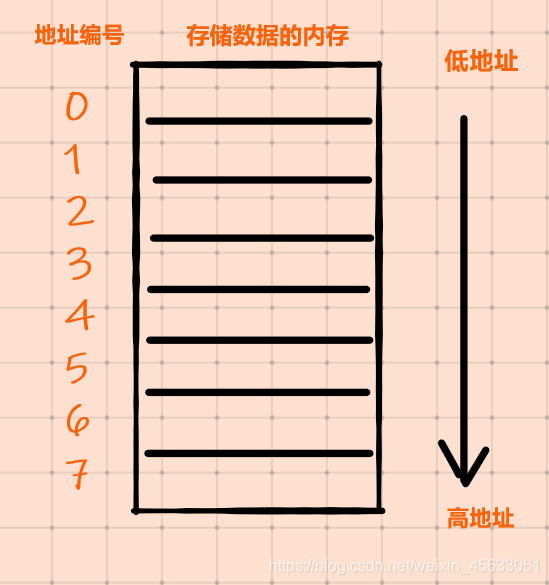
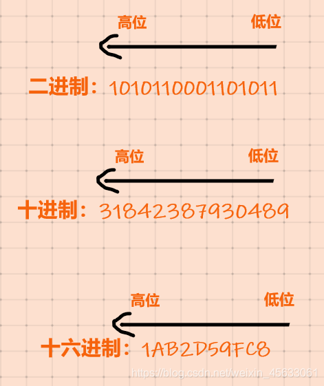

# 计算机组成原理

### X86和X64机

**x86 的 86 指的是 8086 微体系结构系列 CPU，x64 的 64 才是指“位”这个概念**

X86位数是32位，总线长度一般也是32位，X64位数是64位，总线长度一般也是64位

地址总线32 位支持的内存是 2＾32 Byte，也就是最大只支持 4 GB 内存。而64位支持 2＾64 Byte，也就是 17179869184G = 16777216TB内存

32位标识一个地址为32位，大小为4B，64位为8B，所以指针大小为8B

> 对于64位
>
> 1. **处理器寄存器的位数**：64位系统指的是处理器寄存器的数据宽度为64位。这意味着处理器可以一次性处理64位宽度的数据，提高了数据处理的效率。
> 2. **地址总线的宽度**：虽然像我之前所提到的，地址总线的宽度不一定会严格等于64位（有时可能会更大），但是64位系统通常以处理器的寄存器位数为基准。通过使用64位寄存器，系统可以更高效地表示和处理更大范围的内存地址。
> 3. **数据总线的位宽**：64位系统中，数据总线通常是64位，这意味着处理器可以一次性传输64位宽度的数据到内存或者其他设备中。
>
> 综上所述，64位系统中的“64位”主要以处理器寄存器的位宽和数据总线的宽度为依据，表示系统的数据处理和寻址能力相对于32位系统有了明显的提升

地址总线宽度决定了CPU可以访问的物理地址空间

数据总线负责整个系统的数据流量的大小，而数据总线宽度则决定了CPU与二级高速缓存、内存以及输入/输出设备之间一次数据传输的信息量。

### 计算机总线、宽度、位数、字长等关系

### 大端小端

小端：数据的低位放在低地址空间，数据的高位放在高地址空间

大端：数据的低位放在高地址空间，数据的高位放在低地址空间

### 内存对齐

C++类的内存对齐是为了优化内存访问效率和提高数据存取速度，特别是在涉及到结构体或类成员变量类型不同时。内存对齐可以保证数据在内存中的对齐方式，使得 CPU 可以快速地访问内存，提高程序的运行效率。

在C++中，编译器会根据数据类型自动进行内存对齐。对于一个类对象，如果成员变量是按照声明顺序依次存储的，那么其内存布局也会按照声明顺序进行排列。但是，为了保证内存对齐，编译器可能会在成员变量之间填充空白区域，从而使得每个成员变量都按照一定的字节对齐。

内存对齐的方式和字节数是由编译器和操作系统决定的，并且可能会因为不同的编译器、不同的编译选项和不同的平台而有所不同。例如，一般情况下，x86架构的CPU对于基本数据类型的内存对齐要求为4字节，而对于SSE指令集要求对齐到16字节。此外，一些编译器还提供了指定对齐字节数的选项。