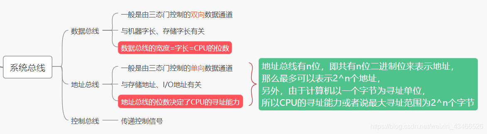

## 1.计算机系统概述

### 1. 计算机发展历程

### 2. 计算机系统的组成

- 冯诺依曼体系结构：以运算器为核心

- 冯诺依曼体系结构的特点

- 现在计算机体系结构：以内存为核心

- CPU，主机，外设

### 3. 存储器

- 主存储器由存储体，MAR，MDR组成
- 和右边的图进行类比，MAR存储CPU想要获取数据的地址，在存储体中找到后放在MDR中，CPU从MDR中把数据取走。

- 存储体是由一个个存储单元组成的

- ==存储字：存储单元中二进制代码的集合==

- ==存储字长：存储单元中二进制代码的位数==

  

### 4. 运算器

### 5. 控制器

### 6. 计算机的工作过程（重点）

- 程序被编译成二进制存储在主存中

>工作过程

- （MAR）：表示MAR里边的值为0

- M(MAR) ：主存储器所指向的存储单元里边的值
- OP（IR）：取操作码
- Ad（IR）：取地址码

### 7. 计算机的层次结构

- 注意编译程序和解释程序的区别

编译程序:将高级语言编写的源程序全部语句一次全部翻译成机器语言程序，而后再执行机器语言程序（只需翻译一次)

解释程序将源程序的一条语句翻译成对应于机器语言的语句，并立即执行。紧接着再翻译下一句(每次执行都要翻译)

### 8. 计算机的性能指标

#### 1. 存储器

#### 2. CPU

#### 3.系统整体的性能指标

#### 4. 思考

## 2. 数据的表示和运算

### 1. 数制与编码

#### 1.进位计数制

- 其他进制转十进制

- 二进制<——> 八进制，十六进制  (注意：小数部分也是从右往左算)

- 十进制——>任意进制（整数部分）

- 十进制——>任意进制（小数部分）

- 十进制转二进制（拼凑法，适用于十进制数不是很大的情况）

- 真值和机器数

#### 2.BCD码

- 概念

- 8421码

- 8421码相加

1. 可以转换成十进制相加后，再转换成8421码
2. 机算方法：不在范围内，加6。如图所示

- 其他表示方式

#### 3. 字符与字符串

- ASCII码

- 汉字的表示和编码

- 字符串的表示形式

- 知识回顾

#### 4.奇偶校验码

- 校验原理

- 奇偶校验码

- 硬件实现

#### 5.海明码

- 设计思想

- 求解步骤

- 全校验

1. 海明码只能纠错一位（一个数据传错时，可以纠正）
2. 可以检错两位

#### 6. 循环冗余校验码（CRC码）

- 基本思想

- 例题

[外链图片转存失败,源站可能有防盗链机制,建议将图片保存下来直接上传(img-TxXHrXvO-1644306008648)(C:\Users\86155\AppData\Roaming\Typora\typora-user-images\image-20220126201152982.png)]

- CRC校验码计算过程

#### 7. 定点数的表示

- 定点数和浮点数的概念

- 无符号数

- 原码

- 反码

- 补码(高频考点)

- 移码

- 技巧

- 补码的作用（注意：==执行加法运算时，符号位一起参加运算==）

#### 8. 移位运算

- 原码的算数移位

- 反码的算数移位

- 补码的算数移位

- 总结

- 逻辑移位

#### 9. 溢出判断

#### 10. 符号扩展

### 2. 运算方法和运算电路

#### 1. 电路的基本原理

- 基本的逻辑运算

- 复合逻辑

#### 2. 原码乘法运算

- 机器实现（视频 P18节）

#### 3. 补码乘法运算

- 机器实现

- 手算步骤

#### 4. 原码除法运算

- 机器运算过程

- 恢复余数法

- 加减交替法

#### 5. 补码除法运算

#### 6. 强制类型转换

#### 7. 数据的存储和排列

##### 1. 大小端模式

##### 2. 边界对齐

### 3. 浮点数表示和运算

#### 1. 浮点数的表示

- 浮点数的表示

- 尾数的规格化

#### 2. IEEE 754 浮点数标准

- 标准

- 示例（十进制转换为浮点数）

- 示例（浮点数转换为十进制数）

- 单精度浮点数表示的最大值，最小值

- 特殊数值 

#### 3. 浮点数的运算

- 和十进制的科学计数法进行类比

- 浮点数加减法（P26）

- 舍入

- 强制类型转换

## 3. 存储系统

### 1. 存储器基本概念

#### 1. 存储器的分类

#### 2. 性能指标

数据的宽度：在一个存储周期中存储的位数

#### 3. 层次化结构

### 2. 主存储器

#### 1. 主存简单模型和寻址概念

- 存储器芯片的基本结构

- 寻址

#### 2. 随机存储器RAM

##### 1. SRAM和DRAM

##### 2. DRAM的刷新

#### 3. 只读存储器ROM

- 为什么需要ROM？

因为RAM里面的数据容易丢失,用来存储bios开机引导程序。

#### 4. 双端口RAM和多模块存储器

##### 1. 双端口RAM

##### 2. 多模块存储器

- 高位交叉编址和低位交叉编址

- 流水线问题

### 3. 主存与CPU的连接

#### 1. 连接原理

- CS：片选线（决定主存是否工作）这种写法是高电平有效
- WE：读写控制线
- A0~A13：地址线，选择某一个单元
- D0~D7：数据线 ，数据线同时传输数据

#### 2. 容量扩展

##### 1. 位扩展

> 即直接增加数据线，同时传输的位变多

##### 2. 字扩展

> 增加地址线，地址线使用**译码器**选择增加的地址线从而选到增加的那块芯片
>
> 比如增加两条地址线，那就用到二路译码器，可以选择4个芯片其中一个

- 译码器

- 线选法和译码线选法的区别

##### 3. 字位同时扩展

> 即同时增加数据线和地址线

##### 4. 例题

- 分析

- 图解

### 4. 高速缓存寄存器

#### 1. 局部性原理及性能分析

##### 1. 局部性原理

> 空间局部性和时间局部性

##### 2. 性能分析

- 例题（蓝色字体为答案）

#### 2. Cache 地址映射

##### 1. Cache的工作原理

##### 2. 全相连映射

##### 3. 直接映射

##### 4. 组相连映射

##### 5. cache替换算法及写策略

###### 1. 替换算法

LRU侧重于近期表现，LFU侧重于全局表现

- 例题

###### 2. 命中时的写策略

1. 写回法

2. 全写法

###### 3. 未命中时的写策略

1. 写分配法

2. 非写分配法

### 5. 虚拟存储器

> 页表是方便逻辑地址找物理地址
>
> cache是方便从物理地址取数据的

##### 1. 概念

##### 2. 页式虚拟存储器

##### 3. 段式虚拟存储器

##### 4. 段页式虚拟存储器

##### 5. 快表

## 4. 指令系统

### 1. 指令格式

##### 1. 指令的含义

##### 2. 指令的格式

###### 1. 操作码

- 指令操作码

- 操作类型

###### 2. 地址码

##### 3. 扩展操作码

- 扩展操作码的规范

### 2. 指令寻址方式

#### 1. 数据存放形式

#### 2. 指令寻址

即指令的寻址方式，分为两种

1. 顺序执行指令，pc自动加1

2. 跳转执行指令，根据指令后面的地址，将pc内容改为该指令地址

   > 一般是jmp或者call指令，即if条件判断、while循环、函数调用等需要跳转指令

#### 3.数据寻址

> 确定本条指令的操作数地址，可以是跳转/转移指令的操作数地址(相对寻址)，对应上面的跳跃寻址

##### 1. 操作数类型

##### 2. 数据基本寻址方式

寻址特征：采用哪一种方式进行寻址

> **通过寻址特征和形式地址求出有效地址**

###### 1. 立即寻址

###### 2. 直接寻址

###### 3. 间接寻址

###### 4. 寄存器寻址

###### 5. 寄存器间接寻址

###### 6. 隐含寻址

###### 7. 总结

##### 3. 数据偏移寻址

###### 1. 基址寻址

> 多道程序，进程切换？

###### 2. 变址寻址

> 适合数组访问和循环

###### 3. 相对寻址

> 用于找到指令的地址，然后跳转指令

> 相对寻址举例

###### 4. 总结

##### 4. 数据堆栈寻址

> 通过栈底指针访问压栈的参数和局部变量的值

### 3.CISC和RISC

#### 1. 基本含义

#### 2. 比较

## 5. 中央处理器        

### 1. CPU功能和基本结构

#### 1. CPU的功能

#### 2. 运算器和控制器的功能

#### 3. 运算器的基本结构

#### 4. 控制器的基本结构

#### 5. CPU的基本结构

### 2. 指令执行过程

#### 1. 指令周期

- 指令周期流程

#### 2. 取指周期

> 取指令

#### 3. 间址周期

> 取操作数地址

#### 4. 执行周期

> 即取操作数并根据控制器对指令op译码的信号执行操作

#### 5. 中断周期

> 指令结束后检查是否有中断信号
>
> 异常在每个周期结束后，而中断在一条指令结束后

#### 6. 指令执行方案

### 3. 数据通路功能和结构

#### 1. CPU内部单总线通路

##### 1. 什么是数据通路

##### 2. CPU内部单总线方式

在介绍这个之前，首先区别一下系统总线和内部总线。

**内部总线**是指同一部件，如CPU内部连接各寄存器及运算部件之间的总线;

**系统总线**是指同一台计算机系统的各部件，如CPU、内存、通道和各类l/o接口间互相连接的总线。

##### 3. 例题

> 取指周期

> 间址周期

> 执行周期

#### 2. CPU内部双总线通路

> 逻辑是一样的

#### 3. 专用数据通路

>  取指周期的过程

- 例题

> 第一问

> 第二问

> 第三问

> 第四问

> 第五问

> 第六问

### 4. 控制器功能和原理

#### 1. 硬布线控制器

##### 1. 控制器的结构和功能

##### 2. 控制单元的输入和输出

##### 3. CPU的控制方式

#### 2. 微程序控制器

##### 1. 控制器的设计思路

##### 2. 微程序的基本思想

##### 3. 微程序控制器的基本结构

##### 4. 控制存储器

##### 5. 微指令的格式

##### 6. 微指令的编码方式

##### 7. 微指令的地址形成方式

前两种理解，后四种了解（不重要） 

- 下地址方式例题

- 一些易混淆的概念

**指令=微程序**

**微程序由多个微指令组成**

**微指令由多个微命令组成**

**微命令是微操作的控制信号**

**微操作是微命令的执行过程**

### 5. 指令流水线

#### 1. 指令流水的概念

##### 1. 指令流水线的定义

##### 2. 流水线的表示方法

#### 2. 流水线的性能指标

1. 吞吐率

2. 加速比

3. 效率

#### 3. 流水线的基本实现

> RISC的5段流水线的数据通路

#### 4. 流水线的冒险与处理

##### 1. 结构相关

##### 2. 数据相关

- 例题

- 数据相关的一些概念

RAW（read after write）：写后读

另外两个同上

##### 3. 控制相关

##### 4. 总结

#### 5. 高级流水线技术

##### 1. 超标量技术

##### 2. 超流水技术

##### 3. 超长指令字

### 6. 多处理器

#### 1. 硬件多线程

单核单cpu中加快线程切换--为每个线程提供单独的通用寄存器组

#### 2. 多核cpu

多个处理单元集成到一个cpu中，多个核心处理器通过cpu内部总线通信

#### 3. 单核多处理器

每个cpu单核，且所有cpu共享同一物理地址，多个cpu之间通过系统总线通信，所以速度比多核cpu慢

## 6. 总线

### 1. 总线的概念

#### 1. 总线的特点

#### 2. 总线特性

### 2. 总线的分类

#### 1. 按数据传输格式

#### 2. 按总线功能

##### 系统总线的结构

1. 单总线结构

2. 双总线结构

3. 三总线结构

### 3. 总线性能指标

- 带宽例题

- 上节遗留问题：串行总线和并行总线哪个速度更快

- 总结

### 4. 总线仲裁

#### 1. 基本特点

#### 2. 集中仲裁方式

1. 链式查询方式

2. 计数器查询方式

3. 独立请求方式

- 三种方式总结

#### 3. 分布仲裁方式

### 5. 总线操作和定时

- 总线传输的四个阶段

#### 1. 同步定时方式

#### 2. 异步定时方式

- 例题（数据传输率）

#### 3. 半同步通信（扩展）

#### 4. 分离式通信（拓展）

### 6. 总线标准

- 基本特点

## 7. 输入输出系统

### 1. IO系统的演变

### 2. 输入输出设备

- 显示器

### 3. 外存储器

#### 1. 磁盘设备的组成

#### 2. 性能指标

#### 3. 存取时间计算过程

#### 4. 磁盘地址和磁盘的工作过程

### 4. IO接口

> 也叫IO控制器

#### 1. 功能

#### 2. 基本结构

#### 3. 接口与端口

#### 4. IO端口及其编址

#### 5. IO接口的类型

### 5. 异常与中断

#### 1. 基本概念

#### 2. 中断的分类

#### 3. 中断请求标记

#### 4. 中断判优

#### 5. 优先级设置

#### 6. 中断处理过程

#### 7. 中断隐指令

#### 8. 中断服务程序

#### 9. 单重中断和多重中断

#### 10. 中断屏蔽技术

- 中断屏蔽技术 例题（重要，需掌握）

### 6. IO实现方式

#### 1. 程序查询方式

##### 1. 程序查询方式流程图

##### 2. 接口结构

- 例题

- 总结

#### 2. 程序中断方式

恢复现场即算做下一次启动

- 例题 第一问

- 例题 第二问 （重要）

CPI：执行一条指令所需要的时钟周期

#### 3. DMA方式

##### 1. DMA 控制器

##### 2. DMA结构

##### 3. DMA传送方式

##### 4. DMA方式的特点

##### 5. DMA方式与中断方式对比

##### 6. CPU占用情况 

- 中断方式

- DMA方式

##### 7. 总结

# 补充

### X86和X64机

**x86 的 86 指的是 8086 微体系结构系列 CPU，x64 的 64 才是指“位”这个概念**

X86位数是32位，总线长度一般也是32位，X64位数是64位，总线长度一般也是64位

地址总线32 位支持的内存是 2＾32 Byte，也就是最大只支持 4 GB 内存。而64位支持 2＾64 Byte，也就是 17179869184G = 16777216TB内存

32位标识一个地址为32位，大小为4B，64位为8B，所以指针大小为8B

> 对于64位
>
> 1. **处理器寄存器的位数**：64位系统指的是处理器寄存器的数据宽度为64位。这意味着处理器可以一次性处理64位宽度的数据，提高了数据处理的效率。
> 2. **地址总线的宽度**：虽然像我之前所提到的，地址总线的宽度不一定会严格等于64位（有时可能会更大），但是64位系统通常以处理器的寄存器位数为基准。通过使用64位寄存器，系统可以更高效地表示和处理更大范围的内存地址。
> 3. **数据总线的位宽**：64位系统中，数据总线通常是64位，这意味着处理器可以一次性传输64位宽度的数据到内存或者其他设备中。
>
> 综上所述，64位系统中的“64位”主要以处理器寄存器的位宽和数据总线的宽度为依据，表示系统的数据处理和寻址能力相对于32位系统有了明显的提升

地址总线宽度决定了CPU可以访问的物理地址空间

数据总线负责整个系统的数据流量的大小，而数据总线宽度则决定了CPU与二级高速缓存、内存以及输入/输出设备之间一次数据传输的信息量。

