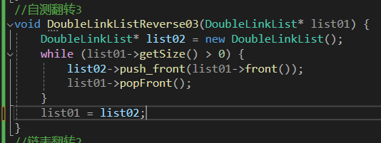
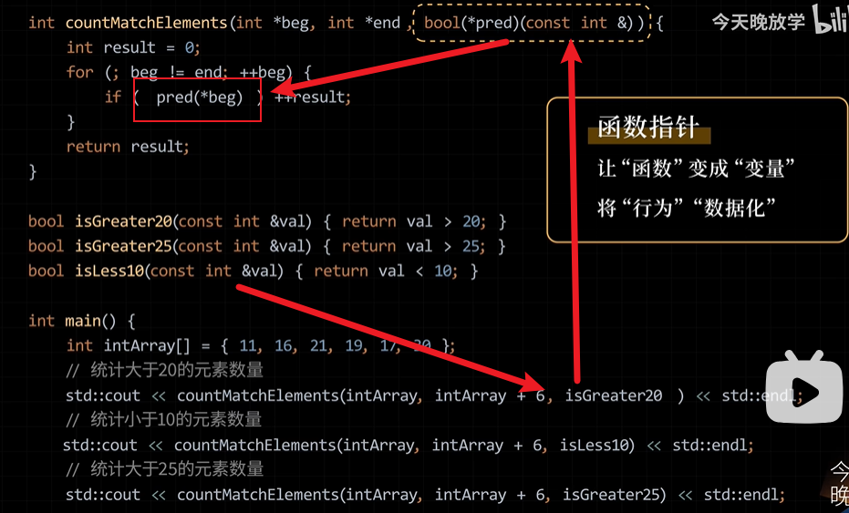
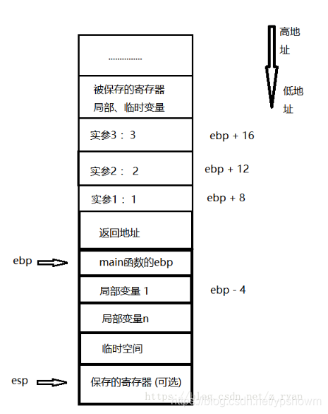
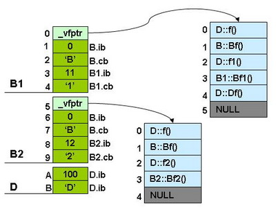
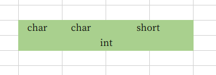

## C++是如何工作的


1. **编译阶段**：程序员编写完成的c++代码为.cpp文件也称为源文件，通过编译器转为汇编语言，再通过汇编器将汇编语言转为二进制文件(obj文件)也就是机器语言代码；cpu可以直接识别并执行机器语言，这些机器语言代码对于cpu来说就是一条条指令。

   > 在一般的ide中，编译阶段通常包含了编译器和汇编器的过程，因此，生成的目标文件中包含了编译和汇编的结果。

   .

2. **链接阶段**：一个项目只有一个main方法，主方法需要调用的其他函数将会被链接器链接到指定位置，包括把链接需要使用到的库文件。构建build则最终生成.exe执行文件。


---

### 1. 编译器compiling原理

- **编译器实际做的就是将源文件输出一个目标obj文件，包含机器代码和我们定义的任何其他常量数据**

- 编译器接收到源文件、正式编译之前第一件事就是**预处理所有的预处理器和内联函数**，然后删除注释，等等

- 编译整个项目时，**编译器会编译每个`cpp`文件**，每个`cpp`文件都对应一个翻译单元;其他`.h`头文件等不会被编译

- 编译器会**将每个翻译单元分别编译成目标文件（`.o` 文件或者 `.obj` 文件**），然后通过连接器（linker）将这些目标文件链接在一起，生成最终的可执行文件。

  

#### 1.1 预处理器

- **所有`#`开头的都是预处理器**

```c++
//导入头文件
#include<iostream>
//定义宏常量
#define Pai 3.14
//判断执行
#if
```

- 对于导入头文件的预处理器：编译器将会把目标头文件的所有内容复制粘贴到include所在的位置
- 对于定义宏常量：编译器会把本cpp文件里面所有名为Pai位置的换为3.14


#### 1.2 内联函数

- `incline`内联函数：**编译阶段时，编译器可以选择将函数的代码插入到每次调用该函数的地方，在调用处直接展开函数代码，而不是通过正常的函数调用机制来执行函数**


---

### 2. 链接器linker原理

- **链接器主要作用从不同的地方链接主函数和调用函数，让主函数可以找到调用函数**；

- 被调用函数可以跟主函数在同一个`cpp`文件，可以单独在一个`cpp`文件、也可以是`lib`库文件

- 经典错误“链接器未找到链接目标”，可能是函数未在`mian`前面声明，也可能函数名错误找不到

- 项目右键`build`，将会对项目进行编译和链接，把编译阶段产生的`obj`文件链接到一起，组成`.exe`执行文件

  

#### 2.1 静态函数

- `static` 静态函数：它的链接属性变为**内部链接**（internal linkage），意味着**该函数只能在当前编译单元（即当前源文件）内被调用，而无法被其他编译单元访问**。即如果在当前cpp注释调用静态函数的那一句，链接器将不会链接该静态函数，反之，如果是普通函数，链接器会认为其他cpp文件也可能需要调用该文件，所以即使注释，如果没有链接该函数的位置将会报错

  > - **内部链接（internal linkage）**：在 C++ 中，当一个变量或者函数被声明为 `static` 时，意味着它具有内部链接。这意味着该变量或函数只在当前文件内可见，并且不会被其他文件访问到。多个文件中可以存在同名的静态变量或函数，它们不会发生冲突，因为它们位于不同的文件内。
  > - **外部链接（external linkage）**：相反，外部链接意味着变量或者函数在不同文件之间是可见的和可访问的。全局变量和普通的函数具有外部链接，它们可以在不同的文件中被引用和访问。

- `extern`关键字：有助于在多个源文件之间共享变量和函数，增强了程序的模块化和可维护性
  1. 声明外部变量：当一个变量在多个源文件中使用，且在一个源文件中定义，在其他源文件中需要使用时，可以在其他源文件中使用 `extern` 关键字声明该变量，以告诉编译器该变量是在其他地方定义的
  2. 声明外部函数：对于在其他源文件中实现的函数，可以在当前源文件中使用 `extern` 关键字声明该函数，以便在当前文件中调用
  
  ```c++
  // file1.cpp
  int globalVar = 42; // 定义一个全局变量
  
  // file2.cpp
  extern int globalVar; // 声明这个变量来自于另一个文件
  
  void someFunction() {
      globalVar = 100; // 使用外部定义的变量
  }
  ```
  
  

#### 2.2 关于头文件

​	如果头文件写函数主体，则如果有两个cpp文件都`include`了该头文件，则在整个项目中会有两个重名函数体，**链接时**将会报错

- 解决1：**头文件里面的函数体声明为static类型**，则cpp文件调用后只在自己的文件中生效，链接器就不管了
- 解决2：**头文件里面的函数体声明为inline类型**，编译器预处理头文件的时候，直接把函数带入到目的位置，不再进行函数调用，堆栈调用的情况。
- 解决3： **头文件只声明函数**，把声明的函数体放入到另一个cpp文件中(类似于lib库的原理)。则每个文件`include`的只是函数声明，链接函数时不会冲突。


### 3. 加载器loader

#### 3.1 为什么要使用加载器

​	在编译和链接过程中，当定义一个变量时，编译器将为该变量分配一个相对地址，这通常是一个偏移量，相对于数据段或堆栈的基址来计算的。当程序执行时，这些相对地址需要被转换成真实的绝对地址，以便正确地访问数据。

#### 3.2 装入-转换绝对地址

​	转换相对地址到绝对地址的过程通常在**程序加载时**进行。**操作系统的加载器（Loader）负责将程序装入内存，并处理地址的重定位**。在这个过程中，相对地址会根据程序的实际加载位置和内存布局转换为绝对地址。

​	这个转换的过程包括**使用重定位表（Relocation Table）来更新程序中的所有相对地址**，使它们能够正确地指向新的绝对地址。这意味着在程序加载时，一些偏移量需要被加到基址上，从而得到实际的内存地址。

> 详见操作系统->页表->段表->虚页表

#### 3.3 加载内存区

​	**程序是一个整体，即使分为了数据段和代码段，但是还是在一个代码中。当存放到内存时，系统给一个程序分配一块“连续的”内存(注意连续存储就是连续的，非连续存储如页式就不是连续的)，来存放程序的代码和数据以及运行时内存的分配。**


## C++语言基础

### 1.  数据类型


#### 1.1 基本数据类型

##### 1. 字符型

- 字符型可以赋给其单个字符，也可以赋128以内的数字，编译器会自动根据ASCII码解释对应字符

```c++
char	//大小为一个字节，编译器解释通过ASCII码
/*
1. 0-9 ： 48-57
2. A-Z ： 65-90
3. a-z ：97-122
4. a-A = 32 
*/
```

##### 2. 整型

- 对于整型数据类型，不同类型的变量根本区别是给该类型的变量分配多少内存
- 整型类型都占用1位的符号位，类型名前面加`unsigned`变为无符号数，此时不占用符号位
- `2 <= short <= int <= long`

```c++
char	  //大小为一个字节，也是字符类型，编译器解释通过ASCII码
short	  //大小为2个字节
int		  //大小为4个字节，32位，一位符号位，表示的范围为正负2的31次方，大约10的9次方以内
long 	  //大小为4个字节
long long //大小为8个字节，正负2的63次方以内，精确值为10的18次方以内，如果赋大于2的31次方-1的初值，则需要在初值后面加上LL；
```

##### 3. 浮点型

- `float`定义的类型默认也是`double`，此时需要在值后面加上`f`表示其为`float`类型

```c++
float f1 = 5.3f;		//4B,32bit, 1符号位，8指数位，23尾数位，范围为正负2的128次方，精度只有6-7位（2的23次方）
double f2 = 5.3;		//8B,64bit, 1符号位，11指数位，52尾数位，范围为正负2的1024次方，精度有15-16位(2的52次方)
```

> 1. 常浮点数默认是double类型的，当5.3赋值给A时，存在`(double)5.3 --> float a` 的强制转换，当数据较小时，结果一般不会出现错误，**<u>当数据较大时，若将右值赋值给左值时产生溢出</u>**，结果就会出现非预期值，所以在书写时，最好在常量的末尾加后缀进行严格的限制。
> 2. 虽然浮点数范围为2的128次方，但是精度只有6-7位，所以存放一个数据到浮点数的时候，如果超过了精度范围将会做舍入或者截断处理。

##### 4. bool类型

- c++中没有true和false的概念，所以系统会把非0的数输出1，值为0的数输出0；

- 只占一位，但是因为计算机按字节寻址，所以占用一个字节；所以只要这8位不为0，都将返回1(true)

```c++
bool b = true;		//等价于bool b = 1;
```


##### 5. 求数据类型大小

- `sizeof(类型名)` ,返回占用的字节数

```c++
cout << sizeof(int) << endl;	//输出4
```


#### 1.2 全局变量

定义在头文件下，函数体外的变量就是全局变量，函数任何地方(整个项目内)都能访问的到


#### 1.3 静态变量static

##### 1. 全局static

- **类外(全局)**声明的`static`变量或者函数只会在定义它的翻译单元内可见，链接器链接时候只会在本翻译单元内查找

  ```c++
  //内部链接
  //cpp1
  static int tetschar = 5;	
  //cpp2
  int testchar = 6;
  int main{ cout << testchar << endl;}  //当前翻译单元只能查找到本testchar，cpp1中的静态只能适用于cpp1
  ```

  ```c++
  //外部链接---全局变量或者函数默认是external外部链接
  //cpp1
  int tetschar = 5;	
  //cpp2
  int testchar = 6;
  int main{ cout << testchar << endl;}  //会冲突
  ```


##### 2. 类内static

分为静态成员变量和静态成员函数，都属于这个类，程序运行时就随着类的创建而创建，结束时随着类的销毁而销毁

##### 3. 局部static

1. 改变变量的生命周期：局部静态变量的生命周期延长到程序的生命周期，即只会初始化一次，**当程序结束时才会释放**
2. 改变变量的作用域：**该变量只在定义它的函数内部可见，但是在该函数每次被调用时，并不会重新初始化，而是保留上一次调用结束时的值**。

> 全局变量和静态变量存储在全局数据区，可读可写
>
> 常量存储在常量区，只可读，不可写。


#### 1.4 常量

##### 1. 符号常量

- **宏**定义常量(符号常量)：在编译预处理阶段的时候，在那个位置直接替换

```c++
#define pi 3.14			//符号常量：
```

##### 2. const常量

==定义==

- `const`修饰变量或者函数本质上就是你给编译器的一个承诺，不会修改这个变量/函数的值

- `const`常量：在编译的时候，任何使用到该常量的位置会从常量区复制一份

```c++
const double p1 = 3.14; //const常量，注意const后面要加分号
```


==打破常量==

- 打破承诺的一种方式，获取到它的地址，通过另一个变量修改，不推荐

  


==作用==

- 用处1：常量指针，`const int* a`等同于`int const* a`则指针指向的值不可修改，适用于解决上面的方案

- 用处2：指针常量，`int* const a`则地址(a)不可修改,而值可以修改

- 用处3：在函数名后面加上`const`，只在类里面有用，不会修改(可以访问)类的普通成员变量和函数；所以当一个函数参数为对象的常引用时，之只能调用它的const方法，因为非const函数无法确保该函数不修改该对象的值

  

  >  如果常函数想要修改类成员变量的话，在变量名前面机上`mutable`关键字，声明其可以修改，对类没影响


##### 3. 字符串常量

```c++
string s = "abcdefg";	//"abcdefg"即字符串常量，类型为const char[8]
//其他int、double、char、bool都是变量，值都为数字，直接给值，不需要常量存储，而字符串需要一串连续存储的空间
```

```c++
char a[] = "abcdef";		//正确写法1，复制数据
//	char* a = "abcdef";  会报编译语法错误
const char* a = "abcdef";	//正确写法2，复制地址
//  a[3] = g ;		错误，常量区不可修改(在2的情况下)
```

> “abcdef”属于字符串常量，存储在只读的内存区域
>
> - `char a[] = "abcdef";` 中的 `a` 是一个字符数组，会在栈上分配足够的空间来存储字符串 "abcdef" 的副本
>
> - `const char* a = "abcdef";`中的 `a` 是一个指向字符常量的指针，存储的是字符串 "abcdef" 的地址。只读的，所以需要加const


##### 4. 枚举常量

```c++
enum Color {RED,GREEN,BLUE};       //默认RED=0,GREEN=1,BLUE=2
```


##### 5. const在C和C++中区别

- `const`类型必须初始化

- 在C语言中 `const`修饰变量，变量还是变量只是加了一个只读性，不过可以通过指针进行修改


- 在C++语言中 `const`将变量改变性质为常量,编译器是直接将变量的值和变量的符号对应起来一起存到符号表中不可修改


##### 6. const和define区别

[深入理解C++中的常量和宏：const、#define、typedef和inline详解-CSDN博客](https://blog.csdn.net/m0_72877724/article/details/139596046)

1. 编译器处理方式不同

   define --> 在<u>预处理阶段</u>进行**替换**

   const --> 在<u>编译阶段</u>确定其值

2. 类型检查

   define --> <u>无类型</u>，不进行类型安全检查，可能会产生错误

   const --> <u>有数据类型</u>，编译时会检查

3. 内存空间

   define --> <u>不分配内存，给出的是立即数，用了多少次就进行多少次替换</u>，占用代码段内存

   const --> 存储在只读<u>数据段</u>，编译期最初将其保存在符号表中，第一次使用时为其分配内存(<u>全局常量存储在全局区，局部常量存储在栈中</u>)，在程序结束时释放


---

### 2. 顺序

- 常用math函数


```c++
fabs()       //参数为浮点型，返回绝对值
pow(r，p)	//参数为浮点型，含义为r的p次方
sqrt()		//参数为浮点型，返回算数平方根
```

- 输入输出

```c++
//读单个字符
getchar()
//不可读空格,空格或者回车作为结束符
scanf()
cin

//读一行，分别为C语言、C++、C++string的三种使用方式，可读空格，回车作为结束符
gets()
cin.getline(str,100)
getline(cin,str)
```

```c++
//输出
cout\printf\puts()
%md//右对齐，不足m位的用空格补足
%0md//右对齐，不足m位的用0补足
%.mf//保留m位小数输出
```

- 关于scanf中什么时候要加取地址符号&的分析

```c++
//如果其本身就是一个地址，则不需要加取地址符号来声明地址
int* p  = &a; scanf(“%d”,p)   	//如果其是一个指针
char str[100]; scanf(“%s”,str)  //数组名就是这个数组的首地址，由于基本数据类型的数组只有char数组

//可以使用首地址加偏移量，也可以使用具体的位置
int a[10]; 
scanf(“%d”,a+i) 
scanf(“%d”,&a[i])  
```

- 一些转义字符


- `'\t'` ：制表符`\t`是C++的转义符，相当于键盘上按下TAB键之间的距离，一般为8个空格
- `'\n'` ：回车，光标移动到下一行初试位置


---

### 3. 选择

#### 1. 选择分支的底层逻辑

1. **基本上程序运行时，该程序的所有应用及模块都加载在内存中，所以<u>构成程序的机器指令都存储在内存中</u>；所以判断选择条件，机器指令会通过加上一个偏移量到达需要执行的机器指令位置**

2. `==`比较运算符，如果相等返回true，不相等返回false，不一定只能在if()中使用

  ```c++
  bool flag = a==b;
  if(flag){}				//一般不使用这种，太麻烦
  ```

3. **用汇编代码解释选择-跳转**

  - 只有一个数(指针也可以,指针为空也是0)，处理器会比较该数和0的结果，同样该数与0的补码做加法，查看标志位，是否为0。

    ```c++
    if(n) 	//n等于0为假，n不等于0为真
    ```

  - 两个数的比较的本质上就是比较两块内存的数值；比较两块寄存器的值，数`a`加上数`(-b)`的补码，比较其`ZF,SF`等标志位(存放在状态寄存器)，根据这些标志位的值判断是否满足条件。然后选择分支后将当前的`pc+1`再加上偏移量(用补码表示)跳转到目的指令处。

    ```c++
    if(a>b)	//a的补码加上(-b)的补码，判断0标志位是否为0，为0即相等;如果结果为正数则说明a>b，反之说明a<b
    ```

4. 实际上没有`else if`这个关键字

  ```c++
  if(flag){}
  else{
  	if(flag2){}			//简化为else if(){}
  }
  else{}
  ```

  

#### 2. 两种分支条件

- `if else`

  ```c++
  return (a>b) //如果满足返回1，为假不满足0
  if(n) 		 //就等于if(n!=0) 如果n=0，则相当于为假，n不为0时，相当于真
  if(!n) 		 //就等于if(n==0) 如果n=0，为真，n!=0为假
  ```

- `switch case`

  ```c++
  //switch后面的条件只能是整数、字符、枚举类型
  //case后面只能是常量，要与break配合使用
  //default不匹配时执行
  switch (flag) {
  case -1 :
  	cout << "不需要纳税" << endl;
  	break;
  case 0 :
  	tax = (cash - 5000) * 0.05;
  	cout << "需要纳税：" << tax << endl;
  	break;
  default: //匹配失败时执行
  	tax = (cash - 10000) * 0.2;
  	cout << "需要纳税：" << tax << endl;
  	break;
  }
  ```


#### 3. 三元运算符

- 语法

```c++
s_speed = s_level>5 ? 10 : 5;
//等价于
if(s_level>5) s_speed = 10;
else s_speed = 5;
```

- 三元运算符的嵌套，一般不推荐使用


---

### 4. 循环

#### 1. 循环的底层逻辑

- 同选择分支的底层逻辑一样，只是判断条件之后会跳回到循环体的位置去


#### 2. 三种循环


- **循环条件的初始化语句、条件语句、循环后的操作语句可以是任何类型的任何语句，不局限于某一种格式**
- **`for`循环条件的三个参数用分号分隔，都可以省略不写，在其他位置定义**

- **`for`循环和`while`没有本质的区别，功能相同，约定如果已存在某个条件不需要重新定义变量(i)可以使用while**
- **`while`和`do while`的区别在于`do while`无论条件如何至少执行一次**


#### 3. 控制流语句

***break、continue、return***

- `break`：**跳出循环，不再执行循环，执行循环后的语句**
- `continue`：**跳出本次循环，直接开始下一次的循环**
- `return`：**跳出本函数的栈，返回到之前函数的栈顶指针**


---

### 5. 数组

#### 1. 数组的底层逻辑

1. 数组其实就是指针指向的一片连续空间，下标就是对数组头的偏移量(计组中计算内存偏移量、`cache`就用到数组)，下标是几，就这个类型的内存大小乘以几再加上首地址

   ```c++
   //数组其实就是个指针   
   int example[5];
   int* ptr = example;	
   int* ptr2 = new another[5];	//根据生命周期的不同还可以在堆上创建
   //example[2] = *(ptr+2) 指针偏离2x4B
   example[2] =5;	
   *(ptr+2) = 5;
   //指针加减是根据指针的类型来的,下面把int指针转为char，偏离1X8B,实际上就是example[2]的位置
   *(int*)((char*)ptr + 8) = 6;
   ```

2. 不建议使用堆，堆创建的内存会导致程序运行时来回从栈跳到堆，影响性能；而且使用堆创建的数组返回的是一个指针，无法计算出该数组的大小

   ```c++
   int a[5];
   int count = sizeof(a)/sizeof(int);	//5
   int* example = new int[5];
   int count = sizeof(example)/sizeof(int);	//会报错，实际上sizeof(example)返回指针大小8B
   ```

3. 类的对象实质上也是连续存储的，创建实例会分配一个所有成员变量大小的内存，类的函数所有实例共用一个(共享一块内存)。


4. 自己维护数组(原始数组)和使用STL容器`array`(标准数组c++11)维护数组


5. for循环遍历时,尽量用小于或者不等于，不用小于等于；因为小于等于会执行小于和等于两种判断，性能会有影响


#### 2. 字符数组的底层逻辑

1. 字符数组使用`char`指针的定义，为确保不会改变，一般要加上const，因为指针直接指向了存放字符串常量的地址，在常量区。如果是数组名定义，则会在当前栈中创建指针，把字符串常量的值传入栈中；

   ```c++
   "Cherno"					//只定义这句，鼠标指向其，会显示其是const char[7]类型,放在常量区
   char* name= "Cherno";		//可以用指针定义字符数组，指针指向常量区
   const char* name= "charno";	//因为不能改变这个字符串，即不会增删等操作，所以要加上const
   char name[] = "Cherno";		//在当前栈中申请内存，并把字符串常量的值拷贝一份
   ```


2. `00 ` 这个就是结束符`\0`实际在内存的值，当输出时，会一直输出直到遇见`00`

   ```c++
   //使用字符串定义时，会自动在后面加结束符
   char* name= "Cherno";	
   //如果单个字符定义字符数组，需要在后面加结束符
   char name2[7] = {'C','h','e','r','n','o',0};	//0就是null的值，结束符'\0'实际上就是0前面加上了转义符
   ```

3. `string`容器实质上就是字符数组加上一些内置函数

4. 许多库函数都期望传入指向常量字符串的指针，因此使用 `const char*` 类型可以更好地与标准库函数配合使用;所以一般在定义双引号`“”`字符串时，通常定义为`const char*` 类型。

   ```c++
   string name = "Cherno";	//赋值函数，后面的"Cherno"是const char[7]类型的,把字符串常量的那块地址拿来赋值
   string& operator+=(const char* s);	//const的赋值运算符重载
   ```

5. `string`重载了`[],<<,+`等运算符

   ```c++
   //对于+
   string name = "Cherno" + "Hello";	//会报错，因为不支持将第二个const char*加到第一个const char*
   name += "Hello";	//1. 应该使用string类型加上const char*
   string name = string("Cherno") + "Hello";//2. 直接转为string类型
   ```

   


#### 3. 一维数组

==非字符数组==

1. 定义多大就可以放多大的数据量，不必像字符数组加1

2. 定义数组时不加容量大小，系统可以自动分配大小

   ```c++
   int a[] = {1,2,3}; //不给大小，系统会自动根据后面初始化的容量分配内存大小
   ```

3. 初始化未给全时，未初始化的位置赋为0

   ```c++
   int a[10] = {1,2,3};	//定义容量，给初值不全，则未初始化的给0
   cout << *(a+1) << endl; //用指针的方式输出第二个元素
   ```

4. 求数组大小使用`sizeof`

   ```c++
   int a[] = {1,23,4,55};
   int length = sizeof(a) / sizeof(a[0]);  //整个数组的字节大小除以单个大小等于长度
   ```

5. 数组名是指针类型(首地址)，输出数组名，则返回的是数组首地址 
6. 不可整个数组输入输出，只能单个输入输出


==字符数组==

1. 定义方式，可以不设置数组长度，系统会根据初始化推出

   ```c++
   //字符串方式定义，末尾自动加结束符，容量多给一位
   char a[4] = "abc";	    		   //一维数组可以看作一字符串
   char a[] = "abcdefg";			   //长度为8
   //单个字符定义
   char b[4] = {'a','b','c'};	  	  //指定了大小，系统会自动补全\0
   char b[] = {'a','b','c','\0'};	  //不指定大小，需要手动加上结束符\0，否则乱码
   ```

2. 字符数组的**<u>末尾需要有’\0‘结束符</u>**，所以字符数组长度要比实际长度多1

4. 给了字符数组容量，但是初始化不给全时，未初始化的位置都补`'\0'`(结束符)

4. 数组名即为首地址，即字符指针

5. `scanf(%s,str)` 输入时不需要写地址符号，只有字符数组可以整个输入，其他的数组都得单个输入

6. `cout`遇到字符数组(`char*`)时，编译器会特殊处理，会从该地址往后依次输出，直到遇见结束符。

7. 所以输出字符指针的地址时，需要强制转化为其他类型的指针

8. <u>空格</u>的ASCII码是<u>32</u>，也是字符

9. 字符数组可以对应`string`类型

10. 使用头文件`<String.h>`,包含`strlen(),strcmp(),strcpy(),strcat()`等字符数组的方法

11. 字符数组长度可以使用`strlen()`方法

12. 比较只能用`strcmp()`方法，不能直接if(a==b)，这样直接比较的是两个字符数组的地址是否相等


#### 4. 二维数组

底层逻辑：

1. 二维数组就是数组的数组

2. 用指针理解就是，二维数组的每个成员都是一个指向一块内存的指针

3. 在栈上创建的二维数组内存通常是连续的，但是栈的空间比较小，所以二维数组比较大的情况下就要考虑动态分配

   

   

4. 在堆上创建二维数组，得到50个指针，这样就可以遍历，把这些指针指向其他数组。最终得到一个二维数组

   ```c++
   int* array = new int[50];	//容量为4X50 = 200B
   int** a2d = new int*[50];	//创建50个类型为int*类型的容量，容量为4X50=400B(假设在32位机中)
   for(int i=0;i<50;i++){
       a2d[i] = new int[50];	//二维数组中每个int指针指向一个动态分配的数组
   }
   
   //三维数组同理
   int*** a3d = new int**[50];	//创建50个类型为int**类型的容量(指针的指针)
   ```

5. 在堆上创建二维数组，释放时需要遍历，依次删除每个指针

   ```c++
   for(int i=0;i<50;i++){
   	delete[] a2d[i];
   }
   delete[] a2d;
   ```

6. 堆上创建的二维数组，里面的每个内存块都不是连续的，遍历时将会导致cache miss，cahe块命中率很低，所以可以使用一维数组代替二维数组的方式，确保内存连续，chche命中率高

   

   

7. 三位数组同理

   


初始化：

```c++
int a[3][4] = { 1,2,3,4,5,6,7,8,9,10,11,12 } //第一种写法：所有数据写在一个{}中，按顺序第一行，第二行，给值
int a[3][4] = { 1,2,3,4,5,6,7,8,9,10} //未给的值将会赋0
int a[3][4] = { {1,2,3,4},{5,6,7,8},{9,10,11,12} }   //第二种写法：按行给{}，同一行在一个{}中；
int a[3][4] = { {1},{5,6,7},{9,10} }; //未给的将会给0；
```

指针：

对于C++二维数组如int a\[3][4] ，a[0]就是整个数组第一个元素（也是第一行第一个元素）的指针(首地址)，a[1]是第二行第一个元素的指针(首地址)

```
*(a[0]+i) = k; //使用指针改值
```


---

### 6. 指针

#### 1. 指针的底层逻辑

1. 指针(`pointers`)只是一个地址，它的值是一个整数，这个整数是一个内存地址，这个地址指向内存的一个字节

2. 类型对于指针没有任何意义，对于所有的类型指针都是一个整数(8B)，一个内存地址；声明类型的意义是给 编译器声明这个数会占用多少内存，当尝试在那个地址存放数据时，编译器会设置对应数据类型大小的内存

  ```c++
  int var = 8;
  void* ptr = &var;		//无类型指针只能接收地址，而不能通过指针获取值
  //	*ptr = 10; 报错，因为编译器无法确认这个10存储进去是什么类型(该占用多少个字节的大小)
  //所以需要修改上句为//int* ptr = &var;指定类型
  ```

3. 地址指向的是该类型的头字节地址(若cpu按字节编址)，如int类型占用4个字节，那么该地址指的就是第一个字节，并且小端存储

4. 所以我们也可以给指针手动申请一块内存的数据的地址，告诉编译器这一块的数据由该指针指向

  ```c++
  char* ptr = new char[8];		//此时申请了8B大小的内存，ptr指向该内存的首字节位置
  ```

5. 由于指针就是一个地址(整数)，所以我们可以定义多级嵌套指针

  ```c++
  char* ptr = new char[8];
  char** ptr2 = &ptr; 			
  ```

  > 此时ptr2就是二级指针，它的值就是ptr一级指针的地址，大小为8B，但是该值对应的只是第一个字节的位置，编译器会识别这个是指针类型，自动查找后面8个字节

6. `NULL`被宏定义为0，指针等于0说明其为空指针

  ```c++
  #define NULL 0
  #define nullptr 0		//c++11之后新加
  ```


---

#### 2. 变量的指针

一个变量的**<u>地址</u>**就称为该变量的**<u>指针</u>** ；如：`int* p = &i`;  `i`的地址就是指针即(&i就是指针)；


---

#### 3. 指针变量

一个变量专门用于<u>存储另一个变量的地址（即指针）</u>，称为这个变量为指针变量  如：`int* p`; **<u>`p`即为指针变量</u>**

- 指针变量其本身占8B字节大小，**自身也有地址**

- 指针指向的变量类型不能发生改变

- 指针变量必须初始化才能使用，否则运行时可能发生严重后果。


---

#### 4. 两者的区别

`int* p = &i;`

> **指针**更多强调的是**内容**(地址)（对应**右值**），**指针变量**更多强调的是**空间**(变量)（对应**左值**）。判断一个**指针**和一个**指针变量**要通过判断它是**左值**还是**右值**。


---

#### 5. 运算

- `&`为取地址运算符 

- `*`为解引用运算符和声明指针变量符

- 指针也有比较运算符，<u>比较的是地址</u>(十六位进制数) `\>，>=，!=，==，<=，<` 

- 空指针： `int* p =nullptr;`  //C++中`#define nullptr 0`   

  >  编译器不会将指针置空，所以需要自己将不用的指针置空

- `sizeof(p) = 8`； X64里面指针大小统一为8B(64位标识一个地址，大小为8B)

  


---

#### 6. 多级指针


```c++
int a,*p1,**p2，***p3;
p1 = &a;
p2 = &p1; //p2是二级int型指针。可以存放一级整型指针的地址
p3 = &p2; //p3是三级int型指针。可以存放二级整型指针的地址
**p2 = 100;  //二级指针解两次可以访问的到a
cout << ***p3 << endl;  //三级指针解三次才能访问的到a
```

> 指针变量是存放其他变量地址的变量，如果一个指针变量保存的是一个指针的地址，称之为指向指针的指针，即多级指针


---

#### 7. 指针与数组

--即通过指针引用数组

##### 1. 指针与数组的互相赋值

- **`=`左边必须是可以改变的**


1. **“数组=数组”**

```c++
char a[] = "abcdefg";
char b[] = "efg";
b = a;  //报错，不可以给b赋a的数组，若想给b赋a的值只能使用strcpy方法

//等号左边必须是可以改变的,而数组整体不可改变
if (a == b) {
	cout << "地址相等" << endl;
}
else {
	cout << (a == b) << endl;
	//比较的是两个数组名，也就是数组首地址是否相等
}
```

> - 数组a=数组b,将会报错
> - if(a==b) 条件语句中比较的是两个数组名，也就是比较两个数组首地址

2. **“数组=指针”**

> - 同数组等于数组，等号左边不可改变，所以会报错
> - if判断的也是地址

3. **“指针=数组”**

```c++
char* a = NULL;
char b[] = "abcdefg";
a = b;
cout << a << endl;
cout << (a == b) << endl;  //输出的是1 ，即a和b的地址相等
```

> - 指针接收了数组b的首地址
> - if判断的是a和b的地址是否相等

4. **“指针=指针”**

> 同指针=数组


---

##### 2. 指针引用一维数组

1. 数组名即为数组首地址
2. 通过指针引用数组`*(a+i) = a[i];`

```c++
int a[5] = { 1,2,3,4,5};
a = &a[0]      //数组名就是数组首位元素的地址
*a = a[0]       //解地址即为a[0]的值
a+i = &a[i]     //偏移i个int类型的大小(4B)，即a[i]的位置
*(a+i) = a[i];
```

```c++
int a[5] = {1,2,3,4,5}; 
int* p = &a[1];   
p+=2;			//p向后移动两个位置，此时p代表的位置为a[3]的位置，即p[0] = a[3];
cout << p[1] << endl;  // p[1] = a[4] = 5
```

```c++
char a[5] = "abcd";
char* p = a;
cout << strlen(p) << endl;  //此时p为字符数组首地址，长度为4
p+=2;
cout << strlen(p) << endl;  //此时p在'c‘所在的地址，从此处计算长度为2；计算方式是从当前指针位置找到后面第一个'\0'为止的长度
```

> 数组是连续的，定义一个指针变量指向数组的某个位置，该变量也可以使用数组的方式访问其后面的数


---

##### 3. 指针引用二维数组

```c++
int p[3][5] = {
	{1,2,3,4,5},
	{10,11,12,13,14},
	{16,17,18,19,20}
};
// 实际内存里：p = p[0] = &p[0][0]   //P的首地址等于P[0](第一行的首地址)等于第一个元素的地址
// *p = p[0],*(p+1) = p[1],解析P第一大块的地址得到第一行的首地址就等于P[0] 
// *p[0] = p[0][0] = 1  //解析第一行的地址，即p[0][0]的值

// *(p + i) = P[i]  = p[0] + i = p[i] //   第i行+i就等于第i行的首地址
// *(p[0]+i) = p[i][0]     //解析第i行首地址，得到首位元素
// *(*(p+i)+j) = *(p[i]+j) = p[i][j]     //第i行的首地址加上j个偏移量就是p[i][j]的地址

cout << p[0] << endl <<  p[1] << endl;  //地址间隔差20，说明二维数组也是是连续存放，
cout << *(p[0]+1) << endl << *(p[1] + 1) << endl; //输出结果为2和11，说明每一行就代表着一维数组
```


---

#### 8. **指针数组**

##### 1. 一维指针数组

**本质是一个数组，该数组中的每个元素都是一个指针**

```c++
int a=10,b=20,c=30;  
int* p[3] = {&a,&b,&c};  //定义一个指针数组，里面存储的是a，b，c的指针(地址)
**p = 100;               //两次解地址改变a的值
cout << a << *(p[0])  << *(*(p+0))  << endl; 
// 对p[0]为a的地址，对p[0]解地址即为a的值
// 对p接地址，得到的是p[0]存储的值即为a的地址，对其再解地址就是a的值
```


##### 2. 二维指针数组

同一维数组，里面的每个成员都是一个**数组的首地址**

```c++
int a[3][5] = {
	{1,2,3,4,5},
	{10,11,12,13,14},
	{16,17,18,19,20}
};
int* p[3] = {a[0],a[1],a[2]}; //a[0]就代表a[0]这个数组的首地址即a[0][0]元素的地址
//通过二维指针数组访问二维数组 获取a[1][2]的值
cout << *(p[1]+2) << *(*(p+1)+2) << endl;
//对p[1]即为a[1]这个数组的首地址即a[1][0]元素的地址，往后加两个元素大小再取地址就是a[1][2]的值
//对p即p[0]的地址，往后偏移一个大小就是P[1]的地址，解地址后就是p[1],然后同上
```


---

#### 9. 常量指针与指针常量

- 关于`const`：`const*` 就是常量指针类型，`*const` 就是指针常量类型。

  1. `int* const p`      // const修饰 int*，代表地址不能变

  2. `const int *p`      //const修饰 int（等同于int const *p），代表地址对应的内容不能变

- 至于怎么读，无所谓，一般**<u>按照符号位置顺序</u>**读：

  - `int * const p`       //const - 指针常量
  - `const int *p`         //const - 常量指针


##### 常量指针

```c++
//常量指针
int a = 10，b =6;
const int* p = &a;
a = 100;  //可以直接不通过指针访问，修改变量的值，此时*p = 100;

//*p = 100; //操作错误，指针指向内容不能修改
p = &b; //操作成功，可以修改指针指向，此时指针指向b,*p = 6;

const char* p1 = "HelloWord"; //只有常量指针可以指向字符串常量
```

- 常量指针：指向常量的**<u>指针变量</u>**，指针的**<u>指向可以修改</u>**（即p可以修改），但是指向的**<u>内容不可以通过指针来修改</u>**（即*p不能修改） 
- **只有常量指针可以指向字符串常量**
- **常量指针不能给非常量指针赋值**，常量指针的内容不可以修改，而非常量指针可以修改所指向的地址内容，如果常量指针赋值给非常量指针，违反了常量的性质，编译器不允许这种操作，直接报错。
- **非常量指针可以给常量指针赋值，常量指针只能通过修改指针(地址)来修改数据**


##### 指针常量

```c++
//指针常量
int a=10,b=6;
int* const p = &a;  //指针常量必须初始化，指向的地址后续不变
a = 100;  //可以直接不通过指针访问，修改变量的值，此时*p = 100;

*p = 9;//操作成功，指向的内容可以修改
//p = &b;//操作失败,指向不可以修改
```

- 指针常量：指针常量是个**<u>常量</u>**，它的**<u>指向是不能修改的</u>**（即p不能修改），但是它**<u>指向的内容可以修改</u>**（即*p可以修改）
- **指针常量经常用作引用类型**


---

#### 10. 指针与字符串

##### 1. 指针引用字符串

1. **字符数组/字符串名字就是首地址**
2. **cout在遇到char指针(即地址)时，会从当前指针的地址输出内容，直到遇到‘\0’结束，即使是单个char字符地址，也会看成字符串输出**
3. **上述情况只出现在cout，如果使用printf则不会发生**

```c++
//c++单个字符输出地址
char c = 'c';
char* p = &c;
cout << c << endl;
cout << p << end;   //输出字符的指针将会出现乱码
```

>  原因：因为单个的字符末尾并没有\0表示字符串的结束，而使用**cout输出的时候，默认字符变量就是字符串**，但是结尾没有\0表示结束，所以就停不下来，把内存后边的内容也当做字符串来输出了，因此就会乱码

```c++
//C++字符数组输出地址
char ch1[10] = "abcdefghi";
char* p = ch1;   //指针变量指向字符ch1的首地址

//下面两句输出结果是一样的，输出整个字符串 "abcdefghi"
cout << ch1 << endl;
cout << p << endl;   

cout << p+1 << endl;//从当下位置输出，直到遇见结束符 "bcdefghi"
cout << p[1] << endl; //同字符数组，输出第二个字符 ”b"
```


##### 2. 获取字符数组/指针的地址

```c++
//下面是5种输出字符/字符串的地址方式
//正确输出字符地址   //对指针的值强制类型转换成数字
cout << (int*)p << endl;   
cout << (double*)p << endl;
cout << (void*)p << endl;
cout << &ch1 << endl;    //对字符数组名再加个取地址符号，得到的是字符数组的首地址
cout << &p << endl;      //对指针取地址，得到的是指针变量所在的地址，而不是数组的地址，变量的值(内容)才是数组的地址，所以加强制转换才能表现出来
```


---

### 7. 引用

#### 1. 引用的底层逻辑

1. **引用(`references`)是经过封装的指针，与指针常量功能相似**

   > 当你声明一个引用时，编译器会创建一个内存地址的别名，这个别名和原始变量共享相同的内存地址。通过引用操作任何数据，实质上都是在操作它所引用的那个变量。

   ```c++
   int a = 5;
   int* const p3 = &a; 	//等价于下面那句，指针常量，地址不可改变，值可以改变
   int&  p3= a;			//引用对象a的地址，地址不可改变，绑定了a的地址
   ```

2. **引用必须引用已存在的变量或者其他数据类型，引用变量本身不是新的变量，它们本身并不占用存储空间(指针8B)，所以引用必须有初值，因为绑定了地址，所以之后引用不可以引用别变量；**

   ```c++
   int a = 5;
   int* ptr = &a;
   int& ref = a;	//注意区分&符，&与类型连在一起作为引用类型
   //内存中只会有a这一个内存，不会有两个
   ```

3. 定义：引用时**<u>已有变量或表达式</u>**的一种**<u>别名(alias)</u>**机制，主要<u>用于函数的参数或返回值</u> ,引用后不再赋值新的变量，直接在原地址处进行操作。

4. 特点：
   1. 一个变量可取多个别名。
   2. 引用**必须初始化**
   3. 引用只能在初始化的时候引用一次 ，不能更改为转而引用其他变量
   4. **对引用求地址，就是对目标变量求地址。即引用名是目标变量名的一个别名**。引用在定义上是说引用不占据任何内存空间，但是编译器在一般将其实现为const指针，即指向**位置不可变的指针**，所以引用实际上与一般指针同样占用内存

```c++
//本质为指针常量
int* const p3 = &a;  //等价于 int&  p3= a;

int a=10,c=20;
int& b = a;
b = c;               //&b=c 会报错，因为指针常量不可以改变地址
cout << a << endl;   //通过改变b的值，进而改变了a的值
cout << &b << &a << endl;  //对引用求地址和对目标变量求地址，两个地址相同；
const int& d = a;    //常量引用变量d，只读属性，只能访问d不可以修改d
```


#### 2. 指针和引用的相同点

指针和引用都可以作为函数参数，改变实参的值

> ​		实质上就是改变那块地址，对于指针，传递的实参指针，在函数中是形参指针，是实参的副本，这时只对指针操作是不会影响到原地址的值的(除非是通过指针修改了值)，对于引用，在函数中相当于别名，直接就是对实参的操作；所以对指针的解指针和引用的操作是一样的，都是会直接作用于本身，而直接对指针操作不行；


#### 3. 指针和引用的不同点

1. **定义和性质不同**

   指针：是一个变量，存储的是一个地址（本质就是地址），指向内存的一个存储单元

   引用：直接在原变量基础上起个别名，跟原来的变量实质上是同一个东西

2. **引用和指针求地址是不同的**

```c++
int a = 10;
int& b = a;
cout << &b << &a << endl;  //引用相同
int* p = &a;
cout << &p << &a << endl;  //指针不同
```

> - 对引用求地址和对目标变量求地址，两个地址相同
> - 对指针，指针占用8B内存(指针的大小是8B)，取决于cpu位数，**<u>本身保存的数据就是赋值的变量的地址</u>**，**<u>对指针求地址，得到的是该指针变量的地址</u>**

3. **指针可以有多级，引用只能有一级**

4. **指针可以在定义的时候不初始化，引用必须在定义的时候初始化**

5. **指针可以指向null，引用不可以为null**

6. **指针初始化之后可以再改变，引用不可以**

7. **sizeof的运算结果不同**

```c++
int a = 996;
int* p = &a;
int& b = a;
cout << sizeof(p) ;  //大小为8
cout << sizeof(b) ;  //返回int类型的大小，4
```

8. **自增意义不同**

```c++
p++ ;   //代表地址加一，指向a后面的内存
b++ ;   //代表a的值加一
```

9. **指针和引用作为函数参数时，指针需要检查是否为空，引用不需要**


---

### 8. 函数

##### 为什么要用函数

- **如果多次执行某个任务，则需要把整个任务写成一个函数；防止代码重复，便于维护**
- **一般把函数声明和函数内容分开，函数声明存储在头文件，函数体存放在翻译单元**


##### 1. **主函数**

- `int main()` ：是特殊的int返回值函数，可以没有返回值，默认返回0；


> 返回值是应用程序和操作系统交互的方式，正常执行返回0，表示程序执行(进程)没有问题；如果发生错误，返回别的数字，(根据自己实现交互规则也可以自己设定状态码)

- `linux`查看执行程序的状态码

  ```linux
  echo $?
  ```

  


##### 2. **函数的写法**

- 返回值，函数名，参数(可选)

- 函数体直接写在main方法上方，头文件下方
- 函数体写在main方法下方，则main方法上方需要声明函数


##### 3. 调用函数过程

--详见补充十九-函数调用的过程

关于函数的入参：

1. 传递给”被调用函数“的参数被压入到”调用者函数“的栈中，最后一个参数先进栈，所以第一个参数时位于栈顶的。
2. 如果需要接收的返回值大于4字节或者8字节，那么会隐式的传入一个参数(调用者要保存返回值的地址)

关于返回值：

1. 小于或者等于4个字节的返回值会保存到EAX中，调用者通过取EAX这个寄存器来获取返回值
2. 大于4字节小于8字节的返回值会保存到EDX中(有的编译器不适用EDX来保存，那么效果就跟3一样)
3. 大于8字节，那么调用者会向被调用者额外传递一个参数，返回值将直接给那个地址赋值，避免了一次拷贝操作
4. 如果返回值在调用者函数中不是用左值(有存储地址的变量)接收（上面三种都是），而是用右值(临时变量)接收；那么返回值会保存在一个临时变量中参加后续的运算


##### 4. 普通类型作为参数

1. 普通类型、对象类型、指针类型作为参数，**都是值传递**，在被调用函数中创建局部变量，并通过栈底指针访问到参数，把它们的值复制到局部变量中


##### 5. **数组作为参数**

1.    第一维不用写大小，如果是第二维，只需要写第二维的大小
2.    函数里面传入的数组，不必将整个数组复制过去，所以数组名退化为数组首地址，大小和指针类型一样是8B；
3.    函数对数组的修改可以改变数组本身(**本身就是首地址，相当于指针**)
4.    非字符数组作为参数，需要长度也作为参数，因为数组传入函数后是指针，永远计算不出来数组大小

```c++
int main(){
	char a1[9] = "abcd";
	char a2[5] = "efgh";
	bool b = IfCut(a1,a2,sizeof(a1));    //sizeof(a1) = 9 ,数组的容量是9
}

//下面的函数等价于bool IfCut(char* a1,char* a2,int length)    //数组名就是指针，传进去的是首地址
bool IfCut(char a1[],char a2[],int length){
    //此时sizeof(a1) = 8；  //不是原字符数组的容量，而是指针的大小，传来的是指针； 
    //strlen(a1) 仍等于原字符数组的长度
	if (strlen(a1) + strlen(a2) + 1 <= length) {  
	return true;
	}else{
		return false;
	}
}
```

```c++
void Sprime(char* a){  //参数等同于char a[]
	cout << a << endl; //输出的是整个字符数组
	cout << *a << endl; //输出的是首个字符
	
	/*if(a=="Hello,C++"){ //不可以直接用等号比较字符串，a代表的是指针，而"Helool,C++"则是一个字符串常量，
		cout << a;		  //编译器会把它放在内存某个位置，所以=比较的是两个地址是否相等，而不是值
						  //cout输出字符数组与其他不一样，会输出从当前字符地址输出直到遇见'\0'
	}*/
    if(strcmp(a,"Hello,C++")==0){  //字符数组比较只能使用sttcmp比较方法
        cout << a << endl;
    }
}
```


##### 6. 指针作为参数

1. **它的作用是将一个变量的地址传送到另一个函数中**

2. **C语言中实参变量和形参变量之间的数据传递是单向的值传递方式。指针变量做函数参数同样要遵循这一规则**

   ```c++
   //相当于创建一个指针，把传来的地址赋值给这个指针
   int* c = &a;
   
   int main(){
       int a=10,b=6;
       swap(&a,&b);
   }
   void swap(int* c,int* d){
   	int temp = *c;
       *c = *d;
       *d = temp;
   }
   ```

3. **不可能通过执行调用函数来改变实参指针变量(&a)的值，但是可以改变实参指针变量所指变量(a)的值**

4. **如果想要修改指针的值，那么参数要么是二级指针，要么是指针的引用**

   1. 例一：在函数中，改变形参指针的值(即修改了指针的指向)，对原指针没影响




> ​		对于图1：本质就是：`DoubleLinkList* list01 = list`;;对list01实际上是传来的实参的副本，指针同指向一片区域（指针的值相同）却是两个指针；所以list01执行pop操作，实际上也会对原指针(对象)造成影响，然后将list02赋值给list01，只是把list01这个指针(栈形参)改变指针指向，而对原实参指针(list)无效，原实参指针仍指向之前那块地址；（所以结果错误）
>
> ​		对于图2：传递的是二级指针，此时栈形参是对二级指针的副本，所以对二级指针的解指针(此时为一级指针)是可以直接对原来的一级指针同步操作的
>
> ​		对于图3：传递的是指针的引用，所以可以直接改变这个指针，同引用一样
>
> **所以如果想要修改传递来的值，只能1、传递指针然后解指针修改指针的值 2、传递引用，可以直接修改**

​	2. 例二：在树的操作中，可以修改当前结点左右子树的结点，但不可以直接修改当前结点


> ​		对于图一：修改的是指针指向的结点的左子树(结点的成员指针)，也就是修改的是指针指向地址的值，所以可以作用到原指针
>
> ​		对于图二：修改的是形参指针变量自身的值，和原实参指针无关


##### 6. 引用作为参数

1. **主调函数传入原变量**，**被调函数参数为引用类型**，相当于<u>实参的别名</u>，<u>但它们所在的地址是相同的</u>，对其改变能直接作用于实参

```c++
int main(){
	int a=10,b=6;
	swap(a,b);
}
void swap(int& c,int& d){   //引用传递实参的地址，数组、引用和指针传递的都是地址
	int temp = c;
	c = d;
	d = temp;
}
```


##### 7. 普通变量作为返回值

普通变量、对象类型、指针类型都是：

1. 一般小于8B的都是保存到寄存器中，然后原调用函数从寄存器中取值到返回值处
2. 大于8B的，原调用函数会隐式的传入一个返回值地址，调用函数中的返回值(指针类型返回值是地址)将直接给那个地址赋值，避免了一次拷贝操作

3. 如果返回值在调用者函数中不是用左值(有存储地址的变量)接收，而是用右值(临时变量)接收；那么返回值会保存在一个临时变量中参加后续的运算


##### 8. 指针作为返回值

当函数返回一个指针时，实际上**函数返回的是指针所指向的内存地址，而不是指针本身。所以函数内部并不需要先将指针地址存放到特定的寄存器或内存中再返回**。

当函数结束时，它会将指向要返回的数据结构或内存块的指针直接传递给调用者。在函数栈帧被销毁之前，指针所指向的内存块会保持有效，因为函数返回时并没有将其释放。但是，如果函数返回的是指向局部变量的指针或者用完后没有再使用的指针，这种返回方式可能会导致编程错误，因为指针指向的内存块在函数结束时会被释放。

```c++
int* func1(){				//在函数里面动态分配的数组在本函数结束后就被销毁（地址找不到了），如果主函数要使用，可以把它作为返回值传出去
	int a[5] = new int[5];  //如果在func1里面定义一个数组，那么函数结束数组内存就被释放，所以定义一个不被释放的数组
	for(int i=0;i<5,i++) a[i] = i;
	return a;
}
int main(){
	int* p = func1();     //用指针接受返回的指针
	cout << p[0] << endl;
	delete[] p;           //手动清理掉申请的内存空间
	return 0;
}
```

> C/C++不允许字符串/字符数组作为返回值，可以将指针作为返回值


##### 9. 对象作为返回值

详见-》类-》拷贝构造-》触发拷贝构造的条件


##### 10. 引用作为返回值

参考：[C/C++ 引用作为函数的返回值_在c++中引用作为函数的返回值-CSDN博客](https://blog.csdn.net/weixin_40539125/article/details/81410008)

- 引用作为函数的返回值时，**必须在定义函数时在函数名前加`&`**
- 引用作函数的返回值**最大的好处是在内存中不产生返回值的副本**
- <u>不能返回局部变量的引用</u>，**返回值只能是<u>全局变量</u>，或者使用传来的<u>引用类型的参数</u>**
- <u>不能返回函数内部通过new分配的内存的引用</u>，**如果返回的函数的引用只是作为临时变量，而没有赋值一个实际的变量，则会导致该内存空间无法释放**

```c++
#include<iostream>
using namespace std;
float temp;  //全局变量
//普通非引用类型返回值函数
float fn1(float r){
	temp = r*r*3.14;
	return temp;          
}
float &fn2(float r){
	temp = r*r*3.14;
	return temp;			//函数引用的返回值不能是局部变量，只能是全局或者引用类型；
}
int main(){
	float a = fn1(5.0);  //case1,普通返回，普通接收
	float c = fn2(5.0);  //case2，引用返回，普通接收
	float &d = fn2(5.0); //case3, 引用返回，引用接收 
}
```

- 第一种方式：用返回值方式调用函数


> 返回值返回全局变量temp时,C++会在**内存中创建临时变量并将temp的值拷贝给该临时变量**，当返回到主函数main后，赋值语句a = fn1(5.0)会**再把临时变量的值再拷贝给变量a**；

- 第二种方式：用返回引用的方式调用函数


> 这种情况下，函数fn2()的**返回值不产生副本**，而是**直接将变量temp返回给主函数**，即主函数赋值语句中的**左值是直接从变量temp中拷贝而来**，避免了临时变量的产生，尤其当变量temp是一个用户自定义的类的对象时，这样还避免了调用类中的拷贝构造函数在内存中创建临时对象的过程，提高了程序的时间和空间的使用效率

- 第三种方式：用函数返回的引用作为新引用的初始化值的方式来调用函数


> 函数f2()的**返回值不产生副本**，而是**直接将变量temp返回给主函数**。在主函数中，一个引用声明d用该返回值初始化，也就是说**此时d称为变量temp的别名**。即d是temp的指针常量；不可改变地址，但可以改变值


##### 11. 变量的生命周期


- **循环体内的变量**：每单次循环结束程序都会跳出循环体的作用域，循环体内的局部变量都被释放；下一次循环重新进入循环体，<u>**里边的每个局部变量和对象都重新构造**</u>。**//循环体内的局部变量每次循环地址都是一样的**

- **变量的作用范围**：

  - 局部变量：在函数内部或者循环内部(只要是大括号内)定义的变量，它只在内部生效
  - 全局变量：在函数外部定义的变量。
  - **当局部变量和全局变量名字相同时(冲突时)，局部变量覆盖全局变量(优先使用局部的)**，**如果要访问全局变量，前面加命名空间符号`::`**

  ```c++
  int j=20;   //全局变量
  void func(){
  	int j = 100;//局部变量
  	j++;      //此处使用的是局部变量++
  	::j++;	  //此处使用的是全局变量++
  }
  ```

- **变量的存储类型**
  
  - 动态存储方式，程序运行过程种根据需要动态分配存储空间
  - 静态存储方式，在程序运行过程种分配固定的存储空间并一直存在
  - `malloc`和`new`申请内存即使用的是**动态**存储方式，
  - `static`关键字可以把变量定义为**静态**存储方式，**地址不会改变，但值可以改变**；这种类型的变量在程序启动时分配内存，在程序结束时才会释放内存，**而且静态变量的作用范围跨越函数调用**
  - 常量（`const`）通常也使用**静态**存储方式，存放在静态存储区，静态存储区域是指在程序的整个生命周期内都存在的存储区域。这意味着即使在声明常量的作用域结束后，常量仍然存在，并可以在程序的其他地方访问
  - `const`和`static`都是静态存储方式，不同的是**static的值可以改变，const常量定义后就不能改变**


##### 12. 内联函数

- 定义：使用关键字`inline`；内联函数是一种对编译器发出的请求，指示编译器**<u>在调用处直接展开函数代码，而不是通过正常的函数调用机制来执行函数。</u>**这种展开可以<u>减少函数调用的开销，如压栈、跳转和返回等</u>，从而提高程序的执行效率。

- 使用方式：

  ```c++
  inline int func(int a,int b){
  	return a+b;
  }
  int main(){
      int a = 5,b = 6;
  	int c = func(a,b);  //使用内联函数，在此处直接展开函数，不调用栈
      //等价于 c = a+b;
      return 0;
  }
  ```

- 使用场景：
  - <u>**三行以内的函数(函数体简单的，调用频繁的函数)**使用内联可以增加效率，行数太多则会导致增加编译器负担</u>。
  - 如果函数体过于复杂，编译器可能会选择不内联该函数，而是按传统的函数调用方式来处理
  - 对复杂函数的内联展开可能会增加编译时间，因为编译器需要处理更多的代码。


##### 13. 函数重载

- 可以有**同名，不同参数**的函数，就叫做函数重载

```c++
int add(int a, int b){
	return a+b;
}
double add(double a,double b){
	return a+b;
}
int main(){
	cout << add(1,3) << endl; //走intadd
	cout << add(1.2,3.1) << endl;//走doubleadd
}
```


##### 14. 参数缺省

1. 定义：在函数定义中，可以将形参赋一个<u>默认值</u>，即**如果没有传来参数，那么将使用这个默认值**
2. **声明和定义时只能有一处可以给默认值**
3. **参数从右往左赋值**
4. **如果存在<u>全赋值和无参数同名函数</u>，即重载，需要自己解决一个**

```c++
int max(int a, int b = 10,int c = 20); //给默认值从右往左，如max(int a=10,int b, int c)是错的
int main(){							   //声明给默认值，定义时就不用给
	int a = 1;
	cout << max(a) << endl;   //默认b为10，c为20
	cout << max(1, 2,3) << endl; //都传的有值，不需要默认值
	cout << max(1,2) << endl; //默认c为20
}
int max(int a,int b,int c){
	return max;
}
```


##### 15. 函数指针

1. 在C语言使用，C语言里面没有面向对象，所以实现不同地方的函数调用；在C++中使用面向对象

2. 定义：函数指针是**指向函数的指针变量**。就像指针变量可以指向内存中的某个地址，**函数指针可以指向程序中的某个函数**。通过函数指针，可以**动态地在运行时确定调用哪个函数**
3. **函数名**在大多数编程语言中可以看作是**指向函数的起始地址的指针**

```c++
int add(int a,int b);
int main(){
	int (*fp)(int,int);  //定义函数指针，fp为自己定的指针变量
	fp = add;			 //将函数指针指向函数的地址，函数的名就是函数的起始地址
	int d = fp(10,20);   //使用函数指针
	cout << d << endl;
}
int add(int a,int b){
	return a+b;
}
```

```c++
void myFunction(){
	cout << "XXX" << endl;
}
int main(){
	void (*fp)() = myFunction; //无参函数的函数指针
	fp();
}
```


##### 16. 嵌套调用与递归调用

- 嵌套调用：指被调用函数又调用了其他函数
- 递归调用：函数直接或间接调用它本身，每调用一次就压一次栈，对栈空间使用频繁
  - **确定递归边界，即最后一次的递归操作**
  - **递归式(递归调用)**


---


### 9. 结构体

- **属于<u>自定义数据类型</u>，也称为结构，主要在C语言使用，在C++中主要使用Class类**


##### 1. 结构体的定义和初始化

1. **结构体可以嵌套使用，在<u>本结构体内部</u>可以使用其他结构体类型**
2. **可以自定义初始化，也可以顺序初始化**
3. **结构变量使用`.`访问成员，指针类型使用`->`访问成员**

```c++
struct Date{
    int year;
    int month;
    int day;
};

struct Student{		 //定义名称为Student的结构体
	int no;      //学号
	char gender; //性别
	int age; 	 //年龄
	float score; //分数
    Date birth;  //生日
} s1,s2;                     //此处的s1,s2为Student类型的两个变量

int main(){
	Student s3,s4;
	//指定成员初始化
	s3.no = 001;
	s3.gender = 'm';
	s3.age = 23;
	s3.float = 90.5;         //结构体访问成员变量使用.
	//顺序初始化(顺序开始，后面没有给值的默认为空)
	Student s5  = {002,'f',20,80.5,{2000,5,11}}; //嵌套结构体里面也加一个{}
    cout << s5.birth.year << endl;
}
```


##### 2. typedef定义别名

- **typedef 将已有的数据类型定义新的名称或别名**

```c++
typedef int Tin;
Tin num = 10;  //Tin现在就可以当作int类型来定义变量
```

```c++
typedf struct Student{	
	int no;      //学号
	char gender; //性别
	int age; 	 //年龄
	float score; //分数
    Date birth;  //生日
} stu,s1,s;                     //此处的stu为重定义的结构体别名(可起多个别名)，为变量类型，不是变量，与上方的s1,s2不同
```


##### 3. 结构体位置

- **需要在main函数以及使用该结构体的函数之前就定义好**

```c++
struct stu{
	int age;
};
void ppr(stu s);                 //必须在ppr声明前就定义好,如果在ppr下方定义结构体的话将会报错
int main(){
	stu s1 = {21};
	ppr(s1);
}
void ppr(stu s){
	cout << s.age << endl;
}
```


##### 4. 结构体数组

```c++
int main(){
	Student s[2] = {
	{1,90,1},    //用逗号分割
	{2,80,1}
	};
    cout << s[1].age << endl;
};
```


##### 5. 结构体指针

- **结构体指针是指向结构体的指针变量，用于指向一个结构体变量**
- **结构指针变量中<u>存储着所指向的结构变量的首地址</u>，通过结构指针可以访问结构体的成员**

- **结构指针使用`->`访问成员**

```c++
int main(){
	stu s1,*p;
	s1 = {003,'m',21};
	p = &s1;     
	cout << p->no <<  p->gender << p->age << endl;  //指针类型使用->访问成员变量
}
```

- **可以定义链表节点和链表头节点**

```c++
struct Node {
    int data;
    struct Node *next;
};
struct Node *head = NULL;  // 链表头指针

void insertNode(int value) {  //插入新节点到头指针后面
    struct Node *newNode = (struct Node*)malloc(sizeof(struct Node));
    newNode->data = value;
    newNode->next = head;
    head = newNode;
}
```


##### 6. 联合

**已经没人用了**

- 联合（Union）是一种特殊的数据类型，类似于结构体，但不同之处在于**联合中的各个成员共享同一块内存空间**，而不是像结构体那样各自占据独立的内存空间

- 联合中的成员共享同一块内存空间，因此**联合的大小为其最大成员的大小**
- **使用 `.` 操作符访问联合的成员**
- 同一时间只能使用一个成员，对**一个成员的修改可能会影响其他成员**

```c++
union Data {
    int i;
    float f;
    char c;
};
int main(){
    Data data;
    cout << sizeof(data) << endl;  //最大的是int/float 4B
    data.i = 1;
    cout << data.i << data.f << data.c << endl;  //三种类型都传进去1，表示出来是不同的
}
```


##### 7. 结构体、类、命名空间区别

- **类、结构体、联合、命名空间三者访问成员的方式**
  - 类：访问成员变量或者成员函数使用`.`,this指针使用`->`
  - 结构体：访问变量用`.`，结构体指针用`->`访问变量
  - 联合：访问成员用`.`
  - 命名空间：访问成员全都用`::`


##### 8. 枚举

- **枚举只是命名值的一种方式，如果想用整数来标识某些状态或者某些值，而且可以给它们一个名称**


- **枚举的类型只能为整型，默认为int，每个元素占用4B，可以调整为其他的整数类型，如char，unsignchar而不能是浮点型，因为他必须是整数**


- **默认情况下，第一个枚举常量的值为0，后续常量依次递增**

```c++
enum Weekday {
    Monday,    // 默认值为0
    Tuesday,   // 默认值为1
    Wednesday, // 默认值为2
    Thursday,  // 默认值为3
    Friday,    // 默认值为4
    Saturday,  // 默认值为5
    Sunday     // 默认值为6
};
cout << Monday << endl; //输出为0
```

- **可以在定义枚举类型时为枚举常量指定具体的值**

```c++
enum Color {
    RED = 1,         //如果只指定了第一个，那么后续的值在第一个的基础上递增
    GREEN = 2,
    BLUE = 4
};
cout << BLUE << endl;  //输出BLUE结果为4
```

- 枚举类型中的常量在内存中一般被编译器隐式表示为**整型常量**
- 枚举**只能与整型进行比较**，<u>不能将枚举类型直接用于算术运算</u>

- **可以与`switch  case`条件选择联合使用**

---


### 10. 动态分配

##### 1. new的底层逻辑

1. 使用`new`时，系统会找一串你需要的连续空间的内存，并返回给你，这需要一些时间，占用一些性能

2. 如何找空闲内存：计操里面的空闲分配法(空闲表法等)

3. `new`**的底层实现是operator操作符重载，new类似于一个像+=这样的运算符可以重载**

4. `new`**的实现实际上调用了malloc：区别在于new调用了对象的构造函数，而malloc没有**

  

5. `delete`**也是一个操作符，它的实现实际调用了free函数，**如果`new`的内存没有被释放，那么这块内存无法放回到空闲链表，无法被其他进程使用

6. `new`如果要决定内存来自哪块，就在`new`后面备注；如图，b申请了地址，然后把这块地址当作`entity()`这个对象的地址，实际给了4X50=200B的大小，对象里面只有成员变量`string`类型，够了

  


##### 2. new和delete

定义：申请内存和释放内存  //*类似于**<u>C语言中</u>**的malloc 和 free*

**new**

```c++
int* p1 = new int;   //*申请一个整型的存储空间
int* p2 = new int(999); //*申请单个整型存储空间，**并初始化***，该存储空间首地址赋给p2
int* p3 = new int[10]; //*批量申请内存（连续的内存）*

Entity* e = new Entity; //不带()调用该对象的默认无参构造函数
Entity* e2 = new Entity(42);//带()调用该对象的重载带参函数
```

**delete**

```c++
delete p1;
delete p2;
delete[] p3;  //删除全部，后面必须为首地址；delete删除的是末尾到该地址之间所有内存
```


##### 3.  malloc和free

同动态分配和释放

==使用==：

- 头文件`#include<malloc.h>`

- malloc函数原型 `extern void *malloc(unsigned int num_bytes);`

- **指针自身 = (指针类型\*）malloc（sizeof（指针类型）* 数据数量）**

  > - **<u>malloc只开辟空间，不进行类型检查,mallo函数返回的实际是一个无类型指针，必须在其前面加上指针类型强制转换才可以使用</u>**
  >
  > - `int*  p = (int *)malloc(sizeof(int)*n);`
  > - `char* p = (char *)malloc(100 * sizeof(char))`

- `free(p)`    参数为指针名


##### 4. new和malloc的区别


###### 1. 动态存储和自动存储

- 自动存储，即自动变量\局部变量，在程序调用时在栈中产生，程序结束则系统自动回收
- 动态存储，用户自己在堆中分配的内存，系统不管其生死，由用户自己结束这块内存的使用

###### 2. 相同点：都是动态分配

- 静态定义的数组在**程序加载的时候**就已经分配了内存空间，直到函数结束或者程序结束后才会被释放
- 由malloc()或new()等函数定义的数组，在**<u>程序运行时才申请内存空间</u>**，使用完后可以借助free()或delete()手动释放

###### 3. 不同点1：存储地方不同

- new是在**自由存储区**(取决于operator new实现的细节，<u>可以是堆、静态存储区</u>)为对象动态分配存储空间
- malloc**只能在堆**上分配内存

###### 4. 不同点2：是否调用构造\析构函数

- new一个新的对象，会调用构造函数、delete一个对象，会调用析构函数
- 严格说来用malloc不能算是新建了一个对象，只能说是分配了一块与该类对象匹配的内存而已，没有构造/析构函数什么事

###### 5. 不同点3：申请内存空间

- new不需要声明分配内存的大小，malloc需要声明内存的大小

###### 6. 不同点4：申请失败时

- new会抛出异常
- malloc会返回NULL


### 11. 命名空间

##### 1. 定义

- **命名空间是C++的一种特性**
- **用于将全局作用域划分为更小的作用域，以避免命名冲突并组织代码**


##### 2. 作用

- 命名空间可用于**将全局作用域中的变量、函数等实体分组在一起**，避免与其他代码发生冲突

- 可以将**多个文件中相同名称的实体**放入**不同的命名空间中**，以便在使用时明确指定其所属的命名空间。


##### 3. 使用

- **如果使用`using namespace NS`, 则可以直接使用该空间里面的成员和函数**
- **如果不使用，需要 `NS::成员/函数`**
- **可以嵌套使用，命名空间里面还可以再定义命名空间**

```c++
#include<iostream>
using namespace std;

namespace NS1{
	int b = 10;
	int a = 5;
	namespace NS2{
	 int b = 20;
	}
}
using namespace NS1;
int main() {
	cout << a << endl;       //不声明using namespace NS1，此处相当于cout << NS1::a << endl;
	cout << b<< endl;
	cout << NS2::b << endl;   //NS1里面的NS2
}
```

- **`using std::cout` 可以只使用命名空间里面的单个方法或者变量**

```c++
#include<iostream>
using std::cout;
using std::endl;
int main(){
	cout << "xxx" << endl;
}
```


##### 4. 底层实现

例子：当程序使用了 `std` 命名空间中的方法时，程序在运行时<u>会根据编译时生成的连接信息和库文件来定位和调用这些方法的实体</u>。以下是关于程序如何找到 `std` 命名空间中方法实体的简要说明：

1. **解析过程**：
   - 在编译时，C++编译器会将程序中的 `std` 命名空间中的方法调用**解析为特定的函数调用**。
   - 连接器（linker）会**把这些调用和对应的函数实体进行连接**，生成最终可执行文件。
2. **查找函数实体**：
   - 当程序在运行时调用 `std` 命名空间中的方法时，操作系统加载可执行文件并开始执行程序。
   - 操作系统将在程序的内存中定位 `std` 命名空间中方法的实体，<u>通常这些方法的实体来自于 C++ 标准库或其他相关的库文件。</u>
3. **库文件**：
   - `std` 命名空间中的<u>方法声明通常来自于 C++标准库（如 `<iostream>`、`<string>` 等）</u>。
   - <u>标准库中的方法实体可能存储在预编译的二进制文件中</u>（例如 `.lib` 或 `.dll` 文件），在**链接阶段会与程序进行链接。**
4. **编译过程**：
   - 命名空间本身不是独立的二进制文件，而是在**编译时通过源代码中的命名空间定义和函数实现生成的**。
   - 当您在程序中使用 `std` 命名空间的方法时，编译器会知道如何解析这些方法，但实际的函数实体可能来自外部库文件。


---

### 12. 宏

1. 实质就是在编译的预处理阶段把要替换的文本替换到目标位置，是一个文本编辑处理，所以在编译之前

   

   > 只是演示本质，后面的代码可以是任意的
   >
   > 实际不要这么写，因为非常影响阅读

2. 好的用处1：当作常用的函数使用

   

   > 可以简化输出语句

3. 好的用处2：用于调试：debug显示而release模式下不显示(即两种模式下宏操作不同)

   

   > 需要提前在项目-属性-(上方选择debug模式)-c++-Preprocessor-definition 填加一个预处理，这个只会在debug模式下使用，在release下将不被识别显示的是未定义

4. 使用反斜杠`\`换行符跳到下一行

   

5. 用于调试功能时，使用`#if`和`#elif`和`#endif`

   

   > 使用时起始和普通的if else类似，都是条件语句判断是否为0或者非0
   >
   > 方便调试，debug下和release下作用不同


---

### 13. 多文件组织


##### 1. 不同文件的作用

- **外部依赖项：是指项目依赖的外部库、API、第三方库等的头文件、链接库以及其他必要文件**；这些外部依赖项**通常是由第三方提供，而不是项目开发人员自行编写的**。开发人员在编写代码时可能会调用这些外部依赖项中提供的函数或类来完成特定功能，因此这些外部依赖项对项目的开发起到重要作用
- **头文件：**用于存放项目中的头文件（.h、.hpp等），**包含项目中的各种头文件，其中定义了类、函数、结构定义、全局变量等内容，用于声明和导入各种符号和接口**；通**常是由开发人员编写的**，主要目的是为了在源文件中进行代码的模块化和组织，以及实现代码的重用性和可读性。
- **源文件**：源文件文件夹用于存放项目中的源代码文件（如 .cpp、.c 等）；包含项目的实际源代码文件，其中包括定义、实现函数、类以及其他代码逻辑。**编译器将源文件编译成目标文件，链接器将这些目标文件链接成可执行文件**


#####  2. 头文件

1. **为什么要用头文件：方便不同cpp文件之间的函数调用，对于函数，只在头文件中声明函数，解决了多次导入头文件链接错误的问题。**
2. **`.h`的头文件和不带`.h`的头文件是为了区分c和c++标准库**
3. **使用<>，编译器会在标准系统目录下面找该头文件，通常用于标准库头文件或已安装的外部库的头文件。**
4. **使用“”，编译器会首先在当前文件夹（或当前源文件所在的目录）中查找该头文件。如果在当前目录中找不到，则编译器会按照指定的包含路径（如项目或编译器设置的头文件搜索路径）继续查找。；**

  ```c++
  #include <iostream>
  
  #include "MyHeaderFile.h"
  ```

4. **<u>头文件中可以嵌套其他头文件</u>，但是为了<u>避免一个cpp文件多次导入同一个头文件</u>，有了防护符的概念**

  - **防护符方式一**：直接使用微软的`#pragma once`，只有一句话放在头文件最上方

    ```c++
    #pragma once
    // Your header file content goes here
    ```
    
    > pragma once代表的意思是该头文件的内容只插入到**单个翻译单元**一次，若有再有多次插入该头文件将自动无效，避免重复导入头文件
    
  - **防护符方式二：**在头文件的开头和结尾分别添加 `#ifndef`、`#define` 和 `#endif` 防止头文件被多次包含

    ```c++
    #ifndef MY_HEADER_FILE_H
    #define MY_HEADER_FILE_H
    // Your header file content goes here
    #endif // MY_HEADER_FILE_H
    ```

    > `#ifndef` 表示导入的cpp文件中是否已经定义了MY_HEADER_FILE_H的头文件
    >
    > `#define` cpp中没有导入过该头文件，则定义头文件，到`#endif`之间就是头文件里面的内容


5. **例子**：**声明所需的类、函数、结构体和变量，且嵌套调用头文件**：

```c++
#ifndef POINT_H			//本头文件的文件名为Point.h
#define POINT_H
#include"Person"		//嵌套调用头文件

struct Poi{    //结构体
    int weight;
    int high;
};

class MyClass {  //类
public:
    void MyFunction(int value);
};

void MYfunc(){	//方法
}

#endif // POINT_H
```


---

### 13. 命名规范

##### 1. 函数名

- 使用有意义的动词或动词短语来描述函数的功能。

- **小写字母开头，多个单词之间可以用下划线 `_` 连接（snake_case）或者使用驼峰命名法（camelCase）。**

  ```
  //下划线法
  calculate_average, find_max_value
  //驼峰命名法
  calculateAverage, findMaxValue
  ```


##### 2. 类名

- 使用名词或名词短语命名类，描述类的本质或职责。

- **单词首字母大写，并且如果有多个单词使用驼峰命名法。**

  ```
  `Car`, `Person`, `BankAccount`
  ```


##### 3. 变量名

- 使用描性的变量名，简洁明了。

- **小写字母开头，多个单词之间用下划线 `_` 连接（snake_case）。**

  ```
  `num_students`, `average_score`, `total_sum`
  ```

- 若变量是常量，则全大写并用下划线分隔。

  ```
  `MAX_SIZE`, `PI`
  ```


---

## C++ 面向对象

- 面向过程编程：POP（Procedure Oriented Programming），以功能为中心，专注与问题的解决，**将整个需求分解为若干个步骤每个步骤定义为一个函数**，通过逐步调用函数来实现整个过程
  - 优点，符合人类思维，各代码分工明确，需要实现的功能拆分清晰明了
  - 缺点，数据和处理数据的函数相互分离
    - 当数据结构改变时，所有和该数据结构有关联的函数都要修改，程序的可维护性较差。
    - 函数功能太固定，不易于复用，不易于扩展。


- 面向对象编程(OOP:  Object Oriented Programming)，面向对象编程考虑的核心不是如何将需求分解为若干个步骤，而是将需求里面涉及的事物找出来**并将事物的数据抽象为属性、动作抽象为方法，再将这些属性和方法封装在一起形成类。**这些类相互协作完成程序

  - 面向对象编程的特点

    - 面向对象编程以类为最小单位
- **面向对象编程=类+对象+消息（对象之间的互相调用）**，其中和核心是类和对象。
  - 面向对象三大概念：
    - 封装
    - 继承
    - 多态


---

### 一、 对象

对象在程序中抽象为两个部分：属性--**<u>*数据*</u>**、行为--**<u>*函数方法*</u>**

---

### 二、 类

#### 1. 类的定义 

- 类：是用户**自定义的数据类型**（函数、数据）；**描述**了一组具有相同特性(属性)和相同行为(方法)的对象

- 对象：是现实世界实际存在的事物，是类的一个**具体**示例

- 属性：类中的特性（数据）称为类的属性（数据成员）

- 方法：类中的行为（函数）称为类的方法（成员函数）

- **类是对象的抽象、对象是类的具体**

  

- **类成员的定义如果需要在类外面实现，形式：`类名::成员变量/函数`**

- **类成员<u>函数</u>的实现可以直接使用本类里的成员变量**


---

#### 2. 类的访问权限

- public 公共权限： 可以被<u>该类中的函数</u>、<u>子类的函数</u>、其<u>友元函数</u>访问,也**<u>可以由该类的对象访问</u>**
- protected 保护权限： 可以被该类中的函数、<u>子类</u>的函数、以及其友元函数访问,但**<u>不能被该类的对象访问</u>**
- private 私有权限：只能由该类中的函数、其友元函数访问,<u>**不能被任何其他访问，子类以及该类的对象也不能访问**</u>

三种权限的区别：

- **public:**可以被任意实体访问
- **protected:**只允许本类**及子类**的成员函数访问
- **private:**只允许本类的成员函数访问

> 变量一般放在private中，常量一般放在public中


---

#### 3. 类和结构体的比较

|        | 默认权限 |                         初始化                          | 功能           |
| :----: | :------: | :-----------------------------------------------------: | -------------- |
| struct |  public  | 作为类时和class方法一样，作为普通结构体使用结构体初始化 | 作为结构体或类 |
| class  | private  |                        构造函数                         | 作为类         |

- **技术上**两者都可以声明**类**，唯一区别就是`class`默认成员变量为**私有的**，`struct`默认成员变量为**公有的**

  > class里面声明public就和struct一样，同理struct里面也可以声明private和class一样

- **struct非类功能的初始化**可以不用构造函数，直接赋值

- **作用类时，用法习惯上**可能会不同，但是对于实际效果上没什么区别

  > - 如果继承的话，要继承和被继承的类型是一样的，不然编译器会警告，但是还是可以正常运行
  > - 只定义一个数据结构，里面没有方法，适合使用结构体

- **内存分配上**都使用内存对齐


---

#### 4. 创建并初始化对象

- **创建对象就会给对象分配内存，选择在栈上分配内存或者从堆上分配内存**


##### 1. 对象的存储占用


- 每个对象都有自己的数据成员，但是所有对象共享一份成员函数(函数不占用堆栈内存，存放在代码段)
- **每个对象实例化时只会分配数据或者虚拟指针(如果这个类定义有虚函数)的内存。**(`strcut`和`class`结构相似，`struct`的内存占用同`class`)
- 类中的所有函数以及`static`类型的成员变量在内存中只存储一次。
- `const`成员变量也会在每个对象占用内存，即使所有对象的`const`常量相同；
- `static`成员变量属于类，所以不占用实例对象的内存空间，存放在静态区，不在堆栈区。


##### 2. 在栈上创建对象

==创建方式==

1. 方式一：默认初始化，使用无参构造

   ```c++
   int a;
   MayWay m1;		//后面不用加括号，如果加括号则编译器会把它看作方法函数
   ```

2. 方式二：使用带参构造函数直接初始化对象

   ```c++
   string str("hello");
   MayWay m2("jiayuandi"); 	//对象方式，C++中其他数据结构初始化也可以这样使用
   ```

3. 方式三：使用拷贝初始化，使用拷贝构造初始化

   ```c++
   //如果使用一个等号初始化一个变量，实际上执行的是拷贝初始化。编译器会把等号右侧的初始值拷贝到新创建的对象中去。
   MayWay m3 = MayWay("jiayuandi");	//带参
   MayWay m4 = MayWay();				//无参
   ```

==栈对象生命周期==

- 栈中创建的对象将会在作用域栈结束后就清空

- 作用域不仅仅在函数内部，只要带{}就是一个作用域；甚至我直接使用{}把一些代码括起来这也是一个作用域

  

==关于作用域==

1. 所有`{}`内部都是一个作用域
2. 一个作用域可以包含多个栈帧，一个栈帧对应一个函数调用

3. 当一个函数被调用时，会创建一个新的栈帧，其中包含了该函数的局部变量及其作用域。这意味着函数的作用域限定在其对应的栈帧内。
4. **作用域结束不会消失的内存：引用或者指针类型的参数、全局变量、动态分配的内存**
5. 利用栈的特性，我们可以在类中动态分配的内存，把他放入到析构函数中释放


> {}结束后，e指针实际上仍无值，它指向的那块地址被释放了


##### 3. 在堆上创建对象

==创建方式==

```c++
MayWay* p1 = new MayWay("zuoqianhu");  
MayWay* p2 = new MayWay();
MayWay* p3 = new MayWay;		//p2和p3都是调用的无参构造
delete p1;//记得释放内存
```

- 使用堆第一种情况：对象太大了，栈一般很小，只有1-2M；当定义的对象太大或者太多，只能在堆上分配
- 使用堆第二种情况：需要显性控制对象存在，不局限于作用域；缺点：1.需要手动释放 2. 性能问题


==堆对象生命周期==

- 堆创建对象，该对象手动释放才会被系统清除，不受作用域限制


##### 4. 全局对象

- 全局对象在程序启动时分配，在程序结束时销毁。

##### 5. 局部static对象

- 局部static对象在第一次使用前分配，在程序结束时销毁

---

#### 5. ->箭头运算符

##### 1. 常规作用

- 类和结构体指针变量，直接使用->来访问成员或函数，等价于`(*ptr).`

```c++
entity* e= new entity();
//使用指针访问成员的两种方式
e->printf();
(*e).printf();
```

> 类指针使用 `->` 来访问成员变量或函数时，实际上是通过指针偏移量来获取的。
>
> 1. 类成员变量：在C++中，编译器会为类的每个成员变量分配内存空间，并确定其在类对象内的偏移量。当你使用 `->` 操作符通过类指针来访问成员时，编译器会根据该成员变量相对于类对象的偏移量，计算出实际的内存地址来进行访问。
> 2. 类成员函数：在编译时，编译器会将成员函数编译为普通的函数，并将该成员函数与类名进行关联。当你通过类指针调用成员函数时，编译器会根据类的成员函数表来确定所调用的函数的地址，然后通过指针偏移量计算出正确的地址来执行该函数。
>
> 当使用`.`来访问成员时，编译器会在编译时确定成员变量的偏移量，然后通过偏移量来访问对象的特定成员变量。这种计算是在**编译时**完成的，因此访问成员变量的速度很快。不管是通过指针还是直接通过对象访问成员，C++编译器都会根据类的定义计算出正确的偏移量，确保能够正确且高效地访问对象的成员。


##### 2. `->`运算符重载

- 当我在类2里面对->运算符重载，返回类1的对象，那么在主函数，定义类2的对象指针，直接使用指针->就可以当作类1使用了


##### 3. 获取偏移量

- 可以获取内存中某个值的偏移量


---

#### 6. 构造函数

|      | 函数名 |  调用时机  |  重载  |  自调  |  默认  |             参数              |
| :--: | :----: | :--------: | :----: | :----: | :----: | :---------------------------: |
| 构造 |  类名  | 对象初始化 |  可以  | 不可以 | 无功能 |       需要初始化的成员        |
| 析构 | ~类名  |  对象终结  | 不可以 |  可以  | 无功能 |             无参              |
| 拷贝 |  类名  | 对象初始化 |  可以  | 不可以 | 浅拷贝 | 必有对象的常引用,后面可加参数 |


##### 1. 为什么使用构造

- **初始化实例对象，确保中和所有内存，并且执行任何你想要在对象创建时的动作**


> 系统自带默认无参构造函数，就比如java中会默认给int和float给初值0


##### 2. 如何使用构造

```c++
class MayWay{
	private : string name;
	public: 
    	MayWay(){}
    	MayWay(String n){
			name = n;
	}
}
//方式一：默认初始化，使用无参构造
int a;
MayWay m1;		//后面不用加括号

//方式二：使用带参构造函数直接初始化对象
MayWay m2("jiayuandi"); 			//对象方式，C++中其他数据结构初始化也可以这样使用

//方式三、拷贝初始化，如果使用一个等号初始化一个变量，实际上执行的是拷贝初始化。编译器会把等号右侧的初始值拷贝到新创建的对象中去。
//类似于string str = "hello" 和 string str("hello");
MayWay m3 = MayWay("jiayuandi");	//带参
MayWay m4 = MayWay();				//无参

//方式四：动态创建，在堆内存，前三种在栈分配内存
MayWay* p1 = new MayWay("zuoqianhu");  
MayWay* p2 = new MayWay();
MayWay* p3 = new MayWay;		//p2和p3都是调用的无参构造
delete p;//记得释放内存
```

1. **构造函数与类名相同**
2. 构造函数**没有返回值类型**，也**没有返回值**
3. 构造函数**可以重载**，需要满足函数重载的条件，编译器根据**实参**决定调用哪个构造函数
4. 没有设置构造函数，系统会给**默认构造函数(隐含)(无功能的)**
5. 如果设置了构造函数，则默认构造函数将不会起作用
6. 构造函数在新的对象产生即编译器自动调用，**不可自己调用**
7. **可以使用参数缺省**(只要是函数都可以使用)
8. **可以使用初始化列表**(const成员变量必须使用)


##### 3. 初始化列表

**3.1 为什么要使用初始化列表？：1.性能 2.风格**

- 使用初始化列表，少调用一次无参构造

```c++
//使用初始化列表的情况下，实际调用了string("cherno")带参构造函数
foo():name("cherno"){}
//不适用初始化列表，实际操作了两步，先无参构造，再创建一个string("cherno"),再赋值。string name; name = string("cherno");
foo(){
	name = "cherno"
}
```

- 类中有对象或者容器时(其他类型其实也是)，不使用初始化列表时，实际上在函数内先完成了无参构造的对象


**3.2 如何使用初始化列表**

1. 只要有成员变量，**无参构造和带参构造都可以使用**初始化变量
2. 初始化列表**会根据成员变量定义的顺序来初始化**，如下面的`id`和`name`顺序不可换(同类的组合顺序，不同于多继承)
3. 对于类中的 **const 成员变量**或**引用类型成员**，必须在构造函数初始化列表中进行初始化，而不能在构造函数体内进行赋值
  - **const 成员变量**：**const 成员变量在对象被创建后就不能再被修改。**在构造函数初始化列表中才能进行初始赋值。这样可以确保 const 成员变量在对象被构造时获得正确的初始值。
  - **引用类型成员**：引用类型成员必须在构造函数初始化列表中初始化，因为**引用必须在创建对象时就指向一个有效的对象**。在构造函数体内赋值无法改变引用的目标，因此必须在初始化列表中初始化引用类型成员。

```c++
class foo
{
private:
 	string name ;int id ;
public:
 	foo(string s, int i):name(s), id(i){} ; // 初始化列表,带参构造
 	foo():name("cherno"),id(23){}	;		 // 初始化列表，无参构造			
};
```


##### 4. 当构造的参数为指针时

```c++
 Class MayWay{
​	private : char* name = NULL; //指针类型初始化为空
​	public: 
     	MayWay(const char* n); //接收字符串常量"jiayuandi"必须是常量指针，值不可变
     	~MayWay();
}
//深拷贝
MayWay::MayWay(const char* n){
    // name = n; //如果传来的参数不是字符串常量，即不加const，此时name指向n指向的地址，对n地址的修改就会修改到name
    // name = n;//报错，常量指针不可以给非常量指针赋值
    name = new[strlen(n)+1]; //动态分配在堆中的内存
    strcpy(p,n); //将n中的字符串拷贝到新申请的内存中；
}

MayWay::~MayWay(){
    if(name!=NULL){
        delete name;  //如果指针类型申请内存，需要在析构函数中释放内存
    }
}

int main(){
    MayWay m("jiayuandi");
}
```

> 1. 如果**要求对传来的指针可以对其修改(非常量指针)**，那么可以直接接收，浅拷贝
>
> 2. 如果**要求两者互不干扰**且**传来的为常量指针或对象类型**，则需要深拷贝，即申请动态内存保存这个值
>
> 3. 如果类成员变量为**字符数组类型**，则必须使用strcpy赋值数组，因为数组在左不能直接=
>
>    ```c++
>    //类中成员变量为 char name[20];，不需要申请内存，已分配好了内存
>    MayWay::MayWay(const char* n){
>        //name = n;  报错，数组不能作为等号左值被赋值；如果是字符数组，则使用strcpy；如果是其他数组，则遍历一一给值
>    	strcpy(name,n);
>    }
>    ```
>
> 4. 常量指针才能指向字符串常量，构造对象时传入的是字符串常量，则构造函数参数必须为常量指针，否则报错
>
>    ```c++
>     const char* p = "Hello Word";
> 
>    MayWay(const char* n);
>       MayWay m("jiayuandi");
>    ```
> 


---


#### 7. 析构函数

##### 1. 为什么要使用析构

- **构造函数用来初始化变量，析构函数用来清除任何使用过内存的地方，并且结束堆或者栈存放的对象**

  ```c++
  MayWay::~MayWay(){
      delete[] name; //析构函数主要用来释放使用深拷贝时动态申请的内存
      name = NULL;
  }
  ```

  > 对象是在堆栈上创建的，所以当超出内存范围时，对象会调用析构函数，自动销毁


##### 2. 如何使用析构

```c++
 Class MayWay{
​	private : char* name;
​	public: 
     	MayWay(char* n);
     	~MayWay();
}
MayWay::MayWay(char* n){
    // name = n; //此时name指向n指向的地址，对n的修改就会修改到name
    name = new[strlen(n)+1]; //动态分配在堆中的内存
    strcpy(p,n); //将n中的字符串拷贝到新申请的内存中；
}

MayWay::~MayWay(){
    delete[] name; //析构函数用来释放使用对象时动态申请的内存
}
```

1. **函数名与类名相同，在前面加上一个`~`** 
2. 类创建时就**自带默认析构函数**(无功能)

3. **没有参数所以不能重载**

4. **对象声明周期结束时，会自动调用析构函数；也可以主动调用(但不推荐使用)**

5. **用栈和堆初始化对象，析构函数调用时机不同**

```c++
int main(){
	MayWay m("jiayuandi");
	MayWay* m2 = new("jiayuandier");
	delete m2;		//执行完delete就会调用m2的析构函数
	return 0;
}					//m存在于栈区，也就是本程序结束完之后才会释放内存，调用m的析构函数

```


---

#### 8. 拷贝构造_函数

##### 1. 深拷贝与浅拷贝

- 指针类型不可以使用浅拷贝，因为这样两个对象的成员变量指向了同一块内存，当一个对象析构了，另一个对象就用不了了

  

  > 浅拷贝实质，默认提供的拷贝构造

- 深拷贝时记得在析构函数中释放动态分配的内存


- 当对象作为参数传入函数中时，在函数内将会调用一次对象的拷贝构造给形参对象；如果加上`const` 和引用就不会。传递对象时得用`const`引用类型！


##### 2. 如何使用拷贝构造

```c++
Class MayWay{
	private : char name[20];
	public: MayWay(const char* n){  //只有常量指针才能接收字符串类型常量"jiayuandi"
			strcpy_s(name,n);
	}
    //使用引用&:传来的是引用类型(地址)，没有使用形参，也就是没有新创建对象,所以就减少了使用的内存，少调用了拷贝构造
    //使用const常量类型:即希望不修改原来的对象
		    MayWay(const MayWay& obj){	
			name = obj.name;			
	}
			MayWay(const MayWay& obj,string m){
			name = m;
	}
}
int main(){
    MayWay m("jiayuandi");
    //第一种：对象作为参数
    MayWay m2(m);
    cout << m2.name << endl;  //输出"jiayuandi"
    
    //第二种：直接使用=
    MayWay m3 = m2; //等号右边就是参数，使用了运算符重载
}

```

1. **拷贝构造函数可以实现用一个已经存在的对象初始化新对象**。
2. **参数必须是本类的对象的引用(`const MayWay& m`)，可以重载，之后也可以额外添加别的参数**
3. 先是构造函数，才可能是拷贝构造函数，所以形式、属性、作用**跟构造函数相似**:
  - 也是在**初始化对象时就调用**，只是参数为对象类型
  - 也**可以重载**
  - **有默认的拷贝构造(浅拷贝，将目标对象的所有变量全赋值给本对象的变量)**
  - **不可自己调用**
  - 对于一个新的对象，**构造和拷贝构造只执行其中一个**


##### 3. 使用赋值运算符重载

- 同类都有默认的赋值运算符

  

- 返回引用类型，拷贝构造无返回类型

```c++
Circle& Circle::operator=(const Circle& c)
{
	cout << "Circle赋值函数被调用" << endl;
	/*
		this代表对象自己，先检查赋值的是不是自己，避免引自己给自己赋值而导致的严重后果。
	*/
	if (this != &c)
	{
		m_iRadius = c.m_iRadius;
        
		if (m_pName != NULL)
		{
			delete[]m_pName;
		}
		int len = strlen(c.m_pName);
		m_pName = new char[len + 1];
		strcpy_s(m_pName, len + 1, c.m_pName);
	}
	return *this;  //this代表的是指向当前对象的指针，*this代表的是当前对象，返回类型为引用对象，所以返回对象实体，本质是引用地址
}
```


##### 4. 触发拷贝构造的情况

```c++
MayWay test_func1(){
​	MayWay obj;
​	return obj;
}
MayWay test_func2(){
​	return MayWay();
}
int main(){
​	test_func1();   
```

> 1. 调用test方法返回对象，由于栈里面的对象在退出栈的时候都会回收，obj对象将会被回收，此时由于此处没有接受对象的对象，系统会在返回时会触发一次拷贝构造函数来生成一个临时对象，<u>总共触发一次拷贝构造</u>

```c++
	MayWay m = test_func1();
```

> 2. 由于函数外有接受对象，<u>编译器会优化掉多余的拷贝构造函数调用</u>，所以在函数test中不必给return的obj(使用临时变量)调用拷贝构造，**只用给m处调用拷贝构造函数**。所以<u>只有一次拷贝构造函数</u>、

```c++
test_func2(); 
```

> 3. return的对象**不是在栈里面的**，所以不调用拷贝构造函数，<u>调用的是无参构造</u>

​	`return 0;`

`}`


> 4. **<u>深拷贝</u>**：拷贝对象的<u>数据类型为指针类型时</u>不可以直接`p =  obj.p`，需要重新开辟一块内存
> 5. **<u>浅拷贝</u>**：没有重写拷贝构造函数时，系统默认的即浅拷贝，将目标对象的所有变量全赋值给本对象的变量
> 6. 防止默认拷贝构造：声明一个**<u>私有的</u>**拷贝构造函数，但不对它定义，当默认调用时会报错

---


#### 9. 移动构造

移动构造函数是 C++ 中的一种特殊的成员函数，用于高效地处理对象的资源所有权转移

```c++
// 移动构造函数
    MyClass(MyClass&& other) noexcept : data(other.data) { 
        other.data = nullptr; 
        std::cout << "Move constructor" << std::endl; 
    }
```

> 它使用右值引用接收参数`other`，并通过直接接管`other`的`data`指针，实现了资源的快速转移。同时将`other.data`置为空指针，避免原对象在析构时重复释放资源。

移动构造函数的参数是一个右值引用（`ClassName&&`）。它的主要目的是将源对象（`other`）的资源（如动态分配的内存、文件句柄、网络连接等）“窃取”过来，而不是进行深拷贝，从而提高性能。

移动构造函数在以下场景中被自动调用：

1. 当使用 `std::move` 显式地将一个左值转换为右值引用时，然后用它来初始化一个新对象。
2. 当函数返回一个对象并且按值返回时，如果编译器能够优化为移动而不是拷贝，就会调用移动构造函数。
3. 当使用初始化列表并且提供的是一个右值时

移动构造函数的使用可以避免不必要的资源拷贝，提高程序的性能，特别是在处理大型对象或资源密集型对象时

需要注意的是，移动构造函数不会改变源对象的状态，只是转移了资源的所有权，源对象在移动操作后通常处于可析构但有效的状态


#### 10. 类中的特殊成员


##### 1. this指针


###### 1.1 定义

1. **`this`是一个指向当前对象的指针，操作使用`->`**
2. **`*this`代表的就是当前对象本身**
3. **`this`不能访问静态成员**
4. **系统自动生成，且隐藏**
5. **类的普通函数访问类的普通成员时，thsi指针总是指向调用者对象**

6. **`this`在`const`函数里面使用是`const` 对象指针类型，在非`const`函数里是对象指针**

7. **在类的内部函数调用外部函数时，也可以把`this`作为参数传出，如果是指针类型就传`this`，如果是引用类型就传`(*this)`**

  

8. **不建议在函数内部`delete this`;这样会在函数内部释放内存，其他想要访问任何类的数据成员都会访问不到。**


###### 1.2 使用时机

1. **当传来的参数和本类里定义的数据成员名字相同时，`this`为了区分传来的参数和本对象的数据成员**

```c++
void setname(const char* name){
	strcpy_s(this->name, name);
    //等价于 strcpy_s((*this).name, name);
}
```

2. **在类的非静态成员函数中返回类对象本身时使用**

```c++
//运算符重载之赋值重载
Circle& Circle::operator=(const Circle& c)
{
	cout << "Circle赋值函数被调用" << endl;
	/*
		this代表对象自己，先检查赋值的是不是自己，避免引自己给自己赋值而导致的严重后果。
	*/
	if (this != &c)
	{
		m_iRadius = c.m_iRadius;
        
		if (m_pName != NULL)
		{
			delete[]m_pName;
		}
		int len = strlen(c.m_pName);
		m_pName = new char[len + 1];
		strcpy_s(m_pName, len + 1, c.m_pName);
	}
	return *this;  //this代表的是指向当前对象的指针，*this代表的是当前对象，返回类型为引用对象，所以返回对象实体，本质是引用地址
}

int main(){
    Circle c1;
    Circle c2;
    Circle c3;
    Circle cc = c1 =c2 = c3; //可以一直调用 
}
```


###### 1.3 使用方式

- 作为指针类型，所以可以使用`->`

1. `this->num`
2. `this->setname()`
3. `(*this).num`
4. 类的一个返回对象引用的函数中写 `return *this;` 表示返回当前对象的引用；

> //类(非指针类型)使用的是`. `


---


##### 2. static

###### 2.1 类外与类内区别

- **类外**声明的static变量或者函数只会在定义它的翻译单元内可见，链接器链接时候只会在本翻译单元内查找

  ```c++
  //内部链接
  //cpp1
  static int tetschar = 5;	
  //cpp2
  int testchar = 6;
  int main{ cout << testchar << endl;}  //当前翻译单元只能查找到本testchar，cpp1中的静态只能适用于cpp1
  ```

  ```c++
  //外部链接---全局变量或者函数默认是external外部链接
  //cpp1
  int tetschar = 5;	
  //cpp2
  int testchar = 6;
  int main{ cout << testchar << endl;}  //会冲突
  ```

- **类或结构体内**定义的static变量实际上与该类的所有实例共享内存，创建多个类实例，只会有该静态变量或者静态函数一个实例。同理，静态成员不可以访问类实例。主要用在你想要将一条信息共享给所有的对象时

  ```c++
  //静态变量： 所有类实例共享一份，都可以修改
  e1.x=5;		
  entry::x=5;	//静态变量实际存放在命名空间中，用类来访问更加有意义
  
  //静态函数和类普通函数一样，都是所有类共享一份，但是静态函数只能访问非类实例的变量和函数
  entry::print();	//同理，使用类来访问才是最有意义的
  ```
-  **在类中**的每个非静态方法工作时总是会获得一个当前的类的实例作为参数。(所以可以直接使用当前对象的this指针)。而不存在类这个整体的概念，它们只是带有隐藏参数的参数，而**静态方法无法获取该隐藏参数**

  ```c++
  class entity{
    	int x,y;
    	static void print(){
    		 cout<< x << y;		//会报错，无法得知这个x是谁的x
    	}
  	static void Print(entity e){
    		cout<< e.x << e.y;		//正确，不报错
  	 }
  }
  ```


###### 2.2 定义

- **类的静态成员是类的一个特殊成员，它属于类本身而非类的每个对象。**

- **静态成员在类的所有对象中共享同一份数据，一个类只有一个拷贝**

- **静态成员属于这个类，可以直接通过类名访问和使用对象调用，一般使用`类名::常量成员`**

- **静态数据成员同样受访问权限public、protected、private的作用**

- **<u>在类中</u>**声明成员(函数)时，加上`static`关键字，就称该成员为静态成员(函数)

  


>- 静态变量和函数作用在**静态存储区(全局变量也在静态存储区)**，类初始化之前就存在
>
>- **所有的对象维护使用并且可以修改**


###### 2.3 静态成员变量

- **static成员变量只能在类外直接赋值**

```c++
Class MayWay{
public: 
		static string  name;
    	static int age;
};
string MayWay::name = "jia";   //static成员变量允许在类外直接赋值
int MayWay::age = 23;
```

> **静态成员变量**的定义需要在类外进行，因为静态成员变量的存储空间必须在程序中有唯一的实例。在类内部只能声明静态成员变量，而定义则必须在类外部，<u>确保只有一个实例被分配内存，避免重复定义</u>。


###### 2.4 静态成员常量

- **静态成员常量可以直接在类里面赋值(只有int、char)**

```c++
class MayWay{
public:
    const int test1 = 200;
    static const int test2 = 1000; //静态常量一般放在public，变量以及静态变量一般放在private
};
int main(){
    MayWay m();
    m.test1;
    m.test2;
    //MayWay::test1; //报错、直接从类名访问常量访问不到
    MayWay::test2; //可以直接从类名访问静态常量，静态类型属于这个类，可以直接通过类名访问
    
}
```

> - 在C++中，**对于浮点数类型（如float、double）的静态常量，不能直接在类内初始化**，因为浮点常量是无法直接在类的声明处初始化的。**只有整数类型的静态常量（如int、char等）以及枚举类型的静态常量可以在类内初始化**，而浮点数类型的静态常量通常需要在类外部进行初始化赋值。
> - 对于整数类型的静态常量，编译器可以在类的声明处直接初始化，因为整数类型的值是可以直接嵌入到程序代码中的。而对于浮点数类型（如float）等复杂类型，其值通常需要在运行时进行计算，无法在类的声明处直接嵌入；因此，C++的规则要求将静态浮点型常量的定义与初始化分开，使得在编译时不会出现静态成员重复定义的问题。


###### 2.5 静态成员函数

- **可以在类里面定义，也可以在类外边定义**
- **静态成员函数不属于对象，没有 `this` 指针，所以静态成员函数只能访问静态成员变量和函数**
- **静态方法可以使用类名或者对象调用，建议使用类名`::`方法名来调用**
- ==**类外定义静态函数时不加`static`关键字**==

```c++
Class MayWay{
	public: 
			string  name;
			static void test();
}
//类外定义静态函数时不加static关键字
void MayWay::test(){     
	       cout << "静态函数" << endl;
}
int main(){
    //静态方法可以通过类名::方法名来调用
    MayWay::test(); 
    return 0;
}
```

> **静态成员函数**在类中定义不会带来链接性的问题，因为函数定义本身不会为静态成员函数分配存储空间，而只是类的一部分逻辑。**类的所有函数在所有对象中只有一份副本**


---

##### 3. cosnt

###### 3.1 常量成员

1. 后续不可改变，所以必须要进行初始化
2. **定义类时**直接给值的常量成员，则在程序编译的时候就将该值存放在常量区，所有对象实例化的时候，其常量都是该值的副本(仍然占用对象内存)，所有对象该值都相同
3. **构造函数中**使用**初始化列表**的常量成员，在对象实例化的时候才赋值，每个对象的该值可以不同
4. 常量指针可以不初始化，不过给它传的值也得是常量指针

```c++
Class MayWay{
	public: 
        /*初始化方式一：直接初始化给值，后续所有对象都确定该值，为该值的副本
        const int val = 23;
		const string name = "jiayuandi"; */
    
    	//初始化方式二：通过构造函数初始化列表给值，不同对象的const成员可以不同
		const int val;
		const string name;
		MayWay(int v,string s);
}

MayWay::MayWay(int v,string s) : val(v),name(s){}
```

> 每个对象都会给const成员变量分配内存的，如果是方式一，那么创建并复制那块常量，如果是方式二，那么就同普通变量一样，创建；


###### 3.2 常成员函数

1. 常成员函数与普通函数唯一的区别就在于在==**函数名后面加`const`**==
2. ==`const`是函数名的一部分，**实现的时候也要加`const`**，调用的时候不需要加`const`==
3. 常成员函数中可以**访问但不能修改对象的属性值**，也**不能调用该类的普通成员函数**（常成员函数只能调用常成员函数）
4. 如果常函数想要修改类成员变量的话，在**变量名前面机上`mutable`关键字**，声明其可以修改，对类没影响
5. 常成员函数可以**访问和修改静态成员变量**，还可以**调用静态成员函数**
6. **同名的普通成员函数和常成员函数，具体调用哪一个看的是对象是否是const对象**

```c++
Class MayWay{
public:
		int val;
		string name;
		test_func1(){}
		test_func2() const;
    	test_func2();     //同名方法非const，具体调用哪一个看的是对象是否是const对象
    
};
MayWay::test_func2() const{}		//实现的时候也要加上const
MayWay::test_func2(){}
void printMayway(const MayWay& m){m.test_func_2}	//const对象调用const方法
```

> 1. **这两个函数不构成重载**，这是因为常规的函数重载涉及函数签名的不同，而`const`关键字并不影响函数签名。因此，编译器不会将普通成员函数和`const`成员函数视为两个不同的函数；它们在编译时会被视为同一个函数的两个版本。
> 2. 在调用这两个函数时，**具体调用哪个版本取决于对象的常量性（即是否是`const`对象）**。如果是const对象，则调用的是const函数；如果是普通对象，则优先调用非const函数


###### 3.4 常对象

1. 声明对象时，**类名前面或者类名后面加`const`**就声明其为常对象
2. 常对象可以**访问但不能修改自己的成员变量，除了静态函数成员**
3. 常对象**不能调用普通函数，只能调用const成员函数**

4. **当参数为常引用对象类型时，该对象也是常对象，对于函数只能调用const成员函数**

```c++
const MayWay m1();
MayWay const m2();

double Distance(const Point& p1,const Point& p2);//p1,p2可以调用成员变量，也可以调用const函数
```


---

##### 4. mutable

###### 4.1 定义

- `const`修饰的不可改变，而`mutable`修饰的是可变变量，


###### 4.2 作用

- 功能1：可以在类的`const`函数中调用`mutable`可变变量；比如我想要在`const`函数中统计执行的函数次数，需要定义一个可变变量`count`来统计


- 功能2：和`lamba`联用，`lamba`类似于一个一次性函数(不常使用)


---

##### 5. static和const的区别

1.初始化不同

- **static属于类，不属于对象**，**所有对象共用一个static变量/函数**；需要在**<u>类外边赋值</u>**（类似于全局）
- **const属于对象**，可以**在类里面定义现则整个类的对象值统一**，**如果在类外边使用初始化列表，则不同对象的常量不同**

2.this指针：

- `static`属于类，static成员变量**不能直接通过this访问**，且static函数不能访问到this指向的成员
- `const`属于对象，const成员和函数**可以通过this访问**，但是不可以修改

2.作用范围：

- `static` 关键字可以用于<u>修饰变量、函数和类</u>。
  - **作用于成员函数时<u>不可以</u><u>调用</u>除static以外的成员变量**
- `const` 关键字用于<u>声明常量</u>，可以<u>修饰变量、成员函数和对象</u>。
  - **作用于成员函数时可以调用成员变量和函数，但<u>不可修改**</u>

3.作用时间：

- `static` 关键字表示静态的特性，它的作用是在<u>编译时期确定</u>，程序运行过程中**<u>可以改变</u>**。

- `const` 关键字表示常量的特性，它在它的值在**<u>初始化后不能被修改</u>**。

4.内存分配：

- `static` 修饰的静态变量**<u>在程序的静态存储区分配内存</u>**，它的生命周期贯穿整个程序的执行过程

- `const` 修饰的常量可以是静态变量、全局变量、局部变量或者类的成员变量，其**<u>内存分配取决于其声明的位置和作用域。一般也是在静态区</u>**

5.用途：

- `static` 用于实现静态成员变量、静态成员函数、局部静态变量等，通常用于**<u>共享数据和实现单例模式</u>**。
- `const` 用于声明常量，以及在成员函数中**<u>表明函数不会修改对象的状态</u>**，从而提高代码的安全性和可读性。


---

##### 6. 友元关系

友元（friend）是一种访问控制机制，它允许其他类或函数访问一个类的私有成员。具体来说，C++中的友元有两种形式：友元函数和友元类。

###### 6.1 定义

- **<u>传递参数为对象时</u>候使用**

- **类的特征之一是封装，友元是<u>打破封装</u>的手段** 

- **友元分为<u>友元函数和友元类</u>**

- **友元类可以创建友元对象**


###### 6.2 友元函数

- **<u>在类中任意地方定义友元</u>**，不管是`public`还是`private`

```c++
Class MayWay{  //默认为private
	int num;
	firend void test_func(MayWay obj);
}
void test_func(MayWay obj){
	obj.num = 0;
}
```

> 在A的类中使用friend将函数test声明为友元类，则该函数可以访问修改A类的private成员


###### 6.3 友元类

```c++
Class A{
	int num;
	A(){num=0;}
	firend class b;
}
Class B{
	public testFunc(A obj){
		obj.num=1;
	}
}
```

> A在类中将类B声明为友元类，则B可以调用A的private成员，**而A不可以调用B的private成员**
>
> A把B声明为友元类，B把C声明为友元类，则**C不可以访问A的private成员**，**不继承原则**


##### 7. implicit和explicit

###### 7.1 隐式转换

- c++允许编译器对代码执行**一次**隐形转换，如果一开始有一个数据类型，然后有另一个类型，在这两者之间C++允许一次隐式转换，而不用做强制转换

  

  > 普通类型的例子

  

  > 类对象的例子，构造函数可以直接隐含，但是注意编译器只能做一次隐式转换，图二“cherno”是const char*类型而不是string类型，所以需要手动做一次转换


###### 7.2 explicit

- 所有变量和函数默认是隐式转换的，如果在构造函数前面加上`explicit`，那么就不会执行隐式转换


---

### 三、封装

#### 1. 定义

- **体现了维护性和安全性**

- **封装是一种重要的概念，它将数据和方法（函数）封装在一个类中，同时隐藏了实现细节，使得对象的使用者可以通过公有接口来访问数据和操作数据，而无需了解内部实现**
- **`get` 方法用于获取对象的数据成员的值，`set` 方法用于设置对象的数据成员的值。通过这种方式，封装类的数据成员就可以在类的内部得到保护，外部使用者必须通过公有接口来访问和修改数据，确保数据的一致性和安全性。**


#### 2. 实现

```c++
class Box {   
private:     
		double length;      // 长度     
		double breadth;     // 宽度      
		double height;      // 高度 
public:     
        double getVolume(void){   
     	return length * breadth * height; 
        } 
    	void setlength(int len){   //私有成员变量都有各自的set和get函数
            length = len;
        }
    	int getlength(){
            return length;
        }
};
```

- **类里面使用private声明函数或者变量名，则只能本类使用，继承类不可访问**

- **使用类中定义public的set、get函数取或者设置private私有变量**

- **使用类中public的函数调用private的函数**

> 如果不使用set、get，那me访问变量使用的是对象名加`.`变量名，如果修改变量，则需要程序中所有访问该变量的地方都得改，如果使用了get、set，则只需要在set、get中改就好了


### 四、继承

#### 1. 定义

- **允许一个类（称为子类或派生类）可以从另一个类（称为父类或基类）继承属性和方法。通过继承，子类可以拥有父类的属性和方法，并且可以在此基础上添加新的属性和方法，或者修改已有的方法以满足自身的需求**

- 不影响到原来的类，不改变原来类的代码，实现对功能的扩展，在原有类的基础上快速增加新的功能，**并且避免代码重复**


#### 2. 作用

- **代码复用**：通过继承，子类可以重用父类的属性和方法，避免了重复编写相同的代码，同时也便于对代码进行维护和扩展
- **多态性**：子类对象可以被看做是父类对象的一种形式，从而可以实现方法的重写（Override）和方法的重载（Overload），实现不同的行为
- **层次性**：通过继承关系，可以建立类的层次结构，在这个层次结构中，父类提供通用的属性和方法，子类在此基础上进行扩展和定制，形成更加有组织、清晰的类之间的关系


#### 3. 单继承

-  **`class 子类名 ： 继承权限 父类名{}；`**
-  **类b继承类a ，b可以直接使用a里面函数或者数据对象，前提是父类给了权限**
-  **子类构造函数若需要继承父类的构造函数，先调用父类的构造再调用子类的构造**
-  **构造继承与初始化列表相似，都是使用`:`**

```c++
class A{
    int num;
    A(int n){
        m = n;
    }
}
class B : public A{
    int val;
    B(int v,int n):A(n){   //子类构造函数需要继承父类的构造函数，先调用父类的构造再调用子类的构造
        val = v;
    }
}
```


#### 4. 多继承

- `class 子类名 ：继承权限1 父类名1，继承权限2 父类名2，，，，，继承权限n 父类n{}：` 

- **多继承调用基类构造的顺序与继承顺序有关**(类的组合和初始化列表中是与定义的顺序有关)

```c++
class a{
    int x;
    a(int n):x(n){}
}
class b{
    int x;
    b(int n):x(n){}
}
class c : public a,protected b{
    c(int x,int y):b(x),a(y);
    //多继承调用构造的顺序与继承顺序有关，所以此处先a的构造，再b的构造，最后是c的构造
}
```


#### 5. 继承权限

- **如果继承时没有写继承权限，则默认为`private`**

|          |  public   | protected | private  |
| :------: | :-------: | :-------: | :------: |
| 公有继承 |  public   | protected | 不可访问 |
| 保护基础 | protected | protected | 不可访问 |
| 私有继承 |  private  |  private  | 不可访问 |

>- **公有继承（public）：**当一个类派生自**公有**基类时，基类的**公有**成员也是派生类的**公有**成员，基类的**保护**成员也是派生类的**保护**成员，基类的**私有**成员不能直接被派生类访问，但是可以通过调用基类的**公有**和**保护**成员来访问。
>- **保护继承（protected）：** 当一个类派生自**保护**基类时，基类的**公有**和**保护**成员将成为派生类的**保护**成员。
>- **私有继承（private）：**当一个类派生自**私有**基类时，基类的**公有**和**保护**成员将成为派生类的**私有**成员。


---

#### 4. 父子关系


##### 4.1 派生类的构造函数

**构造、析构函数和拷贝构造函数是不会继承的**，**子类必须实现至少一个构造**

1. 子类构造函数需要**初始化继承自父类的成员变量**

2. 在创建子类对象时，**先要构造父类部分，再构造子类部分**

3. **有时父类含有带参构造函数，则子类必须将这些参数传递给父类构造函数**，以保证父类部分正确地初始化。
4. **若父类只有无参构造函数，则子类的构造函数不需要继承父类构造**

```c++
class A{
    const int valA;
    int num;
    A(int n,int v):valA(v){	//父类构造，const成员常量赋值必须使用初始化列表
        m = n;
    }
}
class B : public A{
    int valB;
    B(int va,int n,int vb):A(n,va){   //子类构造函数需要继承父类的构造函数,父类含有const常量必须得给父类初始化
        valB = vb;
    }
}
```

> 对**const成员常量的初始化**（即初始化列表）和**继承父类的构造**以及**类的组合中初始化**写法相似，都是用`:`


##### 4.2 派生类的特性

1. **子类对象可以直接使用父类的成员变量或者函数，也可以添加自己的成员变量和函数**

2. **子类成员可以定义与父类名字相同的成员变量或者函数，默认使用的是子类的**，**也可以使用<u>对象名`.`父类名`::`成员名</u>调用父类的同名成员**

3. **子类重定义父类同名变量或者方法时，父类所有的同名变量或者方法（包括所有重载的同名方法）都会被屏蔽，这叫做方法的==隐藏==**

```c++
#include<iostream>
using namespace std;
class Father {
public:
	int num;
	int val;
	Father(int m) {
		num = m;
	}
};
class Son : public Father {
public:
	int num;
	Son(int n,int m) : Father(m){ //子类继承需要继承父类的构造
		num = n;
	}
};
int main() {
	Son obj(3,6);
	cout << obj.num; //子类里面的num,同名的父类方法(所有重载的同名方法)会被隐藏
	cout << obj.Father::num; //父类里面的num;

}
```


##### 4.3 派生类和基类的关系

- **子类是父类的对象**，父类不是子类的对象
- **派生类(子类)对象可以当作基类(父类)对象来使用**，子类包含父类的所有功能，所以父类如果使用其中一个功能可以调用子类的对象


###### 1. 子类对象可以给父类对象赋值


```c++
	Father obj_fa;
	Son obj_son;
	boj_fa = obj_son;  //调用父类的拷贝构造，等号后面为参数
```

> 子类对象里面有父类需要的所有成员的值
>
> 而父类对象里面缺少子类部分成员的值


###### 2. 父类对象指针可以指向子类对象首地址


```c++
	//Father& obj_fa = obj_son;  //第一种：引用方式
	Son obj_son;
	Father* p_fa;
	p_fa = &obj_s on;            //第二种：指针方式
	p_fa->test_Son();
```

> - 父类的指针大小所需要的值在子类中可以完全够访问，但**父类指针只能访问父类中有的成员变量和子类重写的函数，不能访问到子类特有的成员变量和函数**
>
>
> - 子类的指针指向父类则会发生溢出


###### 3. 父子指针之间的联立

```c++
class  Graph{
protected:
	Point center;
public:
	Graph(Point p);
    //静态多态，重载
	//实现计算两个图形中心点之间的距离的两种方式，
	int getDistance(const Graph& g);    
	static int getDistance(const Graph& g1,const Graph& g2);
}

class circle : public Graph{
public:
    circle(Point p):center(p){};
}
class Trangle : public Graph{
public:
    Trangle(Point p):center(p){};
}

int main(){
    Point p1(1,2);
    Point p2(2,3);
    circle cir(p1);
    Trangle tr(p2);
    //子类对象可以作为父类对象使用
    //第一种：
    cout << cir.getDistance(tr) << tr.getDistance(cir) << endl;
    //第二种：
    cout << getDistance(cir,tr) << endl;		
}
```

> - 父类的指针可以指向子类的地址，所以子类对象可以传给父类对象的引用;即**派生类(子类)对象可以当作基类(父类)对象来使用**
> - 第一种方法：子类继承了父类的方法，所以子类可以调用getDistance，参数可以为其他子类
> - 第二种方法：static表示只属于父类的方法，所以不能被对象调用，参数为两个对象


##### 4.4 派生类和基类构造/析构的先后顺序

1. 默认构造和析构函数的先后顺序：父类的构造、子类的构造、子类的析构、父类的析构

   ```
   Son obj_son;
   ```

   > 定义子类的对象，先后调用<u>**父类的构造、子类的构造、子类的析构、父类的析构**</u>

2. 子类的构造函数里面可以实现父类的成员实现

   ```c++
   class Father{
   public:
   	int val;
   }
   Class Son:public Father{
   Public:
   	int num;
   	Son(int n,int v);
   }
   Son::Son(int n,int v){
   	num = n;
   	val = v;//在子类的构造函数里可以给父类的值赋值
   }
   ```

   > 当父类没有写构造函数时，在子类的构造函数里可以给父类的值赋值

3. 在2的基础上，实现父类const常量成员赋值

   ```c++
   class Father{
   public:
   	const int val;
       Father(int v);
   }
   Father(int v):val(v){} //父类构造，初始化列表实现const成员常量赋值
   
   Class Son:public Father{
   Public:
   	int num;
   	Son(int n,int v);
   }
   Son::Son(int n,int v):Father(v),num(n){ //调用父类的构造方法
   	//num = n;num写下面也可以；
   }
   ```

   > 对父类的const常量进行构造赋值，调用父类构造
   >
   > `Son::Son(int n,int v):Father(v),num(n){` //调用父类的构造方法


#### 5. 菱形继承

##### 1. 定义

A派生处A1,A2两个类，两个类又都被AA继承，那么AA这个类中，来自A类的成员数据将保存两份传到AA中，内存占量较大；


```c++
Class A{
public :
	int n;
}
Class A1 : virtual class A{
public :
	int a1;
}
Class A2 : virtual class A{
public : 
	int a2;
}
class AA : class A1, class A2{
public :
	int aa;
}
int main(){
	AA obh_aa;
	obj_aa.aa;
	obj_aa.a1;
	obj_aa.a2;
	/*obj_aa.A1::n;		//未使用虚继承直接取n会产生二义性问题
	obj_aa.A2::n;*/  //两份一样的数据，浪费内存
	obj_aa.n;   //当A1,A2声明为虚继承时，只会保存一份数据（指针）
}
```

> 在A1，A2继承A时加入virtual声明其为虚继承，


##### 2. 虚继承

虚继承底层实现原理与编译器相关，一般通过**<u>虚基类(A)指针和虚基类表</u>**实现，**<u>每个虚继承（A1,A2)的子类</u>**都有一个虚基类指针（占用一个指针的存储空间，4字节）和虚基类表（不占用类对象的存储空间）

实际上，vbptr指的是虚基类表指针（virtual base table pointer），该指针指向了一个虚基类表（virtual table），<u>虚表中记录了虚基类与本类的偏移地址</u>；**通过偏移地址，这样就找到了虚基类成员**，而虚继承也不用像普通多继承那样维持着公共基类（虚基类）的两份同样的拷贝，节省了存储空间

> 即，AA中只保存了一个指针（4B）,该指针指向虚基类表，通过这个表和与本类的偏移量可以找到基类，从而找到基类的成员，找到n;


---

### 五、重载

#### 1. 定义

**<u>重载是同一作用域内同名函数的实现</u>**

​		函数重载是指在**<u>同一作用域内</u>**，可以有**<u>一组相同函数名</u>**，**<u>不同参数列表的函数</u>**，这组函数被称为函数重载。重载函数通常用来命名一组功能相似的函数，这样做减少了函数名的数量，避免了命名空间的污染，对于程序的可读性有很大的好处

> 同一作用域：在同一个{}内


#### 2. 普通重载

```c++
class a {
public:    
      void print(int i) {        cout << "整数为: " << i << endl;      }      
      void print(double  f) {        cout << "浮点数为: " << f << endl;     }
}
```

>类里面(或者同一作用域内)可以定义相同名字的函数，参数不同
>
>返回值不同通常不是识别重载的标准，因为函数的返回值并不能用来区分函数签名。


#### 3. 运算符重载


##### 3.1 运算符的本质

- **运算符实际上就是函数，不用给出名字的函数**

- **运算符重载在类内实现**，可以使用隐含this，也可以直接使用成员变量，代表被调用对象的成员变量

- **格式：返回值类型 类名::operator重载的运算符(参数表)**

- **参数通常为<u>对象的常量引用类型</u>(如果需要用到对象之间的操作)，引用不调用拷贝构造，const则不会修改传来的数据**

  

- 重载加法运算，使类对象可以直接使用+


- 重载左移运算符，自定义输出


- 重载`==`和`！=`


**例子：实现复数的加法(a+bi)+(c+di) = (a+c)+(b+d)i**

##### 3.2 类内运算符重载

```c++
class Myclass{
public:
	Myclass();
	~Myclass();
	Myclass(double a,double b);
	//Myclass operator+(const Myclass& obj1,const Myclass& obj2);
	Myclass operator+(const Myclass& obj); //默认省掉第一个参数，为本this对象
private:
	double m_real;
	double m_imag;
}
Myclass::Myclass(double a, double b){
	m_real = a;
	m_imag = b;
}
Myclass Myclass::operator+(const Myclass& obj){   //参数为引用对象，不调用拷贝构造，否则会调用，因为不使用引用实际传来的是它的副本
	return Myclass(this->m_real+obj.m_real,this->m_imag+obj.m_imag);
}
int main(){
	Myclass obj1 = Myclass(3,4);
	Myclass obj2 = Myclass(1,2);
	Myclass obj3 = obj1+obj2; 
	//Myclass obj3 = obj1.operator+(obj2)   两个方式等同，都是obj1+obj2
}
```


##### 3.3 类外运算符重载

- 使用`friend`

```c++
class Myclass{
public:
	Myclass();
	~Myclass();
	Myclass(double a,double b);
	friend Myclass operator+(const Myclass& obj1,const Myclass& obj2); //加friend，可以让这个方法访问到类里面的private变量
private:
	double m_real;
	double m_imag;
}
Myclass::Myclass(double a, double b){
	m_real = a;
	m_imag = b;
}
Myclass operator+(const Myclass& obj1,const Myclass& obj2)  //注意区别，类外边，不需要声明该函数是myclass里面的
	return Myclass(obj1->m_real+obj2.m_real,obj1->m_imag+obj2.m_imag);
}
int main(){
	Myclass obj1 = Myclass(3,4);
	Myclass obj2 = Myclass(1,2);
	Myclass obj3 = obj1+obj2; //“=” 赋值运算符，类里面默认实现
	//Myclass obj3 = obj1.operator+(obj2)   两个方式等同，都是obj1+obj2
}
```

> 在类外面定义，需要访问类里面的private成员，所以在类里面**声明友元函数**


##### 3.4 重载输入输出

- 输入`>>`和输出`<<`运算符需要认识这个类型才能够输入或者输出
- 建议作为友元函数重载(类外)
- `istream` ：输入
- `ostream` ：输出    

```c++
#include <iostream>
using namespace std;
class Point {
private:
    int x;
    int y;
public:
    Point(int x, int y) : x(x), y(y) {}
    friend ostream& operator<<(ostream& out, const Point& point) {
        out << "(" << point.x << ", " << point.y << ")";
        return out;
    }
    friend istream& operator>>(istream& in, Point& point) {  //此处输入需要改变point的值，所以不能设置位const类型
        //提示输入语句cout << "Enter x and y coordinates: ";
        in >> point.x >> point.y;
        return in;
    }
};
int main() {
    Point p(0, 0);
    Point P1(1,2);
    
    // 输入一个 Point 对象
    cin >> p;   
    operator>>(cin,p);  //等同于上句输入
    
    //输入两个Point对象
    cin >> p >> p1;
    operator>>(operator>>(cin,p),p1);  //因为operator>>返回值就是in类型的，作为参数再传进去再走一遍就完成了两个对象的输入
    
    // 输出这个 Point 对象
    cout << "The point you entered is: " << p << endl;
    operator<<(cout,p); //等同于上句输出
    
    //输出两个Point对象
    cout << p << p1;
    operator<<(operator(cout,p),p1);  //同上输入两个对象的原理，返回值类型为cout类型；
    
    return 0;
}
```


##### 3.5 重载下标运算符

- **参数为下标位置**

```c++
#include <iostream>
using namespace std;
const int SIZE = 10;
 
class safearay
{
   private:
      int arr[SIZE];
   public:
      safearay() 
      {
         register int i;
         for(i = 0; i < SIZE; i++)
         {
           arr[i] = i;
         }
      }
    //参数是下标位置
      int& operator[](int i)
      {
          if( i >= SIZE )
          {
              cout << "索引超过最大值" <<endl; 
              // 返回第一个元素
              return arr[0];
          }
          return arr[i];
      }
};
int main()
{
   safearay A;
 
   cout << "A[2] 的值为 : " << A[2] <<endl;
   cout << "A[5] 的值为 : " << A[5]<<endl;
   cout << "A[12] 的值为 : " << A[12]<<endl;
 
   return 0;
}
```


##### 3.5 使用函数引用

​	上面的函数方法没有使用**函数引用**，除非返回的是引用对象(即参数传来的引用对象)、或者全局类型的对象、或者在类里面的`*this`

使用函数引用：

```c++
Myclass& operator+(const Myclass& obj) {
//不能 obj.m_real += this->m_real; 因为obj为const类型，不可以修改
	this->m_real += obj.m_real;
	this->m_imag += obj.m_imag;
	return *this;     
}
//返回*this,返回当前对象的引用，在当前对象础上进行修改
```


##### 3.6 重载规则详解

- 运算符重载会破坏封装，所以尽量能加`const`就加`const`
- 并不是所有的运算符都可以重载
  - `.` `*` `::`  `sizeof` `typeid` 在C++里具有特定功能和语法含义，不可以重写 
- 重载不可以改变运算符结合性和优先级
- 重载不会该改变运算符的用法
- 运算符重载函数不能有默认的参数(不能参数缺省)
- 运算符重载函数可以作为**类的成员函数**，也可以作为**全局函数(类外)**
- 箭头运算符`->` 下标运算符`[]`  赋值运算符`=` 函数调用运算符`()` 只能以**成员函数**的形式重载


---

### 六、多态

#### 1. 定义

多态（Polymorphism）是面向对象编程中的一个重要概念，它允许不同的子类对象对同一消息做出不同的响应。具体来说，**多态性使得一个对象可以以多种形态呈现，即一个对象可以被当作其父类的对象使用。**


#### 2. 重载和重写

**重写：继承类之间同名函数的不同实现**

**重载：同一作用域中同名函数的不同实现**


##### 2.1 共同点

- 重写（Override）和重载（Overload）是面向对象编程中常用的两个概念，它们用于实现**多态性**，但含义和应用场景有所不同


##### 2.2 不同点

**重写（Override）**：

- **定义**：重写是指**<u>子类重新实现其父类中已有的方法，以覆盖父类中的同名方法</u>**。在重写过程中，子类可以修改原方法的实现，但方法名称、参数列表和返回类型必须保持一致。
- **用途**：通过重写，子类可以提供自己的实现逻辑，从而实现对父类方法的多态性表现。
- **关键点**：**<u>重写发生在继承关系中，父类和子类之间应该有方法名相同、参数列表相同的方法存在。</u>**
- **==隐藏==**：**父类同名函数<u>==未定义为虚函数==</u>时，子类重定义父类同名变量或者方法时，父类所有的同名变量或者方法（包括所有重载的同名方法）都会被屏蔽，这叫做方法的隐藏**

**重载（Overload）**：

- **定义**：重载是指**<u>在同一个作用域中可以创建多个同名方法，但参数列表不同</u>**（包括参数类型或数量），从而使得同一个方法名可以根据不同的参数调用不同的方法。
- **用途**：通过重载，可以为相似功能提供不同的参数选择，使代码更加灵活和易用。
- **关键点**：<u>**重载发生在同一个类中，方法名相同，但参数列表不同。**</u>

> 重写和重载都跟返回值没关系，编译器会根据函数名和参数来决定链接哪个方法。所以返回值不同不影响


---

#### 3. 联编

##### 3.1 定义

- 将源代码中的函数调用解释为执行特定的函数代码块的过程称为函数名联编，即同一个名称的函数有多种，<u>联编就是把调用和具体的实现进行链接映射的操作</u>

- c++支持编译时多态（静态多态）和运行时多态（动态多态），<u>**重载和模板函数就是静态多态**</u>，而**<u>派生类和虚函数实现运行多态</u>**


##### 3.2 动态联编

- 动态多态性是通过**继承和重写**实现的，它是在运行时基于实际对象类型确定调用的方法。在动态多态性中，编译器在编译时无法确定具体调用哪个方法，方法的调用是在运行时确定的，根据对象的实际类型调用相应的方法（动态多态，运行时多态）

  > - **多态的实现就是使用动态联编体现出来的**
  > - 实现动态联编的条件：
  >   - 第一、有继承关系
  >   - 第二、拥有虚函数的这个类得是父类
  >   - ==第三==、使用<u>**基类指针或者引用**</u>去指向或者引用这个派生类对象


##### 3.3 静态联编

- 在静态多态性中，**方法重载和模板函数**是实现多态性的两种形式。方法重载是指在同一个类中可以定义多个同名方法，它们的参数列表不同。编译器会根据方法的参数类型和数量决定调用哪一个方法，因此在编译时就能确定调用的方法

  - 示例

    ```c++
  Class Father{
    public:	
        void func(){
    	cout << "F" << endl;
    	}
    }
    Class Son : public Father{
    public:
    	void func(){
    	cout << "S" << endl;
    	}
    }
    int main(){
    	Father* p_fat=null;
    	Father fat;
    	Son son;
    	p_fat = &fat;
    	p_fat->func();
    	p_fat = &son;
    	p_fat->func();
        //结果为 F F 
    
        /*上面的与下面类似，父类没有virtual，则使用哪个类就用哪个类的函数
        Father f = Father();
        Son s = Son();
        f.func();
        son.func();
        结果为F，S*/
    }
    
    ```
  
    >  即如果父类没有使用虚函数，通过对象指针进行的普通成员函数的调用，**仅仅与指针的类型有关**，**与此刻指针正指向什么对象无关**，即开始就定义好了，编译的时候就绑定到一起了


#### 4. 条件

1. 基类中定义了**虚函数**(virtual)
2. 子类中**重写**了基类的虚函数（子类中有一个和父类同名，同参数类型、个数的成员函数）
3. 使用**基类指针或引用**来指向子类对象并且调用该虚函数


#### 5. 虚函数

##### 5.1 定义

```c++
class Father{
public:
	virtual void test_func();
}
void Father::test_func(){}	//类外边实现虚函数不需要带virtual
```

- **如果你需要覆盖一个函数，需要在基类中将这个函数标记为虚函数，不然只是隐藏，通过父类指针指向的还是父类的方法。**
- **在父类的里面用`virtual`声明成员函数为虚函数，父类此函数在使用父类对象时一样可用，如果父类主指向子类对象，那么调用这个函数使用的是子类重写的函数**
- ==**类外边实现虚函数不需要带virtual**==
- 虚函数需要实现，子类不强制重写，纯虚函数不需要实现，子类强制必须重写，不然也为接口；


##### 5.2 原理

- **在包含虚函数的类的对象中，每个含有虚函数的类都有一个虚函数表，这个表中存储着指向虚函数的指针。**
- 当一个类包含虚函数时，该类的**每个对象都会有一个指向虚函数表的指针**（通常是在对象的内存布局的最前面）。通过这个指针，程序可以在运行时确定调用实际应该执行的虚函数。
- 当定义了一个虚函数的类的对象被赋给一个父类指针时，通过这个指针调用虚函数时，**实际会根据对象所属的真正类型来选择调用的函数**。这就是多态的实现方式之一。
- **虚函数的类的对象包含一个虚函数指针，所以要比没有虚函数的类的对象多一个指针的大小内存**


#### 6. 动态联编

- 即多态的实现


##### 6.1 多态的方式

- **定义：如果一个基类的虚函数被派生类重写，那么把==基类的指针指向派生类==，就能够通过基类调用被派生类重写的这个虚函数。**


```c++
Son son;
Father* fat0 = &son;      //第一种，指针指向已定义的对象
		   //fat->func();
Father* fat1 = new Son();  //第二种，指针指向申请内存分配的对象，匿名对象   
           //fat1->func();
Father& fat2 = son;  	 //第三种，引用，用.访问
		   //fat2.func(); 
Father fat = son;     //错误，不能使用多态；
```

>   不能直接使用父类对象去直接取值，这样会去调用Father的拷贝构造函数，把son的值赋值给Father
>
> 1. 指针和引用类型只是**<u>要求了基地址和这种指针所指对象的内存大小</u>**，**<u>与对象的类型无关</u>**，相当于把指向的内存解释成指针或引用的类型。
> 2. 而把一个派生类对象直接赋值给基类对象，就牵扯到对象的类型问题，编译器就会回避之前的的虚机制。从而无法实现多态。


##### 6.2 多态的使用

- **使用：父类指针可以指向子类对象，<u>父类使用虚函数，指针指向子类调用的是各自的重写的函数</u>**；**如果父类不使用虚函数，则该指针指向子类调用的是父类的函数**

```c++
//父类里面，virtual void test_func();
Father* p_fat;
Father obj_Fat;
Son_1 obj_son1;
Son_2 obj_son2;

p_fat = &obj_fat;
p_fat->test_func();   //使用的父类方法

p_fat = &obj_son1;
p_fat->test_func();	  //使用的son1里的方法

p_fat = &obj_son2;
p_fat->test_func();	  //使用的son2里的方法
```


##### 6.3 虚析构函数

1. 当子类对象使用多态创建时，顺序是：父类构造-》子类构造-》父类析构，所以子类如果有需要释放的内存(即带有自身动态分配的成员)将不被释放
2. 所以把父类的析构函数声明为虚函数，那么子类中的析构函数将会在父类析构函数之前调用
3. 不同于其他的虚函数，虚析构函数不是覆写析构函数，而是加上一个析构函数
4. 父类声明了虚析构函数，那么顺序将是：父类构造-》子类构造-》子类析构-》父类析构
5. 当需要扩展一个子类的时候，就必须声明父类的析构函数是虚函数，否则不能完全安全的扩展这个类

```c++
//父类里面，virtual void test_func(); virtual ~Father();
Father* p_father = new Son;
p_father->test_func();
delete p_father;
p_father = NULL;
```

> - 父类指针指向新new的一个**<u>子类对象的首地址</u>**，该子类对象为匿名对象，分配的有内存但是没有名字；
>- 通过父类指针去调用分配的子类对象，释放子类对象的时候只能通过使用父类的指针去释放。
> - **父类没有声明虚拟析构函数时，当释放父类指针的时候，只调用父类的析构函数**。但如果子类析构函数里面实现的有内容的话，则会导致子类对象释放失败(父类指针只能指父类的大小，而子类比父类占用内存大)
> - **而如果<u>父类声明虚拟析构函数</u>，子类重写析构函数后，先调用子类的，再调用父类的虚构函数。**delete时指针将会根据指向的对象的类型，调用其构造函数；子类声明周期结束时先调用子类的析构函数，再自动调用父类的析构函数


#### 7. 纯虚函数

```c++
virtual void text_func()=0
```

- 概念：没有函数体的虚函数,在当前类不需要实现，留给子类里面去实现


- 定义：**<u>函数前面加`virtual` 后面直接加上`=0`</u>**


#### 8. 抽象类(接口)

##### 8.1 定义

- **含有至少一个纯虚函数的类就被称为抽象类**
- 抽象类**<u>不能直接实例化本类的对象</u>**，因为它有没有实现的函数(纯虚函数),**<u>但可以定义为指针类</u>**型
- **包含未实现的方法并充当接口**
- **抽象类中可以定义并实现非虚函数**
- 父类是抽象类，**只要子类没有把父类所有的纯虚函数全部实例化**，子类也被称为抽象类

```c++
class Father{
	public:     
       // 纯虚函数      virtual double getVolume() = 0;
}

//子函数必须实现父类的所有虚函数，不然也不可以实例化
class Son:public Father{
    public:
    	double getVolume(){
            return 3.14;
        }
}
```


```c++
int main(){
	//Father onj_father; //报错
	Father* p_fat = Father();//报错，因为抽象类没有实例
    Father* p_soh = Son();//成功，子类实现了虚函数，可以实例化
}
```


---

#### 9. final

称之为：**权限掠夺者**

##### 9.1 阻止函数重写

- `final`加在虚函数上面，该虚函数在其子类里面就不能被重写

- 主要用处：**父类是抽象类，只要子类没有把父类所有的纯虚函数全部实例化，子类也被称为抽象类，则子类后代还得重写**

```c++
//父类有虚拟函数test_func();
class Son(){
public : 
	void test_func() final; //若有grandson类继承该类，此方法不可重写
}
```


##### 9.2 阻止类派生

- `final`加在类里面，则该类不能有子类

```c++
class Father final{
public :
	Father()
	~Father();
}
class son //:public Father //不能继承
{
	Son();
	~Son();
}

```


##### 9.3 final和virtual

- `virtual`声明虚函数，子类需要重写


- f`inal`掠夺权限，子类不能重写


- 如果类里面的函数同时加上`virtual`和`final`则该类及其子类将永远是抽象类


---

### 七、类的高级特性


#### 1. 深拷贝与浅拷贝

- 浅拷贝：没有重写拷贝构造函数时，系统默认的即浅拷贝，将目标对象的所有变量全赋值给本对象的变量，适用于**基本数据类型**，(非指针类型)

  - 如果要求对传来的指针可以对其修改，那么可以接收指针类型
  - 如果成员变量为<u>常量指针类型</u>，可以接收传来的常量指针类型的

  ```c++
  Person p("jiayuandi");
  Person p2(p1); //P2执行默认拷贝构造
  //对于数组系统会默认执行strcpy赋值操作
  //对于指针类型，系统默认只会把地址赋值过来
  ```

- 深拷贝：如果需要复制传来的指针、对象类型等**非基本数据类型**，则需要进行深拷贝，动态分配一块内存来复制这个指针的值。

  


---

#### 2. 类的组合

- **类的组合就是在一个类中内嵌其他类的对象作为成员**。

```c++
class Point {
private:
	int m_x;
	int m_y;
public:
	Point(int x, int y);   //Point的带参构造
    Point();			   //Point的无参构造
	int getx();
	int gety();
};

class Circle {
private:
	const float pi = 3.14;
	Point m_center;         //成员变量为Point对象
	int m_radius;
public:
	Circle(const Point& center, int radius);  //Circle的带参构造，构造函数里的对象为const引用对象
    Circle();  								  //Circle的无参构造
	void show();
};

```

- **若内嵌对象没有无参构造的构造函数，则必须在初始化列表中对其初始化，调用Point的拷贝构造方法**

```c++
//带有对象成员的初始化：使用初始化队列对对象初始化，调用Point的拷贝构造方法
Circle::Circle(const Point& center,int radius):m_center(center){
 	m_radius = radius;
}
```

> 对**const成员常量的初始化**（即初始化列表）和**继承父类的构造**以及**类的组合中初始化**写法相似，都是用`:`


- **若内嵌对象有无参构造的构造函数，则在组合类构造函数初始化列表中可以不提供对该类内嵌对象初始化参数**

```c++
//不传递成员对象类型，则内嵌对象调用自己的无参构造方法
Circle::Circle(){
	m_radius = 1;
}
int main(){
    Circle c;  //先调用Point的无参构造，再调用Circle的无参构造
    return 0;
}
```

- **若内嵌有多个对象，则内嵌对象的拷贝构造函数的执行顺序同内嵌对象的声明顺序有关**

```c++
class Triangle{
private:
	Point m_3;
	Point m_2;
	Point m_1;					//跟组合类定义顺序有关,定义顺序就是调用拷贝构造的顺序
public:
	Triangle(const Point& Point1,const Point& Point2,const Point& Point3);
}
Triangle::Triangle(const Point& Point1,const Point& Point2,const Point& Point3)
m_2(Point2),m_1(Point1),m_3(Point3)   //跟此处无关
{	
}

int main(){
    Point p1(1,1);
    Point p2(2,2);
    Point p3(3,3);
    Triangle t(p1,p2,p3);  //调用的拷贝构造是p3,p2,p1
}
```


---

#### 3. 对象指针


##### 3.1 对象指针

```c++
Son s1;
Father* pf = &s1;
//或者动态分配
Father* pf2 = new Son;
```


##### 3.2 对象数组

```c++
//调用无参构造初始化
Student S[3];  
Student S[3] = {}; //等同于上句
//调用带参构造函数初始化
Student studentsArray[3] = {Student("Alice", 20), Student("Bob", 22), Student("Charlie", 21)};
//动态分配初始化
Student* studentsDynamicArray = new Student[4];  // 动态分配4个Student对象的内存空间
for (int i = 0; i < 4; i++) {
    studentsDynamicArray[i] = Student();  // 调用默认构造函数初始化每个对象
}
```

```c++
//对象数组作为参数，即指针类型
void showStudent(Studnt* s,int len){
	for(int i=0;i<len;i++){
		cout << s[i].name << endl;
        cout << (s+i)->name << endl; //等同于上一句，直接用指针访问
	}
}
int main(){
    Student S[3];
    showStudent(s,3);
}
```


##### 3.3 对象指针数组

```c++
Son s1;
Son s2;
Son s3;
Father* pf[3] = {&s1,&s2,&s3};
pf[0]->show(); //如果show在父类是virtual的，则此处调用s1子类的show方法
```


---


#### 4. 静态数据成员

详见面向对象-》类-》类的特殊成员 -》`static`

- **类的静态成员是类的一个特殊成员，它属于类本身而非类的每个对象。**
- **静态成员在类的所有对象中共享同一份数据，一个类只有一个拷贝**
- **静态成员属于这个类，可以直接通过类名访问**
- **<u>在类中</u>**声明成员(函数)时，加上`static`关键字，就称该成员为静态成员(函数)


#### 5. this指针

详见面向对象-》类-》类的特殊成员 -》`this`

- **`this`是一个指向当前对象的指针，操作使用`->`**
- **当参数与本类成员同名，或者传来的是本类的对象时使用**


#### 6. 常对象和常函数

详见面向对象-》类-》类的特殊成员 -》`const`


---

## C++11新特性

### 1. 初始化类型

1. 类的构造函数可以初使用始化列表
2. 变量、对象、结构体、指针、引用等类型都可以用初始化类型
3. 容器的类型初始化

```c++
//赋值
int a;
a = 10;

//初始化
int b = 20;

//1. 基本类型初始化,使用{}或者()来初始化数据，可以不使用=
int c = {1001};
int d(20); 	
int age{20};
string name = {"张三"};

//2. 构造函数初始化列表,使用()来初始化类成员变量
class Person{
    int age;
    string name;
    Person():age(20),name("张三"){}
    Person(int a):age(a),name(""){}
};
int main(){
    Person p1;
    Person p2 = "zhangsna";		//构造函数只有一个参数可以直接用=
}

//3. 容器使用{}初始化列表，stack和queue(受限)不行
vector<int> v = {1,2,3,4};	
```


### 2. 指针置空

C 语言定义`#define NULL 0`

C++添加了`#define nullptr 0`

```c++
int *p = NULL;	  //C语言方式,用来做0的常量和空指针
int *p = nullptr; //C++方式,只用来指针置空
```

示例：

```c++
void foo(char *c){
	c = new char('w');
	cout << c << endl;
}
void foo(int num){
	cout << num << endl;
}
int main(){
	foo(0);
	foo(NULL);			//NULL识别为0，走foo(int num)
	char* c = nullptr; 	
	foo(c);				//nullptr识别
}
```


### 3. 自动推断类型auto

#### 3.1 为什么要用auto

定义时可以自动推断类型，而且后期修改值，不用去修改类型

#### 3.2 auto优点和缺点

1. **好处**：`api`接口返回的类型改变时可以不用在调用处再修改；

   **坏处1**：可能会破坏依赖于特定类型的代码(使用隐式转换后)，比如用`string`接收`char*`类型可以使用`string`的方法，但是使用`auto`则自动转化为`char*`.

   **坏处2**：`api`返回值改变之后`auto`自动识别不会报错，所以后期可能会有bug

   

2. **好处2**：在容器遍历时使用，减少代码量，自动推断迭代器类型

   

3. **好处3**：对长的类型起别名，代替`using`和`typedef`


#### 3.3 注意事项

1. `auto`也可以用于返回值类型
2. `auto`代表引用类型必须得加`&`，指针类型可以自动推断，但是引用类型不可以；不加`&`则只是复制，而不是引用了
3. `auto&&` 右值引用


#### 3.4 使用场景

1. 当数据类型是长类型时(比如**容器迭代器**、或者**函数指针**)使用，如果是基本数据类型不建议使用
2. 使用**泛型编程(模板)**时，不知道类型是什么，必须使用`auto`


### 4. 复制类型

```c++
int a = 0;
decltype(a) b;  //复制a的类型给b
decltype((a)) m = a; //给a取别名m，  与上句不同，记得给a加括号
```


### 5. 基于范围的for循环

1. 此方法只能用来遍历数组等容器或者其他具有支持迭代器(下标可以取值)的类型，ch所代表的是里面存的元素
2. 适用于标准库中的容器、普通数组、等具有支持迭代器的类型；

```c++
 string str("abcdefg");
 //也可以写成 for(auto ch : str)
 for(char ch : str)     //for循环遍历，每次用ch来接收str里的元素
 {
 	cout << ch << " ";
 }
```


### 6. using给类型取别名

1. C++中使用`using`代替C中的`typedef`给类型取别名，为了将复杂组合类型，设置成别名来使用

```c++
typedef int INT;   //C语言中使用typedef

using INT = int;   //C++中使用using

using uint32 = unsigned int; //应用领域就是将复杂组合类型，设置成别名来使用
```

2. `using`的用法

   > 1. `using namespace std;`：这个用法将整个 `std` 命名空间引入当前作用域，使得在当前作用域内可以直接使用 `std` 命名空间中的所有函数和类，而不必在它们之前加上 `std::`。
   > 2. `using 命名空间名::标识符;`：这种方式可以引入指定命名空间下的特定标识符到当前作用域，使得在使用这个标识符时不必加上命名空间前缀。
   > 3. `using 类型别名 = 实际类型;`：这种方式用于给某个类型起一个别名，方便在代码中使用，并可以提高代码的可读性。等价于`typedef`


### 7. default和delete

```c++
class A{
public:	
	A();
}
A::A() = default;  //默认调用默认构造
A::A() = delete;   //删除默认构造
```


### 8. final和override

#### virtual

1. 放在函数的返回值前面，用于表示该成员函数为虚函数
2. 父类虚函数前必须写；子类虚函数前可以省略（不困省不省略，该函数在子类中也是虚函数类型）
3. virtual只能出现**在类内部的声明语句之前而不能用于类外部的函数定义**

#### final

1. final修饰类的时候，表示该类不能被继承
2. final修饰虚函数的时候，这个虚函数不能被重写

#### overrie

1. 原因：有些情况下，我们的父类定义了一个虚函数，但是子类没有覆盖（重写）这个虚函数，而子类中却出现了一个与基类虚函数名相同、但是参数不同的函数，这仍是合法的。编译器会将派生类中新定义的这个函数与基类中原有的虚函数相互独立，这时，派生类的函数没有覆盖掉基类的虚函数版本，虽然程序没有出错，但是却违反了最初的原则
2. 父类的虚函数不可使用
3. 放在子类虚函数的参数列表后（如果函数有尾指返回类型，那么要放在尾指返回类型后），用来说明此函数为覆盖(重写)父类的虚函数。**如果类方法在类外进行定义，那么`override`不能加**
4. 不一定强制要求子类声明这个关键字，但是建议使用
5. **子类override父类的虚函数不管加不加virtual其还是虚函数**

```c++
class A 
{
public:
	virtual void fun()
	{
		cout << "this is A" << endl;
	}
private:
	int _year;
};
class B : public A
{
public:
    //virtual 和 override都只能在类内实现方法时加上，类外实现不能加
	virtual void fun() override		//如果所写的函数在基类不是虚函数，那么就会报错
	{
		cout << "this is B" << endl;
	}
};

```


### 9. 智能指针

[万字长文全面详解现代C++智能指针：原理、应用和陷阱_深入c++指针-CSDN博客](https://blog.csdn.net/tjcwt2011/article/details/137120026)

> 为什么使用智能指针：
>
> 智能指针其实就是帮助我们进行内存管理(自动释放堆内存)，避免造成内存泄漏的工具

#### 1. 定义

- 原理：**核心思想就是==将要在堆内存中创建的对象放到栈中对象来进行管理==**，具体做法就是使用模板类封装指针。

  1. 在初始化时分配内存，析构函数中释放内存，这个模板对象建立在栈中，当作用域结束自动调用该对象的析构函数。
  2. 在模板类中，`unique`和`shared`重载了`*`和`->`使得操作这个智能指针对象就像操作指针一样，而`weak`没有，所以它只能通过转换成`shared`才能访问管理的数据

  > `unique`中没有拷贝构造和赋值构造，只有构造初始化
  >
  > `shared`只有第一个使用构造初始化，其他的shared对这个对象使用拷贝构造和赋值构造实现多个指针指向同一块的地址和统计个数，每个对象析构的时候计数减1，直到为0才会释放那块内存
  >
  > `weak`只能使用shared指针或者weak指针来拷贝构造或赋值构造(weakcount++)，weak对象析构时将weakcount减1

- 智能指针可以代替使用`new`和`delete`，当不想显式的管理内存时，不需要自己来调用`delete`

- 使用智能指针添加头文件`#include<memory>`

- `auto_ptr`已经过时了，下面不再进行讨论


#### 2. unique_ptr

##### 2.1 定义

1. 也叫作用域指针，当**超出作用域时就会销毁**，并调用`delete`
2. 也叫唯一指针，意思是**不可以复制**，因为如果有两个指针指向同一片内存，那么有一个死了，另一个还在指向那块内存
3. 不可以复制，所以也不能作为函数参数，和作为返回值，这些都将被复制副本


##### 2.2 实现原理

原理：`unique_ptr`的模板类中不能拷贝和赋值，对应的拷贝构造函数和赋值运算符函数已定义删除，只能使用移动赋值

```c++
// Disable copy from lvalue.
unique_ptr(const unique_ptr&) = delete;
unique_ptr& operator=(const unique_ptr&) = delete;
```

```c++
#include <iostream>
#include <utility> // for std::move

template<typename T>
class UniquePtr {
private:
    T* ptr; // 原始指针

public:
    // 构造函数
    explicit UniquePtr(T* p = nullptr) : ptr(p) {}

    // 禁止复制构造函数
    UniquePtr(const UniquePtr&) = delete;

    // 禁止复制赋值操作符
    UniquePtr& operator=(const UniquePtr&) = delete;

    // move移动构造函数
    UniquePtr(UniquePtr&& other) noexcept : ptr(other.ptr) {
        other.ptr = nullptr; // 将源指针置为空
    }

    // move移动赋值操作符 (=运算符重载，其实就是参数需要使用move转为右值引用)
    UniquePtr& operator=(UniquePtr&& other) noexcept {
        if (this != &other) {
            delete ptr; // 释放当前持有的资源
            ptr = other.ptr; // 转移所有权
            other.ptr = nullptr; // 将源指针置为空
        }
        return *this;
    }

    // 析构函数
    ~UniquePtr() {
        delete ptr; // 释放资源
    }

    // 重载 * 操作符
    T& operator*() const {
        return *ptr;
    }

    // 重载 -> 操作符
    T* operator->() const {
        return ptr;
    }

    // 获取原始指针
    T* get() const {
        return ptr;
    }

    // 释放所有权并返回原始指针
    T* release() {
        T* temp = ptr;
        ptr = nullptr;
        return temp;
    }

    // 重新设置指针
    void reset(T* p = nullptr) {
        if (ptr != p) {
            delete ptr; // 释放当前持有的资源
            ptr = p; // 设置新的指针
        }
    }
};
```

> auto_ptr类似于unique_ptr，区别就是在拷贝构造和赋值构造上会“复制”而不是像unique那样move“移动”


##### 2.3 使用方法

1. 创建`unique_ptr`指针：因为没有了拷贝构造和赋值构造，所以只有使用c++14中的`make_unique`和自身的构造函数初始化

   ```c++
   std::unqiue_ptr<Entity> entity = std::make_unique<Entity>();	//如果对象有带参构造函数，参数写括号里面
   
   std::unqiue_ptr<Entity> entity(new Entity()); //使用模板类的构造函数构造，因为没有了赋值构造，所以不能用`=new entity()`			
   ```

   > 使用make_unique会更安全一点，如果构造失败将会返回异常信息，而使用自身构造函数，不会报错

2. 释放所有权 ：`sp.release()`，返回`raw pointer`(裸指针，非智能指针)

   ```c++
   unique_ptr<int> p1 = make_unique<int>(1);
   int* a = p1.release();		
   std::cout<<*a<<std::endl;
   delete a; // you need to delete it manually
   ```

3. 重置所有权：`sp.reset()`，指向空指针

   ```c++
   unique_ptr<int> p1 = make_unique<int>(1);
   p1.reset();
   std::cout<<p1.get()<<std::endl; // 0
   ```

4. 转移控制权：`std::move()` 可以将一个`unique_ptr`转移给另一个`unique_ptr`或者`shared_ptr`。转移后，原来的`unique_ptr`将不再拥有对内存的控制权，将变为空指针。

   ```c++
   std::unique_ptr<int> p1 = std::make_unique<int>(0);
   std::unique_ptr<int> p2 = std::move(p1); 
   // now, p1 is nullptr
   ```

5. `std::shared_ptr`和`std::unique_ptr`共有操作

   | 方法              | 用途                                     |
   | :---------------- | :--------------------------------------- |
   | p.get()           | 返回p中保存的指针，不会影响p的引用计数。 |
   | p.reset()         | 释放p指向的对象，将p置为空。             |
   | p.reset(q)        | 释放p指向的对象，令p指向q。              |
   | p.reset(new T)    | 释放p指向的对象，令p指向一个新的对象。   |
   | p.swap(q)         | 交换p和q中的指针。                       |
   | swap(p, q)        | 交换p和q中的指针。                       |
   | p.operator*()     | 解引用p。                                |
   | p.operator->()    | 成员访问运算符，等价于(*p).member。      |
   | p.operator bool() | 检查p是否为空指针。                      |

   ```c++
   std::unique_ptr<int> p1 = std::make_unique<int>(42);
   std::unique_ptr<int> p2 = std::make_unique<int>(44);
   int* p = p1.get();
   std::cout<<*p<<std::endl; // 42
   p1.swap(p2);
   std::cout<<*p1<<std::endl; // 44
   std::cout<<*p2<<std::endl; // 42
   p1.reset();
   std::cout<<p1.get()<<std::endl; // 0, first call get(), then call operator bool()
   ```

##### 2.4 使用时机

`std::unique_ptr<T>`比`std::shared_ptr<T>`具有更小的内存，而且不需要维护引用计数，因此它的性能更好。当我们需要一个独占的指针时，应该优先使用`std::unique_ptr<T>`。


#### 3. shared_ptr

##### 3.1 定义

​	`std::shared_ptr<T>`是一个类模板，它的对象行为像指针，但是它还能记录有多少个对象共享它管理的内存对象。多个`std::shared_ptr<T>`可以共享同一个对象。使用了引用计数，当最后一个`std::shared_ptr<T>`被销毁时，它会自动释放它所指向的对象。


> sp1初始化对象，为数据申请内存，sp2对sp1使用拷贝构造，它们就指向同一个内存，内存对象的引用计数为2。当sp1被销毁时，引用计数减为1，sp2仍然指向该对象。当sp2被销毁时，引用计数减为0，内存对象被销毁。


##### 3.2 实现原理

1. `shared_ptr`类模板中定义了两个指针，一个指针是所管理的数据的地址；还有一个指针是控制块的地址，包括引用引用计数(即shared_ptr计数)、weak_ptr计数、删除器(Deleter)、分配器(Allocator)；因为不同`shared_ptr`指针需要共享相同的内存对象，因此**引用计数的存储是在堆上的**。而`unique_ptr`只有一个指针成员，指向所管理的数据的地址。因此一个`shared_ptr`对象的大小是`raw_pointer`大小的两倍。

   ```c++
   // 32位编译器下
   std::cout<<sizeof(std::shared_ptr<int>)<<std::endl; // 8
   std::cout<<sizeof(std::unique_ptr<int>)<<std::endl; // 4
   ```

   

   

2. 代码实现：

   这里引用计数只是简单地用了一个`int`类型的内存空间，省略了`weak_ptr`的计数、删除器和分配器，不考虑多线程的情况

   ```c++
   template<typename T>
   class shared_ptr {
   
   private:
       T* m_ptr;            // points to the actual data
       int* m_refCount;     // reference count
   
   public:
   // 构造函数constructor
   shared_ptr(T* ptr = nullptr) : m_ptr(ptr), m_refCount(new int(1)) {}
    
   // 拷贝构造函数copy constructor
   shared_ptr(const shared_ptr& other) : m_ptr(other.m_ptr), m_refCount(other.m_refCount) {
       // increase the reference count
       (*m_refCount)++;
   }
    
   // 析构函数destructor
   ~shared_ptr() {
       // decrease the reference count
       (*m_refCount)--;
       // 只有引用计数到0才会释放成员内存 if the reference count is zero, delete the pointer
       if (*m_refCount == 0) {
           delete m_ptr;
           delete m_refCount;
       }
   }
    
   // 重载赋值函数 overload operator=()
   shared_ptr& operator=(const shared_ptr& other) {
       // check self-assignment
       if (this != &other) {
           // decrease the reference count for the old pointer
           (*m_refCount)--;
           // if the reference count is zero, delete the pointer
           if (*m_refCount == 0) {
               delete m_ptr;
               delete m_refCount;
           }
           // copy the data and reference pointer and increase the reference count
           m_ptr = other.m_ptr;
           m_refCount = other.m_refCount;
           // increase the reference count
           (*m_refCount)++;
       }
       return *this;
   }
    
       //其他的一些函数跟unique_ptr中类似
    
   };
    
   ```

   

##### 3.3 使用方法

1. 构造`shared_ptr`的方式：使用`make_shared`，不建议使用模板类中的构造函数`new`一个对象

   ```c++
   std::shared_ptr<Entity> sharedEntity = std::make_shared<Entity>();	//若Entity有参构造，则把参数放入()中
   ```

   > 不建议使用new来构造的原因是，`shared_ptr`会分配一块内存叫做控制块，用来存储引用计数，如果使用了`new`，那么会先给`new entity()`做内存分配，然后再给`shard_ptr`的控制内存块分配
   >
   > 而使用`make_shared`的好处是它只进行一次内存分配

2. `std::shared_ptr<T>`的内置方法

   | 方法                 | 用途                                                         |
   | :------------------- | :----------------------------------------------------------- |
   | make_shared<T>(args) | 返回一个shared_ptr，指向一个动态分配的类型为T的对象，使用args初始化此对象。 |
   | shared_ptr<T>p(q)    | p是q的拷贝，此操作递增q中的计数器。q中的指针必须能转换为T*。 |
   | shared_ptr<T>p = q   | p是q的拷贝，此操作递增q中的计数器。q中的指针必须能转换为T*。 |
   | p.unique()           | 如果p.use_count()为1，返回true，否则返回false。              |
   | p.use_count()        | 返回与p共享对象的智能指针数量。                              |

   ```c++
   std::shared_ptr<int> sp1 = std::make_shared<int>(42);
   std::cout<<sp1.unique()<<std::endl; // 1
   std::shared_ptr<int> sp2 = sp1;
   std::shared_ptr<int> sp3(sp1);
   std::shared_ptr<int> sp4(new int(44)); // Not recommended
   std::cout<<sp1.use_count()<<std::endl; // 3
   sp1.reset();
   std::cout<<sp1.use_count()<<std::endl; // 0
   std::cout<<sp2.use_count()<<std::endl; // 2
   ```


##### 3.4 智能指针删除器

##### 3.5 使用时机

​	通常用于一些资源创建昂贵比较耗时的场景， 比如涉及到文件读写、网络连接、数据库连接等。当需要共享资源的所有权时，例如，一个资源需要被多个对象共享，但是不知道哪个对象会最后释放它，这时候就可以使用`std::shared_ptr<T>`。


#### 4. weak_ptr

##### 4.1 定义

1. 与`shared_ptr`联用，它是一种弱引用，**指向shared_ptr所管理的对象**，而不影响所指对象的生命周期，不增加引用计数
2. `weak_ptr`只能用来查看对象，不能做对对象的修改操作
3. 一旦监视的对象被销毁，那么`weak_ptr`就会释放。


##### 4.2 实现原理

- 不能带有原始指针的构造函数，只能使用`weak_ptr`和`shared_ptr`进行构造

```c++

template<class T>
class WeakPtr
{
private:
	void release()
	{
		cout << "into WeakPtr release" << endl;
		if (cnt)
		{
			cnt->w--;	//cnt->w管理块的weakcount  cnt->s是管理块的sharedcount
			if (cnt->w <1 && cnt->s <1)
			{
				cout << "weakptr release" << endl;
				cnt = nullptr;
			}
		}
	}
	T* _ptr;		//监听的shared的数据指针
	Counter* cnt;	//复制的shared的管理块指针
	
public://给出默认构造和拷贝构造，其中拷贝构造不能有从原始指针进行构造
	WeakPtr()
	{
		_ptr = 0;
		cnt = 0;
		cout << "WeakPtr construct " << endl;
	}
    //使用sharedptr进行构造
	WeakPtr(SharePtr<T>& s) :
		_ptr(s._ptr), cnt(s.cnt)
	{
		cout << "w con s" << endl;
		cnt->w++;
	}
    //使用weakptr拷贝构造
	WeakPtr(WeakPtr<T>& w) :
		_ptr(w._ptr), cnt(w.cnt)
	{
		cnt->w++;
	}
    //析构函数
	~WeakPtr()
	{
		release();
	}
    //赋值函数重载
	WeakPtr<T>& operator =(WeakPtr<T> & w)
	{
		if (this != &w)
		{
			release();
			cnt = w.cnt;
			cnt->w++;
			_ptr = w._ptr;
		}
		return *this;
	}
    //赋值重载函数重载
	WeakPtr<T>& operator =(SharePtr<T> & s)
	{
		cout << "w = s" << endl;
		release();
		cnt = s.cnt;
		cnt->w++;
		_ptr = s._ptr;
		return *this;
	}
    //lock：返回shared_ptr来进行引用操作
	SharePtr<T> lock()
	{
		return SharePtr<T>(*this);
	}
    //判断引用的那个shared_ptr是否为空，如果为空就需要释放掉这个weak指针
	bool expired()
	{
		if (cnt)
		{
			if (cnt->s >0)
			{
				cout << "empty " << cnt->s << endl;
				return false;
			}
		}
		return true;
	}
	friend class SharePtr<T>;//方便weak_ptr与share_ptr设置引用计数和赋值。
};


```


##### 4.3 使用方法

1. 只能指向已创建的`shared_ptr`指针

2. 使用`lock()`来读取引用对象；`weak_ptr`对它所指向的`shared_ptr`所管理的对象没有所有权，不能对它解引用(**没有重载`*`和`->`运算符**)，因此若要读取引用对象，必须要转换成`shared_ptr`。 C++中提供了lock函数来实现该功能。如果对象存在，`lock()`函数返回一个指向共享对象的`shared_ptr`，否则返回一个空`shared_ptr`。

3. 使用`expired()`来判断所指对象是否已被释放，如果所指对象已经被释放，expired()返回true，否则返回false。

   ```c++
   std::shared_ptr<int> sp1(new int(22));
   std::shared_ptr<int> sp2 = sp1;
   std::weak_ptr<int> wp = sp1; // point to sp1
   std::cout<<wp.use_count()<<std::endl; // 2
   if(!wp.expired()){
       std::shared_ptr<int> sp3 = wp.lock();
       std::cout<<*sp3<<std::endl; // 22
   }
   ```

4. `std::weak_ptr`也可以作为`std::shared_ptr`的构造函数参数；如果`std::weak_ptr`指向的对象已经被释放，那么`std::shared_ptr`的构造函数会抛出`std::bad_weak_ptr`异常

   ```c++
   std::shared_ptr<int> sp1(new int(22));
   std::weak_ptr<int> wp = sp1; // point to sp1
   std::shared_ptr<int> sp2(wp);
   std::cout<<sp2.use_count()<<std::endl; // 2
   sp1.reset();
   std::shared_ptr<int> sp3(wp); // throw std::bad_weak_ptr
   ```

5.  `std::weak_ptr` 一些内置方法

   | 方法           | 用途                                                         |
   | :------------- | :----------------------------------------------------------- |
   | use_count()    | 返回与之共享对象的shared_ptr的数量                           |
   | expired()      | 检查所指对象是否已经被释放                                   |
   | lock()         | 返回一个指向共享对象的shared_ptr，若对象不存在则返回空shared_ptr |
   | owner_before() | 提供所有者基于的弱指针的排序                                 |
   | reset()        | 释放所指对象                                                 |
   | swap()         | 交换两个weak_ptr对象                                         |


##### 4.4 使用时机

1. 用来缓存对象

2. 避免**循环引用问题**

   1. 循环引用是指两个或多个对象之间通过`shared_ptr`相互引用，形成了一个环，导致它们的引用计数都不为0，从而导致内存泄漏。

   

   ```c++
   class IObserver {
   public:
       virtual void update(const string& msg) = 0;
   };
    
   class Subject {
   public:
       void attach(const std::shared_ptr<IObserver>& observer) {
           observers_.emplace_back(observer);
       }
       void detach(const std::shared_ptr<IObserver>& observer) {
           observers_.erase(std::remove(observers_.begin(), observers_.end(), observer), observers_.end());
       }
       void notify(const string& msg) {
           for (auto& observer : observers_) {
               observer->update(msg);
           }
       }
   private:
       std::vector<std::shared_ptr<IObserver>> observers_;
   };
    
   class ConcreteObserver : public IObserver {
   public:
       ConcreteObserver(const std::shared_ptr<Subject>& subject) : subject_(subject) {}
       void update(const string& msg) override {
           std::cout << "ConcreteObserver " << msg<< std::endl;
       }
   private:
       std::shared_ptr<Subject> subject_;
   };
    
   int main() {
       std::shared_ptr<Subject> subject = std::make_shared<Subject>();
       std::shared_ptr<IObserver> observer = std::make_shared<ConcreteObserver>(subject);
       subject->attach(observer);
       //IObserver 绑定的是 subject共享指针类型
       //subject 又通过方法绑定了IObserver共享指针类型
       //两个共享指针完成了互绑 ，无法释放
       subject->notify("update");
       return 0;
   }
   ```

   > 在观察者模式中使用shared_ptr可能会出现循环引用，在上面的程序中，IObserver对象和Subject对象相互引用，导致它们的引用计数都不为0，从而导致内存泄漏

   2. 解决办法：将Observer类中的subject_成员变量改为`weak_ptr`，这样就打破循环引用，不会导致内存无法正确释放了。

3. 实现单例模式


#### 5. 其他问题

##### 5.1 尽量使用make_shared来创建shared_ptr指针

​	`std::make_shared<T>`是更安全的做法。`std::make_shared<T>`是一个函数模板，它在动态内存中分配一个对象并初始化它，返回指向此对象的`std::shared_ptr<T>`。`std::make_shared<T>`的好处是它只进行一次内存分配，而`std::shared_ptr<T>(new T)`则进行两次内存分配，一次是为T分配内存，另一次是为`std::shared_ptr<T>`的控制块分配内存。因此，`std::make_shared<T>`是更好的选择。

```c++
std::shared_ptr<int> sp(new int(42)); // exception unsafe
//当new int(42)抛出异常时，sp将不会被创建，从而对应new分配的内存也不会释放，从而导致内存泄漏。
```


##### 5.2 智能指针和裸指针的性能区别

1. `shared_ptr`由于占据更多内存，且需要通过原子操作维护引用计数，因此效率是比较慢的。在不开启编译器优化的时候，是比new操作慢10倍，此时不应该使用`make_shared、shared_ptr`。开启优化后，也大概慢2-3倍。
2. `unique_ptr、make_unique`、带少许偏差的`make_shared`几乎和`new、delete`具有一样的性能。
3. `unique_ptr`自动管理内存资源，而几乎没有额外开销。因此效率和`new、delete`几乎一样。


##### 5.3 shared_ptr的线程安全问题

​	如果多个线程同时拷贝同一个 `shared_ptr` 对象，不会有问题，因为 `shared_ptr` 的引用计数是线程安全的。但是如果多个线程同时修改同一个 `shared_ptr` 对象，不是线程安全的。因此，如果多个线程同时访问同一个 `shared_ptr` 对象，并且有写操作，需要使用互斥量来保护。


##### 5.4 避免使用同一个裸指针初始化多个shared_ptr

多个`shared_ptr`由同一个`raw pointer`创建时会导致生成两个独立的引用计数控制块

```c++
int* p = new int(0);
std::shared_ptr<int> sp1(p);
std::shared_ptr<int> sp2(p);
std::cout<<sp1.use_count()<<std::endl; // 1
std::cout<<sp2.use_count()<<std::endl; // 1
```


### 10. 左值右值

#### 10.1 定义

左值是某种具有存储支持的变量，右值是临时值**（不是等号左右的意思）**

更严谨来说：

左值是表达式结束后依然存在的持久对象(代表一个在内存中占有确定位置的对象)
右值是表达式结束时不再存在的临时对象(不在内存中占有确定位置的表达式）


> 函数GetValue返回一个左值引用


#### 10.2 左值引用

1. 左值引用仅仅接受左值，除非是用`const`


> 参数传递给函数后，实参给形参赋值，由于左值引用仅能接受左值(即具有存储支持的变量)，所以i可以；但是10是个临时值，它是没有内存放置的，所以会报错“非const引用的初始值必须是左值”

2. 为什么加了const就能接受呢？

```c++
int& a = 10;		//实际上会报错，因为10不是一个有地址的变量
const int& a = 10;	//成功，不会报错

//实际上加了const，编译器会创建一个temp临时变量来存放10这个值，然后把它赋值给那个引用
int temp = 10;
const int&a = temp;		//实际上的操作
```


#### 10.3 右值引用

1. 右值引用仅仅接受右值(临时值)，不接受左值

2. 为什么要使用右值引用呢？

   知道了这个变量是临时的，是暂时的，不会存在很长时间，那就不需要担心它们是否或者、完整‘、是否拷贝，可以简单的偷它的资源给特定的对象，或者其他地方使用它们；这对优化有很大帮助


### 11. 移动语义move

[一文带你详细介绍c++中的std::move函数 - shadow_lr - 博客园 (cnblogs.com)](https://www.cnblogs.com/shadow-lr/p/Introduce_Std-move.html)

简单来说就是把左值转为右值来处理

#### 1. std::move源码剖析

```c++
// FUNCTION TEMPLATE move
template <class _Ty>
_NODISCARD constexpr remove_reference_t<_Ty>&& move(_Ty&& _Arg) noexcept { // forward _Arg as movable
    return static_cast<remove_reference_t<_Ty>&&>(_Arg);
}
```


#### 2. constexpr

constexpr：是 `const expression` 的缩写，即**常量表达式**，c++11新特性

##### 2.1 constexpr 变量

只要看到 constexpr 类型的变量，则一定能够在编译期取得结果，可以用在需要常量表达式的场景

```c++
int i1 = 42;
constexpr int i2 = i1; // constexpr 变量 'i2' 必须由常量表达式初始化。不允许在常量表达式中读取非 const 变量 'i1'
constexpr int i3 = 42; // i3 是常量表达式
constexpr int i4 = i3 + 1; // i4 是常量表达式
constexpr int i5 = getValue(); // 只有 getValue() 是 constexpr 函数时才可以，否则编译报错
```

##### 2.2 constexpr 函数

constexpr 函数是指能用于常量表达式的函数

constexpr 函数既能用于要求常量表达式/编译期常量的语境，**也可以作为普通函数使用**

>  只有 constexpr 的所有实参都是常量表达式/编译期常量时，constexpr 函数的结果才是常量表达式/编译期常量。只要有一个参数在编译期未知，那就和普通函数一样，在运行时计算

```c++
constexpr int sum(int a, int b) {
  return a + b;
}

constexpr int i1 = 42;
constexpr int i2 = sum(i1, 52); // 所有参数都是常量表达式，sum 的结果也是常量表达式，在编译期求值

int AddThree(int i) {
  return sum(i, 3); // i 不是常量表达式，此时 sum 作为普通函数使用
}
```

##### 2.3 constexpr好处

1. 编译器可以保证 constexpr 对象是常量表达式（能够在编译期取得结果），而 const 对象不能保证。如果一个 const 变量能够在编译期求值，将其改为 constexpr 能够让代码更清晰易读
2. constexpr 函数可以把运行期计算迁移至编译期，使得程序运行更快（但会增加编译时间）

> 对于常量表达式（编译期值已知），编译器可以进行更多优化，比如放到只读内存中。但这并不是 constexpr 特有的，有的 const 变量也是常量表达式


#### 3. noexecpt

1. 该关键字告诉编译器，函数中不会发生异常,这有利于编译器对程序做更多的优化。
2. 如果在运行时，noexecpt函数向外抛出了异常（如果函数内部捕捉了异常并完成处理，这种情况不算抛出异常），会直接调用 `std::terminate` 退出进程，程序会直接终止


#### 4. 引用折叠

- 左值-左值 T& & # 函数定义的形参类型是左值引用，传入的实参是左值引用
- 左值-右值 T& && # 函数定义的形参类型是左值引用，传入的实参是右值引用
- 右值-左值 T&& & # 函数定义的形参类型是右值引用，传入的实参是左值引用
- 右值-右值 T&& && # 函数定义的形参类型是右值引用，传入的实参是右值引用

C++不允许对引用再进行引用，所以以上四种情况有如下规则：

所有的折叠引用最终都代表一个引用，要么是左值引用，要么是右值引用。规则是：**如果任一引用为左值引用，则结果为左值引用。否则（即两个都是右值引用），结果才是右值引用**


#### 5. remove_reference


`std::remove_reference` 结构体的实现非常简单，功能就是依靠模板把传参 `_Tp` 的类型分离出来，当调用 `std::remove_reference::type` 时即为分离出的最底层类型


#### 6. std::move的功能

结合上面的分析可以得到move的功能：

1. 传递的是左值，推导为左值引用，仍旧`static_cast`转换为右值引用。
2. 传递的是右值，推导为右值引用，仍旧`static_cas`t转换为右值引用。
3. 在返回处，直接返回右值引用类型即可。还是通过`remove_reference`获得`_Tp`类型，然后直接`type&&`即可。

所以`std::remove_reference<_Tp>::type&&`，就是一个右值引用，我们就知道了`std::move`干的事情了


#### 7. 使用场景

在实际场景中，右值引用和`std::move`被广泛用于在STL和自定义类中**实现移动语义，避免拷贝，从而提升程序性能**。 

比如：在没有右值引用之前，一个简单的数组类通常实现如下，有构造函数、拷贝构造函数、赋值运算符重载、析构函数等

```c++
class Array {
public:
    Array(int size) : size_(size) {
        data = new int[size_];
    }
    // 深拷贝构造
    Array(const Array& temp_array) {
        size_ = temp_array.size_;
        data_ = new int[size_];
        for (int i = 0; i < size_; i ++) {
            data_[i] = temp_array.data_[i];
        }
    }
    // 深拷贝赋值
    Array& operator=(const Array& temp_array) {
        delete[] data_;
 
        size_ = temp_array.size_;
        data_ = new int[size_];
        for (int i = 0; i < size_; i ++) {
            data_[i] = temp_array.data_[i];
        }
    }
    ~Array() {
        delete[] data_;
    }
public:
    int *data_;
    int size_;
};
```

==问题==：该类的拷贝构造函数、赋值运算符重载函数已经通过使用左值引用传参来避免一次多余拷贝了，但是内部实现要**深拷贝**，无法避免。 

==解决1==：可以提供一个**移动构造函数**，把被拷贝者的数据移动过来，被拷贝者后边就不要了，这样就可以避免深拷贝了

==缺点==：

1. 不优雅，表示移动语义还需要一个额外的参数(或者其他方式）

2. 无法实现！`temp_array`是个const左值引用，无法被修改，所以`temp_array.data_ = nullptr;`这行会编译不过。当然函数参数可以改成非const：`Array(Array& temp_array, bool move){...}`，这样也有问题，由于左值引用不能接右值，`Array a = Array(Array(), true);`这种调用方式就没法用了

```c++
 // 移动构造函数，可以浅拷贝
    Array(const Array& temp_array, bool move) {
        data_ = temp_array.data_;
        size_ = temp_array.size_;
        // 为防止temp_array析构时delete data，提前置空其data_      
        temp_array.data_ = nullptr;
    }
```

==解决2==：**右值引用的出现解决了这个问题**，参数为左值引用意味着拷贝，为右值引用意味着移动

```c++
// 优雅
    Array(Array&& temp_array) {
        data_ = temp_array.data_;
        size_ = temp_array.size_;
        // 为防止temp_array析构时delete data，提前置空其data_      
        temp_array.data_ = nullptr;
    }

int main(){
    Array a;
 
    // 做一些操作
    .....
     
    // 左值a，用std::move转化为右值
    Array b(std::move(a));
}
```


### 12. 完美转发forward

完美转发（Perfect Forwarding）是 C++11 引入的一种技术，**允许将函数参数从一个函数转发到另一个函数，同时保留参数的原始类型**（包括其左值/右值性质）。这对于实现通用模板函数非常重要，可以确保参数的转发不丢失其值类别，从而避免不必要的拷贝或移动操作

#### 12.1 实现方式

完美转发通常通过使用右值引用和 `std::forward` 实现。

1. **右值引用** (`T&&`)：用于绑定右值（临时对象），支持资源的移动操作。

2. **转发引用**（也称为完美转发引用，`T&&`，当 `T` 是模板参数时）：可以绑定到左值和右值，是实现完美转发的关键。

   > `T&&` 被称为转发引用（或完美转发引用）。转发引用可以绑定到左值和右值，具体取决于 `T` 的类型。

```c++
#include <iostream>
#include <utility>  // std::forward

// 函数模板，接受任意类型的参数
template <typename T>
void process(T&& arg) {
    // 通过 std::forward 完美转发参数
    forward_to_other_function(std::forward<T>(arg));
}

void forward_to_other_function(int& x) {
    std::cout << "Lvalue reference" << std::endl;
}

void forward_to_other_function(int&& x) {
    std::cout << "Rvalue reference" << std::endl;
}

int main() {
    int x = 42;
    process(x);            // Lvalue reference
    process(42);           // Rvalue reference
    return 0;
}
```


#### 12.2 转发引用

`T&&` 被称为转发引用（或完美转发引用）。转发引用可以绑定到左值和右值，具体取决于 `T` 的类型

```c++
#include <iostream>
#include <utility>  // std::forward

template <typename T>
void process(T&& arg) {
    if constexpr (std::is_lvalue_reference_v<T>) {
        std::cout << "Lvalue reference" << std::endl;
    } else {
        std::cout << "Rvalue reference" << std::endl;
    }
}

int main() {
    int x = 42;
    process(x);        // Lvalue reference
    process(42);       // Rvalue reference
    return 0;
}

```


### 13. lambda函数

#### 1. lambda概述

1. `lambda`函数本质上就是定义一种**匿名函数**的方式，不需要实际创建一个函数，就像是一个快速的一次性函数，用完即销毁

   > Lambda表达式的底层实现是一个**匿名类**，编译器会将Lambda表达式转换为一个无名类的实例（即闭包对象），该类重载了`operator()`以便调用。

2. `lamba`函数后加个`()`会自调用，这表示**`lambda`函数本身就是函数指针**，加上`()`成为函数。

3. 只要有一个函数指针，就可以在C++中使用`lambda`；它是一 种不需要函数定义的方法

4. 使用`lamda`就表示现在不想调用这个函数，或者因为这个函数还没有它需要的数据，想要延迟调用这个函数的时机，使用`lambda`指定未来想要运行的代码

5. 为什么要使用：`lambda`函数通常在定义它们的地方被内联调用，这意味着编译器可以在必要时将其展开，从而**减少了函数调用的开销**。


#### 2. lambda用法

```c++
[捕获列表](参数列表) mutable -> 返回值类型 {函数体}();
```

1. `[捕获列表]`说明打算如何传递变量(不是函数参数)(即函数外的变量，想要在函数内部使用的方式)

   ```c++
   int a=5;
   [=](){ cout << "value:" << a << endl;}; //auto类型是void函数
   //1. [=] 代表所有的变量使用值传递(赋值)，指针也是值传递，但是指针可以修改指向的值，其他不行
   //2. [&] 代表所有变量使用引用
   //3. [a] 代表只把变量a值传递
   //4. [&a] 代表只把变量a引用传递
   //5. [a,&b,c] 代表捕获多个变量且按照值或者引用传递
   //6. [this] 代表捕获this指针，指针指向的属性可以修改
   ```

2. `()`里面放的是调用函数时传入的参数

3. `mutable`，可选，当捕获列表使用值传递的情况下，加上mutable则可以修改函数外的变量，等同于引用传递

   ```c++
   int a=5;
   //下面两句等价
   auto lambda = [=]() mutable { a++};
   auto lambda = [&](){a++};			
   ```

4. `->返回值类型`表示函数有返回值

   ```c++
   int result = [](int a,int b)->int {
   	return (a + b);
   }(3, 5);
   ```

5. `{}`里面就是函数体，要实现的内容

6. 函数末尾的`()`代表**自调用**，可选若有参数需要在()里面加上

   ```c++
   [=](int value){cout << value << endl;}(value);
   [=](){cout << "aa" << endl;}();
   
   //等价于
   auto lambda = [=](){ cout << "value:" << a << endl;}  //auto类型是void函数指针，lamda没有返回值时，它本身就是函数指针
   lambda();
   ```


#### 3. lambda使用场景

1. 当作普通函数使用，加上最后的()自己调用自己；表示现在不想调用这个函数，或者因为这个函数还没有它需要的数据，想要延迟调用这个函数的时机

2. 当作函数指针使用，只要有地方需要函数指针，就可以使用lamda函数

   > 比如`Algorathim`中如`find_if，for_each`等需要带一个函数指针作为参数的情况使用。

   


### 14. 多线程和锁

[【C++11】C++11多线程(简约但不简单)|多线程类Thread和用法示例 - bdy - 博客园 (cnblogs.com)](https://www.cnblogs.com/bandaoyu/p/16752563.html)

[C++11 多线程（std::thread）详解_c++11线程使用-CSDN博客](https://blog.csdn.net/sjc_0910/article/details/118861539)

#### 14.1 使用场景

解决当前线程被阻塞(cin.get()需要接收键盘输入才能继续)，使用多线程，当前线程被阻塞，不影响其他的线程

#### 14.2 使用

1. 构建线程

   ```c++
   #include<iostream>
   #include<thread>
   
   static bool if_status = ture;
   void doWork(){
       using namespace std::literals::chrono_literals;
       //当前线程的id
       std::cout << "当前线程的ID" << std::this_thread::get_id() << std::endl;
       while(if_status){
   		cout << "working..." << endl;;
           //当前线程睡眠1秒
           std::this_thread::sleep_for(1s);		
       }
   }
   int main(){
   	std::thread worker(dowork);		//定义一个线程，参数接收一个函数指针
       //线程构建完毕，当程序执行到这就会自动执行worker线程和该句之后的线程(如果没有线程等待)  
       cin.get();
       if_status = false;
       
       //线程等待，确保worker这个线程结束之后才会执行下面的线程
       worker.join();
       
       //当前线程的id
       std::cout << "当前线程的ID" << std::this_thread::get_id() << std::endl;
       cin.get();
   }
   ```

2. 线程等待，可以定义线程的先后续

   ```c++
   worker.join();			//类似于计操里面的pv，等待worker这个线程结束只会才会执行后面的线程
   ```

3. 线程睡眠，线程运行太快会占用cpu资源

   ```c++
   using namespace std::literals::chrono_literals;
   std::this_thread::sleep_for(1s);		//线程睡眠1秒
   ```

4. 获取线程id

   ```c++
   //当前线程的id
   std::cout << "当前线程的ID" << std::this_thread::get_id() << std::endl;
   ```

   

### 15. 计时

[C++11 新的计时方法——std::chrono 大法好_c++ chrono 计时-CSDN博客](https://blog.csdn.net/u013390476/article/details/50209603)

1. 基本用法，可以计算范围内执行语句的时间


2. 可以封装为一个类，在构造和析构函数中放置时间锁，再借用栈对象的生命周期特性，就可以在一个栈中定义这个类的对象，这样栈结束也就是对象析构的时候，就会展示出来这个作用域之间的作用时间

   

   


### 16、C++类型双关

C++强大的一个原因就是它可以自如的操纵内存。

定义：把当前类型的数据(拥有的这段内存)当作其他不同的类型的内存来处理

做法：将该类型作为指针，然后将其转换为另一个指针，如果有必要还可以对它进行解引用

1. 常见的类型转换

```c++
int a = 5;
//实际上做了隐式转换即 double value = (double)a;这个value有它自己的内存8B存放a的值
double value = a; 
```

2. 危险的类型双关操作

```c++
//a只有4B，但是把a的地址当作double类型的指针，即从a地址取4B之后又取4B的内容(未知)，把这8B的内容复制给value
double value = *(double*)&a	

//把从a开始的8B的地址当作引用给了value，那么value修改自身值，就是对a开始的8B内容进行修改
double& value = *(double*)&a
```

3. 类通过类型双关访问到成员变量

```c++
struct Enity{
	int x,y;		//结构体只有两个int变量，那么这个结构体类型的变量就只有8B
}

Entity e = {5,8};
int* position = (int*)&e;	//结构体里面内存是连续的，所以初始地址就是变量x的开始地址
//当作数组访问，底层就是加了这个了类型(int4B)的偏移量，这样就可以直接通过内存来访问到x和y;
cout << position[0] << " " << position[1] << endl;	
cout << e.x << e.y << endl;//等价于上一句

//访问y的另一种非正常方式，char指针类型只访问到1B的内存，向后偏移4B就访问到y的初始位置，再从当前位置开始转换为int指针类型
int y  = *(int*)((char*)&e + 4);
```

4. 类通过类型双关安全的(不会内存溢出)访问成员

```c++
struct Enity{
	int x,y;
	int* GetPositions(){
		return &x;
	}
}

Entity e = {5,8};

//int* position = (int*)&e;
//position[2];	//不会报错，但是做的是溢出操作

int* position = e.GetPositions();	//通过函数得到的地址，会给溢出报错，确保不会被溢出
position[0] = 2;		//可以通过地址访问并修改x和y的值，并且不会溢出，
position[1] = 3;	

```

5. `union`联合体实际上就是用的类型双关，当想用多种方法来处理相同的数据时非常有用


### 17、关于类型转换

> 注意考虑溢出和精度丢失，结合基本数据类型的占用字节数、最大表示范围和表示精度

#### 1. C风格的类型转换

C++/C存在一个类型系统，并且类型是强制， 类型之间只能通过显性转换或者隐性转换

```c++
double value = 5.5;
//显性转换
int a = (int)(value+5);	
//隐性转换，一句代码中系统只能隐性转一次
int b = value;
```

在C++基本的数据类型中，可以分为四类：整型，浮点型，字符型，布尔型。其中数值型包括 整型与浮点型；字符型即为char

1. 将浮点型数据赋值给整型变量时，舍弃其小数部分，需要考虑整数是否能表示该数的大小。
2. 将整型数据赋值给浮点型变量时，数值不变，但是以指数形式存储，需要考虑精度丢失问题。
3. 将double型数据赋值给float型变量时，注意数值范围溢出。
4. 字符型数据可以赋值给整型变量，此时存入的是字符的ASCII码。
5. 将一个int，short或long型数据赋值给一个char型变量，只将**低8位**原封不动的送到char型变量中。 
6. 将有符号型数据赋值给长度相同的无符号型变量，连同原来的符号位一起传送，即字符码不变，解释方式不同


#### 2. explicit

`explicit` 是一个用于修饰构造函数的关键字，它控制了构造函数是否可以用于隐式类型转换`（Implicit Type Conversion）`，总的来说，`explicit`构造函数是用来防止隐式转换的。

```c++
#include <iostream>
using namespace std;

class Test1
{
public :
	Test1(int num):n(num){}
private:
	int n;
};

class Test2
{
public :
	explicit Test2(int num):n(num){}
private:
	int n;
};
 
int main()
{
	Test1 t1 = 12; //t1,t2都编译通过
	Test2 t2(13);  
	Test2 t3 = 14; //编译时，会指出 t3那一行error:无法从“int”转换为“Test2”。
		
	return 0;
}
```

> 注意：当类的声明和定义分别在两个文件中时，explicit只能写在在声明中，不能写在定义中。


#### 3. C++类型转换

C++特性，使用`static_cast,dunamic_cast,const_cast,reinterpret_cast`进行类型转换；**这些其实都是模板函数，不同于直接转换，是需要开销的；**这些跟C的强制类型转换相比，结果相同，只是过程不同，会增加一些其他的操作

##### 2.1 static_cast

静态转换（`Static Cast`）：`static_cast<new_type>(expression)`。

这个关键字的作用主要表现在 `static` 上，是一种静态的转换，在**编译期**就能确定的转换，可以**完成C语言中的强制类型转换中的大部分工作**。它在编译时执行检查，==不进行运行时类型检查==。

可做转换：

1. C语言基本数据类型强制转换
2. 指针转换,但是需要先转为`void*`类型的指针再转
3. 父类指针转子类指针，反过来不行会报错

```c++
{ //int 转 char
	int a = 124;
    char c = static_cast<char>(a);
    cout << c << endl;
}
{  //指针转换
    int *a = new(int);
    *a = 96;
    //数据指针与指针之间的转换，这个时候不能用于两个无关指针类型的直接转换，需要通过void*进行间接转换
    void* b = static_cast<void*>(a);
    char* c = static_cast<char*>(b);
    cout << c << endl;
}
{ //用于父类指针转子类指针，这是安全的，反之则是不安全的，因为static_cast是没有动态类型检查的
   struct B { };
   struct D : B { };

   D d;
   B& rb = d;
   D& rd = static_cast<D&>(rb);
}
```

使用时机：当编译器隐式执行类型转换时，大多数编译器会给出警告“该操作会损失精度！！”而采用static_cast可以明确告诉编译器，这是知情的情况下进行的


##### 2.2 dynamic_cast

动态转换（`Dynamic Cast`）：`dynamic_cast<new_type>(expression)`。

只用于**类继承结构中基类和派生类之间指针或引用的转换**，可以进行向上、向下，或者横向的转换

相比于 `static_cast` 的编译时转换， `dynamic_cast` 的转换还会==**在运行时进行类型检查**==，**如果类型不匹配则返回空指针（对于指针）或抛出异常（对于引用）**

转换的条件也比较苛刻:

1. 必须有继承关系的类之间才能转换
2. 在基类中有虚函数才可以，
3. 有一种特殊的情况就是可以把类指针转换成 void* 类型

```c++
struct B { virtual void test() {} };
struct D1 : virtual B { };
struct D2 : virtual B { };
struct MD : D1, D2 { };

D1* pd1 = new MD();
std::cout << pd1 << std::endl;

// 向上转型
B* pb = dynamic_cast<B*>(pd1);
std::cout << pb << std::endl;

// 向下转型
MD* pmd = dynamic_cast<MD*>(pd1);
std::cout << pmd << std::endl;

// 横向转型
D2* pd2 = dynamic_cast<D2*>(pd1);
std::cout << pd2 << std::endl;

//运行时检测
Player* player = new Player();
Entity* acPlayer = player;
Entity* acEnemy = new Enemy();
//如果不知道e1的实际类型就把它转化为玩家，不符合预期
Player* p = (Player*) acEnemy;	
//使用dynamic转换，只有符合的类型才会转换；实际上它存储了运行时类型信息(RTTI)，增加了开销，但它可以知道父类指针实际上是什么实体类型
Player* p1 = dynamic_cast<Player*>(acEnemy);	//不成功
Player* p2 = dynamic_cast<Player*>(acPlayer);	//成功
```

运行结果如下，在横向转换时指针发生了变化，可以看出 `dynamic_cast` 不是简单的数据强转，还进行了指针的偏移

```c++
0x1061920
0x1061920
0x1061920
0x1061928
```


##### 2.3 const_cast

常量转换（`Const Cast`）：`const_cast<new_type>(expression)`。

`const_cast` 不能去除**变量的常量性**，只能用来**去除==指向常数对象的指针或引用==的常量性**，且去除常量性的对象必须为指针或引用

```c++
//错误例子
const int a = 10;
const int * p = &a;
//compile error:  *p因为具有常量性，其值是不能被修改的
*p = 20;        
//compile error:  const_cast强制转换对象必须为指针或引用
int b = const_cast<int>(a); 


//正确例子
#include<iostream>
using namespace std;
 
int main()
{
    const int a = 10;
    const int * p = &a;			//常量指针
    int *q;
    q = const_cast<int *>(p);
    *q = 20;    //fine
    cout <<a<<" "<<*p<<" "<<*q<<endl;		//输出为10 20 20
        cout <<&a<<" "<<p<<" "<<q<<endl; 	//输出为002CFAF4 002CFAF4 002CFAF4
    return 0;
}
```

> 不能修改原常量的值
>
> **尽可能在程序设计阶段就规避这种情况，不要使用`const_cast`。**


##### 2.4 reinterpret_cast

重新解释转换（`Reinterpret Cast`）：`reinterpret_cast<new_type>(expression)`

是==对比特位==的简单拷贝并重新解释（即**类型双关**）,通常用于**在不同类型的指针或引用之间进行转换**和**指针和整数之间的转换**

```c++
//1. 不同基础类型指针类型之间转换
int *p = new int;

// 编译失败 ：static不能直接转换两个不 同类型的指针，需要先转为void*类型的指针
char* p1 =  static_cast<char*>(p);

// 编译成功 ：reinterpret可以直接转换两个不同类型的指针
char* p2 =  reinterpret_cast<char*>(p1);


//2. 将地址转换成整数
struct B { int val;};

B b{101};

std::cout << "&b=" << &b << std::endl; //输出结果： &b=0x7ffffdc4f270
long addr = reinterpret_cast<long>(&b);
std::cout << "addr=" << addr << std::endl; //输出结果：addr=140737450930800
```

##### 2.5 比较

1. 只有`static_cast`可以传入参数为变量名本身，其他三种参数都为指针或引用
2. 只有`dynamic_cast`是在运行时处理的，其他三种都是编译时完成的

3. 在处理不同基础类型指针类型之间转换时，`reinterpret`可以直接转换两个不同类型的指针，而`static`需要先转化为`void*`才能转化


---

## C++补充

### 一、 异常处理机制

##### 1. **自己抛出自己处理**

```c++
/*
throw抛出异常
try
catch接收异常

try{
	直接或者间接有throw
}
catch(接收异常){
	处理	
}
*/
```

```c++
int test(int a,int b){
	if(b=0){
		//throw 2333;			//throw可以抛出多种类型，接收也可以有多种类型，不过只有一种throw能被接收
		throw "这里有问题";       //此处抛出异常，字符串为常量指针类型，直接转到catch(const char* str)去执行下一步
	}else{
	return a/b;
	}
}
int main(){
	try{
    	cout << test(9,0) << endl;
    }
	catch(const char* str){
		cout << str << endl;
	}
	catch(int num){
		cout << num << endl;
	}
    catch(...)  //不能确定接收的类型使用... ，可以捕获任何类型；类似于switch中的default
    {
        cout << "不对劲 " << endl;
    }
}
```


##### 2. 自己写异常类

```c++
#include<iostream>
using namespace std;
class ExpBase{};
class ExpA:public ExpBase{};		//异常类A为异常基类的子类
class ExpX{};

void test(){
    int i;
    cin >> i;
    if(i==0){
        throw ExpBase();
    }
    else if(i==1){
        throw ExpA();
    }
    else{
        throw ExpX();
    }
}
int main(){
    try{
       test();
    }
    catch(ExpBase e){						//按顺序接收异常对象，如果抛出的是异常A对象，则此处接收A类
        cout << "catch expbase" << endl;	//派生类(子类)对象可以当作基类(父类)对象来使用
    }
    catch(ExpA e){
        cout << "catch expa" << endl;		//如果抛出A类对象，则此处永远不会捕获到A类对象
    }
    catch(...){
        cout << "catch expx" << endl;		
    }
    return 0;
}
```


##### 3. **使用C++系统Exception异常类**

```c++
#include <iostream>
using namespace std;
#include <exception>      //添加异常类头文件
class MyEcecption : public exception{ //自己写异常类继承C++异常类
public:
	const char* what() const{        //重写方法
		return "自定义异常";
	}
}

int main(){
	try{
		throw MyException();   //抛出自己写的异常对象
	}
	catch(MyException& obj){	//接收自己的异常对象
		cout << obj.what() << endl;
	}
	return 0;
}
```


### 二、输入输出流


##### 1. 定义

- **“流”是一种抽象的形态，指的是计算及里面的数据从一个对象流向另外一个对象**


##### 2. 流类库


- ios_base类，表示流类的一般特征
- ios类，ios_base类的派生类，其中包含一个指向streambuf对象的指针成员。
- ostream类，ios类的派生类，提供了输出方法。
- istream类，ios类的派生类，提供了输入方法。
- iostream类，istream和ostream的派生类，既可以出入也可以输出。
- ifstream、ofstream，fstream，是与文件处理相关的流类。


##### 3. cin 与cout

- 在IO流类库中，操作符<<和>>被**重载**用于进行数据的输入和输出操作。

- 使用cout输出

  - << 插入运算符，用于将数据插入到一个输出流对象中。

    ```c++
    cout<<"A"<<"B"<<"\n";
    ```

  - put方法，用于出字符。

    ```c++
    cout.put("A").put("B").put("\n");
    ```

  - write，用于输出字符串。

    ```c++
    /*write(const char*p,int num); write是把内存内容原封不动的写入到输出流中*/
    char c[] = "Hello World";
    cout.write(c,strlen(c));  //第二个参数为字节大小，确保大小不能越界
    ```

    > `put`和`write`属于`ostream`中的方法，所以`ofstream`也有`put`和`write`方法


- 使用cin输入

  - get读取单个字符

    ```c++
    char c1;
    cin.get(c1); //从控制台读取到c1中
    ```

  - getline读取一行字符，可读空格

    ```c++
    cin.get(c1);//缓冲区数据为：c1 ,\n
    cout << c1 << endl;
    cin.ignore();    //忽略一个字符，如果不忽略字符，getline将会读的是\n，getline会继续读缓冲区的剩余字符
    char c[30];
    cin.getline(c,10);  //第一个参数为数组名，第二个为读入的字符大小
    ```

  - \>>会忽略输入缓冲区中的换行符

    ```c++
    cin >> c ; //>>无上述情况，会忽略缓冲区的换行符
    ```


##### 4. 格式输入输出

- 两种格式实现方法

  - 流控制符

  - 成员函数

- `setw`和`width`设置输出宽度

  - 设置后只对下一次输出有效

  ```c++
  #include<iomanip>				//使用setw和width的头文件
  cout << "1234567" << endl;		
  cout << setw(6) << 4.56 << endl;//setw和width都是只对下一次的输出宽度限制，不够的前面补空格，.也算一个位置
  cout.width(5);
  cout << 4.56 << endl;
  ```

- 控制填充字符`setfill`和`fill`

  - 设置只对下一次输出有效

  ```c++
  //设置填充字符
  cout << setfill('*');			//同样只对下一次输出限制
  cout << setw(6) << 4.56 << endl;//从不足情况下补空格变为补*
  
  //cout.fill()设置填充时可以返回当前填充的字符，例如of='*',setfill没有这个功能
  char of = cout.fill('#');
  cout << setw(6) << 4.56 << endl; //填充的是'#'
  
  //通过of设置填充字符 '#'修改为之前的填充字符'*'
  cout.fill(of);
  cout << setw(6) << 4.56 << endl;
  ```

- `setprecision`设置输出精度

  - 同上面不同，是永久有效的，直到被修改

  ```c++
  cout << setprecision(8) << endl;  //设置精度为小数点后几位
  cout << 3.141592600 << endl;  //输出至小数点后8位
  
  cout << precision(4) << endl;
  cout << 314.145 << endl;          //设置的是输出位数
  ```

  > cout 默认输出6位数小数

- 设置输出进制

  - 8进制oct

    ```c++
    cout << oct << 10 << endl;
    ```

  - 10进制dec

    ```c++
    cout << dec << 10 << endl;
    ```

  - 16进制hex 

    ```c++
    cout << hex << 10 << endl;
    ```


##### 5. 文件流

- 文件流类的继承


- 读写文件的一般过程：**打开文件->读、写文件->关闭文件**。


###### ==打开文件==

- 进行文件读写前，必须先定义流对象，并通过流对象打开文件。

- 定义流对象并打开文件的两种方法**--不用app方式均为覆盖写**：

  1. 使用默认构造函数然后调用open函数

  ```c++
  //插入文件打开模式
  #include<fstream>     //#include<iostream>也可以，iostream包含了fstream
  ofstream  mf;
  mf.open("D:\\test.txt");
  ```

  ```c++
  //读取文件打开模式
  #include<fstream>
  ifstream  if;
  if.open("D:\\test.txt");
  ```

  2. 在构造函数中直接定义文件名及打开方式

  ```c++
  //插入文件模式-覆盖写
  ofstream mf1("D:\\test1.txt", ios_base::out);
  //插入文件模式-追加写
  ofstream mf1("D:\\test1.txt", ios_base::app);
  ```

  ```c++
  //读取文件模式
  ifstream mf1("D:\\test1.txt", ios_base::in);
  ```

  

  - 打开方式：


###### ==写入文件==

1. 使用插入运算符`<<`

   ```c++
   mf << "hello" << endl;
   ```

2. 使用`put`方法写入一个字符

   ```c++
   mf.put('A').put('b');
   ```

3. 使用`write`方法写入一个数组等连续内存(按字节)内容。

   ```c++
   char c[] = "HELLO C++";
   //使用write写入字符数组
   mf.write(c, strlen(c));  //第二个参数为字节大小
   ```


###### ==读取文件==

1. 使用提取运算符>>

   ```c++
   char c[20];
   if >>  c; //读取连续的字符串，遇到空格或者回车结束
   ```

2. 使用get方法读取一个字符

   ```c++
   //get获取的是单个“字符”
   char c1;
   if.get(c1);
   ```

3. 使用getline方法读取一行字符

   ```c++
   char c2[20];
   if.ignore();   //需要把回车符号('\n')忽略掉，getline会在上一个读取位置(光标)继续读取，不像>>会自动跳过回车
   if.getline(c2,strlen(c2));
   ```

4. 使用read方法读取，和写入文件的write相仿，用于读出连续内容(按字节)到内存中。

   ```c++
   char c3[50];
   if.read(c3,20);  //读取20个字节
   ```

   > - `read` 方法更适合于处理二进制数据或已知格式数据的情况，而 `getline` 更适合于文本文件处理和逐行读取的情况。
   > - read、write、getline方法形式一样，但是第二个参数代表的不一样：read和write第二个参数为字节大小；getline第二个是字符大小
   > - 不过对于字符，一个字符就等于一个字节


###### ==关闭文件==

- 文件使用完毕后，必须将其关闭

  ```c++
  //关闭文件
  mf.close();
  ```


###### ==读写对象==


- 使用write写入对象：write(buffer,count)

  - **buffer** 参数是一个指向包含要写入的数据的缓冲区的指针，通常是一个字符数组或字符串的地址。
  - **count** 参数表示要从缓冲区写入到文件的字节数。

  ```c++
  Myclass mc1(1,1),mc2(2,2);
  
  ofstream myout("D:\\myclass.txt");
  //注意第一个参数，转换为字符指针类型的地址
  myout.write((char*)&mc1,sizeof(mc1));
  ```

- 使用read读入对象：read(buffer,count)

  - **buffer** 参数是一个指向存储读取数据的缓冲区的指针，通常是一个字符数组或字节流的地址。
  - **count** 参数表示从文件中读取的最大字节数。

  ```c++
  ifstream myin("D:\\myclass.txt");
  //覆盖读，将mc2原来的数据清除，再写入新的数据
  myin.read((char*)&mc2,sizeof(mc2))
  ```

  

###### ==文件读写位置指针==


- 与`ofstream`流，对应的是写位置指针，指定下一次写数据的位置。

  1. `seekp`函数，用来移动指针到指定的位置，p是put的缩写，代表写。

  2. `tellp`函数，用来返回指针当前的位置。

- 与`ifstream`流，对应的是读位置指针，指定下一次读数据的位置。

  1. `seekg`函数，用来移动指针到指定的位置，g是get的缩写，代表读

     - `seekg(n)` n>=0，表示移动到文件第n个字节后。n=0表示移动到文件的起始位置。

     - `seekg(n, ios::beg)`,从文件的起始位置向后移动n个字节，n是大于等于0的。

       ```c++
       //文件已写入mc1和mc2对象，现在想把mc2读出，向后移动一个对象的位置
       myin.seekg(sizeof(mc3),ios::beg);
       myin.read((char*)&mc3,sizeof(mc3))
       ```

     - `seekg(n, ios::end)`,从文件的结尾位置向前移动n个字节，n是小于等于0的。

     - `seekg(n, ios::cur)`,从文件的当前位置向前或后移动n个字节，n>=0向后，n<=0向前。

  2. `tellg`函数，用来返回指针当前的位置。

- `streampos` 用于保存文件指针，可以看做整数使用。

  ```c++
  //定位指针到文件结尾
  myinout.seekg(0,ios::end);
  //保存当前指针的位置
  streampos len = myinout.tellg(); //返回当前位置
  cout << "len:" << len << endl;
  ```

  


###### ==错误处理函数==

- `eof()`，如果输入流结束，到文件尾，则返回True
- `bad()`，如果出现一个严重的，不可恢复的错误，则返回True（通常不会再对io流做任何操作了）

- `fail()`，如果某种操作失败，则返回True

- `good()`，以上三种错误均未发生，则返回True
- `clear()`，清除所有错误状态


###### ==Fstream==

- 输入输出文件流，相当于`ifstream`和`ostream`的合体

  > 一般读就用ifstream，写就用ofstream比较安全，即读又写可以用fstream

  

```c++
#include<iostream>
#include<fstream> 
using namespace std;

int main(){
	fstream obj;
    //obj.open("test_2.txt",ios::out | ios::in); 下面两句等同于这句
    //obj.open("test_2.txt"); //默认就是可读可写，等同于上一句
	obj.open("test_2.txt",ios::out); //out表示以输出模式打开文件，可以向文件中写入数据
	obj.open("test_2.txt",ios::in); //in表示以输入模式打开文件，可以从文件中读取数据。
    
	//第一种输入输出方式：put，get，只能放和取单个字符，参数为char类型
	int num = 66;
	char a = 'a';
	obj.put(num); //自动识别为字符类型，如果是数字，则转换成该数字对应的ascii码的字符
	obj.put(a);
    
    char ch;
    obj.get(ch); //读取一个字符给ch
    cout << ch << endl;
	
	//第二种输入输出方式：write，read,可以读一段内存中的数据写入到文件中
	//write()函数的参数包括一个 const char* 类型的指针和要写入的字节数。
    int num = 10;
	obj.write((const char*)&num,sizeof(int));
    int val;
    obj.read((char*)&val,sizeof(int)); //int大小的数据给val
    cout << val << endl;
    
	int num2 = 0XAB12CD34;  //int使用16进制表示
	obj.write((const char*)&num2,2); //从后面取两个字节大小即CD34，小端存储
    int val2;
    obj.read((char*)&val2,sizeof(int));
    cout << val2 << endl;
    
	//第三种输入输出方式：<< >> 
	obj << "这是第三种" << endl; //endl将会换行，光标移动到下一行开头
    obj << "123" << endl; 
    char str[64];
    int num;
    obj >> str;
    obj >> num;   //自动识别"123"转换为int类型
    cout << str << endl << num << endl;
    
    
    obj.close();  //打开文件记得关闭    
}
```


### 三、VS工具

#### 3.1 两种构建版本

1. **Debug（调试）**：调试是指在开发过程中发现和修复程序中的错误或问题。在调试过程中，开发人员通常会使用调试器工具，例如GDB（GNU调试器）或Visual Studio中的调试器，以逐行查看代码、检查变量的值，并通过设置断点来跟踪程序的执行流程。
2. **Release（发布）**：经过无数次调试之后可以交付了。发布是指准备程序以便最终交付给用户的过程。在发布版本中，通常会进行一些优化，以提高程序的性能和安全性。发布版本通常会禁用调试信息，并可能包含额外的代码优化。


#### 3.2 两种执行模式

1. **本地调试**：即调试模式，程序将会在断点处停止，可以手动按句或者按过程执行；且可以查看内存分布
2. **构建并执行**：即执行`ctrl+F5`构建是指将源代码转换为可执行程序或库之后执行的过程。在构建过程中，编译器将源代码翻译成机器代码，并将其链接到其他必要的库中，以生成最终的可执行文件或库文件。构建之后开始执行可执行程序。
3. 如果只是**生成解决方案(build)**，则不执行，只构建成exe可执行程序

> build可以产生两个版本，分别是debug和release版本
>
> - **调试**版本通常包含调试信息，这使得在调试期间可以更轻松地诊断问题，但也会增加程序的大小。
> - **发布**版本通常会对代码进行优化，以提高性能，并且通常会去除调试信息，以减小程序的大小。


#### 3.3 断点

- `breako`是充许钟调试器将中断的点，只是暂停，然后可以查看这个时候程序的状态(内存)信息

- 在光标所在行按F9，可以创建一个断点；也可以在行号左边点击创建；

- 调试快捷键

  - F5，启动调试

  - F9，创建断点

  - F10，逐过程执行，可以是条语句或一次函数调用。

  - F11，逐语句执行，每次都执行一条语句，遇到函数会转移到函数继续执行。

  - Shift+F11，跳出，执行完被调函数剩余的语句并返回到主调函数对应的语句，如果有断点则跑到下一个断点位置。

- 调试过程中变量的变化会显示在左下角


#### 3.4 条件断点

设置断点后，右击这个断点，可以选择添加**条件和操作**，；

1. 不用再在源代码上面增加debug时用的代码
2. 可以不用在一个一个查看变量的值、一步一步调试；


#### 3.4 查看内存

1. 设置断点之后，启动调试，点击上方**调试->窗口->内存->内存1**(vs提供了4个查看内存的窗口，以便同时查看多个内存)
2. `&变量名` ：查看内存内容，如果是连续的`cc`则说明该变量还未初始化 (这些操作都是debug模式下ide额外做的事情，这也说明了为什么debug速度比执行速度慢)

3. 一个程序基本就是由内存组成，把握住内存就把握了所有


#### 3.5 查看反汇编

1. 设置断点之后，启动调试，点击上方**调试->窗口->反汇编**，将会直接弹出断点所在函数处的汇编代码。


#### 3.6 关于vs报错

##### 1. 编译错误

编译阶段的错误，语法有误，编译器会直接爆红提醒

##### 2. 链接错误

链接阶段的错误，链接出错，可能是符号(变量名、函数名)找不到，如少写了`main`函数、函数重名、变量重名等等

##### 3. 运行错误

编译正确、链接也正确，仍然报错，就可能是堆栈、下标溢出等问题


---


### 四、栈和堆

1. 程序运行时，系统会分配给一部分ram内存
2. 栈和堆是ram中实际存在的两个区域。
3. 栈通常是一个预定义大小的内存区域，只有2M左右
4. 堆也是一个预定义了默认值的区域，但它可以随着程序的进行而进行改变
5. 这两个内存区域的实际位置在ram中是一样的

6. 堆和栈是存放数据的地方
7. 堆和栈的功能作用相同，都是申请一块内存，使用方式不同
8. **栈申请的内存是连续的，因为只要申请栈空间，则栈顶指针向低地址移动目标大小的字节**

9. 申请栈空间的做法就是把东西叠加起来，只是通过一条指令移动了栈顶指针，
10. 当作用域结束时，所有在栈中的内存都将被释放(弹出)，栈指针自动移动到进入这个作用域的位置；所以比较快
11. 栈的申请和释放只是一条指令，比较快，并且不耗费资源

10. **而堆申请的内存不是连续的，调用malloc在堆中申请内存，堆会从空闲内存列表中(计操)找到合适大小的内存块，同时还要记录这些操作的记录等步骤，然后返回该地址指针**
11. 当预分配的堆空间不足时，将会向操作系统申请更大的空间，开销很大

12. 关于cache命中，因为栈用的比较多所以cache命中率要比堆高

13. 在堆上分配的情况就是，你不能在栈上分配，生命周期比这个作用域长或者申请的内存比较大


|                |                   栈                    |                  堆                  |
| :------------: | :-------------------------------------: | :----------------------------------: |
|      大小      |             2M左右不可扩展              |               可以扩展               |
|    功能相同    |                存放数据                 |               存放数据               |
| 申请的空间地址 |                  连续                   |                不连续                |
|    申请方式    |    栈顶指针向低地址移动目标字节大小     | 调用malloc，os从空闲列表找地址块返回 |
|    释放方式    | 将内存出栈,栈顶指针移到作用域开始的位置 |    调用free，空闲列表登记这块内存    |
|    作用范围    |              {}内的作用域               |           整个程序执行期间           |
|      速度      |                   快                    |                  慢                  |
|      开销      |                   小                    |                  大                  |
|    使用时机    |                推荐使用                 |  需要生命周期长或者申请内存大的情况  |


### 五、内存管理

#### 5.1 内存区域划分


1. `栈` 又叫 `堆栈`，一般存储 `非静态局部变量`、`函数参数`、`返回值`等等，`向下增长(先使用高地址空间)`
2. `内存映射段` 是 `高效的I/O映射方式`，用于装载一个共享的动态链接库。用户可使用系统接口创建共享共享内存，做进程间通信
3. `堆` 用于程序运行时 `动态内存分配`，`malloc`、`realloc`、`calloc`开辟出的空间即存储在此，`向上增长(先使用低地址空间)`
4. `数据段`，语言中常称作 `静态区` ，存储全局数据和静态数据
5. `代码段`，语言中常称作 `常量区` ，存储可执行的代码(二进制代码)、只读常量


#### 5.2 内存管理

由于除了堆，其他的数据内存都归操作系统管理，所以我们只需要管理堆，即动态分配的这块内存

##### 1. malloc和free

向内存申请一块连续可用的空间，并返回指向这块空间的指针，开辟失败则返回空指针

```c++
void* malloc(size_t size);
int* ptr = (int*)malloc(sizeof(int) * 4);

void free(void* ptr);
free(ptr);
```

##### 2. new和delete

new和delete是C++中内存管理工具

```c++
MyClass * p1 = new MyClass;
    // allocates memory by calling: operator new (sizeof(MyClass))调用operator new分配内存
    // and then constructs an object at the newly allocated space 在那个地址上初始化对象
```

1. new和delete是运算符(在std里面重载了很多)，而不是函数(malloc和free是函数)

2. new和delete里面嵌套使用了malloc和free

3. new和delete对于自定义(对象)类型，会自动调用构造函数和析构函数

   > operator new只是对malloc的一些封装，返回了分配地址的指针，**构造函数是编译器自动调用的**，new是个运算符不是函数，运算符是一种告诉编译器执行特定的数学或者逻辑操作的符号


##### 3. 重载new和delete

对于自定义类型来说，`operator new` 就只能做到申请空间而已，作用与`malloc`一样，无法调用对象的构造函数初始化

而 `new` 可以，所以 `new` 可以被看作 `operator new + 构造函数`

同理，`delete` 也可以被看作 `operator delete + 析构函数`

1. 全局重载new和delete

   ```c++
   void * operator new(size_t size)
   {
   	void *p = malloc(size);
   	return (p);
   }
   
   void operator delete(void *p);
   {
   	free(p);
   }
   ```

2. 可以只在单个类里面重载new和delete，可以灵活的控制对象的内存分配

   ```c++
   class TestClass {
   public:
   	void * operator new(size_t size);
   	void operator delete(void *p);
   	// .. other members here ...
   };
   
   void *TestClass::operator new(size_t size){
   	void *p = malloc(size); // Replace this with alternative allocator
   	return (p);
   }
   
   void TestClass::operator delete(void *p){
   	free(p); // Replace this with alternative de-allocator
   }
   ```

   

#### 5.3 内存泄漏

##### 1. 什么是内存泄漏

内存泄漏，指因为疏忽或错误造成**程序未能释放已经不再使用的内存**的情况。并且，内存泄露并不是只物理上内存泄露、消失了什么的，而是指 **失去了对已经开辟出的 且没有释放的内存空间的控制**。

举示例讲，就是存在一块被一个指针指向的动态开辟的空间，不过不经意间发生了事故，导致这个指针指向了别的空间，而原空间无法再被找到并释放，就造成了内存泄漏

内存泄漏对于经常被打开关闭的程序没有什么大的危害，因为程序的关闭会清理资源将使用过的内存还给操作系统，但是长期运行的程序出现内存泄漏，影响很大，如操作系统、后台服务等等，出现内存泄漏会导致响应越来越慢，最终卡死

##### 2. 分类

1. 堆内存泄漏：堆内存指的是程序执行中依据须要分配通过malloc / calloc / realloc / new等从堆中分配的一块内存，用完后必须通过调用相应的 free或者delete 删掉。假设程序的设计错误导致这部分内存没有被释放，那么以后这部分空间将无法再被使用，就会产生Heap Leak
2. 系统资源泄漏：指程序使用系统分配的资源，比方套接字、文件描述符、管道等没有使用对应的函数释放掉，导致系统资源的浪费，严重可导致系统效能减少，系统执行不稳定

##### 2. 如何避免内存泄漏

1. 申请的内存空间记着匹配的去释放

   > 这个理想状态。但是如果碰上异常时，就算注意释放了，还是可能会出问题。需要用一条智能指针来管理才有保证

2. 将内存分配/重新分配的操作隐藏到对象中，构造时分配内存，析构时释放；如STL中的容器，vector,string等

3. 使用智能指针

4. 使用内存泄漏检测工具


#### 5.4 内存溢出

指程序在申请内存时，没有足够的内存空间供其使用。简单理解，内存溢出就是要求分配的内存超出了系统所给的

原因：

1. 内存泄漏/没有回收垃圾资源，导致存储空间垃圾太多，内存已满
2. 没有设置合理的停止条件，递归调用次数太多，重复调用自己导致内存不足。


#### 5.5 内存越界

1. 读越界，即读了不属于自己的数据。如果所读的内存地址是无效的，程序立刻崩溃；如果所读内存地址是有效的，在读的时候不会马上出现问题，但由于读到的数据是随机的，因此它会造成不可预料的后果。
2. 写越界，又称为缓冲区溢出，所写入的数据对别的程序来说是随机的，它也会造成不可预料的后果。


### 六、关于函数指针

1. 函数指针是将一个函数赋值给一个变量的方法

2. 指针函数是返回值为指针类型的函数

3. 经常配合`auto`使用，因为函数指针变量名比较复杂

   ```c++
   //函数名加上()编译器就会认定这是一个函数
   auto function = HelloWord();		//报错，因为Helloword()函数返回值为void
   //正确做法：去掉()实际上就是获取了函数指针
   auto function = HelloWord;	
   //实质：auto function = &HelloWord;	实质就是取地址，返回了函数的入口地址；但是实际使用并没有用&，是因为做了隐式转换
   //auto实际做的：void(*function)() = HelloWord    详见函数指针的用法
   
   function();
   function();
   ```

4. 还可以使用`typedef`代替`auto`

   ```c++
   typedef void(*Myfunction)();			//定义函数指针的别名
   Myfunction function = HelloWord;
   function();
   function();
   ```

5. 用处：forEach函数中，传入函数指针，在遍历函数中使用；


### 七、关于函数的进化

1、**函数**

作用：直接定义函数对传入参数进行处理返回结果。

特点：灵活度较低，无法控制内部变化。


2、**函数指针**

由于传入的是一个函数，灵活性大大提高，使得函数的可复用性增强。

函数指针的声明大致分三块：**返回值类型 (\*指针名)(参数列表)**其中参数列表为形参。




3、**函数模板**

进一步提高了灵活性，使得函数能用相同的逻辑处理不同类型的参数。


4、**仿函数**

1. 使用重载了括号运算符的结构体作为函数传递，因此可以为函数bind参数。

2. 该结构体无法隐式转换为函数指针，因此要将函数指针的声明换为模板。

3. 本质上这样传的就不是函数指针，而是对象类型了,在模板函数中接收并复制这个对象，然后调用`对象()`这个括号运算符的方法，效果跟函数指针一样，但是具有自己的状态

4. 调用时要创建一个对象(因为传的是对象)

   ```c++
   //1. 如下面自己创建一个
   Greater<int> greater20(20);		//这个类使用了模板，实际上自己写可以用模板也可以不用
   //2. 在调用函数时再使用构造
   countMatchElements(intArray,intArray + 6,Greater<int>());	//仿函数无参构造
   countMatchElements(intArray,intArray + 6,Greater<int>(20));	//仿函数有参构造
   ```


5、**Lambda表达式**

使用`lambda`表达式使得可以在代码块中创建函数指针，提高了代码的简洁度和可读性。

使用方式同函数指针一样


### 八、关于函数调用过程

[函数调用的底层原理_执行一个函数调用底层原理-CSDN博客](https://blog.csdn.net/ypshowm/article/details/89074450)

[深入理解计算机系统（3.7）------过程（函数的调用原理） - YSOcean - 博客园 (cnblogs.com)](https://www.cnblogs.com/ysocean/p/7625917.html#_label5)

#### 1. 程序与进程

程序是静态的，进程是动态的

计算机操作层面：os创建一个进程，会先给程序分配资源(内存啥的) ，给这个程序创建一个PCB(进程管理模块)；就绪状态就插入到就绪队列中等待cpu的进程调度算法，选到这个进程执行。

#### 2. 进程的加载

在进程加载过程中，操作系统会分配一段内存空间给进程，并将进程所需的代码和数据加载到该内存空间中。具体的加载过程包括以下几个步骤：

1. 空间分配：操作系统会为进程分配一段**连续的内存空间(如果使用页式存储不是连续的)**，这个空间包括进程的代码段、数据段、堆栈等，创建PCB，里面保存着分配的信息，创建了PCB也就创建了进程。

2. 装入：将程序的可执行文件从硬盘中读取到内存中，通常包括代码段、数据段、符号表、重定位信息等。

   > 当编译器将源代码编译成可执行文件(程序)时，**会将代码段(函数)中的机器码指令存放在一定的区域内，这个区域会被标识为代码段**。类似地，**全局变量、静态变量等数据会被分配到数据段中**，**而结构体或者类本身只是一种自定义类型的描述，类似于基本类型如`int`，只是规定了这个类型需要分配多少内存，并不需要把它们存放到内存**；在可执行文件被**加载**到内存时(根据页式存储)，操作系统会创建pcb并按照文件中定义的代码段和数据段的布局，将它们加载到适当的内存位置，使得程序能够正确执行

3. 初始化：对进程的代码段、数据段进行初始化，包括全局变量的初始化、静态变量的初始化、堆栈指针的初始化等。

4. 动态链接：对于需要链接的库文件，操作系统会在运行时进行动态链接，将库文件中的函数和变量链接到进程的地址空间中。

5. 启动进程：最后，当进程被调用时，操作系统会将程序的入口地址作为程序计数器的值，开始执行进程的代码。

   > 当该进程被调用，在pcb中获取到入口指令地址，将IR指令器中的值修改为该地址，cpu开始取IR地址并执行目标指令。


#### 3. 进程的执行

指令和数据的分开存储是计算机体系结构的基本原则之一。CPU会按照指令集执行指令，并根据需要访问存储器中的数据。

**指令**： 函数实际执行时是以指令的方式执行的。当程序调用函数时，计算机会按照函数定义中的逻辑顺序执行其中的指令，计算机会根据程序中的指令顺序逐条执行，直到函数的结束。函数中的指令可能涉及到运算、存取数据、跳转等操作，这些指令的执行顺序会决定函数的运行结果。


**数据**：

程序运行时需要的数据，指令会根据存取方式，通过地址去内存或者寄存器去取数据。

1. 在程序开始执行时，初始时的数据通常包括**全局变量、静态变量、常量**等，这些数据存储在数据段（`data segment`）或者全局变量区中。这些数据在整个程序执行过程中都是可访问的，不会因为函数调用的开始而改变。

2. 当函数被调用(main也是被调用的)时，会涉及到**局部变量、函数参数、函数返回地址**等数据，这些数据通常会被存储在栈中。每次函数调用时，会在栈上创建一个新的栈帧（`stack frame`）来存储这些与函数调用相关的数据。栈帧会在函数执行完毕后被销毁，以便释放相关的栈空间。

3. 在程序中使用堆分配内存时，在**堆上创建的数据**需要自己释放，不会受到栈(作用域)的影响。

   


#### 4. 栈帧的结构


`ebp (base pointer)`可称为“帧指针”或“基址指针”，其实语意是相同的。在未受改变之前始终指向栈帧的开始，也就是栈底，所以`ebp`的用途是在栈中寻址用的。

`esp (stack pointer)`可称为“ 栈指针”。 esp是会随着数据的入栈和出栈移动的，也就是说，esp始终指向栈顶。

> 一般来说，我们将 `%ebp` 到 `%esp` 之间区域当做栈帧（也有人认为该从函数参数开始，不过这不影响分析）。并不是整个栈空间只有一个栈帧，每调用一个函数，就会生成一个新的栈帧。在函数调用过程中，1）“调用者”需要知道在哪里获取“被调用者”返回的值；2）“被调用者”需要知道传入的参数在哪里，3）返回的地址在哪里。同时，我们需要保证在“被调用者”返回后，`%ebp`, `%esp` 等寄存器的值应该和调用前一致。因此，我们需要使用栈来保存这些数据。


#### 5. 关于寄存器

1. “被调用者”允许使用EAX、ECX和EDX寄存器，所以如果“调用者“希望保存这些寄存器的值，就需要在调用之前保存到栈中(压入自己的栈帧)
2. ”被调用者“如果还想使用其他的寄存器，如EBX、ESI、EDI,那么”被调用者“使用前必须把这些寄存器的值保存到自己的栈(压入自己的栈帧)，并且在返回到”调用者“之前恢复它们的值


#### 6. 函数的入参

1. 传递给”被调用函数“的参数被压入到”调用者函数“的栈中，最后一个参数先进栈，所以第一个参数时位于栈顶的。

2. 如果需要接收的返回值大于4字节或者8字节，那么会隐式的传入一个参数(调用者要保存返回值的地址)

   ```c++
   x = foo(a, b, c);
   //被转化为
   func(&x, a, b, c);
   ```


#### 7. 函数的返回值

1. 小于或者等于4个字节的返回值会保存到EAX中，调用者通过取EAX这个寄存器来获取返回值

2. 大于4字节小于8字节的返回值会保存到EDX中(有的编译器不适用EDX来保存，那么效果就跟3一样)

3. 大于8字节，那么调用者会向被调用者额外传递一个参数，返回值将直接给那个地址赋值，避免了一次拷贝操作

   ```c++
   x = foo(a, b, c);
   //被转化为
   foo(&x, a, b, c);
   ```

4. 如果返回值在调用者函数中不是用左值(有存储地址的变量)接收（上面三种都是），而是用右值(临时变量)接收；那么返回值会保存在一个临时变量中参加后续的运算

   ```c++
   m = foo(a, b, c) + foo(d, e, f);	//返回值用作加法运算
   fooo(foo(a, b, c), 3);				//返回值用于别的函数的参数
   
   x = foo(a, b, c);
   //被转化为
   foo(&tmp, a, b, c)。				
   ```


#### 8. 调用者的调用过程


##### 调用前的动作

以main函数调用func函数为例，函数调用前，main正在用ESP和EBP寄存器指示它自己的栈帧

1. main把EAX，ECX和EDX压栈。这是一个可选的步骤，只在这三个寄存器内容需要保留的时候执行此步骤

2. main把传递给func的参数一一进栈，最后的参数最先进栈。

3. main用`call`指令调用子函数：`call func`，把指令返回地址压栈

   > 当call指令执行时，会先保存断点(当前函数的下一条指令位置)，即把EIP指令寄存器的内容压入栈中，即”返回地址“，所以现在返回地址在main的栈顶。
   >
   > 之后，EIP将会设置为func函数的入口地址，指令将会执行func函数对应的指令


##### 返回后的动作

1. 在程序控制权返回到调用者后，传递给被调函数的参数已经不需要了。所以把所有的参数一起弹出栈
2. 如果在函数调用前，EAX，ECX和EDX寄存器的值被保存在栈中，调用者main函数现在可以把它们弹出恢复在这些寄存器之前的值。这个动作之后，栈顶就回到了我们开始整个函数调用过程前的位置。


#### 9. 被调用者的调用过程



##### 调用后的动作

1. EBP当前在main的栈底，这个值必须保留。所以首先把EBP压入栈中，此时ESP栈顶指向这个位置

2. 将ESP的内容赋给了EBP，此时EBP和ESP同时指向被压入栈的main的EBP的位置

   ```c++
   push %ebp            ; //保存%ebp的值
   movl %esp, $ebp      ; //将%esp的值赋给%ebp，使新的%ebp指向栈顶
   ```

   > 函数的参数可以通过对EBP附加一个偏移量得到，而栈寄存器ESP便可以空出来做其他事情；比如第一个参数的地址是EBP加8，因为main的EBP和返回地址各在栈中占了4个字节。

3. 给当前栈帧分配存放局部变量的内存，一般用move或者sub(因为地址朝低的方向增加)，通过EBP -4/-8/-12等就可以访问得到局部变量，即可以给它们赋值

   ```c++
   movl -12(%esp), %esp ; //分配额外空间给本地变量
   movl $10, -4(%ebp)   ; 
   movl $5,  -8(%ebp)   ; 
   movl $2,  -12(%ebp)  ;
   ```

4. 如果func”被调用者“用到了EBX、ESI、EDI寄存器，那么必须把它们的值压入栈中


##### 返回前的动作

1. 被调用的函数返回前，必须先把返回值保存在EAX寄存器中。若返回值多于4或者8B(取决于编译器)，那么被调用者直接通过**内存拷贝**(深拷贝)把返回值直接拷贝到接收地址，从而省去了一次通过栈的中转拷贝。 

   > 当返回值占用多于4个或8个字节时，接收返回值的变量地址会作为一个额外的指针参数被传到函数中，而函数本身就不需要返回值了。这种情况下，被调用者直接通过内存拷贝(深拷贝)把返回值直接拷贝到接收地址，从而省去了一次通过栈的中转拷贝。 

2. 被调用的函数必须恢复EBX，ESI和EDI寄存器的值

3. 函数完成任务后，不再需要func的局部变量和临时存储了，它会将 `%esp` 移到 `%ebp` 处，然后再弹出旧的 `%ebp` 的值到 `%ebp`。这样，`%ebp` 就恢复到了函数调用前的状态了

   ```c++
   mov ebp, esp		//把EBP的值赋值给ESP，此时栈顶指向EBP栈底的位置
   pop ebp				//把当前栈顶的内容(main的栈底EBP)弹出到EBP
   ```

4. 执行`ret`，这个指令相当于 `pop + jum`。它首先将数据（main的指令返回地址）弹出栈并保存到 `%eip` 指令寄存器中，然后处理器根据这个地址无条件地跳到相应位置获取新的指令。


### 九、 关于函数多返回值

#### 1. 通过参数

​	参数传递为引用或者指针类型，直接改变其值将会作用到原地址上，此方式不需要return并且可以应对不同类型的多返回值

#### 2. 通过返回值

##### 2.1 同类型

1. 返回类型设置为`Array`容器，并设置容器容量，将要返回的多个同类型的值放入动态分配的`Array`容器中
2. 返回值设置为`Vetor`容器，同1操作，与`Array`不同的是，`Array`容器是在栈上分配的内存，而`vector`是在堆上分配的内存，所以性能上来说`Array`更块

##### 2.2 不同类型

1. 返回值使用`std::tuple`，里面可以设置多个类型(两个及以上)

   

   > tuple获取值的方式

2. 返回值使用`std::pair`容器，设置两个类型时使用

   

   > pair获取值的方式

3. 使用结构体`struct`，在里面自定义类型，然后返回这个结构体类型

   ```c++
   struct TestStruct{
   	string vertex;
   	string fragment;
   };
   static TestStruct test01(){
   	string t1 = "first";
   	string t2 = "second";
   	return {t1,t2};		//结构体返回{},详见结构体初始化，赋值操作
   }
   int main(){
   	TestStruct te = test01();
   	cout << te.vertex << te.fragment << endl;	//结构体获取成员
   }
   ```

   

### 十、关于void函数的return

函数末尾的return，编译器会负责清理函数的局部变量和参数，然后将控制返回给调用函数(即执行上面ret指令)，将栈中的返回地址弹出，并将返回地址放入EIP指令寄存器中，cpu将会执行该指令以后的指令；

1. 不带返回值的return语句只能用于返回类型为void的函数。在返回类型为void的函数中，return返回语句不是必需的，**隐式的return发生在函数的最后一个语句完成时**。
2. 一般情况下，返回类型是void的函数**使用return语句是为了引起函数的强制结束，这种return的用法类似于循环结构中的break语句的作用。**


### 十一、预编译头文件

预编译头文件实际上是让你抓取一堆头文件，并将它们转换成编译器可以使用的格式(二进制文件)，而不必一遍又一遍的读取编译这些头文件，编译器直接拿来用

比如一个项目里面有多个cpp文件都有`#include<vector>`，编译时每个cpp都先编译成obj文件，再将它们链接到一起。每个cpp文件都将把vector的头文件的内容编译一份。

预编译头文件主要用于标准模板库、或者标准C++库中的头文件代码，这些都是不会被后来修改的头文件。它们的体量甚至比自己写的代码还要长，每个cpp文件都要编译一次，会影响效率

用法：需要预编译的头文件全部写进`pch.h`这个头文件中，然后vs中开启预编译头文件功能(具体看cherno)


### 十二、动态链接静态链接

1. 库文件实际上就是一堆编译好的二进制文件；lib是静态库，dll是一种运行时动态链接库；XXXXdll.lib实际上也是静态库，它与这个dll是一起用的，这样我们就不用实际查询dll，这个lib实际上包含了dll所有符号、函数的位置，以至于运行时可以找得到

2. 主要区别是库文件是否被编译到exe文件中或者链接到exe文件中(静态)，还是只是一个单独的文件，在运行时，把它放到exe文件旁边或者其他地方，然后exe文件在运行时可以加载它(动态)


#### 1. 静态链接

1. 静态链接库更大更快
2. 在项目属性-常规-添加包含目录，就可以直接在项目源文件导入(`include`)头文件了；
3. `“”`会先检查相对路径，头文件只要在此解决方案中就用引号`“”`表示其是内部的，如果是一个完全的外部依赖头文件，那就使用`<>`表示其是外部的；
4. 在项目属性-链接器-input，把目标lib文件添加进去
5. 头文件提供了函数的声明，库文件给这些函数提供了定义。这样就可以直接连接到哪些函数。


#### 2. 动态链接

1. 动态链接的主要优势之一是它可以减小程序的大小，在运行时动态加载所需的库和函数，从而减少了可执行文件的体积

2. 静态链接在编译时实现的，当编译一个静态库时，将其链接到可执行文件exe,或者链接到一个动态库；实际上就是将这个静态库的二进制代码取出来放入到其他二进制文件代码中，所以它实际上就存在于动态库或者可执行文件中

   > 此处的编译就是编译+链接总过程

3. 对于静态，因为编译器和链接器已经知道所有的代码(二进制文件),所以可以进行更好的优化

4. 动态链接是在程序运行时，只有启动了程序，动态链接库(额外的一个二进制文件)才会被加载；如果丢失动态库则会启动失败，比如报错“缺失了dll文件等”

5. 两种动态链接方式：1.”静态“动态链接，运行时直接把整个动态库链接过去 2. 运行时需要某个函数时只把那个函数的实现部分链接过去

6. 第一种方式：

   1. 明确某个头文件对应的动态库文件需要被使用，include头文件不用变，头文件可以声明静态和动态的两种方式；
   2. 项目-属性-链接器-input，添加dll.lib文件 ，通过dll.lib可以找得到dll中的目标符号和函数地址
   3.  设置dll文件的位置，把dll放到exe文件目录下，可执行文件的根目录下，是一种自动搜索路径


#### 3. 创建库

1. 创建一个项目a，在项目-属性-常规-配置类型设置为静态lib库，这样build这个项目后生成的就不是exe，而是lib库文件
2. 同一个解决方方案另一个项目b的源文件想要使用该lib库，先`include`a中的头文件(.h)，然后右键项目-添加-引用，选择项目a，这样项目b在build时就会链接该库；


### 十三、联编、编译和链接的区别

#### 联编

静态联编：在**编译期间或者链接期间**确定**对象实例与方法调用的关联**。静态联编是在开发时期就确定的，与代码的实现细节有关。

动态联编：在**运行时确定对象实例与方法调用的关联**。动态联编发生在程序运行时，主要涉及到虚函数的**多态性**。

> 详见多态-联编

#### 编译

静态编译：在**编译时**将源代码转换成机器代码或其他可执行代码的过程。静态编译发生在程序开发时期，编译器将源代码翻译成可执行文件所需要的机器代码。

动态编译：程序**运行时**将某些部分代码编译成机器代码的过程。动态编译通常在程序运行时根据需要来执行，比如一些即时编译的技术会把一部分代码在运行时进行编译以提高性能。

#### 链接

静态链接：静态链接在编译后的**链接阶段或者程序加载时**发生。静态链接是指在编译时将程序需要的外部函数或库的代码复制并链接到可执行文件中，形成一个完全独立的可执行文件。这意味着所有依赖的函数和库都被静态地打包到可执行文件中，因此可执行文件可以独立运行，无需依赖外部的库文件。

动态链接：动态链接是指在**程序运行时**将程序需要的函数库（通常是DLL或共享库）链接到程序中


### 十四、关于using namespace std

1. 不使用的好处：
   1. 可以方便阅读，知道哪些方法是标准库里的，哪些是自己定义的函数
   2. 如果有多个命名空间中有相同名字的函数，还是分不清调用的是哪个方法(自动找最匹配的),还是需要声明是哪个命名空间的；
2. 注意事项：
   1. 不要在头文件中使用，使用的话也只使用自己的库，在头文件中使用，将会不清楚这个头文件中含有哪些方法，如果后续自己定义的方法与库中函数重名了，那么就会造成编译错误
   2. 首先建议在你想要使用的作用域中使用，最大限度就是在一个翻译单元中使用(一个cpp文件)


### 十五、关于命名空间

1. C++特有的，避免命名冲突

2. C语言没有，所以C库中的函数都会在函数名前面加上库的id或者名字，如`cmatch`等

3. 当要用到某个命名空间时，使用`::`就进入到这个命名空间；同样适用于静态函数或者类中的符号(方法、类等)

4. **类也是一种命名空间**，所以当访问类中的内部类、枚举类、静态函数(非静态函数和变量不行)，需要使用`::`

5. 可以单独声明引用命名空间中的某个方法

   ```c++
   using std::cout;
   ```

6. 可以给命名空间起别名

   ```c++
   namespace s = std;
   s::cout << "sss" << s::endl;
   ```

7. 如果是嵌套命名空间,三种等价的方式

   ```c++
   using namespace apple::function;
   
   using namespace apple;
   using namespace function;
   
   namespace a = apple::function;
   ```

8. 避免在头文件中使用using，只在小的作用域中使用using ，不然失去了命名空间存在的意义

9. `using namespace std;` 把整个 `std` 命名空间中的内容引入当前作用域，但实际上并没有复制所有内容到这里。`using namespace` 指令会告诉编译器，后续的代码将使用指定的命名空间中的名称。**它只是告诉编译器在当前作用域中搜索 `std` 命名空间内的定义**，而不需要每次都显式地指明来自于 `std` 呑名空间（比如使用 `std::cout`，`std::string` 等）


### 十六、关于无类型指针void*

#### 1. 定义

1. `void` 的字面意思是“无类型”，`void*`则为“无类型指针”
2. `void*` 是一种特殊的指针类型，可用于存放任意对象的地址。一个 `void*` 指针存放着一个地址，这一点和其他指针类似。

#### 2. 使用

1. 任何类型的指针都可以直接赋值给void指针， 且无需进行强制类型转换。

   ```c++
   double obj = 3.14, *pd = &obj;
   void* pv = &obj;        // 正确，void* 能存放任意类型对象的地址
                           // obj 可以是任意类型的对象
   pv = pd;                // 正确，pv 可以存放任意类型的指针
   ```

2. void指针**并不能**无需类型转换直接赋值给其他类型

   ```c++
   double obj = 3.14, *pd = &obj;
   void *pv = &obj;
   	
   double *pd1 = pv;               // 错误，不可以直接赋值
   double *pd2 = (double*)pv;      // 正确：必须进行显示类型转换
   cout << *pd2 << endl;           // 3.14
   ```

3. void指针可以直接和其他类型的指针进行比较指针存放的地址值是否相同

   ```c++
   double obj = 3.14, *pd = &obj;
   void *pv = &obj;
   	
   double *pd1 = pv;               // 错误，不可以直接赋值
   double *pd2 = (double*)pv;      // 必须进行显示类型转换
   cout << *pd2 << endl;           // 3.14
   cout << (pv == pd2) << endl;    // 1
   ```

4. void指针只有强制类型转换后才可以正常对其操作，因为void指针只是指向了一块地址，但是这个地址是什么类型或者什么对象，也就不知道该访问的内存大小(偏移量)是多少，所以必须给个类型**--详见指针**

   ```c++
   double obj = 3.14, *pd = &obj;
   void *pv = &obj;
   	
   cout << *(double*)pv << endl;   // 3.14
   ```

5. void指针变量和普通指针一样可以通过 NULL 或 nullptr 来初始化，表示一个空指针

   ```c++
   void *pv = 0; 
   void *pv2 = NULL;
   cout << pv << endl;         // 值为0x0
   cout << pv2<< endl;         // 值为0x0
   ```

6. 当void指针作为函数的输入和输出时，表示可以接受任意类型的输入指针和输出任意类型的指针

   ```c++
   如果函数的参数或返回值可以是任意类型指针，那么应声明其类型为void*。
   ```


### 十七、关于函数声明

**问题**：为什么C++里面被调用的函数必须在调用函数之前就得定义或者声明

**原因**：在C++中，函数要在其被调用之前进行声明或定义，这是因为**C++是一种编译型语言，编译器在处理源代码时是按顺序从上往下进行的**。如果在使用函数之前没有进行声明或定义，编译器将无法确定函数的存在和函数的特征，从而无法正确地进行代码编译。

**解决**：通过提前在代码中定义被调用的函数，或者使用函数前向声明来解决这个问题。不过通常为了代码的可读性和可维护性，建议始终在调用函数之前先进行函数的声明。


**函数声明**：函数声明提供了函数的原型（prototype），包括函数的名称、参数列表和返回类型。函数声明通常用于告诉编译器某个函数的存在和签名，以便在使用函数之前进行**编译检查**

**函数实现**：函数实现是指给出函数具体的执行代码，即函数的定义。在函数实现中，你可以编写函数的具体逻辑和算法；在**编译链接阶段**，编译器会把函数的使用与函数的实现进行匹配，这就体现了函数声明和实现之间的联系


### 十八、对象(继承)的内存布局

参考文献：

[图解虚函数的内存模型和继承方式，虚函数表指针、虚函数表、多继承、多重继承、菱形继承、虚继承_调试和继承模型图-CSDN博客](https://blog.csdn.net/zxxkkkk/article/details/109363441)

[C++ 对象的内存布局（上）_虚函数表和虚基类表-CSDN博客](https://blog.csdn.net/haoel/article/details/3081328)

[图解C++菱形继承、虚继承对象的内存分布_菱形继承 虚函数内存结构图-CSDN博客](https://blog.csdn.net/AgoniAngel/article/details/105893798)


#### 1. 类的内存分配

**“类本身”或者“结构体”这种东西是不会保存在内存里的。他的作用是自定义一种数据类型，就像其他简单的类型`int`或者`结构体`一样，声明了这种数据类型需要分配多大的内存空间而已**

1. 单从C++的角度来看，**类只是一种抽象的描述，对象（实例）才是一种具体的东西**，因此，描述是不占用任何空间的，对象才占。
2. 从编译器的角度来看，这种“描述”有没有必要写进程序里面（这样就会导致占或不占用空间），这就看各家怎么实现编译器了。
3. 光声明一个类,而不产生类的实例,即使这个类里面定义了N多函数,这些函数是不会出现在程序里的,也就是不占用内存,**一旦声明定义的类,产生了类的实例,那么这些函数才会被编译进入程序里面**，这个是C++预处理器的功劳,因为程序不用这个类,把它放到程序里面去,没有用处,除了占用空间
4. 另外,类必须有描述它的信息,这些信息是不占用内存的,即使这个类有实例在程序,C++程序运行的时候不需要这些,C++不是Java,**类的描述信息,程序编译的时候只要其语意,用来控制对象的内存布局这些,程序运行时,不需要这些**(举个例子来说,private型变量,只是编译的时候在语意级别检测类外面的程序不能直接访问它,程序运行的时候,你可以在对象外面改它,因此没有必要保存类的描述信息到程序中)


#### 2. 实例对象的内存分配

**首先，类(对象)所占的内存是由成员变量(静态变量除外)决定的，成员函数是不计算在内的，所有对象实例共享一份成员函数；当实例化一个对象时，就只会给这个对象分配成员变量相当的内存(有虚函数则多虚函数指针)**

##### 1.1 类内部的成员变量

1. 普通成员变量：占用内存，但是注意内存对其原则(和struct类似)
2. `const`修饰的成员常量：占用内存，只要是非静态成员变量都属于对象实例的一部分
3. `static`修饰的静态变量：属于类所有对象，不占用内存，放在全局/静态区

##### 1.2 类内部的成员函数

1. 普通成员函数：不占用对象内存，和普通全局函数一样被加载在代码段；与普通函数不同的就是隐含了一个对象指针`this`的参数，如当对象`A`调用成员函数`Func`时，实际上执行的是`Func(a.this)`

   ```c++
   //当创建对象时，隐含了一个this指针指向该对象的首地址，通过首地址加偏移量访问成员变量
   a.val;
   //对象访问成员函数
   a.func();
   				//实际和调用全局函数一样，只是参数隐含了这个对象的首地址
   func(a.this);	//通过this就可以访问到对象的成员变量和其他成员函数	
   ```

2. `static`修饰的静态成员函数：同样不占用对象内存。但是静态函数不接受`this`指针，它们不与特定的实例相关联，所以静态函数内部也就不能访问到实例对象的非静态成员
3. 虚函数：类中有虚函数就会有一个指向虚函数表的指针，所以内存会占用一个指针的大小


#### 3. 单继承


##### 注意事项

1. 每个有虚函数的类都会为该类创建一个虚函数表，且在编译时就已经决定了
2. 虚函数表属于类而不属于单个对象
3. `virtual`父类虚函数前必须写；子类虚函数前可以省略（不管省不省略，该函数在子类中也是虚函数类型）
4. 只要父类有虚函数，子类就会有虚函数表，且父类虚函数表和子类虚函数表不同，属于两张不同的表


##### 对象模型

当使用父类（父类中有虚函数）指针创建子类的对象时，对象内存的**前四个字节/八个字节是虚函数表指针**，虚函数表指针（**对象拥有**）指向虚函数表（**虚函数表是类拥有而不是对象拥有**），再根据虚函数表找到相应的虚函数。


#### 4. 多重继承


##### 内存映像


请注意，在这个继承关系中，父类，子类，孙子类都有自己的一个成员变量。而了类覆盖了父类的`f()`方法，孙子类覆盖了子类的`g_child()`及其超类的`f()`。


##### 注意事项

当B继承A，C继承B，子类的虚函数表是在它的父类的虚函数表基础上改动的，即**C类是在B类的虚函数表基础上覆盖了自己重写的虚函数，B类的虚函数表是在A类的基础上覆盖了自己重写的函数**

1. 虚函数表在最前面的位置
2. 成员变量根据其继承和声明的顺序依次放在后面
3. 被`override`的虚函数在该类的虚函数表中替换为该类的重写后的虚函数


##### 对象模型

多重继承的原则就是子类只需要关心它**上一级父类**的虚函数表模型，然后一层层推导

1. A的虚函数表中有`A::test2`和`A::test3`虚函数的地址；
2. B的虚函数表在A的基础上覆盖，即有`A::test3`和`B::test2`（`A::test2`被`B::test2`覆盖了）；
3. 同理，C的虚函数表在B的基础上覆盖，即有`C::test3`（`A::test3`被`C::test3`覆盖了）和`B::test2`。


#### 5. 多继承


##### 内存模型


注意：子类只`overwrite`了父类的`f()`函数，而还有一个是自己的函数（我们这样做的目的是为了用`g1()`作为一个标记来标明子类的虚函数表）。而且每个类中都有一个自己的成员变量


##### 注意事项

1. 每个父类都有自己的虚表。

2. 父类没有而子类有的虚函数时，将其被放到了第一个父类的虚函数表中。(`Derive::g1()`)

3. 内存布局中，其父类布局依次按声明顺序排列。

   ```c++
   class Derive : public Base1, public Base2, public Base3 
   ```

4. 每个父类的虚表中的`f()`函数都被`overwrite`成了子类的`f()`。这样做就是为了解决不同的父类类型的指针指向同一个子类实例，而能够调用到实际的函数。


##### 对象模型


#### 6. 重复继承

所谓重复继承，也就是某个基类被间接地重复继承了多次


##### 内存模型



每个类都有两个变量，一个是整形（4字节），一个是字符（1字节），而且还有自己的虚函数，自己`overwrite`父类的虚函数。如子类D中，`f()`覆盖了超类的函数， `f1()` 和`f2()` 覆盖了其父类的虚函数，`Df()`为自己的虚函数。


##### 注意事项

1. 最顶端的父类B其成员变量存在于B1和B2中，并被D给继承下去了。而在D中，其有B1和B2的实例，于是B的成员在D的实例中存在两份，一份是B1继承而来的，另一份是B2继承而来的

2. 如果直接访问B中的成员函数，则会产生**二义性**错误

   ```c++
   D d;
   d.ib = 0;               //二义性错误
   d.B1::ib = 1;           //正确
   d.B2::ib = 2;           //正确
   ```

3. 虽然我们消除了二义性的编译错误，但B类在D中还是有两个实例，这种继承造成了数据的重复，我们叫这种继承为重复继承


#### 7. 菱形继承

为了解决重复继承，提出了虚继承，使得超类的成员变量只在孙子类中只保留一份


##### 7.1 虚继承


**定义**：虚继承的目的是让某个类做出声明，承诺愿意共享它的基类。其中，这个被共享的基类就称为**虚基类**（`Virtual Base Class`），本例中的 A 就是一个虚基类。在这种机制下，不论虚基类在继承体系中出现了多少次，在派生类中都只包含一份虚基类的成员。

**实现**：

使用虚继承得到的派生类(B和C)，它的对象中有隐藏的**虚基类表指针**(vbptr)指向**虚基类表**(vbtable)，表中记录了**虚基类表指针与虚基类之间的偏移量**。而**虚基类部分被放到对象内存的最后面**


**虚基类表中存放了2个偏移量**：

- 第1个是当前的vbptr 相对于虚函数表指针(`vfptr`)的偏移量（如果这里没有定义虚函数，也就没有虚表指针，所以偏移量为0）；
- 第2个是当前的vbptr 相对于虚基类(A)部分的偏移量。


##### 7.2 虚继承无虚函数时的内存模型


##### 7.3 虚继承有虚函数时的内存模型

假设继承体系如左图（所有函数均为虚函数），则Derive对象的内存布局如右图


1. 每个基类(直接基类B1,B2、虚基类A)都有一个虚函数表指针(vfptr)，而直接基类(B1,B2)又都有一个虚基类表指针(vbptr)，虚函数表指针在虚基类表指针的前面
2. 派生类Derive新定义的虚函数保存在第一个虚函数表中
3. <u>每个类的虚函数表都只保存自己新定义的虚函数</u>，继承或重写的虚函数保存在最早定义这个虚函数的类的虚函数表中
4. 由上一条可知，每个虚函数只出现在一个虚函数表中
5. 如果虚函数表中的某个函数被子类重写，则表中保存子类版本


### 十九、内存对齐

> 看计算机组成原理数据存储-主存储器那部分

**内存对齐**，也叫**边界对齐**（boundary alignment)，是处理器为了提高处理性能而对存取数据的起始地址所提出的一种要求。


以23位操作系统为例：数据线为32位，地址线为32位，那么每次都是cpu从MAR(地址寄存器)取出地址，占用32位地址线访问内存，读写信号线为读，根据地址所在单元，把所在单元的32位数据同时传入数据线传送到CPU中进行处理。

所以规定**如果一个变量的内存地址正好位于它长度的整数倍，他就被称做自然对齐**，这样无论所取的数据是字节、半字还是字，均可一次访存取出，当存储的数据不满足这个条件时，通过填充空白字节使其符合要求。


---


**class和struct均使用内存对齐**

```c++
class asd3{
    char a;
    char b;
    short c;
    int d;
};//8字节
 
struct asd4{
    char a;
    short b;
    char c
    int d;
};//12字节
```




### 二十、C语言中的位运算符

&和 | 既是逻辑运算符也是位运算符，而&&和||只是逻辑运算符

#### 1. &和&&

1. 两者都可以做“逻辑与”运算符，但是执行的操作不同

   1.  `&` 无论左边结果是什么，右边还是继续运算；
   2.  `&&`当左边为假，右边不再进行运算。

2. &做位运算符，做“与”运算，二进制相与，都是1则为1，有一方为0 则为0 

   ```c++
   6&3=110&011=010=2
   ```

#### 2. |和||

1. 两者都可以做“逻辑或”运算符，但是执行的操作不同

   1.  `|` 无论左边结果是什么，右边还是继续运算；
   2.  `||`当左边为真，右边不再进行运算。

2. |做位运算符，做“或”运算，二进制有一方为1则结果为1

   ```c++
   6|3=110|011=111=7
   ```


### 二十一、浮点型的比较

#### 1. 浮点数之间不能直接比较

```
浮点数[1.5000]的二进制为[0-01111111-10000000000000000000000]
浮点数[1.3000]的二进制为[0-01111111-01001100110011001100110]
浮点数[0.2000]的二进制为[0-01111100-10011001100110011010000] // 这段是1.5-1.3
浮点数[0.2000]的二进制为[0-01111100-10011001100110011001101] // 这段是0.2
```

```
1.5:	1.10000000000000000000000 // 固定在数据域前面添加'1.'，下同
1.3:	1.01001100110011001100110 // 无限循环，后面截断了
1.5-1.3:0.00110011001100110011010000 // 注意指数域，小数点左移3位
0.2:	0.00110011001100110011001101
```

不难算出，第3行+第2行，正好等于第1行（注意遇2则向高位进1位）。
由于1.5和1.3的精度不足，相减后精度没有0.2的精度高，所以上面可以明显看出1.5-1.2和0.2相比，末尾的精度丢失了。
这就是浮点数不能直接比较的原因。


#### 2. 浮点数的比较

##### 2.1 浮点数与0作比较

float32位中，有1位符号位，8位指数位，23位尾数位。小数位(精度)为6位(2的23次方)

double64位中，1位符号位，11位指数位，52位尾数位。小数位(精度)为15位(2的52次方)

1e-6表示1乘以10的负6次方，也就是0.000001

1e-15表示1乘以10的负15次方

所以判断一个浮点数是否等于0，是让浮点数与1e-6比较(float类型)；

```c++
float a = 0;
if(fabs(a) < 1e-6) 
{
	printf("%f\n",fabs(a));
	printf("float Equal 0!\n");
}
else
{
	printf("%f\n",fabs(a));
	printf("float not Equal 0!\n");
}
	
double b = 0; 
if(fabs(b) < 1e-15)
{
	printf("%f\n",fabs(a));
	printf("double Equal 0!\n");
}
else
{
	printf("%f\n",fabs(a));
	printf("double not Equal 0!\n");
}
```

##### 2.2 浮点数之间的比较

同与0比较相似，让两个浮点数的绝对值相减看其是否小于临近值

```c++
//float
fabs(a-b) < 1e-6
//double
fabs(c-d) < 1e-15
```


---

### 二十二、关于函数地址

#### 1. 函数名和&函数名

在 C++ 中，函数名通常会隐式地转换为函数的地址。然而，严格来说，函数名和`&`函数名在含义和类型上是有区别的，但它们的值（即所代表的地址）通常是相同的。

```c++
//函数HelloWord
auto function = HelloWord;	
//实质：auto function = &HelloWord;	实质就是取地址，返回了函数的入口地址；但是实际使用并没有用&，是因为做了隐式转换
//auto实际做的：void(*function)() = HelloWord    详见函数指针的用法
```

1. 函数名是函数的标识符，它可以在特定的上下文中**隐式地转换**为函数指针。通过函数名，可以直接调用该函数。
2. `&`操作符用于取对象的地址。当使用`&`作用于函数名时，它明确地表示取函数的地址，得到的是一个指向函数的指针。
3. 比如上面`HelloWord`和`&HelloWord`的值是相同的，但是它们的类型不同，`myFunction`的类型是函数类型`void ()`，而`&myFunction`的类型是函数指针类型`void (*)()`。

4. 虽然在很多情况下，函数名和`&`函数名可以互换使用，但在一些特定的场景中，可能需要明确使用函数指针的类型。比如Qt中的`connect`函数参数函数指针必须加取地址`&`来声明函数指针


#### 2. Qt中的函数指针

Qt中的函数参数为函数指针时，都必须显性的加上`&`来明确获取函数的指针。

虽然在现代 C++ 中，函数名本身可以隐式地转换为函数指针，但为了保持代码的清晰性和兼容性，Qt 中通常显式地使用`&`来获取函数指针。

原因：

1. 明确意图：更清晰地表明正在获取函数的地址，增强代码的可读性，让其他开发者更容易理解正在进行的操作是将函数指针传递给 connect 函数。
2. 兼容性考虑：确保在各种编译器和 C++ 标准的实现下都能正确工作。尽管在某些情况下，不加`&`可能也能正常运行，但不同的编译器或标准版本可能存在细微差异。

注意事项：如果**信号或槽是重载的函数**，可能需要使用特定的方式来处理

1. **使用函数指针**：创建一个特定类型的函数指针，用于保存要连接的重载函数的地址。

```c++
void (QComboBox::*activatedString)(const QString&) = &QComboBox::activated; 
void (QComboBox::*activatedInt)(int) = &QComboBox::activated; 

connect(combobox, activatedString, 
        this, &MyClass::slotFunction1); 
connect(combobox, activatedInt, 
        this, &MyClass::slotFunction2);
```

2. **使用强制类型转换（static_cast）**：通过强制类型转换将函数指针转换为特定的重载版本。

```
connect(ui->spinbox, static_cast<void (QSpinBox::*)(int)>(&QSpinBox::valueChanged), 
        this, &MyClass::on_valueChanged_slot); 
```

3. 如果使用的是**Qt 4的写法**，即通过 `signal()` 和 `slot()` 宏来连接信号和槽

```c++
connect(ui->spinbox, signal(valueChanged(int)), 
        this, slot(on_valueChanged_slot(int))); 

connect(ui->spinbox, signal(valueChanged(const QString&)), 
        this, slot(on_valueChanged_slot_2(const QString&)));
```

> 但这种方式不会进行参数类型检测，即使参数类型不匹配也可能编译通过，这可能会导致一些难以察觉的问题，所以在Qt 5中不推荐这种方式。


### 二十三、chrono时间

[C++ std::chrono库使用指南 (实现C++ 获取日期,时间戳,计时等功能)_std::chrono::duration-CSDN博客](https://blog.csdn.net/bxlover007/article/details/138698221)

`std::chrono`是C++标准库中的一个组件，用于表示和处理时间。其功能就像是心理学中的感知系统，它可以为我们捕捉、量化并操作抽象的时间概念

`std::chrono`库主要包含以下功能：

- **时间点**：表示特定的时间点，比如当前的时间。这如同人们通过记忆可以回忆起特定的时刻。
- **时间段**：表示时间的长度，比如1秒，1分钟，1小时等。这如同人们能够感知时间的流逝，理解"早","晚"等概念。
- **时钟**：用于获取当前的时间点，有三种类型的时钟：system_clock，steady_clock和high_resolution_clock。这如同人们通过看表来知道现在的具体时间。

| 类名                               | 描述                                         | 对应的心理学概念     |
| ---------------------------------- | -------------------------------------------- | -------------------- |
| std::chrono::system_clock          | 系统的实际时间，可能会受到系统时间调整的影响 | 外部环境对人的影响   |
| std::chrono::steady_clock          | 稳定的时钟，时间从不调整                     | 稳定、可靠的心理状态 |
| std::chrono::high_resolution_clock | 提供最小的可表示的时间间隔                   | 细微的心理变化       |
| std::chrono::time_point            | 表示特定的时间点                             | 特定的记忆           |
| std::chrono::duration              | 表示时间的长度                               | 时间的感知           |


#### 1.  子类

##### 1.1 std::chrono::system_clock

| 功能                       | 代码示例                                                     |
| -------------------------- | ------------------------------------------------------------ |
| 获取当前时间               | `std::chrono::system_clock::now();`                          |
| 从`time_point`获取具体时间 | `std::chrono::system_clock::to_time_t(now); std::localtime(&tt); std::put_time(ptm,"%c");` |
| 进行时间运算               | `std::chrono::system_clock::now() + std::chrono::hours(1);`  |

##### 1.2 std::chrono::high_resolution_clock

| 功能           | 代码示例                                                     |
| -------------- | ------------------------------------------------------------ |
| 获取当前时间   | `std::chrono::high_resolution_clock::now();`                 |
| 计算经过的时间 | `std::chrono::high_resolution_clock::now() - start;`         |
| 转换时间单位   | `std::chrono::duration_cast<std::chrono::microseconds>(elapsed).count();` |


#### 2. 时间单位

```
std::chrono::hours
std::chrono::minutes
std::chrono::seconds
std::chrono::milliseconds
std::chrono::microseconds
std::chrono::nanoseconds
```


---

## C/C++常用函数 

### 1. 关于大小

- `sizeof()`  返回（int,char,数组类型，指针等）所**<u>占用的(空间大小)字节数</u>**
- `size，length`属于`<string>`里面的函数，返回的是**<u>字符串的长度(不包含结束符)</u>**
- `strlen()`属于`<cstring>`里里面的函数，返回的也是**<u>字符数组的长度（不包含结束符）</u>**


### 2. 数学计算

`include<math.h> = include<cmath>`

- `abs()`	         //参数为整数类型，返回绝对值

- `fabs()`		//参数为浮点型，返回绝对值
- `pow(r，p)`  //参数为浮点型，含义为r的p次方
- `sqrt()`        //参数为浮点型，返回算数平方根

> abs：这个函数是C++标准库中的一部分，定义在头文件中。它通常用于**整数类型**的绝对值计算。
> fabs：这个函数是C语言标准库中的一部分，定义在头文件中。它通常用于**浮点数的**绝对值计算。


### 3. 关于字符串

C++中涉及的字符串有三种：

1. 字符数组的字符串
2. 字符指针的字符串
3. string类型的字符串

>  字符数的字符串是由‘\0’结尾的字符数组

##### 1. 字符数组

`include<string.h> = include<cstring>` 

```c++
char c1[4] = "c++";
char c2[] = "abcde";
```

- `strlen(c1)`得到字符数组的长度

- `strcpy_s(c2,4,c1)`  //strcpy(目标字符串，缓冲区大小，源字符串)，字符串复制函数

  >  缓冲区**大于源字符串**长度(为了放结束符)**小于等于目标字数组**长度

- `strcat_s(c1,20,c2)` //strcat(目标字符串，缓冲区大小，源字符串)，字符串连接函数

  >  缓冲区**<u>大于源字符串加上目标字符串</u>**的长度(放置两个字符串的和，末尾多一位结束符)，目标字符串应**<u>大于源字符串加上目标字符串的长度</u>**

- `strcmp(c1,c2)`  //**根据ASCII**比较两个字符串是否相等，相等返回0；c1大于c2返回1，小于返回-1；


##### 2. String字符串

`include<string>`


### 4. Algorithm中常用函数

##### 1. max,min,abs

> `abs(x)`参数必须是整数  ***<u>//绝对值</u>***
>
> 浮点数类型用math下的`fabs()`;

##### 2. swap

>`swap(x,y)` **<u>*//交换x，y的值*</u>**

##### 3. reverse

> `reverse(a,a+4)` //可以将数组指针或者迭代器的元素在**范围内翻转**

##### 4. fill

> `fill(a,a+4,233)` //将数组或者容器中的一段**赋初值**

##### 5. sort

> sort(a,a+4)   //默认从小到大**排序**
>
> sort(a,a+4,cmp)   //重新定义比较方法（bool类型）

