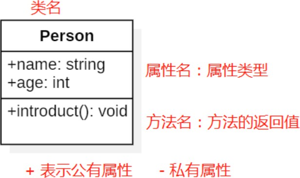
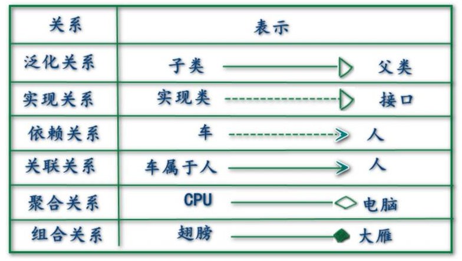
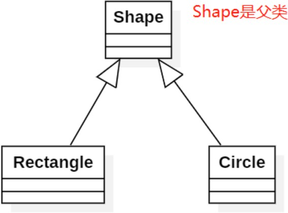
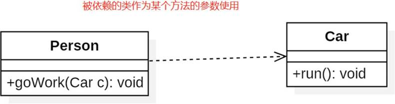
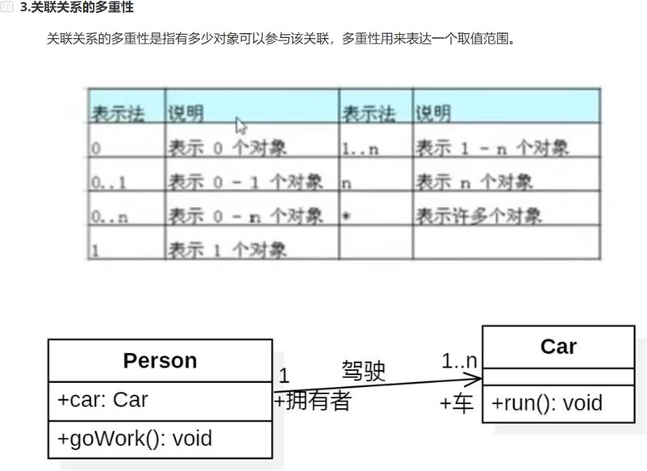
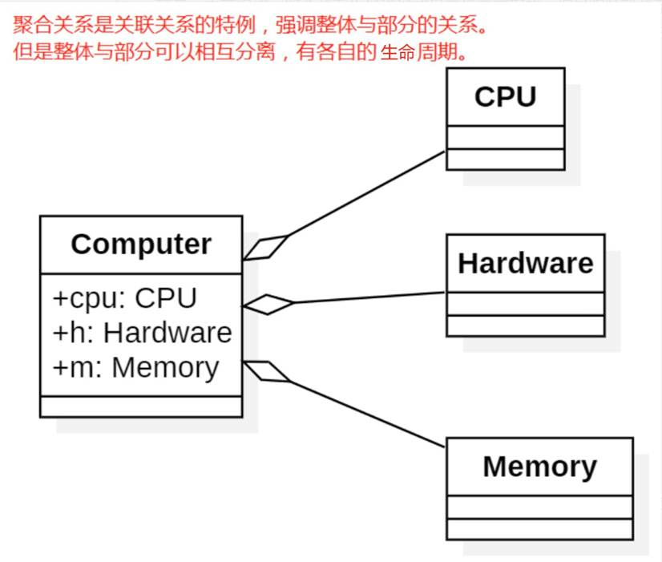

 

## UML统一建模语言

#### 定义

- UML是对我们的软件进行建模的一种表达方式，一种图形化的语言。 UML包括了很多图，我们只看其中的一种：类图
- 类图主要用来展示系统中的类、类的接口、以及他们之间的关系。
- 类图用矩形来表示，顶端是类名，中间是属性，底部是方法。属性和方法不必全部列出，仅作示意。
- `+`代表公有，`-`代表私有

#### 类图关系

## 1. 类图关系：泛化

- 泛化关系表示的就是**类与类之间的继承关系**
- 最终代码中，泛化关系表现为==**继承非抽象类**==；
- 泛化关系使用**三角形的空箭头**表示，由子类指向父类。

## 2. 类图关系：实现

- 实现关系表示**类实现某个接口**。
- 最终代码中，实现关系表现为==**继承抽象类**==；
- 实现关系用**一条虚线连接空箭头**。

## 3. 类图关系：依赖

- 依赖关系是**一个对象在运行期间会用到另一个对象**的关系
- 在最终代码中，依赖关系体现为==**类构造方法及类方法的传入参数**==；依赖关系除了临时知道对方外，还是“使用”对方的方法和属性；
- 依赖关系是用一套**带箭头的虚线**表示的，**箭头的指向为调用关系**
- 如下面的例子，人要开车去上班。

## 4. 类图关系：关联

- 它**描述不同类的对象之间的结构关系**，一般用来定义**对象之间静态的、天然的结构**，与运行状态无关

- 在最终代码中，**关联对象通常是以==成员变量==的形式实现的**；
- 关联关系是用**一条直线箭头**表示的
- 比如公司和员工的关系，比如车主和车的关系。

## 5. 类图关系：聚合

- 聚合强调的是**整体和部分的关系**。
- **聚合关系是关联关系的特例，所以在最终代码上也是以==成员变量==的形式实现的**
- 聚合关系用**一条带空心菱形箭头**的直线表示
- 整体和部分不是强依赖的，**即使整体不存在了，部分依然存在**；
- 比如说汽车和发动机的关系，再如电脑和硬盘的关系。

## 6. 类图关系：组合

- 组合关系比聚合还要强，也是**整体和部分的关系**
- **组合关系是关联关系的特例，所以也是以==成员变量==的形式实现的**
- 只不过整体不存在了，部分也就不存在了，即**整体决定了部分的生命周期**。

- 组合关系用**一条带实心菱形箭头**直线表示

