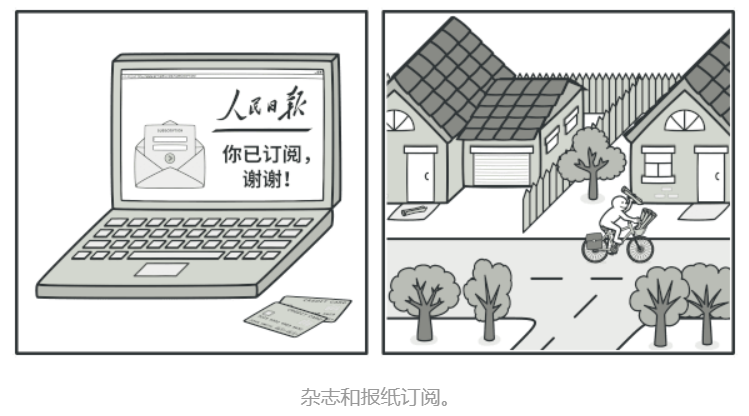

# 面向对象设计原则

## 七大对象设计原则

### 1. 总览


### 2. 目的

**七大原则的目标最终就是实现高内聚、低耦合。**


> 什么是高内聚低耦合？
>
> 1. 高内聚低耦合讲的是程序单位之间协作的问题。内聚越高越强越好，耦合越低越弱越好。
> 2. 最强的内聚就是功能实现原子化，不能拆分；
> 3. 最弱的耦合就是通过一个控制模块来协调调用N个模块进行运作。
>
> 举个生活化的例子
>
> 一个公司的组织结构就实现了部分高内聚低耦合。首先公司分为多个部门，每个部门各司其职，都是很专业的，这就是高内聚。每个部门和其他部门之间往往需要协调，协调的时候部门有专人（比如说部门经理）负责协调，这个协调人相当于控制层，实现解耦，低耦合。

---


## 1. 单一职责

单一职责原则：**一个类应该只包含单一的职责，它承担的职责越多，它被复用的可能性越小**


 

#### 1.1 实例

 


#### 1.2 类图分析

这是一个实现登录功能的类类图的功能分析：

1. `init()` 做登录界面的初始化
2. `display()` 负责界面的展示
3. `validate()`  负责对界面输入框信息的合法性检查
4. `getConnection()` 负责连接数据库
5. `findUser()` 负责在数据库中查找用户
6. `main()` 是整个系统的入口和调度


#### 1.3 存在的问题

不满足单一职责，我们可以发现，这个类至少有三种职责：

1. 前三个方法都是跟界面有关的。

2. 方法4和5都是跟数据库和业务逻辑有关的。

3. `main()`函数作为整个系统的入口，它跟登录没有关系。不应将它放到登录类。

​      

#### 1.4 重构

应该对系统进行重构，根据单一职责：


- `MainClass`类只负责系统的入口和调度

2. `LoginForm`类负责界面的初始化、展示、数据合法性验证
3. `UserDAO`类用于访问用户对象，负责业务逻辑
4. `DButil`类负责数据库的连接


---

## 2. 开闭原则

开闭原则：**对扩展开放，对修改关闭。要做到在不修改源代码的情况下，改变模块的行为。**

 


#### 2.1 实例


#### 2.2 类图分析

1. `LoginForm`是登陆界面类
2. 里面有一个圆形按钮类`CircleButton`作为属性
3. 然后使用`display()`方法将圆形按钮展示出来


#### 2.3 存在问题

**耦合度太高了**。如果用户想使用其他按钮比如矩形按钮，那只能改源代码，再修改成矩形按钮类的属性


​      

#### 2.4 重构


- **增加一个抽象按钮类，作为对外提供的接口。等具体使用的时候，将抽象类用具体的子类替代即可。**这就可以实现不同形状的按钮，而不必修改`LoginForm`类的代码。
- 当有新的按钮需要使用的适合，比如需要一个三角形按钮，只需要再增加一个三角形按钮类即可，满足开闭原则。

 

---

## 3. 里氏替换原则

- 里氏替换原则要求**子类对象能够替换程序中父类对象出现的任何地方。并且保证原来的程序逻辑不被破坏。**
- 它的本**质就是用子类实例化父类声明的对象，然后调用子类的方法，实现多态**。
- 里氏替换也是**实现开闭原则的主要手段**。


 

---

## 4. 依赖倒置原则

- 抽象不应该依赖于具体，**具体应该依赖于抽象**，也就是针对接口来编程，而不是针对实现来编程。也可以说是低级模块要依赖高级模块来编程。
- **依赖倒置原则主要的实现手段是引入抽象层，基于抽象层编程**。
- 同时，依赖倒置原则也是**实现开闭原则的手段**。


 

#### 4.1 实例

有一个系统实现数据转换功能，可以将某种数据格式转换成指定的其他格式。


#### 4.2 存在问题

​	现在转换模块`MainClass`依赖的是四个具体的模块，当需要变化时，可能增加新的格式，这时候就需要修改`MainClass`类的源代码。这就违背了开闭原则。


#### 4.3 重构


 

- 通过**增加抽象层，基于抽象层编程**，`MainClass`不再依赖具体层，而是依赖抽象层，实现了开闭原则。
- 当有新的格式需求时，只需要定义新的格式子类，继承抽象层即可，不需要改变源代码。

 

---

## 5. 接口隔离原则

- **不要使用单一的庞大的总接口，不让要客户端依赖他们不需要的接口。**
- **将不同的接口拆分隔离开来，变成专门的单一的接口**
- **这也满足单一职责原则**


 

 

#### **5.1**  实例


#### 5.2 类图分析

- 这是一个`CRM`系统的客户数据显式模块
- `dataRead()` 用于从文件中读取数据
- `transformToXML()` 用于将数据转换成XML格式
- `createChart()` 用于创建图表
- `displayChart()` 用于显式图表
- `createReport()` 用于创建报表
- `displayReport()` 用于显式报表存在的问题：


#### 5.3 存在问题

这个**类承担了太多的职责**，**封装了太多的接口**，不满足接口隔离原则。


#### 5.4 重构


-  **将一个庞大的单一接口拆分成四个接口，用户端根据需要只调用跟他有关的接口即可。**


## 6. 合成复用原则

- **要实现类之间的复用，有限使用合成的方式复用，而不是继承的方式。**
- **这样做可以减少类之间的耦合，提高扩展性。因为继承会增加耦合度。**


#### 6.1 实例


#### 6.2 类图分析

1. `DBUtil` 连接数据库

2. `StudentDAO` 对学生对象进行增删改查

3. `TeacherDAO` 对教师对象进行增删改查


#### 6.3 存在问题

​	`StudentDAO`和`TeacherDAO`都继承了`DBUtil`，来实现数据库的连接。这个时候存在一个问题，父类一旦发生了改变，加入连接数据库方式发生了改变，会影响所有的子类。这样就违背了开闭原则。


#### 6.4 重构


- **`DBUtil`增加了子类，由子类实现具体的连接方式，此时`DBUtil`相当于抽象层。**
- **`StudentDAO`和`TeacherDAO`类中都增加了`DBUtil`对象作为属性，作为类的一部分组合进来**，合成进来，通过这种方式实现了对`DBUtil`类的复用。
- 这种方式比继承好，因为解耦。当有新的数据库连接方式的时候，只需要给DBUtil增加新的子类去实现即可，不需要修改其他地方的代码，满足开闭原则。

 

## 7. 迪米特法则

- 也叫最少知道原则,**一个类对其他类知道的越少越好,只知道必要的信息即可**。
- **类和类之间只依赖必要的接口**。这样做的目的也是为了减少耦合。


 

#### 7.1  实例


#### 7.2 存在问题

`Form`界面类和`DAO`数据访问类直接耦合，形成了复杂的调用关系，这个时候当某一个或者几个`DAO`类发生改变时，会影响到很多`Form`类。


#### 7.3 重构


- **增加一个中间控制层，实现`Form`类和`DAO`类的解耦**
- **当某个`DAO`类发生改变时，只需要在`Control`类中做出相应调整即可，不会影响到`Form`类。**

 


---

---

# UML统一建模语言

## UML统一建模语言

#### 定义

- UML是对我们的软件进行建模的一种表达方式，一种图形化的语言。 UML包括了很多图，我们只看其中的一种：类图
- 类图主要用来展示系统中的类、类的接口、以及他们之间的关系。
- 类图用矩形来表示，顶端是类名，中间是属性，底部是方法。属性和方法不必全部列出，仅作示意。
- `+`代表公有，`-`代表私有


#### 类图关系


## 1. 类图关系：泛化

- 泛化关系表示的就是**类与类之间的继承关系**
- 最终代码中，泛化关系表现为==**继承非抽象类**==；
- 泛化关系使用**三角形的空箭头**表示，由子类指向父类。


## 2. 类图关系：实现

- 实现关系表示**类实现某个接口**。
- 最终代码中，实现关系表现为==**继承抽象类**==；
- 实现关系用**一条虚线连接空箭头**。


## 3. 类图关系：依赖

- 依赖关系是**一个对象在运行期间会用到另一个对象**的关系
- 在最终代码中，依赖关系体现为==**类构造方法及类方法的传入参数**==；依赖关系除了临时知道对方外，还是“使用”对方的方法和属性；
- 依赖关系是用一套**带箭头的虚线**表示的，**箭头的指向为调用关系**
- 如下面的例子，人要开车去上班。


## 4. 类图关系：关联

- 它**描述不同类的对象之间的结构关系**，一般用来定义**对象之间静态的、天然的结构**，与运行状态无关

- 在最终代码中，**关联对象通常是以==成员变量==的形式实现的**；
- 关联关系是用**一条直线箭头**表示的
- 比如公司和员工的关系，比如车主和车的关系。


## 5. 类图关系：聚合

- 聚合强调的是**整体和部分的关系**。
- **聚合关系是关联关系的特例，所以在最终代码上也是以==成员变量==的形式实现的**
- 聚合关系用**一条带空心菱形箭头**的直线表示
- 整体和部分不是强依赖的，**即使整体不存在了，部分依然存在**；
- 比如说汽车和发动机的关系，再如电脑和硬盘的关系。


## 6. 类图关系：组合

- 组合关系比聚合还要强，也是**整体和部分的关系**
- **组合关系是关联关系的特例，所以也是以==成员变量==的形式实现的**
- 只不过整体不存在了，部分也就不存在了，即**整体决定了部分的生命周期**。

- 组合关系用**一条带实心菱形箭头**直线表示


---

---

# 设计模式

[免费在线学习代码重构和设计模式 (refactoringguru.cn)](https://refactoringguru.cn/)

## 设计模式概念

### 1. 设计模式概念

设计模式是在特定需求下为了解决某些重复性的问题总结出的一套解决方案。也可以认为设计模式是一些心法，而语法是招数。

### 2. 设计模式的由来

设计模式是1994年在一本书中提出来的，这本书的作者是四个人，称之为四人组。

### 3. 为什么要学习设计模式

学习设计模式可以让我们走过新手阶段，学习一些高级的技巧。具体来说，可以让我们知 道：如何将代码分散到不同的类中？为什么要有接口？为什么要基于抽象编程？什么时候用继承？如何在不改变源代码的情况下增加新功能？


---

## 设计模式分类

设计模式共有24种，分为三大类：

1. 创建型：思考如何创建对象
2. 结构型：思考如何实现对象之间的组合
3. 行为型：思考如何实现对象间的高效沟通和职责委派。


---

## 创建型模式

**创建型模式**提供了创建对象的机制， 能够提升已有代码的灵活性和可复用性。

### 1. 单例设计模式

**单例模式**是一种创建型设计模式， 让你能够保证一个类只有一个实例， 并提供一个访问该实例的全局节点。


#### 1.1 实现方式

1. 设置一个私有的静态的当前类对象属性

2. 私有的构造函数（禁止外面实例化对象）

3. 公有的静态的，访问该单例对象的方法


#### 1.2 模式结构


#### 1.3 实例

##### 1. 饿汉式

- 类定义时就直接实例化对象
- 多线程下，饿汉式是正常的

```c++
//单例模式：饿汉式
class Singleton{
private:
	static Singleton* instance;//静态私有的属性，静态属性需要在类外初始化
	Singleton(){}
public:
	static Singleton* getInstance(){
		return instance;
	}
};
//在类外初始化静态属性
Singleton* Singleton::instance = new Singleton();//静态变量在程序启动时就马上创建了，并且整个程序生命周期只有一份
void test01(){
	//实例化这个单例对象，因为这是单例类，构造函数是私有的，禁止类外访问，所以无法通过构造函数来实例化对象，只能通过它提供的公有方法来实例化对象
	Singleton* ins = Singleton::getInstance();//只能通过类名来访问静态方法
	//怎么证明它是单例？那就再构造一次
	Singleton* ins2 = Singleton::getInstance();
	//如果是单例，那么意味着ins和ins2是同一个对象，通过查看地址即可判断
	cout << ins << endl;
	cout << ins2 << endl;//可以看到地址是一样的
}
```

> 1. new操作符实际上调用了类的构造方法
>
> 2. 如果该类的构造方法为private，那么在类的外边是不可以创建对象的，new也不可以调用；
>
> 3. 可以声明静态成员，静态成员不受私有成员访问限制的原因在于其特性和作用：
>    1. 静态成员是类的范畴，而不是某个特定对象实例的范畴，因此它们不直接操作对象实例的成员变量，也不具有this指针
>    2. 由于静态成员函数不依赖于特定对象实例，所以它们在不涉及访问特定对象实例的私有成员时，可以独立于对象实例的创建和访问。


##### 2. 懒汉式

- 方法被调用时再实例化对象,可节省资源
- 多线程下，懒汉模式可能会失败
- 如果希望懒汉式在多线程下也能成功，就需要通过加锁的方式来解决

```c++
//单例模式：懒汉式
class Singleton_Lan
{
private:
	static Singleton_Lan* instance;
	Singleton_Lan(){}
public:
	static Singleton_Lan* getInstance()
	{
		//在这里来决定对象什么时候创建，这个方法被调用的时候，才创建这个单例对象
		if (instance==nullptr)//判断单例没有被创建，才需创建
		{
			instance = new Singleton_Lan();
		}
		return instance;
	}
};
//懒汉式在程序启动时，不需要创建对象
Singleton_Lan* Singleton_Lan::instance = nullptr;
void test02()
{
	//懒汉式，只有调用getInstance方法的时候，单例才会被创建
	Singleton_Lan* ins_lan = Singleton_Lan::getInstance();
	//验证单例是否生效，通过查看地址判断
	Singleton_Lan* ins2_lan = Singleton_Lan::getInstance();
	cout << ins_lan << endl;
	cout << ins2_lan << endl;//可以看到地址是一样的
}
```


##### 3. 局部静态变量实现饿汉式

- 多线程下静态局部变量单例是安全的

```c++
//局部静态变量实现饿汉式单例
class Singleton_Jubu
{
private:
	Singleton_Jubu(){}//私有的构造函数
public:
	static Singleton_Jubu* getInstance()
	{
		//接下来定义一个静态的局部变量来保存单例对象
		static Singleton_Jubu* instance_jubu = new Singleton_Jubu();
		return instance_jubu;
	}
};
void test06()
{
	Singleton_Jubu* ins_jubu = Singleton_Jubu::getInstance();
	Singleton_Jubu* ins2_jubu = Singleton_Jubu::getInstance();
	cout << ins_jubu << endl;
	cout << ins2_jubu << endl;//如果是同一个地址，代表实现了单例
}
```

> 关于静态局部变量：
>
> 1. 改变变量的生命周期：局部静态变量的生命周期延长到程序的生命周期，即只会初始化一次，当程序结束时才会释放
> 2. 改变变量的作用域：该变量只在定义它的函数内部可见，但是在该函数每次被调用时，并不会重新初始化，而是保留上一次调用结束时的值。


##### 4. 关于销毁

一般来说，单例模式不用考虑单例释放的问题，因为一个单例对象通常占用不了多大的空间，如果释放掉，反而容易出问题，因为只有一个单例，释放了它之后，所有使用这个单例的程序都会受到影响


#### 1.4 优缺点

优点：

- 节省资源，内存中只有一个单例对象，避免重复频繁地创建和销毁对象，提高性能。

缺点：

- 拓展困难，跟单一职责原则有些冲突，类应该只关心类内部的逻辑，不应该关心类外怎么去使用它。


#### 1.5 使用场景

要求生成唯一性的一些数据、在项目中需要一个共享的访问接口或者共享的数据、创建一个对象需要消耗的资源较多


---

### 2. 工厂设计模式


#### 2.1 定义

​	面向对象开发时，需要提前准备好对象，使用工厂设计模式，让工厂完成这些对象的实例化，而不需要手动创建对象。  

#### 2.2 分类

1. 简单工厂：**只有一个工厂**，工厂根据用户**传来的参数**来生产对应的产品(对象)，产品有抽象层和具体层。
2. 工厂方法：**工厂增加一个抽象层**，**派生出(多个)具体的工厂**，**具体的工厂只能生产具体的某个产品**。客户不需要传参，只需要使用不同的工厂就能生产出对应的产品。
3. 抽象工厂：**工厂和产品都有抽象层和具体层**，最大的改变是**具体层的每个工厂都可以生产出全部的产品**，这些产品会根据它是由那个工厂生产的划分为不同的产品族，同一个工厂生产的产品属于同一个产品族。

|          |              特点              |      优点      |          缺点          |          适合场景          |
| :------: | :----------------------------: | :------------: | :--------------------: | :------------------------: |
| 简单工厂 |     一个工厂生产不同的产品     | 用户使用时方便 | 增加产品会破坏开闭原则 | 产品种类少且后续不增加产品 |
| 工厂方法 | 多个工厂，一个工厂生产一种产品 |  符合开闭原则  | 增加产品时需增加两个类 |    适合后续需要增加产品    |
| 抽象工程 | 多个工厂，一个工厂生产所有产品 | 增加厂商时方便 | 增加产品会破坏开闭原则 | 产品成套不变增加工厂(厂商) |


---

#### 2.3 简单工厂模式

**简单工厂模式**，一个工厂生产多种产品，可以根据传入参数的不同返回不同产品类的实例。专门定义一个工厂类来负责创建其他产品类的实例，被创建的实例通常都具有共同的父类(产品抽象类)

##### 1. 模式结构

1. 具体的工厂：`Factory`，根据参数生产不同的产品
2. 抽象的产品：`Product`，在抽象层声明接口，在具体层实现
3. 具体的产品：`ProductA`，`ProductB`，等实现抽象产品的接口，添加自己的业务逻辑


##### 2. 实例

```c++
//简单工厂:可以理解为使用了父类多态，简单工厂根据传来的参数返回子类对象的指针，使用时只需要使用父类(抽象)类指针接收即可
//抽象的产品层
class AbsFruit {
public:
	virtual void showName() = 0;	//接口
};

//具体的产品层：派生类
class Apple :public AbsFruit {
public:
	 void showName() {
		cout << "我是苹果" << endl;
	}
};
class Peach :public AbsFruit {
public:
	 void showName() {
		cout << "我是桃子" << endl;
	}
};
class Banana :public AbsFruit {
public:
	 void showName() {
		cout << "我是香蕉" << endl;
	}
};


//简单工厂类：参数告诉工厂生产什么产品
class SimpleFactory {
public:
	AbsFruit* createFruit(string str) {		
		if (str == "apple") {
			return new Apple();
		}
		if (str == "peach") {
			return new Peach();
		}
		if (str == "banana") {
			return new Banana();
		}
	}
};

void test01() {
	//简单工厂
	SimpleFactory sf = SimpleFactory();
	AbsFruit* ab = sf.createFruit("apple");
	ab->showName();
	delete ab;
}
```


##### 3. 优缺点

优点：

1. 工厂类包含逻辑判断，可以根据用户传入的参数，实例化相关的类
2. 用户免除了创建产品的麻烦，去除了产品依赖

缺点：

1. 增加产品的时候，需要修改工厂类的逻辑，不符合开闭原则
2. 用户需要记住传入的参数，麻烦


##### 4. 适用场景

对于产品种类较少的情况，可以使用简单工厂模式。而且后期不会经常增加新产品。


---

#### 2.4 工厂方法模式

**工厂方法模式**是一种创建型设计模式，其在父类中提供一个创建对象的方法， 允许子类决定实例化对象的类型。


##### 1. 模式结构

 在简单工厂的基础上增加工厂的抽象层，具体工厂生产具体某种商品，所以用户需要直接定义某个具体工厂的对象(类)

1. 抽象工厂类: `AbsFactory`，定义不同工厂的接口
2. 具体工厂类:`AppleFactory,PeachFactory,BananaFactory`，生产产品的具体具体实现，返回产品的父类指针
3. 抽象产品类：`AbsFruit`，定义不同产品的接口
4. 具体产品类：`Apple,Peach,Banana` 关于产品信息描述


##### 2. 实例

```c++
//工厂方法：在简单工厂的基础上多加了一层工厂接口，把产品分到不同的工厂，用户想要什么产品就去调用什么工厂
//抽象的工厂层
class AbsFactory {
public:
	virtual AbsFruit* createFruit()=0;
};

//具体的工厂层,苹果工厂只能生产苹果
class AppleFactory : public AbsFactory {
public:
	AbsFruit* createFruit() {
		return new Apple();
	}
};
class PeachFactory : public AbsFactory {
public:
	AbsFruit* createFruit() {
		return new Peach();
	}
};
class BananaFactory : public AbsFactory {
public:
	AbsFruit* createFruit() {
		return new Banana();
	}
};

void test02() {
	//想要什么产品，就使用什么工厂
	AbsFactory* Apple_fac = new AppleFactory();
	AbsFruit* a = Apple_fac->createFruit();
	a->showName();
	delete Apple_fac;
}
```


##### 3. 优缺点

优点：

1. 符合开闭原则，系统拓展性好，增加产品的时候，不需要修改源代码，直接添加代码即可。
2. 不用考虑传参问题，降低了用户的使用难度

缺点：

1. 增加一个产品就要成对的增加两个类，产品类和工厂类都要增加


##### 4. 使用场景

在设计初期，就考虑到后期会对产品进行拓展。


---

#### 2.5 抽象工厂模式

**抽象工厂模式**是一种创建型设计模式， 提供一个创建一系列相关或相互依赖对象的接口， 而无需指定其具体类。


##### 1. 模式结构

同工厂方法模式一样，工厂和产品都有抽象层和具体层，但是最大的改变是**具体层的每个工厂都可以生产全部的产品**，这些产品根据它是由哪个工厂生产的划分为不同的产品族(厂商)，同一个工厂生产的产品都属于同一个产品族(厂商)。

1. 抽象工厂层：`AbsFactory`不同工厂的接口，表示同一厂商
2. 具体工厂层：`ChinaFactory,JapanFactory,AmFactory`,工厂中所有产品的具体实现，根据调用的不同返回不同产品的父类指针
3. 抽象产品层：`AbsApple,AbsPeach,AbsBanna`，不同产品的都有一个接口，表示同一等级
4. 具体产品层：`ChinaApple,JapanApple,AmApple......`,每个产品又有不同工厂产品的表示，表示同一产品的不同厂商


##### 2. 实例

```c++
//抽象工厂：根据厂商来找具体的产品，每个具体工厂都有所有产品
//产品等级，即产品分类，抽象苹果
class AbsApple {
public:
	virtual void showName() = 0;	//接口
};
class ChinaApple :public AbsApple {
public:
	void showName() {
		cout << "中国苹果" << endl;
	}
};
class JapanApple :public AbsApple {
public:
	void showName() {
		cout << "日本苹果" << endl;
	}
};

//抽象桃子
class AbsPeach {
public:
	virtual void showName() = 0;	//接口
};

class ChinaPeach :public AbsPeach {
public:
	void showName() {
		cout << "中国桃子" << endl;
	}
};
class JapanPeach :public AbsPeach {
public:
	void showName() {
		cout << "日本桃子" << endl;
	}
};
//工厂抽象层
class AbsFactory_abs {
public:
	virtual AbsApple* createApple() = 0;
	virtual AbsPeach* createPeach() = 0;
};
//工厂具体层：中国工厂
class ChinaFactory : public AbsFactory_abs {
public:
	AbsApple* createApple() {
		return new ChinaApple();
	}
	AbsPeach* createPeach() {
		return new ChinaPeach();
	}
};
//工厂具体层：日本工厂
class JapanFactory : public AbsFactory_abs {
public:
	AbsApple* createApple() {
		return new JapanApple();
	}
	AbsPeach* createPeach() {
		return new JapanPeach();
	}
};

void test03() {
	//依据厂商来找产品
	AbsFactory_abs* china_fac = new ChinaFactory();
	AbsApple* china_apple = china_fac->createApple();
	AbsPeach* china_peach = china_fac->createPeach();
	china_apple->showName();
	china_peach->showName();

	delete china_fac;
	delete china_apple;
	delete china_peach;
}
```


##### 3. 优缺点

优点：

1. 隔离了具体产品的生产，客户不需要知道产品怎么被创建，因为一个工厂可以创建所有产品
2. 增加新的工厂(产品族)是很方方便的

缺点：

1. 增加产品种类的时候不满足开闭原则，增加产品则需要改变所有工厂的代码

##### 4. 应用场景

适合产品种类多的场合，主要用于创建一组相关的产品(都来自于一个工厂)，即产品是成套的。


---

### 3. 原型模式

**原型模式**是一种创建型设计模式， 使你能够复制已有对象， 而又无需使代码依赖它们所属的类。


#### 3.1 模式结构

原型模式将克隆过程委派给被克隆的实际对象，模式为所有支持克隆的对象声明了一个通用接口， 该接口让你能够克隆对象， 同时又无需将代码和对象所属类耦合。 通常情况下， 这样的接口中仅包含一个 克隆方法。

1. 抽象类：克隆接口，一般都必含有一个纯虚克隆方法
2. 具体实现类：需要实现克隆功能的类继承抽象接口，重写返回自己本身对象的方法


#### 3.2 实例

```c++
//原型模式
//品牌类，抽象类
class Brand {
public:
	virtual Brand* clone() = 0;//克隆函数
	virtual void show() = 0;
};

class Midea :public Brand {
public:
    Midea();
	//实现克隆，其实就是调用了拷贝构造函数，参数是自己
    Brand* clone(){
		return new Midea(*this);
	}
	void show() {
		cout << "美的品牌" << endl;
	}
};

void test01() {
	Brand* md = new Midea();
	Brand* md_cop = md->clone();
	Brand* md_cop2 = md->clone();
	//克隆出来的对象md_cp1和md_cop2是一样的对象，但它们是不同的对象
	cout << md << endl;
	cout << md_cop << endl;
	cout << md_cop2 << endl;
	delete md;
	delete md_cop;
	delete md_cop2;
}
```


#### 3.3 优缺点

优点：

1. 可以克隆对象而无需于它们所属的类相耦合，直接通过这个对象本身调用克隆函数返回其自身的对象副本。


#### 3.4 适合场景

1. 当某个对象不是开始就能确定的，而是在程序运行期间才确定，我们就可以通过原型模式克隆一样的对象出来。 相当于拿到这个对象在某个状态下的副本。
2. 如果两个对象区别不大，只是几个属性有区别，其他是一样的，如果属性还比较多的话，这时候就应该使用原型 模式，根据一个对象克隆另一个，然后再修改有区别的那几个属性即可。而不是选择重新创建一个对象
3. 有的对象构造函数参数很多，并且我们不清楚某些参数具体的含义，所以我们无法使用这个构造函数，那就用原 型模式去克隆一个相同的对象。


---

## 结构型模式

**结构型模式**介绍如何将对象和类组装成较大的结构， 并同时保持结构的灵活和高效，即实现对象之间的组合

|            |                     特点                     | 目的                         |
| :--------: | :------------------------------------------: | ---------------------------- |
|  类适配器  |            适配器==继承==两个接口            | 解决两个类适配问题           |
| 对象适配器 | 适配器==继承==目标接口，==关联==被适配器接口 | 解决两个类适配问题           |
|    桥接    |       一个维度的接口==关联==另一个接口       | 解决一个类多个维度杂乱的问题 |
|    外观    |   外部类==关联==所有的子类对象，是聚合关系   | 提供一个调用所有子类的界面   |
|    装饰    |      装饰器==继承==和==关联==(聚合)接口      | 不改变类的情况下增加功能     |
|    代理    |      代理器==继承==和==关联==(聚合)接口      | 给对象添加代理，增设条件     |


### 1. 适配器模式

**适配器模式**是一种结构型设计模式， 它能使接口不兼容的对象能够相互合作。适配器模式通过封装对象将复杂的转换过程隐藏于幕后。 被封装的对象甚至察觉不到适配器的存在


#### 1.1 类适配器

这一实现使用了继承机制： 适配器<u>同时继承两个对象的接口</u>。 这种方式仅能在支持多重继承的编程语言中实现， 例如 C++。

##### 1. 模式结构

1. 目标抽象类：`RobotTarget`即需要使用被适配者方法的类，包含自身方法的接口
2. 被适配者类：`DogAdaptee`包含目标类想要的方法的实现
3. 适配器：`DogAdapter`同时继承这两个类，并重写目标抽象类的方法，在重写的方法中调用被适配者的函数

> 在类适配器中，适配器与被适配者是继承关系。


##### 2. 实例

```c++
//类适配器
//目标抽象类：这里面的方法是我们当前系统的接口，不能改变接口的定义，但是又不想调用这两个方法
//我们希望通过目标抽象类调用的是被适配器的方法
class RobotTarget {	
public:
	virtual void cry() = 0;
	virtual void move() = 0;
};

//被适配器类：里面是我们真正想要调用的方法
class DogAdaptee {
public:
	void wang() {
		cout << "wang wnag" << endl;
	}
	void run() {
		cout << "run run" << endl;
	}
};
//适配器类：继承以上两个类，重写cry和move方法
class DogAdapter :public RobotTarget, public DogAdaptee {
public:
	void cry() {
		wang();			//重写的方法体中执行被适配的方法
	}
	void move() {
		run();
	}
};

void test02() {
	//创建适配器对象，完成适配
	RobotTarget* adapter = new DogAdapter();
	adapter->cry();
	adapter->move();

	delete adapter;
}
```


#### 1.2 对象适配器

实现时使用了构成原则： 适配器实现(继承)了其中一个对象的接口， 并对另一个对象进行封装(关联)(将另一个对象作为成员变量)。

##### 1. 模式结构

1. 目标抽象类：`RobotTarget`即需要使用被适配者方法的类，包含自身方法的接口
2. 被适配者类：`DogAdaptee`包含目标类想要的方法的实现
3. 适配器：`DogAdapter`只继承目标抽象类，将被适配者类当作类的成员变量，通过重写目标类的方法及调用被适配者对象的方法，完成适配

>  对象适配器中，适配器与被适配者是关联关系。


##### 2. 实例

```c++
//对象适配器：继承目标抽象类，重写cry和move方法；并把被适配器对象作为自己的成员变量
class DogAdapter_obj : public RobotTarget{
	DogAdaptee* m_dog;
public:
	DogAdapter_obj(DogAdaptee* dog) :m_dog(dog) {}
	void cry() {
		m_dog->wang();		//通过被适配器类对象调用其中的方法
	}
	void move() {
		m_dog->run();
	}
};
void test03() {
	RobotTarget* rt = new DogAdapter_obj(new DogAdaptee());
	rt->cry();
	rt->move();
}
```


#### 1.3 优缺点

优点：

1. 在不改变源码的情况下实现对现有类的复用
2. 推荐使用对象适配器方式，耦合度低，且符合合成复用原则


#### 1.4 适用场景

1. 在使用第三方的组件时，可以将第三方的接口进行适配，让他符合当前系统的接口要求。

2. 当前系统的接口和外部系统接口不兼容时，又要将两个系统合并，也需要使用适配器。

3. 代码重构时，可能需要将原有代码的某些接口进行适配，以适应重构后的接口。


---

### 2. 桥接模式

**桥接模式**是一种结构型设计模式， 可将一个大类或一系列紧密相关的类拆分为抽象和实现两个独立的层次结构， 从而能在开发时分别使用。


#### 2.1 模式结构

桥接模式通过将**继承改为组合**的方式来解决这个问题。同对象适配器模式类似；

 具体来说， 就是抽取其中一个维度并使之成为独立的类层次， 这样就可以在初始类中引用这个新层次的对象， 从而使得一个类不必拥有所有的状态和行为。

1. 颜色抽象类：`Color`颜色的接口，作为形状抽象类接口的成员变量
2. 颜色具体类：`Red,Blue` 实现颜色接口方法
3. 形状抽象类：`Shape` 形状的接口，内部引用了另一个维度颜色作为成员变量
4. 形状具体类：`Rectangle，Circle`形状的具体实现，重载父类构造，在重写的方法中再调用颜色对象的方法


#### 2.2 实例

```c++
//桥接模式
//颜色抽象类
class Color {
public:
	virtual void paint() = 0;
};
//颜色具体类
class Red :public Color{
public:
	void paint() {
		cout << "红色" << endl;
	}
};
class Blue :public Color {
public:
	void paint() {
		cout << "蓝色" << endl;
	}
};

//形状抽象类，把颜色抽象类作为成员变量，组合对象
class Shape {
protected:
	Color* m_color;
public:
	Shape(Color* color) :m_color(color){}
	virtual void draw() = 0;
};
//形状具体类，重写抽象方法
class Rectangle :public Shape {
public:
	Rectangle(Color* color):Shape(color){} //子类构造函数的时候需要提供父类需要的参数
	void draw() {
		cout << "形状是矩形，颜色是";
		m_color->paint();				//通过颜色对象调用方法
	}
};
class Circle :public Shape {
public:
	Circle(Color* color) :Shape(color) {} //子类构造函数的时候需要提供父类需要的参数
	void draw() {
		cout << "形状是圆形，颜色是";
		m_color->paint();
	}
};

void test() {
	//画一个蓝色的矩形,需要先定义颜色再构造图形
	Color* c = new Blue();
	Shape* sh = new Rectangle(c);
	sh->draw();
	delete c;
	delete sh;
}
```


#### 2.3 优缺点

优点：

1. 扩展能力好，可以在不修改源码的情况下，增加新的变化因素
2. 抽象和实现的分离

缺点：

1. 用户必须知道自己应该做那种选择和实现


#### 2.4 适合场景

如果你想要拆分或重组一个具有多重功能的庞杂类 （例如能与多个数据库服务器进行交互的类），可以使用桥接模式。


---

### 3. 外观模式

**外观模式**是一种结构型设计模式， 能为程序库、 框架或其他复杂类等各种子系统提供一个简单的接口(操作界面)。


#### 3.1 模式结构

分为外部系统和内部子系统，外部对象聚合了子系统的各个对象，作为自己的属性来使用它们的方法，是**聚合而不是继承**

1. 外部系统类：`Facade`,引用不同的子系统的对象作为成员变量，在自身的方法中就可以调用子类对象的方法
2. 内部子系统类：`MixDough,Ferment,Knead,Steam` 具体的功能类的实现


#### 3.2 实例

```c++
//外观模式  实现蒸馒头的机器
//各种子系统
//和面子系统
class MixDough {
public:
	void doMix() {
		cout << "水和面按比例混合，加入发酵粉，搅拌，揉" << endl;
	}
};
//发酵子系统
class Ferment {
public:
	void doFerment() {
		cout << "在合适的温度下密封静置6小时" << endl;
	}
};
//揉面子系统
class Knead {
public:
	void doKnead() {
		cout << "揉面5分钟" << endl;
	}
};
//蒸馒头
class Steam {
public:
	void boilWater(){
		cout << "加水烧开" << endl;
	}
	void doSteam() {
		cout << "蒸20分钟" << endl;
	}
};
//外部界面类
//接下来提供一个简单友好的界面类，给用户使用
class Facade {
	MixDough* mixdough;
	Ferment* ferment;
	Knead* knead;
	Steam* steam;
public:
    //在构造函数中实现对对象的初始化，不让用户传参，否则就丢失了外观模式的意义
	Facade() {
		mixdough = new MixDough();
		ferment = new Ferment();
		knead = new Knead();
		steam = new Steam();
	}
    //在析构函数中释放对象
	~Facade() {
		delete mixdough;
		delete ferment;
		delete knead;
		delete steam;
	}
	void work() {
		mixdough->doMix();
		ferment->doFerment();
		knead->doKnead();
		steam->boilWater();
		steam->doSteam();
	}
};
void test() {
	Facade* f = new Facade();
	f->work();
	delete f;
}
```


#### 3.3 优缺点

优点：

1. 子系统满足单一职责，降低系统复杂性
2. 对外提供一个简单好用的接口，降低用户的使用难度
3. 外观模式还满足迪米特(最少知道原则)，子系统之间没有耦合，通过外观类来控制和调度。同时用户和子系统也实现了解耦。

缺点：

1.  外观可能成为与程序中所有类都耦合的上帝对象。


#### 3.4 适合场景

当我们需要为一个复杂的子系统提供一个简单易用的接口时。


---


### 4. 装饰模式

**装饰模式**是一种结构型设计模式， 允许你通过将对象放入包含行为的特殊封装对象中来为原对象绑定新的行为。也就是不改变原类功能的基础上，增加新的功能；


#### 4.1 模式结构

装饰模式既有**继承**关系又有**聚合**关系

1. 目标抽象类：`Car`,需要增加功能的对象的父类接口
2. 目标实体类：`Audi,Bmw`，实体对象
3. 装饰器：`ConDecorator01,ConDecorator02,ConDecorator03`，装饰器，继承目标抽象类，并且关联目标抽象类，把其作为自己的成员变量；


#### 4.2 实例

```c++
//装饰模式
//车的抽象接口
class Car {
public:
	virtual void show() = 0;
};
//车的具体类
class Audi :public Car {
public:
	void show() {
		cout << "奥迪" << endl;
	}
};
class Bmw :public Car {
public:
	void show() {
		cout << "宝马" << endl;
	}
};

//第一个装饰器，加上定速巡航
class ConDecorator01 :public Car {
	Car* car;		//这个用来接收不同的具体的车型
public:
	ConDecorator01(Car* car) {
		this->car = car;
	}
	void show() {
		//这里加装饰
		car->show();	//原来的功能
		cout << "装饰了定速巡航" << endl;	//新加的功能
	}
};
//第二个装饰器，加上自动刹车
class ConDecorator02 :public Car {
	Car* car;		//这个用来接收不同的具体的车型
public:
	ConDecorator02(Car* car) {
		this->car = car;
	}
	void show()  {
		//这里加装饰
		car->show();	//原来的功能
		cout << "装饰了自动刹车" << endl;	//新加的功能
	}
};

void test01() {
	//使用装饰器对象来调用show()方法
	Car* c1 = new Bmw();
	c1->show();
	cout << endl;

	Car* d1 = new ConDecorator01(c1);
	d1->show();
	cout << endl;

	Car* d2 = new ConDecorator02(c1);
	d2->show();
	cout << endl;
    
    delete c1;
    delete d1;
    delete d2;

}
```


#### 4.3 优缺点

优点：

1.  无需创建新子类即可扩展对象的行为。
2. 可以用多个装饰封装对象来组合几种行为
3. 单一职责原则。 你可以将实现了许多不同行为的一个大类拆分为多个较小的类

缺点：

1. 删除特定装饰器比较困难


#### 4.4 适合场景

1. 如果你希望在无需修改代码的情况下即可使用对象，且希望在运行时为对象新增额外的行为， 可以使用装饰模式。
2. 如果用继承来扩展对象行为的方案难以实现或者根本不可行时


---

### 5. 代理模式

**代理模式**是一种结构型设计模式， 让你能够提供对象的替代品或其占位符。 代理控制着对于原对象的访问， 并允许在将请求提交给对象前后进行一些处理。


#### 5.1 模式结构

同装饰模式结构基本相同，既有**继承**关系又有**聚合**关系；只是代码逻辑不同，装饰模式关注于增加功能，代理模式关注在在原对象方法执行前增加限制

1. 目标抽象类：`Person`,需要添加代理的对象的父类接口
2. 目标实体类：`Tom`，实体对象
3. 装饰器：`Proxy`，代理器，继承目标抽象类，并且关联目标抽象类，把其作为自己的成员变量；


#### 5.2 实例

```c++
//代理模式
//抽象类：房东
class Landlord {
public:
	virtual void rentHouse() = 0;
};
//具体的房东
class Tom : public Landlord {
public:
	void rentHouse() {
		cout << "Tom出租一个房子" << endl;
	}
};

//代理类
class Proxy : public Landlord {
	Landlord* landlord;
public:
	Proxy(Landlord* land) :landlord(land) {}
	//重定义代理对象的rentHouse方法，并且加上代理的控制条件
	void rentHouse() {
		//首先要满足代理提出的条件，然后才可以访问这个对象
		cout << "中介先收取押金" << endl;
		landlord->rentHouse();	//调用代理对象的方法；
	}
};

void test03() {
	Landlord* tom = new Tom();
	Landlord* proxy = new Proxy(tom);
	proxy->rentHouse();
	delete tom;
	delete proxy;
}
```


#### 5.3 优缺点

优点：

1. 符合开闭原则，可以在不对服务或客户端做出修改的情况下创建新代理
2. 可以在客户端毫无察觉的情况下控制服务对象


#### 5.4 适合场景

​	同装饰模式

---


## 行为设计模式

### 1. 观察者模式

**观察者模式**是一种行为设计模式， 允许你定义一种订阅机制， 可在对象事件发生时通知多个 “观察” 该对象的其他对象。是一种一对多的关系，一是发布者，多是订阅者。




#### 5.1 模式结构

让多个观察者同时观察监 听某一个发布者，当发布者的状态发生改变时，发布者会主动通知所有观察者。这样所有观察者就接收到发布者最新 的状态。

要实现一对多的关系，就要在发布者中定义一个能存放多个观察者的容器。由发布者通知容器中所有的观察者。 

1. 抽象观察者：`AbsObserver`,定义了观察者的更新方法接口
2. 具体观察者：`ConsObserver`,关联发布者作为成员变量，并且重写了接口方法
3. 主题/发布者：`Subject`,定义存放多个观察者的list容器，实现添加、删除观察者的方法；给所有观察者发布订阅信息的方法`notify`；


#### 5.2 实例

```c++
//观察者模式
//抽象观察者
class AbsObserver {
public:
	virtual void update(string content) = 0;
};

//发布者
class Subject {
	string title;
	list<AbsObserver*> obs;	//存储观察者对象的容器
public:
	Subject() {};
	Subject(string title) { this->title = title; }
    //写析构的目标是为了在发布者析构时，同时析构掉所有的观察者
	~Subject() {  
		if (obs.size() == 0) {
			return;
		}
		else {
			for (auto o : obs) {
				delete o;
				obs.remove(o);
			}
		}
	}	
    //添加观察者
	void attach(AbsObserver* someone) {
		obs.push_back(someone);
	}
    //删除观察者
	void detach(AbsObserver* someone) {
		obs.remove(someone);
	}
    //给所有观察者发布信息
	void nitify(string content) {
		if (obs.size() == 0) {
			return;
		}
		else
		{
			for (auto o : obs) {
				o->update(content);
			}
		}
	}
	//返回主题信息
	string getTitle() {
		return title;
	}
};

//真正的观察者
class ConsObserver :public AbsObserver {
	string c_name;
	Subject* c_sub;
public:
	ConsObserver(string name, Subject* sub):c_name(name),c_sub(sub){}
	void update(string content) {
		cout << c_name << "收到了："<<"标题:" << c_sub->getTitle()<< "  内容是:" <<content << endl;
	}
};

void test04() {
	Subject* sub = new Subject("天气预报");
	AbsObserver* a1 = new ConsObserver("张三", sub);
	AbsObserver* a2 = new ConsObserver("李四", sub);
	sub->attach(a1);
	sub->attach(a2);
	sub->nitify("天气晴转多云");

	delete sub;	//主题析构同时会析构掉a1和a2；
}
```


#### 5.3 优缺点

优点：

1. 符合开闭原则，无需修改发布者代码就能引入新的订阅者类


#### 5.4 适合场景

1. 当一个对象状态的改变需要改变其他对象，或实际对象是事先未知的或动态变化的时，可使用观察者模式

2. 当应用中的一些对象必须观察其他对象时，可使用该模式。但仅能在有限时间内或特定情况下使用。