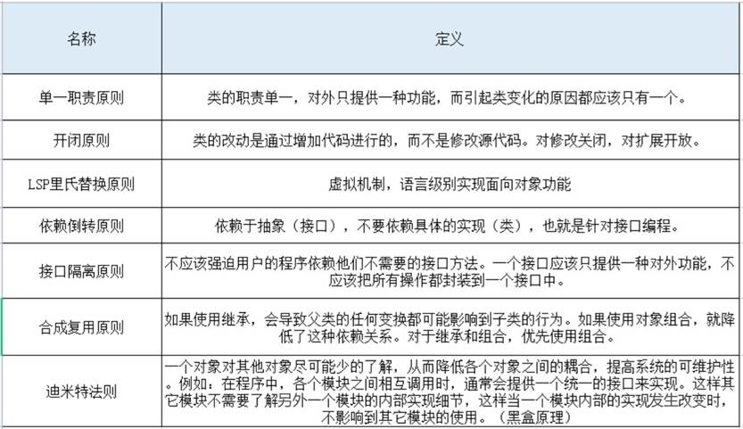
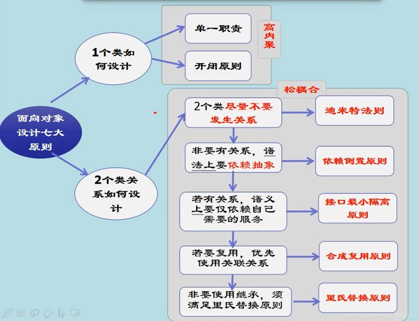
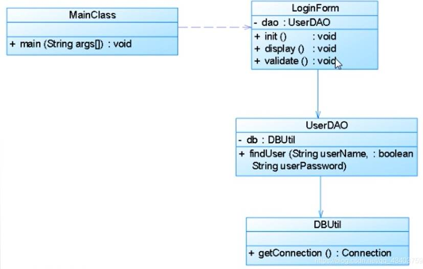
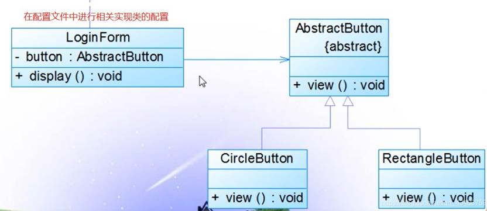
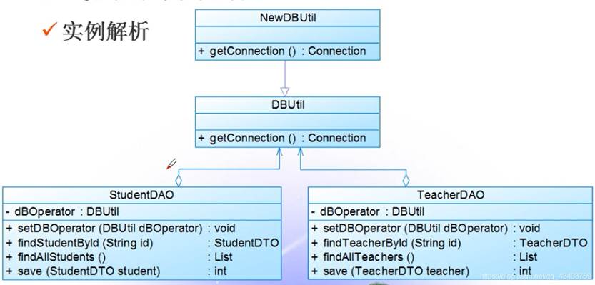
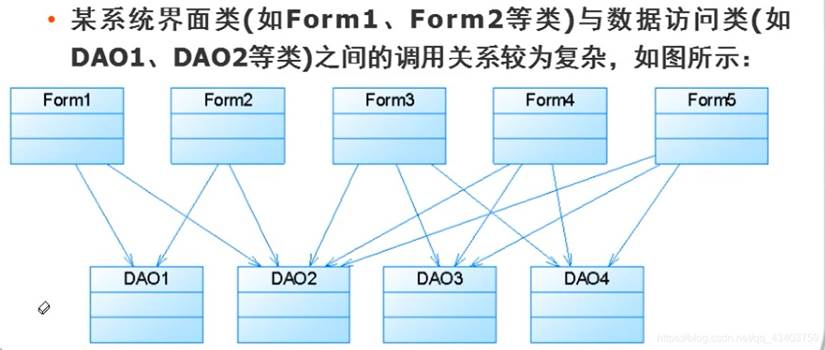

## 七大对象设计原则

### 1. 总览

### 2. 目的

**七大原则的目标最终就是实现高内聚、低耦合。**

> 什么是高内聚低耦合？
>
> 1. 高内聚低耦合讲的是程序单位之间协作的问题。内聚越高越强越好，耦合越低越弱越好。
> 2. 最强的内聚就是功能实现原子化，不能拆分；
> 3. 最弱的耦合就是通过一个控制模块来协调调用N个模块进行运作。
>
> 举个生活化的例子
>
> 一个公司的组织结构就实现了部分高内聚低耦合。首先公司分为多个部门，每个部门各司其职，都是很专业的，这就是高内聚。每个部门和其他部门之间往往需要协调，协调的时候部门有专人（比如说部门经理）负责协调，这个协调人相当于控制层，实现解耦，低耦合。

---

## 1. 单一职责

单一职责原则：**一个类应该只包含单一的职责，它承担的职责越多，它被复用的可能性越小**

 

#### 1.1 实例

 

#### 1.2 类图分析

这是一个实现登录功能的类类图的功能分析：

1. `init()` 做登录界面的初始化
2. `display()` 负责界面的展示
3. `validate()`  负责对界面输入框信息的合法性检查
4. `getConnection()` 负责连接数据库
5. `findUser()` 负责在数据库中查找用户
6. `main()` 是整个系统的入口和调度

#### 1.3 存在的问题

不满足单一职责，我们可以发现，这个类至少有三种职责：

1. 前三个方法都是跟界面有关的。

2. 方法4和5都是跟数据库和业务逻辑有关的。

3. `main()`函数作为整个系统的入口，它跟登录没有关系。不应将它放到登录类。

​      

#### 1.4 重构

应该对系统进行重构，根据单一职责：

- `MainClass`类只负责系统的入口和调度
2. `LoginForm`类负责界面的初始化、展示、数据合法性验证
3. `UserDAO`类用于访问用户对象，负责业务逻辑
4. `DButil`类负责数据库的连接

---

## 2. 开闭原则

开闭原则：**对扩展开放，对修改关闭。要做到在不修改源代码的情况下，改变模块的行为。**

 

#### 2.1 实例

#### 2.2 类图分析

1. `LoginForm`是登陆界面类
2. 里面有一个圆形按钮类`CircleButton`作为属性
3. 然后使用`display()`方法将圆形按钮展示出来

#### 2.3 存在问题

**耦合度太高了**。如果用户想使用其他按钮比如矩形按钮，那只能改源代码，再修改成矩形按钮类的属性

​      

#### 2.4 重构

- **增加一个抽象按钮类，作为对外提供的接口。等具体使用的时候，将抽象类用具体的子类替代即可。**这就可以实现不同形状的按钮，而不必修改`LoginForm`类的代码。
- 当有新的按钮需要使用的适合，比如需要一个三角形按钮，只需要再增加一个三角形按钮类即可，满足开闭原则。

 

---

## 3. 里氏替换原则

- 里氏替换原则要求**子类对象能够替换程序中父类对象出现的任何地方。并且保证原来的程序逻辑不被破坏。**
- 它的本**质就是用子类实例化父类声明的对象，然后调用子类的方法，实现多态**。
- 里氏替换也是**实现开闭原则的主要手段**。

 

---

## 4. 依赖倒置原则

- 抽象不应该依赖于具体，**具体应该依赖于抽象**，也就是针对接口来编程，而不是针对实现来编程。也可以说是低级模块要依赖高级模块来编程。
- **依赖倒置原则主要的实现手段是引入抽象层，基于抽象层编程**。
- 同时，依赖倒置原则也是**实现开闭原则的手段**。

 

#### 4.1 实例

有一个系统实现数据转换功能，可以将某种数据格式转换成指定的其他格式。

#### 4.2 存在问题

​	现在转换模块`MainClass`依赖的是四个具体的模块，当需要变化时，可能增加新的格式，这时候就需要修改`MainClass`类的源代码。这就违背了开闭原则。

#### 4.3 重构

 

- 通过**增加抽象层，基于抽象层编程**，`MainClass`不再依赖具体层，而是依赖抽象层，实现了开闭原则。
- 当有新的格式需求时，只需要定义新的格式子类，继承抽象层即可，不需要改变源代码。

 

---

## 5. 接口隔离原则

- **不要使用单一的庞大的总接口，不让要客户端依赖他们不需要的接口。**
- **将不同的接口拆分隔离开来，变成专门的单一的接口**
- **这也满足单一职责原则**

 

 

#### **5.1**  实例

#### 5.2 类图分析

- 这是一个`CRM`系统的客户数据显式模块
- `dataRead()` 用于从文件中读取数据
- `transformToXML()` 用于将数据转换成XML格式
- `createChart()` 用于创建图表
- `displayChart()` 用于显式图表
- `createReport()` 用于创建报表
- `displayReport()` 用于显式报表存在的问题：

#### 5.3 存在问题

这个**类承担了太多的职责**，**封装了太多的接口**，不满足接口隔离原则。

#### 5.4 重构

-  **将一个庞大的单一接口拆分成四个接口，用户端根据需要只调用跟他有关的接口即可。**

## 6. 合成复用原则

- **要实现类之间的复用，有限使用合成的方式复用，而不是继承的方式。**
- **这样做可以减少类之间的耦合，提高扩展性。因为继承会增加耦合度。**

#### 6.1 实例

#### 6.2 类图分析

1. `DBUtil` 连接数据库

2. `StudentDAO` 对学生对象进行增删改查

3. `TeacherDAO` 对教师对象进行增删改查

#### 6.3 存在问题

​	`StudentDAO`和`TeacherDAO`都继承了`DBUtil`，来实现数据库的连接。这个时候存在一个问题，父类一旦发生了改变，加入连接数据库方式发生了改变，会影响所有的子类。这样就违背了开闭原则。

#### 6.4 重构

- **`DBUtil`增加了子类，由子类实现具体的连接方式，此时`DBUtil`相当于抽象层。**
- **`StudentDAO`和`TeacherDAO`类中都增加了`DBUtil`对象作为属性，作为类的一部分组合进来**，合成进来，通过这种方式实现了对`DBUtil`类的复用。
- 这种方式比继承好，因为解耦。当有新的数据库连接方式的时候，只需要给DBUtil增加新的子类去实现即可，不需要修改其他地方的代码，满足开闭原则。

 

## 7. 迪米特法则

- 也叫最少知道原则,**一个类对其他类知道的越少越好,只知道必要的信息即可**。
- **类和类之间只依赖必要的接口**。这样做的目的也是为了减少耦合。

 

#### 7.1  实例

#### 7.2 存在问题

`Form`界面类和`DAO`数据访问类直接耦合，形成了复杂的调用关系，这个时候当某一个或者几个`DAO`类发生改变时，会影响到很多`Form`类。

#### 7.3 重构

- **增加一个中间控制层，实现`Form`类和`DAO`类的解耦**
- **当某个`DAO`类发生改变时，只需要在`Control`类中做出相应调整即可，不会影响到`Form`类。**

 
