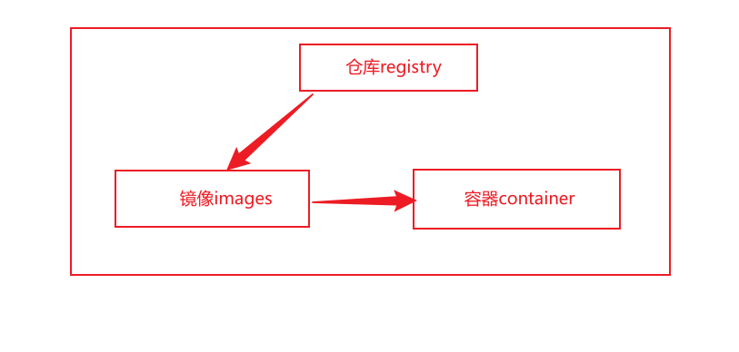
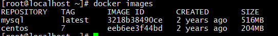
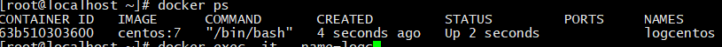
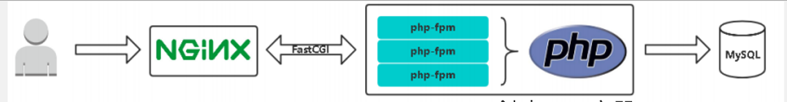

# Docker容器

https://www.mubu.com/doc/5UucyD9Wus1

### 1. 定义

#### 1. 容器

- **容器是对进程进行封装隔离**，属于操作系统层面的虚拟化技术，由于隔离的进程独立于宿主机和其他隔离的进程，因此也被称为容器
- **容器包含完整的运行时环境**：除了应用程序本身之外，还有这个程序的全部依赖、类库、其他二进制文件、配置文件等等，统一都被打入了一个容器的镜像包中


#### 2. 虚拟机和容器的区别

- 启动方面

  - 虚拟机：分钟级别

  - 容器：秒级

- 硬件资源方面

  - 虚拟机：独占CPU资源、内存和硬盘资源等

  - 容器：共享资源

- 硬盘占用方面

  - 虚拟机：一般都是GB

  - 容器：一般都是MB

- 性能方面

  - 虚拟机：弱于原生

  - 容器：接近原生，处理速度更快


#### 3. Docker

- docker是一个开源的项目，诞生于2013年，**基于GO语言开发的**。目前属于Linux基金会

- **docker的基础是Linux容器化技术（LXC）**，在LXC基础上docker进行进一步的封装，可以让用户不去关心容器内部的实现，只需要方便的使用即可
- **docker可以类似于虚拟机的多个再生，就如虚拟机是在windows下的再生**
- **每个docker环境都类似于一个小型linux系统，不同容器内的项目运行互不干扰，不会因为端口号的问题而受影响(通过宿主机和容器之间的端口映射)**
- **优点是可以打包自己项目的容器，方便部署到其他服务器，可以直接运行**


#### 4. 仓库、镜像和容器



- 从仓库拉取一个镜像；运行镜像后就成为了一个容器
- 容器是运行的镜像，类似于进程和程序的关系
- 容器和仓库之间没有关系

##### 1. 仓库Registry

- 仓库是集中存放镜像文件的场所，docker用仓库来保存用户构建的镜像，Registry分为公有仓库和私有仓库两种：公有仓库比如docker公司运行的仓库docker hub，私有仓库比如使用自己的账号在docker hub注册建立的仓库

##### 2. 镜像image

- 不同镜像里面包含不同的软件(比如mysql、tomcat镜像)以及其运行环境，按照自己的需要从仓库里面拉取
- 用镜像来创建容器，用户基于镜像来运行自己的容器

##### 3. 容器contianer

- 一个容器就类似于一个进程，可以通过`ps`命令查看

- 容器是从镜像创建的运行实例。它可以被启动、开始、停止、删除。
- 每个容器都是相互隔离的，容器必须依赖镜像来启动，容器中可以运行一个或者多个进程。
- 容器一旦启动完成后我们就可以登录到容器中安装自己需要的软件或者服务。


---

### 2. 命令

#### 1. docker命令

- 启动、停止、重启、查看状态

```
sytstemctl start/stop/restart/status docker
```

- 查看docker概要信息

```
docker info
```

- 查看docker版本信息

```
docker version
```


#### 2. 镜像命令



> REPOSITORY可以看作是镜像的名字

- 查看本地镜像

```
docker images
```

- 搜索镜像

```
docker search 镜像名
```

- 拉取一个镜像

```
docker pull 镜像名:tag					//不加":版本",会自动拉取最新的latest
```

- 上传一个镜像

``` 
docker push 镜像名:tag
```

- 删除镜像

```
docker rmi 镜像ID
```

- 删除所有镜像

```
docker rmi $(docker images)
```

- 查看镜像或者容器的详细信息

```
docker inspect 镜像的ID(或者容器的ID)
```


#### 3. 容器命令

##### 1. 查看容器

- 查看运行的容器

```
docker ps						//每个容器类似于一个进程
```

- 查看所有容器

```
docker ps -a
```

​			

##### 2. 创建容器

```
docker run
```

==参数==

- `-i`：表示启动容器
- `--name`：为创建的容器来定义一个名称
- `-v`：目录挂载，将主机上的目录挂载到容器内部，实现数据持久化。前者是宿主机目录，后者是容器中的目录，可以使用多个目录映射，注意：如果产生了目录映射，那么这两个目录就是同步关系，不论修改宿主机的还是容器中的目录，目录中的内容都会改变
- `-p`：端口映射，将容器内部的端口映射到宿主机上；前者是宿主机的端口，后者是容器内部的映射端口
- `-t`：容器启动后登陆容器，进入伪终端，`exit`退出后容器就关闭
- `-d`：容器启动后后台运行，不会进入伪终端，不会自动关闭


==创建容器==

- 创建守护式容器(后台)


```
docker run -id --name=容器名 镜像名称:标签			
//例: docker run -id --name=logcentos centos:7
//	  docker run -id --name=thimysql  mysql			//如果默认的是最新的，则不用指定版本号
```

- 登陆守护式容器



```
docker exec -it 容器名称或者容器ID /bin/bash		//CONTAINER ID 或者 NAMES
```

> 最后一个参数`/bin/bash`是指定容器启动后要执行的命令，一般进入命令行shell使用`/bin/bash`
>
> 将容器启动时的命令设置为 `/bin/bash` 时，可以在容器启动后自动进入 Bash Shell 中，从而进行临时管理和操作容器，例如查看容器内的文件、修改配置、执行命令等。
>
> - `/bin/bash` 可以简化为`bash`

- 创建交互式容器

```
docker run -it --name=容器名称 镜像名称:标签 bash
```

- 退出当前容器

```
exit
```


##### 3. 启动容器

- 启动/重启/停止容器

```
docker start/restart/stop 容器名称或者ID
```


##### 4. 删除容器

- 删除指定容器

```
docker rm 容器名称或者ID					//只能删除关闭状态下的容器
```

- 删除所有容器

```
docker rm -f $(docker ps -a)
```


---

### 3. 文件复制

- 宿主机和容器之间的文件复制

```
docker cp 宿主机文件 容器名:容器路径		//第一个为源，第二个为目的
docker cp 容器名:容器文件	宿主机路径
```


---

### 4. 端口映射

#### mysql容器的部署

##### 1. 拉取mysql镜像

```
docker pull mysql:5.7
```

##### 2. 创建

```
docker run -id --name=mysql -p 3306:3306 -e MYSQL_ROOT_PASSWORD=123456 -e MYSQL_DATABASE=carRental -v $script_dir/sql:/docker-entrypoint-initdb.d  mysql:5.7 --character-set-server=utf8
```

- `-p` 代表端口映射：前面是宿主机端口，后面是容器端口
- `-e` 代表添加环境变量，添加多个，需要多个`-e`
- `MYSQL_ROOT_PASSWORD=123456` 是设置root用户的登录密码为123456
- `MYSQL_DATABASE=carRental` 创建容器时就创建数据库`carRental`

- `-v` 文件映射
- `/docker-entrypoint-initdb.d`  mysql容器创建时会自动执行该文件中的脚本
- `--character-set-server=utf8`  设置字符格式


##### 3. 登陆

```
docker exec -it 容器名或ID bash
```

##### 4. 登陆内部的mysql

```
mysql -uroot -p123456
```


----

### 5. 目录映射

#### 1. 两种方式

- `-v`

```
使用 -v 参数：-v /host/data:/container/data
```

- `--mount`

```
使用 --mount 参数：--mount type=bind,source=/host/data,target=/container/data

//type 可以省略，默认为bind捆绑
//source 可以简化为src
//target 可以简化为dst
```

> - 两种方式效果一样，都是宿主路径:容器路径
>
> - 对于宿主路径，如果不指定路径，只写一个名字，则系统会自动创建这个名字的数据卷


#### 2. 数据卷

**用来持久化存储容器中的数据，并且在容器之间进行数据共享**

##### 1. 创建数据卷

```
docker volume create 数据卷名字				//比如nginx-vol，后面加vol指明是个数据卷
```

##### 2. 查看数据卷

```
docker volume ls
```

##### 3. 查看数据卷的挂载目录

```
docker volume inspect 数据卷名称
```

##### 4. 使用数据卷创建容器

```
docker run -id --name=容器名 -v 数据卷名:容器内目录	镜像名:标签
//docker run -id --name=nginx-test -v nginx-vol:/usr/share/nginx/html nginx
```

- `-v` **参数是指定数据卷映射、 nginx-vol是宿主机中的数据卷名称 、 /usr/share/nginx/html 是容器中的映射目录路径**

- **如果没有创建数据卷、系统会自动创建数据卷**
- **容器中映射出来的数据都放在数据卷的_data目录下**
- **如果要映射多个文件，则在后面多加**`-v 数据卷名:容器内目录`

##### 5. 删除数据卷

```
docker volume rm 数据卷名称					//删除前，必须将该数据卷对于的容器删除
```


----

### 6. Dockerfile

- **dockerfile是由一系列命令和参数构成的脚本，这些命令应用于基础镜像并创建一个新的镜像**
- **dockerfile文件名只能是dockerfile，不可以设置为其他名字**

```dockerfile
#指定用哪个镜像来构建新镜像
FROM centos:7
#指定镜像创建者信息
MAINTAINER xxxx
#切换工作目录
WORKDIR /usr
RUN mkdir /usr/local/java
#ADD 是相对路径jar,把java添加到容器中
ADD jdk-8u202-linux-x64.tar.gz /usr/local/java/
#配置java环境变量
ENV JAVA_HOME /usr/local/java/jdk1.8.0_202
ENV PATH $JAVA_HOME/bin:$PATH
```

#### 1. 参数

- `FROM image_name:tag`  定义了使用哪个基础镜像启动构建流程
- `MAINTAINER user_name`  说明创建这个镜像的创建者
- `ENV key value` 设置环境变量（可以写多条）
- `RUN command`  运行shell命令，是Dockerfile 的核心部分，可以写多条
- `ADD source`  将宿主机文件复制到容器内，如果复制的是一个压缩文件，就直接会在复制之后自动解压
- `COPY source`  只是将宿主机文件复制到容器内，不会解压
- `WORKDIR path`  设置工作目录，即登陆到容器内的初始地址


#### 2. 构建镜像

==命令==

```
docker build .
```

==参数==

- `-t` 指定镜像名称

- `-f` 指定Dockerfile的路径

- 末尾的`.` 指定当前的建上下文的路径

  ```
  docker build -t 镜像名:版本号  -f /Dockerfile .
  //docker build -t centosjava:latest -f /Dockerfile .
  ```

  >  注意：命令最后的空格.不要忘记，意思是指定当前的建上下文的路径，需要将这个路径下的文件或目录传给Docker引擎，供构建过程使用。
  >
  > 如果不指定dockerfile的路径，只使用`.`，则可以在当前目录下找dockfile文件以及构建需要的文件


---

### 7. 利用容器搭建lnmp网络

#### 1. 平台架构




#### 2. 构建lnnmp网络

```
docker network create lnmp
```


#### 3. 创建容器

##### 创建mysql容器

```
docker run -id --name lnmp_mysql --net lnmp --mount src=mysql-vol,dst=/var/lib/mysql -e MYSQL_ROOT_PASSWORD=123456 -e MYSQL_DATABASE=wordpress mysql:5.7 --character-set-server=utf8
```

- `--net` 指定网络
- `--mount` 挂载目录，这样不需要进入容器内就可以修改配置文件

- `-e` 声明环境变量，之间修改了数据库地址和创建数据库


##### 创建php容器

```
docker run -id --name lnmp_php --net lnmp --link lnmp_mysql:lnmp_mysql --mount src=wwwroot,dst=/wwwroot cytopia/php-fpm-5.4
```

- `--link` 让php容器连接sql容器


##### 创建nginx容器

```
docker run -id --name lnmp_nginx --net lnmp -p 88:80 --link lnmp_php:lnmp_php --mount src=nginx-vol,dst=/etc/nginx/conf.d --mount src=wwwroot,dst=/wwwroot nginx
```

- `--link` 让nginx容器连接到php容器
- `-p` 映射端口
- `--mount` 可以指定两次，同`-v` 可以挂载多次

