# linux

5.5~

[Linux - 幕布 (mubu.com)](https://mubu.com/doc/7IlDn_O9Uc1)

https://www.mubu.com/doc/1pqqZoSTOV1

### 一、关于Linux

#### 1. linux的版本

- **内核版本**：开发版、稳定版。

- **发行版本**：在内核的版本上添加了很多常用的软件的版本，有的是收费的，有的是免费的。

  - red hat：红帽，是收费的主流版本，发行的公司叫做红帽，如果需要有良好的售后，更加稳定可靠的性能，可以选择，一般只有中大型公司才会使用。

  - centos：是免费开源的，基于medhat版本的源码来开发的，性能和红帽接近，但是没有售后，一般小型公司会使用，我们使用centos的版本是7。

  - ubuntu：是一个带图形化界面的版本，主要是给个人用户来使用，接近windows的操作方式，如果自己电脑的硬件条件太差，可以使用这个版本。

#### 2. linux的使用

- **桌面可视化**：仅限带图形界面的linux版本，企业中一般不会这样使用。

- **使用shell命令行**

  - 企业中：通过ssh工具来远程操作服务器

  - 个人学习：在电脑上装一台虚拟机，也是用ssh工具来连接虚拟机中的Linux操作系统

  - shell版本有很多，centos默认的版本bash shell

- **常用的ssh工具**：**ssh是一种协议，叫做远程安全连接协议，默认使用的端口号是22**。

  - 命令行shell工具：xshell、putty（开源）。

  - 文件传输工具：xftp、winscp（开源）。
    - 在windows系统和linux操作系统之间来进行文件传输，可以通过可视化界面来完成。


---

### 二、linux系统目录结构

>  linux系统目录的结构：所有的目录都是起源于根目录下 / 


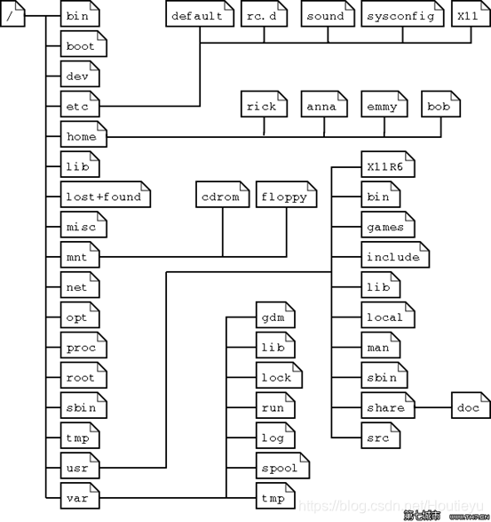

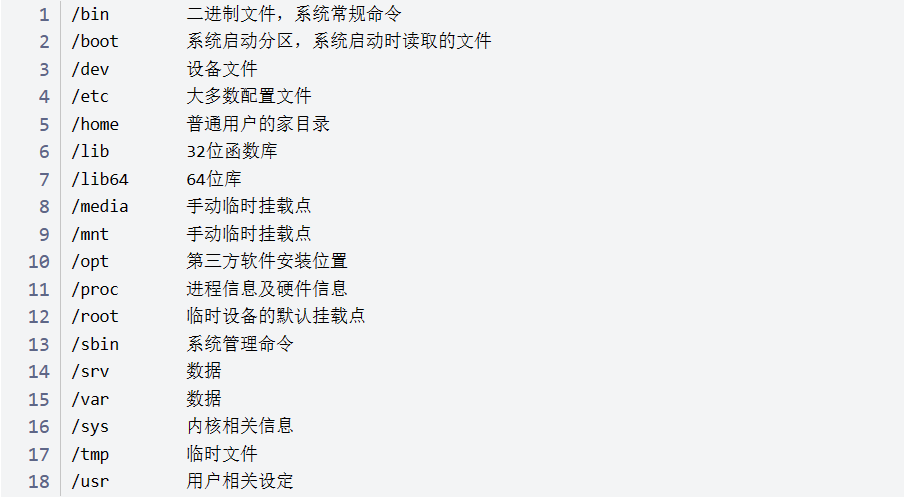

#### 1.可动目录

- /etc：etc 是 Etcetera(等等) 的缩写，系统和应用程序所需要的各种**配置文件**存放的目录

- /mnt：挂载目录，有的是使用/media。挂载：因为**linux操作系统管理硬件的时候，会将硬件当做文件来进行管理**，当一个新的硬件介入系统的时候，是无法直接使用的，需要我们使用挂载命令将硬件挂载到/mnt或者/media目录下，系统才能识别它。

  > 比如：我们可以将光驱挂载在 /mnt/ 上，然后进入该目录就可以查看光驱里的内容了。

- /tmp：temporary(临时) 的缩写，**临时文件**存放的目录，每次重启之后会删除

- /var：变量variable的缩写，里面存放的是**快速变化的一些文件，比如说日志文件**。

- /home：**存放普通用户的基本信息的目录，也叫做家目录**，系统一般会使用~来替代。当一个普通用户登录系统的时候，刚开始所在的目录就是家目录

- /root：**管理员的家目录**，如果使用root登录，会直接登录在/root目录下，而不是在/home目录下。

- /opt：optional(可选) 的缩写，可选的附加引用程序安装目录，**存放安装的其他程序**

  

#### 2. 不可动目录

- /bin：二进制binary的简称，**存放可以直接执行的一些命令**

- /boot：**开机启动的一些系统引导文件**

- /dev：设备device的缩写，**存放系统各个硬件设备的目录**。

- /lib：Library(库) 的缩写，**存放系统的共享库**，类似于windows下的system32这个目录。

- /sbin：s 就是 Super User 的意思，是 Superuser Binaries (超级用户的二进制文件) 的缩写，**管理员命令存放的目录**

- /usr：unix shared resources(共享资源) 的缩写，用于**存放系统应用程序的目录**。类似于windows下的program files文件夹
- /run：是一个临时文件系统，**存储系统启动以来的信息**。

> /sbin 下的命令属于基本的系统命令，如shutdown，reboot，用于启动系统，修复系统，/bin下存放一些普通的基本命令，如ls,chmod等，


---

### 三、linux命令行

#### 1. linux命令行含义

```
示例：root@app00:~# 
root    //用户名，root为超级用户
@       //分隔符
app00   //主机名称
~       //当前所在目录，默认用户目录为~，会随着目录切换而变化，例如：（root@app00:/bin# ，当前位置在bin目录下）
#       //表示当前用户是超级用户，普通用户为$，例如：（"yao@app00:/root$" ，表示使用用户"yao"访问/root文件夹）

```


#### 2. linux终端命令格式

```
命令关键字 参数1 参数2.... 操作对象
```

- 注意点：**区分大小写、参数可以分开写，也可以合并。 参数可以有也可以没有、参数和参数之间、命令和参数之间 要用空格隔开**
- 查阅命令帮助信息

```
命令 --help				//显示 command 命令的帮助信息
```

```
man 命令					//查阅 command 命令的使用手册
```

- 命令简化

```
clear					//清屏
history					//查看历史指令
上下箭头				 //查看上个指令
tap						//命令补全
```


---


### 四、用户相关

#### 1. 用户管理

##### 1. 新建用户

```
useradd 用户名
```

##### 2. 修改密码

```
passwd 用户名
```

##### 3. 删除用户

```
userdel -r 用户名          //参数r代表同时删除home下该用户的所有文件
```

##### 4. 切换用户

```
su 用户名					//切换用户名所代表的用户，su是switch user的缩写；普通切换只代表用户身份的临时切换，不会改变工作目录和环境变量。
```

```
su - 用户名				//加`-`，则不仅切换用户的工作目录，也切换了用户的环境变量
```

##### 5.  查看当前用户

```
whoami					//查看当前用户
```

##### 6. 退出用户

- 同系统的三种注销操作

```
exit
```

```
logout					 
```

```
ctrl+D
```


#### 2. 权限管理

##### 1. 文件详情

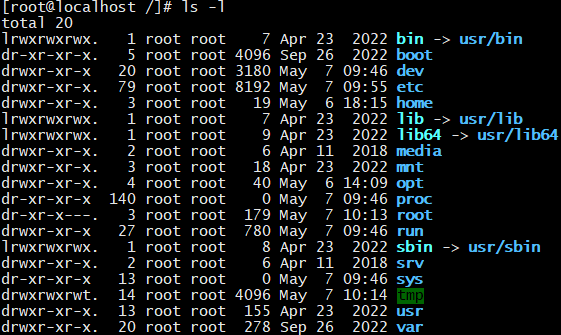

- 第一列：共10个字符:第一位是文件类型，后九位是文件权限

  ```
  文件类型：
  d开头的是目录
  -开头的是文件
  c开头的是字符设备-如键盘
  b开头的是块设备-如硬盘
  l开头的是链接-该文件链接到那个路径下
  
  文件权限简介：'r' 代表可读（4），'w' 代表可写（2），'x' 代表执行权限（1），括号内代表"8421法"
  ##文件权限信息示例：-rwxrw-r--
  -第一位：'-'就代表是文件，'d'代表是文件夹
  -第一组三位：拥有者的权限
  -第二组三位：拥有者所在的组，组员的权限
  -第三组三位：代表的是其他用户的权限
  ```

- 第二列：如果是目录，显示的是这个目录下一级的**子目录的个数**，如果是普通文件，代表的是**文件的硬链接个数**

  ```
  ln hello.sh /home/alex/demo_110	 //建立硬链接
  ```

- 第三列： 文件/目录的所有者

- 第四列：文件/目录的所属组

- 第五列：文件/目录的大小，默认是以字节来展示的

- 第六列：是最后的修改时间

- 第七列：名称

##### 2. 权限分类

- `'r'` 代表可读，能查看文件夹中的内容，比如使用ls命令来查看文件夹中的内容
- `'w'` 代表可写，能创建和删除文件，比如在文件夹下面使用touch来创建一个文件
- '`x'` 代表执行权限，对于目录来说，执行权限是最基本的权限，表示能够进入该目录

##### 3. 用户分类

- `owner`：文件的所有者，一般来说谁创建了这个文件谁就是所有者
- `group`：文件的所属的工作组，一般来说，创建这个文件的用户所在的工作组就是所属组
- `other`：其他用户

##### 4. 修改权限

- **`chmod`命令：只有`root`和`owner`可以修改权限**

```
  普通授权    chmod +x a.txt    
  8421法     chmod 777 a.txt     //1+2+4=7，"7"说明授予所有权限
```


###### 普通授权

==语法==

```
chmod [who][op][permission] 文件名/目录名
```

- who

```
u 拥有者
g 所属组
o 其他人
a 所有人
```

- op

```
+ 增加权限
- 取消权限
```

- permission

```
r读 w写 x执行
```

==使用==

```
chmod a+w 文件名				//给所有人增加写权限

//用户可以叠加  权限也可以叠加
chmod uo-wx 文件名				//给所有者和其他人取消写和执行权限
```


###### 8421法

**`'r'` 代表可读（4），`'w'` 代表可写（2），`'x'` 代表执行权限（1），括号内代表"8421法"**

```
chmod 777 a.txt     //1+2+4=7，"7"说明授予所有权限
```


---

### 五、系统相关

#### 1. 系统时间


##### 1. 查看系统时间

```
date
```

##### 2. 修改时间

```
date -s '20240505 14:22:12'			//可以单独修改日期、时间，也可以都修改
```

##### 3. 删除本地时区

```
rm -rf /etc/localtime
```

##### 4. 设置本地时区

```
ln -s /usr/share/zoneinfo/Asia/Shanghai /etc/localtime
```

##### 5. 同步时间命令

```
ntpdate ntp1.aliyun.com				//直接通过阿里云地址来同步时间		
```

##### 6. 日期输出为数字格式

```
date +%Y%m%d						//20240507
date +%Y							//2024 只输出年,同理可以输出年、月、日、小时、分钟、秒
```


---

#### 2. 存储占用


##### 1. 磁盘空间

```
df -Th					// disk free 查看磁盘占用空间情况
```

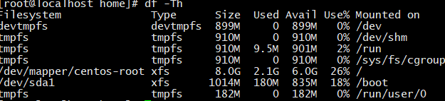

- `type`：xfs文件系统、tmpxfs临时文件


##### 2. 文件空间

```
du						//disk usage 当前目录下的文件占用情况
du -a					//-a 查看所有文件
du -ah	或者 du -a -h	  //-h 以K  M  G为单位显示，提高可读性~~
```

> ​	du，disk usage,是通过搜索文件来计算每个文件的大小然后累加，du能看到的文件只是一些当前存在的，没有被删除的。他计算的大小就是当前他认为存在的所有文件大小的累加和。
>
> ​	df，disk free，通过文件系统来快速获取空间大小的信息，当我们删除一个文件的时候，这个文件不是马上就在文件系统当中消失了，而是暂时消失了，当所有程序都不用时，才会根据OS的规则释放掉已经删除的文件， df记录的是通过文件系统获取到的文件的大小，他比du强的地方就是能够看到已经删除的文件，而且计算大小的时候，把这一部分的空间也加上了，更精确了。
> ​    当文件系统也确定删除了该文件后，这时候du与df就一致了。

##### 3. 内存空间

```
free 
free -h					//-h 以K  M  G为单位显示，提高可读性~~
free -m					//以M为单位显示
```

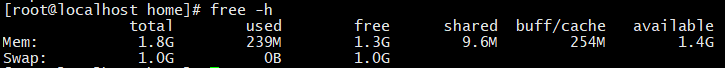

- `Mem`代表内存、重点关注；	`Swap`代表交换分区、不用关心

- `buff/cache` ：缓冲区、将容量积攒到一定大小后再进行IO，节省cpu资源


##### 4. 进程空间

```
top					//用来监控linux的系统状况、常用的系统性能分析工具，能够实时显示系统中的各个进程的资源占用情况
ctrl+c 				//快捷键退出实时监控终端
```

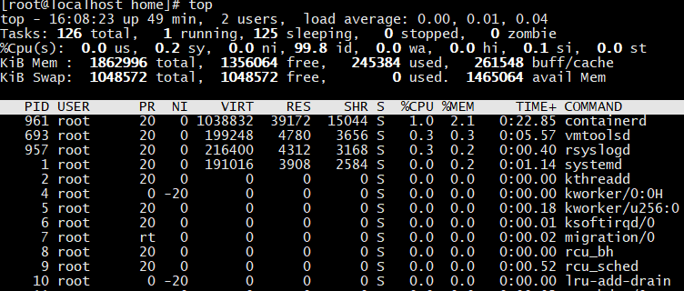

- tasks: zomble:僵尸进程数
- PR：父级进程
- TIME+:进程运行的时间统计
- COMMAND:运行进程的命令


---

#### 3. 关闭重启系统


##### 1. 关机

- `-h`代表halt

```
shutdown -h now 或者 poweroff	   //立刻关机
shutdown -h 2					//两分钟后关机
shutdown -h 20:00 				//晚上8点整关机
```

##### 2. 重启

- `-r`代表重启

```
shutdown -r now 或者 reboot		//立刻重启
shutdown -r 2 					 //两分钟后重启
shutdown -r 20:00 				//晚上8点整重启
```

##### 3. 取消延时操作

```
shutdown -c 					//取消刚刚的延时关闭或者重启命名
```

##### 4. 注销

- 注销命令用于退出当前登录的用户会话，返回到登录界面或者重新输入用户名和密码。

```
1. logout
2. exit
3. 快捷键ctrl+D
```


---

#### 4. 网络相关

##### 1. 查看IP地址

```
ip addr					//方式一，linux自带
```

```
ifconfig				//方式二，需要yum下载net-tools
ifconfig ens33 			//查看指定网卡的信息
ifconfig -a				//查看所有网卡信息，包括隐藏的网卡
```


##### 2. 检查网络连通性

```
ping 目标ip/域名                //ping检查网络连通性以及检查网速
ping -c 5 目标ip/域名           //c：count个数   指定只发5个测试数据包
```


##### 3. 修改网络接口配置

```
vim /etc/sysconfig/network-scripts/ifcfg-ens33
```

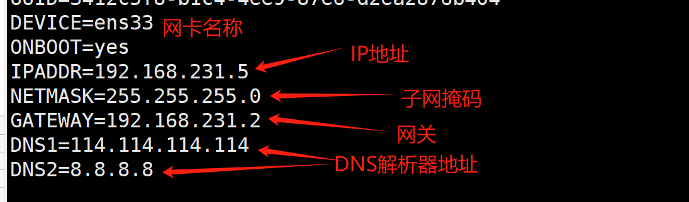

- 修改完配置重启网卡

```
systemctl restart network
```


##### 4. 配置映射

```
vim /etc/hosts
```

- 文件末尾添加映射地址

```
192.168.1.101  node1
192.168.1.102  node2
192.168.1.103  node3
```

>  配置好以后保存退出，输入命令：ping node1 ，可见实际 ping 的是 192.168.1.101。


---

#### 5. 进程相关

​	**`ps`:process status**

##### 1. 查看进程

- `shell`本身就是一个进程

==两类参数==

- `a`：显示一个终端的所有进程，除会话引线外；
- `u`：显示进程的归属用户及内存的使用情况；
- `x`：显示没有控制终端的进程；
- `-e`：显示所有进程，包括终止的进程(一段时间内终止的，等待系统清理)；
- `-f`：输出一个更加完整的信息

```
ps aux					//可以查看系统中所有的进程
ps -ef					//两种显示所有进程的方式

ps -ef | grep xx		//连接管道符号|   显示所有进程名字中带xx的进程详细信息
```


##### 2. 进程终止

- **自行终止**
  - 任务执行完成，如`ps`
  - 用户让其退出，如`vi`
  - 异常退出

- **手动杀死进程**，只能由`root`和`owner`执行

```
kill 进程ID			
kill -9 进程ID			//-9强制终止
ctrl+c					 //快捷键强制终止
```


---

#### 6. 端口相关

`netstat` 查看开放这些端口的具体进程和用户，通常与`grep`联用查找特定的端口号

==参数==：

- `a`：列出所有当前的连接
- `t`：列出tcp协议的连接
- `u`：列出udp协议的连接
- `n`：禁用域名解析功能，只显示ip不显示主机名
- `l`：列出正在监听中的连接
- `p`：查看对应的进程信息

```
man netstat	 //查看使用手册

netstat -ntlp | grep 3306	 //通常与grep联用查找特定的端口号
```

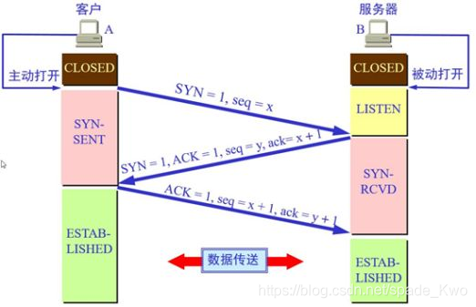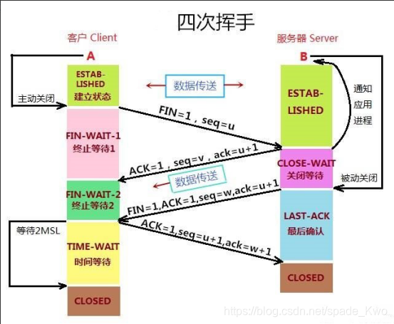

> 三次握手、四次挥手时的状态
>
> listening:监听 表示这个端口正在开放 可以提供服务
>
> established：已建立连接 是对方与你已经产生了连接 正在通信交换数据


---


#### 7. 远程登陆

```
ssh ip
```


---


### 六、文件和目录

#### 1. 目录操作


##### 1. 绝对路径和相对路径

##### 2. 切换目录

```
cd  文件绝对地址		//change directory
cd .				// ./表示当前目录
cd ..				// ../表示返回上一级目录
cd ~				//进入当前用户的家目录：root用户进入/root 、普通用户进入/home
cd 					//只输入cd则等同于'cd ~' 回到家目录
cd -				//返回上一次所在的目录
```

##### 3. 查看当前目录

```
pwd					//print working directory 显示当前工作路径
```

##### 4. 查看目录下的文件

```
ls	
ls -l				//显示文件和目录的详细资料：包括权限、日期、创建人
ll					//等价于ls -l
ls -a				//all 显示所有文件，包括隐藏文件
ls -h				//human 将文件更方便人来阅读，比如大小以GB、KB等方式展示
ls  路径名			  //如 'ls /home' 查看特定目录下的文件
```

##### 5. 创建目录

```
mkdir 文件夹1 文件夹2 文件夹n		  //在当前目录下创建文件夹,创建多个文件夹用空格分开
mkdir -p 文件夹1/文件夹2				//加p递归创建，如果文件夹1不存在则先创建1再创建1里面的2
```

##### 6. 删除空目录

```
rmdir 文件夹名					//rmidr只能删除空目录，一般使用rm操作来删除
rmdir  -p  文件夹1/文件夹2
```


---

#### 2. 文件操作

##### 1. 文件名和特殊文件

- **linux文件名**

  - 大小写敏感，没有专用扩展名

  - A2024 和 a2024 是两个文件

  - a.txt表示整个文件的名称是a.txt，并非是一个文本文件

- **Linux的特殊文件**

  - `/` 表示根目录

  - `.` 代表当前目录

  - `..` 代表上一级目录

  - `.字符串` 表示隐藏文件

##### 2.  创建文件

```
touch	文件1 文件2 文件n
touch 	指定目录/文件名
touch	"hello word"				//创建带空格的文件，需要加双引号
```

##### 3. 查看文件

- `cat`查看短文件

```
cat 文件名
cat -n 文件名				//查看文件的行数
tac 文件名					//倒着展示文件，从末尾开始
```

- `less`查看长文件

```
less 文件名
```

```
//查看长文件后
k: 向上一行
j: 向下一行
pgup: 向上一页
pgdn: 向下一页
q: 退出
/字符: 查找关键字，关键字将高亮展示
```

- `more`只显示一页/一屏

```
more 文件名			//可以显示当前读了百分之多少
```

```
//more之后
回车键: 向下一行
空格: 显示下一屏内容
q: 退出
```

- `head`从头开始查看

```
head 文件名			//默认显示前10行
head -30 文件名		//指定显示前30
```

- `tail`从尾部实时查看

```
tail 文件名			//默认后10行
tail -30 文件名		//指定后30行  等同于tail -n 30 文件名，n可加可不加
tail -f 文件名			//实时监控文件尾部，只能用'ctrl+c'退出
tail -30f 文件名		//实时监控尾部30行
```


##### 4. 复制文件或目录

```shell
cp 源文件 目标文件						//如果目标文件存在则确认是否覆盖、没有则复制源文件并改名
cp 源文件 目标目录						//将源文件复制到文件夹中
cp 源文件 目标目录/文件名				  //复制到目标文件夹并重命名

//复制目录需要加r：'-r'代表在目标目录递归复制,没有的目录自动创建	
cp -r 源目录 目标目录					//复制源文件夹到目标文件夹中; 
cp -r 源目录 源文件 目标目录			  //可以同时复制文件和文件夹到目标文件夹中
```


##### 5. 移动文件或目录

- **如果目标文件(目录)和源文件(目录)名地址相同则是重命名**

```
mv 源文件 目标文件					//若地址相同则是重命名
mv 源目录 目标目录	
```

- **地址不同则是移动**

```
mv 源文件 目标目录					//将源文件移动到目标文件夹中
mv 源文件 目标目录/文件名			  //移动到目标文件夹中并且重命名
mv 源目录 目标目录					//将源文件夹移动到目标文件夹中
```


##### 6. 删除文件或目录

```
rm 文件名							
rm -f 文件名					//-f参数(force)表示不用提示是否删除，默认为yes

//删除目录需要加r,递归删除
rm -r 目录名					//删除整个文件夹	
rm -rf 目录名					//删除文件夹并且不提示
rm -rf 目录名/*				//清空整个目录
```


---

#### 3. 文本编辑

- `vi/vim`：是所有linux系统支持的文本编辑器

- ```
  vi(vim) 文件名			//如果存在则进入该文件，若不存在则新创建同名文件
  ```

- `vimtutor`：终端下输入`vimtutor`进入linux自带的vim教程


##### 1. vi命令模式

刚进入文件时就默认的命令模式也叫普通模式，不可插入数据和按回退键(Backspace)删除数据

1. 移动操作，移动的基本命令都可以和其他操作进行联用

|         操作         |                  效果                   |
| :------------------: | :-------------------------------------: |
|      k、j、h、l      |               同上下左右                |
|      `<ctrl>`+f      |           往下翻一页(forward)           |
|      `<ctrl>`+b      |            往回翻一页(back)             |
|      `<ctrl>`+d      |            往下翻半页(down)             |
|      `<ctrl>`+u      |             往上翻半页(up)              |
|          0           |          移动到当前所在行行首           |
|          $           |          移动到当前所在行行尾           |
|          gg          |       移动到文件开头(第一行行首)        |
| `<shift>`+g或者大写G |        移动到文件最后一行的行首         |
|    `n`G或者`n`gg     |   n是指定的行号，再按G跳到指定行行首    |
|          w           | 往后移动一个单词(`nw`：向后移动n个单词) |
|          b           | 往回移动一个单词(`nb`：往回移动n个单词) |

2. 删除操作

|       操作        |                效果                 |
| :---------------: | :---------------------------------: |
| x或者`<delete>`键 | 删除单个字符(`nx`：向后删除n个字符) |
|        dw         |            删除一个单词             |
|        dd         |    删除一行(`ndd`: 向后删除n行)     |
|        d$         |    删除当前行光标之后的所有单词     |
|        d0         |    删除当前行光标之前的所有单词     |
|        dG         |        删除光标之后的所有行         |
|        dgg        |        删除光标之前的所有行         |
|  gg+dG或者G+dgg   |  删除所有行，跳到行首或者行尾再删   |
|         u         |            撤销删除操作             |

3. 替换操作

| 操作 |                  效果                  |
| :--: | :------------------------------------: |
|  r   |  光标所在位置按r，再输入要替换的字母   |
|  cw  |      删除当前的单词，进入插入模式      |
|  cc  | 删除当前一行，进入插入模式等价于`dd+o` |

4. 复制操作

| 操作 |     效果     |
| :--: | :----------: |
|  yw  | 复制一个单词 |
|  yy  |   复制一行   |
|  p   |     粘贴     |

5. 撤销操作

|    操作    |      效果      |
| :--------: | :------------: |
|     u      |      撤销      |
| `<ctrl>`+r | 重做(取消撤销) |


##### 2. vi插入模式

根据下方的操作可以进入插入模式，插入模式下进行文件增加/修改数据；

按`esc`切换到命令模式

|   操作   |                效果                |
| :------: | :--------------------------------: |
|    i     |            光标之前插入            |
|    a     |            光标之后插入            |
| I(大写i) |         光标当前行行首插入         |
| A(大写a) |         光标当前行行尾插入         |
|    o     | 光标下面插入新的一行，在新行首插入 |
| O(大写o) | 光标上面插入新的一行，在新行首插入 |
| `<esc>`  |           切换回命令模式           |


##### 3. vi底线模式

底线模式做一些控制操作：保存、退出、另存为、查找、等

1. 按`:` 进入底线模式

2. 退出操作：`q`

3. 保存并退出：`wq`

4. 退出时加`！`强制退出

5. 复制数据保存到其他文件，同其他编译器的“另存为”

  ```
  1,3 w 目标文件名				//1，3代表从第一行到第三行; w代表写 ; 表示前三行写入到文件中
  w 目标文件名 				//将整个文件写入到目标文件中
  ```

6. `set nu`  ：在每一行的行首来显示行号

7. `set nonu`  ：关闭显示行号

8. `n`  ：输入数字n，按回车直接跳到数字指定行的行首

9. `/关键字`  ：过滤(查找)字符

  ```
  n 				//向下查找
  shift+n			//向上查找
  set ic 			//忽略大小写
  set noic		//设置不忽略大小写
  ```

10. `! 命令`：不退出当前文件下执行linux命令，执行返回原位置

    ```
    ! ping baidu.com	//执行完返回到刚刚操作文件的位置
    ```

11. 替换操作：

    ```
    $s/hello/hi/g			//$s替换所有把所有行的hello单词替换成hi，不加g(global)只替换每行的第一个hello
    ```

    

---

#### 4. 文件三剑客


##### 1. find查找文件

​	在指定的目录及其子目录下面**查找符合条件的特定文件或文件夹**，当我们忘记了文件路径的时候，可以使用这个命令来查询

==语法==

```
find 参数 文件名
```

==参数==

- 参数 `-name` ：指定文件名或目录名
- 参数`-iname`：不区分大小写
- 参数`-type` ：指定查找的类型
- 参数`-size`：文件大小范围

```
find -name 文件名(目录名)				//将会在当前目录下查找同名的文件和文件夹

find 目标目录 -name 文件名(目录名)	 //将会在目标目录下查找同名的文件和文件夹
find . -name 文件名				 //在当前目录下查找文件，等同于不加指定目录
find / -name 文件名				 //在根目录下查找文件

find -name 文件名 -type f			 //只查找文件
find -name 目录名 -type d		     //只查找目录

find -name 文件名 -size +199M		 //查找文件大于199M的文件或目录

find -iname 文件名					 //不区分大小写查找
```


==通配符==：主要使用`*` 和`？`来进行模糊搜索；

- `*`不限制匹配个数
- `？`则只匹配单个字符
- `[abc]` 表示a或者b或者c，可以与`*`和`？`一起使用

```
find -name "a*"    				//表示以a开头的文件
find -name "a*d"
find -name "*d"

find -name "a??"				//表示名字以a开头，后面只有两位的文件
find -name "a?b"				

find -name "[abc]*"				//表示以a或者b或者c开头的文件
```


---

##### 2. sed编辑文件

​	**可以依照脚本的指令来处理，编辑文本文件，主要对文件进行增删改查的操作**

==语法==

```
sed 参数 动作 文件名
```

==参数==

- `-e`：可以指定多个命令

  ```
  sed -e 's/new/old/gi' -e '2d' 文件名			//每个操作前加e,可以同时执行多个操作
  sed -i -e 's/new/old/gi' -e '2d' 文件名		//-i不可以和-e写一起(-ie),-i可以写到任意位置
  ```

- `-n`：取消默认控制台输出，与p一起使用可以打印指定的内容

  ```
  sed -n '1p' 文件名								//单独打印第一行,不加n则会把所有的都输出且第一行多输出一行
  ```

- `-i`：由于sed默认是显示修改后的内容，不会修改原文件，除非使用-i参数

  ```
  sed -i '操作' 文件名								//操作将会影响到源文件
  ```

==动作==

- `a`：新增

  ```
  sed '2a 内容' 文件名				//在第二行添加一行
  sed '1,3a 内容' 文件名			//在第一到三行每行后面都新增一行内容
  sed '$a 内容' 文件名				//在最后一行后面新增一行内容
  ```

- `d`：删除

  ```
  sed '2d' 文件名				//删除第二行
  sed '1,3d' 文件名				//删除1-3行
  sed '/bash/d' 文件名			// '/bash'是正则表达式，表示删除所有包含'bash'的行
  ```

- `c`：整行替换

  ```
  sed '2c 内容' 文件名				//将第二行替换为新内容
  sed '1,3c 内容' 文件名			//将第一到第三行一起替换为新内容，只有一个新内容，跟a不一样
  ```

- `i`：插入

  ```
  //插入所选行前面位置
  sed '2i 内容' 文件名				//在第二行前面添加内容
  sed '1,3i 内容' 文件名			//在第一到三行每一行前面都新增一行内容
  ```

- `p`：打印，需要和n参数一起使用

  ```
  sed '2p' 文件名				//重复打印第二行
  sed '1,3p' 文件名				//重复打印1-3行
  sed '$p' 文件名				//重复打印最后一行，$代表行尾
  
  sed -n '2p' 文件名				//单独打印第一行
  sed -n '/aaa/p' 文件名			//只打印包含aaa关键字的行
  sed -n '/aaa/!p' 文件名		//只打印不包含aaa关键字的行(反选)
  ```

- `s`：关键字替换

  ```
  sed 's/替换前/替换后/' 文件名		//注意结尾需要加斜杠,不加则会报错;只会替换每行的第一个匹配的关键字
  sed 's/替换前/替换后/g' 文件名		//g 会把匹配到的都替换
  sed 's/替换前/替换后/gi' 文件名		//i 会不区分大小写都匹配到
  sed  '3,5s/new/old/gi' 文件名      //匹配第3~5行所有的new替换为old，忽略大小写
  ```
  
  > - `$`代表行尾
  > - 正则匹配：行号换为`/字符/`  匹配所有包含该字符的行 (除了`s`比较特殊，其他都可以用)

---

##### 3. awk分析文件

​	**文本分析工具，把文件逐行进行读入，以默认空格进行分割**

==语法==

```
awk 选项 '条件{编辑指令}' 文件名
```

==选项==

- **一般只用-F指定分割符,符号和F之间没有空格**
- **不加选项则默认以空格分隔**

```
-F符号			
```

==条件==

- **BEGIN模式：**在文本处理之前，需要执行的操作，比如说定义一些变量，给后面使用，或者打印一些表头等操作
- **END模式：**在文本处理完成之后，需要执行的操作

```
//表头和结束分别打印字符
awk -F, 'BEGIN{print "开始"}{print $1}END{print "结束"}' 文件名

//可以在开始的时候定义变量,并对该变量操作并输出
awk 'BEGIN{print "定义变量line",line=0}{line+=1}END{print line}' 文件名
```

==指令==

```
awk '{print $0}' 文件名					//默认以空格分隔，打印整行的内容
awk '{print}' 文件名						//打印所有内容，与上句相同

awk -F, '{print $1}' 文件名				//$ 打印以逗号分割的第一列
awk -F, '{print $1,$3}' 文件名				//打印以逗号分割的第一列和第三列
awk -F, '{print $NF}' 文件名				//$NF 打印最后一列
awk -F, '{print NF}' 文件名				//NF 打印每一行有几列
awk 'END{print NR}' 文件名					//NR 打印总共多少行
```

==关系运算模式==

- **指定条件时，需要使用到关系运算符**
- **NR(number row)表示行号的默认变量，使用整个变量来进行逻辑处理**

```
awk 'NR==1' 文件名							//输出第一行
awk -F, 'NR==1{print $1}' 文件名			//输出以逗号分隔的第一行的第一列;{}前为条件{}里为操作
awk -F, 'NR>=1&&NR<=3{print $1}' 文件名	//用&&表示第一行到第三行，并输出以逗号分隔的第一列
```


---

#### 5. 文本内容搜索

- **`grep`命令是一种强大的文本搜索工具，可以将匹配的行打印出来**
- **常用作查看日志，查看命令的输出**

==语法==

```
grep 关键字 文件名称	
```

==参数==

- -w：不进行模糊匹配，只匹配关键字为整个单词的行
- -c ：只输出匹配的行总数
- -i ：不区分大小写
- -n：最前面显示匹配的行或行号
- -v：显示不含匹配文本的所有行（反选）

```
grep -c 关键字 文件名称			//参数加在grep后面
```

==通配符==

- `^`表示匹配开头
- `$`表示匹配结尾

```
grep '^root' 文件名			//表示在文件中过滤所有以root开头的行
grep 'root$' 文件名			//表示在文件中过滤所有以root结尾的行
```


---

### 七、重定向和管道

#### 1. 重定向

​	**使用`>`和`>>` 来将一些命令的结果或者控制台信息直接写入到文件中**


##### 1. 语法

- `>`直接对文件内容进行覆盖，步骤是先清空，再覆盖
- `>>`在文件后面追加
- 使用`&`将标准输出和错误输出都重定向到文件中

```
命令 文件描述符号> 文件			//文件描述符默认为1
```

##### 2. 使用

- **输入成功执行的命令**

```
ls -l > 文件名
ls -l >> 文件名				//追加
echo hello >> 文件名			//echo相当于c++里面的cout输出到控制台, >>将输出的数据再重定向到文件中
```

- **输入错误执行的命令**

```
LS > 文件名					//错误的命令不会主动覆盖到文件中，不过会将文件里面清空
```

```
//三种输入错误执行的命令，等同
LS &> 文件名					//主要使用第一种
LS 2> 文件名
LS > 文件名 2>&1
```


---

#### 2. 管道

​	**使用`|`来将前面的命令执行的输出作为后面命令执行的输入**


##### 1. 语法

```
命令1 | 命令2
```

##### 2. 使用

- **相当于省去存入文件的步骤**

```
ls -l >> file01
grep passwd file01

//前面两句等同于这一句
ls -l | grep passwd					//省去存入文件，再从文件里面读取这一步骤
```

```
rpm -qa | grep python				//代表先使用rpm过滤所有的包，再使用grep对rpm的结果进行过滤，查找含有python关键字的包
```

- **可以连用**

```
ls /etc | grep passwd | wc -l       //将ls的结果进行grep过滤,再对过滤后的结果进行统计
```


---

### 八、压缩与解压


#### 1. 打包、解包命令

- `tar` 是 Linux 中最常用的 **备份**工具，此命令可以 **把一系列文件** 打包到 一个**大文件**中，也可以把一个 打包的大文件恢复成一系列文件

##### 1. 参数说明

```
c	生成档案文件，创建打包文件
x	解开打包文件
v	列出归档解档的详细过程，显示进度
f	指定档案文件名称，f 后面一定是 .tar 文件，所以必须放选项最后
```

##### 2. 打包文件

```
tar -cvf 打包文件.tar 被打包的文件／路径...
```

##### 3. 解包文件

```
tar -xvf 打包文件.tar
```


---

#### 2. 压缩、解压命令

-  `tar` 只负责打包文件，但不压缩；`tar` 与 `gzip` 命令结合可以使用实现文件 打包和压缩
-  在 `tar` 命令中有一个选项 `-z` 可以调用 `gzip` ，从而可以方便的实现压缩和解压缩的
-  如果是`zip`压缩包，使用`yum`下载`unzip`命令

##### 1. 参数说明

```
c	生成档案文件，创建打包文件
x	解开打包文件
v	列出归档解档的详细过程，显示进度
f	指定档案文件名称，f 后面一定是 .tar 文件，所以必须放选项最后
j	使用bzip的格式压缩或者解压
z   使用gzip的格式来压缩或者解压
C	将tar的工作目录从当前目录改变到指定的目录下
```

##### 2. 压缩文件

```
//可以压缩目标文件夹或者当前目录下的文件和文件夹
tar -zcvf 目录/打包文件名.tar.gz 被压缩的文件／文件夹...	  //压缩的文件可以指定多个，用空格分隔，(当前目录下的文件和文件夹)
tar -zcvf 打包文件名.tar.gz *text					  //可以使用通配符，压缩当前文件夹所有以text结尾的文件
```

##### 3. 压缩指定路径的文件

```
tar -zcvf 打包文件名.tar.gz -C 目标路径 文件名			 //-C指定目录，空格之后再加上文件名;如果是全部则空格之后加.
//例: 
tar -zcvf 打包文件名.tar.gz -C /opt file01			 //压缩特定的一个文件
tar -zcvf 打包文件名.tar.gz -C /opt .				 //压缩全部,`.`代表压缩文件夹下的全部
//不加C区别
tar -zcvf 打包文件名.tar.gz /opt/*					 //压缩全部但是会包含/opt路径
tar -zcvf 打包文件名.tar.gz /opt/software			 //会压缩software这个文件夹
tar -zcvf 打包文件名.tar.gz /opt/software/file01		 //会报错，指定路径文件必须加-C
```

##### 4. 解压文件

```
tar -zxvf 打包文件名.tar.gz						 	 //默认解压到当前目录下
```

##### 5. 解压到指定路径

```
tar -zxvf 打包文件名.tar.gz -C 目标路径				  //-C 解压到指定目录下，目录必须存在
```

> 打包文件可以选择一个路径下的文件

---


### 九、下载

#### 1. 下载命令比较

==yum | rpm | wget | curl | apt==

> 一般来说著名的linux系统基本上分两大类：
>
> - RedHat系列：Redhat、Centos、Fedora等
> - Debian系列：Debian、Ubuntu等

##### 1. `yum`与`rpm`命令

- `RedHat`系列的包管理工具，运作`rpm`(read project manager)包
- 常见的安装包格式 `rpm`包,安装`rpm`包的命令是`“rpm -参数”`
- **`yum`与`rpm`的区别：rpm适用于所有环境，而yum要搭建本地yum源才可以使用！yum是上层管理工具(相当于rpm的前端)，自动解决依赖性，而rpm是底层管理工具。**

##### 2. `apt`命令

- `Ubantu`系统的包管理工具，运作`deb`包

##### 3. `curl`命令

- `curl` 支持 `HTTP、HTTPS、FTP` 等协议
- `curl`和`wget`基础功能有诸多重叠，如下载等
- `curl`由于可自定义各种请求参数所以在**模拟web请求方面**更擅长；`wget`由于支持`ftp`和`Recursive`所以在**下载文件方面**更擅长

##### 4. `wget`命令

- 类似于迅雷，是一种下载工具
- 过`HTTP、HTTPS、FTP`三个最常见的TCP/IP协议下载
- **类比的话`curl`是浏览器，而`wget`是迅雷**

> yum、rpm、apt等是通过配置的官方软件源或第三方软件源
>
> curl和wget则是网络上下载文件的命令行工具，可以方便地下载文件，如软件包、网页、脚本等

---

#### 2. yum

**yum、rpm、apt等是通过配置的官方软件源或第三方软件源，从库里面拉取rpm包并安装**

==参数==

- `-y`	自动确认安装
- `-d`    自动确认只下载不安装

==使用==

##### 1. 下载查询

```
yum search 软件名					//在远程仓库里查看能够下载的包
```

##### 2. 安装软件

```
yum install 软件名				
yum -y install 软件包				//-y 安装 -d 只下载不安装
```

##### 3. 查看安装包

```
yum list installed			 //查询已下载的包
yum info 包名					//查看下载过的这个包的详细信息
yum provides 软件名(命令名)	 //查询软件或者命令所在的包名
```

##### 4. 卸载软件

```
yum remove 包名
```


#### 3. wget

​	`wget` **是一个在命令行中使用的用于下载文件的工具。它支持通过 HTTP、HTTPS 和 FTP 协议下载文件，并提供了丰富的选项和参数来控制下载过程**

==参数==

- `-i` **从指定的文件中读取 URL，而不是直接从命令行中读取**

==语法==

```
wget 参数 url				//url是文件下载地址
```


#### 4. 源文件下载

通过`wget`或者`curl`命令从网络上下载压缩包(安装包)，以安装`memcached`为例

##### 1. 下载软件源代码

```
//两种方式
wget  https://www.memcached.org/files/memcached-1.6.28.tar.gz
curl -O https://www.memcached.org/files/memcached-1.6.28.tar.gz //大写O,不用O只是打印不会下载
```

##### 2. 解压缩源代码文件

```
tart -zxvf 压缩包
```

##### 3. 构建(Build)源代码

1. 生成Makefile文件

   ```
   ./configure
   ```

   > configure是一个脚本，一般由Autoconf工具生成，它会检验当前的系统环境，看是否满足安装软件所必需的条件：比如当前系统是否支持待安装软件，是否已经安装软件依赖等。configure脚本最后会生成一个Makefile文件

2. 根据Makefile文件的规则进行编译和链接生成可执行文件

   ```
   make				//默认找当前目录下的Makefile文件
   make -f 文件名		  //指定文件，把它当作Makefile文件来执行
   ```

   > make存放在/usr/bin/make 是一个系统命令，执行Makefile文件

3. 安装

   ```
   make install
   ```

   > 命令会把该软件的执行文件复制到/usr/local/bin目录下，该目录已添加到系统环境变量中，所以这个软件可以在任何地方直接执行

---


### 十、shell脚本

​	`Shell Script`，**与windows下的批处理命令类似，也就是说用于各类命令预先放到一个文件中，方便一次性执行的一个程序文件，主要为了方便管理员进行设置或者管理用的。**

#### 1. 书写脚本过程

1. 创建一个sh文件

2. 第一行去写`#!bin/bash`

   > “#”代表注释，不会影响shell脚本的执行，这句话主要是告诉开发人员 该脚本支持哪一种shell来执行， 这里是说明了支持的shell类型是bash

3. 第二行去打印一句话：`echo “hello shellScript”`

4. 第三行可以写一个linux命令：`date`  为了获取当前的日期时间

5. 保存退出

6. 执行这个shell脚本

   ```
   //三种执行脚本的方式
   source hello.sh  = . hello.sh  //source等同于`.`,在当前shell内去读取
   sh hello.sh = bash hello.sh    //打开一个子shell去读取，在子shell里设置变量不会影响到父shell (包括刷新/etc.profile)
   ./hello.sh					   //打开子shell读取，但是需要该文件有执行权限，前两种不需要
   ```

   

#### 2. 语法

##### 1. 变量

==定义变量==

```
变量名=value
变量名='字符串'
变量名="字符串"
```

- **变量赋值时等号两边不能有空格**

- **变量命名规范：由数字、下划线、字母组成；不能以数字开头；不能使用shell里面的关键字**

- **数值型直接赋值，字符串推荐使用双引号**

- **一些命令里面有内容的时候加引号同理**

- **`\`转义字符，主要取消引号、括号、以及$的作用，把它当成普通字符**

  ```shell
  #如我不想让中间的一对"以及 后面的$PATH功能生效，在它们前面加上转义符
  #如果我想在这串字符中显示变量的值，那么必须使用" ",里面使用$变量名显示值
  #如果我想在这串字符中不显示变量的值，只显示变量，那么使用''或者使用""里面加转义字符\
#如果在单引号中使用双引号时，双引号以及其他字符都会被视为普通字符，没有特殊含义
  dataetc="export PATH=\"${script_dir}/apache-tomcat-9.0.59/bin:\"\$PATH"
  sed -i "${pathline}a ${dataetc}"  /etc/profile
  ```
  
  > 双引号和单引号的区别
  >
  > - 单引号包围的内容中如果有变量名的时候，不会直接输出变量的值，而是直接输出变量名（''里面写的是什么就输出什么不进行解析）<u>单引号中使用双引号以及其他字符都会被视为普通字符，没有特殊含义</u>
  > - 双引号包围内容中如果有变量名的时候，会直接输出变量的值，不会输出变量的名称（“”中的变量名或者命令会直接被解析掉）<u>如果想输出变量名称，那么用`\`变量名，转义字符</u>
  
  > 加空格的时机
  >
  > 1. **变量赋值**：赋值时不加空格：`var=10` 是正常的写法，`var = 10` 会引发错误。
  >
  > 2. **运算符号**：
  >
  >    - 四则运算符号（`+`, `-`, `*`, `/`）：通常会在运算符号两侧添加空格，例如 `sum=$((num1 + num2))`。
  >
  >    - 比较运算符号（`<`, `>`, `==`, `!=` 等）：也会在运算符号两侧添加空格，例如 `[ $num -lt 10 ]`。
  >
  > 3. **括号**：
  >
  >    - `(` 和 `)`：通常在括号两侧添加空格，例如 `if [ $num -lt 10 ]`。
  >
  >    - `{` 和 `}`：通常在左大括号`{`前后要有空格且右大括号`}`单独使用，例如 `for num in {1..5}`。
  >
  > 4. **逗号**：
  >
  >    - `,`：如果逗号用于分隔变量、数组元素等时，通常在逗号后面要加空格，例如 `array=(1, 2, 3, 4, 5)`。

==使用变量==

- **$获取变量值的两种方式**

  ```
  $变量名
  ${变量名}
  ```

  ```
  age=10
  name="张三"
  echo $age						   //判断的时候可以不写$,输出的时候必须写$
  echo ${name}
  echo $name"的年龄是:$age"			//双引号包围的有变量名则直接输出其值
  ```

- **`()`将命令的结果赋给变量**

  ```
  com=$(pwd)						  //括号里面是执行命令
  echo $com
  ```

- **`read`控制台输入、`echo`控制台输出**

  ```
  read name						 //read相当于C++里面的cin
  echo $name						 //echo相当于C++里面的cout
  ```

- **`unset`删除变量**

  ```
  unset com						 //删除的变量后面不可使用
  ```


##### 2. 条件

==语法==

```shell
if condition1; then
	执行语句1
elif condition2; then
	执行语句2
...
else 
	最后的执行语句
fi
```

==案例==

- **条件语句访问变量(非输出变量时)可以不加`$`**

- **条件语句里面的等号也可以加空格**

- **小括号`( )`通常用于命令替换和子shell执行，而不用于条件语句的表达。**

- **双圆括号`(( ))`用于进行<u>数值比较和算术运算</u>，而`[[ ]]`用于<u>字符串比较和条件判断</u>**

  > 双方括号 `[[ ]]`：
  >
  > - **主要用于条件测试和字符串比较**，是Bash shell的特性扩展。
  > - **在条件语句中使用**，如 `if [[ condition ]]`
  > - **支持逻辑运算符**（如 `&&` 和 `||`）、**模式匹配**（如 `*` 和 `?`）等扩展功能。
  > - 不需要特别处理变量中带空格的情况。
  > - 一般推荐在Bash脚本中使用。
  >
  > 双圆括号 `(( ))`：
  >
  > - 主要用于进行算术运算和数值比较。
  > - 在算术表达式和数值比较中使用，如 `(( x > y ))`
  > - **不需要引号“ ”来引用变量。也可以不使用$来获取值**
  > - **用于<u>执行数学计算</u>**，如加减乘除、递增递减等数值操作。`((x+=1))`
  > - **可以在条件语句中执行数值比较判断**，如 `if (( x < y ))`

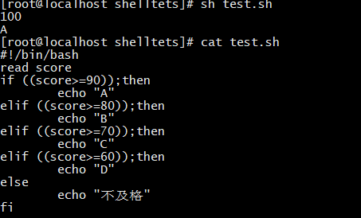


##### 3.  循环

###### for循环

==语法==

```shell
for ((i=0;i<=10;i++))
do
	循环语句
done
```

==案例==

- **`-e`转义字符**

- **`\n`换行，且默认输出换行**

  ```
  echo "换行"					//默认就是换行
  echo -e "换行符\n"			   //换行符\n,前面需要加上转义字符,不然当作普通字符输出
  ```

- **`\c`输出不换行**

  ```
  echo -e "不换行\c"			   //不换行符\c,前面一样需要加上转义字符,不然当作普通字符输出
  
  echo -n "不换行"			   //-n参数，不换行的第二种方式
  ```

- **注意算数运算需要使用`(())`**

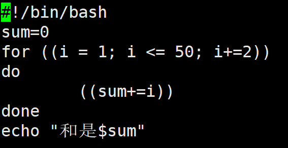


---

###### for in

==语法==

```shell
for n in {1..10}
do
	循环体
done
```


---

###### while循环

==语法==

```shell
while condition
do
	循环体
done
```


---

###### 跳出循环

- **同C++的break和continue**
- `break` 跳出当前循环体
- `continue` 跳出本次循环执行下一次循环


---

##### 4. 函数

==无参函数==

```shell
function name()
{
	函数体
	return value
}
```

- `function` 是shell关键字，专门用来定义函数
- `name` 是函数名
- `return value` 函数的返回值，可以有也可以没有
- 调用无参函数不加括号


==带参函数==

```shell
function add()
{
	echo $(($1+$2+$3))
	echo $4
}
add 10 20 30 "zhangsan"
```

- `$1 $2 $3` 分别代表接收的第一二三个参数
- `add  10 20 30` 代表传入的第一二三个参数，中间用空格分开
- 调用同样不带括号

- `(())` 对变量进行数学运算，调用命令括号前面要加上`$`

- 如果只是简单输出，则直接`$`加上第几个参数


==主函数==

```shell
function print()
{
	echo "print函数"
}
main()
{
	print
	echo "主函数"
}
main
```

- 主函数不需要加`function`关键字
- 同样需要在函数下方调用主函数，同c++不同


---

#### 3. 其他语法


##### 1.  获取脚本所在目录

```shell
script_dir=$(dirname "$0") # dirname命令可以返回文件所在的目录。$0 表示当前动行的命令名。dirname "$0"表示返回脚本所在目录
echo $script_dir
```


##### 2. 连续执行命令

```shell
#'&&' 用来连续执行命令，在前面的命令正确执行结束后才会执行，命令之间没有关联
script_dir=$(cd $(dirname "$0") && pwd)
# '|' 管道则是前面命令结束后把它在控制台输出的内容当作后面命令的输入内容，省去了传入传出文件的过程
ls -l | grep passwd	
```


##### 3. 在脚本中执行mysql命令

```shell
#使用<<EOF    ...   EOF   ,在EOF中执行mysql命令，结束EOF后自动退出mysql
mysql -uroot -p"$mypasswd" <<EOF
show databases;
EOF
```


##### 4. 脚本中执行sql脚本

```shell
#需要手动输入密码
mysql -u your_username -p your_database_name < your_sql_script.sql
#不需要输入密码
mysql -u your_username -pyour_password your_database_name < your_sql_script.sql
```


##### 5. 睡眠语句

```shell
#脚本中连续的开启关闭命令比如tomcat，由于关闭的太快导致tomcat还未完全的开启造成报错，所以需要添加睡眠语句
startup.sh
sleep 10  #10秒后再执行下面的语句
shutdown.sh
```


##### 6. 文档技巧

- 在文档中获取某个值

```shell
#使用grep查找符合条件的行，再用awk分隔找到值
#比如：找到环境变量配置的位置
grep -n "export PATH" /etc/profile | awk -F: 'NR==1{print $1}'
#比如：找到初始数据库密码
grep "password" /var/log/mysqld.log | awk 'NR==1{ print $NF}'
```

- 更换文档中的某一行/某个值

```shell
#使用sed命令来修改、新增、替换某一行或者某个值
```


##### 7. 判断命令是否执行

- 通过 `$?` 获取命令的退出状态，然后在条件语句中判断执行结果
- `-eq` 比较运算符，判断两个数值是否相等，相等返回true，不相等返回false

```shell
# 执行一个命令
ls /path/to/some/directory

# 判断命令的执行结果
if [ $? -eq 0 ]; then
    echo "命令执行成功，继续其他操作..."
    # 在这里添加需要执行的操作
else
    echo "命令执行失败，中止脚本..."
    # 如果命令执行失败，可以选择中止脚本或者执行其他处理
fi
```


---

### 十一、其他命令

#### 1. sudo命令

- `sudo`命令以系统管理者的身份执行指令，也就是说，经由 sudo 所执行的指令就好像是 root 亲自执行。需要输入自己账户密码。

```
使用权限：在 /etc/sudoers 中有出现的使用者
sudo -l                              //列出目前的权限
$ sudo -u yao vi ~www/index.html    //以 yao 用户身份编辑  home 目录下www目录中的 index.html 文件
```


#### 2. echo命令

- `echo`命令相当于c++里面的cout，输出数据到控制台上

```
echo  hello							//内容带不带双引号都行，结果一样
```

- 可以把配置的环境变量输出查看

```
echo $PATH
```


#### 3. rz上传本地文件

- 先下载`lrzsz`，才可使用`rz`命令

```
yum install lrzsz
```

- 上传

```
rz
```

- 下载

```
sz 文件名/文件夹地址
```


#### 4. unzip

- 如果压缩包是zip格式需要先下载unzip命令

```shell
yum -y install unzip
unzip 压缩包.zip
```


# linux下的C++编程

### 1. 安装gcc，g++

```
yum install -y gcc  gcc-c++
```

### 2. vim编译c++文件

使用vim编写c++头文件、cpp文件等

### 3. 编译全过程

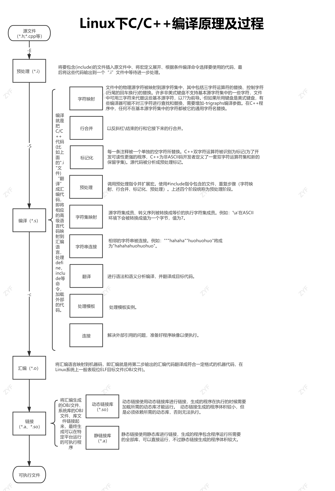

1. 预处理：处理预处理头，如导入头文件、替换宏等

```
gcc -E test.cpp -o test.ii
```

2. 编译：将预处理后的文件进行编译生成汇编文件

```
gcc -S test.ii -o test.s
```

3. 汇编：将汇编文件生成目标文件(二进制文件)

```
gcc -c test.s -o test.o			//注意是小写c
```

4. 链接：将目标文件和所需要的库文件(静态链接库、动态链接库)连接起来生成可执行文件

```
gcc -lstdc++ test.o -o test		//-lstdc++ 是C++标准库文件；这个地方可以加需要链接的库文件
```

> 上面的操作都可以直接把cpp文件拿来操作直接转化目标操作后的文件
>
> 执行可执行程序 ： `./文件名`


### 4. 直接编译

c++程序编译，直接一步到位，生成可执行文件

```
g++  一个或多个cpp文件 -o 要生成的执行文件名		//小o指定输出名字

g++  test.cpp demo.cpp -o test				//例子
```


### 5. Makefile

将需要编译的文件和相关步骤写到Makefile，这样每次编译只用执行Makefile，而不用手动写命令；简单的说就是告诉编译器如何来编译和链接程序


### 6. CMake

自动编写Makefile工具

