# Mysql

279454451

## Mysql安装

#### 1. 新建data和my.ini

#### 2. 配置环境变量

#### 3. 启动服务

```
//初始化用户
mysqld --initialize-insecure --user=mysql
//启动mysql服务，mysql分为服务端和客户端
net start mysql 
```

#### 4. 修改初始密码

```
mysql -uroot -p				//两次回车进入
use mysql;
ALTER USER 'root'@'localhost' IDENTIFIED WITH mysql_native_password BY '123456';
flush privileges;
exit;
```


---

## Mysql命令

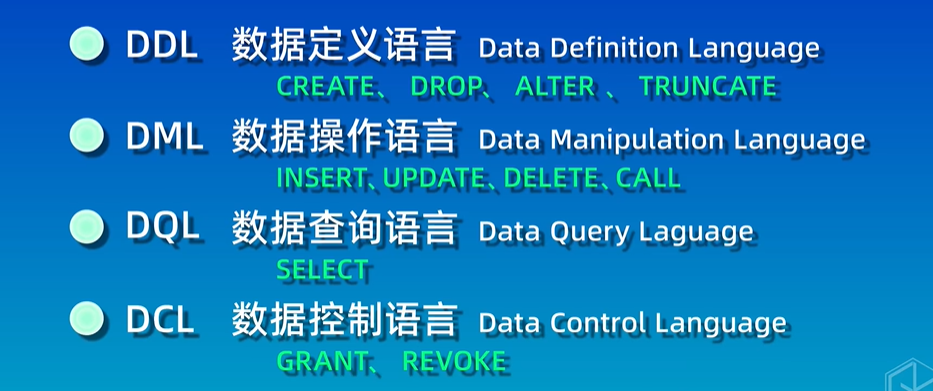


### 1. 语句概述

- 基本语法

  - **不区分大小写**，在可视化界面中：一般把关键字大写；库、表、等小写

  - 关键字、字段名（列名）、表名、数据库名之间需要**用空格或者逗号分隔**

  - 每一个SQL语句都要**用英文分号结尾**

  - **SQL语句可以写在一行，也可以分成多行来写，最终以分号结尾作为标志**

- SQL的注释

  - 多行注释
    - `/*        */`

  - 单行注释
    - 以`--` 开头（注意--后面有个空格）或者`#`号开头，只对本行有效


### 2. 数据库

#### 1. 创建数据库

```mysql
CREATE DATABASE game;
```

#### 2. 展示数据库

```mysql
SHOW DATABASES;				//注意加S
```

#### 3. 删除数据库

```mysql
DROP DATABASE game;
```

#### 4. 使用数据库

```mysql
USE game;					//使用表前需要先进入数据库
```

#### 5. 数据库的导入导出

==可视化工具==

- 导出

  ```
  第一种、选择要导出的数据库导出，修改脚本里面的库名
  第二种、把sql语句写入txt文件，更改后缀名为sql
  ```

- 导入

  ```
  在服务器或者新建数据库右键导入
  ```

==命令==

- 导出

  ```mysql
  mysqldump -u root -p game > game.sql
  ```

- 导入

  ```mysql
  //在sql文件所在目录下
  mysql -u root -p game < game.sql   //将game.sql文件导入到game库
  ```


### 3. 数据表

#### 1. 创建表

```mysql
CREATE TABLE player(
id INT PRIMARY KEY AUTO_INCREMENT,
name VARCHAR(100),	//长度为100的字符串
level INT,
exp INT,
gold DECIMAL(10,2)   //表示长度为10，保留两位小数的十进制数
);
```


---

##### 1. 数据类型

**整数类型**：

```mysql
#参数代表宽度
id INT(10),				//INT(10)表示的是显示宽度为10，如果不够10则在前面填满宽度，不是存储大小或者范围
num INT					//INT，不加后缀名则表示默认4字节,即INT(11) 宽度11位
```

- `TINYINT`：1 字节
- `SMALLINT`：2 字节
- `MEDIUMINT`：3 字节
- `INT` 或 `INTEGER`：4 字节，2的32次方大约为11位
- `BIGINT`：8 字节

**浮点数类型**：

```mysql
#参数同定点数相同，第一位为总表示的数字个数，第二位为其中小数个数
float   #默认精度为(24,0)
double	#默认精度为(53,0)
double(10,2) //第一个参数为总共位数，第二个参数为其中的小数个数
```

- `FLOAT`：4 字节，精度为6位(2的23次方)
- `DOUBLE`：8 字节 ，精度为15-16位(2的52次方)

**定点数类型**：

```mysql
#参数第一位为总表示的数字个数，第二位为其中小数个数
gold DECIMAL(10,2)		//DECIMAL(10,2)表示精度总共为10位数，其中包括小数点后面两位
```

- `DECIMAL` 或 `NUMERIC`：两个类型名同样的作用，取决于指定的精度，最多可占用 65 字节

**日期和时间类型**：

- `DATE`：3 字节					//年月日
- `TIME`：3 字节                    //时分秒
- `DATETIME`：8 字节            //年月日时分秒
- `TIMESTAMP`：4 字节          //年月日时分秒，还具有时区信息。
- `YEAR`：1 字节                    //年，存储4个数字

**字符串类型**：

```mysql
#参数为字节数
name VARCHAR(255) //VARCHAR(255)表示最大存储255个字节
```

- `CHAR`：固定长度，最多255个字节
- `VARCHAR`：动态变化长度，可达 65,535 字节

- `NVARCHAR`: 动态变化长度，主要存储汉字，参数为字节，两个字节对应一个中文汉字。
- `TEXT` 类型 ：存储文本，最大可达 65,535 字节
- `ENUM`：用于存储枚举类型，`gender ENUM('Male', 'Female')`  ，插入时只能选择枚举中的一个参数
- `SET`：用于存储多个不重复值的集合，`features SET('Red', 'Blue', 'Green', 'Small', 'Medium', 'Large')`，插入时可以选择1个或者多个参数

> 1. `char` 和 `varchar`的区别：
>    - `CHAR`: **存储固定长度的字符串**，如果存储的字符串长度小于指定的长度，则会用空格填充到指定长度。这意味着存储的数据总是占用指定长度的空间。
>    - `VARCHAR`: **存储可变长度的字符串**，只占用实际数据长度加上额外的1个或2个字节的存储空间用于记录该数据的长度。
>
> 2. 带括号和不带括号的区别：(整型、浮点型，字符类型、定点类型)
>    - **括号内的数字是用于指定显示宽度、精度或最大长度，并不直接影响数据类型的存储大小。**如果超过数据类型的范围，MySQL 将会按照数据类型的特性进行处理，实际大小仍然为该类型最大字节大小
>
> 3. 定点类型(`decimal`)和浮点型(`float,double`)括号里面的区别：
>    - **浮点型在保留小数的时候会使用近似值即四舍五入，而顶点类型不会**。所以需要精确的小数计算，推荐使用 `DECIMAL` 数据类型；如果只是一般的数值计算，并且不太关心精度问题，可以使用 `double` 数据类型。
>
> 4. `varchar(255)`：
>    - 255 是许多数据库系统中 `varchar` 类型字段的默认最大长度，即255个ASCII字符。
> 5. `TIMESTAMP`和`DATETIME`的区别：
>    - `timestamp`通常存储特定时刻的日期和时间信息，**具有时区信息**。
>    - `datetime`仅存储日期和时间的组合，没有时区信息。
>
> 6. `char、varchar、nvarchar`的区别：
>    - `char`和`varchar`主要使用的是**ASCII码存储**，所以一般存储单个字符就是一个字节，`char`最大255个字节对应255个`ASCII`码字符，同理`varchar`最大65,535个字符。如果存储汉字的话，使用`utf-8`，**一个汉字占用3个字节**。
>    - `nvarchar`使用的是**`Unicode`编码存储**，存储汉字的时候使用的`utf-16`，**一个汉字占用2个字节**，所以参数255对应的是字节数，而不是汉字字符数。


##### 2. 列约束

- `not null` : 字段不许为空，不加该条件字段默认为null。

- `default`：`default`后面跟上默认值

- `unique`：唯一约束字段，即该字段的值不可重复，可字段后面，也可末尾独占一行，`unique`(列名)

- `unsigned`：一般与整型联用，即无符号数

- `auto_increment`：自增；只适用于整型；通常和主键一起搭配使用；该列的值不可填写，系统自动生成；表只能有一个自增列

- `primary key`：一个表只能有一个主键，主键字段不可重复，不可为空。可加在字段后面，也可末尾独占一行，`primary key`(列名)

- `foreign key`：一个表可以有多个外键，外键字段可以重复，可以为空。外键字段即另一个表的主键字段，插入时必须确保该字段在主键中存在，不然插入失败

  ```mysql
  FOREIGN KEY  (外键列名) REFERENCES  另一个表名(另一个表的主键列名)    //写在最后，函数形式
  ```

- 自动生成字段：根据`generated always as`后面的表达式自动生成

  ```mysql
  price DECIMAL(8,2) generated always as (单价*数量)
  ```

- `check` ：检查约束，规范列的条件

  ```mysql
  #语法：CHECK(SQL条件语句)
  cphone VARCHAR(11) NOT NULL CHECK(LENGTH(cphone)=11)  #限制电话长度为11位，不可少
  csex CHAR(2) NOT NULL CHECK(csex IN('男','女')) 		 #限制性别栏只能填'男'或者'女'
  ```

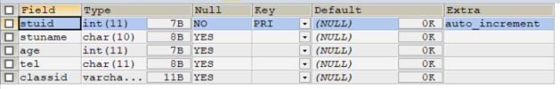


---

#### 2. 查看表

- 查看所有表

  ```mysql
  SHOW TABLES;
  ```

- 查看表的结构

  ```mysql
  DESC player;
  ```

- 查看建表语句

  ```mysql
  SHOW CREATE TABLE player;
  ```

  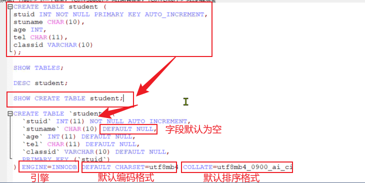


#### 3. 修改表

- 修改列

  ```MYSQL
  //使用modify和change对列数据类型、约束条件进行修改
  ALTER TABLE player MODIFY COLUMN name VARCHAR(200); 		//容量扩充到200
  ALTER TABLE player CHANGE COLUMN level INT DEFAULT 1; 		//修改level的默认值为1
  //可以设置多种约束:默认值、空、非空、唯一、主键约束、外键约束等
  //COLUMN关键字是可选的，可加可不加
  ```

  > - `modify`修改除了列名以外的属性
  > - `change`都可以还可以修改列名
  > - `rename`  前列名 `to` 修改后列名
  >
  > 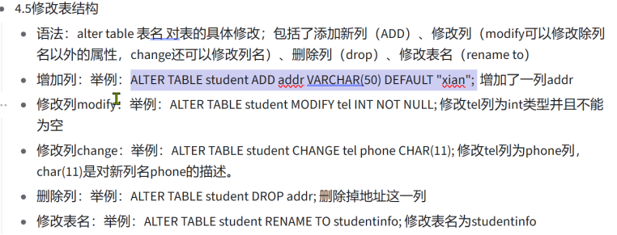

- 重命名列

  ```mysql
  ALTER TABLE player RENAME  name TO nick_name;
  ALTER TABLE player CHANGE name nick_Name CHAR(8);  //RENAME to 可以改为change,但是新列名后必须跟数据类型
  ```

- 修改表名

  ```mysql
  ALTER TABLE player RENAME  TO game_player;	
  ```

- 添加新的列

  ```MYSQL
  ALTER TABLE player ADD  last_login DATETIME;
  ```

- 删除列

  ```MYSQL
  ALTER TABLE player DROP last_login;
  ```


#### 4. 删除表

- 删除整个表

  ```mysql
  DROP TABLE player;
  //如果存在，则删除
  DROP TABLE IF EXIST player;
  ```

- 清空整个表

  ```mysql
  TRUNCATE player;					//truncate将会清空整个表的数据，然后新建一个新表
  //等同于 DELETE FROM player;		  //于truncate区别在于，Truncate删除完又建个新表，结构是新的。
  ```


---


### 4. 数据增删改

#### 1. 增

```mysql
//插入完整的数据
INSERT INTO player (id,name,level,exp,gold) VALUES (1,'张三',1,1,1);
//如果给的是完整的数据，可以不加结构名
INSERT INTO player VALUES (1,'张三',1,1,1);
//可以只插入部分数据，未插入的数据将会给自己设的默认值，未设置默认值将会为NULL
INSERT INTO player (id,name) VALUES (1,'张三');
//可以同时插入多个数据
INSERT INTO player (id,name) VALUES (2,'李四'),(3,'王五');
//设置表的默认值，
ALTER TABLE player MODIFY level INT DEFAULT 1;
```

> 字符类型单引号和双引号都可以

#### 2. 改

```mysql
//修改一条数据，where后加条件
UPDATE player SET level = 1 WHERE name = '李四';
//修改所有数据，不加条件
UPDATE player SET level = 1;    //不建议使用
UPDATE player SET exp = 0,gold = 0;
```


#### 3. 删

```mysql
//where后加条件，不加where会删除表内全部数据
DELETE FROM  player WHERE gold = 0;
```

> 改和删都得加上条件。不然就是对所有的值进行操作


---

### 5. 数据查询

#### 1. 基本查询

```mysql
select * from 表名
select 字段1，字段2，。。字段n from 表名
```


##### 1.`DISTINCT`去重

```mysql
//distinct放在要去重的字段前面
SELECT DISTINCT address FROM studentinfo;	
```


##### 2. `LIMIT`设置查询行数

```mysql
//本质省略第一个数0，展示前两行
SELECT * FROM studentinfo LIMIT 2; 	
//第一个数为偏移量，第二个为数量，代表展示第2、3行
SELECT * FROM studentinfo LIMIT 1,3; 		
```


##### 3. `ORDER BY` 排序

```mysql
//按照等级升序排列
SELECT * FROM player ORDER BY level;
//按照等级降序排列
SELECT * FROM player ORDER BY level DESC;
//按照等级降序排列,且按照经验升序
SELECT * FROM player ORDER BY level DESC, exp;
//按照表中第5列降序排列
SELECT * FROM player ORDER BY 5 DESC;
```

> 联合使用去重、排序、设置返回行数：注意顺序，**去重在字段前面，排序在后面，limit放在最后。**


---


#### 2. 条件查询

- 使用`where`跟条件语句

```mysql
//带条件，select后面查的是列，条件where后面查的是行
SELECT column1, column2 FROM table_name WHERE condition;
```


##### 1. 使用条件操作符

```
=
>
<
>=
<=
!=
between...and... 介于两个值之间
```

```mysql
//查找等级为1-10之间的玩家，包括1，10
SELECT * FROM player WHERE level BETWEEN 1 AND 10;
```

> //between--and 两个数据可以是数字也可以是字符


##### 2. 使用逻辑运算符

```
`and`：且逻辑，多个条件同时满足才能返回结果，and的优先级高于or。
`or`：或逻辑，多个条件只要任意一个满足，即返回结果
`in`：在某个集合里面，则返回结果，这个集合我们使用()来指定，()里面有多个元素，元素之间使用逗号间隔。如：in (2,4,5,3)
`not `：条件取反，比如`not in`指不在某个集合里面，是上面相反的情况
`()`：使用括号可以改变优先级
```

```mysql
SELECT * FROM player WHERE level = 1;
//使用IN指定查找等级为1，3，5的玩家
SELECT * FROM player WHERE level IN (1,3,5);
```


##### 3. `LIKE`模糊查询

```mysql
%：匹配0到多个任意字符
_：匹配一个任意字符
SELECT * FROM studentinfo WHERE stuname LIKE '张%';			//以张开头的名字
SELECT * FROM studentinfo WHERE stuname LIKE '张_'; 			//以张开头的两个字的名字
```


##### 4. `REGEXP` 匹配正则表达式

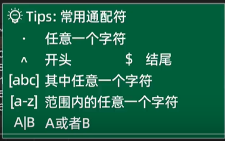

```mysql
//匹配0-9之间任意一个数字
SELECT * FROM player WHERE name REGEXP '[0-9]';
//匹配A或者B
SELECT * FROM player WHERE name REGEXP 'A|B';
//匹配姓王且名字只有两个字的玩家
SELECT * FROM player WHERE name REGEXP '^王.$';
//匹配名字中包含王的
SELECT * FROM player WHERE name REGEXP '张';
//匹配名字中包含王和张的玩家
SELECT * FROM player WHERE name REGEXP '[王张]';
```

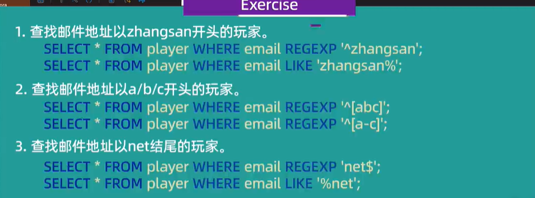


##### 5. `NULL` 空值

- 不能用`=`判断，NULL与其他任何值都不相等

```mysql
//使用is判断是否为空
SELECT * FROM player WHERE email is NULL ;
//MySql专用判空符号<=>, 等价于is
SELECT * FROM player WHERE email <=> NULL ;
//查找邮箱非空的
SELECT * FROM player WHERE email is NOT NULL ;
//查找邮箱是空字符串的玩家，与NULL不同
SELECT * FROM player WHERE email = '' ;
```


---

#### 3. mysql函数

##### 1. 时间函数

> 时间函数的返回值都是字符类型


###### 1. 查询当前日期时间

- curdate() 查看当前数据库的日期部分（年月日）

  ```mysql
  SELECT CURDATE();
  ```

- curtime() 查看当前数据库的时间部分（时分秒）

  ```mysql
  SELECT CURTIME();
  ```

- now() 查看当前数据库的日期+时间

  ```mysql
  SELECT NOW();
  ```


###### 2. 获取日期的一部分

- DATE(参数：日期时间的值) 返回年月日部分

  ```mysql
  SELECT DATE('2023-05-10 14:18:42');
  ```

- YEAR(参数：日期时间的值) 返回年部分

  ```mysql
  SELECT YEAR(NOW());
  ```

- MONTH(参数：日期时间的值) 返回月部分

  ```mysql
  SELECT MONTH('2023-05-10 14:18:42');
  ```

- DAY(参数：日期时间的值) 返回日部分

  ```mysql
  SELECT DAY(NOW());
  ```


###### 3. 时间计算函数

- `ADDDATE()`

- 语法

  ```mysql
  SELECT ADDDATE(时间，INTERVAL 数字 年/月/天/周)				//注意：数字为正数往后加时间，数字为负数，往前减时间。
  SELECT ADDDATE(NOW(),INTERVAL 30 DAY); 
  SELECT ADDDATE('2023-05-10 14:18:42',INTERVAL -3 MONTH);  // 指定时间往前三个月的时间
  ```


---

##### 2. 数学运算符

- 加减乘除等运算符可以直接在MySQL中使用，主要用于列数据之间的计算

- 前提：计算的两个数据必须是满足数学运算的数据类型

- `+、-、*、/`

- ```mysql
  SELECT carnumber,cartype,rentprice/price FROM bus_car ORDER BY rentprice/price;
  ```

  > 查询结果中包含了一列新值rentprice/price，这个值是计算出来的临时值，它并不存在于表中，这个值有意义，代表了性价比，能用更少的钱租到更好的车。


##### 3. 聚合函数


```MySQL
//查询所有玩家的总数
SELECT COUNT(*) FROM player;
//查找所有玩家的平均等级
SELECT AVG(level) FROM player;
```

> count(*)代表查询结果的行数


---

#### 4. 分组查询

##### 1. `GROUP BY` 分组

- `GROUP BY`**子句用于对检索出的数据进行分组**。它通常与聚合函数（如`SUM`、`COUNT`、`AVG`等）一起使用，以便<u>**对每个组应用聚合函数**</u>，并在结果中<u>返回每个组的汇总数据</u>。(同一类(值)为一组)

  ```mysql
  SELECT classnum,AVG(age) FROM studentinfo GROUP BY classnum; 
  //AVG(age)，代表的是每个组(每个班级)的平均年龄，聚合函数操作的范围为这一个组
//count(*)，代表的是每个分组后的组内行数。
  ```
  
  > - 分组后的查询字段要把依据哪个字段分组的字段也展示出来。
  > - 分组查询如果不和聚合函数联合使用则分组将毫无意义。


##### 2. `HAVING` 条件

- `HAVING` **对分组后的数据进行条件过滤**，类似于`WHERE`

  ```mysql
  SELECT cartype,AVG(price) FROM bus_car GROUP BY cartype HAVING AVG(price)>500000; 
  ```

  > - `where`用于过滤指定的行，`having`过滤指定的分组后的数据。
  >
  > - `HAVING`条件的指定，只能指定`select`后面的列，即分组后的列


- 联合使用`where、group by、having、order by、limit`这些关键字，注意顺序

  ```mysql
  select 分组列名，聚集函数 from 表名 where 条件 group by 分组列名 having 条件 order by 排序列名 limit 返回行数；
  ```

  > 先分组后才能对结果进行排序和限制行数


#### 5. 子查询

==定义==

- **子查询就是嵌套在父查询中的查询，查询可以是多级嵌套的**
- **子查询的逻辑：先处理最内层的查询，再处理外层查询，**


==使用==

##### 1. 作为where条件

```mysql
//SELECT AVG(level) from player  作为查询条件，查询等级大于平均值的玩家
SELECT * FROM player WHERE level > (SELECT AVG(level) from player); 
```

> 如果查询的结果为多个值，父查询需要匹配则使用`in(子查询)`


##### 2. 作为select条件

-  作为`select`条件，可以使用`as`起别名

```mysql
//不同的等级、等级平均值、与平均等级的差值
//round函数用于数据的四舍五入,round(x,d),x指要处理的数，d表示要保留几位小数
SELECT level, ROUND((SELECT AVG(level) from player)) as average,
level - ROUND((SELECT AVG(level) from player)) as diff
from player;
```


##### 3. 创建新表

```mysql
//等级小于5的数据建立一个新表
CREATE TABLE new_player SELECT * FROM player WHERE level < 5;
```


##### 4. 插入数据

- 使用子查询向表里插入数据,使用`insert into` 关键字

```mysql
//继续往新表里面插入等级大于6和小于10的玩家
INSERT INTO new_player SELECT * FROM player WHERE level BETWEEN 6 AND 10;
```


##### 5. 判断是否存在

- `exists` 查看所查找的条件是否存在数据

```mysql
//有结果的话就等于1，没结果的话就等于0
SELECT EXISTS  (SELECT * FROM player WHERE level >100);
```


---

#### 6. 集合查询

##### 1. `UNION` 并集

- **合并查询结果集(并集)**
- 默认自动去重

```mysql
SELECT * FROM player WHERE level BETWEEN 1 AND 3
UNION
SELECT * FROM player WHERE exp BETWEEN 1 AND 3;
```

- 不去重使用UNION ALL

```MYSQL
//不去重使用UNION ALL
SELECT * FROM player WHERE level BETWEEN 1 AND 3
UNION ALL
SELECT * FROM player WHERE exp BETWEEN 1 AND 3;
```

> `UNION`合并两个查询结果，`or`合并两个查询条件


##### 2. `INTERSECT` 交集

- **合并结果集(交集)**

```mysql
SELECT * FROM player WHERE level BETWEEN 1 AND 3
INTERSECT
SELECT * FROM player WHERE exp BETWEEN 1 AND 3;
```


##### 3. `EXCEPT` 差集

- **合并结果集(差集)**

```mysql
//查找等级1-3但是经验不在1-3之间的玩家
SELECT * FROM player WHERE level BETWEEN 1 AND 3
EXCEPT
SELECT * FROM player WHERE exp BETWEEN 1 AND 3;
```


---

#### 7. 联表查询

##### 1. `INNER JOIN` 内关联

- **返回两个表中都有的数据，如果有一个表的匹配字段在另一个表找不到则不匹配不展示**
- **方式一**：

```mysql
SELECT * FROM player
INNER JOIN equip
ON player.id = equip.player_id;			//根据id关联两个表
```

- **方式二**：

```mysql
//等同于方式一
SELECT * FROM player,equio WHERE  player.id = equip.player_id;	 //如果还有其他条件在最后面加and
```

- **如果有`where`条件需要放到最后，如果两个表有同名字段，则使用`表.字段`来表示是哪个表的字段**

```mysql
//如果有where条件需要放到最后，要select可以选择两个表中的字段，使用‘表.字段’来表示是哪个表的字段
SELECT orderitems.prod_id,quantity,prod_name FROM orderitems
INNER JOIN products
ON orderitems.prod_id = products.prod_id
WHERE orderitems.order_num IN (SELECT order_num FROM orders WHERE cust_id=10002);
```

- **使用方式二可以连接多个表**

```mysql
//方式二可以连接多个表，根据不同条件进行联接
SELECT prod_name,vend_name,prod_price,quantity FROM orderitems,products,vendors
WHERE products.`vend_id` = vendors.`vend_id` 
AND orderitems.`prod_id`=products.prod_id 
AND order_num = 2105110002;
```

- **内连接还可以用于删除操作**

```mysql
//连接两个表，同时执行多个删除操作
UPDATE studentinfo,classinfo 
SET TEL='13700010001',StudentNums=45 
WHERE studentinfo.Classnum=classinfo.Classnum AND Number='2006010003' ;
```


---

##### 2. `LEFT JOIN` 左连接

- **返回左表中所有的数据和右表中匹配的数据，右表中找不到的数据用null填充**

```mysql
SELECT * FROM player
LEFT JOIN equip
ON player.id = equip.player_id;			//返回左表的所有值，多加右表的列，若左表中在右表对应的列无值则为null
```


---

##### 3. `RIGHT JOIN` 右连接

- **返回右表中所有的数据和左表中匹配的数据，左表中找不到的数据用null填充**

```mysql
SELECT * FROM player
RIGHT JOIN equip
ON player.id = equip.player_id;			//返回以右表为基准，多加左表的列，若右表中在左表对应的列无值则为null
```


----

#### 8. 别名

- **别名就是起个临时的新名字，使用as关键字来起别名**

  

##### 1. 给列起别名

- 为了方便查看，给列和列的计算结果起别名

```mysql
SELECT carnumber,rentprice/price AS '性价比' FROM bus_car;
```


##### 2. 给表起别名

- 给某个表起别名，之后使用别名代替这个表

```mysql
SELECT a.carnumber,rentprice,rentid FROM bus_car AS a,bus_rent AS b 
WHERE a.`carnumber`=b.`carnumber`;
```


##### 3. 给查询结果起别名

- 查询结果这种临时数据起别名，相当于一个临时的表

```mysql
SELECT prod_name,vend_name,prod_price,quantity FROM 
orderitems,
(SELECT prod_id,prod_name,prod_price,vend_name FROM products,vendors WHERE products.`vend_id` = vendors.`vend_id`) AS a
WHERE orderitems.`prod_id`=a.prod_id AND order_num = 2105110002;
#把products,vendors先根据供应商id做内联查询得到想要的字段，作为临时表，再跟orderitems表作关联
```

> 给结果起别名作为临时表，就可以使用该表中的字段和数据了，适用于两个以上的表相互关联的查询

---


#### 9. 联表非等值查询

> **多表查询语句中的连接条件不是使用等号的**称为非等值连接， 
>
> 联表查询中使用`ON`根据两个表的共有字段进行联接称为等值查询

- 非等值的连接方式进行联表查询

```mysql
SELECT e_name,salary,grade FROM employee,salary_grade				//内连接的第二种形式
WHERE salary BETWEEN min_salary AND max_salary ; 
# min_salary和max_salary是salary_grade中的两个字段
# 等同于这句WHERE salary >= min_salary AND salary <= max_salary ; 
```

- 结合子查询和别名

```mysql
SELECT e_name,salary FROM
employee,
# 子查询起别名作为临时表，可以使用表中的字段
(SELECT min_salary,max_salary FROM salary_grade WHERE grade = 4) AS a 
WHERE  salary BETWEEN min_salary AND max_salary; 
```

> - 在进行非等值的联表查询时，通常会使用内连接（INNER JOIN）来确保只返回满足条件的匹配行，而不会包含不匹配的记录。
> - 外连接通常不用于非等值的联表查询，它们通常用来包含不匹配的行或保留某个表中的所有行，而不会过滤掉不匹配的记录


---

### 6. 索引

==**作用**==

- **用来对大型数据的查询，当创建索引后，再对该列数据进行查询，则会优先去使用索引查找，而不是去全盘查找**

- **优点：增加查询的速度，**
- **缺点：降低增删改的速度**

==**语法**==

```mysql
//创建索引
CREATE [UNIQUE|FULLTEXT|SPATIAL] INDEX index_name ON table_name(column1)
//在已有表中添加索引
ALTER TABLE table_name ADD INDEX index_name (column1);
//创建表时添加索引
CREATE TABLE table_name (
    column1 datatype,
    column2 datatype,
    INDEX index_name (column1),
    UNIQUE INDEX unique_index_name (column2)
);
//根据索引查询
SELECT * FROM tablename WHERE column1 = 条件
//查询索引
SHOW INDEX FROM studentinfo;
//删除索引
DROP INDEX index_name ON studentinfo;
//组合索引
CREATE INDEX name_age_index ON studentinfo(stuname,age);
```

- 普通索引：INDEX，是最基本的索引，没有加什么限制。
- 唯一索引（Unique Index）：确保列中的所有值都是唯一的，但可以有多个唯一索引
- 全文索引（Full-Text Index）：用于全文搜索，适用于大段文字的搜索。
- 全文索引：主要查找文本中的关键字，主要用于全文检索，针对较大的数据，慎用，很耗性能。
- 组合索引：多列组成的索引。


**==使用场景==**

- 在经常需要搜索查询的列上，可以加快搜索的速度
- 在经常用在连接（JOIN）的列上，这些列主要是一外键，可以加快连接的速度
- 在经常需要根据范围（<，<=，=，>，>=，BETWEEN，IN）进行搜索的列上创建索引，**因为索引已经排序，其指定的范围是连续的**
- 在经常需要排序（order by）的列上创建索引，因为索引已经排序，这样查询可以利用索引的排序，加快排序查询时间；
- 在经常使用在WHERE子句中的列上面创建索引，加快条件的判断速度。


---

### 7. 视图

==**作用**==

- **视图是一种虚拟存在的表**，它本身并不包含数据，而是作为一个查询语句保存在数据字典中，当我们查询视图的时候，它会根据查询语句的定义来动态的生成数据。

- 视图提供了一种**对数据库中数据进行抽象和封装的方式**，用户可以**按照自己的需求定义视图**，并**通过视图来操作和访问数据**，而**无需直接处理底层表结构的复杂性**。


==**语法**==

- 创建视图

```mysql
CREATE VIEW top10 
AS
SELECT * FROM player ORDER BY level desc limit 10;
```

- 视图的使用和表是一样的，且当表中数据发生变化则视图中的数据也会对应发生变化

```mysql
SELECT * FROM top10;	
```

- 查看当前数据库有哪些视图

```mysql
SHWO TABLES;
```

- 修改视图

```mysql
ALTER VIEW top10
AS
SELECT * FROM player ORDER BY level LIMIT 10;
```

- 删除视图

```mysql
DROP VIEW top10；
```

> 视图只能有查询功能，不能有删除修改数据的功能

---


### 8. 存储过程

**==作用==**

- **一组为了完成特定功能的sql语句的集合**，包括了增删改查等各种操作。用户可以通过调用我们写好的存储过程来完成复杂的操作过程。**类似于执行了一个函数**。

==**使用场景**==

- 主要用于一些复杂多个的sql数据库操作，写成一个存储过程，直接让别人调用即可-**类似于函数的封装**。

==**语法**==

- 创建简单的存储过程

```mysql
DELIMITER $$ -- 定义存储过程之前，重新定义结束标志，使用$$代替;符号可以定义为任意非';'符号
CREATE PROCEDURE avg_price() -- 创建一个存储过程，用于查询商品均价
BEGIN
    SELECT AVG(prod_price) AS avg_price FROM products;
    DELETE FROM products WHERE prod_id="7";

END$$
DELIMITER ; -- 重新恢复到默认的结束符
```

- 创建带参的存储过程

```mysql
DELIMITER $$
CREATE PROCEDURE prod_by_id(IN id INT) -- 输入型参数IN，id是参数变量名，INT是它的类型
BEGIN
    SELECT * FROM products WHERE prod_id=id;
END$$
DELIMITER ;
```

- 调用存储过程

```mysql
CALL avg_price();			# 普通，记得带括号
CALL prod_by_id(5);			# 带参
```

- 查看有哪些存储过程

```mysql
SHOW PROCEDURE STATUS;
```

- 删除存储过程

```mysql
DROP PROCEDURE avg_price;	 #不带括号
```


---

### 9. 触发器

==**作用**==

- **触发器是一种特殊的存储过程，它不需要通过手动调用，而是根据一些增删改的动作自动执行；**
- **触发器关键字`trigger`，就是给某个表绑定一段代码，当表中的数据发生变化的时候（增删改），系统会自动执行这些代码。**
- **一个表可以针对不同的事件（INSERT、UPDATE、DELETE）定义多个触发器，每个触发器可以在表的不同操作上执行不同的逻辑。**

==**语法**==

- 创建触发器

```mysql
DELIMITER $$
#  触发器时间：before | after
#  触发事件：insert | delete | update
CREATE TRIGGER sub_count AFTER DELETE ON customers FOR EACH ROW
BEGIN
    UPDATE customers_sum SET cust_sum=cust_sum-1;
END$$
DELIMITER ;
```

- 删除触发器

```mysql
DROP TRIGGER sub_count;
```


---

### 10. 事务

==**作用**==

- **事务就是一个完整的单元，是个原子性的整体概念，里面有很多sql语句，它们都是相互依赖的，要么大家都成功，要么都不成功。都不成功就要回到起始状态。**、
- **如果我们希望接下来执行的很多条sql语句全部执行成功，如果有任意一条失败，那么其他成功执行的sql语句也要撤销，回到初始状态，那么我们就把他们都封装到一个事务中就可以实现。**

**==特性==**

- **原子性**：**一个事务（transaction）中的所有操作，要么全部完成，要么全部不完成**，不会结束在中间某个环节。如果事务在执行过程中发生错误，我们通过回滚（Rollback）到事务开始前的状态，就像这个事务从来没有执行过一样。

- **一致性**：**在事务开始之前和事务结束以后，数据库的完整性没有被破坏。**也就是我们查看到的所有数据都是事务开始之前的或者事务执行之后的。**没有中间状态的数据。**

- **隔离性**：**数据库允许多个并发事务同时对其数据进行读写和修改的能力，隔离性可以防止多个事务并发执行时由于交叉执行而导致数据的不一致。**

  > 事务隔离分为不同级别，是通过加锁的颗粒度不同来实现的，以下四种，隔离级别越来越高，处理并发的能力依次增强：
  >
  > 1. **读未提交**（Read uncommitted，会出现脏读现象，就是<u>某个事物读了另一个事物未提交的数据</u>，此时不应该读到这条数据，所以数据是脏的）
  > 2. **读提交**（read committed，读到的都是提交后的数据，解决了脏读的问题，但是<u>会出现不可重复读现象，也就是某个事务两次读取的同一个数据不一致</u>，因为期间这个数据被另外一个事物修改了）
  > 3. **可重复读**（repeatable read，这是mysql**默认**的隔离级别，<u>不会出现脏读和不可重复读现象，但代价是性能会下降</u>）
  > 4. **串行化**（Serializable，通过行级锁<u>对每一行数据加锁，并发能力最高但性能降低厉害</u>，很少用）。

- **持久性**：事务处理结束后，对数据的修改就是永久的，已存储到硬盘中，即便断电或系统故障也不会丢失。


==**语法**==

- **MySQL默认操作模式是`autocommit`自动提交模式**。**表示除非显式地开始一个事务，否则每个sql语句都被当做一个单独的事务自动执行。**数据库服务器自动开启事务(每一条sql语句开始执行的时候)，自动提交事务(sql语句执行成功)，自动回滚事务(sql语句执行失败)。我们可以通过设置autocommit变量的值改变自动提交模式。

  ```mysql
  SET AUTOCOMMIT=0;  # 禁止自动提交
  SET AUTOCOMMIT=1;  # 开启自动提交
  ```

- **事务用 `BEGIN, ROLLBACK, COMMIT`来实现**

  ```mysql
  BEGIN  				# 开始一个事务
  ROLLBACK 			# 事务回滚，可以将数据库恢复到事务开始之前的状态，确保数据库的一致性和完整性。
  COMMIT 				# 事务确认提交
  ```

- **事务一般流程**

  > - 开始事务：通过 BEGIN 或者START TRANSACTION 声明事务的开始。
  > - 执行操作：在事务中执行一系列的数据库操作。
  > - 错误检测：在操作过程中检测任何可能的错误。一般使用try-catch异常处理程序检测异常，或者使用if条件来判断数据是否符合预期。
  > - 提交或回滚：如果所有操作成功，通过 COMMIT 提交事务；如果遇到错误，通过 ROLLBACK 回滚事务。

- **与存储过程联立的事务**

  ```mysql
  DELIMITER $$ -- 定义存储过程之前，重新定义结束标志，使用$$代替;
  CREATE PROCEDURE deposit()
  BEGIN
  	-- 设置 autocommit 为 0，即手动提交事务
  	SET autocommit=0;
  	-- 开始事务
  	START TRANSACTION;
  	-- 查询用户账户余额
  	SELECT balance INTO @old_balance FROM accounts WHERE account_id = 12345;
  	-- 假设用户存入 100 元（如果把加号换成减号，就代表存入失败了，事务最终就会回滚。）
  	UPDATE accounts SET balance = balance + 100 WHERE account_id = 12345;
  	-- 检查是否存款成功
  	SELECT balance INTO @new_balance FROM accounts WHERE account_id = 12345;
  	-- 如果新余额小于等于旧余额，则回滚事务，这里用到了if-else条件控制语句，MySQL的IF语句仅在复合语句的上下文中起作用(即在BEGIN和END之间包含的语句块)
  	IF @new_balance <= @old_balance THEN
  	    -- 回滚事务
  	    ROLLBACK;
  	    SELECT 'Deposit failed. Rolling back changes.';
  	ELSE
  	    -- 提交事务
  	    COMMIT;
  	    SELECT 'Deposit successful.';
  	END IF;
  END$$
  DELIMITER ; -- 重新恢复到默认的结束符
  ```

  > - set @name=10  可以通过set @name 来设置变量
  > - INTO 关键字，将字段传入变量
  > - if 条件 then 操作1 else 操作 2 条件判断


---


### 11. 常用关键字

#### 1. WHERE

- 条件， 用来提取满足标准的记录，可以与`SELECT,UPDATE,DELETE`(数据的删改查)一起使用

```mysql
SELECT * FROM player WHERE level > 1;
//AND作用：同时满足多个条件
SELECT * FROM player WHERE level > 1 AND level <5;
//OR作用：只满足一个，AND优先级更高
SELECT * FROM player WHERE level > 1 AND level <5 OR exp > 1 AND exp <5;
//使用括号改变优先级
SELECT * FROM player WHERE level > 1 AND (level <5 OR exp > 1) AND exp <5;
```


#### 2. IN

- **指定多个值**

```mysql
SELECT * FROM player WHERE level = 1;
//使用IN指定查找等级为1，3，5的玩家
SELECT * FROM player WHERE level IN (1,3,5);
```


#### 3. BETWEEN....AND...

- **指定一个范围**

```mysql
//查找等级为1-10之间的玩家，包括1，10
SELECT * FROM player WHERE level BETWEEN 1 AND 10;
```

> between--and 两个数据可以是数字也可以是字符


#### 4. NOT

- **表示条件取反**，可以加在任何一个条件前面

```mysql
SELECT * FROM player WHERE level  NOT BETWEEN 1 AND 10;
```


#### 5. LIKE 

- **模糊查询**，两种通配符： `%`表示任意个字符 ； `_`表示任意一个字符

```mysql
//查找姓名中第一个字符是王，后面为任意个字符
SELECT * FROM player WHERE name LIKE '王%';
//查找名字中包含王的玩家
SELECT * FROM player WHERE name LIKE '%王%';
//查找名字中第一个字符是王，且后面只跟一个字符的玩家
SELECT * FROM player WHERE name LIKE '王_';
//查找名字中第一个字符是王，且后面跟两个个字符的玩家
SELECT * FROM player WHERE name LIKE '王__';
```


#### 6. REGEXP

- **匹配正则表达式**


```MYSQL
//匹配0-9之间任意一个数字
SELECT * FROM player WHERE name REGEXP '[0-9]';
//匹配A或者B
SELECT * FROM player WHERE name REGEXP 'A|B';
//匹配姓王且名字只有两个字的玩家
SELECT * FROM player WHERE name REGEXP '^王.$';
//匹配名字中包含王的
SELECT * FROM player WHERE name REGEXP '张';
//匹配名字中包含王和张的玩家
SELECT * FROM player WHERE name REGEXP '[王张]';
```


#### 7. NULL

- **空值**
- 不能用`=`判断，NULL与其他任何值都不相等

```mysql
//使用is判断是否为空
SELECT * FROM player WHERE email is NULL ;
//MySql专用判空符号<=>, 等价于is
SELECT * FROM player WHERE email <=> NULL ;
//查找邮箱非空的
SELECT * FROM player WHERE email is NOT NULL ;
//查找邮箱是空字符串的玩家，与NULL不同
SELECT * FROM player WHERE email = '' ;
```


#### 8. ORDER BY

- **排序**，默认为ASC升序
- 加DESC为降序

```mysql
//按照等级升序排列
SELECT * FROM player ORDER BY level;
//按照等级降序排列
SELECT * FROM player ORDER BY level DESC;
//按照等级降序排列,且按照经验升序
SELECT * FROM player ORDER BY level DESC, exp;
//按照表中第5列降序排列
SELECT * FROM player ORDER BY 5 DESC;
```


---

#### 9. 时间函数

> 时间函数的返回值都是字符类型

##### 1. 查询当前日期时间

- curdate() 查看当前数据库的日期部分（年月日）

  ```mysql
  SELECT CURDATE();
  ```

- curtime() 查看当前数据库的时间部分（时分秒）

  ```mysql
  SELECT CURTIME();
  ```

- now() 查看当前数据库的日期+时间

  ```mysql
  SELECT NOW();
  ```


##### 2. 获取日期的一部分

- DATE(参数：日期时间的值) 返回年月日部分

  ```mysql
  SELECT DATE('2023-05-10 14:18:42');
  ```

- YEAR(参数：日期时间的值) 返回年部分

  ```mysql
  SELECT YEAR(NOW());
  ```

- MONTH(参数：日期时间的值) 返回月部分

  ```mysql
  SELECT MONTH('2023-05-10 14:18:42');
  ```

- DAY(参数：日期时间的值) 返回日部分

  ```mysql
  SELECT DAY(NOW());
  ```


##### 3. 时间计算函数

- `ADDDATE()`

- 语法

  ```mysql
  SELECT ADDDATE(时间，INTERVAL 数字 年/月/天/周)				//注意：数字为正数往后加时间，数字为负数，往前减时间。
  SELECT ADDDATE(NOW(),INTERVAL 30 DAY); 
  SELECT ADDDATE('2023-05-10 14:18:42',INTERVAL -3 MONTH);  // 指定时间往前三个月的时间
  ```


---

#### 10. 数学运算符

- 加减乘除等运算符可以直接在MySQL中使用，主要用于列数据之间的计算

- 前提：计算的两个数据必须是满足数学运算的数据类型

- `+、-、*、/`

- ```mysql
  SELECT carnumber,cartype,rentprice/price FROM bus_car ORDER BY rentprice/price;
  ```

  > 查询结果中包含了一列新值rentprice/price，这个值是计算出来的临时值，它并不存在于表中，这个值有意义，代表了性价比，能用更少的钱租到更好的车。


---

#### 11. 聚合函数


```MySQL
//查询所有玩家的总数
SELECT COUNT(*) FROM player;
//查找所有玩家的平均等级
SELECT AVG(level) FROM player;
```

> count(*)代表查询结果的行数


#### 12. GROUP BY

- `GROUP BY`**子句用于对检索出的数据进行分组**。它通常与聚合函数（如`SUM`、`COUNT`、`AVG`等）一起使用，以便对每个组应用聚合函数，并在结果中<u>返回每个组的汇总数据</u>。(同一类(值)为一组)

```MySQL
//查询男女的玩家总数各有多少名
SELECT sex,count(*) FROM player GROUP BY sex;
//计算每个等级的玩家有多少名
SELECT level,count(level) FROM player GROUP BY level;
```

> 依据哪个列分组的，select把该列也展示出来，不然展示没有意义


#### 13. HAVING

- `HAVING`子句只能与`GROUP BY`子句一起使用，**用于对分组后的结果集进行过滤。**

```mysql
//查询计算等级玩家数大于4的每个等级的玩家有多少名
SELECT level,count(level) FROM player GROUP BY level HAVING COUNT(LeVel)>4;
//在上一结果的后面再加上排序效果
SELECT level,count(level) FROM player GROUP BY level HAVING COUNT(Level)>4 ORDER BY COUNT(level);
```

> - `HAVING`不能和`WHERE`互换
> - `HAVING`条件的指定，只能指定`select`后面的列


#### 14. LIMIT

- **限制数量**

```mysql
////按照等级升序排列,且只展示前三个数据
SELECT * FROM player ORDER BY level LIMIT 3;		(本质为0，3，从第一行到第三行)
//只展示第四名到第6名，第一个3代表偏移量，后一个3代表数量
SELECT * FROM player ORDER BY level LIMIT 3，3;
```


#### 15. DISTINCT

- **去重**

```mysql
//查到所有玩家的性别
SELECT DISTINCT sex FROM player;
```

> 联合使用去重、排序、设置返回行数：注意顺序，去重在字段前面，排序在后面，limit放在最后。


#### 16. UNION

- **合并查询结果集(并集)**
- 默认自动去重

```mysql
SELECT * FROM player WHERE level BETWEEN 1 AND 3
UNION
SELECT * FROM player WHERE exp BETWEEN 1 AND 3;
```

- 不去重使用UNION ALL

```MYSQL
//不去重使用UNION ALL
SELECT * FROM player WHERE level BETWEEN 1 AND 3
UNION ALL
SELECT * FROM player WHERE exp BETWEEN 1 AND 3;
```

> `UNION`合并两个查询结果，`or`合并两个查询条件


#### 17. INTERSECT

- **合并结果集(交集)**

```mysql
SELECT * FROM player WHERE level BETWEEN 1 AND 3
INTERSECT
SELECT * FROM player WHERE exp BETWEEN 1 AND 3;
```


#### 18. EXCEPT

- **合并结果集(差集)**

```mysql
//查找等级1-3但是经验不在1-3之间的玩家
SELECT * FROM player WHERE level BETWEEN 1 AND 3
EXCEPT
SELECT * FROM player WHERE exp BETWEEN 1 AND 3;
```


---

## Mysql设计

### 1. 数据库设计三范式

- 三大范式是数据库设计表结构所遵循的规范和指导方法，目的是为了减少冗余，建立结构合理的数据库，从而提高数据存储和使用的性能。
- 三大范式之间是具有依赖关系的，第二范式基于第一范式、第三范式基于第二范式。

- 在实践中，满足3范式只要做到“**一个表只存一种数据+主键**”基本就可以实现。

#### 1. 第一范式：原子性

- **表中字段的数据要有原子性，不可再拆分。**


#### 2. 第二范式：唯一性

- **表中每一行数据具有唯一性，唯一性通过主键确定，其他字段都依赖主键（外键除外，外键用于建立表间关系）。**

  > 通常，**通过给一个表加主键来实现唯一性**。还要求非主键字段的值必须完全依赖主键，也就是非主键字段可以根据主键字段来唯一确定。更通俗的解释就是，**一个表只存储一类信息，不相关的信息不要存储在一起，因为不相关的信息不具有对主键的依赖性。**
  >
  > 比如学生表就只能存储学生信息，不能存储课程信息，课程信息要存到课程表。


#### 3. 第三范式：独立性

- **表中的非主键字段不能相互依赖，它们之间相互独立，都应该依赖主键。**

  > 比如，学生表中存储了学生所属的班级字段，还有班级的班主任字段，这就是不对的，因为班主任依赖班级字段。


---

### 2. 数据库设计过程


#### 1. 需求分析

- **根据项目需要实现的技术目标，选择合适的数据库方案**

- **分析具体的==功能模块==**

- **通过==思维导图==分析梳理每个模块的使用逻辑和流程**


#### 2. 数据库结构设计	

**==设计ER图==**

**概念：ER模型，全称为实体关系模型，也称为E-R图。E-R模型由实体、属性、联系三部分构成。**

1. 实体用矩形框表示，矩形框内写上实体名。**实体其实就是表。**

2. 实体的属性用椭圆框表示，框内写上属性名，并用无向边与其实体集相连。**属性就是表的字段**。

3. **实体间的联系用菱形框表示，表示表和表之间的互动关系**。联系以适当的含义命名，名字写在菱形框中，用无向连线将参加联系的实体矩形框分别与菱形框相连，并在连线上标明联系的类型，即1—1（一对一）、1—N（一对多）或M—N（多对多）。


==**联系的三种方式**==

1. **一对一（One-to-One）关系：两个表中的一条记录在另一个表中最多只能有一条关联记录。**例如，假设我们有一个`users`表和一个`user_profiles`表，每个用户在`users`表中有一条记录，在`user_profiles`表中也只有一条与之关联的用户资料记录，这就是一对一关系。
2. **一对多（One-to-Many）关系：一个表中的一条记录对应另一个表中多条记录。**例如，一个部门可以有多个员工，但一个员工只属于一个部门。在这种情况下，部门表和员工表之间就存在一对多关系。
3. **多对多（Many-to-Many）关系：两个表中的多条记录可以相互关联，一对一的变种。通常实现多对多关系需要一个中间表，这个中间表包含两个表的主键作为外键，建立这两个表之间的关联。**举个例子，一个学生可以选择多门课程，一门课程也可以有多个学生选择，这就是多对多关系。


==**实体的分类**==

**实体分为强实体、弱实体和复合实体**

- **一个实体必须依赖于另一个实体存在，那么前者是弱实体，后者是强实体**，例如学生实体和成绩单实体，成绩单依赖于学生实体而存在，因此学生是强实体，而成绩单是弱实体。**强实体和弱实体的联系必然只有1：N或者1：1，这里的1代表强实体。这是由于弱实体完全依赖于强实体，强实体不存在，那么弱实体就不存在**
- **复合实体**：复合实体也称联合实体或桥接实体，常常用于实现两个或多个实体间的M：N多对多关系，**它由每个关联实体的主键组成，说白了就是为了建立多个表之间关系的一个表，它没有存储真正的业务数据，存储的是表之间的关系。**


#### 3. 表结构设计


---

# Mysql底层实现

[23.04 | mysql_从头到尾的mysql (xiaogenban1993.com)](https://www.xiaogenban1993.com/blog/23.04/mysql_从头到尾的mysql)

## mysql

本文从到到尾梳理mysql的知识点，主要用于面试的复习，内容主要分为以下几个部分：

- 1 存储引擎的对比
- 2 底层是如何组织存储的
- 3 索引
- 4 buffer Pool
- 5 bin log
- 6 redo log
- 7 undo log
- 8 事务的隔离级别
- 9 mvcc
- 10 锁
- 11 explain
- 12 多机

## 1 存储引擎的对比

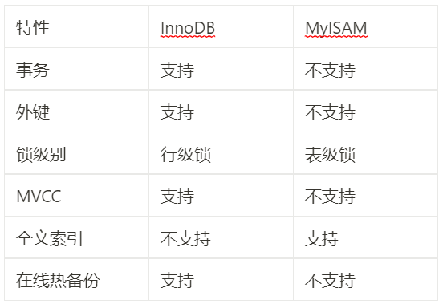

## 2 底层是如何组织存储的

### 2.1 行结构

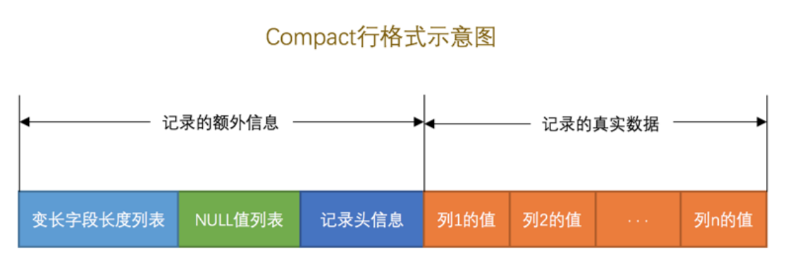

mysql是按行存储的，以`compact`格式为例：一行数据结构如上图，分为额外信息和真实的列值数据两部分，额外信息中需要记录变长列的长度，因为是变长的无法提前知道长度(如text格式的列)，所以需要随着每条记录做标记；null值列表主要是null不会在数据部分做任何存储，只在这里存储列名；记录头信息内容比较多，比如有**指向下一条记录的指针**(记录在一页内是单链表形式)，deleted标等。

一行数据不能太长，最长是700多个字节，超出的部分就算溢出，当前数据记录一个指针，超出的部分单独放到**溢出页**，指针指过去，可能有多个溢出的列。

### 2.2 页结构

每一行数据是一个record，record是通过页的方式管理起来的，一个页是16KB(磁盘连续存放16KB大小)，一页中存放多行数据。这是页的组成，数据就是放在`User Records`部分。


需要简单介绍下:

- `Infimum/Supremum`，这两个分别是标志着这一页的最小和最大的记录，是虚拟的记录，并不真正存储数据，可以认为是dummy指针，Inf的next指向页中的第一条有效数据，而最后一条数据的next指向Sup。
- 页与页之间也通过`FileHeader`中的prev、next连接成**双链表**。所以页面的整体组织方式如下图。


- `PageHeader`则记录数据页内的元数据信息，非数据页就不需要这个字段，例如Index_id(当前页属于哪个索引)，B+树层级等等；而`FileHeader`也是记录页的信息，只要是页就有

- `FileTailer`是一个校验信息的位置

- `PageDirectory`是比较重要的数据，为了方便查找该页的记录，首先将`Inf`作为一个分组，`Sup`和往前最多8条数据为一个分组，中间的数据最多4条为一个分组，通过此方式将页内数据进行分组，每一组最后一条数据的记录头中`n_owned`字段记录了该组一共多少条数据，**并且`PageDirectory`存储每个分组最后一条数据的地址**，因为分组数取决于数据量，这部分的大小=地址长度x分组数，所以也是不确定大小的。通过这个目录，再查询当前分页的数据时就可以实现二分查找。

  > 页大小16KB，数据存放在userrecord和freespace中，通过**单链表**把记录串起来；当freespace大小分配完之后，如果再插入记录将会申请创建一个新的页，改变FileHeader的头尾指针将新页插入到该页后面，页与页之间是**双链表**

### 2.3 区与段

B+的最小组织单位就是页，但是如果按照页来组织整个磁盘的存储，仍有些不妥，尤其是读取大量连续数据的时候，可能会跨多个页，此时如果两个先后关系的页，物理上地址很远，IO也是比较慢的。例如下面索引这一节的图中，页34,35,36,40如果在磁盘上是相去甚远的不同地方，那么读取就会变慢。所以有了区。

**一页是16k，64个连续的页成为一个区，也即是1M一个区**。这样可以**将连续的数据页放到一个区内**，连续的目录页也可以放到一个区内。内存读取的最小单位是页，磁盘分配的最小单位是区，因为但分配一个页的代价比较大，且导致不连续性对性能是很大的损失。

另一个概念就是段，段是逻辑意义上的区分，例如聚簇索引中所有的叶子节点是`叶子节点段`，其他是`非叶子节点段`，段是纯逻辑概念，他并不一定由一个或多个完整的区组成，因为区是物理概念，两者没有交集。只能说段至少有一页组成。

### 2.4 数据更改时页的变化

先说insert，当插入数据的时候找到要插入的页。然后看页是否已经满了，如果没有满的话，则需要在`PAGE_FREE`也就是已删除的数据链表找最近一条已删除的记录，看空间够不够放下当前记录，够的话就用，不够则在当前页的`FreeSpace`中申请一部分插入当前数据，并通过`next`指针的修改，插入到当前页的数据链表中，注意这里不改变原来页内的数据。例如当前页有以下数据，并希望插入9这条数据，其他数据的物理位置不发生变化，只是在后面插入9，并把8的next指向9的地址，9的next指向10的地址即可，此外插入可能还会导致组的变化`n_owned`等字段，以及`PageDirectory`和`PageHeader`中一些元数据的修改。

而如果页面满了则有两种情况，一种就是下面会说的虽然满了，但是其实碎片空间是足以称下这条记录的，收拾收拾还能用；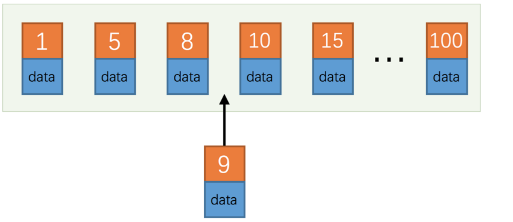

另一种就是实在装不下了，就只能新开新的页，这个过程又叫==**分裂**==。


然后对于update，如果更新后的记录长度没有变化，就可以复用当前record的磁盘空间，就地更新(p353)。如果不一样大，则会先删除再创建的方式，也就是删掉原来的记录，然后添加一条新的记录，因而这种情况一句update，会产生两个undolog的日志，后面讲到。

最后对于delete，则是先把deleted标识改为true(事务执行中的中间状态)，然后事务提交后，把这条从链表中拆下来，扔到`PAGE_FREE`这个已删除记录的链表中（该过程为purge），将可能用于insert新纪录去复用。`PAGE_FREE`链表在特定的时机也会被后台线程清理。

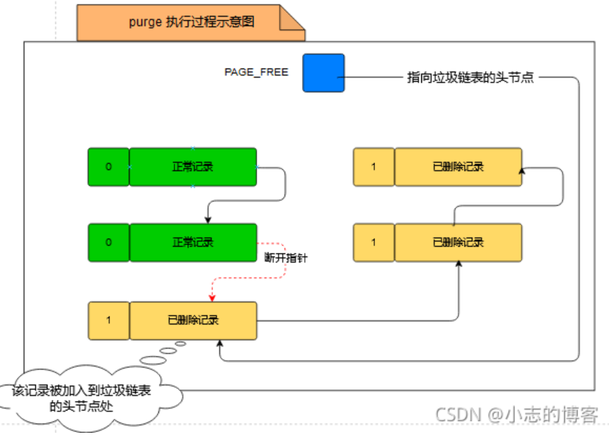

这里有一些碎片问题，例如删除的数据记录都很长，新插入的都很短，导致复用的记录空间是比较大的利用率比较低。所以有个兜底逻辑就是对应上面insert里说的虽然满了，但是记录的`PAGE_GARBAGE`中有碎片的大小信息，发现是可以承载当前要插入的record，那么就把当前重新紧凑排列，规整一下，插入这一record，具体方法是create一个临时页，按顺序排排坐，然后排好了再copy回来，删掉临时页。


## 3 索引

通过B+树的方式组织索引，上面介绍的页结构是数据页的结构，在页内可以使用二分查找，但是如何找到数据页就需要用到索引。B+树是一种多叉搜索树，可以有效的降低查询复杂度。**B+树的每个节点是一个页，其中叶子节点是真正存储数据的，又叫`数据页`，而其他节点只存储索引值+页号，叫做`目录页`，数据页和目录页都是索引页`index`类型的页**。下图中每条记录的类型用数字0123表示了，0就是真实的数据记录，1就是只有索引+页号的记录，2是Inf记录，3是Sup记录。

> 索引是为了方便数据页之间的查找而创建的，如果不用索引，每次查找数据页都得从第一个页开始依次往找；而有了索引，就可以通过B+树索引结点快速的查找到所需要的数据页

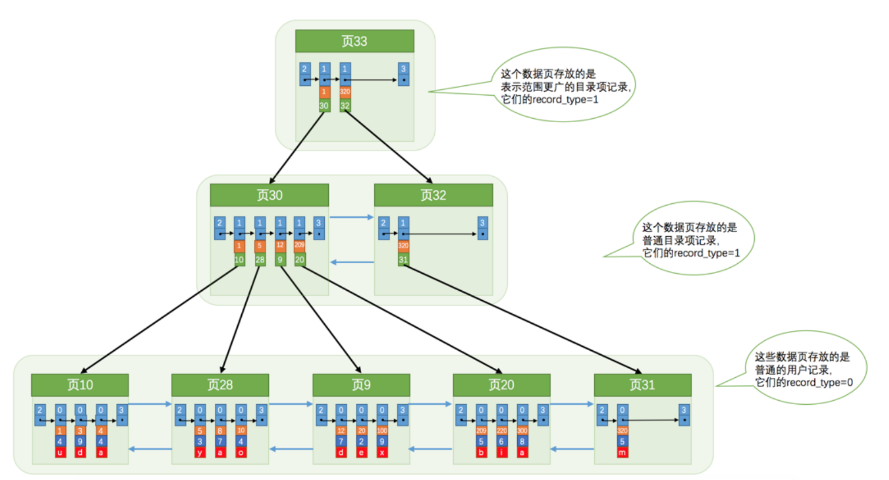

### 3.1 聚簇索引与二级索引

**聚簇索引又叫主键索引**，上面图中的就是聚簇索引，他的叶子节点记录的数据是完整的数据。但是table除了主键还可能加其他列作为索引，这些就是二级索引，二级索引也会创建B+树，**只不过叶子节点不再需要存储所有列的内容，只需要存储主键和索引列的值两项即可，找到主键后再回到聚簇索引查对应的其他列数据即可，这个过程叫==回表==**，此外目录节点也需要存储`主键`+`索引列`，而不是只存索隐列，这样提前命中就可以更早的去回表，如下是二级索引的树结构。橘色是二级索引列，深蓝是主键值。

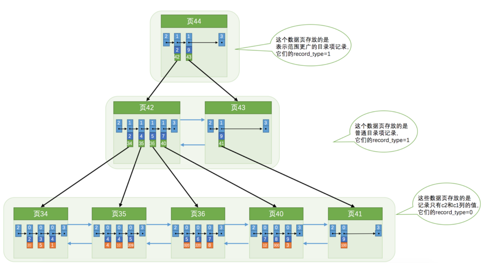


### 3.2 联合索引

联合索引是将多个列同时作为索引，底层也是建立一个B+数，只不过**需要同时存储多个列和主键的值**，B+节点的大小排序是先按照联合的第一列排序，如果第一列一致，就按照第二列排序，第二列一致，就按照第三列，以此类推。

因而联合索引可以按照==**最左匹配**==来起到索引的效果，例如a、b两列的联合索引，就可以被`where a=1 and b=2`这种查询命中(因为会先比较a再比较b符合联合索引的特点)，也可以被`where a=1`这种命中，但是`where b=2`就不能使用这个联合索引。而对于range条件`where a>1 and a<10 and b=1`这个查询就可以使用该索引，因为可以根据a的条件进行索引找，`b=1`不能用该索引，需要`a>1 a<10`拿出数据挨着比较b是否=1。这种比较方式就是==索引下推==

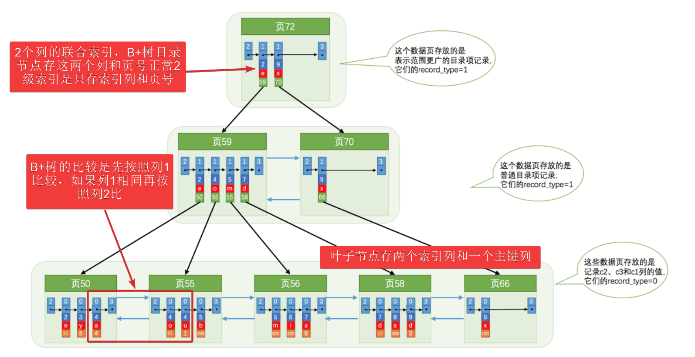


## 4 Buffer Pool

> 类似于cahe和内存之间的关系，为了提高查找效率、有脏页、等

读数据的最小单位是16k的页，如果同时要从一个页读两条不同的数据，那就可以把这页缓存到内存中，减少IO，基于这样的想法就有了BufferPool这个内存额定大小的空间，来缓存数据，BufferPool简称BP吧，他由两部分组成，控制块和缓冲页，缓冲页是存储内存页数据的只不过结构上稍有变化，并且缓冲页大小也是16k。控制块则是记录很多元信息的，每一个缓存页对应一个控制块。

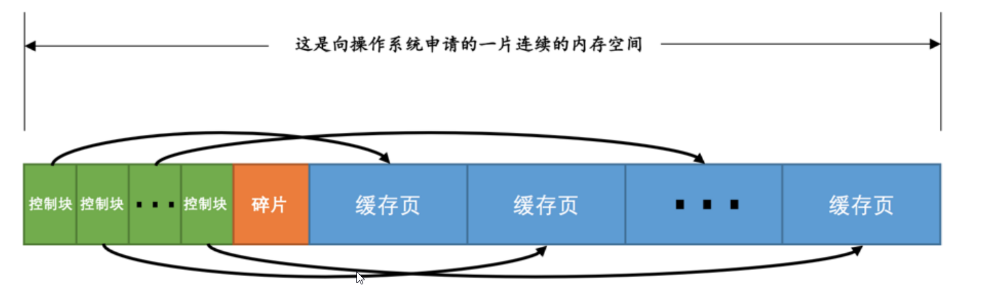


### 4.1 free与flush链表

> free主要用来分配缓存页，flush主要用来刷新磁盘

把空闲的缓冲页的控制节点串成一个链表，就是free链表，主要用来用的时候可以从这个链表分配，而当分配后如果有写操作，就会修改缓冲页中的值，导致和磁盘页不一致，称为脏页，脏页的控制节点也串成一个链表，叫flush链表，下面是两个链表示意图，一个控制块要么是free要么flush，也可能都不是，都不是的就是普通的读缓存节点，没有update操作过。另外如何根据物理磁盘页信息找到内存中的缓冲页呢，因为是个链表，O(n)显然不可取，所以有个专门的HashTable维护了表空间-页号和buffer页的对应关系。

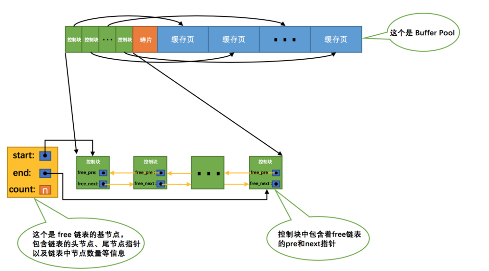

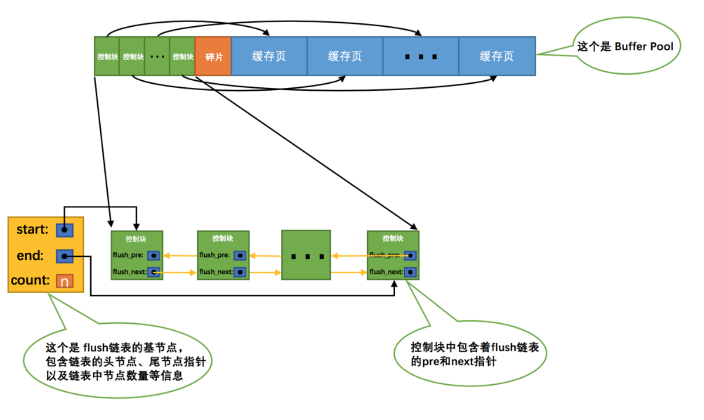

### 4.2 LRU链表

> 最近最久未使用

**从磁盘读到内存的页，都会放到LRU链表中**，也就是说LRU链中的节点是由flush链表的所有节点和另一部分只读没写的节点组成的。

mysql的LRU有很多改进，例如为了减少热点数据频繁在链表中移来移去，退出了前3/4个节点是young区，后1/4是old区，young区节点被访问后需要先判断距离上次被访问的时间是否大于一个阈值时间，如果没有就不移动了，因为young短时间也不会有被驱逐的危险，老年人才会被优先淘汰，这样减少了LRU的频繁操作。

### 4.3 脏页落盘

数据刷新到磁盘，是一个后台线程定期执行的，有两种刷新方式：

- 从LRU的old中刷脏页(跳过不是脏页的old)
- 从flush链表中刷一部分

## 5 bin log

> 下面的三种log和事务、MVCC、锁都是在事务的基础上操作的。

Binlog是**记录所有数据库表结构变更以及表数据修改的二进制日志**，不会记录SELECT和SHOW这类操作，主要用**于==数据恢复==和主从同步**。写入时机是事务提交的时候。

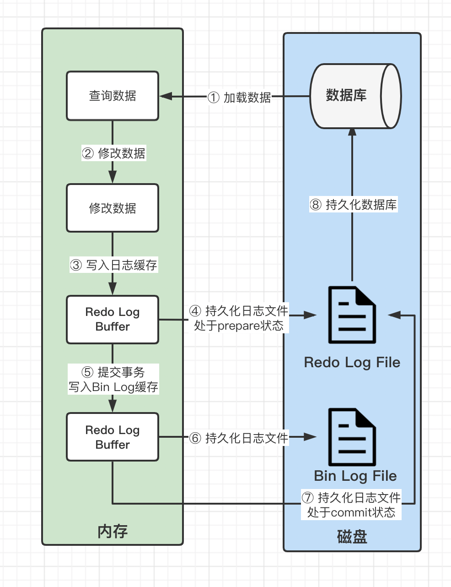

> 上图内存最下面那个是Binlog Buffer

文件记录模式有STATEMENT、ROW和MIXED三种。

STATEMENT<u>记录每次执行的sql</u>，日志小，但是有些sql有毒比如`now()`，可能导致恢复的时候与之前数据不一致。针对这种函数也有解决方案，如下是一个binlog截图，先设置当前时间戳然后，再运行now的这句sql。

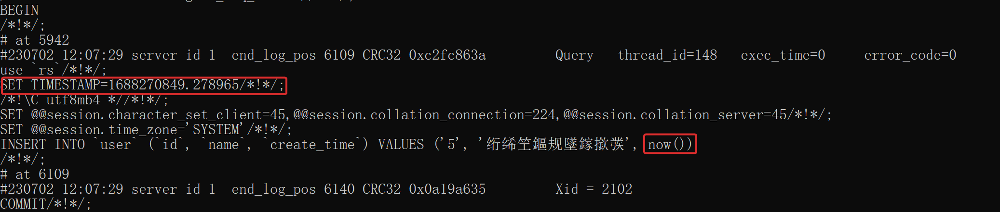

ROW<u>记录每一行被改的数据</u>，能还原所有的细节，但是如果有加一列这种操作，可能导致全表都得生成binlog。

MIXED则是两者结合。

实操：

首先binlog需要在`my.ini`配置文件中打开，对应的是`log-bin=mysql-bin`这一行配置，打开后进行数据写操作就会产生`mysql-bin.000001`这个文件，后缀是递增的一个号。

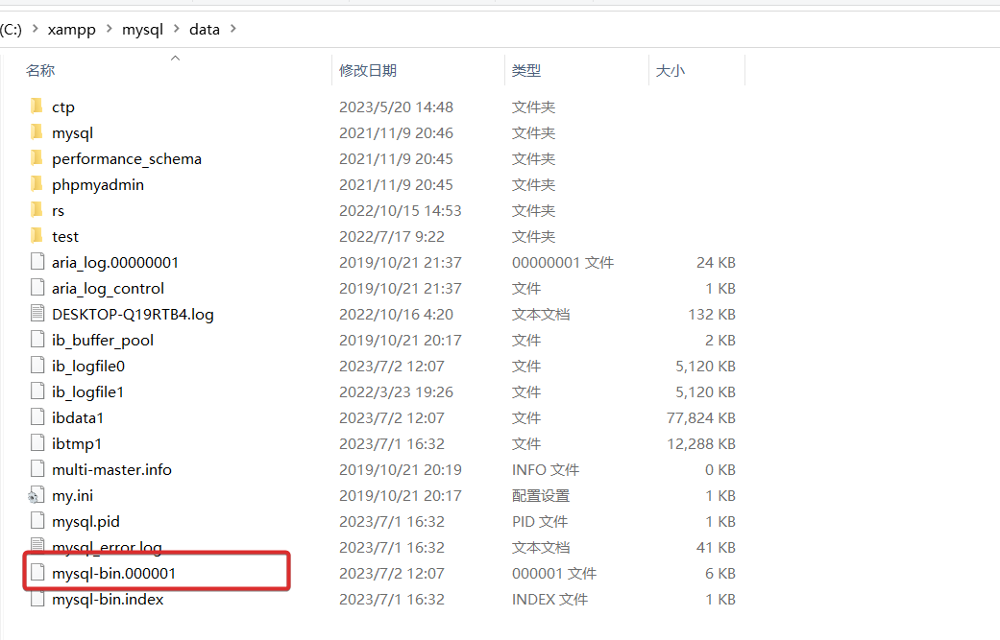

该文件不能直接打开，可以通过登录mysql后，执行`show binlog events`来查看对应的sql。

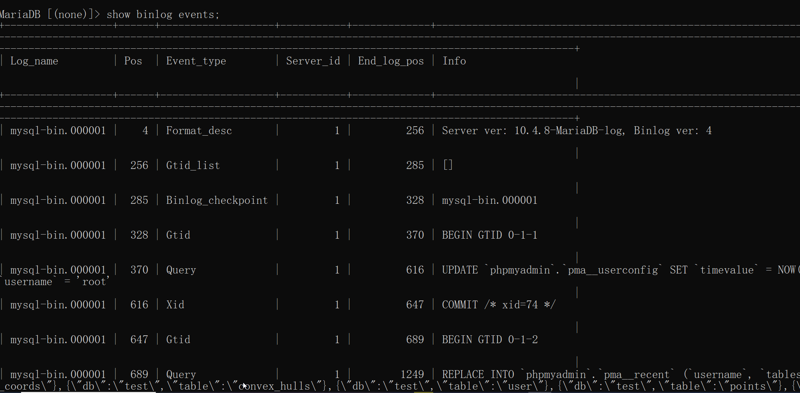

也可以通过`mysqlbinlog`指令来将其转换成sql文件，通过这个sql文件恢复到目的时间点的sql数据

```shell
mysqlbinlog --no-defaults mysql/data/mysql-bin.000001 > output.sql
Copy
```

可以添加`--start-datetime="2023-06-30 00:00:00" --stop-datetime="2023-06-30 08:00:00"`这种参数来圈定固定的时间范围，或者使用`--start-position=190 --stop-position=888`来确定位置，position就是上面sql截图中每一句sql都有的一个偏移量。`--database=test`则可以指定某个db。

其他知识，一般可以通过`mysqldump`和`binlog`相结合的方式来实现线上数据的备份，这样可以使得mysql数据可以快速恢复到任意时间点。例如每天执行一次`mysqldump`同时带上`--flush-logs`标志，这样每天会生成一份全量数据库的sql文件，同时切换`binlog`文件到一个新的文件，来打印新的一天的sql。

想要恢复到3号10点10分，那么可以执行先用3号0点的`dump.sql`快速恢复到0点，然后用3号的`binlog`通过指定`--stop-datetime`恢复到具体的10点10分这一瞬间。这样比纯用`binlog`的速度快。


## 6 redo log

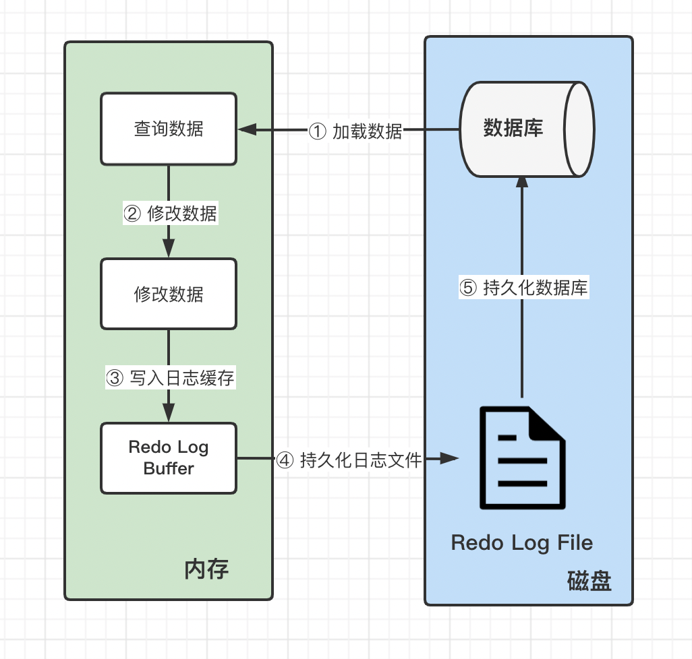

redo log也是用来记录执行的数据变动的，跟binlog很像，但是他是innodb存储引擎级别的，并且**存储的是数据页的变动，并且是顺序写，性能更好，主要用来做==故障恢复==**。

redolog vs binlog

binlog是逻辑日志，记写操作的sql；redolog是数据页的变动情况，物理日志，记录的是一些二进制数据；binlog会不断累积，redolog会循环利用文件组覆盖；binlog的目的是记录所有的写sql，用于归档，可以恢复到任意时间，redolog的目的是故障恢复，所以只需要保证记录了所有`脏页`即可。

update数据的过程是，读取出要改的数据页，扔到上文提到的`BufferPool`中，然后对页进行更改，当事务提交后，对应的缓冲页会扔到`flush`链，我们上文说系统会定期刷新flush链的内容。不过漏掉了细节，就是对页进行更改后，需要将更改的内容以redolog的形式进行持久化。redolog的生成过程，也需要现将生成的内容以`redo log block`的形式放到`LogBuffer`中，然后等`LogBuffer`刷盘，有两个时机是必须刷盘(从内存写到硬盘)的：

- 1 事务提交的时候，必须刷盘，虽然事务提交`BufferPool`中的flush链表可以不立即刷盘，但`LogBuffer`必须立即同步刷盘。
- 2 flush链表中脏页要刷新到磁盘之前，脏页如果要刷新到磁盘，必须保证他的`LogBuffer`中对应的redolog日志先刷盘完成。

当然刷盘时机还有其他，比如做checkpoint时，每秒定期等。不过我们至少是能保证，当事务提交的时候，也就是内存中的页成为了脏页，那么redolog就一定要刷盘，这是最基本的保证，这样才能保证redolog是保存了所有的脏页数据的。

binlog为什么不能用来做故障恢复？

因为故障恢复本身是要把产生线上影响的数据恢复回来，这是mysql先写内存后异步刷盘导致的问题。如果写内存后，没有刷盘就崩溃了，此时需要将写入内存的脏页恢复到磁盘上，这是因为 脏页虽然在内存中，但是可能已经提供服务出去了。因而**故障恢复本质就是脏页的恢复**。`redolog`能保证事务提交的时候已经刷盘到日志文件，专门就用来恢复脏页。`binlog`并不做这个保证，并且记录的是全量的写sql日志，如果用其做故障恢复，要全量删库然后运行`binlog`，过于兴师动众，而redolog只用恢复那部分脏页就好了。

为什么不直接在事务提交时刷盘到ibd文件(inoDB文件，真正存储行数据的文件)？

上面说故障恢复本质是先内存，然后异步刷盘ibd数据文件导致的，redolog保证了刷内存的同时也写入redolog文件，为什么不直接写入ibd文件不就可以了吗。换句话说，内存和ibd文件一直保持强一致，不就可以了。毕竟写redolog文件也是写文件，直接写ibd文件也是写文件。这是因为ibd文件写入的话，可能涉及到多个不同位置的页，**磁盘是随机写，速度慢，而redolog是连续写速度快，对正常sql的性能影响小很多很多**。

### 6.1 redolog文件组

redo log是指定的文件个数的，比如设置了3个文件，那么就是xx.0 xx.1 xx.2这三个文件，每个文件大小也是指定的，当.2文件写满的时候，就会==覆盖==.0文件。redo log是用来崩溃恢复的，所以对于已经存到db磁盘的数据的redolog就不再需要了，因而可以循环利用文件组。但是需要保证确实被覆盖的部分数据，确实已经刷盘到DB了，所以有了checkpoint的概念，简单讲他是专门检查当前已经刷到ibd文件的日志序号（LSN）。

**恢复的时候，就从checkpoint开始，往后读block，直到有个block的size不是512了，说明这里崩溃的，恢复之前的。**因为cp保证了之前的操作都已经持久化到ibd文件了，而之后的则不一定，因为redolog记录的是页的变动信息，是幂等的。cp之后的可能有一部分是已经持久化到ibd文件了，也没有关系，幂等。

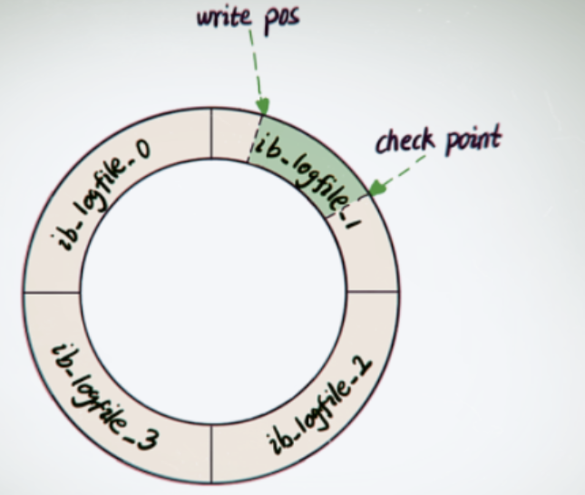

### 6.2 MTR的原子性

在进行事务操作的时候，改动都是先写Buffer Pool，然后由redolog记录，redolog被分为很多个不可分割的”组”，例如某个insert操作中，主键的max值自增是一个组，插入b+树数据是一个组。而b+树插入可能有很多步骤，尤其产生分裂的时候，如何保证这个组不可分割，**那就在redo中以一个特殊标志位标识是组的最后一个log完成**。这样就能在恢复的时候，不至于只恢复半个组，导致数据不一致。我们把只包含一个分组的这个操作叫做(MTR)最小事务，一个MTR对应不可分割的redolog组。

## 7 undo log

undo log与==事务回滚==和mvcc的版本链都有关系，mvcc我们后续介绍，**undo log本质是为了记录对数据的操作历史记录。**

> 开启事务，可以用例子中的`START TRANSACTION;`或者简单的`begin;`;
> 提交事务，即确认DML的改动，使用`commit;`
> 回滚事务，即要回退掉之前的操作，使用`rollback;`

> undo log与上面两种log不同，按上面两种log都有自己的日志文件，而undo log并不算是日志，它的数据保存在idb文件中，它是用页来存储信息。

数据页的每一行都有3个隐藏字段`row_id`，`trx_id`，`roll_pointer`。其中事务id就是当前的事务的id，roll_pointer则是指向上一次事务修改的数据，这个数据就在undo log中。因而当事务中修改数据的时候，需要将老的数据扔到`undo_log`的数据页中新的数据通过指针指向老的数据。这样如果事务回滚的话，只需将老的数据恢复回来即可。

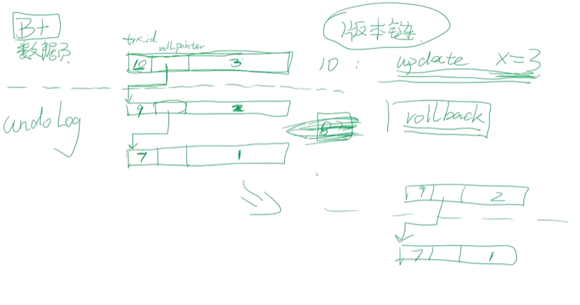

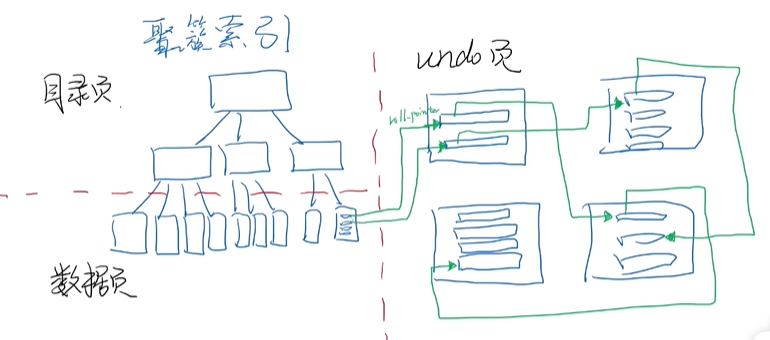

> row_id：如果建表的时候没设置主键或者索引的话，会使用隐藏的该字段作为索引。表都是根据主键用的聚簇索引以B+树存储
>
> rool_pointer：指向上一个事务的事务id，可以查到上一个事务的数据


### 7.1 undo页

与redo log不同，undo log和db一样用页的方式组织的，有一种专门的page_type就是undolog类型。这是因为undo log是事务相关的，一个事务需要自己的undo log链，而redo log是物理页的改动记录，与逻辑层无关，所以可以无脑顺序写。

undolog对不同的增删改操作生成的log结构并不相同，

- 对于新增操作需要记录新增的id即可；
- 对于修改操作则需要记录改动前的旧值(只记改的列)；
- 而对于删除操作稍微不太一样，需要记录删除前的样子，并且还不能直接把主索引树种的记录删除，因为**删了的话就没法link到undolog了，所以是把原来的记录打一个delete标志，然后把所有的列值记录到undolog中**。

对于insert和非insert，有两个链表insert链和update链（虽然叫update其实也包含delete），而对于临时表和普通表也是分开的，所以一个事务对应的undo log会有0~4个redo log链。

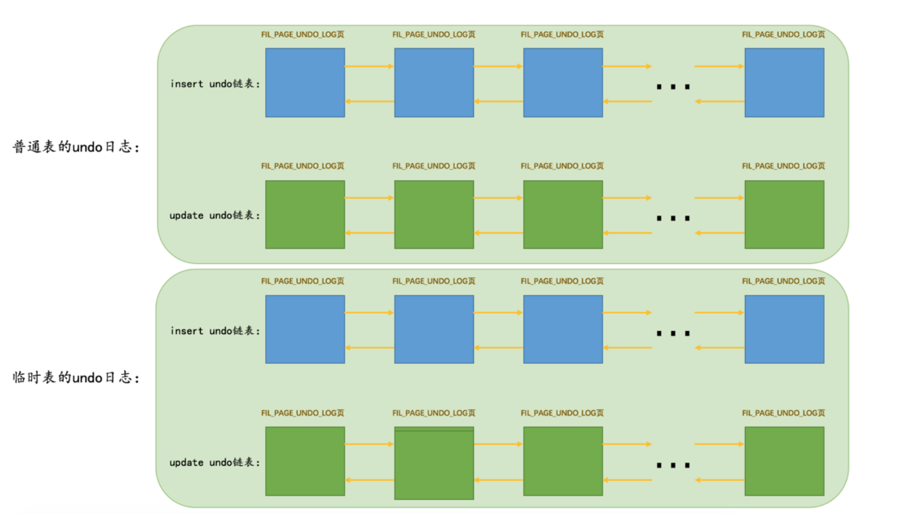

insert undo链表 中只存储类型为 TRX_UNDO_INSERT_REC 的 undo日志 ，这种类型的 undo日志 在事务提交之后就没用了，就可以被清除掉。所以在某个事务提交后，重用这个事务的 insert undo链表 （这个链表中只有一个页面）时，可以直接把之前事务写入的一组 undo日志 覆盖掉，从头开始写入新事务的一组 undo日志 ，如下图所示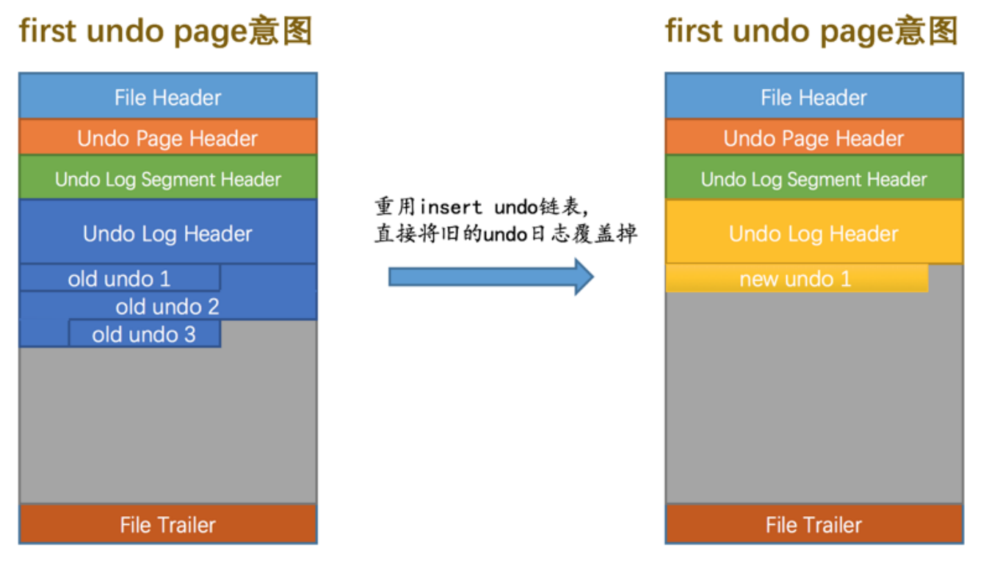


但是update链就稍微特殊，因为事务提交后，也不代表undolog可以删除，因为mvcc追溯版本可能还会追溯到提交后的历史事务中来，所以page可以重复利用空闲的部分，但是原来的数据不能改。

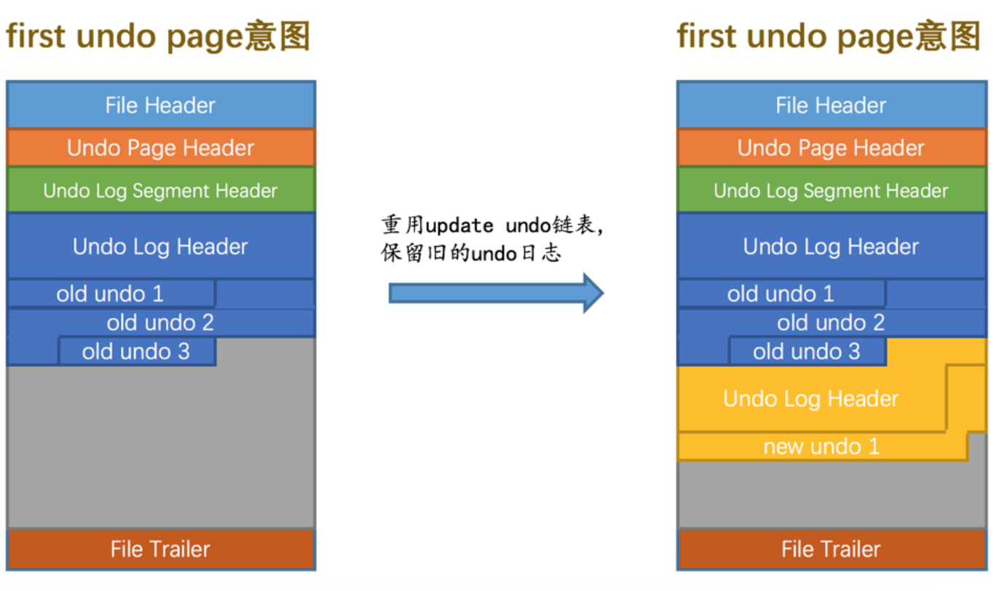

### 7.2 undo段（回滚段）

回滚段是特殊的一页，这一页有1024个undo slot，每个slot指向`first undo page`也就是undo log链表的第一个节点，回滚段（Rollback Segment）是用于实现事务回滚操作的一种数据结构。它是一块用于存储已提交事务的旧版本数据的空间，以便在需要回滚事务时可以恢复到之前的状态。

一个回滚段可以指向1024个链，一个单表事务最多4个链，因而一个回滚段就能支持至少256事务并行，而mysql有128个回滚段。

## 8 事务的隔离级别

隔离：同一时间可能有多个事务同时对一个数据进行操作，这时候就需要隔离

- read uncommited: 有脏读问题，即事务A写的数据，还没提交事务B就读到了，A回滚后，B使用的是脏数据。
- read commited: 有不可重复读问题，即事务A查到一条数据，事务B修改了这条并提交，事务A再次查询发现，同一条数据前后两次读出来的结果不一样了。
- repeatable read: 有幻读问题，即事务A按照条件P查出了一批数据，而事务B插入了一批符合P的数据并提交。此时事务A又用P去查数据，发现条数比之前多了。
- serializable: 同一时间只能执行一个事务，无任何并发问题，因为不支持并发，串行执行事务。


## 9 MVCC

> 解决了重复读的隔离问题，也解决了读和写的并发问题，但是没能解决幻读问题和写与写的并发问题(用锁解决)

上面undo log中介绍了每一条数据在被事务修改后，历史版本的数据不会被立即删除，即使事务提交了也不会删除(insert的历史可以删除)，这样每个历史的版本都会保存下来到undo log页中，通过`roll_pointer`将一条数据的所有版本串联起来，这就是版本链。下面都是RR隔离级别为例，讲述MVCC工作流程。

trx_id是当事务有写操作时才会申请的自增id，如果纯读事务trx_id=0，RR的实现是在第一句`select`的时候创建`ReadView`，直到事务结束都使用这个视图实现的，而`ReadView`本质是记录当前所有已经提交和未提交的事务，RR读取数据的时候查看数据的`trx_id`，如果不是已经提交的事务，就顺着`roll_pointer`向前直到找到已经提交的版本。

RR和RC最大的区别就是RR是第一句select建立readview，而RC是每一句select都重新创建readview。

### 9.1 Readview

ReadView能判断一个trx_id是已经提交的还是正在运行的，主要通过以下四个字段：

- max_trx_id 下一个要分配的trx_id
- min_trx_id 所有活跃的trx中最小的id
- m_ids 所有活跃的trx id列表
- creator_trx_id 当前事务的id（可能是0，因为当前可能没有写操作）

trx_id拿来之后先判断是不是`>=max_trx_id`，如果是的话说明是未来提交的事务，不能用；

然后判断是不是`<min_trx_id`，如果是的话说明已经提交的事务，直接用；

如果在两者之间，需要判断是不是`=creator_trx_id`，如果是的话说明是自己改的，直接用；

如果不是的话，需要判断是不是`in m_ids`，如果是的话说明是未提交的事务，不能用，否则可以用。

ReadView是一个简单的数据结构，RR下每个有读操作的事务都会生成一个ReadView，RC下则可能有多个。ReadView以列表的形式存放在特殊的位置。当一个事务结束后，ReadView就会被删除，因而列表中存放的ReadView都是active的事务。从这个列表中，可以筛选出所有的`min_trx_id`中最小的，如果比这个id还小2个版本的undolog说明不会被任何事务所依赖了，那这部分就可以被清理了。有个专门的线程来做清理工作。

### 9.2 快照读与当前读

依赖`ReadView`的读取又叫快照读、视图读、一致性读，但是并非所有的读都能用视图读。例如当我们执行写操作的时候

```sql
update user set age=20 where age=19;
Copy
```

上面这句sql执行的时候，如果采用快照读，根据age=19找到的数据可能是一个老版本undolog中复原出来的数据，那么此时如果要修改他的age，是要修改undolog中的节点，还是修改聚簇索引的数据节点呢。先排除undolog，因为undolog页记录没法修改，只能加一个版本用指针链接起来，那这个老版本就被两个节点指向，就不是单链表了。所以只能修改数据节点，数据节点就是当前最新版本了，所以**写操作都不能用视图读，只能用当前读。**

因而写操作用当前读，读操作用视图读，可以保证读的时候不会出现幻读，因为多次读使用的视图相同。但是写操作的当前读，另外锁定读`select for update`和`select in share mode`使用当前读。当前读就有可能出现幻读，例如

```
事务A                       事务B
开始                        开始
select for update(n条)          
                           insert一条符合条件的数据

                           提交
select for update(n+1条)
提交
Copy
```

因为insert和select for update都是当前读，所以都是最新数据，因而第二次就读出了比第一次多一条的数据。也就是产生了幻读。

为了解决当前读的幻读，mysql引入了锁机制。

## 10 锁

锁主要有行锁和表锁两大类。其中行锁是解决当前读幻读的主要机制。**通过对数据范围加锁，导致另一个事务无法进行数据的修改**，例如上面例子中，行锁会锁住符合条件的范围，防止数据的插入，事务Binsert会被阻塞，直到A提交。

### 10.1 行锁 

行锁主要有5种： 记录锁，间隙锁，临键锁(next-key)，插入意向锁和隐式锁。

记录锁就是锁住当前条目，例如`update xx where id=1`会把id=1这一条锁住防止其他事务对其修改。

间隙锁(gap)是锁住B+树中当前条目和前一条之间的缝隙，例如`update xx where id<1`假如找到0条数据，并且存在id=1这条，那么就需要锁住(-无穷，1)，防止其他事务在这个范围插入了数据，导致后续当前读读取的条目增加。

next-key是记录锁+间隙锁，也就是左开右闭区间的锁，例如`update xx where id<=1`假如找到1条id=1这条数据，那么就需要锁住(-无穷,1]这个范围，因为1也不能被修改，这就是next-key lock。

对于以上三种锁，每种又分互斥锁(X锁)和共享锁(S锁)，X锁加锁后的数据不能被其他事务读或写，S锁加锁后的数据不能被其他事务写，但是可以被读，update、delete等写sql和`select for update`都是加X锁，而`select in share mode`是S锁。

> 这三种锁解决了同时写之间的互斥问题

插入意向锁是指前面gap或者next-key锁住一个范围之后，如果另一个事务想要在这个范围插入数据会被阻止，并且会分配一把锁给这个事务，只不过是`waiting`等锁的状态，等gap释放就可以插入了。

隐式锁，是针对`insert`的，默认是不加锁的，减少开销，当另一个事务要访问对应的id的时候，会看这条数据的`trx_id`来判断是不是已经提交的事务，如果不是，那就需要给这条数据加锁，锁的持有trx是记录中的`trx_id`，同时给自己创建一把对这条记录的锁，`waiting`状态。隐式锁可以减少`insert`时锁的创建，只有发生竞争的时候由另一个事务惰性创建，借助了`trx_id`这个隐式的条件。

当然为了提高并发性能，我们发现读-读是不需要互斥的，所以就有了类似读写锁的：独占锁(X)和共享锁(S)，例如`select in share mode`就只需要给数据加共享锁，允许其他事务也进行`select in share mode`。而`select for update`和写操作就需要加独占锁，其他事务既不能写也不能读，因为读的话，可能因为这个事务的修改，而导致两次读取数据的不一致。

对行锁进行分析，准备数据如下。

```
CREATE TABLE user (
   id INT AUTO_INCREMENT PRIMARY KEY,
   name VARCHAR(255) NOT NULL UNIQUE,
   age INT
);
insert into user (id, name, age) values (1, 'lily',20),(3, 'sam',24), (5, 'kity', 33), (10, 'tim',  44);

id name age
1  lily 20
3  sam  24
5  kity 33
10 tim  44

[ id 主键]
[ name 唯一索引]
Copy
```

查看锁

```sql
SELECT * FROM performance_schema.data_locks;
// 8.0查看锁信息 注意8.0是加锁就会在该表有记录
SELECT * FROM INFORMATION_SCHEMA.INNODB_LOCKS;
// 5.7查看锁信息 注意如果是5.7的话，得真正发生竞争了表里才有数据，所以至少俩事务并发运行才行
// 否则该表是空
Copy
```

加锁的原则就是防止其他事务影响这句sql中where条件去select的再次运行，**对于主键需要锁住聚簇索引，而对于二级索引需要锁住二级索引，并通过回表锁住聚簇索引**，防止数据其他字段被修改。

```sql
select * from user where id = 1 for update;
-- 记录锁X锁，锁住聚簇索引中id=1的这条

update user set age = age+1 where name = 'lily';
-- 记录锁X锁，锁住二级索引中name='lily'这条，并且回表锁住id=1的这条
-- 如果name不是唯一索引，那么这句加next-key

select * from user where id>=3 for update;
-- 3记录锁，5 next-key,10 next-key,sup next-key

select * from user where age>1 for update;
-- 当前读没有命中索引，每一条记录都加next-key，性能很差

select * from user where name>='sam' for update;
-- 理论上是，二级索引中 sam 记录锁，tim next-key，sup next-key，聚簇索引中 id=3 记录锁，id=10 记录锁
-- 实际是sam也是next-key，原因不明
Copy
```

### 10.2 表锁

表锁的效果等价于对每一条数据next-key锁，表锁的S锁和X锁使用非常少，代价较大，性能较差，以下方式在事务中获取表锁。

```sql
LOCK TABLES user READ;
LOCK TABLES user WRITE;
Copy
```

行锁和表锁存在一定的互斥关系，例如如果在这个表中有在用的行X锁，那想要获取这个表X锁，也是不行的，为了更快的判断这个情况，在进行加行X锁的时候(S锁类似)，需要先给表加`IX`锁。IX和IS又叫表的意向锁。

自增锁`AUTO-INC`，比较特殊是专门针对自增键的，比较简单，但是他的生效范围与其他不同，**其他行锁都是事务范围的，也就是事务结束的时候，锁才释放，但是自增锁是`insert`这一句结束就释放锁**。

### 10.3 MDL

当我们进行表结构修改DDL的时候使用的并不是表锁，而是server级别的元数据锁(Metadata Lock, MDL)，这就不是innodb引擎级别的锁了。

### 10.4 死锁

当一个事务锁的顺序是id=2,id=3，另一个事务锁顺序反过来，并发运行时，就会出现死锁。死锁出现时，mysql会选择较小的事务进行回滚，并向上报错。


## 11 explain

```sql
mysql> explain select * from user;
+----+-------------+-------+------------+------+---------------+------+---------+------+------+----------+-------+
| id | select_type | table | partitions | type | possible_keys | key  | key_len | ref  | rows | filtered | Extra |
+----+-------------+-------+------------+------+---------------+------+---------+------+------+----------+-------+
|  1 | SIMPLE      | user  | NULL       | ALL  | NULL          | NULL | NULL    | NULL |    4 |   100.00 | NULL  |
+----+-------------+-------+------------+------+---------------+------+---------+------+------+----------+-------+
1 row in set, 1 warning (0.01 sec)
Copy
```

结果中各个列的含义：

- id: 一个select对应一个id，如果是一个select的join操作，会有两个相同id。如果有子查询id会增加，如果能转join的子查询会优化成join。
- select_type: select的类型，比如是普通的还是union还是子查询等等，类型很多，用于判断是sql中哪一部分。
- table: 表名，如果sql写了别名，就显示别名
- type: 查询的类型很重要
  - const唯一索引等值查询
  - eq_ref指join时on条件中有一个表的唯一非null索引
  - ref对普通的二级索引等值查询，或join时on条件有一个表的普通二级索引
  - ref_or_null普通二级索引等值查询，该二级索引可以是null
  - index_merge索引合并，比较少见
  - unique_subquery/index_subquery.
  - range是索引使用in 或者大小于。
  - ALL全表
- possible_keys: 可能用到的key，key则是实际用到的
- key_len: key的最大长度(字节)
- ref: 当type是const,eq_ref,ref,ref_or_null,unique_subquery,index_subquery的时候，ref才有效，代表等号右边是什么。
- extra: 一些额外的辅助信息。

### 11.1 单表查询的例子

例子：

`type=NULL`，选择一些跟表没有直接关系的变量。

```
mysql> explain select @@version;
+----+-------------+-------+------------+------+---------------+------+---------+------+------+----------+----------------+
| id | select_type | table | partitions | type | possible_keys | key  | key_len | ref  | rows | filtered | Extra          |
+----+-------------+-------+------------+------+---------------+------+---------+------+------+----------+----------------+
|  1 | SIMPLE      | NULL  | NULL       | NULL | NULL          | NULL | NULL    | NULL | NULL |     NULL | No tables used |
+----+-------------+-------+------------+------+---------------+------+---------+------+------+----------+----------------+
Copy
```

`type=const`，通过主键或唯一索引等值插叙

```
mysql> explain select * from user where id = 1;
+----+-------------+-------+------------+-------+---------------+---------+---------+-------+------+----------+-------+
| id | select_type | table | partitions | type  | possible_keys | key     | key_len | ref   | rows | filtered | Extra |
+----+-------------+-------+------------+-------+---------------+---------+---------+-------+------+----------+-------+
|  1 | SIMPLE      | user  | NULL       | const | PRIMARY       | PRIMARY | 4       | const |    1 |   100.00 | NULL  |
+----+-------------+-------+------------+-------+---------------+---------+---------+-------+------+----------+-------+
Copy
```

`type=ref`，通过二级普通索引等值查询

```
mysql> explain select * from test where t2=2;
+----+-------------+-------+------------+------+---------------+------+---------+-------+------+----------+-------+
| id | select_type | table | partitions | type | possible_keys | key  | key_len | ref   | rows | filtered | Extra |
+----+-------------+-------+------------+------+---------------+------+---------+-------+------+----------+-------+
|  1 | SIMPLE      | test  | NULL       | ref  | t2,t2_2       | t2   | 5       | const |    3 |   100.00 | NULL  |
+----+-------------+-------+------------+------+---------------+------+---------+-------+------+----------+-------+
Copy
```

`type=range`，通过索引进行范围查询(in 或 大小于)，注意in如果只1个元素会退化成=。

```
mysql> explain select * from user where name in ('lily', 'zara');
+----+-------------+-------+------------+-------+---------------+------+---------+------+------+----------+-----------------------+
| id | select_type | table | partitions | type  | possible_keys | key  | key_len | ref  | rows | filtered | Extra                 |
+----+-------------+-------+------------+-------+---------------+------+---------+------+------+----------+-----------------------+
|  1 | SIMPLE      | user  | NULL       | range | name          | name | 1022    | NULL |    2 |   100.00 | Using index condition |
+----+-------------+-------+------------+-------+---------------+------+---------+------+------+----------+-----------------------+
Copy
```

`type=ALL`，全表查询，例如非索引条件

```
mysql> explain select * from user where age>1;
+----+-------------+-------+------------+------+---------------+------+---------+------+------+----------+-------------+
| id | select_type | table | partitions | type | possible_keys | key  | key_len | ref  | rows | filtered | Extra       |
+----+-------------+-------+------------+------+---------------+------+---------+------+------+----------+-------------+
|  1 | SIMPLE      | user  | NULL       | ALL  | NULL          | NULL | NULL    | NULL |    4 |    33.33 | Using where |
+----+-------------+-------+------------+------+---------------+------+---------+------+------+----------+-------------+
Copy
```

### 11.2 连表查询的例子

建立一个两个新的表test和test2结构完全一样如下，主键id，唯一索引t1，普通索引t2，联合索引t2_t3，普通列t4，t5，t6.

```sql
create table test
(
    id INT not null primary key, 
    t1 INT not null, 
    t2 INT, 
    t3 INT, 
    t4 INT, 
    t5 INT, 
    t6 varchar(255),
    unique index(t1), 
    index(t2), 
    index(t2, t3)
);
Copy
```

先来看个联合索引的例子，当空表查询时会使用key是t2，而当出入了数据的时候发现t2t3联合的效率更高，就用t2_2了。

```
mysql> explain select * from test where t2=1 and t3=1;
+----+-------------+-------+------------+------+---------------+------+---------+-------+------+----------+-------------+
| id | select_type | table | partitions | type | possible_keys | key  | key_len | ref   | rows | filtered | Extra       |
+----+-------------+-------+------------+------+---------------+------+---------+-------+------+----------+-------------+
|  1 | SIMPLE      | test  | NULL       | ref  | t2,t2_2       | t2   | 5       | const |    1 |   100.00 | Using where |
+----+-------------+-------+------------+------+---------------+------+---------+-------+------+----------+-------------+
1 row in set, 1 warning (0.01 sec)

mysql> insert into test (id, t1, t2, t3, t4, t5) values
    -> (1,1,1,1,1,1),
    -> (2,2,1,1,2,2),
    -> (3,3,1,2,4,4);
Query OK, 3 rows affected (0.01 sec)
Records: 3  Duplicates: 0  Warnings: 0

mysql> explain select * from test where t2=1 and t3=1;
+----+-------------+-------+------------+------+---------------+------+---------+-------------+------+----------+-------+
| id | select_type | table | partitions | type | possible_keys | key  | key_len | ref         | rows | filtered | Extra |
+----+-------------+-------+------------+------+---------------+------+---------+-------------+------+----------+-------+
|  1 | SIMPLE      | test  | NULL       | ref  | t2,t2_2       | t2_2 | 10      | const,const |    2 |   100.00 | NULL  |
+----+-------------+-------+------------+------+---------------+------+---------+-------------+------+----------+-------+
Copy
```

type=eq_ref，当我们将test和test2联合查询，并且有使用其中一个表的唯一索引作为连接条件，如下`test.id=test2.t5`，此时查询方式是，先全表扫test2拿出`所有的test2.t5`数据，然后作为id索引条件到test中去查询。所以有如下执行计划，eq_ref就是指用唯一索引查询，但是不是等于常量而是来自test2的全表结果，ref列的值是`test库test2表t5列`。

```
mysql> explain select test.t5, test2.t6 from test2 join test on test.id = test2.t5;
+----+-------------+-------+------------+--------+---------------+---------+---------+---------------+------+----------+-------------+
| id | select_type | table | partitions | type   | possible_keys | key     | key_len | ref           | rows | filtered | Extra       |
+----+-------------+-------+------------+--------+---------------+---------+---------+---------------+------+----------+-------------+
|  1 | SIMPLE      | test2 | NULL       | ALL    | NULL          | NULL    | NULL    | NULL          |    1 |   100.00 | Using where |
|  1 | SIMPLE      | test  | NULL       | eq_ref | PRIMARY       | PRIMARY | 4       | test.test2.t5 |    1 |   100.00 | NULL        |
+----+-------------+-------+------------+--------+---------------+---------+---------+---------------+------+----------+-------------+
Copy
```

如果我们把on的条件改成常量，就会变成const，因为只需要根据主键查询test，然后再全表扫test2

```
mysql> explain select test.t5, test2.t6 from test  join test2 on test.id = 1 and test.t3 =test2.t3;
+----+-------------+-------+------------+-------+---------------+---------+---------+-------+------+----------+-------------+
| id | select_type | table | partitions | type  | possible_keys | key     | key_len | ref   | rows | filtered | Extra       |
+----+-------------+-------+------------+-------+---------------+---------+---------+-------+------+----------+-------------+
|  1 | SIMPLE      | test  | NULL       | const | PRIMARY       | PRIMARY | 4       | const |    1 |   100.00 | NULL        |
|  1 | SIMPLE      | test2 | NULL       | ALL   | NULL          | NULL    | NULL    | NULL  |    1 |   100.00 | Using where |
+----+-------------+-------+------------+-------+---------------+---------+---------+-------+------+----------+-------------+
Copy
```

type=ref，条件中的`test2.t2`是普通索引，而不是唯一非null，此时就会变成ref。

```
mysql> insert into test (id,t1, t2, t3) values (4,4,2,2), (5,5,2,2), (6,6,2,3);

mysql> explain select test.t5, test2.t6 from test  join test2 on test.t2 = test2.t5;
+----+-------------+-------+------------+------+---------------+------+---------+---------------+------+----------+-------------+
| id | select_type | table | partitions | type | possible_keys | key  | key_len | ref           | rows | filtered | Extra       |
+----+-------------+-------+------------+------+---------------+------+---------+---------------+------+----------+-------------+
|  1 | SIMPLE      | test2 | NULL       | ALL  | NULL          | NULL | NULL    | NULL          |    1 |   100.00 | Using where |
|  1 | SIMPLE      | test  | NULL       | ref  | t2,t2_2       | t2   | 5       | test.test2.t5 |    3 |   100.00 | NULL        |
+----+-------------+-------+------------+------+---------------+------+---------+---------------+------+----------+-------------+
Copy
```

其他几个type暂时不列出来了，比较复杂。

## 12 多机

### 12.1 主从同步

主从同步的流程一般都是依赖主节点的binlog，从节点的io线程从主节点读binlog，看是否有新的数据，如果有的话就拉下来写到自己的relaylog中，然后再同步到数据库，主流程如下。

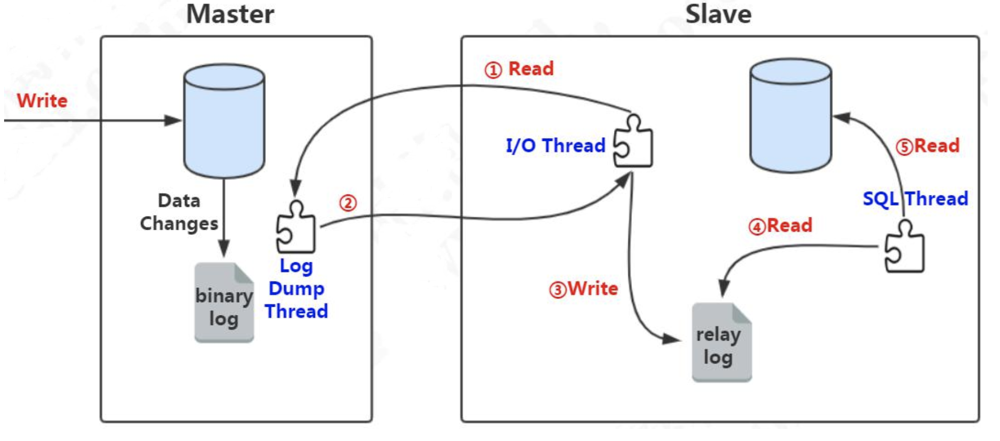

在同步过程中有多个策略可以选择：

- 异步复制，master不管slave，只管自己写binlog，slave异步去同步，这种新能最好，但是一致性最差。
- 半同步复制，事务提交要求n个slave收到日志才算提交成功，当n设置为全部slave节点就是同步复制了。

### 12.2 分库分表

不到万不得已不要分库分表。

数据量太大时，分库可以缓解单机压力，分表可以降低b+复杂度。

水平拆分是表结构完全一致，数据平均切分。垂直拆分例如分库就是部分表扔到另一个库，分表则是部分字段拆到另一个表。

分库分表就要用到分布式事务，两阶段/三阶段提交问题，自增id问题，查询时需要额外的外排等等。

### 12.3 分布式事务

在分库分别之后的事务就必须使用分布式事务了，此外对于更通用的场景，服务改不同的库表的一致性，也需要借助分布式事务。分布式事务常见的解决策略有2pc、3pc等。简单说一下这俩。

2pc：

- 第一阶段：协作者广播VOTE_REQUEST，等待commit或者abort
- 第二阶段：协作者根据收回的ack，广播一个全局commit或者abort

2pc比较简单，但是阻塞时间较长，比如第一阶段有个参与者就不能提交事务比如没有库存了，这时候其他参与者还在执行事务。有单点(协调器)故障问题，以及commit消息发送给部分机器后，协调器挂了，会导致不一致的问题。

3pc:

- CanCommit阶段其实和2PC的准备阶段很像。协调者向参与者发送commit请求，参与者如果可以提交就返回Yes响应，否则返回No响应。这时参与者并不执行事务，而只是说我是否准备好了。
- PreCommit操作。根据响应情况，有以下两种可能。假如协调者从所有的参与者获得的反馈都是Yes响应，那么就会执行事务的预执行。执行事务，但是不commit。
- Docommit.发送提交请求 协调接收到参与者发送的ACK响应，那么他将从预提交状态进入到提交状态。并向所有参与者发送doCommit请求。

3pc主要是为了解决2PC提交协议的阻塞问题。相对于2PC，3PC主要解决解决了2pc存在单点故障，导致节点持久阻塞的问题，降低了整个事务的阻塞时间和范围。3PC一旦参与者无法及时收到来自协调者的信息之后，他会默认执行commit，而2PC会一直持有事务资源并处于阻塞状态。缺点：但是这种实现就可能导致一致性的问题。