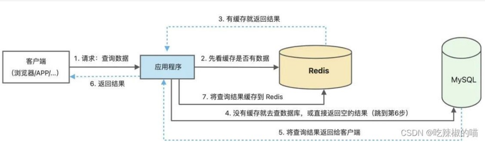

### 1. NoSql

#### 1.1 定义

`Not only SQL,`指的是非关系型数据库，是不同于传统关系数据库的数据库管理系统的统称

#### 1.2 使用场景

主要用于大规模的数据存储，主要考虑存储量和高并发性能，但是数据本身不需要固定的模式，横向扩展简单

#### 1.3 优点

1. 首先是对高并发读写的需求，传统关系型数据库无法应付

2. 其次是对海量数据的存储和访问需求

3. 再次是对高扩展性的需求

#### 1.4 分类

1. `key:value`键值对型数据库
   - `key`是索引，不允许重复，`value`可以重复，一般也不需要考虑`value`的格式
   - `redis`就是键值对型

2. 文档型存储数据库
   - 采用类似`json`文档的格式存储
   - `Mongodb`就是使用这种类型

3. 列存储数据库
   - 按列存储数据，最大的优势是数据压缩很高效
   - `Hbase`是这种类型

4. 图关系存储数据库

   - 以图的结构进行存储，图包括：点(实体)，边(关系)，最大的特点是存储了关系，适合做复杂的关联查询，存储自带复杂关系的数据

   - `neo4j`是这种类型


---

### 2. Redis概述

#### 2.1 定义

Redis是一个**键值对**存储的高性能数据库，缓存在内存中，主要目标是为了解决高并发的问题。

#### 2.2 使用场景

- 当一个系统中**读多写少**的时候，就可以使用`redis`
- redis需要配合MySQL这种传统数据库，相当于一个中间件，位于应用和后台数据之间

#### 2.3 缓存原理



**缓存技术**：通过将数据**缓存到内存中**，实现高并发访问

**写入**：直接跳过`redis`，进入`sql`进行写入

**查询**：先去`redis`中查，如果没有数据，再去`sql`中查

#### 2.4 优点

- 读取速度快，因为它在内存中，内存的io速度比硬盘块的多
- 高并发，减轻后台数据库的压力


----

### 3. Redis安装

- `redis`作为一个**服务器软件，分为服务端和客户端**，大部分情况下安装在linux下。

- **端口号默认为6379**

- **在cli客户端输入`shutdown`关闭服务**


### 4. Redis数据类型

- string(字符串)
- hash(哈希)
- list(列表)
- set(无序集合)
- zset(有序集合)


### 5. 数据操作命令

#### 5.1 string

- `string`是`redis`中最基本的数据结构，可以包含任何数据，包括二进制数据

##### 1. 添加或修改

- 添加单个

```
//添加单个
set key value

//例
set zhangsan 23  
```

> key不可重复，所以当key不存在时，是添加，存在时，是修改。

- 添加多个

```
//一次添加多个
mset key value key value...

//例
mset lisi 22 wangwu 20
```


##### 2. 查询

- 通过`key`查询

```
get key

//例
get zhangsan
```


##### 3. 删除

- 通过`key`删除

```
del key

//例
del wangwu 
```


---

#### 5.2 hash

- `hash`的数据结构是一种**映射表**，包括了`key`，和一组键值对的映射。一个`key`，对应一组或多组键值对`field:value`

- `hash`适合**存储一组数据**，很适合存储对象。


##### 1. 添加或修改

- 添加单个

```
//hset key 属性字段 属性值
hset key field value

//例
hset user01 username  root
```

> key不可重复，所以当key不存在时，是添加，存在时，是修改。

- 添加多个

```
//添加多个
hmset key field value  field value...

//例
hmset user02 username admin password 123456
```


##### 2. 查询

- 查询`key`对应某个字段的值

```
hget key field

//例
hget user02 password
```

- 查询该`key`对应所有字段

```
//展示字段也展示值
hgetall key 

//例
hgetall user02
```

- 查询字段`field`的数量

```
hlen key
```

- 查询所有的`field`

```
//只查字段。不显示值
hkeys key
```

- 查询所有的`value`

```
//只查值，不显示字段
hvals key
```


##### 3. 删除

- 删除某个字段或多个

```
hedl key field [field ...]		
```

> 输入命令后，Redis服务器将删除指定的key和对应的字段，并返回被删除字段的数量。如果返回的数量为0，表示指定的key不存在或者字段不存在


---

#### 5.3 list

- `list`是由**字符串**组成的列表，是**按照插入顺序排序**的，**`value`可以重复**


##### 1. 添加

- **添加多个**

```
lpush 列表名称 值1 值2 ...

//例
lpush city beijing shanghai guangdong  //guangzhou最后插入为最左边
```

- 从左侧添加

```
lpush 列表名 值
```

- 从右侧添加

```
rpush 列表名 值
```


##### 2. 查询

- 根据区间查询

```
lrange 列表名 起始位置 结束位置

//列
lrange city 0 2  //查询前三个值
lrange city 0 -1 //查询所有值，-1代表最后一个
```

- 根据下标索引查询

```
index 列表名 下标

//例
index city 3
```

- 查询列表长度

```
llen 列表名
```


##### 3. 修改

```
lset 列表名 下标 新数据

//例
lset city 0 hangzhou
```


##### 4. 删除

- 删除最左边的元素

```
lpop 列表名
```

- 删除最右边的元素

```
rpop 列表名
```

- 删除指定的元素

```
//num是删除值的数量(value是有重复的),num分正负，如果为正是从左往右删，为负从右往左,如果num=0，删除所有
lrem 列表名 num value		
```


---

#### 5.4 set

- `set`是一种**无序**的集合，并且元素**不能重复**


##### 1. 添加

```
sadd 集合名 值1 值2...

//例
sadd zimu a b c d e	//顺序随机
```


##### 2. 查询

- 查询所有值

```
smembers 集合名
```

- 查询元素个数

```
scard 集合名
```


##### 3. 删除

- 删除某个值

```
srem 集合名 值
```


==集合之间的操作==

##### 4. 交集

```
sinter 集合1 集合2
```

##### 5. 并集

```
sunion 集合1 集合2
```

##### 6. 差集

```
sdiff 集合1 集合2	//前面有的，后面没有的
```


---

#### 5.5 zset

- `zset`也**不允许元素重复**，而且是**有序**，它是通过一个分值来实现**升序排序**。每个元素都有一个分值


##### 1. 添加

```
zadd 有序集合名 分值1 值1 分值2 值2...

//例
zadd stu 60 zhangsan 70 lisi 80 wangwu
```


##### 2. 查询

- 根据索引查询

```
zrange 有序集合名 开始下标 结束下标
```

- 查询时附带分值，在后面加上`withscores`

```
zrange 有序集合名 开始下标 结束下标 withscores

//例
zrange stu 0 -1 withscores
```

- 根据分值查询

```
zrangebyscore 有序集合名 开始分值 结束分值
```

- `-inf`代表最小值  `+inf`代表最大值，还可以后面加上`withscores`附带分值

```
zrangebyscore 有序集合名 -inf +inf withscores	//结果为所有元素+分值
```

- 查询元素个数

```
zcard 有序集合名
```


##### 3. 删除

```
zrem 有序集合名 值

//例
zrem stu zhangsan
```


##### 4. 反转

```
zrevrange 有序集合名 开始下标 结束下标

//例
zrevrange stu 0 -1
```


### 6. 其他操作命令

#### 6.1 获取所有key

```
keys *
```

#### 6.2 查询key的数量

```
dbsize
```

#### 6.3 判断某个key是否存在

```
exists key
```

#### 6.4 删除某个key

```
del key
```

#### 6.5 查询数据类型

```
type key
```

#### 6.6 移动数据

```
move key 数据库编号(0-15)	//默认为0号库
```

#### 6.7 切换库

```
select 数据库编号(0-15)		
```

#### 6.8 清空数据库

```
flushdb
```

#### 6.9 清空全部库

```
flushall
```

