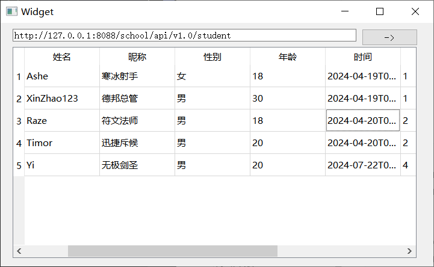

## 1. Qt概述

Qt 是一个跨平台的 C++图形用户界面应用程序的开发框架。

- 图形用户界面： GUI （Graphical User Interface）
- 框架：别人写好的一堆类（工具包）和开发规则。使用框架开发，能够大大降低程序的开发难度，提升开发效率，节约开发成本。
- 跨平台： 一次编写，在不同平台上无需改动（或少量改动）就可以形成在不同平台上运行的版本，例如：Windows、Linux、Mac等

Qt 还支持嵌入式和移动开发，例如：IOS、Android、Embedded linux和WinRT等。


Qt 成功应用案例：

- Autodesk Maya, 3D建模和动画软件
- 央视影音客户端，中央电视台电视直播客户端
- WPS Office办公软件
- Skype 网络电话
- Google地球（Google Earth），三维虚拟地图软件
- VLC 多媒体播放器
- 斗鱼TV，斗鱼直播客户端
- 咪咕音乐
- 。。。。。。


Qt 发展史：

- Qt 的前身为创始于1994年的 Trolltech（奇趣科技）
- Trolltech 于2008年6月被 Nokia（诺基亚）收购
- 2011年3月 Qt 被芬兰的 Digia 公司收购


Qt版本介绍：

- Qt目前有 Qt4、Qt5、Qt6三个版本
- Qt4.8.7 是 Qt4 的最终版本，也是 Qt4 系列中最稳定的版本，很多老项目还是会用 Qt4 进行维护
- Qt5 是现在最常用的版本
  - Qt5.6.3 是最后支持xp系统的长期支持版本；
  - ==Qt5.12.3== 是最后提供mysql数据库插件的版本，往后的版本需要自行编译对应的 mysql 数据库插件；
  - Qt5.12.5 是最后样式表性能最高的版本;   QSS 、 css
  - Qt5.14.2 是最后提供离线安装包的版本，后面的版本都要在线安装;
  - Qt5.15 系列是最后支持 win7 的版本
- Qt6 是最新版本，还在不断更新，解决BUG，目前不是很稳定。


---

## 2. 项目文件解析

基础项目包含了4个文件：     

- 工程文件： 01_first_project.pro
- 头文件： MyWidget.h
- 源文件： main.cpp    MyWidget.cpp
- 用户配置文件： 01_first_project.pro.user


### 2.1 工程文件 

工程文件：  qmake自动生成的用于产生 makefile 的配置文件

```makefile
# 项目需要包含的模块
Qt       += core gui

# 当Qt版本大于4时，包含的模块
greaterThan(Qt_MAJOR_VERSION, 4): Qt += widgets

# 产生的可执行程序（.exe） 的文件名
TARGET = 01_first_project

# 程序的生成模式。 app代表生成 .exe 可执行程序， lib 代表生成 .dll 动态链接库
TEMPLATE = app

# 编译选项，当项目中出现某些被标记为过时模块时，会报警
DEFINES += Qt_DEPRECATED_WARNINGS

CONFIG += c++11
# 项目中包含的源文件
SOURCES += \
        main.cpp \
        Widget.cpp
# 项目中包含的头文件
HEADERS += \
        Widget.h

# 项目部署的默认规则
qnx: target.path = /tmp/$${TARGET}/bin
else: unix:!android: target.path = /opt/$${TARGET}/bin
!isEmpty(target.path): INSTALLS += target
```


### 2.2 项目入口文件

`main.cpp`： 项目入口文件

```C++
#include "Widget.h"

// 包含应用程序类型的头文件
#include <QApplication>

// 入口函数
int main(int argc, char *argv[])
{
  	// 实例化应用程序对象，该对象有且仅有一个
    QApplication a(argc, argv);
  	// 实例化窗口对象， widget 代表空窗口
    Widget w;
  	// 调用 show 方法显示创建好的空窗口
    w.show();
		// 让应用程序对象进入消息循环。 没有该方法，程序启动后马上会被销毁
    return a.exec();
}

```


### 2.3 窗口文件

`MyWidget.h`： 窗口类头文件

- Widget 是系统提供的空窗口基类
- 该头文件中，对空创建基类进行了二次封装，如果需要在创建窗口时实现额外的功能，可以在该文件中实现

```c++
#ifndef MYWIDGET_H
#define MYWIDGET_H

// 包含系统提供的 QWidget 类
#include <QWidget>

class Widget : public QWidget
{
    // Q_OBJECT宏，设置了该宏之后，就能在项目中使用 信号 和 槽
    Q_OBJECT

public:
    Widget(QWidget *parent = 0);
    ~Widget();
};

#endif // MYWIDGET_H
```


`MyWidget.cpp` 实现窗口的功能

```c++
#include "MyWidget.h"

Widget::Widget(QWidget *parent)
    : QWidget(parent)
{
}

Widget::~Widget()
{

}
```


---

## 3. Widget空窗口

### 3.1 设置窗口

```c++
// 设置窗口标题
this->setWindowTitle("我的第一个App");
// 设置窗口大小
this->resize(500, 300);
// 设置窗口固定大小（不能拖拽修改）
this->setFixedSize(500, 300);
```


### 3.2 三大部件


所有的器件都间接或者直接继承`QWideget`这个基类，`QWideget`类里面含有`setTest()/setFont/resize()`等方法，所以所有的器件都可以调用这些方法。


#### 1. 字体

字体不属于部件，所有需要显示文字的都可以使用`setFont()`指定字体

```c++
//统一设置
QFont f1("隶书",20,100,true);
QFont f2;
//逐个设置
f2.setFamily("隶书");
f2.setPointSize(30);
f2.setBold(true);
f2.setItalic(true);
```

#### 2. QLabel

表格

需要导入头文件 `#include<QLabel>`

```c++
QLabel * l1 = new QLabel;
l1->setText("Hello Word");
//需要设置在窗口里(设置父类)显示
l1->setParent(this);
//移动label位置
l1->move(100,50);
//设置这个label大小
/l1->resize(20,10);
//设置label边框,查看帮助手册,不设置的话就没边框效果
l1->setFrameShape(QFrame::Panel);
//设置字体,第一个字体类型、第二个大小(数字越大字越大)、第三个加粗(枚举值查手册)、第四个是否倾斜(true/false)
//l1->setFont(QFont("楷体",20,100));
//l1->setFont(QFont("楷体",20,QFont::Bold,true));
l1->setFont(f1);

//使用第二个构造函数实现Label,直接把文字放入参数
QLabel * l2 = new QLabel("L2测试",this);QPixmap("图片地址")
l2->move(150,30);
l2->setFont(f2);

//填充QLabel为图片
l2.setPixmap(QPixmap("图片地址"));
```


#### 3. QPushButton

按钮，可以设置点击效果(信号)，与之对应槽函数来反应信号

需要导入头文件 `#include<QPushButton>`

```c++
QPushButton * btn1 = new QPushButton;
btn1->setText("搜索");
btn1->setParent(this);
btn1->move(50,120);
//设置button的宽、高
btn1->setFixedSize(150,50);
//btn1.resize(150,50);   等同于上句，设置大小时这两个方法都可以,别的器件也类似
btn1->setFont(f2);

//初始化时就设置文本
QPushButton * btn2 = new QPushButton("登陆",this);
btn2->move(200,100);
//隐藏边框，点击的时候才显示
btn2->setFlat(true);
```

#### 4. QLineEdit

输入框，可以有

```c++
QLineEdit * line1 = new QLineEdit;
line1->setParent(this);
line1->setText("lineEdit---Test");
line1->move(200,200);
line1->resize(280,40);
line1->setFont(f1);
//隐型显示提示文字
line1->setPlaceholderText("账号/手机号/邮箱");

//初始时设置文本
QLineEdit * line2 = new QLineEdit("line...",this);
line2->move(200,400);
```


---

## 4. 信号和槽

[【Qt 学习笔记】详解Qt中的信号和槽_从信号与槽开始学qt-CSDN博客](https://blog.csdn.net/m0_74014525/article/details/137375655#:~:text=QT中的信号和槽是用于实现对象之间的通信的机制。 每个对象都可以发出一个信号，其他对象可以通过连接到该信号的槽来接收并处理信号。,通过将信号和槽连接起来，可以实现对象之间的交互和通信。 一个对象的信号可以连接到其他对象的槽，也可以将多个信号连接到同一个槽上。 Qt中可以使用connect函数，把一个信号和一个槽关联起来，后续只要信号触发%2CQt就会自动执行槽函数。)

### 4.1 基本概念

1. QT中的信号和槽是用于实现对象之间的通信的机制。每个对象都可以发出一个信号，其他对象可以通过连接到该信号的槽来接收并处理信号。

2. 通过将信号和槽连接起来，可以实现对象之间的交互和通信。一个对象的信号可以连接到其他对象的槽，也可以将多个信号连接到同一个槽上。

3. Qt中可以使用`connect`函数，把一个信号和一个槽关联起来，后续只要信号触发,Qt就会自动执行槽函数。

4. QT中的信号和槽是通过使用`QObject`类的特性来实现的，需要使用宏来声明信号和槽，并使用信号和槽的宏来进行连接。QT提供了一个`QMetaObject`系统来管理信号和槽的连接和调用。


### 4.2 信号

#### 1. 什么是信号

信号可以被认为是一个事件，当某些条件发生时，对象会发出一个信号。例如，鼠标点击、键盘输入或者是对象的状态改变都可以作为信号。

#### 2. 信号的本质

信号是由于用户对窗⼝或控件进行了某些操作，导致窗⼝或控件产⽣了某个特定事件，这时 Qt 对
应的窗⼝类会发出某个信号，以此对⽤⼾的操作做出反应。

#### 3. 信号的举例

> 信号的本质就是事件

1. 按钮单击、双击
2. 窗⼝刷新
3. ⿏标移动、⿏标按下、⿏标释放
4. 键盘输⼊

#### 4. 信号的传递形式

1. 我们对哪个窗⼝进⾏操作, 哪个窗⼝就可以捕捉到这些被触发的事件。
2. 对于使⽤者来说触发了⼀个事件我们就可以得到 Qt 框架给我们发出的某个特定信号。
3. 信号的呈现形式就是函数， 也就是说某个事件产⽣了， Qt 框架就会调⽤某个对应的信号函数， 通知使⽤者


### 4.3 槽

#### 1. 什么是槽

槽是接收信号的函数，当一个信号被发出时，连接到该信号的槽会被调用。槽可以执行任意代码，包括更新界面、处理数据等。

#### 2. 槽的本质

槽（Slot）就是对信号响应的函数。槽就是⼀个函数，与⼀般的 C++ 函数是⼀样的，可以定义在类的任何位置（public、protected 或 private），可以具有任何参数，可以被重载，也可以被直接调用（但是不能有默认参数）。槽函数与⼀般的函数不同的是：槽函数可以与⼀个信号关联，当信号被发射时，关联的槽函数被自动执行。


### 4.4 信号和槽的特性

1. **信号和槽机制底层是通过<u>函数间的相互调⽤</u>实现的。每个信号都可以⽤函数来表⽰，称为信号函数；每个槽也可以用函数表示，称为槽函数。**

   > 例如: “按钮被按下” 这个信号可以⽤ clicked() 函数表示，“窗⼝关闭” 这个槽可以用 close() 函数表示，假如使⽤信号和槽机制-实现：“点击按钮会关闭窗口” 的功能，其实就是 clicked() 函数调⽤ close() 函数的效果。

2. 信号函数和槽函数通常位于某个类中，和普通的成员函数相⽐，它们的特别之处在于：

   1. 关于修饰符号：信号函数⽤ **signals** 关键字修饰，槽函数⽤ **public slots、protected slots** 或者 **private slots** 修饰。**signals** 和 **slots** 是 Qt 在 C++ 的基础上扩展的关键字，专⻔⽤来指明信号函数和槽函数
   2. **信号函数只需要声明，不需要定义（实现），而槽函数需要定义（实现）。**


### 4.5 connect函数

信号和槽通过使用`connect`函数进行连接和使用

#### 1. 函数源码

```c++
connect (const QObject * sender,  //sender：信号的发送者
 		 const char * signal ,    //signal：发送的信号（信号函数）
 		 const QObject * receiver , //receiver：信号的接收者
 		 const char * method , 		//method：接收信号的槽函数
 		 Qt::ConnectionType type = Qt::AutoConnection )  //目前阶段不用考虑，用的不多
		 //⽤于指定关联⽅式，默认的关联⽅式为 Qt::AutoConnection，通常不需要⼿动设定。
```


#### 2. 使用方式

##### 2.1 方式一

**使用系统内置的信号和槽**

示例：使用按钮类`QPushButton`提供的`signal` 和`Qwidget`提供的`slot`

```c++
//实现点击按钮后最小化
auto *minBtn = new QPushButton("min",this);
minBtn->move(30,30);
connect(minBtn,&QPushButton::clicked,this,&QWidget::showMinimized);

//实现点击按钮后最大化
auto *maxBtn = new QPushButton("max",this);
maxBtn->move(120,30);
connect(maxBtn,&QPushButton::pressed,this,&QWidget::showMaximized);

//实现点击按钮后关闭
auto *closeBtn = new QPushButton("close",this);
closeBtn->move(210,30);
connect(closeBtn,&QPushButton::released,this,&QWidget::close);

//实现点击按钮后恢复
auto *normalBtn = new QPushButton("normal",this);
normalBtn->move(300,30);
connect(normalBtn,&QPushButton::clicked,this,&QWidget::showNormal);
```


##### 2.2 方式二

**自定义信号函数和槽函数，记得发射信号***

示例：实现老师说”下课“ ， 学生起身出教师在这个动作


Teacher.h中添加信号函数：

```c++
signals:
    //信号就是定义在signals节点下的无返回值函数。
    //重点，该函数不需要实现
    void say();
    //信号允许重载
    void say(QString str);
```

Student.h中添加槽函数：

```c++
public slots:
    //槽函数就是定义在slots结点下的无返回值函数
    //重点：该函数需要在cpp里实现
    void response();
    //槽函数也允许重载
    void response(QString str);
};
```

widget.cpp中

```c++
//首先需要声明对象指针
Teacher* t = new Teacher;
Student* s = new Student;

//1.无函数重载时连接信号和槽
connect(t,&Teacher::say,s,&Student::response);
//发射信号
emit t->say();


//2. 如果信号或者槽有重载时，使用上面的方式链接将会报错，无法确定用的是哪个信号或者槽，使用下面的方式
//链接信号和槽时，还可以使用 SIGNAL() 和 SLOT()函数来设置发射的信号和槽
//connect(t,SIGNAL(say()),s,SLOT(response()));
connect(t,SIGNAL(say(QString)),s,SLOT(response(QString)));
emit t->say("aaa");
```

> 信号和槽的参数一样时，正常使用Qt5风格
>
> 信号和槽的参数不一样时，使用Qt4的老式风格


##### 2.3 方式三

使用`lambda`代替槽函数，此时可以不用写响应对象，也就是省略了参数三

示例：

```c++
//使用lambda
    auto *btn1 = new QPushButton("lambda",this);
    btn1->move(120,100);
    //使用lambda表达式时，可以省略参数3
    connect(btn1,&QPushButton::clicked,[](){
        qDebug() << "你好" ;
    });
```


##### 2.4 方式四

UI控件右键转到槽函数，以on\_部件名_信号 的函数命名方式


### 4.6 查看内置信号和槽

可以在“Qt帮助文档（Assistant）”中查看某个具体部件(对象)的信号和槽，下面介绍如何查看Qt内置的信号和槽，下面以查询“QPushButton（按钮）”的信号为例。

1. 打开帮助文档，索引栏中输入QPushButton，在contents中查找**signal**
2. 发现**没有signal**，点击查看它的父类QAbstractButton，在contents中查找**signal**
3. 点击**signal**，就可以看到定义的信号了

> slot同理


### 4.7 使用Qt Creator生成信号槽代码

即图形化快速生成信号槽代码，这种方式不需要自己再定义`connect`函数连接信号和槽了

> 不过注意，一个部件只能生成一个槽函数，如果需要多个槽函数需要再多使用connect了。

底层实现:

```
[static] void QMetaObject::connectSlotsByName(QObject *object)
给出的说明：递归搜索给定对象的所有子对象，并将来自这些子对象的匹配信号连接到以下形式的对象插槽：
```

也就是说只要槽函数名规则是这样的：`on_子对象名_信号名`，如 `void on_actionNew_triggered();`构建的时候编译器会自动将匹配的信号匹配到这个槽函数


步骤示例：比如创建一个按钮

1. 进入widget.ui文件

2. 对要操作的器件右击->跳转到槽->生成槽函数

3. 选择信号

   

4. 自动生成槽函数原型框架

   - 在 “widget.h” 头⽂件中**⾃动**添加槽函数的声明

   - 在”widget.cpp”文件中**自动**生成槽函数的定义

     


> 说明：
> ⾃动⽣成槽函数的名称有⼀定的规则。槽函数的命名规则为：on_XXX_SSS，其中：
> 1. 以 " on " 开头，中间使用下划线连接起来；
> 2. " XXX " 表示的是对象名(控件的 objectName 属性)。
> 3. " SSS "表示的是对应的信号。
>
> 如：" on_pushButton_clicked() " ，pushButton 代表的是对象名，clicked是对应的信号。


### 4.8 信号与槽的连接方式

#### 1. 一对一

分为两种形式：⼀个信号连接⼀个槽 和 ⼀个信号连接⼀个信号。

##### 1.1 信号连接槽


- 在 “widget.h” 中声明信号和槽
  
- 在 “widget.cpp” 中实现槽函数，信号发射函数以及连接信号和槽
  


##### 1.2 信号连接信号


在 “widget.cpp” ⽂件中添加如下代码：


#### 2. 一对多


- 在 “widget.h” 头⽂件中声明⼀个信号和三个槽
  
- 在 “widget.cpp” ⽂件中实现槽函数以及连接信号和槽；
  


#### 3. 多对一


- 在 “widget.h” 头⽂件中声明两个信号以及⼀个槽
  
- 在 “widget.cpp” ⽂件中实现槽函数以及连接信号和槽
  


---

## 5. 对象树

- 创建图形化应用程序时，我们只 new 了各种控件，但是没有释放过。==当关闭应用时系统会自动释放==
- 通过 new 得到的对象，又通过 **setParent** 方法添加到了父组件中。实际上是添加到了父组件的 **children()**列表中，最终形成一个父子结构的树，称之为 ==对象树==
- 构建图形界面时，从父开始执行，父创建好了再创建子；当关闭图形界面时，析构函数会从子开始执行，再到父。系统会自动进行释放操作。


> 构建：不同窗口之间通过setParent()来连接，构成树形的结构
>
> 销毁：从叶子(部件)开始销毁到界面的销毁，以此类推 // 和智能指针类似，Widget类底层实现了析构函数中会调用该窗口部件的析构函数，最后完成自己的析构


---

## 6. 图形化开发

- 实现计算器：

### 6.1 ui 布局


### 6.2 数字和运算符

- 当用户点击数字按钮 和 运算符按钮时，能够将对应的数字保存到 num1 、 num2 ，将运算符保存到 opt 中
- 解决方案: 
  - 在类中设置三个私有属性， num1、num2、opt
  - 在num0~num9按钮上设置信号，当用户点击时，就将当前的数字拼接到 num1 或者 num2 中。 根据 opt 中是否保存了运算符来区分，到底保存在 num1 还是 num2 中。
  - 在加减乘除按钮上设置信号，点击时保存对应的运算符到 opt 中


### 6.3 等号处理

- 点击 等号 开始运算
- 运算逻辑： 根据不同的运算符，进行不同的运算，使用 if 或者 switch 进行分支操作
- str.toDouble()   将数字型字符串转为浮点型
- QString::number(num)    将数字转为字符串  


### 6.4 清空按钮

清空：  将  num1  、num2 、 opt 都置为空


### 6.5 连续运算

- 点击等号时，进行加减乘除运算
- 运算完毕之后，将 结果保存到 num1 中， 然后清空 num2、opt


### 6.6 输入优化

1)  对 .   运算符的优化

当 num1 为空时，不能输入 .   ;   当 num1 中已经有 . 时，不能再输入 .


2) 对 0 的优化

当0作为第一个输入的数字时，第二个字符必须为 .


### 6.7 back 退格

- 核心逻辑： 截取掉 num1 或者 num2 的最后一位
- 使用方法：
  - num1.mid(start, length); 
  - num2.chop(1)


---

## 7. 基本数据类型

### 7.1 数字类型

- 整型： qint8、qint16、qint32、qint64
- 无符号整型： quint8、quint16、quint32、quint64
- qintptr: 指针类型 根据系统类型不同而不同，32位系统为qint32、64位系统为qint64 （Linux）
- 浮点型 qreal;

```c++
// 有符号，8位长度
qint8 num1 = 127;
qint16 num2 = 32767;

// 无符号，8位长度
quint8 num3 = 255;
quint16 num4 = 65535;

//linux基本按照64位处理，window按照32位处理
qintptr num5 = 2147483647;

// 浮点型，6位数字
qreal num6 = 3.141592653871;		//类似于float，只会展示出来6位精度
```


### 7.2 位置和尺寸

- `QPoint`： QPoint类封装了我们常用到的坐标点 (x, y)；
- `QLine`： QLine是一个直线类, 封装了两个坐标点 (两点确定一条直线)；
- `QSize`： QSize类用来形容长度和宽度；
- `QRect`:  QRect类来描述一个矩形;

```c++
// 1) 点
    QPoint p1(30,100);
    qDebug() << p1.rx() << p1.ry();

    auto* btn = new QPushButton("btn",this);
    btn->move(p1);

// 2) 线
    QLine l1(10,100,100,50);
    QLine l2(QPoint(100,30),QPoint(200,60));

// 3) 部件尺寸(宽和高)
    QSize s1(100,40);
    btn->resize(s1);

// 4) 矩形
    QRect r1(QPoint(20,20),QPoint(100,80));
    btn->setGeometry(r1);   //Geometry 几何

    QRect r2(QPoint(100,50),QSize(100,30));  //用点和size构造
    btn->setGeometry(r2);
```


### 7.3 字符串类型

在 Qt 中使用 `QString` 或 `QByteArray`

#### 1. QString

1. 使用`QString`声明字符串

```c++
QString str1 = "Hello, 你好";
QByteArray str2 = "Hello,你好";   //会把中文转为编码集

qDebug() << "str1:" << str1;
qDebug() << "str2:" << str2;

// QString -->QByteArray : toUtf8();
qDebug() << "str1: " << str1.toUtf8();

// QByteAaaay -->QString : QString(ByteArray buf);
qDebug() << "str2:" << QString(str2);

QLabel *l = new QLabel(this);
l->setText(str2);  //QbyteArray也可以正常显示汉字
```


2. 常用方法

```c++
//1. 获取字符串长度
s.size();
s.length();
s.count();

//2. 大小写转换	---主要用于验证码	
s.toUpper();    // 转为大写字母
s.toLower();    // 转为小写字母

//3. 字符串拼接   ---下面三个方法都会修改变量本身
s.append(" World");    // 向字符串最后追加字符串
s.prepend("~~~");      // 向字符串前面添加字符串
s.insert(2, "abc");    // 在索引2之前插入字符串 abc

//4. 处理空格	---但凡是用户输入的内容，都要使用trimmed()方法来清除字符串左右的空格
s.trimmed()      // 去掉字符串左右的空格
s.simplified()   // 去掉字符串左右的空格，字符串中间的多个空格合并为一个空格
  
//5. 索引相关
s.indexOf('o');        // 指定字符第一次出现的索引
s.lastIndexOf('o');    // 指定字符最后一次出现的索引
s.at(1);               // 查询索引为 1 的字符，并返回

//6. 判断字符串为空
s.isEmpty();     // 未赋值 和 赋值为空字符串是都是 true
s.isNull();      // 未赋值为 true， 赋值为空是 false

//7. 是否包含字符
s.contains("e")      // 判断字符串 s 中是否包含 'e'
s.startsWith("H")    // 判断字符串 s 是否以 'H' 开头
s.endsWith("d")      // 判断字符串 s 是否以 'd' 结尾
  
//8. 字符串分割
QStringList sl = s.split(",")   // 使用 , 将字符串拆分成一个list

//9. 字符串截取
// 参数1: 指定截取的起始点
// 参数2: 指定截取的长度。 可选参数，如果不写，截取到字符串的末尾
s.mid(2);            // 从索引2开始截取到字符串最后
s.mid(3, 5);         // 从索引3开始截取5个字符长度
  

//10. 字符串替换
s.replace('o', "abc");    // 将字符串中的 o 全部替换为 abc
s.section('/', 2, 3);     // 使用 / 将字符串拆分，再取出索引2、3部分，再拼接成一个字符串


//11. 格式化字符串   %n  占位符
QString("x=%1,y=%2,z=%3").arg(30).arg(40).arg(50); //arg里面可以是各种类型的变量
```


#### 2. QByteArray与QString区别

`QByteArray`和`QString`在 Qt 中都是用于处理字符串数据的类，但它们有一些区别：

1. 存储方式：
   - `QByteArray`存储的是原始字节数据，可以包含任意二进制数据，包括控制字符和非打印字符。
   - `QString`存储的是 Unicode 字符序列，它内部使用 Unicode 进行编码，用于处理文本数据。
2. 内存占用：
   - `QByteArray`的内存占用取决于实际存储的字节数。
   - `QString`的内存占用可能会因为 Unicode 编码的原因而相对较大。
3. 操作方式：
   - `QByteArray`提供了一些针对字节数据的操作方法，如`append`、`prepend`、`replace`等。
   - `QString`提供了一些针对文本的操作方法，如`append`、`prepend`、`replace`、`toUpper`、`toLower`等。


#### 3. QByteArray与QString转换

1. `QByteArray`转换为`QString`：
   - 使用`QString::fromUtf8()`、`QString::fromLatin1()`等函数，根据字节数组的编码方式进行转换。
   - 例如：`QString str = QString::fromUtf8(byteArray);`
2. `QString`转换为`QByteArray`：
   - 使用`QString::toUtf8()`、`QString::toLatin1()`等函数，将字符串转换为指定编码的字节数组。
   - 例如：`QByteArray byteArray = str.toUtf8();`


### 7.4 日期和时间

`QDate` ： 日期  年-月-日

`QTime`：  时间  时:分:秒

`QDateTime` ： 年-月-日 时:分:秒

```c++
QDate d(2024,7,10);
qDebug() << d << d.toString("yyyy-MM-dd"); //转换输出的日期格式
qDebug() << d << d.toString("yyyy/MM/dd");
qDebug() << d.year() << d.month() << d.day();

QTime t(10,38,55);
qDebug() << t << t.toString("hh:mm:ss"); //转换输出的时间格式

QDateTime dt(d,t); 
QDateTime dt2(QDate(2024,7,18),QTime(20,0,0));
qDebug() << dt << dt.toString("yyyy-MM-dd hh:mm:ss");
qDebug() << dt.date() << dt.date().year();
qDebug() << dt.time() << dt.time().hour();

//获取当前时间对象
QDateTime now = QDateTime::currentDateTime();
qDebug() << now.toString("yyyy-MM-dd hh:mm:ss");

//时间戳: 1970.1.1 00:00:00 到任意时间点的秒数就叫做这个时间点的时间戳
//unix 纪元 (发布的时间)
qDebug()  << now.toTime_t();      //获取当前时间对象的时间戳
```


### 7.5 QVariant

- `QVariant` 可以存储各种数据类型（万能类型）
- 某些情况下，不知道具体的数据类型时，可以使用 `QVariant` 
- `QVariant` 实例化的变量，可以保存任何类型的数据

```c++
//QVariant 保存任何类型均可，并且中途可以更换类型
QVariant v;
v= 100;
qDebug() << v << v.toInt();

v = 'c';
qDebug() << v << v.toChar();
```


---

## 8. 容器类

1. Qt 库提供了一组通用的容器类，这些容器类可以用来存储指定类型的数据。例如，如果需要一个QString类型的可变大小的数组，那么可以使用 `QList<QString>`。与STL(Standard Template Library，C++的标准模板库)中的容器类相比，Qt中的这些容器类更轻量，更安全，更容易使用。
2. Qt 提供的顺序容器有 QVector、QList、QStack（后进先出）和 QQueue（先进先出）等。由于这些容器中的数据都是一个接一个线性存储的，所以称为顺序容器。
3. Qt 提供的关联容器有 QMap、QMultiMap、QSet等。由于这些容器存储的是<键，值>对，比如QMap<Key, Value>，所以称为关联容器。其中“Multi”容器用来支持一个键多个值的情况。


### 8.1 QVector

1. QVector 类是顺序容器，它将自己的每一个对象存储在连续的内存中，可以使用下标（索引号）来快速访问
2. 可以在任意位置插入和删除元素，但在中间位置进行插入和删除操作时的性能较差。
3. 适用于需要频繁随机访问元素的场景

```c++
QVector<QString> strVec = {"王者荣耀", "LOL", "DNF", "王者荣耀", "原神"};
// 添加
strVec.append("王者荣耀");
strVec.push_back("LOL");
strVec.prepend("DNF");
strVec.insert(1, "CF");
// DNF CF 王者荣耀 LOL

// 替换
strVec.replace(1, "穿越火线");
  
// 删除
strVec.pop_back();
strVec.pop_front();
strVec.remove(1);
strVec.clear();

// 长度
strVec.count();
strVec.capacity();
strVec.size();

//判空
strVec.empty(); 

//索引操作
strVec.indexOf("王者荣耀");
strVec.lastIndexOf("王者荣耀");
strVec.back();
strVec.front();
```

```c++
//三种遍历方式
//1：使用循环
for(int i = 0; i < intVec.size(); i++)
{
  qDebug() << intVec[i];
}

//2. 使用迭代器
QVector<int>::iterator iter1;

for (iter1 = intVec.begin(); iter1 < intVec.end(); iter1++)
{
  qDebug() << *iter1;
}

//3. auto 使用C++11新特性
for(auto item:v1){
   qDebug() << item;
}
```


### 8.2 QList

链表是一种在内存中非连续的存储结构，元素的逻辑顺序是通过链表中的指针链接次序实现的。每一个元素都包括两个值：自身数据 + 下一个元素的地址（指针）。插入元素比较快。

> 具体操作同QVector类似

```c++
QList<QString> l = {"lol","王者","和平"};
//同样和QVector有三种遍历方式
for( int i=0;i<l.size();i++){
    qDebug() << l[i]  << l.at(i);   //与C++中不同的是Qlist可以通过下标获取到元素值
}
```


### 8.3 QStringList

QStringList继承自`QList<QString>`, 使用方式与QList一样。但是，只能操作字符串数据

```c++
// QStringList == QList<QString>
QStringList  sl = {"lol","王者","和平"};
for(auto item : sl ){
    qDebug() << item;
}

QStringList sl = {"盗墓笔记", "鬼吹灯", "茅山后裔", "上古神迹", "宝莲灯"};
//join方法：将sl中的元素串起来返回一个QByteArray
qDebug() << sl.join("-");		// 盗墓笔记-鬼吹灯-茅山后裔-上古神迹-宝莲灯
qDebug() << sl.contains("鬼吹灯");        // true
QStringList result = sl.filter("灯");    // {"鬼吹灯", "宝莲灯"}

QString path = "./root/Home/DeskTop";
//split方法：使用指定的字符串，将一个字符串拆分成一个QStringList
QStringList s = path.split("/");
qDebug() << s;
```


### 8.4 QMap

Map 类是 Qt 的关联容器，它存储（键，值）对并提供了与键相关的值的快速查找

```c++
// 创建 Map 类型， QString 是 key 的数据类型， int 是 value 的数据类型
QMap<QString,QString> m = {
      {"id","10001"},
      {"goodsName","华为P70"},
      {"goodsPrice","8999"}
    };

//插入数据
m1["one"] = 111;
m1["two"] = 222;      // {{"one", 111}, {"tow", 222}}

qDebug() << m1["one"];
qDebug() << m1["two"];

// 使用方法添加 key-value
m1.insert("isMarry", "未婚");
```

```c++
//使用c++11方式遍历Qmap时，只能得到value
for(auto item : m){
    qDebug() << item;  //item没有key、value和first、second方法，item只能输出value值
}
//遍历方式
// 创建迭代器
QMapIterator<QString, QString> iter(m2);

// hasNext 方法用来判断是否还有下一个单元
while (iter.hasNext()) {
  // 调整到下一个单元
	iter.next();
  // key 方法用来得到当前的 key数据
  // value 方法用来的到当前的 value数据
	qDebug() << "key:" << iter.key() << " value:" << iter.value();
}
```


### 8.5 QHash

QHash 也是一个关联容器，功能与 QMap 几乎一样。

```c++
QHash<QString, QVariant> h;
h["id"] = 10001;
h["brand"] = "奔驰";
h["model"] = "GLC 300L";
h["price"] = 43.98f;

qDebug() << h["id"] << h["id"].toInt();
qDebug() << h["brand"] << h["brand"].toString();
qDebug() << h["model"] << h["model"].toString();
qDebug() << h["price"] << h["price"].toFloat();


QHash<QString, QVariant>::const_iterator iter;
for (iter = h.constBegin(); iter != h.constEnd(); iter++)
{
  qDebug() << *iter;
}

//上面的h使用下面carHash代替
for (auto val : carHash)
{
  qDebug() << val;
}

// key() : 通过值的到key
qDebug() << carHash.key("比亚迪");
// value() : 通过key得到值
qDebug() << carHash.value("id");

qDebug() << carHash.keys();      // 获取所有的 key
qDebug() << carHash.values();    // 获取所有的 value
```


---

## 9. 窗口控件

1. Qt 中的窗口有三种： `QWidget、 QMainWindow、 QDialog`

   1. `QWidget` 是空窗口
   2. `QMainWindow` 是带有菜单栏、工具栏、状态栏等扩展功能的窗口
   3. `QDialog` 是各种对话框的基类

   >  QMainWindow 和 QDialog 继承于 QWidget

2. `QObject` 和 `OPaintDevice`
   1. `QObject` 是所有Qt对象的基类
   2. `QPaintDevice` 是所有可以绘制的对象的基类


---

## 10. QMainWindow

1. `QMainWindow` 用来创建主窗口
2. 主窗口包含： 标题栏（Window title）、菜单栏（MenuBar）、工具栏（ToolBar）、状态栏（StatusBar）、停靠部件（DockWidgetArea）、工作空间（Central Widget）


### 10.1 菜单栏

菜单栏头文件：`#include <QMenuBar>`

菜单头文件：`#include <QMenu>`

Action头文件：`#include <QAction>`

加图标：

- QIcon("图标地址")
  - 地址格式：绝对路径  或者 ==资源路径==
  - 资源路径以   ： 开头

- `addMenu(QIcon, title);`
- `addAction(QIcon, title);`

```
//小结：
//创建一级菜单 --> menuBar->addMenu()
//创建子菜单，那就使用上一个菜单指针调用addMenu，并返回接收一个菜单类型的指针
//创建非菜单，那就用菜单指针调用addAction
```

```c++
//1）添加一级菜单
    QMenu *fileMenu = menuBar->addMenu("文件");
//2) 添加二级菜单
	QMenu *fileoption = fileMenu->addMenu("文件操作");
    fileoption->addAction(QIcon(":/images/lux.png"),"新建文件或项目");
    QAction *newaction = fileoption->addAction("打开文件或项目");
    //增加一个分割线
    fileoption->addSeparator();   
    
//3) 添加三级菜单
	QMenu *quit = fileoption->addMenu("退出");
	fileoption->addAction("关闭所有文件");
   
//4) 给action设置信号
    QAction *exitAction = quit->addAction("退出");
	//给Action添加信号和槽
    connect(exitAction,&QAction::triggered,this,&QMainWindow::close);
    connect(newaction,&QAction::triggered,[](){
        qDebug() << "打开";
    });

//5) 添加图标：在title前面加上图像资源地址
QMenu *debugMenu  = menuBar->addMenu(QIcon(":/images/mumu.png"),"调试");
```


### 10.2 工具栏

工具栏头文件：`#include <QToolBar>`

核心方法： `addAction`

- 由于工具栏中的操作项基本都和菜单栏中的操作项一样（快捷方式），所以可以调用 `addAction` 方法将菜单栏中的对应项直接方进去

按钮也能设置到工具栏中

- `toolBar->addWidget(xxx);`

```c++
//1. 创建toolBar，并将工具栏添加到窗口上
    QToolBar *toolBar =new QToolBar;
    this->addToolBar(toolBar);

//2. 指定工具栏固定在哪个位置
    toolBar->setAllowedAreas(Qt::TopToolBarArea | Qt::LeftToolBarArea);

//3. 工具栏是否允许悬浮
    toolBar->setFloatable(false);

//4. 工具栏是否允许移动
    toolBar->setMovable(false);

//5. 新建工具
    toolBar->addAction("新建");
    toolBar->addAction("打开");
    //分割符
    toolBar->addSeparator();
    toolBar->addAction("复制");
    //工具栏里面可以塞一个aciton对象，如果该action有头像，那么只显示头像不显示文字
    toolBar->addAction(exitAction);
```


### 10.3 状态栏

状态栏头文件：`#include <QStatusBar>`

- `this->setStatusBar()`：该方法是 `QMainWindow` 提供的方法，用来将状态栏添加到窗口下方
- `addWidget(widget)`：将状态信息添加到左侧
- `addPermanentWidget(widget)`： 将状态信息添加到右侧

```c++
QStatusBar *statusBar = new QStatusBar;
//注意加到主窗口的方法变为set了
this->setStatusBar(statusBar);

// 向状态栏左侧增加widget
QLabel *left = new QLabel("左侧的label");
statusBar->addWidget(left);

// 向状态栏右侧添加widget
QPushButton *btn = new QPushButton("btn");
statusBar->addPermanentWidget(btn);
```


### 10.4 中心部件

`setCentralWidget()`： 该方法是 `QMainWindow` 提供的方法，用来将中心部件添加到窗口

```c++
//比如中心部件设置一个文本框，可以输入文字
QTextEdit *te = new QTextEdit;
this->setCentralWidget(te);
```


### 10.5 铆接部件

铆接部件头文件：`#include <QDockWidget>`

- `this->addDockWidget`： QWidget 提供的方法，将铆接部件添加到窗口
- `setAllowedAreas`： 设置铆接部件能够停靠的位置

> 基本只有office工具在使用

```c++
QDockWidget *dock = new QDockWidget("标题",this);
this->addDockWidget(Qt::BottomDockWidgetArea,dock);
```


---

## 11. DiaLog弹出框

导入头文件：`#include <QDialog>`

`Dialog` 用来创建弹出框，弹出框分为两种： 模态框 和 非模态框

### 11.1 模态框

1. 模态框是一种弹出框， 当模态框弹出时，其他窗口无法再操作
2. `QDialog` 类用来创建弹出框
3. `exec` 方法能够显示模态框
4. 模态框特点： ==阻塞==， 关闭时系统自动回收资源

```c++
connect(ui->btn1, &QPushButton::clicked, [=](){
  // 创建弹出框
  QDialog dia(this);
  // 设置弹出框大小和标题栏
  dia.resize(300, 300);
  dia.setWindowIcon(QIcon(":/images/Jinx.jpeg"));
  dia.setWindowTitle("模态框");

  // 为弹出框中添加label,在label中填充图片
  QLabel *pic = new QLabel(&dia);
  pic->setPixmap(QPixmap(":/new/prefix1/images/222.png"));
  pic->setScaledContents(true);    //自动填充
  pic->move(30,80);

  // 为弹出框中添加按钮
  QPushButton *btn = new QPushButton("关闭", &dia);
  btn->setFixedSize(60, 30);
  btn->move(240, 0);

  // 为弹出框中的按钮添加信号和槽
  connect(btn, &QPushButton::clicked, &dia, &QWidget::close);
  // 以模态框形式弹出， 有阻塞效果,所以在窗口上设置部件或者添加任何功能都得在exec之前
  dia.exec();

  // 当关闭模态框时才会执行输出
  qDebug() << "弹出模态框";
});
```

### 11.2 非模态框

1. 非模态框也是一种弹出框， 当非模态框弹出时，其他窗口可以继续操作
2. `QDialog` 类用来创建弹出框
3. `show` 方法能够显示非模态框
4. 非模态框特点： 不阻塞， 关闭时需要自己回收资源
5. 注意事项：
   - 非模态框需要使用  `dia->setAttribute(Qt::WA_DeleteOnClose)`  来销毁对象
   - `setModel(true/false)` 也能设置 模态框/非模态框

```c++
connect(ui->btn2,&QPushButton::clicked,[](){
   //1. 实例化QDialog对象
   QDialog *dia = new QDialog;

   // 当关闭非模态框时，销毁非模态框窗口对象
   dia->setAttribute(Qt::WA_DeleteOnClose);

   // 设置非模态框窗口
   dia->setWindowTitle("非模态框测试");
   dia->setFixedSize(400,300);

   QLabel *l = new QLabel("label--2",dia);
   l->move(40,50);

   QPushButton *btn = new QPushButton("btn",dia);
   btn->move(100,150);

    
   // true 模态框 | false 非模态框
   // dia->setModel(true);
   // 以非模态框形式显示
   //2. 调用show方法就能将非模态框显示出来
   // show没有阻塞效果
   dia->show();

   qDebug() << "嘿嘿嘿" ;
});
```


---

## 12. 其他对话框

> 其他对话框基本都继承与`Dialog`基类，详看第九章窗口控件


### 12.1 QMessageBox

导入头文件：`#include <QMessageBox>`

`QMessageBox` 是一种消息对话框，能够对用户的操作进行提示。

静态方法：

- 基础提示:   `QMessageBox::about`(参数1， 参数2， 参数3)
- 信息提示：`QMessageBox::information`(参数1， 参数2， 参数3， 参数4， 参数5)
- 警告提示：`QMessageBox::warning`(参数1， 参数2， 参数3， 参数4， 参数5)
- 错误提示：`QMessageBox::critical`(参数1， 参数2， 参数3， 参数4， 参数5)
- 询问提示：`QMessageBox::question`(参数1， 参数2， 参数3， 参数4， 参数5) 

参数：

- 参数1:   父控件
- 参数2： 标题栏提示信息
- 参数3： 主提示信息
- 参数4： 按钮设置 (注意：每一种`messagebox`都有默认的按钮；如果默认的按钮不够用或者不合适可以进行修改）
- 参数5： 默认选中按钮


#### 1. 关于提示框

```c++
// 关于
void Widget::on_about_btn_clicked()
{
    //只有三个参数，其他三个都有5个
    //参数1：指定父窗口
    //参数2：标题栏的文本
    //参数3：窗口中心的主要提示内容
    QMessageBox::about(this,"about窗口","使用about创建了一个消息框");

}
```

#### 2. 消息提示框

```c++
// 消息提示框
void Widget::on_info_btn_clicked()
{
    // information用来进行一般消息提示，左侧有一个感叹号图标
    //参数1、2、3与about一致
    //参数4、5可选的
    QMessageBox::information(this,"info窗口","使用info创建了消息框");
}
```

#### 3. 警告提示框

```c++
// 警告提示框
void Widget::on_warn_btn_clicked()
{
    // warnning窗口用来进行比较严重的警告提醒
    //参数1、2、3与about一致
    //参数4、5可选的
    QMessageBox::warning(this,"warn窗口","警告信息");

}
```

#### 4. 错误提示框

```c++
// 错误提示框
void Widget::on_error_btn_clicked()
{
    //参数4：设置别的按钮(默认是“ok")
    //参数5：用来修改默认选中的按钮
    //返回值：
    int result  = QMessageBox::critical(
                this,"err窗口","错误消息框",
                QMessageBox::Yes | QMessageBox::No | QMessageBox::Cancel,
                QMessageBox::Cancel);
    qDebug() << result;      //不同的按钮返回值是设定好的
    if(result == QMessageBox::Yes){
        qDebug() << "yes按钮被点了";
    }
}
```

#### 5. 问题询问框

```c++
// 问题询问框
void Widget::on_question_btn_clicked()
{
    //参数1：指定父窗口
    //参数2：设置标题栏的文本
    //参数3：消息框的主题消息内容
    //参数4：设置窗口的按钮
    //参数5：设置默认选中的按钮
    //返回值：点击的按钮
    QMessageBox::question(
                this,"询问","您确定删除该邮件吗？",
                QMessageBox::Ok | QMessageBox::Cancel,
                QMessageBox::Cancel
    );
}
```

> 上面案例属于creator自动生成槽函数，使用connect函数一样可以


### 12.2 中文按钮

使用构造函数创建按钮

```c++
void Widget::on_pushButton_2_clicked()
{
    // 实例化一个消息框
    QMessageBox myBox(
         QMessageBox::Question,     //指定窗口使用的图标，这里使用的是询问框的图标
         "中文询问",                 //指定标题栏的文本
         "您确定删除该邮件吗",        //指定主体提示信息
         QMessageBox::Yes | QMessageBox::Cancel	 //按钮
    );

    //将按钮的文本修改为中文
    myBox.setButtonText(QMessageBox::Yes, "确定");
    myBox.button(QMessageBox::Cancel)->setText("取消");

    //显示消息框
    //返回值：点击的按钮
    int result = myBox.exec();

    if(result == QMessageBox::Yes)  //通过判断返回值确定用户点击了确定还是取消。
    {
        qDebug() << "点了 yes";
    }
}
```


### 12.3 文件选择框

导入头文件：`#include <QFileDialog>`

`QFileDialog` 类能弹出一个文件选择框

静态方法：

- `getOpenFileName`(参数1， 参数2， 参数3， 参数4) :  打开文件

- `getSaveFileName`(参数1，参数2，参数3，参数4) :   保存文件

  - 参数1： 父组件
  - 参数2：标题栏文本
  - 参数3：默认打开的文件夹
  - 参数4：过滤的文件类型， 如果过滤多种文件类型，需要使用  `;;`  进行分割
  - 返回值： 选择的文件的绝对路径，如果选择 "取消" 按钮则返回空

  > 前两个方法的四个参数都相同，这三个方法的前三个参数都相同

- `getExistingDirectory`(参数1， 参数2， 参数3)  :  打开路径

  - 参数1： 父组件
  - 参数2：标题栏文本
  - 参数3：默认打开的文件夹
  - 返回值： 选中的目录的绝对路径


#### 1. 打开文件

```c++
void Widget::on_openfileBtn_clicked()
{
    //参数1：指定父窗口
    //参数2：标题栏文本
    //参数3：指定默认打开哪个目录，可以使用相对路径和绝对路径形式
    //返回值：用户选中文件，并点击确定时，得到文件的绝对路径；用户点击取消时，返回空字符串
//    QString filepath = QFileDialog::getOpenFileName(this,"打开文件","C:/Users/18534/Desktop");
    //路径中的"."代表着程序打包后那个build文件目录
//     QString filepath = QFileDialog::getOpenFileName(this,"打开文件","./");

     //参数4：指定可以选择的文件的类型
    QString filepath = QFileDialog::getOpenFileName(this,"打开文件","./","*.png;;*.jpg;;*.jpeg");

    qDebug() << filepath;
}
```


#### 2. 保存文件

```c++
void Widget::on_saveBtn_clicked()
{
    //参数1，2，3，4功能与 getOpenFileName参数一致
    //返回值：选中的文件路径
//   QString filePath = QFileDialog::getSaveFileName(this,"保存文件","./");
     QString filePath = QFileDialog::getSaveFileName(this,"保存文件","./","*/png");

    qDebug() << filePath;
}
```


#### 3. 打开目录

```c++
void Widget::on_openmenuBtn_clicked()
{
    //参数1，2，3功能与 getOpenFileName参数一致
    //返回值：选中的目录的绝对路径
    QString dirPath = QFileDialog::getExistingDirectory(this,"打开目录","./");

    qDebug() << dirPath;

}
```


### 12.4 颜色选择器

导入头文件：`#include <QColorDialog>`   

颜色对象导入头文件：  `#include <QColor>`

1. `QColorDialog` 类能够弹出一个颜色选择框

2. 静态方法：`getColor(QColor)`

3. `QColor(red, green, blue, alpha)` 类用来设置颜色

   > red() \ green() \ blue() :  获取红色、绿色、蓝色 的色值 
   >
   > alpha：设置透明度，0代表全透明、255代表全黑


#### 1. 普通颜色选择框

```c++
void Widget::on_color_clicked()
{
    //参数：可选。
    //   如果不给参数，颜色选择器打开之后，默认选中的就是白色
    //   如果设置一个初始颜色，颜色选择器打开之后，默认选中的就是初始颜色
    //   初始颜色可以使用 QColor 对象或者英文颜色单词的枚举值
    //返回值：选中的颜色对象
    QColor c =  QColorDialog::getColor();						//默认白色
    QColor c2 =  QColorDialog::getColor(Qt::cyan);				//参数颜色枚举值
    QColor c3 = QColorDialog::getColor(QColor(180,200,120));	//参数使用QColor对象
    qDebug() << c.red() << c.green() << c.blue();

}
```

#### 2. 带透明参数的颜色选择框

```c++
void Widget::on_color_clicked()
{
	//带透明度设置的颜色选择框
    QColorDialog dia(Qt::black);
    //显示透明度设置框
    dia.setOption(QColorDialog::ShowAlphaChannel);
    //显示颜色选择框
    dia.exec();

    //获取选中的颜色的色值和透明度的值
    QColor c = dia.currentColor();
    qDebug() << c.red() << c.green() << c.blue() << c.alpha();
}
```


### 12.5 字体选择器

导入头文件：`#include <QFontDialog>`

字体对象导入文件：`#include <QFont>`

1. `QFontDialog` 类能够弹出一个字体选择框
2. 静态方法：
   - `getFont(bool)`
   - `getFont(bool, QFont())`
3. `QFont` 方法
   - `setFamily() \ family()`  :  设置 \ 获取  文本字体
   - `setPointSize()  \  pointSize()`  :  设置 \ 获取 字体大小
   - `setBold(bool) \ bold()`  :  设置 \ 获取 文字是否加粗
   - `setItalic(bool) \ italic()`  : 设置 \ 获取 文字是否倾斜


```c++
void Widget::on_fontBtn_clicked()
{
    bool flag;	// 保存用户最终点击的是 确定 还是 取消
    // 参数2 ：可选，如果打开字体选择器时，需要设置默认选中的字体，就传参数2，QFont类型
	
    // 方式一: 弹出字体选择框，所有均为默认值  
    QFont f = QFontDialog::getFont(&flag);
    
    // 方式二: 弹出字体选择框，并设置默认值
    QFont f = QFontDialog::getFont(&flag,QFont("黑体",20));
    qDebug() << f;
    qDebug() << f.family()  << f.pointSize() << f.bold() << f.italic();

}
```


---

## 13. 目录和文件

### 13.1 目录操作

导入头文件：`#include<QDir>`

1. `QDir` 类用来处理目录
2. 常用方法：
   - `QDir(QString  path)` ： 实例化
   - `absolutePath()`  :  获取目录绝对路径
   - `dirName()`  : 获取目录相对路径
   - `exists(dirPath)`  :  判断目录是否存在
   - `mkdir(QString dirPath)` :  创建目录
   - `rmdir(QString dirPath)` :  删除目录

```c++
// 实例化对象，并将当前目录的相对路径传入
QDir dir("./");

// 打印 绝对路径 和 项目路径
qDebug() << dir.absolutePath() << dir.dirName();

// 判断是否存在
if (dir.exists("./abc") == false){
  // 创建文件夹(目录)
  bool ret = dir.mkdir("abc");
  qDebug() << (ret == true ? "创建成功" : "创建失败");
}
else{
  qDebug() << "目录已存在";
}

// 删除当前目录下的 abc 目录
dir.rmdir("abc");
```

- `entryInfoList`({文件类型}) :  获取指定目录下所有的目录和文件，返回值 `QFileInfoList`
  - `entryInfoList({"*.jpg", "*.png"})`

- `setFilter()` :  过滤获取的文件和目录类型
  - `QDir::Dirs` ： 保留目录
  - `QDir::Files` ：保留文件
  - `QDir::NoSymLinks` ： 不要快捷方式
  - `QDir::NoDotAndDotDot` :  不要 `.`  和  `..`

```c++
QDir dir("E:/Life/photos");
//QFileInfoList 相当于 QList<QFileInfo>
//过滤
dir.setFilter(QDir::Dirs | QDir::Files | QDir::NoDotAndDotDot | QDir::NoSymLinks);
QFileInfoList fileList = dir.entryInfoList({"*.jpg","*.png"});
for(auto item : fileList){
    qDebug() << item;
}
```


### 13.2 文件信息

`QFileInfo` 类用来获取文件信息

```c++
QFileInfo info("./Makefile.Debug");

qDebug() << "文件绝对路径: " << info.absoluteFilePath();
qDebug() << "文件全名:" << info.fileName();
qDebug() << "文件名:" << info.baseName();
qDebug() << "文件后缀:" << info.suffix();
qDebug() << "文件大小:" << info.size();
qDebug() << "创建时间:" << info.birthTime().toString("yyyy-MM-dd hh:mm:ss");
qDebug() << "是否为目录:" << info.isDir();
qDebug() << "是否为文件:" << info.isFile();

// 获取文件所在目录的路径
QDir filePath = info.dir();
qDebug() << filePath;
```


### 13.3 写文件

导入头文件：`#include <QFile>`

1. `QFile` 类用来对文件进行读写
2. 常用方法：
   - `open(打开方式)` :  打开文件
     - `QIODevice::WriteOnly`      以只写方式打开，新内容会覆盖原来的内容
     - `QIODevice::ReadWrite`     以读写方式打开,  打开时光标在文件头部，内容从文件头开始追加
     - `QIODevice::Append`          以追加方式打开，打开时光标在文件尾部，内容从尾部开始追加
   - `write(QByteArray)`  :  向文件中写入内容  ， 返回值得到写入的字符串长度

#### 1. 覆盖写入

向文件中写入内容 （覆盖写入）

```c++
QFile file("e:/a.txt");
if (file.open(QIODevice::WriteOnly)){
  QByteArray str = "Hello World!! 你好啊!!";
  qint64 len = file.write(str);
  qDebug() << "写入内容的长度" << len;
}
else{
  qDebug() << "写文件失败";
}
```


#### 2. 头部追加

向文件头部追加内容 （头部写入）

```c++
if (file.open(QIODevice::ReadWrite))
{
  QByteArray str = "头部~~~";
  qint64 len = file.write(str);
  qDebug() << "写入内容的长度" << len;
}
else
{
  qDebug() << "追加到文件头部失败";
}
```


#### 3. 尾部追加

向文件尾部追加内容 （追加写入）

```c++
if (file.open(QIODevice::Append)){
  QString str = "~~~~尾部追加";
  qint64 len = file.write(str.toUtf8().data());
  qDebug() << "写入内容的长度" << len;
}
else{
  qDebug() << "追加到文件尾部失败";
}
```


### 13.4 读文件

文件打开方式：`QIODevice::ReadOnly`   :   已只读方式打开

读文件方式：

1. `readAll()` :  一次性去读文件的所有内容

2. `readLine()` : 一次读取一行内容


#### 1. 一次读所有

```c++
QFile file("e:/a.txt");

if (file.open(QIODevice::ReadOnly))
{
  // 一次性读取文件所有内容
  QByteArray b = file.readAll();
  qDebug() << QString(b);
}
else
{
  qDebug() << "读文件失败";
}
```


#### 2. 一次读一行

1. `atEnd()` :  判断是否已将到文件结尾
2. `readLine(*char, length)` :  一次性读取 length 指定长度的内容，并保存到 char 中

```c++
QFile file("e:/aaa.txt");
file.open(QIODevice::ReadOnly);

while (!file.atEnd()) {
  char buf[1024];
  qint64 len = file.readLine(buf, sizeof(buf));
  qDebug() << len << buf;
}
```


---

## 14. 窗口布局

1. Qt 提供了很多摆放控件的辅助工具（又称布局管理器或者布局控件），它们可以完成两件事：
   - 自动调整控件的位置，包括控件之间的间距、对齐等；
   - 当用户调整窗口大小时，位于布局管理器内的控件也会随之调整大小，从而保持整个界面的美观。
2. Qt 共提供了4种布局管理器：
   - `QVBoxLayout`（垂直布局）
   - `QHBoxLayout`（水平布局）
   - `QGridLayout`（网格布局、栅格布局、棋盘布局）
   - `QFormLayout`（表单布局）


### 1. 垂直和水平布局


常用函数：

1. `layout -> addWidget(QWidget)`  :   向布局中添加部件
2. `layout -> setSpacing(int)` ： 设置部件之间的距离
3. `layout -> setDirection(QBoxLayout::LeftToRight)`  :  设置部件排列顺序
   - `QBoxLayout::LeftToRight`
   - `QBoxLayout::RightToLeft`
   - `QBoxLayout::TopToBottom`
   - `QBoxLayout::BottomToTop`

```c++
QPushButton *btn1 = new QPushButton("btn1");
QPushButton *btn2 = new QPushButton("btn2");
QPushButton *btn3 = new QPushButton("btn3");

ui->hl2->addWidget(btn1);
ui->hl2->addWidget(btn2);
ui->hl2->addWidget(btn3);
ui->hl2->setSpacing(30);
ui->hl2->setDirection(QBoxLayout::RightToLeft);
```


### 2. 网格布局

对整个窗体进行布局有： 水平布局、垂直布局、栅格布局 三种


栅格布局的特点:  

- 随着窗口大小的改变，里面的部件也会随之改变
- 栅格布局中也能嵌套水平布局和垂直布局


动态调整部件的宽高


### 3. 表单布局


---

## 15. 按钮类

### 15.1 QPushButton

- 常用按钮：可以设置成**文字按钮、图片按钮、带下拉菜单**的按钮
- 设置成带下拉菜单按钮时需要配合 `QMenu`

```c++
// 一般按钮
ui->qBtn1->resize(80, 40);

// 图片按钮，title为空是就是纯图片
ui->qBtn2->resize(80, 40);
ui->qBtn2->setIcon(QIcon(":/images/ashe.jpg"));
ui->qBtn2->setIconSize(QSize(32, 32));

// 图文按钮，有图片有title
ui->qBtn3->resize(80, 40);
ui->qBtn3->setText("狗头");


// 下拉菜单按钮
ui->qBtn4->setText("选择学历");
ui->qBtn4->resize(80, 40);

// 下拉菜单
QMenu *degree = new QMenu;
degree->addAction("博士");
degree->addAction("硕士");
degree->addAction("本科");
degree->addAction("大专");
degree->addAction("高中");
// 添加的按钮也可以加图片和Action
QAction *act1 = degree->addAction(QIcon(":/images/001.jpg"),"嘻嘻嘻");

// 将下拉菜单添加到按钮中
ui->qBtn4->setMenu(degree);
```

```c++
//设置按钮不可用
ui->btn->setDisabled(true); //方式一
ui->btn1->setEnabled(true); //方式二
```


### 15.2 QToolButton

工具按钮：一般用于制作纯图按钮。 也可以设置成文字按钮 和 图片文字同时都有的按钮。

```c++
ui->toolBtn1->setText("一般按钮");
ui->toolBtn1->resize(80, 40);
ui->toolBtn1->move(30, 80);

ui->toolBtn2->resize(80, 40);
ui->toolBtn2->move(130, 80);
ui->toolBtn2->setIconSize(QSize(60, 60));
ui->toolBtn2->setIcon(QIcon(":/images/jinx.jpg"));

// 图文按钮
ui->toolBtn3->setText("狗头");
ui->toolBtn3->resize(80, 40);
ui->toolBtn3->move(230, 80);
ui->toolBtn3->setIcon(QIcon(":/images/goutou.jpg"));
// 设置图片和文字的排列方式
ui->toolBtn3->setToolButtonStyle(Qt::ToolButtonTextBesideIcon);
// 设置是否取消边框
ui->toolBtn3->setAutoRaise(true);
```


### 15.3 Radio(单选框)

1. `QRadioButton`： 单选框
2. 若干个单选框需要设置为一个组才能实现单选效果
   - `QHBoxLayout`   使用水平布局进行分组
   - `QGroup`

```c++
// 单选框 -- 性别
connect(ui->male, &QRadioButton::clicked, [=](){
  gender = 1;
});
connect(ui->female, &QRadioButton::clicked, [=](){
  gender = 0;
});
connect(ui->unknown, &QRadioButton::clicked, [=](){
  gender = 2;
});
```


### 15.4 checkbox(复选框)

1. `QCheckBox` 类
   - 信号： `stateChanged`  当选择状态改变时触发
   - 注意事项： 复选框也需要使用  水平|垂直布局 或者 QGroup 归为一组
   - 复选框的半选状态

```c++
// 复选框
connect(ui->eatCheck, &QCheckBox::stateChanged, [=](){
  if(ui->eatCheck->isChecked()){
    hobbies.append("吃");
  }
  else{
    hobbies.removeAt(hobbies.indexOf("吃"));
  }

  qDebug() << hobbies;
});

connect(ui->drinkCheck, &QCheckBox::stateChanged, [=](){
  if(ui->drinkCheck->isChecked()){
    hobbies.append("喝");
  }
  else{
    hobbies.removeAt(hobbies.indexOf("喝"));
  }

  qDebug() << hobbies;
});

connect(ui->playCheck, &QCheckBox::stateChanged, [=](){
  if(ui->playCheck->isChecked()){
    hobbies.append("玩");
  }
  else{
    hobbies.removeAt(hobbies.indexOf("玩"));
  }

  qDebug() << hobbies;
});

connect(ui->happyCheck, &QCheckBox::stateChanged, [=](){
  if(ui->happyCheck->isChecked()){
    hobbies.append("乐");
  }
  else{
    hobbies.removeAt(hobbies.indexOf("乐"));
  }

  qDebug() << hobbies;
});
```

复选框的半选状态：

```c++
QCheckBox *c = new QCheckBox("半选", this);
c->setCheckState(Qt::PartiallyChecked);
c->move(320, 300);
connect(c, &QCheckBox::stateChanged, [=](){
  qDebug() << c->checkState();
});
```


### 15.5 按钮组

1. `QButtonGroup` 用来创建一个按钮组，内部可以包含多个按钮。

2. 方法：`addButton(*btn,  index)` :  向按钮组中添加按钮。 

   - 参数1 :  添加到按钮组中的按钮； 

   - 参数2 :  添加到组中的索引号

3. 信号： 
   - `buttonClicked(int index)` ： 点击按钮组中的按钮时触发，参数 `int` 保存点击的按钮的需要

```c++
// 创建按钮组
QButtonGroup *btnGroup = new QButtonGroup(this);

// 向按钮组中添加按钮
btnGroup->addButton(ui->maleBtn, 0);
btnGroup->addButton(ui->femaleBtn, 1);
btnGroup->addButton(ui->unkownBtn, 2);

// 链接按钮组的信号和槽函数
connect(btnGroup, SIGNAL(buttonClicked(int)), this, SLOT(btnGroupSlot(int)));
```


---

## 16. 输入类

### 16.1 QComboBox下拉菜单

`QComboBox` 用来设置下拉菜单

#### 1. 图形化设置


#### 2. 重要信号

`activated(const QString &arg)`：点击选项时触发

`currentIndexChanged(int index)` ：  当选项发生改变时触发该信号，获取选中的索引号

`currentTextChanged(const QString &arg1)`：程序启动时触发，下拉菜单选中项发生改变时触发，当文本框内容改变时触发

> 索引从上到下根据 0-n开始排列

```c++
void Widget::on_addrComBox_currentIndexChanged(int index)
{
    qDebug() << index;
}
```


#### 3. 常用方法

- `addItem(QIcon,  QString);`     向下拉菜单中添加选项， `QIcon` 是可选参数
- `setCurrentIndex(index);`       设置默认选中项

```c++
// 添加选项
ui->addrComBox->addItem("成都");
ui->addrComBox->addItem("重庆");

// 设置默认选中项
ui->addrComBox->setCurrentIndex(1);
```


#### 4. 案例


widget

```c++
// 向year中添加年份
    for(int i=1900;i<=2100;i++){
        ui->yearcomboBox->addItem(QString::number(i));
    }

 // 向month中添加月份
    for(int i=1;i<=12;i++){
        ui->monthcomboBox->addItem(QString::number(i));
    }
```

year：

```c++
void Widget::on_yearcomboBox_currentIndexChanged(const QString &arg1)
{
    this->year = arg1.toInt();
    QVector<int> v1 = {1,3,5,7,8,10,12};
    QVector<int> v2 = {4,6,9,11};

    if(v1.contains(this->month)){
        this->day = 31;
    }else if(v2.contains(this->month)){
        this->day = 30;
    }else{
        //根据闰年来设置2月
        if(this->isRunyear()){
            this->day = 29;
        }else{
            this->day = 28;
        }
    }

    this->setDay();
}
```

month：

```c++
void Widget::on_monthcomboBox_currentIndexChanged(int index)
{
    this->month = index+1;
    QVector<int> v1 = {1,3,5,7,8,10,12};
    QVector<int> v2 = {4,6,9,11};

    if(v1.contains(this->month)){
        this->day = 31;
    }else if(v2.contains(this->month)){
        this->day = 30;
    }else{
        //根据闰年来设置2月
        if(this->isRunyear()){
            this->day = 29;
        }else{
            this->day = 28;
        }
    }

    this->se
```

其他：

```c++
void Widget::setDay(){
    ui->daycomboBox->clear();
    for(int i=1;i<=this->day;i++){
        ui->daycomboBox->addItem(QString::number(i));
    }
}

bool Widget::isRunyear(){
    if((this->year % 4 ==0 && this->year %100 != 0) || this->year % 400 ==0){
        return true;
    }
    return false;
}
```


### 16.2 QFontComboBox字体选择器

`QFontComboBox` 是字体选择器，继承于 `QComboBox`

#### 1. 图形化设置


#### 2. 常用信号

`currentFontChanged(const QFont &font)` ：  选中字体发生改变时触发

```c++
void Widget::on_fontComboBox_currentFontChanged(const QFont &f)
{
    qDebug() << f.family();
}
```


#### 3. 常用方法

```c++
ui->fontComboBox->setCurrentFont(QFont("楷体"));
```


### 16.3 数字框

- `QSpinBox` :   整型数字框
- `QDoubleSpinBox` ： 浮点型数字框

#### 1. 图形化设置


#### 2. 常用方法

- `setMinimum(int)`  :  设置最小值
- `setMaximum(int)` ：设置最大值
- `setValue(int)` ： 设置当前值
- `setPrefix(QString)` ： 设置前缀
- `setSuffix(QString)` ： 设置后缀
- `setSingleStep(int)` ： 设置步进值


#### 3. 常用信号

信号： 当值发生改变时触发

- `valueChanged(const QString &arg1)`
- `valueChanged(int arg1)`


### 16.4 时间和日期

- `QDateTimeEdit` ：日期时间

- `QTimeEdit` ： 时间框  （继承于 `QDateTimeEdit`）

- `QDateEdit` ： 日期框  （继承于 `QDateTimeEdit`）

#### 1. 图新化设置


#### 2. 常用方法

`QDateTimeEdit(QDateTime)`  ： 构造函数

`dateTimeEdit(QDateTime)` :  设置日期时间

`setDisplayFormat(format)` ：设置日期格式

`setCalendarPopup(bool)` :  弹出日期选择器

```c++
// 年-月-日 时：分：秒
ui->dateTimeEdit->setDateTime(QDateTime::currentDateTime());
```


### 16.5 QSlider滑动条

#### 1. 图形化设置


#### 2. 常用方法

- `QSlider`(水平|垂直, this);
  - `Qt::Horizontal`
- `setValue(int)`  :   设置当前值
- `setRange(min, max)`  :  设置值范围
- `setMinimum(int)  /  setMaximum(int)`  ： 设置最小值和最大值
- `setTickPosition()`  :  设置是否是否有刻度
  - `QSlider::NoTicks`               //不显示刻度
  - `QSlider::TicksBothSides`   //标尺两侧都显示刻度
  - `QSlider::TicksAbove`         //标尺上方显示刻度
  - `QSlider::TicksBelow`          //标尺下方显示刻度
  - `QSlider::TicksLeft`              //标尺左侧显示刻度
  - `QSlider::TicksRight`            //标尺右侧显示刻度
- `setTickInterval(int)`  :  刻度间隔


#### 3. 信号

`valueChanged(int value)`： 拖动滚动条时触发

```c++
void Widget::on_hSlider_valueChanged(int value)
{
    qDebug() << value;
}
```


#### 4. 案例

扬声器：


```c++
void Widget::on_sid_valueChanged(int value)
{
    this->sound = value;
    ui->lab2->setText(QString::number(value));

    if(value >0 && value<=33){
        ui->btn->setIcon(QIcon(":/images/01.jpg"));
    }else if(value > 33 && value<=66){
        ui->btn->setIcon(QIcon(":/images/03.jpg"));
    }else if(value > 66 && value <=100){
        ui->btn->setIcon(QIcon(":/images/04.jpg"));
    }else if(value ==0){
        ui->btn->setIcon(QIcon(":/images/02.jpg"));
    }
}
```


---

## 17. Containers容器

### 17.1 QScrollArea滚动条

`QScrollArea` 是一个带滚动条的区域，当内部的内容超过区域本身大小时会显示出滚动条

核心：**当 `scrollAreaWidgetContents` 设置的尺寸不能容纳下内部的部件时，则会显示滚动条**


#### 1. 图形化设置


#### 2. 核心方法

- `setVerticalScrollBarPolicy(Qt::ScrollBarPolicy)` ：设置垂直滚动策略
  - `Qt::ScrollBarAsNeeded` ： 当内容超过显示区域时则显示滚动条 （推荐）
  - `Qt::ScrollBarAlwaysOff` ： 永远不显示滚动条
  - `Qt::ScrollBarAlwaysOn` ： 一直显示滚动条
- `setHorizontalScrollBarPolicy(Qt::ScrollBarPolicy)` ：设置水平滚动策略
- `setSizeAdjustPolicy()` :   设置滚动条滚动策略
  - `QAbstractScrollArea::AdjustIgnored` ： 不显示滚动条
  - `QAbstractScrollArea::AdjustToContents` ： 根据内容调整是否有滚动条 （推荐）


#### 3. 实例

1)  创建 `scrollArea` 对象（滚动区域）,并设置大小、位置

2)  创建一个空的 `QWidget`

3)  创建一个水平布局或者垂直布局，并加到 `QWidget` 当中

4)  向水平布局或者垂直布局中添加所需的部件

5)   将 `QWidget` 添加到 `ScrollArea` 当中

```c++
// 1. 实例化滚动区域，并显示到窗口上
QScrollArea *area = new QScrollArea(this);
area->setFixedSize(180, 80);
area->move(250, 20);

// 2. 实例化一个 Widget 和 一个 垂直布局； 让垂直布局关联 Widget
QWidget *w = new QWidget;
QVBoxLayout *v = new QVBoxLayout(w);

// 3. 将所有的按钮添加到 垂直布局当中
for (int i = 1; i <= 10; i++)
{
  QPushButton *btn = new QPushButton(QString("btn_%1").arg(i));
  v->addWidget(btn);
}

// 4. 将Widget 添加到 滚动区域中
area->setWidget(w);
```


### 17.2 QTabWidget选项卡

#### 1. 图形化设置


#### 2. 常用方法

常用方法：

- `setCurrentIndex(int index)` :  设置选中的选项卡

- `setTabPosition(QTabWidget::North, South, West, East)` :  设置选项卡的位置

- `setMovable(true/false)` ：设置选项卡是否可以移动

- `setTabsclosable(true/false)` :  设置选项卡是否可以被关闭，true时显示关闭按钮

- `removeTab(index)` ：关闭 tab 选项卡

- `addTab(QWidget *widget, QString)`： 添加新的选项卡


#### 3. 信号

- `currentChanged(int index)` :  点击选项卡触发，获取当前选项卡的索引号
- `tabBarClicked(int index)` :  点击选项卡触发，获取当前选项卡的索引号
- `tabBarDoubleClicked(int index)` :  双击选项卡触发，获取当前选项卡的索引号
- `tabCloseRequested(int index)` ： 点击关闭按钮时触发，获取当前选项卡的索引号


#### 4. 实例

```c++
// 移除选中的选项卡
void Widget::on_tabWidget_tabCloseRequested(int index)
{
    ui->tabWidget->removeTab(index);
}
```


### 17.3 QToolBox分组

#### 1. 图形化设置


#### 2. 常用方法

`addItem()` ： 向`toolbox`中添加一个新的分组

> 操作基本同`QScrollArea`滚动条一致

```c++
//1. 创建tooBox
QToolBox *tool = new QToolBox(this);
tool->resize(150,300);
tool->move(200,20);
tool->setFrameShape(QFrame::Box);

//2. 创建一个页面(分组)
QWidget *w = new QWidget;

//3. 创建一个布局，每个页面使用布局来添加按钮
QVBoxLayout *v = new QVBoxLayout(w);
v->addWidget(new QPushButton("用户列表"));
v->addWidget(new QPushButton("添加用户"));

//4. tooBox里面添加这个页面
tool->addItem(w,"用户管理");

//5. 一样的步骤可以添加多个页面也就是多个分组
QWidget *w2 = new QWidget;
tool->addItem(w2,"文章管理");
```


#### 3. 实例

老QQ的聊天实现


### 17.4 QStackedWidget分页

#### 1. 图形化设置


#### 2. 常用方法

> 注意翻页的动作需要自己用代码实现

`QStackedWidget` ：

- `count()` ：获取 stacked 长度
- `setCurrentIndex(index)` :   设置显示第几页
- `addWidget(*widget)` :  向最后添加新页
- `insertWidget(index, *widget)` :  在指定位置添加新页
- `currentWidget(*widget)` :  获取当前页对象
- `removeWidget(*widget)` :   移除指定页

```c++
ui->stackedWidget->setCurrentIndex(this->index);

// 添加新页
QWidget *w = new QWidget;
QVBoxLayout *v = new QVBoxLayout(w);
v->addWidget(new QLabel("aaa"));
v->addWidget(new QLabel("bbb"));
v->addWidget(new QLabel("ccc"));
ui->stackedWidget->addWidget(w);

// 上一页
connect(ui->prevBtn, &QPushButton::clicked, [this](){
  this->index = --this->index < 0 ? 0 : this->index;
  ui->stackedWidget->setCurrentIndex(this->index);
});
// 下一页
connect(ui->nextBtn, &QPushButton::clicked, [this](){
  this->index = ++this->index == 3 ? 2 : this->index;
  ui->stackedWidget->setCurrentIndex(this->index);
});

// 移除当前页
connect(ui->removeBtn, &QPushButton::clicked, [=](){
  ui->stackedWidget->removeWidget(ui->stackedWidget->currentWidget());
});
```


```c++
//初始化,程序运行时默认启动的的页号
ui->stackedWidget->setCurrentIndex(this->pageno);
ui->prebtn->setDisabled(true);

//翻页动作需要自己实现
//往后翻页
void Widget::on_nextbtn_clicked()
{
    this->pageno++;
    ui->stackedWidget->setCurrentIndex(this->pageno);
    if(this->pageno == ui->stackedWidget->count()-1){
        ui->nextbtn->setDisabled(true);
    }else{
        ui->nextbtn->setDisabled(false);
        ui->prebtn->setDisabled(false);
    }
}
//往前翻页
void Widget::on_prebtn_clicked()
{
    this->pageno--;
    ui->stackedWidget->setCurrentIndex(this->pageno);
    if(this->pageno==0){
        ui->prebtn->setDisabled(true);
    }else{
        ui->prebtn->setDisabled(false);
        ui->nextbtn->setDisabled(false);
    }
}
```


### 17.5 QListWidget列表

#### 1. 图形化设置


#### 2. 常用方法

1. `QListWidget` 用来设置列表
   - `addItem` :  向列表中添加选项，选项必须是 `QListWidgetItem`  类型
   - `insertItem(int row, QListWidgetItem *item)` ： 在 row 后添加一行
   - `setAlternatingRowColors`： 设置颜色是否交替
   - `setViewMode`： 设置列表显示模式
     - `QListView::ListMode` （列表模式） |  `QListView::IconMode` （图标模式）
2. `QListWidgetItem` 用来设置列表中的选项
   - `setTextAlignment`   用来设置文本对齐方式

```c++
//添加item
QListWidgetItem *item = new QListWidgetItem;
item->setIcon(QIcon(":/images/222.png"));
item->setText("重庆");
item->setTextAlignment(Qt::AlignHCenter); //只能设置文本，不可设置图标
ui->listWidget->addItem(item);

//插入item
QListWidgetItem *item1 = new QListWidgetItem;
item1->setIcon(QIcon(":/images/copy.png"));
item1->setText("厦门");
ui->listWidget->insertItem(1,item1);

ui->listWidget->setAlternatingRowColors(true);
//调整展示模式,如上图像化的两种模式
ui->listWidget->setViewMode(QListView::IconMode);
```


#### 3. 信号

- `itemClicked(QListWidgetItem *item)` ： 单击选中某个选项时触发，参数为当前选中项对象
- `itemDoubleClicked(QListWidgetItem *item)` ： 双击选中某个选项时触发 
- `currentRowChanged(int currentRow)` ：单击选中某个选项时触发，参数为当前选项的索引号


### 17.6 QTreeWidget树形

#### 1. 图形化设置


> 带表头的树形菜单和不带表头的树形菜单


#### 2. 常用方法

1. `QTreeWidget` ： 用来设置树形菜单
   - `setHeaderLabels` ： 设置头部
   - `addTopLevelItem`： 添加顶级节点
2. `QTreeWidgetItem` ： 用来设置树形菜单的项
   - `addChild`： 添加子节点

```c++
////////////////////1. 带头部////////////////
    // 1. 设置头部
    ui->treeWidget->setHeaderLabels({"英雄类型","英雄介绍","备注"});

    // 2. 添加顶级节点
    QTreeWidgetItem *power = new QTreeWidgetItem({"力量","劲很大的英雄","肌肉男"});
//    power->setText(0,"力量");
    ui->treeWidget->addTopLevelItem(power);

    QTreeWidgetItem *ai = new QTreeWidgetItem({"智力"});
    ui->treeWidget->addTopLevelItem(ai);

    QTreeWidgetItem *min = new QTreeWidgetItem({"敏捷"});
    ui->treeWidget->addTopLevelItem(min);

    //3. 添加二级节点
    QTreeWidgetItem *niu = new QTreeWidgetItem({"牛头酋长","长得像牛的英雄","兽族"});
    power->addChild(niu);
    QTreeWidgetItem *shan = new QTreeWidgetItem({"山丘之王","会扔锤子的英雄","兽族"});
    power->addChild(shan);

    QTreeWidgetItem *jian = new QTreeWidgetItem({"剑圣","拿大刀的英雄","人族"});
    min->addChild(jian);
    QTreeWidgetItem *e = new QTreeWidgetItem({"恶魔猎手","拿菜刀的英雄","人族"});
    min->addChild(e);


///////////////////////2. 不带头部 ///////////////////////////
    // 1. 隐藏头部
    ui->deeptree->setHeaderHidden(true);

    // 2. 设置顶级节点
    QTreeWidgetItem *sales = new QTreeWidgetItem;
    sales->setText(0,"销售部");
    sales->setCheckState(0,Qt::Checked);
    ui->deeptree->addTopLevelItem(sales);

    QTreeWidgetItem *tec = new QTreeWidgetItem;
    tec->setText(0,"技术部");
    tec->setCheckState(0,Qt::Unchecked);
    ui->deeptree->addTopLevelItem(tec);

    //3. 设置二级节点
    QTreeWidgetItem *dev = new QTreeWidgetItem;
    dev->setText(0,"研发部");
    dev->setCheckState(0,Qt::Unchecked);
    tec->addChild(dev);

    QTreeWidgetItem *test = new QTreeWidgetItem;
    test->setText(0,"测试部");
    test->setCheckState(0,Qt::Checked);
    tec->addChild(test);

```

#### 3. 信号

 `itemClicked()` :  点击任何节点时触发

```c++
void Widget::on_deeptree_itemClicked(QTreeWidgetItem *item, int column)
{
    qDebug() << column;
    qDebug() << item->text(0);
}
```


### 17.7 QTableWidget表格

#### 1. 图形化设置


#### 2. 常用方法

1. `QTableWidget` :  设置表格
   - `setColumnCount(int num)`  :  设置总列数
   - `setRowCount(int num)` : 设置行数
   - `setHorizontalHeaderLabels(QStringList label)`： 设置表头
   - `setItem(行号，列号，数据项)` ： 设置单元格数据
2. `QTableWidgetItem`： 设置单元格内容

```c++
    this->userList = {
        {1,"关羽",30,"男"},
        {2,"张飞",28,"男"},
        {3,"貂蝉",18,"女"},
        {4,"孙尚香",19,"女"},
        {5,"吕布",33,"男"}
    };

    // 初始化表格
    ui->tableWidget->setRowCount(5);		//行
    ui->tableWidget->setColumnCount(4);		//列
    ui->tableWidget->setHorizontalHeaderLabels({"id","姓名","年龄","性别"});	//表头

    // 向表格中填充数据,往对应的坐标插入数据
    for(int i=0;i<this->userList.size();i++){
        UserStruct tem = this->userList.at(i);
        ui->tableWidget->setItem(i,0,new QTableWidgetItem(QString::number(tem.id)));
        ui->tableWidget->setItem(i,1,new QTableWidgetItem(tem.name));
        ui->tableWidget->setItem(i,2,new QTableWidgetItem(QString::number(tem.age)));
        ui->tableWidget->setItem(i,3,new QTableWidgetItem(tem.gender));
    }
```


#### 3. TableView和TableWidget的区别

`QTableView`和`QTableWidget`都是 Qt 中用于显示表格数据的控件，但它们有一些区别：

1. 数据存储方式：
   - `QTableView`本身不存储数据，它只是数据的视图。数据通常存储在一个模型（如`QAbstractItemModel`的子类）中，`QTableView`通过与模型交互来显示数据。
   - `QTableWidget`本身存储数据，它的每个单元格都可以直接设置数据。
2. 灵活性：
   - `QTableView`更加灵活，可以与自定义的模型配合使用，能够处理更复杂的数据结构和逻辑。
   - `QTableWidget`相对简单，适用于一些简单的数据展示场景。
3. 性能：
   - 在处理大量数据时，`QTableView`通常具有更好的性能，因为它只需要显示当前可见的数据，而不是一次性加载所有数据。
   - `QTableWidget`在处理大量数据时可能会出现性能问题，因为它需要一次性加载所有数据到内存中。
4. 功能：
   - `QTableView`可以通过设置模型来实现各种功能，如排序、过滤、编辑等。
   - `QTableWidget`的功能相对较少，一些高级功能可能需要通过手动实现。


---

## 18. 右键菜单

>  窗口以及容器都能添加右键菜单

#### 1. 图像化展示


#### 2. 常用方法

- `setContextMenuPolicy()` :  设置右键菜单模式
- `currentRow()` :  获取当前选中的行号
- `currentItem()` :  获取当前选中的行对象
- `insertItem(int index, QListWidgetItem *item)` :  向list指定位置插入新选项
- `removeItemWidget(QListWidgetItem *item)` :  移除选中项
- `clear()` :  清空列表

窗口右键菜单：

```c++
/////////////////////1. 窗口右键菜单 ////////////////////
    //1. 设置窗口右键菜单策略
    this->setContextMenuPolicy(Qt::CustomContextMenu);

    //2. 创建窗口右键菜单
    this->winMenu = new QMenu;
    QAction *copyAction =  this->winMenu->addAction("复制");
    this->winMenu->addAction("粘贴");
    QMenu *newMenu = this->winMenu->addMenu("新建");
    newMenu->addAction("文件");
    newMenu->addAction("项目");

    connect(copyAction,&QAction::triggered,[](){
        qDebug() << "复制被点了";
    });
```

list容器右键菜单

```c++
/////////////////////////2. list右键菜单////////////////
    ui->listWidget->setContextMenuPolicy(Qt::CustomContextMenu);

    this->listMenu = new QMenu();
    this->listMenu->addAction("添加");
    QAction *delaction = this->listMenu->addAction("删除");
    QAction *insertAction = this->listMenu->addAction("插入");

	//删除信号槽
    connect(delaction, &QAction::triggered,[this](){
        QListWidgetItem *l = ui->listWidget->currentItem();
        ui->listWidget->removeItemWidget(l);
        delete l;
    });
	
	//插入信号槽
    connect(insertAction,&QAction::triggered,[this](){
        int i = ui->listWidget->currentRow();
//        ui->listWidget->insertItem(i,new QListWidgetItem("拉萨"));
        QDialog dia;
        QLineEdit *edit = new QLineEdit(&dia);
        edit->move(20,30);
        QPushButton *btn  = new QPushButton("插入",&dia);
        btn->move(20,60);

        QString addr;
        connect(btn,&QPushButton::clicked,[&](){
            //1. 获取edit中，用户输入的地址
            addr = edit->text();
            //2. 关闭窗口，同时讲地址返回给父级
            dia.close();

            ui->listWidget->insertItem(i,new QListWidgetItem(addr));
        });
        
        dia.exec();
```


#### 3. 信号

```c++
//3. 点击右键时，在鼠标位置展示菜单
void Widget::on_Widget_customContextMenuRequested(const QPoint &pos)
{
    // 展示到鼠标旁边
    // QCursor::pos() : 用来获取鼠标在窗口的坐标
    this->winMenu->exec(QCursor::pos());
}
```


---

## 19. 自定义控件

### 1. 创建自定义控件

1)  在项目目录上右键， 选择  "Add New"


2)  选择 "Qt" -->  "Qt 设计师界面类"


3) 根据需求选择模板，此处选择空窗口


4)  设置类名 和 相关文件名

==使用设计师界面类会产生三个文件：.h  .cpp  .ui==


5)  通过ui文件设置控件


6)  在主窗口上设置 SoundWidget 控件

①  打开主窗口 ui 界面 （Widget.ui）

②  将 Widget 拖拽到主窗口中

③  在 Widget 上点击右键，再选择 "提升为..."


④ 填写自定义控件类名，再点击提升


### 2. 案例

> 不同窗口之间进行响应，使用自定义信号和槽，详见第四章--》信号和槽--》方式二

> Form使用了自定义控件，生成一个窗口。在Form中(子窗口)自定义信号将该窗口关闭前要传的数据放到信号中，在父窗口中重定义槽就可以接收到这个信号传来的值


```c++
    connect(ui->pushButton,&QPushButton::clicked,[this](){
        Form *f = new Form;
        f->show();

        connect(f,SIGNAL(getLoginfo(QString,QString)),this,SLOT(recive(QString,QString)));

    });
```


---

## 20. 事件

### 20.1 事件概述

1. 事件 与 信号&槽的功能类似
2. 事件 VS 信号&槽
   - 事件与信号是两个不同层面的东西，发出者不同，作用对象也不同。
   - 事件由外部实体 ( 鼠标、键盘等 ) 生成，事件更偏底层。
   - 信号由按钮等 Qt 对象生成，例如：按钮的 `clicked` 信号。 
   - 使用 Qt 内置组件，一般使用信号&槽； 使用自定义组件时，一般使用事件
3. `QWidget` 是所有控件的父类，在 `Protected Functions` 中**提供了各种事件的虚函数**。子类在继承父类时，自己实现所需要的事件虚函数。
   - 常用事件： 鼠标事件、键盘事件、定时事件、上下文菜单事件、关闭事件、拖放事件、绘制事件等。


4. 事件对象：事件当中的参数叫做事件对象，内部保存了和事件相关的数据
   - `QEvent` 是事件对象的基类，其他事件对象都继承该对象。例如： `QMouseEvent、QKeyEvent、QWheelEvent`等。


### 20.2 鼠标事件

- `void enterEvent(QEvent *ev)`： 鼠标进入事件
- `void leaveEvent(QEvent *ev)`： 鼠标离开事件
- `void mousePressEvent(QMouseEvent *ev)`;  鼠标按下事件
- `void mouseReleaseEvent(QMouseEvent *ev)`;  鼠标释放事件
- `void mouseMoveEvent(QMouseEvent *ev)`;    鼠标移动事件

#### 1. 自定义控件

>  新建->Qt->Qt设计师界面类->类名->修改继承类

> 此处修改为继承于QLabel


#### 2. 使用

1. 在主窗口`widget`中调用该控件：

```c++
// MyLabel 基本用法与QLabel一致
MyLabel *l = new MyLabel;
l->setNum(1);
l->setFrameShape(QFrame::Box);
l->move(20,20);
l->resize(200,200);
l->setParent(this);
```

2. 在`MyLabel`头文件声明事件方法(搜索`Qwidget`中查找`Protected Function`)

```c++
    void enterEvent(QEvent *event);

    void leaveEvent(QEvent *event);

    // QMouseEvent:鼠标事件对象。对象中包含了很多方法和数据
    void mousePressEvent(QMouseEvent *event);

    void mouseReleaseEvent(QMouseEvent *event);

    void mouseMoveEvent(QMouseEvent *event);

    void mouseDoubleClickEvent(QMouseEvent *event);

```

3. `MyLabel.cpp`中实现

```c++
//鼠标在Mylabel范围内，按下触发
void MyLabel::mousePressEvent(QMouseEvent *event){
//    qDebug() << "哈哈哈，我被点了";
    if(event->button()==Qt::LeftButton){
        qDebug() << "左键";
    }else if(event->button()==Qt::RightButton){
        qDebug() << "左键";
    }

    qDebug() << event->globalPos();
    qDebug() << event->localPos();
    qDebug() << event->screenPos();
    qDebug() << event->windowPos();
}
```

#### 3. 鼠标事件对象

`QMouseEvent` 事件对象中保存了一些数据


- `button()` : 方法能够获取当前使用的是鼠标的哪个按钮，用来区分鼠标的左右键和滚轴
- `pos() \ x() \ y()` : 方法能够获取鼠标在组件范围内的坐标
- `windowPos()` : 该方法能够获取鼠标在程序窗口中的位置坐标
- `screenPos()` :  该方法能够获取鼠标在显示中的位置坐标

```c++
//鼠标在Mylabel范围内，按下触发
void MyLabel::mousePressEvent(QMouseEvent *event){
//    qDebug() << "哈哈哈，我被点了";
    if(event->button()==Qt::LeftButton){
        qDebug() << "左键";
    }else if(event->button()==Qt::RightButton){
        qDebug() << "左键";
    }

    qDebug() << event->globalPos();
    qDebug() << event->localPos();
    qDebug() << event->screenPos();
    qDebug() << event->windowPos();
}
```


### 20.3 滚轴事件

- `void wheelEvent(QWheelEvent *e)` :  滚轴上下滚动时触发
- **事件对象**重要方法：`QPoint  angleDelta()`    获取向上滚动 或者 向下滚动的角度

> 同鼠标事件，需要先创建一个继承QLabel类的C++类，或者在主widget或者主mainwindow声明和实现事件

MyLabel中:

```c++
void MyLabel::wheelEvent(QWheelEvent *event){
    qDebug() << "123";
    if(event->angleDelta().ry() == 120){
        this->num++;
        if(this->num > this->max){
            this->num = this->max;
        }
        this->setNum(this->num);
    }else if (event->angleDelta().ry() == -120){
        this->num--;
        if(this->num < this->min){
            this->num = this->min;
        }
        this->setNum(this->num);
    }
}
```

Widget中:

```c++
    MyLabel *l = new MyLabel;
    l->setParent(this);
    l->resize(200,200);
    l->move(20,20);
    l->setFrameShape(QFrame::Box);
    l->setMax(50);
    l->setMin(-20);
```


### 20.4 键盘事件

- `keyPressEvent(QKeyEvent *event)` :  键盘按下事件
- `keyReleaseEvent(QKeyEvent *event)` ： 键盘弹起事件
- 当键盘按下或者弹起时，键盘事件便会被**发送给拥有键盘输入焦点的部件**，例如：QLineEdit。
- 键盘事件对象常用方法：
  - `key()` :  获取当前按键的 ascii 码值
- 注意事项：
  - 事件会阻止 `QLineEdit` 的原功能，需要将事件对象`return`回去以便让原功能正常使用
  - 大键盘有两个回车键，主键盘的回车键匹配 `Qt::Key_Return`，小键盘的回车键 匹配 `Qt::Key_Enter`


> 同其他事件，创建一个自定义类继承于QLineEdit

`MyQlineEdit`中：

```c++
void MyLineEdit::keyPressEvent(QKeyEvent *event){
    qDebug() << "keyPress" << event->key();

    if(event->key() == Qt::Key_Escape){
        qDebug() << "esc键被按下了";
    }else if(event->key() == Qt::Key_Return){
        //主键盘回车用return 小键盘回车用enter
        qDebug() << "回车键被按下了";
    }

    //因为输入文本本身就是一个事件，而重写的这个方法重写了那个事件，从而导致不可以继续写了
    return QLineEdit::keyPressEvent(event);
}
void MyLineEdit::keyReleaseEvent(QKeyEvent *event){
    qDebug() << "keyRelease";

    return QLineEdit::keyReleaseEvent(event);
}
```

`Widget`中：

```c++
MyLineEdit *my = new MyLineEdit(this);
my->move(100,100);
my->resize(200,200);
```


### 20.5 定时器

#### 1. timerEvent

- `timerEvent(QTimerEvent *e)` : 定时器事件，继承自 `QObject` 
- `int timerId = startTimer(int num)` :  启动定时器，每隔 `num` 毫秒后执行一次
- `killTimer(int timerId)` : 关闭定时器

##### 1.1 单个定时器

```c++
Widget::Widget(QWidget *parent) : QWidget(parent), Wui(new Ui::Widget)
{
  ui->setupUi(this);

  // 启动定时器，每1000ms(1s)触发一次timeEvent
  startTimer(1000);
}

void Widget::timerEvent(QTimerEvent *e)
{
  static int num1 = 1;
  ui->l1->setText(QString::number(num1++));
}
```

##### 1.2 多个定时器

- 核心:  `e->timerId()`  方法用来获取定时器的 id
- `timer1 、 timer2` 需要全局定义，放在 头文件 中


1. `Widget`中

```c++
	ui->lcdNumber->display(this->n);
    ui->lcdNumber_2->display(this->n1);

    //开始按钮
    connect(ui->startbtn,&QPushButton::clicked,[this](){
        //启动定时器，每隔1000ms(1s)执行一次timerEvent
        this->timer1 = this->startTimer(1000);
        this->timer2 = this->startTimer(2000);
    });

    //停止按钮
    connect(ui->endbtn,&QPushButton::clicked,[this](){
        this->killTimer(this->timer1);
        this->killTimer(this->timer2);
    });
```

2. `timeEvent`事件

```c++
void Widget::timerEvent(QTimerEvent *event){
    if(event->timerId()==this->timer1){
        this->n++;
        ui->lcdNumber->display(this->n);
    }
    else if (event->timerId()==this->timer2){
        this->n1++;
        ui->lcdNumber_2->display(this->n1);
    }
}
```


#### 2. QTimer(推荐)

导入头文件：`#include <QTimer>`

- `QTimer` 定时器直接继承与 `QObject`
- 使用信号&槽来处理定时器
  - `timeout` (信号) : 每到一次指定的时间就执行一次代码
- `start(int msec)` : 方法能够启动定时器
- `stop`方法能够停止定时器

##### 2.1 基本使用

```c++
    QTimer * timer = new QTimer(this);
    timer->start(1000);
	// 每1000ms就触发一次timeout
    connect(timer,&QTimer::timeout,[](){
    
    });
```

Qt 的 `QTimer` 类是用于实现定时器功能的。它可以在指定的时间间隔后发出定时信号，从而触发相应的槽函数执行。

1. 创建 `QTimer` 对象：

```cpp
QTimer *timer = new QTimer(this);
```

2. 设置时间间隔：

```cpp
timer->setInterval(1000); // 1000 毫秒，即 1 秒
```

3. 连接定时信号和槽函数：

```cpp
connect(timer, &QTimer::timeout, this, &YourClass::slotFunction);
```

在上述代码中，当定时器超时（即到达设定的时间间隔）时，会发出 `timeout` 信号，触发 `slotFunction` 槽函数的执行。

1. 启动定时器：

```cpp
timer->start();
```

2. 停止定时器：

```cpp
timer->stop();
```

通过合理使用 `QTimer`，可以实现定时执行任务、刷新界面、进行倒计时等功能。


##### 2.2 案例

1. 定时器


```c++
    // 定时器
    QTimer *timer1 = new QTimer(this);
    QTimer *timer2 = new QTimer(this);

    connect(timer1,&QTimer::timeout,[this](){
        static int num = 0;
        num++;
        ui->lcdNumber->display(num);
    });

    connect(timer2,&QTimer::timeout,[this](){
        static int num = 0;
        num++;
        ui->lcdNumber_2->display(num);
    });


    connect(ui->startbtn,&QPushButton::clicked,[=](){
        timer1->start(1000);
        timer2->start(2000);
    });

    connect(ui->endbtn,&QPushButton::clicked,[=](){
        timer1->stop();
        timer2->stop();
    });
```


2. 时钟


```c++
	// 时钟
    ui->dateTimeEdit->setDateTime(QDateTime::currentDateTime());
    QTimer *timer3 = new QTimer(this);
    timer3->start(1000);
    connect(timer3,&QTimer::timeout,[this](){
       //获取当前事件，转为年-月-日 时:分:秒 格式，再设置到dateTimerEdit中
    	ui->dateTimeEdit->setDateTime(QDateTime::currentDateTime());
    });

    // 倒计时同意
    ui->agreebtn->setDisabled(true);

    QTimer *timer4 = new QTimer(this);
    //开启计时器，1000ms也就是1s就会触发一次timeout信号
    timer4->start(1000);
    connect(timer4,&QTimer::timeout,[this,timer4](){
        this->t--;
        ui->agreebtn->setText(QString("同意(%1)").arg(this->t));

        if(this->t ==0){
            ui->agreebtn->setDisabled(false);
            ui->agreebtn->setText("同意");
            // 关闭计时器
            timer4->stop();
        }
    });
```


3. 放学时间

```c++
	// 放学时间
    QTimer *timer5 = new QTimer(this);
    timer5->start(1000);
    connect(timer5,&QTimer::timeout,[this,timer5](){
        QDateTime now = QDateTime::currentDateTime();
        QDate d(2024,7,18);
        QTime t(20,00,00);
        QDateTime end(d,t);
        // 计算剩余时间戳
        int dt =end.toTime_t() -  now.toTime_t();
        if(dt == 0) {
            timer5->stop();
        }else{
            int h = dt/3600;
            int m = (dt%3600)/60;
            int s = dt%60;
            ui->label_2->setText(QString("%1:%2:%3").arg(h).arg(m).arg(s));
        }
    });
```


### 20.6 绘图

绘图也属于事件  `paintEvent(QPaintEvent *event)`

#### 1. 画家类

导入头文件：`#include <QPainter>`

- `QPainter` （画家类）用来绘图
- 常用方法：
  - `drawLine()` : 绘制直线
  - `drawEllipse()` ：绘制椭圆
  - `drawRect()` ：绘制矩形
  - `drawText()` ：绘制文字

```c++
void Widget::paintEvent(QPaintEvent *event){
	// 指定在当前窗口中画画
	QPainter painter(this);

	// 绘制直线
	painter.drawLine(10, 10, 100, 100);
	painter.drawLine(QPoint(500, 0), QPoint(400, 100));

	// 绘制椭圆
	painter.drawEllipse(100, 100, 50, 50);
	painter.drawEllipse(QPoint(400, 100), 80, 40);

	// 绘制矩形
	painter.drawRect(50, 50, 100, 200);

	// 绘制文字
	painter.drawText(QPoint(200, 100), "今天天气不错");
}
```


#### 2. 画笔

导入头文件：`#include <QPen>`

- `QPen`（画笔类）：用来设置画笔的风格，包括：颜色、线条样式、粗细等
- 常用方法：
  - `QPen pen(QColor)` : 设置画笔颜色
  - `setWidth(int num)` : 设置画笔粗细
  - `setStyle(enum)` : 设置画笔风格
  - `painter.setPen(pen)` : 让画家使用该画笔

```c++
// 设置画笔
QPen rPen(QColor(255, 0, 0));
rPen.setStyle(Qt::DashDotDotLine);
rPen.setWidth(5);

// 让画家使用该画笔
painter.setPen(rPen);
```


#### 3. 画刷

导入头文件：`#include <QBrush>`

- `QBrush`（画刷类）： 可以为封闭图形填充颜色和样式
- 常用方法：
  - `QBrush brush(QColor)`： 设置画刷的颜色
  - `setStyle()` : 设置样式
  - `painter.setBrush()` : 让画家使用该画刷

```c++
    //1. 实例化画家类
    // 参数：要在哪绘画，就将哪个对象传进来
    QPainter painter(this);

    //画笔
    QPen pen(QColor(211,120,119));
    pen.setWidth(10);   //粗细不影响文本
    pen.setStyle(Qt::DashLine);

    //画刷
    QBrush brush(Qt::green);
    brush.setStyle(Qt::Dense1Pattern);
    painter.setBrush(brush); //会把封闭的空间填上颜色

    //2. 使用画家对象调用方法来绘图
    painter.drawLine(QLine(QPoint(10,10),QPoint(200,100)));
    painter.drawRect(50,50,100,50);         //方形

    painter.setPen(pen);    //画家使用画笔，后面绘制都会使用这个颜色
    painter.drawEllipse(200,100,100,100);   //圆形
    painter.drawText(50,200,"Hello World");
```


#### 4. 绘制图片

导入头文件：`#include <QPixmap>`

- `QPixmap` 用来绘制图片

- 绘制图片方法： `painter.drawPixmap(QRect(), QPixmap());`

- 重新绘制图片使用 `update()` ，  该方法属于 `QWidget`


在主窗口加载图片(绘制图片)

```c++
Widget::Widget(QWidget *parent) :
    QWidget(parent),
    ui(new Ui::Widget)
{
    ui->setupUi(this);

    connect(ui->pushButton,&QPushButton::clicked,[this](){
        this->x += 5;
        // 更新窗口
        this->update();
    });

}

void Widget::paintEvent(QPaintEvent *event){
// 画家画图
    QPainter painter(this);
//  QPixmap pix("E:/Life/photos/guang.jpeg");
    QPixmap pix;
    if(pix.load("E:/Life/photos/guang.jpeg")){
        painter.drawPixmap(
                    QRect(this->x,10,pix.width()/2,pix.height()/2),
                    pix);
    }else{
        qDebug() << "图片加载失败";
    }
}
```


#### 5. 绘图设备

导入头文件：`#include <QPixmap>`

`QPaintDevice`： 绘图设备类是所有绘绘图类的祖先类

##### 5.1 QPixmap

`QPixmap` 对不同的平台进行了显示的优化

案例：对目标图片进行缩小并保存到硬盘

```c++
void Widget::paintEvent(QPaintEvent *event){
	// 对图片进行缩小保存 （原来宽高的一半）
    //1. 指定对哪张图片进行缩小保存
    QPixmap pix("E:/Life/photos/305.jpg");
    //2. 创建画布，画布的宽高是原图的一半
    QPixmap pix1(pix.width() /2, pix.height()/2);
    //3. 创建画家，让画家在画布上进行绘画
    QPainter painter(&pix1);
    painter.drawPixmap(QRect(0,0,pix1.width(),pix1.height()),pix);
    //4. 保存
    pix1.save("e:1.jpg");
}
```


##### 5.2 QImage

`QImage` 可以实现像素级操作

1. 基本操作

```c++
// 参数1 | 参数2:  画布的宽和高
// 参数3: 颜色格式
QImage img(300, 300, QImage::Format_RGB32);
// 画布背景色填充
img.fill(Qt::green);
// 让画家在画布上绘制
QPainter painter(&img);
painter.drawRect(QRect(0, 0, 200, 200));

// 保存图片
img.save("d:/222.png");
```

2. 像素级绘制

```c++
QImage img("E:/Life/photos/305.jpg");
QPainter painter(this);

QRgb c = qRgb(255,0,0); //颜色

// 使用双循环绘制一个红色的矩形
for(int i= 30;i<=60;i++){
   for( int j=30;j<=60;j++){
   			// 设置像素点
            img.setPixel(i,j,c);
    }
}

//    img.setPixel(30,30,c);

painter.drawImage(0,0,img);
```

##### 5.3 QPicture

导入头文件：`#include <QPicture>`

`QPicture` 可以记录和重现绘制  （能够对图片进行加密）

1. 图片加密

```c++
void Widget::paintEvent(QPaintEvent *event){
    // 图片加密
    QPicture pic;
    QPainter painter;   //此处不要指定绘画的地址

    QPixmap pix("E:/Life/photos/305.jpg");
    painter.begin(&pic);   //开始进行绘制

    painter.drawPixmap(QRect(0,0,pix.width(),pix.height()),pix);
    painter.end();
    pic.save(("e:/2.abc"));
}
```

2. 图片解密

```c++
void Widget::paintEvent(QPaintEvent *event){
	//图片解密
    //绘制加密图片到窗口
    QPicture pic;
    pic.load("e:/2.abc");

    QPainter painter(this);
    painter.drawPicture(0,0,pic);
}
```


---

## 21. 连接mysql

### 1. 概述

- Qt 能够支持对常见数据库的操作，例如： MySQL、Oracle、SqlServer 等等。
- Qt SQL模块中的API分为三层：驱动层、SQL接口层、用户接口层。
  - 驱动层为数据库和SQL接口层之间提供了底层的桥梁。
  - SQL接口层提供了对数据库的访问，包括 创建 / 删除库、表，执行增删改查的SQL语句。
  - 用户接口层提供了一种更加简便的方式将数据库中的数据链接到窗口部件上。

| 分层       | 类                                                           |
| ---------- | ------------------------------------------------------------ |
| 驱动层     | QSqlDriver、QSqlDriverCreator、QSqlDriverCreatorBase、QSqlDriverPlugin和QSqlResult |
| SQL接口层  | QSqlDatabase、QSqlQuery、QSqlError、QSqlField、QSqlIndex和QSqlRecord |
| 用户接口层 | QSqlQueryModel、QSqlTableModel、QSqlRelationalTableModel     |


### 2. 准备工作

1. 创建项目，并在 .pro 文件中加入 sql 模块: 	`QT += core gui sql`

2.  将 MySQL目录中的 `libmysql.dll` 和 `libmysql.lib` 文件复制到 `Qt\5.12.3\mingw73_32\bin`  目录下


如果不行，则去官网找 ：  https://downloads.mysql.com/archives/c-c/


### 3. 连接数据库

1. Qt 默认支持一些驱动，可以通过 `QSqlDatabase::drivers()` 方法查看Qt支持的驱动类型。
2. 链接到数据库服务器需要使用  `QSqlDatabase` 类
3. 主要方法：
   - `QSqlDatabase db = QSqlDatabase::addDatabase("QMYSQL");`    // 链接MySQL服务器
   - `db.setHostName("127.0.0.1");`             //  设置服务器地址
   - `db.setPort(3306);`                                   //  设置端口号，如果使用默认端口号可不调用该方法
   - `db.setUserName("root");`                      //  设置用户名
   - `db.setPassword("root");`                        //  设置密码
   - `db.setDatabaseName("study");`           //  设置要操作的数据库
   - `db.open()`                                                 //  打开数据库链接，返回值 bool
4. 其他方法
   - `db.lastError();`            // 获取上一次的错误信息， 返回一个 `QSqlError` 对象，调用 `text()` 方法转为字符串

```c++
#include <QSqlDatabase>
#include <QSqlError>
#include <QDebug>

Widget::Widget(QWidget *parent) : QWidget(parent), ui(new Ui::Widget)
{
    ui->setupUi(this);

    // 打印支持的数据库驱动
    qDebug() << QSqlDatabase::drivers();

    // 设置链接驱动，返回值是QsqlDatabase链接的对象
    QSqlDatabase db = QSqlDatabase::addDatabase("QMYSQL");
    // 设置连接配置的参数
    db.setHostName("127.0.0.1");
    db.setPort(3306);
    db.setUserName("root");
    db.setPassword("root");
	
    // 可选，设置初始库，直接进入，不用use
    db.setDatabaseName("study");

    // 当数据库打开失败时，提示信息
    if(db.open()){
        qDebug() << "链接成功";
    }
    else{
        qDebug() << "链接失败" << db.lastError().text();
    }
}
```


### 4. 执行SQL语句

执行 SQL 语句需要依靠 `QSqlQuery` 类

- `exec(QString sql)`  方法用来执行sql语句
- `prepare()` 方法执行预处理


1. 创建库

```c++
  // 创建 QSqlQuery 对象
  QSqlQuery query;
  query.exec("create database abc");      // 创建库
  query.exec("use abc");
```

> 所有sql操作都要基于QSqlQuery对象来进行操作

2. 删除库

```c++
query.exec("drop database abc"); 
```

3. 创建表

```c++
query.exec(
  "create table student( \
     sno int(10) unsigned NOT NULL PRIMARY KEY AUTO_INCREMENT, \
     sname varchar(30) not null unique, \
     sage  tinyint UNSIGNED, \
     sgender enum('男', '女') DEFAULT '男' \
   )ENGINE=MyISAM CHARSET=utf8"
);
```

> 多行字符串可以使用   ‘\\'来换行  也可以每行都使用“ ” 括起来

4. 删除表

```c++
query.exec("drop table student");
```

5. 添加

```c++
// 添加单条数据
query.exec("insert into student values(1, '关羽', 30, '男')");
query.exec("insert into student values(null, '张飞', 28, '男')");

// 批量添加 --- 方式1 
// ? 叫做占位符
query.prepare("insert into student(sname, sage, sgender) values(?,?,?)");
QVariantList nameList;		//QVariant可以存储任意类型
nameList << "aaa" << "bbb" << "ccc";
//等同于QStringList nameList = {"翠花","嘎子","小风"};
QVariantList ageList;
ageList << 20 << 30 << 40;
//等同于QVariantList ageList = {10,8,6};
QVariantList genderList;
genderList << "男" << "女" << "男";
//等同于QStringList genderList = {"女","男","女"};

query.addBindValue(nameList);
query.addBindValue(ageList);
query.addBindValue(genderList);

query.execBatch();//预处理之后执行


// 批量添加 - 方式2
// :xxx : 数据名称
query.prepare("insert into student(sname, sage, sgender) values(:name, :age, :gender)");

QVariantList nameList;
nameList << "小王" << "小张" << "小赵";
QVariantList ageList;
ageList << 20 << 30 << 40;
QVariantList genderList;
genderList << "男" << "女" << "男";

query.bindValue(":name", nameList);
query.bindValue(":age", ageList);
query.bindValue(":gender", genderList);

query.execBatch();
```

6. 查询

```c++
// 执行查询
query.exec("select * from student");

// 判断查询结果中是否有下一条数据
while (query.next()) {
  // value 方法用来设置列数据项，结果可以继续转为具体的数据类型
  qDebug() 
    << query.value(0).toInt()
    << query.value(1).toString()
    << query.value("sage").toInt()
    << query.value("sgender").toString();
}


//将查询出来的数据放到tablewidget中
ui->tableWidget->setRowCount(7);
    ui->tableWidget->setColumnCount(4);
    ui->tableWidget->setHorizontalHeaderLabels({"id","姓名","年龄","性别"});
    int i=-1;
    while(query.next()){    // while(query.next())只能执行一个，这个执行上面那个需要停止
        i++;
        ui->tableWidget->setItem(i,0,new QTableWidgetItem(QString::number(query.value(0).toInt())));
        ui->tableWidget->setItem(i,1,new QTableWidgetItem(query.value(1).toString()));
        ui->tableWidget->setItem(i,2,new QTableWidgetItem(QString::number(query.value(2).toInt())));
        ui->tableWidget->setItem(i,3,new QTableWidgetItem(query.value(3).toString()));
}
```

7. 修改

```c++
query.exec("update student set sage=35 where sno=1");

// 注意事项: 字符串字段需要加引号
QString sql = QString("update student set sname='%1',sage=%2,sgender='%3' where sno=%4").arg("孙尚香").arg(20).arg("女").arg(1);
query.exec(sql);

```

8. 删除

```c++
query.exec("delete from student where sno=2");

// 批量删除
QString sql = QString("delete from student where sno in (%1)").arg("1,2,3");
query.exec(sql);
```

9. 关闭数据库链接

```c++
db.close();
```


### 5. qt可视化操作

1. Qt 提供了3个类来访问数据库，并且能够使用图形化方式来显示和操作数据
2. `QSqlTableModel` ： 创建一个可编辑的表格式数据模型（注意：**只能应用于单表**）

3. `QTableView` ：常见一个表格视图，可以将 `QSqlTableModel` 创建的模型自动填充到表格中

4. `QSqlRelationalTableModel` ：创建关联数据类型的数据模型


#### 1. 准备工作

导入头文件：

`#include <QSqlDatabase>`

`#include <QSqlError>`

1)  使用可视化操作时，也需要先进行数据库链接

```c++
// 链接数据库服务器
QSqlDatabase db = QSqlDatabase::addDatabase("QMYSQL");
db.setHostName("127.0.0.1");
db.setPort(3306);
db.setUserName("root");
db.setPassword("root");
db.setDatabaseName("study");

if (!db.open())
{
  qDebug() << db.lastError().text();
}
```


2)  设置ui界面


#### 2. 显示表格

导入头文件：

`#include <QSqlTableModel>`

`#include <QSqlRelationalTableModel>`

目标：查询 student 表中数据，并显示在表格中

实现步骤：

1)  使用模型关联数据表

2)  查询数据

3)  关联模型和视图


```c++
//实例化一个tablemodel，来管理student表
this->stuModel = new QSqlTableModel(this);
this->stuModel->setTable("student");

//查询student表中所有数据，并保存在stuModel中
this->stuModel->select();

//将模型中的数据显示到视图(tableview)中，用户可以直接在tableview上面操作数据(比如navcait数据库工具),用户不需要知道sql细节
ui->stuTableView->setModel(stuModel);
```

设置表头

```c++
// 设置表头
stuModel->setHeaderData(0, Qt::Horizontal, "学号");
stuModel->setHeaderData(1, Qt::Horizontal, "姓名");
stuModel->setHeaderData(2, Qt::Horizontal, "昵称");
stuModel->setHeaderData(3, Qt::Horizontal, "性别");
stuModel->setHeaderData(4, Qt::Horizontal, "年龄");
stuModel->setHeaderData(5, Qt::Horizontal, "入学时间");
stuModel->setHeaderData(6, Qt::Horizontal, "所属学院");
```

设置表格修改方式为手动提交

```c++
//设置表格隔行变色
ui->tableView->setAlternatingRowColors(true);

//设置表格在一行当中的显示模式:interactive可以调整表格大小、fixed固定表格大小、stretch占满整行、ResizeToContents根据数据最长的设置宽度
ui->tableView->horizontalHeader()->setSectionResizeMode(QHeaderView::Stretch);

//设置单元编辑模式:默认只要表数据发生改变就会改变数据库，设置为OnManualSubmit手动提交
stuModel->setEditStrategy(QSqlTableModel::OnManualSubmit);
```


#### 3. 添加

导入头文件：`#include <QSqlRecord>`

实现添加需要两步：

1)  创建新行  `QSqlRecord`，并将新行添加到model中

2)  点击 "提交" 按钮时将model中的新数据同步到数据库中

```c++
//在模型上添加新的记录(行)
void Widget::on_addBtn_clicked()
{
    //1. 创建新数据记录
    QSqlRecord record = stuModel->record();
    //2. 获取数据总行数
    int rowNum = stuModel->rowCount();
    //3. 添加一条新的空数据到最后一行
    stuModel->insertRecord(rowNum, record);
}
```


#### 4. 提交/同步

对`Model`模型的所有操作只是作用在模型上并没有作用在数据库中，使用`submitAll`可以实现数据库和`model`的同步

`submitAll` 方法：提交所有，包含本次添加，也可以包含同时修改的别的数据

```c++
//提交操作，将模型同步到数据库
void Widget::on_pushButton_4_clicked()
{
    //提交所有模型中的变化(视图操作)到数据表，即模型中只要有数据发生变动，提交就会把模型所有操作更新回数据库
    stuModel->submitAll();
}
```


#### 5. 删除

导入头文件：

`#include <QItemSelectionModel>`

`#include <QModelIndexList>`

- 实现思路：点击删除时，获取所有选中的行的行号，根据行号来执行删除

- `QItemSelectionModel`： 能够获取所有选中的行（对象）
- `QModelIndexList` ： 能够从选中的行对象中 获取 对应的索引号
- 有了索引号之后，就能循环从 `stuModel` 中进行删除


```c++
//删除行，会操作在模型上，需要执行提交操作才能作用到数据库中
void Widget::on_delBtn_clicked()
	//1. 获取所有选中的行
	QItemSelectionModel *selectedModel = ui->tableView->selectionModel();

	//2. 从获取的行对象中取得对应的索引号
	QModelIndexList indexList = selectedModel->selectedRows();

	//3.1 删除提示信息
    QMessageBox box(
                QMessageBox::Warning,
                "确认删除",
                QString("您确定要删除%1条数据吗？").arg(indexList.size()),
                QMessageBox::Yes | QMessageBox::No
                );
    box.setButtonText(QMessageBox::Yes,QString("删除%1条记录").arg(indexList.size()));
    box.setButtonText(QMessageBox::No,"取消");

    int result = box.exec();
    if(result == QMessageBox::Yes){
        //3.2 遍历索引号列表，得到对应的索引号之后，就能进行删除了
        for(int i=0;i<indexList.size();i++){
            // qDebug() << indexList[i].row();
            this->stuModel->removeRow(indexList[i].row());
        }
    }
}
```


#### 6. 撤销

撤销操作，撤销对模型的操作

```c++
//撤销操作，撤销对模型的操作
void Widget::on_cancelModifyBtn_clicked()
{
    //取消所有操作
    stuModel->revertAll();
    stuModel->submitAll();
}
```


#### 7. 排列

方案一： 使用 `tableView` 进行排列

方案二： 使用 `stuModel` 进行排列

```c++
// 降序排列
void Widget::on_descBtn_clicked()
{
//使用view: ui->stuTableView->sortByColumn(0, Qt::DescendingOrder
    
    // 使用model降序，第一个参数为要排序的列号，第二个参数是排序方式
    stuModel->sort(0, Qt::DescendingOrder);
}
```


```c++
// 升序排列
void Widget::on_ascBtn_clicked()
{
//    ui->stuTableView->sortByColumn(0, Qt::AscendingOrder);
    stuModel->sort(0, Qt::AscendingOrder);
}
```


#### 8. 搜索

核心方法：`setFilter`(搜索条件)

实现思路：

1)  点击搜索按钮时，获取关键词

2) 拼接模糊查找的条件，调用 `setFilter` 进行设置

3) 重新调用 `select` 方法执行查询，就能将满足条件的数据显示在表格中


```c++
// 搜索
void Widget::on_searchBtn_clicked()
{
    //1. 获取用户输入的关键词
    QString keyword = ui->lineEdit->text();

    //2. 拼接过滤条件,就是sql语句where之后的子句
    QString filterStr = QString("sname like '%%1%'").arg(keyword);

    //3. 设置过滤条件
    this->stuModel->setFilter(filterStr);

    //4. 重写查询
    this->stuModel->select();
}

```


#### 9. 关联表设置

导入头文件：

`#include <QSqlRelationalTableModel>`

`#include <QSqlRelationalDelegate>`


`QSqlTableModel`:  适合单表操作

`QSqlRelationalTableModel`： 适合多表关联操作


```c++
stuModel = new QSqlRelationalTableModel(this);
stuModel->setTable("student");

// 查询之前，设置与其他表的关联关系
// 参数1：使用当前表的哪个字段进行对外关联
// 参数2：QSqlRelation对象
   //参数1： 关联的表名 | 参数2：关联的字段名 | 参数3：使用哪个字段来代替被关联的字段
stuModel->setRelation(6,QSqlRelation("dept","dno","dname"));

//查询
stuModel->select();

//设置关联字段的下拉菜单：外键显示的数据不可以直接修改，使用setItemDelegate可以将这个外键使用下拉菜单显示修改
ui->tableView->setItemDelegate(new QSqlRelationalDelegate(ui->tableView));
```


---

## 22. 正则表达式

### 1. 概述

正则表达式： 有规律的表达式。 就是设置规律，然后判断某一个字符串是否符合这种规律。

用途： 

- 判断表单输入内容是否符合要求

- 替换字符串中的关键词


### 2.  正则的基本使用

导入头文件：`#include <QRegExp>`

- `QRegExp` 类用来实例化正则表达式
- `indexIn()`  :  该方法用来检测字符串中是否有符合正则表达式的组合，返回索引号

创建正则表达式的两种方式：

```c++
//  abc 即为正则表达式， 意思是只要字符串中有 "abc"  即符合要求
QRegExp r1("abc");

qDebug() << r1.indexIn("abc");          // 0
qDebug() << r1.indexIn("abcabc");       // 0
qDebug() << r1.indexIn("dabc");         // 1
qDebug() << r1.indexIn("adbc");         // -1

```


### 3. 边界符

- `^` (shift + 6): 定义以什么开头
- `$` (shift + 4): 定义以什么结尾
- 如果正则表达式同时设置 `^` 和 `$`，则是完全匹配


```c++
// ^abc :  以 abc 开头
QRegExp r2("^abc");

qDebug() << r2.indexIn("abc");          // 0
qDebug() << r2.indexIn("abcabc");       // 0
qDebug() << r2.indexIn("dabc");         // -1
qDebug() << r2.indexIn("adbc");         // -1

```


```c++
QRegExp r3("abc$");

qDebug() << r3.indexIn("abc");          // 0
qDebug() << r3.indexIn("abcabc");       // 3
qDebug() << r3.indexIn("dabc");         // 1
qDebug() << r3.indexIn("adbc");         // -1

```


```c++
QRegExp r4("^abc$");

qDebug() << r4.indexIn("abc");          // 0
qDebug() << r4.indexIn("abcabc");       // -1
qDebug() << r4.indexIn("dabc");         // -1
qDebug() << r4.indexIn("adbc");         // -1

```


案例： 点提交按钮时检测用户输入的邮箱地址, 如果以 @126.com 结尾则提示成功,否则提示邮箱错误


```c++
QRegExp emailReg("@126.com$");
QString emailStr = ui->emailLine->text();
int result = emailReg.indexIn(emailStr);

if (result == -1)
{
	QMessageBox::critical(this, "错误", "本项目只支持126邮箱");
}
else
{
	QMessageBox::information(this, "提示", "邮箱地址正确");
}
```


### 4. 字符类

`[]` :  使用`[]`包含的意思是只要匹配到其中之一即可, 相当于是或的意思 

即等价于`(a|b|c)`

```c++
QRegExp reg("abc");        // 必须完全匹配abc
QRegExp reg("[abc]");      // 只要能匹配到abc三个字符串其中之一即可  a || b || c
QRegExp reg("(a|b|c)");    // [abc] <===> [a|b|c]
QRegExp reg("[abcdefg]");    // <===>   [a-g]
QRegExp reg("[a-z]");        // 匹配到26个小写字母

```


示例：

```c++
QRegExp r1("abc");
qDebug() << r1.indexIn("aaabc");
qDebug() << r1.indexIn("abc");

QRegExp r2("[abc]");
qDebug() << r2.indexIn("aaabc");
qDebug() << r2.indexIn("abc");
qDebug() << r2.indexIn("qwera");

```


```c++
QRegExp r3("[a-zA-Z]");
QRegExp r4("[a-zA-Z0-9]");
qDebug() << r3.indexIn("我是字母a");
qDebug() << r4.indexIn("我是007,詹姆斯.邦德");

```


在 `[]` 中也能使用 `^`  意思是取反

```c++
QRegExp r5("[a-zA-Z_]");      // 字符串中必须有 a-zA-Z_ 其中之一
QRegExp r6("^[a-zA-Z_]");     // 字符串必须以 a-zA-Z_ 开头
QRegExp r7("[^a-zA-Z_]");     // 字符不是 a-zA-Z_

qDebug() << r5.indexIn("Jack");
qDebug() << r5.indexIn("007-Jack");
qDebug() << r6.indexIn("o");
qDebug() << r7.indexIn("#");

```


### 5. 量词符

量词符： 用来定义模式出现的次数


第一类： 三种通配符

```c++
QRegExp r8("^a$");     //必须以a开头和结尾 --> 就是 a
qDebug() << r8.indexIn("a");     
qDebug() << r8.indexIn("aa");   

// 1. * 相当于 >= 0 可以出现0次或者很多次 
QRegExp r9("^a*$");
qDebug() << r9.indexIn("");
qDebug() << r9.indexIn("a");
qDebug() << r9.indexIn("aa");
qDebug() << r9.indexIn("aaaaaaa");

// 2. + 相当于 >= 1 可以出现1次或者很多次
QRegExp r10("^a+$");    //a 可以出现1到多次
qDebug() << r10.indexIn("");
qDebug() << r10.indexIn("a");
qDebug() << r10.indexIn("aa");
qDebug() << r10.indexIn("aaaaaaa");

// 3. ?  相当于 1 || 0
QRegExp r11("^a?$");   //a 可以出现0次或者1次
qDebug() << r11.indexIn("");
qDebug() << r11.indexIn("a");
qDebug() << r11.indexIn("aa");
qDebug() << r1.indexIn("aaaaaaa");

```


第二类： 使用 `{}` 自定义匹配次数

==使用{}定义次数时，逗号之后不能有空格==

```c++
// 1. {3} 就是重复3次
QRegExp r12("^a{3}$");
qDebug() << r12.indexIn("");
qDebug() << r12.indexIn("a");
qDebug() << r12.indexIn("aaa");
qDebug() << r12.indexIn("aaaaaaa");

// 2. {3, }  大于等于3
QRegExp r13("^a{3,}$");
qDebug() << r13.indexIn("");
qDebug() << r13.indexIn("a");
qDebug() << r13.indexIn("aaa");
qDebug() << r13.indexIn("aaaaaaa");

// 3. {3, 6}  大于等于3 并且 小于等于6
QRegExp r14("^a{3,6}$");    //{3,6} 正确 ；  {3, 6} 有空格，错误
qDebug() << r14.indexIn("");
qDebug() << r14.indexIn("a");
qDebug() << r14.indexIn("aaa");
qDebug() << r14.indexIn("aaaaaa");
qDebug() << r14.indexIn("aaaaaaaa");

```


### 6. 括号

在线测试工具： https://c.runoob.com/front-end/854

- 小括号: 提升运算优先级     ()   
- 大括号: 量词符,   里面表示重复次数      {}
- 中括号: 字符集合, 匹配方括号中的任意字符      []


```c++
//验证电话号码
QRegExp telReg("^1(3[-09]|47|5[0-9]|77|8[0-9])[0-9]{8}$");
qDebug() << telReg.indexIn("11094858374");
qDebug() << telReg.indexIn("13094858374");
qDebug() << telReg.indexIn("14594858374");
qDebug() << telReg.indexIn("15794858374");
qDebug() << telReg.indexIn("17894858374");
qDebug() << telReg.indexIn("18894858374");


//验证邮箱必须是 126.com 或者 163.com 邮箱
QRegExp emailReg("^[a-zA-Z0-9_]{2,}@(126.com|163.com)$");
qDebug() << emailReg.indexIn("andy@163.com");
qDebug() << emailReg.indexIn("andy007@126.com");
qDebug() << emailReg.indexIn("wang8@sina.com");
qDebug() << emailReg.indexIn("ergou@123.com");


//验证商品价格范围必须在: 100.00 - 99999.99 之间
QRegExp priceReg("^[1-9][0-9]{2,4}.[0-9]{2}$");
qDebug() << priceReg.indexIn("100.00");
qDebug() << priceReg.indexIn("99999.99");
qDebug() << priceReg.indexIn("10.999");
```


### 7. 预定义类

预定义类就是将经常使用的模式进行了事先定义，项目开发的时候直接使用即可


```c++
^[0-9]  --->   以0-9之间任意数字开头
[^0-9]  --->   匹配非 0-9 之间的任意字符 （不匹配0-9，其他的都匹配）

\d --> [0-9]
\D --> [^0-9]
  
\w --> [a-zA-Z0-9_]
\W --> [^a-zA-Z0-9_]
```


简化案例:

```js
//验证电话号码
QRegExp telReg("^1(3\d|47|5\d|77|8\d)\d{8}$");

//验证邮箱必须是 126.com 或者 163.com 邮箱
QRegExp emailReg("^\w{2,}@(126.com|163.com)$");

//验证商品价格范围必须在: 100.00 - 99999.99 之间
QRegExp telReg("^[1-9]\d{2,4}.\d{2}$");
```


### 8. 替换

- `str.replace(reg, s);`    replace 在进行字符串内容替换时可以使用正则达表达式方式来查找替换目标
  - 参数1:  正则表达式，使用该正则表达式设置要被替换的字符串格式
  - 参数2:  使用该字符串进行替换
- 忽略大小写：
  - 创建正则表达式时，使用 `Qt::CaseInsensitive` 枚举值
  - `QRegExp r("lj", Qt::CaseInsensitive);`


```c++
QRegExp r("(垃圾|laji|lj)", Qt::CaseInsensitive);
QString str = "你个垃圾，大垃圾,超级laji,lj,大Lj";
qDebug() << str.replace(r, "**");
```


### 9. 案例：用户名验证


用户名要求： 6-16位 字母数字下划线组合

```c++
QRegExp userReg("^[a-zA-Z0-9_]$");
```


思路：

- 设置用户名检测的正则表达式
- 设置 `QLabel` 用来提示用户名规则以及正确和错误信息
- 为用户名文本框设置 `textChanged` 信号和槽
- 槽函数:
  - 获取用户填写的用户名
  - 使用 `indexIn` 验证获取到的用户名
    - 当返回 >=0 时，`QLabel` 设置 '用户名正确' 的信息
    - 当返回为 -1时，`QLabel` 设置 '用户名格式错误' 的信息


```c++
QRegExp userReg("^[a-zA-Z0-9_]{6,16}$");

if (userReg.indexIn(arg1) == -1)
{
	ui->userLabel->setText("用户名不符合规则");
}
else
{
	ui->userLabel->setText("用户名正确");
}
```


---

## 23. QSS(样式表)

### 1. 概述

- QSS 全称为 Qt Style Sheets 也就是 **Qt 样式表**，它是 Qt 提供的一种用来自定义控件外观的机制。
- 简单理解 :  QSS 的作用就是给程序美容
- QSS 大量参考了 CSS，但是 QSS 比 CSS 要弱很多。QSS 的选择器、属性、值都比较少


### 2. 风格设置

Qt 提供了 3 种整体风格，使用  `QStyleFactory::keys()` 来获取  `（windowsvista 、Windows 、Fusion）`

可以在 `main.cpp` 中调用 `setStyle` 方法对应用程序进行全局风格的设置

```c++
int main(int argc, char *argv[])
{
  QApplication a(argc, argv);
  MainWindow w;
  w.show();

  // 获取整体风格
  qDebug() << QStyleFactory::keys();

  // 设置风格
  // a.setStyle("windowsvista");     // 默认使用
  // a.setStyle("Windows");
  a.setStyle("Fusion");


  return a.exec();
}
```


### 3. QSS基本用法

方式一：单个选择器

```c++
//方式一：
    // QPushButton : 选择器，可以用来选中窗口中的QPushButton控件
    // background-color : 属性，用来设置控件的背景色
    // color : 属性，用来设置控件上的文本的颜色
ui->pushButton->setStyleSheet("QPushButton {"
                                " background-color:orange;"
                                " color: white;"
                                "}");

//如果已经指定好部件了，所以下面可以不指定选择器
ui->pushButton->setStyleSheet("background-color:orange;color: white;");
ui->label->setStyleSheet("background-color:greeb;color: yellow;");
```

方式二：多个选择器

```c++
//方式二： 使用this指定多个选择器
this->setStyleSheet("QPushButton{"
                      " color : red;"
                      " }"
                     "QLabel {"
                      " color : orange;"
                      "}");
```

方式三：把样式参数写入qss文件，然后读文件

```c++
QFile file(":/main.qss");
file.open(QIODevice::ReadOnly);
QString style = file.readAll();

this->setStyleSheet(style);
```

main.qss中：

```c++
QPushButton {
    background-color: red;
    color: white;
}

QLabel{
    background-color: hotpink;
    color: lightgreen;
}
```


### 4. 选择器

选择器的作用： 选中界面上的控件（组件）

| 选择器     | 示例                    | 说明                                   |
| ---------- | ----------------------- | -------------------------------------- |
| 通用选择器 | *                       | 一次性选中所有的部件                   |
| 类型选择器 | QPushButton             | 一次性选中所有的QPushButton按钮        |
| 属性选择器 | QPushButton[flat=true]  | 选中QPushButton按钮上有flat=true的按钮 |
| 类选择器   | .QPushButton            | 和类型选择器类似，但不匹配派生类       |
| ID选择器   | #btn \| QPushButton#btn | 获取对象名为 btn 的部件                |

```c++
// 1. 通用选择器(*)  一次性选中所有窗口嗡嗡嗡
this->setStyleSheet("* {color: red}");

// 2. 类型选择器(QLabel) :采用部件名称作为选择器，一次性选择所有同类型部件，包括派生类
this->setStyleSheet("QLabel{color: orange}");

// 3. 属性选择器：通过属性过滤被选择的部件
this->setStyleSheet("QPushButton[flat=true] {color: red}");

// 4. 类选择器(.QLabel): 采用部件名称作为选择器，之前一定要加一个. ; 一次性选中所有同类的部件，但是不包括派生类
this->setStyleSheet(".QLabel {color: yellow}");

// 5. ID选择器：采用部件类的对象名作为选择器，一次只能选中一个
this->setStyleSheet("#pushButton {"
                    	" background-color: blue;"
                        "}"
                        "#label {"
                        " color: pink;"
                        "}");
```


### 5. 常用属性

属性的使用方式可参考QSS  [官方文档](https://doc.qt.io/qt-5/stylesheet-reference.html )  和  [示例](https://doc.qt.io/qt-5/stylesheet-examples.html)


#### 5.1 font属性

font 用来设置文字属性

- `font-family`：设置文本使用的字形，如： 宋体、微软雅黑等
- `font-size`：设置字体大小
- `font-style`：设置字体是否倾斜
- `font-weight`：设置文本的粗细，常用值： 400， 900
- 连写： `font` :   加粗    倾斜   大小  字形      （加粗和倾斜可以省略）
  - 示例： `QLabel{font: 900 italic 18pt "Arial"; }`

```c++
this->setStyleSheet("QPushButton {"
                        " font-family: '微软雅黑';"
                        " font-size: 20px;"
                        " font-style: italic;"
                        " font-weight: 900;"
                        "}"
                        "QLabel {"
                        " font: 900 italic 12px '楷体';"
                        "}");
```


#### 5.2 text属性

1. `text-decoration`：设置文本水平线的位置
   - `underline` 下划线  |  `line-through` 贯穿线  |  `overline` 上划线  | `none` 无线条（默认）
2. `text-align`： 设置文本对齐位置
   - 只能用于 `QPushButton` 和  `QProgressBar`
   - `top | center | bottom`  
   - `left | center | right`
3. `color`： 设置文本颜色
   - 十六进制： `#AA09B5`                   `(#00 00 00    #FF FF FF)`
   - `rgba`： 红绿蓝色值，  a 为透明度  0~1 之间     `（rgb(0, 0, 0)     rgb(255, 255, 255)）`
   - 英文单词： `red 、green、 cyan` 等

```c++
this->setStyleSheet("QLabel {"
                        " text-decoration: underline;"
                        "}");


this->setStyleSheet("QLabel {"
                        " text-align: center center;"
                        "}"
                        "QPushButton {"
                        " text-align: left top;"
                        "}"
                        "QProgressBar {"
                        " text-align: center center;"
                        "}");

// #xxxxxx简写： #000000 -》 #000 #FF0011 -> #F01 两位必须相同
this->setStyleSheet("QLabel {"
                        " color: #000;"
                        "}");
this->setStyleSheet("QLabel {"
                        " color: rgb(200,100,89);"
                        "}");
this->setStyleSheet("QLabel {"
                        " color: rgba(200,100,89,0.3);"
                        "}");
```

#### 5.3 背景

1. `background-color`： 设置背景色
   - 色值设置同 `QColor`
2. `background-image`：url(图片资源地址) ： 设置背景图
3. `background-repeat`：设置背景图是否重复
   - `no-repeat  |  repeat-x | repeat-y | repeat`（默认）
4. `background-position`: x  y;    设置背景图位置
   - x 可选值： `left 、 center、 right`
   - y 可选值： `top、 center、bottom`
5. `background-attachment`：  背景图是否跟随滚动
   - `scroll`：跟随滚动
   - `fixed`：固定

```c++
this->setStyleSheet("QTextEdit {"
                        " background-color: red;"
                        "}");
// background: 既能设置背景色，又能设置背景图
this->setStyleSheet("QTextEdit {"
                        " background-image: url(:/images/001.jpg);"
                        " background-repeat: repeat-x;"
                        " background-position: center center;"
                        " background-attachment: scroll;"
                        "}");
```


### 6. 选择器进阶

#### 6.1 复合选择器

| 选择器     | 示例                  | 说明                                   |
| ---------- | --------------------- | -------------------------------------- |
| 后代选择器 | QDialog  QPushButton  | 获取 QDialog 中所有的 QPushButton 按钮 |
| 子代选择器 | QDialog > QPushButton | 获取 QDialog 中子代 QPushButton 按钮   |
| 并集选择器 | QPushButton,QLabel    | 同时获取 QPushButton 和 QLabel 控件    |

```c++
// 子代选择器
this->setStyleSheet("QDialog>QPushButton{color: red}");

connect(ui->btn1, &QPushButton::clicked, [=](){
  QDialog dia(this);
  dia.setFixedSize(300, 300);

  QPushButton *btn = new QPushButton("btn", &dia);

  dia.exec();
});

// 并集选择器
this->setStyleSheet("QPushButton,QLabel{"
                        " font-size: 20px;"
                        " color: red;"
                        "}");
```


#### 6.2 子控件

当部件比较复杂时可以使用 `::` 对其**子部件进行样式的设置**。例如： `QComboBox`


```c++
// ::down-arrow  下箭头设置为照片
ui->comboBox->setStyleSheet("QComboBox::down-arrow {image: url(:/images/arrow.png)}");
ui->comboBox->addItem("北京");
ui->comboBox->addItem("上海");
ui->comboBox->addItem("深圳");
```


#### 6.3 伪状态

选择器可以包含伪状态来**限制样式在部件的指定状态上应用**

伪状态，单个`:`  原始一个样式，触发后另一个样式


```c++
// :hover  鼠标悬浮在按钮上时触发
this->setStyleSheet("QPushButton:hover{color: red}");

// :focus  获取焦点时触发
this->setStyleSheet("QLineEdit:focus{border: 1px solid red}");

// :checked 勾选中时触发
QCheckBox::indicator:checked{
    // 勾选复选框时，选择框这个子控件(indicator)使用图片展示
    image: url(:/images/duihao.png);
}
```

> 可以用子控件来指定伪状态
>
> 如果上面不加子控件(indicator)的话，那么会显示到复选框文本上(即整个复选框中心)


### 7. 样式表特点

#### 7.1 继承性

如果一个控件没有设置样式，它会继承父控件的样式


```c++
ui->groupBox->setStyleSheet("color: red");
```

`RadioButton`没有设置文字颜色，但是父控件`GroupBox`设置了文字颜色，所以`RadioButton`的文字颜色就是红色


#### 7.2 层叠性

当使用多个选择器设置样式并加载在同一个控件上，这些样式都会生效

```c++
ui->groupBox->setStyleSheet("color: red;");
ui->radioButton->setStyleSheet("font-size: 30px;");
```


#### 7.3 冲突性

1. 当多个选择器选中同一个控件，并且同时设置同一个样式，则会产生冲突。
2. 当冲突产生时，系统会按照优先级进行设置。规则为:   **给控件直接设置的样式 `>`  继承的样式**

```c++
ui->groupBox->setStyleSheet("color: red; font-size: 40px;");
ui->radioButton->setStyleSheet("font-size: 30px;");
```


### 8. 盒子模型

当使用样式表时，每一个部件都被看做是拥有四个同心矩形的盒子，如下图所示。这四个矩形分别是内容（`content`）、填衬（`padding`）、边框（`border`）和边距（`margin`）。<u>边距、边框宽度和填衬等属性的默认值都是0</u>，这样四个矩形恰好重合。 


注意事项：

- 当控件的宽高已经被设置完成后，它所占的面积就固定了。
- `border、padding 和 margin` 只会挤占 `content` 的面积


#### 8.1 border边框

- `border` ： 设置整体边框样式
- 边框样式可以拆开设置：
  - `top、left、right、bottom`
  - `color、style`
- `border-radius`： 设置圆角

```c++
// 整体设置
this->setStyleSheet("QLabel {border: 2px solid red;}");

// 分别设置上下左右
ui->label_3->setStyleSheet(""
  "border-right: 3px dashed orange; "
  "border-top: 2px solid #338811; "
  "border-left: 5px dot-dot-dash rgba(0, 0, 0, .5);"
  "border-bottom: 10px double red;"
);

// 分别设置 边框粗细、样式、颜色
ui->label_3->setStyleSheet(""
  "border-width: 3px;"
  "border-style: solid;"
  "border-color: #AE0987;"
);
```


#### 8.2 pading和margin


```c++
// padding和margin初始默认为0
ui->label_3->setStyleSheet(""
  "border-width: 3px;"
  "border-style: solid;"
  "border-color: #AE0987;"
);

ui->label_4->setStyleSheet(""
  "border-width: 3px;"
  "border-style: solid;"
  "border-color: #AE0987;"
  "padding: 15px;"
);
```


#### 8.3 QSS文件

- 在项目中为每一个控件单独设置样式是非常麻烦的事情

- 实际开发中，可以将样式写入到独立的 `.qss` 文件中，再在项目中使用 qss 文件即可

- 使用步骤：

  1)  创建一个 `xxx.qss` 文件并添加到项目资源中（过程同图片资源）

  2)  在 `qss` 文件中编写样式代码

  3)  在 `main.cpp` 文件中使用 `QFile` 读取 `qss` 中的样式代码，再使用 `setStyleSheet` 方法设置样式即可

```c++
// 读取样式文件,
QFile file(":/main.qss");
file.open(QIODevice::ReadOnly);
QString style = file.readAll();

this->setStyleSheet(style);
```


---

## 24. JSON

### 1. 概述

1. JSON（JavaScript Object Notation, JS 对象简谱）是一种轻量级的数据交换格式。
2. JSON 采用 key-value 的结构来组织和管理数据。
3. JSON 支持的数据类型： 数值型、字符串、布尔值、数组、对象等
   - JSON 来源于 JavaScript 
4. JSON应用领域：  不同系统间数据的传递、 应用程序的配置文件

5. 以大括号包裹的数据叫做对象             `{}`
6. 以方括号包裹的数据叫做数组             `[]`


### 2. 文件读取JSON

导入头文件：

`#include <QJsonDocument>`
`#include <QJsonObject>`
`#include <QJsonValue>`
`#include <QJsonArray>`

读取 json文档所需的类：

- `QJsonDocument`：Json 文档类，能将 json 格式的字符串转为 JSON 对象
  - `fromJson(jsonStr);`     将json字符串转为 json 文档   (静态方法)
  - `object();`        将json文档转为 json对象
- `QJsonObject`： Json 对象类
  - `keys`:  获取 json对象中的所有key
  - `value("key")` :  根据 key 的名称获取对应的值
- `QJsonArray`： Json 数组类
- `QJsonValue`： Json 值
  - `isString() \ isDouble() \ isObject() \ isArray()`
  - `toArray()` :  将 key 对应的值转为数组
  - `toObject()` :  将 key 对应的值转为对象

```c++
	// 1. 使用QFile将json文件中的内容读取出来
    QFile file("F:/SoftWares/XingmaStudy/Qt/QtProject/qt-13/json/userinfo.json");
    file.open(QIODevice::ReadOnly);
    QByteArray jsonStr = file.readAll();

    // 2. 将 jsonStr 转为 json文档 （jsonDoc）
    QJsonDocument jsonDoc = QJsonDocument::fromJson(jsonStr);

    // 3. 将 json文档 转为 json对象
    QJsonObject rootObj = jsonDoc.object();

    // 4. 通过 value 方法，来指定key，获取对应的数据
   
// 通过 value 方法得到的数据都是 QJsonValue 类型，要通过具体的方法来转为实际的数据类型
// 获取普通类型
    QJsonValue idVal = rootObj.value("id");
    qDebug() << idVal << idVal.toInt();

    QJsonValue nameVal = rootObj.value("username");
    qDebug() << nameVal << nameVal.toString();

// 获取对象的值，对象类型返回的是QJsonObject对象
    QJsonValue otherObj = rootObj.value("other");
	//    qDebug() << otherObj << nameVal.toObject();
    QJsonObject obj = otherObj.toObject();
    qDebug() << obj.value("qq").toDouble();

// 获取数组的值,数组对象返回的是QJsonArray对象
    QJsonValue ary = rootObj.value("friends");
    qDebug() << ary;
    QJsonArray friends = ary.toArray();
    for(auto item : friends){
        qDebug() << item.toString();
    }

```


### 3. 创建JSON文件

创建 json 文档所需的类：

- `QJsonDocument`：
  - `toJson();`    将 json 对象转为 json 字符串
- `QJsonObject`： Json 对象类
  - `insert(key,  value);`   向节点中添加子节点
- `QJsonArray`： Json 数组类
  - `append();`   向数组中追加单元

```c++
    // 1. 创建根对象
    QJsonObject rootObj;

    // 2. 向根对象中添加数据，此处示例为基本数据类型，其他对象和数组类型类似
    rootObj.insert("name","恺");
    rootObj.insert("age",30);

    // 3. 将json对象转为json文档
    QJsonDocument jsonDoc(rootObj);

    // 4. 将json文档转为json字符串
    QByteArray jsonStr =  jsonDoc.toJson();

    // 5. 将json字符串写入文件
    QFile file("./uploads/a.json");
    file.open(QIODevice::WriteOnly);
    file.write(jsonStr);
    file.close();
```

> 操作与读数据相反


---

## 25. web

- 需要在pro文件中加上

```c++
QT       += core network
```

### 1. 获取网页资源展示网页

导入头文件：

```
#include <QNetworkAccessManager>
#include <QNetworkRequest>
#include <QNetworkReply>
```

> request请求 response响应

部件`Text Brower`：展示访问的目标url资源


```c++
	//获取客户端管理对象    
	QNetworkAccessManager *manager = new QNetworkAccessManager(this);

    connect(ui->pushButton,&QPushButton::clicked,[=](){
        QString url = ui->lineEdit->text();
        // 发送一个get请求，请求地址为http://127.0.0.1:8088/index.html
        manager->get(QNetworkRequest(QUrl(url)));
    });

    // finished: 当客户端完全接收到服务器返回的数据时，触发该信号
    connect(manager,&QNetworkAccessManager::finished,[=](QNetworkReply *reply){
//        qDebug() << reply->readAll();
        ui->textBrowser->setHtml(reply->readAll());
    });
```


### 2. 登陆验证

导入头文件：

```c++
#include <QNetworkAccessManager>
#include <QNetworkRequest>
#include <QNetworkReply>
#include <QJsonDocument>
#include <QJsonObject>
```


```c++
	// 1. 得到账号密码
    QString account = ui->accline->text();
    QString passwd = ui->pssline->text();

    // 2. 将账号和密码发送给web服务器
    QNetworkAccessManager *manager = new QNetworkAccessManager(this);
    QString url = QString("http://127.0.0.1:8088/getlogin?username=%1&passwd=%2").arg(account).arg(passwd);
    manager->get(QNetworkRequest(QUrl(url)));

    // 3. 处理服务器的响应
    connect(manager,&QNetworkAccessManager::finished,[=](QNetworkReply *reply){
        QByteArray jsonStr = reply->readAll();
        // 将jsonSTr转为jsonDoc再转为jsonObj
        QJsonObject obj = QJsonDocument::fromJson(jsonStr).object();
        // 使用value 方法从jsonobj中读取数据
        qDebug() << obj.value("code").toInt();
        qDebug() << obj.value("msg").toString();
    });
```


### 3. url获取json数据

导入头文件：

```
#include <QJsonDocument>
#include <QJsonObject>
#include <QJsonValue>
#include <QJsonArray>

#include <QNetworkAccessManager>
#include <QNetworkRequest>
#include <QNetworkReply>
```




```c++
void Widget::readJson(){

    // 先获取客户端管理对象
    QNetworkAccessManager *manager = new QNetworkAccessManager(this);

    // 按钮槽
    connect(ui->pushButton,&QPushButton::clicked,[=](){
            QString url = ui->lineEdit->text();
            // 发送一个get请求，请求地址为http://127.0.0.1:8088/index.html
            manager->get(QNetworkRequest(QUrl(url)));
        });

    // finished: 当客户端完全接收到服务器返回的数据时，触发该信号
    connect(manager,&QNetworkAccessManager::finished,[=](QNetworkReply *reply){

    QByteArray jsonStr = reply->readAll();
    //将 jsonStr 转为 json文档 （jsonDoc）
    QJsonDocument jsonDoc = QJsonDocument::fromJson(jsonStr);
    //将 json文档 转为 json对象
    QJsonObject rootObj = jsonDoc.object();
    qDebug() << rootObj.value("code").toInt();
    qDebug() << rootObj.value("msg").toString();
    ui->tableWidget->setRowCount(5);
    ui->tableWidget->setColumnCount(9);
    ui->tableWidget->setHorizontalHeaderLabels({"id","姓名","昵称","性别","年龄","时间","sdept","dno","学院"});

    QJsonValue ary = rootObj.value("data");
    QJsonArray datas = ary.toArray();
    int i = 0;
    for(auto item : datas){
        QJsonObject  obj = item.toObject();
        ui->tableWidget->setItem(i,0,new QTableWidgetItem(QString::number(obj.value("sno").toInt())));
        ui->tableWidget->setItem(i,1,new QTableWidgetItem(obj.value("sname").toString()));
        ui->tableWidget->setItem(i,2,new QTableWidgetItem(obj.value("snickname").toString()));
        ui->tableWidget->setItem(i,3,new QTableWidgetItem(obj.value("sgender").toString()));
        ui->tableWidget->setItem(i,4,new QTableWidgetItem(QString::number(obj.value("sage").toInt())));
        ui->tableWidget->setItem(i,5,new QTableWidgetItem(obj.value("stime").toString()));
        ui->tableWidget->setItem(i,6,new QTableWidgetItem(QString::number(obj.value("sdept").toInt())));
        ui->tableWidget->setItem(i,7,new QTableWidgetItem(QString::number(obj.value("dno").toInt())));
        ui->tableWidget->setItem(i,8,new QTableWidgetItem(obj.value("dname").toString()));
        i++;
    }
    });
}
```


---

## 26. xml

> 知道就好，不是重点，读取数据太麻烦，现在只有python在用了

1. XML(Extensible Markup Language，可扩展标记语言)，是一种类似于HTML的标记语言
2. XML是用来传输数据、保存数据，而不是显示数据。
3. XML的标签没有被预定义，用户需要在使用时自行进行定义。
4. XML是W3C（万维网联盟）的推荐标准。XML使用的树形结构更能表现出数据的包含关系


Qt 提供了两种方案来处理 XML 文档：

- DOM 方式
- QXmlStreamReader 和 QXmlStreamWriter

重点：要在项目中操作 xml 文档，需要在  .pro 文档中加入  xml 模块

`QT       += core gui xml`


### 1. DOM方式

导入头文件：

`#include <QFile>`
`#include <QDomDocument>`
`#include <QDebug>`
`#include <QDomNode>`
`#include <QDomElement>`

```c++
void Widget::readXml(){
    // 1. 载入xml文件
    // 1)实例化一个dom文档对象
    QDomDocument doc;

    // 2)以只读方式打开xml文档
    QFile file("F:/SoftWares/XingmaStudy/Qt/QtProject/qt-13/json/userinfo.xml");
    file.open(QIODevice::ReadOnly);

    // 3)将xml文件的内容转换成DOM树 (保存在内存中)
    if(doc.setContent(&file)){
        qDebug() << "转换成功";
        file.close();
    }else{
        qDebug() << "转换失败";
        file.close();
        return;
    }

    //2. 读取头部
    QDomNode head = doc.firstChild();
    qDebug() << head.nodeName() << head.nodeType() << head.nodeValue();

    //3. 获取根标签
    QDomElement rootEle = doc.documentElement();
    // QDomElement继承于QDmoNode所以可以使用它的方法，不过只有头部可以获取到value值，其他得不到value
    qDebug() << rootEle.nodeName() << rootEle.nodeType() << rootEle.nodeValue();

    //4. 通过根标签获取id、username的值
    QDomNode idNode= rootEle.firstChild();   //找根标签下面第一个子节点
    QDomElement idEle = idNode.toElement();     //将node转为element
    qDebug() << idEle.text();   //text而不是value

    QDomElement userEle = idEle.nextSiblingElement();   //获取idEle的下一个兄弟标签
    qDebug() << userEle.text();

    QDomElement friendsEle = userEle.nextSiblingElement();
//    qDebug() << friends.text();   //还有子标签，可以输出但是没有间隙分不开
    QDomNode fNode = friendsEle.firstChild();
    //使用循环来读取friends下面的所有friend节点
    while(fNode.isElement()){
        QDomElement tmp = fNode.toElement();
        qDebug() << tmp.attribute("id") << tmp.text();  //attribute指定获取id的值
        fNode = tmp.nextSiblingElement();   //element继承node，子类可以给父类赋值
    }

}
```


### 2. 流方式

QXmlStreamReader ： 使用流方式读取 XML 文档内容

QXmlStreamWriter ： 使用流方式写 XML 文档


#### 1. 读取xml

执行逻辑： 流读取器（QXmlStreamReader ）就是将XML文档报告为一个记号（tokens）流，通过循环从读取器中一个接一个的拉出记号。通过区分记号的类型，来实现 XML 文档的读取。

核心方法：

-  readNext(): 从xml输入流中读取下一个记号。
-  name(): 记号的名称，即<名称></名称>
-  isStartElement():判断当前已读取的记号是否为开始元素，开始元素即<>
-  isEndElement():判断当前已读取的记号是否为结束元素，结束元素即</>
-  readElementText():读取当前记号对应的文本值，<>文本值</>
-  atEnd():判断是否为文件结尾。


```c++
// 以只读方式打开 xml 文件
QFile file("./files/books.xml");
if(!file.open(QIODevice::ReadOnly))
{
  qDebug() << "读取xml文件失败";
}
// 读取文件内容  QXmlStreamReader
// reader对象中保存了所有的记号
reader.setDevice(&file);

// 使用循环方式来依次获取所有的记号
while (!reader.atEnd())
{
  // 获取本次循环得到的记号
  QXmlStreamReader::TokenType type = reader.readNext();

  // 区分记号
  // 判断当前记号是否为 xml的头部
  if (type == QXmlStreamReader::StartDocument)
  {
    qDebug() << reader.documentVersion() << reader.documentEncoding();
  }

  // 判断当前记号是否为 开始标签
  if (type == QXmlStreamReader::StartElement)
  {
    qDebug() << '<' << reader.name() << '>';      // <user>
    if (reader.attributes().hasAttribute("id"))
    {
      qDebug() << reader.attributes().value("id");
    }
  }

  if (type == QXmlStreamReader::EndElement)
  {
    qDebug() << "</" << reader.name() << '>';     // </user>
  }

  if (type == QXmlStreamReader::Characters && !reader.isWhitespace())
  {
    qDebug() << reader.text();
  }

}

file.close();
```


#### 2. 写XML

QXmlStreamWriter ： 使用流方式写 XML 文档

常用方法：

- writeStartDocument()：写文档头，作用类似于创建一个xml文档，并在文档开头部分写入版本信息和编码信息默认为：`<?xml version="1.0" encoding="UTF-8"?>`
- writeEndDocument(): 对应于writeStartDocument()，当调用这个函数时，即表示文档信息写入完毕。
- writeStartElement():  写入开始记号 比如 `<name>`
- writeEndElement():  写入结束记号 比如 `</name>`
- writeCharacters():  向已有的标签中写入内容
- writeTextElement():  写入标签的同时写入标签的内容


```c++
QFile file("./files/test2.xml");
if(!file.open(QIODevice::WriteOnly)
{
  qDebug() << "打开文件失败";
  return;
}

QXmlStreamWriter write(&file);
// 设置是否需要格式化
write.setAutoFormatting(true);
// 写头部 xml 标签
write.writeStartDocument();
// 写开始标签
write.writeStartElement("book");
// 给开始标签设置属性
write.writeAttribute("title", "哈哈哈");
// 给标签book标签内些内容
write.writeTextElement("name", "张三三");
// 标签结束
write.writeEndElement();

// 整个文档结束
write.writeEndDocument();
   
// 关闭文件
file.close();
```


