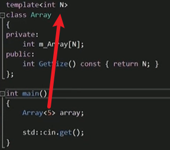
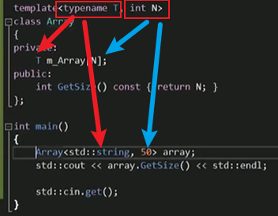
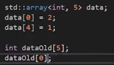
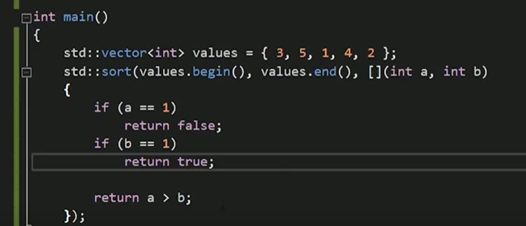

# STL

standard template 标准模板库

## 1. 泛型和模板

- **泛型代码（Generic Code）是一种编程范式**，它允许编写不依赖于特定数据类型的通用代码。在泛型代码中，算法和数据结构可以被设计为可以操作多种数据类型，从而提供更大的灵活性和重用性

- **模板是一种实现泛型编程的主要工具**。使用模板，可以编写泛型函数（函数模板）和泛型类（类模板），使其**能够处理各种数据类型而不需要对每种数据类型都重复编写代码**
- **模板分为函数模板和类模板**


---

### 1. 模板的本质

1. 使用`template`标识模板，这个函数在编译阶段被评估，不是一个真正的函数，**只有当实际调用该函数时基于传递的参数才会被创建出来**，然后发送到编辑器进行编译，最后转为真正的代码
2. `typename`和`class`是同义词，声明未知类型的别名
3. 当调用模板时，实际上根据传来的参数类型(可以隐形识别)替换模板的(typename别名)类型，然后进行编译称为真正的可以被链接的函数二进制代码

4. 不一定非得使用“类型”，也**可以使用具体的类型，接收传来的值**(类似于函数参数)

   

   > 把5传入模板，所有模板中N都被替换为5
   >
   > STL模板都是由模板写来，<>的由来，<>中可以是数字，也可以是数据类型，本质都是替换模板响应相应位置

5. 类型和值的联用：

   

   > Array初始化的实质，可以自定义类型和数字 


### 2. 函数模板

#### 2.1 定义

- 函数模板可以提供一个通用的函数，它的返回值和参数类型都不具体指定，而是用一个虚拟的类型即泛型代替

- **通过函数模板定义模板函数**
- `template` 模型关键字、`typename` 类型关键子
- **模板函数传的参数也可以是引用类型**


#### 2.2 语法

- **在函数声明之前加一行模板声明**

```c++
template<typename T>
//等同于
template<class T>  ////typename也可以等价换成class关键字，此时class不在是声明类的关键字
```

- **系统可以自动推导隐式指定T的类型，也可以显式指定使用模板参数列表<>指定T的类型**

```c++
//模板
template<typename T>
void myswap(T &n1, T &n2) {
	T temp = n1;
	n1 = n2;
	n2 = temp;
}
//隐式指定类型
char a1 = 'a';
char a2 = 'b';
myswap(a1, a2);

//显示指定类型
int n1 = 5;
int n2 = 8;
myswap<int>(n1, n2);	//使用模板参数列表<>来指定T的类型是int
```

- **可以同时定义多个类型**

```c++
template<typename T1,typename T2>  
void Prin(T1 a, T2 b) {
    cout << "T1" << a;
    cout << "T2" << b;
}
```

- **可以给模板指定默认类型，通常用于类模板**

```c++
template<typename T=int>		//模板指定默认类型，不过就无意义了，丢掉模板的意义了
void myswap(T &n1, T &n2) {
}
```

- **可以重载**

```c++
template<class T>
void myPrint(T a,T b) 
{ cout << "a=" << a << " b=" << b << " 调用函数模板：两个参数" << endl; }

template<class T>
void myPrint(T a, T b,T c) 
{ cout << "a=" << a << " b=" << b <<" c="<<c<< " 调用函数模板：三个参数" << endl; }
```


#### 2.3 注意事项

- **函数模板如果用自动推导的方式，必须推导出一致的类型**

```c++
template<typename T>
void myswap(T &n1, T &n2) {
	T temp = n1;
	n1 = n2;
	n2 = temp;
}
//隐式指定类型
int a1 = 4;
char a2 = 'b';
//报错：myswap(a1, a2);   两个类型与模板的类型不同
```

- **函数模板在使用的时候必须确定出来T 的类型，才能使用，不然需要手动指定**

```c++
template<class T>
void func() { cout << "func被调用" << endl; }
//func();//报错，因为T的类型无法确定
//我们只能手动指定T类型
func<int>();
func<double>();
```


#### 2.4 模板函数与普通函数

==隐式转换==

- **普通函数调用时可能发生隐式类型转换**

  ```c++
  int a = 10;
  char c = 'a';
  cout << add(a, c) << endl;//这里发生隐式类型转换，将char转成int，a的ASCII是97，所以结果是107
  ```

- **函数模板如果用的时自动推导，不会发生隐式类型转换，除非手动指定泛型，才可以发生**

  ```c++
  int a = 10;
  char c = 'a';
  //cout << add_tpl(a, c) << endl;//报错，因为自动推导无法隐式类型转换
  cout << add_tpl<int>(a, c) << endl;//显式指定就可以发生隐式类型转换
  ```


==调用规则==

- **如果普通函数和函数模板都能实现，优先会调用普通函数(具体的高于通用的)**

- **还可以通过一个空的函数参数列表<>来强制调用函数模板**
- **函数模板之间也可以重载**
- **如果函数模板比普通函数产生更好的匹配，那就会调用函数模板**

```c++
void myPrint(int a, int b) { cout << "a=" << a << " b=" << b << " 调用普通函数" << endl; }
template<class T>
void myPrint(T a,T b) { cout << "a=" << a << " b=" << b << " 调用函数模板：两个参数" << endl; }
template<class T>
void myPrint(T a, T b,T c) { cout << "a=" << a << " b=" << b <<" c="<<c<< " 调用函数模板：三个参数" << endl; }
void test06()
{
    //1.如果普通函数和函数模板都能实现，优先会调用普通函数（因为具体的高于通用的）
    int a = 10;
    int b = 20;
    myPrint(a, b);//调用普通的

    //2.还可以通过一个空的模板参数列表<>来强制调用函数模板
    myPrint<>(a, b);

    //3.函数模板之间也可以重载
    int c = 30;
    myPrint(a, b, c);

    //4.如果函数模板比普通函数产生更好的匹配，那就会调用函数模板
    char c1 = 'a';
    char c2 = 'b';
    myPrint(c1, c2);//普通函数不匹配，所以调用模板
}
```


#### 2.5 特定的模板

- 模板是有局限性的，只能默认基础类型，在遇到**自定义类型**的时候就无法使用
- **语法：在模板函数的同一行前面加`template<>` ，特定模板的优先级高于普通模板**

```c++
//普通的函数模板，比较两个值是否相等
template<class T>
bool myCompare(T& a, T& b)
{
    if (a==b)
    {
        return true;
    }
    else
    {
        return false;
    }
}
//需要自定声明一个特定模板，用于比较两个对象是否相等
template<> bool myCompare(Student& s1, Student& s2)
{
    if (s1.m_Name==s2.m_Name and s1.m_Age==s2.m_Age)
    {
        return true;
    }
    else
    {
        return false;
    }
}
```


---

### 3. 类模板

#### 3.1 定义

- **类模板就是建立一个通用类，类中的数据成员不需要具体指定类型，而是用泛型替代**

#### 3.2 语法

- **在类声明之前加一行声明**

  ```c++
  template <类型参数列表>
  class 模板类名
  {
  	成员;
  };
  类型参数列表: <class T1,...,class Tn>
  ```

- **类外实现类模板的成员函数的时候，也需要声明模板泛型**

  ```c++
  template<class T>
  class Fruit {
  public:
  	Fruit();//类外实现
  };
  //在类外边实现类模板的成员函数的时候，也需要声明模板声明
  template<class T>
  Fruit<T>::Fruit() { cout << "FRUIT在构造" << endl; }
  ```

- **类模板没有自动推导的使用方式，只能显示手动指定泛型的类型**

  ```c++
  //template<class t1 = int , class t2 = couble>  //可以主动声明默认值 ，class等价于typename
  template <typename T1,typename T2=int>   //类型参数列表，用几个类型就定义几个
  class Pair {
  public:
      T1 first;
      T2 second;
  }
  //使用
  Pair<int> data(3,4);    //模板类写法，类名后面需要加<>，设置了默认值可以不加那个类型
  Pair<int,int> d1(4,5); //也可以主动声明
  Pair<double,int> d2(3.2,4); //模板可以实现多种类型，类似于重载
  ```

  

#### 3.3 类模板作函数的参数

- **指定传入的类模板对象的泛型类型**

- **函数模板将类模板对象的泛型参数化**

- **函数名模板将整个类模板对象参数化**

  ```c++
  //类模板
  template<class NameType, class AgeType=int>  //给一个类型指定默认值，默认为int类型
  class Person {
  	NameType my_name;
  	AgeType my_age;
  public:
  	Person(NameType name, AgeType age) {
  		my_name = name;
  		my_age = age;
  	}
  	void show() { cout << "name:" << my_name << "age=:" << my_age << endl; }
  };
  
  //将类模板对象当作函数模板的参数使用
  //1 指定传入的类模板对象的泛型类型(推荐，但灵活度不高)
  void show_type(Person<string, int>& p) {
  	p.show();
  }
  
  //2. 函数模板将类模板对象的泛型参数化（灵活度较高）
  template<class T1,class T2> 
  void show_tp1(Person<T1, T2>& p1) {
  	p1.show();
  	//typeid是操作符，不是函数。这点与sizeof类似 ,
  	//运行时获知变量类型名称，可以使用 typeid(变量).name()
  	cout << "T1的类型是：" << typeid(T1).name() << endl;
  	cout << "T2的类型是：" << typeid(T2).name() << endl;
  }
  
  //3 函数名模板将整个类模板对象参数化(灵活度最高)
  //将类抽象化，此时可以传入任意含有show()方法的对象
  template<class T>
  void show_tp2(T& obj) {
  	obj.show();
  	cout << "T的类型是：" << typeid(T).name() << endl;
  }
  
  void test02() {
  	Person<string, int> p1("张三", 100);
  	Person<string, string> p2("李四", "七十岁");
  	Person<string> p3("王五", 80);
  	//1
  	show_type(p1);
  	//2
  	show_tp1(p1);
  	//3
  	show_tp2(p3);
  }
  ```

  

#### 3.4 类模板的继承

- **父类是类模板，子类可以是普通类，也可以是类模板**

- **父类和子类都是模板，父类和子类可以有各自的泛型类型**

- **父类和子类都是模板，使用同一个泛型类型**

```c++
template <class F_type>
class Father{
public:
	F_type m_F_val;
};

//普通子类继承父类模板
class Son : public Father<int>;
{
public:
	int m_S_val;
};

//模板子类继承父类模板
//方式一：指定继承父类模板的类型
template <class S_type>
class Son: public Father<int>{
public:
	S_type m_S_val;
}
//方式二：不指定继承父类模板的类型
template <class S_type1,class S_type2>
class Son: public Father<S_type1>{
public:
	S_type1 m_S_val;	//子类可以使用跟父类不同的，也可以使用同一个泛型类型
}

int main(){
    Son<int,double> obj_son;
    obj_son.m_F_val;
    obj_son.m_S_val;
    return 0;
}

```


#### 3.5 类模板里的友元函数

```c++
//类外定义友元函数实现要写在类上面
template <class T>
class A;
template <typename T>
void show_2<A<T>& obj2);

//模板类
template <class T>
class A{
public:
	A(T t = 0):m_a(t){}
private:
	T m_a;
	//在类的里面声明友元函数
	friend void show_1(A<T>& obj)  //引用类型少调用一次拷贝构造
	{
		cout << obj.m_a << endl;
	}
	
	//在类的外面声明友元函数
	friend void show_2<>(A<T>& obj2); //声明的时候函数名后面加<>,实现的时候不用加
};

int main(){
	A<int> obj(666);
}
```


## 2. STL

- STL(standard template library)，标准模板库，可以帮我们建立一套数据结构和算法的标准，提高复用性

- STL中大量使用了模板技术
- STL中有三大部分
  - **容器：`container`，存放数据的地方，STL中实现了很多数据结构的容器**
  
  - **算法：`alogrithm`，操作数据的方法，解决问题的方法**
  
  - **迭代器：`literator`，迭代器就是操作容器中数据的指针，它是对原始指针的封装，本质上是一个类模板**
  
    

## 3. 迭代器


#### 1. 定义

**迭代器就是操作容器中数据的指针，它是对原始指针的封装，本质上是一个类模板**

>  为什么要用迭代器而不用指针：因为容器里面是对一些普通类型的重新封装，使用普通指针无法作用于这些容器类，而迭代器是对指针的封装，使用迭代器就可以达到使用指针的效果

#### 2. 使用

- **每个容器都是一个封装类，这个类里面都有一个静态变量`iterator`,所以要声明是哪个类里面的迭代器**

  ```c++
  //定义，如vector
  vector<int>::iterator it;			//定义一个vector迭代器it
  ```

#### 3. 注意事项

- **不推荐迭代器的比较，推荐使用等于和不等于**

  > 如果你有两个迭代器 `iter1` 和 `iter2`，即使它们指向的元素相同，但进行小于比较可能仍然会得到 `False` 的结果。这是因为迭代器之间的比较不仅仅依赖于元素本身的值，还取决于迭代器的状态和位置。

- **栈和队列是受限的容器，不可访问除了头尾以外的元素，所以没有迭代器；**


## 4. 容器

### 容器总结

#### 1. 分类


- 序列式容器：array、vector、deque、list

  > 元素在容器中的位置与元素的值无关，即容器不是排序的

- 关联式容器：set、multiset、map、multimap

  > 排序容器中的元素默认是由小到大排序好的，即便是插入元素，元素也会插入到适当位置

- 容器适配器：stack、queue

  > 封装了一些基本的容器，使之具备了新的函数功能，比如把deque封装一下变为一个具有stack功 能的数据结构。这新得到的数据结构就叫适配器。包含stack,queue,priority_queue

#### 2. 比较

|  容器  |   底层    |   特点    | 下标[] | 迭代器it |  it失效  | 排序sort | 查找find |
| :----: | :-------: | :-------: | :----: | :------: | :------: | :------: | :------: |
| vector |   数组    | 尾变数组  |   有   |    有    | 影响其他 |   算法   |   算法   |
| deque  |   数组    | 双端队列  |   有   |    有    | 影响其他 |   算法   |   算法   |
|  list  | 指针结点  | 双向链表  |   无   | 有(受限) | 影响自己 |  自定义  |   算法   |
| stack  | 数组/指针 | 先进后出  |   无   |    无    |    无    |    无    |    无    |
| queue  | 数组/指针 | 先进先出  |   无   |    无    |    无    |    无    |    无    |
|  set   |  红黑树   | 排序集合  |   无   | 有(受限) | 影响自己 |  自定义  |   自有   |
|  map   |  红黑树   | key-value |   无   | 有(受限) | 影响自己 |  自定义  |   自有   |

- **STL容器提供的都是值拷贝，容器插入元素时，容器内部实现拷贝动作，复制一份数据到容器中**
- 除了栈和队列之外，其他容器都提供了迭代器。
- 每个容器都提供了默认的构造函数和拷贝构造函数
- 每个容器都提供了`size`和`empty`函数
- 序列式容器，物理上连续存储的容器，都支持指针运算，可以通过下标取值。非序列式和非连续空间存储的容器，它们都不支持指针运算，只能++或--
- 插入和删除操作，不同容器可能会导致迭代器失效，注意迭代器的更新
- **对于基于红黑树实现的容器`set`和`map`，都会自动升序排序，若元素为自定义类型，必须提前使用仿函数声明排序方式**
- **`stack`、`queue`、`list`、`set`都不支持通过`[]`和`at`方式取值，但是`map`可以通过`[key]`得到`value`的值**


#### 3. 使用场景

|  容器  |                   特点                   |            适用场景            |
| :----: | :--------------------------------------: | :----------------------------: |
| vector |        尾部操作效率高、遍历效率高        |       存储历史记录、日志       |
| deque  |        两头操作效率高，遍历效率高        |    在头尾两端进行操作的场景    |
|  list  |   任意位置的操作效率高，但是遍历效率低   | 任意位置的增删，不适用经常查找 |
|  set   |   任意操作效率很均衡，同时有排序的特点   |  需要排序的数据，如游戏排行榜  |
|  map   | 任意操作效率很均衡，自动排序、数据键值对 |   存储成对的数据，且数据量大   |
| stack  |                 先进后出                 |      存储带顺序信息的数据      |
| queue  |                 先进先出                 |              排队              |

- `vector`的特点是**尾部操作效率高，遍历效率高**，适合存储历史记录、日志等这类信息
- `deque`的特点是**两头操作效率高，遍历效率高**，适合经常在头尾两端进行操作的场景
- `list`的特点是在**任意位置的操作效率高，但是遍历效率低**。适合任意位置的增删，不适用经常查找的场景。
- `set`的特点是**很均衡，同时有排序的特点**。适合存储需要排序的数据，例如游戏排行榜等
- `map`**和`set`特点类似，且其自身独有的特点是数据都是键值对**。适合存储成对的数据，且数据量大的场景。

- `stack`属于受限的结构，可以存储带顺序信息的数据，满足先进后出的特性。
- `queue`属于受限的结构，特点是先进先出。适用于排队的场景。


### 1. string字符串


#### 1. 定义

- `string`式STL中的一种特殊的容器，**它的元素只能是`char`类型，本质上是个类**
- `string`和`char*`的区别
  - **`char*`是指针，`string`是一个类，类内部封装了`char*`,所以`string`本质上是`char*`**
  - **`string`管理`char*`所分配的内存，不用担心越界的问题**
  - `string`类内部提供了很多方法
- **头文件**：`include<string>`
- `string`**底层是字符数组(指针)，所以也具有下标访问和迭代器访问的两种方式**

---

#### 2. 语法

##### 1. 构造函数

```c++
string();  //无参构造，创建一个空字符串
string(const char* S); //使用一个字符串s(常量指针)来构造一个string
string(const string& s); //拷贝构造
string(int n, char c); //使用n个char类型构造
```

##### 2. 赋值操作

```c++
//赋值运算符重载：
string& operator=(const char* s);
string& operator=(const string& s);
string& operator=(char c);
//赋值函数assign()
string& assign(const char* s);
string& assign(const char*s,int n); //将字符串s的前n个字符赋值给当前string
string& assign(const string& s);	//复制string类型
string& assign(int n, char c); 	    //赋值n个char
```

##### 3. 字符串拼接

```c++
//重载运算符
string& operator+=(const char* s);
string& operator+=(const string& s);
string& operator+=(char c);
//append函数
string& append(const char* s);
string& append(const string& s);
string& append(const char* s,int n); 		//把字符串s前n个字符拼接到string字符串
string& append(const string& s,int begin);  //把字符串s从begin位置直到结尾赋值给string字符串
string& append(const string& s,int begin,int length); //从begin位置，将字符串s后面的length个字符拼接到当前字符串
```

##### 4. 查找

```c++
//若找到则返回位置，未找到则返回-1
//从左往右：find
int find(const string& s,int pos=0) const;		//查找字符串s，从默认值0号位置开始向后找，返回第一次出现的位置
int find(const char* s,int pos=0) const;
int find(const char* s,int pos=0,int n) const;   //从pos位置开始查找字符串s的前n个字符第一次出现的位置
int find(char c,int pos=0)   					//查找字符c第一次出现的位置
//从右往左：rfind
int rfind(const string& s,int pos=npos) const;			//从pos位置开始从右往左碰到第一个s，默认npos
int rfind(const char* s,int pos=npos) const;
int rfind(const string& s,int pos=npos,int n) const;   //从pos位置从右往左查找字符串s的前n个字符第一次出现的位置
int rfind(char c,int pos=npos)   						//从右往左查找字符c第一次出现的位置
```

##### 5. 替换

```c++
//在指定的位置替换字符串
string& replace(int pos,int n,const string& str); 	//从pos位置开始的n个字符被替换为字符串str
string& replace(int pos,int n,const char* s); 		//从pos位置开始的n个字符被替换为字符串s
str.replace(str.begin(),str.begin()+5),str2); //迭代器区间的元素替换为str2；
```

##### 6. 字符串比较

```c++
//比较方式：按照字符串每个字符的ASCII码逐个比较，如果比较出大小就返回结果(大于1 小于-1)，如直到结束也没有返回值则说明相等返回0
int compare(const string& str) cosnt;
int compare(const char* s) const;
```

##### 7. 插入

```c++
string& insert(int pos,const char* s);		//在pos位置插入字符串s
string& insert(int pos,const string& str);	
string& insert(int pos,int n,char c); 		//在pos位置插入n个字符c
str.insert(str.begin(),str2.begin(),str2.end()); //在某个迭代器位置插入str2；
```

##### 8. 删除

```c++
string& erase(int pos,int n); 				//删除从pos开始的n个字符
str.erase(str.begin());						 //删除迭代器位置上的元素；
str.erase(str.begin()+2,str.end()-1); 		//删除迭代器区间的元素；
```

##### 9. 截取子字符串

```c++
string& substr(int pos,int n=npos) const;	//返回从pos开始的n个字符组成的字符串，n默认值是npos代表最后
```

##### 10. 获取长度

```c++
size();
length();
```

##### 11. 元素存取

```c++
char& operator[](int n);	//运算符重载，通过[index]取值，index代表下标
char& at(int n);			//通过at成员函数取值，n也是下标
//取元素
cout<<s[i]<<s.at(i) <<endl;
//存元素
s[i] = 'a';
s.at(i) = 'a';
```

##### 12. 字母翻转

```c++
upper_and_lower(str);		//修改str本身大写转为小写，小写转为大写。不需要返回值接收
s[i] = toupper(s[i]);		//修改单个字母小写转为大写，需要接收返回值
s[i] = tolower(s[i]);		//修改单个字母的大写转为小写，需要接收返回值
```

##### 13. 遍历

```c++
//1. 直接当作字符串输出，字符串可以直接用cout输出
cout << s << endl;			

//2. string的迭代器访问、下标访问、for_each访问都可以
string::iterator it;
for(it=str.begin();it!=str.end();it++){
printf("%c",*it);
}
```

> string作为字符数组和容器，拥有下标访问和迭代器两种；
>
> string同样具有front,back,begin,end等迭代器的方法


---

### 2. Array静态数组

```c++
array<int,5> data;			//第一个参数为数据类型，第二个是大小
```

1. `array`数组和普通数组类型风格相似

   

2. 相同点：

   1. 都是存储在栈上
   2. `array`的效率和普通数组效率一样

3. 不同点：

   1. `array`数组是封装成了一个类，所以它可以直接调用写好的方法，如`size()`等，遍历也有多种方式可以实现

      > 实际上size函数直接返回创建array时输出的大小

   2. `array`数组有下标越界检查

4. 所以建议使用array代替普通数组


### 3. vector变长数组


#### 1. 定义


> 上图的带箭头方法都会返回迭代器：
>
> - `begin()`返回元素第一个位置的迭代器
>- `end()`返回最后一个元素的后一个位置的迭代器，为空指针
> - `insert()`和`erase()`,`push_back()`和`pop_back()`都会返回对应迭代器位置
> - `front()`和`back()`返回首元素和尾元素的值

- **vector像是一个变长数组/动态数组/单端数组(一边封闭，另一边可变)，这种数据结构决定了它在尾部的插入和删除效率是最高的，因为不会导致其他元素的移动**

- **vector是一个类模板，底层是对数组的进一步封装，同样是连续的物理空间存储的结构，所以可以通过下标访问元素，这种数据结构决定了它在做遍历查询的时候效率很高**

- **vector具有动态拓展的能力，可以对数组进行动态扩展，而普通数组长度不可变**

  > 拓展原理：当空间不足时，vector会重新申请一块更大的空间，然后将旧的空间释放掉

- **vector是一个类模板，它可以使用任意的数据类型，包括对象类、其他容器**
  
- **vector涉及到两个概念：**
  
  - `capacity`：容量，最多可以容纳的元素个数
  - `size`：大小，实际存放元素的个数
  
- **头文件：`include<vector>`**


#### 2. 优化

问题：

1. `vector`实际上会从`main`函数中将需要放入`vector`容器中的数据进行复制，存放到自己的连续空间中，所以每插入一个数据(对象)实际就做一次拷贝构造
2. `vector`可以自己扩容，如果不设置容量，则`vector`容量将会从0开始，每当容器满就会重新创建一块更大的区域，把之前容器里的数据(对象)都复制(拷贝构造)到新的容器


优化：

1. 使用`emplace_back`插入构造函数需要的元素，直接在容器中构造，省略从`mian`到容器中的复制过程

   ```c++
   std::vector<Vectex> vertices;
   vertices.push_back(Vertex(1,2,3));	//这里面的Vertex初始化对象实际在main里面进行的，然后复制到容器里
   
   //优化
   vertices.emplace_back(1,2,3);		//使用emplace_back将直接把构造函数的参数传入容器中，然后构造
   ```

2. 开始使用时就设置容量，就省略了扩容时所有元素从老容器复制到新容器的复制过程

   ```c++
   std::vector<Vectex> vertices;
   vertices.reserve(3);				//设置容量，这种情况下省略容器复制过程
   vertices.emplace_back(1,2,3);		
   vertices.emplace_back(4,5,6);
   vertices.emplace_back(7,8,9);
   ```


#### 3. 语法

##### 1. 构造函数

- **使用了类模板，所以需要指定该数组的类型**

```c++
vector<T> v;						//无参构造
vector<T> vec(v.begin(),v.end());	//使用另一个vector的两个迭代器之间[beging,end)的元素构建，左闭右开
vector<T> v(const vector& vec);		//拷贝构造
vector<T> v(n,ele);					//构造n个element的vector对象
vector<T> v = {1,2,3,4}				//c++11构造特性，直接在花括号里面给值，同数组一样
```

> 为什么string不使用模板：string里面只包含char这一种元素，所以不需要使用模板


##### 2. 赋值

```c++
//运算符重载
vector& operator=(const vector& vec);	
//assign函数，无返回值
v.assign(beg,end);			//将另一个vector[beg,end)区间(或者普通数组《符合vector存储元素》的指针)的元素赋值给当前的vector对象
v.assign(n,ele);			//将n个ele元素赋值给当前vector
```


##### 3. 容量和大小

```c++
v.empty();					//判断容器是否为空，为空返回true，非空返回false
v.capacity();				//返回容量，int类型；容量实际要比大小大。
v.size();					//返回大小，int类型

//下面两个无返回值，属于重新设置size的方法，size变小后，容量不变
v.resize(int num);			//重新指定容器的sieze为num，如果容器size多了会填充默认值，如果少了，会删除多余的元素
v.resize(int num,ele);		//若多了使用element元素填充
```


##### 4. 插入

```c++
//尾部
v.push_back(ele);				//在尾部插入单个元素ele
//任意位置
v.insert(iterator pos,ele)		//在迭代器指定的位置pos插入元素ele,并返回新插入元素的位置迭代器
v.insert(iterator pos,int n,ele) //在迭代器指定位置pos插入n个元素ele，返回插入的第一个元素的位置迭代器
```


##### 5. 删除

```c++
//尾部
v.pop_back();					//不需要参数，删除尾部最后一个元素
//任意位置
v.erase(iterator pos)			//删除迭代器所指向的元素，返回被删除元素的下一个迭代器位置。若删除最后一个则返回的是end()迭代器
v.erase(iterator begin,iterator end)  //删除begin到end之间的元素，不包括end，[begin,end)左闭右开
v.clear()						//清除容器中的所有元素，无返回值
```

- **插入insert和删除erase是有返回值的，若需要接收该返回值需要使用迭代器接收**

  ```c++
  //插入返回插入元素的位置
  vector<int>::iterator it = v1.insert(v1.begin()+1,500);
  cout << *it << endl;
  //删除返回的是删除之后的那个元素的位置
  vector<int>::iterator it_erase = v1.erase(v1.bgein()+1);
  ```

- **关于使用了插入和删除后迭代器失效的问题：**

> 1. vector是属于序列式容器，底层是数组，是物理上连续的内存空间。当发生了插入和删除操作之后，元素会相应的移动位置，此时底层指针会发生变化，若再使用迭代器去操作指针将会报错。所以在使用插入和删除操作之后，应立马对迭代器进行更新操作，用一个新的有效的迭代器替换原来失效的迭代器（这也就是为什么插入和删除会返回迭代器位置）。
>
> 2. `insert`插入操作:
>
>    - 若容量足够，则插入位置之后的所有迭代器将会失效
>    - 若容量不够，则会动态扩展，重新申请内存，所有的迭代器都会失效
>
> 3. `push_back`插入操作：
>
>    - 若容量足够，则只会影响end迭代器
>    - 若容量不够，则会影响所有的迭代器
>
> 4. erase删除操作：
>
>    - 删除操作会导致被删除的当前位置及以后位置的迭代器失效
>
> 5. `pup_back`删除操作：
>
>    - 只会导致end迭代器失效，但不会影响前面的迭代器。
>
> 6. 更新迭代器：需要使用返回的有效迭代器更新迭代器
>
>    ```c++
>    it = v.insert(it); //it是之前插入的位置
>    it = v.erase(it);	//it是之前删除的位置
>    ```
>    
> 7. `begin()`和`end()`迭代器在容器的每次插入和删除操作后，容器为了确保迭代正确性都会自动更改为最新的，所以`push`和`pop`操作不会影响头和尾迭代器的正确性，这两个尾部操作没有返回值

- **插入操作更新迭代器**

  ```c++
  //插入操作也会导致迭代器失效
  //在30之前插入一个100
  for (vector<int>::iterator it = v.begin(); it != v.end(); it++){
  	if (*it==30){
  		it = v.insert(it, 100);//插入同时更新迭代器，insert操作会返回插入值的迭代器，这里会导致it--
  		it++;//所以需要it++操作让迭代器返回原来的位置，如果没有这部操作，就进入死循环
  	}
  }
  ```

- **删除操作更新迭代器**

  ```c++
  for (vector<int>::iterator it = v.begin(); it != v.end(); ){
  	if (*it==30){
  		it = v.erase(it);//更新迭代器，erase返回的是被删除元素的下一个元素迭代器，所以这里就指向了下一个元素，也就相当于it++
  	}
  	else{
  		it++;
  	}
  }
  ```

  

##### 6. 元素获取

```c++
operator[];				//v[i]  ,重载了[]运算符，可以通过下标取值
v.at(int index);		//返回索引index位置的元素
v.front();				//返回容器中第一个元素
v.back();				//返回容器中最后一个元素
```


##### 7. 元素互换

```c++
//swap可以实现两个vector容器元素的互换
v1.swap(v2);			//v1和v2互换元素,直接修改v1v2本身，无返回值不需要有接收值
```

- 可以实现缩容的效果：`resize()`后，若`size`变小，`capacity`不变，此时需要缩容

  ```c++
  //一般缩容方法
  vector<int> v1(v);	 //用一个新的容器拷贝构造老容器
  v.swap(v1);			 //将两个容器互换，就实现了缩容，此时新的v的容量和大小都是v1的大小
  
  //c++11后，可以使用shrink_to_fit()实现缩容
  v.shrink_to_fit();
  ```

  

##### 8. 预留空间

```c++
v.reserve(int len);		//给容器预留len个元素的位置，预留的位置不可访问，因为没有被初始化。
```

> 当vector存储的数据量很大时，由于vector的动态数组特性，会导致多次的动态扩展发生，这样会降低效率。
> 为了避免多次拓展的情况发生，可以在一开始就指定一些预留的空间，其实就是指定了capacity的值。

- `reserve()`和`resize()`的区别和联系：

> - resize是改变容器的大小,若设置size比之前的capacity大则容量变大。若size比之前capacity小则容量不变
> - reserve是改变容器的容量，若设置的capacity比之前的capacity的值大则扩展为新值，若比之前的小则无影响，还是之前的值。
> - 当发生拷贝构造`vector<int> v1(v);`则新容器v1的capacity和size都将是之前v容器的size大小。


##### 9. 遍历

- 三种遍历方法

- **1.使用迭代器**

  ```c++
  //1.for循环
  for (vector<int>::iterator it = v.begin(); it != v.end(); it++){
  	cout << *it << " ";
  }
  cout << endl;
  ```

- **2.使用下标**

  ```c++
  //2.使用下标取值
  for (int i = 0; i < v.size(); i++){
  	cout << v.at(i) << " ";
  }
  cout << endl;
  ```

- **3.使用`for_each`遍历方法**

  ```c++
  //3. 使用for_each，func中实现对v的每个元素如何操作，只要容器有迭代器都可以使用此方法
  void my_func(person& p) {
  	cout << "姓名：" << p.m_name << "  年龄: " << p.m_age << endl;
  }
  for_each(v1.begin(), v1.end(), my_func);	//函数指针
  ```


---

### 4. deque双端队列


#### 1. 定义

- `deque`: `double-ended-queue`**双端队列的缩写**
- **同`vector`一样，是对数组的底层封装，具有连续的物理空间，可以通过下标访问元素**

- **`deque`的数据结构决定了它在做两端操作的时候效率最高，但是做其他位置元素的操作的时候，效率比较低。**


#### 2. 与vector的区别

- **`deque`是两端开口的，头尾两端都有`push`和`pop`方法，`vector`只有尾端开口**
- **`deque`是由多端连续的空间组合而成的，它可以随时增加一段空间连接起来。所以`erque`不会存在`vector`由于空间不足而去动态拓展的问题，deque是通过中继器来维护每一段空间的先后数据**

- **不存在容量的概念，所以无查看容量和设置容量的函数。插入和删除同vector一样，会导致迭代器失效**


#### 3. 中继器


#### 4. 语法

- 同`vector`语法基本一样，只是少了容量`capacity`函数和预留空间`reserve()`函数


##### 1. 构造函数

- c++11新特性的构造方式,**除了栈和队列以外**所有容器都可使用

  ```c++
  deque<int> deq = {3,4,5,6};
  ```

```c++
deque<T> deq; //默认构造形式
deque(beg, end); //将参数deque[beg, end)区间中的元素拷贝。
deque(n, elem); //将n个elem拷贝。
deque(const deque &deq); //拷贝构造函数
```


##### 2. 赋值

```c++
deque& operator=(const deque &deq); //重载赋值运算符
assign(beg, end); //将参数deque[beg, end)区间中的数据赋值
assign(n, elem); //将n个elem赋值
```


##### 3. 大小操作

- **deque无容量操作**

```c++
empty(); //判断容器是否为空
size(); //返回容器中元素的个数
resize(num); //重新指定容器的长度为num,若容器变长，则以默认值填充新位置。如果容器变短，则末尾超出容器长度的元素被删除。
resize(num, elem); //重新指定容器的长度为num,若容器变长，则以elem值填充新位置。如果容器变短，则末尾超出容器长度的元素被删除。
```


##### 4. 插入和删除

- **比vector多了头部插入和删除**

```c++
//两端插入操作：
push_back(elem); //在容器尾部添加一个数据
push_front(elem); //在容器头部插入一个数据
pop_back(); //删除容器最后一个数据
pop_front(); //删除容器第一个数据

//指定位置操作：
insert(pos,elem); //在pos位置插入一个elem元素的拷贝，返回新数据的位置。
insert(pos,n,elem); //在pos位置插入n个elem数据，返回新数据的位置。
insert(pos,beg,end); //在pos位置插入另一个deque[beg,end)区间的数据，返回新数据的位置。
erase(beg,end); //删除[beg,end)区间的数据，返回下一个数据的位置。
erase(pos); //删除pos位置的数据，返回下一个数据的位置。
clear(); //清空容器的所有数据
```

- **迭代器失效问题**

```c++
deque<int> d = { 4,5,3,8,5 };
printDeque(d);
//删除容器中的5
for (deque<int>::iterator it = d.begin(); it != d.end(); ){
	if (*it==5){
		it = d.erase(it);//删除导致当前迭代器失效，所以需要更新
	}
	else{
		it++;
	}
}
printDeque(d);
```

> deque跟vector一样，都属于序列式容器，以下这些操作会导致部分迭代器失效：
>
> 1. deque首尾两端插入元素的时候，不会导致动态拓展，所以只会导致首尾两端的迭代器失效，其他位置的元素不需要移动，也就不会失效。
> 2. 在首尾两端删除元素的时候，也不会导致其他元素移动，只会造成被删除元素当前的迭代期失效。
> 3. 在除首尾两端的其他位置插入或者删除元素，会导致部分迭代器失效。
>
> 所以，当有迭代器失效的时候，仍然需要做迭代器更新。


##### 5. 元素存取

```c++
at(int idx); //返回索引idx所指的数据
operator[]; //返回下标索引所指的数据
front(); //返回容器中第一个数据元素
back(); //返回容器中最后一个数据元素车
```


##### 6. 元素互换

```c++
//swap可以实现两个deque容器元素的互换
d1.swap(d2);//d1和d2互换元素
```

##### 7. 遍历

```c++
//同string，vector一样，底层是对数组的封装，所以具有下标访问，迭代器访问的方式
//具体实现看vector遍历，同样有三种
```


---

### 5. stack栈


#### 1. 定义

- 先进后出，头进头出
- 受限的数据结构，没有迭代器，不可以访问除栈顶以外其他元素，不可访问下标


#### 2. 语法

##### 1. 构造函数

```c++
stack<T> stk;				  //无参构造
stack<T> stk(const stack& s); //拷贝构造
```

##### 2. 赋值

```c++
stack& operator=(const stack& s);
```

##### 3. 数据存取

```c++
push(ele);			//添加元素到栈顶
pop();				//将栈顶元素删除
top();				//返回栈顶元素
```

##### 4. 大小相关

```c++
empty();			//判断栈是否为空
size();				//返回栈的大小
```

##### 5. 遍历

```c++
//栈和队列不可访问下标，且没有迭代器，所以只能以非空为条件遍历
template<class T>
void my_print(stack<T>& s) {
	while (!s.empty()) {			
		cout << s.top() << " ";
		s.pop();
	}
	cout << endl;
}
```


---

### 6. queue队列


#### 1. 定义

- 先进先出，尾进头出
- 受限的数据结构，没有迭代器，无法访问除了队头队尾的其他元素，不可访问下标


#### 2. 语法

##### 1. 构造函数

```c++
queue<T> que;					//空
queue<T> que(const queue& q);	//拷贝构造
```

##### 2. 赋值

```c++
queue& operator=(const queue& q);	//运算符重载
```

##### 3. 数据存取

```c++
push(ele);			//插入队尾
pop();				//从队头删除一个元素
back();				//输出队尾元素
front();			//输出队头元素
```

##### 4. 大小相关

```c++
empty();			//空返回1，非空返回0
size();				//返回元素个数
```

##### 5. 遍历

```c++
//栈和队列不可访问下标，且没有迭代器，所以只能以非空为条件遍历
template<class T>
void printQueue(queue<T>& que) {
	while (!que.empty()) {				
		cout << que.front() << "  ";
		que.pop();
	}
	cout << endl;
}
```


---

### 7. list链表


#### 1. 定义

- 链表，底层是**双向带头尾结点链表**，物理上是非连续结构，不支持下标取值，通过指针来建立联系。

- 链表由结点构成，结点分为指针域和数据域，指针域指向前和后结点，数据域保存本结点数据

  >  之前上面5种底层封装了数组都是连续的。但是栈和队列是受限的

- 头尾都可以进行删除和插入，也可以从中间插入删除元素，不会造成空间不足的情况

- 链表结构插入和删除效率最快，查找效率低。

- 链表的迭代遍历效率很低，它的迭代器不支持指针运算，只能进行单步移动++或者--操作

  ```c++
  l.begin()+1		//错误
  l.begin()++		//可以
  //list的迭代器是支持++和--操作的（前后缀都支持）
  //但是不支持+和-操作，因为链表不能进行随机访问操作，只能O(n)查询。
  ```

  

#### 2. 数据结构

> 1. **线性结构（Linear Structure）**：线性结构是一种数据元素之间存在一对一的相互关系的结构，<u>数据元素之间存在着线性次序关系。常见的线性结构包括数组、链表、栈（Stack）、队列（Queue）等</u>。线性结构可以表示为一种递归定义的结构。
> 2. **非线性结构（Nonlinear Structure）**：<u>非线性结构是指数据元素之间存在一对多或多对多的关系。常见的非线性结构包括树（Tree）、图（Graph）等</u>。在非线性结构中，数据元素之间的关系不是简单的前后关系，而是更为复杂的结构关系。
> 3. **逻辑结构（Logical Structure）**：逻辑结构是指数据对象中数据元素之间的相互关系。<u>常见的逻辑结构有线性结构、非线性结构和集合结构。</u>逻辑结构独立于数据的存储结构，更侧重于描述数据元素之间的逻辑关系。
> 4. **物理结构（Physical Structure）**：物理结构也称为存储结构，是指数据的逻辑结构在计算机中的存储形式。<u>常见的物理结构有顺序存储结构和链式存储结构</u>。顺序存储结构是将数据元素存放在地址连续的存储单元中，链式存储结构是通过指针将数据元素存放在任意的存储单元中，通过指针的连接关系来实现数据元素之间的逻辑关系。


#### 3. 语法

##### 1. 构造

```c++
list<T> lst;				//空链表			
list<T> lst(beg,end);		//根据迭代器范围[beg,end)
list(n,ele);				//n个ele元素
list(const list& lst);		//拷贝构造
```

##### 2. 赋值

```c++
list& operator=(const list& l);	//运算符重载
lst.assign(beg,end);			//根据其他的迭代器范围[beg,end)给lst赋值
lst.assign(n,ele);				//将n个ele元素赋值给当前list
```

##### 3. 交换

```c++
lst.swap(l);					//lst与l互换元素
```

##### 4. 大小相关

```c++
size();
empty();
resize(int n);					//重设大小，多的给默认值，少的直接删除
resize(int n,ele);
```

##### 5. 插入删除

```c++
push_back(ele);
push_front(ele);
pop_back();
pop_front();

insert(pos,ele);		//在pos指定的位置插入ele元素，返回插入元素的位置迭代器 (也就是之前这个位置之前)
insert(pos,n,ele);		//在pos指定的位置插入n个ele元素
insert(pos,beg,end);	//在pos指定的位置插入[beg,end)之间的元素

clear();				//清除容器内所有元素				
erase(pos);				//删除pos位置的元素，返回下一个位置
erase(beg,end);			//删除[beg,end)之间的元素，返回下一个位置
remove(ele);			//删除list中所有的ele元素（ele有可能重复）
```

- 关于list迭代器失效的问题

```c++
//插入和删除操作不会对其他结点造成影响

//插入操作不会导致任何迭代器实现
list<int> ls = { 5,4,8,3 };
//在3之前插入元素0
for (list<int>::iterator it = ls.begin(); it != ls.end(); it++) {
	if (*it == 3) {
		ls.insert(it, 0);	//插入操作，插在当前元素之前，返回新元素的位置，不更新it，则it仍未当前元素的迭代器，继续++为下一个
	}
}
//删除只会当前被删除的结点失效
for (list<int>::iterator it = ls.begin(); it != ls.end(); ) {
	if (*it == 3) {
		it=ls.erase(it);	//删除操作，返回被删除之后的元素的迭代器，也就是遍历下一个元素不用++操作了
	}else{
        it++;
    }
}
```

##### 6. 存取

```c++
front();		//取头部第一个元素
back();			//取最后一个元素
```

##### 7. 反转

```c++
l.reverse();		//在l的基础之上直接反转链表，注意这里不是算法
```

##### 8. 排序

```c++
sort();		//升序排序，不是算法sort()，因为算法中的排序sort不支持list，所以list自己定义了一个排序函数。
sort(func);	//按func规则排序，函数指针
//注意：对于自定义类型的数据，在list中排序，必须手动指定排序规则，否则sort函数不知道如何排序。
```

##### 9. 遍历

```c++
//1. 使用C++11新特性进行模板遍历
template<class T>
void printSet(list<T>& L) {
	for (auto ele : L) {			//自动分辨类型
		cout << ele << endl;
	}
	cout << endl;
}

//2. 因为有迭代器，所以还可以使用迭代器遍历，不过是得知道具体元素类型才可以
//3. 有迭代器就可以使用for_each()进行遍历
```


---

### 8. set集合


#### 1. 定义

- `set`集合内部**自动有序，并且不含重复元素**，元素在插入时就自动排序(默认升序)
- `set`基于红黑树实现，底层同样是链表指针，物理空间上不是连续存储，不支持小标取值，迭代器也不支持指针运算，只能使用++或者--操作
- `set`基于红黑树，可以添加或删除元素，但是不能修改元素
- `set`基于红黑树，它的插入、删除、查找等效率一致，都是中等效率
- `set`集合不允许有重复元素，`multiset`集合允许有重复元素；除此之外，它们的函数接口一摸一样


#### 2. 语法

##### 1. 构造

```c++
set<T> st;
set(const set& st);
set<T,仿函数> st;			//通过仿函数来指定排序规则，默认是升序
```

##### 2. 赋值

```c++
重载赋值预算符=
```

##### 3. 插入删除

```c++
insert(ele);		//在容器中插入元素，具体位置不知，因为它默认排序
clear();
erase(pos);			//删除pos迭代器指向的元素，返回下一个元素的迭代器
erase(beg,end);		//删除区间[beg,end)内的元素，返回下一个迭代器
erase(ele);			//删除容器中的ele元素
```

- 迭代器失效问题

```c++
//同list
```

> 对于关联容器(如 `map, set,multimap,multiset`)，删除当前的 `iterator`，仅仅会使当前的 `iterator` 失效，只要在 `erase` 时，更新当前 `iterator` 即可。这是因为这类的容器，使用了红黑树来实现，插入、删除一个结点不会对其他结点造成影响。
> 至于插入操作，不会导致任何迭代器失效。

##### 4. 大小

```c++
size();
empty();
```

##### 5. 交换

```c++
s.swap(st);			//s和st交换
```

##### 6. 查找和统计

```c++
find(ele);//找到返回迭代器位置，找不到返回end迭代器。（由于查找算法find不适用于树形结构的迭代器，所以set有自己的find成员函数）
count(ele);//统计ele元素的个数，对于set来说，只能是0或者1
```

> multiset的成员函数跟set一样，区别就是它的元素可以重复。它的count返回的是个数

##### 7. 仿函数-排序规则

- 仿函数 (Functor) 是一个行为类似函数的对象，可以被用作函数调用

- 仿函数是一种重载了函数调用运算符 `operator()` 的类，它可以像函数一样被调用

- 返回值是bool类型的仿函数，叫做谓词。

- 使用仿函数，可以当作参数去指定容器的排序规则，尤其是**自定义类型的数据，必须要在set初始化的时候就指定排序规则，否则无法插入元素。**

  ```c++
  //自定义类型的数据，必须要在set初始化的时候就指定排序规则，否则无法插入元素
  class Person
  {
  public:
  	string m_Name;
  	int m_Age;
  	Person(string name,int age):m_Name(name),m_Age(age){}
  	void showPerson() const
  	{
  		cout << "姓名：" << m_Name << "，年龄：" << m_Age << endl;
  	}
  };
  //定义一个仿函数，指定Person对象的排序规则
  class ComparePerson
  {
  public:
  	bool operator()(const Person& p1, const Person& p2) const
  	{
  		//按照年龄降序
  		return p1.m_Age > p2.m_Age;
  	}
  };
  void test07()
  {
  	set<Person, ComparePerson> st; //自定义类型，无法自动比较，需要自己实现排序方式
  	Person p1("aaa", 10);
  	Person p2("bbb", 12);
  	Person p3("ccc", 8);
  	st.insert(p1);
  	st.insert(p2);
  	st.insert(p3);
  	for (auto ele:st)
  	{
  		ele.showPerson();
  	}
  }
  ```

- 定义了仿函数的`set`，当作参数传递时，类型名也要加上仿函数

  ```c++
  //利用仿函数实现指定规则排序
  class MyCompare {
  	//重载运算符()
  public:
  	bool operator()(int v1, int v2) const {		//set不可修改，是常对象，常对象只能调用常函数
  		return v1 > v2;
  	}
  };
  //遍历，打印模板
  template<class T>
  void printSet(set<T,MyCompare>& s) {	//参数声明类型时也需要指定仿函数
  	for (auto ele : s) {
  		cout << ele << endl;
  	}
  	cout << endl;
  }
  
  //主函数中定义set类型，set初始化时就指定排序规则
  int main(){
      set<int,MyCompare> s1;
  	s1.insert(10);
  	s1.insert(30);
  	s1.insert(20);
  	s1.insert(10);
  	printSet(s1);
  }
  
  ```

- 内置的仿函数，通过引入头文件`#include <functional>`

  ```c++
  //关系仿函数
  equal_to 等于
  not_equal_to 不等于
  greater 大于
  greater_equal 大于等于
  less 小于
  less_equal 小于等于
  //算术仿函数
  plus 加法
  minus 减法
  multiplies 乘法
  divides 除法
  negate 取反
  //逻辑仿函数
  logical_and 逻辑与
  logical_or 逻辑或
  logical_not 逻辑非
  ```

  ```c++
  //使用系统提供的仿函数实现降序排序，greater是个类模板
  set<int, greater<int>> s2;
  s2.insert(20);
  s2.insert(50);
  s2.insert(30);
  s2.insert(40);
  for (auto ele:s2)		//遍历
  {
  	cout << ele << " ";
  }
  ```


#### 3. multiset

- 可以重复的集合
- 适用`<set>`头文件
- `set`集合不允许有重复元素，`multiset`集合允许有重复元素；除此之外，它们的函数接口一摸一样
- `find`方法返回一个匹配的位置
- `count`方法返回个数

---

### 9. pair对组

#### 1. 定义

- `pair`这个数据结构时存储成对的数据

- `pair`中有两个数据，第一个叫做`key`，第二个叫做`value`

- `pair`主要用处：代替二元结构体；作为map的键值对插入

  ```c++
  //pair相当于一个二元结构体
  struct pair{
        typename1 first;
        typename2 second;
  };
  ```

#### 2. 语法

##### 1. 构造

```c++
//三种方式
//1.
pair<string, int>p1("tom", 20);
//2.
pair<string, int>p2 = make_pair("jerry", 21);
//3.创建空pair，对key和value赋值
```

##### 2. 取值

```c++
//不是函数，类似于结构体里面的成员变量，不带括号()
p.first;		//得到key
p.second;		//得到value
```


---

### 10. map字典

#### 1. 定义

- 所有元素都是对组，key不可重复，value可重复
- key作为索引，key唯一且不可修改，基于key自动升序排序。(不可修改key的值，因为会破坏树的结构)
- 可以通过key来得到value，并且可以修改value
- 不支持算数运算，迭代器只能++--
- 底层的存储不是连续存储，所以不可以通过下标访问
- `multimap`可重复字典

#### 2. 语法

##### 1. 构造

```c++
map<T1,T2> mp;
map(const map& mp);	  //拷贝构造
map<T1,T2,仿函数> mp;	//仿函数指定排序规则，对于自定义类型必须要有
```

##### 2. 赋值

```c++
重载赋值运算符=
```

##### 3. 取值

```c++
map[key];			//通过key得到对应的value
map.at(key);		//通过at方法取值
```

##### 4. 插入

```c++
insert(ele);		//插入元素ele，ele是个对组,不会返回元素的迭代器。
map[key]=value;		//key存在时是修改，key不存在时是添加（尽量不要使用这种方式添加）

//例子：
map<int, int> m;
m.insert(pair<int, int>(1, 10));
m.insert(make_pair(4, 40));
m[5] = 50; //不存在的key，相当于插入
```

- `map<key,value>`如果`value`是对象类型，且使用了operator[],该对象类必须带有**无参构造函数**

```c++
//对象类
class User {
public:
	string m_name;
	string m_password;
	User(string name, string password) :m_name(name), m_password(password) {}
	/*User(){}	*/	//没有定义默认构造函数，std::map的operator[]将会编译报错
};
//通过map[key] = value插入值
void userFind(const string& s, map<string, User>& m) {
	if (m.count(s)) {
		m[s].m_password = "888888";
	}
	else {
		User u("new", "888888");
		m[s] = u;
	}
}
void test05() {
	map<string, User> m;
	User u1("张三", "123");
	User u2("李四", "234");
	User u3("王五", "345");
	m.insert(pair<string, User>("01", u1));
	m.insert(pair<string, User>("02", u2));
	m.insert(pair<string, User>("03", u3));
	string s = "05";
	userFind(s,m);
	for (map<string, User>::iterator it = m.begin(); it != m.end(); it++) {
		cout << it->first << ":" << it->second.m_name << " " << it->second.m_password << endl;
	}
}
```

> 原因：map::operator[]
>
> If *k* matches the key of an element in the container, the function returns a reference to its mapped value.
> 如果 key 与容器中元素的键匹配，则该函数将返回对其映射值的引用。
>
> If *k* does not match the key of any element in the container, the function inserts a new element with that key and returns a reference to its mapped value. Notice that this always increases the [container size](https://cplusplus.com/map::size) by one, even if no mapped value is assigned to the element (the element is constructed using its default constructor).
> 如果 key 与容器中任何元素的键不匹配，则该函数将插入具有该键的新元素，并返回对其映射值的引用。请注意，这始终会将容器大小增加 1，即使没有为元素分配映射值（**元素是使用其默认构造函数构造的**）。
>
> 也就是说即使map[key]，不给其分配value，也会调用默认构造，先给其分配了一个pair容量，调用无参构造初始化value，然后将该pair插入到map中后，再读取该pair并将值设为value。

##### 5. 删除

```c++
erase(pos);			//删除迭代器所指元素，返回下一个迭代器
erase(beg,end);		//删除迭代器区间的元素，返回下一个迭代器
erase(key);			//删除索引为key的对组,不会返回迭代器。
clear(); 			//清空
```

- 迭代器失效问题

  > 对于关联容器(如 map, set,multimap,multiset)，删除当前的 iterator，仅仅会使当前的 iterator 失效，只要在 erase 时，更新当前 iterator 即可。
  > 这是因为这类的容器，使用了红黑树来实现，插入、删除一个结点不会对其他结点造成影响。至于插入操作，不会导致任何迭代器失效。

  ```c++
  //map迭代器失效问题
  //删除操作导致当前迭代器失效，需要更新
  void test03()
  {
  	map<int, int> m;
  	m.insert(pair<int, int>(1, 10));
  	m.insert(pair<int, int>(2, 20));
  	m.insert(pair<int, int>(3, 30));
  	for (map<int,int>::iterator it = m.begin(); it != m.end(); ){
  		if ((*it).first==2){
  			it = m.erase(it);
  		}
  		else{
  			it++;
  		}
  	}
  	printMap(m);
  }
  //插入操作不会导致迭代器失效
  void test04()
  {
  	map<int, int> m;
  	m.insert(pair<int, int>(1, 10));
  	m.insert(pair<int, int>(2, 20));
  	m.insert(pair<int, int>(3, 30));
  	for (map<int,int>::iterator it = m.begin(); it != m.end(); it++){
  		if ((*it).first==2){
  			m.insert(pair<int, int>(4, 40));
  		}
  	}
  	printMap(m);
  }
  ```

##### 6. 大小

```c++
size();
empty();
```

##### 7. 交换

```c++
swap(mp);
```

##### 8. 查找和统计

```c++
//（由于查找算法find不适用于树形结构的迭代器，所以map有自己的find成员函数）
find(key);		//根据key查找，存在则返回迭代器位置(multimap返回第一个匹配位置)，不存在返回end迭代器
count(key);		//统计key的个数，对于map来说，只能是0或者1,对于multimap可以多个
```

##### 9. 遍历

```c++
//打印map的函数模板
template<class T1,class T2>
void printMap(map<T1, T2>& m)
{
	for (auto p:m)
	{
		cout << p.first << ":" << p.second << endl;  //p是pair类型，不可以直接输出p
	}
	cout << endl;
}
```

##### 10. 仿函数-排序规则

- **`map`根据`key`来进行排序，`set`根据元素类型来进行排序**
- **若`key`是自定义类型则必须得重新声明比较方法**

```c++
//map根据key来降序排序
//实现降序的仿函数
class MyCompare{
public:
	bool operator()(int v1, int v2) const{
		return v1 > v2;
	}
};
void test07(){
	map<int, int, MyCompare> m;		//自定义类型必须声明比较方法
	m.insert(make_pair(2, 20));
	m.insert(make_pair(1, 10));
	m.insert(make_pair(4, 40));
	m.insert(make_pair(3, 30));
	for (auto ele:m){
		cout << ele.first << ":" << ele.second << endl;
	}
}
```

##### 11. 拓展-根据value排序

- 由于map元素都是pair结构，所以可以定义数据类型为pair的vector容器

```c++
//拓展，能不能根据value来排序呢？
//首先map是无法根据value来排序的，但是我们可以间接做到
//做法如下：需要将map中的元素转移到其他容器中，完成指定规则的排序。
//排序器函数
bool pairSort(pair<string, int>& p1, pair<string, int>& p2){
	return p1.second > p2.second;//根据value降序
}
void test08(){
	map<string, int> mp;
	mp.insert(make_pair("tom", 18));
	mp.insert(make_pair("jerry", 25));
	mp.insert(make_pair("lucy", 12));
	printMap(mp);
	//根据value即年龄排序，降序
	vector<pair<string, int>> v(mp.begin(),mp.end());
	//在使用算法中的sort排序，指定排序规则，指定一个根据value来排序的函数
	sort(v.begin(), v.end(), pairSort);
	cout << "根据value年龄降序排序后：" << endl;
	for (auto ele:v){
		cout << ele.first << ":" << ele.second << endl;
	}
}
```


#### 3. multimap

##### 1. 定义

- 可重复的字典
- 使用`<map>`头文件
- 操作与字典基本无异

##### 2. 语法

- 取值操作

```c++
//key可以重复，所以不可以直接通过key取
//因为multimap也是有序的，所以同一key的键值对放在一起
//通过count函数统计出有节相同的key，然后用find函数找到第一个key，通过迭代器后移找到其他的key
int count=mp.count("tom");//先查找有几个tom
multimap<string,int>::iterator pos=mp.find("tom");//找到第一个tom所在位置
for (int i = 0; i < count; i++)
{
	cout << pos->first << ":" << pos->second << endl;
	pos++;
}
```


---

## 5. 算法

- `algorithm` 主要是通过模板泛型实现的，因此可以适用于各种数据类型，包括内置类型（如 int、float、char 等）、自定义类型（如结构体、类）、指针、容器等。
- **和容器对象没有必然联系(不属于容器的成员函数)，适用于大部分数据类型和容器**
- `algorithm`里面的函数，如果参数为指针类型，则**同样适用于数组指针或者迭代器指针。**
- 头文件: `include<algorithm>`

> 只要某个数据类型支持 STL 算法所需的操作（比如比较操作符、赋值操作符等），那么大部分算法都是可以使用的。

#### 1. 排序

- `sort()`

- **参数为指针类型，可以是数组指针也可以是迭代器指针**

```c++
sort(iterator beg,iterator end);		//对区间内的元素进行排序，默认升序，从小到大
//末尾加比较函数，可以设置根据哪个字段或者规则来排序
sort(iterator beg,iterator end,cmp);	//对区间内的元素进行排序，使用cmp方法指定排序方式
```

- **比较函数**

```c++
//自己实现比较函数，可以分为基本数据数组的函数、结构体数组的排序、容器的排序
//基本数据类型数组降序
bool cmp(int a,int b){
	return a>b;		//a>b为真，则降序排序
}
```

> 所以，当方法里面需要自定义比较方式时，有三种：
>
> 1. 使用仿函数/自定义比较函数
>
> 2. 使用function内置的比较模板
>
> 3. 使用lambda，返回返回值为真true就是a排在b前面，false就是a排在b后面
>
>    

#### 2. 反转

- `reverse(it,it2)`**可以将数组指针在[it,it2)之间的元素或者迭代器在[it,it2)范围内的元素进行反转**

```c++
reverse(iterator beg,iterator end);		//对区间内元素反转倒置
```


#### 3. 复制

- `copy(源容器起始位置，源容器结束位置，目标容器的起始位置);`

```c++
//将源容器的区间元素复制到目标容器指定位置，注意是替换，新复制进去的值替换了原来位置的值
copy(源容器起始位置，源容器结束位置，目标容器的起始位置);

//案例
copy(v1.begin(),v1.begin()+5,v2.end())			//将v1前5个值赋值到v2后面
```


#### 4. 查找

- `find`

```c++
//在区间内查找元素ele，找到返回所在位置的迭代器，找不到返回end迭代器，注意这个end指的是区间中指定的end位置，不一定是整个容器的end()。
find(iterator beg,iterator end,ele);

//案例
vector<int>::iterator it = find(v1.begin(),v1.end(),63);
if(it==v1.end()) cout<<"找不到"
    else cout <<*it;
```


#### 5. 遍历

- `for_each`

```c++
//遍历容器区间内的元素，func是个函数或者仿函数，指明遍历时对元素的操作。
for_each(iterator beg,iterator end,func);
```

- **func这个函数被作为第三个参数传递给 `std::for_each`，对容器中的每个元素都会调用这个函数**

```c++
for_each(v.begin(),v.end(),func);			//func只写函数名，不带括号，不带参数，它是函数指针
void func(int n){							//参数为对应的容器的数据类型，如vector<int>v,则函数参数为int
	n++;
	cout << n;								//函数内部可以实现对每个元素的操作
}
```


#### 6. 交换

- `swap`

```c++
swap(a,b); 			//交换a，b的值
```


## 6. 仿函数

#### 1. 定义

仿函数本质就是一个**类的对象，类里面重载了小括号( )**，由于创建对象时候，类似于函数调用，所以我们叫它为仿函数。我们通常也叫仿函数为**函数对象**。

```c++
class  FunctionObject 
{
public:
    void operator()
    {
        //statements;
    }
};
FunctionObject fo;
fo();//调用fo.operator();

/*取代下面的函数
void fo()
{
    //statements;
}
*/
```

> 其中表达式`fo()`是调用仿函数`fo`的`operator()`。而非调用函数`fo()`.


#### 2. 仿函数的使用

1. 仿函数在使用时，可以像普通函数那样调用, 可以有参数，可以有返回值;
2. 仿函数超出普通函数的概念，函数对象可以有自己的状态
3. 仿函数可以作为参数传递

```c++
#include <string>

//1、函数对象在使用时，可以像普通函数那样调用, 可以有参数，可以有返回值
class MyAdd
{
public :
	int operator()(int v1,int v2)
	{
		return v1 + v2;
	}
};

void test01()
{
	MyAdd myAdd;
	//仿函数的调用，本质就是类对象在调用重载的小括号   myAdd.(10,10);
	cout << myAdd(10, 10) << endl;
}

//2、函数对象可以有自己的状态
class MyPrint
{
public:
	MyPrint()
	{
		count = 0;
	}
	void operator()(string test)
	{
		cout << test << endl;
		count++; //统计使用次数
	}

	int count; //内部自己的状态
};
void test02()
{
	MyPrint myPrint;
	myPrint("hello world");
	myPrint("hello world");
	myPrint("hello world");
	cout << "myPrint调用次数为： " << myPrint.count << endl;
}

//3、函数对象可以作为参数传递
void doPrint(MyPrint &mp , string test)
{
	mp(test);
}

void test03()
{
	MyPrint myPrint;
	doPrint(myPrint, "Hello C++");
}
```


#### 3. 谓词

1. 返回`bool`类型的仿函数称为谓词;
2. 如果`operator()`接受一个参数，那么叫做**一元谓词**
3. 如果`operator()`接受两个参数，那么叫做**二元谓词**

> 谓词常用于STL算法中作为参数使用

##### 一元谓词

如`<alogrithm>`中的`find_if`方法

```c++
#include <vector>
#include <algorithm>

//1.一元谓词
class GreaterFive
{
public:
	bool operator()(int val)
	 {
		return val > 5;
	}
};

void test01() {

	vector<int> v;
	for (int i = 0; i < 10; i++)
	{
		v.push_back(i);
	}
	//一元谓词仿函数的使用方式在这里可以体现出来
	//参数 GreaterFive() 是 GreaterFive 类的匿名对象，
	//由于里面重载了(),我们又叫它为仿函数或者为函数对象
	vector<int>::iterator it = find_if(v.begin(), v.end(), GreaterFive());
	if (it == v.end()) 
	{
		cout << "没找到!" << endl;
	}
	else 
	{
		cout << "找到:" << *it << endl;
	}

}
```


##### 二元谓词

如`alogrithm`中的`sort`方法

```c++
#include <vector>
#include <algorithm>
//二元谓词
class MyCompare
{
public:
	bool operator()(int num1, int num2)
	{
		return num1 > num2;
	}
};

void test01()
{
	vector<int> v;
	v.push_back(10);
	v.push_back(40);
	v.push_back(20);
	v.push_back(30);
	v.push_back(50);

	//默认从小到大
	sort(v.begin(), v.end());
	for (vector<int>::iterator it = v.begin(); it != v.end(); it++)
	{
		cout << *it << " ";
	}
	cout << endl;
	cout << "----------------------------" << endl;

	//使用函数对象改变算法策略，排序从大到小
	sort(v.begin(), v.end(), MyCompare());
	for (vector<int>::iterator it = v.begin(); it != v.end(); it++)
	{
		cout << *it << " ";
	}
	cout << endl;
}
```

#### 4. 标准仿函数

1. 使用头文件`#include <functional>`
2. 都是模板，所以使用时需要加上类型,如`set<int, greater<int>> s2;`

```c++
//关系仿函数
equal_to 等于
not_equal_to 不等于
greater 大于
greater_equal 大于等于
less 小于
less_equal 小于等于
//算术仿函数
plus 加法
minus 减法
multiplies 乘法
divides 除法
negate 取反
//逻辑仿函数
logical_and 逻辑与
logical_or 逻辑或
logical_not 逻辑非
```


#### 5. 在STL中的使用

##### 1. 容器创建时

作为在`set、map`有序容器创建时的比较方法，

注意：**只写上类名，不加括号`()`**

```c++
set<Person, ComparePerson> st;
map<int, int, MyCompare> m;	
```


##### 2. 用作函数指针

比如`algorithm`中的许多方法需要传递函数指针：`sort,for_each`等需要传递函数

注意：**类名后面需要加上括号`()`**

```c++
vector<int>::iterator it = find_if(v.begin(), v.end(), GreaterFive());
sort(v.begin(), v.end(), MyCompare());
```


##### 3. 关于为什么用法不同

> 1. 在设置容器（如 `std::set`）的比较规则时，通常会传入一个二元仿函数类，在这种情况下，你**只需要提供仿函数类名**，因为在创建 set 时需要一个具体的仿函数对象来比较元素，**编译器会自动调用仿函数类的 `operator()` 函数来进行比较**
>
> 2. 而在排序算法（如 `std::sort`）中，需要传入一个可调用对象来作为比较函数。此时，你可以<u>传入一个函数指针、一个 lambda 函数或一个实现了 `operator()`</u> 的函数对象来对元素进行比较。因为在**函数调用时需要明确调用这个可调用对象**，所以你需要通过在函数名后加上括号 `()` 来表示你正在调用这个可调用对象。
>
>    > 类名加上 `()` 并不是表示类本身就是可调用对象，而是表示创建了类的一个临时对象，并调用了这个临时对象的默认构造函数。在 C++ 中，**类名后面跟着 `()` 会调用类的默认构造函数，生成一个类的对象。**

本质上就是替代了函数指针，但是使用仿函数替代，那么使用函数指针的那个函数必须使用模板，并且函数指针这个参数必须是模板类型；这样传入仿函数对象，将会在对应栈中创建一个相应的函数对象接收并复制这个对象，此时在这个函数内，使用`对象(参数)`就调用了该仿函数中的`operator()`


#### 6. 等价函数指针的方法

如果一个函数内（如`algorithm`中的`sort`方法）有一个函数指针的参数，那么就可以使用以下几种作为替代

##### 1. 函数指针

自己写一个方法，然后传递这个**只要方法名不带括号**，函数名就是这个函数的函数指针

##### 2. lamda

自定义一次性函数

##### 3. 仿函数

写一个仿函数，然后传递这个**类名加上括号**

##### 4. 使用标准仿函数

导入`functional`头文件，然后使用仿函数的方式使用标准仿函数模板


## 7. 适配器

简单的说就是一种接口类，专门用来修改现有类的接口，提供一中新的接口；或调用现有的函数来 实现所需要的功能。主要包括3中适配器Container Adaptor、Iterator Adaptor、Function Adaptor。

容器适配器：封装了一些基本的容器，使之具备了新的函数功能，比如把deque封装一下变为一个具有stack功 能的数据结构。这新得到的数据结构就叫适配器。包含stack,queue,priority_queue，

迭代器适配器：

函数适配器：

## 8. 空间配置器

一般情况下,一个程序包括数据结构和相应的算法，而数据结构作为存储数据的组织形式，与内存空间有 着密切的联系。在C++ STL中，空间配置器便是用来实现内存空间(一般是内存，也可以是硬盘等空间)分 配的工具，他与容器联系紧密，每一种容器的空间分配都是通过空间分配器alloctor实现的。

很容易想象，为了实现空间配置器，完全可以利用new和delete函数并对其进行封装实现STL的空 间配置器，的确可以这样。但是，为了最大化提升效率，SGI STL版本并没有简单的这样做，而是 采取了一定的措施，实现了更加高效复杂的空间分配策略。由于以上的构造都分为两部分，所以， 在SGI STL中，将对象的构造切分开来，分成空间配置和对象构造两部分。

 内存配置操作: 通过alloc::allocate()实现 

内存释放操作: 通过alloc::deallocate()实现 

对象构造操作: 通过::construct()实现 

对象释放操作: 通过::destroy()实现 

关于内存空间的配置与释放，SGI STL采用了两级配置器：一级配置器主要是考虑大块内存空间， 利用malloc和free实现；二级配置器主要是考虑小块内存空间而设计的（为了最大化解决内存碎片 问题，进而提升效率），采用链表free_list来维护内存池（memory pool），free_list通过union结 构实现，空闲的内存块互相挂接在一块，内存块一旦被使用，则被从链表中剔除，易于维护。