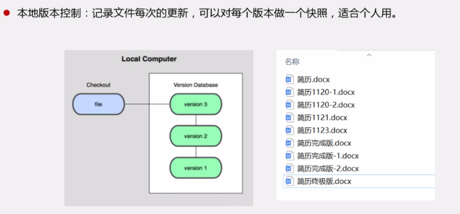
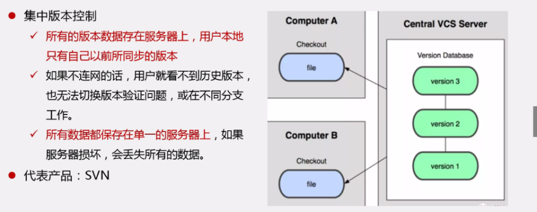
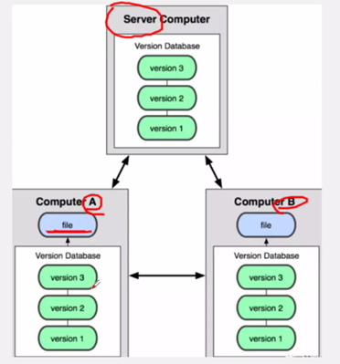
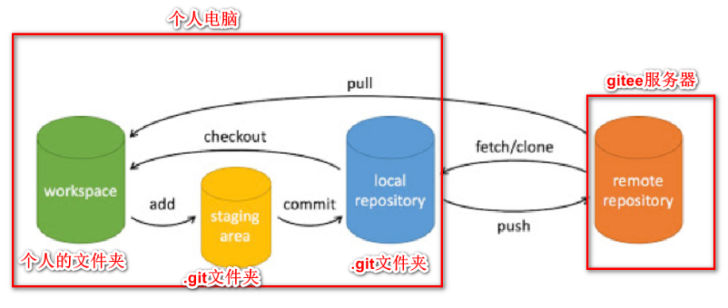

# Git

### 1. 什么是git

​	git是一个分布式版本控制工具，使用git可以实现：跨区域开发，记录所有文件的历史记录，保存我们的项目源代码和文档，统计工作量，并行开发提高工作效率

---


### 2. 版本管理

#### 1. 版本控制

​	在开发中管理文件、目录、工程等内容的修改历史、记录并备份，以便于恢复之前按的版本

#### 2. 版本控制工具

- git、svn、vcs、vss

#### 3. 版本控制分类

##### 本地版本控制

- 只适合个人使用，比如RCS。它将所有的版本保存到本地。



##### 集中式版本控制

- SVN，所有版本的数据保存到服务器上，所有用户本地只有一个最新版本。所以要想看到历史版本，必须连服务器。 如果服务器被损坏，所有版本都会丢失。



##### 分布式版本控制

- Git，所有的版本信息全部同步到本地的每个用户。所以用户可以在本地查看所有历史版本，也可以离线提交，等联 网的时候再推送到服务器即可。很安全，因为即使服务器被破坏，只要有一个用户的数据还在，就可以恢复。



> svn和git的区别:
>
> svn是集中式版本工具，所有版本集中在中央服务器存放，如果服务器损坏，会导致数据丢失 
>
> git是分布式版本工具，没有所谓的中央服务器，只有一个代码托管服务器。每个人的电脑就是一个完整的版本库


---

### 3. git工作原理



- **工作区**：被管理的项目所在的文件夹，我们在这里进行项目的开发

- **暂存区**：工作区待管理的文件。将要管理的文件先加入暂存区，然后才可以提交本地仓库

- **本地仓库**：存储所有本地的版本数据（历史版本）

- **远端仓库**：代码托管服务器上的仓库，存储了所有提交到远端的版本数据


### 4. git设置

```
//设置用户名
git config --global user.name "用户名"
//设置邮箱
git config --global user.email "邮箱地址"
//设置存储凭证(密钥)
git config --global credential.helper store
//查看配置是否成功
git config -l
//生成ssh公钥，用于ssh的方式跟gitee通信;
ssh-keygen
//之后敲四次回车，然后根据生成位置，打开id_rsa.pub文件，复制里面全部内容，粘贴到gitee上的公钥位置。
```


### 5. 仓库连接

#### 1. 创建远端仓库

​	在`gitee`或者`github`等远端服务器上创建仓库

#### 2. 初始化本地仓库

```
//初始化本地git仓库，在要被管理的文件目录下执行
git init
```

#### 3. 查看远端仓库

```
git remote
```

#### 4. 添加远端仓库

```
//添加远程仓库地址
git remote add origin 远端仓库地址	//origin是仓库的别名
```

>   github 远端仓库地址使用这种方式：git@github.com:Depp-Leon/StudyNotes.git

---

### 6. 上传项目

- 工作区修改->添加到缓存区->提交到本地仓库->推送到服务器

```
//1. 拷贝项目文档到git工作目录
//2. 添加所有文档到暂存区
git add .
//3. 提交到本地仓库，每次修改都得提交
git commit -m "第一次提交"
//4. 推送到远端仓库
git push -u origin master			//origin是远端仓库的别名；master主分支，branch其他分支
```

> 1. **master**：在Git中，"master" 是默认的主要分支名。在创建一个新的仓库时，通常会自动创建一个名为 "master" 的主分支。在Git 2.28版本后，许多代码托管服务已经开始将默认主分支名从 "master" 改为 "main"。
> 2. **branch**：分支（branch）在Git中指的是一个独立的工作路径，允许你在不影响主分支（如 "master"）的情况下进行修改和实验。你可以创建新的分支，在其中做一些修改，最后再将这些修改合并回主分支。

---


### 7. 更新项目

- 更新项目-->添加缓存区->提交本地仓库->推送到远程仓库

```
//1. 按需要同步服务器
git pull	
//2. 修改本地工作区的文件和代码
//3. 添加到暂存区
git add .
//4. 提交到本地仓库
git commit -m "第二次更新"
//5. 再提交到远端仓库，不用加远程仓库地址，提交到当前本身所在的分支
git push		
```


---

### 8. 版本回退

- **查看历史版本**

```
//查看历史版本
git log
git log --oneline		//每个提交的版本信息浓缩为一行
```

- **方式1：强制回退版本，该操作会导致回退版本之后的所有版本丢失**

```
//本地回退到历史版本
git reset --hard 历史版本号
//强制把当前版本推送到服务器,HEAD是当前版本所在的，因为没有pull，所以需要强制；
gir push origin HEAD --force	
```

> HEAD 是当前分支引用的指针，它总是指向某次commit，默认是上一次的commit。
>
>  这表示 HEAD 将是下一次提交的父结点。 通常，可以把 HEAD 看做你的上一次提交的快照。当然HEAD的指向是可以改变的，比如你提交了commit，切换了仓库，分支，或者回滚了版本，切换了tag等。

- **方式2：切换旧版本并提交新版本，不会导致后面的版本丢失**

```
//这种情况相当于恢复那个版本的所有文件；版本号和头文件不变
git checkout 版本号 -- .	//.代表要这个版本的所有文件
```


---

### 9. 分支管理

​	分支相当于对原来项目的所有版本信息的一份拷贝，用于不影响原来项目的基础上开发新的功能。若开发完成并验证，将新分支覆盖到原先的分支上，这样新功能就加上了

- **创建分支**

```
git branch 分支名称
```

- **切换分支**

```
//切换到分支上面做开发，进行版本的提交，切换后我们的工作空间也会切换
git chechout 分支名称
```

- **查看分支**

```
git branch -a
```

- **删除分支**                                                                                                                                                                                                                                                                                                                                                                                                                                                                                                                                                                                                                                                                                                                                                                                                                                                                                                                                                                                                                                                                                                                                                                                                                                                                                                                                                                                                                                                                                                                                                                                                                                                                                                                                                                                                                                                                                                                                                                                                                                                                                                                                                                                                                                                                                                                                                                                                                                                                                                                                                                                                                                                                                                                                                                                                                                                                                                                                                                                                                                                                                                                                                                                                                                                                                                                                                                                                                                                                                                                                                                                                            

```
git branch -D 分支名称
```

- **分支合并**

```
//1. 分支先执行git add 和commit操作，不提交的话，就相当于分支再原来的分支基础上没有进行修改操作
//2. 再切换到要被覆盖的主分支上，比如master进行合并操作
git merge 分支名称(开发了新功能的分支名称)		//分支合并，覆盖掉master分支
git push		//把覆盖后的重新上传到服务器
```

> 每次修改都得提交，不然只是在本地修改，版本库并没有修改

- **撤销合并**

```
git merge --abort
```


---

### 10. 处理冲突

#### 1. 提交冲突

- 举例：一个代码库，张三和李四两个人维护，张三修改了某个文件的某处代码，并且提交到 服务器了，李四不知道，也修改了这个文件的同一处代码，也要提交服务器，这时候会报冲 突。 
- 解决方案： 让李四从服务拉代码下来，然后找到冲突的位置，冲突代码的部分会被git标注出来，会标注张三和李四两个人的两套方案，**手动修改这块冲突的代码，留一个方案就够了。再次push到 服务器即可。**

#### 2. 合并冲突

- 两个分支都对master的某个文件某个代码进行修改并提交了版本，master对其中一个分支进行合并的时候会提示冲突

```
方法1：此时需要在master下访问该文件并修改，再提交上传

方法2：撤销本次合并
git merge --abort
```


