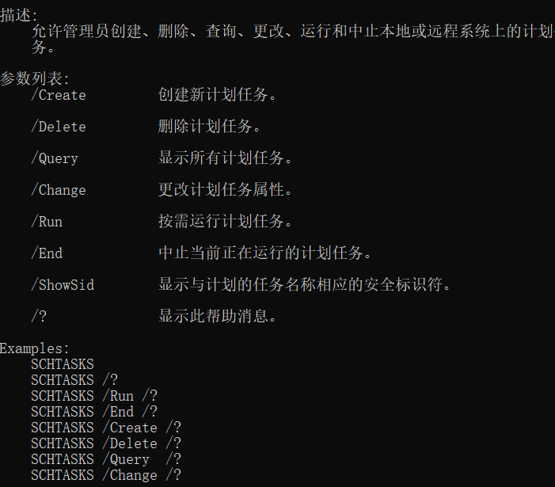

# 1. win快捷键

 https://www.mubu.com/doc/4Gop_8h-SGx

> win E 我的电脑
>
> win D 显示桌面
>
> win L 锁屏
>
> F1 帮助
>
> F2  重命名
>
> F3  查询关键字 ctrl F  （find）    // ctrl H 替换
>
> F11 浏览器全屏
>
> F12 另存为
>
> ctrl Y 恢复

# 2. dos命令 

 https://www.mubu.com/doc/4Gop_8h-SGx

*windows下的终端操作*

>cd\ 回到根文件夹，cd.. 回到上一个文件夹
>
>
>
>dir  显示目录下的文件 （等于linux下的ls）
>
>md  创建新目录  （等同于linux下的mkdir）
>
>>md d1 d2 当前目录下创建两个文件
>
>rd  只能删除空文件夹
>
>
>
>echo 创建文件（等同于linux下的vi）
>
>>echo >001.txt     注意写“>”号    >后面加文件或者文件路径
>
>>echo >d:\002.txt     跨盘符加反斜杠，表示当前目录下
>
>copy 复制文件
>
>>copy  [源文件夹或文件] [目的文件夹或文件]
>
>del 删除文件   等同于linux下的 rm
>
>>del  001.txt
>
>>del d1  删除文件夹下的所有文件
>
>ren 改文件夹或者文件的名字 
>
>>ren [原名] [现名]
>
>move 移动文件或者目录
>
>>move [源文件] [目的文件]
>
>cls 清除之前所有内容

# 3. 网络命令

[网络基础命令 - 幕布 (mubu.com)](https://mubu.com/doc/zaLXvZlk_x)

##### ==ping==  *查看目的ip连通性*

>> ping -t  www.baidu.com 不间断的ping
>
>> ping  www.baidu.com  -n  发送指定n个数据包
>
>> ping -l  200 -t www.baidu.com 指定发送的数据包的大小
>
>> ping多个地址
>
>> >for /L %D in (1,1,255) do ping 192.168.124.%D
>> >
>> >> 代码中的（1,1,255）就是网段的起点和重点，就是检测192.168.124.1到192.168.124.255之间的所有的ip地址
>> >
>> >for /L %D in (1,1,255) do ping -n 192.168.124.%D >>a.txt 
>> >
>> >>将内容保存到文档
>
>> ping -a 192.168.124.72  ping自己，查看自己的电脑名

##### ==ipconfig==  查看自己的ip

>>ipconfig -all 查看详细信息  
>
>>ipconfig -release 释放本机的ip地址
>
>>ipconfig -flushdns 刷新dns

##### ==netstat==  查看端口

>> netstat -a 查看**所有**连接和监听的端口
>
>> netstat -e 显示发送和接受数据的信息
>
>> netstat -s 显示不同协议的**统计结果**
>
>>netstat -o 显示与每个连接**相关的进程ID**
>
>> netstat -n 查看**有效的端口**
>
>> netstat -t 查看tcp协议的端口  -u 查看udp
>
>> netstat -l 仅显示监听[套接字](https://so.csdn.net/so/search?q=套接字&spm=1001.2101.3001.7020)(所谓套接字就是使应用程序能够读写与收发通讯协议([protocol](https://so.csdn.net/so/search?q=protocol&spm=1001.2101.3001.7020))与资料的程序)，l是listening的首字母
>
>> netstat -p tcp  查询特定协议的端口

---

##### <u>***==linux==下的查找端口号***</u>

>netstat -ntlp  //查看当前所有tcp端口·
>
>netstat -ntulp |grep 80  //查看所有80端口使用情况·
>
>netstat -ano | grep 3306  //查看所有3306端口使用情况·
>
>netstat -ano | grep “进程ID”  //查看进程所占用的端口号

##### ==<mark>ARP</mark>== *地址解析协议*

>- arp -a 显示当前局域网内所有的主机的ip和对应的物理地址 **相当于ARP表，无则需要广播+单播**
>- arp -s  ip  mac  手动添加一条arp记录    **需打开管理员模式**
>- arp -d  ip   手动删除一条arp记录

##### ==schtasks==  *定时任务*

>作用：设置<u>定时任务</u>，如定时关机或者定时打开一个文件
>
>命令参数
>
>- /create  创建一个命令
>- /TN         *TaskName*创建任务的名称  **唯一**
>- /TR         *TaskRun*运行的程序在主机上的**路径**
>- /SC         *Schedule*任务运行的频次、once、minute、daily、weekly、monthly
>- /ST          *StartTime*任务开始的时间
>
>---
>
>
>
>1. 创建任务
>
>  - schtasks /create /tn test /tr e:\a.txt /sc minute
>
>2. 删除任务
>
>  - schtasks /delete /tn test
>
>3. 强制关机
>
>  - schtasks /create /tn autodown /tr “shudown -s -f” /sc daliy /st 17:30

##### ==tracert==   *路由跟踪*

>作用：查看本机到目的ip之间经过的路由
>
>- tracert ip/域名

##### ==windows==下查看端口号的相关命令

> - netstat -ano  查看所有的端口信息
>
> - netstat -ano | findstr “端口号”   //linux为：netstat -ano | grep “端口号”  查看**端口号对应的进程ID**
>
> - telnet    ip   端口号    检查**端口号是否可用**
>
>   ---
>
>   <u>*telnet其他功能：直接telnet ip 输入账户名密码可以进项远程登陆*</u>