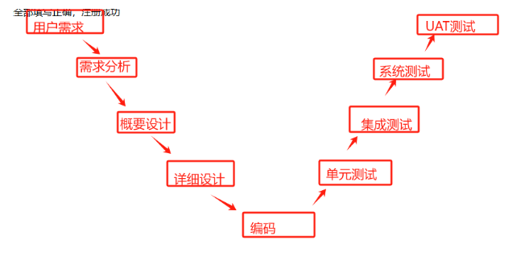
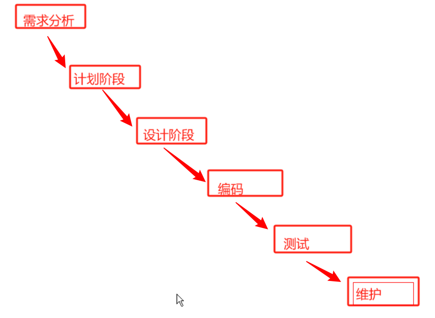
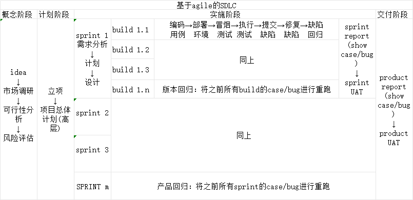

# 公共基础

[110期公共基础 - 幕布 (mubu.com)](https://mubu.com/doc/7rp_lgsM17l)

### 1. 软件研发基础

1. ==软件==

   > - 软件是计算机程序以及其他相关文档，是交付给客户的一整套解决方案
   >
   > - <u>**软件=程序+文档**</u>

   > 文档包括：需求文档（软件规格说明书SRS）、计算文档、设计文档、报告文档、用户手册
   >
   > 文档意义：清晰的了解软件架构和结构，方便对软件进行使用和维护

2. 编码

   >编码是指将人脑的思路、方法使用程序设计语言编写为代码的过程

3. 软件开发

   > 软件开发不止是编码，它是指从**<u>需求分析、软件计划、软件设计、编码、调试</u>**等

4. 软件研发

   >软件研发= 软件开发+测试
   >
   >软件研发至少包括：**<u>需求、设计、编码、测试</u>**

5. ==人员架构==

   >- PM:项目经理，program manager
   >  - 主要负责项目整体的运行情况，资源的协调、人员的分工、风险把控等
   >- DEV:开发，develop
   >  - 前端开发：负责客户端、页面的编写，主要使用html/js/css/vue/react/QT等
   >  - 后端开发：主要负责业务的具体实现，C/C++/C#/JAVA
   >- UI: 用户交互界面 ，user interface
   >  - 主要负责界面美工工作
   >- BA：业务分析工程师，Business Analysis Engineer
   >  - 即产品经理：product manager主要负责和用户对接需求，确定需求和需求的优先级
   >- tester：测试人员，对开发人员编写的程序进行测试
   >- 运维：负责产品上线后的运行维护工作

6. ==需求==

   >- 需求是指产品经理和***<u>用户对接业务（原始需求）</u>***后形成的一份描述系统应该做什么的文档
   >- 需求澄清：指产品经理在和用户对接需求过程中向用户提出问题的过程。广义上，在需求分析上开发、测试人员向产品经理提出问题的过程也称为需求澄清。
   >- 需求分析：就是<u>*学习需求*</u>的过程，通常以会议的方式进行，包括**<u>*需求的串讲和反串讲*</u>**，做到需求对其的工作。
   >  - 需求串讲：由产品经理向开发/测试人员讲解需求的过程
   >  - 需求反串讲：由开发/测试人员向产品经理讲解需求的过程
   >- 需求变更：指对需求的变更活动；需求可以由客户、pm、产品经理和开发人员进行变更。
   > - 需求变更仲裁会议（CCB）：变更需要需求仲裁会议，测试不参加
   >- 需求评审（review）：产品经理、开发人员、测试人员在每一个**<u>*sprint（迭代）*</u>**开始之前，对本sprint进行优先级的划分

7. 软件设计

   > - 概要设计：确定软件整体的结构和框架，确定**<u>*软件的接口、类的设计*</u>**等
   > - 详细设计：确定**<u>接口的具体实现</u>**或者**<u>类中方法函数的具体设计</u>**

8. 程序设计语言

   > - 机器语言：只包含0和1的机器码、直接被机器识别
   > - 汇编语言：汇编语言知识在机器语言上进行了简单的封装，同机器语言一样是低级语言
   > - 高级语言：更接近人类自然表达的方式

9. 调试

   > 程序员编写完成业务代码后，使用<u>专业调试工具</u>对代码进行**<u>*调试并改正*</u>**

10. 环境

    > - 开发环境：程序写代码所用的环境
    > - 测试环境：测试人员为了测试程序而部署的环境
    > - 线上环境：也被称为用户环境、<u>真实环境</u>、指软件真实上线之后使用的环境

11. 软件的生命周期

    > 指从需求分析一直致软件消亡的整个过程；包括<u>**需求、计划、设计编码、测试、上线、升级、维护**、**废弃**</u>

12. 软件版本

    > - version: 正式对外发布的版本
    > - build：内部研发的小版本，一般不对外发布

13. 软件研发种的评审活动

    > case review : test ***<u>case</u>***(测试用例)
    >
    > - 测试人员编写完成测试用例后，需要自发组织负责模块的开发、开发组长、测试组长、[产品经理]一起<u>对其测试用例进行评审</u>，以补充用例以及去掉冗余用例;
    >
    > code review：代码评审
    >
    > - 开发人员编写完成业务代码，需要自发<u>组织本组开发人员对其代码进行评审测试</u>
    > - 评审时首先由开发人员自己讲解业务，然后根据代码讲解自己实现业务的逻辑以及所使用的技术点;

14. ==软件开发的流程==

    > **需求分析--开发计划--思维导图--概要分析--详细设计<u>（7、软件设计）</u>--编码<u>（2）</u>--开发自测--修复缺陷--开发报告**
    >
    > - 开发计划：是对开发活动所作计划，主要包括<u>项目背景、时间节点、人员分工、开发技术、开发环境、风险预防</u>等
    > - 思维导图：将业务的需求使用类似于Xmind的思维导图表示出来
    > - 开发自测：开发人员编完代码后，需要对自己的代码进行自测：比如单元测试
    > - 修复缺陷：
    >   - 不符合或不满足用户需求
    >   - 超越用户的需求
    >   - 不符合用户的操作习惯
    >   - 缺失了异常处理
    > - 缺陷包含的元素：缺陷编号、[模块、子模块、测试场景]、缺陷名称(标题)、重现步骤、缺陷等级、缺陷优先级、期望结果、实际结果、附件等
    >   - 模块：业务相类似的一些功能组织为一个模块，比如用户管理模块
    >   - 子模块：**<u>看得见的</u>**，比如用户管理中登录、注册
    >   - 测试场景：**<u>看不见的</u>**，比如会员用户登录、普通用户登录
    >   - 重现步骤：让缺陷再一次显现出来的执行步骤（可能出现偶现型缺陷）
    >   - 缺陷等级：
    >     - 致命：导致系统崩溃或者重要业务模块整个模块功能异常
    >     - 严重：重要模块业务有异常或者一般模块整个业务功能异常
    >     - 一般：一般的功能点的异常
    >     - 轻微：一般为界面显示方面的问题，比如错别字   登录  登陆
    >   - 缺陷优先级：缺陷被处理的优先顺序：缺陷优先被处理的级别;P1~P4优先级降序排序/priority
    >   - 附件：通常有出错截图、日志信息、环境信息等;
    > - 缺陷的处理流程：
    >   - 提交(dev/TE，new)----->确认缺陷(dev/TE)---->修复bug(dev，fixed)---->缺陷回归(te，close)
    >   - 确认时若不是bug，直接指派TE进行关闭
    >   - 缺陷回归测试不通过，则重新打开reopen缺陷
    > - 开发报告：包括项目背景、时间节点、人员分工、代码分布、缺陷情况、缺陷处理情况等
    >
    > 

15. 软件测试流程

    > 需求分析-》测试计划-》思维导图-》测试设计-》测试用例-》搭建环境-》冒烟测试-》执行测试-》提交缺陷-》缺陷回归-》测试报告

---

### 2. 软件测试基础

1. 软件测试

   > 不仅仅是找出程序中错误的行为，更是在软件研发中一系列质量活动的总称，包括质量鉴定和质量评估

2. 软件测试的对象

   > 程序＋文档

3. 手工测试

   > 手工根据测试用例执行软件测试的过程，以及发现是否符合需求的说明

4. 自动化测试

   > 由机器代替人工，自动化测试要求测试人员会编写测试脚本*<u>//最多用python</u>*

5. 黑盒测试

   > <u>不查看程序内部实现逻辑</u>，仅从功能界面上对程序进行的测试<u>*//主要测试人员测试*</u>

6. 白盒测试

   > <u>查看代码内部的实现逻辑</u>，对所有的逻辑路径进行的覆盖测试

7. ==按测试阶段==

   > 1. 单元测试
   >
   >    - 就是对程序中的最小可测单元进行的测试，一般为**<u>一个方法或者一个函数</u>**
   >    - 一般由**<u>程序员</u>**自己完成
   >
   > 2. 集成测试
   >
   >    - 将已经经过测试的两个或多个单元进行组接，以测试**<u>它们之间接口</u>**的一种测试
   >    - 一般由**<u>测试人员</u>**完成
   >
   > 3. 系统测试
   >
   >    - 对程序的所有功能、安全性、性能、易用性等进行的全面测试，包括软件和硬件
   >
   > 4. UAT测试：用户的验收测试（用户可接受性测试）
   >
   >    - 正式验收测试：用户借助**<u>第三方</u>**专业验收机构进行测试
   >    - 非正式验收测试：
   >      1. alpha测试：由一个或多个用户在**<u>开发环境</u>**下对程序进行测试，开发人员记录问题
   >      2. beta测试：由一个或多个用户在<u>**真实(生产)环境**</u>下的测试，<u>开发不在场</u>，由客户反馈
   >
   > 5. 功能测试：对程序所有功能进行测试，不包括安全性，性能，易用性，界面美观性
   >
   > 6. 非功能测试：包括安全性，性能，易用性，界面美观性
   >
   > 7. ==冒烟测试==
   >
   >    - 冒烟测试是对程序的**<u>最基本功能</u>**进行测试，冒烟测试通过，版本<u>正式</u>进入<u>系统测试阶段</u>，若冒烟不通过，则版本打回到开发;
   >    - 由<u>测试人员</u>完成
   >
   > 8. ==测试用例编写方法==
   >
   >    > <u>以场景法作为基础，每个模块用等价类和边界值法</u>
   >
   >    1. 等价类划分法： 是将测试数据划分为不同的等价类，然后从不同的等价类中挑选出有代表性的数据进行测试，就可以保证程序不出问题
   >
   >       - 有效等价类：有效等价类就是对于程序而言有意义的、正确的输入;
   >       - 无效等价类：无效等价类就是对于程序而言无意义的、不正确的输入;
   >
   >    2. 边界值分析法：通常人为程序经常是在边界附近存在异常，因此采用边界值分析法筛选测试数据;
   >
   >       三点：
   >
   >       - 上点：边界上的点
   >       - 内点：边界内的点，通常可不测
   >       - 离点：离点是离上点最近且和上点不在同一等价类
   >
   >    3. 流程分析法也被称为**<u>*场景法*</u>**；
   >
   >       - 它是将基本的业务流程(基本流)使用一条黑直线表示，而备选的流程(备选流)使用弯曲的细线表示;
   >
   >       - 基本流一般是正确的流程，而备选流则一般为异常流程
   >
   >       - 使用场景分析法时**<u>先考虑正常场景，在考虑异常场景</u>**;
   >
   >         > <u>异常场景和缺陷的区别</u>
   >         >
   >         > - 异常场景：不正确的测例是否出现正常结果
   >         > - 缺陷：正常测例出现异常

---

### 3. 软件研发模型

1. V模型：V模型是一种将软件研发过程和测试阶段一一对应的一种软件研发模型;

   

2. 瀑布模型：将软件研发看作像瀑布一样，从上到下顺序固定，中间任一环节出错，必须返回第一步，重新开始

> 瀑布模型适合需求确定的大型项目的组织

3. ==敏捷模型==：敏捷是一种以人为核心、迭代、循序渐进的软件研发思想;迭代是将一个大项目拆分为不同的子项目，这些子项目具有独立开发、独立部署、独立交付的特性;

   

   - **敏捷三角色**
     1. PO:product owner =  product manager
        - 主要是和用户对接需求、确定需求和需求的优先级
     2. SM:scrum master敏捷教练 = PM，program manager
        - 主要负责项目整体的运作，项目研发人员工作的督促
        - scrum：敏捷的实践
     3. team: DEV,TE，运维
   - **敏捷三大交付物**
     1. product backlog：
        - *<u>产品需求列表</u>*：由PO产生，需求在产品需求列表上是以用户故事的方式展示;用户故事一般在KanBan上是以用户卡片方式出现
     2. sprint backlog:
        - *<u>迭代需求列表</u>*是在sprint meeting上由PO组织开发/测试产生
     3. increment:
        - 在每一个sprint结束时，需要向PO交付**<u>*增量*</u>**(程序、文档等)
   - **敏捷四大会议**：
     1. 每日立会：
        - 又被称为每日站会、站会：每一天由SM组织开发在KanBan前进行站会，时间在5-15min
          - KanBan内容：todo doing done %
        - 站会主要是向SM汇报当前工作以及疑难问题的解决
     2. 迭代会议：
        - sprint meeting：在每一个<u>迭代开始之前</u>，由PO组织确定本迭代的需求和需求优先级
     3. 评审会议：
        - 在每一个<u>迭代结束时</u>，需要由PO进行项目increment的评审活动
     4. 回顾会议：
        - 回顾本迭代做的好的地方和做的不好的地方的总结

