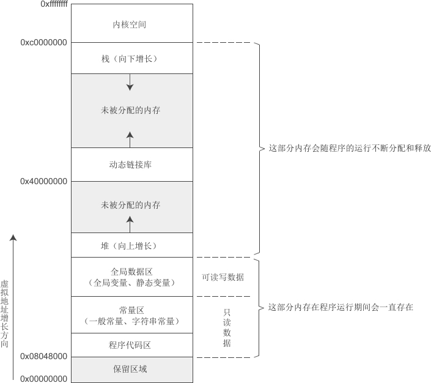

### 1. 类型转换

1. 将`string`转为`int`：`std::stoi()`

   ```
   int myint1 = std::stoi(str1);  // std::stoi() 是C++11 引入的一个标准库函数
   ```

2. 将`QSstring`转为`int`：`QString::toInt()`

   ```
   Qstring str = "xx";
   int myint2 = str.toInt(); // QString::toInt()
   uint myint3 = str.toUInt();
   ```

3. 将`int`转为`QString`：`QString::number()`

4. 将`int` 转为 `String`：`std::to_string`

   ```
   int value = 123;
   std::string result = std::to_string(value);
   // result = "123"
   ```

5. `QString`转`String` : `toStdString()`

   ```
   Qstring str = "xx";
   std::string str1 = str.toStdString();
   ```

6. `String`转`QString`：`fromStdString()`

   ```
   QString qstr = QString::fromStdString(str)	// 静态函数需要加QString前缀
   QString qstr = QString(Str.c_str())			// 将String转为C字符数组再调用QString的构造
   ```

7. `const char*`` 和 `std::string` 的互相转换

   ```c++
   const char* cstr = "Hello, world!";
         
   // 直接用 std::string 接收 const char* 类型
   std::string str = cstr;
   ```

     ```c++
   std::string cmdstr = "du -sh /path/to/somewhere | awk '{print $1}'";
   
   // 将 std::string 转换为 const char* 并传给 getCmdRes
   getCmdRes(cmdstr.c_str());
     ```

8. 两个不同的枚举类型之间不可以自动转换，此时使用静态类型转换

   ```
   item.type = static_cast<NET_WHITE_LIST_TYPE>(netMsg.info_type());
   item.reason = static_cast<NET_WHITE_LIST_REASON>(netMsg.source_type());
   ```

9. `qint64`和`QString`的互相转换

   ```c++
   // qint64 --- QString
   qint64 value = 123456789012345;
   QString str = QString::number(value);
   
   // QSting --- qint64
   QString str = "123456789012345";
   bool ok;
   qint64 value = str.toLongLong(&ok);
   if (ok) {
       // 转换成功，value 是有效的 qint64 数值
   } else {
       // 转换失败
   }
   ```

10. `std::strtol()`和`std::atoll`都是用于将字符串转化为`long`类型有什么区别？

   1. `std::strtol()` 是一个功能更灵活的字符串转换函数，支持不同进制的转换，并可以报告错误。

      ```c++
      long int strtol(const char *str, char **endptr, int base);
      /* base 参数指定进制，常见值有：
      	10 表示十进制
      	16 表示十六进制
      	8 表示八进制 
      */
      // endptr 是一个指针，用于指示字符串中第一个无效字符的位置。
      ```

   2. `std::atoll()` 是一种简单的字符串转换函数，用于将字符串直接转换为 `long long int` 类型。

      ```c++
      // 仅支持十进制：`std::atoll()` 只能处理十进制字符串，无法转换其他进制。
      long long int atoll(const char *str);
      ```

      > 有`atol()`和`atoll()`;

11. C++的enum不能直接接收Protobuffer的enum类型，因为它们是不同的enum类型，proto中可能未定义值。

    因为它们的底层相同(都是整数)，所以想要接收需要使用静态转换，但是需要确保两者的值定义一致，否则可能导致逻辑错误：

    ```c++
    MyCppEnum cppVal = static_cast<MyCppEnum>(MyProtoEnum_VALUE1); // 转换为对应的值
    ```

    

### 2. 线程进程

> 1. 线程基本操作
> 2. 进程基本操作，分离、守护进程
> 3. 信号量、条件变量、互斥锁
> 4. 承诺-未来机制

1. 信号量、互斥锁、条件变量之间的关系：

     1. **互斥锁**：专注于**互斥**性，确保共享资源一次只被一个线程访问。常用于保护临界区

     2. **条件变量**：

        - **建立在互斥锁之上**，是一种**同步机制**，用于**线程间**的协作，允许线程等待某个条件成立，同时避免忙等待。

        - 提供等待和通知机制，线程在**等待条件时释放锁，条件满足时被唤醒**。

          ```
          wait / wait_for
          signal: notify_one / notify_all
          ```

        - 典型场景：生产者-消费者模型

     3. **信号量**：信号量是一个计数器，操作系统提供的真实同步原语。

        - 当计数器为1时可以模拟互斥锁

        - 通过两个信号量（一个控制条件，一个控制互斥），可以模拟条件变量的等待/通知机制

        - 但是其`P/V`操作与`wait/signal`有所不同

          > 1. P/V为原语，不需要依赖互斥锁；而wait不仅阻塞线程，而且还释放互斥锁

2. 关于C++的**互斥锁管理类(互斥锁)**：`std::lock_guard<std::mutex>`和`std::unique_lock<std::mutex>`

     1. `std::lock_guard<std::mutex>`：用法简单，只负责加锁和自动解锁（RAII），不能手动解锁或重新加锁。

        > **RAII**（Resource Acquisition Is Initialization，资源获取即初始化）：对象的生命周期和资源的管理绑定在一起。在对象构造时**获取资源**（如锁、内存、文件句柄等），在对象析构时**自动释放资源**。

     2. `std::unique_lock<std::mutex>`：不仅支持RAII，而且支持手动 `lock/unlock`、延迟加锁、**条件变量**等待等。

        > **适合需要与条件变量配合使用的场景**

3. 关于项目中<u>定时任务</u>使用到的**条件变量**，常搭配生产者消费者模式

     > 同样的有：1、上报进度开启独立线程 2、威胁清除上报空字段开启独立线程

     ```c++
     std::condition_variable m_lockcv;
     
     void CTimedTasks::run()
     {
         while (m_runningTimedTask) {
             updateTimedTasks();
             checkTimedTasksRunnable();
             // 定时任务暂时是按照分钟设置的，不需要那么高的检查频率
             std::unique_lock<std::mutex> ulock(m_lockMutex);
             m_lockcv.wait_for(ulock, std::chrono::seconds(50), [this] { return this->m_isCheckTime == true; });
         }
     }
     
     void CTimedTasks::UpdateTimedTasks()
     {
         m_isCheckTime = true;
         m_lockcv.notify_all();
     }
     ```

     1. 条件变量的`wait_for`的三个参数

        - `std::unique_lock<std::mutex>`: 在等待期间自动解锁和加锁互斥量，保证线程安全；必须先持有锁，wait_for 内部会在等待时释放锁，唤醒后重新加锁
        - `std::chrono::duration`: 指定最多等待多长时间，如果在这段时间内没有被唤醒，wait_for 会超时返回
        - `lambda` 表达式或函数，返回 `bool`： 判断是否满足唤醒条件。只有当返回 true 时，wait_for 才会结束等待；如果条件为 false，即使被 notify 也会继续等待，直到超时或条件为 true。

     2. 条件变量的`wait()`和`wait_for()`的区别：

        - `wait()`:线程会一直阻塞，直到收到通知（notify_one/notify_all）并且条件满足（如果有条件谓词的话）。

          ```c++
          std::unique_lock<std::mutex> lock(mutex);
          cv.wait(lock, []{ return 条件; });
          ```

        - **wait_for**：线程会阻塞**一段指定的时间**。如果在这段时间内收到通知并且条件满足，则提前返回；否则超时后返回

          ```c++
          std::unique_lock<std::mutex> lock(mutex);
          cv.wait_for(lock, std::chrono::seconds(5), []{ return 条件; });
          ```

     3. 条件变量的通知函数`notify_all()`（或 `notify_one()`）

        - 作用是唤醒正在 `wait_for` 上等待的线程，让它提前结束等待、立即继续执行
        - 被唤醒后，`wait_for` 会再次检查(第三个参数) `[this] { return this->m_isCheckTime == true; }`；如果为 `true`，线程立即结束等待，继续执行后续逻辑（如刷新定时任务）。

     4. 多个线程可以持有同一个 `std::condition_variable` 实例，并在不同的 `std::unique_lock` 上调用 `wait_for`，这在生产者-消费者、定时任务等场景非常常见。

        - **每次 wait_for 都需要持有同一个 mutex（或 unique_lock）**，否则行为未定义。
        - 如果有多个线程在同一个条件变量上等待，`notify_one` 只唤醒一个，`notify_all` 会唤醒所有等待线程。

4. 开启线程对日志进行实时检测，当停止时，不仅要停止外层的检查日志循环，也要停止行的检测，所以需要两个停止变量。

5. 线程里面对成员变量的访问/操作要使用原子操作(即使用原子类型)

   ```c++
   std::atomic<bool> 
   std::atomic<bool>
   std::atomic<int>
   ```

6. 开启线程时，把两个线程分开，要`detach`而不要加`join`，`join`会导致第二个线程开启不来

7. C++开启多线程时，传递类的非静态函数，方法一使用`lambda`，方法二使用`bind`

   > 原因：传递非静态函数需要指定对象指针

8. 类开启线程方式一：线程使用`bind`绑定`this`指针

   ```
   m_checkConnectStateThread = std::thread(std::bind(&CZDFYHandlerMassage::CheckUiConnectState, this));
   ```

   > `std::bind` 是一个函数适配器，用于创建一个新的可调用对象（如函数、成员函数等），并绑定特定的参数。
   >
   > 在这里，`std::bind(&CZDFYHandlerMassage::CheckUiConnectState, this)` 的作用是创建一个绑定到当前对象 `this` 的 `CheckUiConnectState` 成员函数的可调用对象。
   >
   > `&CZDFYHandlerMassage::CheckUiConnectState` 指向成员函数的指针，`this` 是指向当前类实例的指针。

9. 如果在`std::bind`中使用实参，而不是占位符，那么在调用绑定的函数时，`std::bind`会将这些实参作为固定参数传递给成员函

       1. 传入实参

     ```c++
     // 绑定printSum函数，并提供第一个参数为3，第二个参数为4
     auto boundFunc = std::bind(&MyClass::printSum, &obj, 3, 4);
         
     // 调用时无需传递参数，已经被绑定
     boundFunc();  // Output: Sum: 7
     ```

       2. 使用占位符

     ```c++
     // 绑定printSum函数，使用占位符
     auto boundFunc = std::bind(&MyClass::printSum, &obj, std::placeholders::_1, std::placeholders::_2);
     
     // 调用时提供参数
     boundFunc(3, 4);  // Output: Sum: 7
     ```

10. 类开启线程方式二：上述使用lambda实现

     ```c++
     m_checkConnectStateThread = std::thread([this]() { CheckUiConnectState(); });
     // 如果有参数就在()中添加
     ```

11. 关于分离进程和守护进程：

    **分离进程**：分离进程是指一个进程从其父进程中“分离”出来，不再受父进程的控制。父进程和子进程各自独立运行，父进程不必等待子进程结束。

    > 分离进程通常用于那些需要**在后台独立运行的程序**，例如在启动时与终端会话断开的任务。

    1. 父子进程从 `fork()` 之后的代码开始**并行运行**

      ```c++
      pid_t pid = fork();
      if (pid < 0) {
          // 错误处理
          exit(1);
      } else if (pid > 0) {
          exit(0);  // 父进程退出
      }
      // 子进程中 即  pid == 0 为子进程
      if (setsid() < 0) {				
          // 错误处理
          exit(1);
      }
      
      ```

      **守护进程**：守护进程是一种特殊的分离进程，它通常用于长期运行的**后台服务**。守护进程的生命周期**独立于任何控制终端**。

      > 通常需要先调用分离进程`fork`，再将子进程作为守护进程

    2. `daemon`用于将当前进程变成 **守护进程**，即后台独立运行且与控制终端断开的进程

      ```
      bool becomeDaemon()
          {
              if (chdir("/") == -1) {
                  return false;
              }
      
              if (daemon(0, 0) != 0) {
                  std::cerr << "Failed to daemonize." << std::endl;
                  return false;
              }
      
              std::cout << "Daemon started." << std::endl;
              return t=rue;
          }		
      ```

    ```
    // 原型
    #include <unistd.h>
    int daemon(int nochdir, int noclose);
    **`nochdir`**：
    
    - 如果为 **0**，将工作目录更改为根目录 (`/`)。
    - 如果为 **1**，则保持当前工作目录不变。
    
    noclose：
    - 如果为 **0**，则关闭标准输入 (`stdin`)、标准输出 (`stdout`)、标准错误 (`stderr`)，并将它们重定向到 `/dev/null`。
    - 如果为 **1**，保持标准输入/输出/错误流不变。
    ```

      

    **两者区别**：

    1. 分离进程作为子进程，会受到父类的**资源管理和生命周期**方面的影响。**不会自动管理资源**，也 **没有恢复机制**，通常用于那些希望在后台执行、但不需要长期稳定服务的进程。
    2. 守护进程 **脱离了父进程和终端的控制**，并且通过一系列的步骤（如 `setsid()`、`chdir()`、关闭文件描述符等）确保自己可以长期独立稳定地运行。它 **不受父进程结束的影响**，并且具有 **自我管理能力**，如资源回收、自动重启等。通常用于后台服务和长期运行的任务

12. 分离进程的返回值问题

      ```c++
      bool UpgradeProcess::installPackage() {
          pid_t pid = fork();
          if (pid < 0) {
              Logger::error() << "Fork failed";
              return false;
          }
      if (pid == 0) {
               // 子进程
          UpgradeControl control;
               bool success = control.executeInstallCommand();
               exit(success ? EXIT_SUCCESS : EXIT_FAILURE); // 子进程用 exit
           }
           // 父进程
           int status;
           waitpid(pid, &status, 0);
           if (WIFEXITED(status) && WEXITSTATUS(status) == 0) {
               return true; // 父进程用 return
           }
           return false;
       }
      ```

13. 分离进程(**fork**)、分离进程之后成为守护进程(**daemon**)的实际操作及资源回收 / **僵尸进程**的产生

       1. **fork**：分离子进程，父进程负责资源回收（需 wait，否则产生僵尸进程），父进程退出后由 `init` (系统)回收
       2. **daemon**：实际上**在其内部调用了fork**，**之后将父进程退出，子进程成为孤儿进程**，由`init`（或 systemd）负责资源回收
       3. **fork后使用daemon**：
          - `fork` 后，子进程调用 `daemon(0, 0)`，`daemon` 内部会再次 `fork` 并让父进程退出。
          - 这种情况下，主进程只需要 `waitpid` 第一个子进程即可，孙子进程会被 `init` 收养，不会有僵尸。
          - **注意**：如果你在主进程里看到 `<defunct>`，通常是**第一个子进程**还没被 waitpid 回收。

14. 关于执行shell命令的库函数`system()`和`popen()`：**本质上都是通过 fork 一个子进程来执行 shell 命令**。

        1. **system()**

           ```c++
           system("your_command")
           
           // 实例
           // 使用 system 执行命令
           int status = system(strCmd.c_str());
           if (status == -1) {
               Logger::error() << "Software upgrade, system() call failed, error: " << strerror(errno);
               return false;
           }
           
           // 检查退出状态
           if (WIFEXITED(status) && WEXITSTATUS(status) == 0) {
               Logger::info() << "Software upgrade, Command executed with exit code 0";
               return true;
           } else {
               Logger::error() << "Software upgrade, Command failed, exit code: " << WEXITSTATUS(status);
               return false;
           }
           ```

           做了以下事情：

           1. **fork** 一个子进程。
           2. 在子进程中用 `/bin/sh -c "your_command"` 执行命令（即让 shell 解析并执行你的命令）。
           3. 父进程会等待子进程结束（调用 `waitpid`），并返回子进程的退出状态。

        2. **popen()**

           ```c++
           popen("your_command", "r")
           
           // 实例
           FILE *pipe = popen(strCmd.c_str(), "r");	// 执行并建立管道
           char buffer[1024] = {0};
               while (fgets(buffer, sizeof(buffer), pipe) != nullptr) {// 通过管道读取输入输出
                   std::string line = buffer;
                   Logger::info() << "Software upgrade: [" << line << "].";
               }
           pclose(pipe);	// 关闭管道
           ```

           也会：

           1. **fork** 一个子进程。
           2. 在子进程中用 `/bin/sh -c "your_command"` 执行命令。
           3. 建立一个**管道**，父进程可以通过这个管道读取子进程的输出（或写入子进程的输入）。
           4. 父进程通过 `pclose()`等待子进程结束并获取退出状态。

15. C++中的`std::condition_variable` 提供了**线程间同步的机制：条件变量**

       > 线程A调用 `wait` 并释放互斥量。
       >
       > 线程B调用 `notify_one` 来唤醒线程A，但线程B不释放互斥量，保持锁定。
       >
       > 线程A被唤醒后，线程A尝试重新获取互斥量。如果线程B还在持有锁，线程A会一直等待直到线程B释放互斥量。
       >
       > 当线程B退出临界区并释放锁后，线程A能够成功获得锁并继续执行

       1. 使用同一个互斥量，执行`wait`(P)操作；线程通过 `std::unique_lock<std::mutex> lck(mtx)` 锁住互斥量 `mtx`

          ```c++
          std::mutex mtx;				//互斥变量
          std::condition_variable cv;	//条件变量
          bool ready = false;
          
          void print_id(int id) {
              std::cout << "Thread " << id << " waiting...\n";
              
              // 使用 unique_lock 来锁住互斥量
              std::unique_lock<std::mutex> lck(mtx);
              
              // 释放互斥量并等待条件满足
              while (!ready) { 
                  cv.wait(lck);  // 释放锁，等待被唤醒
              }
          
              std::cout << "Thread " << id << " is executing\n";
          }
          ```

       2. 使用同一个互斥量，执行`notify`(V)操作；`std::condition_variable::notify_one` 用于唤醒一个等待条件变量的线程。使用`std::lock_guard`锁住互斥量

          ```c++
          void go() {
              std::this_thread::sleep_for(std::chrono::seconds(1));
          
              // 修改共享条件变量
              std::lock_guard<std::mutex> lck(mtx);
              ready = true;
              cv.notify_one();  // 唤醒一个等待线程
          }
          ```

          > - 当 `print_id` 线程在 `cv.wait(lck)` 处等待时，`mtx` 是**释放状态**，所以 `go()` 线程可以顺利加锁。
          > - `go()` 线程加锁后，修改 `ready` 并 `notify_one()`，然后解锁。
          > - 被唤醒的 `print_id` 线程会重新加锁 `mtx`，继续执行。

       3. 为什么需要 `std::unique_lock` 和 `std::lock_guard`？

          1. **`std::unique_lock` 和 `wait`**：
             - `wait` 需要一个 `std::unique_lock`（而不是 `std::lock_guard`）来保证它可以在释放锁后重新获取锁。`std::unique_lock` 支持锁的显式解锁和重新锁定。
             - `std::lock_guard` 是一个更简洁的锁类型，它会自动在作用域结束时释放锁，但它**不支持手动释放锁**，因此不能和 `wait` 一起使用。
          2. **`std::lock_guard` 和 `notify_one`**：
             - `std::lock_guard` 用于在临界区内执行 `notify_one` 或 `notify_all`，以确保条件变量状态修改时不会被中断或其他线程访问。

16. 原子类型的`load()`函数：`load()` 函数的作用是**安全地读取**一个原子变量的值，确保读取操作是**原子操作**，并且在多线程环境下不会发生数据竞态（race condition）。它保证在读取过程中，不会被其他线程打断或改变该值。

   `store()` 是 `load()` 的对应存储函数，用于**原子地修改**（存储）`std::atomic` 变量的值。它们共同用于多线程环境中，保证数据访问的安全性。

   ```c++
   #include <atomic>
   #include <iostream>
   #include <thread>
   
   std::atomic<bool> _shouldStop(false);
   
   void threadFunction() {
       while (!_shouldStop.load()) {
           // 执行任务
           std::cout << "Thread is working...\n";
       }
       std::cout << "Thread is stopping.\n";
   }
   
   void stopThread() {
       _shouldStop.store(true);  // 设置标志为 true，通知线程停止
   }
   
   int main() {
       std::thread t(threadFunction);  // 创建线程
   
       std::this_thread::sleep_for(std::chrono::seconds(2));  // 让线程运行一段时间
       stopThread();  // 设置标志为 true，要求线程停止
   
       t.join();  // 等待线程结束
       return 0;
   }
   
   ```

11. 对于原子类型，线程安全的方式读取该值使用`load()`函数;

      `load()` 函数的作用是读取原子变量的当前值并返回。在多线程环境中，使用 `load()` 可以确保读取的值是线程安全的，即便其他线程可能同时在修改该变量。

12. C++标准库的**承诺-未来机制**`std::promise`和 `std::future`，用于在线程之间传递值或状态，尤其是在异步编程中协助传递结果。实现在两个线程间同步任务完成状态

      > 有点像Qt中的eventLoop，事件循环机制

      ```
      #使用方式，没有返回值的
      std::promise<void> _terminationPromise;
      std::future<void> _terminationFuture;
      ```

      ```c++
      //案例：
      #include <iostream>
      #include <thread>
      #include <future>
      
      void task(std::promise<void> taskPromise) {
          std::cout << "Task is running..." << std::endl;
          // 模拟一些工作
          std::this_thread::sleep_for(std::chrono::seconds(2));
          // 设置任务完成状态
          taskPromise.set_value();
          std::cout << "Task has completed." << std::endl;
      }
      
      int main() {
          // 创建一个 promise
          std::promise<void> taskPromise;
          // 从 promise 获得对应的 future
          std::future<void> taskFuture = taskPromise.get_future();
      
          // 启动一个线程执行任务，并将 promise 传递进去
          std::thread t(task, std::move(taskPromise));
      
          // 等待任务完成
          taskFuture.get();  // 阻塞直到 taskPromise 设置了值
          std::cout << "Main thread detected task completion." << std::endl;
      
          t.join();
          return 0;
      }
      
      ```

      ```
      #输出结果
      Task is running...
      Task has completed.
      Main thread detected task completion.
      ```

13. IPC 是进程间通信的核心机制，帮助进程协调工作、交换数据。常见的 IPC 方式包括管道、消息队列、共享内存、信号、套接字等

14. `Popen()` 和 `pclose()` 是 C 和 C++ 标准库中的函数，通常用于执行外部命令，并通过**管道**（pipe）与这些命令进行交互，获取命令的输出或向命令传递输入

      > 通常用于在c++代码中获取linux命令执行后的控制台输出

      1. `popen()` 函数用于打开一个进程（即执行一个外部命令），并通过管道与该进程进行通信。它会返回一个文件指针，允许你读取该命令的标准输出或将数据写入命令的标准输入

         ```
         FILE *popen(const char *command, const char *mode);
         
         command：要执行的外部命令（如一个 shell 命令），这是一个 C 风格的字符串。
         mode：表示打开管道的模式。常用模式有：
         "r"：以只读模式打开管道，允许读取命令的标准输出。
         "w"：以写入模式打开管道，允许向命令的标准输入写入数据。
         ```

         > 成功时，`popen()` 返回一个文件指针（`FILE*`），你可以使用标准的文件操作（如 `fgets()` 或 `fread()`）来读取或写入管道数据

      2. `pclose()` 用于关闭通过 `popen()` 打开的文件指针，并等待命令执行完成。它会返回执行命令的退出状态。

         ```
         int pclose(FILE *fp);
         
         fp：通过 popen() 返回的文件指针（FILE*），指向进程的标准输出或输入
         ```

15. 

### 3. 文件操作

1. `ifstream` （对于系统来说是输入、读取文件）和 `ofstream` (对于系统来说是输出输出、写入文件)对象在它们的作用域结束时，都会自动释放资源，包括关闭文件流。

   > 这是因为 C++ 中的文件流类（如 `ifstream` 和 `ofstream`）遵循 RAII（Resource Acquisition Is Initialization）的原则。RAII 确保当对象超出其作用域时，自动调用其析构函数来释放资源，包括关闭文件流。

2. `try catch`：当代码中涉及文件的操作必须加上`trycatch`，避免因为文件相关的问题导致整个程序崩溃

   ```
   throw std::runtime_error("Unable to open files:");  #抛出运行时错误
   ```

3. C++删除文件中的某行

   1.  读文件，将不符合删除条件的行使用vector\<std::string>存储起来
   2.  覆盖写文件，将vector中的数据重写到文件中

4. 当创建文件读/写对象时，就已经打开文件了

   ```c++
   std::ifstream infile(m_sshDenyPath);
   
   #判断开发方式1：
   if(!infile){
   	throw std::runtime_error("Unable to open either log file:"+m_sshDenyPath); 
   }
   #判断打开方式2：
    if (!inputFile.is_open()) {
        std::cerr << "Error: Could not open file " << filePath << "\n";
   }
   ```

5. 日志获取信息就一套：

   1. `ifstream/ofstream`打开文件
   2. `std::getline()`获取行数据(可以选择分隔符，默认为回车键)
   3. 对获取到的字符串进行处理：用`string::find`返回到匹配的起始下标，再使用`substr`截取字符串

6. 文件加密：`libsource/SqliteMgr/test/IsoAreaOper.cpp` ：59行

     ```
     char buff[1024] = {'\0'};
         int len = 0;
         while((len = read(fin, buff, sizeof(buff))) > 0)
         {
             DataEncrypt((BYTE*)buff, len, g_Enkey);
             write(fout, buff, len);
             memset(&buff,0,sizeof(buff));
         }
     ```

7. `fgets()`和`std::getline()`

   1. `fgets()` 是 C 标准库函数，用于从指定文件流中读取一行字符（包括空格和制表符），直到读取到换行符、文件结束符或达到指定的最大字符数为止。

      ```
      char *fgets(char *str, int num, FILE *stream);
      
      str：指向存储读取数据的字符数组。
      num：最多读取的字符数（包括结尾的 \0）。
      stream：文件流，通常是 stdin 或文件的指针（如通过 fopen() 打开的文件流
      ```

   2. `std::getline()` 是 C++ 标准库提供的函数，用于从输入流（如标准输入或文件流）中读取一整行数据，直到遇到换行符（`'\n'`）为止。它比 `fgets()` 更符合 C++ 的面向对象风格，并且可以避免缓冲区溢出的问题。

      ```
      std::istream& std::getline(std::istream& is, std::string& str);
      
      is：输入流，可以是 std::cin（标准输入）或 std::ifstream（文件输入流）。
      str：用来存储读取结果的 std::string 对象。
      ```

8. 获取目录下的所有文件：

   1. `opendir()` 用于打开指定的目录，返回一个指向 `DIR` 结构的指针。如果无法打开目录（如目录不存在），它会返回 `nullptr`。

   2. `readdir()` 用于逐一读取目录中的文件项，每次返回一个 `dirent` 结构，包含文件名以及其他信息

      > 这两个也是POSIX函数

   ```c++
   DIR *dir = opendir(path.c_str());
       if (dir == nullptr) {
           LOG(WARNING) << "Error opening directory: " << path << std::endl;
           return;
       }
       struct dirent *entry;
       while ((entry = readdir(dir)) != nullptr) {
           // Skip the current (.) and parent (..) directories
           if (entry->d_name[0] == '.') {
               continue;
           }
   
           std::string file_path = path + "/" + entry->d_name;
           path_list.push_back(file_path); // Add the full file path to the list
   }
   ```

9. string将符合条件的字符全部清除

   ```c++
   std::string str = "file_name_here";
   str.erase(std::remove(str.begin(), str.end(), '_'), str.end());	// remove将符合条件的字符全部移动到末尾
   // 结果: "filenamehere"
   ```

10. 关于文件的读写，如果写文件时文件名不存在，那么会创建一个。如果读文件时文件名不存在，那么会打开失败

    ```
    std::ofstream file(filePath, std::ios::out | std::ios::trunc);		#写文件
    std::ifstream file(filePath);										#读文件
    file.is_open()			#检测是否成功打开
    file >> strValue;		#读文件，只针对ifstream类型
    file << Base64Util::Base64Encode(strValue);		#写文件，只针对ofstream类型
    ```

11. 通过逗号分割提取字符串

      ```c++
      std::istringstream stream(ipList);
      std::string ip;
      while (std::getline(stream, ip, ',')) {
             // 去掉可能存在的空格
             ip.erase(std::remove(ip.begin(), ip.end(), ' '), ip.end());
             if (!ip.empty()) {
                 ips.push_back(ip);  // 将非空 IP 添加到结果中
             }
      }
      ```

      1. `std::istringstream` 是 C++ 中的一个输入流类，它允许你将一个字符串作为流进行处理。通过它，你可以像读取其他输入流（如 `std::cin`）一样读取字符串内容。

         ```
         stream >> month >> day >> hour		// 当作输入流 输入到字符串中
         ```

      2. `std::getline()`的几种用法：

         1. 从输入流读取一行数据

            ```
            std::getline(std::cin, line); // 默认以换行符分隔
            ```

         2. 从输入流读取一行数据并指定分隔符，默认为换行符（`\n`）。此处使用`istringstream`模拟流数据

            ```c++
            std::string input = "apple,banana,orange,grape";
            std::istringstream stream(input);
            std::string token;
            
            // 使用逗号作为分隔符
            while (std::getline(stream, token, ',')) {
                std::cout << token << std::endl;
            }
            ```

         3. 从文件中逐行读取

            ```c++
            std::ifstream file("example.txt");
            std::string line;
            
            // 逐行读取文件内容
            while (std::getline(file, line)) {
                std::cout << line << std::endl;
            }
            ```

12. `sscanf()`和`sprintf()`

      1. `sscanf()` 用于从字符串中提取数据，类似于 `scanf()`，但它从字符串读取而不是从标准输入。

         ```
         int sscanf(const char *str, const char *format, ...);
         // str：待处理的字符串。
         // format：格式字符串，指定输入的格式。
         // 后续参数：根据格式化字符串，提供相应类型的变量以存储提取的值。
         
         示例：
         int pid = 0;
         sscanf(ptr->d_name, "%d", &pid);	// 将ptr->d_name作为int类型保存到pid
         ```

      2. `sprintf()` 用于格式化字符串并将其输出到字符数组中

         ```
         int sprintf(char *str, const char *format, ...);
         // str：目标字符数组，用于存储格式化后的字符串。
         // format：格式字符串，类似于 printf()。
         // 后续参数：根据格式化字符串，提供需要格式化的值。
         
         示例：
         char buffer[100];
         int pid = 1234;
         sprintf(buffer, "Process ID: %d", pid);	// 将pid存储到buffer
         std::cout << buffer << std::endl;
         ```

13. QString截取字符串

      1. 方式1：根据要截取的下标使用`QString::mid()`函数

         ```c++
         if (install_path.contains("/files")) { // uos系统保存的安装路径是files
                     install_path = install_path.mid(0, install_path.indexOf("/files"));
         }
         ```

      2. 方式2：直接使用`QString::remove()`函数去除不想要的子字符串

         ```c++
         if (inspath.contains("com.vsecure.")) // uos特殊处理
                     inspath = inspath.remove("files/");
         ```

14. 对于C++字符串来说，str1 删除掉其中包含的str2的两种方法

      ```c++
      url = url.substr(url.find(frontUrl) + frontUrl.size());		// 截取字符串
      url.erase(url.find(frontUrl), frontUrl.size());				// 直接从原字符串中删除，erase是原地修改的，不需要接收
      ```

      如果对于QString来说

      ```c++
      QString url = url.replace(frontUrl, "");					// 将子字符串替换为空
      url.remove(url.find(frontUrl), frontUrl.size())				// 同上面第二个
      ```

      

### 4. 新特性

1. C++显示类型转换

   1. `static_cast`

      作用：用于**相关类型之间的转换**，如基本类型之间、类层次结构的上/下转型（无虚函数时）
   
      > 编译期检查类型安全。
   
      场景：在两个自定义枚举类型之间转换时使用，否则编译无法识别，会报错
   
   2. `dynamic_cast`
   
      作用：用于**多态类型（有虚函数的类）之间的安全转换**，主要用于**向下转型**（**父类指针/引用转子类**）。
   
      ```
      Base* b = new Derived();
      Derived* d = dynamic_cast<Derived*>(b); 
      // Derived继承于Base，如果b实际指向Derived，转换成功，否则返回nullptr
      // 由于父指针可以指向不同的子类，所以使用动态转换可以辨别出父类指针指向的是哪个子类
      ```
   
      > 运行时检查类型安全，转换失败返回 `nullptr`（指针）或抛异常（引用）。
   
      场景：多态基类指针/引用转子类指针/引用，判断实际类型。
   
   3. `const_cast`
   
      作用：用于**去除或添加 const/volatile 限定符**，但不能改变对象的底层类型。
   
      ```
      const int* p = ...;
      int* q = const_cast<int*>(p); // 去除const 
      ```
   
      > 只能去除常量对象的指针或引用
   
      场景：需要调用只能接受非常量参数的函数，但你只有 const 对象时（需确保实际对象非const）。
   
   4. `reinterpret_cast`
   
      作用：用于**几乎任意类型之间的低级别转换**，如指针与整数、不同类型指针之间的转换。
   
      > 这种转换不会进行类型检查，完全按照位模式(比特位)重新解释内存中的数据
   
      ```c++
      using CreatePluginFunc = std::unique_ptr<IPlugin>(); // 定义函数指针类型，接受动态库对外接口函数
      CreatePluginFunc *createPlugin = reinterpret_cast<CreatePluginFunc *>(dlsym(handle, "createPlugin"));
      ```
   
      场景：比如获取动态库的函数指针，dlsym返回的是`void*`，此时需要把这个 `void*` 转换为 `CreatePluginFunc*`（函数指针类型），才能调用它。这种转换**只能用 `reinterpret_cast`**，因为它允许不同类型指针之间的转换（包括 `void*` 到函数指针）
   
      > C++ 标准不允许直接把 `void*` 转换为函数指针,所以不能直接用 `static_cast`来转换
   
2. 左值引用(`&`)和右值引用(`&&`)本质上都是引用，即都指向对象的地址。但编译器会根据引用类型决定能否绑定到某个对象、是否可以移动资源、是否可以延长临时对象的生命周期等

   1. 声明为右值引用后，就表示目标函数可以对目标地址的资源进行**获取并转移**

      > 因为声明为右值，也就是说该值是个临时值，可以对资源转移，因为其资源马上就会被回收清理

   2. 声明为左值引用后，原则上目标函数只能对目标地址的资源进行获取、但**不能转移**

      > 因为左值是具有存储空间的值，其可能还需要被别的地方使用，一旦转移，其变为空值/空指针，所以其资源不能转移

   3. 左值引用和右值引用本质上都是引用，只是给编译器设置了一个规范，防止后续代码出错

3. `std::remove`、`std::remove_if`、`std::erase`这几个函数的区别

   1. `std::remove`

      ```c++
      	std::vector<int> vec = {1, 2, 2, 3, 2, 4};
          auto new_end = std::remove(vec.begin(), vec.end(), 2); // 移除所有 2
      
          // 此时 vec = {1, 3, 4, ?, ?, ?}，size 仍为 6
          for (auto it = vec.begin(); it != new_end; ++it) {
              std::cout << *it << ' '; // 输出 1 3 4
          }
          std::cout << '\n';
      ```

      **std::remove** 从范围 [first, last) 中“逻辑移除”所有等于 value 的元素。

      它并不真正删除容器中的元素，而是将所有不等于 value 的元素移到范围的前部，并**返回一个迭代器，指向新的逻辑末尾**（即移除后有效范围的末尾）。

   2. `std::remove_if`

      ```c++
      	std::vector<int> vec = {1, 2, 3, 4, 5};
          auto new_end = std::remove_if(vec.begin(), vec.end(), [](int x) {
              return x % 2 == 0; // 移除偶数
          });
      
          // 此时 vec = {1, 3, 5, ?, ?}，size 仍为 5
          for (auto it = vec.begin(); it != new_end; ++it) {
              std::cout << *it << ' '; // 输出 1 3 5
          }
          std::cout << '\n';
      ```

      **std::remove_if** 从范围 [first, last) 中“逻辑移除”所有满足谓词 pred 的元素。

      与 std::remove 类似，它将不满足 pred 的元素移到范围前部，返回新的逻辑末尾迭代器。

      pred 是一个**一元谓词（函数、函数对象或 Lambda）**，接受一个元素并返回 bool（true 表示移除）。

   3. `std::erase`

      在 C++20 之前，std::erase 不是标准算法，而是容器（如 std::vector、std::list）的成员函数。C++20 引入了全局 std::erase 和 std::erase_if。

      ```c++
      	std::vector<int> vec = {1, 2, 2, 3, 2, 4};
          // 移除所有 2（erase-remove 惯用法）
          vec.erase(std::remove(vec.begin(), vec.end(), 2), vec.end());
      ```

      **std::erase**从容器中“物理移除“指定位置（position）或范围 [first, last) 的元素。

4. std::ref有什么用？使用bind和lambda来绑定对象函数，实现开启多线程

   1. 使用lambda，常用

      ```c++
      std::thread t([&m_pScan](const std::string& data) {
          m_pScan.virusScanProcessIsolateRecover(data);
      }, info.data());
      t.join(); // 推荐使用 join 而不是 detach
      ```

   2. 使用bind，要确保参数类型一致

      ```c++
      auto data = info.data(); // 显式复制，确保是一个 std::string 值
      auto bundFunc = std::bind(&ScanFlowController::virusScanProcessIsolateRecover, &m_pScan, std::placeholders::_1);
      std::thread t(bundFunc, data);
      t.join();
      ```

   3. 如果需要传入的参数是引用类型，使用 `std::ref` 包装引用

      ```c++
      auto bundFunc = std::bind(&ScanFlowController::virusScanProcessIsolateRecover, &m_pScan, std::placeholders::_1);
      std::thread t(bundFunc, std::ref(info.data()));
      t.join();
      ```

      > std::ref(info.data()) 告诉 std::thread 将 info.data() 作为引用传递，而不是复制或转换为右值。

5. 关于lambda函数出现的问题

   ```c++
   class CJYVirusScanPluginImpl {
   public:
       ScanFlowController* m_pScan;
       void someStaticFunc() {
           std::thread t([&m_pScan](const std::string &data) { //错误：不能直接捕获类成员变量
               m_pScan->virusScanProcessIsolateRecover(data);
           }, info.data());
       }
   };
   ```

   1. Lambda 表达式的捕获列表（如 [&m_pScan]）只能捕获**非静态成员变量**或局部变量。如果 m_pScan 是以下类型之一，捕获会失败：
      - **静态成员变量**（static 修饰）。
      - **类型别名**（typedef 或 using）。
      - **枚举值**或常量。
      - **函数成员**或非变量实体。
   2. 使用 [&m_pScan] 试图直接捕获成员变量是不合法的，因为 Lambda 不能直接捕获类的成员变量（m_pScan 属于 this 的成员）。正确的捕获方式是捕获 this 或 *this
   3. 如果 m_pScan 是一个正常的成员变量（例如 ScanFlowController* m_pScan;），但代码在**非成员函数或静态成员函数中**定义 Lambda，this 指针不可用，m_pScan 无法通过 [&m_pScan] 捕获。

6. 使用map容器进行迭代器遍历时，`first`和`second`是成员变量而不是函数，不需要加括号(因为map使用`pair`对组作为成员，只有map使用`first`和`second`)

   ```c++
   for(auto it = time_map.begin();it != time_map.end(); ){
   		if(now - (*it).first > m_detectionTime){
   			m_failureCounts[ip] -= (*it).second;
   			it = time_map.erase(it);
   		}else{
   			it++;
   		}
   	}
   ```

7. 进度回调和右值引用

   1. 右值引用：将指针转为右值，当进行了拷贝构造后就丢弃(销毁)之前的指针
   2. 将`scan_flow`的进度处理函数传给扫描引擎使用，在该插件内部调用该函数(看111)。

   ```c++
   class ProgressCallback
   {
   public:
       ProgressCallback() = default;
       ProgressCallback(std::function<bool(const ScanInfo &info, int progress, size_t scanCount)> callback)
           : callback(std::move(callback))
       {
       }
       std::function<bool(const ScanInfo &info, int progress, size_t scanCount)> callback;
   };
   ```

8. 执行`map[key]`会发生的行为：

       1. **查找**：`m_process_list[token]` 会尝试查找 `m_process_list` 中是否已经存在键为 `token` 的元素。
       2. **如果元素不存在**：`std::map` 会自动创建一个新的元素，其中键为 `token`，值为该键对应的默认值。
       3. **如果元素已存在**：`operator[]` 会返回对应的值（即 `std::set<pid_t>`），可以直接对其进行操作。

9. 使用`static_cast`的时机：**避免编译器执行隐式转换时可能会因为损失精度等提示异常**，**保证跨平台类型安全**。提前使用该类型告知，这是可以进行的，是已知的情况的。**它不会进行类型检查，所以需要用户提前确保这是正确的。**

   ```c++
   auto it = m_task.find(static_cast<CmdType>(item.operate()));
   
   //例子1：此处的map，key为自定义enum类型。而获取到的是protobuffer数据格式的枚举，没有规定两者之间进行隐式转换的定义，会报错，此时使用static_cast就可以正常使用了
   
   sqlite3_bind_int64(stmtInsert, 3, static_cast<int64_t>(time(nullptr)));
   //例子2：此处函数sqlite3_bind_int64的第三个参数为int64_t,time(nullptr) 的返回值类型是 std::time_t，它在不同平台上可能是 long、long long 或其他整型类型，但不一定等于 int64_t。所以明确把 time_t 转换为 int64_t，保证类型匹配，避免编译器警告或隐式类型转换带来的问题
   ```

10. `using` 定义函数签名和回调函数

   ```
   using MessageHandler = std::function<void(IBundle *pBundle)>;
   #MessageHandler 是一个可以接受指向 IBundle 类型的指针 pBundle 的函数的类型别名
   ```

11. `unordered_multimap`的`equal_range`函数

   > multimap：可重复map
   >
   > unordered_map: 无序map
   >
   > unordered_multimap： 无序可重复map

   ```
   std::pair<iterator, iterator> equal_range(const Key& key);
   #key：要查找的键。
   #返回一个 std::pair：
   	#第一个元素是指向第一个匹配元素的迭代器
   	#第二个元素是指向第一个不匹配元素的迭代器（即结束位置）。
   ```

11. **map**：map 的底层是用 **红黑树（Red-Black Tree）** 实现的。红黑树是一种自平衡的二叉搜索树，能够保证查找、插入和删除等操作的时间复杂度为 O(log⁡n)O(\log n)O(logn)。因此，map 中的键是有序的，按照键的顺序存储。

   **unordered_map**：unordered_map 的底层是用 **哈希表（Hash Table）** 实现的。它通过哈希函数将键映射到对应的桶（bucket）中，桶内可能使用链表或类似结构来处理哈希冲突（collision）。由于哈希表的特性，unordered_map 的键是无序的，平均情况下查找、插入和删除的时间复杂度为 O(1)，但在最坏情况下（比如大量冲突）可能退化为 O(n）

11. 容器(`multimap`)加锁

    ```
    #map和multimap使用的都是<map>头文件
    ```

12. 循环依赖问题(当class a 导入class b的头文件，classb 也导入class a的头文件时)，需要使用前置声明。不然编译器会不知道先编译哪个

    ```c++
    // A.h
    class B;  // 前向声明B
    class A {
        B* b;  // 这里我们不需要完整的B类，只需要声明指针
    public:
        void doSomething();
    };
    
    // B.h
    class A;  // 前向声明A
    class B {
        A* a;  // 同样，使用A的指针，不需要完整的A类
    public:
        void doSomethingElse();
    };
    
    ```

13. 智能指针循环依赖问题

   ```c++
   class A;
   class B;
   
   class A {
   public:
       std::shared_ptr<B> b;
   };
   
   class B {
   public:
       std::shared_ptr<A> a;
   };
   
   void createCycle() {
       auto a = std::make_shared<A>();
       auto b = std::make_shared<B>();
       a->b = b;
       b->a = a;
       // 循环引用导致内存泄漏
   }
   ```

11. 智能指针的`get()`函数：在 C++11 中，`std::unique_ptr` 和 `std::shared_ptr` 都提供了一个 `get()` 函数，用于访问底层原始指针。这个函数返回指向智能指针所管理的对象的裸指针。

12. 智能指针的`reset()`函数，减少当前管理对象的引用计数，并释放资源（如果是最后一个 `shared_ptr` 或者是`unique_ptr`管理该资源）。

13. 句柄传递`this`的智能指针问题

    1. 如果在母类中直接传递`this`裸指针，一旦母类析构，则在使用该`this`指针的类就会造成**指针失效**

    2. 如果使用`this`创建`make_shared`后传递，会将 `this` 指针当作一个新对象的起点进行管理，并且会在 `shared_ptr` 的引用计数归零时自动删除该对象。这对一个已经在其他地方管理生命周期的对象（例如，栈上或由另一个指针管理的对象）是危险的，因为它会导致对象的**双重销毁**。

       >  但是我使用的是make_shared，重写了构造函数。相当于把主类的成员共享对象指针++。当我析构主类的使用句柄的对象时，一样会使指针--，在类里面的句柄所以没问题。

    3. 让母类继承 `std::enable_shared_from_this`，并在对象本身被 `shared_ptr` 管理时使用 `shared_from_this()` 来安全地生成 `shared_ptr`。

       ```c++
       #只适用于下面这种，已经被shared_ptr管理的对象中使用，否则会抛出 std::bad_weak_ptr 异常
       std::shared_ptr<MyClass> p = std::make_shared<MyClass>();
       p->show();  // 在成员函数中使用 shared_from_this
       ```

14. `shared_ptr`作为函数参数传递：

    1. **`std::shared_ptr<T>`**：只能传递 `shared_ptr` 类型对象，除非使用 `std::make_shared` 生成 `shared_ptr`或者`shared_from_this()` 将类本身被创建时的`shared`指针传递，否则不能传递临时对象(指针)。
    2. **`std::shared_ptr<T>`**：传递 `shared_ptr` 意味着函数将共享该对象的所有权。每次传递 `shared_ptr` 参数，引用计数会增加，直到离开作用域或显式释放才会减少

15. 如果一个函数的返回值是普通对象，而接收值是shared指针。和函数返回值是shared指针，接受值是普通对象。这两种情况会有什么后果

    1. `std::shared_ptr`不能直接从普通对象（如MyObject）构造，因为`std::shared_ptr`需要管理一个动态分配的指针（通常通过`new`创建），而普通对象是栈上分配的临时对象。

       > 对于对象，只能使用构造函数S(T)，里面传入对象指针类型。shared重载的=只能接受shared

    2. std::shared_ptr不能直接赋值给普通对象MyObject，因为shared_ptr是一个管理指针的类，而MyObject是一个普通类型的实例。

16. 回调函数`bind`第二个参数是对象类型或者指针类型的区别

    ```
    auto boundFunc = std::bind(&CupdateVirusLibHelper::UsendMsgToUI, &m_updateVirusLib, std::placeholders::_1);
    当你通过 boundFunc 调用时，std::bind 会自动将 m_updateVirusLib（即指向对象的指针）作为第一个参数传递给 UsendMsgToUI，而其他参数则通过 std::placeholders::_1 来传递。
    #类成员函数和普通函数一样，存放在代码段。不过需要使用对象指明存储地址
    ```

    1. 在bind内部都是通过调用对象的this指针来实现的，区别在于如果传入的是引用，那么使用`std::ref(T)`，可以通过这个获取到this指针。所以最终的操作都是一样的。

       > `std::ref` 返回一个 `std::reference_wrapper<T>` 对象，它是一个轻量级的包装器，内部保存指向原始对象的指针，并在需要时提供对原始对象的引用访问
       >
       > 不能直接传入T&，因为std::bind 的内部实现依赖 std::tuple 存储参数，而 std::tuple 无法直接存储裸引用（T&），因为引用不是对象，所以需要使用`std::ref`

    2. **`std::bind`** 中的 **`std::placeholders`** 需要根据你要绑定的成员函数的参数数量来指定对应的占位符。每个占位符（如 `std::placeholders::_1`, `std::placeholders::_2`, ...）都会对应于你绑定函数的一个参数。

    3. `bind`的第二个参数使用了通用引用

17. 普通函数与成员函数取地址的区别

    1. 对于普通函数，函数名本身就可以作为一个指向函数的指针

    2. **成员函数** 是与特定的对象实例绑定的，因此它的行为与普通函数不同。成员函数指针不仅仅是函数的地址，还包含了**对象的上下文**，即它需要一个对象实例来调用

    3. 在成员函数指针中，`&MyClass::processMessage` 表示获取 `processMessage` 成员函数的指针。这里的 `&` 是必要的，它用于表示 **成员函数的指针**。这是因为成员函数指针不仅仅是函数的地址，还需要知道哪个对象来调用该函数。

       > **成员函数指针** 是一种特定类型的指针，它不仅指向函数本身，还需要知道哪个对象来调用该函数。
       >
       > **普通函数指针** 直接指向函数的实现，可以直接用函数名表示。

18. 通用引用：**通用引用**（Universal Reference，有时也叫转发引用，Forwarding Reference）是一种特殊的引用类型，它可以根据传入参数的类型，动态地表现为**左值引用**（T&）或**右值引用**（T&&），主要与模板和完美转发（Perfect Forwarding）机制密切相关

    ```
    template <typename T>
    void func(T&& param); // param 是通用引用
    ```

    通用引用的行为依赖于C++的**引用折叠规则**（Reference Collapsing Rules）。以下是关键点：

    1. 传入左值（lvalue）
       - 如果 func 被调用时传入一个左值（如变量），T 会被推导为 Type&（左值引用类型）。
       - 然后 T&& 通过引用折叠变为 Type&。
       - 结果：param 是一个左值引用。
    2. 传入右值（rvalue）
       - 如果传入一个右值（如临时对象），T 会被推导为 Type（裸类型，没有引用）。
       - 然后 T&& 保持为 Type&&。
       - 结果：param 是一个右值引用。

    引用折叠规则

    - T& & → T&（左值引用叠加左值引用，折叠为左值引用）
    - T& && → T&（左值引用叠加右值引用，折叠为左值引用）
    - T&& & → T&（右值引用叠加左值引用，折叠为左值引用）
    - T&& && → T&&（右值引用叠加右值引用，保持右值引用）

19. C++11的`std::function`：一个通用的函数包装器，它可以存储、复制和调用任何可调用对象（函数、lambda 表达式、函数对象、绑定表达式等）

    **语法**：

    ```
    #include <functional>		// 导入头文件
    std::function<返回类型(参数类型1, 参数类型2, ...)> 变量名;		// 声明语法
    ```

    **用法**：

    1. 存储普通函数

       > 该类型可以作为map、list等容器类型：`QList<function<bool()>> m_curFcList;`

       ```
       int add(int a, int b) {
           return a + b;
       }
       
       std::function<int(int, int)> func = add;
       ```

    2. 存储lambda表达式

       ```
       std::function<void()> greet = []() {
           std::cout << "Hello, world!\n";
       };
       ```

    3. 存储函数对象(仿函数)

       ```
       struct Multiply {
           int operator()(int a, int b) {
               return a * b;
           }
       };
       
       std::function<int(int, int)> func = Multiply();
       std::cout << func(3, 4);  // 输出 12
       ```

    4.  绑定成员函数

       ```
       class MyClass {
       public:
           void print(int x) {
               std::cout << "Value: " << x << "\n";
           }
       };
       
       MyClass obj;
       std::function<void(int)> func = std::bind(&MyClass::print, &obj, std::placeholders::_1);
       ```

    5. 作为回调函数

       ```
       void process(std::function<int(int)> callback) {
           int result = callback(10);
           std::cout << "Result: " << result << "\n";
       }
       
       process([](int x) { return x * x; });  // 输出 Result: 100
       ```

20. std::find_if 是 C++ 标准库中的算法函数，定义在 \<algorithm> 头文件中，适用于在容器（如 `std::vector, std::array, std::list` 等）或数组中查找第一个满足自定义条件的元素。

    **如何使用**：

    ```c++
    auto it = std::find_if(vec.begin(), vec.end(), [](int x) {
            return x > 5;
    });
    
    // 三个参数
    // 1. 起始迭代器
    // 2. 终止迭代器
    // 3. 比较函数
    ```

    **与 std::find 的区别？**

    1. std::find 查找特定值（使用 == 比较）。
    2. std::find_if 查找满足自定义条件的元素，更加灵活。


### 5. 时间

1. 在函数中执行某些函数定时执行，在函数内部使用`static`，并结合`chrono`库

   ```c++
   // 静态变量，用于记录上次上报的时间点
   static auto lastVirusScanMsgTime = std::chrono::steady_clock::now();
   static auto lastAsyncReportTime = std::chrono::steady_clock::now();
   // 获取当前时间点
   auto now = std::chrono::steady_clock::now();
   bool isUiOntime = std::chrono::duration_cast<std::chrono::seconds>(now - 							  lastVirusScanMsgTime).count() >= 1;
   bool isCenterOntime = std::chrono::duration_cast<std::chrono::seconds>(now - 						  lastAsyncReportTime).count() >= 5;
   
   if(isUiOntime){
   	//放置函数1
   }
   if(isCenterOntime){
   	//放置函数2
   }
   ```

2. `chrono`：C++11的时间处理库：

   1. 时钟类型：`std::chrono::steady_clock/system_clock/high_resolution_clock`

      1. **`steady_clock`**：单调递增的时钟，适用于**测量时间间隔**，不受系统时间变化的影响
      2. **`system_clock`**：系统时钟，代表**当前日历时间**，会受到系统时间修改的影响
      3. **`high_resolution_clock`**：高分辨率时钟，精度通常最高，适用于高精度计时。

      ```c++
      // 获取当前时间点
      auto now = std::chrono::steady_clock::now();  
      auto now = std::chrono::system_clock::now();
      ```

   2. 时间间隔：`std::chrono::duration`

      1. `std::chrono::seconds`：以**秒**为单位的时间间隔。
      2. `std::chrono::milliseconds`：以**毫秒**为单位的时间间隔。
      3. `std::chrono::microseconds`：以**微秒**为单位的时间间隔。
      4. `std::chrono::nanoseconds`：以**纳秒**为单位的时间间隔。
      5. `std::chrono::minutes` / `std::chrono::hours` 等其他单位。

      ```c++
      std::chrono::seconds sec(5);  // 表示 5 秒
      std::chrono::milliseconds ms(500);  // 表示 500 毫秒
      
      // 加减法：
      auto total_duration = std::chrono::seconds(5) + std::chrono::milliseconds(300);
      // 比较时间间隔
      if (std::chrono::seconds(5) > std::chrono::milliseconds(3000)) {
          std::cout << "5 seconds is greater than 3000 milliseconds" << std::endl;
      }
      ```

   3. 常用场景：

      1. **获取时间点差值**	使用`steady_clock`

         ```c++
         auto start = std::chrono::steady_clock::now();
         auto end = std::chrono::steady_clock::now();
         auto elapsed = end - start;  // elapsed 是一个 duration 对象
         
         // 通过 duration_cast 将时间差转换为具体的单位
         auto elapsed_ms = std::chrono::duration_cast<std::chrono::milliseconds>(elapsed);
         // 再通过count() 函数得到差值计数
         std::cout << "Elapsed time: " << elapsed_ms.count() << " milliseconds" << std::endl;
         ```

      2. **当前日历时间转换**     使用`system_clock`

         ```c++
         // 使用 system_clock，可以将时间点转换为人类可读的时间
         auto now = std::chrono::system_clock::now();
         auto now_time_t = std::chrono::system_clock::to_time_t(now);
         std::cout << "Current time: " << std::ctime(&now_time_t);
         ```

      3. **线程暂停/睡眠**

         ```c++
         // 使用 std::this_thread::sleep_for 实现在当前线程中暂停(睡眠)
         std::this_thread::sleep_for(std::chrono::seconds(1));  // 暂停 1 秒
         
         // 暂停直到某个时间点：暂停(睡眠)到5秒后
         auto wake_time = std::chrono::steady_clock::now() + std::chrono::seconds(5);
         std::this_thread::sleep_until(wake_time);
         ```

      4. **定时/定期任务**

         ```c++
         auto next = std::chrono::steady_clock::now();
             while (true) {
                 next += std::chrono::seconds(1);  // 每秒执行一次任务
                 std::cout << "Task executed at " << std::chrono::duration_cast<std::chrono::milliseconds>(
                     next.time_since_epoch()).count() << " ms" << std::endl;
         
                 std::this_thread::sleep_until(next);
             }
         ```

3. `std::time`： C函数里面的时间的精确到秒的时间处理函数。`chrono`精确范围更大

   1. 获取当前时间戳：

   ```c++
   std::time_t now = std::time(nullptr); // 当前时间戳
   std::time_t tt = mktime(&tm);		  // 使用mktime将tm类型转为时间戳
   ```

   2. `ctime`函数将时间戳（`time_t` 类型）转换为人类可读的字符串形式（本地时间）

   ```c++
   #include <ctime>
   char* ctime(const std::time_t* timer);
   //返回的字符串格式为 Www Mmm dd hh:mm:ss yyyy\n\0    如"Thu Dec 21 14:36:45 2024\n"
   ```

   3. `localtime`函数将 `time_t` 类型的时间戳转换为本地时间的 `struct tm` 结构

   ```c++
   std::time_t now = std::time(nullptr);
   std::tm* local = std::localtime(&now);
   ```

   4. 日历格式与时间戳之间的互相转化

   ```c++
   // 1. strftime: 将 struct tm 结构体中的时间信息格式化为字符串
   char buffer[80];
   std::strftime(buffer, sizeof(buffer), "%Y-%m-%d %H:%M:%S", local);
   std::cout << "Formatted time: " << buffer << std::endl;
   
   //2. strptime: 将符合指定格式的日期时间字符串解析为 struct tm 结构体。
   // 格式为：string为"%Y-%m-%d %H:%M:%S"的字符串
   struct tm tm = {};	// std::tm 类型的结构体
   strptime(string.c_str(), format.c_str(), &tm)	// 将string转化为tm格式的数据
   time_t tt = mktime(&tm);   // 使用mktime函数将tm格式的数据转为时间戳
   ```

4. `safed/common/utils`下的`datetime.h`里面封装了对时间处理的函数：

   ```c++
   # 	获取当前时间戳： 精确到精确毫秒
   int64_t currentTimeStamp = CDateTime::currentMSecsSinceEpoch();
   # 	获取当前时间戳： 精确到整毫秒(省略小数部分，日志就足够用了)
   int64_t currentTimeStamp = CDateTime::currentMSecsEpoch();
   #	获取当前时间戳： 精确到整秒
   int64_t currentTimeStamp = CDateTime::currentSecsEpoch();	
   #	获取日历格式的时间戳
   int64_t recordTime = CDateTime::fromString(record.time, "%Y-%m-%d %H:%M:%S");
   #	将毫秒级时间戳转化为时:分:秒的字符串格式。如“01:02:03”
   std::string CDateTime::int64ToString(int64_t milliseconds);
   # 	将时间戳转化为日历格式
   std::string strProtectTime = CDateTime::fromMSecsSinceEpoch(CDateTime::currentMSecsEpoch()).toString("yyyy-MM-dd HH:mm:ss");
   ```
   
5. 时间戳单位：用**time_t** 、**int64_t** 或 **long long** 来表示；

   **秒**，长度通常是 **10位** 表示

   **毫秒**，确保 **64** 位精度，长度通常是**13**位

   **微秒（microseconds）** 或 **纳秒（nanoseconds）**：更精确的单位，位数会更多（16位或19位）

6. 时间戳作用：

   - 其只是一个无符号数。具体使用对应的转文本函数调用时传对应的参数(秒或者毫秒);
   - 作为数据库日志唯一**key**

7. **time_t** 被定义为一个整数类型（通常是 **long int**类型）

   **long**通常是8字节(64位)，8B; **具体看系统怎么定义的，有的32位，有的64位**

   **int64_t**是64位，和大部分系统的**long long**相同

   > C/C++中，**long int** 和 **long**等价， **long** 是基本整数类型的一种，int 是它的默认类别，写成 long int 是为了明确表示这是一个整数类型，但 int 是可选的，省略后仍是同一个类型。

8. 为什么类型名后面加上**_t**?

   1. _t 是 **"type"（类型）**的缩写，用作类型别名的命名约定，表示这是一个通过 typedef 或类似机制定义的类型

   2. 在 C 中，这种约定起源于 POSIX 和标准库，用于区分基本类型（如 int、long）和派生类型（如 size_t、time_t）。

      在 C++ 中，\<cstdint> 继承了这种习惯，为固定宽度的整数类型（如 int64_t）添加 _t，以表明它们是标准定义的别名

   3. 带 _t 的类型（如 int64_t、uint32_t）保证固定宽度，确保跨平台一致性。


### 6. POSIX

1. 关于**POSIX 标准**是一套**操作系统接口标准**，旨在提高不同 Unix 系统之间的兼容性、可移植性和互操作性。它定义了文件系统、进程管理、线程、信号等基本操作的接口，并为 Shell 和命令行工具提供了标准化的行为。POSIX 标准使得开发人员能够编写跨平台的程序，避免了操作系统特性差异带来的不便。

     1. `dirent` 结构体:`dirent` 是 POSIX 标准提供的一个结构体，用于表示**目录项**。它通常与 `opendir()` 和 `readdir()` 函数一起使用来遍历目录

        ```
        #include <dirent.h>			// 需要导入头文件
        
        struct dirent {
            ino_t          d_ino;       // 文件的 inode 编号
            off_t          d_off;       // 目录项在目录流中的偏移
            unsigned short d_reclen;    // 目录项的长度
            unsigned char  d_type;      // 文件类型
            char           d_name[256]; // 文件名
        };
        ```

     2. `opendir()` 和 `readdir()`

        ```
        DIR *opendir(const char *name);		// 用于打开目录，返回一个 DIR* 类型的指针。
        
        struct dirent *readdir(DIR *dirp);	// 用于从已打开的目录流中读取下一个目录项。
        ```

     3. `readlink()`

        ```
        ssize_t readlink(const char *pathname, char *buf, size_t bufsiz);
        // pathname：符号链接的路径。
        // buf：用于存储符号链接目标路径的缓冲区。
        // bufsiz：缓冲区大小。
        // 成功时返回实际读取的字节数（不包括终止符 '\0'）。
        ```

     4. `kill()` 函数是一个系统调用，用于向进程发送信号。它属于 **POSIX** 标准

        ```
        #include <signal.h>
        
        int kill(pid_t pid, int sig);
        // pid为正数时是进程号，-1为所有进程
        // sig：指定发送的信号，可以是任何合法的信号，如 SIGKILL（杀死进程），SIGTERM（请求终止进程），SIGSTOP（暂停进程）等。
        ```

2. 几个POSIX函数

   1. **unlink**：删除指定路径的文件（硬链接）。如果是文件的最后一个链接且没有进程打开它，文件会被物理删除。

      ```c++
      int unlink(const char *pathname);
      ```

   2. **chmod**：修改文件或目录的权限。

      ```c++
      int chmod(const char *pathname, mode_t mode);
      // mode: 八进制权限值（如 0644 表示 rw-r--r--，0777 表示 rwxrwxrwx）。
      ```

   3. **chown**：修改文件或目录的拥有者和所属组

      ```c++
      int chown(const char *pathname, uid_t owner, gid_t group);
      // owner: 用户 ID（UID），-1 表示不更改。
      // group: 组 ID（GID），-1 表示不更改。
      ```

   4. **stat**：获取文件元数据，检查存在性、类型、权限。

      ```c++
      int stat(const char *pathname, struct stat *buf);
      // buf: struct stat 类型的指针，存储文件信息。
      
      struct stat {
          dev_t     st_dev;     /* 文件所在设备的 ID */
          ino_t     st_ino;     /* 文件的 inode 号 */
          mode_t    st_mode;    /* 文件类型和权限 */
          nlink_t   st_nlink;   /* 硬链接数 */
          uid_t     st_uid;     /* 拥有者的用户 ID */
          gid_t     st_gid;     /* 拥有者的组 ID */
          dev_t     st_rdev;    /* 设备文件的设备号（仅对特殊文件有效） */
          off_t     st_size;    /* 文件大小（字节） */
          blksize_t st_blksize; /* 文件系统推荐的块大小 */
          blkcnt_t  st_blocks;  /* 分配的块数（通常 512 字节为单位） */
          time_t    st_atime;   /* 最后访问时间 */
          time_t    st_mtime;   /* 最后修改时间 */
          time_t    st_ctime;   /* 最后状态变更时间 */
      };
      ```

   5. **access**：检查当前用户对文件的访问权限。

      ```c++
      int access(const char *pathname, int mode);
      //mode: 检查的权限类型：
      F_OK: 文件是否存在。
      R_OK: 可读。
      W_OK: 可写。
      X_OK: 可执行。
      ```

   6. **realpath**：将相对路径或符号链接解析为绝对路径。

      ```c++
      char *realpath(const char *pathname, char *resolved_path);
      //resolved_path: 输出缓冲区，存储绝对路径。如果传入 NULL，函数会动态分配内存（需手动释放）。
      ```

3. `dlopen`、`dlsym` 和 `dlclose` 是 Linux 动态链接库相关的函数，用于**在运行时加载和使用共享库**（动态库）。它们定义在 `<dlfcn.h>` 头文件中，属于 POSIX 标准的一部分

   1. `dlopen`：用于加载共享库，并返回一个句柄以供后续操作

      ```
      void *dlopen(const char *filename, int flag);
      
      #参数：
      filename：动态库的路径。如果是绝对路径，则直接加载。如果是相对路径，则相对于当前工作目录查找。
      			如果传递 NULL，则返回默认程序的全局符号表句柄。
      flag：控制库的加载行为，可使用以下标志：
      	RTLD_LAZY：延迟解析符号，只有在真正调用时才会加载。
      	RTLD_NOW：立即解析所有未定义的符号。
      	RTLD_GLOBAL：将库的符号放入全局符号表，使其对后续加载的库可见。
      	RTLD_LOCAL：符号仅对当前加载的库可见（默认行为）
      	
      #案例
      void *handle = dlopen("libexample.so", RTLD_LAZY);
      if (!handle) {
      	#可通过 dlerror() 获取详细错误信息
          fprintf(stderr, "Error: %s\n", dlerror());
      }
      ```

   2. `dlsym`：从动态库中获取指定符号的地址，通常用于获取函数指针或变量地址

      > 在插件接口cpp中：`PLUGIN_EXPORT std::unique_ptr<IPlugin> createPlugin()`

      ```c++
      void *dlsym(void *handle, const char *symbol);
      
      #参数：
      handle：dlopen 返回的句柄。
      symbol：需要查找的符号名称（通常是函数名或全局变量名）。
      
      #案例：
      using CreatePluginFunc = std::unique_ptr<IPlugin>(); // 定义函数指针类型，接受动态库对外接口函数
      CreatePluginFunc *createPlugin = reinterpret_cast<CreatePluginFunc *>(dlsym(handle, "createPlugin"));
      if (!createPlugin) {
            std::cerr << "Error getting createPlugin function: " << dlerror() << std::endl;
             dlclose(handle);
             return false;
      }
      
      ```
   
   // 插件中定义返回函数，用于获取插件指针
      PLUGIN_EXPORT std::unique_ptr<IPlugin> createPlugin()
   {
          return std::unique_ptr<CJYVirusScanPluginImpl>(new CJYVirusScanPluginImpl());
      }
      ```
   
   3. `dlclose`：关闭动态库，并释放相关资源
   
      ```
   int dlclose(void *handle);
   
   #返回值：
      成功：返回 0。
      失败：返回非零值
      ```
   
   4. `dlerror`：返回最近一次 `dlopen`、`dlsym` 或 `dlclose` 调用的错误信息。
   
      ```
      const char *dlerror(void);
   
      #效果：
      成功调用 dlopen、dlsym 或 dlclose 后，会清除错误状态。
      返回值是一个描述错误的字符串，或 NULL 表示没有错误。
   
      ```
   
      ```


### 7. Json操作

1. C++中的JSON库(第三方库)（ [nlohmann/json](https://github.com/nlohmann/json)）提供了许多易用的接口来解析、构造和操作 JSON 数据。

     ```c++
     std::string json_str = "({
             "name": "Alice",
             "age": 30,
             "isActive": true,
             "address": {"city": "New York", "zip": "10001"},
             "tags": ["python", "json", "c++"]
     })";
     
     ```

     1. `parse` - 解析 JSON 字符串

        ```
        using json = nlohmann::json;  // 可以简化，给类型别名
        json j = json::parse(json_str);	
        //功能： parse将一个 JSON 字符串解析为 json 对象。
        //参数： json_string 是要解析的 JSON 格式的字符串。
        ```

     2. `dump` - 转换为 JSON 字符串

        ```
        std::string json_str = j.dump();
        //功能： dump将 json 对象转换为一个格式化的 JSON 字符串。
        //参数： indent 可以用来格式化输出，例如 j.dump(4) 会使用四个空格缩进。
        ```

     3. 访问和遍历Json数据

        ```c++
        // 访问值，nlohmann/json会自动根据传递的value类型解析对于的类型
        std::string name = j["name"];
        int age = j["age"];
        // 设置值
        j["name"] = "Bob";
        j["age"] = 25;
        
        // 访问嵌套的 JSON 对象
        std::string city = j["address"]["city"];
        // 构建嵌套的 JSON 对象
        j["address"] = {{"city", "New York"}, {"zip", "10001"}};
        
        // 访问数组元素
        std::string first_tag = j["tags"][0];
        // 向数组中添加元素
        j["tags"].push_back("cpp");
        
        // 迭代器遍历 JSON 对象 ，items() 返回一个由键值对组成的迭代器
        for (auto& el : j.items()) {
            std::cout << el.key() << ": " << el.value() << std::endl;
        }
        
        // 遍历 JSON 数组
        for (const auto& el : j["tags"]) {
            std::cout << el << std::endl;
        }
        ```

     4. get - 转换为指定类型（可以是 C++ 基本类型，也可以是对象(包括容器)）

        ```c++
        std::string name = j["name"].get<std::string>();
        int age = j["age"].get<int>();
        bool isActive = j["isActive"].get<bool>();
        std::vector<std::string> tags = j["tags"].get<std::vector<std::string>>(); //将 JSON 数组转换为 C++ 容器类型
        ```

     5. JSON 转换为 C++ 对象（反序列化）与 C++ 对象转换为 JSON（序列化）

        ```c++
        struct Person {
            std::string name;
            int age;
            NLOHMANN_DEFINE_TYPE_INTRUSIVE(Person, name, age) 
            // NLOHMANN_DEFINE_TYPE_INTRUSIVE 宏用于定义如何将 C++ 对象与 JSON 进行转换。
        };
        // JSON 转换为 C++ 对象
        Person p = j.get<Person>();
        // C++ 对象转换为 JSON
        json j = person;
        
        ```

2. Json格式的是vector吗：是的

   ```
   #假设jsonData对象为
   "tasks": [
       {"task_id": 1, "task_name": "Task One"},
       {"task_id": 2, "task_name": "Task Two"}
     ]
   
   std::vector<nlohmann::json> tasks = jsonData["tasks"];
   #每一个vector就是{"task_id": 1, "task_name": "Task One"},
   #遍历 tasks vector，输出每个任务的内容
   for (const auto& task : tasks) {
      std::cout << "Task ID: " << task["task_id"] << ", Task Name: " << task["task_name"] << std::endl;
   }
   ```

3. 使用JSON传递string数据，不能直接解JSON数据的时候`toInt()`,必须先`toString()`再`toInt()`;


### 8. 回调函数

1. 关于回调函数：回调函数（Callback Function）是一种通过函数指针、函数对象或 lambda 表达式传递到另一函数中的 **可调用对象**。回调函数可以理解为一个“回去调用”的函数，即某个函数 `A` 把函数 `B` 的地址传递给另一函数 `C`，然后 `C` 在适当的时机调用 `B`。

   > 个人理解就是把函数指针/lambda/函数对象作为函数参数，在该函数内部可以执行传来的作为参数的函数

2. 使用类成员函数作为回调时，使用`bind`的方式创建回调函数。如果传递的对象在另一方面调用回调之前就销毁了，那么可能访问的是未知内存。

   **解决方式**：确保在调用回调之前，该对象不会提前销毁

3. 关于**发布-订阅模式**：使用了回调函数机制，订阅方使用`subscribe`将执行函数注册，插入到订阅-发布类的map中，当调用`publish`时，就会将执行函数发布/执行

   1. 发布-订阅(message_center)类

   ```c++
   #发布-订阅类
   #include <iostream>
   #include <functional>
   #include <vector>
   #include <string>
   class Publisher {
   public:
       // 定义回调类型，接受字符串作为参数
       using Callback = std::function<void(const std::string&)>;
   
       // 订阅事件（注册回调）
       void subscribe(const Callback& callback) {
           callbacks_.push_back(callback);
       }
   
       // 发布事件（调用所有已注册的回调）
       void publish(const std::string& message) {
           for (const auto& callback : callbacks_) {
               callback(message); // 执行回调，传递消息
           }
       }
   private:
       std::vector<Callback> callbacks_; // 存储所有的回调	(项目中使用到的)
   };
   ```

   2. 注册订阅

   ```
   m_pMessageCenter->subscribe("REPORT_USER_INFO", [this](IBundle *pBundle) {
           registerResetRequest(pBundle);
   });
   ```

   回调函数可以通过 **闭包** 或 **绑定对象的成员函数** 来捕获并访问订阅者类的成员变量，`std::bind` 或 lambda 表达式可以确保回调在被调用时持有 `this` 指针，从而能够访问订阅者类的成员变量。

   ```c++
   // 比如查杀将进度上报回调函数传递给引擎
   m_pVirusScanResponse = asyncScanTask(param, getEngineConfig(), vse::ProgressCallback {std::bind(&ScanFlowController::virusResult, this, std::placeholders::_1, std::placeholders::_2, std::placeholders::_3)});
   ```

   > 类似于在类中开启线程，需要使用bind或者lambda传递this指针

   3. 发布

   ```
   m_pMessageCenter->publish(pPublishBundle);
   ```

   只需要传递`map`中的`key`，就会根据`key`找到对应回调函数并执行

4. **闭包**：闭包是 **函数和它的捕获上下文的组合**，这个上下文允许闭包函数在被调用时访问定义它时所在作用域中的变量，即便该作用域已超出生命周期。

   举例：在 C++ 中，lambda 表达式可以捕获当前作用域中的变量，因此 lambda 可以作为闭包的一个具体实现。

   1. 按值捕获 (`[=]`)：复制变量值到闭包中。
   2. 按引用捕获 (`[&]`)：捕获变量的引用，使得闭包可以访问和修改原变量。
   3. 捕获 `this` 指针 (`[this]`)：捕获 lambda 所在对象的 `this` 指针，以便在 lambda 中访问对象的成员。

5. 句柄：**句柄（handle）** 是一种特殊的指针或引用，通常指一个**可以访问或操作其他对象的“引用”或“指针”**,用来标识和管理资源的访问。句柄通常不直接提供对资源的底层访问，句柄广泛用于资源管理，比如文件、内存、线程、网络连接等。句柄本质上是一种间接引用，指向一个资源或对象而不暴露其内部实现细节。

   ```c++
   #指针
   int* handle = new int(5); // handle 是指向动态分配的 int 的句柄
   std::cout << *handle << std::endl; // 使用句柄访问数据
   delete handle; // 删除资源
   
   #智能指针
   std::shared_ptr<int> handle = std::make_shared<int>(5); // handle 是 shared_ptr 句柄
   std::cout << *handle << std::endl; // 使用句柄访问数据
   ```

   **案例**：当组件的某个功能需要使用到其他组件的功能，该组件接收功能总类的句柄，通过该总类执行其他组件的功能。而总类中又有该组件的一些功能，在使用时需要先把this(当前对象)传递给该组件作为句柄

   **问题**：注意循环引用的问题导致双方对象无法释放。

   ```c++
   #include <iostream>
   #include <memory>
   
   class Manager; // 前向声明 Manager
   
   class Worker {
   public:
       // 设置 Manager 的句柄（std::weak_ptr 以避免循环引用）
       void setManagerHandle(std::shared_ptr<Manager> manager) {
           this->managerHandle = manager;
       }
       // 执行任务并尝试访问 Manager 的功能
       void performTask() {
           if (auto mgr = managerHandle.lock()) { // 使用 lock() 将 weak_ptr 转换为 shared_ptr
               std::cout << "Worker is performing a task and accessing Manager's function." << std::endl;
               mgr->managerFunction();
           } else {
               std::cout << "Manager is no longer available." << std::endl;
           }
       }
   private:
       std::weak_ptr<Manager> managerHandle; // 使用 weak_ptr 防止循环引用
   };
   
   class Manager : public std::enable_shared_from_this<Manager> {
   public:
       Manager() {
           worker = std::make_shared<Worker>(); // 创建 Worker 实例
           worker->setManagerHandle(shared_from_this()); // 将自身句柄传递给 Worker
       }
       void managerFunction() {
           std::cout << "Manager's function is called by Worker." << std::endl;
       }
       void startWork() {
           worker->performTask(); // 通过 Worker 执行任务
       }
   private:
       std::shared_ptr<Worker> worker; // 持有 Worker 的 shared_ptr
   };
   
   int main() {
       auto manager = std::make_shared<Manager>();
       manager->startWork(); // Manager 调用 Worker 的函数，Worker 访问 Manager 的方法
       return 0;
   }
   ```

6. 回调函数和句柄的区别

   1. 句柄就是一个对象指针。通过传递对象指针可以使用该对象的成员函数
   2. 回调函数就是一个函数指针。通过该函数指针可以随时使用该函数。


### 9. 命名空间

1. 关于命名空间`namespace`:

   **定义**：命名空间（namespace）是 C++ 引入的一种机制，用于 **组织代码** 和 **避免命名冲突**。它是一个**逻辑上**的分组工具，将一组相关的名字（变量、函数、类等）放在一个命名的范围内，从而隔离不同的代码单元。

   **实现原理(以std命名空间为例)**：

   1. 编译器本身并不“主动寻找” `std` 命名空间，而是通过你包含的头文件（如 `<iostream>`）来了解 `std` 中有哪些内容。

   2. 当你写 `#include <iostream>` 时，编译器会找到对应的头文件，解析其中的声明，并将这些声明与 `std` 命名空间关联起来。

      > 也就是说，实际上是在各个类的头文件中，单独使用std命名空间包裹的。而不是所有类都写在一个cpp文件(单个std命名空间)下。

   **using namespace std**：

   1. `using namespace std;` 是一个 **命名空间指令**，告诉编译器：“在当前作用域内，当遇到未限定名字（unqualified name）时，优先尝试从 std 命名空间中查找匹配的标识符。”

      > 未限定名字是指没有显式加上命名空间前缀（比如直接写 `regex` 而不是 `std::regex`）的名字。

   2. 如果本地作用域有同名定义，本地优先（隐藏 std 中的版本）。

   3. 如果 std 和本地都没找到，编译器会继续查找外层作用域，直到全局作用域。

      > 本地 > std > 全局

2. 关于命名空间的声明和定义分离：

   1. 类可以使用**前置声明**，可以只将类名放在命名空间内部，而定义可以放在外部，只要确保在定义时命名空间的一致性。
   2. 函数**不建议**将函数声明放到命名空间，把定义放到外面。**建议放到一起**
      1. 普通函数可以分开，但是实现必须加前缀命名空间(否则编译器认为是全局函数的定义)
      2. `static`和`inline`带有内联性质的函数不能分开

   **原理**：

   1. 类的特殊性：
      - 类的前置声明允许后续定义补充细节，而函数的前置声明需要定义在同一作用域内完整匹配。
      - 类名在命名空间中的声明是“占位符”，后续定义会填充它；函数则是独立的实体。
   2. 链接性不同：
      - 类本身不生成代码（只有成员函数实现才会），前置声明和定义的分离不涉及链接。
      - 类的完整定义可以在全局或同一命名空间内完成，链接器不关心。

   ```c++
   namespace Ui {
       class SettingDialog;  // 只在命名空间中声明类
   }
   
   class SettingDialog
   {
   public:
   	
   private:
   };
   
   ```

3. **前置声明类**：允许在类或结构体的定义之前告诉编译器某个类型的存在

   ```
   class B; // 前置声明
   class A {
   public:
       void setB(B* b); // 只需要知道 B 的存在
   };
   class B {
   public:
       void doSomething();
   };
   ```

4. `::gettimeofday(&tv, 0);`函数前面加上`::`，这是作用域解释符，表明该函数调用的是全局函数

   1. 在函数名前添加 **`::`**，可以明确表示调用的是全局命名空间中的函数，而不是类的成员函数或命名空间中的其他函数
   2. 通过 `::` 可以直接调用全局作用域中的函数，避免通过 `using namespace` 引入了其他库中的命名空间冲突
   3. 显式使用 `::` 调用全局函数，增强代码可读性

5. 如果命名空间和外部cpp变量名有冲突，解决方式

       1. 在cpp中使用的时候前面加上`命名空间前缀::`
       2. 在作用域中使用`using namespace XXX`，限定同名变量为命名空间中的
       3. 访问当前全局变量使用`::name`(也适用于在命名空间内部使用全局/区分全局和自己的同名变量)

6. C++ 允许跨多个源文件共享命名空间的定义，实际上，**命名空间在多个文件中使用时，内容会被合并在一起，最终形成一个整体**。

       1. **定义命名空间**：命名空间的定义可以分布在多个 `.cpp` 文件中，只要它们使用相同的命名空间名，编译器会将这些定义合并在一起。
       2. **链接过程**：在编译过程中，每个 `.cpp` 文件都会被编译为一个独立的目标文件（`.o` 或 `.obj` 文件）。链接器会在链接阶段将所有目标文件合并成最终的可执行文件或库。如果多个 `.cpp` 文件中包含了相同的命名空间，链接器会将它们合并


### 10. 枚举

1. 枚举类型，只需要包含该头文件就可以直接使用枚举变量，不需要像类成员或者命名空间那样使用`::`来获取

2. 类中的`enum`类型   和普通 `enum class`类型

   1. 类中的`enum`类型，不一定需要使用`类名::enum成员`的方式，只是像`namespace`一样声明空间
   2. `enum class`类型，强调必须使用 `enum名::enum成员`，如果有命名空间，则前面还可选择加上命名空间

3. `enum class`是C++11的强枚举类型

   ```
   enum class ThreadMode {
           InnerMode,
           NormalMode
   };
   #1. enum class 定义的枚举成员受限于枚举类型的作用域:必须用 ThreadMode::InnerMode 才能访问到枚举类型
   #2. enum class 定义的枚举类型不会隐式转换为整数类型，需要显式转换
   	如：ThreadMode mode = ThreadMode::InnerMode;
   		int modeValue = static_cast<int>(mode);
   #3. 可以指定底层类型，比如 enum class ThreadMode : int，表示 ThreadMode 使用 int 作为底层类型。默认底层类型是 int，也可以指定为其他整数类型（如 char、unsigned int 等）。
   ```

4. C++11 引入了**无名枚举类型**（也叫做**匿名枚举**），这种枚举类型不需要写名字，但它仍然是有效的，并且常常用于临时或局部的枚举定义。

     ```
     enum { RED, GREEN, BLUE };  // 无名枚举，默认值为0, 1, 2  只能用于局部或临时的定义
     ```


### 11. 异常捕获

1. 关于try_catch:

   1. 一些老的系统可能没有权限，那么需要使用access来判定是否有权限
   2. 如果打不开文件直接打印错误信息然后return(推荐)，或者抛出异常（确保cath能捕获所有的异常）
   3. 在可能出现异常的代码中用try-catch包裹住
   4. `const std::exception &e`可以接住大部分继承于异常类的异常类型

   ```c++
   if (access(path.c_str(), R_OK) != 0) {
           LOG(ERROR) << "No read permission for " << path;
           return;
   }
   
   std::ifstream file(path);
   if (!file.is_open()) {
       return;
   }
   
   try {
       std::string line;
       while (std::getline(file, line)) {
           extractPaths(line, path_list);
       }
       file.close();
   } catch (const std::exception &e) {
       LOG(ERROR) << "File operation failed: " << e.what() << std::endl;
   }
   ```

   

### 12. 关于类

1. 关于C++中，函数关键字，在类中声明和实现(定义)时是否都需要加

   | 关键字   | 声明时使用 | 实现时使用   | 说明                                                    |
   | -------- | ---------- | ------------ | ------------------------------------------------------- |
   | static   | 是         | 否           | 指定函数为静态，声明时标记即可。                        |
   | const    | 是         | 是           | (**放在函数名后面**)影响函数签名，声明和实现必须一致。  |
   | final    | 是         | 否           | 阻止重写或继承，声明时指定即可。                        |
   | override | 是         | 否           | 显式重写虚函数，声明时指定即可。                        |
   | virtual  | 是         | 否           | 声明虚函数，声明时指定即可（派生类可选）。              |
   | inline   | 是         | 是（视情况） | 建议内联(定义和实现在类中)，定义不在类内时需加 inline。 |

   1. 类外定义时，必须显式加 `inline`，否则会被视为普通函数，导致链接问题（多重定义或未定义引用）。
   2. `const` 是函数签名的一部分，影响函数的调用约定（是否能修改对象状态），声明和定义的签名必须一致，否则编译器无法匹配。
   3. 总的来说，`inline`和`const`分别**不只是属性**，还改变了**链接规则**和**调用约定(是否能修改对象状态)**，所以必须和声明保持一致。而其他的只是**函数的属性修饰符**。

2. C++中函数关键字的放置位置

   | 关键字   | 放置位置                   | 示例                  | 说明                                   |
   | -------- | -------------------------- | --------------------- | -------------------------------------- |
   | static   | 函数返回类型之**前**       | static void func();   | 修饰整个函数，表示静态属性             |
   | const    | 函数名之**后**（成员函数） | void func() const;    | 表示函数不修改对象状态，属于签名一部分 |
   | final    | 函数名之**后**（虚函数）   | void func() final;    | 阻止虚函数重写                         |
   | override | 函数名之**后**（虚函数）   | void func() override; | 显式重写基类虚函数                     |
   | virtual  | 函数返回类型之**前**       | virtual void func();  | 声明虚函数                             |
   | inline   | 函数返回类型之**前**       | inline void func();   | 建议内联，修饰整个函数                 |

   1. `const`放在后面，修饰**调用该函数的对象**（即 `this` 指针），表示该成员函数不会修改对象的非 `mutable` 成员，如果 `const` 放在返回类型前（如 `const void func()`），那是**修饰返回值**的，不是成员函数的常量性
   2. `static、inline、virtual` 是函数的“前缀”属性，**影响存储、链接或多态**，放在返回类型前符合逻辑顺序。
   3. `final` 和 `override` 是函数的“后缀”属性，与继承和重写相关，放在函数名后表示它们是**对函数行为的附加约束**。

3. `const static` 成员变量，在类外边初始化时(`static`只能在类外)，需要加上`const`关键字

4. `const`成员变量只能使用初始化列表进行赋值

5. `const map`类型不可以使用`operator[]`进行取值，因为如果不存在会造成修改

6. 类的成员对象，在本类的构造时对其使用初始化列表

   1. **成员对象的构造必须在初始化列表中进行**。
   2. 构造函数体 **不会重新初始化成员对象**，它只会在初始化列表中调用成员对象的构造函数

7. 使用`{}`和使用`()`来实现对象的构造函数

   ```c++
           m_pVirusScanResponse = asyncScanMultiTask(multiTaskParameters, getEngineConfig(), vse::ProgressCallback {std::bind(&ScanFlowController::virusResult, this, std::placeholders::_1, std::placeholders::_2, std::placeholders::_3)});
   ```

   1. 圆括号 `()` 是传统的构造函数调用方式，用于执行 **拷贝初始化** 或 **直接初始化**。圆括号 `()` 可以用来调用构造函数并传递参数。圆括号的初始化方式通常会进行 **拷贝构造**。
   2. 花括号 `{}` 是 **列表初始化**（list initialization）的一部分,优点：
      1. **列表初始化**：花括号 `{}` 会使用列表初始化来初始化对象，且会直接构造对象，而不是使用拷贝构造函数，相当于使用了**全是列表初始化的构造函数**
      2. **防止窄化转换**：如果你用花括号进行初始化，编译器会确保没有不合适的类型转换(即编译时会检查，确保**类型安全**)


### 13. 基本

1. C删除文件

   ```c++
   if (stat(m_ipcServiceName.toStdString().c_str(), &st) == 0) {
           if (unlink(m_ipcServiceName.toStdString().c_str()) != 0) {
               LOG(WARNING) << "Failed to remove existing IPC service socket: " << m_ipcServiceName.toStdString();
           }
       }
   ```

2. 在 C/C++ 中，**只要表达式中有无符号整数类型参与运算**（比如 `size_t`），整个表达式会提升为无符号类型，结果也是无符号类型。这叫做“整型提升”或“常规算术转换”。

   这会导致负数结果变成一个很大的正数（溢出），如 `0 - sizeof(tmpBuf)`，如果 `sizeof(tmpBuf)` 是 `size_t`，结果是一个很大的无符号数。

3. C++类的嵌套

   1. C++可以实现嵌套类、嵌套结构体、嵌套命名空间等。**并且嵌套的类/结构体可以在被嵌套的类中进行定义**

      ```c++
      class Outer {
      public:
          struct InnerStruct {
              int x;
          };
          class InnerClass {
          public:
              void foo() {}
          };
      };
      ```

   2. 在C++中，**嵌套类型（类/结构体）定义在类内部和全局作用域的区别主要体现在作用域、访问权限和代码组织上**，而**不会影响对象的实际内存占用**。

      - 作用域和访问方式

        ```
        // 类内嵌套类型：只能通过 外部类名::嵌套类型名 访问，作用域限定在外部类内。
        
        class A {
        public:
            struct B { int x; };
        };
        A::B b; // 这样访问
        ```

      - 访问权限

        ```
        嵌套类型可以是 public、protected、private，可以限制外部访问，比如private就不可以通过上面的方式去访问
        ```

   3. 如果**只是被嵌套类本身内部使用嵌套类/结构体**，那么“类内嵌套定义”和“全局定义”在功能和内存占用上**没有本质区别**。

4. `::time(nullptr)` 是 C++ 标准库中的一个函数调用，用于获取当前的系统时间（通常是自 1970 年 1 月 1 日 00:00:00 UTC 到现在的秒数，称为“Unix 时间戳”）。

   ```
   #include <ctime>
   time_t now = ::time(nullptr); // 获取当前时间戳 
   ```

   > `::` 前缀确保调用的是全局命名空间下的 time 函数，避免和其他同名函数冲突。

5. &&与&的区别：

   1. `&&` 是**短路与**（逻辑与）：
      - 如果左边条件为 `false`，右边的表达式**不会被执行**。
      - 只要有一个为 `false`，整个表达式立即为 `false`，后面的不再判断。
   2. `&` 是**按位与**（也可用于布尔类型）：
      - 不管左边条件是否为 `false`，**右边的表达式都会被执行**。
      - 两边的表达式都会被求值，然后做与运算。

6. `.cc`文件也是c++源文件

7. 函数参数为`const char*`，传入`char *`即可，以为这个`const`是修饰这个函数内的形参的。**代表这个函数内不可以修改这个字符串**。

8. << 是一个**位运算符**，具体为**左移运算符**

   含义：**左移运算符**将左侧操作数的二进制位向左移动指定的位数，右侧空出的位用符号位（对于有符号整数）或 0（对于无符号整数）填充。

   ```c++
   a << b
   // a 是要移动的数值。
   // b 是移动的位数。
   // 结果是 a 的二进制表示向左移动 b 位后的值。
       
   1 << 1
   // 整数 1 的二进制表示为（假设 32 位整数）：00000000 00000000 00000000 00000001。
   // 将 1 的二进制位向左移动 1 位：00000000 00000000 00000000 00000010（右侧空位补 0）。
   ```

   作用：可以通过**1 << 不同的枚举值**，通过 `|` (或运算符)，最终将32种或者64种操作(开关)融合到一个int整形，缩短所需要的字段数量

   注意事项：要移动的位数(b)不可以超过a所能表示的最大位数。如果超过，需要显式转换a的类型：

   ```c++
   1 << 33;	// 默认int位32位，33超过其最大位数
   (int64_t)1 << 33; // 显式转换，增加到64位
   ```

9. C/C++中报错：`transfer of control bypasses initialization of`

   原因：程序的控制流（例如通过 `goto、break、continue` 或跳转到某个代码块）跳过了变量的初始化。这会导致未定义行为，因为变量可能在未初始化时被使用。

   > 也就是说，在条件分支或者跳转语句可能使用了还未初始化的变量

10. `#if...#else...#endif...` 符合条件时**编译**，同`is else`

   ```
   #if condition1
   	int a = 10;
   #else condition2
   	int a = 12;
   #endif
   	std::cout << a << std::endl;
   ```

11. 宏定义判断：`#if defined(__linux__)` 和 `#endif` 是预处理指令，用于条件编译。在C++中，这些指令帮助控制代码的编译过程。具体而言：

    1. **条件编译**：`#if defined(__linux__)` 用于检查宏 `__linux__` 是否被定义。这通常是在 Linux 系统上编译代码时自动定义的宏。
    2. **编译特定部分**：如果在编译时检测到 `__linux__` 已定义，那么 `#if` 和 `#endif` 之间的代码会被编译。反之，如果不在 Linux 上编译（例如在 Windows 或其他操作系统上），那么这段代码将被忽略

12. switch 语句中使用多个 case 标签共享同一代码块的写法是完全合法的。这种用法在 C++ 中称为 **fall-through（贯穿）**，只要多个 case 标签紧邻且没有中间插入 break，它们会共享后续的代码块

    ```c++
    switch (m_enumPowerManageType) {
        case ENUM_AUTO_RESTART_F_SCAN_FINISH:
        case ENUM_AUTO_RESTART_F_CENTER:
        case ENUM_AUTO_RESTART_F_TIMER:
            command = "reboot";
            break;
        case ENUM_AUTO_POWEROFF_F_SCAN_FINISH:
        case ENUM_AUTO_POWEROFF_F_CENTER:
        case ENUM_AUTO_POWEROFF_F_TIMER:
            command = "poweroff";
            arguments << "-i";
            break;
    }
    ```

13. 在大多数平台上，`std::time_t` 是一个 64 位有符号整数（例如 Linux 的 x86-64 平台）。表示时间戳

   ```
   // 获取秒级时间戳
   int64_t timestamp = static_cast<int64_t>(time(nullptr));
   ```

11. `std::string::npos` 是 C++ 标准库中 `std::string` 类的一个特殊常量，它的类型是 `std::string::size_type`（通常是 `size_t` **无符号整数**的别名），用于表示 "未找到" 的情况,它的值通常是一个非常大的整数（例如 `-1` 的无符号表示）

   **具体用途**：

   1. 作为查找函数的返回值：比如 `std::string::find()`，如果没有找到指定的子串或字符，它会返回 `std::string::npos`。
   2. 作为 `substr` 的长度参数：在 `std::string::substr(pos, len)` 中，如果 `len` 是 `npos`，表示从 `pos` 开始提取到字符串的末尾。

   **为什么用npos**：使用 `npos` 而不是其他值（如 -1）是因为 `size_t` 是无符号整数类型(`long unsigned int` )，无法表示负数。npos 作为最大值，天然适合表示“无效”或“超出范围”的情况

11. 关于`std::nothrow` 

   ```
   int* p = new(std::nothrow) int[10000000000]; // 请求分配大量内存
   ```

   `std::nothrow` 是 C++ 标准库中的一个常量，用于控制内存分配失败时的行为。通常在使用 `new` 操作符进行内存分配时，分配失败会抛出 `std::bad_alloc` 异常。而使用 `std::nothrow`，可以使 `new` 操作符在分配失败时返回 `nullptr`，而不是抛出异常。

11. 局部`static` 变量的销毁发生在**程序结束时，而不是在函数执行完毕时**。

12. 全局函数指的是整个程序内，只要导入其头文件就可以调用的**非static声明的**函数。

    如果声明`static`那么该函数只能在该cpp内部进行链接，其他cpp文件只能获取到声明，拿不到内部函数定义

13. 类外`static`和`inline`：

    **前提**：使用`hpp`文件(即声明和定义在同一个文件)下，多个cpp导入该hpp头文件会产生多次**链接错误**

    **解决**：

    1. 函数前加上`inline`，声明为内联函数：**编译阶段**将代码展开到调用该函数的位置，**每个调用位置都有完整的代码**
    2. 函数前加`static`，声明为静态函数：使用 `static` 时，**每个包含此头文件的翻译单元（.cpp 文件）都会生成一份独立的函数定义**。即`include`将该函数导入到当前cpp文件，由于函数是`static`，所以只会被当前cpp所使用
    3. 声明和定义分离(使用`.h`和`.cpp`)

    **总结**：

    1. `static` 和 `inline` 函数都具有内部链接特性，可以混合使用；
    2. 小型/频繁调用：`inline`。复杂/隔离性强：`static`。

14. 向前声明和使用头文件的区别

    1. **减少依赖**：使用向前声明，你不需要直接包含其他头文件。这可以减少类之间的直接依赖，有助于减少编译时间和避免循环依赖。例如，在 `Worker.h` 中向前声明 `Manager`，这样你可以避免包含 `Manager.h`，从而减少编译开销。
    2. **完整定义**：如果你需要使用类的具体实现（如访问成员、调用函数、创建实例等），则必须包含该类的头文件，以便编译器了解该类的具体结构。**向前声明只让编译器知道类型的名称，但不提供任何方法或成员的信息**。
    3. **避免循环依赖**：在两个类相互引用的情况下，使用向前声明可以打破循环依赖。例如，`Manager` 和 `Worker` 互相依赖时，使用向前声明可以避免直接包含彼此的头文件。

15. 同步/异步事件？

    同步事件：同步事件表示任务按顺序执行，当前任务完成后才会执行下一个任务。程序在处理同步事件时会阻塞当前线程，直到任务完成。

    异步事件：异步事件表示任务可以在后台运行，不会阻塞当前线程，程序可以继续执行其他任务。当异步任务完成时，通过回调、通知、或轮询的方式获取结果。

16. hpp,其实质就是将.cpp的实现 代码混入.h头文件当中，定义与实现都包含在同一文件，则该类的调用者只需要include该hpp文件即可，无需再将cpp加入到project中进行编译。而实现代码将直接编译到调用者的obj文件中，不再生成单独的obj,采用hpp将大幅度减少调用 project中的cpp文件数与编译次数，也不用再发布烦人的lib与dll,因此非常适合用来编写公用的开源库。一般来说，.h里面只有声明，没有实现，而*.hpp里声明实现都有，后者可以减少.cpp的数量

17. C++中extern

    ```
    #cmakelist中定义：
    target_compile_definitions(${BIN_NAME} PRIVATE "PLUGIN_EXPORT=extern \"C\" __attribute__((visibility(\"default\")))")
    #cpp中：
    PLUGIN_EXPORT std::unique_ptr<IPlugin> createPlugin()
    {
        return std::unique_ptr<CJYNetProtectionPluginImpl>(new CJYNetProtectionPluginImpl());
    }
    ```

    1. **`PLUGIN_EXPORT=`**：

       - 它定义了一个宏 `PLUGIN_EXPORT`，其值为：
         `extern "C" __attribute__((visibility("default")))`。
       - 在代码中，如果用到 `PLUGIN_EXPORT`，就会被替换为这个具体内容。

    2. **`extern "C"`**：

       - 用于 **C++** 代码，告诉编译器使用 **C 的符号命名规则（C linkage）**。
       - 这是为了使编译后的符号能被 C 编译器或其他语言更容易找到（避免 C++ 名字修饰/mangling）。

    3. **`__attribute__((visibility("default")))`**：

       - 这是 **GCC/Clang 特定的语法**，用于控制符号的可见性。

       - `visibility("default")`

         表示：

         - 符号是默认可见的，可以从共享库外部访问。
         - 这是导出符号（如插件 API）时常用的设置。

18. `static_assert(std::is_base_of<IComponentInterface, T>::value, "T must derive from IComponentInterface");`

    >这条语句的作用是，**在编译时**强制要求 `T` 必须是 `IComponentInterface` 的派生类;如果 `T` 不是 `IComponentInterface` 的派生类，编译器会抛出错误，错误信息为 `T must derive from IComponentInterface`


### 14. 三方库与项目构建

1. g++编译命令（不使用cmake）

   > g++ check_log.cpp main.cpp -o checklog  -lpthread     	//链接线程库
   >
   > g++ check_net.cpp main.cpp -o checknet -lpcap			 //链接libcap库

2. 关于代码编译有感

   **预处理-->编译-->汇编-->链接**

   1. 预处理：将**`include`**要插入的文件插入，并将**宏定义**展开，并处理**using**声明

      > 所以说include包含的头文件，不要加入函数定义，否则会增加编译负担。

   2. 编译阶段：就是将代码通过编译器(g++或者minGW)生成汇编程序

   3. 汇编阶段：将通过汇编器汇编程序生成机器代码(二进制Obj文件)

      > 一般编译器都是集成了编译器和汇编器，统称为编译器

   4. 链接阶段：将目标Obj文件、系统的Obj文件、库文件链接起来**生成可执行程序或者库文件**

      > 又分为动态链接和静态链接，设计到计算机操作系统的内存管理那块的知识。
      >
      > 动态链接在程序运行时再链接，一般适用于段式存储。

3. 关于链接过程

   链接之后的可执行二进制文件包含了程序的所有机器代码、数据、符号表、调试信息等。就拿windows为例：

   ```
   操作系统：Windows
   文件扩展名：.exe（可执行文件）、.dll（动态链接库）
   结构：
   DOS Header：包含 DOS 兼容性信息，Windows 加载器使用这个来判断是否为 Windows 可执行文件。
   PE Header：标识 Windows 可执行文件格式的部分。
   Section Headers：包含各个段的信息（如 .text、.data、.rsrc 等）。
   节（Sections）：
   .text：代码段，包含程序执行的机器码。
   .data：包含已初始化的全局变量。
   .rdata：包含只读数据（如常量字符串、只读变量等）。
   .bss：未初始化的全局变量。
   .rsrc：包含资源信息，如图标、菜单等
   
   # PE文件具体举例
   MS DOS Header:
     e_magic:  4D 5A (标识符)
     e_lfanew: 0x3C (PE Header 偏移量)
   
   PE Header:
     Signature: 50 45 00 00 (PE 标识符)
     Machine:   x86_64
     Number of Sections: 5
     TimeDateStamp: ...
     PointerToSymbolTable: ...
   
   Section Headers:
     .text      0x00000000
     .data      0x00010000
     .rsrc      0x00020000
   ```

   1. 链接阶段之后，该文件包含了不同数据段的虚拟地址(可以从上面看到地址从0开始)

      ```
      程序的代码段（Text Segment）：包含了编译后的机器码，即程序的指令。
      数据段（Data Segment）：包含初始化过的全局变量和静态变量。
      BSS段（BSS Segment）：包含未初始化的全局变量和静态变量。
      堆（Heap）：用于动态分配内存（如 malloc、new 等）。
      堆栈（Stack）：用于存储局部变量、函数调用信息（如返回地址、保存的寄存器等）。
      ```

   2. 操作系统加载该可执行程序之后，将不同段的数据(虚拟地址映射为真实地址)

      - 操作系统为每个程序分配一个独立的**虚拟地址空间**。这个虚拟地址空间的分配通常是按照一定的规则来做的，并且是**逻辑连续**的
      - 操作系统将可执行文件的各个段加载到分配的虚拟地址空间中。操作系统会将虚拟地址空间中的每个段映射到物理内存中的具体位置，这一过程由**虚拟内存管理**和**页表**来处理。
      - 操作系统通过**页表**将虚拟地址映射到物理地址。页表是一个由操作系统维护的数据结构，它记录了虚拟地址和物理地址之间的映射关系。在程序执行时，CPU会使用页表来将虚拟地址转换为物理地址。

      > 如果操作系统内存分配时连续分配，则逻辑和物理地址都是连续的。如果使用了非连续分配的方式(如页表)，那么逻辑顺序不变，但是物理地址是非连续的。
      >
      > 下面图为：**操作系统为每个程序分配的虚拟地址空间**

      

4. 使用系统库/外部库时的编译过程(以模式匹配\<regex>为例)：

   1. **编译阶段**：编译器读取 \<regex>，看到 `std::regex` 的声明，生成目标代码（.o 文件），其中调用 `std::regex` 的地方被标记为“未解析符号”。
   2. **链接阶段**：链接器（ld 或 lld）找到 libstdc++.so，解析这些符号，将 `std::regex` 的实现链接到最终的可执行文件中。

5. CPR库(通过HTTP与web服务器通信)：CPR（C++ Requests）是一个现代的 C++ HTTP 库，全称是“C++ Requests: Curl for People”，灵感来源于 Python 的 Requests 库。它旨在简化 C++ 中复杂的网络请求操作，提供简洁、直观的接口。

   1. 基于 libcurl 的封装库，用于在 C++ 中执行 HTTP 请求（如 GET、POST、PUT、DELETE 等）。

   2. 简化了直接使用 libcurl 的复杂性，提供类似 Python Requests 的高级接口

   3. 底层依赖于 libcurl 和  OpenSSL（若使用 HTTPS）

      > HTTPS 是基于 SSL/TLS 的安全协议，需要加密支持，而 libcurl 本身不实现加密算法，必须依赖外部 SSL/TLS 库

6. “clipp” 是一个 **C++ 的第三方库**，全称是 **"Command Line Interface Parser Plus"**，主要用于**命令行参数解析**。它是一个轻量级、单头文件的库，设计目标是提供简单、强大且富有表达力的命令行解析功能，适用于现代 C++（支持 C++11 及以上版本）。

7. Boost 是 C++ 编程中一个非常著名且广泛使用的**第三方库集合**，全称是 **Boost C++ Libraries**。它由 C++ 社区开发和维护，旨在为 C++ 提供高质量、可移植、功能强大的工具和组件，许多功能甚至被认为是标准库的“试验田”（部分 Boost 库后来被纳入 C++ 标准库，例如 C++11 的 shared_ptr 和正则表达式）

8. 关于项目中使用第三方库

   **什么是三方库**：**三方库**（Third-party library）是指由第三方开发和维护的、用于在应用程序中提供特定功能的代码库。三方库在 C++ 项目中用于增强功能，减少重复工作，帮助开发者解决常见的编程任务（如网络通信、数据解析、图形渲染等），而不需要从头开始编写每一行代码。

   **下载三方库**：

   1. 通过包管理工具获取

   2. 通过源码编译：大多数开源三方库提供源代码，可以通过克隆仓库并手动编译得到库文件。

      > 一种是使用cmake进行编译；另一种是通过.sh脚本进行编译。一般获取到的都会给一种编译方式

   **三方库的构成**：未编译前，一般带有源码(.cpp .h)和cmakelist/.sh方便自己编译；若下载的是编译后的，那么包含：

   1. 头文件(include): 声明了库的接口，供程序引用，使用头文件，你可以在自己的代码中调用库的功能。

      > 在大多数情况下，编译时使用的头文件和使用库时的头文件是**同一个**。它们的作用是相同的：声明库中的接口（函数、类、结构等），使得编译器可以知道如何与库进行交互。
      >
      > 头文件在**编译阶段**告诉编译器如何构建代码，在**链接阶段**则通过提供接口让链接器知道如何连接库的实现

   2. 库文件(lib): 进行编译之后的产物，分为静态库或者动态库

      1. 静态库(.a)：静态库是编译后的文件，包含了库的代码，链接到程序时将代码嵌入到可执行文件中。
      2. 动态库(.so)：动态库在运行时由操作系统加载，不会嵌入到程序的可执行文件中。

      | 特性           | 静态链接                           | 动态链接                         |
      | -------------- | ---------------------------------- | -------------------------------- |
      | **库文件形式** | `.a` / `.lib`                      | `.so` / `.dll`                   |
      | **链接时间**   | 编译时链接                         | 运行时链接                       |
      | **文件大小**   | 较大，包含所有库的代码             | 较小，只有程序和库的入口地址     |
      | **共享性**     | 无法共享，不同程序有不同副本       | 可共享，多个程序可以共享同一个库 |
      | **部署难度**   | 简单，只需部署可执行文件           | 需要确保动态库文件存在并正确路径 |
      | **更新**       | 更新库时需要重新编译整个程序       | 更新库时不需要重新编译程序       |
      | **内存使用**   | 可能较高，多个程序各自有一份库副本 | 内存共享，同一库文件只加载一次   |
      | **启动速度**   | 较快，不需要加载外部库             | 较慢，程序需要加载动态库         |

   **三方库的使用(使用Cmake)**：

   1. 将编译好的三方库放入到项目的lib文件夹中(里面包含头文件和库文件)

   2. 编写代码的时候就可以引用三方库的头文件

      ```
      #include <boost/algorithm/string.hpp>  // Boost 库头文件
      ```

   3. 编译项目的时候在cmakelist中1. 要将头文件和项目引用的头文件放一起 2. 同时要指明链接外部库路径

      > 静态库和动态库的链接都可以通过 `target_link_libraries()` 来实现，无论是静态库还是动态库

      ```
      target_include_directories(
              ${BIN_NAME}
              PRIVATE
              ${CMAKE_CURRENT_SOURCE_DIR}
              ${CMAKE_CURRENT_SOURCE_DIR}/component
              #libs
              ${CURL_INCLUDE_DIR}
              ${CPR_INCLUDE_DIR}
      )
      
      target_link_libraries(
              ${BIN_NAME}
              PRIVATE
              ${LIB_UDEV}
              ${LIB_CPR}
              ${LIB_CURL}
      )
      ```

   4. 编译整个项目。

   **三方库的使用(单独使用动态库)**：使用动态库（如 `.so` 或 `.dll`），在运行程序时，需要告诉操作系统动态库的位置。对于 Linux/macOS，通常使用环境变量 `LD_LIBRARY_PATH`。

   > 将动态库放到可执行文件的同一目录下，或者将动态库添加到系统环境变量中

   ```
   export LD_LIBRARY_PATH=/path/to/boost/lib:$LD_LIBRARY_PATH
   ./my_program
   ```

   **三方库的使用(使用编译器和链接器)**：

   1. 如果库的头文件不在标准位置，你需要告诉编译器去哪里查找这些头文件。这可以通过编译选项 `-I` 来实现

      ```
      g++ -I/path/to/boost/include my_program.cpp -o my_program
      ```

   2. 需要告诉链接器去哪里找库文件（静态库 `.a` 或动态库 `.so`）。这可以通过 `-L` 参数指定。

      ```
      g++ my_program.cpp -L/path/to/boost/lib -lboost_system -o my_program
      ```

      > `-l` 后面是库的名称，不需要写前缀 `lib` 和后缀 `.a` 或 `.so`。

   **注意事项**：一般由于不同机子环境不同(gnu所需版本不同)，所以一般下三方源码之后，需要在自己的机子上编译。再移动include头文件和lib静态库到项目路径下。(移动其他机器编译后生成的库可能会出错)
   
9. 项目中的三方库

   1. common目录是拆出来三方库源文件(.cpp)存放地，可以根据要求/协议来更改需要的代码
   2. lib文件夹下面包含的是当前架构下三方库的库文件(.a)存放的地方
   3. libsource文件夹下面包含的是自己做的库文件
   4. 下一步就是将include/thirdparty(三方库头文件)和libsource下的三方库/自己做的库转移到common下
   5. lib目录当前是采用**静态库和头文件**分来的方式，头文件在include，库在当前lib库下。在cmakelist中指定该库就可以编译使用

### 15. clipp参数

1. 关于**clipp**：clipp 是一个轻量级的 C++ 命令行解析库，用于定义和解析命令行参数。它通过声明式的语法来描述选项和参数，并将它们绑定到变量上。

   **使用步骤**：

   1. **定义选项和参数**： 使用 `clipp::option`、`clipp::value` 等函数定义命令行接口的结构。
   2. **绑定变量**： 通过 `.set()` 或 `clipp::value` 将选项绑定到变量，解析时会自动填充这些变量。
   3. **创建解析器**： 将定义的选项组传递给 `clipp::parse` 函数，解析实际的命令行输入。
   4. **处理结果**： 检查变量值，执行相应的逻辑。

   **具体使用**：

   1. 安装：从 GitHub 下载 clipp.h，并在项目中只需要导入该头文件并在代码中包含该头文件即可(它没有cpp文件)
   2. 代码案例(版本适配工具)：

   ```c++
   auto opt = ((clipp::option("--migrate-version").doc("specify the version number, select: 7.0.0.5|7.0.0.7") & clipp::value("", args.version)),
                   clipp::option("--sync-protect-log").doc("sync protection log path").set(args.syncProtectLog),
                   clipp::option("-h", "--help").set(args.help).doc("show help"));
   
   if (!clipp::parse(argc, argv, opt)) {
           auto fmt = clipp::doc_formatting {}.doc_column(31);
           std::cout << clipp::make_man_page(opt, argv[0], fmt) << '\n';
           return 1;
       }
       if (args.help) {
           std::cout << "HELP:" << clipp::make_man_page(opt, argv[0]) << std::endl;
           return 1;
       }
       if (args.version.empty()) {
           std::cerr << "Error: --migrate-version is required." << std::endl;
           return 1;
       }
   ```

   1. `clipp::option`：定义一个命令行选项（option）。选项通常以 - (短选项)或 -- (长选项) 开头。

      - `--migrate-version` 是一个长选项。
      - `-h` 是一个短选项，`--help` 是它的长形式

   2. `.doc()` 方法为选项添加描述文本，用于生成帮助信息

   3. `clipp::value` 表示该选项**需要一个值（参数），并将用户输入的值绑定到指定的变量上**

      - 第一个参数 "" 是值的**占位符**名称（这里为空，通常可以写成 "VERSION" 之类更具描述性的名字，用于帮助文档）。
      - 第二个参数 args.version 是**目标变量**，用户输入的值会存储到 变量args.version 中。

   4. `.set()` 方法将选项的出现**与某个布尔变量绑定**，**不需要额外值**。如果命令行中出现了该选项，**绑定的变量会被设置为 true**。

   5. `((... & ...), ..., ...)` 的语法是 clipp 的组合方式：

      - `&` 表示“后面必须跟一个值”，用于连接选项和它的参数。
      - `,` 表示并列关系，定义多个独立的选项。

   6. `clipp::parse` 是 clipp 库中用于解析命令行参数的核心函数

      ```c++
      bool clipp::parse(int argc, char* argv[], const clipp::group& cli);
      //argc：命令行参数的数量，通常直接从 main 函数传入。
      //argv：命令行参数的字符串数组，argv[0] 是程序名，后续元素是用户输入的选项和参数。
      //cli：类型为 clipp::group，是你用 clipp::option、clipp::value 等定义的命令行选项和参数的集合
      ```

      关于第三个参数：可以自定义一个对象，只要你用 `clipp::option`、`clipp::value`、`clipp::group` 等 clipp 提供的函数（这些函数返回的都是 clipp parser 类型或其组合），并用 `&`、`|`、`,` 等操作符组合起来，最终得到的对象就是 clipp 的 parser 对象

   7. `clipp::make_man_page` 是 clipp 库中用于生成命令行帮助文档（manual page）的函数。它会根据你定义的命令行选项和参数，自动生成格式化的使用说明，通常用于在用户请求帮助时（例如通过 -h 或 --help 选项）显示给用户。

      ```c++
      std::string clipp::make_man_page(const clipp::group& cli, const std::string& prog_name, const clipp::doc_formatting& fmt = clipp::doc_formatting{});
      //cli：类型为 clipp::group，是你定义的命令行选项和参数的集合（例如通过 clipp::option 和 clipp::value 构建的选项组）。
      //prog_name：程序的名称，通常传入 argv[0]，用于在帮助文档中显示程序的使用方式。
      //fmt（可选）：类型为 clipp::doc_formatting，用于自定义帮助文档的格式，例如选项的缩进、对齐方式等。如果不提供，则使用默认格式。
      ```

2. main 函数的两个参数，第一个是参数的个数，第二个是字符串数组