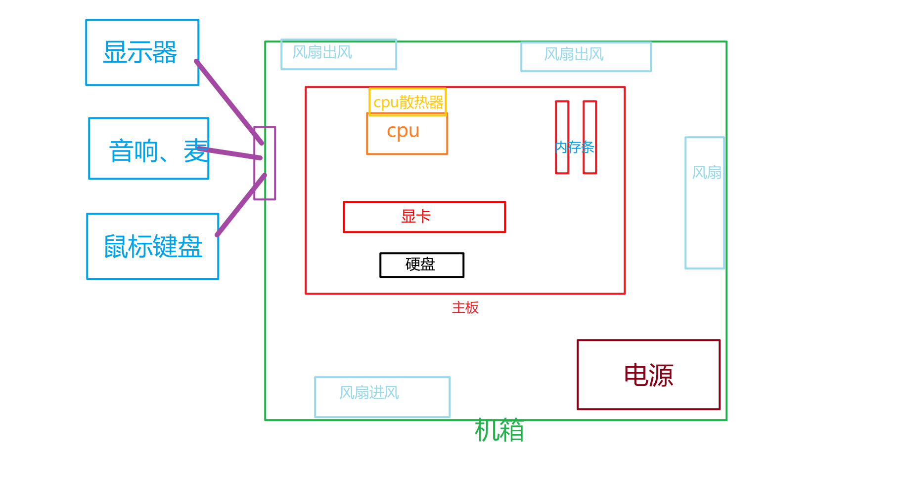

1. 显示器分辨率

   **1080P也就是FHD 1080P（1920X1080）**，P指的是屏幕的短边像素数，不管长边像素有多大，都以短边像素计量，比如这个1920x1080，长边有1920个像素点短边有1080个像素点，所以它被称为1080P。

   **2K里的K原来是数字电影的标准，**具体到数值上体现为屏幕横向像素达到2000以上的，主流的2K分辨率为2560x1440，全称Quad HD 2K，简称QHD 2K，像素能达到370万

   **4K也就是UHD 4K（3840x2160），4倍1080P的清晰度**，具体到数值上体现为为屏幕横向像素达到4000以上

   > 4K来源于电影播放的4096×2160分辨率，只是在更多的家用显示设备上不是电影的宽幅而略有缩水成了3840x2160。

2. 显示器频率

   刷新率英文全称Refresh Rate，它是指电子束对屏幕上的图像重复扫描的次数，可以理解为屏幕每秒刷新画面的次数。常见的刷新率有60Hz、144Hz、165Hz、240Hz。 60hz刷新率表示我们在1秒内显示60张图片，而144Hz表示屏幕将在1秒内显示144张图片，依此类推。**当然也并不是显示器支持高刷新率，电脑操作就一定无比流畅，还得看你的CPU、GPU和显卡是否跟得上**。比如显卡每秒只能输出60帧，那你120Hz的显示器，照样只能看到60Hz的效果。

3. 显示器频率和fps刷新率的关系

   首先显卡处理图像的时间是不均匀的，如60帧的画面显卡可能0.2秒处理了50幅画面，剩下的10幅画面可能花费了0.8秒，而一台60hz的显示器刷新的间隔是一定的，所以一个刷新周期，显卡可能向显示器传递了多幅画面，但显示器在一个刷新周期只显示了一幅画面，其他的画面就这样被“吞”掉了，也可能在好几个刷新周期里，显卡只传输出一幅画面，这时候就会造成卡顿，所以一般来说最好**显卡的FPS要大于显示器刷新率**，这样可以降低卡顿。

4. 总结装机过程

   1. 预算：

      1. 显卡：最低3060 -> 4060/3060ti (推荐)->3080 -> 3080ti/4070

         > 4060 : 价格2500，适合玩单机游戏  ； 3060ti：价格2000，适合玩网游(吃鸡)

         > 4060电压低、运行温度也低，有DLSS 3技术(深度学习)的支持

         > \- 如果你的主要需求是游戏且追求最高的帧率，建议考虑 3060 Ti G6X。
         >
         > \- 如果你关注未来的软件更新、效率以及可能的更低功耗，4060 是不错的选择

      2. cpu： i5-12490F -> **I5-> 13400F   -> i5-12600KF -> i5-13600K   ->  I5-14600K**、i7-13700K

         > 134、1349、126、144、1449，这五款处理器可以说是兄弟型号，核心规格都是一样的，并且频率上也都基本一致，这五款处理器的实际表现，也都相差不多，大家使用最多的场景，游戏，甚至是感觉不出来差距的，因此这五款处理器，谁便宜买谁即可。

         > 虽然12600KF可以支持3600以上的内存频率，但在实际的游戏表现上，并不能与13400F拉开差距，感兴趣的朋友们，也可以自行查看一下相关的横评对比，13400F在性能上并不落后多少，但在装机成本上却有着不小的优势，13400F仅需要和124相同的主板和散热就足够了，哪怕是H610的主板也足以满足功耗需求，不光CPU本身便宜，装机的成本上更是有着明显的优势，一套配置下来，差不多的性能，比12600KF节约个三五百块钱轻轻松松。

         > 12600KF+b760/660目前仅售1700左右。瞬间成为一个极为推荐的选择。

   2. 配置：

      | 配件        | 品牌                      | 价格 | 平台        |
      | ----------- | ------------------------- | ---- | ----------- |
      | 板U         | 铭瑄终结者B760M + 12600kf | 1610 | 拼多多      |
      | 显卡        | Radeon RX 7700 XT         | 3030 |             |
      | 内存条      | 金百达DDR4 16x2  3600     | 339  | 淘宝        |
      | 硬盘        | 宏基 1TB GM7              | 459  | 淘宝        |
      | 散热        | 乔思伯 1400 DV2 双塔      | 149  | 淘宝        |
      | 电源        | 利民 KG650W 金牌全模组    | 304  | 淘宝        |
      | 风扇        | 乔思伯 SL-120X5           | 140  |             |
      | 机箱        | 爱国者小岚屏显版          | 279  |             |
      | 音响+扬声器 | 惠普音响(带麦)            | 149  |             |
      | 工具        | 装机套装                  | 30   |             |
      | 显示器      | AHC猎鹰2代 2k 180hz       | 839  |             |
      | 总计        |                           | 7337 | 淘宝(180券) |

      > i5 13600最大功耗181W，[4060ti](https://zhida.zhihu.com/search?content_id=676237867&content_type=Answer&match_order=1&q=4060ti&zhida_source=entity) 显卡功耗160W
      >
      > 主板是否有wifi，是否需要重新买网卡
      >
      > 显示器根据显卡，2K就可以了，帧率一般3A锁60帧 ，建议144以上

   3. 图示：

      

   4. 装机顺序：

      1. 主板上安装：cpu-->内存条-->固态硬盘-->cpu散热器(涂硅脂、撕散热底座的片)
      2. 将主板安装到机箱中(根据主板型号，可能需要添加或者卸掉螺丝)
      3. 安装显卡
      4. 安装电源
      5. 主板供电：主板供电-->cpu供电-->显卡供电
      6. 机箱供电：usb线-->radio线-->启动线-->还有根串行线用来供机箱屏显
      7. 风扇供电：风扇有两个接口，一个是灯效接口另一个是电源；所有风扇的RGB接口(小4pin)接到一起插在RGB接口上，散热器上的风扇的电源串一起查到sys_fan接口上，其他风扇的电源串一起接到另一个fan接口上
      8. 安装操作系统，如果安装的时候提示需要联网，问AI通过终端解决先跳过
      9. 进去之后连网线或者通过usb下载wifi驱动，此时系统会自动更新下载可用的驱动
      10. 下载drivermanager软件进行扫描更新、补充驱动
      11. 灯效软件根据主板商提供的MaxSun神光同步软件进行设置灯效
      12. 关于显卡的驱动：去官网下载根据这个型号的显卡管理驱动软件，它会自动更新显卡驱动，并可以进行显卡设置

   5. 下载系统时：当直接打开微软系统助手下载界面，会打不开，此时手动将DNS设置为4.2.2.2即可打开