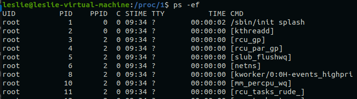

## 一、注意事项

1. 时间转换，修改为98版本的

2. 参数设置为可修改的，开放可修改接口

3. 中文注释多的时候使用 `/**/`

   > 原因：如果使用//可能会导致编码时影响到注释后面的代码

4. 变量名：

   ```
   类成员变量：m_XX
   ```

5. 写代码符合单一原则：即同一个类只负责该对象相关的功能

   > 比如暴力破解类和时间转换类

6. SDK版本：SDK版本是指开发者在开发应用时所使用的SDK的版本号。每个SDK版本都有其特定的功能和API

7. 一些常用单词

   ```
   1. parameter/param		参数
   2. backup			备份
   ```

8. `BetterComments`注释插件

   ```vscode
   #自带五种注释：
   
   // ! 红色的高亮注释
   // ? 蓝色的高亮注释
   // * 绿色的高亮注释
   // todo 橙色的高亮注释
   // // 灰色带删除线的注释
   // 普通的注释
   
   
   /**
     // ! 红色的高亮注释
     // ? 蓝色的高亮注释
     // * 绿色的高亮注释
     // todo 橙色的高亮注释
     // // 灰色带删除线的注释
   */
   ```

   ```
   #手动添加注释格式：
    打开VScode的settings.json文件，添加高亮注释或者修改注释颜色
   ```

9. vscode导入头文件爆红的解决方式

   > 删除 `.cache/vscode-cpptools` 清理磁盘空间时导致 VS Code 找不到头文件

   1. 重启 VS Code (`Ctrl + Shift + P -> Reload Window`)
   2. 重新安装 C/C++ 插件
   3. 手动刷新 IntelliSense (`Ctrl+Shift+P -> Rescan Workspace` 、`Reset IntelliSense Database`)
   4. 检查 `c_cpp_properties.json` 是否正确
   5. 删除 `.vscode` 目录并重建**

10. VScode快捷键：

    ```
    ctrl+p			#用于快速查找并打开文件快捷键
    Ctrl+Shift+P	#用于打开命令面板，你可以通过它运行任何命令、设置或插件功能
    ctrl + ` (esc下面那个) #打开终端
    ctrl + 左键	   #进入函数
    ctrl + alt + -	#默认返回函数，这个-不能用小键盘上的
    alt + leftarrow(左箭头)  #修改后的返回函数快捷键 
    选中代码->`ctrl+[`  / `ctrl+]`  #代码整体缩进或者右移：
    ctrl+G			#vs里面查找某一行快捷键
    ctrl+,			#打开setting设置
    
    ctrl+k   ctrl+s			#设置快捷键
    ```

11. ubuntu快捷键

    ```
    ctrl + L		# 清屏快捷键等同于clear
    ctrl + A		# 移动到光标最左边
    ctrl + E		# 移动到光标最右边
    ```

12. 远程文件拷贝

    ```
    scp file.txt user@remote_host:/path/to/destination/
    scp JYNSAFED libJYVirusScan.so leslie@192.168.3.96:~/
    # file.txt 是本地文件。
    # user@remote_host 是远程主机用户名和地址。
    # /path/to/destination/ 是远程主机上的目标路径。
    
    scp -r <fileDocument>  user@remote_host:/path/to/destination/
    # 如果是文件夹需要加上-r参数
    ```

13. ubuntu给非root用户添加sudo权限

    ```
    #方式一：
    	# 为用户username添加sudo权限
    	sudo usermod -a -G sudo username
     
    	# 去除用户username的sudo权限
    	sudo usermod -G usergroup username
    
    #方式二：
    	sudo vi /etc/sudoers
    
    	#在root的下面增加下面这行
    	chenye    ALL=(ALL:ALL) ALL
    ```

14. ubuntu下查看本地的包

    ```
    dpkg -l | grep <包名>
    ```

15. `dpkg -b` 命令用于 **构建** 一个 Debian 包（`.deb` 文件），它将指定的目录或源文件打包为一个 `.deb` 文件。

    ```
    dpkg -b <目录> [<输出文件>]
    ```

16. ubuntu下卸载使用包管理模式安装的包

    ```
    sudo apt remove --purge <包名>
    sudo apt autoremove
    	#remove：卸载软件包。
    	#--purge：同时删除与软件包相关的配置文件。
    	#autoremove：清理未使用的依赖项。
    ```

17. linux授权指令

    1. `chown`命令用于更改文件或目录的所有者和/或所属组

       ```
       chown [OPTION] OWNER[:GROUP] FILE
       # sudo chown -R leslie normal_develop	
       # OWNER：新的所有者用户名或用户ID。
       # GROUP：新的组名或组ID（可选，如果不提供，则不会更改组）。
       # FILE：要修改的文件或目录。
       # OPTION：可选项，常用的选项有 -R（递归修改目录和其内容的所有者）
       ```

    2. `chmod`（change mode）命令用于更改文件或目录的权限。权限决定了谁可以读取、写入或执行文件

       ```
       chmod [OPTION] MODE FILE
       # MODE：设置文件权限的方式，可以使用符号模式或数字模式来指定权限。
       # FILE：要修改权限的文件或目录。
       # OPTION：常用选项包括 -R（递归修改目录及其内容的权限）
       
       chmod +x <file>		// 如果+前面不加所属人，那么默认是所有
       chomd -R 777/+x	<filedocument>   // 对目录加-R，则递归授权 
       ```

18. ubuntu终端复制粘贴快捷键

    ```
     Ctrl+Shift+C
     Ctrl+Shift+V
     Ctrl+Shift+W		//关闭当前终端选项卡
     Ctrl+Shift+T		//在当前终端窗口中打开一个新的选项卡
     Ctrl + Page Down	//切换到下一个标签页
     Ctrl + Page Up		//切换到上一个标签页
 Alt + 数字		  //直接跳转到特定标签页
     
     Ctrl+Alt+T			//打开一个新的终端窗口
    ```
    
    

## 二、项目框架

### 2.1 客户端层次

1. 客户端整体框架层次分布

   ```
   1. UI界面层和Model层合称为人机交互层(RJJH)
      		UI界面层:界面和弹窗
     	    UI moudle层:通过IPC与助手通信，并使用信号槽与UI层建立通信
   3. 组件层与插件层合称为助手层(safed)
      		组件层(component): 主要复用的功能，包括与UI和中控之间信息交换、升级、任务队列等功能
      		插件层(plugin)：不同独立的功能封装为一个插件，使用组件的功能与UI和中控进行信息交换(用的其实		   				  还是组件的功能，需要走组件)。
   4. ZDFY和GJCZ层：助手调用这两个执行文件的功能
   		ZDFY主要负责系统防护和数据防护；
   		GJCZ是实现扫描功能(插件scan只是调度GJCZ)；
   		两个可执行文件开启系统后就在后台启动。
   		
   		
   src_2.0的具体分布
   1. moudles模块：PostDataReport
   			   UploadFile
   			   ZyScanPlug
   			   virus_scan_engine_plugin	
   2. oem: 贴牌文件夹
   3. qt_ui: 前端界面文件：RJJH 主界面
   					  Udish_protection U盘界面
   					  ZyUpdateUi 升级界面
   					  cur_user 跟用户相关？
   4. safed: 助手层
   5. tools: 工具文件夹
   ```

2. 组件(`modules/component`)主要是一些共用的功能模块，插件(`plugins`)是单独的可以增加、去掉的模块。比如不同的插件都可以使用组件里的认证、防护日志、任务管理、定时任务、更新等

3. `include`文件夹里面主要包含的是定义的头文件，把复杂的头文件/接口摘出来

4. `common`文件夹里面主要包含的是整个项目封装好的工具类，比如`nlohman`(`json`文件)、`thread`(线程)、`utils`(工具包，各种时间、类型转换)、`epoll`(`io`相关)

5. 组件实现方式与插件类似，都是接口`impl`和实现分离。

6. `src2.0/oem`文件夹下面是实现不同品牌的贴牌图片和贴牌脚本。当打包时就会根据版本类型替换对应的skin图标文件


### 2.2 RJJH层

#### 2.2.1 UI层

> 该层主要负责各种界面和弹窗的界面文件，并使用信号槽与model层之间建立通信。

1. UI的FramelessWindow：构造函数内部除了建立信号槽以外，末尾部分调用了各model的请求函数，向safed/中控发出请求，并在内部有接收函数，进而刷新后台数据展示到界面

   ```
   m_pTerminalInfoModel->requestTerminalInformation();
   m_pScanModel->requestScanProcessResult();
   m_pTerminalAuthModel->requestTerminalAuthorizeInfo();
   m_pUIConfigModel->requestTerminalConfigInfo();
   m_pProtectLogModel->slotRequestProtectLogInfo(10);
   m_pUpgradeModel->terminalVersionInfoRequest();
   ```


#### 2.2.2 UI Model层

> 该层主要负责UI层与助手层之间的交互，接收到助手层消息后发送信号到UI界面


### 2.3 插件层/助手

#### 2.3.1 通述

1. 组件(`modules/component`)主要是一些共用的功能模块，插件(`plugins`)是单独的可以增加、去掉的模块。比如不同的插件都可以使用组件里的认证、防护日志、任务管理、定时任务、更新等

2. mingfei代码属于是让功能类继承CGeneralOperator,CGeneralOperator需要有参(IGeneralOperator)构造，然后在接口处初始化时直接让该功能类使用传来的IGeneralOperator进行构造。由于功能类继承于CGeneralOperator，所以可以使用其定义的函数进行与前端交互。

   > 接口类继承于CPluginHelper，该类继承于CPlugin和CGeneralOperator，所以接口类也可以使用插件类的函数和前端交互的函数

   kongbin代码属于是类的聚合，定义一个总类，里面包含功能类和CGeneralOperator(与前端交互类)实现功能互用

4. 插件对象，子类可以当作父类传入实现多态。

6. 组件/插件开启时使用线程

   ```
   JYThread::autoRun(std::bind(&CTaskManagerComponentImpl::taskQueueDistribution, this));
   ```

5. 组件之间通信都是靠`message_center`的发布-订阅模式进行传递消息并执行相应操作。给组件传递消息是通过`plugin_manager`的注册消息订阅以及对回调时对不同插件调用`onNewNotify`函数

6. core中插件管理是通过使用动态库来使用不同的插件类的。(`dlopen、dlclose`)

#### 2.3.2 运转核心/core

##### 1. 组成部分

```
1. 组件管理component_manager:包括创建所有组件接口、启动接口
2. 插件管理plugin_manager:包括加载conf文件配置、启动插件、注册消息订阅
3. 插件配置plugin_config:负责从conf文件中读取插件配置
4. 消息订阅message_center:消息的订阅和分发(组件和插件都使用)
5. 核心接口core_impl:将main函数的功能封装为接口，包括启动组件和插件等功能
6. 帮助类bussiness_helper:查看加载模块以及执行命令行等操作
7. main:safed执行主函数
```

##### 2. 组件管理 `component_manager`

```
1. 通过createComponent创建对应组件接口实例，并将他们插入到std::vector<std::shared_ptr<IComponentInterface>>中
2. 统一进行开启，释放
```

##### 3. 插件管理`plugin_manager`

```
loadPlugin：根据plugin.conf加载插件到map中(通过dlsym读取动态库的方式、获取到插件接口的CreatePlugin函数创建插件接口实例)
enablePlugin：遍历map，依次启动插件的init和start，并注册消息订阅，触发消息时执行publishPlugin
unloadPlugin：根据插件名称卸载插件
disablePlugin: 停止所有插件，启动插件的stop和release
publishPlugin：找到对应插件，执行对应插件的onNewNotify操作
```

##### 4. 消息队列`message_center`

用于消息的订阅和发布，提前订阅好(subscribe)，就可以根据key执行发布(publish)；比如任务队列中，从任务队列中获取到任务，将key和value封装为Buddle，通过publish从消息处理队列中(m_handlers)执行绑定过的函数(包括向组件(terminal_detatil)中执行中控下发信息填写命令、向插件(Scan)中执行扫描任务等)。

1. 实现：封装一个任务队列，里面保存的是处理函数。发布时使用线程池多线程执行

```
#MessageHandler 是一个可以接受指向 IBundle 类型的指针 pBundle 的函数的类型别名
using MessageHandler = std::function<void(IBundle *pBundle)>;
#第二个参数是一个处理消息的回调函数，类型为之前定义的 MessageHandler
virtual void subscribe(const std::string &messageType, MessageHandler handler) = 0;

#消息队列，使用时用多线程并行处理
std::unordered_multimap<std::string, MessageHandler> m_handlers;
```

2. 订阅：提前将key和处理函数加入消息队列中

```
#subsrcibe实现：
void CMessageCenter::subscribe(const std::string &messageType, MessageHandler handler)
{
    std::lock_guard<std::mutex> lock(m_mutex);
    m_handlers.insert({messageType, handler});
}

#实际订阅使用时可以用lambda
m_pMessageCenter->subscribe("REPORT_USER_INFO", [this](IBundle *pBundle) {
        registerResetRequest(pBundle);
});
```

3. 发布：需要发送时，根据key，执行key对应的处理函数

```
#m_Pool是线程池，在message_center初始化时就创建好了。把处理函数放到线程池
m_pPool->submit([this, pBundle]() {
        std::string messageType = BundleHelper::getBundleAString(pBundle, JYMessageBundleKey::JYMessageType, "");
        if (messageType.empty()) {
            return;
        }
        std::lock_guard<std::mutex> lock(m_mutex);
        const auto &range = m_handlers.equal_range(messageType);
        for (auto it = range.first; it != range.second; ++it) {
            it->second(pBundle);
        }
        pBundle->release();
    });
```


#### 2.3.3 组件/component

##### 1. 组成部分

1. 组件接口/抽象：

   ```
   1. CGeneralOperatorImp: 初始化创建不同组件的功能对象(非组件接口impl)；所有组件的接口使用组件功能类时都通过该类获取到功能对象
   
   2. CComponentInterface: 
   	组件的总接口CComponentInterface，继承于IComponentInterface(接口类，定义虚函数初始化、开启、停止、释放等);所有的组件impl都继承于这个类。
   	初始化时需要CGeneralOperatorImpl和IMessageCenter
       自己定义模板返回创建组件接口impl对象、sendToUi向UI层发送消息这两个函数
   
   3. CGeneralOperatorAdapter: 向插件层提供组件的功能，在core下面的插件管理，将该类传递作为插件初始化参数。
   	CGeneralOperatorAdapter继承于IGeneralOperator(运转通信总类)，要实现各类通信包括向UI层、中控发送消息等。
   	初始化函数中接收CGeneralOperatorImpl对象为自己的不同组件对象赋值。重写IGeneralOperator的所有函数供插件使用
   ```

2. 组件和插件之间的交互：

   ```
   #插件启动时pluginInit需要接收IGeneralOperator(实际传输CGeneralOperatorAdapter)来实现使用组件的所有功能
   #coreImpl: init时将组件和插件都初始化，插件使用组件初始化后的CGeneralOperatorAdapter
   #插件继承CPluginHelper，该类继承于IPlugin(插件接口类)和CgeneralOperator(组件所有功能类，该类继承IGeneralOperator，并需要一个IGeneralOperator对象初始化，实际给插件初始化传输的是实际传输CGeneralOperatorAdapter)
   ```

3. 组件成员

   ```
   authorize组件：“授权”组件：实现各种认证、版本信息、病毒库信息、引擎信息、授权信息等
   config:组件：实现“配置”信息；接收界面、中控下发的配置(UI设置界面里面)并相互转发转发配置
   ctrl_center组件，实现“中控连接”以及向中控发送信息、上报中控(asyncReport)
   local_service组件：“连接代理-IPC”：向UI层发送信息(sendMsgTo),获取界面连接状态、IPC实现与界面通信
   protect_logger组件：“防护日志”：实现UI层面的日志上报和详细日志上报(recordProtectionLogs)
   timed_tasks组件：实现注册”定时任务“(registerTask)
   task_manager组件：实现”任务队列“(添加、删除任务到任务队列)
   upgrade组件：“升级”：实现软件和病毒库更新。没有在general_Operator_impl中定义(插件用不了)。
   terminal_details组件：”终端详情“组件；实现填写用户信息、更新用户信息、授权、密码文件等功能。
   	1. 在init初始化时就通过messageCenter订阅，待任务队列到达他们时再pulish
   	2. registerResetRequest，接收到中控消息，任务队列中执行插入任务
   	3. registerResetResponse，收到UI层传来完成信息，任务队列中关闭掉任务
	virus_scan_engine组件(之前的gjcz)：”病毒扫描引擎“
       1. 调用引擎服务(调用src2.0/moudle/svirus_scan_engine_plugin/include/scan_engine_api里面提供的接口)，进行病毒文件的扫描、病毒文件清理、恢复、获取病毒文件信息等
   	2. 该接口具体是由virus_Scan_plugin_helper进行对接口实例的实现，具体使用		     了"lib/modules/libJYVirusScanEnginePlugin.so"动态库(该动态库就在该include文件夹下面的cmakelist中创建的)，使用GetEnginePluginIns函数返回的  GetEnginePluginIns对象进行启动引擎、扫描任务、病毒清理等功能
   ```
   
   

##### 2. 更新组件/upgrade

更新组件分为软件更新和病毒库更新

1. `calback`(反馈)用来通信，与客户局端(前端界面)传递信息

   ```
   update_callback_interface.h接口
   update_callback.h实现接口功能
   ```

2. `soft`软件更新

   ```
   download:下载文件
   update_console_client更新用户界面
   ```

3. `virus`病毒库更新


##### 3. 任务队列/task_manager

所有中控下发的扫描任务都通过`Scan`插件接收，放到(`task_manager`组件)任务队列，若没有正在执行的任务时直接执行，否则等待`task_manager`组件根据队列给`Scan`插件下发任务。

```
1. 涉及component下面的task_manager组件
2. impl定义组件的接口，包括初始化、任务分发(publish)等
3. task_manager组件：
	1. TaskManagerConfigInfo 优先级任务队列配置信息
	2. CTaskManagerConfig 管理配置信息，包括从config文件下加载、map存储、匹配
	3. TaskManagerInfo	任务的信息
	4. CTaskManager	管理任务队列，通过key找任务
4. 下发执行：task_manager_component_impl:任务管理组件的接口，包括start、stop、等，启动时会开启一个线程(obtainDistributionTask)，每秒遍历任务队列，将end字段的任务移除队列，如果没有正在执行的任务，那就从task_manager的队列中取出任务发送(publish)给Scan插件(/通过MessageCenter发送)。
5. 接收入队：Scan插件：接受中控的下发请求信息(插件中的onMessageNotify)，并尝试交付给m_pTaskManager的taskExecutionBegins函数进行任务执行，有过有正在执行的任务，那么清除低优先级任务后添加到队列中，如果没有就直接返回true开启执行
6. 执行扫描：在scan插件中：impl接口类中继承了CPluginHelper(其继承于Cplugin，实现插件的初始化、开启、结束等)，init初始化插件需要传入IGeneralOperator通信父类，而组件的CGeneralOperatorAdapter继承于IGeneralOperator，所以可以传入子类代替父类，从而在scan插件接受到执行扫描任务时(通过onNewNotify)通过scan_task任务分发，通过scan_flow执行不同的scan任务，并检测该任务是否正在运行(退出不执行扫描)、是否成功结束(将任务状态字段改为end)
```


#### 2.3.4 插件/plugin

##### 1. 组成部分

```
1. common: 公用的功能代码：比如把病毒库升级功能放入此处
2. scan: 扫描插件
3. net_protection: 网络防护
4. udisk_protcetion: U盘防护
5. virus_library_management: 病毒库升级管理
6. systemctl_controller: 系统控制
7. file_shredder: 文件粉碎
8. zdfy: 主动防御

#每个插件都实现了插件接口，用来调用功能类。如果只是单个插件使用该功能就直接写入一个文件夹。如果多个插件使用该功能就写到comon中共同调用。
```


##### 2. 扫描插件/scan

关于隔离区数据上报与中控的逻辑：版本号初始可能为空，每次收到中控下发指令比较并保存该版本号，如果说版本号不同那么就上报所有隔离区数据

扫描插件逻辑：

```
1. imp:插件，封装为插件形式启动、关闭、接受ui点击/中控 下发的信号key和msg。#里面包含task和flow两个成员对象，task初始化任务列表、flow作为功能核心
2. task_process: 工厂模式，任务类，当imp收到消息，则创建对应key的处理对象进行相应处理
3. flow_controller: 功能核心，task使用imp初始化的flow进行flow的初始话，并调用flow的处理函数进行处理
4. black： 黑名单模块
5. trust: 白名单(信任区)模块
6. isolate: 隔离区模块
7. scan_count: 查杀的状态、任务计数等信息
8. gjcz_scan: 负责与gjcz交互，gjcz实现查杀功能；包含：
	1. app_scan: 扫描服务，根据扫描文件路径进行扫描
    2. ScanPostman: 负责与gjcz之间通信(包括暂停、继续、清理等)
9. post: 上报服务，(上报client_action到中控)
# 4-9全部作为flow的成员对象进行任务处理调度
```


#### 2.3.5 公用/common

`common`文件夹里面主要包含的是整个项目封装好的工具类，比如`nlohman`(`json`文件)、`thread`(线程)、`utils`(工具包，各种时间、类型转换)、`epoll`(`io`相关)

```
1. framewor框架：里面定义了插件接口头文件、实现插件使用组件功能的接口抽象
2. epoll：I/O 多路复用机制
3. clipp： C++ 库，用于构建命令行解析器，程序启动的时候可以带参数
4. thread多线程：里面包含使用线程的的模板函数(jy_thread)、
				线程管理类(managed_thread)(需要继承并实现run 和 release)、
				线程池(thread_pool)
5. utils工具： 定义了类型转换、
			  时间相关、
			  文件相关、
			  JSON对象的写入和读取文件(nlohman)、
			  安全队列、
			  单例模板(singleton)、
			  string转换、
			  获取本机信息(sys_utils)
```


### 2.4  数据传输

数据传输方式有`protobuffer`和`Json`格式，作为项目中的数据传输类型

##### 2.4.1 protobuffer

1. protobuffer的格式

   ```
   message xxx {
     // 字段规则：required -> 字段只能也必须出现 1 次
     // 字段规则：optional -> 字段可出现 0 次或1次
     // 字段规则：repeated -> 字段可出现任意多次（包括 0）
     // 类型：int32、int64、sint32、sint64、string、32-bit ....
     // 字段编号：0 ~ 536870911（除去 19000 到 19999 之间的数字）
     字段规则 类型 名称 = 字段编号;
   }
   ```

2. 接受时解序列化

   ```c++
   NetProtectC netProtectConfig {};				#NetProtectC是protbuf生成的class
   netProtectConfig.ParseFromString(msgData)
   ```

3. 传递时候的序列化(转字符串传输)

   ```c++
   ReportProtect report;				#ReportProtect是protbuf生成的class
   report.SerializeAsString() 或 report.SerializePartialAsString()
   ```

4. 获取非重复非嵌套字段

   ```
   直接.加类型名()
   ```

5. 获取重复字段

   ```c++
   #遍历
   #获取重复次数：字段名_size()
   #获取第i个：processData.infolist(i)
   HmiToScan::VirusDataProcess processData {};
   if (!processData.ParseFromString(msgData)) {
        return false;
   }
   for (int i = 0; i < processData.infolist_size(); i++) {	 
       const HmiToScan::VirusDataProcess::VirusInfo &info = processData.infolist(i);
       if (info.action() == HmiToScan::VirusDataProcess_ProcessAction_TRUST_ADD) {
       m_pScan->virusScanProcessTrustAdd(info.data());
   ```

6. 获取非重复嵌套字段

   ```c++
   #点就完事
   scanNotify = commonC.notification().scan().status()     
   ```

7. 设置非重复非嵌套字段

   ```c++
   #set_字段名
   Person person;
   person.set_name("Alice");  // 设置名字
   person.set_age(30);        // 设置年龄	 	
   ```

8. 设置重复嵌套字段

   ```c++
   #先定义嵌套字段类型，再给该类型set数据
   ClientIsolationAreaInfo isoMsg{};
   #使用add
   ClientIsolationAreaInfo::InfectInfo* isoInfo = isoMsg.add_infects();
   isoInfo->set_infect_name(info.param.virusname);
   isoInfo->set_file_name(info.param.path);
   isoInfo->set_isolate_time(info.m_time);
   isoInfo->set_md5(info.param.md5);
   ```

9. mutable_ 

   ```c++
   // 获取指向嵌套 Address 消息的指针，并设置其字段。
   Address* addr = person.mutable_address();  
   addr->set_city("New York");
   addr->set_zip("10001");
   ```

10. add_和mutable\_的区别

    ```c++
    add_address()：向 repeated 字段中 新增一个地址。
    mutable_address(index)：获取并修改指定索引处的地址。
    address(index)：只读访问指定索引处的地址。
    ```

11. 枚举类型直接通过下标_获取

    ```c++
    #如果protoc文件定义了package必须用包名::后面的下标路径；
    #如果没有则不需要加包名，直接使用后面的下标路径
    HmiToScan::VirusScan_ScanType_THREAT_CLEAN
    ```

12. protobuf的msg使用二进制类型byte(可以根据不同类型放置不同`message`)和一个`type`(枚举类型)，就可以根据不同的type的message进行解析

    ```
    1. SerializeAsString() 是 Protocol Buffers 提供的一个方法，能将整个消息（包括嵌套的 message 和 bytes 字段）序列化为一个字符串（即字节流）。
    2. 序列化后的数据可以存储或传输，接收方可以使用 ParseFromString() 方法反序列化
    
    message MyMessage {
        bytes data = 1;  // 字节数组类型的字段
    }
    #示例：
    // 创建消息对象
    MyMessage message;
    // 创建字节数据（比如从某个文件读取）
    std::string byte_data = "Hello, Protocol Buffers!";
    // 将字节数据赋值给 `data` 字段
    message.set_data(byte_data);
    // 将消息序列化为字符串
    std::string serialized_data = message.SerializeAsString();
    
    ```

13. 关于`protobuffer`初始化

    ```
    #protobuffer中定义的结构体
    message Person {
        string name = 1;
        int32 id = 2;
    }
    #proto自动生成的类
    class Person {
    public:
        Person() {
            name = "";
            id = 0;
        }
        std::string name;
        int id;
    };
    
    Person person = { "John", 123 }; // 使用默认构造函数初始化，并通过列表初始化指定字段值
    Person person;  // 使用默认构造函数，字段为默认值
    Person person{}；/ 值初始化 的方式，这意味着该对象会被默认初始化为其类型的默认值。等同于上句
    ```

    1. 对于 **Protocol Buffers** 生成的类（如 `Person`），protobuf 会为每个字段提供默认值
    2. protobuf 生成的 C++ 类支持列表初始化和通过构造函数进行初始化的功能，原因是 C++ 标准库支持了 **聚合初始化** 和 **初始化列表** 语法。
    3. 如果你使用 `{}` 来初始化 `Person` 类型的对象，它会通过默认构造函数初始化对象，字段会被赋予其 **默认值**（例如，`name` 为 `""`，`id` 为 `0`）。对于普通 C++ 类，构造函数的默认行为可能不会自动为每个字段赋值，你必须手动初始化，除非你自己为其提供默认构造函数。

    4. `Person person{};` 是一种使用 **统一初始化** 语法（uniform initialization）来初始化对象的方式，这种语法是 C++11 引入的。`Person person{};` 等价于 `Person person;`，但更明确地表示 **值初始化**

    ```
    #C++11值初始化
    int d(20); 	
    int age{20};
    #C++11初始化列表
    int c = {1001};
    ```

14. protobuffer中`HmiToHelper::TerminalAuthorizeSession_Response` 和 `HmiToHelper::TerminalAuthorizeSession::Response` 是一个效果，都是嵌套的结构。`_`是`::`的别名，两种proto的生成风格，一般都会生成两套，所以都可使用。

15. protobuf使用枚举字段、使用（取值、赋值）

    ```
    HmiToScan::VirusScan_ScanType_THREAT_CLEAN
    ```

16. 关于protobuffer的枚举类型指针，反向获取枚举类型名

    ```c++
    #获取枚举类型描述符
    const google::protobuf::EnumDescriptor *descriptor = HmiToScan::VirusScan_ScanType_descriptor();
    #通过枚举数值反向找该数值对应描述符
    const google::protobuf::EnumValueDescriptor *enumValueDesc = descriptor->FindValueByNumber(static_cast<int>(scanMessage.scan_type()));、
    #通过name()函数得到string类型的类型
    enumValueDesc->name()
    ```

17. protobuffer打印出来为空

    这可能是由于 `SerializeAsString()` 方法默认序列化到二进制格式，直接打印到日志时会因为它是不可读的二进制数据而显示为空，实际进行protobuffer转换是可以输出的。

##### 2.4.2 Json

1. 使用Json传递数据时，使用`dump()`函数转换为字符串

   ```c++
   //使用json传递数据
   std::string pass_timer = (m_alertTImer.status().lock()) ? "0" : std::to_string(m_alertTImer.timer());
   	nlohmann::json report = {
   		{"actionOp",std::to_string(m_op)},
   		{"protectProject","网络防护"},
   		{"protoType","SSH远程登陆协议"},
   		{"ipAddress",ip},
   		{"alert_time",pass_timer}
   	};
   	sendInfoToUI(report.dump());
   ```

2. 接受json数据

   ```c++
   void ZyHipsDialog::updateNetProDlg(const QByteArray &data){
   QJsonDocument doc = QJsonDocument::fromJson(data.data());
   QJsonObject rootObj = doc.object();
   int actionOP = rootObj.value("actionOp").toString().toInt();
   QString protectProject = rootObj.value("protectProject").toString();
   QString protoType = rootObj.value("protoType").toString();
   QString ipAddress = rootObj.value("ipAddress").toString();
   ```

##### 2.4.3 protobuffer和json的区别


### 2.5 日志

1. 导入qlog库，使用LOG日志记录

   ```
   #include "glog/logging.h"
   ```

2. 开启日志打印

   ```
   vim /opt/apps/chenxinSd/etc/LogConf.ini
   Debuglevel = 0;
   ```

3. 使用LOG打印日志

   ```
   #google::InitGoogleLogging(argv[0]);：初始化 glog 日志系统。
   
   LOG(INFO) << "This is an INFO message.";			#黑色
   LOG(WARNING) << "This is a WARNING message.";		#黄色
   LOG(ERROR) << "This is an ERROR message.";			#红色
   
   #google::ShutdownGoogleLogging();：在程序退出前清理并关闭日志系统。
   ```

   1. **`LOG(INFO)`**：输出信息级别日志。**场景**：用于记录**正常的程序执行信息**。它表示程序按预期工作，没有异常情况。常用于打印一些程序流程、状态信息、统计数据等。
   2. **`LOG(WARNING)`**：输出警告信息。**场景**：用于记录**非致命的异常情况**或潜在问题。这些问题不会导致程序崩溃，但可能影响性能、用户体验，或者暗示更严重的问题可能即将发生。
   3. **`LOG(ERROR)`**：输出错误信息。**场景**：用于记录**严重的错误**，这些错误会导致程序某些功能失败，甚至崩溃。通常表示程序中无法忽略的错误。
   4. **`LOG(FATAL)`**：输出致命错误并终止程序。`LOG(FATAL)` 表示**不可恢复的错误**，程序在记录该日志后会**立即终止执行**。它用于捕捉那些使程序无法继续运行的严重错误，通常表示逻辑问题或异常情况无法修复。

   > 使用 **`LOG`** 宏时，不需要手动添加换行符。它会**自动在每条日志末尾添加换行符**，确保每一条日志信息在新行中打印。


### 2.6 数据库

##### 2.6.1 SQlite

1. sqlite的常用命令

   ```
   sqlite3 <数据库.db>
   .tables   #查看所有表
   SELECT * FROM TABLE;    #类似于sql语句,注意需要加分号
   .quit 
   .exit	#退出
   
   ```

2. 项目中sqlite的路径

   ```
   /opt/apps/chenxinsd/cache/xxx.db
   ```

3. Sqlite3查看表的结构

   ```
   PRAGMA table_info(table_name);			#在Sqlite下
   ```

   ```
   #表的结构如下
   cid   name        type       notnull   dflt_value   pk
   0     id          INTEGER    1         NULL         1
   1     name        TEXT       0         NULL         0
   2     age         INTEGER    0         NULL         0
   cid: 字段的序号（从 0 开始）。
   name: 字段的名称。
   type: 字段的数据类型。
   notnull: 是否允许 NULL 值（1 表示不允许）。
   dflt_value: 默认值。
   pk: 是否为主键（1 表示是主键）
   ```

4. C++提取Sqlite3数据库的两种方式

   ```c++
   #方式一：使用sqlite3_get_table函数
   
   /**
    * @brief: 读取sqlite表中数据
    * @param db: 打开的数据对象
    * @param zSql: 命令
    * @param pazResult: 读到的数据
    * @param pnRow: 行数
    * @param pnColumn: 列数
    * @retval: sqlite3_get_table的返回值
    */
   int jy_sqlite_get_table(sqlite3 *db, const char *zSql, char ***pazResult, int *pnRow, int *pnColumn)
   {
       int res;
       char *err_msg;
       res = sqlite3_get_table(db, zSql, pazResult, pnRow, pnColumn, &err_msg);
       if (res != SQLITE_OK)
           LOG(ERROR) << "CDBTimedTasksOper Select! err:[" << err_msg << "]";
       if (err_msg)
           sqlite3_free(err_msg);
       return res;
   }
   ```

   ```c++
   #方式二：使用sqlite3_exec函数
   
   bool CTerminalDetailsCache::setLastScanInfo(const std::string &result, const std::string &time)
   {
       if (!m_sqlite) {
           return false;
       }
       char *errmsg = nullptr;
       char sql[1024] = {0};
       snprintf(sql, sizeof(sql), "UPDATE terminal_details SET last_scan_result = \"%s\", last_scan_time = \"%s\" WHERE id = 1;", 
                result.c_str(), time.c_str());
       int rc = sqlite3_exec(m_sqlite, sql, nullptr, nullptr, &errmsg);
       if (rc != SQLITE_OK) {
           sqlite3_free(errmsg);
           return false;
       }
       return true;
   }
   ```

   

### 2.7 编译

1. 详见**CMakelist**，打包so文件，即动态库

   > 1. `cmake` 只是**配置工具**；执行cmake会根据cmakelist(项目的配置)生成对应的makefile文件，供make使用
   > 2. `make` 负责实际的**构建**工作（**编译、链接**）。它根据 `Makefile` 文件中的规则和依赖关系，检查哪些部分需要重新构建，生成最终的可执行文件或库。

2. 将编译好的文件移动到程序目录下

   ```
   cd Output/bin2.0/JingyunSd_linux_2/bin/X86_64/
   
   sudo cp cur_user JYNGJCZ2 JYNRJJH2 JYNRJJH2-UTRAY1 JYNSAFED JYNZDFY2 JYUpdateUI /opt/apps/chenxinsd/bin/
   
   sudo cp libglog.so.0.3.5 libkvcache.so libnetplugin.so libPostDataReport2.0.so libSysMonManage.so libZyAuthPlug.so libZyAVCache.so libJYVirusScanEnginePlugin.so libZyUploadFile.so  /opt/apps/chenxinsd/lib/modules/
   
   sudo cp libJYFileShred.so libJYNetProtection.so libJYSystemController.so libJYUDiskProtection.so libJYVirusScan.so libJYZDFY.so libJYVirusLibraryManage.so libJYClientUpgradeManage.so /opt/apps/chenxinsd/lib/plugins/system/
   ```

3. 什么时候需要重新执行cmake和make

   > 当更改了cmakelist中的库依赖、文件路径等需要重新对项目进行cmake
   >
   > 若只修改了代码并没有改变项目架构，那么只需要执行make编译就可

4. Cmakelist添加头文件路径时，要指定到最终的文件夹下，不然还是找不到头文件。(它只会在你指定的那个而文件夹下面找头文件)

5. `.cmake`文件：后缀是 `.cmake` 的文件是 **CMake** 使用的脚本文件，通常用于定义构建系统的配置、设置变量、导入/导出目标以及包含其他模块

   ```
   include(MyCustomFile.cmake)				
   #在cmakelist中使用cmake脚本
   #在 .cmake 文件中定义的变量和函数会被导入当前的 CMake 环境
   ```

6. cmake脚本和cmakelist的区别:

   1. `CMakeLists.txt`：用于描述项目的构建规则，是项目的入口文件
   2. `.cmake` 文件：通常是辅助文件，提供模块、工具或特定功能的实现，`.cmake` 文件通过 `include()` 或其他机制被调用

7. cmakelist中的list类型：

   ```
   list(APPEND ...) 命令用于将新的路径添加到现有的列表中
   ```

   ```
   set(CURL_LIB_PATHS)    
   if(EXISTS "${CX_THIRD_PARTY_DIR}")
   	list(APPEND CURL_LIB_PATHS "${CX_THIRD_PARTY_DIR}/curl-7.81.0_prefix/lib")
   	list(APPEND CURL_LIB_PATHS "${CX_THIRD_PARTY_DIR}/curl-7.81.0_prefix/lib64")
   else ()
   	list(APPEND CURL_LIB_PATHS "${CX_ARCHIVE_DIR}/curl-7.81.0_prefix/lib")
   	list(APPEND CURL_LIB_PATHS "${CX_ARCHIVE_DIR}/curl-7.81.0_prefix/lib64") 
   endif()
   ```

8. cmakelist中使用`find_library` 命令查找指定的库文件并将其路径存储到变量中

   ```
   find_library(<VAR> NAMES <name> PATHS <path1> <path2> ... NO_DEFAULT_PATH)
   <VAR>：存储找到的库路径的变量名。例如，这里是 LIB_CURL 和 LIB_CPR。
   NAMES <name>：要查找的库的名称。例如：
   	curl 表示要查找的 curl 库。
   	cpr 表示要查找的 cpr 库。
   PATHS <path1> <path2> ...：指定库的搜索路径列表。
   NO_DEFAULT_PATH:限制只能从指定的路径列表下搜，如果不设置的话若找不到会从默认的路径下寻找。
   
   #案例： find_library(LIB_CURL NAMES curl PATHS ${CURL_LIB_PATHS})
   这里用的是 ${CURL_LIB_PATHS}，它们之前通过 list(APPEND ...) 定义了库的多个可能路径。
   ```

### 2.8 调试

1. 使用"sudo gdb JYNSAFED"

2. 打断点：在目的函数名 b CJYNetProtectionPluginImpl::onNewNotify

3. 执行：r

4. 逐过程：n       

5. 逐步骤：s      /会进入到函数内部

6. 完成当前函数：finish    /使用s进入到内部后，可以使用finish退出这个函数

7. p 变量名：打印变量名的值，确认是否正确收到并解析

8. bt：查看栈调用情况，如果程序崩溃可以通过栈查看那个地方有问题

9. quit ：退出

10. c/C：可以跳过当前断点要操作的内容，继续执行

11. 使用GDB调试：遇到某个函数执行，但是又不知道是那部分在调用这个函数时，使用`gdb`在这个函数打上断点，执行到这个函数时，执行`bt`查看栈，就可以看到调用函数一层一层的顺序了。

12. 当打印数据类型是原子类型时，比如`atmoc_bool`

    ```
    (gdb) p m_reportLog
    $11 = {_M_base = {static _S_alignment = 1, _M_i = true}}
    ```

    1. `_M_base` 和 `_M_i` 是 `std::atomic` 或其他标准库类型的内部表示。它们通常用于实现原子操作和存储状态。
    2. `_S_alignment` 是一个静态成员，表示这个类型在内存中的对齐要求。在这里，对齐为 `1` 字节，意味着该类型的对象在内存中必须以 1 字节对齐，这通常适用于 `bool` 类型。

13. gdb调试报错：

    1. 是否编译的依赖的so没有导过去
    2. **哪部分需要调试，就将哪部分执行文件单独拿出来使用gdb执行，其他部分正常启动执行**

    > 补充：后台使用systemctl start jyn*启动的是三个服务，CZ控制，ZDFY主动防御、safed安全三个。一个界面只展示两个，没有展示三个

11. 使用`systemctl`和`sudo`来启动某些服务的区别

    1. 有些可执行文件需要通过 **`systemctl`** 启动是因为它们作为 **服务（Service）** 或 **守护进程（Daemon）** 来运行，这种方式适用于在后台长期运行且需要稳定管理的程序
    2. **`sudo`**是用来以超级用户权限执行任意命令的工具，涉及到文件读取等


12. 在40上面编写的包在本地安装后。当使用gdb调试，打断点发现打的路径是40上面的路径。所以需要在本地打对应的包移动并替换，并且修改完JYNSAFED不仅需要把JYNSAFED转出，还需要把lib生成的动态库也转出。

13. gdb调试打断点，停在目标函数时，上方有传来的参数内存信息，可以查看是否传来的是否为空
14. gdb调试模式下程序崩溃，使用bt查看崩溃在那个函数。重新在该函数打断点，一步步复现，查看崩在那个位置。

### 2.9 打包

1. 插件的打包配置(如果有)

   ```
   1. 修改OutPut/JingyunSd_linux_2/BUILD_ROOT/opt/apps/chenxinsd/etc/plugins/plugins.conf
   2. 修改
   OutPut/JingyunSd_linux_2/py_make_packet/basic/new_packet.py，在plugins里面添加动态库so文件
   ```

2. git

   ```
   git pull		#保证最新、合并代码、解决冲突
   git add .
   git commit -m "xxx"
   git push
   ```

3. 系统打包环境：`192.168.0.40` 、ssh进入服务器（系统服务器将会执行打包脚本适配不同系统的环境包）在系统打包环境下 pull仓库，同步代码后进行编译。编译后执行脚本开始打包

   ```
   #1. SSH连接
   ssh work@192.168.0.40		
   zyinfo						#密码
   #2. 更新代码
   cd /home/work/workspace2/708/normal_develop/
   git pull
   #3. 编译代码,在build目录下
   make						
   #4. 在该文件夹下执行打包脚本，脚本将会打包不同的deb，并将包fetch-到公用环境192.168.1.6
   cd /home/work/workspace2/708/normal_develop/Output/bin2.0/py_make_packet  
   /opt/python-3.6.15/bin/python3.6 ./main.py -i NewPacket -n chenxinsd -v V708
   ```

4. 本地通过`192.168.1.6`(共用的包环境),拉取最新的包进行安装测试

   ```
   public share #账号密码
   cd Linux_Packets/text/common/deb/XXX.deb
   ```

5. 安装、卸载

   ```
   sudo dpkg -i xxx.deb		#安装
   sudo dpkg -P chenxinsd		#卸载
   ```

6. 中控(ip变更、要最新ip)账号密码

   ```
   admin	vsecure2020		#中控账号密码
   
   192.168.3.87 	#正式中控授权
   192.168.1.112 	#试用中控
   ```

7. 测试远程ip、账号、密码

   ```
   192.168.2.14
   root
   Vsecure@2016
   
   192.168.2.2
   root
   1QAZ2wsx
   ```

8. 本地出包：

   ```
   cd ~/ChenxinSpace/normal_develop/Output/bin2.0/py_make_packet
   mv  ../package/pack/comp_ver_conf.ini.example  ../package/pack/comp_ver_conf.ini
   vim volatile/pack_args.py						// 修改脚本，只出特定的包
   /usr/bin/python3.8 ./main.py -i NewPacket -n chenxinsd -v V708		//用本地的python
   ```

   > 因为与主防无关，所以若提示缺少某个动态库，则直接在目标处创建即可。

### 2.10 安装

1. qt版本build报错，重新安装qmake   

   > 实际上应该配环境变量，环境变量多了个'/'导致程序执行不出来qmake --version
   
   ```
   sudo apt-get install qt5-qmake qtbase5-dev
   ```

2. make编译时报错，qt版本有问题，实际5.6.1，但是实际使用显示大于5.10

   > 实际上是因为问题4，使用sudo命令执行使用的是5.12版本的qt
   
   ```
   QT_VERSION >= 0x050700    
   // 修改为：QT_VERSION >= 0x051000
   ```

3. 启动前端程序时报错：下载qmake时直接下载的是最新的，他会直接下载5.12对应的库。而我们要的是5.6对应的qmake

   > 实际上还是因为问题4

   ```
   sudo apt remove qt5-default qtbase5-dev
   ```

4. leslie用户下和root用户下执行qmake --version显示的是不同的版本，使用sudo执行cmake ..时，程序里面的命令都是使用的root权限(即默认的qmake版本)。所以会导致这种情况。

   ```
    #解决办法：更换文件权限，使用leslie用户下执行cmake ..即可
   ```

5. 开启流程：

         1. 前端界面：`/opt/apps/chenxin/bin/JYNRRJJH2`   
      2. 后端中控+防护+主防：`systremctl start jyn*`     #JYNSAFED防护模块 、JYNGJCZ2中控模块、JYNZDFY主防模块

   ```
     #主动启动服务，适用于调试，看日志
     cd /opt/apps/chenxinsd/bin
     ./JYNRJJH2
     sudo ./JYNSAFED
     sudo ./JYNGJCZ show 
   ```

6. cmake显示缺失LIB_CPR：拷贝lib到normal_development文件夹下


### 2.11 项目管理

1. 使用git

   ```
   git status    #查看状态、包括所在分支、变更的文件信息
   git checkout <修改的文件地址>  #将这个文件恢复之前从版本库的样子	
   ```

2. git push

   ```
   feat：新增功能
   示例：feat: add user authentication
   
   fix：修复 bug
   示例：fix: resolve login crash issue
   
   docs：文档相关的修改
   示例：docs: update API documentation
   
   style：格式（不影响功能的代码变动）
   示例：style: format code according to style guide
   
   refactor：重构代码（不增加功能或修复 bug）
   示例：refactor: simplify user login logic
   
   perf：优化性能
   示例：perf: improve database query speed
   
   test：添加测试代码或修复测试
   示例：test: add unit tests for payment processing
   
   chore：杂项（不属于功能或修复的修改）
   示例：chore: update build scripts
   
   revert：撤回之前的提交
   示例：revert: undo "feat: add user authentication"
   
   build：影响构建系统或依赖项的更改
   示例：build: update dependency versions
   
   ci：持续集成相关的更改
   示例：ci: update CI configuration
   ```

3. git如何确认与远端的差异

   > git pull是从远程仓库拉代码并merge到你的本地仓库，pull是两个命令的合（fetch和merge）

   ```
   git fetch：更新远程分支信息，但不改变本地分支。
   git status：显示是否有提交差异。
   git diff origin/main：详细查看与远程分支之间的代码差异。
   git log --oneline --graph --all：可视化查看分支和提交情况。
   ```

4. `git cherry-pick` 用于从一个分支中选择特定的提交（commit）并将其应用到当前分支

   ```
   git cherry-pick <commit-hash>
   ```

5. git先add再pull和commit后再pull

   ```
   操作	先 git add 再 git pull	先 git commit 再 git pull
   暂存的改动	不会直接参与 pull 的合并	已 commit 的改动会参与合并
   冲突处理	暂存改动留在暂存区，冲突解决后需重新 add/commit	冲突解决后需重新 add/commit
   合并完成	冲突解决完成后，你的暂存内容依然保留	合并时直接将提交内容与远程合并
   适用场景	适合准备提交但未完成工作时	适合已完成工作并准备同步远程仓库时
   ```

   > add暂存文件，存储这段时间改动的文件
   >
   > commit提交到本地仓库，本地仓库记录的有之前远端仓库的提交记录和自己的这次的提交记录
   >
   > push将会将本地仓库的记录传递给远端仓库，此时远端仓库的合并记录就是自己本地仓库的。(确保每次都是最新)
   >
   > pull将会拉取远端修改记录与本地做比较，从而会有冲突。解决完冲突完成本地合并（有冲突的文件如果已经add或者commit需要重新addcommit），再push远端将会有合并记录和commit记录

6. git add. git commit git pull git push的理解

   > pull是为了本地 commit 和远程commit 的对比记录,git 是按照文件的行数操作进行对比的,如果同时操作了某文件的同一行（在两个人操作同一个分支才会冲突）那么就会产生冲突,git 也会把这个冲突给标记出来,这个时候就需要先把和你冲突的那个人拉过来问问保留谁的代码,然后在 git add && git commit && git pull 这三连,再次 pull 一次是为了防止再你们协商的时候另一个人给又提交了一版东西,如果真发生了那流程重复一遍,通常没有冲突的时候就直接给你合并了,不会把你的代码给覆盖掉

   > 先commit不会出现代码覆盖或丢失的情况
   >
   > 不commit先pull将会提示pull失败的情况，根据提示的冲突修改才会pull成功
   >
   > 先commit再pull将会多一条merger记录，几个commit几个记录。先pull再commit只会有一个。
   >
   > 所以以后早中晚先pull等一些操作再说，只要不嫌麻烦，那么就能减少麻烦

   > 首先应该理解git的原理。
   > git分为两个仓库，一个是`本地的`，一个是`远程的`。
   > git add .和git commit都是`针对你的本地仓库`。
   > git add做了什么，你可以简单理解是标记下那些文件要被提交到`本地仓库`。
   > git commit就是把你标记的文件提交到`本地仓库`
   > git pull是从远程仓库拉代码并merge到你的本地仓库，pull是两个命令的合（fetch和merge）
   > 所以理论上pull在这两个之前之后都没什么问题

   > commit 后 push 之前需要 pull --rebase，然后再 push。pull 最好加 --rebase，可以将刚刚的 commit rebase 至远程最新的 commit，这样有时可避免直接 pull 造成的无用 merge 提交（因为 pull 等于 fetch && merge，如果远程提交比你本地提交新，就会产生 merge）。当然如果有冲突，是否加 --rebase 还都要手动解决冲突，然后再 push。

7. `git` 版本回溯

   ```
   git log 查看提交记录号
   git reset --soft <记录号> #--soft：保留所有内容在暂存区（你可以直接 git commit）
   						 #若不加，则直接回退，不保存暂存区内容
   git status 查看状态
   git checkout .   #丢弃工作区的改动，如果还需要这些改动不要执行这句
   ```

8. 关于`git clone`远程拉仓库

   ```
   使用git clone就可以直接把仓库拉到本地，并同步log，并把当前作为本地git仓库
   使用git clone git@时需要配公钥到github上
   使用git clone http@时不需要配公钥，根据仓库的类型可以允许克隆,但是需要在github上给用户权限才能push
   ```

9. 关于`git log`展示版本信息

   ```
   (origin/master, origin/HEAD) 说明：
   	远程仓库的 HEAD 当前指向 master 分支。
   	origin/master 是远程仓库 origin 上的 master 分支的最新提交。
   (HEAD -> master) 表示：
   	当前 HEAD 指向本地的 master 分支，意味着你正在 master 分支上工作。
   	当你提交新的更改时，master 分支的指针会随之移动到新的提交，而 HEAD 也会继续跟随指向 master 分支。
   ```

10. `git push`时如果检测到某次`commit`有`error`(比如有文件大于100M)，那么就需要本地版本回溯然后再解决问题，不然历史提交记录永远会保存这次的提交信息，导致后续永远`push`错误

11. github报错：`ssh: connect to host github.com port 22: Connection refused fatal`

    原因：`dns`被污染，导致解析`github.com`域名解析出来是本地`127.0.0.1`

    解决：在`host`文件中加入域名映射：`140.82.113.4 github.com`

12. 关于git提交有感：

    1. 先git add . 再git pull下，如果pull下的文件对本次修改的文件有冲突，因为没提交，所以直接pull将会覆盖本次对该文件的修改(git会提示)。需要先提交commit才能pull。(因为这种情况下没提交，本地没有给你提供待解决的冲突)。这种情况下优点是gitlab中记录只有一次，少了merge记录，缺点是有冲突发现不了会被覆盖
    2. 先commit 再pull，本地提交记录会保存该次提交，pull时会将仓库提交记录拉取下来与本地记录比较，如果有相同文件的操作，那么会在本地文件中标记冲突，需要解决后重新add  commit 再push。优点是有冲突直接可以找到并解决，缺点是push后远端仓库记录中会有两次

13. 当使用`commit`注释打错了，可以使用如下命令，进入修改注释

    ```
    git commit --amend
    ```


14. `git stash`:保存当前的工作进度（暂存区和工作区的改动）,然后做其他的动作(切换分支、拉取等)。然后可以再恢复，恢复时直接在当前进度恢复。`git stash` 非常适用于**中断当前工作并稍后恢复**的场景

    > 当使用`stash`后，保存的文件将不会被`git`显示。即使用`git status`将提示无文件需要提交。
    >
    > 所以后面一定需要使用`stash apply`或者`stash pop`

    ```
    git stash		#保存工作区跟踪和暂存区的所有文件,保存为一条记录形式
    git stash -u 	#保存工作区和暂存区的所有文件(包括未跟踪的，即新建的文件)
    
    git stash list	#列出所有的 stash 条目
    git stash show stash@{0}	#根据 stash 标识符查看其具体内容(具体保存的操作过的文件)
    git stash apply #恢复最新的 stash 内容并将它们应用到当前分支
    git stash apply stash@{1}	#恢复指定的 stash 内容并将它们应用到当前分支
    
    git stash drop stash@{0}	#删除特定的 stash 条目(将会把保存的文件记录都删除)
    git stash clear				#清空所有 stash 条目
    
    git stash pop	#恢复并删除 stash，当于 apply + drop 的组合
    ```

15. 查看某次提交修改的详细内容

    ```
    git show <commit-hash>
    git show <commit-hash> -- <file-path> #查看某次提交某个文件修改的详细内容
    
    git log -- <file-path>		#查看某个文件的历史改动记录
    git log -p -- <file-path> 	#查看文件在多个提交中的改动, log -p 相当于show
    ```

16. `git checkout` 和`git restore`作用的区别

    1. `git checkout`的作用：1.切换分支；2.从某个分支或提交中恢复文件。

    ```
    git checkout ./ 		#作用是 将当前目录（./）下的所有文件还原为暂存区或最后一次提交的状态
    git checkout 分支名称	 #作用是 切换分支
    ```

    2. `git restore`的作用：还原未暂存(未add)的修改

    ```
    git restore ./			#还原未暂存的修改
    git restore file.txt	#还原特定文件
    ```

    3. `git reset`的作用：还原暂存的修改，退出暂存区

    ```
    git reset ./			#将暂存的文件撤出暂存区
    git reset <file>		#撤出特定文件
    ```

    4. `git restore --staged`的作用：取消暂存，同3

    ```
    git restore --staged <文件>
    ```

17. `git diff`: 可以查看和分析改动，包括查看两个文件之间、文件修改前后、暂存区中的文件和最新提交之间的差异

    ```
    git diff		 	#比较工作目录中的文件和暂存区的文件之间的差异
    git diff --cached	#比较暂存区中的文件和最新提交之间的差异
    git diff commit1 commit2 #比较两个特定提交的差异
    git diff commit1 commit2 -- <file-path> #比较某个文件在两次提交之间的差异
    git diff [file]		#仅显示某些文件的改动
    git diff branch1 branch2	#比较两个分支的差异
    ```

18. git信任本地仓库。当检测到当前用户可能不是该仓库的所有者时会不能执行命令

    ```
    git config --global --add safe.directory /home/leslie/ChenxinSpace/normal_develop
    ```

19. git设置身份信息

    ```
    git config --global user.name "jiayuandi"
    git config --global user.email "jiayuandi@v-secure.cn"
    git config --l
    ```

20. git设置免密

    ```
    ssh-keygen -t rsa -b 4096 -C "jiayuandi@v-secure.cn"
    cat .ssh/id_rsa.pub				
    #复制公钥到git上
    ```

21. git提交多行注释

    ```
    git commit   #省略-m 进入nano文本编辑模式
    
    #在文本编辑后
    按下 Ctrl + O（保存文件）。
    按下 Enter 确认文件名（通常是默认的临时文件）。
    按下 Ctrl + X（退出编辑器）。
    ```

22. git处理冲突

    ```
    git add . 
    git pull  #提示可能会覆盖缓存区
    git commit -m "" #先提交到本地
    git pull  #若有冲突则提示冲突，如无则拉取成功
    解决冲突
    git commit	#进入合并提交文件：ctrl+O 、 回车 、 ctrl+x
    git push	#提交，会有一条提交记录一条合并记录
    
    #如果想要只有一条记录，那么就使用stash缓存变更记录，待pull下来后再看哪块有问题自己改。不过麻烦
    ```

23. git恢复单独文件到之前某个版本

    ```
    git log -- <file-path>		#查看某个文件的历史改动记录
    git checkout <commit-hash> -- <file-path>	# 单独给目标文件恢复到那次提交前的状态(已经add暂存过的)
    ```

24. 关于`git checkout` 和 `git rese`t 的版本回溯

    1. `git checkout`:当你使用 `git checkout` 命令切换到历史上的某个提交时，你实际上是进入了一个“分离头指针”（detached HEAD）状态。此时你不再处于任何分支上，而是直接指向了一个具体的提交

       ```
       // 版本回溯
       git checkout <commit-hash> -- <file-path>#只是把本地恢复成提交记录的状态，但是不会修改版本历史
       git checkout ./	#修改到最新的状态
       
       // 恢复原始
       git checkout feature_707_refactoring  #切换到某个提交之后实际上进入分离指针状态，此时再切换回初始
       ```

    2. `git reset`： 三种模式

       ```
       // 版本回溯
       git reset <commit-hash>#重置到某次提交的状态，会影响版本历史、暂存区和工作目录。之前的记录都被清掉
       --soft：仅重置 HEAD指针指向，不修改工作目录和暂存区。适用于将提交回退，但保留修改，以便重新提交。
       --mixed（默认）：重置 HEAD 和暂存区，但不修改工作目录。适用于将提交回退，同时将文件移出暂存区。
       --hard：重置 HEAD、暂存区和工作目录。所有未提交的更改都会丢失，非常危险，但适用于完全回退到某个提交的状态。
       
       // 恢复原始
       1. git reflog  // 获取HEAD@{1}
       2. git reset --soft|mixed|hard  HEAD@{1}	// 选择之前回溯的类型
       ```

25. `git push --force` 将远端仓库修改为某一提交版本

    ```
    git reset <commit-hash>	// 本地恢复到某一版本(历史提交记录遭到修改)
    git push --force		//强制将本地版本记录更改推送到远程仓库
    ```

26. `git pull --rebase`：同步远程分支更改并将本地未提交的更改重新应用在最新提交之上的命令。这样先`commit`再`pull`就不会多出来合并提交的记录了

    ```
    git pull --rebase 相当于执行下面两步
    1. git fetch：从远程仓库拉取最新的更改到本地。
    2. git rebase：将本地分支上的未提交更改重新应用在远程分支的最新提交之上。 #只pull的话是这步是merge
    ```

    **注意事项**：`git pull --rebase` 需要一个“干净”的工作目录（没有未提交的更改）。

    > 所以必须是git add .    -> git commit -> git pull -- rebase

    ```
    #如果本地有暂存的更改，但尚未提交，git pull --rebase 会提示：
    You have unstaged changes.
    Please commit or stash them before you rebase.
    #此时需要commit 或者 stash
    ```

    **工作流程**：

    1. 检查远程分支的最新提交（通过 `git fetch` 获取）。

    2. 将本地分支的提交临时保存为补丁（类似 `git stash`但不是。这是把`commit`记录给`stash`了）。

    3. 将本地分支重置为远程分支的最新提交。

    4. 依次应用之前保存的补丁到新的基点。

    5. 如果发生冲突，提示用户解决冲突并继续执行

       ```
       git status  # 查看冲突文件
       # 手动解决冲突
       git add <file>  # 标记已解决的文件
       git rebase --continue  # 继续 rebase
       ```

    **优点**：`--rebase` 将避免产生多余的合并提交（`merge commit`），保持分支历史记录的清晰和线性

27. `git rebase`命令：重新整理提交历史，将一个分支上的提交记录移动到另一个分支上(不仅适用于`master`和`branch`分支，也适用于远程分支和本地分支)

    ```
    git rebase [<upstream>] [<branch>]
    # <upstream>：要基于的分支（默认当前分支的上游分支）
    # <branch>： 要进行 rebase 的分支（默认为当前分支）
    # 将上游分支的commit记录移动到当前
    
    git rebase --continue  #发生冲突并解决冲突后继续执行rebase
    git rebase --abort	   #终止当前的 rebase 操作，并恢复到操作前的状态。
    git rebase --skip	   #跳过当前的补丁，即跳过正在导致冲突的提交，并继续应用后续的提交
    ```
```
    
**工作流程**:
    
    1. Git 会将分支的新提交保存为补丁
    2. 当前分支被移动到新基点。
3. 依次将保存的提交应用到新的基点上
    
**`rebase`和`merger`的区别**：
    
    | **操作**             | **`git merge`**                  | **`git rebase`**                       |
    | -------------------- | -------------------------------- | -------------------------------------- |
    | **历史记录**         | 可能产生分叉历史                 | 产生线性历史                           |
    | **是否创建合并提交** | 创建一个 `merge commit`提交记录  | 不创建合并提交                         |
    | **冲突处理**         | 解决合并冲突                     | 解决 `rebase` 冲突                     |
    | **适用场景**         | 保留分支开发历史，适用于团队协作 | 清理历史，适用于个人开发或维护整洁历史 |


### 2.12 改BUG

##### 2.12.1 技巧

1. 确定bug在哪个模块

2. 找到具体功能处，从最相关的地方开始往前/往后找

   > 技巧：1. 根据函数名ctrl+F在本cpp内依次找被调用的地方 2. 根据函数名在全局搜，看在别的cpp处调用

3. 若还找不到，查看该模块的实现架构，具体实现逻辑


##### 2.12.2 具体bug具体分析

1. 隔离区、信任区页面bug

   `FramelessWindow`页面的主框架、主页面。里面包含了点击隔离信任区后的槽函数，展示对应`dialog`
   
   `TableOfContents`页码单独分离出来实现调页

2. 设置界面bug

   **思路**：将ui传来的配置保存下来。如果点击取消，就不会保存这次的配置，那么下次打开就还是之前的

   **cpp逻辑剖析**：

```
   1. 槽函数updateXXX：ui界面点击保存后会触发该槽函数，将传来的结构体转为protobuffer，再将该protobuffer传递(send)给IPC进行转发给对应处理模块进行后续处理
   2. fromxxx：负责将ui传来的结构体转换未protobuffer
   3. toxxx：负责将服务端/后台新的配置信息从protobuffer转为对象结构体，并将结构体emit发出供settingDialog接受响应
   4. 信号函数sigXXX：将新的配置信息发送，供setting/trustAndIso/界面接收
   5. send和recive都是通过类似于插件的模型moudle进行对其他模块的数据发送和接受(通过key字段和TerminalConfigSeesion的protobuffer字段)。
      #接收时会根据TerminalConfigSeesion的type字段区分，再根据info的key字段区分不同的模块的要emit信息，再调用不同的emit
   ```

   **思路**：将每次下发或者保存的配置保存下来，在界面打开`settingDialog`的时候统一`emit`一遍信号更改设置界面

3. 关于扫描多任务下发bug

   **思路**：查看是否加入队列，如果加入队列，那么看分发消息的情况

   **解决**：

   1. 发现是有扫描任务插入队列后就会有一次关闭操作。实际上由于任务队列排队机制，当有扫描正在执行，第二次的扫描只会进行排队，而不会进入scan插件执行扫描
   2. `taskExecutionBegins`里面插入队列返回值报错，插入执行任务应该返回true执行scan，插入排队任务应返回false。

4. 关于信息填写弹窗bug:

   **要求**：中控下发信息填写任务，只有一个弹窗，当下发多个任务只执行最后的任务

   **原因**：publish时，由于对应字段的data为空，导致第二次弹窗失败。且由于任务队列是map，不能同时存在多个相同key的任务

   **解决**：

   1. 修改任务队列为mutilmap，并使用锁
   2. 修改了taskBegain处的逻辑，一个任务、多个任务如何处理
   3. 第二次从队列中取出并通过MessageCenter向terminal_datils发送Buddle时，不给Buddle赋值data，只赋type

5. 软件卸载上报bug：在中控下发卸载指令后，执行卸载操作并增加执行卸载上报。中控下发的卸载 由强制卸载 和 非强制两种  强制是中控数据库直接把这个端的信息删了  非强制是端在收到卸载指令后  上报卸载 然后 中控再清除这个端的信息  

   **问题**：为什么不在组件terminal_details中，而在upgrade插件中。

   **原因**：detail是各种资料，不适合放在这个组件，放在upgrade插件下，一样通过ipc接收消息到插件。

6. 启动safed出现下面这样的错误，需要把timedTask的数据库删掉

   > 同11

   ```
   0x00005555556eff27 in CDBTimedTasksOper::disposal (this=0x55555625cce0 <sdbTimedTasksOper>,
   ```

7. 暂停、继续界面文案bug：

   **笔记**：

   1. 中控下发暂停，ui界面文案显示bug：接收到中控下发的暂停扫描时，ui界面文案修改

   2. 中控暂停逻辑：当中控下发暂停扫描->scan插件收到pause任务->scan插件给gjcz发送任务，同时给UI发送状态信息
   3. 界面暂停逻辑：UI界面下发暂停->scan_moudle向scan插件发送信息->scan插件接收到任务->给gjcz发送
   4. 界面恢复逻辑：scan_moudle接收scan插件收到信息，通过信号槽响应到UI界面

   > UI moudle层执行的各种操作都是通过插件(safed)层

   **问题**：

   1. 中控下发只给gjcz给暂停了，并没有给ui发送状态信息，导致gjcz暂停而字段没有更改。
   2. 如果说在插件部分分情况处理，没有办法判断哪一次是中控下发，哪一次是UI界面
   3. 想法：把UI界面的响应和中控的响应放一块，把界面的修改放到moudle发送的信号响应槽中。

   **解决**：

   1. UI点击信号槽：如果是暂停，那就给助手发送暂停，如果是继续，就给助手发送继续
   2. 助手收到消息向gjcz发送命令，同时向moudle发送响应
   3. moudle接收消息与UI发送信号槽，从而改变UI文案

8. 使用授权弹窗bug：当授权信息达到3次就会在下一次启动RJJH时弹窗

   **思路**：

   1. RJJH启动时都会向`safed`获取授权信息。`safed`在向RJJH发送数据时判断下是否超过三次，并加入一个判断字段。`RJJH`检测该字段来弹窗
   2. 弹窗复用`Warnning`弹窗，在`DLG_STATUS`里面加个授权弹窗字段，在`setStatus`中加入该`case`选项。
   3. 在`FramelessWindow`中，加入弹窗点击"更换中控"的信号槽，跳转到授权管理界面

   **笔记**:

   1. qt下的`moudle`工作原理：先向中控发送请求消息(通过助手),中控将对应的信息传递过来(通过助手的`subscribe`和`publish`)

9. 关于强力查杀bug

   **分析**：

   1. 使用`FULL_SCAN`字段下发任务，具体实现在`FULL_SCAN`任务处理那块找

   ```
      string strong_sign = 5; // 强力查杀标识，兼容老版本客户端，老版本执行全盘查杀，新版本解析此标识，1为强力查杀，0为全盘查杀
      ```

   2. `ScanFullTask`初始化时会`detach`一个线程：读取强力查杀留下的标记文件、如果含有强力查杀标记，那么就执行一次全盘扫描。

      `task`函数：由于全盘和强力是同一个param，对其执行全盘扫描，并判断type是否是强力查杀，如果是那么将本次参数记录到`conf`文件中，供重启后执行扫描使用

   3. 扫描最终执行的是给告警处置模块处理了？(通过gjcz的IPC)

   **未完成部分**：

   1. 没有进行病毒库升级                    -----需要创建升级任务放入队列 
   2. 是否不允许终端暂停或停止、需要验证        ----------UI层实现
   3. 扫描是否加入信任区文件          ---------应该是，因为全盘扫描从 /根目录下面同一扫
   4. 发现病毒如何自动清除          ------auto_remove | auto_clear 字段 或者在HIpDip的界面处理逻辑上
   5. 如何清除病毒后实现重启       ----------UI层实现

   **解决**：

   1. 重写了病毒库升级，并使用`callbcak`，让病毒库升级可以用到其他组件的功能。
   2. 在强力查杀前先检查病毒库升级，待升级结束后再进行查杀任务。
   3. 修改了读重启文件，修复了RJJH那块的逻辑

10. 关于病毒库升级：需要在查杀前进行病毒库升级，所以目的把病毒库单独拿出来

    **思路**：

    1. 病毒库升级只留内部的`terminalUpgradeVirusLibraryCenterMode`处理信息
    2. 上报、通信UI在外层，在查杀那块调用
    3. 内层需要获取版本号等其他组件功能，使用`callback`回调函数，在`general_operator_impl`中传递给它

    **解决**：

    1. 在scan插件下单独封装一个病毒库升级类。scan_flow_controller所有需要使用的升级函数都在这里面
    2. taskExecutionBegins、notifyUIVirusLibraryUpgrade、detectingUpgradeClientConnectionStatus、terminalVersionInfoSync、taskExecutionCompleted、reportAction。这些是在插件直接拿出来用的。
    3. callback：getAuthKeySNCode、virusLibraryVersion、checkDetectionAuthorization、sendMsgToUI、asyncReport这些是要作为callback参数传递的

11. 定时任务和定时查杀导致safed崩溃bug

    **思路**：dispose函数崩溃？加载不出来。读取SQlite数据库的问题

    **解决**：Sqlite表中有8列数据，而实际需要提取的只有7列。所以循环末尾加`index++`跳过最后一个

    > 参考terminal_details_cache.cpp  129实现sqlite数据库读取方式

12. 主防编译时问题：

    **问题**：未找到目标静态库时使用系统自带库的bug导致主防异常

    **思路**：

    1. `find_library`：查看其用法，尝试只编译静态库，如果找不到静态库返回异常
    2. 把那两个库使用set的用法编译

    **解决**：第一种方式，加上`NO_DEFAULT_PATH`字段即可限制只在目标路径下寻找
    
13. 强力查杀之病毒库

    **问题**：

    1. 连续下发两次强力查杀，病毒库依旧升级，且中控取消不掉
    2. 病毒库升级策略：先向中控申请、再向外网、最后如果都升级不了就用本地的
    3. 中控取消查杀后不要后续的关机操作
    4. 查杀结束后的弹窗，改为提示弹窗，倒计时为60秒

    **解决**：

    1. 在病毒库升级加个判断逻辑，如果队列中有强力查杀就不执行本次病毒库升级。第二次的查杀也会在任务队列中等待清除

    2. 关于病毒库版本上报：修改了病毒库升级逻辑；由于会重启，所以等待重启后的版本号上报即可。

    3. `scanUiChange`的几个状态：

       - `SCAN_FINAL_RES`没有病毒的情况下
       - `SCAN_VIR_SHOW_AND_CLEAN`查到有病毒且设置了自动清理
       - `SCAN_VIR_SHOW`查到有病毒的情况下，展示病毒

       在scanmodel中获取取消操作数据，在scanUIChange事件中设置isScanCancel。最后在事件处理器中判断是否为手动取消，如果取消那么就不执行关机或者重启。

    4. 在手动取消任务执行前，先将强力查杀标记文件删除，这样下次就不会执行全盘查杀操作。
    
14. 查杀查出病毒后的日志上报

    **思路**：

    1. `ScanCount::recordScanDetails`  617行的 627有问题。使用bt 查看哪里改动了clean_result字段

    2. 扫描停止就记录日志？还是说处理后再记录？

    3. 67行`virusResult`是扫描结束后自动触发sacnstop

       285行`scanAction`是手动取消后触发scanstop

       `scanstop`中有各种上报和记录日志，其中就有`recordScanLog`

       `recordScanLog`中有记录日志和记录详细日志。但是这是没有处理的，所以处理数量为0，且详细日志中显示未处理

    4. `recordProtectionLogs`它的参数param的 `isUpdate`，用于刷新上一次的日志

    **解决**：

    1. 上报实际上上报了两次，stopScan上报一次，等到界面下发结束标志之后又上报一次。标记参数iosupdate为true，只是刷新上一次保存在sqlite中的记录。
    2. 问题在于处理威胁的过程中，传递的action是错误的。
    
15. UKey授权bug：

    **问题**：点击激活UKey，RJJH崩溃

    **解决**：发现点击激活也走的是刷新信号槽里面的信号槽。问题在于safed传递请求时判断错误，导致所有的回复都走的是默认第一个(枚举默认为0)。执行了两次eventLoop.quit()导致崩溃。
    
16. 注册界面文案修改

    **问题**：点击激活，若直接收到safed返回的信息，则提示激活成功。但是如果中控开启填报信息，则需要等待提交完信息后，待safed回复了信息才会提示激活成功。

    **思路**：当填报信息界面开启时，发送信号，在authManage中将计时器停止

17. 增加网络白名单：

    1. 界面、RJJHmodel层

       dialog发送的添加和删除信号，对应在frameless中进行数据库的处理，以及对safed的传递

       fillTrustContent实现在启动RJJH时收到safed的传来的数据库数据

       sigAdd即发送界面添加数据的信号

       sigRemove即发送界面删除数据的信号

    2. 插件zdfy功能：

       1. 在插件中接收界面发来的请求、添加、删除等操作。
       2. 插件实现一个数据model，负责创建数据库，并进行相应的存储。
       3. 根据数据库白名单进行对应的功能逻辑
       4. 接收和向中控发送数据。

    3. 在sqlite文件夹下面创建对应操作数据的对象。

    4. 定义protobuffer字段
    
    

### 2.13 工作任务

#### 2.13.1 十二月

12月任务：后续暴力破解需要合并到主防，且前端有可能要重构。后续可能要我参加前端的操作，下月主要解bug，脚本和界面优化：颜色、`tableview`展示设计整体框架。

|                           任务名称                           | 优先级 | 时间  | 截至  |
| :----------------------------------------------------------: | :----: | :---: | ----- |
| 查杀后，临近查杀结束时点击暂停，待任务自动结束后，再次查杀，偶现弹窗提示有任务 |   高   | 0.5天 | 12.13 |
|                界面颜色，图标等适配为最新版本                |   高   |  2天  | 12.13 |
|                          网络白名单                          |   高   |  3天  |       |
|                      所属用户及权限修改                      |   中   |  1天  |       |
|                  卸载后删除残留与旧版本处理                  |   中   |  1天  |       |

1. - [x] 界面重新配置

     1. 图标为logo_64_grey.png。界面左侧颜色：上main_left.png 下main_left_bottom.png
     2. 托盘图标位置在RJJH/main_window中对SystemTray的设置上
     3. 桌面图标和文件管理中心的图标在 RJJH.desktop中
     4. 升级界面图标更改
     5. 产品名称更换：在desktop里面更改(和关于我们里面的一样)，实际应该在打包脚本中修改

2. - [x] 任务一：

   1. 原因：在stop停止信号未发送到界面时，点击暂停，之后界面收到stop数据切换界面。但是暂停任务继续执行，又向界面发送暂停信息。导致后续再执行查杀，显示已有查杀正在进行。
   2. 查看是否是scan_flow中，暂停和停止的信号冲突了，考虑加一个判断

3. - [x] 任务二：

   1. 界面颜色：根据给的切图，oem/jyn文件夹下是景云版本的要替换的图片。

      > 复制blue不行，是否是因为代码中写的固定为grey了

   2. 图标：在gen脚本中替换jy产品的log为log64-blue即可

   3. 默认的版本样式为RJJH/skins文件夹下，如果是新添加的图片需要在widget.qrc文件中加入。

   4. 使用贴牌脚本oem/gen_rcc.sh生成对应的rcc文件，复制到对应安装目录下即可改变样式

      > 注意使用脚本时，先修改本rcc路径为自己本地的

   5. 在rjjh_main函数中OEMChooser::Load() --> qproduct_rcc_file --> get_oem，通过etc/version.ini中的版本号来执行不同的贴牌rcc

4. - [x] bug修改

     1. 病毒库版本上报，看是什么问题

        **解决**：无需更新时没有上传旧的版本号导致传递的版本号为空

        **隐患**：

     2. 试用授权三次后，右键还可以查杀

        **解决**：在执行扫描的时候加上判断，是否试用授权超过三次，超过则不执行

5. - [x] 隔离区的恢复和清除：在`scan_task`上增加删除和恢复的任务处理。

     思路：

     1. 看RJJH那块如何给safed处理的，直接调用那块的处理方式即可。

     2. 删除和恢复都新建scan任务，和get写到同一个/或者不写同一个。

     3. 在safed中看能否在safed中直接实现删除/恢复功能，然后同步/上传/上报数据到UI界面和中控

     4. 把需要彻底删除的文件统计到VirusIsolateRemoveInfoList中（scan_flow590行），然后传递给scan_flow中的virusScanProcessIsolateThoroughDelete进行删除。

     5. 同样，把要恢复的文件统计到VirusIsolateRecoverInfoList中（521行），然后传递给virusScanProcessIsolateRecover进行恢复

     6. 整体逻辑：

        1. 界面根据所选的item，整合为list传递给safed(scan_Flow)中进行处理。其中将会遍历该文件列表，每处理一个就会发送Progress信息给UI，UI收到后就会更新隔离区展示列表
        2. 界面每次打开都会从数据库中读取数据

6. - [x] 隔离区删除的没有删除掉？导致隔离区再次打开/界面刷新后重新出现病毒地址。

   **解决**：动态库中，删除文件的时候并没有把它从数据库中删除

7. - [x] 网络防护增加逻辑：

           1. 检测时间改为1秒内5次
            
           2. 界面禁用网络防护时，把配置文件清除掉(把之前封禁的ip去除、把hosts.deny清除掉)
            
           3. 日志记录里面二级分类为`-`，不是未知。
            
           4. bug: 弹窗只第一次有效，后续再有弹窗就无效了，不弹窗了:   关闭的时候没有清空容器，导致下一次重启不会弹窗
            
           5. 增加白名单：插件增加白名单功能，且界面增加白名单窗口。

        > 下一步先看隔离区的数据展示如何实现的，先解决5，为自己实现新窗口打铺垫

8. - [x] UI优化：

   1. title_bar改为浅色的
   2. about_new_aboutus使用垂直布局将两个布局合一起，最后使用about_us图片作为背景图。并在这个界面代码中设置titlebar的样式颜色与该图片同色。

9. - [x] 授权超过三次弹窗，正式授权也会弹窗。

     **解决**：加个判断类型

   ```
   192.168.3.87	正式授权中控
   ```

10. - [x] 1. 中控下发威胁清除的问题：如果将清除过的和未清除的一起下发，将会造成只扫描未清除的情况

       **解决**：scan_model中获取扫描类型的判断移动到`END_INFO`中。

11. - [x] 升级界面背景改为蓝色、titlebar的关闭“X”改为大的

      **遗留问题**：titlebar的X号有异常。首次打开界面会导致悬浮hover的状态下的关闭符号

12. - [x] 网络防护白名单功能：
      1. 界面参考文件白名单实现：界面、tablemodel、model层

      2. protobuffer字段

      3. 数据库sqlite3的model

      4. zdfy插件中实现存储数据库、与中控和RJJH传递数据

14. - [x] 隔离区数据每5分钟就上报一次**[bug]**

      **待商榷**：改为每次对隔离区操作都会同步，以及中控的操作都会同步，是否可以取消这个功能。

15. - [ ] 所属用户及权限修改

      **问题**：必须给chenxinsd、bin文件夹777权限，需要给JYNRJJH777权限

16. - [x] 卸载后删除残留与旧版本处理

      **思路**： 看`uninstall`脚本中256行，卸载软件之后，把安装目录残留的配置、数据库文件等移动到`var/jyn`目录下

    - [x] 确认退出时是否删除右键库（多系统）

      **思路**：不同的系统自带的右键库不同，软件安装之后根据其提供的接口复制自己的右键库。保存该路径，在卸载脚本的时候将该库删除即可。加了个刷新`nautilus -q`就可以刷新右键库效果

17. - [x] 查杀进度上报，改为定时，界面每1秒一次，中控每5秒一次

      **问题**：`scanProgressProcessing`在哪里调用的？

      **解决**： 在该函数中创建一个静态的计时器，当时间达到要求就可以执行。

    - [ ] 扫描大的文件时点击取消可能会导致查杀任务并没有在后台结束。”确认结束查杀任务“这个操作触发后，界面是收到底层end状态后切换界面，还是直接切换的？修改为收到底层状态后再切换

      **问题**：可能是因为zav引擎查杀完成后会调用一个回调函数，又向界面发送数据。所以要改为等待查杀引擎主动发送消息？

18. - [x] 防护日志，如果时间重复，日志详情会被覆盖（自增主键）

      **原因**：防护日志的数据表两块组成，一个就是普通记录，另一个是详细日志。详细日志以time为key。所以导致当记录日志在1秒中记录两次时，普通记录是有的，但是详细日志会被覆盖掉(插入时使用了`insert or replace`)。

      **思路**：

      1. ProtoBuffer中修改：HmiToHelper的Request的string time字段改为int_64 界面使用时间戳来进行访问。    message ProtectLogInfo里的log字段加入int 64 time 时间戳
      2. RJJH中的LogDataModel也需要加入int字段。插入表格多设置一列，时间戳格式的，访问详情传递的是时间戳。
      3. 修改数据库相关
      4. 修改所有调用日志记录函数的插件、组件

19. - [x] ukey授权对已激活的产品，二次点击已授权，授权信息消失变成未授权字样 **[bug]**

      **思路**：待使用Ukey复现下问题后再解决，应该就是AuthMananger.cpp中541行激活信号槽的问题

20. - [x] 正在执行自定义查杀后，下发闪电查杀，自定义执行完后没执行闪电**[bug]**

      **问题**：任务队列中闪电查杀字段更改为“EMERGENCY_SCAN",而任务队列中的闪电查杀字段仍然是”LIGHTING_SCAN“

      **解决**：暂时在任务队列中将字段替换

#### 2.13.2 一月

|                           任务名称                           | 优先级 | 时间 | 截至 |
| :----------------------------------------------------------: | :----: | :--: | :--: |
| 扫描内存时，需要扫描进程携带参数；清理时，需要kill进程并清理有毒文件 |   低   |  3   |  √   |
| 闪电和全盘扫描时：优化子任务类型扫描展示逻辑，增加系统关键位置扫描(例如增加contab的任务参数) |   中   |  3   |  √   |
|               界面自动锁屏之后，点击登录会卡住               |   高   |      |  √   |
| 隔离区恢复：数据量很大的情况下(1000往上)，恢复隔离区会导致磁盘占用显示问题，并且导致界面卡死 |   低   |      |      |

1. - [x] 内存扫描的时候，需要带上扫描进程所携带的参数。清理时，如果有毒需要kill掉进程并清理有毒文件

   **思路**：即看Scan插件关于内存扫描那块相关的，将进程所带的参数(文件路径)也进行查杀。如果有毒就将文件清除并kill掉进程。

2. - [x] 增加系统关键位置扫描

   **需求**：扫描界面增加“关键位置扫描”、safed接收扫描类型/阶段(内存|文件|关键位置)并将该类型传递给扫描插件。safed接收扫描插件传来的进度信息并返回给界面。界面根据类型(使用map[key]取value(图标、扫描数量、状态等结构体))show到界面

   **思路**：

   1. FramelessWindow的1620行 界面新插入一行展示关键位置扫描(只有快速和全盘有)

   2. FramelessWindow的1652行 界面收到model层传来的插件返回进度信息

   3. scan_model的 223向界面反馈发送进度信息(process不是end)信号，FramelessWindow的361行为槽函数。

   4. scan_modeld 307行向safed发送扫描任务

   5. virus_scan_count的70 被引擎插件调用进行进度上报；需要进入里面加一个状态stage

      54行填充信息  418行进行上报的时候取出信息进行ui传递到scan_model中

   6. scan_flow_controller 193行，execScan函数：从MemoryScanParameter中获取扫描内存的路径

   7. 传给扫描引擎的回调函数virusResut进度上报函数(scan_flow_controller)中：scanProcessWrapper函数统计信息(包括内存、文件扫描的信息)，发送ui

   **解决**：

   1. 先解决sfed中，获取关键路径(写一个获取定时任务路径的cpp)，并分发给引擎；
   2. 引擎回调函数获取进度那块增加关键路径的信息，可能需要改protobuffer
   3. RJJH的model层接收信息，发送ui信号。Frameless进行对应更改

3. - [x] 界面自动锁屏之后，点击登录会卡住。

     **思路**：RJJH下面的tool/screen里面的screen_status.cpp是根据main.c，使用qt重写的c代码(**dbus**);写个小的项目，将这块代码移植到项目中，在不同的系统下面测试这块代码是否生效

     **解决**：

     1. 创建Qt 终端项目

        > 创建无界面程序，防止一些Qt需要的插件

     2. 将build后的包拉到目标系统中

     3. 将执行文件拉到杀毒`lib`文件夹下

        ```
        cd /opt/apps/chenxinsd/lib/externals/qt.d/lib
        ```

     4. 使用该文件夹下的动态库执行

        ```
        LD_LIBRARY_PATH=$PWD ./ScreenStatusMonitor
        ```

4. bug：

   - [x] 关于我们去掉时间

   - [x] ukey刷新按钮

   - [x] 执行完卸载，会将/opt目录下面都清除掉。

     **思路**：/opt目录被认为属于包的一部分，导致卸载时如果其非空，就删除该目录

     **解决**：创建一个隐藏文件，会阻止其删除/opt

     **遗留**：检验deb包和rpm包是否都成功

   - [x] 隔离区界面恢复时没有实时同步给中控

     **思路**：将全部数据进行删除或者恢复时会导致没有同步，部分的话可以，查看是什么原因(**上报不了空**？)

   - [x] 防护日志记录时间和详情时间不一致

     **问题**：保存数据库的时间是扫描结束的时间，也就是上报的时刻。而扫描开始并不是从那开始的时间

   - [x] 关键路径，不用std::erro使用LOG

   - [x] 日志详情改时间统一

   - [x] 取消查杀，界面问题

   - [x] 连接授权服务ip后关闭弹窗，打开授权管理展示激活失败

   - [x] 升级病毒库失败，上报给服务端的病毒库版本为空

   - [x] 隔离区恢复的文件权限发生变化

     **问题**：恢复的时候将权限的rw-rw-r变为rw-r-r

     ```
     -rw-r--r-- 1 leslie leslie  147456 1月  20 14:21 4165e5a2ada35e492251f3528506bddce5493c4f
     ```

     **解决**：当调用 `open(dest.c_str(), O_WRONLY | O_CREAT, 0664)` 时，操作系统会首先考虑文件权限 `0664`。但是 `umask` 会去掉“其他用户”的写权限，因此如果 `umask` 为 `0002`，最终文件的权限将是 `644`

     1. 方式一：在创建完并并且写之后，重新授权为0664

        ```c++
        chmod(dest.c_str(),0664)
        ```

     2. 方式二：将umask临时设置为0000

        ```c++
        umask(0000);
        int fout = open(dest.c_str(), O_WRONLY | O_CREAT, 0664);
        umask(0002);
        ```

   - [x] 软件升级向中控上报了两次

## 三、技术问题

1. 停止暴力破解插件时，不仅要停止外层的检查日志循环，也要停止行的检测，所以需要两个停止变量。

2. 线程里面对成员变量的访问/操作要使用原子操作(即使用原子类型)

   ```c++
   std::atomic<bool> 
   std::atomic<bool>
   std::atomic<int>
   ```

3. 开启线程时，把两个线程分开，要`detach`而不要加`join`，`join`会导致第二个线程开启不来

4. `#if...#else...#endif...` 符合条件时**编译**，同`is else`

   ```
   #if condition1
   	int a = 10;
   #else condition2
   	int a = 12;
   #endif
   	std::cout << a << std::endl;
   ```

5. 宏定义判断：`#if defined(__linux__)` 和 `#endif` 是预处理指令，用于条件编译。在C++中，这些指令帮助控制代码的编译过程。具体而言：

   1. **条件编译**：`#if defined(__linux__)` 用于检查宏 `__linux__` 是否被定义。这通常是在 Linux 系统上编译代码时自动定义的宏。
   2. **编译特定部分**：如果在编译时检测到 `__linux__` 已定义，那么 `#if` 和 `#endif` 之间的代码会被编译。反之，如果不在 Linux 上编译（例如在 Windows 或其他操作系统上），那么这段代码将被忽略

6. C++多线程，传递类的非静态函数，方法一使用`lambda`，方法二使用`bind`

   > 原因：传递非静态函数需要指定对象指针

6. 线程使用`bind`绑定`this`指针

   ```
   m_checkConnectStateThread = std::thread(std::bind(&CZDFYHandlerMassage::CheckUiConnectState, this));
   ```

   > `std::bind` 是一个函数适配器，用于创建一个新的可调用对象（如函数、成员函数等），并绑定特定的参数。
   >
   > 在这里，`std::bind(&CZDFYHandlerMassage::CheckUiConnectState, this)` 的作用是创建一个绑定到当前对象 `this` 的 `CheckUiConnectState` 成员函数的可调用对象。
   >
   > `&CZDFYHandlerMassage::CheckUiConnectState` 指向成员函数的指针，`this` 是指向当前类实例的指针。

9. `ifstream` 和 `ofstream` 对象在它们的作用域结束时，都会自动释放资源，包括关闭文件流。

   > 这是因为 C++ 中的文件流类（如 `ifstream` 和 `ofstream`）遵循 RAII（Resource Acquisition Is Initialization）的原则。RAII 确保当对象超出其作用域时，自动调用其析构函数来释放资源，包括关闭文件流。

10. 使用map容器进行迭代器遍历时，`first`和`second`是成员变量而不是函数，不需要加括号(因为map使用`pair`对组作为成员，只有map使用`first`和`second`)

    ```c++
    for(auto it = time_map.begin();it != time_map.end(); ){
    		if(now - (*it).first > m_detectionTime){
    			m_failureCounts[ip] -= (*it).second;
    			it = time_map.erase(it);
    		}else{
    			it++;
    		}
    	}
    ```

11. `const static` 成员变量，在类外边初始化时(`static`只能在类外)，需要加上`const`关键字

12. `const`成员变量只能使用初始化列表进行赋值

13. `const map`类型不可以使用`operator[]`进行取值，因为如果不存在会造成修改

14. g++编译命令（不使用cmake）

    > g++ check_log.cpp main.cpp -o checklog  -lpthread     	//链接线程库
    >
    > g++ check_net.cpp main.cpp -o checknet -lpcap			 //链接libcap库

15. 枚举类型，只需要包含该头文件就可以直接使用枚举变量，不需要像类成员或者命名空间那样使用`::`来获取

16. **`QString::fromUtf8(dataType)`**:使用 `fromUtf8` 将 `dataType` 从 `QByteArray` 转换为 `QString`。

17. `QJsonDocument::fromJson(data.data())`：

    > **`data.data()`**：
    >
    > - `data` 是一个 `QByteArray` 对象，包含要解析的 JSON 数据。通过调用 `data()`，你获取一个指向 `data` 内部字节数组的 `const char*` 指针，方便传递给 `fromJson()` 方法。
    >
    > **`QJsonDocument::fromJson()`**：
    >
    > - 这个静态方法用于创建 `QJsonDocument` 对象，并解析传入的 JSON 数据。如果 JSON 数据格式正确，它将返回一个有效的 `QJsonDocument` 对象；

18. 问题：make的时候报`moc_xx.cpp`文件`had not been declared`

    > 原因：复制root_partition_protection_plugin.h时没有修改头文件防护编码，导致有两个头文件包含一样的防重复编码，从而错误

    ```
    #ifndef FEATURE_707_ROOT_PARTITION_SPACE_CHECK_H
    #define FEATURE_707_ROOT_PARTITION_SPACE_CHECK_H
    #endif
    ```

    > 解决思路：

    1. git status 查看仓库文件修改情况
    2. git checkout <文件名> 切换未修改前的文件（丢掉本次改动）
    3. 重新build最里面的cmakelist，发现是该文件的错误，由于只新加了新头文件，所以查看新文件发现错误

19. `try catch`：当代码中涉及文件的操作必须加上`trycatch`，避免因为文件相关的问题导致整个程序崩溃

    ```
    throw std::runtime_error("Unable to open files:");  #抛出运行时错误
    ```

20. 使用JSON传递string数据，不能直接解JSON数据的时候`toInt()`,必须先`toString()`再`toInt()`;

22. 前置声明类：允许在类或结构体的定义之前告诉编译器某个类型的存在

    ```
    class B; // 前置声明
    class A {
    public:
        void setB(B* b); // 只需要知道 B 的存在
    };
    class B {
    public:
        void doSomething();
    };
    ```

27. 关于`QStackedWidget`和`QTabWidget`的区别

    1. `QStackedWidget`不提供直接的页面切换界面（没有标签栏）。`QTabWidget`提供带标签的界面，每个标签对应一个页面。
    2. `QStackedWidget`必须通过代码手动切换页面 (`setCurrentIndex()` 或 `setCurrentWidget()`)。`QTabWidget`用户可以通过点击标签页直接切换页面。

28. `exec()`和`show()`的区别

    1. **`exec()`**：以 **模态对话框** 的方式显示，阻塞主线程，用户必须关闭对话框后才能继续与主程序交互。
    2. **`show()`**：以 **非模态** 方式显示，不阻塞主线程，用户可以同时操作其他窗

29. `fork`分离进程  、  `daemon`守护进程

    1. 父子进程从 `fork()` 之后的代码开始**并行运行**
    2. `daemon`用于将当前进程变成 **守护进程**，即后台独立运行且与控制终端断开的进程

    ```c++
    void executeCommand(const std::string &command)
        {
            pid_t pid = fork();
            if (pid < 0) {
                // 错误处理
                LOG(ERROR) << "Fork failed.";
                return;
            } else if (pid > 0) {
                // 主进程：可以直接返回，不需要执行任何操作
                std::cout << "主进程！" << pid << std::endl;
                return;
            } else {
                // 子进程
                becomeDaemon();
                // 分解命令为字符串数组
                const char *argv[] = {"/bin/sh", "-c", command.c_str(), nullptr};
                // 睡眠1秒
                std::this_thread::sleep_for(std::chrono::seconds(1));
                // 执行命令
                if (execve("/bin/sh", (char *const *)argv, environ) == -1) {
                    LOG(INFO) << "Software uninstallation, error: execution error.";
                }
                 exit(0);
            }
        }
    ```

    ```c++
    bool becomeDaemon()
        {
            if (chdir("/") == -1) {
                return false;
            }
    
            if (daemon(0, 0) != 0) {
                std::cerr << "Failed to daemonize." << std::endl;
                return false;
            }
    
            std::cout << "Daemon started." << std::endl;
            return true;
        }
    
    ```

    ```
    #include <unistd.h>
    
    int daemon(int nochdir, int noclose);
    ```

    > **`nochdir`**：
    > 
    > - 如果为 **0**，将工作目录更改为根目录 (`/`)。
    > - 如果为 **1**，则保持当前工作目录不变。
    > 
    >**`noclose`**：
    > 
    >- 如果为 **0**，则关闭标准输入 (`stdin`)、标准输出 (`stdout`)、标准错误 (`stderr`)，并将它们重定向到 `/dev/null`。
    > - 如果为 **1**，保持标准输入/输出/错误流不变。

30. 关于EXPORT

    ```
    #cmakelist中定义：
    target_compile_definitions(${BIN_NAME} PRIVATE "PLUGIN_EXPORT=extern \"C\" __attribute__((visibility(\"default\")))")
    #cpp中：
    PLUGIN_EXPORT std::unique_ptr<IPlugin> createPlugin()
    {
        return std::unique_ptr<CJYNetProtectionPluginImpl>(new CJYNetProtectionPluginImpl());
    }
    ```

    1. **`PLUGIN_EXPORT=`**：
       - 它定义了一个宏 `PLUGIN_EXPORT`，其值为：
         `extern "C" __attribute__((visibility("default")))`。
       - 在代码中，如果用到 `PLUGIN_EXPORT`，就会被替换为这个具体内容。

    2. **`extern "C"`**：
       - 用于 **C++** 代码，告诉编译器使用 **C 的符号命名规则（C linkage）**。
       - 这是为了使编译后的符号能被 C 编译器或其他语言更容易找到（避免 C++ 名字修饰/mangling）。

    3. **`__attribute__((visibility("default")))`**：

       - 这是 **GCC/Clang 特定的语法**，用于控制符号的可见性。

       - `visibility("default")`

         表示：

         - 符号是默认可见的，可以从共享库外部访问。
         - 这是导出符号（如插件 API）时常用的设置。

31. Json格式的是vector吗：是的

    ```
    #假设jsonData对象为
    "tasks": [
        {"task_id": 1, "task_name": "Task One"},
        {"task_id": 2, "task_name": "Task Two"}
      ]
    
    std::vector<nlohmann::json> tasks = jsonData["tasks"];
    #每一个vector就是{"task_id": 1, "task_name": "Task One"},
    #遍历 tasks vector，输出每个任务的内容
    for (const auto& task : tasks) {
       std::cout << "Task ID: " << task["task_id"] << ", Task Name: " << task["task_name"] << std::endl;
    }
    ```

32. `using` 定义函数签名和回调函数

    ```
    using MessageHandler = std::function<void(IBundle *pBundle)>;
    #MessageHandler 是一个可以接受指向 IBundle 类型的指针 pBundle 的函数的类型别名
    ```

33. `unordered_multimap`的`equal_range`函数

    ```
    std::pair<iterator, iterator> equal_range(const Key& key);
    #key：要查找的键。
    #返回一个 std::pair：
    	#第一个元素是指向第一个匹配元素的迭代器
    	#第二个元素是指向第一个不匹配元素的迭代器（即结束位置）。
    ```

34. 容器(`multimap`)加锁

    ```
    #map和multimap使用的都是<map>头文件
    ```

35. 关于文件的读写，如果写文件时文件名不存在，那么会创建一个。如果读文件时文件名不存在，那么会打开失败

    ```
    std::ofstream file(filePath, std::ios::out | std::ios::trunc);		#写文件
    std::ifstream file(filePath);										#读文件
    file.is_open()			#检测是否成功打开
    file >> strValue;		#读文件，只针对ifstream类型
    file << Base64Util::Base64Encode(strValue);		#写文件，只针对ofstream类型
    ```

38. `static_assert(std::is_base_of<IComponentInterface, T>::value, "T must derive from IComponentInterface");`

    >这条语句的作用是，**在编译时**强制要求 `T` 必须是 `IComponentInterface` 的派生类;如果 `T` 不是 `IComponentInterface` 的派生类，编译器会抛出错误，错误信息为 `T must derive from IComponentInterface`

39. 组件接口父类分析

    ```c++
    《component_interface》
    template<typename T>
    # 返回类型为IComponentInterface的共享指针
    static std::shared_ptr<IComponentInterface> createComponent(
        std::shared_ptr<CGeneralOperatorImpl> pGeneralOpImpl,
        std::shared_ptr<IMessageCenter> pMessageCenter)
    {	
       	#断言，确保T属于IComponentInterface的子类
        static_assert(std::is_base_of<IComponentInterface, T>::value, "T must derive from IComponentInterface");
        #返回使用子类构造初始化的共享指针
        return std::make_shared<T>(pGeneralOpImpl, pMessageCenter);
    }
    ```

40. `enum class`是C++11的强枚举类型

    ```
    enum class ThreadMode {
            InnerMode,
            NormalMode
    };
    #1. enum class 定义的枚举成员受限于枚举类型的作用域:必须用 ThreadMode::InnerMode 才能访问到枚举类型
    #2. enum class 定义的枚举类型不会隐式转换为整数类型，需要显式转换
    	如：ThreadMode mode = ThreadMode::InnerMode;
    		int modeValue = static_cast<int>(mode);
    #3. 可以指定底层类型，比如 enum class ThreadMode : int，表示 ThreadMode 使用 int 作为底层类型。默认底层类型是 int，也可以指定为其他整数类型（如 char、unsigned int 等）。
    ```

41. 对于原子类型，线程安全的方式读取该值使用`load()`函数;

    `load()` 函数的作用是读取原子变量的当前值并返回。在多线程环境中，使用 `load()` 可以确保读取的值是线程安全的，即便其他线程可能同时在修改该变量。

42. C++标准库的**承诺-未来机制**`std::promise`和 `std::future`，用于在线程之间传递值或状态，尤其是在异步编程中协助传递结果。实现在两个线程间同步任务完成状态

    > 有点像Qt中的eventLoop，事件循环机制

    ```
    #使用方式，没有返回值的
    std::promise<void> _terminationPromise;
    std::future<void> _terminationFuture;
    ```

    ```c++
    //案例：
    #include <iostream>
    #include <thread>
    #include <future>
    
    void task(std::promise<void> taskPromise) {
        std::cout << "Task is running..." << std::endl;
        // 模拟一些工作
        std::this_thread::sleep_for(std::chrono::seconds(2));
        // 设置任务完成状态
        taskPromise.set_value();
        std::cout << "Task has completed." << std::endl;
    }
    
    int main() {
        // 创建一个 promise
        std::promise<void> taskPromise;
        // 从 promise 获得对应的 future
        std::future<void> taskFuture = taskPromise.get_future();
    
        // 启动一个线程执行任务，并将 promise 传递进去
        std::thread t(task, std::move(taskPromise));
    
        // 等待任务完成
        taskFuture.get();  // 阻塞直到 taskPromise 设置了值
        std::cout << "Main thread detected task completion." << std::endl;
    
        t.join();
        return 0;
    }
    
    ```

    ```
    #输出结果
    Task is running...
    Task has completed.
    Main thread detected task completion.
    ```

43. 关于`std::nothrow` 

    ```
    int* p = new(std::nothrow) int[10000000000]; // 请求分配大量内存
    ```

    `std::nothrow` 是 C++ 标准库中的一个常量，用于控制内存分配失败时的行为。通常在使用 `new` 操作符进行内存分配时，分配失败会抛出 `std::bad_alloc` 异常。而使用 `std::nothrow`，可以使 `new` 操作符在分配失败时返回 `nullptr`，而不是抛出异常。

44. 关于回调函数：回调函数（Callback Function）是一种通过函数指针、函数对象或 lambda 表达式传递到另一函数中的 **可调用对象**。回调函数可以理解为一个“回去调用”的函数，即某个函数 `A` 把函数 `B` 的地址传递给另一函数 `C`，然后 `C` 在适当的时机调用 `B`。

    > 个人理解就是把函数指针/lambda/函数对象作为函数参数，在该函数内部可以执行传来的作为参数的函数

45. 关于**发布-订阅模式**：使用了回调函数机制，订阅方使用`subscribe`将执行函数注册，插入到订阅-发布类的map中，当调用`publish`时，就会将执行函数发布/执行

    1. 发布-订阅(message_center)类

    ```c++
    #发布-订阅类
    #include <iostream>
    #include <functional>
    #include <vector>
    #include <string>
    class Publisher {
    public:
        // 定义回调类型，接受字符串作为参数
        using Callback = std::function<void(const std::string&)>;
    
        // 订阅事件（注册回调）
        void subscribe(const Callback& callback) {
            callbacks_.push_back(callback);
        }
    
        // 发布事件（调用所有已注册的回调）
        void publish(const std::string& message) {
            for (const auto& callback : callbacks_) {
                callback(message); // 执行回调，传递消息
            }
        }
    private:
        std::vector<Callback> callbacks_; // 存储所有的回调
    };
    ```

    2. 注册订阅

    ```
    m_pMessageCenter->subscribe("REPORT_USER_INFO", [this](IBundle *pBundle) {
            registerResetRequest(pBundle);
    });
    ```

    回调函数可以通过 **闭包** 或 **绑定对象的成员函数** 来捕获并访问订阅者类的成员变量，`std::bind` 或 lambda 表达式可以确保回调在被调用时持有 `this` 指针，从而能够访问订阅者类的成员变量。

    > 类似于在类中开启线程，需要使用bind或者lambda传递this指针

    3. 发布

    ```
    m_pMessageCenter->publish(pPublishBundle);
    ```

    只需要传递`map`中的`key`，就会根据`key`找到对应回调函数并执行

46. **闭包**：闭包是 **函数和它的捕获上下文的组合**，这个上下文允许闭包函数在被调用时访问定义它时所在作用域中的变量，即便该作用域已超出生命周期。

    举例：在 C++ 中，lambda 表达式可以捕获当前作用域中的变量，因此 lambda 可以作为闭包的一个具体实现。

    1. 按值捕获 (`[=]`)：复制变量值到闭包中。
    2. 按引用捕获 (`[&]`)：捕获变量的引用，使得闭包可以访问和修改原变量。
    3. 捕获 `this` 指针 (`[this]`)：捕获 lambda 所在对象的 `this` 指针，以便在 lambda 中访问对象的成员。

47. 句柄：**句柄（handle）** 是一种特殊的指针或引用，通常指一个**可以访问或操作其他对象的“引用”或“指针”**,用来标识和管理资源的访问。句柄通常不直接提供对资源的底层访问，句柄广泛用于资源管理，比如文件、内存、线程、网络连接等。句柄本质上是一种间接引用，指向一个资源或对象而不暴露其内部实现细节。

    ```c++
    #指针
    int* handle = new int(5); // handle 是指向动态分配的 int 的句柄
    std::cout << *handle << std::endl; // 使用句柄访问数据
    delete handle; // 删除资源
    
    #智能指针
    std::shared_ptr<int> handle = std::make_shared<int>(5); // handle 是 shared_ptr 句柄
    std::cout << *handle << std::endl; // 使用句柄访问数据
    ```

    **案例**：当组件的某个功能需要使用到其他组件的功能，该组件接收功能总类的句柄，通过该总类执行其他组件的功能。而总类中又有该组件的一些功能，在使用时需要先把this(当前对象)传递给该组件作为句柄

    **问题**：注意循环引用的问题导致双方对象无法释放。

    ```c++
    #include <iostream>
    #include <memory>
    
    class Manager; // 前向声明 Manager
    
    class Worker {
    public:
        // 设置 Manager 的句柄（std::weak_ptr 以避免循环引用）
        void setManagerHandle(std::shared_ptr<Manager> manager) {
            this->managerHandle = manager;
        }
        // 执行任务并尝试访问 Manager 的功能
        void performTask() {
            if (auto mgr = managerHandle.lock()) { // 使用 lock() 将 weak_ptr 转换为 shared_ptr
                std::cout << "Worker is performing a task and accessing Manager's function." << std::endl;
                mgr->managerFunction();
            } else {
                std::cout << "Manager is no longer available." << std::endl;
            }
        }
    private:
        std::weak_ptr<Manager> managerHandle; // 使用 weak_ptr 防止循环引用
    };
    
    class Manager : public std::enable_shared_from_this<Manager> {
    public:
        Manager() {
            worker = std::make_shared<Worker>(); // 创建 Worker 实例
            worker->setManagerHandle(shared_from_this()); // 将自身句柄传递给 Worker
        }
        void managerFunction() {
            std::cout << "Manager's function is called by Worker." << std::endl;
        }
        void startWork() {
            worker->performTask(); // 通过 Worker 执行任务
        }
    private:
        std::shared_ptr<Worker> worker; // 持有 Worker 的 shared_ptr
    };
    
    int main() {
        auto manager = std::make_shared<Manager>();
        manager->startWork(); // Manager 调用 Worker 的函数，Worker 访问 Manager 的方法
        return 0;
    }
    ```

48. 回调函数和句柄的区别

    1. 句柄就是一个对象指针。通过传递对象指针可以使用该对象的成员函数
    2. 回调函数就是一个函数指针。通过该函数指针可以随时使用该函数。

49. 向前声明和使用头文件的区别

    1. **减少依赖**：使用向前声明，你不需要直接包含其他头文件。这可以减少类之间的直接依赖，有助于减少编译时间和避免循环依赖。例如，在 `Worker.h` 中向前声明 `Manager`，这样你可以避免包含 `Manager.h`，从而减少编译开销。
    2. **完整定义**：如果你需要使用类的具体实现（如访问成员、调用函数、创建实例等），则必须包含该类的头文件，以便编译器了解该类的具体结构。**向前声明只让编译器知道类型的名称，但不提供任何方法或成员的信息**。
    3. **避免循环依赖**：在两个类相互引用的情况下，使用向前声明可以打破循环依赖。例如，`Manager` 和 `Worker` 互相依赖时，使用向前声明可以避免直接包含彼此的头文件。

50. 循环依赖问题(当class a 导入class b的头文件，classb 也导入class a的头文件时)，需要使用前置声明。不然编译器会不知道先编译哪个

    ```c++
    // A.h
    class B;  // 前向声明B
    class A {
        B* b;  // 这里我们不需要完整的B类，只需要声明指针
    public:
        void doSomething();
    };
    
    // B.h
    class A;  // 前向声明A
    class B {
        A* a;  // 同样，使用A的指针，不需要完整的A类
    public:
        void doSomethingElse();
    };
    
    ```

51. 智能指针循环依赖问题

    ```c++
    class A;
    class B;
    
    class A {
    public:
        std::shared_ptr<B> b;
    };
    
    class B {
    public:
        std::shared_ptr<A> a;
    };
    
    void createCycle() {
        auto a = std::make_shared<A>();
        auto b = std::make_shared<B>();
        a->b = b;
        b->a = a;
        // 循环引用导致内存泄漏
    }
    ```

52. 句柄传递`this`的智能指针问题

    1. 如果在母类中直接传递`this`裸指针，一旦母类析构，则在使用该`this`指针的类就会造成**指针失效**

    2. 如果使用`this`创建`make_shared`后传递，会将 `this` 指针当作一个新对象的起点进行管理，并且会在 `shared_ptr` 的引用计数归零时自动删除该对象。这对一个已经在其他地方管理生命周期的对象（例如，栈上或由另一个指针管理的对象）是危险的，因为它会导致对象的**双重销毁**。

       >  但是我使用的是make_shared，重写了构造函数。相当于把主类的成员共享对象指针++。当我析构主类的使用句柄的对象时，一样会使指针--，在类里面的句柄所以没问题。

    3. 让母类继承 `std::enable_shared_from_this`，并在对象本身被 `shared_ptr` 管理时使用 `shared_from_this()` 来安全地生成 `shared_ptr`。

       ```c++
       #只适用于下面这种，已经被shared_ptr管理的对象中使用，否则会抛出 std::bad_weak_ptr 异常
       std::shared_ptr<MyClass> p = std::make_shared<MyClass>();
       p->show();  // 在成员函数中使用 shared_from_this
       ```

53. `shared_ptr`作为函数参数传递：

    1. **`std::shared_ptr<T>`**：只能传递 `shared_ptr` 类型对象，除非使用 `std::make_shared` 生成 `shared_ptr`或者`shared_from_this()` 将类本身被创建时的`shared`指针传递，否则不能传递临时对象(指针)。
    2. **`std::shared_ptr<T>`**：传递 `shared_ptr` 意味着函数将共享该对象的所有权。每次传递 `shared_ptr` 参数，引用计数会增加，直到离开作用域或显式释放才会减少

54. 关于Qt界面先`init()`后再`show()/exec()`的问题：，在创建 `QDialog` 对象并调用 `init()` 后，`init()` 函数中的代码会立即执行，因为这部分代码并不依赖事件循环。只有那些需要事件循环来触发的操作（如计时器、动画、信号槽的触发等）才不会运行

47. 回调函数`bind`第二个参数是对象类型或者指针类型的区别

    ```
    auto boundFunc = std::bind(&CupdateVirusLibHelper::UsendMsgToUI, &m_updateVirusLib, std::placeholders::_1);
    当你通过 boundFunc 调用时，std::bind 会自动将 m_updateVirusLib（即指向对象的指针）作为第一个参数传递给 UsendMsgToUI，而其他参数则通过 std::placeholders::_1 来传递。
    #类成员函数和普通函数一样，存放在代码段。不过需要使用对象指明存储地址
    ```

    1. 当你传递 **对象的引用** 给 `std::bind` 时，回调函数会直接通过该对象引用访问对象的成员函数，这里不需要空指针检查，因为引用总是指向一个有效对象
    2. 当你传递 **对象的指针** 给 `std::bind` 时，回调函数会通过该指针来访问对象的成员函数。需要特别注意的是，指针可能为 `nullptr`，因此你需要在回调函数中检查指针是否有效
    3. **`std::bind`** 中的 **`std::placeholders`** 需要根据你要绑定的成员函数的参数数量来指定对应的占位符。每个占位符（如 `std::placeholders::_1`, `std::placeholders::_2`, ...）都会对应于你绑定函数的一个参数。

56. 普通函数与成员函数取地址的区别

    1. 对于普通函数，函数名本身就可以作为一个指向函数的指针

    2. **成员函数** 是与特定的对象实例绑定的，因此它的行为与普通函数不同。成员函数指针不仅仅是函数的地址，还包含了**对象的上下文**，即它需要一个对象实例来调用

    3. 在成员函数指针中，`&MyClass::processMessage` 表示获取 `processMessage` 成员函数的指针。这里的 `&` 是必要的，它用于表示 **成员函数的指针**。这是因为成员函数指针不仅仅是函数的地址，还需要知道哪个对象来调用该函数。

       > **成员函数指针** 是一种特定类型的指针，它不仅指向函数本身，还需要知道哪个对象来调用该函数。
       >
       > **普通函数指针** 直接指向函数的实现，可以直接用函数名表示。

57. 类的成员对象，在本类的构造时对其使用初始化列表

    1. **成员对象的构造必须在初始化列表中进行**。
    2. 构造函数体 **不会重新初始化成员对象**，它只会在初始化列表中调用成员对象的构造函数

58. 问题：当你通过 `include_directories` 添加了某些头文件路径，这些头文件对应的 `.cpp` 文件是否需要在 `add_library` 中显式地列出，或者是否可以仅通过头文件路径来引用这些源文件

    答：

    1. 如果 `.cpp` 文件是你自己定义的，并且它们需要被编译成库的一部分，你必须将这些 `.cpp` 文件列出在 `add_library` 中。如果你仅通过 `include_directories` 引用了其他目录的头文件，而没有将对应的 `.cpp` 文件包含到 `add_library` 中，编译器将找不到这些源文件并报错
    2. 如果你的代码依赖于外部库（比如系统库或第三方库），你可以通过 `target_link_libraries` 来指定这些库

51. 通过逗号分割提取字符串

    ```c++
    std::istringstream stream(ipList);
    std::string ip;
    while (std::getline(stream, ip, ',')) {
           // 去掉可能存在的空格
           ip.erase(std::remove(ip.begin(), ip.end(), ' '), ip.end());
           if (!ip.empty()) {
               ips.push_back(ip);  // 将非空 IP 添加到结果中
           }
    }
    ```

    1. `std::istringstream` 是 C++ 中的一个输入流类，它允许你将一个字符串作为流进行处理。通过它，你可以像读取其他输入流（如 `std::cin`）一样读取字符串内容。

    2. `std::getline()`的几种用法：

       1. 从输入流读取一行数据

          ```
          std::getline(std::cin, line); // 默认以换行符分隔
          ```

       2. 从输入流读取一行数据并指定分隔符，默认为换行符（`\n`）。此处使用`istringstream`模拟流数据

          ```c++
          std::string input = "apple,banana,orange,grape";
          std::istringstream stream(input);
          std::string token;
          
          // 使用逗号作为分隔符
          while (std::getline(stream, token, ',')) {
              std::cout << token << std::endl;
          }
          ```

       3. 从文件中逐行读取

          ```c++
          std::ifstream file("example.txt");
          std::string line;
          
          // 逐行读取文件内容
          while (std::getline(file, line)) {
              std::cout << line << std::endl;
          }
          ```

52. 关于槽函数slot的访问权限(public protected private)

    1. signal没有访问权限限制。
    2. **访问权限只对外部代码的直接调用有效**，对信号-槽机制无影响(只要是槽函数就可以进行信号-槽机制的连接)。
    3. 比如：private slot只能进行信号槽机制的连接，不可以在外面直接像调用成员函数一样调用该槽函数

    | 特性                 | `private slots`              | `protected slots`            | `public slots`             |
    | -------------------- | ---------------------------- | ---------------------------- | -------------------------- |
    | **访问权限**         | 类本身和友元可以访问         | 类本身、子类和友元可以访问   | 外部代码可以访问           |
    | **典型用途**         | 内部逻辑实现细节，不对外开放 | 需要子类继承、扩展的内部逻辑 | 提供对外接口，同时响应信号 |
    | **子类访问**         | 不可以                       | 可以                         | 可以                       |
    | **外部代码直接调用** | 不可以                       | 不可以                       | 可以                       |

53. Qt的Warnging弹窗，执行exec()模态框时，会阻塞当前界面，直到用户点击确定(返回`QDialog::Accepted`)或者关闭/取消(返回`QDialog::Rejected`)

    ```
    if (wDlg.exec() == QDialog::Rejected){
        QApplication::exit();
    } else {
        emit slotStartAuthManager();
    }
    ```

54. `dlopen`、`dlsym` 和 `dlclose` 是 Linux 动态链接库相关的函数，用于**在运行时加载和使用共享库**（动态库）。它们定义在 `<dlfcn.h>` 头文件中，属于 POSIX 标准的一部分

    1. `dlopen`：用于加载共享库，并返回一个句柄以供后续操作

       ```
       void *dlopen(const char *filename, int flag);
       
       #参数：
       filename：动态库的路径。如果是绝对路径，则直接加载。如果是相对路径，则相对于当前工作目录查找。
       			如果传递 NULL，则返回默认程序的全局符号表句柄。
       flag：控制库的加载行为，可使用以下标志：
       	RTLD_LAZY：延迟解析符号，只有在真正调用时才会加载。
       	RTLD_NOW：立即解析所有未定义的符号。
       	RTLD_GLOBAL：将库的符号放入全局符号表，使其对后续加载的库可见。
       	RTLD_LOCAL：符号仅对当前加载的库可见（默认行为）
       	
       #案例
       void *handle = dlopen("libexample.so", RTLD_LAZY);
       if (!handle) {
       	#可通过 dlerror() 获取详细错误信息
           fprintf(stderr, "Error: %s\n", dlerror());
       }
       ```

    2. `dlsym`：从动态库中获取指定符号的地址，通常用于获取函数指针或变量地址

       > 在插件接口cpp中：`PLUGIN_EXPORT std::unique_ptr<IPlugin> createPlugin()`

       ```
       void *dlsym(void *handle, const char *symbol);
       
       #参数：
       handle：dlopen 返回的句柄。
       symbol：需要查找的符号名称（通常是函数名或全局变量名）。
       
       #案例：
       using CreatePluginFunc = std::unique_ptr<IPlugin>();
       CreatePluginFunc *createPlugin = reinterpret_cast<CreatePluginFunc *>(dlsym(handle, "createPlugin"));
       if (!createPlugin) {
             std::cerr << "Error getting createPlugin function: " << dlerror() << std::endl;
              dlclose(handle);
              return false;
       }
       ```

    3. `dlclose`：关闭动态库，并释放相关资源

       ```
       int dlclose(void *handle);
       
       #返回值：
       成功：返回 0。
       失败：返回非零值
       ```

    4. `dlerror`：返回最近一次 `dlopen`、`dlsym` 或 `dlclose` 调用的错误信息。

       ```
       const char *dlerror(void);
       
       #效果：
       成功调用 dlopen、dlsym 或 dlclose 后，会清除错误状态。
       返回值是一个描述错误的字符串，或 NULL 表示没有错误。
       ```

55. **事件**是如何定义、触发、使用的

    1. 重载特定事件处理函数(`QWidget`定义好的虚函数)：每个控件都有一组专门的事件处理函数，你可以重载这些函数以实现自定义行为

       ```
       #常用事件处理函数
       鼠标事件：mousePressEvent、mouseReleaseEvent、mouseMoveEvent。
       键盘事件：keyPressEvent、keyReleaseEvent。
       窗口事件：resizeEvent、paintEvent。
       焦点事件：focusInEvent、focusOutEvent。
       ```
       
       ```c++
    #include <QWidget>
       #include <QMouseEvent>
       #include <QDebug>
       
       #示例：鼠标事件处理
       class MyWidget : public QWidget {
       protected:
           void mousePressEvent(QMouseEvent *event) override {
               if (event->button() == Qt::LeftButton) {
                   qDebug() << "Left mouse button clicked at:" << event->pos();
               }
           }
    };
       ```
       
    2. 自定义事件

       ```
       #步骤
       1. 创建自定义事件类，继承自 QEvent。
       2. 使用 QCoreApplication::postEvent 或 QApplication::sendEvent 发送事件。
       3. 重载 event() 函数处理事件。
       ```

       ```c++
       #include <QEvent>
       #include <QApplication>
       #include <QWidget>
       #include <QDebug>
       
       // 自定义事件类型
       class MyCustomEvent : public QEvent {
       public:
           static const QEvent::Type EventType;
           MyCustomEvent() : QEvent(EventType) {}
       };
       
       const QEvent::Type MyCustomEvent::EventType = static_cast<QEvent::Type>(QEvent::User + 1);
       
       class MyWidget : public QWidget {
       protected:
           bool event(QEvent *event) override {
               if (event->type() == MyCustomEvent::EventType) {
                   qDebug() << "Custom event received!";
                   return true;
               }
               return QWidget::event(event);
           }
       };
       
       int main(int argc, char *argv[]) {
           QApplication app(argc, argv);
       
           MyWidget widget;
           widget.show();
       
           // 发送自定义事件
           QCoreApplication::postEvent(&widget, new MyCustomEvent());
       
           return app.exec();
       }
       ```

    3. `eventFilter`事件拦截器：用于拦截和过滤某个对象的事件，它允许你在事件到达目标对象之前对其进行预处理

       ```
       installEventFilter(QObject *filterObj)
          installEventFilter() 是目标对象的方法，用于为目标对象安装一个事件过滤器（filterObj）。
       	一旦安装了事件过滤器，filterObj 的 eventFilter() 方法会接收目标对象的所有事件。
       
       #作用范围：
       1. 目标对象本身的事件：包括鼠标事件、键盘事件等。
       2. 目标对象的子对象的事件（如果 filterObj 安装在父对象上）。
       ```

       ```
       eventFilter(QObject *watched, QEvent *event)
       	eventFilter() 是过滤器对象（filterObj）的方法，用于处理目标对象传递的事件。当目标对象接收到事件时，Qt 会先调用 filterObj 的 eventFilter() 方法。
       	
       #参数
       1. watched：目标对象（即安装了当前过滤器的对象）。
       2. event：发生的具体事件（如鼠标事件、键盘事件等）。
       #返回值
       1. true：表示事件已被过滤器处理，目标对象不会再处理该事件。
       2. false：事件未被处理，会继续传递到目标对象。
       ```

       ```
       #步骤：
       1. 调用 installEventFilter() 在对象上安装过滤器，设置哪个对象的事件需要被过滤器对象监控。
          
       2. 重载过滤器对象的 eventFilter() 方法处理事件，eventFilter() 是事件过滤器的具体实现，用于拦截和处理事件
       ```

       ```c++
       #include <QApplication>
       #include <QWidget>
       #include <QEvent>
       #include <QDebug>
       
       # 示例：当widget的鼠标被按下时，将会进入eventFilter处理中
       class MyFilter : public QObject {
       protected:
           bool eventFilter(QObject *watched, QEvent *event) override {
               if (event->type() == QEvent::MouseButtonPress) {
                   qDebug() << "Mouse button press detected on" << watched;
                   return true; // 阻止事件继续传递
               }
               return QObject::eventFilter(watched, event);
           }
       };
       
       int main(int argc, char *argv[]) {
           QApplication app(argc, argv);
       
           QWidget widget;
           MyFilter filter;
       
           widget.installEventFilter(&filter);
           widget.show();
       
           return app.exec();
       }
       ```

    4. 重载 `event()` 函数：拦截特定种类的事件。`event()` 是所有事件的**入口点**。它是事件分发的主要入口，Qt 框架会调用这个函数，将事件分发到具体的处理函数（如 `mousePressEvent`、`keyPressEvent` 等）。如果需要统一处理某些事件类型，可以重载 `event()`。

       ```c++
       #include <QEvent>
       #include <QDebug>
       
       #示例：拦截特定事件
       class MyWidget : public QWidget {
       protected:
           bool event(QEvent *event) override {
               if (event->type() == QEvent::KeyPress) {
                   qDebug() << "Key press detected!";
                   return true; // 阻止进一步处理
               }
               // 其他事件交给基类处理
               return QWidget::event(event); // 调用基类处理,进入特定事件处理函数
           }
       };
       
       ```

    5. 优先级顺序

       ```
       1. eventFilter() 处理最优先。
       2. 如果过滤器不处理，则进入 event()。
       3. 如果 event() 不处理，则进入特定事件处理函数（如 mousePressEvent）。
       ```

    6. 总结

       ```
       简单事件处理：重载特定事件处理函数。
       复杂事件处理：重载 event()。
       自定义事件：扩展 QEvent，并通过 postEvent 或 sendEvent 发送。
       全局监听：使用事件过滤器,适合跨对象的事件监控和过滤
       ```

56. `event->type() > QEvent::User` 的含义：`QEvent::User` 是一个事件类型常量，用于标识用户自定义事件的起始范围。它的值通常定义为一个整数（如 1000），大于这个值的事件类型都属于用户定义事件。

57. `QApplication::instance()`获取当前正在运行的 `QApplication` 对象

    ```
    QApplication::instance()->installEventFilter(this);
    ```

58. `QEventLoop`:主要用于执行事件循环，以便处理不同类型的事件（如用户输入、定时器事件、信号和槽的调用等）

    1. **事件循环**是 Qt 应用程序中不可或缺的一部分，它是一个等待并处理事件的机制。Qt 中的事件循环通过 `QEventLoop` 类来实现，基本的事件循环由 `QCoreApplication` 或 `QApplication` 管理。每个 Qt 程序都需要一个事件循环来处理用户输入（如鼠标点击、键盘输入），系统事件（如定时器超时），以及其他组件之间的信号和槽的调用。

       ```C++
       #`QApplication` 的事件循环
       int main(int argc, char *argv[])
       {
           QApplication app(argc, argv);  // QApplication 启动事件循环
           MainWindow w;
           w.show();
           return app.exec();  // 进入事件循环，等待处理事件
       }
       ```

       ```c++
       #`QEventLoop` 的事件循环
       void MyClass::someFunction()
       {
           QEventLoop loop;
           connect(someObject, &SomeObject::someSignal, &loop, &QEventLoop::quit);
           
           // 执行一些操作...
           
           loop.exec();  // 等待直到 someSignal 被发射，事件循环会结束
       }
       ```

    2. `QEventLoop` 会在事件循环中运行，等待并处理事件。它的主要工作方式是**阻塞等待**，直到**事件队列**中有事件可以处理为止。或者直到 `quit()` 被调用

       - 用户输入事件（鼠标、键盘等）
       - 系统消息（如文件系统的更改）
       - 定时器事件
       - 信号与槽的触发
       - 自定义的事件（通过 `QCoreApplication::postEvent` 发送）

    3. 信号槽与事件循环：

       1. 信号触发时，信号会被放入事件队列。
       2. 事件循环会在处理完当前的事件后继续处理队列中的信号。
       3. 如果信号与槽的连接是 **队列连接**，槽函数会在事件循环的下一次迭代中执行，而不会阻塞当前的槽函数。
       4. 如果信号与槽的连接是 **直接连接**，槽函数会同步执行（通常是在信号发射的地方

59. 如果在使用lambda的情况下使用信号槽，需要解绑时，需要保存lambda函数的实例。

    ```
    // 定义一个 lambda 函数
        auto lambdaSlot = [=]() {
            label->setText("Button clicked!");
        };
    ```

60. 可以发射成员对象里的信号

    ```
    emit m_authManager->sigRegistInfoTable();
    ```

61. 信号和槽函数都使用 `void` 类型的原因：

    1. 设计如此，**异步事件处理**不需要关心返回值
    2. 信号槽机制，信号只管发射，可以有多个槽函数应答；同理，多个信号可以只有一个槽函数应答。

62. 操作系统、架构、指令集、内核之间的关系

    1. 操作系统内核

       1. **Windows** 操作系统由 **Microsoft** 开发，使用的是 **Windows NT 内核**。Windows NT 内核设计是为了支持 **多任务操作**、**多用户**、**硬件抽象**、**安全性** 和 **网络功能** 等。

       2. **macOS** 使用的是 **XNU 内核**。macOS和Windows NT都是**混合内核**，结合了微内核的模块化和宏内核的高效执行。

       3. **Linux 内核** 是一个 **单内核（Monolithic Kernel）**，所有核心功能（如进程管理、内存管理、硬件控制等）都集中在内核中。Linux 内核本身并不是一个完整的操作系统，通常它与各种用户空间工具、库和应用程序结合在一起，形成一个完整的操作系统，如 **Ubuntu**、**Debian**、**CentOS** 等。

          | 特性           | **Windows**                         | **macOS**                            | **Linux**                              |
          | -------------- | ----------------------------------- | ------------------------------------ | -------------------------------------- |
          | **内核**       | Windows NT 内核                     | XNU 内核（基于 Mach 和 BSD）         | Linux 内核（基于 monolithic）          |
          | **内核类型**   | 混合内核                            | 混合内核                             | 单内核（Monolithic）                   |
          | **核心组件**   | 设备驱动、文件系统、网络堆栈等      | BSD 用户空间 + Mach 微内核           | 文件系统、网络、硬件管理等（核心模块） |
          | **开源**       | 否                                  | 否                                   | 是（完全开源）                         |
          | **用户界面**   | 图形化界面，Windows Shell（命令行） | 图形化界面，Terminal（命令行）       | 图形化界面（如 GNOME、KDE 等）或 CLI   |
          | **硬件兼容性** | 广泛的硬件支持，特别是 x86/x64 架构 | 主要支持 Apple 自家硬件（Intel、M1） | 支持广泛的硬件平台（x86、x64、ARM 等） |
          | **市场定位**   | 面向个人用户、企业、游戏等          | 面向创意工作者、开发者等             | 面向开发者、服务器、嵌入式设备等       |

    2. 基于内核发行的版本：**麒麟操作系统**和**统信操作系统** 是基于 Linux 内核的国产自主研发的操作系统，类似于 **Ubuntu** 和 **Red Hat**

    3. **Linux** 是操作系统的核心，而 **Ubuntu** 和 **Red Hat** 是两个具体的操作系统发行版，它们在 Linux 内核基础上进行了不同的定制和改进。

    4. 操作系统的 **架构支持** 是指它能在某种**硬件架构**上运行。常见的硬件架构有 **x86**、**x64**、**ARM** 等，而不同的操作系统会有不同的架构支持。

       1. **x86**：指的是基于 **32 位** 架构的处理器和操作系统

       2. **x64**（也叫 x86_64 或 AMD64）：指的是基于 **64 位** 架构的处理器和操作系统。

          > cpu同时处理的最大位数

       3. **ARM** 架构主要用于移动设备、嵌入式系统以及越来越多的服务器和工作站。ARM 是一种低功耗的架构，广泛用于手机、平板、路由器、嵌入式设备以及一些专用的服务器系统。

    5. **硬件架构**和**指令集架构**的关系：

       1. **硬件架构** 指的是计算机硬件的整体设计，包括 CPU（中央处理单元）、内存、I/O 设备等所有硬件组件。硬件架构描述了计算机系统各个组件如何相互连接与交互。

       2. **指令集架构（ISA）**  则是描述 CPU 如何与软件进行交互的规范，也就是说，它定义了 CPU 可以执行的指令集（例如加法、乘法、数据加载等指令）和这些指令的行为。ISA 规定了 CPU 如何执行运算、存储数据、管理程序等。

       3. **硬件架构 是计算机硬件的具体实现，而 指令集架构（ISA） 是软件与硬件之间的接口**，指令集架构定义了 CPU 可以执行的指令，进而影响硬件设计

       4. 硬件架构与指令集架构（如 RISC 和 CISC）之间的关系体现在 CPU 的设计上，具体来说，指令集架构（ISA）规定了硬件需要支持的指令集，而硬件架构则实现了这些指令的执行。

          如**RISC 架构** 更加注重简化硬件设计。**ARM** 和 **RISC-V** 都是基于 RISC 架构的处理器，硬件设计相对简单，通常能够达到较低的功耗和较高的性能。

          **CISC 架构** 的设计理念更为复杂，因为每条指令可能包含多个操作，硬件需要更多的解码器和执行单元来处理这些复杂的指令。**x86** 是典型的 CISC 架构，它拥有庞大的指令集，处理器需要支持各种复杂的指令解析和执行机制。

63. md5:MD5（Message-Digest Algorithm 5）是一种广泛使用的加密哈希函数，能够将任意长度的输入数据（通常称为消息）转换为固定长度的输出，具体来说是 128 位（16 字节）长的哈希值。

64. 计算md5的值

    ```
    md5sum <库名>
    ```


# 未完成笔记

### 1. 项目部分

2. **如何分析一个项目**？

3. **记笔记方式**

4. cusorAI撰写代码

5. qrc文件和rcc文件    gcc？

6. titlebar？如何将titlebar单独的放到别的界面中

7. 信号槽、控件、事件的底层实现原理？moc？mvc模型？

8. RJJH中的event文件夹？cur_user干什么的？归纳下qy_ui（UI层）的具体构造

9. 看下Frameless中的720行事件过滤器

10. 看src/moudles/virus_scan_engine_plugin/src libEngineScan动态库(扫描引擎)的组成成分。

11. 线程池thread_pool如何实现的

12. 针对不同版本(开发环境)的右键库：

    ```
    #add_subdirectory(libsource/nautilus_scan)
    #add_subdirectory(libsource/caja_scan)
    #add_subdirectory(libsource/peony_scan)
    ```

13. 如何修改ubuntu下的权限，省的每次都得用sudo

14. 查看`.clang-format`如何设置，规格化工具

15. 使用VScode插件

   ```
   Clang-Format  代码格式化插件
   koroFileHeader 注释文件和函数的快捷方式
   Better Comments 注释分类，不同注释不同颜色
   gitlens 展示每行代码的提交人、提交时间
   git history 展示git历史提交记录
   Tabnine 人工智能
   Remote - SSH 远程开发插件
   Color Highlight 显示代码中关于颜色的代码直接显示颜色
   ```

11. qt的moudle层如何与safed通信的？safed如何与中控通信的？

   > RJJH下面的ipc文件夹下的IIPCBaseModelInterface，负责send和receive助手之间的数据

11. 执行文件(SAFED ZDFY GZCZ)和包(.so)的分布情况

12. 动态库之间如何相互调用，动态库是如何使用的

13. plugin.conf的message的Key，在哪个地方初始化。如果key没有卸载config文件里面会如何

   ```
   #下面两句如何实现的?
   std::string msgType = BundleHelper::getBundleAString(pIn, JYMessageBundleKey::JYMessageType, "");
   std::string msgData = BundleHelper::getBundleBinary4String(pIn, JYMessageBundleKey::JYMessageBinValue, "");
   ```

11. 线程类(`ThreadWrapper`)是如何实现的？如何通过集成该类就可以实现线程的功能？线程池如何运转

12. `core`与组件和插件之间的关系，画图梳理->类图建立

13. 关于RJJH里面的自定义事件处理：

    1. 在**event**文件夹中创建自定义事件

    2. 在scan**Model**中接收信息、创建事件并通过发送信号`signal`将事件传递到主界面**UI**的Framless中

    3. **UI**通过槽函数，`postEvent`在本对象Framless中发送事件

    4. Framless重写了`eventFilter`事件处理器后，初始化构造中通过`installEvent`绑定自己本身

       ```
       QApplication::instance()->installEventFilter(this)
       ```

14. **修改/增加protobuffer的步骤**：

    1. 修改/增加protobuffer字段

    2. 在proto/文件夹下面，将40上该目录下的protoc执行文件复制过来

       > 使用本地的会导致因版本不同造成的、执行/编译错误

    3. 执行`gen_proto.sh`脚本。

15. **修改/替换界面图片的步骤**：
    
    1. 替换/修改图片
    2. 如果是修改图片名字或者新增图片，需要在`widget.qrc`文件中修改.增加。替换不需要
    3. 修改贴牌脚本`oem/gen_rcc.sh`中`rcc`的路径为本地的qt里的rcc，并执行脚本
    4. 将`OutPut`路径下的生成的`skin_xxx.rcc`替换到本地的对应目录下即可
    5. git时，只需要`push`改动的图片和生成的`rcc`文件即可，其他的不需`push`

### 2. 工作部分

#### 2.1 正在进行

|                           二月任务                           | 截至时间 | 完成情况 |
| :----------------------------------------------------------: | :------: | :------: |
|              隔离区恢复几千个病毒，界面卡主不动              |   2.14   |    √     |
|                 查杀中的MD5优先从缓存中获取                  |   2.28   |    √     |
| 关键位置扫描，增加其他扫描项（当前支持扫描contab）（需调研） |   2.28   |    √     |
|            708目录改变，低版本升级适配，shell脚本            |   2.28   |    √     |
|                           bug修改                            |   2.28   |          |

1. - [x] 隔离区恢复：数据量很大的情况下(1000往上)，恢复隔离区会导致磁盘占用显示问题，并且导致界面卡死

     1. 查杀终止时卡住问题：

        **原因**：上次修改了临近结束点击取消导致后台状态未修复过来不可以进行下次查杀的问题。终止的时候没有上报UI。

     2. 扫描总数问题：默认在所有文件的基础上加了1万，应该是他计算不了所有的总数，只能一个文件夹的计算。如果修改了这块，那么内容多的情况下，进度条直接拉满了，而且还会后退？

        **猜测**：是计算文件夹总数那块逻辑有问题

   **思路**：由于文件恢复是每个文件恢复都会向ui发送一条请求，那么是否可以改变，使得10条发送一条请求(需要修改proto，直到恢复失败时或者数量达到10时)。并向UI发送后睡眠100ms，给UI刷新的机会

   1. 修改protobuffer，改为文件列表

   2. 修改safed逻辑，数量为10报一次或者直到失败/成功报一次

   3. 修改RJJHmodel逻辑，获取文件列表，然后在界面中将其删除，刷新界面、磁盘占用

   4. 使用信号槽，增加向后台获取隔离区空间的部分

      > 问题1：在执行恢复/删除操作时请求同步隔离区空间的信号被放到执行完这个过程之后才被发送
      >
      > 问题2：磁盘显示问题，点的快的情况下。切换信任区时，界面也会显示磁盘占用

2. - [x] 查杀中的MD5优先从缓存中获取

3. - [x] 关键位置扫描，增加其他扫描项（当前支持扫描contab）（需调研）

     总结：

     1. 内存/进程扫描、内核扫描
     2. 开机启动项：系统服务和定时任务
     3. 配置文件：环境变量配置文件、用户配置文件、特殊系统文件(账号密码)
     4. 可执行文件和脚本
     5. 临时文件和日志文件
     6. 网络和web服务器相关目录文件

     > 快速扫描：内存扫描(进程、内核扫描) -> 关键位置扫描(开机启动和定时) -> 文件扫描(可执行文件和脚本、配置文件、日志文件)
     >
     > 关键位置扫描：开机启动项和定时任务
     >
     > > bug：扫描的过程中点击隔离区，下面子项的文件数会归**0**
4. - [x] 708目录改变，低版本升级适配，shell脚本

     **解决**：安装脚本(bash)中将文件给复制过来，而防护日志这样存储数据库不一样的，需要重新创建数据库并移动

5. bug修改：

   - [x] 某些架构因为访问网络白名单导致RJJH启动不起来

     **解决**：因为访问白名单函数返回bool类型但是实际上没有返回值，导致函数卡死在该处。

     > 不同架构对于函数处理不同，比如ubuntuX64就不会出现这种问题，只是会给出警告

   - [x] 引擎设置恢复默认不生效问题

   - [ ] [uos]强力查杀服务端下发取消强力查杀，防护日志中日志缺少详情

     现象：连续下发几次，发现强力查杀只有病毒库升级日志，没有强力查杀日志。
   
   - [ ] [方德]桌面通知管理的界面优化
   
   - [x] 红帽不可自启动，猜测是托盘不显示的问题
   
     **原因**：RHEL 8 使用 GNOME 3（版本约为 3.32），默认不再支持 X11 的传统系统托盘协议（XEmbed），而 QSystemTrayIcon 默认依赖此协议。
   
     **解决方案**：
   
     1. 短期：在机器上安装TopIcons扩展(不适合跨平台开发)
   
        ```
        sudo dnf install epel-release	//安装 EPEL 仓库
        sudo dnf install gnome-tweaks	//gnome-tweaks 是一个图形化工具，用于管理 GNOME 扩展
        gnome-shell --version			//检查 GNOME 版本使用的是 GNOME 3.32
        
        sudo dnf install gnome-shell-extension-top-icons//安装 TopIcons 扩展
        gnome-tweaks		//使用 gnome-tweaks TopIcons 扩展
        ```
   
     2. 长期：根据红帽版本不使用QSystemTrayIcon改用 AppIndicator实现相关托盘功能
   
        > 问题：该第三方库需要依赖的底层库太多
   
     **解决**：产品对接，后续讨论如何变更
   
   - [x] 隔离区恢复的文件权限发生变化
   
   - [x] 【centos】受到网络攻击后，没有弹窗提示
   
     **解决**：`journald` 捕获日志，`rsyslog` 转发到文件。如果`rsyslog`服务异常则回导致防护日志不会有记录，所以在开启网络防护的时候加入重启该服务命令即可
     
   - [ ] 708添加威胁防护详情，需要获取的字段(病毒类型、路径、操作结果)获取的方式有问题。当选择处理的那块，没有病毒类型只有md5


|                           三月任务                           | 截止时间 | 完成情况 |
| :----------------------------------------------------------: | :------: | :------: |
| rjjh 数据与UI分层，且现在界面与safed没有完全分开，safed有些任务无法独立执行 |   3.7    |          |
| 708功能点测试，包括所有查杀模式，清理，所有升级，接收中控任务等，保证月底发版稳定 |   3.14   |          |
|            等待后续关键位置扫描是否需要添加别的项            |   3.14   |          |
| 参与Window界面重构，使用mvc模型，使用tableview/treeview；待产品做好设计图开始，预计三月下旬 | 3.17-5月 |          |


#### 2.2 暂时搁置

1. 查看麒麟系统下的右键扫描是否可ls

2. 根据不同的版本使用不同的右键库

   2. 在bvin.cmake中解注释对应的库

      ```
      #add_subdirectory(libsource/nautilus_scan)
      #add_subdirectory(libsource/caja_scan)
      #add_subdirectory(libsource/peony_scan)
      ```

   3. JYINSTALL脚本中的，copy_scan_menu()函数中，负责将那三个右键库复制到对应系统目录下
      
      1. 对文件右键打开程序，实际上就是执行 ./JYNRJJH2 --/home (文件名)

3. 打包脚本bug：

   **问题**：

   1. 产品图标和产品名称不统一
   2. 脚本打包三个版本，有一个版本失败，找出原因
   3. Python脚本和shell脚本。如何将shell脚本转Python脚本

   **思路**：

   1. 根据老脚本-贴牌配置脚本，使用python实现新脚本，注：单独放一个文件夹中

4. 防卸载bug:

   **问题**：

   1. terminal_detail_component中接收中控密码并传递给界面model
   2. terminal_info_model接收助手传来的密码信息，并通过信号槽传递给auth_model中保存密码
   3. 在uninstall脚本中，卸载前判断是否存在密码文件，若有，则解密提取密码，让其输入


### 3. 代码部分

1. 为什么头文件有的需要加上文件夹前缀

2. 为什么只能传递IGeneralOperator，而不能传递CGeneralOperatorAdapter？

3. 英语get、have、take常用口语的用法

   ```
   If you get something, then that means that the item was given to you. If you take something, then that means that you took it yourself and no one else was involved in you getting possession of the item. To get is to receive, to take is to retrieve.
   ```

4. in、for、of、to、等常用介词的使用方式

7. python脚本的实现顺序

   ```
   1. main.py
   2. handle_opts.py -> batchProcess函数中对IPKTS对应的包的参数，执行newpacket
   3. new_packet.py ->	NewPacket的__init__(self, **kwargs)初始化，并执行createPacket()
   				 -> savePacket()保存deb包，使用dpkg -b，并将打的包cp到包库中
   4. handle_opts.py -> Result()对象，在析构的时候执行打印结果
   ```

6. 麒麟系统上文件夹远程连接服务器：在文件夹索引上方输入`ftp://192.168.1.6`即可远程连接

   麒麟系统从远程文件夹拉取文件时，需要拉到左侧"桌面"文件夹下，不可以直接拉到桌面，否则报错

   麒麟系统实际上是linux的另一个发行版，与ubuntu的命令类似，安装时也使用dpkg

7. git 清除未跟踪的文件

   ```
   git clean -f    #清除未跟踪的文件
   git clean -fd	#清理未跟踪的文件和目录
   git clean -fdx	#只删除未跟踪的目录
   git clean -n	#模拟清理（预览将删除哪些文件）
   ```

8. 本地信号槽

   ```
   connect(this,&AuthManger::function,[](){})
   ```

9. `make  -j8`  编译多线程

10. `git restore --staged <文件>...`

11. `git stash`找到删除的记录

    ```
    git fsck --lost-found		#列出最近删除的stash commit记录
    
    git stash apply <commit-hash>	#恢复到对应stash记录下
    ```

12. UI层，main_window才是主界面，其在构造的时候初始化了FramelessWindow。

    rjjh_main是RJJH进程的入口，只有main才会执行app.exec事件循环

13. 关于Frameless中的事件过滤器`eventFilter`:（以scanModel为例）

    1. scanmodel在收到safed传来的扫描过程中的异常事件，将会通过信号槽`emit`将该`event`传递到Frameless

    2. Framless在槽函数中执行`postEvent`，发送事件，交给事件过滤器`eventfiliter`处理

       ```
       QApplication::postEvent(this, pEvent);
       ```

    3. 事件处理器将会依次处理本轮事件队列，直到下一轮(app.exec)
    4. 事件event的总类(自定义事件)在event文件夹下

14. Qt图片路径：使用了 `:/` 前缀，表示这是一个 Qt 资源路径；资源文件必须在项目的资源文件（`.qrc` 文件）中声明。

    ```
    QIcon jy_icon(":/skins/icon/logo_64_blue.png");
    app.setWindowIcon(jy_icon);
    ```

15. `QAbstractListModel` 是 Qt 框架中的一个抽象基类，用于实现基于列表的数据模型。它继承自 `QAbstractItemModel`，并简化了仅需要一维数据结构（如列表或数组）的模型实现。

16. `QTableWidget`和`QTableView`的区别：

    1. `QTableWidget`基于项（Item-based）的表格控件，适合简单的表格数据展示，当数据量较大时，性能不如 `QTableView`

       ```c++
       #include <QApplication>
       #include <QTableWidget>
       #include <QTableWidgetItem>
       
       int main(int argc, char *argv[]) {
           QApplication app(argc, argv);
       
           QTableWidget table(3, 3); // 3行3列
           table.setWindowTitle("QTableWidget Example");
       
           // 添加数据
           for (int row = 0; row < 3; ++row) {
               for (int col = 0; col < 3; ++col) {
                   QTableWidgetItem *item = new QTableWidgetItem(QString("Item %1,%2").arg(row).arg(col));
                   table.setItem(row, col, item);
               }
           }
       
           table.show();
           return app.exec();
       }
       ```

    2. `QTableView`基于模型（Model-based）的表格控件，`QTableView` 是 `QAbstractItemView` 的子类，必须配合数据模型（`QAbstractTableModel` 或 `QStandardItemModel`）使用。符合MVC框架的支持。适合展示大量数据，性能较高，并可以自定义数据模型，支持动态数据更新。

       ```c++
       #include <QApplication>
       #include <QTableView>
       #include <QStandardItemModel>
       
       int main(int argc, char *argv[]) {
           QApplication app(argc, argv);
       
           QTableView tableView;
           tableView.setWindowTitle("QTableView Example");
       
           // 创建数据模型
           QStandardItemModel model(3, 3); // 3行3列
           for (int row = 0; row < 3; ++row) {
               for (int col = 0; col < 3; ++col) {
                   QStandardItem *item = new QStandardItem(QString("Item %1,%2").arg(row).arg(col));
                   model.setItem(row, col, item);
               }
           }
       
           tableView.setModel(&model);
           tableView.show();
       
           return app.exec();
       }
       ```

    18. 全选/取消全选操作：`CheckBoxHeaderView` 通常是指一个自定义的 **表格头部** 组件（例如，继承自 `QHeaderView`），它可以包含一个 **复选框（CheckBox）**，通常用于全选或取消全选的功能。

    19. 使用`static_cast`的时机：避免编译器执行隐式转换时可能会因为损失精度等提示异常。提前使用该类型告知，这是可以进行的，是已知的情况的。**它不会进行类型检查，所以需要用户提前确保这是正确的。**

        ```
        auto it = m_task.find(static_cast<CmdType>(item.operate()));
        
        #例子：此处的map，key为自定义enum类型。而获取到的是protobuffer数据格式的枚举，没有规定两者之间进行隐式转换的定义，会报错，此时使用static_cast就可以正常使用了
        ```

17. `QAtomicInt` 是 Qt 提供的一个 **原子整数类型**，主要用于在多线程环境下进行线程安全的整数操作。

    `storeRelease` 和 `loadAcquire` 配合使用可以保证多线程操作的内存一致性：

    - **Release** 语义：确保当前线程的写操作在 `storeRelease` 之前对其他线程可见。
    - **Acquire** 语义：确保当前线程的读取操作在 `loadAcquire` 之后看到其他线程的最新写操

18. protobuffer中：定义了`package`就相当于使用了c++中的`namespace`，当使用其中的字段时都需要加上包名(命名空间)。
    1. 在 C++ 中：package 会生成对应的 namespace。
    2. 不定义 package，所有类型直接生成在顶层命名空间中，可以直接访问使用

19. `SerializePartialAsString()` 和 `SerializeAsString()` 是 Protocol Buffers（protobuf）库中用于将消息序列化为字符串的函数，但它们的行为在处理消息完整性方面有所不同：

    1.  `SerializeAsString()` :序列化整个消息到字符串：在序列化之前，会检查消息是否有效（完整性检查），即所有被标记为 **必需字段**（`required`）的字段是否都已设置。如果消息中缺少必需字段，则序列化会失败，并抛出异常（在某些实现中可能是返回错误状态）。使用较旧的 protobuf 版本（2.x 系列）时，因为 2.x 版本支持 `required` 字段
    2. `SerializePartialAsString()`：序列化部分（可能不完整）的消息到字符串：不检查消息的完整性。即使消息中有必需字段未设置，也会继续序列化现有字段；在 protobuf 3.x 及更高版本中更为常用，因为这些版本中不再支持 `required` 字段，消息的完整性检查不再是主要关注点。

20. 在大多数平台上，`std::time_t` 是一个 64 位有符号整数（例如 Linux 的 x86-64 平台）。表示时间戳

    ```
    // 获取秒级时间戳
    int64_t timestamp = static_cast<int64_t>(time(nullptr));
    ```

21. ubuntu进程关闭

    ```
    ctrl + z   #中断进程，后台还会有进程号
    ctrl + c   #取消进程，后台无该进程
    ```

22. C++删除文件中的某行
    1.  读文件，将不符合删除条件的行使用vector\<std::string>存储起来
    2. 覆盖写文件，将vector中的数据重写到文件中

23. 当创建文件读/写对象时，就已经打开文件了

    ```c++
    std::ifstream infile(m_sshDenyPath);
    
    #判断开发方式1：
    if(!infile){
    	throw std::runtime_error("Unable to open either log file:"+m_sshDenyPath); 
    }
    #判断打开方式2：
     if (!inputFile.is_open()) {
         std::cerr << "Error: Could not open file " << filePath << "\n";
    }
    ```

24. `std::string::npos` 是 C++ 标准库中 `std::string` 类的一个特殊常量，用于表示 "未找到" 的情况,它的值通常是一个非常大的整数（例如 `-1` 的无符号表示

25. 只有在使用sudo启动的程序中，才可以进行读写文件操作。

26. Qt快捷键：

    ```
    QtCreator的界面预览： Shift + Alt + R
    运行快捷键：Ctrl+R
    只构建快捷键：Ctrl+B
    ```

27. 自定义控件：例`title_bar`

    1. 创建类继承于`QWidget`(所有窗口的父类)

    2. 在需要使用的UI设计中，拖入一个`Widget`组件
    3. 对该组件选择“提升为”，填入刚写的自定义控件类名

28. Qt的自定义控件、自定义事件、事件过滤器。

    1. `QWidget` 是所有控件的父类，在 `Protected Functions` 中**提供了各种事件的虚函数**。只要在子类中重写这些事件函数，则在这个部件类触发这个事件时就会产生相应操作。系统自动触发，开发者无需调用
    2. 自带的事件和自定义事件用于触发事件；`event`和`eventfliter`用于处理/拦截事件
    3. 自定义控件可以让其他widget都可以使用同一种规格的控件，不用重复创建。比如`title_bar`

29. 绘图事件(`paintEvent`):

    1. 事件驱动机制：每当需要重新绘制窗口（如窗口大小改变、最小化还原、控件需要刷新等），Qt 会自动触发 `paintEvent`。

    2. 双缓冲机制：Qt 使用双缓冲技术进行绘图：先在离屏缓冲区绘制内容，再一次性更新到屏幕。

    3. 核心组件：

       1. **`paintEvent` 方法**：绘图事件的**入口**，系统自动触发
       2. **`QPainter` 类**：提供一组高效的绘图**功能**，在`paintEvent` 方法中使用，进行绘图
       3. `QPaintDevice` **目标**：需要进行绘图的**目标**，所有的窗口部件(可以作为绘图目标的对象)都继承于`QPaintDevice`类。

    4. 只能绘制单一控件：当你在 `paintEvent` 中使用 `QPainter` 绘制时，它只会影响当前控件的区域（即你重载的 `QWidget` 控件），而不会直接影响该控件下的其他子控件

    5. 绘图事件实例：

       ```c++
       void AboutusNewDlg::paintEvent(QPaintEvent *event){
               QPainter painter(this);
           	// 启用抗锯齿，使图形看起来更加平滑和柔和
               painter.setRenderHint(QPainter::Antialiasing);
       
               // 绘制上部 60% 的渐变背景
           	// 创建线性渐变对象，起点为 (0, 0)，终点为 (0, height() * 0.6)
               QLinearGradient gradient(0, 0, 0, height() * 0.6); // 渐变高度为控件高度的 60%
               gradient.setColorAt(0.0, QColor("#2952B1")); // 顶部颜色
               gradient.setColorAt(1.0, QColor("#033B83")); // 渐变到底部颜色
               painter.fillRect(0, 0, width(), height() * 0.6, gradient);
       
               // 绘制下部 40% 的纯白背景
               painter.fillRect(0, height() * 0.6, width(), height() * 0.4, Qt::white);
       }
       
       #QLinearGradient的构造函数，x为0表示垂直方向的渐变
       QLinearGradient::QLinearGradient(qreal x1, qreal y1, qreal x2, qreal y2);
       
       #setColorAt函数：设置在渐变过程中的特定位置的颜色
       void QLinearGradient::setColorAt(qreal position, const QColor &color);
       	#参数1： position：一个浮动值（0.0 到 1.0 之间），表示颜色的位置，0.0 表示起点，1.0 表示			终点。值越接近 0，颜色越接近起点；值越接近 1，颜色越接近终点。
       	#参数2：color：指定位置的颜色。
       
       #fillRect函数：在指定的矩形区域内填充指定的颜色或渐变模式
       void QPainter::fillRect(int x, int y, int width, int height, const QBrush &brush);
       	# x, y：矩形左上角的坐标。
       	# width, height：矩形的宽度和高度。
       	# brush：用于填充矩形的画刷，可以是颜色（QColor）、渐变（如 QLinearGradient）或纹理				（QPixmap
       ```

30. cpp中找到自定义控件的子控件的方法：

    ```c++
    1. findChild<T>() ：通过对象名查找子控件，findChild 会递归搜索子控件树，找到第一个符合条件的子控件
        // 在 TitleBar 下查找一个 QPushButton 类型的子控件，名字为 "myButton"
        QPushButton *button = titleBar->findChild<QPushButton *>("myButton");
       
    2. findChildren<T>()：如果有多个同类型的子控件，findChildren<T>() 可以返回一个列表
    	// 查找 TitleBar 下所有 QPushButton 类型的子控件
    	QList<QPushButton *> buttons = titleBar->findChildren<QPushButton *>();
    	for (QPushButton *button : buttons) {
        	button->setText("Found!");
    	}
    	
    3.  children()：如果子控件的类型不确定，可以使用 children() 获取所有子对象
    	const QObjectList &childObjects = titleBar->children();
    	for (QObject *child : childObjects) {
        	qDebug() << "Child object:" << child->objectName();
    	}
    ```

31. IPC 是进程间通信的核心机制，帮助进程协调工作、交换数据。常见的 IPC 方式包括管道、消息队列、共享内存、信号、套接字等

32. 智能指针的`get()`函数：在 C++11 中，`std::unique_ptr` 和 `std::shared_ptr` 都提供了一个 `get()` 函数，用于访问底层原始指针。这个函数返回指向智能指针所管理的对象的裸指针。

33. 智能指针的`reset()`函数，减少当前管理对象的引用计数，并释放资源（如果是最后一个 `shared_ptr` 或者是`unique_ptr`管理该资源）。

34. CMakeList常用变量：

    ```
    CMAKE_SOURCE_DIR：表示 CMake 项目主目录的路径，也就是 CMakeLists.txt 文件首次被执行时所在的目录
    				  值不会发生变化，即项目cmake时的根cmakelist文件夹地址
    				  
    CMAKE_CURRENT_SOURCE_DIR：表示当前正在处理的 CMakeLists.txt 文件所在的目录。
    						  值会动态变化，即当前cmakelist所在文件夹地址。
    ```

35. CMakelist，项目使用的cpp放入`add_library`中，项目使用的头文件要把头文件的所在文件夹放入`include_directories`中。打包动态库的时候需要。原理？

36. 使用类成员函数作为回调时，使用`bind`的方式创建回调函数。如果传递的对象在另一方面调用回调之前就销毁了，那么可能访问的是未知内存。

    **解决方式**：确保在调用回调之前，该对象不会提前销毁

37. m_pUpgradeControl = std::make_shared<VirusLibraryUpgradeControl>(m_pScanController);为什么会不行呢

38. protobuffer成员名：当使用protobuffer转化时会默认将大写字母转为小写

39. 调bug，哪个地方可能有问题，在那个地方打断点。使用gdb调试，单一看代码推断耗费时间。

40. 解安装包

    ```
    dpkg-deb -x chenxinsd_7.0.0.8-24121304_c1.2110.2.1111_amd64.deb a
    ```

41. 将布局(垂直、水平等)提升为widget的好处：

    1. 自定义外观：作为一个独立的控件，可以设置样式表、背景等

       > 如果不把布局设为widget，那么设置不了布局的高度、样式表。因为布局只能设置边框距离

    2. 响应事件：可以作为widget重写widget事件

    3. 模块化设计：可以单独作为自定义控件从外部导入

42. QT的Design，当样式图标显示右下角为红色禁用标志，意思为**QWidget未设置布局**

    1. QWidget未设置布局(即打破布局)
    2. 使用了自定义的控件(widget)

    解决办法：

    1. 第一种需要往widget中拖入一个控件，然后对界面右击选择布局。(然后可以在右边设置layout的边距)
    2. 第二种无需改动

43. **珊瑚布局**，即 **网格布局（Grid Layout）**，是 Qt 中的一种布局管理器，叫做 **QGridLayout**。它将控件按行和列排列，类似于一个二维的网格表格

    1. 按行和列的方式排列控件，每个控件可以占据一个或多个网格单元。
    2. 可以通过指定行、列的位置和占据的行/列跨度来自定义控件的布局。

44. 自定义控件**不一定只能是 `QWidget` 类**，但通常自定义控件是基于 `QWidget` 或其派生类（如 `QFrame`、`QPushButton` 等）来实现的。这是因为 Qt 的控件体系以 `QWidget` 为基类，所有用户界面控件都继承自 `QWidget`，从而具备基础的显示、事件处理和绘制能力。

45. 功能和业务：

    1. 有了功能之后才能考虑和拓展业务
    2. 组件学名叫做功能型插件、插件学名叫做业务型插件。
    3. 功能性插件即这个项目必须有的基础功能，比如通信、上报、任务队列管理等
    4. 业务性插件就是可扩展的、根据业务需求进行增、删并且可以复用的功能部分。单独的插件就作为动态库调用。

46. 微信回车，同样适用于AI输入框：

    ```
    ctrl + enter 
    shift + enter 
    ```

47. Ubuntu文字输入法切换页：

    ```
    PageUp 和 PageDown快捷键
    ```

48. 设置布局，不方便将控件拖入到布局中时，可以先将控件的上下边界设置大点，就可以拖了。

49. 在 **Qt 的水平布局（`QHBoxLayout`）** 中，如果你调用其中一个控件的 `hide()` 方法，Qt 的布局系统会自动**重新排版**其他可见的控件，隐藏的控件不会占用空间。因为 Qt 的布局管理器（如 `QHBoxLayout` 或 `QVBoxLayout`）会动态调整布局中控件的显示状态。如果控件被隐藏（`hide()`），布局会检测到并重新计算剩余控件的大小和位置。

50. 单次点击的按钮(添加、删除)QPushButton样式表示例，需设置禁用后的状态

    ```
    QPushButton {
        border-radius: 5 5 5 5; /* 设置按钮圆角，4个数字分别对应左上、右上、右下、左下的圆角半径 */
        color: #FFFFFF;        /* 按钮文字颜色为白色 */
        font: bold;            /* 文字加粗 */
        border: none;          /* 取消按钮的边框 */
        background-color: #3883FC; /* 按钮的背景色设置为蓝色 (#3883FC) */
        border-style: inset;   /* 如果使用边框，它是内凹样式 */
        border-width: 1px;     /* 边框宽度为 1 像素 */
        border-color: #1f66c0; /* 边框颜色为较深的蓝色 (#1f66c0) */
    }
    
    
    QPushButton:hover {
        background-color: #4090FF; /* 鼠标悬停时背景颜色变为更亮的蓝色 (#4090FF) */
        color: white;             /* 悬停时文字颜色保持白色 */
    }
    
    QPushButton:disabled {
        color: #808080;           /* 禁用状态下文字颜色为灰色 */
        background-color: #cccccc; /* 禁用状态下背景颜色为浅灰色 (#cccccc) */
        border-color: lightgray;  /* 禁用状态下边框颜色为浅灰色 */
    }
    
    ```

51. 类似tab切换页面的QPushButton的样式表示例，将`checkable`选项选中，再在样式表中设置check后的状态

    ```
    QPushButton{
    	border:none;
    	color:#666666;
    	font-size:16px;
    }
    QPushButton:hover{
    	color:#2883FC;
    }
    QPushButton:checked{
    	color:#2883FC;
    }
    ```

52. 类似`:hover`和`:checked`是控件的伪状态。**伪状态（例如 `:hover`、`:disabled` 等）只会覆盖它们显式定义的属性**，未覆盖的属性仍会继承原有的默认样式或父选择器的样式。

53. 移动Qt文件：

    1. 手动迁移文件
    2. 修改pro文件内容，将`.h` `.cpp` `.ui`文件路径全部修改

54. `QAbstractListModel` 继承自 `QAbstractItemModel`，主要用来处理一维数据（如列表）。Qt的数据模型

    `QModelIndex` 是 Qt 中的一个类，用来表示 **模型中的索引**。它是与 `QAbstractItemModel`（及其子类）结合使用的，允许你在模型中定位和操作特定的数据项。

    `QModelIndex` 对象不仅代表了数据在模型中的位置，还可以包含关于该位置的额外信息（如行、列、父项等），使得它能够在视图与模型之间传递数据。

55. map和hashmap的区别？

56. 修改了QtDesign中控件的名字，在vscode的cpp中访问不到，此时build即可

57. `CheckBoxHeaderView` 是 Qt 中用于在 `QHeaderView` 上显示一个复选框（`QCheckBox`）的自定义视图类，通常用于表格（`QTableView`）或列表（`QListView`）等视图的头部。复选框可以用于执行某种全选/全不选的操作。例如，在表格的头部添加一个复选框来控制所有行的复选框状态。

58. `ptable->cellWidget(i, 0)` 是 `QTableWidget` 中的一个函数，返回位于表格 `i` 行、`0` 列的单元格中嵌入的控件（如果有）。通过这个函数，您可以访问单元格中的控件，通常是一个按钮、文本框、复选框或其他自定义控件。

59. Qt时间相关函数

    ```
    time_t addtime  = time(nullptr);    #获取当前时间戳，time_t就是保存时间戳的变量
    
    QDateTime localDateTime = QDateTime::fromMSecsSinceEpoch(info.addTime*1000);
    object.m_trusttime = localDateTime.toString("yyyy.MM.dd hh:mm");	#将时间戳转化为字符串
    ```

60. 样式表直接给控件设置样式是不需要加`":"`的。伪控件才需要加`":"`，子控件需要加`"::"`

61. 使用了布局，如果将某个控件设为`hide()`，那么布局会自动调整

62. ```
    border: 1px solid rgba(0, 110, 234, 1);
    border-radius: 2px;
    
    1px: 这是边框的宽度，表示边框的厚度为 1 像素。
    solid: 表示边框是实线。solid 是最常用的边框样式，此外还有 dotted（点线）、dashed（虚线）等选项。
    rgba(0, 110, 234, 1): 这是边框的颜色，使用的是 rgba（红、绿、蓝、透明度）格式，表示：
    2px: 表示圆角的半径，决定了边框的圆滑程度。较小的值会有轻微的圆角效果，而较大的值会让控件的角变得更圆。
    ```

63. `QCheckBox`，每行的选中框如何实现的，TrustandIsoDialog.cpp中666行

    ```
    m_pIpTrustHeader = new CheckBoxHeaderView(0, Qt::Horizontal, ui->tableIpTrust, 7);  // 头选框
    QCheckBox *check = new QCheckBox();  //每行的选中框
    QWidget *w = new QWidget();
    tablewidget->setCellWidget(row, col, w) //对目标tablewidget，设置参数分别是行、列、widget
    ```

64. `std::stoi()` 是 C++11 引入的一个标准库函数，用于将一个字符串（`std::string`）转换为整数（`int`）

    `QString` 常用的替代方法有 `QString::toInt()` 和 `QString::toUInt()`。

65. 中控如何实现与safed发送消息的？

66. protobuffer中关于enum和message，默认从0 给初值还是从1开始给

    1. 在 `enum` 中，字段的编号必须是正整数。默认情况下，`enum` 会**为第一个枚举值分配编号 `0`**，并且你可以显式地为其他枚举值指定编号，跟其他枚举类型一样。

       ```
       enum Status {
           NONE = 0;   // 默认值
           SUCCESS = 1;
           ERROR = 2;
       }
       ```

    2. `message` 类型的字段编号从 **1 开始**，而 **0 是保留的编号**，不可用于任何字段。字段编号是用来标识字段在二进制协议中的位置，因此它们必须是唯一的，并且按照升序分配。

67. 为什么要保留编号0？

    1. 在 Protocol Buffers 的编码和解码过程中，如果接收到的消息中没有包含某个字段（例如在序列化时没有该字段的值），它会使用该字段的默认值。如果使用 `0` 作为字段编号，可能会混淆 `0` 作为编号与 `0` 作为默认值的实际含义
    2. 关于默认值：如果不给 Protocol Buffers 中的字段赋值，那么该字段会使用其类型的默认值，整数类型默认值为`0`，布尔类型默认值为`false`。字符串默认值为空`""`，枚举默认为`0`，

68. ```
    ln -s  <vir1> <vir2> 	#软链接
    whereis <文件名/应用名>	#查找包含目标文件的地址
    ```

69. protobuffer的变量种类、传输原理？

    `bytes`的作用：通常表示一个字节数组（如文件数据、图片等），直接将字节数据赋给该字段。跟传递`message`一样，存储字节流数据。

70. protobuffer中，如果成员是`message`，那么使用`mutable_data()`，不能使用`set_data()`，`set`的方式仅适用于普通类型。

    1. 因为 `message` 类型是一个复杂对象，而非简单数据类型，你需要通过指针来修改它。

       ```
       mutable_name()	// 单个message
       add_name()		// repeated类型的message
       
       Person person;
       Address* address = person.mutable_address();  // 获取一个指向 Address 的指针
       address->set_street("123 Main St");
       address->set_city("Springfield");
       ```

    2. **`set_`** 方法通常用于简单的字段类型（如 `int32`, `string`, `bool` 等），它会直接赋值并覆盖字段的内容。对于嵌套的消息，`set_` 方法不适用，因为 `set_` 只能用于基本数据类型的字段。

71. RJJH中的model是如何收到消息的？哪里调用的receive函数

72. String转Qstring ： `toString()`

    QString转String : `QString::fromStdString()` 静态函数需要加QString前缀

73. 在 Qt 中，信号和槽函数在 **定义** 和 **建立信号槽连接(connect)** 时，可以只写 **数据类型** 而省略形参名称。

    信号和槽的功能不受形参名称的影响，关键在于 **数据类型的匹配**，即信号和槽的参数类型需要一致

74. 两种信号槽的连接方式

    ```
    connect(m_pZDFYModel, SIGNAL(sigSyncCount(std::map<uint8_t, uint64_t>)), this, SLOT(slotSyncCount(std::map<uint8_t, uint64_t>)));
        connect(m_pZDFYModel,&CZDFYModel::sigSynNetWhite,this,&FramelessWindow::slotSynNetWhite);
    ```

75. 信号和槽，关于参数是引用类型的话，是否需要同步？是否会导致发送信号后，源数据作用域清除掉导致数据错误？

76. 静态类型转换的用处：两个不同的枚举类型之间不可以自动转换，此时使用静态类型转换

    ```
    item.type = static_cast<NET_WHITE_LIST_TYPE>(netMsg.info_type());
    item.reason = static_cast<NET_WHITE_LIST_REASON>(netMsg.source_type());
    ```

77. `add_subdirectory(zdfy)`是什么意思

    1. 进入子目录构建:`add_subdirectory(zdfy)` 会告诉 CMake 进入 `zdfy` 子目录，查找并执行该目录中的 `CMakeLists.txt` 文件。
    2. 管理依赖关系:主项目会与 `zdfy` 子目录的目标共享构建环境，例如头文件路径、链接库等。

78. JYNSAFED是组件的可执行文件`add_executable`，插件每个都是JYNSAFED的一个动态库`add_library`

79. sqlite3的存储方式：任何数据都是以字符方式存储的。

    1. SQLite数据以文本形式（TXET,SQLITE原生自带的数据类型之一）存储
    2. SQLite 列的声明类型（如 `INTEGER`、`TEXT`、`REAL`）只是一个“建议”，而不是严格限制。
    3. SQLite3 中，即使存储的数据是整数、浮点数或其他类型，**查询结果返回时，默认是以字符形式（文本）返回的**。数据以一种通用的动态类型系统存储，取出时通常是字符形式

80. 从sqlite3中取出字符串类型的时间戳。可以使用`long`长整型给`time_t`赋值

    1. `int64_t`规定了64位的整数。适合跨平台。

    2. `long`在不同的系统可能是32位或者64位。

    3. 在现代的 64 位 Linux 系统上，`time_t` 通常是 64 位的（`long` 类型）。所以它俩可以给时间戳赋值

    ```
    time_t addTime =  std::strtol(p_result[i*col], nullptr, 10);
    #使用 std::strtol 将字符串 p_result[i * col] 转换为一个 long 整数，并赋值给 info.addTime。
    1. p_result[i * col] 是一个 char* 指针，指向字符串数据。
    2. nullptr 表示不需要返回剩余未解析的字符串部分。
    3. 10 是基数，表示字符串是十进制格式
    
    #错误方式：
    time_t addTime = *p_result[i * col];
    直接用*取地址，得到的是第一个字符的值。字符指针不能直接取值
    
    #补充：std::atoi() 将字符串转为int类型
    int typeValue =  std::atoi(p_result[i*col+2]);
    ```

81. ZySingleto.h下存放了懒汉式的单例模板

82. 有时间分析一下SCAN插件和ZDFY插件关于接收消息的任务处理方式。一个是使用`map`，一个直接使用`if/else`

83. 根据网络白名单实现逻辑进行画图(RJJH->safed->中控之间的操作逻辑)，所有的功能大概都是一样的

84. 将线程、protobuffer、文件、gdb 单独分出来cpp文档总结。

85. 企业中代码正确的命名方式/格式？

86. 在函数中执行某些函数定时执行，在函数内部使用`static`，并结合`chrono`库

    ```c++
    // 静态变量，用于记录上次上报的时间点
    static auto lastVirusScanMsgTime = std::chrono::steady_clock::now();
    static auto lastAsyncReportTime = std::chrono::steady_clock::now();
    // 获取当前时间点
    auto now = std::chrono::steady_clock::now();
    bool isUiOntime = std::chrono::duration_cast<std::chrono::seconds>(now - 							  lastVirusScanMsgTime).count() >= 1;
    bool isCenterOntime = std::chrono::duration_cast<std::chrono::seconds>(now - 						  lastAsyncReportTime).count() >= 5;
    
    if(isUiOntime){
    	//放置函数1
    }
    if(isCenterOntime){
    	//放置函数2
    }
    ```

    

87. `chrono`：C++11的时间处理库：

    1. 时钟类型：`std::chrono::steady_clock/system_clock/high_resolution_clock`

       1. **`steady_clock`**：单调递增的时钟，适用于**测量时间间隔**，不受系统时间变化的影响
       2. **`system_clock`**：系统时钟，代表**当前日历时间**，会受到系统时间修改的影响
       3. **`high_resolution_clock`**：高分辨率时钟，精度通常最高，适用于高精度计时。

       ```c++
       // 获取当前时间点
       auto now = std::chrono::steady_clock::now();  
       auto now = std::chrono::system_clock::now();
       ```

    2. 时间间隔：`std::chrono::duration`

       1. `std::chrono::seconds`：以**秒**为单位的时间间隔。
       2. `std::chrono::milliseconds`：以**毫秒**为单位的时间间隔。
       3. `std::chrono::microseconds`：以**微秒**为单位的时间间隔。
       4. `std::chrono::nanoseconds`：以**纳秒**为单位的时间间隔。
       5. `std::chrono::minutes` / `std::chrono::hours` 等其他单位。

       ```c++
       std::chrono::seconds sec(5);  // 表示 5 秒
       std::chrono::milliseconds ms(500);  // 表示 500 毫秒
       
       // 加减法：
       auto total_duration = std::chrono::seconds(5) + std::chrono::milliseconds(300);
       // 比较时间间隔
       if (std::chrono::seconds(5) > std::chrono::milliseconds(3000)) {
           std::cout << "5 seconds is greater than 3000 milliseconds" << std::endl;
       }
       ```

    3. 常用场景：
       1. **获取时间点差值**	使用`steady_clock`

          ```c++
          auto start = std::chrono::steady_clock::now();
          auto end = std::chrono::steady_clock::now();
          auto elapsed = end - start;  // elapsed 是一个 duration 对象
          
          // 通过 duration_cast 将时间差转换为具体的单位
          auto elapsed_ms = std::chrono::duration_cast<std::chrono::milliseconds>(elapsed);
          // 再通过count() 函数得到差值计数
          std::cout << "Elapsed time: " << elapsed_ms.count() << " milliseconds" << std::endl;
          ```

       2. **当前日历时间转换**     使用`system_clock`

          ```c++
          // 使用 system_clock，可以将时间点转换为人类可读的时间
          auto now = std::chrono::system_clock::now();
          auto now_time_t = std::chrono::system_clock::to_time_t(now);
          std::cout << "Current time: " << std::ctime(&now_time_t);
          ```

       3. **线程暂停/睡眠**

          ```c++
          // 使用 std::this_thread::sleep_for 实现在当前线程中暂停(睡眠)
          std::this_thread::sleep_for(std::chrono::seconds(1));  // 暂停 1 秒
          
          // 暂停直到某个时间点：暂停(睡眠)到5秒后
          auto wake_time = std::chrono::steady_clock::now() + std::chrono::seconds(5);
          std::this_thread::sleep_until(wake_time);
          ```

       4. **定时/定期任务**

          ```c++
          auto next = std::chrono::steady_clock::now();
              while (true) {
                  next += std::chrono::seconds(1);  // 每秒执行一次任务
                  std::cout << "Task executed at " << std::chrono::duration_cast<std::chrono::milliseconds>(
                      next.time_since_epoch()).count() << " ms" << std::endl;
          
                  std::this_thread::sleep_until(next);
              }
          ```

88. `std::time`： C函数里面的时间的精确到秒的时间处理函数。`chrono`精确范围更大

    1. 获取当前时间戳：

    ```c++
    std::time_t now = std::time(nullptr); // 当前时间戳
    std::time_t tt = mktime(&tm);		  // 使用mktime将tm类型转为时间戳
    ```

    2. `ctime`函数将时间戳（`time_t` 类型）转换为人类可读的字符串形式（本地时间）

    ```c++
    #include <ctime>
    char* ctime(const std::time_t* timer);
    //返回的字符串格式为 Www Mmm dd hh:mm:ss yyyy\n\0    如"Thu Dec 21 14:36:45 2024\n"
    ```

    3. `localtime`函数将 `time_t` 类型的时间戳转换为本地时间的 `struct tm` 结构

    ```c++
    std::time_t now = std::time(nullptr);
    std::tm* local = std::localtime(&now);
    ```

    4. 日历格式与时间戳之间的互相转化

    ```c++
    // 1. strftime: 将 struct tm 结构体中的时间信息格式化为字符串
    char buffer[80];
    std::strftime(buffer, sizeof(buffer), "%Y-%m-%d %H:%M:%S", local);
    std::cout << "Formatted time: " << buffer << std::endl;
    
    //2. strptime: 将符合指定格式的日期时间字符串解析为 struct tm 结构体。
    // 格式为：string为"%Y-%m-%d %H:%M:%S"的字符串
    struct tm tm = {};	// std::tm 类型的结构体
    strptime(string.c_str(), format.c_str(), &tm)	// 将string转化为tm格式的数据
    time_t tt = mktime(&tm);   // 使用mktime函数将tm格式的数据转为时间戳
    ```

89. `safed/common/utils`下的`datetime.h`里面封装了对时间处理的函数：

    ```c++
    # 	获取当前时间戳： 精确到精确毫秒
    int64_t currentTimeStamp = CDateTime::currentMSecsSinceEpoch();
    # 	获取当前时间戳： 精确到整毫秒(省略小数部分，日志就足够用了)
    int64_t currentTimeStamp = CDateTime::currentMSecsEpoch();
    #	获取当前时间戳： 精确到整秒
    int64_t currentTimeStamp = CDateTime::currentSecsEpoch();	
    #	获取日历格式的时间戳
    int64_t recordTime = CDateTime::fromString(record.time, "%Y-%m-%d %H:%M:%S");
    #	将毫秒级时间戳转化为时:分:秒的字符串格式。如“01:02:03”
    std::string CDateTime::int64ToString(int64_t milliseconds);
    # 	将时间戳转化为日历格式
    std::string strProtectTime = CDateTime::fromMSecsSinceEpoch(CDateTime::currentMSecsEpoch()).toString("yyyy-MM-dd HH:mm:ss");
    ```

90. `::gettimeofday(&tv, 0);`函数前面加上`::`，这是作用域解释符，表明该函数调用的是全局函数

    1. 在函数名前添加 **`::`**，可以明确表示调用的是全局命名空间中的函数，而不是类的成员函数或命名空间中的其他函数
    2. 通过 `::` 可以直接调用全局作用域中的函数，避免通过 `using namespace` 引入了其他库中的命名空间冲突
    3. 显式使用 `::` 调用全局函数，增强代码可读性

91. 全局函数指的是整个程序内，只要导入其头文件就可以调用的**非static声明的**函数。

    如果声明`static`那么该函数只能在该cpp内部进行链接，其他cpp文件只能获取到声明，拿不到内部函数定义

92. 在 Protocol Buffers (Protobuf) 中，如果一个字段的类型是 `bytes`，它表示该字段可以存储任意的二进制数据。以下为使用`bytes`存储`message`类型的数据

    `string` 类型在 Protobuf 中也是以 **UTF-8 编码的字节序列** 存储的，因此也可以视为某种二进制数据类型，尽管它通常用于存储文本数据。

    **核心在于：将message序列化和反序列化**

    ```c++
    // protobuffer
    message MyMessage {
        string name = 1;
        int32 age = 2;
    }
    
    message Wrapper {
        bytes data = 1;
    }
    
    // 存
    // 创建一个 MyMessage 实例
        MyMessage msg;
        msg.set_name("John");
        msg.set_age(30);
     // 序列化 MyMessage
        std::string serialized_msg;
        if (!msg.SerializeToString(&serialized_msg)) {
            std::cerr << "Failed to serialize MyMessage." << std::endl;
            return -1;
        }
    // 创建 Wrapper 实例，并将 serialized_msg 存放到 data 字段
        Wrapper wrapper;
        wrapper.set_data(serialized_msg);  // 将 MyMessage 的序列化数据存入 Wrapper 的 data 字段
        
    // 取
    // 从 Wrapper 中提取 data 字段（即 bytes 数据）
        std::string serialized_msg = wrapper.data();
    
    // 反序列化为 MyMessage
        MyMessage msg;
        if (!msg.ParseFromString(serialized_msg)) {
            std::cerr << "Failed to parse MyMessage from bytes." << std::endl;
            return -1;
        }
    ```

93. Protobuf 的所有数据类型，包括基本类型（如 `int32`, `float`, `string` 等）和复杂类型（如 `message` 和 `enum`），最终都会被转换为 **二进制数据**。这些二进制数据都可以通过 `bytes` 类型存储，并通过序列化和反序列化进行传输和存储。

    **实际上：`protobuffer`本质上就是使用二进制进行传输的，所以它可以用到的基本数据类型都可以转化为`bytes`。通过序列化和反序列化都可以将`message`转化为不同二进制格式进行存储或传输。比如(serialAsToString,serialAsToInt ....)**

    - **`bytes`**：专门用于存储**任意**二进制数据的类型。
    - **`string`**：虽然是文本类型，但实际上它是以 UTF-8 编码的字节序列存储的，因此也可以视为存储二进制数据。
    - **数字类型**（如 `int32`, `int64`, `fixed32`, `fixed64` 等）：这些类型虽然本质上是整数或浮点数，但在存储和传输时是以二进制格式表示的。
    - **enum和message**
    - **bool**

94. `Protobuf` 使用二进制格式而不是文本格式（如 JSON 或 XML）有几个优势：

    - **高效性**：二进制格式更紧凑，占用的空间更小，因此在传输和存储时更加高效。
    - **速度**：二进制格式的序列化和反序列化通常比文本格式要快，尤其是当数据量较大时。
    - **跨平台**：`Protobuf` 的二进制格式可以在不同的编程语言和平台之间高效地传输，保证了平台的独立性。

95. `qint64`和`QString`的互相转换

    ```c++
    // qint64 --- QString
    qint64 value = 123456789012345;
    QString str = QString::number(value);
    
    // QSting --- qint64
    QString str = "123456789012345";
    bool ok;
    qint64 value = str.toLongLong(&ok);
    if (ok) {
        // 转换成功，value 是有效的 qint64 数值
    } else {
        // 转换失败
    }
    ```

96. `std::strtol()`和`std::atoll`都是用于将字符串转化为`long`类型有什么区别？

    1. `std::strtol()` 是一个功能更灵活的字符串转换函数，支持不同进制的转换，并可以报告错误。

       ```c++
       long int strtol(const char *str, char **endptr, int base);
       /* base 参数指定进制，常见值有：
       	10 表示十进制
       	16 表示十六进制
       	8 表示八进制 
       */
       // endptr 是一个指针，用于指示字符串中第一个无效字符的位置。
       ```

    2. `std::atoll()` 是一种简单的字符串转换函数，用于将字符串直接转换为 `long long int` 类型。

       ```c++
       // 仅支持十进制：`std::atoll()` 只能处理十进制字符串，无法转换其他进制。
       long long int atoll(const char *str);
       ```

       > 有`atol()`和`atoll()`;
    
97. 使用 `tree` 命令可以直观显示文件夹的结构。

    ```
    tree /path/to/directory
    
    // ubuntu下安装tree命令
    sudo apt-get install tree
    ```

98. 关于授权

    ```
    chmod -R		// -R 递归授权，该文件夹下所有权限统一
    ```

    1. 配置文件（如 .ini）：644，仅拥有者可写。
    2. 可执行文件（如脚本、bin）：755，只允许拥有者写，其他用户只可执行。
    3. 库文件或静态资源（.so，resource，tools）：755，供程序访问，其他用户只读
    4. 动态生成或缓存目录（如隔离区或cache）：700 仅应用程序可读写。

    ```
    // 举例
    chmod 755 $jyn_install_path       # 安装目录
    chmod 644 $jyn_install_path/etc/*.ini  # 配置文件
    chmod 755 $jyn_install_path/bin/*      # 可执行文件
    chmod 700 $jyn_install_path/.quarzone/ -R # 隔离区
    ```

90. ls命令下，s开头的是符号链接

    ```
    ln -s /path/to/file mylink
    //此命令创建一个名为 mylink 的符号链接，指向 /path/to/file。
    ```

91. linux默认权限：**`umask` 是 Unix/Linux 系统上的用户掩码**，它决定了新建文件或文件夹的默认权限。

    在默认情况下：

    1. 文件夹的默认权限基准是 `777`。
    2. 文件的默认权限基准是 `666`。

    3. **实际权限 = 基准权限 & ~`umask`。**

    ```
    输入：umask
    输出：022
    
    // 所以实际上：
    - 文件夹权限：`777 & ~022 = 755`。
    - 文件权限：`666 & ~022 = 644`。
    ```

101. 关于`ls`命令

     ```
     ls <文件夹>		// 不显示.开头的隐藏文件
     ls -A <文件夹>		// 显示除了. 和 .. 以外的所有文件包括隐藏文件
     ls -a <文件夹>		// 显示所有文件
     ```

102. 关于`shell`脚本中的`test`命令

     1. 内置的`test`命令，常作用于检查文件、字符串和整数的条件，并返回退出状态码（**0 表示条件为真，1 表示条件为假**）。它通常用于 Shell 脚本中的条件判断。

     2. 有两种表现形式：

        ```bash
        1. 正常表示：
        if test -f /etc/passwd; then
            echo "文件存在且为普通文件"
        fi
        
        2. 简写：
        // 文件
        if [ -f /etc/passwd ]; then
            echo "文件存在且为普通文件"
        fi
        // 字符串
        str="hello"
        if [ -n "$str" ]; then
            echo "字符串非空"
        fi
        // 数字
        num=5
        if [ "$num" -gt 3 ]; then
            echo "num 大于 3"
        fi
        
        3. 常用的简写
        [ -e 文件路径 ]			// -e:如果文件或者目录存在返回true
        if [ "$var" -eq 10 ];	// -eq: 如果是两个参数的比较，option放中间
        if [ -z "$res" ] //-z：检查字符串的长度是否为零。如果是零，则条件成立，返回 true。
        if [ -d $jyn_install_path/bin ]	//-d: 用于检查路径是否存在且是一个目录。
        ```

     | 数值相关 | 含义                                     | 示例                       |
     | -------- | ---------------------------------------- | -------------------------- |
     | `-eq`    | 测试两个整数是否相等。                   | `test "$num1" -eq "$num2"` |
     | `-ne`    | 测试两个整数是否不相等。                 | `test "$num1" -ne "$num2"` |
     | `-gt`    | 测试第一个整数是否大于第二个整数。       | `test "$num1" -gt "$num2"` |
     | `-lt`    | 测试第一个整数是否小于第二个整数。       | `test "$num1" -lt "$num2"` |
     | `-ge`    | 测试第一个整数是否大于或等于第二个整数。 | `test "$num1" -ge "$num2"` |
     | `-le`    | 测试第一个整数是否小于或等于第二个整数。 | `test "$num1" -le "$num2"` |

     | 字符串相关 | 含义                       | 示例                      |
     | ---------- | -------------------------- | ------------------------- |
     | `-z`       | 测试字符串是否为空。       | `test -z "$my_var"`       |
     | `-n`       | 测试字符串是否非空。       | `test -n "$my_var"`       |
     | `=`        | 测试两个字符串是否相等。   | `test "$str1" = "$str2"`  |
     | `!=`       | 测试两个字符串是否不相等。 | `test "$str1" != "$str2"` |

     | 文件相关 | 含义                                               | 示例                         |
     | -------- | -------------------------------------------------- | ---------------------------- |
     | `-e`     | 测试文件是否存在（无论是文件还是目录）。           | `test -e /path/to/file`      |
     | `-f`     | 测试文件是否为普通文件（不是目录或其他特殊文件）。 | `test -f /path/to/file`      |
     | `-d`     | 测试是否为目录。                                   | `test -d /path/to/directory` |
     | `-r`     | 测试文件是否可读。                                 | `test -r /path/to/file`      |
     | `-w`     | 测试文件是否可写。                                 | `test -w /path/to/file`      |
     | `-x`     | 测试文件是否可执行。                               | `test -x /path/to/file`      |
     | `-s`     | 测试文件是否非空（大小大于 0）。                   | `test -s /path/to/file`      |

103. 一些linux命令

     ```
     dirname  <path>   // linux命令，用来从文件路径中提取出 目录部分，（即去掉文件名后只保留路径）。
     pwd 			  // linux命令，输出当前工作目录的绝对路径（即执行 pwd 时所在的路径）。
     whereis  <filename>	// whereis 命令用于快速查找指定命令的二进制文件、源代码文件和手册页的位置
     # whereis ls		// 查找ls命令所在的二进制文件位置
     find	<path> -name <> -type <>	// 在path路径下找符合条件的文件/文件夹
     which	<命令名>	// 用于查找命令的可执行文件的路径，只能查找 PATH环境变量中定义的目录
     
     ```

104. `xargs`命令:`xargs` 的主要作用是将标准输入中的数据（如从 `find`、`echo` 或其他命令生成的数据）转换为命令行参数，并执行指定的命令。

     ```
     xargs [OPTION] [COMMAND]
     
     [OPTION]:
     1. -i / --replace:使用占位符 {} 来指定命令中的位置，在每次执行时将标准输入的每一行替换到 {} 的位置。
     echo "file1.txt file2.txt" | xargs -i mv {} /path/to/destination/
     2. -n:指定每次调用命令时传递的参数个数
     echo "file1.txt file2.txt file3.txt file4.txt" | xargs -n 2 rm	//只传递前两个
     3. -p:在执行每个命令之前，xargs 会提示用户确认。用户需要输入 y 或 n 来决定是否执行命令。
     ```

105. `dpkg` 在使用 `-i` 选项**安装**软件包时，默认情况下会根据软件包的安装路径将文件安装到指定的目录（比如 `/opt/apps/`），如果软件包在 `.deb` 文件中指定了安装路径为 `/opt/apps/`，那么 `dpkg` 就会将文件放到该目录下。**卸载**时，**如果 `/opt/apps/` 目录下有该软件包的文件，`dpkg` 会删除这些文件**，但是如果该目录本身不为空（例如，可能有其他文件或目录），`dpkg` **不会删除非空的目录**。

     ```
     如何创建 .deb文件：
     1. 准备软件源文件：准备需要打包的源代码或二进制文件。
     2. 创建打包目录结构：通常使用 debian/ 目录来组织打包所需的文件。
     3. 编写控制文件：debian/control 文件用于描述软件包的元数据。
     4. 编写安装脚本：例如 postinst、prerm 等，用于指定安装和卸载过程中要执行的操作。
     5. 生成 .deb 包：使用 dpkg-deb 或 debuild 等命令将上述文件打包成 .deb 文件。
     ```

106. `shell`的`bash`对字符串的操作

     ```
     desktop_path=${desktop_path%/*}/桌面	// 删除路径中的最后部分 并替换为“桌面”
     技巧：
     1. % 是 Bash 字符串处理的一种操作符，用来删除从右侧开始匹配模式的部分。
     2. /* 表示“从最后一个斜杠（/）开始的部分”。
     ```

107. 类中的`enum`类型   和普通 `enum class`类型

     1. 类中的`enum`类型，不一定需要使用`类名::enum成员`的方式，只是像`namespace`一样声明空间
     2.  `enum class`类型，强调必须使用 `enum名::enum成员`，如果有命名空间，则前面还可选择加上命名空间

108. 同步/异步事件？

     同步事件：同步事件表示任务按顺序执行，当前任务完成后才会执行下一个任务。程序在处理同步事件时会阻塞当前线程，直到任务完成。

     异步事件：异步事件表示任务可以在后台运行，不会阻塞当前线程，程序可以继续执行其他任务。当异步任务完成时，通过回调、通知、或轮询的方式获取结果。

109. 回复问题：原因->(解决)方案->当前进度->附加问题(询问|请求)

110. 进度回调和右值引用

     1. 右值引用：将指针转为右值，当进行了拷贝构造后就丢弃(销毁)之前的指针
     2. 将`scan_flow`的进度处理函数传给扫描引擎使用，在该插件内部调用该函数(看111)。

     ```c++
     class ProgressCallback
     {
     public:
         ProgressCallback() = default;
         ProgressCallback(std::function<bool(const ScanInfo &info, int progress, size_t scanCount)> callback)
             : callback(std::move(callback))
         {
         }
         std::function<bool(const ScanInfo &info, int progress, size_t scanCount)> callback;
     };
     ```

111. 使用`{}`和使用`()`来实现对象的构造函数

     ```c++
             m_pVirusScanResponse = asyncScanMultiTask(multiTaskParameters, getEngineConfig(), vse::ProgressCallback {std::bind(&ScanFlowController::virusResult, this, std::placeholders::_1, std::placeholders::_2, std::placeholders::_3)});
     ```

     1. 圆括号 `()` 是传统的构造函数调用方式，用于执行 **拷贝初始化** 或 **直接初始化**。圆括号 `()` 可以用来调用构造函数并传递参数。圆括号的初始化方式通常会进行 **拷贝构造**。
     2. 花括号 `{}` 是 **列表初始化**（list initialization）的一部分,优点：
        1. **列表初始化**：花括号 `{}` 会使用列表初始化来初始化对象，且会直接构造对象，而不是使用拷贝构造函数，相当于使用了**全是列表初始化的构造函数**
        2. **防止窄化转换**：如果你用花括号进行初始化，编译器会确保没有不合适的类型转换(即编译时会检查，确保**类型安全**)

112. linux命令的参数

     ```
     mkdir -p   // -p 表示递归创建
     cp -rf	   // -r 表示递归	-f 表示强制覆盖
     rm -rf	   // -r 表示递归	-f 表示强制删除
     
     mv -f a.txt b.txt	// -f 表示对文件强制，如果 b.txt 已存在，a.txt 会被直接覆盖掉
     mv a b 			// a,b为目录，这样会将a移动到b里面作为b的子目录
     mv -T a b		// -T 表示对目录强制，把目录 a 移动并替换掉目录 b(b必须为空或者不存在)，而不会合并。相当于将a换为b的名
     ```

113. 在 `dpkg` 的软件包管理过程中，有几个关键的脚本文件，它们用于在包的安装、升级、卸载等过程中执行一些自定义操作。这些脚本是**控制脚本（control scripts）**的一部分，通常包含在 `.deb` 包中，并在相应的操作时执行。

     1. `preinst`（安装前脚本）
     2. `postinst`（安装后脚本）
     3. `prerm`（卸载前脚本）
     4. `postrm`（卸载后脚本）

     ```
     /var/lib/dpkg/info/chenxinsd.postrm		// 安装后的控制脚本放在在该目录下
     ```

114. DBus? 内核通信，获取界面锁定信息

115. Qt项目移植，如何让不同系统使用到这部分代码？打包如何实现？

116. QApplication类：

     `QApplication` 是 Qt 应用程序的主类，管理应用程序的控制流和主要设置。它是所有 GUI 应用程序的核心类，负责处理事件循环、窗口管理、资源加载等功能。

     **主要功能**：

     1. **事件循环管理**：处理事件（鼠标点击、键盘输入等）并分发给应用程序中的对象。
     2. **应用程序配置**：设置窗口默认字体；应用程序名称、组织名称等元信息。
     3. **全局资源管理**：负责加载样式表、图标和其他应用资源。
     4. **窗口管理**：提供主窗口的集中化管理。

     **使用方式**：

     1. 每个 GUI 应用程序只能有一个 `QApplication` 实例。
     2. 必须在创建任何窗口之前实例化 `QApplication`。

     **主要函数**：

     1. 事件循环相关

        `QApplication::exec()` 是应用程序的 **事件循环启动函数**，它会启动 Qt 的事件循环并持续运行，直到应用程序退出。

        **实现原理**：

        ```c++
        int QCoreApplication::exec() {
            if (!QCoreApplication::instance()) {
                qFatal("No QApplication instance!");
                return -1;
            }
        
            // 启动事件循环
            QEventLoop loop;
            return loop.exec(); // 开始事件循环
        }
        
        int QEventLoop::exec() {
            while (!quit) {
                // 等待事件触发（阻塞）
                event = waitForEvent();
                
                // 处理事件
                processEvent(event);
            }
            return exitCode; // 返回退出代码
        }
        
        ```

        `QApplication::processEvents()` 手动处理事件队列中的事件，常用于长时间运行的任务以避免 GUI 卡顿

        `QApplication::sendEvent()` / `QApplication::postEvent()` 手动向对象发送或发布事件

        > `sendEvent()`: 同步发送事件并立即处理。
        >
        > `postEvent()`: 异步将事件加入队列稍后处理。

        `QApplication::quit()` 退出事件循环，相当于调用 `exit()`。

        `QApplication::exit(int code = 0)` 退出应用程序，并返回指定的退出代码。

     2. 应用程序信息相关

        `QApplication::applicationName()/QApplication::setApplicationName()` 获取或设置应用程序名称。

        `QApplication::organizationName()` / `QApplication::setOrganizationName()` 设置或获取应用程序所属组织名称。

        `QApplication::applicationVersion()` / `QApplication::setApplicationVersion()` 设置或获取应用程序的版本信息

     3. 全局资源管理：用于管理应用程序的全局资源，如字体、样式、图标等

        `QApplication::setStyle()` / `QApplication::style()` 设置或获取应用程序的全局样式

117. QEventLoop事件循环：

     **原理**：

     1. **事件循环的启动**
        - `exec()` 会启动事件循环，进入**阻塞状态**，并开始监听事件队列。
        - 当事件（如信号、用户输入等）到达时，事件循环会调用适当的槽或处理函数。
     2. **事件的处理**
        - 事件通过 `QCoreApplication::postEvent()` 被放入事件队列。
        - `QEventLoop::exec()` 会从**队列中提取事件，并将它们分发到对应的对象**。
     3. **退出事件循环**
        - 调用 `quit()` 或 `exit()` 方法时，事件循环会停止运行，`exec()` 返回。
        - 如果指定了返回码，`exit(int)` 将返回该值

     **常见的使用场景**：

     1. **异步操作的同步化**

        - 在需要等待异步操作完成的场景中，`QEventLoop` 是一个有效的工具。
        - 比如：等待网络请求完成或等待用户输入。

     2. **处理嵌套事件循环**

        - 比如：模态对话框、阻塞操作等。

        ```c++
        #include <QApplication>
        #include <QEventLoop>
        #include <QPushButton>
        #include <QMessageBox>
        int main(int argc, char *argv[]) {
            QApplication app(argc, argv);
        
            QPushButton button("Open Modal Dialog");
            button.show();
        	
            // 模态对话框 
            QObject::connect(&button, &QPushButton::clicked, [&]() {
                QEventLoop loop;
                QMessageBox::information(&button, "Modal Dialog", "This is a modal dialog.");
                loop.exec(); // 等待用户关闭对话框后退出事件循环
                qDebug() << "Dialog closed. Continuing program.";
            });
        
            return app.exec();
        }
        ```

     3. **延迟执行任务**

        - 使用 `processEvents()` 或 `QTimer` 配合 `QEventLoop` 可以实现定时操作。

118. QEventLoop事件循环和信号槽连接函数`connect`第五个参数连接类型之间的关系：

     ```c++
     int QEventLoop::exec() {
         while (!quit) {
             // 等待事件触发（阻塞）
             event = waitForEvent();
             
             // 处理事件
             processEvent(event);
         }
         return exitCode; // 返回退出代码
     }
     ```

     1. 使用QEventLoop的`exec()`后会阻塞等待事件触发

     2. 当事件触发后，Qt 的事件系统会根据**信号槽连接类型**和**线程上下文**决定是直接触发还是排队处理。

        > 比如connect函数是直接连接，那么此处使用`sendEvent()`**同步**发送事件并立即处理。
        >
        > 如果是队列连接，那么此处使用`postEvent()`**异步**将事件加入队列稍后处理。
        >
        > 注意： 使用队列连接时，信号槽**依赖目标线程的事件循环**；如果目标线程没有事件循环，信号不会被处理。

     3. 直到执行了`quit()`或`exit()`函数会停止循环，并返回

     4. 信号槽连接方式使用队列连接实质：当你在 Qt 中使用 `Qt::QueuedConnection` 来连接信号和槽时，信号并不会立即触发槽函数，而是**将信号作为事件放入目标线程的事件队列中**。这个事件队列中的事件需要通过 **目标线程的事件循环**（即该线程调用的 `exec()` 函数）来处理。

119. Qt的`main`函数中使用`connect`函数注意事项：

     1. SIGNAL和SLOT类都得继承于QObject

     2. 使用`QObjdet::connect`

        ```
        QObject::connect(&a, &a::signal_a, &b, &b::slot_b);
        ```

     3. SIGNAL和SLOT类使用`new`创建堆对象，不能创建栈对象。因为一般是两个类之间的通信，栈对象出了函数作用域会被销毁。

120. `LD_LIBRARY_PATH=$PWD` 这个命令与 Linux 系统中的动态链接库加载机制相关，它的作用是设置一个环境变量，指示系统在查找共享库时首先查找当前目录（由 `$PWD` 表示）

     ```c++
     LD_LIBRARY_PATH=$PWD ./ScreenStatusMonitor
     ```

     1. `LD_LIBRARY_PATH` 是一个环境变量，用于指定动态链接库的搜索路径。当你运行一个可执行程序时，程序会依赖一些共享库（例如 `.so` 文件），系统会根据该环境变量指定的路径来查找这些库。

     2. **设置环境变量**: `LD_LIBRARY_PATH=$PWD` 使得当前目录（`$PWD`）被加入到 `LD_LIBRARY_PATH` 中。

        > 这意味着系统会在当前目录中查找动态链接库，而不仅仅是默认的标准路径（如 `/lib` 或 `/usr/lib`）。
        >
        > LD是链接的意思。连接器(ld)

     3. 后面加上可执行程序，则表示可执行程序中所需要的动态库优先在设置的动态库搜索路径下查找。

121. Qt创建项目->Qt Console Application  创建的是终端应用(无界面)，

     1. 此时pro文件配置为

        ```
        QT += core
        QT -= gui	// 去掉gui
        ```

     2. main函数中使用`QCoreApplication`

        ```
        QCoreApplication a(argc, argv);
        ```

        > `QCoreApplication` 是 Qt 的基础应用程序类，主要用于纯计算型应用程序或后端服务，适用于非图形化的应用程序。不需要图形用户界面，但仍需要 Qt 的事件处理、定时器、文件操作等功能
        >
        > `QApplication` 是一个继承自 `QCoreApplication` 的子类，专为 GUI 应用程序设计。必须用于图形界面应用程序，包含对窗口、控件、布局等的支持。

122. `ldd`命令：查看程序所依赖的动态库

     ```
     ldd    <file>
     // 显示文件的共享库依赖关系（即列出动态库）,用于检查程序或库依赖了哪些共享库
     ldd   -r  <file>
     // 显示未解析的符号及其依赖问题，列出缺失的符号或库,用于查找库依赖问题和缺失的符号
     ```

123. ```
     qdbus org.cdos.ScreenSaver /org/cdos/ScreenSaver org.cdos.ScreenSaver.GetActive
     
     // 第一个 org.cdos.ScreenSaver 是D-Bus 服务的名称，这个服务负责屏幕保护和锁定功能
     // 第二个/org/cdos/ScreenSaver 是对象路径，指向与锁屏功能相关的 D-Bus 对象。
     // 第三个org.cdos.ScreenSaver 是接口名称，定义了锁屏相关的函数和信号
     // "ActiveChanged"：是信号名称，此处即调用接口的函数和信号。
     
     #在linux下执行下面命令
     qdbus	// 获取qdbus提供的服务列表
     qdbus org.cdos.ScreenSaver	// 获取该服务下面的对象路径
     qdbus org.cdos.ScreenSaver /org/cdos/ScreenSaver	// 该对象提供的接口函数/信号
     qdbus org.cdos.ScreenSaver /org/cdos/ScreenSaver org.cdos.ScreenSaver.GetActive "参数"
     // 调用该函数
     
     qdbus-monitor --session "type='signal',interface='org.cdos.ScreenSaver',member='ActiveChanged'"	// 监听信号
     qdbus-send --session --dest=org.cdos.ScreenSaver --type=method_call --print-reply /org/cdos/ScreenSaver org.cdos.ScreenSaver.GetActive	// 另一种调用函数的方式
     ```

124. 日志获取信息就一套：

     1. `ifstream/ofstream`打开文件
     2. `std::getline()`获取行数据(可以选择分隔符，默认为回车键)
     3. 对获取到的字符串进行处理：用`string::find`返回到匹配的起始下标，再使用`substr`截取字符串

125. hpp,其实质就是将.cpp的实现 代码混入.h头文件当中，定义与实现都包含在同一文件，则该类的调用者只需要include该hpp文件即可，无需再将cpp加入到project中进行编译。而实现代码将直接编译到调用者的obj文件中，不再生成单独的obj,采用hpp将大幅度减少调用 project中的cpp文件数与编译次数，也不用再发布烦人的lib与dll,因此非常适合用来编写公用的开源库。一般来说，.h里面只有声明，没有实现，而*.hpp里声明实现都有，后者可以减少.cpp的数量。

126. 几乎所有的 Qt 控件和部件都可以设置 `objectName`。`objectName` 是 Qt 中用于标识一个控件的唯一名称，它可以帮助你在程序中引用和查找这个控件。

     ```c++
     #define DEF_OBJECT_NAME_SCAN_RUN_PROCESS_ICON "objectNameScanMemoryIcon"
     
     // 设置objectname：
     QLabel *icon = new QLabel();
         icon->setFixedSize(32, 32);
         if (iconPath.contains("cs_neicun_green"))
             icon->setObjectName(DEF_OBJECT_NAME_SCAN_RUN_PROCESS_ICON);
     
     // 查找objectname：
     QLabel *lable_icon = ui->tableScanning->findChild<QLabel *>(DEF_OBJECT_NAME_SCAN_RUN_PROCESS_ICON);
     
     // 所以使用findChild函数必须提前设置objectname，否则使用该函数不加name，只会返回第一个子控件
     QLabel *label = ui->findChild<QLabel *>("objectname");
     QLabel *label = ui->findChild<QLabel *>();		// 返回默认第一个QLabel
     ```

127. bash脚本获取命令输出的方式

     1. 反引号(``)

        ```
        res=`ls -A /opt/apps`
        ```

     2. $() 命令替换

        ```
        res=$(ls -A /opt/apps)
        ```

     > 在 Bash 脚本中，给变量赋值时，**等号两边不能有空格**，它必须紧挨着变量名和变量值。

128. ubtuntu关于ssh远程连接的命令

     ```
     //1. 安装ssh，安装后其会自己启动
     sudo apt update
     sudo apt install openssh-server
     //2， 查看ssh状态
     sudo systemctl status ssh
     //3. 如果禁用，打开ufw防火墙
     sudo ufw allow ssh
     
     //4. 连接
     ssh leslie@192.168.3.222
     ```

129. 在 Linux 中，`/proc` 是一个虚拟文件系统，它包含了系统和进程的详细信息。

       

       1. 每个运行中的进程都有一个与其进程 ID（**PID**）对应的目录 `/proc/<PID>`，其中包含了与该进程相关的所有信息。

       2. 查看进程的命令行及参数， 该文件(cmdline)包含了进程的完整命令行及其参数(**即上图CMD一列**)，以空字符（\0）分隔。

          ```
          cat /proc/<PID>/cmdline
          ```

       3. 进程目录下存放的文件

          ```
          /proc/%d/exe   //这个文件是一个符号链接（symlink），它指向进程 %d 所执行的二进制可执行文件。
          /proc/%d/status	//这个文件包含了进程 %d 的多种状态信息，包括内存使用、进程状态、PID 等信息
          /proc/%d/cmdline  //这个文件包含了进程 %d 启动时的命令行参数，即启动该进程时执行的命令以及所有传递给它的参数。
          ```

130. Qt的DataModel实现方式总结

131. 如果命名空间和外部cpp变量名有冲突，解决方式
       1. 在cpp中使用的时候前面加上`命名空间前缀::`
       2. 在作用域中使用`using namespace XXX`，限定同名变量为命名空间中的
       3. 访问当前全局变量使用`::name`(也适用于在命名空间内部使用全局/区分全局和自己的同名变量)

132. 关于**POSIX 标准**是一套**操作系统接口标准**，旨在提高不同 Unix 系统之间的兼容性、可移植性和互操作性。它定义了文件系统、进程管理、线程、信号等基本操作的接口，并为 Shell 和命令行工具提供了标准化的行为。POSIX 标准使得开发人员能够编写跨平台的程序，避免了操作系统特性差异带来的不便。

       1. `dirent` 结构体:`dirent` 是 POSIX 标准提供的一个结构体，用于表示**目录项**。它通常与 `opendir()` 和 `readdir()` 函数一起使用来遍历目录

          ```
          #include <dirent.h>			// 需要导入头文件
          
          struct dirent {
              ino_t          d_ino;       // 文件的 inode 编号
              off_t          d_off;       // 目录项在目录流中的偏移
              unsigned short d_reclen;    // 目录项的长度
              unsigned char  d_type;      // 文件类型
              char           d_name[256]; // 文件名
          };
          ```

       2. `opendir()` 和 `readdir()`

          ```
          DIR *opendir(const char *name);		// 用于打开目录，返回一个 DIR* 类型的指针。
          
          struct dirent *readdir(DIR *dirp);	// 用于从已打开的目录流中读取下一个目录项。
          ```

       3. `readlink()`

          ```
          ssize_t readlink(const char *pathname, char *buf, size_t bufsiz);
          // pathname：符号链接的路径。
          // buf：用于存储符号链接目标路径的缓冲区。
          // bufsiz：缓冲区大小。
          // 成功时返回实际读取的字节数（不包括终止符 '\0'）。
          ```

       4. `kill()` 函数是一个系统调用，用于向进程发送信号。它属于 **POSIX** 标准

          ```
          #include <signal.h>
          
          int kill(pid_t pid, int sig);
          // pid为正数时是进程号，-1为所有进程
          // sig：指定发送的信号，可以是任何合法的信号，如 SIGKILL（杀死进程），SIGTERM（请求终止进程），SIGSTOP（暂停进程）等。
          ```

133. `sscanf()`和`sprintf()`

       1. `sscanf()` 用于从字符串中提取数据，类似于 `scanf()`，但它从字符串读取而不是从标准输入。

          ```
          int sscanf(const char *str, const char *format, ...);
          // str：待处理的字符串。
          // format：格式字符串，指定输入的格式。
          // 后续参数：根据格式化字符串，提供相应类型的变量以存储提取的值。
          
          示例：
          int pid = 0;
          sscanf(ptr->d_name, "%d", &pid);	// 将ptr->d_name作为int类型保存到pid
          ```

       2. `sprintf()` 用于格式化字符串并将其输出到字符数组中

          ```
          int sprintf(char *str, const char *format, ...);
          // str：目标字符数组，用于存储格式化后的字符串。
          // format：格式字符串，类似于 printf()。
          // 后续参数：根据格式化字符串，提供需要格式化的值。
          
          示例：
          char buffer[100];
          int pid = 1234;
          sprintf(buffer, "Process ID: %d", pid);	// 将pid存储到buffer
          std::cout << buffer << std::endl;
          ```

134. 执行`map[key]`会发生的行为：
       1. **查找**：`m_process_list[token]` 会尝试查找 `m_process_list` 中是否已经存在键为 `token` 的元素。
       2. **如果元素不存在**：`std::map` 会自动创建一个新的元素，其中键为 `token`，值为该键对应的默认值。
       3. **如果元素已存在**：`operator[]` 会返回对应的值（即 `std::set<pid_t>`），可以直接对其进行操作。

135. 连接中控，向`safed`发送跟换`ip`信息，给`ctrl_center`传递一个回调函数，当连接后调用回调向UI界面发送状态

136. `make clean` ：删除在编译过程中生成的所有中间文件（如目标文件 `.o`、可执行文件、自动生成的依赖文件等），目的是清理项目目录，为重新编译做准备。

137. gdb关于设置断点相关命令

       1. 设置断点

          ```
          break <函数名>    ->  b <函数名>
          break <文件名>:<行号>    ->  b <文件名>:<行号>
          
          break <函数名> if <条件>   ->  b <函数名> if <条件>
          break <文件名>:<行号> if <条件>  ->  b <文件名>:<行号> if <条件>
          ```

       2. 管理断点

          ```
          info breakpoints  ->  i b				// 列出所有断点
          info break <断点编号>   ->  i b <断点编号>	// 查看断点状态
          
          disable <断点编号>   ->  d <断点编号>	  // 禁用某断点
          enable <断点编号>    ->  e <断点编号>	  // 启用某断点
          delete <断点编号>    ->  del <断点编号>	  // 删除某断点
          ```

       3. 执行断点

          ```
          continue   ->  c	// 继续执行后续程序
          
          step       ->  s	// 逐步骤，进入函数内单步执行
          finish 	   ->  fin	// 在函数内执行剩余的代码直到函数返回，并且在返回时停止在调用该函数的地方
          
          next       ->  n	// 逐过程，跳过函数执行
          ```

138. 关于gdb给目标函数打断点

       1. 只b函数名，那么会匹配所有该函数名的函数(适用**全局函数**)

       2. 对于带有**命名空间**或者**类成员函数**，需要加上**命名空间/类名前缀**

       3. 不需要带返回值和参数。对于**重载函数**或**模板函数**，需要根据需要提供参数类型或模板参数以区分

          ```
          break my_function@int      	   # 匹配 my_function(int) 的重载版本
          break my_function@int,double   # 匹配 my_function(int,double) 的重载版本
          
          break my_template<int>    	   # 设置在模板函数 my_template<int> 的断点
          ```

139. 文件加密：`libsource/SqliteMgr/test/IsoAreaOper.cpp` ：59行

       ```
       char buff[1024] = {'\0'};
           int len = 0;
           while((len = read(fin, buff, sizeof(buff))) > 0)
           {
               DataEncrypt((BYTE*)buff, len, g_Enkey);
               write(fout, buff, len);
               memset(&buff,0,sizeof(buff));
           }
       ```

140. openssl库

141. 为什么git需要输入密码：原因是使用了不同的认证方式（SSH vs HTTPS），当在远端配置了公钥后，可以直接使用SSH拉取，并且后续操作不需要密码。而使用HTTPS则每次都需要输入密码。

       > **SSH 认证**：如果你使用的是 SSH 方式（即 URL 以 `git@` 开头），Git 会使用你本地配置的 SSH 密钥来进行认证。如果你已经设置了 SSH 密钥并且将其添加到你的 Git 服务（如 GitHub）上，Git 就不需要每次都输入密码。
       >
       > **HTTPS 认证**：如果你使用的是 HTTPS 方式（即 URL 以 `https://` 开头），Git 会要求输入用户名和密码（或者 Git 服务使用的个人访问令牌 `token`）。如果没有缓存凭据或没有配置凭据助手，每次拉取时就会要求输入密码。

142. 关于分离进程和守护进程：

       **分离进程**：分离进程是指一个进程从其父进程中“分离”出来，不再受父进程的控制。父进程和子进程各自独立运行，父进程不必等待子进程结束。

       > 分离进程通常用于那些需要**在后台独立运行的程序**，例如在启动时与终端会话断开的任务。

       ```c++
       pid_t pid = fork();
       if (pid < 0) {
           // 错误处理
           exit(1);
       } else if (pid > 0) {
           exit(0);  // 父进程退出
       }
       // 子进程中 即  pid == 0 为子进程
       if (setsid() < 0) {				
           // 错误处理
           exit(1);
       }
       
       ```

       **守护进程**：守护进程是一种特殊的分离进程，它通常用于长期运行的**后台服务**。守护进程的生命周期**独立于任何控制终端**。

       > 通常需要先调用分离进程`fork`，再将子进程作为守护进程

       ```
       bool becomeDaemon()
           {
               if (chdir("/") == -1) {
                   return false;
               }
       
               if (daemon(0, 0) != 0) {
                   std::cerr << "Failed to daemonize." << std::endl;
                   return false;
               }
       
               std::cout << "Daemon started." << std::endl;
               return true;
           }
       ```

       **两者区别**：

       1. 分离进程作为子进程，会受到父类的**资源管理和生命周期**方面的影响。**不会自动管理资源**，也 **没有恢复机制**，通常用于那些希望在后台执行、但不需要长期稳定服务的进程。
       2. 守护进程 **脱离了父进程和终端的控制**，并且通过一系列的步骤（如 `setsid()`、`chdir()`、关闭文件描述符等）确保自己可以长期独立稳定地运行。它 **不受父进程结束的影响**，并且具有 **自我管理能力**，如资源回收、自动重启等。通常用于后台服务和长期运行的任务

143. 关于代码编译有感

       **预处理-->编译-->汇编-->链接**

       1. 预处理：将**`include`**要插入的文件插入，并将**宏定义**展开，并处理**using**声明

          > 所以说include包含的头文件，不要加入函数定义，否则会增加编译负担。

       2. 编译阶段：就是将代码通过编译器(g++或者minGW)生成汇编程序

       3. 汇编阶段：将通过汇编器汇编程序生成机器代码(二进制Obj文件)

          > 一般编译器都是集成了编译器和汇编器，统称为编译器

       4. 链接阶段：将目标Obj文件、系统的Obj文件、库文件链接起来**生成可执行程序或者库文件**

          > 又分为动态链接和静态链接，设计到计算机操作系统的内存管理那块的知识。
          >
          > 动态链接在程序运行时再链接，一般适用于段式存储。

144. 关于链接过程

       链接之后的可执行二进制文件包含了程序的所有机器代码、数据、符号表、调试信息等。就拿windows为例：

       ```
       操作系统：Windows
       文件扩展名：.exe（可执行文件）、.dll（动态链接库）
       结构：
       DOS Header：包含 DOS 兼容性信息，Windows 加载器使用这个来判断是否为 Windows 可执行文件。
       PE Header：标识 Windows 可执行文件格式的部分。
       Section Headers：包含各个段的信息（如 .text、.data、.rsrc 等）。
       节（Sections）：
       .text：代码段，包含程序执行的机器码。
       .data：包含已初始化的全局变量。
       .rdata：包含只读数据（如常量字符串、只读变量等）。
       .bss：未初始化的全局变量。
       .rsrc：包含资源信息，如图标、菜单等
       
       # PE文件具体举例
       MS DOS Header:
         e_magic:  4D 5A (标识符)
         e_lfanew: 0x3C (PE Header 偏移量)
       
       PE Header:
         Signature: 50 45 00 00 (PE 标识符)
         Machine:   x86_64
         Number of Sections: 5
         TimeDateStamp: ...
         PointerToSymbolTable: ...
       
       Section Headers:
         .text      0x00000000
         .data      0x00010000
         .rsrc      0x00020000
       ```

       1. 链接阶段之后，该文件包含了不同数据段的虚拟地址(可以从上面看到地址从0开始)

          ```
          程序的代码段（Text Segment）：包含了编译后的机器码，即程序的指令。
          数据段（Data Segment）：包含初始化过的全局变量和静态变量。
          BSS段（BSS Segment）：包含未初始化的全局变量和静态变量。
          堆（Heap）：用于动态分配内存（如 malloc、new 等）。
          堆栈（Stack）：用于存储局部变量、函数调用信息（如返回地址、保存的寄存器等）。
          ```

       2. 操作系统加载该可执行程序之后，将不同段的数据(虚拟地址映射为真实地址)

          - 操作系统为每个程序分配一个独立的**虚拟地址空间**。这个虚拟地址空间的分配通常是按照一定的规则来做的，并且是**逻辑连续**的
          - 操作系统将可执行文件的各个段加载到分配的虚拟地址空间中。操作系统会将虚拟地址空间中的每个段映射到物理内存中的具体位置，这一过程由**虚拟内存管理**和**页表**来处理。
          - 操作系统通过**页表**将虚拟地址映射到物理地址。页表是一个由操作系统维护的数据结构，它记录了虚拟地址和物理地址之间的映射关系。在程序执行时，CPU会使用页表来将虚拟地址转换为物理地址。

          > 如果操作系统内存分配时连续分配，则逻辑和物理地址都是连续的。如果使用了非连续分配的方式(如页表)，那么逻辑顺序不变，但是物理地址是非连续的。
          >
          > 下面图为：**操作系统为每个程序分配的虚拟地址空间**

          

145. VSCode是微软出的一款轻量级编辑器，它本身**只是一款文本编辑器**而已，并**不是一个集成开发环境(IDE)**，几乎所有功能都是以插件扩展的形式所存在的。因此，我们想用它编程，不只是把vscode下载下来就行，还需要**安装对应编程语言的扩展**以及**相应的编译器**

       1. C++编译器：

          > - Linux用**gcc**
          > - Windows 用**msvc**(visual studio使用)，**minGW**(Windows平台上的GNU工具集合)
          > - ios/mac 用**clang**(也可以在window下使用)

       2. 关于VScode下的`.vscode`文件夹

          1. `c_cpp_properties.json`
             - **作用**: 用于配置 C/C++ 项目的 IntelliSense（自动补全、语法高亮等）功能。
             - **主要配置项**:
               - `includePath`: 指定包含头文件的路径。
               - `defines`: 定义预处理器宏。
               - `compilerPath`: 配置编译器的路径，影响 IntelliSense 的工作方式。
               - `intelliSenseMode`: 设置 IntelliSense 的模式，例如 `gcc`、`clang` 或 `msvc`。
          2. `settings.json`
             - **作用**: 存储工作区的特定设置，覆盖全局设置。用于调整 VS Code 编辑器的行为和外观，或者为当前项目定制工作环境。
             - **主要配置项**:
               - `files.associations`：用于将文件类型与特定语言进行关联。它允许你指定哪些文件扩展名对应于哪些语言。
          3. `launch.json`
             - **作用**: 配置调试环境。它定义了如何启动调试会话，指明要运行的程序、调试器的配置、环境变量等。
             - **常见字段**:
               - `program`: 要调试的程序的路径。
               - `args`: 启动程序时传递的命令行参数。
               - `stopAtEntry`: 设置是否在程序入口处暂停。
               - `cwd`: 设置工作目录。
          4. `tasks.json`
             - **作用**: 用于配置构建和执行任务。你可以通过这个文件配置项目的构建、测试等自动化任务，并通过 VS Code 的任务系统来运行。
             - **常见字段**:
               - `label`: 任务的名称，通常在任务面板中显示。
               - `type`: 任务的类型（例如，shell、process 等）。
               - `command`: 执行的命令。
               - `args`: 命令的参数。
               - `group`: 将任务分类，便于管理。

          > `launch.json`和`tasks.json`主要用来在vscode这个编辑器中配置调试（debug）和 构建（build）、执行（run）信息。**如果不需要在vscode中调试和执行，那么不需要撰写这两个文件**。比如使用ssh远程连接linux下的文件，只需要保证在linux下有关于C++的编译器和调试器gdb以及项目构建使用的cmake。

146. vscode远程操作，这种模式完美实现了“本地编辑，远程编译调试”，尤其适合跨平台开发或依赖Linux环境的场景

       1. 安装vscode

       2. 安装`Remote - SSH`插件

          ```
          1. Remote-SSH: Connect to Host.. || 选择“Add New SSH Host...”	添加新的ssh远程主机		(格式为user@192.168.1.10)
          2. 再次Remote-SSH: Connect to Host..	|| 选择刚刚添加的主机并输入密码等待连接成功
          3. 会提示选择一个目录作为工作区
          ```

       3. 首次登录后，VS Code会自动弹出一个新的窗口用于远程工作，并且会自动在远程主机上安装VS Code server。
       4. 在vscode安装其他插件，比如C/C++拓展...

147. 关于公钥私钥

       1. **作用**：公钥和私钥是一对加密密钥，主要用于加密和身份验证。公钥是公开的，任何人都可以获取；而私钥是保密的，只有你自己拥有。

          > **公钥**：用于加密或验证签名。你将公钥放在服务器上（如 `authorized_keys` 中），然后当你尝试连接时，服务器会使用该公钥验证你的身份。
          >
          > **私钥**：用于解密或生成签名。你保存在本地，不应与他人共享

       2. 原则上**只要两个支持SSH协议都可以使用公钥和私钥来实现免密连接**；公钥和私钥是基于 SSH 协议的，与git并没有之间关系。只是连接git仓库使用到了公钥私钥，将本地公钥放入git仓库只是方便仓库认证本地的。

       3. **linux系统下的使用**：

          ```
          打开终端。
          运行相同的命令：ssh-keygen -t rsa -b 4096 -C "your_email@example.com"
          这将生成 RSA 密钥对，保存到 ~/.ssh/id_rsa 和 ~/.ssh/id_rsa.pub。
          将公钥 id_rsa.pub 内容复制到远程服务器的 ~/.ssh/authorized_keys 文件中。
          ```

       4. **windows系统下的使用**：

          ```
          打开 Git Bash 或者其他终端工具。
          运行命令：ssh-keygen -t rsa -b 4096 -C "your_email@example.com"
          这将生成一个 4096 位的 RSA 密钥对。
          默认情况下，密钥会保存在 ~/.ssh/id_rsa 和 ~/.ssh/id_rsa.pub 中。
          将公钥 id_rsa.pub 内容复制到远程服务器的 ~/.ssh/authorized_keys 文件中。
          ```

       5. 生成密钥**命令解析**

          ```
          ssh-keygen
          // 默认生成 ED25519 类型的密钥
          // 默认密钥长度为 256位（ED25519的固定长度）
          // 默认注释为 username@hostname（例如 jiayuandi@chenxin-jiayuandi）
          ```

          ```
          ssh-keygen -t rsa -b 4096 -C "jiayuandi@v-secure.cn -f ~/.ssh/my_rsa_key
          // -t	指定生成 RSA 类型的密钥。
          // -b	指定密钥长度为 4096位。
          // -C	指定注释为 jiayuandi@v-secure.cn。
          // -f 	指定将密钥生成到目标路径。默认情况下，密钥会保存在用户主目录下的 ~/.ssh/id_rsa 和 ~/.ssh/id_rsa.pub 文件中。上面命令将生成 ~/.ssh/my_rsa_key（私钥）和 ~/.ssh/my_rsa_key.pub（公钥）
          ```

148. copilot： ai编程如何使用

149. C++11 引入了**无名枚举类型**（也叫做**匿名枚举**），这种枚举类型不需要写名字，但它仍然是有效的，并且常常用于临时或局部的枚举定义。

       ```
       enum { RED, GREEN, BLUE };  // 无名枚举，默认值为0, 1, 2  只能用于局部或临时的定义
       ```

150. C++中的`std::condition_variable` 提供了**线程间同步的机制：条件变量**

       > 线程A调用 `wait` 并释放互斥量。
       >
       > 线程B调用 `notify_one` 来唤醒线程A，但线程B不释放互斥量，保持锁定。
       >
       > 线程A被唤醒后，线程A尝试重新获取互斥量。如果线程B还在持有锁，线程A会一直等待直到线程B释放互斥量。
       >
       > 当线程B退出临界区并释放锁后，线程A能够成功获得锁并继续执行

       1. 使用同一个互斥量，执行`wait`(P)操作；线程通过 `std::unique_lock<std::mutex> lck(mtx)` 锁住互斥量 `mtx`

          ```c++
          std::mutex mtx;				//互斥变量
          std::condition_variable cv;	//条件变量
          bool ready = false;
          
          void print_id(int id) {
              std::cout << "Thread " << id << " waiting...\n";
              
              // 使用 unique_lock 来锁住互斥量
              std::unique_lock<std::mutex> lck(mtx);
              
              // 释放互斥量并等待条件满足
              while (!ready) { 
                  cv.wait(lck);  // 释放锁，等待被唤醒
              }
          
              std::cout << "Thread " << id << " is executing\n";
          }
          ```

       2. 使用同一个互斥量，执行`notify`(V)操作；`std::condition_variable::notify_one` 用于唤醒一个等待条件变量的线程。使用`std::lock_guard`锁住互斥量

          ```c++
          void go() {
              std::this_thread::sleep_for(std::chrono::seconds(1));
          
              // 修改共享条件变量
              std::lock_guard<std::mutex> lck(mtx);
              ready = true;
              cv.notify_one();  // 唤醒一个等待线程
          }
          ```

       3. 为什么需要 `std::unique_lock` 和 `std::lock_guard`？
          1. **`std::unique_lock` 和 `wait`**：
             - `wait` 需要一个 `std::unique_lock`（而不是 `std::lock_guard`）来保证它可以在释放锁后重新获取锁。`std::unique_lock` 支持锁的显式解锁和重新锁定。
             - `std::lock_guard` 是一个更简洁的锁类型，它会自动在作用域结束时释放锁，但它**不支持手动释放锁**，因此不能和 `wait` 一起使用。
          2. **`std::lock_guard` 和 `notify_one`**：
             - `std::lock_guard` 用于在临界区内执行 `notify_one` 或 `notify_all`，以确保条件变量状态修改时不会被中断或其他线程访问。

151. asyncScanTask返回的一个操作指针，可以直接使用其中的调用函数操作引擎的继续、停止等

152. clang-format代码的自动格式化工具

       **项目文件操作**：

       1. ubuntu安装clang-format

          ```
          sudo apt install clang-format
          ```

       2. 在项目根目录下创建.clang-format配置文件，里面实现配置

       **VScode中操作**：

       1. 下载Clang-Format扩展插件

       2. 在VScode的.vscode/settings.json中添加配置

          ```
          "[cpp]": {
              "editor.defaultFormatter": "xaver.clang-format",
              "editor.formatOnSave": true
          }
          ```

       **实际使用**：

       ​	配置完成后VSCode 在保存 C/C++ 文件时自动运行 `clang-format`

153. QList转换为QStringList

       ```
       QList<QString> qlist = {"file1.txt", "file2.txt", "file3.txt"};
       QStringList qstringList(qlist);  // 直接转换
       ```

154. 局部`static` 变量的销毁发生在**程序结束时，而不是在函数执行完毕时**。

155. protobuffer，bytes类型的二进制转为string类型(同样也是二进制)

       ```c++
       if (virusInfo.action() == ProcessAction::ACTION_TYPE1) {
               // 将 bytes 转换为 string
               std::string str_data = std::string(virusInfo.data().begin(), virusInfo.data().end());
               std::cout << "Parsed string data: " << str_data << std::endl;
       }
       ```

156. `const char*` 和 `std::string` 的互相转换

       ```c++
       const char* cstr = "Hello, world!";
           
       // 直接用 std::string 接收 const char* 类型
       std::string str = cstr;
       ```

       ```c++
       std::string cmdstr = "du -sh /path/to/somewhere | awk '{print $1}'";
           
       // 将 std::string 转换为 const char* 并传给 getCmdRes
       getCmdRes(cmdstr.c_str());
       ```

157. 项目中的三方库

         1. common目录是拆出来三方库源文件(.cpp)存放地，可以根据要求/协议来更改需要的代码

       2. lib文件夹下面包含的是当前架构下三方库的库文件存放的地方
             3. libsource文件夹下面包含的是自己做的库文件

       4. 下一步就是将include/thirdparty(三方库头文件)和libsource下的三方库/自己做的库转移到common下
             5. lib目录当前是采用**静态库和头文件**分来的方式，头文件在include，库在当前lib库下。在cmakelist中指定该库就可以编译使用

160. 关于项目中使用第三方库

       **什么是三方库**：**三方库**（Third-party library）是指由第三方开发和维护的、用于在应用程序中提供特定功能的代码库。三方库在 C++ 项目中用于增强功能，减少重复工作，帮助开发者解决常见的编程任务（如网络通信、数据解析、图形渲染等），而不需要从头开始编写每一行代码。

       **下载三方库**：

       1. 通过包管理工具获取

       2. 通过源码编译：大多数开源三方库提供源代码，可以通过克隆仓库并手动编译得到库文件。

          > 一种是使用cmake进行编译；另一种是通过.sh脚本进行编译。一般获取到的都会给一种编译方式

       **三方库的构成**：未编译前，一般带有源码(.cpp .h)和cmakelist/.sh方便自己编译；若下载的是编译后的，那么包含：

       1. 头文件(include): 声明了库的接口，供程序引用，使用头文件，你可以在自己的代码中调用库的功能。

          > 在大多数情况下，编译时使用的头文件和使用库时的头文件是**同一个**。它们的作用是相同的：声明库中的接口（函数、类、结构等），使得编译器可以知道如何与库进行交互。
          >
          > 头文件在**编译阶段**告诉编译器如何构建代码，在**链接阶段**则通过提供接口让链接器知道如何连接库的实现

       2. 库文件(lib): 进行编译之后的产物，分为静态库或者动态库

          1. 静态库(.a)：静态库是编译后的文件，包含了库的代码，链接到程序时将代码嵌入到可执行文件中。
          2. 动态库(.so)：动态库在运行时由操作系统加载，不会嵌入到程序的可执行文件中。

          | 特性           | 静态链接                           | 动态链接                         |
          | -------------- | ---------------------------------- | -------------------------------- |
          | **库文件形式** | `.a` / `.lib`                      | `.so` / `.dll`                   |
          | **链接时间**   | 编译时链接                         | 运行时链接                       |
          | **文件大小**   | 较大，包含所有库的代码             | 较小，只有程序和库的入口地址     |
          | **共享性**     | 无法共享，不同程序有不同副本       | 可共享，多个程序可以共享同一个库 |
          | **部署难度**   | 简单，只需部署可执行文件           | 需要确保动态库文件存在并正确路径 |
          | **更新**       | 更新库时需要重新编译整个程序       | 更新库时不需要重新编译程序       |
          | **内存使用**   | 可能较高，多个程序各自有一份库副本 | 内存共享，同一库文件只加载一次   |
          | **启动速度**   | 较快，不需要加载外部库             | 较慢，程序需要加载动态库         |

       **三方库的使用(使用Cmake)**：

       1. 将编译好的三方库放入到项目的lib文件夹中(里面包含头文件和库文件)

       2. 编写代码的时候就可以引用三方库的头文件

          ```
          #include <boost/algorithm/string.hpp>  // Boost 库头文件
          ```

       3. 编译项目的时候在cmakelist中1. 要将头文件和项目引用的头文件放一起 2. 同时要指明链接外部库路径

          > 静态库和动态库的链接都可以通过 `target_link_libraries()` 来实现，无论是静态库还是动态库

          ```
          target_include_directories(
                  ${BIN_NAME}
                  PRIVATE
                  ${CMAKE_CURRENT_SOURCE_DIR}
                  ${CMAKE_CURRENT_SOURCE_DIR}/component
                  #libs
                  ${CURL_INCLUDE_DIR}
                  ${CPR_INCLUDE_DIR}
          )
          
          target_link_libraries(
                  ${BIN_NAME}
                  PRIVATE
                  ${LIB_UDEV}
                  ${LIB_CPR}
                  ${LIB_CURL}
          )
          ```

       4. 编译整个项目。

       **三方库的使用(单独使用动态库)**：使用动态库（如 `.so` 或 `.dll`），在运行程序时，需要告诉操作系统动态库的位置。对于 Linux/macOS，通常使用环境变量 `LD_LIBRARY_PATH`。

       > 将动态库放到可执行文件的同一目录下，或者将动态库添加到系统环境变量中

       ```
       export LD_LIBRARY_PATH=/path/to/boost/lib:$LD_LIBRARY_PATH
       ./my_program
       ```

       **三方库的使用(使用编译器和链接器)**：

       1. 如果库的头文件不在标准位置，你需要告诉编译器去哪里查找这些头文件。这可以通过编译选项 `-I` 来实现

          ```
          g++ -I/path/to/boost/include my_program.cpp -o my_program
          ```

       2. 需要告诉链接器去哪里找库文件（静态库 `.a` 或动态库 `.so`）。这可以通过 `-L` 参数指定。

          ```
          g++ my_program.cpp -L/path/to/boost/lib -lboost_system -o my_program
          ```

          > `-l` 后面是库的名称，不需要写前缀 `lib` 和后缀 `.a` 或 `.so`。

       **注意事项**：一般由于不同机子环境不同(gnu所需版本不同)，所以一般下三方源码之后，需要在自己的机子上编译。再移动include头文件和lib静态库到项目路径下。(移动其他机器编译后生成的库可能会出错)

161. 在 CMake 中，生成 **可执行文件**、**静态库** 或 **动态库** 的过程中，执行 `make` 可能涉及 **编译** 和 **链接** 两个不同的阶段。

       1. 如果你的 `CMakeLists.txt` 中生成的是一个 **可执行文件**（例如使用 `add_executable()` 来指定生成可执行文件），执行 `make` 会经历 **编译** 和 **链接** 两个步骤。

          > 编译：每个源文件（`.cpp`）会编译为 `.o` 目标文件。
          >
          > 链接：**链接器**（`ld`）将这些目标文件和需要的库文件链接在一起，生成最终的 **可执行文件**

       2. 如果你要生成的是 **静态库**（使用 `add_library()` 且没有指定 `SHARED`）或 **动态库**（使用 `add_library()` 并指定 `SHARED`），则执行 `make` 过程中 **只会进行编译**，而不会进行链接到最终的可执行文件。

          > 编译：
          >
          > 1. 每个源文件（`.cpp`）会编译为 `.o` 目标文件。
          > 2. 如果是静态库，多个 `.o` 文件会被 **打包** 成一个 `.a` 文件。
          >
          > 2. 如果是动态库，多个 `.o` 文件会被 **链接** 成一个 `.so` 或 `.dll` 文件，但这个链接是与可执行文件的链接不同，它只是生成一个共享的库文件。
          >
          > 不进行最终可执行文件的链接：对于库文件来说，`make` 的目标是生成一个库，而不是一个最终的可执行文件。所以，**链接** 的部分是针对库内部的目标文件，而不是与其他可执行文件链接。

162. 查看可执行文件(二进制文件)链接的动态库：使用 `ldd` 命令查看可执行文件依赖(链接)的动态库

       ```
       ldd <executable_file>
       ldd /path/to/your/executable
       ```

163. `tar`（Tape Archive）是一个用于将多个文件或目录打包成一个单独文件的工具，通常**用于存储和备份**。`tar` 生成的文件叫做 **tar包**，扩展名一般为 `.tar`。该工具本身不会对文件内容进行压缩，但可以与压缩工具（如 `gzip`、`bzip2` 等）一起使用，从而创建压缩的 `.tar.gz`、`.tar.bz2` 或 `.tar.xz` 等文件。

       使用tar包存放源码的原因：

       1. 代表项目已经封存了，不会再进行改动。便于版本控制。每次解压得到的文件和目录结构完全相同
       2. 时间等文件信息不会随着操作而更改
       3. 不会因为一些操作产生对应的缓存

164. GNU、GCC、G++

       1. **GNU** 是一个自由软件项目，旨在提供一个类似 Unix 的自由操作系统，包含了许多工具和库

          **GNU 项目内容**：GNU 项目包括许多重要的组件，如：

          - **GNU 操作系统的核心部分**（尽管 Linux 核心也非常流行，许多人将 GNU 与 Linux 操作系统一起使用，称为 GNU/Linux）。
          - **GNU 工具链**（如编译器、调试器、构建工具等）。
          - **GNU 编程语言库**，例如 C 库（glibc）等。

       2. **GCC**（GNU Compiler Collection）：是 GNU 项目的一部分，是一个开源的编译器集合，用于将源代码（如 C、C++、Fortran、Ada 等）编译为机器码。

       3. **G++**：是 **GCC** 中专门用于编译 **C++** 源代码的前端编译器。G++ 实际上是 GCC 的一部分，用于支持 C++ 语言的编译

165. XML、JSON、Protobuf都是用于数据交换和存储的格式。

       > 不管格式如何，他们最终传输时都会转为二进制格式(比如转为std::string)作为传递参数。

       **定义**：

       1. XML：XML（可扩展标记语言)，基于**标签语言**，数据以**树形结构存储**，每个元素都有开始标签、结束标签，和可选的属性；HTML语言就是基于XML，只是XML只用来存储和传输数据

          ```c++
          <person>
              <name>Alice</name>
              <age>30</age>
              <isActive>true</isActive>
          </person>
          ```

       2. JSON：基于**键值对**的数据表示。**key** 是字符串，**value** 可以是字符串、数字、布尔值、数组、对象或 `null`。

          ```c++
          {
              "name": "Alice",
              "age": 30,
              "isActive": true
          }
          ```

       3. Protobuffer：**二进制序列化** 格式。数据定义是基于 `.proto` 文件的，结构化的类型定义（包括消息、字段、数据类型）。

          ```c++
          message Person {
              string name = 1;
              int32 age = 2;
              bool isActive = 3;
          }
          ```

       **对比**：

     | 特性               | **XML**                                          | **JSON**                                  | **Protocol Buffers (protobuf)**                            |
     | ------------------ | ------------------------------------------------ | ----------------------------------------- | ---------------------------------------------------------- |
     | **格式类型**       | 文本格式                                         | 文本格式                                  | 二进制格式                                                 |
     | **可读性**         | 高，适合人类阅读，结构清晰                       | 高，简洁，易于人类理解                    | 低，不适合人类直接阅读（需使用生成的类来处理）             |
     | **文件大小**       | 较大，包含大量标签和冗余信息                     | 较小，比 XML 小                           | 极小，二进制格式优化了空间占用                             |
     | **解析速度**       | 较慢，解析文本格式比二进制格式慢                 | 较快，比 XML 快                           | 非常快，二进制解析速度极快                                 |
     | **类型支持**       | 支持复杂数据结构，类型多样（数字、布尔、文本等） | 支持基本数据类型（数字、字符串、布尔等）  | 完全自定义数据类型，通过 `.proto` 文件定义                 |
     | **数据表示**       | 通过嵌套标签和属性描述数据                       | 通过键值对表示数据                        | 使用自定义的结构和字段进行数据传输                         |
     | **支持的数据结构** | 树形结构（元素、属性、文本）                     | 对象（key-value pair）、数组              | 消息（message）、嵌套字段、数组、枚举等                    |
     | **灵活性**         | 高，可以自由定义标签和结构                       | 灵活，字段可以动态增加和删除              | 需要预定义 `.proto` 文件，较少灵活性                       |
     | **可扩展性**       | 非常高，可以在不破坏现有结构的情况下增加新元素   | 较高，可以添加新字段，但可能不向后兼容    | 高，支持字段添加、删除，但需要代码重生成                   |
     | **性能**           | 较差，文件冗长，解析性能较低                     | 一般，虽然比 XML 高效，但仍为文本格式     | 极高，二进制格式高效传输和解析                             |
     | **人类友好**       | 是，尤其适合复杂的文档结构和描述                 | 是，简洁易读                              | 否，二进制格式不可直接读懂                                 |
     | **主要用途**       | 配置文件、文档存储、SOAP等                       | Web API（特别是 RESTful API），前后端交互 | 高效数据存储和传输，微服务间通信，跨语言接口               |
     | **适用场景**       | 配置文件、文档处理、复杂结构的数据交换           | Web 应用、轻量级数据交换、前后端分离      | 数据量大或性能要求高的场景（例如微服务、日志传输）         |
     | **文件扩展名**     | `.xml`                                           | `.json`                                   | `.proto`（定义数据结构），编译后生成特定语言的文件         |
     | **兼容性**         | 广泛支持，几乎所有平台和语言都支持               | 广泛支持，尤其是现代 Web 开发             | 需要使用 `protobuf` 库，支持多语言（C++, Java, Python 等） |

166. C++中的JSON库(第三方库)（ [nlohmann/json](https://github.com/nlohmann/json)）提供了许多易用的接口来解析、构造和操作 JSON 数据。

       ```c++
       std::string json_str = "({
               "name": "Alice",
               "age": 30,
               "isActive": true,
               "address": {"city": "New York", "zip": "10001"},
               "tags": ["python", "json", "c++"]
       })";
       
       ```

       1. `parse` - 解析 JSON 字符串

          ```
          using json = nlohmann::json;  // 可以简化，给类型别名
          json j = json::parse(json_str);	
          //功能： parse将一个 JSON 字符串解析为 json 对象。
          //参数： json_string 是要解析的 JSON 格式的字符串。
          ```

       2. `dump` - 转换为 JSON 字符串

          ```
          std::string json_str = j.dump();
          //功能： dump将 json 对象转换为一个格式化的 JSON 字符串。
          //参数： indent 可以用来格式化输出，例如 j.dump(4) 会使用四个空格缩进。
          ```

       3. 访问和遍历Json数据

          ```c++
          // 访问值，nlohmann/json会自动根据传递的value类型解析对于的类型
          std::string name = j["name"];
          int age = j["age"];
          // 设置值
          j["name"] = "Bob";
          j["age"] = 25;
          
          // 访问嵌套的 JSON 对象
          std::string city = j["address"]["city"];
          // 构建嵌套的 JSON 对象
          j["address"] = {{"city", "New York"}, {"zip", "10001"}};
          
          // 访问数组元素
          std::string first_tag = j["tags"][0];
          // 向数组中添加元素
          j["tags"].push_back("cpp");
          
          // 迭代器遍历 JSON 对象 ，items() 返回一个由键值对组成的迭代器
          for (auto& el : j.items()) {
              std::cout << el.key() << ": " << el.value() << std::endl;
          }
          
          // 遍历 JSON 数组
          for (const auto& el : j["tags"]) {
              std::cout << el << std::endl;
          }
          ```

       4. get - 转换为指定类型（可以是 C++ 基本类型，也可以是对象(包括容器)）

          ```c++
          std::string name = j["name"].get<std::string>();
          int age = j["age"].get<int>();
          bool isActive = j["isActive"].get<bool>();
          std::vector<std::string> tags = j["tags"].get<std::vector<std::string>>(); //将 JSON 数组转换为 C++ 容器类型
          ```

       5. JSON 转换为 C++ 对象（反序列化）与 C++ 对象转换为 JSON（序列化）

          ```c++
          struct Person {
              std::string name;
              int age;
              NLOHMANN_DEFINE_TYPE_INTRUSIVE(Person, name, age) 
              // NLOHMANN_DEFINE_TYPE_INTRUSIVE 宏用于定义如何将 C++ 对象与 JSON 进行转换。
          };
          // JSON 转换为 C++ 对象
          Person p = j.get<Person>();
          // C++ 对象转换为 JSON
          json j = person;
          
          ```

167. 关于目标架构机调试：目标机器安装的是release包，想要现场调试，需要编译(make)Dbug包，再将对应的执行文件拖到目标架构机的对应位置。

       > 注意带上函数返回值，某些架构因为函数没有返回值会卡住死机，某些架构只是会提醒。

168. linux下安装gdb

       ```
       apt-get update
       apt-get install  gdb	// 如果杀毒软件运行中将会报错
       ```

169. 如果在`std::bind`中使用实参，而不是占位符，那么在调用绑定的函数时，`std::bind`会将这些实参作为固定参数传递给成员函

       1. 传入实参

       ```c++
       // 绑定printSum函数，并提供第一个参数为3，第二个参数为4
       auto boundFunc = std::bind(&MyClass::printSum, &obj, 3, 4);
           
       // 调用时无需传递参数，已经被绑定
       boundFunc();  // Output: Sum: 7
       ```

       2. 使用占位符

       ```c++
       // 绑定printSum函数，使用占位符
       auto boundFunc = std::bind(&MyClass::printSum, &obj, std::placeholders::_1, std::placeholders::_2);
       
       // 调用时提供参数
       boundFunc(3, 4);  // Output: Sum: 7
       ```

170. 查杀引擎任务队列如何实现的

171. 扫描引擎是vector容器依次遍历的，所有的引擎都会走一遍，最终才会调用回调函数

       ```
       ENGINE_ENUM,		// 枚举引擎
       ENGINE_CACHE,		// cache引擎
       ENGINE_CLOUD,		// 云查
       ENGINE_ZAV,			// ZAV
       ENGINE_REDUCE,
       ENGINE_CACHE,		// 为什么两个cache
       ```

172. C++ 允许跨多个源文件共享命名空间的定义，实际上，命名空间在多个文件中使用时，内容会被合并在一起，最终形成一个整体。

       1. **定义命名空间**：命名空间的定义可以分布在多个 `.cpp` 文件中，只要它们使用相同的命名空间名，编译器会将这些定义合并在一起。

       2. **链接过程**：在编译过程中，每个 `.cpp` 文件都会被编译为一个独立的目标文件（`.o` 或 `.obj` 文件）。链接器会在链接阶段将所有目标文件合并成最终的可执行文件或库。如果多个 `.cpp` 文件中包含了相同的命名空间，链接器会将它们合并

173. 文件的 **MD5** 值是通过对文件内容进行哈希计算得到的，MD5（Message Digest Algorithm 5）是一种广泛使用的哈希算法，它将任意长度的输入（如文件内容）转化为一个固定长度的哈希值（128位，通常表示为32个字符的十六进制字符串）。

174. 关于github需要使用2FA来进行二次认证

       1. Authenticator 是什么工具？

            `Authenticator` 是一种多因素认证（2FA）工具，用于增强账户的安全性。它通过生成**一次性验证码**（TOTP, Time-based One-Time Password）来确保登录过程的安全。

            > `Authenticator` 还有一个功能就是微软的密码和地址同步，只要登陆上微软账号就可以将该账号的密码同步到手机设置
            >
            > 如果使用不了2FA的情况下，使用github-recovery-codes.txt这里面的恢复码进行登录

       2. QR 码是什么？

          `QR 码`（Quick Response Code）是一种二维条形码，可以快速存储和读取信息。

          当你启用双因素认证（2FA）时，服务提供商通常会提供一个 **QR 码**，该二维码包含了生成一次性密码所需的密钥。

          使用 Authenticator 应用扫描这个二维码后，应用就能开始生成与该服务匹配的动态验证码。这个二维码通常**只会在初次设置 2FA 时显示一次**。

       3. 2FA（双因素认证）是什么？

          **2FA（Two-Factor Authentication，双因素认证）** 是一种安全机制，它要求用户提供两种不同类型的认证信息才能成功登录账户。即**知识因素**(pin码或者密码)、**持有因素**(用户持有的设备)。

          国内常见的如：短信验证码、面容识别等；Authenticator通过基于时间生成的验证码。

175. 关于koroFileHeader注释插件引发的

     1. 在全局`setting.json`(.vscode下)中添加头注释和函数注释的配置

     2. 快捷键：

        ```
        ctrl+win+i   // 头	
        ctrl+atl+l   // 函数
        win + y		 // 注释跳到下一行
        ```

        > 在函数声明那行按快捷键，如果函数声明占多行需要**全选**

176. 关于vscode使用插件有感

     1. 下载安装，通过**wiki**(通常是github链接)使用文档学习如何使用
     2. 很多插件都具有默认配置，可以直接安装并使用；有些插件需要通过 **`settings.json`** 文件来修改插件的行为。
     3. 默认的快捷键如果不生效，可能是操作系统使用了该快捷键，需要在vscode中修改快捷键

177. `popen()` 和 `pclose()` 是 C 和 C++ 标准库中的函数，通常用于执行外部命令，并通过**管道**（pipe）与这些命令进行交互，获取命令的输出或向命令传递输入

     > 通常用于在c++代码中获取linux命令执行后的控制台输出

     1. `popen()` 函数用于打开一个进程（即执行一个外部命令），并通过管道与该进程进行通信。它会返回一个文件指针，允许你读取该命令的标准输出或将数据写入命令的标准输入

        ```
        FILE *popen(const char *command, const char *mode);
        
        command：要执行的外部命令（如一个 shell 命令），这是一个 C 风格的字符串。
        mode：表示打开管道的模式。常用模式有：
        "r"：以只读模式打开管道，允许读取命令的标准输出。
        "w"：以写入模式打开管道，允许向命令的标准输入写入数据。
        ```

        > 成功时，`popen()` 返回一个文件指针（`FILE*`），你可以使用标准的文件操作（如 `fgets()` 或 `fread()`）来读取或写入管道数据

     2. `pclose()` 用于关闭通过 `popen()` 打开的文件指针，并等待命令执行完成。它会返回执行命令的退出状态。

        ```
        int pclose(FILE *fp);
        
        fp：通过 popen() 返回的文件指针（FILE*），指向进程的标准输出或输入
        ```

178. `fgets()`和`std::getline()`

     1. `fgets()` 是 C 标准库函数，用于从指定文件流中读取一行字符（包括空格和制表符），直到读取到换行符、文件结束符或达到指定的最大字符数为止。

        ```
        char *fgets(char *str, int num, FILE *stream);
        
        str：指向存储读取数据的字符数组。
        num：最多读取的字符数（包括结尾的 \0）。
        stream：文件流，通常是 stdin 或文件的指针（如通过 fopen() 打开的文件流
        ```

     2. `std::getline()` 是 C++ 标准库提供的函数，用于从输入流（如标准输入或文件流）中读取一整行数据，直到遇到换行符（`'\n'`）为止。它比 `fgets()` 更符合 C++ 的面向对象风格，并且可以避免缓冲区溢出的问题。

        ```
        std::istream& std::getline(std::istream& is, std::string& str);
        
        is：输入流，可以是 std::cin（标准输入）或 std::ifstream（文件输入流）。
        str：用来存储读取结果的 std::string 对象。
        ```

180. `QRadioButton` 控件自动通过同一父控件或者同一个 `QButtonGroup` 来实现单选效果。多个 `QRadioButton` 默认只能选中一个，这是 `QRadioButton` 的基本行为

     1. 多个`QRadioButton`放到同一个父控件/同一个布局下(默认是属于同一个父控件的)
     2. 多个`QRadioButton`放到一个`QButtonGroup` 来手动分组按钮，管理一组单选按钮。

181. Qt的按钮或者选择框，生成的点击槽函数：

     1. 点击控件，自动会修改界面控件状态(被选中/取消选中(单选框radio没有))，然后执行槽函数
     2. 在cpp代码中直接调用槽函数，只会执行函数代码，不会触发控件的状态效果。

182. Qt中的信号函数，可以不加`emit`；`emit` 关键字只是为了表达意图，不是必须的，它本质上没有其他功能

     1. 在类内部，可以省略 `emit`，直接调用信号的名字。
     2. 使用 `emit` 是为了代码的可读性和明确性

183. 查看linux系统架构

     ```
     uname -m 	// 会返回系统架构类型
     uname -a 	// 返回内核版本、主机名和架构
     
     lscpu		// 显示系统的CPU架构、核心数量、架构类型（x86_64、ARM等）、CPU型号等详细信息	
     ```

184. ipc_manager.cpp如何实现的，用了什么第三方库？

     RJJH和safed使用的是`ipc`；

     safed和中控使用的是`cpr`(三方库)

     他们都使用了一种订阅发布的模式，来发送和接收消息

182. 这些 IPC 库的主要目的是让运行在同一台机器上的不同进程能够高效地交换数据。典型功能包括：

     1. **共享内存**：多个进程共享同一块内存区域，避免数据复制。
     2. **消息队列**：进程间传递消息。
     3. **信号量/互斥锁**：同步进程访问共享资源。
     4. **管道或套接字**：简单的通信通道。

     用AI搜索这些功能如何在CPP项目中应用

183. 原子类型的`load()`函数：`load()` 函数的作用是**安全地读取**一个原子变量的值，确保读取操作是**原子操作**，并且在多线程环境下不会发生数据竞态（race condition）。它保证在读取过程中，不会被其他线程打断或改变该值。

     `store()` 是 `load()` 的对应存储函数，用于**原子地修改**（存储）`std::atomic` 变量的值。它们共同用于多线程环境中，保证数据访问的安全性。

     ```c++
     #include <atomic>
     #include <iostream>
     #include <thread>
     
     std::atomic<bool> _shouldStop(false);
     
     void threadFunction() {
         while (!_shouldStop.load()) {
             // 执行任务
             std::cout << "Thread is working...\n";
         }
         std::cout << "Thread is stopping.\n";
     }
     
     void stopThread() {
         _shouldStop.store(true);  // 设置标志为 true，通知线程停止
     }
     
     int main() {
         std::thread t(threadFunction);  // 创建线程
     
         std::this_thread::sleep_for(std::chrono::seconds(2));  // 让线程运行一段时间
         stopThread();  // 设置标志为 true，要求线程停止
     
         t.join();  // 等待线程结束
         return 0;
     }
     
     ```

184. RJJH激活中控ip，safed就会重启“心跳”。`ctrl_center_agent.cpp`中该类就是一个继承于线程模板的类，重写了`run`函数。`run`函数会根据心跳阶段、通过读取文件(授权ip写在文件中)执行向中控请求，同时执行回调函数(`safed`的)

185. 获取目录下的所有文件：

     1. `opendir()` 用于打开指定的目录，返回一个指向 `DIR` 结构的指针。如果无法打开目录（如目录不存在），它会返回 `nullptr`。

     2. `readdir()` 用于逐一读取目录中的文件项，每次返回一个 `dirent` 结构，包含文件名以及其他信息

        > 这两个也是POSIX函数

     ```c++
     DIR *dir = opendir(path.c_str());
         if (dir == nullptr) {
             LOG(WARNING) << "Error opening directory: " << path << std::endl;
             return;
         }
         struct dirent *entry;
         while ((entry = readdir(dir)) != nullptr) {
             // Skip the current (.) and parent (..) directories
             if (entry->d_name[0] == '.') {
                 continue;
             }
     
             std::string file_path = path + "/" + entry->d_name;
             path_list.push_back(file_path); // Add the full file path to the list
     }
     ```

186. **测试版**（Beta）：更新稍快，可能有新的功能，使用上不一定很稳定，适合喜欢尝鲜的使用者使用。

187. AMD64、ARM64、X86_64等之间是什么关系

     1. X86_64：全称是 **x86-64**，也被称为 **AMD64**（因为 AMD 首先提出了这一扩展），后来被 Intel 采纳
     2. ARM64：全称是 **AArch64**，是 ARM 架构的 64 位版本，由 ARM 公司开发。与 x86_64/AMD64 完全不同，ARM64 使用的是 ARMv8-A 指令集，设计注重<u>低功耗和高效率</u>。常见于移动设备（如智能手机、平板）、嵌入式系统以及近年来的服务器（如 AWS Graviton 处理器）和桌面设备（如 Apple M 系列芯片）。

     > AMD64（即 x86_64）、ARM64 等只是不同的架构，适用于不同的设备，彼此之间通常不能直接通用（除非通过模拟器或翻译层）

188. 什么是架构：

     “架构”在计算机领域通常指的是 **指令集架构（Instruction Set Architecture, ISA）**，它是 CPU（中央处理器）的设计蓝图，定义了处理器能够理解和执行的指令集、寄存器、内存访问方式等。它是硬件和软件之间的桥梁，决定了软件如何与硬件交互。

     > 二进制代码最终由指令集系统转为对硬件操作的指令。指令是cpu连接硬件和软件之间的语言

189. 两种指令集的设计理念：

     **CISC（复杂指令集计算）和 RISC（精简指令集计算）本质上是指令集设计的两种理念或哲学**，而不是具体的架构。**不同的 CPU 架构（如 AMD64、ARM64）在设计时会选择其中一种理念作为基础，并根据具体需求和目标进行实现和优化。**

     | 特性           | CISC (如 x86_64)           | RISC (如 ARM64)              |
     | -------------- | -------------------------- | ---------------------------- |
     | **指令复杂度** | 高，功能复杂               | 低，简单统一                 |
     | **指令长度**   | 可变                       | 固定                         |
     | **执行效率**   | 单指令慢，但指令少         | 单指令快，但指令多           |
     | **硬件设计**   | 复杂，解码开销大           | 简单，适合流水线             |
     | **功耗**       | 较高                       | 较低                         |
     | **典型应用**   | 桌面、服务器（高性能计算） | 移动设备、嵌入式系统、服务器 |

190. rpm和deb包：RPM 和 DEB 是 Linux 系统上两种常见的软件包格式，它们主要与发行版和包管理工具相关，而不是直接与 CPU 架构挂钩。

     1. **RPM (Red Hat Package Manager)**:
        - 由 Red Hat 开发，广泛用于基于 Red Hat 的发行版，如 CentOS、Fedora、Rocky Linux 等。
        - 使用 `rpm` 命令管理，配合 `yum` 或 `dnf` 进行依赖解析和安装。
        - 文件扩展名为 `.rpm`。
     2. **DEB (Debian Package)**：
        - 由 Debian 项目开发，用于基于 Debian 的发行版，如 Ubuntu、Debian、Linux Mint 等。
        - 使用 `dpkg` 命令管理，配合 `apt` 或 `apt-get` 进行依赖解析和安装。
        - 文件扩展名为 `.deb`。
     3. **RPM 和 DEB 本身并不决定架构，它们只是“容器”(包管理工具)**，实际的二进制文件决定了架构（如 x86_64、ARM64）。甚至同一个架构可以同时打包成 RPM 和 DEB 两种格式，只是需要根据发行版的需求调整打包配置。
     4. 所以**最终还是要看系统支持哪种包管理工具**，比如打出来的deb包就只能支持deb的系统中(ubuntu等)才能安装。

191. 什么是 POSIX？

     **起源**：

     - POSIX 诞生于 1980 年代，当时不同的 Unix 系统（如 System V 和 BSD）有各自的 API，导致软件在不同系统间的移植性很差。
     - 为了解决这个问题，IEEE 提出了 POSIX 标准，旨在定义一套统一的接口规范，使程序员可以在遵循 POSIX 的系统上编写可移植的代码

     **核心内容**：

     - POSIX 标准主要定义了操作系统提供的 **系统调用**、**库函数** 和 **命令行工具** 的行为。
     - 包括文件操作（如 `open、read`）、进程管理（如 `fork、exec`）、线程（POSIX Threads，如 `pthread_create`）、信号处理（如 `signal`）等。
     - 还包括标准化的 shell（POSIX Shell）和常用工具（如 `ls、grep`）。

192. 什么是POSIX系统：POSIX 系统是指完全或部分实现了 POSIX 标准的操作系统。简单来说，它是**能够支持 POSIX 定义的接口和行为的系统**，程序员可以在这些系统上使用 POSIX API 编写程序，且代码具有较高的可移植性

193. 关于命名空间`namespace`:

     **定义**：命名空间（namespace）是 C++ 引入的一种机制，用于 **组织代码** 和 **避免命名冲突**。它是一个**逻辑上**的分组工具，将一组相关的名字（变量、函数、类等）放在一个命名的范围内，从而隔离不同的代码单元。

     **实现原理(以std命名空间为例)**：

     1. 编译器本身并不“主动寻找” `std` 命名空间，而是通过你包含的头文件（如 `<iostream>`）来了解 `std` 中有哪些内容。

     2. 当你写 `#include <iostream>` 时，编译器会找到对应的头文件，解析其中的声明，并将这些声明与 `std` 命名空间关联起来。

        > 也就是说，实际上是在各个类的头文件中，单独使用std命名空间包裹的。而不是所有类都写在一个cpp文件(单个std命名空间)下。

     **using namespace std**：

     1. `using namespace std;` 是一个 **命名空间指令**，告诉编译器：“在当前作用域内，当遇到未限定名字（unqualified name）时，优先尝试从 std 命名空间中查找匹配的标识符。”

        > 未限定名字是指没有显式加上命名空间前缀（比如直接写 `regex` 而不是 `std::regex`）的名字。

     2. 如果本地作用域有同名定义，本地优先（隐藏 std 中的版本）。

     3. 如果 std 和本地都没找到，编译器会继续查找外层作用域，直到全局作用域。

        > 本地 > std > 全局

194. 使用系统库/外部库时的编译过程(以模式匹配\<regex>为例)：

     1. **编译阶段**：编译器读取 \<regex>，看到 `std::regex` 的声明，生成目标代码（.o 文件），其中调用 `std::regex` 的地方被标记为“未解析符号”。

     2. **链接阶段**：链接器（ld 或 lld）找到 libstdc++.so，解析这些符号，将 `std::regex` 的实现链接到最终的可执行文件中。

195. 几个POSIX函数

     1. **unlink**：删除指定路径的文件（硬链接）。如果是文件的最后一个链接且没有进程打开它，文件会被物理删除。

        ```c++
        int unlink(const char *pathname);
        ```

     2. **chmod**：修改文件或目录的权限。

        ```c++
        int chmod(const char *pathname, mode_t mode);
        // mode: 八进制权限值（如 0644 表示 rw-r--r--，0777 表示 rwxrwxrwx）。
        ```

     3. **chown**：修改文件或目录的拥有者和所属组

        ```c++
        int chown(const char *pathname, uid_t owner, gid_t group);
        // owner: 用户 ID（UID），-1 表示不更改。
        // group: 组 ID（GID），-1 表示不更改。
        ```

     4. **stat**：获取文件元数据，检查存在性、类型、权限。

        ```c++
        int stat(const char *pathname, struct stat *buf);
        // buf: struct stat 类型的指针，存储文件信息。
        
        struct stat {
            dev_t     st_dev;     /* 文件所在设备的 ID */
            ino_t     st_ino;     /* 文件的 inode 号 */
            mode_t    st_mode;    /* 文件类型和权限 */
            nlink_t   st_nlink;   /* 硬链接数 */
            uid_t     st_uid;     /* 拥有者的用户 ID */
            gid_t     st_gid;     /* 拥有者的组 ID */
            dev_t     st_rdev;    /* 设备文件的设备号（仅对特殊文件有效） */
            off_t     st_size;    /* 文件大小（字节） */
            blksize_t st_blksize; /* 文件系统推荐的块大小 */
            blkcnt_t  st_blocks;  /* 分配的块数（通常 512 字节为单位） */
            time_t    st_atime;   /* 最后访问时间 */
            time_t    st_mtime;   /* 最后修改时间 */
            time_t    st_ctime;   /* 最后状态变更时间 */
        };
        ```

     5. **access**：检查当前用户对文件的访问权限。

        ```c++
        int access(const char *pathname, int mode);
        //mode: 检查的权限类型：
        F_OK: 文件是否存在。
        R_OK: 可读。
        W_OK: 可写。
        X_OK: 可执行。
        ```

     6. **realpath**：将相对路径或符号链接解析为绝对路径。

        ```c++
        char *realpath(const char *pathname, char *resolved_path);
        //resolved_path: 输出缓冲区，存储绝对路径。如果传入 NULL，函数会动态分配内存（需手动释放）。
        ```

196. 类外`static`和`inline`：

     **前提**：使用`hpp`文件(即声明和定义在同一个文件)下，多个cpp导入该hpp头文件会产生多次**链接错误**

     **解决**：

     1. 函数前加上`inline`，声明为内联函数：**编译阶段**将代码展开到调用该函数的位置，**每个调用位置都有完整的代码**
     2. 函数前加`static`，声明为静态函数：使用 `static` 时，**每个包含此头文件的翻译单元（.cpp 文件）都会生成一份独立的函数定义**。即`include`将该函数导入到当前cpp文件，由于函数是`static`，所以只会被当前cpp所使用
     3. 声明和定义分离(使用`.h`和`.cpp`)

     **总结**：

     1. `static` 和 `inline` 函数都具有内部链接特性，可以混合使用；
     2. 小型/频繁调用：`inline`。复杂/隔离性强：`static`。

197. 关于命名空间的声明和定义分离：

     1. 类可以使用**前置声明**，可以只将类名放在命名空间内部，而定义可以放在外部，只要确保在定义时命名空间的一致性。
     2. 函数**不建议**将函数声明放到命名空间，把定义放到外面。**建议放到一起**
        1. 普通函数可以分开，但是实现必须加前缀命名空间(否则编译器认为是全局函数的定义)
        2. `static`和`inline`带有内联性质的函数不能分开

     **原理**：

     1. 类的特殊性：
        - 类的前置声明允许后续定义补充细节，而函数的前置声明需要定义在同一作用域内完整匹配。
        - 类名在命名空间中的声明是“占位符”，后续定义会填充它；函数则是独立的实体。
     2. 链接性不同：
        - 类本身不生成代码（只有成员函数实现才会），前置声明和定义的分离不涉及链接。
        - 类的完整定义可以在全局或同一命名空间内完成，链接器不关心。

     ```c++
     namespace Ui {
         class SettingDialog;  // 只在命名空间中声明类
     }
     
     class SettingDialog
     {
     public:
     	
     private:
     };
     
     ```

198. CPR库(通过HTTP与web服务器通信)：CPR（C++ Requests）是一个现代的 C++ HTTP 库，全称是“C++ Requests: Curl for People”，灵感来源于 Python 的 Requests 库。它旨在简化 C++ 中复杂的网络请求操作，提供简洁、直观的接口。

     1. 基于 libcurl 的封装库，用于在 C++ 中执行 HTTP 请求（如 GET、POST、PUT、DELETE 等）。

     2. 简化了直接使用 libcurl 的复杂性，提供类似 Python Requests 的高级接口

     3. 底层依赖于 libcurl 和  OpenSSL（若使用 HTTPS）

        > HTTPS 是基于 SSL/TLS 的安全协议，需要加密支持，而 libcurl 本身不实现加密算法，必须依赖外部 SSL/TLS 库

199. Obsdian和Notion,logsep 记笔记软件

200. GNU/Linux:

     1. GNU 是什么？
        - GNU 是 "GNU's Not Unix" 的递归缩写。
        - 创建一个完全自由的类 Unix 操作系统，替代当时的专有 Unix 系统
        - GNU 项目开发了一系列自由软件工具，包括**编译器**: GCC 、**核心工具**: Bash 、**其他**: Make、GDB
     2. Linux 是什么？
        - Linux 是一个操作系统内核。
        - 旨在打造一个类似 Minix 的自由内核，后来发展为功能强大的操作系统内核。
        - Linux 本身**不包括**用户空间工具（如 shell、编译器等），需要配合其他软件才能成为完整的操作系统。
     3. 两者关系：
        - GNU 项目有了大量用户空间工具，但缺少内核（GNU 的内核 Hurd 开发缓慢，至今未广泛使用），Linux 提供了内核，但没有用户空间工具。两者结合后，形成了一个完整的操作系统：**GNU/Linux**
        - 常见的“Linux 发行版”（如 Ubuntu、Debian、Fedora）本质上是 GNU 工具链 + Linux 内核的组合，再加上发行版特定的软件包管理系统和其他工具。例如，运行 ls（来自 GNU Coreutils）或用 GCC 编译程序时，底层依赖 Linux 内核调度资源

201. github仓库菜单功能：

     | 菜单          | 核心功能       | 典型场景             |
     | ------------- | -------------- | -------------------- |
     | Code          | 查看和管理代码 | 浏览文件、提交代码   |
     | Issues        | 问题跟踪       | 报告 Bug、讨论功能   |
     | Pull Requests | 代码审查与合并 | 提交新代码、团队协作 |
     | Actions       | 自动化工作流   | 测试、部署           |
     | Projects      | 项目管理       | 任务规划、可视化进度 |
     | Wiki          | 文档知识库     | 写指南、记录知识     |
     | Security      | 安全监控       | 检查漏洞、保护代码   |
     | Insights      | 数据分析       | 查看贡献、流量统计   |
     | Settings      | 仓库配置       | 权限管理、分支规则   |

     实际用途举例：

     ```
     Code: 放源代码和 README.md，告诉别人这是啥。
     Issues: 有人报告 “App 闪退”，你创建 Issue 跟踪。
     Pull Requests: 你修好闪退，提交 PR 给队友审查。
     Actions: 设置自动测试，每次推送跑 make test。
     Projects: 规划 “v1.0 发布”，列出任务。
     Wiki: 写 “安装步骤” 给用户看。
     Security: 更新有漏洞的库。
     Insights: 检查谁贡献最多。
     Settings: 设置只有你能直接推送到 main。
     ```

     常用：

     ```
     新手: 先用 Code、Issues 和 Wiki，够日常用了。
     团队: 加 Pull Requests 和 Projects 协作。
     高级: 用 Actions 自动化，Security 保安全。
     ```

202. 显示器分辨率

     **1080P也就是FHD 1080P（1920X1080）**，P指的是屏幕的短边像素数，不管长边像素有多大，都以短边像素计量，比如这个1920x1080，长边有1920个像素点短边有1080个像素点，所以它被称为1080P。

     **2K里的K原来是数字电影的标准，**具体到数值上体现为屏幕横向像素达到2000以上的，主流的2K分辨率为2560x1440，全称Quad HD 2K，简称QHD 2K，像素能达到370万

     **4K也就是UHD 4K（3840x2160），4倍1080P的清晰度**，具体到数值上体现为为屏幕横向像素达到4000以上

203. 显示器频率

     刷新率英文全称Refresh Rate，它是指电子束对屏幕上的图像重复扫描的次数，可以理解为屏幕每秒刷新画面的次数。常见的刷新率有60Hz、144Hz、165Hz、240Hz。 60hz刷新率表示我们在1秒内显示60张图片，而144Hz表示屏幕将在1秒内显示144张图片，依此类推。**当然也并不是显示器支持高刷新率，电脑操作就一定无比流畅，还得看你的CPU、GPU和显卡是否跟得上**。比如显卡每秒只能输出60帧，那你120Hz的显示器，照样只能看到60Hz的效果。

204. 显示器频率和fps刷新率的关系

     首先显卡处理图像的时间是不均匀的，如60帧的画面显卡可能0.2秒处理了50幅画面，剩下的10幅画面可能花费了0.8秒，而一台60hz的显示器刷新的间隔是一定的，所以一个刷新周期，显卡可能向显示器传递了多幅画面，但显示器在一个刷新周期只显示了一幅画面，其他的画面就这样被“吞”掉了，也可能在好几个刷新周期里，显卡只传输出一幅画面，这时候就会造成卡顿，所以一般来说最好**显卡的FPS要大于显示器刷新率**，这样可以降低卡顿。
     
205. SQLite 接受 `CHAR(n)` 的语法是为了兼容其他数据库，但不会严格执行固定长度。如果你在 SQLite 中定义了一个列为 `CHAR(260)`，SQLite 会将其解析为具有 `TEXT` 亲和性的列，忽略长度限制（260）。

     1. SQlite会根据类型亲和性和数据内容选择最合适的内部表示形式；你可以在建表时为列指定类型（如 INTEGER、TEXT、REAL），但这只是**类型亲和性（Type Affinity）**，而不是强制类型约束。SQLite 允许任何列存储任何类型的数据（整数、文本、浮点数等），但会根据列的类型亲和性和插入的数据类型决定如何存储

     2. SQLite 的原生数据类型（类型亲和性）：

        包含 INT → INTEGER。

        包含 CHAR, CLOB, TEXT → TEXT。

        包含 BLOB → BLOB。

        包含 REAL, FLOA, DOUB → REAL。

        其他（如 DECIMAL, DATE）→ NUMERIC。

        无类型声明 → 无亲和性（接受任何数据）。

        > 即建表时指定了类型只是为了迎合其他数据库的类型，实际会转会为原生类型。如果转换成功，数据会以转换后的格式存储；如果转换失败，SQLite 会保留输入值的原始形式。而**不会强制报错**

     3. 动态类型的实际效果
        - 插入时
          - SQLite 会根据列的亲和性和输入值决定存储格式。
          - 例如，INTEGER 列插入 "123" 会转为整数，但插入 "abc" 保持文本。
        - 查询时
          - 数据以存储时的格式返回，API 调用（如 sqlite3_column_int）会尝试转换。
          - 例如，从 TEXT 列取值时，sqlite3_column_int 会尝试将文本转为整数。

206. string将符合条件的字符全部清除

     ```c++
     std::string str = "file_name_here";
     str.erase(std::remove(str.begin(), str.end(), '_'), str.end());	// remove将符合条件的字符全部移动到末尾
     // 结果: "filenamehere"
     ```


### 4. 末尾

