用技术预见业务，用业务滋养技术

## **一**、注意事项

1. 时间转换，修改为98版本的

2. 参数设置为可修改的，开放可修改接口

3. 中文注释多的时候使用 `/**/`

   > 原因：如果使用//可能会导致编码时影响到注释后面的代码

4. 变量名：

   ```
   类成员变量：m_XX
   ```

5. 写代码符合单一原则：即同一个类只负责该对象相关的功能

   > 比如暴力破解类和时间转换类

6. SDK版本：SDK版本是指开发者在开发应用时所使用的SDK的版本号。每个SDK版本都有其特定的功能和API

7. 一些常用单词

   ```
   1. parameter/param		参数
   2. backup			备份
   ```

8. `BetterComments`注释插件

   ```vscode
   #自带五种注释：
   
   // ! 红色的高亮注释
   // ? 蓝色的高亮注释
   // * 绿色的高亮注释
   // todo 橙色的高亮注释
   // // 灰色带删除线的注释
   // 普通的注释
   
   
   /**
     // ! 红色的高亮注释
     // ? 蓝色的高亮注释
     // * 绿色的高亮注释
     // todo 橙色的高亮注释
     // // 灰色带删除线的注释
   */
   ```

   ```
   #手动添加注释格式：
    打开VScode的settings.json文件，添加高亮注释或者修改注释颜色
   ```

9. vscode导入头文件爆红的解决方式

   > 删除 `.cache/vscode-cpptools` 清理磁盘空间时导致 VS Code 找不到头文件

   1. 重启 VS Code (`Ctrl + Shift + P -> Reload Window`)
   2. 重新安装 C/C++ 插件
   3. 手动刷新 IntelliSense (`Ctrl+Shift+P -> Rescan Workspace` 、`Reset IntelliSense Database`)
   4. 检查 `c_cpp_properties.json` 是否正确
   5. 删除 `.vscode` 目录并重建

10. VScode快捷键：

    ```
    ctrl+p			#用于快速查找并打开文件快捷键
    Ctrl+Shift+P	#用于打开命令面板，你可以通过它运行任何命令、设置或插件功能
    ctrl + ` (esc下面那个) #打开终端
    ctrl + 左键	   #进入函数
    ctrl + alt + -	#默认返回函数，这个-不能用小键盘上的
    alt + leftarrow(左箭头)  #修改后的返回函数快捷键 
    选中代码->`ctrl+[`  / `ctrl+]`  #代码整体缩进或者右移：
    ctrl+G			#vs里面查找某一行快捷键
    ctrl+,			#打开setting设置
    
    ctrl+k   ctrl+s			#设置快捷键
    ```

11. ubuntu快捷键

    ```
    ctrl + L		# 清屏快捷键等同于clear
    ctrl + A		# 移动到光标最左边
    ctrl + E		# 移动到光标最右边
    ctrl + C		# 中断当前命令(直接取消操作，后台无进程)
    ctrl + Z		# 暂停当前运行的程序并放入后台，按 fg 恢复(属于暂停操作，后台有进程)
    ```

12. 远程文件拷贝

    ```
    scp file.txt user@remote_host:/path/to/destination/
    scp JYNSAFED libJYVirusScan.so leslie@192.168.3.96:~/
    # file.txt 是本地文件。
    # user@remote_host 是远程主机用户名和地址。
    # /path/to/destination/ 是远程主机上的目标路径。
    
    scp -r <fileDocument>  user@remote_host:/path/to/destination/
    # 如果是文件夹需要加上-r参数
    ```

13. ubuntu给非root用户添加sudo权限

    ```
    #方式一：
    	# 为用户username添加sudo权限
    	sudo usermod -a -G sudo username
     
    	# 去除用户username的sudo权限
    	sudo usermod -G usergroup username
    
    #方式二：
    	sudo vi /etc/sudoers
    
    	#在root的下面增加下面这行
    	chenye    ALL=(ALL:ALL) ALL
    ```

14. ubuntu下查看本地的包

    ```
    dpkg -l | grep <包名>
    ```

15. `dpkg -b` 命令用于 **构建** 一个 Debian 包（`.deb` 文件），它将指定的目录或源文件打包为一个 `.deb` 文件。

    ```
    dpkg -b <目录> [<输出文件>]
    ```

16. ubuntu下卸载使用包管理模式安装的包

    ```
    sudo apt remove --purge <包名>
    sudo apt autoremove
    	#remove：卸载软件包。
    	#--purge：同时删除与软件包相关的配置文件。
    	#autoremove：清理未使用的依赖项。
    ```

17. linux授权指令

    1. `chown`命令用于更改文件或目录的所有者和/或所属组

       ```
       chown [OPTION] OWNER[:GROUP] FILE
       # sudo chown -R leslie normal_develop	
       # OWNER：新的所有者用户名或用户ID。
       # GROUP：新的组名或组ID（可选，如果不提供，则不会更改组）。
       # FILE：要修改的文件或目录。
       # OPTION：可选项，常用的选项有 -R（递归修改目录和其内容的所有者）
       ```

    2. `chmod`（change mode）命令用于更改文件或目录的权限。权限决定了谁可以读取、写入或执行文件

       ```
       chmod [OPTION] MODE FILE
       # MODE：设置文件权限的方式，可以使用符号模式或数字模式来指定权限。
       # FILE：要修改权限的文件或目录。
       # OPTION：常用选项包括 -R（递归修改目录及其内容的权限）
       
       chmod +x <file>		// 如果+前面不加所属人，那么默认是所有
       chomd -R 777/+x	<filedocument>   // 对目录加-R，则递归授权 
       ```

18. ubuntu终端复制粘贴快捷键

    ```
     Ctrl+Shift+C
     Ctrl+Shift+V
     Ctrl+Shift+W		//关闭当前终端选项卡
     Ctrl+Shift+T		//在当前终端窗口中打开一个新的选项卡
     Ctrl + Page Down	//切换到下一个标签页
     Ctrl + Page Up		//切换到上一个标签页
 Alt + 数字		  //直接跳转到特定标签页
     
     Ctrl+Alt+T			//打开一个新的终端窗口
    ```
    
19. linux快速找之前命令的命令(以ps举例)

    ```
    !ps				// !后面加上命令，shell 会找到最近一次以 ps 开头的命令
    !?ps			// 查找包含 ps 的命令（不一定以 ps 开头）
    !!				// 重复执行上一次命令。
    
    history			// 查看历史命令记录
    !n				// 直接执行历史记录中编号为 n 的命令
    ```

20. 麒麟系统上文件夹远程连接服务器：在文件夹索引上方输入`ftp://192.168.1.6`即可远程连接

    麒麟系统从远程文件夹拉取文件时，需要拉到左侧"桌面"文件夹下，不可以直接拉到桌面，否则报错

    麒麟系统实际上是linux的另一个发行版，与ubuntu的命令类似，安装时也使用dpkg

21. ubuntu进程关闭

    ```
    ctrl + z   #中断进程，后台还会有进程号
    ctrl + c   #取消进程，后台无该进程
    ```

22. 只有在使用sudo启动的程序中，才可以进行读写文件操作。

23. 解安装包

    ```
    dpkg-deb -x chenxinsd_7.0.0.8-24121304_c1.2110.2.1111_amd64.deb a
    ```

24. 微信回车，同样适用于AI输入框：

    ```
    ctrl + enter 
    shift + enter 
    ```

25. Ubuntu文字输入法切换页：

    ```
    PageUp 和 PageDown快捷键
    ```

26. ```
    ln -s  <vir1> <vir2> 	#软链接
    whereis <文件名/应用名>	#查找包含目标文件的地址
    ```

27. 使用 `tree` 命令可以直观显示文件夹的结构。

    ```
    tree /path/to/directory
    
    // ubuntu下安装tree命令
    sudo apt-get install tree
    ```

28. 关于授权

    ```
    chmod -R		// -R 递归授权，该文件夹下所有权限统一
    ```

    1. 配置文件（如 .ini）：644，仅拥有者可写。
    2. 可执行文件（如脚本、bin）：755，只允许拥有者写，其他用户只可执行。
    3. 库文件或静态资源（.so，resource，tools）：755，供程序访问，其他用户只读
    4. 动态生成或缓存目录（如隔离区或cache）：700 仅应用程序可读写。

    ```
    // 举例
    chmod 755 $jyn_install_path       # 安装目录
    chmod 644 $jyn_install_path/etc/*.ini  # 配置文件
    chmod 755 $jyn_install_path/bin/*      # 可执行文件
    chmod 700 $jyn_install_path/.quarzone/ -R # 隔离区
    ```

29. ls命令下，s开头的是符号链接

    ```
    ln -s /path/to/file mylink
    //此命令创建一个名为 mylink 的符号链接，指向 /path/to/file。
    ```

30. linux默认权限：**`umask` 是 Unix/Linux 系统上的用户掩码**，它决定了新建文件或文件夹的默认权限。

    在默认情况下：

    1. 文件夹的默认权限基准是 `777`。
    2. 文件的默认权限基准是 `666`。

    3. **实际权限 = 基准权限 & ~`umask`。**

    ```
    输入：umask
    输出：022
    
    // 所以实际上：
    - 文件夹权限：`777 & ~022 = 755`。
    - 文件权限：`666 & ~022 = 644`。
    ```

31. 关于`ls`命令

    ```
    ls <文件夹>		// 不显示.开头的隐藏文件
    ls -A <文件夹>		// 显示除了. 和 .. 以外的所有文件包括隐藏文件
    ls -a <文件夹>		// 显示所有文件
    ```

32. 关于`shell`脚本中的`test`命令

    1. 内置的`test`命令，常作用于检查文件、字符串和整数的条件，并返回退出状态码（**0 表示条件为真，1 表示条件为假**）。它通常用于 Shell 脚本中的条件判断。

    2. 有两种表现形式：

       ```bash
       1. 正常表示：
       if test -f /etc/passwd; then
           echo "文件存在且为普通文件"
       fi
       
       2. 简写：
       // 文件
       if [ -f /etc/passwd ]; then
           echo "文件存在且为普通文件"
       fi
       // 字符串
       str="hello"
       if [ -n "$str" ]; then
           echo "字符串非空"
       fi
       // 数字
       num=5
       if [ "$num" -gt 3 ]; then
           echo "num 大于 3"
       fi
       
       3. 常用的简写
       [ -e 文件路径 ]			// -e:如果文件或者目录存在返回true
       if [ "$var" -eq 10 ];	// -eq: 如果是两个参数的比较，option放中间
       if [ -z "$res" ] //-z：检查字符串的长度是否为零。如果是零，则条件成立，返回 true。
       if [ -d $jyn_install_path/bin ]	//-d: 用于检查路径是否存在且是一个目录。
       ```

    | 数值相关 | 含义                                     | 示例                       |
    | -------- | ---------------------------------------- | -------------------------- |
    | `-eq`    | 测试两个整数是否相等。                   | `test "$num1" -eq "$num2"` |
    | `-ne`    | 测试两个整数是否不相等。                 | `test "$num1" -ne "$num2"` |
    | `-gt`    | 测试第一个整数是否大于第二个整数。       | `test "$num1" -gt "$num2"` |
    | `-lt`    | 测试第一个整数是否小于第二个整数。       | `test "$num1" -lt "$num2"` |
    | `-ge`    | 测试第一个整数是否大于或等于第二个整数。 | `test "$num1" -ge "$num2"` |
    | `-le`    | 测试第一个整数是否小于或等于第二个整数。 | `test "$num1" -le "$num2"` |

    | 字符串相关 | 含义                       | 示例                      |
    | ---------- | -------------------------- | ------------------------- |
    | `-z`       | 测试字符串是否为空。       | `test -z "$my_var"`       |
    | `-n`       | 测试字符串是否非空。       | `test -n "$my_var"`       |
    | `=`        | 测试两个字符串是否相等。   | `test "$str1" = "$str2"`  |
    | `!=`       | 测试两个字符串是否不相等。 | `test "$str1" != "$str2"` |

    | 文件相关 | 含义                                               | 示例                         |
    | -------- | -------------------------------------------------- | ---------------------------- |
    | `-e`     | 测试文件是否存在（无论是文件还是目录）。           | `test -e /path/to/file`      |
    | `-f`     | 测试文件是否为普通文件（不是目录或其他特殊文件）。 | `test -f /path/to/file`      |
    | `-d`     | 测试是否为目录。                                   | `test -d /path/to/directory` |
    | `-r`     | 测试文件是否可读。                                 | `test -r /path/to/file`      |
    | `-w`     | 测试文件是否可写。                                 | `test -w /path/to/file`      |
    | `-x`     | 测试文件是否可执行。                               | `test -x /path/to/file`      |
    | `-s`     | 测试文件是否非空（大小大于 0）。                   | `test -s /path/to/file`      |

33. 一些linux命令

    ```
    dirname  <path>   // linux命令，用来从文件路径中提取出 目录部分，（即去掉文件名后只保留路径）。
    pwd 			  // linux命令，输出当前工作目录的绝对路径（即执行 pwd 时所在的路径）。
    whereis  <filename>	// whereis 命令用于快速查找指定命令的二进制文件、源代码文件和手册页的位置
    # whereis ls		// 查找ls命令所在的二进制文件位置
    find	<path> -name <> -type <>	// 在path路径下找符合条件的文件/文件夹
    which	<命令名>	// 用于查找命令的可执行文件的路径，只能查找 PATH环境变量中定义的目录
    
    ```

34. `xargs`命令:`xargs` 的主要作用是将标准输入中的数据（如从 `find`、`echo` 或其他命令生成的数据）转换为命令行参数，并执行指定的命令。

    ```
    xargs [OPTION] [COMMAND]
    
    [OPTION]:
    1. -i / --replace:使用占位符 {} 来指定命令中的位置，在每次执行时将标准输入的每一行替换到 {} 的位置。
    echo "file1.txt file2.txt" | xargs -i mv {} /path/to/destination/
    2. -n:指定每次调用命令时传递的参数个数
    echo "file1.txt file2.txt file3.txt file4.txt" | xargs -n 2 rm	//只传递前两个
    3. -p:在执行每个命令之前，xargs 会提示用户确认。用户需要输入 y 或 n 来决定是否执行命令。
    ```

35. `dpkg` 在使用 `-i` 选项**安装**软件包时，默认情况下会根据软件包的安装路径将文件安装到指定的目录（比如 `/opt/apps/`），如果软件包在 `.deb` 文件中指定了安装路径为 `/opt/apps/`，那么 `dpkg` 就会将文件放到该目录下。**卸载**时，**如果 `/opt/apps/` 目录下有该软件包的文件，`dpkg` 会删除这些文件**，但是如果该目录本身不为空（例如，可能有其他文件或目录），`dpkg` **不会删除非空的目录**。

    ```
    如何创建 .deb文件：
    1. 准备软件源文件：准备需要打包的源代码或二进制文件。
    2. 创建打包目录结构：通常使用 debian/ 目录来组织打包所需的文件。
    3. 编写控制文件：debian/control 文件用于描述软件包的元数据。
    4. 编写安装脚本：例如 postinst、prerm 等，用于指定安装和卸载过程中要执行的操作。
    5. 生成 .deb 包：使用 dpkg-deb 或 debuild 等命令将上述文件打包成 .deb 文件。
    ```

36. `shell`的`bash`对字符串的操作

    ```
    desktop_path=${desktop_path%/*}/桌面	// 删除路径中的最后部分 并替换为“桌面”
    技巧：
    1. % 是 Bash 字符串处理的一种操作符，用来删除从右侧开始匹配模式的部分。
    2. /* 表示“从最后一个斜杠（/）开始的部分”。
    ```

37. linux命令的参数

    ```
    mkdir -p   // -p 表示递归创建
    cp -rf	   // -r 表示递归	-f 表示强制覆盖
    rm -rf	   // -r 表示递归	-f 表示强制删除
    
    mv -f a.txt b.txt	// -f 表示对文件强制，如果 b.txt 已存在，a.txt 会被直接覆盖掉
    mv a b 			// a,b为目录，这样会将a移动到b里面作为b的子目录
    mv -T a b		// -T 表示对目录强制，把目录 a 移动并替换掉目录 b(b必须为空或者不存在)，而不会合并。相当于将a换为b的名
    ```

38. 在 `dpkg` 的软件包管理过程中，有几个关键的脚本文件，它们用于在包的安装、升级、卸载等过程中执行一些自定义操作。这些脚本是**控制脚本（control scripts）**的一部分，通常包含在 `.deb` 包中，并在相应的操作时执行。

    1. `preinst`（安装前脚本）
    2. `postinst`（安装后脚本）
    3. `prerm`（卸载前脚本）
    4. `postrm`（卸载后脚本）

    ```
    /var/lib/dpkg/info/chenxinsd.postrm		// 安装后的控制脚本放在在该目录下
    ```

39. DBus? 内核通信，获取界面锁定信息

40. `LD_LIBRARY_PATH=$PWD` 这个命令与 Linux 系统中的动态链接库加载机制相关，它的作用是设置一个环境变量，指示系统在查找共享库时首先查找当前目录（由 `$PWD` 表示）

    ```c++
    LD_LIBRARY_PATH=$PWD ./ScreenStatusMonitor
    ```

    1. `LD_LIBRARY_PATH` 是一个环境变量，用于指定动态链接库的搜索路径。当你运行一个可执行程序时，程序会依赖一些共享库（例如 `.so` 文件），系统会根据该环境变量指定的路径来查找这些库。

    2. **设置环境变量**: `LD_LIBRARY_PATH=$PWD` 使得当前目录（`$PWD`）被加入到 `LD_LIBRARY_PATH` 中。

       > 这意味着系统会在当前目录中查找动态链接库，而不仅仅是默认的标准路径（如 `/lib` 或 `/usr/lib`）。
       >
       > LD是链接的意思。连接器(ld)

    3. 后面加上可执行程序，则表示可执行程序中所需要的动态库优先在设置的动态库搜索路径下查找。

41. `ldd`命令：查看程序所依赖的动态库

    ```
    ldd    <file>
    // 显示文件的共享库依赖关系（即列出动态库）,用于检查程序或库依赖了哪些共享库
    ldd   -r  <file>
    // 显示未解析的符号及其依赖问题，列出缺失的符号或库,用于查找库依赖问题和缺失的符号
    ```

42. ```
    qdbus org.cdos.ScreenSaver /org/cdos/ScreenSaver org.cdos.ScreenSaver.GetActive
    
    // 第一个 org.cdos.ScreenSaver 是D-Bus 服务的名称，这个服务负责屏幕保护和锁定功能
    // 第二个/org/cdos/ScreenSaver 是对象路径，指向与锁屏功能相关的 D-Bus 对象。
    // 第三个org.cdos.ScreenSaver 是接口名称，定义了锁屏相关的函数和信号
    // "ActiveChanged"：是信号名称，此处即调用接口的函数和信号。
    
    #在linux下执行下面命令
    qdbus	// 获取qdbus提供的服务列表
    qdbus org.cdos.ScreenSaver	// 获取该服务下面的对象路径
    qdbus org.cdos.ScreenSaver /org/cdos/ScreenSaver	// 该对象提供的接口函数/信号
    qdbus org.cdos.ScreenSaver /org/cdos/ScreenSaver org.cdos.ScreenSaver.GetActive "参数"
    // 调用该函数
    
    qdbus-monitor --session "type='signal',interface='org.cdos.ScreenSaver',member='ActiveChanged'"	// 监听信号
    qdbus-send --session --dest=org.cdos.ScreenSaver --type=method_call --print-reply /org/cdos/ScreenSaver org.cdos.ScreenSaver.GetActive	// 另一种调用函数的方式
    ```

43. bash脚本获取命令输出的方式

    1. 反引号(``)

       ```
       res=`ls -A /opt/apps`
       ```

    2. $() 命令替换

       ```
       res=$(ls -A /opt/apps)
       ```

    > 在 Bash 脚本中，给变量赋值时，**等号两边不能有空格**，它必须紧挨着变量名和变量值。

44. ubtuntu关于ssh远程连接的命令

    ```
    //1. 安装ssh，安装后其会自己启动
    sudo apt update
    sudo apt install openssh-server
    //2， 查看ssh状态
    sudo systemctl status ssh
    //3. 如果禁用，打开ufw防火墙
    sudo ufw allow ssh
    
    //4. 连接
    ssh leslie@192.168.3.222
    ```

45. 在 Linux 中，`/proc` 是一个虚拟文件系统，它包含了系统和进程的详细信息。

      

      1. 每个运行中的进程都有一个与其进程 ID（**PID**）对应的目录 `/proc/<PID>`，其中包含了与该进程相关的所有信息。

      2. 查看进程的命令行及参数， 该文件(cmdline)包含了进程的完整命令行及其参数(**即上图CMD一列**)，以空字符（\0）分隔。

         ```
         cat /proc/<PID>/cmdline
         ```

      3. 进程目录下存放的文件

         ```
         /proc/%d/exe   //这个文件是一个符号链接（symlink），它指向进程 %d 所执行的二进制可执行文件。
         /proc/%d/status	//这个文件包含了进程 %d 的多种状态信息，包括内存使用、进程状态、PID 等信息
         /proc/%d/cmdline  //这个文件包含了进程 %d 启动时的命令行参数，即启动该进程时执行的命令以及所有传递给它的参数。
         ```

46. VSCode是微软出的一款轻量级编辑器，它本身**只是一款文本编辑器**而已，并**不是一个集成开发环境(IDE)**，几乎所有功能都是以插件扩展的形式所存在的。因此，我们想用它编程，不只是把vscode下载下来就行，还需要**安装对应编程语言的扩展**以及**相应的编译器**

      1. C++编译器：

         > - Linux用**gcc**、**g++**
         > - Windows 用**msvc**(visual studio使用)，**minGW**(Windows平台上的GNU工具集合)
         > - ios/mac 用**clang**(也可以在window下使用)

      2. 关于VScode下的`.vscode`文件夹

         1. `c_cpp_properties.json`
            - **作用**: 用于配置 C/C++ 项目的 IntelliSense（自动补全、语法高亮等）功能。
            - **主要配置项**:
              - `includePath`: 指定包含头文件的路径。
              - `defines`: 定义预处理器宏。
              - `compilerPath`: 配置编译器的路径，影响 IntelliSense 的工作方式。
              - `intelliSenseMode`: 设置 IntelliSense 的模式，例如 `gcc`、`clang` 或 `msvc`。
         2. `settings.json`
            - **作用**: 存储工作区的特定设置，覆盖全局设置。用于调整 VS Code 编辑器的行为和外观，或者为当前项目定制工作环境。
            - **主要配置项**:
              - `files.associations`：用于将文件类型与特定语言进行关联。它允许你指定哪些文件扩展名对应于哪些语言。
         3. `launch.json`
            - **作用**: 配置调试环境。它定义了如何启动调试会话，指明要运行的程序、调试器的配置、环境变量等。
            - **常见字段**:
              - `program`: 要调试的程序的路径。
              - `args`: 启动程序时传递的命令行参数。
              - `stopAtEntry`: 设置是否在程序入口处暂停。
              - `cwd`: 设置工作目录。
         4. `tasks.json`
            - **作用**: 用于配置构建和执行任务。你可以通过这个文件配置项目的构建、测试等自动化任务，并通过 VS Code 的任务系统来运行。
            - **常见字段**:
              - `label`: 任务的名称，通常在任务面板中显示。
              - `type`: 任务的类型（例如，shell、process 等）。
              - `command`: 执行的命令。
              - `args`: 命令的参数。
              - `group`: 将任务分类，便于管理。

         > `launch.json`和`tasks.json`主要用来在vscode这个编辑器中配置调试（debug）和 构建（build）、执行（run）信息。**如果不需要在vscode中调试和执行，那么不需要撰写这两个文件**。比如使用ssh远程连接linux下的文件，只需要保证在linux下有关于C++的编译器和调试器gdb以及项目构建使用的cmake。

47. vscode远程操作，这种模式完美实现了“本地编辑，远程编译调试”，尤其适合跨平台开发或依赖Linux环境的场景

      1. 安装vscode

      2. 安装`Remote - SSH`插件

         ```
         1. Remote-SSH: Connect to Host.. || 选择“Add New SSH Host...”	添加新的ssh远程主机		(格式为user@192.168.1.10)
         2. 选择添加ssh配置到本地(选第一个主机本地用户的.ssh配置)
         3. 再次Remote-SSH: Connect to Host..	|| 选择刚刚添加的主机并输入密码等待连接成功
         4. 会提示选择一个目录作为工作区
         ```

      3. 首次登录后，VS Code会自动弹出一个新的窗口用于远程工作，并且会自动在远程主机上安装VS Code server。

      4. 在vscode安装其他插件，比如C/C++拓展...

48. 关于公钥私钥

      1. **作用**：公钥和私钥是一对加密密钥，主要用于加密和身份验证。公钥是公开的，任何人都可以获取；而私钥是保密的，只有你自己拥有。

         > **公钥**：用于加密或验证签名。你将公钥放在服务器上（如 `authorized_keys` 中），然后当你尝试连接时，服务器会使用该公钥验证你的身份。
         >
         > **私钥**：用于解密或生成签名。你保存在本地，不应与他人共享

      2. 原则上**只要两个支持SSH协议都可以使用公钥和私钥来实现免密连接**；公钥和私钥是基于 SSH 协议的，与git并没有之间关系。只是连接git仓库使用到了公钥私钥，将本地公钥放入git仓库只是方便仓库认证本地的。

      3. **linux系统下的使用**：

         ```
         打开终端。
         运行相同的命令：ssh-keygen -t rsa -b 4096 -C "your_email@example.com"
         这将生成 RSA 密钥对，保存到 ~/.ssh/id_rsa 和 ~/.ssh/id_rsa.pub。
         将公钥 id_rsa.pub 内容复制到远程服务器的 ~/.ssh/authorized_keys 文件中。
         ```

      4. **windows系统下的使用**：

         ```
         打开 Git Bash 或者其他终端工具。
         运行命令：ssh-keygen -t rsa -b 4096 -C "your_email@example.com"
         这将生成一个 4096 位的 RSA 密钥对。
         默认情况下，密钥会保存在 ~/.ssh/id_rsa 和 ~/.ssh/id_rsa.pub 中。
         将公钥 id_rsa.pub 内容复制到远程服务器的 ~/.ssh/authorized_keys 文件中。
         ```

      5. 生成密钥**命令解析**

         ```
         ssh-keygen
         // 默认生成 ED25519 类型的密钥
         // 默认密钥长度为 256位（ED25519的固定长度）
         // 默认注释为 username@hostname（例如 jiayuandi@chenxin-jiayuandi）
         ```

         ```
         ssh-keygen -t rsa -b 4096 -C "jiayuandi@v-secure.cn -f ~/.ssh/my_rsa_key
         // -t	指定生成 RSA 类型的密钥。
         // -b	指定密钥长度为 4096位。
         // -C	指定注释为 jiayuandi@v-secure.cn。
         // -f 	指定将密钥生成到目标路径。默认情况下，密钥会保存在用户主目录下的 ~/.ssh/id_rsa 和 ~/.ssh/id_rsa.pub 文件中。上面命令将生成 ~/.ssh/my_rsa_key（私钥）和 ~/.ssh/my_rsa_key.pub（公钥）
         ```

49. clang-format代码的自动格式化工具

      **项目文件操作**：

      1. ubuntu安装clang-format

         ```
         sudo apt install clang-format
         ```

      2. 在项目根目录下创建.clang-format配置文件，里面实现配置

      **VScode中操作**：

      1. 下载Clang-Format扩展插件

      2. 在VScode的.vscode/settings.json中添加配置

         ```
         "[cpp]": {
             "editor.defaultFormatter": "xaver.clang-format",
             "editor.formatOnSave": true
         }
         ```

      **实际使用**：

      ​	配置完成后VSCode 在保存 C/C++ 文件时自动运行 `clang-format`

50. 关于项目中使用第三方库

      **什么是三方库**：**三方库**（Third-party library）是指由第三方开发和维护的、用于在应用程序中提供特定功能的代码库。三方库在 C++ 项目中用于增强功能，减少重复工作，帮助开发者解决常见的编程任务（如网络通信、数据解析、图形渲染等），而不需要从头开始编写每一行代码。

      **下载三方库**：

      1. 通过包管理工具获取

      2. 通过源码编译：大多数开源三方库提供源代码，可以通过克隆仓库并手动编译得到库文件。

         > 一种是使用cmake进行编译；另一种是通过.sh脚本进行编译。一般获取到的都会给一种编译方式

      **三方库的构成**：未编译前，一般带有源码(.cpp .h)和cmakelist/.sh方便自己编译；若下载的是编译后的，那么包含：

      1. 头文件(include): 声明了库的接口，供程序引用，使用头文件，你可以在自己的代码中调用库的功能。

         > 在大多数情况下，编译时使用的头文件和使用库时的头文件是**同一个**。它们的作用是相同的：声明库中的接口（函数、类、结构等），使得编译器可以知道如何与库进行交互。
         >
         > 头文件在**编译阶段**告诉编译器如何构建代码，在**链接阶段**则通过提供接口让链接器知道如何连接库的实现

      2. 库文件(lib): 进行编译之后的产物，分为静态库或者动态库

         1. 静态库(.a)：静态库是编译后的文件，包含了库的代码，链接到程序时将代码嵌入到可执行文件中。
         2. 动态库(.so)：动态库在运行时由操作系统加载，不会嵌入到程序的可执行文件中。

         | 特性           | 静态链接                           | 动态链接                         |
         | -------------- | ---------------------------------- | -------------------------------- |
         | **库文件形式** | `.a` / `.lib`                      | `.so` / `.dll`                   |
         | **链接时间**   | 编译时链接                         | 运行时链接                       |
         | **文件大小**   | 较大，包含所有库的代码             | 较小，只有程序和库的入口地址     |
         | **共享性**     | 无法共享，不同程序有不同副本       | 可共享，多个程序可以共享同一个库 |
         | **部署难度**   | 简单，只需部署可执行文件           | 需要确保动态库文件存在并正确路径 |
         | **更新**       | 更新库时需要重新编译整个程序       | 更新库时不需要重新编译程序       |
         | **内存使用**   | 可能较高，多个程序各自有一份库副本 | 内存共享，同一库文件只加载一次   |
         | **启动速度**   | 较快，不需要加载外部库             | 较慢，程序需要加载动态库         |

      **三方库的使用(使用Cmake)**：

      1. 将编译好的三方库放入到项目的lib文件夹中(里面包含头文件和库文件)

      2. 编写代码的时候就可以引用三方库的头文件

         ```
         #include <boost/algorithm/string.hpp>  // Boost 库头文件
         ```

      3. 编译项目的时候在cmakelist中1. 要将头文件和项目引用的头文件放一起 2. 同时要指明链接外部库路径

         > 静态库和动态库的链接都可以通过 `target_link_libraries()` 来实现，无论是静态库还是动态库

         ```
         target_include_directories(
                 ${BIN_NAME}
                 PRIVATE
                 ${CMAKE_CURRENT_SOURCE_DIR}
                 ${CMAKE_CURRENT_SOURCE_DIR}/component
                 #libs
                 ${CURL_INCLUDE_DIR}
                 ${CPR_INCLUDE_DIR}
         )
         
         target_link_libraries(
                 ${BIN_NAME}
                 PRIVATE
                 ${LIB_UDEV}
                 ${LIB_CPR}
                 ${LIB_CURL}
         )
         ```

      4. 编译整个项目。

      **三方库的使用(单独使用动态库)**：使用动态库（如 `.so` 或 `.dll`），在运行程序时，需要告诉操作系统动态库的位置。对于 Linux/macOS，通常使用环境变量 `LD_LIBRARY_PATH`。

      > 将动态库放到可执行文件的同一目录下，或者将动态库添加到系统环境变量中

      ```
      export LD_LIBRARY_PATH=/path/to/boost/lib:$LD_LIBRARY_PATH
      ./my_program
      ```

      **三方库的使用(使用编译器和链接器)**：

      1. 如果库的头文件不在标准位置，你需要告诉编译器去哪里查找这些头文件。这可以通过编译选项 `-I` 来实现

         ```
         g++ -I/path/to/boost/include my_program.cpp -o my_program
         ```

      2. 需要告诉链接器去哪里找库文件（静态库 `.a` 或动态库 `.so`）。这可以通过 `-L` 参数指定。

         ```
         g++ my_program.cpp -L/path/to/boost/lib -lboost_system -o my_program
         ```

         > `-l` 后面是库的名称，不需要写前缀 `lib` 和后缀 `.a` 或 `.so`。

      **注意事项**：一般由于不同机子环境不同(gnu所需版本不同)，所以一般下三方源码之后，需要在自己的机子上编译。再移动include头文件和lib静态库到项目路径下。(移动其他机器编译后生成的库可能会出错)

51. 在 CMake 中，生成 **可执行文件**、**静态库** 或 **动态库** 的过程中，执行 `make` 可能涉及 **编译** 和 **链接** 两个不同的阶段。

      1. 如果你的 `CMakeLists.txt` 中生成的是一个 **可执行文件**（例如使用 `add_executable()` 来指定生成可执行文件），执行 `make` 会经历 **编译** 和 **链接** 两个步骤。

         > 编译：每个源文件（`.cpp`）会编译为 `.o` 目标文件。
         >
         > 链接：**链接器**（`ld`）将这些目标文件和需要的库文件链接在一起，生成最终的 **可执行文件**

      2. 如果你要生成的是 **静态库**（使用 `add_library()` 且没有指定 `SHARED`）或 **动态库**（使用 `add_library()` 并指定 `SHARED`），则执行 `make` 过程中 **只会进行编译**，而不会进行链接到最终的可执行文件。

         > 编译：
         >
         > 1. 每个源文件（`.cpp`）会编译为 `.o` 目标文件。
         > 2. 如果是静态库，多个 `.o` 文件会被 **打包** 成一个 `.a` 文件。
         >
         > 3. 如果是动态库，多个 `.o` 文件会被 **链接** 成一个 `.so` 或 `.dll` 文件，但这个链接是与可执行文件的链接不同，它只是生成一个共享的库文件。
         >
         > 不进行最终可执行文件的链接：对于库文件来说，`make` 的目标是生成一个库，而不是一个最终的可执行文件。所以，**链接** 的部分是针对库内部的目标文件，而不是与其他可执行文件链接。

52. 查看可执行文件(二进制文件)链接的动态库：使用 `ldd` 命令查看可执行文件依赖(链接)的动态库

      ```
      ldd <executable_file>
      ldd /path/to/your/executable
      ```

53. `tar`（Tape Archive）是一个用于将多个文件或目录打包成一个单独文件的工具，通常**用于存储和备份**。`tar` 生成的文件叫做 **tar包**，扩展名一般为 `.tar`。该工具本身不会对文件内容进行压缩，但可以与压缩工具（如 `gzip`、`bzip2` 等）一起使用，从而创建压缩的 `.tar.gz`、`.tar.bz2` 或 `.tar.xz` 等文件。

      使用tar包存放源码的原因：

        1. 代表项目已经封存了，不会再进行改动。便于版本控制。每次解压得到的文件和目录结构完全相同
        2. 时间等文件信息不会随着操作而更改
        3. 不会因为一些操作产生对应的缓存

54. GNU、GCC、G++

      1. **GNU** 是一个自由软件项目，旨在提供一个类似 Unix 的自由操作系统，包含了许多工具和库

         **GNU 项目内容**：GNU 项目包括许多重要的组件，如：

         - **GNU 操作系统的核心部分**（尽管 Linux 核心也非常流行，许多人将 GNU 与 Linux 操作系统一起使用，称为 GNU/Linux）。
         - **GNU 工具链**（如编译器、调试器、构建工具等）。
         - **GNU 编程语言库**，例如 C 库（glibc）等。

      2. **GCC**（GNU Compiler Collection）：是 GNU 项目的一部分，是一个开源的编译器集合，用于将源代码（如 C、C++、Fortran、Ada 等）编译为机器码。

      3. **G++**：是 **GCC** 中专门用于编译 **C++** 源代码的前端编译器。G++ 实际上是 GCC 的一部分，用于支持 C++ 语言的编译

55. 关于目标架构机调试：目标机器安装的是release包，想要现场调试，需要编译(make)Dbug包，再将对应的执行文件拖到目标架构机的对应位置。

      > 注意带上函数返回值，某些架构因为函数没有返回值会卡住死机，某些架构只是会提醒。

56. linux下安装gdb

      ```
      apt-get update
      apt-get install  gdb	// 如果杀毒软件运行中将会报错
      ```

57. 文件的 **MD5** 值是通过对文件内容进行哈希计算得到的，MD5（Message Digest Algorithm 5）是一种广泛使用的哈希算法，它将任意长度的输入（如文件内容）转化为一个固定长度的哈希值（128位，通常表示为32个字符的十六进制字符串）。

58. 关于github需要使用2FA来进行二次认证

      1. Authenticator 是什么工具？

         `Authenticator` 是一种多因素认证（2FA）工具，用于增强账户的安全性。它通过生成**一次性验证码**（TOTP, Time-based One-Time Password）来确保登录过程的安全。

         > `Authenticator` 还有一个功能就是微软的密码和地址同步，只要登陆上微软账号就可以将该账号的密码同步到手机设置
         >
         > 如果使用不了2FA的情况下，使用github-recovery-codes.txt这里面的恢复码进行登录

      2. QR 码是什么？

         `QR 码`（Quick Response Code）是一种二维条形码，可以快速存储和读取信息。

         当你启用双因素认证（2FA）时，服务提供商通常会提供一个 **QR 码**，该二维码包含了生成一次性密码所需的密钥。

         使用 Authenticator 应用扫描这个二维码后，应用就能开始生成与该服务匹配的动态验证码。这个二维码通常**只会在初次设置 2FA 时显示一次**。

      3. 2FA（双因素认证）是什么？

         **2FA（Two-Factor Authentication，双因素认证）** 是一种安全机制，它要求用户提供两种不同类型的认证信息才能成功登录账户。即**知识因素**(pin码或者密码)、**持有因素**(用户持有的设备)。

         国内常见的如：短信验证码、面容识别等；Authenticator通过基于时间生成的验证码。

59. 关于koroFileHeader注释插件引发的

    1. 在全局`setting.json`(.vscode下)中添加头注释和函数注释的配置

    2. 快捷键：

       ```
       ctrl+win+i   // 头	
       ctrl+atl+t   // 函数
       win + y		 // 注释跳到下一行
       ```

       > 在函数声明那行按快捷键，如果函数声明占多行需要**全选**

60. 关于vscode使用插件有感

    1. 下载安装，通过**wiki**(通常是github链接)使用文档学习如何使用
    2. 很多插件都具有默认配置，可以直接安装并使用；有些插件需要通过 **`settings.json`** 文件来修改插件的行为。
    3. 默认的快捷键如果不生效，可能是操作系统使用了该快捷键，需要在vscode中修改快捷键

61. 查看linux系统架构

    ```
    uname -m 	// 会返回系统架构类型
    uname -a 	// 返回内核版本、主机名和架构
    
    lscpu		// 显示系统的CPU架构、核心数量、架构类型（x86_64、ARM等）、CPU型号等详细信息	
    ```

62. **测试版**（Beta）：更新稍快，可能有新的功能，使用上不一定很稳定，适合喜欢尝鲜的使用者使用。

63. AMD64、ARM64、X86_64等之间是什么关系

    1. X86_64：全称是 **x86-64**，也被称为 **AMD64**（因为 AMD 首先提出了这一扩展），后来被 Intel 采纳
    2. ARM64：全称是 **AArch64**，是 ARM 架构的 64 位版本，由 ARM 公司开发。与 x86_64/AMD64 完全不同，ARM64 使用的是 ARMv8-A 指令集，设计注重<u>低功耗和高效率</u>。常见于移动设备（如智能手机、平板）、嵌入式系统以及近年来的服务器（如 AWS Graviton 处理器）和桌面设备（如 Apple M 系列芯片）。

    > AMD64（即 x86_64）、ARM64 等只是不同的架构，适用于不同的设备，彼此之间通常不能直接通用（除非通过模拟器或翻译层）

64. 什么是架构：

    “架构”在计算机领域通常指的是 **指令集架构（Instruction Set Architecture, ISA）**，它是 CPU（中央处理器）的设计蓝图，定义了处理器能够理解和执行的指令集、寄存器、内存访问方式等。它是硬件和软件之间的桥梁，决定了软件如何与硬件交互。

    > 二进制代码最终由指令集系统转为对硬件操作的指令。指令是cpu连接硬件和软件之间的语言

65. 两种指令集的设计理念：

    **CISC（复杂指令集计算）和 RISC（精简指令集计算）本质上是指令集设计的两种理念或哲学**，而不是具体的架构。**不同的 CPU 架构（如 AMD64、ARM64）在设计时会选择其中一种理念作为基础，并根据具体需求和目标进行实现和优化。**

    | 特性           | CISC (如 x86_64)           | RISC (如 ARM64)              |
    | -------------- | -------------------------- | ---------------------------- |
    | **指令复杂度** | 高，功能复杂               | 低，简单统一                 |
    | **指令长度**   | 可变                       | 固定                         |
    | **执行效率**   | 单指令慢，但指令少         | 单指令快，但指令多           |
    | **硬件设计**   | 复杂，解码开销大           | 简单，适合流水线             |
    | **功耗**       | 较高                       | 较低                         |
    | **典型应用**   | 桌面、服务器（高性能计算） | 移动设备、嵌入式系统、服务器 |

66. rpm和deb包：RPM 和 DEB 是 Linux 系统上两种常见的软件包格式，它们主要与发行版和包管理工具相关，而不是直接与 CPU 架构挂钩。

    1. **RPM (Red Hat Package Manager)**:
       - 由 Red Hat 开发，广泛用于基于 Red Hat 的发行版，如 CentOS、Fedora、Rocky Linux 等。
       - 使用 `rpm` 命令管理，配合 `yum` 或 `dnf` 进行依赖解析和安装。
       - 文件扩展名为 `.rpm`。
    2. **DEB (Debian Package)**：
       - 由 Debian 项目开发，用于基于 Debian 的发行版，如 Ubuntu、Debian、Linux Mint 等。
       - 使用 `dpkg` 命令管理，配合 `apt` 或 `apt-get` 进行依赖解析和安装。
       - 文件扩展名为 `.deb`。
    3. **RPM 和 DEB 本身并不决定架构，它们只是“容器”(包管理工具)**，实际的二进制文件决定了架构（如 x86_64、ARM64）。甚至同一个架构可以同时打包成 RPM 和 DEB 两种格式，只是需要根据发行版的需求调整打包配置。
    4. 所以**最终还是要看系统支持哪种包管理工具**，比如打出来的deb包就只能支持deb的系统中(ubuntu等)才能安装。

67. 什么是 POSIX？

    **起源**：

    - POSIX 诞生于 1980 年代，当时不同的 Unix 系统（如 System V 和 BSD）有各自的 API，导致软件在不同系统间的移植性很差。
    - 为了解决这个问题，IEEE 提出了 POSIX 标准，旨在定义一套统一的接口规范，使程序员可以在遵循 POSIX 的系统上编写可移植的代码

    **核心内容**：

    - POSIX 标准主要定义了操作系统提供的 **系统调用**、**库函数** 和 **命令行工具** 的行为。
    - 包括文件操作（如 `open、read`）、进程管理（如 `fork、exec`）、线程（POSIX Threads，如 `pthread_create`）、信号处理（如 `signal`）等。
    - 还包括标准化的 shell（POSIX Shell）和常用工具（如 `ls、grep`）。

68. 什么是POSIX系统：POSIX 系统是指完全或部分实现了 POSIX 标准的操作系统。简单来说，它是**能够支持 POSIX 定义的接口和行为的系统**，程序员可以在这些系统上使用 POSIX API 编写程序，且代码具有较高的可移植性

69. GNU/Linux:

    1. GNU 是什么？
       - GNU 是 "GNU's Not Unix" 的递归缩写。
       - 创建一个完全自由的类 Unix 操作系统，替代当时的专有 Unix 系统
       - GNU 项目开发了一系列自由软件工具，包括**编译器**: GCC 、**核心工具**: Bash 、**其他**: Make、GDB
    2. Linux 是什么？
       - Linux 是一个操作系统内核。
       - 旨在打造一个类似 Minix 的自由内核，后来发展为功能强大的操作系统内核。
       - Linux 本身**不包括**用户空间工具（如 shell、编译器等），需要配合其他软件才能成为完整的操作系统。
    3. 两者关系：
       - GNU 项目有了大量用户空间工具，但缺少内核（GNU 的内核 Hurd 开发缓慢，至今未广泛使用），Linux 提供了内核，但没有用户空间工具。两者结合后，形成了一个完整的操作系统：**GNU/Linux**
       - 常见的“Linux 发行版”（如 Ubuntu、Debian、Fedora）本质上是 GNU 工具链 + Linux 内核的组合，再加上发行版特定的软件包管理系统和其他工具。例如，运行 ls（来自 GNU Coreutils）或用 GCC 编译程序时，底层依赖 Linux 内核调度资源

70. 关于本地vscode下载拓展到远端

    当你通过 Remote-SSH 连接到 Linux 服务器时，VS Code 会检测当前的工作环境（即远程服务器）。如果你在扩展市场中安装一个扩展，VS Code 可能会判断这个扩展需要与远程环境交互（比如需要访问服务器上的工具或文件系统），于是自动将其安装到远端(并由服务器端的 VS Code Server 管理)，而不是本地。

71. kaliLinux历史命令自动补全

    ```
    ctrl + E
    ```

    > Kali 默认使用的是 **Zsh**（Z Shell）作为终端 shell，而不是 Bas

72. rpm包命令

    1. 安装命令

       ```
       rpm -i 包文件.rpm
       ```

    2. 卸载命令

       ```
       rpm -e <包名>
       rpm -e chenxinsd
       ```

73. 符号表是什么？

    **定义**：符号表（Symbol Table）是编译器在编译过程中生成的一张表格，记录了程序中各种符号（如函数名、变量名）的名称、地址和类型等信息。它主要用于链接阶段和调试阶段。

    **作用**：

    - **链接**：帮助链接器（linker）将代码中的符号引用（如函数调用）解析到对应的内存地址。
    - **调试**：为调试器（如 GDB）提供映射关系，让调试器能将内存地址关联到源代码中的函数名、变量名和行号。

74. 为什么centos出包使用gdb时没有符号，即使切换为debug也没有。**即使没有符号，但是可以看出执行的是哪个函数**

    1. 编译选项：

       编译时，可能默认启用了 -g（生成调试信息；检查你的构建脚本（Makefile、CMake 等），确认 CFLAGS 或 CXXFLAGS 是否一致包含 -g。

    2. 打包工具行为：

       **deb 包（Ubuntu）**：Debian 的打包工具（如 dpkg-buildpackage）**默认可能不会剥离调试符号**，或者将调试信息分离到独立的 `-dbg` 包中。

       **RPM 包（CentOS）**：RPM 构建工具（如 rpmbuild）**默认会剥离符号**，并将调试信息放入单独的 `debuginfo` 包中。如果你直接使用 RPM 包里的二进制文件，而没安装 `debuginfo`，就会缺少符号。

75. centos上提示：`test不在次sudoers中，此事将被报告`，是因为test无权以超级用户权限执行命令

    ```
    vim /etc/sudoers
    添加： test    ALL=(ALL) ALL
    ```

76. bash脚本

    ```bash
    timeout 5 peony -q 
    		if [ $? -eq 124 ]; then
    			echo "右键库刷新失败，尝试手动重启"
    			pkill peony
    			peony &
    		fi
    ```

    1. `timeout`： 限制命令的执行时间

    2. `$?` 是 Bash 脚本中一个特殊变量，表示上一个命令的退出状态码（exit status）。

       - 0：表示命令成功执行。

       - 非 0：表示命令失败或被中断，具体值取决于命令的定义。

         > 比如 `timeout` 本身的退出状态码是 124， 表示命令被 timeout 主动杀掉

77. 关于架构和系统：架构定义了计算机使用的指令集，是计算机软件和硬件通信的桥梁。**有了架构，才可以在架构上安装操作系统**。操作系统用来管理和分配计算机系统资源的；

    常见的架构：

    | 架构              | 指令集 | 主要应用场景           | 优点               | 缺点           |
    | ----------------- | ------ | ---------------------- | ------------------ | -------------- |
    | X64               | CISC   | PC、服务器             | 兼容性强，生态成熟 | 功耗高，复杂   |
    | ARM64             | RISC   | 移动设备、服务器       | 低功耗，灵活性强   | 桌面生态较新   |
    | SW64(神威)        | RISC   | 超算、国产设备         | 高性能，自主可控   | 生态封闭       |
    | MIPS64            | RISC   | 嵌入式、路由器、游戏机 | 简洁高效           | 市场萎缩       |
    | LoongArch64(龙芯) | RISC   | 国产 PC、服务器        | 自主研发，潜力大   | **生态发展中** |

    常见操作系统：window，linux(基于linux内核的操作系统)，uos(统信软件开发)，麒麟(kilin OS)，中科方德等

78. `nautilus、caja、peony`是文件管理器，右键库是文件管理器的扩展库文件(`.so` 表示共享对象文件，即动态链接库)，比如下方是存放地址。这是 `Nautilus` 文件管理器的右键菜单扩展的一种实现方式，通常通过 C 或其他语言编写并编译为共享库，放在 `Nautilus` 的扩展目录中。

    ```
    /usr/lib/x86_64-linux-gnu/nautilus/extensions-3.0/libnautilus-gjyn.so
    ```

79. 堆和栈

    奠基者们发现，使用内存主要分两种形式， 大块的、偶而的分配/使用内存，和小块的、频繁的分配/使用内存。

    1. **堆使用“软”的方式进行管理**。比如，你调用GNU函数`malloc`，就能得到一块内存。当然，这块内存也可能很小，小到一个字节。但如果你真的频繁调用`malloc/free`，分配、释放内存，碎不碎片的先不说，效率一定是不高的。

       > 这里“软”的方式，是指CPU中没有专门组件、模块或指令，对应malloc/free这样的内存管理函数。

    2. **栈走软、硬结合的方式提高性能**。在CPU中，内置一部分集成电路，对外提供两条指令: push , pop，和两个寄存器，rbp, rsp，再进行一些“软”方面的约定，把“分配一个内存变量”，变成一个非常简单的操作。有了push/pop，和 rbp/rsp，CPU又不断在这个基础上进行优化。现在push/pop的执行只要一个周期（但涉及内存操作，完成时间仍需要看内存操作的完成速度，不过，相比普通的内存操作，CPU在这方面仍有优化），而且，程序的局部变量可以通过rbp寄存器进行，也简单了许多，并且方便CPU进行预取等优化。

80. 操作系统、架构、指令集、内核之间的关系

    1. 操作系统内核

       1. **Windows** 操作系统由 **Microsoft** 开发，使用的是 **Windows NT 内核**。Windows NT 内核设计是为了支持 **多任务操作**、**多用户**、**硬件抽象**、**安全性** 和 **网络功能** 等。

       2. **macOS** 使用的是 **XNU 内核**。macOS和Windows NT都是**混合内核**，结合了微内核的模块化和宏内核的高效执行。

       3. **Linux 内核** 是一个 **单内核（Monolithic Kernel）**，所有核心功能（如进程管理、内存管理、硬件控制等）都集中在内核中。Linux 内核本身并不是一个完整的操作系统，通常它与各种用户空间工具、库和应用程序结合在一起，形成一个完整的操作系统，如 **Ubuntu**、**Debian**、**CentOS** 等。

          | 特性           | **Windows**                         | **macOS**                            | **Linux**                              |
          | -------------- | ----------------------------------- | ------------------------------------ | -------------------------------------- |
          | **内核**       | Windows NT 内核                     | XNU 内核（基于 Mach 和 BSD）         | Linux 内核（基于 monolithic）          |
          | **内核类型**   | 混合内核                            | 混合内核                             | 单内核（Monolithic）                   |
          | **核心组件**   | 设备驱动、文件系统、网络堆栈等      | BSD 用户空间 + Mach 微内核           | 文件系统、网络、硬件管理等（核心模块） |
          | **开源**       | 否                                  | 否                                   | 是（完全开源）                         |
          | **用户界面**   | 图形化界面，Windows Shell（命令行） | 图形化界面，Terminal（命令行）       | 图形化界面（如 GNOME、KDE 等）或 CLI   |
          | **硬件兼容性** | 广泛的硬件支持，特别是 x86/x64 架构 | 主要支持 Apple 自家硬件（Intel、M1） | 支持广泛的硬件平台（x86、x64、ARM 等） |
          | **市场定位**   | 面向个人用户、企业、游戏等          | 面向创意工作者、开发者等             | 面向开发者、服务器、嵌入式设备等       |

    2. 基于内核发行的版本：**麒麟操作系统**和**统信操作系统** 是基于 Linux 内核的国产自主研发的操作系统，类似于 **Ubuntu** 和 **Red Hat**

    3. **Linux** 是操作系统的核心，而 **Ubuntu** 和 **Red Hat** 是两个具体的操作系统发行版，它们在 Linux 内核基础上进行了不同的定制和改进。

    4. 操作系统的 **架构支持** 是指它能在某种**硬件架构**上运行。常见的硬件架构有 **x86**、**x64**、**ARM** 等，而不同的操作系统会有不同的架构支持。

       1. **x86**：指的是基于 **32 位** 架构的处理器和操作系统

       2. **x64**（也叫 x86_64 或 AMD64）：指的是基于 **64 位** 架构的处理器和操作系统。

          > cpu同时处理的最大位数

       3. **ARM** 架构主要用于移动设备、嵌入式系统以及越来越多的服务器和工作站。ARM 是一种低功耗的架构，广泛用于手机、平板、路由器、嵌入式设备以及一些专用的服务器系统。

    5. **硬件架构**和**指令集架构**的关系：

       1. **硬件架构** 指的是计算机硬件的整体设计，包括 CPU（中央处理单元）、内存、I/O 设备等所有硬件组件。硬件架构描述了计算机系统各个组件如何相互连接与交互。

       2. **指令集架构（ISA）**  则是描述 CPU 如何与软件进行交互的规范，也就是说，它定义了 CPU 可以执行的指令集（例如加法、乘法、数据加载等指令）和这些指令的行为。ISA 规定了 CPU 如何执行运算、存储数据、管理程序等。

       3. **硬件架构 是计算机硬件的具体实现，而 指令集架构（ISA） 是软件与硬件之间的接口**，指令集架构定义了 CPU 可以执行的指令，进而影响硬件设计

       4. 硬件架构与指令集架构（如 RISC 和 CISC）之间的关系体现在 CPU 的设计上，具体来说，指令集架构（ISA）规定了硬件需要支持的指令集，而硬件架构则实现了这些指令的执行。

          如**RISC 架构** 更加注重简化硬件设计。**ARM** 和 **RISC-V** 都是基于 RISC 架构的处理器，硬件设计相对简单，通常能够达到较低的功耗和较高的性能。

          **CISC 架构** 的设计理念更为复杂，因为每条指令可能包含多个操作，硬件需要更多的解码器和执行单元来处理这些复杂的指令。**x86** 是典型的 CISC 架构，它拥有庞大的指令集，处理器需要支持各种复杂的指令解析和执行机制。

81. md5:MD5（Message-Digest Algorithm 5）是一种广泛使用的加密哈希函数，能够将任意长度的输入数据（通常称为消息）转换为固定长度的输出，具体来说是 128 位（16 字节）长的哈希值。

82. 计算md5的值

    ```
    md5sum <库名>
    ```

## 二、项目框架

### 2.1 客户端层次

1. 客户端整体框架层次分布

   ```
   1. UI界面层和Model层合称为人机交互层(RJJH)
      		UI界面层:界面和弹窗
     	    UI moudle层:通过IPC(进程管道)与助手通信，并使用信号槽与UI层建立通信
   3. 组件层与插件层合称为助手层(safed)
      		组件层(component): 主要复用的功能，包括与UI和中控之间信息交换、升级、任务队列等功能
      		插件层(plugin)：不同独立的功能封装为一个插件，使用组件的功能与UI和中控进行信息交换(用的其实		   				  还是组件的功能，需要走组件)。
   4. ZDFY和GJCZ层：助手调用这两个执行文件的功能
   		ZDFY主要负责系统防护和数据防护；
   		GJCZ是实现扫描功能(插件scan只是调度GJCZ)；
   		两个可执行文件开启系统后就在后台启动。
   		
   		
   src_2.0的具体分布
   1. moudles模块：PostDataReport		上报中控的实际cpp实现
   			   UploadFile		  上传文件的实际cpp实现  
   			   virus_scan_engine_plugin	 实际的引擎扫描cpp实现
   2. oem: 贴牌文件夹
   3. qt_ui: 前端界面文件：RJJH 主界面
   					  Udish_protection U盘界面
   					  ZyUpdateUi 升级界面
   					  cur_user 跟用户相关？
   					  common 共用的构件，比如titlebar、warnning dlog
   4. safed: 助手层：
   				common 共用的功能类：包含epoll、framework(连接组件和插件的接口)、		    nlohmann(python相关函数)、thread(线程相关函数)、utils(类型转换、时间转换工具)
   				core 运转核心，包含组件实现、组件、插件配置及其初始化
   				plugins 插件实现
   				version_compatible_tool 版本同步工具
   5. tools: 工具文件夹
   ```

2. 组件(`modules/component`)主要是一些共用的功能模块，插件(`plugins`)是单独的可以增加、去掉的模块。比如不同的插件都可以使用组件里的认证、防护日志、任务管理、定时任务、更新等

3. `include`文件夹里面主要包含的是定义的头文件，把复杂的头文件/接口摘出来

4. `common`文件夹里面主要包含的是整个项目封装好的工具类，比如`nlohman`(`json`文件)、`thread`(线程)、`utils`(工具包，各种时间、类型转换)、`epoll`(`io`相关)

5. 组件实现方式与插件类似，都是接口`impl`和实现分离。

6. `src2.0/oem`文件夹下面是实现不同品牌的贴牌图片和贴牌脚本。当打包时就会根据版本类型替换对应的skin图标文件


### 2.2 RJJH层

#### 2.2.1 UI层

> 该层主要负责各种界面和弹窗的界面文件，并使用信号槽与model层之间建立通信。

1. UI的FramelessWindow：构造函数内部除了建立信号槽以外，末尾部分调用了各model的请求函数，向safed/中控发出请求，并在内部有接收函数，进而刷新后台数据展示到界面

   ```
   m_pTerminalInfoModel->requestTerminalInformation();
   m_pScanModel->requestScanProcessResult();
   m_pTerminalAuthModel->requestTerminalAuthorizeInfo();
   m_pUIConfigModel->requestTerminalConfigInfo();
   m_pProtectLogModel->slotRequestProtectLogInfo(10);
   m_pUpgradeModel->terminalVersionInfoRequest();
   ```


#### 2.2.2 UI Model层

> 该层主要负责UI层与助手层之间的交互，接收到助手层消息后发送信号到UI界面


### 2.3 插件层/助手

#### 2.3.1 通述

1. 组件(`modules/component`)主要是一些共用的功能模块，插件(`plugins`)是单独的可以增加、去掉的模块。比如不同的插件都可以使用组件里的认证、防护日志、任务管理、定时任务、更新等

2. mingfei代码属于是让功能类继承CGeneralOperator,CGeneralOperator需要有参(IGeneralOperator)构造，然后在接口处初始化时直接让该功能类使用传来的IGeneralOperator进行构造。由于功能类继承于CGeneralOperator，所以可以使用其定义的函数进行与前端交互。

   > 接口类继承于CPluginHelper，该类继承于CPlugin和CGeneralOperator，所以接口类也可以使用插件类的函数和前端交互的函数

   kongbin代码属于是类的聚合，定义一个总类，里面包含功能类和CGeneralOperator(与前端交互类)实现功能互用

4. 插件对象，子类可以当作父类传入实现多态。

6. 组件/插件开启时使用线程

   ```
   JYThread::autoRun(std::bind(&CTaskManagerComponentImpl::taskQueueDistribution, this));
   ```

5. 组件之间通信都是靠`message_center`的发布-订阅模式进行传递消息并执行相应操作。给组件传递消息是通过`plugin_manager`的注册消息订阅以及对回调时对不同插件调用`onNewNotify`函数

6. core中插件管理是通过使用动态库来使用不同的插件类的。(`dlopen、dlclose`)

#### 2.3.2 运转核心/core

##### 1. 组成部分

```
1. 组件管理component_manager:包括创建所有组件接口、启动接口
2. 插件管理plugin_manager:包括加载conf文件配置、启动插件、注册消息订阅
3. 插件配置plugin_config:负责从conf文件中读取插件配置
4. 消息订阅message_center:消息的订阅和分发(组件和插件都使用)
5. 核心接口core_impl:将main函数的功能封装为接口，包括启动组件和插件等功能
6. 帮助类bussiness_helper:查看加载模块以及执行命令行等操作
7. main:safed执行主函数
```

##### 2. 组件管理 `component_manager`

```
1. 通过createComponent创建对应组件接口实例，并将他们插入到std::vector<std::shared_ptr<IComponentInterface>>中
2. 统一进行开启，释放
```

##### 3. 插件管理`plugin_manager`

```
loadPlugin：根据plugin.conf加载插件到map中(通过dlsym读取动态库的方式、获取到插件接口的CreatePlugin函数创建插件接口实例)
enablePlugin：遍历map，依次启动插件的init和start，并注册消息订阅，触发消息时执行publishPlugin
unloadPlugin：根据插件名称卸载插件
disablePlugin: 停止所有插件，启动插件的stop和release
publishPlugin：找到对应插件，执行对应插件的onNewNotify操作
```

##### 4. 消息队列`message_center`

用于消息的订阅和发布，提前订阅好(subscribe)，就可以根据key执行发布(publish)；比如任务队列中，从任务队列中获取到任务，将key和value封装为Buddle，通过publish从消息处理队列中(m_handlers)执行绑定过的函数(包括向组件(terminal_detatil)中执行中控下发信息填写命令、向插件(Scan)中执行扫描任务等)。

1. 实现：封装一个任务队列，里面保存的是处理函数。发布时使用线程池多线程执行

```
#MessageHandler 是一个可以接受指向 IBundle 类型的指针 pBundle 的函数的类型别名
using MessageHandler = std::function<void(IBundle *pBundle)>;
#第二个参数是一个处理消息的回调函数，类型为之前定义的 MessageHandler
virtual void subscribe(const std::string &messageType, MessageHandler handler) = 0;

#消息队列，使用时用多线程并行处理
std::unordered_multimap<std::string, MessageHandler> m_handlers;
```

2. 订阅：提前将key和处理函数加入消息队列中

```
#subsrcibe实现：
void CMessageCenter::subscribe(const std::string &messageType, MessageHandler handler)
{
    std::lock_guard<std::mutex> lock(m_mutex);
    m_handlers.insert({messageType, handler});
}

#实际订阅使用时可以用lambda
m_pMessageCenter->subscribe("REPORT_USER_INFO", [this](IBundle *pBundle) {
        registerResetRequest(pBundle);
});
```

3. 发布：需要发送时，根据key，执行key对应的处理函数

```
#m_Pool是线程池，在message_center初始化时就创建好了。把处理函数放到线程池
m_pPool->submit([this, pBundle]() {
        std::string messageType = BundleHelper::getBundleAString(pBundle, JYMessageBundleKey::JYMessageType, "");
        if (messageType.empty()) {
            return;
        }
        std::lock_guard<std::mutex> lock(m_mutex);
        const auto &range = m_handlers.equal_range(messageType);
        for (auto it = range.first; it != range.second; ++it) {
            it->second(pBundle);
        }
        pBundle->release();
    });
```


#### 2.3.3 组件/component

##### 1. 组成部分

1. 组件接口/抽象：

   ```
   1. CGeneralOperatorImp: 初始化创建不同组件的功能对象(非组件接口impl)；所有组件的接口使用组件功能类时都通过该类获取到功能对象
   
   2. CComponentInterface: 
   	组件的总接口CComponentInterface，继承于IComponentInterface(接口类，定义虚函数初始化、开启、停止、释放等);所有的组件impl都继承于这个类。
   	初始化时需要CGeneralOperatorImpl和IMessageCenter
       自己定义模板返回创建组件接口impl对象、sendToUi向UI层发送消息这两个函数
   
   3. CGeneralOperatorAdapter: 向插件层提供组件的功能，在core下面的插件管理，将该类传递作为插件初始化参数。
   	CGeneralOperatorAdapter继承于IGeneralOperator(运转通信总类)，要实现各类通信包括向UI层、中控发送消息等。
   	初始化函数中接收CGeneralOperatorImpl对象为自己的不同组件对象赋值。重写IGeneralOperator的所有函数供插件使用
   ```

2. 组件和插件之间的交互：

   ```
   #插件启动时pluginInit需要接收IGeneralOperator(实际传输CGeneralOperatorAdapter)来实现使用组件的所有功能
   #coreImpl: init时将组件和插件都初始化，插件使用组件初始化后的CGeneralOperatorAdapter
   #插件继承CPluginHelper，该类继承于IPlugin(插件接口类)和CgeneralOperator(组件所有功能类，该类继承IGeneralOperator，并需要一个IGeneralOperator对象初始化，实际给插件初始化传输的是实际传输CGeneralOperatorAdapter)
   ```

3. 组件成员

   ```
   authorize组件：“授权”组件：实现各种认证、版本信息、病毒库信息、引擎信息、授权信息等
   config:组件：实现“配置”信息；接收界面、中控下发的配置(UI设置界面里面)并相互转发转发配置
   ctrl_center组件，实现“中控连接”以及向中控发送信息、上报中控(asyncReport)
   local_service组件：“连接代理-IPC”：向UI层发送信息(sendMsgTo),获取界面连接状态、IPC实现与界面通信
   protect_logger组件：“防护日志”：实现UI层面的日志上报和详细日志上报(recordProtectionLogs)
   timed_tasks组件：实现注册”定时任务“(registerTask)
   task_manager组件：实现”任务队列“(添加、删除任务到任务队列)
   upgrade组件：“升级”：实现软件和病毒库更新。没有在general_Operator_impl中定义(插件用不了)。
   terminal_details组件：”终端详情“组件；实现填写用户信息、更新用户信息、授权、密码文件等功能。
   	1. 在init初始化时就通过messageCenter订阅，待任务队列到达他们时再pulish
   	2. registerResetRequest，接收到中控消息，任务队列中执行插入任务
   	3. registerResetResponse，收到UI层传来完成信息，任务队列中关闭掉任务
	virus_scan_engine组件(之前的gjcz)：”病毒扫描引擎“
       1. 调用引擎服务(调用src2.0/moudle/svirus_scan_engine_plugin/include/scan_engine_api里面提供的接口)，进行病毒文件的扫描、病毒文件清理、恢复、获取病毒文件信息等
   	2. 该接口具体是由virus_Scan_plugin_helper进行对接口实例的实现，具体使用		     了"lib/modules/libJYVirusScanEnginePlugin.so"动态库(该动态库就在该include文件夹下面的cmakelist中创建的)，使用GetEnginePluginIns函数返回的  GetEnginePluginIns对象进行启动引擎、扫描任务、病毒清理等功能
   ```
   
   

##### 2. 更新组件/upgrade

更新组件分为软件更新和病毒库更新

1. `calback`(反馈)用来通信，与客户局端(前端界面)传递信息

   ```
   update_callback_interface.h接口
   update_callback.h实现接口功能
   ```

2. `soft`软件更新

   ```
   download:下载文件
   update_console_client更新用户界面
   ```

3. `virus`病毒库更新


##### 3. 任务队列/task_manager

所有中控下发的扫描任务都通过`Scan`插件接收，放到(`task_manager`组件)任务队列，若没有正在执行的任务时直接执行，否则等待`task_manager`组件根据队列给`Scan`插件下发任务。

```
1. 涉及component下面的task_manager组件
2. impl定义组件的接口，包括初始化、任务分发(publish)等
3. task_manager组件：
	1. TaskManagerConfigInfo 优先级任务队列配置信息
	2. CTaskManagerConfig 管理配置信息，包括从config文件下加载、map存储、匹配
	3. TaskManagerInfo	任务的信息
	4. CTaskManager	管理任务队列，通过key找任务
4. 下发执行：task_manager_component_impl:任务管理组件的接口，包括start、stop、等，启动时会开启一个线程(obtainDistributionTask)，每秒遍历任务队列，将end字段的任务移除队列，如果没有正在执行的任务，那就从task_manager的队列中取出任务发送(publish)给Scan插件(/通过MessageCenter发送)。
5. 接收入队：Scan插件：接受中控的下发请求信息(插件中的onMessageNotify)，并尝试交付给m_pTaskManager的taskExecutionBegins函数进行任务执行，有过有正在执行的任务，那么清除低优先级任务后添加到队列中，如果没有就直接返回true开启执行
6. 执行扫描：在scan插件中：impl接口类中继承了CPluginHelper(其继承于Cplugin，实现插件的初始化、开启、结束等)，init初始化插件需要传入IGeneralOperator通信父类，而组件的CGeneralOperatorAdapter继承于IGeneralOperator，所以可以传入子类代替父类，从而在scan插件接受到执行扫描任务时(通过onNewNotify)通过scan_task任务分发，通过scan_flow执行不同的scan任务，并检测该任务是否正在运行(退出不执行扫描)、是否成功结束(将任务状态字段改为end)
```


#### 2.3.4 插件/plugin

##### 1. 组成部分

```
1. common: 公用的功能代码：比如把病毒库升级功能放入此处
2. scan: 扫描插件
3. net_protection: 网络防护
4. udisk_protcetion: U盘防护
5. virus_library_management: 病毒库升级管理
6. systemctl_controller: 系统控制
7. file_shredder: 文件粉碎
8. zdfy: 主动防御

#每个插件都实现了插件接口，用来调用功能类。如果只是单个插件使用该功能就直接写入一个文件夹。如果多个插件使用该功能就写到comon中共同调用。
```


##### 2. 扫描插件/scan

关于隔离区数据上报与中控的逻辑：版本号初始可能为空，每次收到中控下发指令比较并保存该版本号，如果说版本号不同那么就上报所有隔离区数据

扫描插件逻辑：

```
1. imp:插件，封装为插件形式启动、关闭、接受ui点击/中控 下发的信号key和msg。#里面包含task和flow两个成员对象，task初始化任务列表、flow作为功能核心
2. task_process: 工厂模式，任务类，当imp收到消息，则创建对应key的处理对象进行相应处理
3. flow_controller: 功能核心，task使用imp初始化的flow进行flow的初始话，并调用flow的处理函数进行处理
4. black： 黑名单模块
5. trust: 白名单(信任区)模块
6. isolate: 隔离区模块
7. scan_count: 查杀的状态、任务计数等信息
8. gjcz_scan: 负责与gjcz交互，gjcz实现查杀功能；包含：
	1. app_scan: 扫描服务，根据扫描文件路径进行扫描
    2. ScanPostman: 负责与gjcz之间通信(包括暂停、继续、清理等)
9. post: 上报服务，(上报client_action到中控)
# 4-9全部作为flow的成员对象进行任务处理调度
```


#### 2.3.5 公用/common

`common`文件夹里面主要包含的是整个项目封装好的工具类，比如`nlohman`(`json`文件)、`thread`(线程)、`utils`(工具包，各种时间、类型转换)、`epoll`(`io`相关)

```
1. framewor框架：里面定义了插件接口头文件、实现插件使用组件功能的接口抽象
2. epoll：I/O 多路复用机制
3. clipp： C++ 库，用于构建命令行解析器，程序启动的时候可以带参数
4. thread多线程：里面包含使用线程的的模板函数(jy_thread)、
				线程管理类(managed_thread)(需要继承并实现run 和 release)、
				线程池(thread_pool)
5. utils工具： 定义了类型转换、
			  时间相关、
			  文件相关、
			  JSON对象的写入和读取文件(nlohman)、
			  安全队列、
			  单例模板(singleton)、
			  string转换、
			  获取本机信息(sys_utils)
```


### 2.4  数据传输

数据传输方式有`protobuffer`和`Json`格式，作为项目中的数据传输类型

##### 2.4.1 protobuffer

1. protobuffer的格式

   ```
   message xxx {
     // 字段规则：required -> 字段只能也必须出现 1 次
     // 字段规则：optional -> 字段可出现 0 次或1次
     // 字段规则：repeated -> 字段可出现任意多次（包括 0）
     // 类型：int32、int64、sint32、sint64、string、32-bit ....
     // 字段编号：0 ~ 536870911（除去 19000 到 19999 之间的数字）
     字段规则 类型 名称 = 字段编号;
   }
   ```

2. 接受时解序列化

   ```c++
   NetProtectC netProtectConfig {};				#NetProtectC是protbuf生成的class
   netProtectConfig.ParseFromString(msgData)
   ```

3. 传递时候的序列化(转字符串传输)

   ```c++
   ReportProtect report;				#ReportProtect是protbuf生成的class
   report.SerializeAsString() 或 report.SerializePartialAsString()
   ```

4. 获取非重复非嵌套字段

   ```
   直接.加类型名()
   ```

5. 获取重复字段

   ```c++
   #遍历
   #获取重复次数：字段名_size()
   #获取第i个：processData.infolist(i)
   HmiToScan::VirusDataProcess processData {};
   if (!processData.ParseFromString(msgData)) {
        return false;
   }
   for (int i = 0; i < processData.infolist_size(); i++) {	 
       const HmiToScan::VirusDataProcess::VirusInfo &info = processData.infolist(i);
       if (info.action() == HmiToScan::VirusDataProcess_ProcessAction_TRUST_ADD) {
       m_pScan->virusScanProcessTrustAdd(info.data());
   ```

6. 获取非重复嵌套字段

   ```c++
   #点就完事
   scanNotify = commonC.notification().scan().status()     
   ```

7. 设置非重复非嵌套字段

   ```c++
   #set_字段名
   Person person;
   person.set_name("Alice");  // 设置名字
   person.set_age(30);        // 设置年龄	 	
   ```

8. 设置重复嵌套字段

   ```c++
   #先定义嵌套字段类型，再给该类型set数据
   ClientIsolationAreaInfo isoMsg{};
   #使用add
   ClientIsolationAreaInfo::InfectInfo* isoInfo = isoMsg.add_infects();
   isoInfo->set_infect_name(info.param.virusname);
   isoInfo->set_file_name(info.param.path);
   isoInfo->set_isolate_time(info.m_time);
   isoInfo->set_md5(info.param.md5);
   ```

9. 设置非重复嵌套字段

   1. 声明嵌套字段指针，挨个给其赋值

      ```c++
      // 获取指向嵌套 Address 消息的指针，并设置其字段。
      Address* addr = person.mutable_address();  
      addr->set_city("New York");
      addr->set_zip("10001");
      ```

   2. 直接拷贝已有的嵌套字段，使用`CopyFrom()`函数

      ```
      scanEndInfo.mutable_taskstatus()->CopyFrom(m_scanTaskStatus);
      ```

10. add_和mutable\_的区别

    ```c++
    add_address()：向 repeated 字段中 新增一个地址。
    mutable_address(index)：获取并修改指定索引处的地址。
    address(index)：只读访问指定索引处的地址。
    ```

11. 枚举类型直接通过下标_获取

    ```c++
    #如果protoc文件定义了package必须用包名::后面的下标路径；
    #如果没有则不需要加包名，直接使用后面的下标路径
    HmiToScan::VirusScan_ScanType_THREAT_CLEAN
    ```

12. protobuf的msg使用二进制类型byte(可以根据不同类型放置不同`message`)和一个`type`(枚举类型)，就可以根据不同的type的message进行解析

    ```
    1. SerializeAsString() 是 Protocol Buffers 提供的一个方法，能将整个消息（包括嵌套的 message 和 bytes 字段）序列化为一个字符串（即字节流）。
    2. 序列化后的数据可以存储或传输，接收方可以使用 ParseFromString() 方法反序列化
    
    message MyMessage {
        bytes data = 1;  // 字节数组类型的字段
    }
    #示例：
    // 创建消息对象
    MyMessage message;
    // 创建字节数据（比如从某个文件读取）
    std::string byte_data = "Hello, Protocol Buffers!";
    // 将字节数据赋值给 `data` 字段
    message.set_data(byte_data);
    // 将消息序列化为字符串
    std::string serialized_data = message.SerializeAsString();
    
    ```

13. 关于`protobuffer`初始化

    ```
    #protobuffer中定义的结构体
    message Person {
        string name = 1;
        int32 id = 2;
    }
    #proto自动生成的类
    class Person {
    public:
        Person() {
            name = "";
            id = 0;
        }
        std::string name;
        int id;
    };
    
    Person person = { "John", 123 }; // 使用默认构造函数初始化，并通过列表初始化指定字段值
    Person person;  // 使用默认构造函数，字段为默认值
    Person person{}；/ 值初始化 的方式，这意味着该对象会被默认初始化为其类型的默认值。等同于上句
    ```

    1. 对于 **Protocol Buffers** 生成的类（如 `Person`），protobuf 会为每个字段提供默认值
    2. protobuf 生成的 C++ 类支持列表初始化和通过构造函数进行初始化的功能，原因是 C++ 标准库支持了 **聚合初始化** 和 **初始化列表** 语法。
    3. 如果你使用 `{}` 来初始化 `Person` 类型的对象，它会通过默认构造函数初始化对象，字段会被赋予其 **默认值**（例如，`name` 为 `""`，`id` 为 `0`）。对于普通 C++ 类，构造函数的默认行为可能不会自动为每个字段赋值，你必须手动初始化，除非你自己为其提供默认构造函数。

    4. `Person person{};` 是一种使用 **统一初始化** 语法（uniform initialization）来初始化对象的方式，这种语法是 C++11 引入的。`Person person{};` 等价于 `Person person;`，但更明确地表示 **值初始化**

    ```
    #C++11值初始化
    int d(20); 	
    int age{20};
    #C++11初始化列表
    int c = {1001};
    ```

14. protobuffer中`HmiToHelper::TerminalAuthorizeSession_Response` 和 `HmiToHelper::TerminalAuthorizeSession::Response` 是一个效果，都是嵌套的结构。`_`是`::`的别名，两种proto的生成风格，一般都会生成两套，所以都可使用。

15. protobuf使用枚举字段、使用（取值、赋值）

    ```
    HmiToScan::VirusScan_ScanType_THREAT_CLEAN
    ```

16. 关于protobuffer的枚举类型指针，反向获取枚举类型名

    ```c++
    #获取枚举类型描述符
    const google::protobuf::EnumDescriptor *descriptor = HmiToScan::VirusScan_ScanType_descriptor();
    #通过枚举数值反向找该数值对应描述符
    const google::protobuf::EnumValueDescriptor *enumValueDesc = descriptor->FindValueByNumber(static_cast<int>(scanMessage.scan_type()));、
    #通过name()函数得到string类型的类型
    enumValueDesc->name()
    ```

17. protobuffer打印出来为空

    这可能是由于 `SerializeAsString()` 方法默认序列化到二进制格式，直接打印到日志时会因为它是不可读的二进制数据而显示为空，实际进行protobuffer转换是可以输出的。
    
18. protobuffer中：定义了`package`就相当于使用了c++中的`namespace`，当使用其中的字段时都需要加上包名(命名空间)。

    1. 在 C++ 中：package 会生成对应的 namespace。
    2. 不定义 package，所有类型直接生成在顶层命名空间中，可以直接访问使用

19. `SerializePartialAsString()` 和 `SerializeAsString()` 是 Protocol Buffers（protobuf）库中用于将消息序列化为字符串的函数，但它们的行为在处理消息完整性方面有所不同：

    1.  `SerializeAsString()` :序列化整个消息到字符串：在序列化之前，会检查消息是否有效（完整性检查），即所有被标记为 **必需字段**（`required`）的字段是否都已设置。如果消息中缺少必需字段，则序列化会失败，并抛出异常（在某些实现中可能是返回错误状态）。使用较旧的 protobuf 版本（2.x 系列）时，因为 2.x 版本支持 `required` 字段
    2.  `SerializePartialAsString()`：序列化部分（可能不完整）的消息到字符串：不检查消息的完整性。即使消息中有必需字段未设置，也会继续序列化现有字段；在 protobuf 3.x 及更高版本中更为常用，因为这些版本中不再支持 `required` 字段，消息的完整性检查不再是主要关注点。

20. protobuffer成员名：当使用protobuffer转化时会默认将大写字母转为小写

21. protobuffer中关于enum和message，默认从0 给初值还是从1开始给

    1. 在 `enum` 中，字段的编号必须是正整数。默认情况下，`enum` 会**为第一个枚举值分配编号 `0`**，并且你可以显式地为其他枚举值指定编号，跟其他枚举类型一样。

       ```
       enum Status {
           NONE = 0;   // 默认值
           SUCCESS = 1;
           ERROR = 2;
       }
       ```

    2. `message` 类型的字段编号从 **1 开始**，而 **0 是保留的编号**，不可用于任何字段。字段编号是用来标识字段在二进制协议中的位置，因此它们必须是唯一的，并且按照升序分配。

22. 为什么要保留编号0？

    1. 在 Protocol Buffers 的编码和解码过程中，如果接收到的消息中没有包含某个字段（例如在序列化时没有该字段的值），它会使用该字段的默认值。如果使用 `0` 作为字段编号，可能会混淆 `0` 作为编号与 `0` 作为默认值的实际含义
    2. 关于默认值：如果不给 Protocol Buffers 中的字段赋值，那么该字段会使用其类型的默认值，整数类型默认值为`0`，布尔类型默认值为`false`。字符串默认值为空`""`，枚举默认为`0`，

23. protobuffer的变量种类、传输原理？

    `bytes`的作用：通常表示一个字节数组（如文件数据、图片等），直接将字节数据赋给该字段。跟传递`message`一样，存储字节流数据。

24. protobuffer中，如果成员是`message`，那么使用`mutable_data()`，不能使用`set_data()`，`set`的方式仅适用于普通类型。

    1. 因为 `message` 类型是一个复杂对象，而非简单数据类型，你需要通过指针来修改它。

       ```
       mutable_name()	// 单个message
       add_name()		// repeated类型的message
       
       Person person;
       Address* address = person.mutable_address();  // 获取一个指向 Address 的指针
       address->set_street("123 Main St");
       address->set_city("Springfield");
       ```

    2. **`set_`** 方法通常用于简单的字段类型（如 `int32`, `string`, `bool` 等），它会直接赋值并覆盖字段的内容。对于嵌套的消息，`set_` 方法不适用，因为 `set_` 只能用于基本数据类型的字段。

25. 在 Protocol Buffers (Protobuf) 中，如果一个字段的类型是 `bytes`，它表示该字段可以存储任意的二进制数据。以下为使用`bytes`存储`message`类型的数据

    `string` 类型在 Protobuf 中也是以 **UTF-8 编码的字节序列** 存储的，因此也可以视为某种二进制数据类型，尽管它通常用于存储文本数据。

    **核心在于：将message序列化和反序列化**

    ```c++
    // protobuffer
    message MyMessage {
        string name = 1;
        int32 age = 2;
    }
    
    message Wrapper {
        bytes data = 1;
    }
    
    // 存
    // 创建一个 MyMessage 实例
        MyMessage msg;
        msg.set_name("John");
        msg.set_age(30);
     // 序列化 MyMessage
        std::string serialized_msg;
        if (!msg.SerializeToString(&serialized_msg)) {
            std::cerr << "Failed to serialize MyMessage." << std::endl;
            return -1;
        }
    // 创建 Wrapper 实例，并将 serialized_msg 存放到 data 字段
        Wrapper wrapper;
        wrapper.set_data(serialized_msg);  // 将 MyMessage 的序列化数据存入 Wrapper 的 data 字段
        
    // 取
    // 从 Wrapper 中提取 data 字段（即 bytes 数据）
        std::string serialized_msg = wrapper.data();
    
    // 反序列化为 MyMessage
        MyMessage msg;
        if (!msg.ParseFromString(serialized_msg)) {
            std::cerr << "Failed to parse MyMessage from bytes." << std::endl;
            return -1;
        }
    ```

26. Protobuf 的所有数据类型，包括基本类型（如 `int32`, `float`, `string` 等）和复杂类型（如 `message` 和 `enum`），最终都会被转换为 **二进制数据**。这些二进制数据都可以通过 `bytes` 类型存储，并通过序列化和反序列化进行传输和存储。

    **实际上：`protobuffer`本质上就是使用二进制进行传输的，所以它可以用到的基本数据类型都可以转化为`bytes`。通过序列化和反序列化都可以将`message`转化为不同二进制格式进行存储或传输。比如(serialAsToString,serialAsToInt ....)**

    - **`bytes`**：专门用于存储**任意**二进制数据的类型。
    - **`string`**：虽然是文本类型，但实际上它是以 UTF-8 编码的字节序列存储的，因此也可以视为存储二进制数据。
    - **数字类型**（如 `int32`, `int64`, `fixed32`, `fixed64` 等）：这些类型虽然本质上是整数或浮点数，但在存储和传输时是以二进制格式表示的。
    - **enum和message**
    - **bool**

27. `Protobuf` 使用二进制格式而不是文本格式（如 JSON 或 XML）有几个优势：

    - **高效性**：二进制格式更紧凑，占用的空间更小，因此在传输和存储时更加高效。
    - **速度**：二进制格式的序列化和反序列化通常比文本格式要快，尤其是当数据量较大时。
    - **跨平台**：`Protobuf` 的二进制格式可以在不同的编程语言和平台之间高效地传输，保证了平台的独立性。

28. protobuffer，bytes类型的二进制转为string类型(同样也是二进制)

      ```c++
      if (virusInfo.action() == ProcessAction::ACTION_TYPE1) {
              // 将 bytes 转换为 string
              std::string str_data = std::string(virusInfo.data().begin(), virusInfo.data().end());
              std::cout << "Parsed string data: " << str_data << std::endl;
      }
      ```

29. XML、JSON、Protobuf都是用于数据交换和存储的格式。

      > 不管格式如何，他们最终传输时都会转为二进制格式(比如转为std::string)作为传递参数。

      **定义**：

      1. XML：XML（可扩展标记语言)，基于**标签语言**，数据以**树形结构存储**，每个元素都有开始标签、结束标签，和可选的属性；HTML语言就是基于XML，只是XML只用来存储和传输数据

         ```c++
         <person>
             <name>Alice</name>
             <age>30</age>
             <isActive>true</isActive>
         </person>
         ```

      2. JSON：基于**键值对**的数据表示。**key** 是字符串，**value** 可以是字符串、数字、布尔值、数组、对象或 `null`。

         ```c++
         {
             "name": "Alice",
             "age": 30,
             "isActive": true
         }
         ```

      3. Protobuffer：**二进制序列化** 格式。数据定义是基于 `.proto` 文件的，结构化的类型定义（包括消息、字段、数据类型）。

         ```c++
         message Person {
             string name = 1;
             int32 age = 2;
             bool isActive = 3;
         }
         ```

      **对比**：

    | 特性               | **XML**                                          | **JSON**                                  | **Protocol Buffers (protobuf)**                            |
    | ------------------ | ------------------------------------------------ | ----------------------------------------- | ---------------------------------------------------------- |
    | **格式类型**       | 文本格式                                         | 文本格式                                  | 二进制格式                                                 |
    | **可读性**         | 高，适合人类阅读，结构清晰                       | 高，简洁，易于人类理解                    | 低，不适合人类直接阅读（需使用生成的类来处理）             |
    | **文件大小**       | 较大，包含大量标签和冗余信息                     | 较小，比 XML 小                           | 极小，二进制格式优化了空间占用                             |
    | **解析速度**       | 较慢，解析文本格式比二进制格式慢                 | 较快，比 XML 快                           | 非常快，二进制解析速度极快                                 |
    | **类型支持**       | 支持复杂数据结构，类型多样（数字、布尔、文本等） | 支持基本数据类型（数字、字符串、布尔等）  | 完全自定义数据类型，通过 `.proto` 文件定义                 |
    | **数据表示**       | 通过嵌套标签和属性描述数据                       | 通过键值对表示数据                        | 使用自定义的结构和字段进行数据传输                         |
    | **支持的数据结构** | 树形结构（元素、属性、文本）                     | 对象（key-value pair）、数组              | 消息（message）、嵌套字段、数组、枚举等                    |
    | **灵活性**         | 高，可以自由定义标签和结构                       | 灵活，字段可以动态增加和删除              | 需要预定义 `.proto` 文件，较少灵活性                       |
    | **可扩展性**       | 非常高，可以在不破坏现有结构的情况下增加新元素   | 较高，可以添加新字段，但可能不向后兼容    | 高，支持字段添加、删除，但需要代码重生成                   |
    | **性能**           | 较差，文件冗长，解析性能较低                     | 一般，虽然比 XML 高效，但仍为文本格式     | 极高，二进制格式高效传输和解析                             |
    | **人类友好**       | 是，尤其适合复杂的文档结构和描述                 | 是，简洁易读                              | 否，二进制格式不可直接读懂                                 |
    | **主要用途**       | 配置文件、文档存储、SOAP等                       | Web API（特别是 RESTful API），前后端交互 | 高效数据存储和传输，微服务间通信，跨语言接口               |
    | **适用场景**       | 配置文件、文档处理、复杂结构的数据交换           | Web 应用、轻量级数据交换、前后端分离      | 数据量大或性能要求高的场景（例如微服务、日志传输）         |
    | **文件扩展名**     | `.xml`                                           | `.json`                                   | `.proto`（定义数据结构），编译后生成特定语言的文件         |
    | **兼容性**         | 广泛支持，几乎所有平台和语言都支持               | 广泛支持，尤其是现代 Web 开发             | 需要使用 `protobuf` 库，支持多语言（C++, Java, Python 等） |

30. 

##### 2.4.2 Json

1. 使用Json传递数据时，使用`dump()`函数转换为字符串

   ```c++
   //使用json传递数据
   std::string pass_timer = (m_alertTImer.status().lock()) ? "0" : std::to_string(m_alertTImer.timer());
   	nlohmann::json report = {
   		{"actionOp",std::to_string(m_op)},
   		{"protectProject","网络防护"},
   		{"protoType","SSH远程登陆协议"},
   		{"ipAddress",ip},
   		{"alert_time",pass_timer}
   	};
   	sendInfoToUI(report.dump());
   ```

2. 接受json数据

   ```c++
   void ZyHipsDialog::updateNetProDlg(const QByteArray &data){
   QJsonDocument doc = QJsonDocument::fromJson(data.data());
   QJsonObject rootObj = doc.object();
   int actionOP = rootObj.value("actionOp").toString().toInt();
   QString protectProject = rootObj.value("protectProject").toString();
   QString protoType = rootObj.value("protoType").toString();
   QString ipAddress = rootObj.value("ipAddress").toString();
   ```

##### 2.4.3 protobuffer和json的区别


### 2.5 日志

1. 导入qlog库，使用LOG日志记录

   ```
   #include "glog/logging.h"
   ```

2. 开启日志打印

   ```
   vim /opt/apps/chenxinSd/etc/LogConf.ini
   Debuglevel = 0;
   ```

3. 使用LOG打印日志

   ```
   #google::InitGoogleLogging(argv[0]);：初始化 glog 日志系统。
   
   LOG(INFO) << "This is an INFO message.";			#黑色
   LOG(WARNING) << "This is a WARNING message.";		#黄色
   LOG(ERROR) << "This is an ERROR message.";			#红色
   
   #google::ShutdownGoogleLogging();：在程序退出前清理并关闭日志系统。
   ```

   1. **`LOG(INFO)`**：输出信息级别日志。**场景**：用于记录**正常的程序执行信息**。它表示程序按预期工作，没有异常情况。常用于打印一些程序流程、状态信息、统计数据等。
   2. **`LOG(WARNING)`**：输出警告信息。**场景**：用于记录**非致命的异常情况**或潜在问题。这些问题不会导致程序崩溃，但可能影响性能、用户体验，或者暗示更严重的问题可能即将发生。
   3. **`LOG(ERROR)`**：输出错误信息。**场景**：用于记录**严重的错误**，这些错误会导致程序某些功能失败，甚至崩溃。通常表示程序中无法忽略的错误。
   4. **`LOG(FATAL)`**：输出致命错误并终止程序。`LOG(FATAL)` 表示**不可恢复的错误**，程序在记录该日志后会**立即终止执行**。它用于捕捉那些使程序无法继续运行的严重错误，通常表示逻辑问题或异常情况无法修复。

   > 使用 **`LOG`** 宏时，不需要手动添加换行符。它会**自动在每条日志末尾添加换行符**，确保每一条日志信息在新行中打印。


### 2.6 数据库

详见**Sqlite**

### 2.7 编译

1. 详见**CMakelist**，打包so文件，即动态库

   > 1. `cmake` 只是**配置工具**；执行cmake会根据cmakelist(项目的配置)生成对应的makefile文件，供make使用
   > 2. `make` 负责实际的**构建**工作（**编译、链接**）。它根据 `Makefile` 文件中的规则和依赖关系，检查哪些部分需要重新构建，生成最终的可执行文件或库。

2. 将编译好的文件移动到程序目录下

   > 由于zdfy本地无法编译，若将本地zdfy移动过去会导致zdfy启动不了

   ```
   cd Output/bin2.0/JingyunSd_linux_2/bin/X86_64/
   
   sudo cp cur_user JYNRJJH2 JYNRJJH2-UTRAY1 JYNSAFED  JYUpdateUI  	/opt/apps/chenxinsd/bin/ 
   
   sudo cp libglog.so.0.3.5 libkvcache.so libnetplugin.so libPostDataReport2.0.so libSysMonManage.so libZyAuthPlug.so libZyAVCache.so libJYVirusScanEnginePlugin.so libZyUploadFile.so  /opt/apps/chenxinsd/lib/modules/
   
   sudo cp libJYFileShred.so libJYFileMonitor.so libJYSystemController.so libJYUDiskProtection.so libJYVirusScan.so libJYZDFY.so libJYVirusLibraryManage.so libJYClientUpgradeManage.so /opt/apps/chenxinsd/lib/plugins/system/
   ```

3. 什么时候需要重新执行cmake和make

   > 当更改了cmakelist中的库依赖、文件路径等需要重新对项目进行cmake
   >
   > 若只修改了代码并没有改变项目架构，那么只需要执行make编译就可

4. Cmakelist添加头文件路径时，要指定到最终的文件夹下，不然还是找不到头文件。(它只会在你指定的那个而文件夹下面找头文件)

5. `.cmake`文件：后缀是 `.cmake` 的文件是 **CMake** 使用的脚本文件，通常用于定义构建系统的配置、设置变量、导入/导出目标以及包含其他模块

   ```
   include(MyCustomFile.cmake)				
   #在cmakelist中使用cmake脚本
   #在 .cmake 文件中定义的变量和函数会被导入当前的 CMake 环境
   ```

6. cmake脚本和cmakelist的区别:

   1. `CMakeLists.txt`：用于描述项目的构建规则，是项目的入口文件
   2. `.cmake` 文件：通常是辅助文件，提供模块、工具或特定功能的实现，`.cmake` 文件通过 `include()` 或其他机制被调用

7. cmakelist中的list类型：

   ```
   list(APPEND ...) 命令用于将新的路径添加到现有的列表中
   ```

   ```
   set(CURL_LIB_PATHS)    
   if(EXISTS "${CX_THIRD_PARTY_DIR}")
   	list(APPEND CURL_LIB_PATHS "${CX_THIRD_PARTY_DIR}/curl-7.81.0_prefix/lib")
   	list(APPEND CURL_LIB_PATHS "${CX_THIRD_PARTY_DIR}/curl-7.81.0_prefix/lib64")
   else ()
   	list(APPEND CURL_LIB_PATHS "${CX_ARCHIVE_DIR}/curl-7.81.0_prefix/lib")
   	list(APPEND CURL_LIB_PATHS "${CX_ARCHIVE_DIR}/curl-7.81.0_prefix/lib64") 
   endif()
   ```

8. cmakelist中使用`find_library` 命令查找指定的库文件并将其路径存储到变量中

   ```
   find_library(<VAR> NAMES <name> PATHS <path1> <path2> ... NO_DEFAULT_PATH)
   <VAR>：存储找到的库路径的变量名。例如，这里是 LIB_CURL 和 LIB_CPR。
   NAMES <name>：要查找的库的名称。例如：
   	curl 表示要查找的 curl 库。
   	cpr 表示要查找的 cpr 库。
   PATHS <path1> <path2> ...：指定库的搜索路径列表。
   NO_DEFAULT_PATH:限制只能从指定的路径列表下搜，如果不设置的话若找不到会从默认的路径下寻找。
   
   #案例： find_library(LIB_CURL NAMES curl PATHS ${CURL_LIB_PATHS})
   这里用的是 ${CURL_LIB_PATHS}，它们之前通过 list(APPEND ...) 定义了库的多个可能路径。
   ```

9. CMakeList常用变量：

   ```
   CMAKE_SOURCE_DIR：表示 CMake 项目主目录的路径，也就是 CMakeLists.txt 文件首次被执行时所在的目录
   				  值不会发生变化，即项目cmake时的根cmakelist文件夹地址
   				  
   CMAKE_CURRENT_SOURCE_DIR：表示当前正在处理的 CMakeLists.txt 文件所在的目录。
   						  值会动态变化，即当前cmakelist所在文件夹地址。
   ```

10. CMakelist，项目使用的cpp放入`add_library`中，项目使用的头文件要把头文件的所在文件夹放入`include_directories`中。打包动态库的时候需要。原理？

11. `add_subdirectory(zdfy)`是什么意思

    1. 进入子目录构建:`add_subdirectory(zdfy)` 会告诉 CMake 进入 `zdfy` 子目录，查找并执行该目录中的 `CMakeLists.txt` 文件。
    2. 管理依赖关系:主项目会与 `zdfy` 子目录的目标共享构建环境，例如头文件路径、链接库等。

    > JYNSAFED是组件的可执行文件`add_executable`，插件每个都是JYNSAFED的一个动态库`add_library`

12. `make clean` ：删除在编译过程中生成的所有中间文件（如目标文件 `.o`、可执行文件、自动生成的依赖文件等），目的是清理项目目录，为重新编译做准备。

13. `make  -j8`  编译多线程

14. 问题：make的时候报`moc_xx.cpp`文件`had not been declared`

    > 原因：复制root_partition_protection_plugin.h时没有修改头文件防护编码，导致有两个头文件包含一样的防重复编码，从而错误

    ```
    #ifndef FEATURE_707_ROOT_PARTITION_SPACE_CHECK_H
    #define FEATURE_707_ROOT_PARTITION_SPACE_CHECK_H
    #endif
    ```

    > 解决思路：

    1. git status 查看仓库文件修改情况
    2. git checkout <文件名> 切换未修改前的文件（丢掉本次改动）
    3. 重新build最里面的cmakelist，发现是该文件的错误，由于只新加了新头文件，所以查看新文件发现错误

15. 

### 2.8 调试

1. 使用"sudo gdb JYNSAFED"

2. 打断点：在目的函数名 b CJYNetProtectionPluginImpl::onNewNotify

3. 执行：r

4. 逐过程：n       

5. 逐步骤：s      /会进入到函数内部

6. 完成当前函数：finish    /使用s进入到内部后，可以使用finish退出这个函数

7. p 变量名：打印变量名的值，确认是否正确收到并解析

8. bt：查看栈调用情况，如果程序崩溃可以通过栈查看那个地方有问题

9. quit ：退出

10. c/C：可以跳过当前断点要操作的内容，继续执行

11. 使用GDB调试：遇到某个函数执行，但是又不知道是那部分在调用这个函数时，使用`gdb`在这个函数打上断点，执行到这个函数时，执行`bt`查看栈，就可以看到调用函数一层一层的顺序了。

12. 当打印数据类型是原子类型时，比如`atmoc_bool`

    ```
    (gdb) p m_reportLog
    $11 = {_M_base = {static _S_alignment = 1, _M_i = true}}
    ```

    1. `_M_base` 和 `_M_i` 是 `std::atomic` 或其他标准库类型的内部表示。它们通常用于实现原子操作和存储状态。
    2. `_S_alignment` 是一个静态成员，表示这个类型在内存中的对齐要求。在这里，对齐为 `1` 字节，意味着该类型的对象在内存中必须以 1 字节对齐，这通常适用于 `bool` 类型。

13. gdb调试报错：

    1. 是否编译的依赖的so没有导过去
    2. **哪部分需要调试，就将哪部分执行文件单独拿出来使用gdb执行，其他部分正常启动执行**

    > 补充：后台使用systemctl start jyn*启动的是三个服务，CZ控制，ZDFY主动防御、safed安全三个。一个界面只展示两个，没有展示三个

11. 使用`systemctl`和`sudo`来启动某些服务的区别

    1. 有些可执行文件需要通过 **`systemctl`** 启动是因为它们作为 **服务（Service）** 或 **守护进程（Daemon）** 来运行，这种方式适用于在后台长期运行且需要稳定管理的程序
    2. **`sudo`**是用来以超级用户权限执行任意命令的工具，涉及到文件读取等


12. 在40上面编写的包在本地安装后。当使用gdb调试，打断点发现打的路径是40上面的路径。所以需要在本地打对应的包移动并替换，并且修改完JYNSAFED不仅需要把JYNSAFED转出，还需要把lib生成的动态库也转出。

13. gdb调试打断点，停在目标函数时，上方有传来的参数内存信息，可以查看是否传来的是否为空

14. gdb调试模式下程序崩溃，使用bt查看崩溃在那个函数。重新在该函数打断点，一步步复现，查看崩在那个位置。

15. 列出所有函数的地址和名称

    ```
    info functions		// 检查符号表是否正确加载 和 查找函数地址以设置断点
    ```

16. 调bug，哪个地方可能有问题，在那个地方打断点。使用gdb调试，单一看代码推断耗费时间。

17. gdb关于设置断点相关命令

      1. 设置断点

         ```
         break <函数名>    ->  b <函数名>
         break <文件名>:<行号>    ->  b <文件名>:<行号>
         
         break <函数名> if <条件>   ->  b <函数名> if <条件>
         break <文件名>:<行号> if <条件>  ->  b <文件名>:<行号> if <条件>
         ```

      2. 管理断点

         ```
         info breakpoints  ->  i b				// 列出所有断点
         info break <断点编号>   ->  i b <断点编号>	// 查看断点状态
         
         disable <断点编号>   ->  d <断点编号>	  // 禁用某断点
         enable <断点编号>    ->  e <断点编号>	  // 启用某断点
         delete <断点编号>    ->  del <断点编号>	  // 删除某断点
         ```

      3. 执行断点

         ```
         continue   ->  c	// 继续执行后续程序
         
         step       ->  s	// 逐步骤，进入函数内单步执行
         finish 	   ->  fin	// 在函数内执行剩余的代码直到函数返回，并且在返回时停止在调用该函数的地方
         
         next       ->  n	// 逐过程，跳过函数执行
         ```

18. 关于gdb给目标函数打断点

      1. 只b函数名，那么会匹配所有该函数名的函数(适用**全局函数**)

      2. 对于带有**命名空间**或者**类成员函数**，需要加上**命名空间/类名前缀**

      3. 不需要带返回值和参数。对于**重载函数**或**模板函数**，需要根据需要提供参数类型或模板参数以区分

         ```
         break my_function@int      	   # 匹配 my_function(int) 的重载版本
         break my_function@int,double   # 匹配 my_function(int,double) 的重载版本
         
         break my_template<int>    	   # 设置在模板函数 my_template<int> 的断点
         ```

19. 问题：当你通过 `include_directories` 添加了某些头文件路径，这些头文件对应的 `.cpp` 文件是否需要在 `add_library` 中显式地列出，或者是否可以仅通过头文件路径来引用这些源文件

    答：

    1. 如果 `.cpp` 文件是你自己定义的，并且它们需要被编译成库的一部分，你必须将这些 `.cpp` 文件列出在 `add_library` 中。如果你仅通过 `include_directories` 引用了其他目录的头文件，而没有将对应的 `.cpp` 文件包含到 `add_library` 中，编译器将找不到这些源文件并报错
    2. 如果你的代码依赖于外部库（比如系统库或第三方库），你可以通过 `target_link_libraries` 来指定这些库

20. 

### 2.9 打包

1. 插件的打包配置(如果有)

   ```
   1. 修改OutPut/JingyunSd_linux_2/BUILD_ROOT/opt/apps/chenxinsd/etc/plugins/plugins.conf
   2. 修改
   OutPut/JingyunSd_linux_2/py_make_packet/basic/new_packet.py，在plugins里面添加动态库so文件
   ```

2. git

   ```
   git pull		#保证最新、合并代码、解决冲突
   git add .
   git commit -m "xxx"
   git push
   ```

3. 系统打包环境：`192.168.0.40` 、ssh进入服务器（系统服务器将会执行打包脚本适配不同系统的环境包）在系统打包环境下 pull仓库，同步代码后进行编译。编译后执行脚本开始打包

   ```
   #1. SSH连接
   ssh work@192.168.0.40		
   zyinfo						#密码
   #2. 更新代码
   cd /home/work/workspace2/708/normal_develop/
   git pull
   #3. 编译代码,在build目录下
   make						
   #4. 在该文件夹下执行打包脚本，脚本将会打包不同的deb，并将包fetch-到公用环境192.168.1.6
   cd /home/work/workspace2/708/normal_develop/Output/bin2.0/py_make_packet  
   /opt/python-3.6.15/bin/python3.6 ./main.py -i NewPacket -n chenxinsd -v V708
   
   #5. 单独打包uos系统
   /opt/python-3.6.15/bin/python3.6 ./main.py -p UOS -n chenxinsd -v V708
   
   #6. 全量出包
   /opt/python-3.6.15/bin/python3.6 ./main.py -a STANDARD -n chenxinsd -v V708
   
   #7. 单个出包,下面命令会列出所有可出的包，再使用-c + 标号即可
   /opt/python-3.6.15/bin/python3.6 ./main.py -c 0
   /opt/python-3.6.15/bin/python3.6 ./main.py -c num
   
   #8. 贴牌北信源vrv包
   /opt/python-3.6.15/bin/python3.6 ./main.py -a STANDARD -n vrvsd -v V708
   /usr/bin/python3.8 ./main.py -a PACK_TEST -n vrvsd -v V708			// 本地测试
   ```
   
4. **705**打包流程

   ```
   // 1. 40上705仓库路径
   cd ~/workspace2/git_repo/release_705
   
   // 2. 编译，执行快速编译脚本/ 或者单独去对应架构编译
   ./QuickCrossCompiling_proc.sh
   ./QuickCrossCompiling.sh
   // X86在进程版编译前需要将bin.cmake中携带的界面相关部分注释掉
   
   // 3. 打包路径，该文件夹下包含打包脚本
   cd ~/workspace2/git_repo/release_705/Output/bin2.0/
   
   // 4. 打单个包
   vim package/pack/comp_ver_conf.ini		// 修改打包信息
   // 具体类型去vim package/pack/version_gen_fun 里找
   ./make_packet.sh dep gen_dep			// 执行打包脚本，第一个参数deb包，第二个为带界面
   
   // 5， 打全量包
   up_pack.sh				// 全量包
   up_proc_pack.sh			// 服务器版全量
   up_sm_pack.sh			// 涉密版全量
   up_vrv_pack.sh			// 北信源全量
   
   up_proc_pack.sh vrv		// 北信源服务版
   
   
   // 6. 出完包，查看出包地址
   cat alpha_packets/ap.txt | grep Linux
   
   ```

5. 本地通过`192.168.1.6`(共用的包环境),拉取最新的包进行安装测试

   ```
   public share #账号密码
   cd Linux_Packets/text/common/deb/XXX.deb
   ```

6. 安装、卸载

   ```
   sudo dpkg -i xxx.deb		#安装
   sudo dpkg -P chenxinsd		#卸载
   ```

7. 中控(ip变更、要最新ip)账号密码

   ```
   admin	vsecure2020		#中控账号密码
   
   192.168.3.87 	#正式中控授权
   192.168.1.112 	#试用中控
   ```

8. 测试远程ip、账号、密码

   ```
   192.168.2.14
   root
   Vsecure@2016
   
   192.168.2.2
   root
   1QAZ2wsx
   ```

9. 本地出包：

   ```
   cd ~/ChenxinSpace/normal_develop/Output/bin2.0/py_make_packet
   mv  ../package/pack/comp_ver_conf.ini.example  ../package/pack/comp_ver_conf.ini
   vim volatile/pack_args.py						// 修改脚本，只出特定的包
   /usr/bin/python3.8 ./main.py -a STANDARD -n chenxinsd -v V708		//用本地的python
   ```

   > 因为与主防无关，所以若提示缺少某个动态库，则直接在目标处创建即可。

### 2.10 安装

1. qt版本build报错，重新安装qmake   

   > 实际上应该配环境变量，环境变量多了个'/'导致程序执行不出来qmake --version
   
   ```
   sudo apt-get install qt5-qmake qtbase5-dev
   ```

2. make编译时报错，qt版本有问题，实际5.6.1，但是实际使用显示大于5.10

   > 实际上是因为问题4，使用sudo命令执行使用的是5.12版本的qt
   
   ```
   QT_VERSION >= 0x050700    
   // 修改为：QT_VERSION >= 0x051000
   ```

3. 启动前端程序时报错：下载qmake时直接下载的是最新的，他会直接下载5.12对应的库。而我们要的是5.6对应的qmake

   > 实际上还是因为问题4

   ```
   sudo apt remove qt5-default qtbase5-dev
   ```

4. leslie用户下和root用户下执行qmake --version显示的是不同的版本，使用sudo执行cmake ..时，程序里面的命令都是使用的root权限(即默认的qmake版本)。所以会导致这种情况。

   ```
    #解决办法：更换文件权限，使用leslie用户下执行cmake ..即可
   ```

5. 开启流程：

         1. 前端界面：`/opt/apps/chenxin/bin/JYNRRJJH2`   
      2. 后端中控+防护+主防：`systremctl start jyn*`     #JYNSAFED防护模块 、JYNGJCZ2中控模块、JYNZDFY主防模块

   ```
     #主动启动服务，适用于调试，看日志
     cd /opt/apps/chenxinsd/bin
     ./JYNRJJH2
     sudo ./JYNSAFED
     sudo ./JYNGJCZ show 
   ```

6. cmake显示缺失LIB_CPR：拷贝lib到normal_development文件夹下


### 2.11 项目管理

### 2.12 改BUG

##### 2.12.1 技巧

1. 确定bug在哪个模块

2. 找到具体功能处，从最相关的地方开始往前/往后找

   > 技巧：1. 根据函数名ctrl+F在本cpp内依次找被调用的地方 2. 根据函数名在全局搜，看在别的cpp处调用

3. 若还找不到，查看该模块的实现架构，具体实现逻辑


##### 2.12.2 具体bug具体分析

1. 隔离区、信任区页面bug

   `FramelessWindow`页面的主框架、主页面。里面包含了点击隔离信任区后的槽函数，展示对应`dialog`

   `TableOfContents`页码单独分离出来实现调页

2. 设置界面bug

   **思路**：将ui传来的配置保存下来。如果点击取消，就不会保存这次的配置，那么下次打开就还是之前的

   **cpp逻辑剖析**：
      1. 槽函数updateXXX：ui界面点击保存后会触发该槽函数，将传来的结构体转为protobuffer，再将该protobuffer传递(send)给IPC进行转发给对应处理模块进行后续处理
      2. fromxxx：负责将ui传来的结构体转换未protobuffer
      3. toxxx：负责将服务端/后台新的配置信息从protobuffer转为对象结构体，并将结构体emit发出供settingDialog接受响应
      4. 信号函数sigXXX：将新的配置信息发送，供setting/trustAndIso/界面接收
      5. send和recive都是通过类似于插件的模型moudle进行对其他模块的数据发送和接受(通过key字段和TerminalConfigSeesion的protobuffer字段)。
         #接收时会根据TerminalConfigSeesion的type字段区分，再根据info的key字段区分不同的模块的要emit信息，再调用不同的emit

      **思路**：将每次下发或者保存的配置保存下来，在界面打开`settingDialog`的时候统一`emit`一遍信号更改设置界面

3. 关于扫描多任务下发bug

   **思路**：查看是否加入队列，如果加入队列，那么看分发消息的情况

   **解决**：

   1. 发现是有扫描任务插入队列后就会有一次关闭操作。实际上由于任务队列排队机制，当有扫描正在执行，第二次的扫描只会进行排队，而不会进入scan插件执行扫描
   2. `taskExecutionBegins`里面插入队列返回值报错，插入执行任务应该返回true执行scan，插入排队任务应返回false。

4. 关于信息填写弹窗bug:

   **要求**：中控下发信息填写任务，只有一个弹窗，当下发多个任务只执行最后的任务

   **原因**：publish时，由于对应字段的data为空，导致第二次弹窗失败。且由于任务队列是map，不能同时存在多个相同key的任务

   **解决**：

   1. 修改任务队列为mutilmap，并使用锁
   2. 修改了taskBegain处的逻辑，一个任务、多个任务如何处理
   3. 第二次从队列中取出并通过MessageCenter向terminal_datils发送Buddle时，不给Buddle赋值data，只赋type

5. 软件卸载上报bug：在中控下发卸载指令后，执行卸载操作并增加执行卸载上报。中控下发的卸载 由强制卸载 和 非强制两种  强制是中控数据库直接把这个端的信息删了  非强制是端在收到卸载指令后  上报卸载 然后 中控再清除这个端的信息  

   **问题**：为什么不在组件terminal_details中，而在upgrade插件中。

   **原因**：detail是各种资料，不适合放在这个组件，放在upgrade插件下，一样通过ipc接收消息到插件。

6. 启动safed出现下面这样的错误，需要把timedTask的数据库删掉

   > 同11

   ```
      0x00005555556eff27 in CDBTimedTasksOper::disposal (this=0x55555625cce0 <sdbTimedTasksOper>,
   ```

7. 暂停、继续界面文案bug：

   **笔记**：

   1. 中控下发暂停，ui界面文案显示bug：接收到中控下发的暂停扫描时，ui界面文案修改

   2. 中控暂停逻辑：当中控下发暂停扫描->scan插件收到pause任务->scan插件给gjcz发送任务，同时给UI发送状态信息
   3. 界面暂停逻辑：UI界面下发暂停->scan_moudle向scan插件发送信息->scan插件接收到任务->给gjcz发送
   4. 界面恢复逻辑：scan_moudle接收scan插件收到信息，通过信号槽响应到UI界面

   > UI moudle层执行的各种操作都是通过插件(safed)层

   **问题**：

   1. 中控下发只给gjcz给暂停了，并没有给ui发送状态信息，导致gjcz暂停而字段没有更改。
   2. 如果说在插件部分分情况处理，没有办法判断哪一次是中控下发，哪一次是UI界面
   3. 想法：把UI界面的响应和中控的响应放一块，把界面的修改放到moudle发送的信号响应槽中。

   **解决**：

   1. UI点击信号槽：如果是暂停，那就给助手发送暂停，如果是继续，就给助手发送继续
   2. 助手收到消息向gjcz发送命令，同时向moudle发送响应
   3. moudle接收消息与UI发送信号槽，从而改变UI文案

8. 使用授权弹窗bug：当授权信息达到3次就会在下一次启动RJJH时弹窗

   **思路**：

   1. RJJH启动时都会向`safed`获取授权信息。`safed`在向RJJH发送数据时判断下是否超过三次，并加入一个判断字段。`RJJH`检测该字段来弹窗
   2. 弹窗复用`Warnning`弹窗，在`DLG_STATUS`里面加个授权弹窗字段，在`setStatus`中加入该`case`选项。
   3. 在`FramelessWindow`中，加入弹窗点击"更换中控"的信号槽，跳转到授权管理界面

   **笔记**:

   1. qt下的`moudle`工作原理：先向中控发送请求消息(通过助手),中控将对应的信息传递过来(通过助手的`subscribe`和`publish`)

9. 关于强力查杀bug

   **分析**：

   1. 使用`FULL_SCAN`字段下发任务，具体实现在`FULL_SCAN`任务处理那块找
   
      ```
        string strong_sign = 5; // 强力查杀标识，兼容老版本客户端，老版本执行全盘查杀，新版本解析此标识，1为强力查杀，0为全盘查杀
      ```
   
      2. `ScanFullTask`初始化时会`detach`一个线程：读取强力查杀留下的标记文件、如果含有强力查杀标记，那么就执行一次全盘扫描。
   
         `task`函数：由于全盘和强力是同一个param，对其执行全盘扫描，并判断type是否是强力查杀，如果是那么将本次参数记录到`conf`文件中，供重启后执行扫描使用
   
      3. 扫描最终执行的是给告警处置模块处理了？(通过gjcz的IPC)
   
   **未完成部分**：
   
         1. 没有进行病毒库升级                    -----需要创建升级任务放入队列 
         2. 是否不允许终端暂停或停止、需要验证        ----------UI层实现
         3. 扫描是否加入信任区文件          ---------应该是，因为全盘扫描从 /根目录下面同一扫
         4. 发现病毒如何自动清除          ------auto_remove | auto_clear 字段 或者在HIpDip的界面处理逻辑上
         5. 如何清除病毒后实现重启       ----------UI层实现
   
   **解决**：
   
         1. 重写了病毒库升级，并使用`callbcak`，让病毒库升级可以用到其他组件的功能。
         2. 在强力查杀前先检查病毒库升级，待升级结束后再进行查杀任务。
         3. 修改了读重启文件，修复了RJJH那块的逻辑
   
      4. 关于病毒库升级：需要在查杀前进行病毒库升级，所以目的把病毒库单独拿出来
   
   **思路**：
   
   1. 病毒库升级只留内部的`terminalUpgradeVirusLibraryCenterMode`处理信息
   2. 上报、通信UI在外层，在查杀那块调用
   3. 内层需要获取版本号等其他组件功能，使用`callback`回调函数，在`general_operator_impl`中传递给它
   
   **解决**：
   
   1. 在scan插件下单独封装一个病毒库升级类。scan_flow_controller所有需要使用的升级函数都在这里面
   2. taskExecutionBegins、notifyUIVirusLibraryUpgrade、detectingUpgradeClientConnectionStatus、terminalVersionInfoSync、taskExecutionCompleted、reportAction。这些是在插件直接拿出来用的。
   3. callback：getAuthKeySNCode、virusLibraryVersion、checkDetectionAuthorization、sendMsgToUI、asyncReport这些是要作为callback参数传递的
   
10. 定时任务和定时查杀导致safed崩溃bug

    **思路**：dispose函数崩溃？加载不出来。读取SQlite数据库的问题

    **解决**：Sqlite表中有8列数据，而实际需要提取的只有7列。所以循环末尾加`index++`跳过最后一个

    > 参考terminal_details_cache.cpp  129实现sqlite数据库读取方式

11. 主防编译时问题：

    **问题**：未找到目标静态库时使用系统自带库的bug导致主防异常

    **思路**：

    1. `find_library`：查看其用法，尝试只编译静态库，如果找不到静态库返回异常
    2. 把那两个库使用set的用法编译

    **解决**：第一种方式，加上`NO_DEFAULT_PATH`字段即可限制只在目标路径下寻找

12. 强力查杀之病毒库

    **问题**：

    1. 连续下发两次强力查杀，病毒库依旧升级，且中控取消不掉
    2. 病毒库升级策略：先向中控申请、再向外网、最后如果都升级不了就用本地的
    3. 中控取消查杀后不要后续的关机操作
    4. 查杀结束后的弹窗，改为提示弹窗，倒计时为60秒

    **解决**：

    1. 在病毒库升级加个判断逻辑，如果队列中有强力查杀就不执行本次病毒库升级。第二次的查杀也会在任务队列中等待清除

    2. 关于病毒库版本上报：修改了病毒库升级逻辑；由于会重启，所以等待重启后的版本号上报即可。

    3. `scanUiChange`的几个状态：

       - `SCAN_FINAL_RES`没有病毒的情况下
       - `SCAN_VIR_SHOW_AND_CLEAN`查到有病毒且设置了自动清理
       - `SCAN_VIR_SHOW`查到有病毒的情况下，展示病毒

       在scanmodel中获取取消操作数据，在scanUIChange事件中设置isScanCancel。最后在事件处理器中判断是否为手动取消，如果取消那么就不执行关机或者重启。

    4. 在手动取消任务执行前，先将强力查杀标记文件删除，这样下次就不会执行全盘查杀操作。

13. 查杀查出病毒后的日志上报

    **思路**：

    1. `ScanCount::recordScanDetails`  617行的 627有问题。使用bt 查看哪里改动了clean_result字段

    2. 扫描停止就记录日志？还是说处理后再记录？

    3. 67行`virusResult`是扫描结束后自动触发sacnstop

       285行`scanAction`是手动取消后触发scanstop

       `scanstop`中有各种上报和记录日志，其中就有`recordScanLog`

       `recordScanLog`中有记录日志和记录详细日志。但是这是没有处理的，所以处理数量为0，且详细日志中显示未处理

    4. `recordProtectionLogs`它的参数param的 `isUpdate`，用于刷新上一次的日志

    **解决**：

    1. 上报实际上上报了两次，stopScan上报一次，等到界面下发结束标志之后又上报一次。标记参数iosupdate为true，只是刷新上一次保存在sqlite中的记录。
    2. 问题在于处理威胁的过程中，传递的action是错误的。

14. UKey授权bug：

    **问题**：点击激活UKey，RJJH崩溃

    **解决**：发现点击激活也走的是刷新信号槽里面的信号槽。问题在于safed传递请求时判断错误，导致所有的回复都走的是默认第一个(枚举默认为0)。执行了两次eventLoop.quit()导致崩溃。

15. 注册界面文案修改

    **问题**：点击激活，若直接收到safed返回的信息，则提示激活成功。但是如果中控开启填报信息，则需要等待提交完信息后，待safed回复了信息才会提示激活成功。

    **思路**：当填报信息界面开启时，发送信号，在authManage中将计时器停止

16. 增加网络白名单：

    1. 界面、RJJHmodel层

       dialog发送的添加和删除信号，对应在frameless中进行数据库的处理，以及对safed的传递

       fillTrustContent实现在启动RJJH时收到safed的传来的数据库数据

       sigAdd即发送界面添加数据的信号

       sigRemove即发送界面删除数据的信号

    2. 插件zdfy功能：

       1. 在插件中接收界面发来的请求、添加、删除等操作。
       2. 插件实现一个数据model，负责创建数据库，并进行相应的存储。
       3. 根据数据库白名单进行对应的功能逻辑
       4. 接收和向中控发送数据。

    3. 在sqlite文件夹下面创建对应操作数据的对象。

    4. 定义protobuffer字段

    

### 2.13 工作任务

#### 2.13.1 十二月

12月任务：后续暴力破解需要合并到主防，且前端有可能要重构。后续可能要我参加前端的操作，下月主要解bug，脚本和界面优化：颜色、`tableview`展示设计整体框架。

|                           任务名称                           | 优先级 | 时间  | 截至  |
| :----------------------------------------------------------: | :----: | :---: | ----- |
| 查杀后，临近查杀结束时点击暂停，待任务自动结束后，再次查杀，偶现弹窗提示有任务 |   高   | 0.5天 | 12.13 |
|                界面颜色，图标等适配为最新版本                |   高   |  2天  | 12.13 |
|                          网络白名单                          |   高   |  3天  |       |
|                      所属用户及权限修改                      |   中   |  1天  |       |
|                  卸载后删除残留与旧版本处理                  |   中   |  1天  |       |

1. - [x] 界面重新配置

     1. 图标为logo_64_grey.png。界面左侧颜色：上main_left.png 下main_left_bottom.png
     2. 托盘图标位置在RJJH/main_window中对SystemTray的设置上
     3. 桌面图标和文件管理中心的图标在 RJJH.desktop中
     4. 升级界面图标更改
     5. 产品名称更换：在desktop里面更改(和关于我们里面的一样)，实际应该在打包脚本中修改

2. - [x] 任务一：

   1. 原因：在stop停止信号未发送到界面时，点击暂停，之后界面收到stop数据切换界面。但是暂停任务继续执行，又向界面发送暂停信息。导致后续再执行查杀，显示已有查杀正在进行。
   2. 查看是否是scan_flow中，暂停和停止的信号冲突了，考虑加一个判断

3. - [x] 任务二：

   1. 界面颜色：根据给的切图，oem/jyn文件夹下是景云版本的要替换的图片。

      > 复制blue不行，是否是因为代码中写的固定为grey了

   2. 图标：在gen脚本中替换jy产品的log为log64-blue即可

   3. 默认的版本样式为RJJH/skins文件夹下，如果是新添加的图片需要在widget.qrc文件中加入。

   4. 使用贴牌脚本oem/gen_rcc.sh生成对应的rcc文件，复制到对应安装目录下即可改变样式

      > 注意使用脚本时，先修改本rcc路径为自己本地的

   5. 在rjjh_main函数中OEMChooser::Load() --> qproduct_rcc_file --> get_oem，通过etc/version.ini中的版本号来执行不同的贴牌rcc

4. - [x] bug修改

     1. 病毒库版本上报，看是什么问题

        **解决**：无需更新时没有上传旧的版本号导致传递的版本号为空

        **隐患**：

     2. 试用授权三次后，右键还可以查杀

        **解决**：在执行扫描的时候加上判断，是否试用授权超过三次，超过则不执行

5. - [x] 隔离区的恢复和清除：在`scan_task`上增加删除和恢复的任务处理。

     思路：

     1. 看RJJH那块如何给safed处理的，直接调用那块的处理方式即可。

     2. 删除和恢复都新建scan任务，和get写到同一个/或者不写同一个。

     3. 在safed中看能否在safed中直接实现删除/恢复功能，然后同步/上传/上报数据到UI界面和中控

     4. 把需要彻底删除的文件统计到VirusIsolateRemoveInfoList中（scan_flow590行），然后传递给scan_flow中的virusScanProcessIsolateThoroughDelete进行删除。

     5. 同样，把要恢复的文件统计到VirusIsolateRecoverInfoList中（521行），然后传递给virusScanProcessIsolateRecover进行恢复

     6. 整体逻辑：

        1. 界面根据所选的item，整合为list传递给safed(scan_Flow)中进行处理。其中将会遍历该文件列表，每处理一个就会发送Progress信息给UI，UI收到后就会更新隔离区展示列表
        2. 界面每次打开都会从数据库中读取数据

6. - [x] 隔离区删除的没有删除掉？导致隔离区再次打开/界面刷新后重新出现病毒地址。

   **解决**：动态库中，删除文件的时候并没有把它从数据库中删除

7. - [x] 网络防护增加逻辑：

       1. 检测时间改为1秒内5次
       2. 界面禁用网络防护时，把配置文件清除掉(把之前封禁的ip去除、把hosts.deny清除掉)

       3. 日志记录里面二级分类为`-`，不是未知。

       4. bug: 弹窗只第一次有效，后续再有弹窗就无效了，不弹窗了:   关闭的时候没有清空容器，导致下一次重启不会弹窗

       5. 增加白名单：插件增加白名单功能，且界面增加白名单窗口。

        > 下一步先看隔离区的数据展示如何实现的，先解决5，为自己实现新窗口打铺垫

8. - [x] UI优化：

   1. title_bar改为浅色的
   2. about_new_aboutus使用垂直布局将两个布局合一起，最后使用about_us图片作为背景图。并在这个界面代码中设置titlebar的样式颜色与该图片同色。

9. - [x] 授权超过三次弹窗，正式授权也会弹窗。

     **解决**：加个判断类型

   ```
   192.168.3.87	正式授权中控
   ```

10. - [x] 1. 中控下发威胁清除的问题：如果将清除过的和未清除的一起下发，将会造成只扫描未清除的情况

       **解决**：scan_model中获取扫描类型的判断移动到`END_INFO`中。

11. - [x] 升级界面背景改为蓝色、titlebar的关闭“X”改为大的

      **遗留问题**：titlebar的X号有异常。首次打开界面会导致悬浮hover的状态下的关闭符号

12. - [x] 网络防护白名单功能：
      1. 界面参考文件白名单实现：界面、tablemodel、model层

      2. protobuffer字段

      3. 数据库sqlite3的model

      4. zdfy插件中实现存储数据库、与中控和RJJH传递数据

14. - [x] 隔离区数据每5分钟就上报一次**[bug]**

      **待商榷**：改为每次对隔离区操作都会同步，以及中控的操作都会同步，是否可以取消这个功能。

15. - [ ] 所属用户及权限修改

      **问题**：必须给chenxinsd、bin文件夹777权限，需要给JYNRJJH777权限

16. - [x] 卸载后删除残留与旧版本处理

      **思路**： 看`uninstall`脚本中256行，卸载软件之后，把安装目录残留的配置、数据库文件等移动到`var/jyn`目录下

    - [x] 确认退出时是否删除右键库（多系统）

      **思路**：不同的系统自带的右键库不同，软件安装之后根据其提供的接口复制自己的右键库。保存该路径，在卸载脚本的时候将该库删除即可。加了个刷新`nautilus -q`就可以刷新右键库效果

17. - [x] 查杀进度上报，改为定时，界面每1秒一次，中控每5秒一次

      **问题**：`scanProgressProcessing`在哪里调用的？

      **解决**： 在该函数中创建一个静态的计时器，当时间达到要求就可以执行。

    - [ ] 扫描大的文件时点击取消可能会导致查杀任务并没有在后台结束。”确认结束查杀任务“这个操作触发后，界面是收到底层end状态后切换界面，还是直接切换的？修改为收到底层状态后再切换

      **问题**：可能是因为zav引擎查杀完成后会调用一个回调函数，又向界面发送数据。所以要改为等待查杀引擎主动发送消息？

18. - [x] 防护日志，如果时间重复，日志详情会被覆盖（自增主键）

      **原因**：防护日志的数据表两块组成，一个就是普通记录，另一个是详细日志。详细日志以time为key。所以导致当记录日志在1秒中记录两次时，普通记录是有的，但是详细日志会被覆盖掉(插入时使用了`insert or replace`)。

      **思路**：

      1. ProtoBuffer中修改：HmiToHelper的Request的string time字段改为int_64 界面使用时间戳来进行访问。    message ProtectLogInfo里的log字段加入int 64 time 时间戳
      2. RJJH中的LogDataModel也需要加入int字段。插入表格多设置一列，时间戳格式的，访问详情传递的是时间戳。
      3. 修改数据库相关
      4. 修改所有调用日志记录函数的插件、组件

19. - [x] ukey授权对已激活的产品，二次点击已授权，授权信息消失变成未授权字样 **[bug]**

      **思路**：待使用Ukey复现下问题后再解决，应该就是AuthMananger.cpp中541行激活信号槽的问题

20. - [x] 正在执行自定义查杀后，下发闪电查杀，自定义执行完后没执行闪电**[bug]**

      **问题**：任务队列中闪电查杀字段更改为“EMERGENCY_SCAN",而任务队列中的闪电查杀字段仍然是”LIGHTING_SCAN“

      **解决**：暂时在任务队列中将字段替换

#### 2.13.2 一月

|                           任务名称                           | 优先级 | 时间 | 截至 |
| :----------------------------------------------------------: | :----: | :--: | :--: |
| 扫描内存时，需要扫描进程携带参数；清理时，需要kill进程并清理有毒文件 |   低   |  3   |  √   |
| 闪电和全盘扫描时：优化子任务类型扫描展示逻辑，增加系统关键位置扫描(例如增加contab的任务参数) |   中   |  3   |  √   |
|               界面自动锁屏之后，点击登录会卡住               |   高   |      |  √   |
| 隔离区恢复：数据量很大的情况下(1000往上)，恢复隔离区会导致磁盘占用显示问题，并且导致界面卡死 |   低   |      |      |

1. - [x] 内存扫描的时候，需要带上扫描进程所携带的参数。清理时，如果有毒需要kill掉进程并清理有毒文件

   **思路**：即看Scan插件关于内存扫描那块相关的，将进程所带的参数(文件路径)也进行查杀。如果有毒就将文件清除并kill掉进程。

2. - [x] 增加系统关键位置扫描

   **需求**：扫描界面增加“关键位置扫描”、safed接收扫描类型/阶段(内存|文件|关键位置)并将该类型传递给扫描插件。safed接收扫描插件传来的进度信息并返回给界面。界面根据类型(使用map[key]取value(图标、扫描数量、状态等结构体))show到界面

   **思路**：

   1. FramelessWindow的1620行 界面新插入一行展示关键位置扫描(只有快速和全盘有)

   2. FramelessWindow的1652行 界面收到model层传来的插件返回进度信息

   3. scan_model的 223向界面反馈发送进度信息(process不是end)信号，FramelessWindow的361行为槽函数。

   4. scan_modeld 307行向safed发送扫描任务

   5. virus_scan_count的70 被引擎插件调用进行进度上报；需要进入里面加一个状态stage

      54行填充信息  418行进行上报的时候取出信息进行ui传递到scan_model中

   6. scan_flow_controller 193行，execScan函数：从MemoryScanParameter中获取扫描内存的路径

   7. 传给扫描引擎的回调函数virusResut进度上报函数(scan_flow_controller)中：scanProcessWrapper函数统计信息(包括内存、文件扫描的信息)，发送ui

   **解决**：

   1. 先解决sfed中，获取关键路径(写一个获取定时任务路径的cpp)，并分发给引擎；
   2. 引擎回调函数获取进度那块增加关键路径的信息，可能需要改protobuffer
   3. RJJH的model层接收信息，发送ui信号。Frameless进行对应更改

3. - [x] 界面自动锁屏之后，点击登录会卡住。

     **思路**：RJJH下面的tool/screen里面的screen_status.cpp是根据main.c，使用qt重写的c代码(**dbus**);写个小的项目，将这块代码移植到项目中，在不同的系统下面测试这块代码是否生效

     **解决**：

     1. 创建Qt 终端项目

        > 创建无界面程序，防止一些Qt需要的插件

     2. 将build后的包拉到目标系统中

     3. 将执行文件拉到杀毒`lib`文件夹下

        ```
        cd /opt/apps/chenxinsd/lib/externals/qt.d/lib
        ```

     4. 使用该文件夹下的动态库执行

        ```
        LD_LIBRARY_PATH=$PWD ./ScreenStatusMonitor
        ```
     
     5. 

4. bug：

   - [x] 关于我们去掉时间

   - [x] ukey刷新按钮

   - [x] 执行完卸载，会将/opt目录下面都清除掉。

     **思路**：/opt目录被认为属于包的一部分，导致卸载时如果其非空，就删除该目录

     **解决**：创建一个隐藏文件，会阻止其删除/opt

     **遗留**：检验deb包和rpm包是否都成功

   - [x] 隔离区界面恢复时没有实时同步给中控

     **思路**：将全部数据进行删除或者恢复时会导致没有同步，部分的话可以，查看是什么原因(**上报不了空**？)

   - [x] 防护日志记录时间和详情时间不一致

     **问题**：保存数据库的时间是扫描结束的时间，也就是上报的时刻。而扫描开始并不是从那开始的时间

   - [x] 关键路径，不用std::erro使用LOG

   - [x] 日志详情改时间统一

   - [x] 取消查杀，界面问题

   - [x] 连接授权服务ip后关闭弹窗，打开授权管理展示激活失败

   - [x] 升级病毒库失败，上报给服务端的病毒库版本为空

   - [x] 隔离区恢复的文件权限发生变化

     **问题**：恢复的时候将权限的rw-rw-r变为rw-r-r

     ```
     -rw-r--r-- 1 leslie leslie  147456 1月  20 14:21 4165e5a2ada35e492251f3528506bddce5493c4f
     ```

     **解决**：当调用 `open(dest.c_str(), O_WRONLY | O_CREAT, 0664)` 时，操作系统会首先考虑文件权限 `0664`。但是 `umask` 会去掉“其他用户”的写权限，因此如果 `umask` 为 `0002`，最终文件的权限将是 `644`

     1. 方式一：在创建完并并且写之后，重新授权为0664

        ```c++
        chmod(dest.c_str(),0664)
        ```

     2. 方式二：将umask临时设置为0000

        ```c++
        umask(0000);
        int fout = open(dest.c_str(), O_WRONLY | O_CREAT, 0664);
        umask(0002);
        ```

   - [x] 软件升级向中控上报了两次

#### 2.13.3 二月

|                           二月任务                           | 截至时间 | 完成情况 |
| :----------------------------------------------------------: | :------: | :------: |
|              隔离区恢复几千个病毒，界面卡主不动              |   2.14   |    √     |
|                 查杀中的MD5优先从缓存中获取                  |   2.28   |    √     |
| 关键位置扫描，增加其他扫描项（当前支持扫描contab）（需调研） |   2.28   |    √     |
|            708目录改变，低版本升级适配，shell脚本            |   2.28   |    √     |
|                           bug修改                            |   2.28   |          |

1. - [x] 隔离区恢复：数据量很大的情况下(1000往上)，恢复隔离区会导致磁盘占用显示问题，并且导致界面卡死

     1. 查杀终止时卡住问题：

        **原因**：上次修改了临近结束点击取消导致后台状态未修复过来不可以进行下次查杀的问题。终止的时候没有上报UI。

     2. 扫描总数问题：默认在所有文件的基础上加了1万，应该是他计算不了所有的总数，只能一个文件夹的计算。如果修改了这块，那么内容多的情况下，进度条直接拉满了，而且还会后退？

        **猜测**：是计算文件夹总数那块逻辑有问题

   **思路**：由于文件恢复是每个文件恢复都会向ui发送一条请求，那么是否可以改变，使得10条发送一条请求(需要修改proto，直到恢复失败时或者数量达到10时)。并向UI发送后睡眠100ms，给UI刷新的机会

   1. 修改protobuffer，改为文件列表

   2. 修改safed逻辑，数量为10报一次或者直到失败/成功报一次

   3. 修改RJJHmodel逻辑，获取文件列表，然后在界面中将其删除，刷新界面、磁盘占用

   4. 使用信号槽，增加向后台获取隔离区空间的部分

      > 问题1：在执行恢复/删除操作时请求同步隔离区空间的信号被放到执行完这个过程之后才被发送
      >
      > 问题2：磁盘显示问题，点的快的情况下。切换信任区时，界面也会显示磁盘占用

2. - [x] 查杀中的MD5优先从缓存中获取

3. - [x] 关键位置扫描，增加其他扫描项（当前支持扫描contab）（需调研）

     总结：

     1. 内存/进程扫描、内核扫描
     2. 开机启动项：系统服务和定时任务
     3. 配置文件：环境变量配置文件、用户配置文件、特殊系统文件(账号密码)
     4. 可执行文件和脚本
     5. 临时文件和日志文件
     6. 网络和web服务器相关目录文件

     > 快速扫描：内存扫描(进程、内核扫描) -> 关键位置扫描(开机启动和定时) -> 文件扫描(可执行文件和脚本、配置文件、日志文件)
     >
     > 关键位置扫描：开机启动项和定时任务
     >
     > > bug：扫描的过程中点击隔离区，下面子项的文件数会归**0**

4. - [x] 708目录改变，低版本升级适配，shell脚本

     **解决**：安装脚本(bash)中将文件给复制过来，而防护日志这样存储数据库不一样的，需要重新创建数据库并移动

5. bug修改：

   - [x] 某些架构因为访问网络白名单导致RJJH启动不起来

     **解决**：因为访问白名单函数返回bool类型但是实际上没有返回值，导致函数卡死在该处。

     > 不同架构对于函数处理不同，比如ubuntuX64就不会出现这种问题，只是会给出警告

   - [x] 引擎设置恢复默认不生效问题

   - [x] [uos]强力查杀服务端下发取消强力查杀，防护日志中日志缺少详情

     **现象**：连续下发几次，发现强力查杀只有病毒库升级日志，没有强力查杀日志。

     最新现象：下发第二次强力查杀，结束后才会将第一次的强力查杀记录日志，但是没有详情。同时，本地的强力查杀没有记录，只有病毒库升级日志。

     **解决**：病毒库升级之后记录时间戳和清理查杀使用的是开始查杀的时间戳，导致时间戳相同

     > 问题：防护日志的设置会变为0月保存，即每次打开会清除日志，是否是配置信息的问题
     >
     > I0227 15:46:48.297482 14826 terminal_details_component_impl.cpp:23] Error: Unable to open file /opt/apps/chenxinsd//etc/drive_info.json是否是这一块的问题

   - [x] [方德]桌面通知管理的界面优化

   - [x] 红帽不可自启动，猜测是托盘不显示的问题

     **原因**：RHEL 8 使用 GNOME 3（版本约为 3.32），默认不再支持 X11 的传统系统托盘协议（XEmbed），而 QSystemTrayIcon 默认依赖此协议。

     **解决方案**：

     1. 短期：在机器上安装TopIcons扩展(不适合跨平台开发)

        ```
     sudo dnf install epel-release	//安装 EPEL 仓库
        sudo dnf install gnome-tweaks	//gnome-tweaks 是一个图形化工具，用于管理 GNOME 扩展
     gnome-shell --version			//检查 GNOME 版本使用的是 GNOME 3.32
        sudo dnf install gnome-shell-extension-top-icons//安装 TopIcons 扩展
        gnome-tweaks		//使用 gnome-tweaks TopIcons 扩展
        ```
      ```
     
     2. 长期：根据红帽版本不使用QSystemTrayIcon改用 AppIndicator实现相关托盘功能
     
        > 问题：该第三方库需要依赖的底层库太多
        
        **解决**：产品对接，后续讨论如何变更
      ```
   
   - [x] 隔离区恢复的文件权限发生变化

   - [x] 【centos】受到网络攻击后，没有弹窗提示

     **解决**：`journald` 捕获日志，`rsyslog` 转发到文件。如果`rsyslog`服务异常则回导致防护日志不会有记录，所以在开启网络防护的时候加入重启该服务命令即可
   
   - [x] 708添加威胁防护详情

#### 2.13.4 三月

|                           三月任务                           | 截止时间 | 完成情况 |
| :----------------------------------------------------------: | :------: | :------: |
| rjjh 数据与UI分层，且现在界面与safed没有完全分开，safed有些任务无法独立执行 |   3.7    |          |
| 708功能点测试，包括所有查杀模式，清理，所有升级，接收中控任务等，保证月底发版稳定 |   3.14   |          |
|            等待后续关键位置扫描是否需要添加别的项            |   3.14   |          |
| 参与Window界面重构，使用mvc模型，使用tableview/treeview；待产品做好设计图开始，预计三月下旬 | 3.17-5月 |          |

1. RJJH与Safed任务分离(关机重启、自动清理)

   >  中控下发的查杀(中控绑定的任务)，必须依赖界面的功能(即没有RJJH)挪到safed中实现

   - [x] **自动清理**

     根据查杀配置中的自动清理，在查杀结束向UI发送信号，safed开始从EndWrap中获取最终的病毒文件列表，发送查杀并同步UI

     1. 最终数据上报的时候缓存了一下数据，并在执行隔离区操作之后恢复

     2. 执行完毕时判断是否需要执行自动清理任务，执行自动清理加入了isautoclean标志供RJJH使用

     3. safed在处理的时候判断是否有rjjh界面，如果有，等一会，没有的话就直接执行

        > 未实现检测是否有RJJH界面，目前只有等待两秒

   - [x] **关机重启**

     1. 关机或者重启功能实现放在safed中
     2. 对于普通查杀(即界面中选中“查杀后关机”选项)，RJJH向safed发送消息
     3. 对于强力查杀，查杀结束就执行关机操作(直接调用)


2. - [x] 中控下发黑名单处理，若文件已从黑名单中移除，则中控处理状态不会更新为已处理

     **思路**：由于中控下发黑名单处理，还是会走一遍扫描，那么就在对每个文件上报进度的时候，判断下本次的扫描类型(上报类型)。将该文件路径缓存下来，等到统一上报的时候上报给中控。

     1. 在文件上报进度的时候，将无毒的、类型为威胁处理的文件缓存下来
     2. 扫描结束之后，将这些无毒的文件进行上报(更新状态)，有毒的在加入隔离区的时候会自己上报

   - [x] 黑名单/白名单添加相同MD5时，增加提示文案

     **思路**：

     1. 取消直接在BlackListDialog中改变数据信息，在其中增加与AddBlackList界面的信号槽
     2. 在safed中加入黑名单后给scanModel反馈，成功还是失败
     3. 成功的话就刷新展示界面
     4. 失败的话就发出信号，改变界面的文案

     > 移除的话同理，有时间再改

3. - [x] 闪电查杀|全盘查杀执行时候会卡住

     **原因**：regex模式匹配在centos7 的GCC 4.8 <regex> 不完善，导致模式匹配不生效，而外面的catch没有捕获该异常类型

4. - [x] 操作系统上报到服务端显示为空

5. - [x] 卸载时停留在stop all时间过长，并且卸载完成后界面进程还存在主界面也存在

     **现象**：麒麟UOS系统-卸载右键库 `peony`时卡顿

     **原因**：第二个错误 `/usr/share/themes/ukui-white/gtk-2.0/gtkrc:617: error: invalid string constant "toolbar", expected valid string constant` 表明 GTK 2.0 的主题配置文件 `/usr/share/themes/ukui-white/gtk-2.0/gtkrc` 在第617行存在语法错误。这个错误会导致使用 GTK 2.0 的应用程序（例如 peony 或其他文件管理器）在加载主题时失败，进而可能影响 `peony -q` 命令的执行，造成右键菜单刷新失败。

     **解决**：当执行刷新失败时，手动重启右键库

     ```bash
     timeout 5 peony -q 
     		if [ $? -eq 124 ]; then
     			echo "右键库刷新失败，尝试手动重启"
     			pkill peony
     			peony &
     		fi
     ```

6. - [x] 0604版本，当开启扫描时点过取消、继续，那么当内存扫描结束后，会卡到那个界面

     **分析**：开始闪电查杀，扫描暂停再继续，会影响到key的paremeter的文件传输。可能跟cache有关系。原因在于CFileObje里面传进去了共享指针，但是扫描结束这个对象/共享指针没有被清除，导致共享指针的计数一直没有清除掉。从而一直是死循环

     **现象**：

     1. 有cache时，暂停无影响，不管点击暂停或者不点击，其taskCount的引用一直是2
     2. 无cache时，暂停有影响，点击暂停，其taskCount的引用会从100多慢慢减少到某个值，不为1，他就会一直死循环
     3. 无cache时，不点击暂停，其不会卡死
     4. 暂停越多，最终taskCount引用的值，也就是CFileObject的对象个数也就越多

     > 1. 跟暂停、继续的关系最大
     > 2. 跟cache的关系其次
     > 3. 是否是暂停时候的锁，恢复的时候没有解锁？

     **解决**：暂停的时候，将队列里面的任务拿出来存放到暂停队列的这个过程中出现问题，对set使用erase时，参数放的元素而不是迭代器指针，导致相同值的元素都被清除。

7. - [x] 程序退出后，右键扫描启动程序，进行查杀过程中弹出当前查杀结束后才能进行新的查杀

     **解决**：RJJH主界面改为根据信号槽来调用main_window->framelesswindow的自定义查杀后，之前的调用右键查杀功能并没有去掉，导致执行了两次查杀

8. - [x] 授权管理-软授权激活选择不是正确胡授权文件，浏览按钮变成置灰

     **解决**：当计时器结束，恢复按钮可用

9. - [x] 在打包脚本中修改UOS出包路径，将com.vsecure.chenxinsd_7.0.0.5-24121008_amd64.deb修改为与其他包名相同的格式。同时安装uos包，看它安装的路径是否正确(/opt/apps/chenxinsd)

     **解决**：

     1. 将new_packet的代码注释什么都去掉，尽量不影响现有打包
     2. 本地打包由于c++版本过高导致uos系统使用不了，libm.so需要在40上打包才可以不报错
     3. 最后看uos商店要求，创建entries、files等文件夹。前提是不影响正常运行

     **关于打包脚本使用**：

     1. 使用`-a STANDARD`参数，会将UI和UOS的包全部打出来。
     2. 如果只是打`UOS`包，则使用 `-p UOS`

10. - [x] 花一天时间看之前遗留的方德系统锁屏息屏问题，如果真解决不了不浪费时间，继续开始这一周的主要测试。

11. - [x] safed中的关机操作，使用库函数，不直接使用命令。同时不创建进程，因为有开销

      **分析**：无POSIX库函数，只能使用`system`或者`execl`命令

12. - [x] 卸载时卡住，当时只改了poney右键库，这个方德右键库卸载后刷新也有问题

13. 重新测试查杀相关功能，检测是否有异常

    - [x] 试用授权超过三次，弹窗选择更改中控后叉掉页面不退出程序。

    - [x] 在进行闪电查杀/全盘查杀的过程中，当进行到文件扫描时，点击隔离区，扫描界面的内存扫描、关键位置扫描的文件数会归**0**

      **原因**：点击隔离区，会有向`safed`申请数据的过程，到达RJJH时触发`SCAN_CHANGE_EVENT`，处理页面变化事件，清除了存储内存扫描、关键位置扫描的`map`

      

    - [x] 磁盘显示问题，点击过快的情况下。切换信任区时，界面也会显示磁盘占用

    - [x] 后台开启jynzdfy.service时，点击界面检查更新，检查更新弹窗进度会卡住，并且取消后不可再进行查杀

      

#### 2.13.5 四月

|     4月任务     | 优先级 | 截至 | 完成 |
| :-------------: | :----: | :--: | :--: |
|   修改708bug    |   高   | 4.30 |      |
|   708vrv贴牌    |   高   | 4.30 |      |
| windows界面重构 |   中   | 待定 |      |

1. uos低版本升级高版本遇到的问题：

   - [x] 软件升级后，旧版本**进程未kill掉**，且新版本链接**中控**那块错误

     **思路**：

     1. 移动中控信息，脚本中705的中控信息路径不对
     2. 正常是应该调用旧版本的卸载脚本，但是未调用?

   - [x] 软件升级后，**设置中心**的数据、**防护日志的数据**未进行同步

     **思路**：

     1. 705/707设置数据存放在文件中，需要读取文件并将其插入到新的数据库中(参照同步日志的方式)

        

        > 705配置格式

        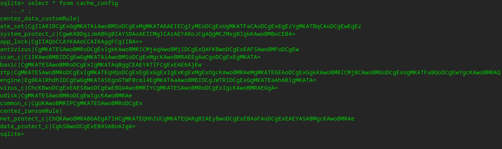

        > 708配置格式

     2. 防护日志是由于新的数据库打不开，是否是因为少了“/”

        > 1. 路径不对
        > 2. 安装后启动时，又走了707的日志拷贝
        > 3. 配置下发时，删除了所有日志

   - [x] 软件升级后，没有自动拉取病毒库更新

     **思路**：

     1. 在版本适配工具中增加功能：写入版本记录文件
     2. 其在safed启动时就会自动拉取

2. bug修改

   - [x] 设置中心界面滚动条异常(样式表未生效

   - [x] 链接服务端2.333导致safed崩溃

   - [x] 开始菜单栏中程序入口点击打不开主界面

   - [x] 开始菜单栏中缺少程序入口

   - [x] 链接服务端失败后，输入ip地址输入栏输不进去

     > 由于中控设置授权管理为管理员授权，一开始连接为未分配授权还没收到AuthInfo自然刷新就为空

   - [x] 信创版桌面图标/开始菜单 的名称改为<辰信领创防病毒系统v7.0>

     > 打包脚本中针对不同贴牌改动desktop

   - [x] uos桌面没快捷方式(JYNInstall中290行)

   - [x] 708升级到708没有自动拉取病毒库更新

     > 原因：升级成功的界面影响了病毒库更新进度，需要再开启一个界面

     升级问题：

     > 已将JYNRJJH1调用RJJH2的方式修改

   - [x] 705升级708设置界面没有的设置也需要同步、且有些配置未同步成功

     > 重新创建一个所有配置的map，带默认值；然后将705的也放入一个map
     >
     > 最后将705中有的替换掉第一个map；
     >
     > 最后再根据类型、创建对应的字符串 插入数据库中

   - [x] 信任区添加白名单之后，查杀时添加的白名单仍然报毒，且详细日志中白名单无内容

     > 如果白名单字符串匹配扫描文件的目录则展示该白名单。
     >
     > ps：没有加上反过来的情况，如果后续需要这种情况再添加

   - [x] 病毒查杀发现两个风险、处理两个风险，日志列表中显示已处理0个

     > 暂时理解为日志显示处理为0个是之前的那样

   - [x] 软授权浏览置灰

     > 情况是在已连接网络授权之后，再点击选择软授权。由于连接网络授权将其m_bConnec状态改变导致软授权浏览按钮和错误刷新都失效

   - [x] 2002机器上开始菜单右键卸载不掉

     > 系统问题

   - [x] ukey授权问题：

     1. 在longarch上识别不出来ukey
     2. 显示问题，ukey只做了一个点，识别出来是剩余点数为-1

   - [x] 软授权浏览置灰

     > 无复现

   - [x] 联网中控未分配服务时，这个ip显示有问题、而且X掉之后打不开

     > **解决**：点击激活、开始了一个定时器、并且开始(exec)了一个事件循环(相当于界面exec之后又exec了，嵌套的事件循环)。当中控是手动分配时，到达的这个函数并不会停止事件循环和计时器。导致关闭窗口、再打开窗口时打不开，报日志：`QDialog::exec: Recursive call detected`，表示在已经运行的 QDialog::exec() 事件循环中(其嵌套的循环未结束)再次调用另一个 QDialog::exec()，导致**递归调用警告 (QDialog::exec: Recursive call detected)**

   - [x] 重新卸载安装之后，设置界面显示有中控，但是界面上面的url未显示，实际url.ini未有数据

     > 暂无复现

   - [x] 查杀后关机问题：RJJH改为处理完成后启动倒计时

   - [x] 开启matrix引擎，扫描疑似威胁，将疑似威胁也进行查杀掉了。看safed中之前将自动处理放到safed那块

     > 显示问题，实际上都被清除了，隔离区中有数据，但是界面和日志详情错误

   - [x] 705/707升级708之后，之前的右键库还在；卸载708的包之后图标消失，但是图标的字还在

   - [x] 升级配置，倒计时需要添加上，去terminal_config_.h中找不同功能的timer字段

   - [ ] 日志时间排序问题

     > 要么日志修改为结束时间，要么看那个地方可以将顺序修改

   - [x] 日志查杀到病毒后，日志记录清理0条

     > 最新的包没有问题，4.22号的包存在这个问题
     >
     > 当处理界面手动全部加白，会有这种情况

   - [x] 对已加白的黑名单进行查杀，再次点击信任 详细日志中显示未处理

     **现象**：对自定义黑名单进行加白，由于黑名单优先，下次仍能进行查杀。扫描出来如果进行信任(再次加白)，会导致日志中显示未处理

     **原因**：第二次点击信任，由于插入数据库失败，所以没有将其字段设置

   - [x] 文件粉碎文案提示错误（应提示不允许包含杀毒软件安装路径/opt/apps/com.vsecure.chenxinsd）目前的文案在路径后显示.../files/

   - [x] uos设置界面的滚动轴显示异常问题

     

3. - [ ] 708vrv(北信源)贴牌、出全量包

   要求：

   1. 贴牌图标

      > **跟版本号有关**，rcc文件编译之后，在ProductConsts中会根据版本号使用对应的oem_info和rcc文件
      >
      > `IniVerConfig::Instance().get_type().at(0) == '2'`，type为2则复制vrv相关rcc文件

   2. logo

      > 存放地址为Output/bin/package/sub_logo/vrv下

   3. 桌面/开始菜单图标 desktop

      > oem_control.sh脚本中设置北信源desktop内容
      >
      > **根据soft_name**，如果vrvsd则复制vrv的logo，同时替换desktop中对应字段

   4. 北信源防病毒安装许可协议

      > WarnningDialog.cpp中530行添加北信源协议txt

   5. 包名、软件名

      > 最重要，之前的这些配置大部分都是通过识别包名和版本号来进行设置的
      >
      > 包名chenxinsd 变为 vrvsd 			===> 直接打包的时候指明 -n vrvsd
      > 版本号 c1.2110.x.xxxx 变为  c2.2110.x.xxxx		===> 执行打包脚本的时候，self.verType会获取到

   **解决**：

   1. 重新在packet打包脚本中，添加sub_oem_files函数，移动桌面图标和修改desktop文件
   2. 重新生成vrv.rcc文件
   3. 打包的时候指定-n vrvsd，会根据-n来生成对应的版本号。RJJH通过版本号选择对应的rcc文件

4. 其他问题：

   1. 打包脚本全部使用packet

   2. - [x] 使用 -a STANDARD，打service版本会出错


   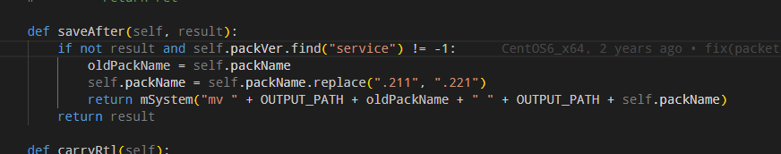

      > 由于UI的python中，有这块代码，去掉之后正常

5. - [x] 2.2上Ubuntu_20_X64 查杀崩溃

   > 705升级708导致防护日志数据库不对，查杀后崩溃
   >
   > 未能找到复现步骤，故搁置

6. - [x] 2.2上ubuntu_16x64手动点击病毒口升级，解析病毒库失败，且提示为自动而不是手动

   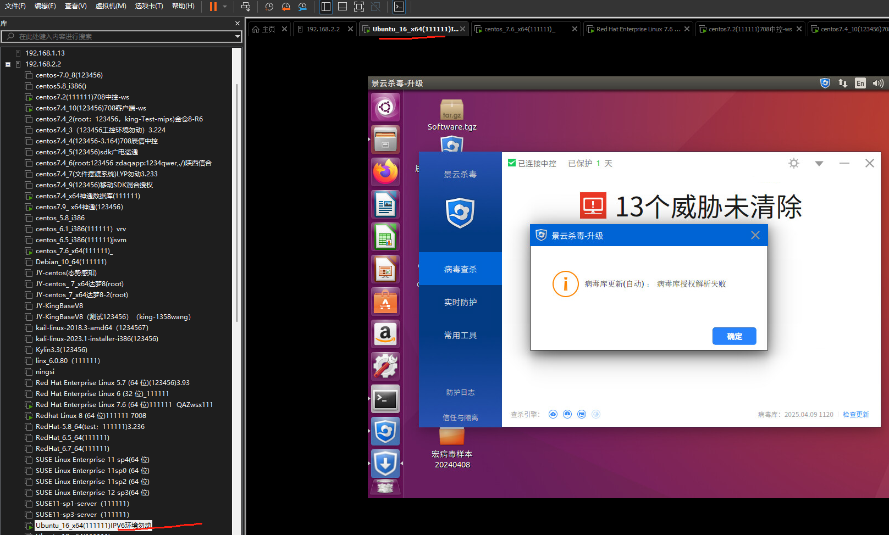

   > 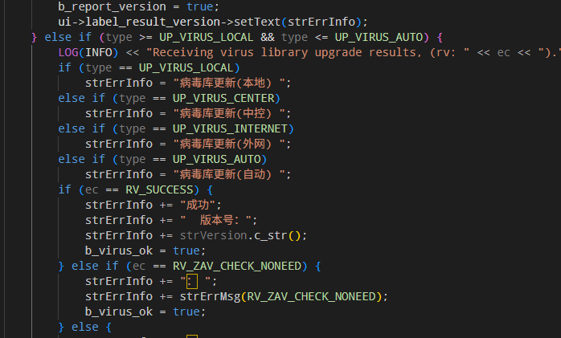
   >
   > 自动指的是病毒库更新时拉取的方式为自动：即先去中控拉，再去外网拉
   >
   > 执行查杀时卡顿可能是因为zdfy相关的问题，关闭zdfy就会继续进度

7. - [x] rpm包卸载的时候检查是否删除了文件比如tools、lib等，这些库不能删除

   

   > 背景：rpm的安装卸载脚本存放在RPM_SPEC文件中，其中%file字段保存的项目中所有的文件，当执行完卸载之后，rpm管理器会尝试将包管理的所有文件进行移除。deb包则是默认打包目录下所有文件为管理文件。
   >
   > 原因：但是由于在卸载脚本和prerm中为了将残留文件删除(比如bin下生成的key、cache下的数据库)，提前备份完手动删除了所有文件，就会导致rpm最终找不到要管理的文件从而移除不了(deb则不会提示警告)。
   >
   > 命令查看已安装的包声称包含的文件： `rpm -ql package-name`
   >
   > deb: dpkg -L <package>

#### 2.13.6 五月

|            五月任务            | 截止时间 | 完成 |
| :----------------------------: | :------: | :--: |
|  1. 708bug修改，实现对外发布   |   5.30   |      |
| 2. linux和windows的model层接口 |   6.30   |      |

1. - [x] 软件升级0425问题：redhat linux8(21)、centos7.2(88)、ubuntu_16_x64(98)  

     >    问题1： 升级界面出不来
     >
     >    问题2：升级失败之后，其他升级界面相关的操作都不行

2. - [x] 统信uos的勒索诱捕的备注不能是中文

3. - [x] 隔离区恢复/删除时，关闭、暂停和停止不能正常使用

     > 解决：将隔离区恢复和删除单独开启一个线程。这样才可以控制暂停和停止

4. - [x] 设置中查杀自动处理、查杀后未等查杀结束就弹窗

     > 统一设置成切换到SCAN_FINAL_RES

   - [x] 中途取消，有病毒的情况下再点击清理，结束后仍然会弹窗关机

     > 当uiEvent切换到SCAN_VIR_SHOW的时候event带有scanCancel字段。但是当点击清理，清理结束时跳转到SCAN_FINAL_RES的时候没有scanCancel字段
     >
     > 暂定为设计如此

5. - [x] 授权相关问题

   1. 之前授权正确的ip，使用失败的ip激活后，输入不了之前正确的ip

      > 失败了但是还保存授权信息？重新启动软件的时候左上角是连接失败，但是授权界面就是已激活
      >
      > 问题：连接失败之后是要删除掉之前的信息呢？还是说自动回退到连接成功的状态
      >
      > 思路：因为授权信息未删除，所以当再次激活之前授权的ip，不需要请求，直接把之前的信息展示出来

   2. linkstatus中升级服务器的ip为乱码

      > 这个字段是根据UrlService.ini中 url.1或者url.2的内容来展示的
      >
      > 思路：刚点击激活的时候，会触发信号槽将左上角切换

   3. 输入不存在的ip，左上角状态切换失败的速度太慢

      > 思路：authmanger收到超时的时候就同步左上角状态。在AuthManger

   4. 服务端手动分配授权时、输入授权服务器ip会自动清除

      > 如果重新启动RJJH，则该地方为空

6. - [x] 打包脚本问题:
     - `/opt/apps/chenxinsd/scripts/check_cpplib.sh`：这个脚本作用是在打包的时候比对自带的c++库(`libstdc++.so.6`)和打包带的库谁的版本高，但是该脚本的c++路径不对，需重新修改
     - 打包的脚本应该在`chenxinsd/lib/external/`下

7. - [x] 任务队列查杀排队错误的问题

8. - [x] 隔离区删除改为10个一起批量删除，优化隔离区删除因数据量卡顿

9. - [x] 优化隔离区恢复/删除的暂停和继续功能，及解决因临近恢复/删除结束点击暂停导致下一次查杀提示隔离区正在操作的问题

10. - [x] 全盘查杀时未跳过20MB压缩包

     > 自定义黑不受设置中的限制，

11. - [x] 升级时，升级界面卡住在"正在安装"界面。进程被删除，未执行安装

      > 原因可能是项目使用redis之后导致的

    - [x] 卸载时，rpm包只会清理进程，不会对安装文件进行移除(rpm卸载失败)

      > 原因可能跟上一个问题一样

    - [x] rpm包升级时，如果中控版本平台号不同，中控下发软件升级会卡住

      > 暂时无法复现

12. - [x] rpm系统，708升级708提示失败

      > 1. rpm执行rpm -U 时执行 新包安装脚本 -》 老包的卸载脚本，升级执行的功能顺序不对
      > 2. 失败点在于：rpm包执行升级、先执行新包的preinst、然后解压安装包，**解压失败**
      >
      > rpm包执行升级时候执行脚本的顺序和deb包的顺序不一样。即使正确执行了rpm -U ，卸载脚本也会在安装脚本之后执行

13. - [x] 查杀结束后关机，不管是否清除

14. - [x] 内存病毒检出项与实际病毒文件不符合（并非正在运行的进程实体文件）

15. - [x] 服务器版本桌面名称问题

16. - [x] 使用授权超过3次，点击更换中控->点击关闭，弹窗选择确认，authmanager这个界面没有退出

17. - [x] 升级之后病毒库升级失效

      > 原因：可能因为updateUi界面的冲突(可能是ipc)
      >
      > 思路：将该病毒库升级改为静默执行，无需等待Ui界面

18. - [x] 安装目录/log文件夹下的日志清除有问题(默认保存每个类型最后两个日志文件)：个别机器没有清除

      > 查看三方库下的Glog.cpp源码中是如何清除的，如果查找不到，就在safed中加入一个线程去检测清除
      >
      > **思路**：在主项目下的`third_party`项目中glog/src/logging.cc中900行的DeleteLogFile()函数中去看删除是否有问题为何不生效
      >
      > **结果**：三方库代码没问题，是zdfy进程存在导致三方库不可以执行remove命令

19. - [x] /log目录下日志文件不会被清除

      > 因为zdfy进程存在导致不可以执行remove命令

20. - [x] 扫描结果中存在病毒时，勾选扫描完成关机，后续再次开机客户端首页信息错误

      > 没有把查杀时间、查杀数量等信息记录

21. - [x] 自动关机选项在查杀无毒的情况下也进行关机操作

22. - [x] 联接测试授权超过三次服务端后，授权管理弹窗页面不能关闭

      > 当界面执行`QApplication::exit();` 时，**Qt 的事件循环会退出**，整个应用程序会开始关闭流程
      >
      > 1. **所有顶层窗口（包括主窗口和子窗口）都会收到关闭事件**，会依次触发它们的 `closeEvent`。如果窗口的 `closeEvent` 没有被 `ignore()`，窗口会被关闭。
      > 2. 窗口对象执行close后只会在app.exec()处退出，即**退出了事件循环**，但是对象被没有被析构。只有父类窗口对象析构或者调用者主动delete，该对象才会被析构
      > 3. 但是由于RJJH进程的IPC通信线程未退出，就会导致后台进程一直存在并未退出

23. - [x] 查杀过程中升级病毒库成功后，未上报到服务端

      > 未复现

24. - [x] 强力查杀结束后点击立即重启卡住

      > 更换了重启/关机的方式

25. - [x] 隔离区恢复大批量威胁时，有部分威胁存在恢复失败的情况（数据已被成功恢复，但界面显示有误）

      > 原因是当safed回复消息频率过快，导致RJJH还没处理完要删除的model数据，新的要处理的数据就来了。因为删除的时候需要遍历整个模型的数据，就会比较费时间。所以需要增加safed发送消息的时间间隔

26. - [x] 客户端没有执行查杀、也没有定时任务、中控也没有下发查杀任务，自己开始执行闪电查杀

      > 原因是每次safed启动后，第一次将任务插入数据库时字段有问题，导致后续无法删除一致存放在数据库中

27. - [x] 增加启动杀毒、尝试关闭、关闭杀毒的上报日志

28. - [x] 日志逻辑需要修改，将其改为**组件**形式，定时去删除日志。三方库中代码已被注释


#### 2.13.7 六月

| 六月任务                                                     | 截止时间 | 完成 |
| :----------------------------------------------------------- | :------: | :--: |
| 1. 708bug修改，预计6.6初发版                                 |          |      |
| 2. 收到管理的配置下发，转换为本地结构，修改各个模块之间配置传输方式 |          |      |
| 3. 各种配置存储修改，去掉protobuf入库(待细化)                |          |      |

1. - [x] rpm系统，708升级708提示失败

     > 防止僵尸进程的代码错误，导致popen执行错误

2. - [x] 升级后会有僵尸进程

     > 原因是父进程没有回收已经退出的子进程
     >
     > 如果**父进程（即你 fork 的那个进程）没有调用 `wait()` 或 `waitpid()` 来回收子进程**，那么子进程虽然退出了，但它的进程表项还会保留在系统中，状态变为 `<defunct>`，也就是僵尸进程
     >
     > 为什么有时不会有僵尸进程？
     >
     > - 如果子进程 daemon 化后，父进程很快退出，子进程会被 `init`（或 systemd）收养，init 会自动回收僵尸进程。
     > - 但如果父进程还在运行，且没有 wait 子进程，僵尸进程就会一直存在。

3. - [x] 设置中心设置"升级免打扰控制"，软件升级无反应

   - [x] 下发升级全部时，病毒库升级未生效

     > 病毒库已执行，只是静默方式

   - [x] 查杀的时候下发软件升级/全部升级，升级进度卡住/提示初始化失败/多个JYNSAFED进程

     > 1. 查杀时下发软件升级会导致后台新起一个JYNSAFED进程，如果其父进程ID是1，那么它是JYN-UPGRADE进程，只是名字没改过来。如果**进度条卡住卡在连接升级UI的过程中/提示初始化失败**，此时升级的ipc断开未连接成功，需要将sock文件删除后可正常
     > 2. 如果新的JYNSAFED的父进程为另一个JYNSAFED进程，那么这个是初始fork的进程，日志记录fork成功，但是子进程一个打印都没有，异常退出，此时kill也kill不掉
     > 3. 卡在进度条有两种情况：
     >    - 上面的1，即ipc连接断开，此时需要删除sock通信文件
     >    - 界面进度卡住，但实际上已经在执行升级了
     >
     > 解决: 更换了父进程阻塞等待子进程的方式(更换为之前的代码)后就正常了

4. - [x] 软件升级，目前只有静默、升级免打扰情况下不会判断UI界面是否存在而后台执行升级软件。但是如果存在用户界面卡住、RJJH使用不了的情况下执行软件升级会失败，这个是否需要扩充功能

5. - [x] 705问题修改：中控下发威胁清除，无毒/找不到的文件没有回馈状态。

     > 思路：由于proc版本和中控都有下发清除威胁功能，所以需要确认一下如果是来自于中控，则执行查杀时scan函数的参数需要加上强制上报

6. 升级相关问题：

   - [x] 升级是进度条卡住不动:

     1. 卡在分离子进程，此时关闭自保，将分离子进程kill掉，重新启动自保
     2. 卡在分离子进程，且过段时间出现初始化失败，此时删除sock通信ipc文件

     > deb包可以通过修改包名来测试升级，rpm不可以

7. - [x] 705上报md5，文件过大提交到中控是空的情况。

     > ZyEnginePlugin.cpp 中414行为上传设置md5
     >
     > FileObject.cpp 中81行获取md5

8. - [x] 定时任务：

     1. 存在无来源的查杀任务

     2. 定时任务的关闭功能不生效

        > 1. 刷新的时候如果从数据库读取为空(即今天之后没有任务了)则不刷新缓存了，这点错误
        >
        > 2. 病毒库升级插件和Scan插件都有对定时配置的注册，后续是否需要重新修改一下

9. - [x] 强力查杀结束后无毒也重启

10. - [ ] 各种配置存储修改，去掉protobuf入库(待细化)

     > tips: 目前是将设置中心的配置通过存储protobuffer转为密文，存储到设置数据库中；
     >
     > 计划是打算将配置数据按照字段存储到文件中像705/707一样以文件的方式进行存储

      1. 目前是每一类，将其配置proto转为string存储到数据库中(**key,value格式**)
      2. 打算还是像705/707一样以文件的方式存储配置信息

11. - [ ] 收到管理的配置下发，转换为本地结构，修改各个模块之间配置传输方式

      > tips: 由于中控收到配置下发使用的protobuffer使用的是serverEventV2里面的字段；
      >
      > 但是在本地使用的proto中(比如himitoHelper中也定义了一套类似的字段)，各个模块之间进行配置传输使用的proto字段混乱(正常来说不能使用serverEvent中的了)；所以需要重新将本地使用的proto单独拿出来使用。

      1. 单独将配置相关的字段(message)写到一个新的protobufer文件中，有些配置使用重复的子字段，将其转为共用字段
      2. 在组件(config)中收到中控下发的各类配置，使用serverEvent来进行解析，然后再使用本地新的proto对数据进行封装转换，再publish和存储
      3. 在各个组件/插件中传递/解析配置也使用新建的proto格式

12. - [x] 升级时增加判断逻辑，只有705之后的包可以升级到708，705之前的包在prinst中增加终端提示

13. - [x] 大批量数据上报，会导致查杀效率降低，需排查什么情况

      > tips: 中控下发威胁清除，之前的逻辑是开始清除前要先遍历要查的文件，如果有不存在的就会进行上报。若不存在的威胁数据量比较大，这个上报一条一条进行上报就会导致查杀迟迟不开始，影响查杀

      思路：使用生产者、消费者模型，需要上报时将数据放入共享队列中，查杀时将上报操作放入独立的线程或任务队列

      > 共享队列，条件变量、互斥锁

14. - [x] 黑名单分页逻辑重构

      > 1. 界面点击页码，RJJH只保存7条，点击哪页就请求safed获取哪几条数据
      > 2. 界面点击恢复/删除，分为正选/反选(若全选模式)，同步safed去处理
      > 3. RJJH和safed使用的protobuffer字段重新封装在HimitoHelper中

      功能点：

      > 1. RJJH界面功能
      >
      >    - 初始化界面数据同步请求、接收(initTable,updateTable，request)
      >    - 页码切换
      >    - 头选框状态修改,包括头选、全选(正选、反选、已选列表)、表格选框的更改槽函数
      >    - 接收到数据请求时，Safed做的功能是从数据库**倒序**选择所需的数据并返回
      >
      > 2. RJJH添加数据、接收回馈      
      >
      >    - RJJH添加没问题，Safed回馈时不加info，只回馈成功
      >    - RJJH接收到回馈时不存储数据，改为刷新界面
      >
      > 3. RJJH删除数据、接收回馈
      >
      >    - RJJH删除提交的是**选中的列表**，Safed接收后按照原方式进行删除(只能删除MD5格式)
      >
      >      删除的同时增加线程，按秒去读取数据库。当删除成功后，停止线程
      >
      >    - Safed删除时需要判断正选还是反选，如果是反选，则除了下发的这些其余都删除
      >
      >    - Safed对结果回馈，和添加回馈使用同一个字段，只需要确认成功后并且刷新界面就好
      >
      > 

15. - [x] 清除威胁过程中，右键查杀卡死

      > 现象：如果在清除威胁的过程下发右键查杀，弹窗正在进行威胁清除，随后会导致界面卡住，且界面跳转异常
      >
      > 1. safed后台继续执行清除威胁
      > 2. 界面界面卡住，查看scanmodel是否收到safed向UI发送的数据
      > 3. 考虑是否是因为弹窗点击了确定，导致客户端界面更换，是否会跳转到其他界面，是否会清除掉清除威胁的数据等
      >
      > 界面下发查杀不会排队，会直接进行弹窗提示；safed会进行弹窗
      >
      > 排查界面为什么会跳转，看Safed是否继续上报处理，看RJJH是否能收到消息？在哪个地方断开

16. - [x] 查杀上报进度问题，由于查杀引擎两个线程进行查杀，若两个都查杀大文件，会导致他们很长间隔才调用进度上报。所以开启独立线程进行上报

17. - [x] 通过中控下载的安装包，桌面双击安装包安装，授权服务器ip地址未填充

      > 在JYNinstall中通过获取dpkg进程命令来获取到包名
      >
      > 但是如果是桌面双击安装包进行安装，使用的是文件管理器调用的图形化的包管理工具(如 gdebi-gtk 或 software-properties)来处理安装，即其父进程可能是apt\gdebi或其他工具，命令行中不一定包含原始.deb文件名

18. - [x] 添加、删除信任区数据及删除、恢复隔离区数据动作日志没有上报到中控(黑白隔离区先加)

19. 低版本适配问题

    - [x] 705升级708，白名单以md5格式的数据存储在文件中，需要在适配白名单的时候，将该文件中的数据取出来插入到数据库中

    - [x] 707以下升级708时，备份路径需要适配，在JYNinstall中判断备份路径

      ```
      1. /opt/jyn/bdfz
      2. /opt/apps/chenxinsd
      3. /var/jyn/opt/apps/chenxinsd
      4. uos路径 /opt/apps/com.vsecure.chenxinsd/files
      优先判断如果是uos系统，则只找uos路径
      ```

    - [x] 705以下的数据库/设置适配，放入到705适配工具中实现，参考705的适配代码。看数据库(ALTER TABLE)适配时添加的那些字段即低版本需要适配的；设置就跟705一样，因为它的配置只会比705少，所以大概走705适配原代码就可以

      > 1. 版本信息：Config中，和配置信息在一块
      > 2. 云查配置：Netxxx.ini    这个比较特殊，单独拿出来放在一个文件中
      > 3. 隔离区的数据、隔离区、白名单、授权信息、中控信息等路径跟705一样的，使用705即可
      > 4. 防护日志需要看一下和705的有区别没，若没区别则同使用705的
      > 5. 定时任务704和705不同，但是由于定时任务这个版本同步功能并未实现。暂时记下任务，待后续有时间再实现

    - [ ] 老版本和705没有RJJHetc路径，此路径在${HOME}中的Jingyunxxxx目录中，没有对这个目录进行适配。如果测试未提出此问题，暂时先搁置不关注

#### 2.13.8 七月

| 七月任务                                            | 截至时间 | 完成 |
| :-------------------------------------------------- | :------: | :--: |
| 1. 708bug修改                                       |          |      |
| 2. 配置存储修改，去掉protobuffer入库                |          |      |
| 3. 配置转为本地结构，修改各个模块之间配置的传输方式 |          |      |

1. - [x] 日志时间排序问题：日志记录的是开始时间，若查杀耗时较大会导致日志记录顺序问题

2. - [x] 各种配置存储修改，去掉protobuf入库(待细化)
     1. 使用705的方式，设置ini类，每个配置项都为成员
     2. 提供设置配置和获取全量配置的接口

3. - [x] 收到管理的配置下发，转换为本地结构，修改各个模块之间配置传输方式

     1. 配置分为三块，重新整理设计配置的protobuffer

        - ini配置：存储在config.ini配置文件中，以key，value格式存储
        - zdfy配置：存储在xml文件中
        - 定时任务配置：存储在sqlite数据库

     2. 界面、中控下发的配置都修改为**全量下发**，即发送一整个配置

     3. 所有界面、中控发来safed的配置全部在**config组件**中**接收并存储**(定时任务比较特殊)，然后**分发**到各组件/插件

        > 同时，界面初始请求配置也是全量发送

     4. 各组件/配置修改订阅的处理逻辑，根据新的protobuffer进行解析

        - [x] 查杀组件相关配置
        - [x] 升级组件相关配置
        - [x] 定时任务相关配置

4. 分析705CtrCenter插件，包含中控下发的所有操作+配置，与708的方式不同

   > 关于与中控之间的通信交互的逻辑还是一样的，只是708使用了subscrib和publish，705使用的是多态注册

   ```c++
   // 1， CtrlCenter 初始化
   heart_beat_.RegisterAction(ServerEventResponse_TaskType_NORMAL_SCAN, pScan);// 注册动作
   heart_beat_.Start();	// 开启心跳，每隔一个时间间隔就请求一次中控。请求时绑定回调，收到消息会执行回调函数OnHeatBeatRespose
   
   // 2. HeartBeat中的Start()启动心跳
   worker_.start_thread(2);	// 启动worker任务队列，负责调用建立心跳连接
   slave_.start_thread(1);
   OnHeartBeatTick()  // 心跳函数
   HandleHeartBeatString()	// 心跳回复后的处理逻辑
   
   // 3. 处理逻辑，将每一个item传入DoAction中，查找type并根据之前的注册从mao中找到对应对象的Action()
   for (int i = 0; i < serverResponse.items_size(); i++)
   	{
           ServerEventResponse_CmdItem item = serverResponse.items(i);
           DoAction(item);
       }
   
   void HeartBeat::DoAction(ServerEventResponse_CmdItem& msg)
   {
   	std::lock_guard<std::mutex> lck(mutex_);
   	if (action_map_.find((unsigned int)msg.item_type()) != action_map_.end())
   	{
           action_map_[(unsigned int)msg.item_type()]->Action(msg);
       }
   }
   
   // 4. ScanConfig类即为配置处理函数
   CScanConfig::CmdAction()  // 处理函数
   
   // Protobuffer的字段为TerminalConfig
   ```

5. bug修改：

   - [x] 702升级到708后，白名单数据缺失
   - [x] 信任区和黑名单中显示占用磁盘空间
   - [x] 服务端下发恢复/删除隔离区数据，上报的日志方式为主动发起
   - [x] 大量数据恢复并信任所选文件时，没有加入到信任区中
   - [x] 每次重启机器后，都上报两条白名单数据
   - [x] 查杀结果页，点击病毒文件信任，病毒文件进入隔离区
   - [x] 702升级到708之后，数据防护中文件保险箱和勒索诱捕没有开启
   - [x] 702升级到708，不会自动更新病毒库

   


## 三、技术问题


# 未完成笔记

### 1. 项目部分

2. **如何分析一个项目**？

3. **记笔记方式**

4. cusorAI撰写代码

5. qrc文件和rcc文件    gcc？

6. titlebar？如何将titlebar单独的放到别的界面中

7. 信号槽、控件、事件的底层实现原理？moc？mvc模型？

8. RJJH中的event文件夹？cur_user干什么的？归纳下qy_ui（UI层）的具体构造

9. 看下Frameless中的720行事件过滤器

10. 看src/moudles/virus_scan_engine_plugin/src libEngineScan动态库(扫描引擎)的组成成分。

11. 线程池thread_pool如何实现的

12. 针对不同版本(开发环境)的右键库：

    ```
    #add_subdirectory(libsource/nautilus_scan)
    #add_subdirectory(libsource/caja_scan)
    #add_subdirectory(libsource/peony_scan)
    ```

13. 如何修改ubuntu下的权限，省的每次都得用sudo

14. 查看`.clang-format`如何设置，规格化工具

15. 使用VScode插件

   ```
   Clang-Format  代码格式化插件
   koroFileHeader 注释文件和函数的快捷方式
   Better Comments 注释分类，不同注释不同颜色
   gitlens 展示每行代码的提交人、提交时间
   git history 展示git历史提交记录
   Tabnine 人工智能
   Remote - SSH 远程开发插件
   Color Highlight 显示代码中关于颜色的代码直接显示颜色
   ```

11. qt的moudle层如何与safed通信的？safed如何与中控通信的？

   > RJJH下面的ipc文件夹下的IIPCBaseModelInterface，负责send和receive助手之间的数据

11. 执行文件(SAFED ZDFY GZCZ)和包(.so)的分布情况

12. 动态库之间如何相互调用，动态库是如何使用的

13. plugin.conf的message的Key，在哪个地方初始化。如果key没有卸载config文件里面会如何

   ```
   #下面两句如何实现的?
   std::string msgType = BundleHelper::getBundleAString(pIn, JYMessageBundleKey::JYMessageType, "");
   std::string msgData = BundleHelper::getBundleBinary4String(pIn, JYMessageBundleKey::JYMessageBinValue, "");
   ```

11. 线程类(`ThreadWrapper`)是如何实现的？如何通过集成该类就可以实现线程的功能？线程池如何运转

12. `core`与组件和插件之间的关系，画图梳理->类图建立

13. 前端、后端、客户端、服务端之间的区别

    **前端**：用户界面和交互（展示层）

    **后端**：业务逻辑和数据处理（服务层）

    **客户端**：用户访问的载体，通常运行在用户的设备上（如电脑、手机）

    **服务端**：指运行在远程服务器上的部分，负责处理客户端的请求，提供数据或执行复杂任务。

14. 杀毒软件的架构划分

    **客户端**：

    1. **前端**：界面RJJH（用户操作的图形界面）。
    2. **本地逻辑层**：助手Safed（执行查杀任务的本地处理模块）。
    3. 运行在用户设备上，负责本地交互和任务执行。

    **服务端**：

    1. **后端**：中控的核心逻辑（处理客户端数据、提供操作接口）。
    2. **前端**：中控的网页界面（展示数据给用户）。
    3. 运行在远程服务器上，负责远程管理和数据展示。

15. 关于**项目架构**

    1. Safed只提供功能
    2. RJJH(客户端用户)和中控(服务端管理员)可以调用Safed的功能并同时上报信息给另一方。其中若只有一方存在，就有获取功能的入口，程序就可以运行。
    3. 中控调用Safed的功能时，若存在界面(RJJH)，那么会同步进度/信息到界面上。
    4. RJJH使用Safed的功能时，会同步查杀进度、上报日志等到中控管理端上

16. 关于**组件和插件 / 功能和业务**：

    1. 有了功能之后才能考虑和拓展业务

    2. **组件学名叫做功能型插件、插件学名叫做业务型插件**。

    3. 功能性插件即这个项目必须有的基础功能，比如通信、上报、任务队列管理等

    4. 业务性插件就是可扩展的、根据业务需求进行增、删并且可以复用功能插件的部分。单独的插件就作为动态库调用。

       > 业务型插件公共使用的代码部分放在common中，比如病毒库升级逻辑

17. **Safed的实现**分为三个部分：

    1. 消息队列的实现：**message_center**   

    2. 组件实现：**component_manager**

       - 将每个**组件的接口**插入到map中，统一进行组件管理

         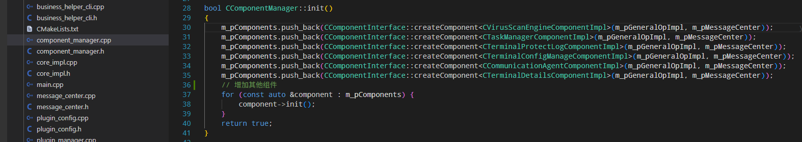

       - 所有**组件功能对象**放入`CGeneralOperatorImpl`中去初始化，每个**组件接口**在构造函数中通过它来获取功能对象，保证了共用的组件是相同的

         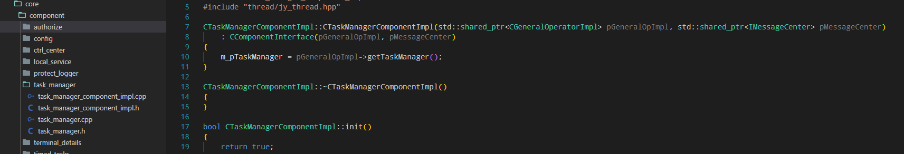

    3. 插件实现：**plugin_manager**

       - 通过etc/plugin/plugin.conf来获取插件(动态库)的配置信息(动态库路径、message的type等)，保存在map中

       - 依次加载动态库，创建插件实例

         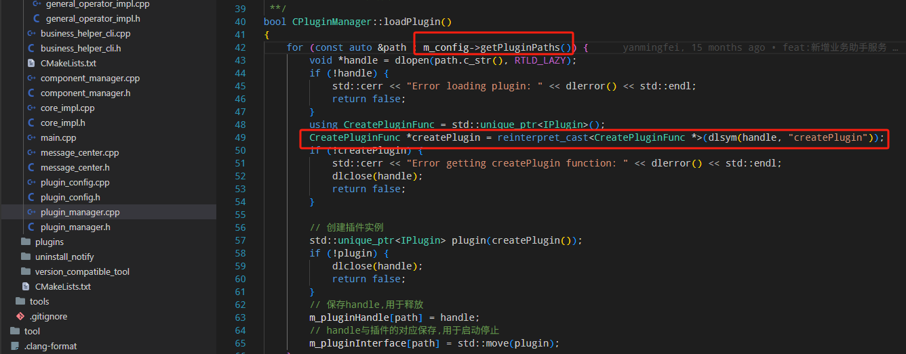

       - 组件将其功能集成的对象交给plugin初始化，使得每个插件都可以使用组件的所有功能

         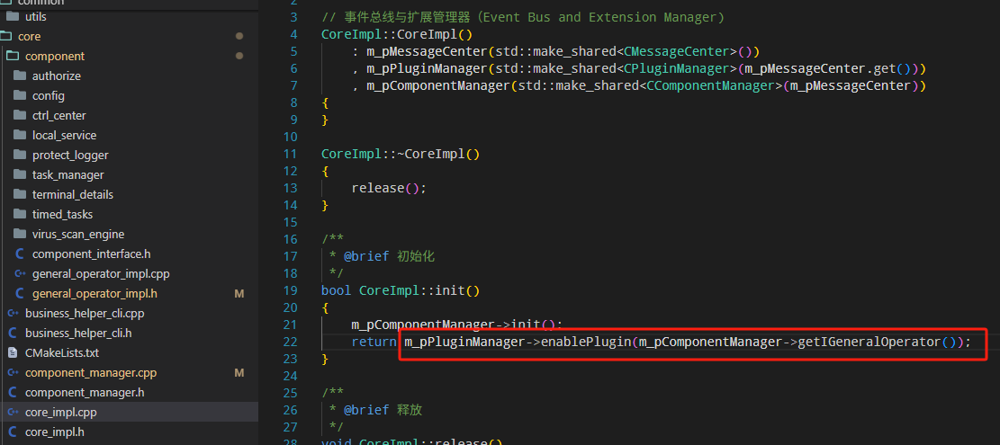

         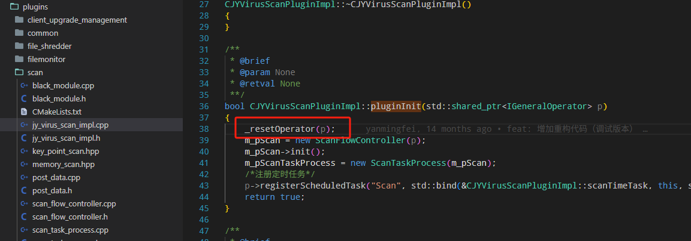

       - 关于插件中的消息分发：通过读取plugin.conf获取每个插件要注册的message的type，在插件管理器依次启动插件时就将其注册消息队列。(组件是需要调用messager手动注册，插件由配置文件在初始化时就已经完成注册)
       
         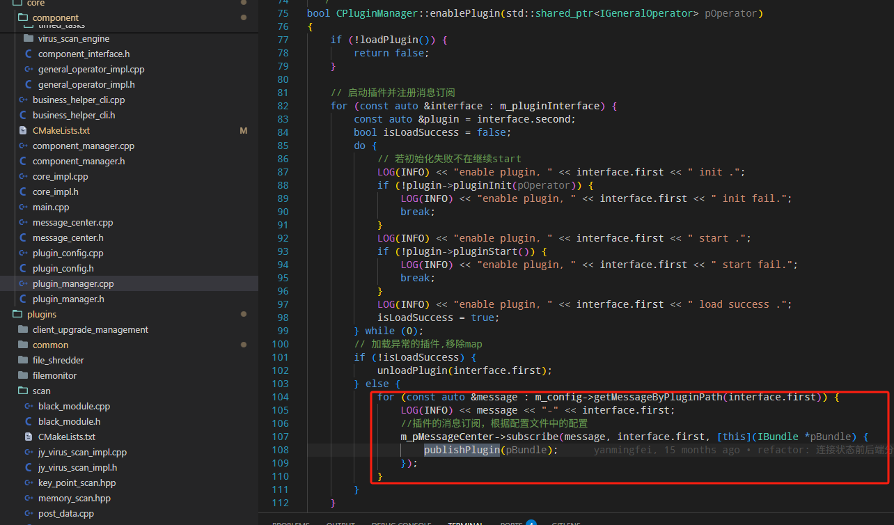
       
         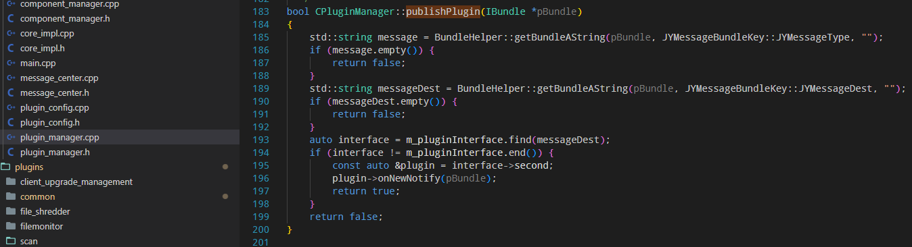

18. 关于**项目中的日志**

    1. 自定义简式的：流式日志写入器，看plugins/common/client_management_log.hpp中的实现
    2. 项目中的日志使用了glog三方库

19. 关于**中控授权**

    RJJH激活中控ip，safed就会重启“心跳”。`ctrl_center_agent.cpp`中该类就是一个继承于线程模板的类，重写了`run`函数。`run`函数会根据心跳阶段、通过读取文件(授权ip写在文件中)执行向中控请求，同时执行回调函数(`safed`的)

20. 关于**查杀引擎**任务队列

    扫描引擎是vector容器依次遍历的，所有的引擎都会走一遍，最终才会调用回调函数

    ```
      ENGINE_ENUM,		// 枚举引擎
      ENGINE_CACHE,		// cache引擎
      ENGINE_CLOUD,		// 云查
      ENGINE_ZAV,			// ZAV
      ENGINE_REDUCE,
      ENGINE_CACHE,		// 为什么两个cache
    ```

21. 关于**项目之间通信**

    RJJH和safed使用的是`ipc`；

    safed和中控使用的是`cpr`(三方库)

    他们都使用了一种订阅发布的模式，来发送和接收消息

    这些 IPC 库的主要目的是让运行在同一台机器上的不同进程能够高效地交换数据。典型功能包括：

    1. **共享内存**：多个进程共享同一块内存区域，避免数据复制。
    2. **消息队列**：进程间传递消息。
    3. **信号量/互斥锁**：同步进程访问共享资源。
    4. **管道或套接字**：简单的通信通道。

22. `common/ipc_common`该文件夹下实现**ipc(进程通信)**，使用的方式为**socket通信**。其实现了IPCclt(客户端)和IPCSvr(服务端)。并封装了接口

    1. 对于IPCSvr：
          1. 接受消息：功能类继承`Interface_IPCLogical`类，重写回调`OnRecieveMsg`
       2. 发送消息：调用`ipcSvr`的`SendMsgToAllClts`
    2. 对于IPCclt：
              1. 接收消息：功能类继承`CallBack_IPCclt`类，重写回调`OnRecieveMsg`
              2. 发送消息：调用`ipcClt`的`SendMsg`

23. RJJH的model层与ipc**(IPCclient)剖析**

    1. RJJH的ipc作为FramelessWindow的成员(ipc_manager)，通过**信号槽机制**实现消息同步发送
    2. RJJH的ipc收到消息后通过不同的model进行分发，在各自的model中去解析数据并与RJJH交互
    3. RJJH通过model来将消息传递给safed

    ```
    business_helper_client.cpp				// 负责实现ipc通信的接收和发送
    
    ipc_manager.cpp			// 1.  包含成员business_helper_client，收到消息通过信号槽传递过来
        					// 2.  可以注册不同的model 以及 这些model的接收类型
    						// 3.  收到消息就根据消息类型从map中找到对应model，分发消息
        					// 4，  发送消息直接调用business_helper_client
        						
    model 层 		// 1. 继承IIPCBaseModelInterface接口重写receive函数，方便ipc分发消息
    				//  2. emit send 消息，在ipc_manager中实现信号槽，在ipc中发送消息
    ```

24. Safed层的ipc**(IPCServer)剖析**

    1. Safed的ipc作为一个组件(local_service)，通过**启动一个线程**实现消息同步分发
    2. Safed收到消息就会调用消息订阅的publish进行分发
    3. Safed的组件和插件向RJJH发送消息时使用该组件功能类进行发送

    ```
    business_helper_service.cpp		// 负责实现ipc服务端的接收和发送
    								// 1. 收到消息将消息放入队列(SafeQueue,重写的安全队列)
    								// 2. 实现发送消息的接口(sendMsgToUI)
    
    communication_agent_component_impl.cpp	// 组件接口
    
    communication_agent.cpp		// 组件具体功能类
    							// 1. 继承线程类，重写run，任务队列中有数据就取出并publish
    							// 2. business_helper_service为其成员，使用其发送接口进行通信
    ```

25. 关于**项目使用的进程和线程**

    项目用了多少个线程？RJJH用了多少个线程呢，safed的插件统信用了8个线程？

    1. 对于safed的插件来说，其重写的`start`函数中，使用了jy_thread.cpp中的线程模板函数启动线程；当`pause`或者`stop`的时候，在外面改变其中循环函数的条件值即可停止线程(函数)

       ```c++
       JYThread::autoRun(std::bind(&CTaskManagerComponentImpl::taskQueueDistribution, this));
       ```

    2. 另一种是直接把类继承manageed_thread.cpp中的封装的线程类，再重写`run`函数。此时使用该封装的线程类的`start、stop`等函数来进行线程管理

       ```c++
       class CControlCenterAgent : public ThreadWrapper
       ```

       > 也就是说第一种需要自己实现start、stop；第二种只需要重写run(要执行线程的函数即可)

26. 关于RJJH里面的**自定义事件处理**：

    1. 在**event**文件夹中创建自定义事件

    2. 在**scanModel**中接收信息、创建事件并通过发送信号`signal`将事件传递到主界面**UI**的Framless中

    3. **UI**通过槽函数，`postEvent`在本对象Framless中发送事件

    4. Framless重写了`eventFilter`事件处理器后，初始化构造中通过`installEvent`绑定自己本身

       ```
       QApplication::instance()->installEventFilter(this)
       ```

27. **修改/增加protobuffer的步骤**：

    1. 修改/增加protobuffer字段

    2. 在proto/文件夹下面，将40上该目录下的protoc执行文件复制过来

       > 使用本地的会导致因版本不同造成的、执行/编译错误

    3. 执行`gen_proto.sh`脚本。

28. **修改/替换界面图片的步骤**：

    1. 替换/修改图片

    2. 如果是修改图片名字或者新增图片，需要在`widget.qrc`文件中修改.增加。替换不需要

    3. 修改贴牌脚本`oem/gen_rcc.sh`中`rcc`的路径为本地的qt里的rcc，并执行脚本

    4. 将`OutPut`路径下的生成的`skin_xxx.rcc`替换到本地的对应目录下即可

    5. git时，只需要`push`改动的图片和生成的`rcc`文件即可，其他的不需`push`

       > RJJH新增的东西删除掉(自己改动的图片除外)、只保留在Output中生成的所需要的rcc文件

29. **项目中更改三方库源码**(以更改glog库为例)

    1. 40上`708/third_party/`下修改源码
    2. `third_party/build_x64`/执行 `make glog`，编译后的库放在`708/mod/lib/`下
    3. 在`normal_development`仓库下重新编译打包

30. **项目git和使用**：项目分为两个仓库，第一个为主代码normal_develop, 第二个为thirdparty

    1. 由于gitlib中已绑定自己的ssh公钥，所以直接使用git clone git@拉取即可
    2. thirdparty为项目中使用的三方库，需要在40环境下，进入该仓库的目标架构的build文件夹下，执行make编译。编译后的库文件将会输出到mod仓库的lib下。
    3. 在本地的normal_develop仓库下，需要将刚编译的lib移动到该仓库下。就可以正常使用了

31. **项目中的三方库**

    1. common目录是拆出来三方库源文件(.cpp)存放地，可以根据要求/协议来更改需要的代码
    2. lib文件夹下面包含的是当前架构下三方库的库文件(.a)存放的地方
    3. libsource文件夹下面包含的是自己做的库文件
    4. 下一步就是将include/thirdparty(三方库头文件)和libsource下的三方库/自己做的库转移到common下
    5. lib目录当前是采用**静态库和头文件**分来的方式，头文件在include，库在当前lib库下。在cmakelist中指定该库就可以编译使用

32. **关于项目中的三方库**：

    1. 项目中的三方库在**仓库**`third_party`中，里面包含的是项目中使用到的三方库的源码(针对自己的项目修改过功能代码)。
    2. **三方库编译**：在40上对项目打包前需要先对`third_party`进行编译，打包时就会带上项目所需的三方库文件
    3. **主项目编译**：在`normal_development`仓库的主cmakelist中，将三方库编译好的库文件移动到项目中对应位置(lib/X86_64)
    4. **打包：**

    > normal_development中的lib下是使用的编译好的库文件、libsource使用的是三方库cpp源码文件(主要是自己写的库)

33. 项目中的**右键查杀**

    ```c++
    1. 右键查杀槽函数定义在FramelessWindow中
    2. 连接MainWindow和FramelessWindow的信号槽
       connect(this, SIGNAL(sigRightSelectScan(QString)), m_pWindowController, SLOT(slotRightSelectScan(QString)));
    3. 在rjjh.main中连接ZySinGleApplication和FramelessWindow的信号槽
       app.connect(&app, SIGNAL(messageRightSelectScan(QString)), &mainWindow, SLOT(rightSelectScan(QString)));
    ```

34. 项目中配置相关流程：

    safed中负责保存、分发配置。界面(终端)、中控负责下发、修改配置

    1. 界面下发/请求配置：
       - 由**配置组件(config)**处理修改/请求配置，相关字段为`TerminalConfigSession`和`TerminalTimerConfigSession`
       - 每一项配置有其自己的`key`，不同的插件/组件需要该配置时，就在初始化的时候订阅(`subscrib`)这个`key`。当配置组件(config)初始化/收到修改配置消息时，会分发(publish)相关配置，此时所有订阅过这个`key`的组件/插件都会获取到相关配置
    2. 中控下发配置：
       - 由**配置组件(config)**处理修改配置，每一项配置有其自己的`key`及处理函数

35. deb包的四个脚本作用和执行顺序：

    1. preinst（预安装脚本）：在**包解压和安装文件之前**执行，用于准备安装环境或检查前提条件或**备份**

       > **注意**：此时包的文件尚未解压，因此脚本不能依赖包内的文件。

    2. 解压包并安装文件

    3. postinst（后安装脚本）：**在包解压并安装文件之后**执行，用于完成配置或初始化。

       > **注意**：此时包的文件已经可用，可以依赖它们进行操作，**适合执行安装脚本(完成配置、启动进程等)**

    4. prerm（预移除脚本）：在**包的文件被移除之前**执行，用于准备移除过程

       > **注意**：文件仍然存在，可以访问包的内容，**适合执行卸载脚本(停止进程、删除遗留文件等)**

    5. 包文件被移除，此时deb和rpm管理器会将管理的文件进行删除操作

    6. postrm（后移除脚本）：：在**包的文件被移除之后**执行，用于清理或完成移除

36. 当一个deb包从版本A**升级**到版本B，对应脚本执行顺序如下：

    1. A的 prerm：调用旧版本 A 的 prerm，参数为 upgrade 和新版本号，准备升级。

       > 此时在prerm中调用A的卸载脚本

    2. B的 preinst：调用新版本 B 的 preinst，参数为 upgrade 和旧版本号，检查升级条件。

       > 备份A的相关信息

    3. 解压新版本文件：dpkg 解压 B 的文件，覆盖 A 的文件。

    4. A的 postrm：调用旧版本 A 的 postrm，参数为 upgrade 和新版本号，清理旧版本

    5. B的 postinst：调用新版本 B 的 postinst，参数为 configure 和旧版本号，完成配置。

       > 执行B的安装脚本

37. `.deb`安装包脚本的存放位置：`/var/lib/dpkg/info/`

38. **关于项目deb和rpm包的升级脚本执行顺序**：

    rpm和deb包对于升级的执行顺序不同：

    - **deb**：prerm（旧包）→ preinst（新包）→ 安装新包 → postinst（新包）。postrm 通常不执行，除非显式移除旧包。
    - **rpm**：%pre（新包）→ 安装新包 → %post（新包）→ %preun（旧包）→ %postun（旧包）。

39. deb包和rpm包打包区别：

    1. 相同点：都会用到pre post的四个脚本，只是deb显示指定、rpm会通过创建`/SPECS/jingyun.spec`文件里面指定
    2. rpm需要在spec文件中的`%file`字段显式的指定包管理文件、deb则自动根据打包目标路径下所有文件进行管理

40. 关于动态库的调用，使用了**工厂模式**：即`IPlugin`是工厂基类接口、`createPlugin` 是插件的入口函数，负责创建插件实例并返回其智能指针

    1. 在插件中定义一个宏(`PLUGIN_EXPORT`)，应用于`createPlugin` 函数的声明。

       ```c++
       # 插件代码cpp中：
       PLUGIN_EXPORT std::unique_ptr<IPlugin> createPlugin()
       {
           return std::unique_ptr<CJYVirusLibraryManagementPluginImpl>(new CJYVirusLibraryManagementPluginImpl());
       }
       ```

    2. 在CMakelist中定义该宏

       ```c++
       # 该插件的CMakelist
       target_compile_definitions(${BIN_NAME} PRIVATE "PLUGIN_EXPORT=extern \"C\" __attribute__((visibility(\"default\")))")
       ```

       1. `extern "C"`：告诉编译器使用 C 链接约定，而不是 C++ 的名称修饰（name mangling）。因为在 C++ 中，函数名会被修饰（例如，包含参数类型等信息），导致编译后的符号名变得复杂（例如 _Z9createPluginv）。**使用 extern "C" 后，createPlugin 的符号名保持为 createPlugin，便于外部程序查找和调用。**
       2. `**__**attribute((visibility("default")))`:在共享库中，符号默认可能是隐藏的（`hidden`），以减少符号表大小并提高加载性能，`visibility("default")` 明确指定该函数的符号是**公开的**，可以在共享库外部访问。这对于插件系统至关重要，因为主程序需要通过动态加载（例如 **dlopen** 和 **dlsym**）找到 `createPlugin` 函数。

    3. 综上所述，函数声明等价于：

       ```c++
       extern "C" __attribute__((visibility("default"))) std::unique_ptr<IPlugin> createPlugin()
       {
           return std::unique_ptr<CJYVirusLibraryManagementPluginImpl>(new CJYVirusLibraryManagementPluginImpl());
       }
       ```

41. 项目**工厂模式**：

    1. 在safed下创建升级适配工具，根据参数705或者707来创建相应的处理程序(clipp)
    2. 该升级适配工具cmake打成可执行包(cmakelist中`add_executable`)
    3. 在安装脚本中调用该脚本并传入对应参数，开始执行该工具

42. 项目**单例模式**：有一个单例类，获取系统的`IGeneraoperator`唯一插件对象，不同组件之间互相调用

43. 项目中的**单例模板**：

    `ZySingleto.h`下存放了懒汉式的单例模板

44. 项目的**生产者消费者模式**：

    1. 将查杀过程中的上报进度放入独立的线程进行上报(解决如果两个引擎最终查杀的都是费时的大文件则界面进度卡住的问题)
    2. 将查杀过程(威胁清除)的上报空路径到中控放入到独立的线程(解决影响查杀效率/查杀后不可再查杀的问题)

    使用`std::thread`+`std::queue`+`std::mutex`/`std::condition_variable`实现生产者-消费者模型。

    ```c++
    std::queue<ThreatReportData> m_threatReportQueue;	// 共享队列
    std::mutex m_threatReportMutex;						// 互斥锁
    std::condition_variable m_threatReportCV;			// 条件变量
    
    bool m_threatReportThreadRunning = true;			// 线程循环条件
    std::thread m_threatReportThread;					// 线程变量
    
    // 生产者实现入队   查杀主线程入队
    void ScanFlowController::enqueueThreatReport(const std::string& path, const std::string& md5, vse::CleanAction action) {
        {
            std::lock_guard<std::mutex> lock(m_threatReportMutex);
            m_threatReportQueue.push({path, md5, action});
        }
        m_threatReportCV.notify_one();
    }
    
    // 消费者实现出队并上报   副线程出队上报
    void ScanFlowController::reportRemoveThreatListThread()
    {
        while (true) {
            std::vector<std::string> batch;
            {
                std::unique_lock<std::mutex> lock(m_reportRemoveThreatListMutex);
                m_threatReportCV.wait(lock, [this] { return !m_threatReportQueue.empty() || !m_threatReportThreadRunning; });
                while (!m_threatReportQueue.empty() && batch.size() < 100) {
                    LOG(WARNING) << "reportRemoveThreatListThread: " << m_threatReportQueue.front();
                    batch.push_back(m_threatReportQueue.front());
                    m_threatReportQueue.pop();
                }
                if (!m_threatReportThreadRunning && m_threatReportQueue.empty())
                    break;
            }
            for (auto &data : batch) {
                threatClearanceExceptionPathHandling(data, std::string(""), vse::CleanAction::CLEAN_CLEAN);
            }
        }
    }
    
    ```

45. 病毒库更新其实也就是查杀引擎更新

46. 中控下发威胁清除实际上就是将威胁列表重新执行查杀，并且设置为自动清理

47. 项目中的**单例模式**：zyiniConfig.h中的配置类，单一配置类确保全局配置统一

    ```c++
    static IniConfig& Instance()
        {
            static IniConfig obj;
            return obj;
        }
    
    // 实际使用
    IniConfig::Instance().LoadConfig();
    IniConfig::Instance().set_auto_update_onoff_cloud((bool)timed_task->m_enableTimerTask);
    IniConfig::Instance().SaveConfig();
    ```

48. **项目中使用到的心跳**(与中控通信)

    1. 继承线程类，启动线程
    2. 如果初始状态/超时，重新注册
    3. 注册成功，则进入syncHartBeat中获取中控发来的消息，并解析该消息、分发给其他组件

    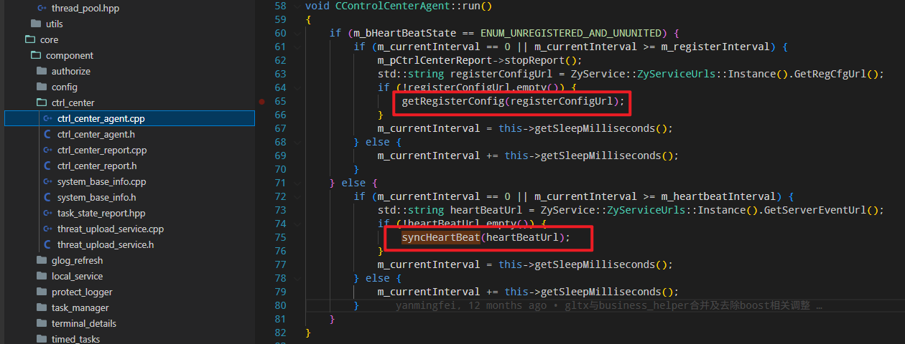

    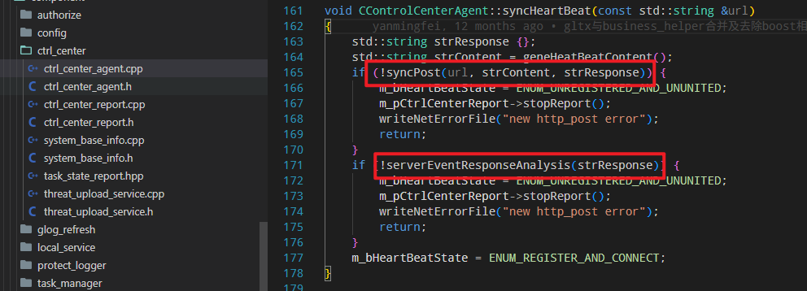

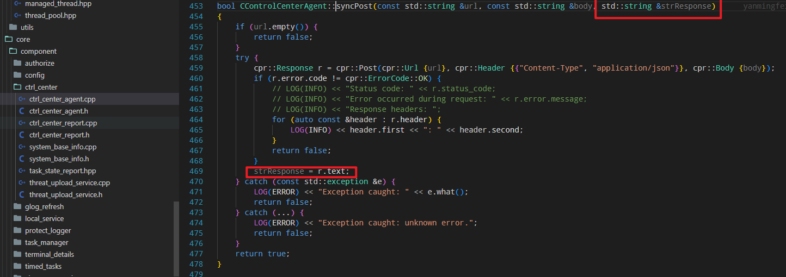

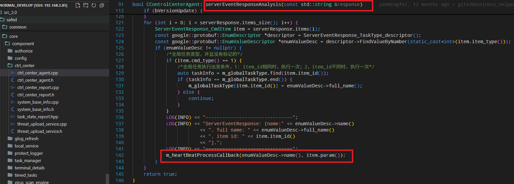

### 2. 工作部分

#### 2.1 正在进行

##### 2.1.1 遗留任务

2. 遗留问题：

   1. 查杀时下发软件升级，偶现因为分离进程不成功导致升级进度卡住
   
2. 待优化问题：

   1. 查杀上报进度问题，由于查杀引擎两个线程进行查杀，若两个都查杀大文件，会导致他们很长间隔才调用进度上报，界面时间跨度比较大

      > 解决方式：reportScanProgress弃用，改为启动一个线程，保存上报进度等值，每1秒上报RJJH、每5秒上报中控

   2. 日志时间排序问题：日志记录的是开始时间，若查杀耗时较大会导致日志记录顺序问题

   3. 打包时设置权限问题：必须给chenxinsd、bin文件夹777权限，需要给JYNRJJH777权限才能使产品成功运行

3. 查杀时取消界面卡住，等待复现

   > 1. engine_plugin_control.cpp中172行的这个智能指针(TaskInfoPtr)在查杀结束后进行析构。其析构函数为调用回调函数，上传进度到百分之百，从而停止查杀并同步RJJH
   > 2. 查看complete函数打印的日志，看其智能指针计数是否归零
   > 3. 若智能指针计数归零，看Docomplete打印日志，如果最后一行未打印，则是任务队列(m_pWorkTaskPool)的问题(取消查杀前会暂停查杀，暂停查杀会将任务队列移动)、

4. 北信源有个项目(705)，需要标准版客户端做一些调整

   **需求**：病毒查杀+文件监控的日志 除了咱们自身生成的以外，需要以json格式 在系统中特定位置存放一份

   1. 三方软件(神木，Java)选中上传的文件后，调用杀毒扫描接口(自定义扫描)。
   2. 通信需要额外做一层socket通信协议封装，用于双方通信
   3. 通过该三方软件调用杀毒的查杀结束后向特定位置发送(写入)JSON格式的扫描日志，并发送扫描结束的消息 

5. 708vrv(北信源)贴牌、出全量包

   要求：

   1. 贴牌图标

      > **跟版本号有关**，rcc文件编译之后，在ProductConsts中会根据版本号使用对应的oem_info和rcc文件
      >
      > `IniVerConfig::Instance().get_type().at(0) == '2'`，type为2则复制vrv相关rcc文件

   2. logo

      > 存放地址为Output/bin/package/sub_logo/vrv下

   3. 桌面/开始菜单图标 desktop

      > oem_control.sh脚本中设置北信源desktop内容
      >
      > **根据soft_name**，如果vrvsd则复制vrv的logo，同时替换desktop中对应字段

   4. 北信源防病毒安装许可协议

      > WarnningDialog.cpp中530行添加北信源协议txt

   5. 包名、软件名

      > 最重要，之前的这些配置大部分都是通过识别包名和版本号来进行设置的
      >
      > 包名chenxinsd 变为 vrvsd 			===> 直接打包的时候指明 -n vrvsd
      > 版本号 c1.2110.x.xxxx 变为  c2.2110.x.xxxx		===> 执行打包脚本的时候，self.verType会获取到

   **解决**：

   1. 重新在packet打包脚本中，添加sub_oem_files函数，移动桌面图标和修改desktop文件
   2. 重新生成vrv.rcc文件
   3. 打包的时候指定-n vrvsd，会根据-n来生成对应的版本号。RJJH通过版本号选择对应的rcc文件

##### 2.1.2 八月任务

|               八月任务               | 截至时间 | 完成 |
| :----------------------------------: | :------: | :--: |
|              1. bug修改              |          |      |
| 2. 软件升级，适配最新版708的存储结构 |          |      |
|   3. Linux客户端界面使用新版UI重构   |          |      |

1. - [x] 软件升级，适配最新版708的存储结构

2. 新版UI界面重构

   1. OEM贴牌适配
      1. OEM下分几个需要套牌的文件夹(里面只有需要替换的图片)
      2. 全部的图片放到外面，创建一个skin文件夹
      3. 添加qrc文件
      4. 写gen_rcc.sh脚本
      5. .pro/cmakelist中添加resource资源
   2. QSS样式表
   3. MVC开发模型
   4. Qt中英切换(tr())
   5. 自适应大小(在不同分辨率下如何自适应显示)


#### 2.2 备忘录

驱动开发

### 3. 经典问题

1. 隔离区恢复、删除过程的暂停和停止操作。由于在同一个线程只能依次操作函数，等到恢复/删除结束后才会调用暂停和停止函数。

   解决：将隔离区恢复和删除的过程单独启动一个线程，由另外主线程进行对其暂停和停止的操作(修改条件值)

   > 同理：网络防护功能、同样是插件开启**线程**操作、然后主线程就可以调用插件停止、暂停、继续等操作

2. 软件升级的管道问题: 执行dpkg -i 只执行了旧包的卸载脚本，没有执行新包的安装脚本

   原因：卸载脚本已经将父进程杀死、导致管道那块不能使用`Logger::info()`日志记录器来写入管道，最终导致管道报错，子进程停止执行

   > 最终原因还是因为使用了redis之后，执行卸载脚本将safed进程杀掉之后将子进程也杀掉了，导致管道中断

3. 问题：rpm包在中控执行下发软件升级(rpm -U )时，提示错误**没有子进程**:

   ```
   错误:%prein(chenxinsd-7.0.0.8-25053038.amd64)脚本执行失败,waitpid(10017)rc -1:No child processes
   ```

   分析：

   1. rpm包在终端环境下手动执行rpm -U 可以正常执行，说明跟包管理脚本(prein等)无关

   2. 在升级插件中，分离子进程并创建守护进程后，使用了下面代码防止僵尸进程

      ```c++
       // 防止僵尸进程
          struct sigaction sa = {};
          sa.sa_handler = SIG_IGN;	//把 SIGCHLD 信号的处理方式设置为 SIG_IGN（忽略）
          sa.sa_flags = SA_NOCLDWAIT;
          sigaction(SIGCHLD, &sa, NULL);	// SIGCHLD 是子进程结束时发送给父进程的信号
      ```

      这句代码的作用是**子进程退出时，内核会自动回收其资源，不会变成僵尸进程，父进程也不需要再调用 `wait()` 或 `waitpid()`。**

      **但是**，由于后续执行**system/popen**()执行升级命令(`rpm -U`)时，与该代码在同一作用域(上述代码作用为当前作用域的全局)，使得**system/popen**未等到子进程。报错”`No child processes`“,从而升级失败

   解决：去掉上述代码，只要用 system() 或 popen()，让它们自己管理子进程即可，不需要自己处理 SIGCHLD

4. 问题：**出现僵尸进程**

   ```
   root1055492850 17:23 ?00:00:00 [JVNSAFED] <defunct>
   ```

   原因：fork子进程后，使用daemon，daemon会再次分离进程，并将父进程退出。主进程此时存在且未回收初次分离的子进程导致该子进程退出后未被回收成为僵尸进程
   
5. **protobuffer问题**

   ```
   message TerminalStartStatusInfo {
       enum StatusType {
         CLIENT_STARTUP = 0;
         CLIENT_ATTEMPT_EXIT = 1;
         CLIENT_EXIT = 2;
       }
       StatusType type = 1;
   }
   ```

   使用上面的protobuffer来传输数据时，如果`type`为`CLIENT_STARTUP`时解析出来的数据为空，因为`proto`的空值的默认值为0，而这个`message`只有一个枚举类型的成员，当这个成员的值为0时，就会导致传递时当成空值来传递
   
6. **lseek64参数溢出/类型问题**

   ```
   // 修改前：
   off64_t pos = lseek64(fd, 0 - sizeof(tmpBuf), SEEK_END);
   // 修改后：
   off64_t poslseek64(fd, -(off64_t)sizeof(tmpBuf), SEEK_END);
   ```

   **原因**：

   1. off64_t是一个有符号的 64 位整数类型，通常定义为 `long long int` 或 `int64_t`，用于表示文件中的偏移量（字节数）。
   2. `sizeof(tmpBuf)` 的类型是 `size_t`，它是**无符号整数**。
   3. 表达式 `0 - sizeof(tmpBuf)`，<u>由于有无符号参与，结果会先提升为无符号类型</u>，得到一个很大的正数（实际上是 `UINT_MAX + 1 - sizeof(tmpBuf)`）。
   4. 这个大正数再被传递给 lseek64的参数off64_t(有符号），会被解释为一个很大的正偏移，而不是想要的负偏移。

   **解决**：`sizeof(tmpBuf)` <u>先被转换为有符号类型</u>，再取负，结果才是想要的负偏移。
   
7. 威胁清除，上报空路径过多导致的查杀卡顿/失效

   **背景**：下发威胁清除会重新走一遍查杀，若md5为空则上报中控。若这个数据量过大，会导致查杀卡顿。尝试使用缓存，查杀结束后统一上报，但是会导致查杀结束后不可以继续查杀。

   **解决**：使用异步上报的方式，将上报操作放入独立的线程或任务队列，查杀主流程只负责将需要上报的数据推入队列，不等待上报完成。使用`std::thread`+`std::queue`+`std::mutex`/`std::condition_variable`实现生产者-消费者模型。

### 4. 代码部分

1. 为什么头文件有的需要加上文件夹前缀

2. 为什么只能传递IGeneralOperator，而不能传递CGeneralOperatorAdapter？

3. 英语get、have、take常用口语的用法

   ```
   If you get something, then that means that the item was given to you. If you take something, then that means that you took it yourself and no one else was involved in you getting possession of the item. To get is to receive, to take is to retrieve.
   ```

4. in、for、of、to、等常用介词的使用方式

7. python脚本的实现顺序

   ```
   1. main.py
   2. handle_opts.py -> batchProcess函数中对IPKTS对应的包的参数，执行newpacket
   3. new_packet.py ->	NewPacket的__init__(self, **kwargs)初始化，并执行createPacket()
   				 -> savePacket()保存deb包，使用dpkg -b，并将打的包cp到包库中
   4. handle_opts.py -> Result()对象，在析构的时候执行打印结果
   ```

12. UI层，main_window才是主界面，其在构造的时候初始化了FramelessWindow。

    rjjh_main是RJJH进程的入口，只有main才会执行app.exec事件循环

7. 关于Frameless中的事件过滤器`eventFilter`:（以scanModel为例）

   1. scanmodel在收到safed传来的扫描过程中的异常事件，将会通过信号槽`emit`将该`event`传递到Frameless

   2. Framless在槽函数中执行`postEvent`，发送事件，交给事件过滤器`eventfiliter`处理

      ```
      QApplication::postEvent(this, pEvent);
      ```

   3. 事件处理器将会依次处理本轮事件队列，直到下一轮(app.exec)
   4. 事件event的总类(自定义事件)在event文件夹下

55. map和hashmap的区别？

65. 中控如何实现与safed发送消息的？

71. RJJH中的model是如何收到消息的？哪里调用的receive函数

82. 有时间分析一下SCAN插件和ZDFY插件关于接收消息的任务处理方式。一个是使用`map`，一个直接使用`if/else`

83. 根据网络白名单实现逻辑进行画图(RJJH->safed->中控之间的操作逻辑)，所有的功能大概都是一样的

84. 将线程、protobuffer、文件、gdb 单独分出来cpp文档总结。

85. 企业中代码正确的命名方式/格式？

109. 回复问题：原因->(解决)方案->当前进度->附加问题(询问|请求)

18. Qt项目移植，如何让不同系统使用到这部分代码？打包如何实现？

130. Qt的DataModel实现方式总结

20. 连接中控，向`safed`发送跟换`ip`信息，给`ctrl_center`传递一个回调函数，当连接后调用回调向UI界面发送状态

140. openssl库

142. copilot： ai编程如何使用

151. asyncScanTask返回的一个操作指针，可以直接使用其中的调用函数操作引擎的继续、停止等

30. Obsdian和Notion,logsep 记笔记软件

35. 组件接口父类分析

    ```c++
    《component_interface》
    template<typename T>
    # 返回类型为IComponentInterface的共享指针
    static std::shared_ptr<IComponentInterface> createComponent(
        std::shared_ptr<CGeneralOperatorImpl> pGeneralOpImpl,
        std::shared_ptr<IMessageCenter> pMessageCenter)
    {	
       	#断言，确保T属于IComponentInterface的子类
        static_assert(std::is_base_of<IComponentInterface, T>::value, "T must derive from IComponentInterface");
        #返回使用子类构造初始化的共享指针
        return std::make_shared<T>(pGeneralOpImpl, pMessageCenter);
    }
    ```

36. 方德系统执行Qt程序，缺少qt库的解决办法：在chenxinsd的qt库下，手动指定动态链接库，就可以使用该qt库

    ```bash
    # /opt/apps/chenxinsd/lib/extrnals/qt/lib/			启动程序放置路径
    # qt/lib	qt/plugins				qt库文件夹分布结构
    LD_LIBRARY_PATH=$PWD QT_PLUGIN_PATH=$PWD/../plugins		./ScreenStatus
    ```

    1. **LD_LIBRARY_PATH**：是一个 Linux 系统中的环境变量，用于指定动态链接器（ld.so）在加载程序所需的共享库（.so 文件）时搜索的路径。它本质上是告诉系统：“除了默认的库路径（如 /usr/lib 或 /lib），还请在这些额外路径中查找动态库。”

       > LD指的是动态链接器(Dynamic Linker)（ld.so）,负责在程序运行时将动态库（.so 文件）加载到内存中，并解析程序对这些库的依赖。
       >
       > ldd是一个工具，它利用动态链接器（ld.so）的功能来显示可执行文件依赖的动态库

       **原理**：

       当你运行一个可执行文件时，如果它依赖外部动态库（例如 Qt 的 libQt5Core.so），动态链接器会按照以下顺序查找这些库：

       1. 可执行文件中硬编码的 RPATH 或 RUNPATH（如果有）。
       2. LD_LIBRARY_PATH 中指定的路径。
       3. 系统默认路径（通常由 /etc/ld.so.conf 和 /etc/ld.so.cache 定义，例如 /usr/lib）。
       4. 当前工作目录（某些情况下）。

       通过设置 LD_LIBRARY_PATH，你可以覆盖或补充默认路径，让链接器优先加载你指定的库。

    2.  **QT_PLUGIN_PATH**： 是 Qt 框架特有的环境变量，用于指定 Qt 查找插件的路径。Qt 的插件（如 xcb 平台插件 libqxcb.so）是模块化的功能扩展，存放在特定目录（通常是 plugins 目录）中。QT_PLUGIN_PATH 告诉 Qt 在哪里找到这些插件。

       **原理**：

       Qt 应用程序启动时，需要加载平台插件（例如 xcb 用于 X11 显示）来与系统交互。

       Qt 默认会在以下位置查找插件：

       1. 编译时指定的插件路径（通常是 Qt 安装目录下的 plugins）。
       2. QT_PLUGIN_PATH 中指定的路径。
       3. 可执行文件所在目录的相对路径（某些情况下）。

37. ldd命令解析：ldd 是一个工具，它利用动态链接器（ld.so）的功能来显示可执行文件依赖的动态库。

    **全称**：ldd 是 “List Dynamic Dependencies” 的缩写，即“列出动态依赖”。

    **工作原理**：

    1. ldd 调用动态链接器：
       - ldd 本质上是**运行动态链接器 ld.so**，并让它模拟加载目标文件的依赖。
       - 它通过设置环境变量 LD_TRACE_LOADED_OBJECTS=1 来告诉 ld.so 不要真正执行程序，而是输出依赖信息
       
    2. 解析 ELF 文件：
       - 可执行文件（ELF 格式，Executable and Linkable Format）中包含一个 .dynamic 段，记录了它依赖的动态库名称（例如 libQt5Core.so.5）。
       - **ld.so** 根据这些信息，按照**搜索路径规则**查找库的具体位置。
       
    3. 输出结果：

       ldd 显示每个依赖库的名称和实际加载路径（如果找到）

38. `export xxxxx` 可以直接在终端执行。比如`export QT_IM_MODULE=fcitx` ，执行后，它会临时将环境变量 `QT_IM_MODULE` 设置为 `fcitx`，影**响当前终端会话中后续运行的程序**

    1. 在终端直接执行`export` 会设置环境变量，但只对当前终端会话有效。如果会话结束或新开终端会话，则无效
    2. 在`/etc/profiles`等环境变量文件中配置，则是全局环境变量，永久生效，每次启动终端或系统时都会自动应用

42. 当使用shh链接时提示RSA认证失效，此时执行下面代码，删除掉失效的认证，重新认证即可

    ```
    ssh-keygen -R 192.168.3.154			// 后面为ip
    ```

47. 看下isStringStream(流）如何使用的，如何通过>>赋值的

29. 项目中safed和rjjh使用**ipc**进行通信，在core/component/local_service/ipc下

    定义引用队列，外面给其传来的队列。里面用引用传输，可以通过里面修改外面

    > 本质上就类似于传输一个指针

    ```
     m_pBusService(new BusinessHelperService(m_readQueue))  // 外面定义新对象
    
    SafeQueue<IBundle *> &m_pReadQueue;	 //里面用引用接收
    ```

35. cpr库如何使用、总结rjjh和safed之间如何使用ipc；safed和中控如何使用cpr

37. bash脚本的语法总结

47. 解bug及时反馈进度，看4个小时还没思路的话就去找这之前负责这块的人。正常1天就得给一次反馈，大约几天解决

55. IBudles是什么？为什么要使用这个来进行传输

    ```c++
    IBundle *pPublishBundle = CBundle::createInstance();
    ```
    
34. **汇报逻辑**： 

    1. 问题的**现象**(**what**)
    2. 问题的**原因**(查看日志/gdb 哪一块执行错误/没有执行)(**why**)
    3. **具体**的代码分析
    4. **个人推测、结果**

    > 总分总叙事，先说明是什么事，再围绕这个事展开说，最后若要总结就给出推测总结

36. 提升C++能力

    1. 编程风格、设计思想的认知
    2. 熟悉三方库的使用
    3. 学习框架设计
    
39. 遗留需要总结的内容：

    1. bash脚本总结
    2. cmake、make总结
    3. python语法总结

38. 函数、类、变量等命名规范

39. cpr通信的总结、http总结(四个标识，post、get等)

40. 插件、组件、抽象头等使用UML类图画出来

41. epoll是什么

47. 学一下Qt的Model，数据模型。复盘Qt。完善简历。初心！(项目)

    > QTableWidget、Model、

42. 学习python、rust

43. **宏定义**(`#define`)本质上就是**文本替换**，在代码中将宏定义替换为事先准备好的代码

    1. 理论上所有的C/C++代码都可以使用宏
    2. 但是其不会做语法检查、不能做逻辑判断(只支持(`#ifdef`))、调试困难

    举例：项目中读取Config.ini配置之后给每个配置项设置变量、get、set函数

    ```c++
    #define ATTRIBUTE_MEMBER_FUNC(argType, arg, defValue)\
    	public:\
    	void set_##arg(const argType& v) {\
    	    arg = v;\
            b_##arg = true;\
    	}\
    	argType get_##arg() {\
    	    return b_##arg ? arg : defValue;\
    	}\
        bool has_##arg() {\
    	    return b_##arg;\
    	}\
        void set_lock_##arg(bool b) {\
            b_lock_##arg=b;\
    	}\
    	bool get_lock_##arg() {\
    	    return b_lock_##arg;\
    	}\
        private:\
        argType arg;\
        bool b_##arg;\
        bool b_lock_##arg;
    
    ```

    作用：自动展开为私有的成员变量、公有的set、get函数

    分析：

    1.  `##` 是C/C++宏定义中的**连接符（token-pasting operator）**，用于把前后的标识符拼接成一个新的标识符
    2. `\`用来换行
    3. 宏定义**只做文本替换不会检查**，所以如果传来的参数是一个对象指针，在定义中使用该对象的函数也没有问题，可以正常编译和运行(只要该对象真的有这个成员函数)

44. 一些宏的区别

    1. `#ifndef`：判断某个宏是否**没有被定义**，如果没有被定义，则编译后面的代码

       ```
       #ifndef __ZY_CONFIG_TYPE_H__
       #define __ZY_CONFIG_TYPE_H__
       // ...头文件内容...
       #endif
       ```

    2. `#ifdef`：判断某个宏是否**已经被定义**，如果定义了，则编译后面的代码。

       ```
       #ifdef DEBUG
       // ...调试相关代码...
       #endif
       ```

    3. `#if`：判断一个表达式（通常是常量表达式或宏）是否为真

       ```
       #define VERSION 3
       
       #if VERSION == 1
           printf("版本1的功能\n");
       #elif VERSION == 2
           printf("版本2的功能\n");
       #elif VERSION == 3
           printf("版本3的功能\n");
       #else
           printf("未知版本\n");
       #endif
       ```

45. protobuffer的字段，如果未给其赋值，那么其默认为`0/""/false`，定义时后面写的只是标识字段号

46. 游泳、英语今年必须得学会

47. Obsidian的教学

48. 主线、看行情、风口，预测目标

    > 公司盈利的流程？项目、公司如何运转的

49. 通过这次西安见面，有眼色一点，动起来，不要怕麻烦和丢脸

50. Linux下常用的**内存检测和调试工具**：Valgrind

51. 想要使用cmake**重新**编译

    1. 在build文件夹下执行`make clean`

    2. 重新执行`make`

       > make clean 会删除所有生成的二进制文件和目标文件，但保留 CMake 缓存和配置文件。

52. 软件升级从之前的分离进程改为独立进程是如何实现的

53. `argv.data()`返回 `char**`，指向 `std::vector<char*>` 的首元素

    > 返回类型随容器类型而变（如 `std::vector<T>` 返回 `T*`，`std::string` 返回 `char*`）。

    ```c++
    std::vector<char*> argv;
    // ...填充argv...
    int result = execv(argv[0], argv.data());
    ```

54. 708之前有proc(进程)版本，即一个终端管理界面，输入1、2、3、4执行查杀、查看等功能

55. 了解底层学习汇编语言、了解上层学习python语言

56. 我们决定登月，它并非轻而易举，而正因为困难重重

57. 以需求导向，想要做什么事，去学这块相关的知识并实现。(比如想要下载，就学习爬虫等)

58. 关于虚函数重写的问题

    1. 子类实现父类的虚函数，这个函数还是虚函数吗？

       > 只要父类的函数是 `virtual`，子类无论是否加 `virtual`，它实现（重写）这个函数后，这个函数依然是虚函数。这叫**虚函数的继承性**。

    2. 子类的子类再实现这个函数，还是虚函数吗？

       > **还是虚函数。**只要最上层的父类声明了 `virtual`，所有后代类实现的同名同参数函数，都是虚函数

    3. 子类实现虚函数时还需要加 `virtual` 吗？

       > **不需要加也可以。**加不加 `virtual` 都行，效果一样。加上只是为了代码可读性，提醒别人这是虚函数。原因是虚函数的继承性，只要父类的函数是虚函数，子类仍然是虚函数

59. 708的**心跳流程**(与中控之间交互逻辑)(**ctrl_center组件**)：

    ```
    run()			// 继承线程类，循环执行
     ├─> getRegisterConfig()（未注册时）
     └─> syncHeartBeat()（已注册时）
            └─> syncPost()（HTTP通信）
                    └─> 中控服务器
            └─> serverEventResponseAnalysis(response) 解析中控消息，并publish
    ```

    `syncPost()`的实现，使用了cpr库：

    > 这是一个第三方 C++ HTTP 客户端库，常用于发起 HTTP/HTTPS 请求，支持 GET、POST、PUT、DELETE 等方法。

    ```c++
    bool CControlCenterAgent::syncPost(const std::string &url, const std::string &body, std::string &strResponse)
    {
        if (url.empty()) {
            return false;
        }
        try {
            cpr::Response r = cpr::Post(cpr::Url {url}, cpr::Header {{"Content-Type", "application/json"}}, cpr::Body {body});
            if (r.error.code != cpr::ErrorCode::OK) {
                for (auto const &header : r.header) {
                    LOG(INFO) << header.first << ": " << header.second;
                }
                return false;
            }
            strResponse = r.text;
        } catch (const std::exception &e) {
            LOG(ERROR) << "Exception caught: " << e.what();
            return false;
        } catch (...) {
            LOG(ERROR) << "Exception caught: unknown error.";
            return false;
        }
        return true;
    }
    
    
    
    ```

    ```
    // cpr代码：
    cpr::Response r = cpr::Post(
        cpr::Url{url},
        cpr::Header{{"Content-Type", "application/json"}},
        cpr::Body{body}
    );
    
    // cpr用法分析：
    cpr::Post：发起 HTTP POST 请求。
    cpr::Url{url}：目标 URL。
    cpr::Header{{"Content-Type", "application/json"}}：设置 HTTP 头部，声明请求体为 JSON 格式。
    cpr::Body{body}：请求体内容（你的 protobuf 序列化字符串）。
    
    // cpr返回值是一个 cpr::Response 对象，包含：
    r.status_code：HTTP 状态码
    r.text：响应内容
    r.error：错误信息
    r.header：响应头
    ```

60. 常用的关于http请求方法

    1. GET

       - **作用**：**获取资源**（读取数据）。
       - **特点**：参数一般放在 URL 查询字符串中（如 `?id=123`），**不会有请求体**。
       - **常见用途**：网页浏览、获取配置信息、下载文件等。

       - cpr 用法

         ```c++
         cpr::Response r = cpr::Get(cpr::Url{"https://example.com/api/info"});
         ```

    2.  POST

       - **作用**：**提交数据**（如表单、JSON、protobuf等）到服务器，**服务器处理后返回结果**。

       - **特点**：参数通常放在请求体（body）中，可以是 JSON、表单、二进制等。

       - **常见用途**：用户登录、上传数据、接口调用等。

       - cpr 用法

         ```c++
         cpr::Response r = cpr::Post(
           cpr::Url{"https://example.com/api/upload"},
           cpr::Body{"your data"},
           cpr::Header{{"Content-Type", "application/json"}}
         );
         ```

    3.  PUT

       - **作用**：**更新资源**（整体替换）。

       - **特点**：和 POST 类似，但语义是“替换”而不是“创建”。

       - **常见用途**：更新用户信息、替换文件等。

       - cpr 用法

         ```c++
         cpr::Response r = cpr::Put(
           cpr::Url{"https://example.com/api/user/123"},
           cpr::Body{"new data"}
         );
         ```

    4. DELETE

       - **作用**：**删除资源**。

       - **特点**：通常只需要 URL 指定要删除的资源。

       - **常见用途**：删除用户、删除文件等。

       - cpr 用法

         ```c++
         cpr::Response r = cpr::Delete(cpr::Url{"https://example.com/api/user/123"});
         ```

    5. PATCH

       - **作用**：**部分更新资源**。

       - **特点**：只修改部分字段，不是整体替换。

       - **常见用途**：修改用户某个属性等。

       - cpr 用法：

         ```c++
         cpr::Response r = cpr::Patch(
             cpr::Url{"https://example.com/api/user/123"},
             cpr::Body{"partial update"}
         );
         ```

61. 英语：音标、自然拼读、单词、语法、短句/词组、音频、讲

    > 发音：Whaddaya Say
    >
    > 单词、语法、词组：English in use
    
62. 将本地的分分支B彻底覆盖为分支A

    ```
    git checkout B
    git reset --hard A
    ```

    本地分支A强制拉取远程分支覆盖本地

    ```
    git fetch
    git reset --hard origin/A
    ```

63. 关于`std::function`:C++11 标准库中的一个**函数对象包装器**，定义在 `<functional>` 头文件中

    - 它可以保存、复制和调用任何可调用对象（**普通函数、lambda、成员函数指针、仿函数**等）。

    ```c++
    #include <functional>
    #include <iostream>
    
    std::function<int(int, int)> add = [](int a, int b) { return a + b; };
    std::cout << add(2, 3) << std::endl; // 输出 5
    ```

64. **当 lambda 只有一种/一条 return 语句时，编译器可以自动推断返回类型**，所以可以省略 `-> 返回类型`。
    如果 lambda 有多条 return 或返回类型不明确，建议显式写 `-> 返回类型`，否则可能推断错误或编译失败。

    ```c++
    auto f1 = [](int a, int b) { return a + b; };         // 自动推断为 int
    auto f2 = [](int a, int b) -> int { return a + b; };  // 显式指定为 int
    
    auto f = [](bool flag) {
        if (flag) return 1;
        else return 2.0; // int 和 double 混用，需写 -> double
    };
    ```

65. 关于类的初始化使用`()`还是`{}`的问题

    1. 普通类的初始化

       ```c++
       MyClass obj1();   // 声明了一个函数，不是对象！（最容易误用）
       MyClass obj2{};   // 正确，使用大括号初始化
       MyClass obj3;     // 默认构造
       MyClass obj4 = MyClass(); // 正确，调用默认构造
       MyClass obj5 = MyClass{}; // 正确，调用默认构造
       ```

    2. 对于带参数的类的构造函数，两种都可以

       ```
       MyClass obj6(1, 2);
       MyClass obj7{1, 2};
       ```

       > 推荐用大括号 `{}`，可以避免“最令人困惑的解析”（Most Vexing Parse）问题。

    3. 如果是类的聚合，类B为类A的成员，则类A在初始化的时候自动调用类B的构造函数

       > 所以推荐使用类的指针，这样成员只是一个指针，而不需要构造初始化
       
       ```c++
       class MyClass {
       public:
          MyClass(int x) { /* ... */ }
       };
       
       class AnotherClass {
          MyClass memberObj; // 编译错误：MyClass没有默认构造函数
       public:
          AnotherClass() : memberObj(5) {} // 正确，显式初始化
       };
       ```
       
    4. 注意事项
    
       - 对于内置类型或聚合类型，`{}` 可以防止窄化（如 int 赋值给 char 会报错）。
       - 对于 `std::vector<int> v{1, 2, 3};`，大括号是列表初始化。
    
    5. 两种初始化的区别
    
       1. `MyClass obj2{};`
    
          - 直接用大括号初始化，叫**直接列表初始化**。
    
          - 编译器会直接调用 `MyClass` 的构造函数。
    
       2. `MyClass obj5 = MyClass{};`
    
          - 这是**拷贝列表初始化**，先用 `MyClass{}` 创建一个<u>临时对象</u>，再用它初始化 `obj5`(**拷贝构造**)。
    
          - 但对于大多数现代编译器（C++11 及以后），会做**返回值优化（RVO）**，临时对象不会真的多分配一次内存，最终和 `obj2{}` 效果一样。
    
            > 但是如果你的类禁止拷贝/移动，只能用 `MyClass obj2{};`。
    
66. 对于类的成员初始化两种不同实现的区别

    1. 类内赋初值（成员变量初始化器）

       ```c++
       class Foo {
           bool scanSwitch = false;
       public:
           Foo() {} // scanSwitch 已经被初始化为 false
       };
       ```

       > - **优先级高**：如果构造函数没有在初始化列表中指定该成员，使用类内初值。
       > - **更简洁**，推荐用于简单类型和默认值

    2.  构造函数赋值

       ```c++
       class Foo {
           bool scanSwitch;
       public:
           Foo() : scanSwitch(false) {} // 这里赋值覆盖类内初值
       };
       ```

       > - **如果构造函数初始化列表指定了成员变量，则覆盖类内初值**。
       > - 适合需要根据构造参数动态初始化成员。
    
67. Protobuffer使用枚举类型时，建议使用`::`来获取，只有 C++ 支持 `::` 作用域限定，使用`_`是C语言的用法

68. protobuffer中定义了`package`就相当于定义了`namespace`

    ```
    package HmiToSafed;
    enum DataOrigin {
        INIT = 0;
        LOCAL = 1;
        CENTER = 2;
    }
    ```

    那么，生成的C++代码将会是：

    ```c++
    namespace HmiToSafed {
        enum DataOrigin {
            INIT = 0,
            LOCAL = 1,
            CENTER = 2
        };
    }
    ```

69. 当你的 proto 文件结构比较深（多层 message 嵌套、enum 嵌套），protoc 会生成类似
    `外层_中层_内层_枚举类型_枚举值`

    ```
    message TerminalConfig {
      message ZDFYConfig {
        message DataProtectConfig {
          message FileVault {
            enum Type {
              EXT = 0;
              DIR = 1;
            }
          }
        }
      }
    }
    ```

    proto生成的枚举值会是：

    ```
    HmiToSafed::TerminalConfig::ZDFYConfig::DataProtectConfig::FileVault::Type::TerminalConfig_ZDFYConfig_DataProtectConfig_FileVault_Type_EXT
    ```

    - 这是为了保证全局唯一性，防止不同作用域下的枚举值重名。
    - 这是 protobuf 官方 C++ 生成器的标准行为（尤其是多层嵌套时）。

    > 如果你的枚举不是嵌套的，或者用了 `option allow_alias = true;` 或 `option c++_namespace`，有时可以直接用 `Type::EXT`。但多层嵌套时，protoc 默认就是下划线拼接全路径。
    
70. 对xml配置文件加密解密

    ```
    // 在bin目录下
    // 1. 加密
    ./JYToolBox --encrypt ../etc/ZyHips.xml ./ZyHips.xml
    // 2. 解密
    ./JYToolBox --decrypt ZyHips.xml ZyHips.xml
    ```

71. vscode中添加头文件识别不出来，从两个方向找：

    1. .vscode/c_cpp_properties.json中看导入的头文件路径是否包含

    2. 看最近的那个cmakelist中的导入头文件路径是否包含

       > 确保这两个地方有一个存在，然后就可以省略掉包含的前面部分路径
    
73. QSS样式表

77. MVC开发模型

74. 自适应大小(在不同分辨率下如何自适应显示)

75. qt开发的问题

    1. UI文件的本质
    2. 继承类不带ui，只能通过两种方式来实现多态
    3. 实现自定义控件的两种方式
    4. Qt Creator 锤子(build)和执行(run)分别做了什么
    5. QMetaObject的原理

76. 唱歌：气息稳定->喉位控制->声带闭合->腔体共鸣

77. 关于Qt Creator

    1. Qt Creatore是一个用于编写、调试、部署Qt应用程序的集成开发环境(IDE),并可以调用Qt Designer来设计UI界面
    2. Qt Designer则是一个图形化的界面设计器，‌专注于GUI设计，‌通过拖放方式创建UI界面，‌并生成对应的代码
    3. Qt Creator的**build**执行过程
       1. 使用**qmake**处理`.pro`文件，或者**cmake**处理`CMakelist`生成Makefile
       2. **uic**处理`.ui`文件,将其编译为 C++ 头文件（例如 `ui_mywidget.h`）。
       3. **rcc**处理`.qrc`文件,将其编译为 C++ 源文件（例如 `qrc_资源名.cpp`）
       4. **moc**处理包含`Q_OBJECT`宏的头文件,生成对应的 `moc_类名.cpp 文件`
       5. 调用c++编译器(**g++**、clang或msvc)进行代码编译、链接，生成输出文件
    4. Qt Creatord的**Run**执行过程
       1. 检查构建状态，若成功则启动可执行程序
       2. 若以(**Debug**)模式运行，则会启动**gdb**进行调试

78. **pro**文件：`.pro`文件是Qt项目的配置文件，用于qmake（Qt的构建工具）来生成**Makefile**或其他构建系统文件，定义项目的结构、源文件、资源、依赖和编译选项。

    1. qmake基于`.pro`文件，Cmake基于`CMakelists.txt`。它们两个都是生成构建系统(`Makefile`)的工具，两个文件用于定义项目结构、源文件、资源和依赖。

    2. QtCreator内置支持qmake，可以直接在应用中构建

    3. qmake的使用：

       > **目前项目中并没有使用qmake，而是使用了cmake。.pro文件并没有被使用，全部使用的是CMakelist。可以详见RJJH目录下的CMakelist看如何构建的**

       ```
       qmake MyProject.pro // 在项目根目录（包含 .pro 文件的目录）运行 qmake 命令，生成 Makefile
       
       make	// 已有Makefile，运行make(和cmake的步骤相同)
       ```

    4. .pro文件的功能/使用：

       ```
       // 1. 指定源文件、头文件、UI文件
       SOURCES += main.cpp \
                  mainwindow.cpp
       HEADERS += mainwindow.h
       FORMS += mainwindow.ui
       
       // 2. 指定头文件路径：当头文件不在默认路径下时，需要指定
       //    如果 HEADERS 中的头文件不在当前目录或子目录，INCLUDEPATH 必须包含其路径，否则编译会报“文件未找到”错误。
       INCLUDEPATH += $$PWD/include
       
       // 2. 管理资源文件：包含QSS、图片、翻译文件(.qm)等
       RESOURCES += resources.qrc
       
       // 3. 国际化，指定翻译文件
       TRANSLATIONS += translations/your_app_en.ts \
                       translations/your_app_zh.ts
                       
       // 4. 匹配库和依赖：指定Qt模块（如core、gui、widgets）和其他外部库
       QT += core gui widgets
       LIBS += -L/usr/local/lib -lmylib
       
       // 5. 设置编译选项：是可执行程序(app)，还是库
       TARGET = MyApp
       TEMPLATE = app	
       CONFIG += c++17
       // 如果是lib 则表示编译为库(可以是静态也可以是动态库)
       TEMPLATE = lib
       // CONFIG += staticlib  静态库需要格外配置
       
       // 6. 配置项
       CONFIG += debug	// 调试模式， release为发布模式
       CONFIG += qt	// qt：表示项目使用 Qt 框架（通常自动添加，但可显式指定）
       CONFIG += thread// thread：启用 Qt 的线程支持（默认启用）。
       CONFIG += console// console：为应用程序启用控制台输出（适合命令行程序）。
       ```

79. Qt中的Ui文件

    1. `.ui`文件是什么：

       1.  `.ui`通常是指Qt设计师设计出来的界面文件的后缀，它本质上是一个标准**XML格式**的文本文件，描述了用户界面的结构、控件、布局、属性以及信号槽连接等。

       2. Qt 的用户界面编译器（User Interface Compiler）(**uic工具**)，负责将 `.ui` 文件转换为 C++ 头文件（`ui_类名.h`）。

       3. 比如在Qt Creator中创建qt的设计师类(`QMyWidget`)，生成`.h、.cpp、.ui`，当我们使用qmake/cmake进行项目构建时，(比如`.pro`文件中添加了这个`.ui`文件)，自会自动使用uic工具生成`ui_QMyWidget.h`头文件，并导入该头文件到cpp中

          > 这个工具会将xml中包含的控件、布局等，转为public的指针，并会在setupUi中初始化界面

    2. 构建之后生成的`ui_QMyWidget.h`头文件：

       ```c++
       #ifndef UI_QMYWIDGET_H
       #define UI_QMYWIDGET_H
        
       #include <QtCore/QVariant>
       #include <QtGui/QAction>
       #include <QtGui/QApplication>
       #include <QtGui/QButtonGroup>
       #include <QtGui/QHeaderView>
       #include <QtGui/QPushButton>
       #include <QtGui/QWidget>
        
       QT_BEGIN_NAMESPACE
        
       class Ui_QMyWidget
       {
       public:
           QPushButton *pushButton;
        
           void setupUi(QWidget *QMyWidget)
           {
               if (QMyWidget->objectName().isEmpty())
                   QMyWidget->setObjectName(QString::fromUtf8("QMyWidget"));
               QMyWidget->resize(400, 300);
               pushButton = new QPushButton(QMyWidget);
               pushButton->setObjectName(QString::fromUtf8("pushButton"));
               pushButton->setGeometry(QRect(130, 120, 91, 61));
        
               retranslateUi(QMyWidget);
        
               QMetaObject::connectSlotsByName(QMyWidget);
           } // setupUi
        
           void retranslateUi(QWidget *QMyWidget)
           {
               QMyWidget->setWindowTitle(QApplication::translate("QMyWidget", "QMyWidget", 0, QApplication::UnicodeUTF8));
               pushButton->setText(QApplication::translate("QMyWidget", "PushButton", 0, QApplication::UnicodeUTF8));
           } // retranslateUi
        
       };
        
       namespace Ui {
           class QMyWidget: public Ui_QMyWidget {};
       } // namespace Ui
        
       QT_END_NAMESPACE
        
       #endif // UI_QMYWIDGET_H
       ```

    3. 主要生成的函数和作用：

       1. **初始化** `.ui` 文件中定义的所有控件、布局和其他界面元素，并将它们附加到传入的 QWidget 参数（`QMyWidget`）上。

          ```
          void setupUi(QWidget *widget)
          ```

       2. **处理界面中的可翻译字符串**（例如控件文本、工具提示等）,将 `.ui` 文件中定义的字符串（`tr()`标记为可翻译）重新应用到控件上，通常用于**动态切换语言**。

          ```c++
          void Ui_MyWidget::retranslateUi(QWidget *MyWidget) {
              MyWidget->setWindowTitle(QCoreApplication::translate("MyWidget", "My Widget", nullptr));
              pushButton->setText(QCoreApplication::translate("MyWidget", "Click Me", nullptr));
          }
          ```

          如果使用了语言家(Linguist)，加载了翻译（例如中文 `.qm` 文件），`"My Widget"` 可能被翻译为 `"我的窗口"`，`"Click Me"` 可能被翻译为 `"点击我"`

          ```c++
          // 程序切换qm文件时，需要调用该函数来更新界面
          QTranslator translator;
          translator.load("mywidget_zh_CN.qm"); // 加载中文翻译
          QCoreApplication::installTranslator(&translator);
          ui->retranslateUi(this); // 更新界面文本
          ```

       3. **处理信号槽连接**，如果 .ui 文件中定义了信号槽连接（例如通过 Qt Designer 的“信号/槽编辑器”），`setupUi` 函数会包含 `QMetaObject::connectSlotsByName` 或显式的 `QObject::connect` 调用。

          ```
          QMetaObject::connectSlotsByName(QMyWidget);
          ```

          `QMetaObject::connectSlotsByName` 是 Qt 元对象编译器（**moc**）提供的一个静态函数，用于自动连接 `.ui` 文件中定义的信号和槽。扫描指定对象（`QMyWidget`）及其子对象（控件）的对象名称（objectName)，并根据特定的命名规则自动连接信号和槽 (槽函数的名称必须遵循格式：`on_对象名_信号名`)

          > 也就是说**无需手动去定义**`connect`函数，简化了信号槽连接，自动生成了下面代码

          ```
          QObject::connect(pushButton, &QPushButton::clicked, MyWidget, &MyWidget::on_pushButton_clicked);
          ```

       4. **成员变量**：每个控件和布局都会生成一个`public`的指针成员变量，指向对应的 Qt 对象，所以在主类使用时可以直接`ui->控件名`

       5. 类定义在 `Ui` 命名空间中，**防止命名冲突**，通常还会生成一个空类（例如 `class MyWidget : public Ui_MyWidget {};`），方便在代码中直接使用 `Ui::MyWidget`。

    4. 使用时机

       1. Qt 的构建系统（基于 qmake 或 CMake）会检测项目中的 .ui 文件，并调用 uic.exe 生成对应的头文件

          ```
          // 比如在.pro文件中配置
          FORMS += mywidget.ui
          ```

       2. 生成的 `ui_类名.h` 文件被包含在你的代码(.cpp)中（通过 `#include "ui_mywidget.h"`）。

          ```c++
          // .h文件
          #ifndef QMYWIDGET_H
          #define QMYWIDGET_H
           
          #include <QWidget>
           
          namespace Ui {
          class QMyWidget;					// 类的向前声明
          }
          
          class QMyWidget : public QWidget
          {
          	Q_OBJECT				
           
          public:
          	QMyWidget(QWidget *parent = 0);
          	~QMyWidget();
           
          private:
          	Ui::QMyWidget ui;			  // 定义ui类
          };
           
          #endif // QMYWIDGET_H
          ```

          ```c++
          // .cpp文件
          #include "qmywidget.h"
          #include "ui_qmywidget.h"			// 自动导入ui头文件
           
          QMyWidget::QMyWidget(QWidget *parent)
          	: QWidget(parent)
          {
          	ui.setupUi(this);		// 构造函数时构造界面
          }
           
          QMyWidget::~QMyWidget()
          {
           
          }
          ```

80. OEM贴牌（**RCC**）：RCC 是 Qt Resource Compiler（Qt资源编译器）的缩写。它是Qt提供的一个工具，用于将资源文件（如**图片**、**QSS文件**、**翻译文件.qm**、**图标**等）编译为**二进制格式**，并嵌入到应用程序的可执行文件中，以便在运行时通过**资源路径**访问这些文件。

    1. 定义`.qrc`文件： `.qrc`文件，一个**XML格式**的文件，列出需要嵌入的资源路径和别名

       ```
       <RCC>
           <qresource prefix="/images">
               <file>images/icon.png</file>
           </qresource>
           <qresource prefix="/qss">
               <file>qss/styles.qss</file>
           </qresource>
           <qresource prefix="/translations">
               <file>translations/your_app_en.qm</file>
               <file>translations/your_app_zh.qm</file>
           </qresource>
       </RCC>
       ```

       - `<qresource>`：定义资源的前缀（如/images、/qss），用于在代码中通过路径访问资源
       - `<file>`：指定资源文件的路径（相对路径或绝对路径）。
       - `prefix`：资源在程序中的虚拟路径前缀，方便组织和管理。

    2. 使用方式一：将`.qrc`文件添加到项目配置文件(`.pro`)中，当qmake构建项目时会调用rcc.exe生成`qrc_资源名.cpp 文件`，该cpp会被链接到程序中直接使用，无需后面的注册。

       ```
       RESOURCES += resources.qrc
       ```

       > 1. qrc文件被加载到RESOURCES中时，在qmake构建时就会调用rcc来处理qrc文件
       > 2. 但是项目全部使用cmake来构建，那么下面的rcc文件需要手动调用脚本来执行生成
       > 3. `.rcc` 文件是预编译的二进制文件，独立于可执行文件。它需要在运行时通过代码手动加载

    3. 使用方式二：手动编译`.qrc`文件生成`.rcc`文件(使用`rcc`工具)，再手动注册。好处是资源可以独立更新，适合贴牌功能

       ```
       // 比如实现一个脚本，使用oem贴牌，详见gen_rcc.sh
       #生成景云资源
       cd - 
       cp ./jyn/default/* $IMG_DIR/default/
       cp ./jyn/icon/* $IMG_DIR/icon/
       cp ./jyn/icon/logo_64_grey.png ${IMG_DIR}/
       cd ../qt_ui/RJJH
       $rcc -binary widget.qrc -o skin_jyn.rcc
       cp skin_jyn.rcc ../../../Output/bin2.0/JingyunSd_linux_2/BUILD_ROOT/opt/apps/chenxinsd/etc/oem/
       ```

       ```
       // rcc命令详解：
       $rcc -binary widget.qrc -o skin_jyn.rcc
       $rcc：调用 Qt 资源编译器（RCC），用于处理 .qrc 文件。
       -binary：指定输出为二进制 .rcc 文件，而不是默认的 C++ 源代码文件。
       widget.qrc：输入的 .qrc 文件，这是一个 XML 格式的文件，列出了需要嵌入的资源（如 QSS 文件、图片、.qm 翻译文件等）。
       -o skin_vrv.rcc：指定输出文件名（skin_vrv.rcc），这是一个二进制资源文件，可在运行时由 Qt 应用程序加载。
       ```

       将rcc文件**注册**到Qt的资源系统中，使其资源（如 QSS 文件、图片、`.qm` 翻译文件）可在程序运行时通过 `:/` 路径访问

       ```
       // 在启动的时候执行这句代码就会注册到资源系统中
       QResource::registerResource(rcc_path.c_str())
       ```

    4. 代码中对资源的使用：

       > 后续访问资源的访问路径由 :/ + prefix + file声明的部分组成
       >
       > 如果指定别名(alias),则可以直接prefix+别名，否则要加file全部路径
       >
       > ```
       > <RCC>
       >  <qresource prefix="/images">
       >      <file alias="my_image.png">path/to/my_image.png</file>
       >  </qresource>
       > </RCC>
       > ```

       - 图片/图标资源

         ```c++
         setWindowIcon(QIcon(":/images/images/icon.png"));
         ```

       - qss资源

         ```c++
         QFile qssFile(":/qss/styles.qss");
         if (qssFile.open(QFile::ReadOnly)) {
             qApp->setStyleSheet(QLatin1String(qssFile.readAll()));
             qssFile.close();
         }
         ```

         > 1. qApp 是 Qt 提供的全局指针，指当前应用程序的唯一实例，其定义为：
         >
         >    ```
         >    #define qApp QCoreApplication::instance()
         >    ```
         >
         > 2. `QLatin1String` 是 Qt 提供的一个轻量级字符串类，用于表示 Latin-1（ISO-8859-1）编码的字符串。通常用于将 `const char*` 或 `QByteArray` 转换为 `QString` 兼容的类型，优化内存和性能

       - qm资源

         ```c++
         QTranslator translator;
         if (translator.load(":/translations/your_app_zh.qm")) {
             qApp->installTranslator(&translator);
         }
         ```

81. 中英文切换(语言家(**linguist**))：Qt Linguist 是 Qt 框架提供的一款用于国际化和本地化的工具，专门用于管理 Qt 应用程序中的文本翻译

    > lupdate 和 lrelease 是用于支持国际化（i18n）和本地化的关键工具，专门用于处理翻译文件（.ts 和 .qm 文件），以实现多语言支持（如你的中英文切换需求）。

    1. 在源代码中使用 `tr()` 函数标记需要翻译的字符串：

       ```c++
       QPushButton *button = new QPushButton(tr("Click Me"));
       ```

    2. 在`.pro`文件中指定翻译文件：

       ```
       TRANSLATIONS += translations/your_app_en.ts \
                       translations/your_app_zh.ts
       ```

    3. 运行 `lupdate` 扫描源代码（.cpp、.h、.ui 文件等），提取 `tr()` 标记的字符串，生成或更新 .ts 文件

       ```
       lupdate MyProject.pro
       ```

       > 输出：translations/your_app_zh.ts 和 your_app_en.ts，包含源文本但无翻译

    4. 使用Qt Linguist进行翻译

       ```
       linguist				// 终端直接执行，会弹出Qt Linguist工具,然后选择ts文件
       linguist translations/your_app_zh.ts // 也可以直接打开目标ts文件
       ```

    5. 运行 `lrelease` 将 `.ts` 文件编译为二进制 `.qm` 文件（如 `your_app_zh.qm`），供运行时使用：

       ```
       lrelease MyProject.pro
       ```

       > 输出：translations/your_app_zh.qm

    6. 将`qm`文件添加到系统资源(rcc)中，程序加载翻译

       ```c++
       QTranslator translator;
       if (translator.load(":/translations/your_app_zh.qm")) {
           qApp->installTranslator(&translator);
       }
       ```

82. 关于`Q_OBJECT`和**moc**

    1. Q_OBJECT 是一个由 Qt 提供的预处理器宏，通常放在类的定义中，紧跟在类名之后，位于类的开头。

       Q_OBJECT 宏会被 Qt 的元对象编译器（moc，Meta-Object Compiler）识别，moc 会为包含 Q_OBJECT 的类生成一个额外的 C++ 源文件（通常命名为 `moc_类名.cpp`）。

       > 这个生成的文件包含了支持信号、槽、属性系统和其他元对象功能所需的代码，在编译时被链接到你的程序中，确保 Qt 的动态特性（如信号槽机制）能够正常工作。

    2. 任何需要定义信号或槽的类都必须包含 Q_OBJECT 宏

    3. Q_OBJECT 宏使类支持 Qt 的国际化机制，允许使用 `tr()` 函数（或 `QObject::tr`）来标记可翻译字符串。

    4. Q_OBJECT 宏生成元数据，允许 `QMetaObject::connectSlotsByName` 自动连接信号和槽（基于命名规则 `on_对象名_信号名`）。

    5. 动态属性系统，通过 QObject 类的 setProperty 和 property 方法实现的，允许在运行时为 QObject 派生类动态添加、修改或查询属性。Q_OBJECT 宏为类生成必要的**元数据**，使得动态属性可以通过 `QMetaObject` 访问和操作

    6. Q_OBJECT 的实现细节:

       ```
       // qobjectdefs.h Qt的头文件中
       
       #define Q_OBJECT \
       public: \
           Q_OBJECT_CHECK \
           QT_ANNOTATE_CLASS(qt_signal_slot, ) \
           static const QMetaObject staticMetaObject; \
           virtual const QMetaObject *metaObject() const; \
           virtual void *qt_metacast(const char *); \
           virtual int qt_metacall(QMetaObject::Call, int, void **); \
           QT_TR_FUNCTIONS \
       private:
       ```

       - 定义 `staticMetaObject` 静态变量，存储类的元数据。
       - 声明 `metaObject()`、`qt_metacast` 和 `qt_metacall` 虚函数，用于运行时**类型信息**和**信号槽调用**
       - `QT_TR_FUNCTIONS` 提供 `tr()` 函数支持国际化。

83. 实现**自定义控件**的两种方式：

    > 在Qt Designer中无法直接拖放自定义控件，默认只支持Qt的内置控件（如 QPushButton、QLabel 等）。

    1. 提升方式(提升为)：

       1. 创建一个**继承**自 `QWidget` 或其他 Qt 控件的类（例如 TitleBar），并在代码中实现其功能

       2. 在 Qt Designer 中，拖放一个 QWidget（或其他基类控件）到 `.ui` 文件中

       3. 右键单击该控件，选择“提升为...”（Promote to...）。

       4. 输入自定义控件的类名（例如 TitleBar）和头文件路径（例如 TitleBar.h）。

       5. 保存后，**uic** 会在生成的代码中将该控件实例化为 TitleBar 类型，而不是 QWidget。

          ```
          // 提升后，ui_basewidget.h 会包含类似以下代码：
          titleBar = new TitleBar(this);
          ```

    2. 插件方式：将自定义控件注册为 Qt Designer 的插件，使其作为独立控件出现在 Qt Designer 的控件面板中（与 QPushButton 等内置控件一样）。

       1. 创建一个 Qt Designer 插件项目（在 Qt Creator 中选择“Qt 自定义设计器控件”模板）
       2. 定义插件类，继承自 `QDesignerCustomWidgetInterface`
       3. 编译插件生成共享库（例如 titlebarplugin.dll）
       4. 将插件放入 Qt Designer 的插件目录（通常是 Qt 安装目录下的 plugins/designer 文件夹）
       5. 重启 Qt Designer，TitleBar 控件会出现在控件面板中，可以直接拖放使用

84. 继承类不带`ui`，只能通过两种方式来实现**多态**

    在Qt Creator创建继承类时(C ++类)，只有`.h`和`.cpp`文件，没有`.ui`界面，所以如果想要实现多态的效果：基类widget中带有`titlbar`和`contentWidget`，想要每个子类实现各自的`contentWidget`，可以有如下两种方式

    1. 通过代码来实现子类的界面：

       1. 创建继承类(没有ui界面)

       2. 在子类中对`contentWidget`进行设计

          ```c++
          // MyWidget.cpp
          #include "MyWidget.h"
          
          MyWidget::MyWidget(QWidget *parent) : BaseWidget(parent) {
              // 为 contentWidget 添加内容
              QVBoxLayout *contentLayout = new QVBoxLayout(contentWidget);
              button = new QPushButton("Click Me", contentWidget);
              contentLayout->addWidget(button);
              contentWidget->setLayout(contentLayout);
              
              // 这是父类也没有.ui文件的情况，如果父类是通过.ui来创建的，那么此处需要使用ui->contentWidget
          
              // 连接信号和槽（可选）
              connect(button, &QPushButton::clicked, this, []() {
                  qDebug() << "Button clicked!";
              });
          }
          ```

    2. 通过Qt Designer创建子类的UI界面

       1. 创建Qt设计师窗口类，在“基类”选项中，选择 QWidget（因为 Qt Creator 不直接支持自定义基类如 BaseWidget）。在此类中使用`.ui`文件来进行设计界面

       2. 创建继承父类的子类(C++类没有ui文件)，将上面的ui文件集成到contentWidget中

          ```c++
          // MyWidget.cpp，子类
          #include "MyWidget.h"
          
          MyWidget::MyWidget(QWidget *parent) : BaseWidget(parent) {
              ui = new Ui::MyWidgetContent;
              ui->setupUi(contentWidget); // 将 UI 应用到 contentWidget
          }
          ```

          


### 4. 末尾


