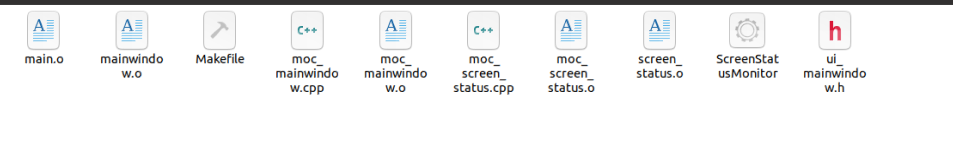

### 1. 类型转换

1. **`QString::fromUtf8(dataType)`**:使用 `fromUtf8` 将 `dataType` 从 `QByteArray` 转换为 `QString`。

2. `QJsonDocument::fromJson(data.data())`：

   > **`data.data()`**：
   >
   > - `data` 是一个 `QByteArray` 对象，包含要解析的 JSON 数据。通过调用 `data()`，你获取一个指向 `data` 内部字节数组的 `const char*` 指针，方便传递给 `fromJson()` 方法。
   >
   > **`QJsonDocument::fromJson()`**：
   >
   > - 这个静态方法用于创建 `QJsonDocument` 对象，并解析传入的 JSON 数据。如果 JSON 数据格式正确，它将返回一个有效的 `QJsonDocument` 对象；
   
3. QList转换为QStringList

     ```
     QList<QString> qlist = {"file1.txt", "file2.txt", "file3.txt"};
     QStringList qstringList(qlist);  // 直接转换
     ```

4. 

### 2. 控件

1. QFrame部件：

   1. 主要用于提供一个框架或容器，通常用于组织和装饰其他控件。它是许多其他部件（如 QLabel、QPushButton 等）的基类，提供了绘制边框和背景的功能。
   2. QFrame 可以作为一个容器，承载其他控件。比如创建一个带有背景色的区域，里面放置按钮、标签等控件

2. `QAbstractListModel` 是 Qt 框架中的一个抽象基类，用于实现基于列表的数据模型。它继承自 `QAbstractItemModel`，并简化了仅需要一维数据结构（如列表或数组）的模型实现。

3. `QAbstractListModel` 继承自 `QAbstractItemModel`，主要用来处理一维数据（如列表）。Qt的数据模型

   `QModelIndex` 是 Qt 中的一个类，用来表示 **模型中的索引**。它是与 `QAbstractItemModel`（及其子类）结合使用的，允许你在模型中定位和操作特定的数据项。

   `QModelIndex` 对象不仅代表了数据在模型中的位置，还可以包含关于该位置的额外信息（如行、列、父项等），使得它能够在视图与模型之间传递数据。

4. `QTableWidget`和`QTableView`的区别：

   1. `QTableWidget`基于项（Item-based）的表格控件，适合简单的表格数据展示，当数据量较大时，性能不如 `QTableView`

      ```c++
      #include <QApplication>
      #include <QTableWidget>
      #include <QTableWidgetItem>
      
      int main(int argc, char *argv[]) {
          QApplication app(argc, argv);
      
          QTableWidget table(3, 3); // 3行3列
          table.setWindowTitle("QTableWidget Example");
      
          // 添加数据
          for (int row = 0; row < 3; ++row) {
              for (int col = 0; col < 3; ++col) {
                  QTableWidgetItem *item = new QTableWidgetItem(QString("Item %1,%2").arg(row).arg(col));
                  table.setItem(row, col, item);
              }
          }
      
          table.show();
          return app.exec();
      }
      ```

   2. `QTableView`基于模型（Model-based）的表格控件，`QTableView` 是 `QAbstractItemView` 的子类，必须配合数据模型（`QAbstractTableModel` 或 `QStandardItemModel`）使用。符合MVC框架的支持。适合展示大量数据，性能较高，并可以自定义数据模型，支持动态数据更新。

      ```c++
      #include <QApplication>
      #include <QTableView>
      #include <QStandardItemModel>
      
      int main(int argc, char *argv[]) {
          QApplication app(argc, argv);
      
          QTableView tableView;
          tableView.setWindowTitle("QTableView Example");
      
          // 创建数据模型
          QStandardItemModel model(3, 3); // 3行3列
          for (int row = 0; row < 3; ++row) {
              for (int col = 0; col < 3; ++col) {
                  QStandardItem *item = new QStandardItem(QString("Item %1,%2").arg(row).arg(col));
                  model.setItem(row, col, item);
              }
          }
      
          tableView.setModel(&model);
          tableView.show();
      
          return app.exec();
      }
      ```

5. 全选/取消全选操作：`CheckBoxHeaderView` 通常是指一个自定义的 **表格头部** 组件（例如，继承自 `QHeaderView`），它可以包含一个 **复选框（CheckBox）**，通常用于全选或取消全选的功能。

6. `CheckBoxHeaderView` 是 Qt 中用于在 `QHeaderView` 上显示一个复选框（`QCheckBox`）的自定义视图类，通常用于表格（`QTableView`）或列表（`QListView`）等视图的头部。复选框可以用于执行某种全选/全不选的操作。例如，在表格的头部添加一个复选框来控制所有行的复选框状态。

7. `QCheckBox`，每行的选中框如何实现的，TrustandIsoDialog.cpp中666行

   ```
   m_pIpTrustHeader = new CheckBoxHeaderView(0, Qt::Horizontal, ui->tableIpTrust, 7);  // 头选框
   QCheckBox *check = new QCheckBox();  //每行的选中框
   QWidget *w = new QWidget();
   tablewidget->setCellWidget(row, col, w) //对目标tablewidget，设置参数分别是行、列、widget
   ```

8. `ptable->cellWidget(i, 0)` 是 `QTableWidget` 中的一个函数，返回位于表格 `i` 行、`0` 列的单元格中嵌入的控件（如果有）。通过这个函数，您可以访问单元格中的控件，通常是一个按钮、文本框、复选框或其他自定义控件。

9. `QRadioButton` 控件自动通过同一父控件或者同一个 `QButtonGroup` 来实现单选效果。多个 `QRadioButton` 默认只能选中一个，这是 `QRadioButton` 的基本行为

   1. 多个`QRadioButton`放到同一个父控件/同一个布局下(默认是属于同一个父控件的)
   2. 多个`QRadioButton`放到一个`QButtonGroup` 来手动分组按钮，管理一组单选按钮。

10. 关于`QStackedWidget`和`QTabWidget`的区别

   1. `QStackedWidget`不提供直接的页面切换界面（没有标签栏）。`QTabWidget`提供带标签的界面，每个标签对应一个页面。
   2. `QStackedWidget`必须通过代码手动切换页面 (`setCurrentIndex()` 或 `setCurrentWidget()`)。`QTabWidget`用户可以通过点击标签页直接切换页面。

11. 自定义控件：例`title_bar`

   12. 创建类继承于`QWidget`(所有窗口的父类)

   13. 在需要使用的UI设计中，拖入一个`Widget`组件

   14. 对该组件选择“提升为”，填入刚写的自定义控件类名

15. Qt的自定义控件、自定义事件、事件过滤器。

    1. `QWidget` 是所有控件的父类，在 `Protected Functions` 中**提供了各种事件的虚函数**。只要在子类中重写这些事件函数，则在这个部件类触发这个事件时就会产生相应操作。系统自动触发，开发者无需调用
    2. 自带的事件和自定义事件用于触发事件；`event`和`eventfliter`用于处理/拦截事件
    3. 自定义控件可以让其他widget都可以使用同一种规格的控件，不用重复创建。比如`title_bar`

16. 自定义控件**不一定只能是 `QWidget` 类**，但通常自定义控件是基于 `QWidget` 或其派生类（如 `QFrame`、`QPushButton` 等）来实现的。这是因为 Qt 的控件体系以 `QWidget` 为基类，所有用户界面控件都继承自 `QWidget`，从而具备基础的显示、事件处理和绘制能力。

17. cpp中找到自定义控件的子控件的方法：

    ```c++
    1. findChild<T>() ：通过对象名查找子控件，findChild 会递归搜索子控件树，找到第一个符合条件的子控件
        // 在 TitleBar 下查找一个 QPushButton 类型的子控件，名字为 "myButton"
        QPushButton *button = titleBar->findChild<QPushButton *>("myButton");
       
    2. findChildren<T>()：如果有多个同类型的子控件，findChildren<T>() 可以返回一个列表
    	// 查找 TitleBar 下所有 QPushButton 类型的子控件
    	QList<QPushButton *> buttons = titleBar->findChildren<QPushButton *>();
    	for (QPushButton *button : buttons) {
        	button->setText("Found!");
    	}
    	
    3.  children()：如果子控件的类型不确定，可以使用 children() 获取所有子对象
    	const QObjectList &childObjects = titleBar->children();
    	for (QObject *child : childObjects) {
        	qDebug() << "Child object:" << child->objectName();
    	}
    ```

18. 几乎所有的 Qt 控件和部件都可以设置 `objectName`。`objectName` 是 Qt 中用于标识一个控件的唯一名称，它可以帮助你在程序中引用和查找这个控件。

    ```c++
    #define DEF_OBJECT_NAME_SCAN_RUN_PROCESS_ICON "objectNameScanMemoryIcon"
    
    // 设置objectname：
    QLabel *icon = new QLabel();
        icon->setFixedSize(32, 32);
        if (iconPath.contains("cs_neicun_green"))
            icon->setObjectName(DEF_OBJECT_NAME_SCAN_RUN_PROCESS_ICON);
    
    // 查找objectname：
    QLabel *lable_icon = ui->tableScanning->findChild<QLabel *>(DEF_OBJECT_NAME_SCAN_RUN_PROCESS_ICON);
    
    // 所以使用findChild函数必须提前设置objectname，否则使用该函数不加name，只会返回第一个子控件
    QLabel *label = ui->findChild<QLabel *>("objectname");
    QLabel *label = ui->findChild<QLabel *>();		// 返回默认第一个QLabel
    ```

19. 

### 3. 布局

1. 将布局(垂直、水平等)提升为widget的好处：

   1. 自定义外观：作为一个独立的控件，可以设置样式表、背景等

      > 如果不把布局设为widget，那么设置不了布局的高度、样式表。因为布局只能设置边框距离

   2. 响应事件：可以作为widget重写widget事件

   3. 模块化设计：可以单独作为自定义控件从外部导入

2. QT的Design，当样式图标显示右下角为红色禁用标志，意思为**QWidget未设置布局**

   1. QWidget未设置布局(即打破布局)
   2. 使用了自定义的控件(widget)

   解决办法：

   1. 第一种需要往widget中拖入一个控件，然后对界面右击选择布局。(然后可以在右边设置layout的边距)
   2. 第二种无需改动

3. **珊瑚布局**，即 **网格布局（Grid Layout）**，是 Qt 中的一种布局管理器，叫做 **QGridLayout**。它将控件按行和列排列，类似于一个二维的网格表格

   1. 按行和列的方式排列控件，每个控件可以占据一个或多个网格单元。
   2. 可以通过指定行、列的位置和占据的行/列跨度来自定义控件的布局。

4. 在 **Qt 的布局** 中，如果你调用其中一个控件的 `hide()` 方法，Qt 的布局系统会自动**重新排版**其他可见的控件，隐藏的控件不会占用空间。因为 Qt 的布局管理器（如 `QHBoxLayout` 或 `QVBoxLayout`）会动态调整布局中控件的显示状态。如果控件被隐藏（`hide()`），布局会检测到并重新计算剩余控件的大小和位置。

5. 设置布局，不方便将控件拖入到布局中时，可以先将控件的上下边界设置大点，就可以拖了。


### 4. 界面

1. QApplication类：

   `QApplication` 是 Qt 应用程序的主类，管理应用程序的控制流和主要设置。它是所有 GUI 应用程序的核心类，负责处理事件循环、窗口管理、资源加载等功能。

   **主要功能**：

   1. **事件循环管理**：处理事件（鼠标点击、键盘输入等）并分发给应用程序中的对象。
   2. **应用程序配置**：设置窗口默认字体；应用程序名称、组织名称等元信息。
   3. **全局资源管理**：负责加载样式表、图标和其他应用资源。
   4. **窗口管理**：提供主窗口的集中化管理。

   **使用方式**：

   1. 每个 GUI 应用程序只能有一个 `QApplication` 实例。
   2. 必须在创建任何窗口之前实例化 `QApplication`。

   **主要函数**：

   1. 事件循环相关

      `QApplication::exec()` 是应用程序的 **事件循环启动函数**，它会启动 Qt 的事件循环并持续运行，直到应用程序退出。

      **实现原理**：

      ```c++
      int QCoreApplication::exec() {
          if (!QCoreApplication::instance()) {
              qFatal("No QApplication instance!");
              return -1;
          }
      
          // 启动事件循环
          QEventLoop loop;
          return loop.exec(); // 开始事件循环
      }
      
      int QEventLoop::exec() {
          while (!quit) {
              // 等待事件触发（阻塞）
              event = waitForEvent();
              
              // 处理事件
              processEvent(event);
          }
          return exitCode; // 返回退出代码
      }
      
      ```

      `QApplication::processEvents()` 手动处理事件队列中的事件，常用于长时间运行的任务以避免 GUI 卡顿

      `QApplication::sendEvent()` / `QApplication::postEvent()` 手动向对象发送或发布事件

      > `sendEvent()`: 同步发送事件并立即处理。
      >
      > `postEvent()`: 异步将事件加入队列稍后处理。

      `QApplication::quit()` 退出事件循环，相当于调用 `exit()`。

      `QApplication::exit(int code = 0)` 退出应用程序，并返回指定的退出代码。

   2. 应用程序信息相关

      `QApplication::applicationName()/QApplication::setApplicationName()` 获取或设置应用程序名称。

      `QApplication::organizationName()` / `QApplication::setOrganizationName()` 设置或获取应用程序所属组织名称。

      `QApplication::applicationVersion()` / `QApplication::setApplicationVersion()` 设置或获取应用程序的版本信息

   3. 全局资源管理：用于管理应用程序的全局资源，如字体、样式、图标等

      `QApplication::setStyle()` / `QApplication::style()` 设置或获取应用程序的全局样式

2. `QApplication::instance()`获取当前正在运行的 `QApplication` 对象

   ```
   QApplication::instance()->installEventFilter(this);
   ```

3. Qt的弹窗类(Dialog)设置模态/非模态的函数

   1. `exec()` 控制代码执行流，阻塞调用点：当调用 `QDialog::exec()` 时，它会启动一个**独立的事件循环**，并暂停调用 `exec()` 的线程的后续代码执行，直到对话框关闭（通过 `accept()` 或 `reject()`）。**这意味着在对话框关闭之前，`exec()` 之后的代码不会执行**
   2. `setModal(true)` 控制窗口交互，阻塞 GUI：设置对话框为模态后，它会**阻塞与其父窗口（或整个应用程序，如果没有父窗口）相关的用户交互**，但不影响代码执行（除非结合 `exec()`）

   ```
   dia.setModal(true);		// 模态，false为非模态
   
   dia.show()	// 不阻塞后续代码
   dia.exec()	// 阻塞后续代码
   ```

4. 关于Qt的界面对象，对象是new出来的，那么除非手动delete或者其父对象被释放，那么该对象会一直存在。

   点击界面的关闭按钮，实际上是调用了`close()`槽函数，而`close()`的默认行为是**将窗口设置为不可见**（`setVisible(false)`）

   关闭操作会触发`closeEvent(QCloseEvent *event)`虚函数，你可以通过重写它来改变默认行为

5. `exec()`和`show()`的区别

   1. **`exec()`**：以 **模态对话框** 的方式显示，阻塞主线程，用户必须关闭对话框后才能继续与主程序交互。
   2. **`show()`**：以 **非模态** 方式显示，不阻塞主线程，用户可以同时操作其他窗

6. 关于Qt界面先`init()`后再`show()/exec()`的问题：，在创建 `QDialog` 对象并调用 `init()` 后，`init()` 函数中的代码会立即执行，因为这部分代码并不依赖事件循环。只有那些需要事件循环来触发的操作（如计时器、动画、信号槽的触发等）才不会运行

7. Qt的Warnging弹窗，执行exec()模态框时，会阻塞当前界面，直到用户点击确定(返回`QDialog::Accepted`)或者关闭/取消(返回`QDialog::Rejected`)

   ```
   if (wDlg.exec() == QDialog::Rejected){
       QApplication::exit();
   } else {
       emit slotStartAuthManager();
   }
   ```

### 5. 事件

1. 绘图事件(`paintEvent`):

   1. 事件驱动机制：每当需要重新绘制窗口（如窗口大小改变、最小化还原、控件需要刷新等），Qt 会自动触发 `paintEvent`。

   2. 双缓冲机制：Qt 使用双缓冲技术进行绘图：先在离屏缓冲区绘制内容，再一次性更新到屏幕。

   3. 核心组件：

      1. **`paintEvent` 方法**：绘图事件的**入口**，系统自动触发
      2. **`QPainter` 类**：提供一组高效的绘图**功能**，在`paintEvent` 方法中使用，进行绘图
      3. `QPaintDevice` **目标**：需要进行绘图的**目标**，所有的窗口部件(可以作为绘图目标的对象)都继承于`QPaintDevice`类。

   4. 只能绘制单一控件：当你在 `paintEvent` 中使用 `QPainter` 绘制时，它只会影响当前控件的区域（即你重载的 `QWidget` 控件），而不会直接影响该控件下的其他子控件

   5. 绘图事件实例：

      ```c++
      void AboutusNewDlg::paintEvent(QPaintEvent *event){
              QPainter painter(this);
          	// 启用抗锯齿，使图形看起来更加平滑和柔和
              painter.setRenderHint(QPainter::Antialiasing);
      
              // 绘制上部 60% 的渐变背景
          	// 创建线性渐变对象，起点为 (0, 0)，终点为 (0, height() * 0.6)
              QLinearGradient gradient(0, 0, 0, height() * 0.6); // 渐变高度为控件高度的 60%
              gradient.setColorAt(0.0, QColor("#2952B1")); // 顶部颜色
              gradient.setColorAt(1.0, QColor("#033B83")); // 渐变到底部颜色
              painter.fillRect(0, 0, width(), height() * 0.6, gradient);
      
              // 绘制下部 40% 的纯白背景
              painter.fillRect(0, height() * 0.6, width(), height() * 0.4, Qt::white);
      }
      
      #QLinearGradient的构造函数，x为0表示垂直方向的渐变
      QLinearGradient::QLinearGradient(qreal x1, qreal y1, qreal x2, qreal y2);
      
      #setColorAt函数：设置在渐变过程中的特定位置的颜色
      void QLinearGradient::setColorAt(qreal position, const QColor &color);
      	#参数1： position：一个浮动值（0.0 到 1.0 之间），表示颜色的位置，0.0 表示起点，1.0 表示			终点。值越接近 0，颜色越接近起点；值越接近 1，颜色越接近终点。
      	#参数2：color：指定位置的颜色。
      
      #fillRect函数：在指定的矩形区域内填充指定的颜色或渐变模式
      void QPainter::fillRect(int x, int y, int width, int height, const QBrush &brush);
      	# x, y：矩形左上角的坐标。
      	# width, height：矩形的宽度和高度。
      	# brush：用于填充矩形的画刷，可以是颜色（QColor）、渐变（如 QLinearGradient）或纹理				（QPixmap
      ```

2. `QEventLoop`事件循环的**原理**：

   1. **事件循环的启动**
      - `exec()` 会启动事件循环，进入**阻塞状态，阻塞当前线程**，并开始监听事件队列。
      - 当事件（如信号、用户输入等）到达时，事件循环会调用适当的槽或处理函数。
   2. **事件的处理**
      - 事件通过 `QCoreApplication::postEvent()` 被放入事件队列。
      - `QEventLoop::exec()` 会从**队列中提取事件，并将它们分发到对应的对象**。
   3. **退出事件循环**
      - 调用 `quit()` 或 `exit()` 方法时，事件循环会停止运行，`exec()` 返回。
      - 如果指定了返回码，`exit(int)` 将返回该值

3. `QEventLoop`的**作用**:主要用于执行事件循环，以便处理不同类型的事件（如用户输入、定时器事件、信号和槽的调用等）

   1. **事件循环**是 Qt 应用程序中不可或缺的一部分，它是一个等待并处理事件的机制。Qt 中的事件循环通过 `QEventLoop` 类来实现，基本的事件循环由 `QCoreApplication` 或 `QApplication` 管理。每个 Qt 程序都需要一个事件循环来处理用户输入（如鼠标点击、键盘输入），系统事件（如定时器超时），以及其他组件之间的信号和槽的调用。

      ```C++
      #`QApplication` 的事件循环
      int main(int argc, char *argv[])
      {
          QApplication app(argc, argv);  // QApplication 启动事件循环
          MainWindow w;
          w.show();
          return app.exec();  // 进入事件循环，等待处理事件
      }
      ```

      ```c++
      #`QEventLoop` 的事件循环
      void MyClass::someFunction()
      {
          QEventLoop loop;
          connect(someObject, &SomeObject::someSignal, &loop, &QEventLoop::quit);
          
          // 执行一些操作...
          
          loop.exec();  // exec开始执行，等待直到 someSignal 被发射，事件循环会结束(调用quit)
      }
      ```

   2. `QEventLoop` 会在事件**循环**中运行，等待并处理事件。它的主要工作方式是**阻塞等待**，直到**事件队列**中有事件可以处理为止。或者直到 `quit()` 被调用

      - 用户输入事件（鼠标、键盘等）
      - 系统消息（如文件系统的更改）
      - 定时器事件
      - 信号与槽的触发
      - 自定义的事件（通过 `QCoreApplication::postEvent` 发送）

   3. 信号槽与事件循环：

      1. 信号触发时，信号会被放入事件队列。
      2. 事件循环会在处理完当前的事件后继续处理队列中的信号。
      3. 如果信号与槽的连接是 **队列连接**，槽函数会在事件循环的下一次迭代中执行，而不会阻塞当前的槽函数。
      4. 如果信号与槽的连接是 **直接连接**，槽函数会同步执行（通常是在信号发射的地方

4. QEventLoop事件循环和信号槽连接函数`connect`第五个参数连接类型之间的关系：

   ```c++
   int QEventLoop::exec() {
       while (!quit) {
           // 等待事件触发（阻塞）
           event = waitForEvent();
           
           // 处理事件
           processEvent(event);
       }
       return exitCode; // 返回退出代码
   }
   ```

   1. 使用QEventLoop的`exec()`后会**阻塞等待事件触发**

   2. 当事件触发后，Qt 的事件系统会根据**信号槽连接类型**和**线程上下文**决定是直接触发还是排队处理。

      > 比如connect函数是直接连接，那么此处使用`sendEvent()`**同步**发送事件并立即处理。
      >
      > 如果是队列连接，那么此处使用`postEvent()`**异步**将事件加入队列稍后处理。
      >
      > 注意： 使用队列连接时，信号槽**依赖目标线程的事件循环**；如果目标线程没有事件循环，信号不会被处理。

   3. 直到执行了`quit()`或`exit()`函数会停止循环，并返回

   4. 信号槽连接方式使用队列连接实质：当你在 Qt 中使用 `Qt::QueuedConnection` 来连接信号和槽时，信号并不会立即触发槽函数，而是**将信号作为事件放入目标线程的事件队列中**。这个事件队列中的事件需要通过 **目标线程的事件循环**（即该线程调用的 `exec()` 函数）来处理。

5. **事件**是如何定义、触发、使用的

   1. 重载特定事件处理函数(`QWidget`定义好的虚函数)：每个控件都有一组专门的事件处理函数，你可以重载这些函数以实现自定义行为

      ```
      #常用事件处理函数
      鼠标事件：mousePressEvent、mouseReleaseEvent、mouseMoveEvent。
      键盘事件：keyPressEvent、keyReleaseEvent。
      窗口事件：resizeEvent、paintEvent。
      焦点事件：focusInEvent、focusOutEvent。
      ```

      ```c++
      #include <QWidget>
      #include <QMouseEvent>
      #include <QDebug>
      
      #示例：鼠标事件处理
      class MyWidget : public QWidget {
      protected:
          void mousePressEvent(QMouseEvent *event) override {
              if (event->button() == Qt::LeftButton) {
                  qDebug() << "Left mouse button clicked at:" << event->pos();
              }
          }
      };
      ```

   2. 自定义事件

      ```
      #步骤
      1. 创建自定义事件类，继承自 QEvent。
      2. 使用 QCoreApplication::postEvent 或 QApplication::sendEvent 发送事件。
      3. 重载 event() 函数处理事件。
      ```

      ```c++
      #include <QEvent>
      #include <QApplication>
      #include <QWidget>
      #include <QDebug>
      
      // 自定义事件类型
      class MyCustomEvent : public QEvent {
      public:
          static const QEvent::Type EventType;
          MyCustomEvent() : QEvent(EventType) {}
      };
      
      const QEvent::Type MyCustomEvent::EventType = static_cast<QEvent::Type>(QEvent::User + 1);
      
      class MyWidget : public QWidget {
      protected:
          bool event(QEvent *event) override {
              if (event->type() == MyCustomEvent::EventType) {
                  qDebug() << "Custom event received!";
                  return true;
              }
              return QWidget::event(event);
          }
      };
      
      int main(int argc, char *argv[]) {
          QApplication app(argc, argv);
      
          MyWidget widget;
          widget.show();
      
          // 发送自定义事件
          QCoreApplication::postEvent(&widget, new MyCustomEvent());
      
          return app.exec();
      }
      ```

   3. `eventFilter`事件拦截器：用于拦截和过滤某个对象的事件，它允许你在事件到达目标对象之前对其进行预处理

      ```
      installEventFilter(QObject *filterObj)
         installEventFilter() 是目标对象的方法，用于为目标对象安装一个事件过滤器（filterObj）。
      	一旦安装了事件过滤器，filterObj 的 eventFilter() 方法会接收目标对象的所有事件。
      
      #作用范围：
      1. 目标对象本身的事件：包括鼠标事件、键盘事件等。
      2. 目标对象的子对象的事件（如果 filterObj 安装在父对象上）。
      ```

      ```
      eventFilter(QObject *watched, QEvent *event)
      	eventFilter() 是过滤器对象（filterObj）的方法，用于处理目标对象传递的事件。当目标对象接收到事件时，Qt 会先调用 filterObj 的 eventFilter() 方法。
      	
      #参数
      1. watched：目标对象（即安装了当前过滤器的对象）。
      2. event：发生的具体事件（如鼠标事件、键盘事件等）。
      #返回值
      1. true：表示事件已被过滤器处理，目标对象不会再处理该事件。
      2. false：事件未被处理，会继续传递到目标对象。
      ```

      ```
      #步骤：
      1. 调用 installEventFilter() 在对象上安装过滤器，设置哪个对象的事件需要被过滤器对象监控。
         
      2. 重载过滤器对象的 eventFilter() 方法处理事件，eventFilter() 是事件过滤器的具体实现，用于拦截和处理事件
      ```

      ```c++
      #include <QApplication>
      #include <QWidget>
      #include <QEvent>
      #include <QDebug>
      
      # 示例：当widget的鼠标被按下时，将会进入eventFilter处理中
      class MyFilter : public QObject {
      protected:
          bool eventFilter(QObject *watched, QEvent *event) override {
              if (event->type() == QEvent::MouseButtonPress) {
                  qDebug() << "Mouse button press detected on" << watched;
                  return true; // 阻止事件继续传递
              }
              return QObject::eventFilter(watched, event);
          }
      };
      
      int main(int argc, char *argv[]) {
          QApplication app(argc, argv);
      
          QWidget widget;
          MyFilter filter;
      
          widget.installEventFilter(&filter);
          widget.show();
      
          return app.exec();
      }
      ```

   4. 重载 `event()` 函数：拦截特定种类的事件。`event()` 是所有事件的**入口点**。它是事件分发的主要入口，Qt 框架会调用这个函数，将事件分发到具体的处理函数（如 `mousePressEvent`、`keyPressEvent` 等）。如果需要统一处理某些事件类型，可以重载 `event()`。

      ```c++
      #include <QEvent>
      #include <QDebug>
      
      #示例：拦截特定事件
      class MyWidget : public QWidget {
      protected:
          bool event(QEvent *event) override {
              if (event->type() == QEvent::KeyPress) {
                  qDebug() << "Key press detected!";
                  return true; // 阻止进一步处理
              }
              // 其他事件交给基类处理
              return QWidget::event(event); // 调用基类处理,进入特定事件处理函数
          }
      };
      
      ```

   5. 优先级顺序

      ```
      1. eventFilter() 处理最优先。
      2. 如果过滤器不处理，则进入 event()。
      3. 如果 event() 不处理，则进入特定事件处理函数（如 mousePressEvent）。
      ```

   6. 总结

      ```
      简单事件处理：重载特定事件处理函数。
      复杂事件处理：重载 event()。
      自定义事件：扩展 QEvent，并通过 postEvent 或 sendEvent 发送。
      全局监听：使用事件过滤器,适合跨对象的事件监控和过滤
      ```

6. `event->type() > QEvent::User` 的含义：`QEvent::User` 是一个事件类型常量，用于标识用户自定义事件的起始范围。它的值通常定义为一个整数（如 1000），大于这个值的事件类型都属于用户定义事件。

### 6. 信号槽

1. 在 Qt 中，信号在 **定义** 和信号和槽在**建立信号槽连接(connect)** 时，可以只写 **数据类型** 而省略形参名称。

   信号和槽的功能不受形参名称的影响，关键在于 **数据类型的匹配**，即信号和槽的参数类型需要一致

2. 两种信号槽的连接方式

   ```
   connect(m_pZDFYModel, SIGNAL(sigSyncCount(std::map<uint8_t, uint64_t>)), this, SLOT(slotSyncCount(std::map<uint8_t, uint64_t>)));
   connect(m_pZDFYModel,&CZDFYModel::sigSynNetWhite,this,&FramelessWindow::slotSynNetWhite);
   ```

3. Qt的`main`函数中使用`connect`函数注意事项：

   1. SIGNAL和SLOT类都得继承于QObject

   2. 使用`QObjdet::connect`

      ```
      QObject::connect(&a, &a::signal_a, &b, &b::slot_b);
      ```

   3. SIGNAL和SLOT类使用`new`创建堆对象，不能创建栈对象。因为一般是两个类之间的通信，栈对象出了函数作用域会被销毁。

4. 本地信号槽

   ```
   connect(this,&AuthManger::function,[](){})
   ```

5. Qt的按钮或者选择框，生成的点击槽函数：

   1. 点击控件，自动会修改界面控件状态(被选中/取消选中(单选框radio没有))，然后执行槽函数
   2. 在cpp代码中直接调用槽函数，只会执行函数代码，不会触发控件的状态效果。

6. Qt中的信号函数，可以不加`emit`；`emit` 关键字只是为了表达意图，不是必须的，它本质上没有其他功能

   1. 在类内部，可以省略 `emit`，直接调用信号的名字。
   2. 使用 `emit` 是为了代码的可读性和明确性

7. FramlessWindow(主界面)和scanModel(模型)：

   1. 界面想通过模型与safed交流，直接调用模型的函数即可(效果和在该类使用信号槽一样)，不用使用信号槽

   2. 模型接收到safed的信息反馈给界面，需要使用信号槽，因为信号槽无法在自己的类中与主界面交流

      > 所以**信号槽本质上是解耦发送者和接收者，解决不同界面/协助类之间交互问题**

8. 更高级一点就是connect的第五个参数：

   1. 如果是直连，那么就**类似于普通函数调用**，在发出信号的线程中执行，**执行是同步的**
   2. 如果是队列连接，那么信号被放入接收方的事件队列，等待事件循环处理。**执行是异步的**，发出信号的线程不会等待槽函数完成
   3. 自动连接，就会根据是否在同一线程选择直连/队列连接

   > 所以大部分情况，都使用信号槽的异步处理，同步处理直接调用函数即可

9. 信号槽参数的匹配机制，如果不遵守该机制会导致槽函数无法被信号触发

   Qt 的信号槽机制依赖于**类型安全**和**参数匹配**：

   1. 信号和槽的签名（参数类型和数量）必须兼容。
   2. 槽函数的参数数量可以**少于或等于**信号的参数数量，但不能多于信号。
   3. 参数类型必须**完全匹配**或**可隐式转换**。

   > C++ 允许从 T& 到 const T& 的隐式转换，但**反过来不行**（const T& 不能隐式转换为 T&），因为这会违反 const 的语义。

10. Qt中，只要自己创建的窗口还存在(没有调用close)，本类绑定的信号槽就能与之建立连接

    ```c++
    void TrustAndIsoDialog::on_btnAddBlack_clicked()
    {
        CAddBlacklistDialog *dlg = new CAddBlacklistDialog(this);
        connect(this, SIGNAL(sigBlackAddFinish(const bool &)), dlg, SLOT(slot_addBlackFinish(const bool &)));
        dlg->exec();
    }
    ```

11. Qt关于信号和槽的参数问题

    1. 信号和槽函数能否省略形参名称

       1. **信号**：信号没有实现，因此省略形参名称不会有任何问题。
       2. **槽**：如果槽只是声明（头文件），可以省略名称；但在定义（实现）时需要名称，以便在函数体内使用参数。

    2. 使用 `connect` 函数时省略形参名称：在使用 connect 函数时，信号和槽的签名通常通过函数指针或旧式的 SIGNAL 和 SLOT 宏指定。无论哪种方式，形参名称都可以省略

       1. 新式语法(基于函数指针)，编译器直接根据函数签名匹配

          ```
          connect(&sender, &MyClass::mySignal, &receiver, &MyClass::mySlot);
          ```

       2. 旧式语法(基于宏)，可以只写类型，省略形参名称

          ```
          connect(&sender, SIGNAL(mySignal(int,double)), &receiver, SLOT(mySlot(int,double)));
          ```

    3. 关于参数基本要求以及使用引用(&)

       1. **参数要求**：信号和槽的参数类型**需匹配**；数量上槽可以**少于**信号；参数类型必须精确匹配或**可隐式转换**(例如，信号的 `int` 可以连接到槽的 `double`，但反过来不行。)

       2. 信号和槽的参数是通过**值传递**（copy）进行的，即使在信号或槽中使用了引用（`&` 或 `const &`），参函数中使用的还是信号参数的副本。

          > 因为值传递，信号使用 & 没有意义，同理槽函数单使用 & 也没有意义
          >
          > 槽函数使用 const & ，可以避免从副本拷贝到作用域，可行，推荐复杂类型时使用。

       3. 如果信号和槽在不同线程中运行（例如使用 `Qt::QueuedConnection`），参数会被序列化并拷贝到目标线程

12. 创建窗口，多次连接信号槽的原因和解决办法：

    **背景**：想要通过信号槽，更改弹窗中的文字，使用了动态分配，但是没有释放内存(等待Qt父对象释放自动释放子对象)

    ```c++
    void TrustAndIsoDialog::on_btnAdd_clicked()
    {
        AddTrustTermDlg *add_dlg = new AddTrustTermDlg(this);
        connect(this, SIGNAL(sigTrustAddFinish(bool)), add_dlg, SLOT(slot_trustAddFinish(bool)), Qt::UniqueConnection);
        add_dlg->exec();
    }
    ```

    **现象/原因**：每次打开添加界面(调用该`on_btnAdd_clicked()`)，当触发信号`sigTrustAddFinish`时，之前创建过几次`add_dlg`对象，就会调用几次`slot_trustAddFinish`槽函数。原因在于由于父窗口没有释放，之前创建的`dlg`都没有被释放，导致每次信号都会调用之前所有对象的槽函数

    **解决**：

    1. 每次用完手动释放(`delete`)对象

    2. 将对话框(`AddTrustTermDlg`)作为成员变量，只创建一次。

    3. 每次点击时，先断开之前的连接再建立新的连接

       ```c++
       disconnect(this, SIGNAL(sigTrustAddFinish(bool)), nullptr, nullptr); // 断开所有与该信号的连接
       connect(this, SIGNAL(sigTrustAddFinish(bool)), add_dlg, SLOT(slot_trustAddFinish(bool)));
       ```

13. 关于`disconnect`：

    1. 断开特定的信号和槽连接

       ```c++
       disconnect(sender, SIGNAL(signalName()), receiver, SLOT(slotName()));
       ```

    2. 断开某个信号的所有连接

       ```c++
       disconnect(sender, SIGNAL(signalName()), nullptr, nullptr);
       ```

    3. 断开某个对象的所有信号和槽连接

       ```c++
       disconnect(sender, nullptr, nullptr, nullptr);
       ```

    4. 断开接收者的所有连接

       ```c++
       disconnect(receiver);
       ```

    > 在 `disconnect` 中使用 `nullptr` 是一种“通配符”，表示“匹配任意值”。

14. `Qt::UniqueConnection`有什么作用：

    `Qt::UniqueConnection` 是一个连接标志，它确保**完全相同的信号和槽对（即相同的发送者、信号、接收者和槽）只连接一次**。如果已经存在相同的连接，后续的 `connect` 调用会被忽略。

15. 为什么使用`Qt::UniqueConnection`解决不了上述办法？

    - 因为每次创建的 `add_dlg` 是不同的对象(使用了`new` 动态分配了一个`dlg`对象)，**它的内存地址不同**。
    - 因此，从 Qt 的角度来看，每次 `connect` 的接收者（`add_dlg`）是不同的对象，即使信号（`sigTrustAddFinish`）和槽（`slot_trustAddFinish`）相同，Qt 也不会认为这是“相同的连接”，`Qt::UniqueConnection` 就无法阻止新的连接被添加。
    - **结果**：每次点击都会添加一个新的连接，导致信号发射时所有之前的 `add_dlg` 实例都会收到信号并调用槽函数

16. 关于槽函数slot的访问权限(public protected private)

    1. signal没有访问权限限制。
    2. **访问权限只对外部代码的直接调用有效**，对信号-槽机制无影响(只要是槽函数就可以进行信号-槽机制的连接)。
    3. 比如：private slot只能进行信号槽机制的连接，不可以在外面直接像调用成员函数一样调用该槽函数

    | 特性                 | `private slots`              | `protected slots`            | `public slots`             |
    | -------------------- | ---------------------------- | ---------------------------- | -------------------------- |
    | **访问权限**         | 类本身和友元可以访问         | 类本身、子类和友元可以访问   | 外部代码可以访问           |
    | **典型用途**         | 内部逻辑实现细节，不对外开放 | 需要子类继承、扩展的内部逻辑 | 提供对外接口，同时响应信号 |
    | **子类访问**         | 不可以                       | 可以                         | 可以                       |
    | **外部代码直接调用** | 不可以                       | 不可以                       | 可以                       |

17. 如果在使用lambda的情况下使用信号槽，需要解绑时，需要保存lambda函数的实例。

    ```
    // 定义一个 lambda 函数
        auto lambdaSlot = [=]() {
            label->setText("Button clicked!");
        };
    ```

18. 可以发射成员对象里的信号

    ```
    emit m_authManager->sigRegistInfoTable();
    ```

19. 信号和槽函数都使用 `void` 类型的原因：

    1. 设计如此，**异步事件处理**不需要关心返回值
    2. 信号槽机制，信号只管发射，可以有多个槽函数应答；同理，多个信号可以只有一个槽函数应答。


### 7. 样式表

1. 单次点击的按钮(添加、删除)QPushButton样式表示例，需设置禁用后的状态

   ```
   QPushButton {
       border-radius: 5 5 5 5; /* 设置按钮圆角，4个数字分别对应左上、右上、右下、左下的圆角半径 */
       color: #FFFFFF;        /* 按钮文字颜色为白色 */
       font: bold;            /* 文字加粗 */
       border: none;          /* 取消按钮的边框 */
       background-color: #3883FC; /* 按钮的背景色设置为蓝色 (#3883FC) */
       border-style: inset;   /* 如果使用边框，它是内凹样式 */
       border-width: 1px;     /* 边框宽度为 1 像素 */
       border-color: #1f66c0; /* 边框颜色为较深的蓝色 (#1f66c0) */
   }
   
   
   QPushButton:hover {
       background-color: #4090FF; /* 鼠标悬停时背景颜色变为更亮的蓝色 (#4090FF) */
       color: white;             /* 悬停时文字颜色保持白色 */
   }
   
   QPushButton:disabled {
       color: #808080;           /* 禁用状态下文字颜色为灰色 */
       background-color: #cccccc; /* 禁用状态下背景颜色为浅灰色 (#cccccc) */
       border-color: lightgray;  /* 禁用状态下边框颜色为浅灰色 */
   }
   ```

2. 类似tab切换页面的QPushButton的样式表示例，将`checkable`选项选中，再在样式表中设置check后的状态

   ```
   QPushButton{
   	border:none;
   	color:#666666;
   	font-size:16px;
   }
   QPushButton:hover{
   	color:#2883FC;
   }
   QPushButton:checked{
   	color:#2883FC;
   }
   ```

3. 类似`:hover`和`:checked`是控件的伪状态。**伪状态（例如 `:hover`、`:disabled` 等）只会覆盖它们显式定义的属性**，未覆盖的属性仍会继承原有的默认样式或父选择器的样式。

4. 样式表直接给控件设置样式是不需要加`":"`的。伪控件才需要加`":"`，子控件需要加`"::"`

5. ```
   border: 1px solid rgba(0, 110, 234, 1);
   border-radius: 2px;
   
   1px: 这是边框的宽度，表示边框的厚度为 1 像素。
   solid: 表示边框是实线。solid 是最常用的边框样式，此外还有 dotted（点线）、dashed（虚线）等选项。
   rgba(0, 110, 234, 1): 这是边框的颜色，使用的是 rgba（红、绿、蓝、透明度）格式，表示：
   2px: 表示圆角的半径，决定了边框的圆滑程度。较小的值会有轻微的圆角效果，而较大的值会让控件的角变得更圆。
   ```

   

### 8. 线程进程

1. `QAtomicInt` 是 Qt 提供的一个 **原子整数类型**，主要用于在多线程环境下进行线程安全的整数操作。

   `storeRelease` 和 `loadAcquire` 配合使用可以保证多线程操作的内存一致性：

   - **Release** 语义：确保当前线程的写操作在 `storeRelease` 之前对其他线程可见。
   - **Acquire** 语义：确保当前线程的读取操作在 `loadAcquire` 之后看到其他线程的最新写操
   
   

### 9. 时间

1. Qt时间相关函数

   ```
   time_t addtime  = time(nullptr);    #获取当前时间戳，time_t就是保存时间戳的变量
   
   QDateTime localDateTime = QDateTime::fromMSecsSinceEpoch(info.addTime*1000);
   object.m_trusttime = localDateTime.toString("yyyy.MM.dd hh:mm");	#将时间戳转化为字符串
   ```

   

### 10. 项目构建

1. Qt图片路径：使用了 `:/` 前缀，表示这是一个 Qt 资源路径；资源文件必须在项目的资源文件（`.qrc` 文件）中声明。

   ```
   QIcon jy_icon(":/skins/icon/logo_64_blue.png");
   app.setWindowIcon(jy_icon);
   ```

4. Qt快捷键：

   ```
   QtCreator的界面预览： Shift + Alt + R
   运行快捷键：Ctrl+R
   只构建快捷键：Ctrl+B
   ```

3. 移动Qt文件：

   1. 手动迁移文件
   2. 修改pro文件内容，将`.h` `.cpp` `.ui`文件路径全部修改

4. 修改了Qt Creator中控件的名字，在vscode的cpp中访问不到，此时build即可

5. Qt Creator中构建项目后，找不到构建后的文件夹：此时在Qt Creator中左侧栏选择项目选项、有个构建目录，选择即可

6. Qt创建项目->Qt Console Application  创建的是终端应用(无界面)，

   1. 此时pro文件配置为

      ```
      QT += core
      QT -= gui	// 去掉gui
      ```

   2. main函数中使用`QCoreApplication`

      ```
      QCoreApplication a(argc, argv);
      ```

      > `QCoreApplication` 是 Qt 的基础应用程序类，主要用于纯计算型应用程序或后端服务，适用于非图形化的应用程序。不需要图形用户界面，但仍需要 Qt 的事件处理、定时器、文件操作等功能
      >
      > `QApplication` 是一个继承自 `QCoreApplication` 的子类，专为 GUI 应用程序设计。必须用于图形界面应用程序，包含对窗口、控件、布局等的支持。

7. Qt对项目执行build构建(即编译+链接)，产生一系列文件，并分析这些文件如何产生的：

   ****

   1. 目标文件（.o 或 .obj）：每个 `.cpp` 文件（包括手写的源文件和生成的 `moc_*.cpp` 文件）都会被编译成一个目标文件。即编译、汇编之后的二进制文件

   2. moc 文件（moc_\*.cpp）：对于包含 Q_OBJECT 或 Q_GADGET 宏的头文件，Qt 的元对象编译器（moc）会生成对应的 moc.cpp 文件

   3. UI 文件（ui_\*.h）：如果项目使用了 Qt Designer 创建的 .ui 文件，uic（用户界面编译器）会生成对应的 ui\*.h 头文件

   4. 资源文件（qrc_*.cpp）：如果项目使用了 .qrc 资源文件，rcc（资源编译器）会生成对应的 qrc.cpp 文件

   5. 可执行文件：上述都是中间件文件，最终链接成一个可执行文件（ELF 格式，Executable and Linkable Format）

   6. > `LD_LIBRARY_PATH=$PWD ./ScreenStatusMonitor`，如果运行时需要链接动态库

8. 关于moc文件：

   **触发条件**：当一个类声明中包含 `Q_OBJECT` 或 `Q_GADGET` 宏时，moc 会被调用。这些宏告诉构建系统，该类需要额外的元对象代码来支持 Qt 的特性（如信号与槽）

   **生成过程(使用qmake)**：

   1. 在 .pro 文件中定义源文件和头文件后，qmake 会扫描头文件，检测 Q_OBJECT。

   2. 运行 qmake 生成 Makefile，其中包含调用 moc 的规则：

      ```
      moc_myclass.cpp: myclass.h
          moc $(DEFINES) $(INCPATH) $< -o $@
      ```

   3. 然后，make 会编译生成的 `moc_myclass.cpp` 为 `moc_myclass.o`。

   **moc文件内容**：

   1. 信号的具体实现：为每个信号生成一个函数（如 mySignal），通过 `QMetaObject::activate` 触发连接的槽
   2. 元对象（QMetaObject）的定义：定义 `staticMetaObject`，存储类的元信息（信号、槽、属性等）
   3. 动态调用支持：通过 `qt_static_metacall` 函数实现信号和槽的运行时调用

