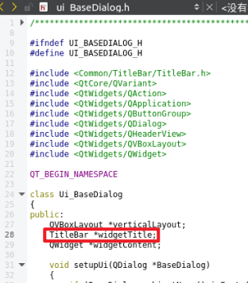
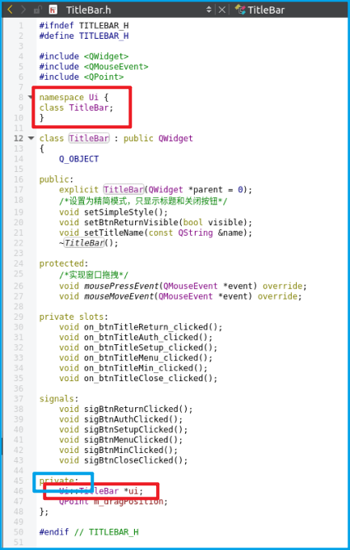
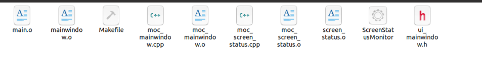

### 1. 类型转换

1. **`QString::fromUtf8(dataType)`**:使用 `fromUtf8` 将 `dataType` 从 `QByteArray` 转换为 `QString`。

2. `QJsonDocument::fromJson(data.data())`：

   > **`data.data()`**：
   >
   > - `data` 是一个 `QByteArray` 对象，包含要解析的 JSON 数据。通过调用 `data()`，你获取一个指向 `data` 内部字节数组的 `const char*` 指针，方便传递给 `fromJson()` 方法。
   >
   > **`QJsonDocument::fromJson()`**：
   >
   > - 这个静态方法用于创建 `QJsonDocument` 对象，并解析传入的 JSON 数据。如果 JSON 数据格式正确，它将返回一个有效的 `QJsonDocument` 对象；
   
3. QList转换为QStringList

     ```
     QList<QString> qlist = {"file1.txt", "file2.txt", "file3.txt"};
     QStringList qstringList(qlist);  // 直接转换
     ```


### 2. MVC模型

Qt的MVC（Model-View-Controller）模型是一种用于组织用户界面应用程序的设计模式，广泛应用于Qt框架中，尤其是通过`QAbstractItemModel`及其派生类实现数据和视图的分离。

1. Qt的MVC模型实例

   1. TableView设置垂直和水平表头，按需要可以设定**自定义表头**(继承于QHeaderView，重写paint函数），比如表头第一列有一个全选checkBox按钮

      ```c++
       m_HeadView = new CheckBoxHeaderView(1, Qt::Horizontal, ui->tableView, 12);
       ui->tableView->setHorizontalHeader(m_HeadView); // 水平表头为自定义表头
      ```

   2. TableView中某列/某行需要设定特别样式/控件，需要使用**自定义代理**，比如最后一列为删除按钮

      ```c++
      ButtonTimedTaskDelegate *buttonDelegate = new ButtonTimedTaskDelegate();
      ui->tableView->setItemDelegateForColumn(5, buttonDelegate);
      connect(buttonDelegate, SIGNAL(sigBtnClicked(QModelIndex)), this, SLOT(slot_deleteButton_clicked(QModelIndex)));
      ```

   3. 设置QHeaderView和TableView的样式，项目放在common.qss

      > 子控件section表示表头的每个部分

   4. TableView设置model，model实现填充表头和内容；TableView来设置间隔、样式

   5. 自定义代理后(对某列进行代理)：

      1. paint用来绘制(该列中)每个单元格的样式(静态内容)

      2. creatEditor()用来创建并返回一个编辑器（交互控件，动态内容）

         > (普通代理) 默认触发这个编辑器的方式是双击,或者F12，由Qt的视图框架自动调用该函数。当编辑完成(输入enter键/点击其他单元格)视图框架将会自动销毁该编辑器，并释放内存
         >
         > (持久化代理)关闭了触发方式，在paint手动调用该函数实现持久存在(自定义了一个map，保存调用该函数返回的widget)，绕过了 Qt 的编辑框架（editTriggers 和编辑流程），因此编辑器不会被 Qt 自动销毁

      3. 两个set函数，一个是从编辑器数据写回到model，一个是将model数据设置到编辑器

   6. QModelIndex保存的是这个单元格的位置信息以及model数据

2. MVC中的自定义代理，当对同一列进行代理的时候，

   1. 每个单元格都会调用一次代理的重写的`paint()`，用来绘制内容

   2. 但是Qt 并不会为每个单元格都创建一个新的 QWidget(在paint中绘制的内容)

   3. **真正创建的 widget（通过 `createEditor()`）一般只有一两个**，Qt 会 **重用这些 widget**，把它们放到当前可视单元格的位置上。

      > 效果上是每个单元格都会有这个widget，但是实际上只会有一两个打印信息(多的话两个少的话一个)

   4. 每个单元格上的内容实际上是 **同一个 widget 被移动和重绘**，用来减少开销

3. 

4. MVC模式将应用程序逻辑分为三个核心组件：

   - **Model（模型）**：负责管理数据和业务逻辑，提供数据的存储、查询和更新功能。它是数据的核心，独立于用户界面。
   - **View（视图）**：负责显示数据给用户，从模型获取数据并以可视化方式呈现（如表格、树形视图或列表）。
   - **Controller（控制器）**：在传统MVC中，控制器处理用户输入并协调模型和视图的交互。在Qt中，控制器通常由视图本身或应用程序逻辑实现，简化了设计。

5. 在Qt中，MVC模式更倾向于Model/View架构，控制器功能通常由视图类或外部逻辑承担，Qt的视图组件直接处理用户输入并与模型交互。

6. MVC的优点：

   - **数据与显示分离**：模型独立于视图，修改数据不影响显示逻辑。
   - **复用性**：同一模型可被多个视图使用（如列表视图和树视图同时显示同一数据）。
   - **灵活性**：通过自定义模型、视图和代理，可以实现复杂的数据展示和交互。
   - **动态性**：支持动态数据更新，视图自动反映变化。
   - **模块化**：便于维护和扩展，适合大型应用程序。

7. **Model**：

   核心类：`QAbstractItemModel`（抽象基类，适用于树形、表格和列表数据）。

   派生类：

   - `QAbstractListModel`：用于一维列表数据。
   - `QAbstractTableModel`：用于二维表格数据。
   - `QStringListModel`：简单字符串列表模型。
   - `QStandardItemModel`：通用的树形/表格模型。

   > **自定义模型**：开发者可以通过继承QAbstractItemModel实现自定义数据结构。

   功能：

   - 存储和操作数据。
   - 提供数据访问接口（如`data()`和`setData()`）。
   - 通过信号（如`dataChanged()`）通知视图数据变化。
   - 支持动态数据操作（如插入、删除行或列）。

8. **View**:

   核心类：`QAbstractItemView`（抽象基类）。

   派生类：

   - `QListView`：显示列表数据。
   - `QTableView`：显示表格数据。
   - `QTreeView`：显示树形数据。
   - `QColumnView`：分栏显示。

   > 自定义视图：开发者可以继承QAbstractItemView实现特定显示需求。

   功能：

   - 从模型获取数据并显示。
   - 处理用户交互（如选择、编辑、滚动）。
   - 支持多种显示方式（如图标视图、表格视图）。

9. **Delegate**（代理）

   核心类：`QAbstractItemDelegate`。

   派生类：`QStyledItemDelegate`（默认代理，支持样式表）。

   > 自定义代理：通过继承`QAbstractItemDelegate`，可以自定义渲染逻辑（如显示进度条、复选框等）。

   功能：

   - 负责渲染和编辑模型中的数据项。
   - 控制视图中每个单元格的显示方式（如自定义控件、格式化数据）。
   - 处理用户输入（如编辑单元格内容）。

10. **Controller**

   Qt中没有显式的控制器类，控制逻辑通常嵌入在视图或应用程序代码中。

   视图通过**信号和槽机制**响应用户操作（如点击、双击、键盘输入），并调用模型的接口更新数据。

   开发者可以通过连接信号和槽自定义交互逻辑。

   > 比如点击翻页、切换页码时，调用信号槽通知model层向助手层发送信号请求获取信息

11. `QModelIndex` 是 Qt 中的一个类，用来表示 **模型中的索引**。它是与 `QAbstractItemModel`（及其子类）结合使用的，允许你在模型中定位和操作特定的数据项。

    `QModelIndex` 对象不仅代表了数据在模型中的位置，还可以包含关于该位置的额外信息（如行、列、父项等），使得它能够在视图与模型之间传递数据。

12. 目前项目中（未重构界面前的708）使用了自定义的Model(即继承了`QAbstractItemModel`，如`LogDataModel`)。但是其并没有使用MVC模型，其没有使用view来展示数据，只是收到新的数据后，调用model的setData函数修改model的数据，随后将目标单元格样式和内容重新设置

    > 详见：ProtectlogDialog.cpp中`setCellContent()`函数

13. `QTableWidget`和`QTableView`的区别：

    1. `QTableWidget`基于项（Item-based）的表格控件，适合简单的表格数据展示，当数据量较大时，性能不如 `QTableView`

       ```c++
       #include <QApplication>
       #include <QTableWidget>
       #include <QTableWidgetItem>
       
       int main(int argc, char *argv[]) {
           QApplication app(argc, argv);
       
           QTableWidget table(3, 3); // 3行3列
           table.setWindowTitle("QTableWidget Example");
       
           // 添加数据
           for (int row = 0; row < 3; ++row) {
               for (int col = 0; col < 3; ++col) {
                   QTableWidgetItem *item = new QTableWidgetItem(QString("Item %1,%2").arg(row).arg(col));
                   table.setItem(row, col, item);
               }
           }
       
           table.show();
           return app.exec();
       }
       ```

    2. `QTableView`基于模型（Model-based）的表格控件，`QTableView` 是 `QAbstractItemView` 的子类，必须配合数据模型（`QAbstractTableModel` 或 `QStandardItemModel`）使用。符合MVC框架的支持。适合展示大量数据，性能较高，并可以自定义数据模型，支持动态数据更新。

       ```c++
       #include <QApplication>
       #include <QTableView>
       #include <QStandardItemModel>
       #include <QMainWindow>
       
       int main(int argc, char *argv[]) {
           QApplication app(argc, argv);
       
           // 创建主窗口
           QMainWindow window;
       
           // 创建模型
           QStandardItemModel model(4, 3); // 4行3列的表格
           model.setHorizontalHeaderLabels({"Name", "Age", "City"}); // 设置表头
       
           // 填充数据
           for (int row = 0; row < 4; ++row) {
               for (int col = 0; col < 3; ++col) {
                   QStandardItem *item = new QStandardItem;
                   if (col == 0) {
                       item->setText(QString("Person %1").arg(row + 1));
                   } else if (col == 1) {
                       item->setText(QString::number(20 + row * 5));
                   } else {
                       item->setText(QString("City %1").arg(row + 1));
                   }
                   model.setItem(row, col, item); // 设置数据项
               }
           }
       
           // 创建表格视图
           QTableView *tableView = new QTableView(&window);
           tableView->setModel(&model); // 关联模型
           tableView->setWindowTitle("TableView Example");
           tableView->resize(400, 300);
       
           // 设置表格属性
           tableView->setAlternatingRowColors(true); // 交替行颜色
           tableView->setSelectionMode(QAbstractItemView::SingleSelection); // 单选模式
           tableView->setEditTriggers(QAbstractItemView::DoubleClicked); // 双击编辑
       
           // 动态添加一行数据
           model.insertRow(model.rowCount());
           model.setData(model.index(model.rowCount() - 1, 0), "New Person");
           model.setData(model.index(model.rowCount() - 1, 1), "30");
           model.setData(model.index(model.rowCount() - 1, 2), "New City");
       
           return app.exec();
       }
       ```

    3. 也就是TableWidget对数据的修改需要重新通过表格(TableWidget)来设置数据/样式，而TableView只需要设置一次样式后，设置了model，对数据的修改只需要通过model来操作，数据可以动态更新，数据动态更新后，视图会自动刷新。

14. 自定义代理：比如防护日志界面，根据其有无detail来改变其样式且如果不为空还要绑定信号槽。如果使用MVC模型，则不能使用静态的样式表，需要使用自定义代理，不同的数据来展示不同的样式

    自定义代理的使用步骤：

    1. 继承`QStyledItemDelegate`

       - 创建一个自定义类，继承`QStyledItemDelegate`。

       - **重写`paint()`**方法实现自定义渲染。

         > `paint()`方法是`QStyledItemDelegate`的虚函数，视图（如`QTableView`）在需要绘制单元格时会自动调用它。
         >
         > 每次视图需要重绘（例如窗口刷新、数据变更、滚动、调整大小等），Qt会遍历可见单元格，调用代理的`paint()`方法来渲染每个单元格。
         >
         > ```
         > // paint()的三个参数
         > QPainter *painter：用于绘制单元格内容的画笔。
         > QStyleOptionViewItem &option：包含单元格的样式信息（如字体、背景、状态）。
         > QModelIndex &index：标识当前单元格的模型索引，提供数据访问。
         > ```

       - （可选）重写`createEditor()`、`setEditorData()`、`setModelData()`实现自定义编辑。

    2. 设置代理

       - 将自定义代理对象应用到视图（如`QTableView`）的特定列或整个视图。

    3. 处理数据

       - 在`paint()`中使用`index.data()`获取模型数据，根据数据动态调整样式。

    4. 绘制单元格

       - 使用`QPainter`和`QStyleOptionViewItem`绘制自定义内容。

    示例：

    ```c++
    #include <QApplication>
    #include <QTableView>
    #include <QStandardItemModel>
    #include <QMainWindow>
    #include <QStyledItemDelegate>
    #include <QPainter>
    
    // 自定义代理类
    class CustomDelegate : public QStyledItemDelegate {
    public:
        using QStyledItemDelegate::QStyledItemDelegate;
    
        // 重写paint方法，自定义渲染逻辑
        void paint(QPainter *painter, const QStyleOptionViewItem &option,
                   const QModelIndex &index) const override {
            QStyleOptionViewItem opt = option;
            initStyleOption(&opt, index); // 初始化样式选项
    
            // 根据Age列的值设置不同背景颜色
            if (index.column() == 1) { // Age列
                bool ok;
                int age = index.data(Qt::DisplayRole).toInt(&ok);
                if (ok) {
                    if (age < 25) {
                        opt.backgroundBrush = QBrush(Qt::green); // 年龄<25，绿色背景
                    } else if (age >= 25 && age < 35) {
                        opt.backgroundBrush = QBrush(Qt::yellow); // 年龄25-34，黄色背景
                    } else {
                        opt.backgroundBrush = QBrush(Qt::red); // 年龄≥35，红色背景
                    }
                }
            }
    
            // 自定义字体样式（例如：Name列斜体）
            if (index.column() == 0) { // Name列
                QFont font = opt.font;
                font.setItalic(true);
                opt.font = font;
            }
    
            // 使用Qt的样式系统绘制单元格
            painter->save();
            opt.widget->style()->drawControl(QStyle::CE_ItemViewItem, &opt, painter, opt.widget);
            painter->restore();
        }
    };
    
    int main(int argc, char *argv[]) {
        QApplication app(argc, argv);
    
        // 创建主窗口
        QMainWindow window;
    
        // 创建模型
        QStandardItemModel model(4, 3); // 4行3列
        model.setHorizontalHeaderLabels({"Name", "Age", "City"});
    
        // 填充数据
        QStringList names = {"Alice", "Bob", "Charlie", "David"};
        QList<int> ages = {20, 25, 30, 40};
        QStringList cities = {"New York", "London", "Tokyo", "Paris"};
        for (int row = 0; row < 4; ++row) {
            model.setItem(row, 0, new QStandardItem(names[row]));
            model.setItem(row, 1, new QStandardItem(QString::number(ages[row])));
            model.setItem(row, 2, new QStandardItem(cities[row]));
        }
    
        // 创建表格视图
        QTableView *tableView = new QTableView(&window);
        tableView->setModel(&model);
        tableView->setWindowTitle("CustomDelegate Example");
        tableView->resize(400, 300);
    
        // 设置自定义代理
        tableView->setItemDelegate(new CustomDelegate(tableView));
    
        // 设置表格属性
        tableView->setAlternatingRowColors(true);
        tableView->setSelectionMode(QAbstractItemView::SingleSelection);
        tableView->setEditTriggers(QAbstractItemView::DoubleClicked);
    
        // 设置主窗口
        window.setCentralWidget(tableView);
        window.resize(400, 300);
        window.show();
    
        return app.exec();
    }
    ```

    

### 3.  控件

1. QRadioButton，只要都在同一个父widget下（或同一层次的容器），会自动互斥，默认启用 `autoExclusive`（对于单选按钮默认为 true）

2. Qt的三种界面控件：QWidget、QDialog、QMainwindow

   1. QWidget是窗口类和其他控件的基类，用作简单窗口、自定义控件或容器
   2. QDialog主要作为对话框(**交互式窗口**)、
      1. **支持模态(exec())和非模态(show())**、
      2. **提供返回结果(accept()\reject())**、
      3. 模态对话框通过`exec()`启动**局部事件循环**
   3. QMainwindow通常作为主窗口，提供工具栏、工具栏等

3. 当Button控件的`checkable` 属性被设置为 true 时，按钮变为可选中状态（类似于复选框或单选按钮的行为）。此时

   1. 用户点击按钮时，Qt 会先更新按钮的 `checked` 状态（切换 true/false）。

      > 所以不需要用户手动在槽函数切换状态

   2. 然后，Qt 会发出与按钮相关的信号，包括 `clicked()` 和 `toggled(bool)`。然后触发对应槽函数

   对于Button的两个信号`clicked()`和`toggled(bool)`

   1. `clicked()`：用户通过鼠标点击按钮、按下键盘的回车/空格键，或者程序调用 `click()` 方法时候触发
   2. `toggled(bool)`：只有当按钮的 `checked` 状态发生变化时触发，前提是仅当按钮的 `checkable` 属性为 `true` 时才会发出此信号

4. 自定义控件提升后，为什么不能直接用`ui->widgetTitle->控件名`来访问呢？

   1. 自定义控件提升后，`ui->widgetTitle`就是你提升的控件类型的指针，**可以直接访问其公开成员函数和属性**。

   2. **不能**用 `ui->widgetTitle->空间名`这种方式访问子控件，因为 Qt 的 UI 文件只会把提升控件本身暴露为成员变量，**不会自动把提升控件里的子控件也暴露到 ui结构里**。

      > 原因是在`ui_BaseDialog.h`中是将自定义控件`TitleBar`作为了它的成员，所以可以用`ui->`来访问`TitleBar`。但是在`TitleBar`类中，它的`UI::TitleBar`(也就是`ui_titleBar`类)是私有成员，导致并不能直接获取到它的子控件，只能从`TitleBar`类中访问公有成员/函数

      

5. **自定义控件**之btnFrame，实现多个组件联合一体的按钮。

   1. 在界面拉一个Frame，在Frame中实现样式(拉取子控件)
   2. 创建一个继承于QFrame类(无需ui界面)，实现点击、按压等事件
   3. 在.ui界面对Frame右键提升为该自定义控件
   4. 在uic执行的时候，在该类的ui_xxx.h中，Frame成员变为butnFrame，然后在setUpUI函数中将界面的组件加载到btnFrame中。这样就实现了界面和事件分离的自定义控件

6. **自定义控件**的三种形式：类B为自定义控件，将控件A(类A)提升为类B，本质上B必须**继承**类A或者类A的子类

   1. 自定义控件(类B)有子控件**(UI由B类实现 / 聚合和组合)**

      > - QT Desinger中新建->QT设计师界面类->Qwidget界面
      >
      > - 通常继承自 `QWidget`（或 `QFrame`），并使用它自己的 `.ui` 文件来定义内部布局，该布局包含了多个子控件（如 `QLabel`, `QLineEdit`, `QPushButton` 等）。
      > - 在父窗口的.ui文件中，放置一个占位符(比如类A的普通widget)，类B被创建时在占位符的位置显示完整的、包含内部子控件的复杂结构。
      > - 提升机制只是利用了占位符来决定 类 B 的位置、大小和父窗口，而 类 B内部的具体显示内容则完全由 类 B自己的 `.ui` 文件和代码控制。

      ```c++
      // 自定义控件的ui_xxx.h
      class Ui_CustomWidget
      {
      public:
          QLabel *label1;
          QPushButton *button1;
      
          void setupUi(QWidget *CustomWidget)
          {
              label1 = new QLabel(CustomWidget);
              label1->setObjectName("label1");
              button1 = new QPushButton(CustomWidget);
              button1->setObjectName("button1");
              // 布局和属性设置
          }
      };
      
      
      // 主类的ui_xxx.h
      class Ui_MainWindow
      {
      public:
          QWidget *centralWidget;
          CustomWidget *customWidget;  // 提升后的自定义控件
      
          void setupUi(QMainWindow *MainWindow)
          {
              centralWidget = new QWidget(MainWindow);
              customWidget = new CustomWidget(centralWidget);
              customWidget->setObjectName("customWidget");
              // 布局和属性设置
              MainWindow->setCentralWidget(centralWidget);
          }
      };
      ```

   2. 自定义控件(类B)没有子控件**（UI由A类实现 / 继承并扩展）**

      > - 类 B 继承自一个基本控件 类 A（如 `QLabel`, `QPushButton`, `QWidget`），并且类 B 本身没有使用 `.ui` 文件来定义其内部结构。它只是在 类 A 的基础上添加了自定义的逻辑、信号、槽或重写了绘图事件。
      > - 在主界面的ui_xx.h中，所有类A都被替换为类B，所以类B就有了类A的所有属性(子控件、字体、事件函数等)
      > - 提升后，得到的控件就是 类 A 的外观，但拥有 类 B 的所有行为和功能。

      ```c++
      // 自定义控件没有ui_xxx.h，只有.cpp和.h文件实现自定义事件
      
      // 主类的ui_xxx.h
      class Ui_MainWindow
      {
      public:
          QWidget *centralWidget;
          BtnFrame *frame;  // 提升后的自定义控件
          QLabel *label1;
          QPushButton *button1;
          QVBoxLayout *verticalLayout;
      
          void setupUi(QMainWindow *MainWindow)
          {
              centralWidget = new QWidget(MainWindow);
              frame = new BtnFrame(centralWidget);
              frame->setObjectName("frame");
              verticalLayout = new QVBoxLayout(frame);
              verticalLayout->setObjectName("verticalLayout");
              label1 = new QLabel(frame);
              label1->setObjectName("label1");
              verticalLayout->addWidget(label1);
              button1 = new QPushButton(frame);
              button1->setObjectName("button1");
              verticalLayout->addWidget(button1);
              MainWindow->setCentralWidget(centralWidget);
          }
      };
      ```

      > 可以看到自定义控件的子控件在主类中可以直接通过ui->子控件名来访问，但是第一种情况就不可以，因为其ui类为private

   3. 自定义控件实现一半子控件，主类实现另一半子控件。这种情况比较少见，需要主类和自定义类的控件之间协调一致，具体实现为前两种的混合

7. 关于Qt的自定义文件路径选择框

   1. 使用tree_view作为样式框
   2. 使用QFileSystemModel 作为数据model
   3. 使用槽函数on_treeview_pressed()捕获点击的路径信息
   4. 使用接口函数/信号槽获取该路径

   ```c++
   // 1. 初始化treeview
   void FileBroswerDialog::initTreeView()
   {
       m_pFileModel = new QFileSystemModel(this);
       m_pFileModel->setNameFilterDisables(false);
       m_pFileModel->setRootPath("/");
       QModelIndex index = m_pFileModel->index("/");
       ui->treeView->setModel(m_pFileModel);
       ui->treeView->setRootIndex(index);
   	
       // 设置滚动条
       ui->treeView->setHorizontalScrollBarPolicy(Qt::ScrollBarAlwaysOff);
       ui->treeView->setVerticalScrollBarPolicy(Qt::ScrollBarAsNeeded);
   	
       // 只用第一列来显示文件名
       ui->treeView->setColumnWidth(0, 398);
       int nCol = m_pFileModel->columnCount();
       /*隐藏其他列*/
       for (int i = 1; i < nCol; i++) {
           ui->treeView->setColumnWidth(i, 0);
       }
   }
   
   // 2. treeview的点击槽函数
   void FileBroswerDialog::on_treeView_pressed(const QModelIndex &index)
   {
       bool isDir = m_pFileModel->isDir(index);
       // 捕获文件名
       m_selPath = index.data(Qt::DisplayRole).toString();
       QStringList listPath;
       listPath.append(m_selPath);
       bool isRoot = m_selPath.compare("/") == 0;
       QModelIndex parent = index;
       while (isRoot == false) {
           // 递归获取其父文件夹名，最终得到完整的地址
           parent = parent.parent();
           QString path = parent.data(Qt::DisplayRole).toString();
           isRoot = path.compare("/") == 0;
           if (isRoot == false)
               path += "/";
           listPath.insert(0, path);
       }
       m_selPath = listPath.join("");
       qDebug() << "result==" << m_selPath;
       bool bEnable = true;
       if (m_bSelFileOnly) {
           if (isDir == true) {
               bEnable = false;
           }
       }
       if (m_bSelDirOnly) {
           if (isDir == false) {
               bEnable = false;
           }
       }
       ui->btnChoose->setEnabled(bEnable);
   }
   
   // 3. 获取地址的两种方式
   QString FileBroswerDialog::getFullPath()
   {
       return m_selPath;
   }
   
   void FileBroswerDialog::on_btnChoose_clicked()
   {
       emit sigBtnChooseClicked(m_selPath);
       QDialog::accept();
   }
   ```

8. QTextEdit和QPlainTextEdit的区别

   | **特性**     | **QTextEdit**                                  | **QPlainTextEdit**                       |
   | ------------ | ---------------------------------------------- | ---------------------------------------- |
   | **支持格式** | **富文本 (HTML/Markdown)**、表格、图片、超链接 | **纯文本** (仅支持简单的字体样式和颜色)  |
   | **性能**     | 处理大文件时较慢，内存占用高                   | **针对大文件优化**，性能极佳，响应快     |
   | **换行逻辑** | 基于文本块（Paragraph），计算较复杂            | 针对**逐行显示**进行了高度优化           |
   | **主要用途** | 制作简历、说明文档、显示带格式的日志           | **编写代码**、显示海量日志、大型文本编辑 |
   | **底层实现** | `QTextDocument` 全功能支持                     | 简化的文档模型，侧重于行操作             |

9. 基于QPlainTextEdit的自定义控件：

   需求：自定义文本显示控件，支持多行文本显示和自动换行，并根据内容行数自动调整高度和滚动条显示。

   实现：

   1. 使用只读的 QPlainTextEdit 作为内部显示器
   2. 把全文和字体交给 QTextLayout，它负责把字符映射成可绘制的段落，从而计算具体的行数
   3. 根据行数来设置对应的高度，同时当函数大于3时，开启QPlainTextEdit的滚动条

   应用：该自定义控件继承于Qwidget，自己在代码构控件。在QDesinger中只需要添加QWdie并将其提升为该自定义控件即可

10. QFrame和QWidget的区别和联系

   1. QFrame 是 Qt 提供的一个轻量级容器控件，继承自 QWidget，主要用于**绘制边框**或作为**可视化的框架**；
      - 显示不同的**边框**样式
      - 可以作为**容器**，包含子控件(和widget一样)
      - **用途**：在表单中用作分组框，显示边框和标题
   2. QWidge 是 Qt 的基本 UI 构建块，所有的可视控件（如 QPushButton、QLabel）都直接或间接继承自它
      - 所有控件的父类，可以用来创建**自定义控件**
      - 可以通过QWidget来**扩展布局**，这样可以设定大小、背景、样式等

11. 开关控件(switch)的实现：在pushbutton上内嵌一个label子控件，将label的背景覆盖到pushbutton上即可

    1. 但是不能直接在Qt Desinger中直接拖拽Label到button上，因为QPushButton 是一个功能性控件，主要用于触发点击事件，并显示文本或图标。它不像 QWidget、QFrame 或 QGroupBox 这样设计为容器的控件，Qt Designer 的界面不允许将其他控件直接拖放到 QPushButton 上作为子控件。

       > 只有设计为容器的控件才可以在Qt Desinger中内嵌

    2. 使用radioButoon，通过样式表中设置其子部件(伪元素)样式即可(**最优解**)

       > `::indicator` 是专门用于 `QCheckBox` 和 `QRadioButton` 的子控件，表示复选框或单选按钮的指示器部分（通常是方框或圆点）。

       ```c++
       /*外面的框框*/
       #swtich_btn_download_PS {
           border-image: url(:/skin/btn/switch_off.png) 0 40 0 0;
           outline: none;
       }
       /*里面的点*/
       #swtich_btn_download_PS::indicator {
           image: url(:/skin/btn/switch_off_thumb.png) no-repeat;
       }
       /*点击状态下的框框*/
       #swtich_btn_download_PS:checked {
           border-image: url(:/skin/btn/switch_on.png) 0 40 0 0;
           outline: none;
       }
       /*点击状态下的点*/
       #swtich_btn_download_PS::indicator:checked {
           width: 18px;
           height: 18px;
           image :url(:/skin/btn/switch_thumb.png) no-repeat;
           margin-left: 22px;
       }
       ```

       >  **注意子部件加伪状态的情况下子部件在前！**

12. **tooTip**：tooltip（工具提示）是 Qt 提供的一种 UI 功能，用于在鼠标悬停在控件上时显示一段简短的提示文本，帮助用户了解控件的用途或状态。它通常以一个小弹出窗口的形式出现。

    1. 几乎所有继承自 QWidget 的控件（如 QPushButton、QLabel、QLineEdit、QFrame 等）都支持设置tootip。
    2. QSS 可以为 QToolTip 类设置全局样式，影响所有 tooltip。
    3. 不能为特定控件的 tooltip 单独设置样式（QSS 不支持基于 objectName 选择 tooltip），只能全局应用。

13. **QScrollArea** 是一个容器控件，继承自 QAbstractScrollArea，用于嵌入一个 widget（称为内容 widget），并在内容超出其大小时显示滚动条

    1. 内嵌一个widget作为内容区，这个widget必须设有**布局**。

    2. `setWidgetResizable(bool)`：若为 true，内容 widget 随 QScrollArea 尺寸调整；若为 false，内容保持原始大小，滚动条根据内容调整。

       > 区别在于，如果是false，那么widget固定大小不动，不会随着界面拉伸而变化。如果是true，那么当scrollArea变化其也相应变化

    3. 控制水平和垂直的滑动条：`horizontalScrollBarPolicy` 和 `verticalScrollBarPolicy`：设置滚动条显示策略（`Qt::ScrollBarAlwaysOn、Qt::ScrollBarAlwaysOff、Qt::ScrollBarAsNeeded`）。

    4. 内容widget的固定值或者最小值必须大于scrollArea的可视区域，否则滑动条不会出现

14. scrollArea和scroll Bar

    1. scrollArea是一个容器，超过设定大小就会有滚动条(**静态数据使用scrollArea**)
    2. 当使用tableview时，将tableview和scrollBar放在同一个容器中，最后用代码实现数据与滚动条的联动(**动态数据使用scrollBar**)

15. Qt使用动图，控件使用`label`，代码中使用`movie`类

    ```
    // 加载 GIF 文件
    QMovie *movie = new QMovie(":/images/animation.gif"); // 假设 GIF 在资源文件中
    ui.gifLabel->setMovie(movie);
    movie->start(); // 开始播放动画
    ```

16. QLabel使用动态图片（导入头文件QMovie）：

    ```c++
    QMovie *movie = new QMovie(":/path/to/your/animation.gif"); // 替换为实际 GIF 文件路径
    if (!movie->isValid()) {
        qDebug() << "Failed to load GIF file";
        return -1;
    }
    
    // 将 QMovie 绑定到 QLabel
    label->setMovie(movie);
    
    // 启动动画
    movie->start();
    
    // 可选：设置播放属性
    movie->setSpeed(100); // 100% 速度 (50 为减半，200 为加倍)
    movie->setCacheMode(QMovie::CacheAll); // 缓存所有帧
    movie->setScaledSize(QSize(200, 200)); // 调整显示大小
    ```

17. 布局的`layoutStretch`为伸缩因子，可以对该布局中要伸缩的第几个控件设置为1来让其随控件进行伸缩

    > 伸缩因子一旦设置，如果该方向的控件未设置最小值(minimunSize)，那么该控件将会被挤压

18. 关于Qt Creator中遇到的一些设置问题

    1. QWidget中的`sizePolicy`：决定**控件**占用多少空间（扩展、固定或压缩），如果设置为fix(比如设置图片的label)，使用`fixed`就会固定为默认推荐的值

    2. 控件的`alignment`：决定**控件内容**在其边界框内的位置，比如label中的文字偏左还是偏右还是居中

       > 对于图片来说，如果设置了`scaledContents`为true，那么将会填充整个区域，上面的设置就没有太大影响

19. QFrame部件：

    1. 主要用于提供一个框架或容器，通常用于组织和装饰其他控件。它是许多其他部件（如 QLabel、QPushButton 等）的基类，提供了绘制边框和背景的功能。
    2. QFrame 可以作为一个容器，承载其他控件。比如创建一个带有背景色的区域，里面放置按钮、标签等控件

20. 全选/取消全选操作：`CheckBoxHeaderView` 通常是指一个自定义的 **表格头部** 组件（例如，继承自 `QHeaderView`），它可以包含一个 **复选框（CheckBox）**，通常用于全选或取消全选的功能。

21. `CheckBoxHeaderView` 是 Qt 中用于在 `QHeaderView` 上显示一个复选框（`QCheckBox`）的自定义视图类，通常用于表格（`QTableView`）或列表（`QListView`）等视图的头部。复选框可以用于执行某种全选/全不选的操作。例如，在表格的头部添加一个复选框来控制所有行的复选框状态。

22. `QCheckBox`，每行的选中框如何实现的，TrustandIsoDialog.cpp中666行

    ```
    m_pIpTrustHeader = new CheckBoxHeaderView(0, Qt::Horizontal, ui->tableIpTrust, 7);  // 头选框
    QCheckBox *check = new QCheckBox();  //每行的选中框
    QWidget *w = new QWidget();
    tablewidget->setCellWidget(row, col, w) //对目标tablewidget，设置参数分别是行、列、widget
    ```

23. `ptable->cellWidget(i, 0)` 是 `QTableWidget` 中的一个函数，返回位于表格 `i` 行、`0` 列的单元格中嵌入的控件（如果有）。通过这个函数，您可以访问单元格中的控件，通常是一个按钮、文本框、复选框或其他自定义控件。

24. `QRadioButton` 控件自动通过同一父控件或者同一个 `QButtonGroup` 来实现单选效果。多个 `QRadioButton` 默认只能选中一个，这是 `QRadioButton` 的基本行为

    1. 多个`QRadioButton`放到同一个父控件/同一个布局下(默认是属于同一个父控件的)
    2. 多个`QRadioButton`放到一个`QButtonGroup` 来手动分组按钮，管理一组单选按钮。

25. 关于`QStackedWidget`和`QTabWidget`的区别

   26. `QStackedWidget`不提供直接的页面切换界面（没有标签栏）。`QTabWidget`提供带标签的界面，每个标签对应一个页面。

   27. `QStackedWidget`必须通过代码手动切换页面 (`setCurrentIndex()` 或 `setCurrentWidget()`)。`QTabWidget`用户可以通过点击标签页直接切换页面。

28. 自定义控件：例`title_bar`

       1. 创建类继承于`QWidget`(所有窗口的父类)
       2. 在需要使用的UI设计中，拖入一个`Widget`组件

       3. 对该组件选择“提升为”，填入刚写的自定义控件类名

29. Qt的自定义控件、自定义事件、事件过滤器。

    1. `QWidget` 是所有控件的父类，在 `Protected Functions` 中**提供了各种事件的虚函数**。只要在子类中重写这些事件函数，则在这个部件类触发这个事件时就会产生相应操作。系统自动触发，开发者无需调用
    2. 自带的事件和自定义事件用于触发事件；`event`和`eventfliter`用于处理/拦截事件
    3. 自定义控件可以让其他widget都可以使用同一种规格的控件，不用重复创建。比如`title_bar`

30. 自定义控件**不一定只能是 `QWidget` 类**，但通常自定义控件是基于 `QWidget` 或其派生类（如 `QFrame`、`QPushButton` 等）来实现的。这是因为 Qt 的控件体系以 `QWidget` 为基类，所有用户界面控件都继承自 `QWidget`，从而具备基础的显示、事件处理和绘制能力。

31. cpp中找到自定义控件的子控件的方法：

    ```c++
    1. findChild<T>() ：通过对象名查找子控件，findChild 会递归搜索子控件树，找到第一个符合条件的子控件
        // 在 TitleBar 下查找一个 QPushButton 类型的子控件，名字为 "myButton"
        QPushButton *button = titleBar->findChild<QPushButton *>("myButton");
       
    2. findChildren<T>()：如果有多个同类型的子控件，findChildren<T>() 可以返回一个列表
    	// 查找 TitleBar 下所有 QPushButton 类型的子控件
    	QList<QPushButton *> buttons = titleBar->findChildren<QPushButton *>();
    	for (QPushButton *button : buttons) {
        	button->setText("Found!");
    	}
    	
    3.  children()：如果子控件的类型不确定，可以使用 children() 获取所有子对象
    	const QObjectList &childObjects = titleBar->children();
    	for (QObject *child : childObjects) {
        	qDebug() << "Child object:" << child->objectName();
    	}
    ```

32. 几乎所有的 Qt 控件和部件都可以设置 `objectName`。`objectName` 是 Qt 中用于标识一个控件的唯一名称，它可以帮助你在程序中引用和查找这个控件。

    ```c++
    #define DEF_OBJECT_NAME_SCAN_RUN_PROCESS_ICON "objectNameScanMemoryIcon"
    
    // 设置objectname：
    QLabel *icon = new QLabel();
        icon->setFixedSize(32, 32);
        if (iconPath.contains("cs_neicun_green"))
            icon->setObjectName(DEF_OBJECT_NAME_SCAN_RUN_PROCESS_ICON);
    
    // 查找objectname：
    QLabel *lable_icon = ui->tableScanning->findChild<QLabel *>(DEF_OBJECT_NAME_SCAN_RUN_PROCESS_ICON);
    
    // 所以使用findChild函数必须提前设置objectname，否则使用该函数不加name，只会返回第一个子控件
    QLabel *label = ui->findChild<QLabel *>("objectname");
    QLabel *label = ui->findChild<QLabel *>();		// 返回默认第一个QLabel
    ```

33. 

### 4. 布局

1. 关于布局：

   1. 我只需要按行或者列控制布局？那就用弹性盒子

   2. 我需要同时按行和列控制布局？那就用网格

      > [网格布局和其他布局方法的联系 - CSS：层叠样式表 | MDN](https://developer.mozilla.org/zh-CN/docs/Web/CSS/CSS_grid_layout/Relationship_of_grid_layout_with_other_layout_methods)

2. 关于为什么不能直接在垂直布局中直接添加水平布局，而是先拉一个widget后应用为水平布局

   1. 布局灵活性：直接使用 QHBoxLayout 作为子项时，它只能作为其他布局的子布局，而无法独立携带其他属性（如背景色、边框或自定义样式）。通过先拖入 QWidget，可以为该区域设置特定的样式或行为（如背景渐变、阴影），并在 QWidget 上应用 QHBoxLayout，增强自定义能力。

   2. QWidget 提供了一个可视化容器，允许你为其应用布局并管理子控件。**如果布局直接添加到非 QWidget 容器（例如主窗口的根布局）**，右键 QWidget 时，Qt Designer 可能认为该 QWidget 未被正确嵌入布局体系，进而限制“布局”选项的显示。

      > 所以建议使用布局前先拉取widget后转化布局，否则在这个布局中再拉取widget时导致右键功能缺失

3. 将布局(垂直、水平等)提升为widget的好处：

   1. 自定义外观：作为一个独立的控件，可以设置样式表、背景等

      > 如果不把布局设为widget，那么设置不了布局的高度、样式表。因为布局只能设置边框距离

   2. 响应事件：可以作为widget重写widget事件

   3. 模块化设计：可以单独作为自定义控件从外部导入

4. QT的Design，当样式图标显示右下角为红色禁用标志，意思为**QWidget未设置布局**

   1. QWidget未设置布局(即打破布局)
   2. 使用了自定义的控件(widget)

   解决办法：

   1. 第一种需要往widget中拖入一个控件，然后对界面右击选择布局。(然后可以在右边设置layout的边距)
   2. 第二种无需改动

5. **珊瑚布局**，即 **网格布局（Grid Layout）**，是 Qt 中的一种布局管理器，叫做 **QGridLayout**。它将控件按行和列排列，类似于一个二维的网格表格

   1. 按行和列的方式排列控件，每个控件可以占据一个或多个网格单元。
   2. 可以通过指定行、列的位置和占据的行/列跨度来自定义控件的布局。

6. 在 **Qt 的布局** 中，如果你调用其中一个控件的 `hide()` 方法，Qt 的布局系统会自动**重新排版**其他可见的控件，隐藏的控件不会占用空间。因为 Qt 的布局管理器（如 `QHBoxLayout` 或 `QVBoxLayout`）会动态调整布局中控件的显示状态。如果控件被隐藏（`hide()`），布局会检测到并重新计算剩余控件的大小和位置。

7. 设置布局，不方便将控件拖入到布局中时，可以先将控件的上下边界设置大点，就可以拖了。

8. **什么时候使用 Spacer，如何使用**

   - **使用场景**：Spacer 用于在布局中填充空白空间，调整控件间距或对齐（如居中）。在 Qt Designer 中，常用 Horizontal Spacer 或 Vertical Spacer。
   - **使用方法**：在布局中拖入 Spacer 控件，选择 Horizontal Spacer（水平填充）或 Vertical Spacer（垂直填充），调整其大小策略（如 Expanding）以动态占用空间。例如，在底部工具按钮行两端添加 Horizontal Spacer 可实现居中效果。

   1. Spacer的Size Hint设置的是这个Spacer的最小占用空间
   2. 使用Spacer时，其他控件设置Size Policy 为是 Fixed或者设置最大最小值为相同固定值，防止拉伸

9. 发现控件没有对齐：

   1. 使用widget后提升布局
   2. 计算一下布局中所有控件宽度之和，设置这个widget的宽度即可让控件刚好在最左侧
   3. 不同控件之间固定的间隔可以对布局设置layoutSpacing，如果不同的间隔可以使用水平/垂直Spcer
   4. 对于spacer，设置expending则可以自动扩展，此时其他控件需要设置最小大小否则会被压缩(设置的SizeHint为最小值)。设置fixed即设置为SizeHint大小固定值，不会扩展或压缩

10. stackedWidget分页容器，对于每一个页来说，拖入一个控件之后，调整布局，要么在ui界面相关部分直接右键选择布局，要么在右面的stackedWidget右键布局。如果在page右键则不能选择布局。

    > 注意：
    >
    > 1. widget相关容器都可以调整布局，但是需要容器种必须有一个组件才可以选择布局
    > 2. 是否可以为控件选择布局取决于控件是否是一个容器（container），Qt 的布局系统设计为容器控件（如 QWidget、QFrame）使用，非容器控件（如 QPushButton）不支持直接添加布局。

11. 

### 5. 界面

1. QApplication类：

   `QApplication` 是 Qt 应用程序的主类，管理应用程序的控制流和主要设置。它是所有 GUI 应用程序的核心类，负责处理事件循环、窗口管理、资源加载等功能。

   **主要功能**：

   1. **事件循环管理**：处理事件（鼠标点击、键盘输入等）并分发给应用程序中的对象。
   2. **应用程序配置**：设置窗口默认字体；应用程序名称、组织名称等元信息。
   3. **全局资源管理**：负责加载样式表、图标和其他应用资源。
   4. **窗口管理**：提供主窗口的集中化管理。

   **使用方式**：

   1. 每个 GUI 应用程序只能有一个 `QApplication` 实例。
   2. 必须在创建任何窗口之前实例化 `QApplication`。

   **主要函数**：

   1. 事件循环相关

      `QApplication::exec()` 是应用程序的 **事件循环启动函数**，它会启动 Qt 的事件循环并持续运行，直到应用程序退出。

      **实现原理**：

      ```c++
      int QCoreApplication::exec() {
          if (!QCoreApplication::instance()) {
              qFatal("No QApplication instance!");
              return -1;
          }
      
          // 启动事件循环
          QEventLoop loop;
          return loop.exec(); // 开始事件循环
      }
      
      int QEventLoop::exec() {
          while (!quit) {
              // 等待事件触发（阻塞）
              event = waitForEvent();
              
              // 处理事件
              processEvent(event);
          }
          return exitCode; // 返回退出代码
      }
      
      ```

      `QApplication::processEvents()` 手动处理事件队列中的事件，常用于长时间运行的任务以避免 GUI 卡顿

      `QApplication::sendEvent()` / `QApplication::postEvent()` 手动向对象发送或发布事件

      > `sendEvent()`: 同步发送事件并立即处理。
      >
      > `postEvent()`: 异步将事件加入队列稍后处理。

      `QApplication::quit()` 退出事件循环，相当于调用 `exit()`。

      `QApplication::exit(int code = 0)` 退出应用程序，并返回指定的退出代码。

   2. 应用程序信息相关

      `QApplication::applicationName()/QApplication::setApplicationName()` 获取或设置应用程序名称。

      `QApplication::organizationName()` / `QApplication::setOrganizationName()` 设置或获取应用程序所属组织名称。

      `QApplication::applicationVersion()` / `QApplication::setApplicationVersion()` 设置或获取应用程序的版本信息

   3. 全局资源管理：用于管理应用程序的全局资源，如字体、样式、图标等

      `QApplication::setStyle()` / `QApplication::style()` 设置或获取应用程序的全局样式

2. `QApplication::instance()`获取当前正在运行的 `QApplication` 对象

   ```
   QApplication::instance()->installEventFilter(this);
   ```

3. Qt的弹窗类(Dialog)设置模态/非模态的函数

   1. `exec()` 控制代码执行流，阻塞调用点：当调用 `QDialog::exec()` 时，它会启动一个**独立的事件循环**，并暂停调用 `exec()` 的线程的后续代码执行，直到对话框关闭（通过 `accept()` 或 `reject()`）。**这意味着在对话框关闭之前，`exec()` 之后的代码不会执行**
   2. `setModal(true)` 控制窗口交互，阻塞 GUI：设置对话框为模态后，它会**阻塞与其父窗口（或整个应用程序，如果没有父窗口）相关的用户交互**，但不影响代码执行（除非结合 `exec()`）

   ```
   dia.setModal(true);		// 模态，false为非模态
   
   dia.show()	// 不阻塞后续代码
   dia.exec()	// 阻塞后续代码
   ```

4. 关于Qt的界面对象，如果对象是new出来的，那么除非手动delete或者其父对象被释放，那么该对象会一直存在。

   点击界面的关闭按钮，实际上是调用了`close()`槽函数，而`close()`的默认行为是**将窗口设置为不可见**（`setVisible(false)`）

   > **即使关闭了窗口，窗口对象仍然存在，还是可以收到信号槽的**

   关闭操作会触发`closeEvent(QCloseEvent *event)`虚函数，你可以通过重写它来改变默认行为

5. `exec()`和`show()`的区别

   1. **`exec()`**：以 **模态对话框** 的方式显示，阻塞主线程，用户必须关闭对话框后才能继续与主程序交互。
   2. **`show()`**：以 **非模态** 方式显示，不阻塞主线程，用户可以同时操作其他窗

6. 关于Qt界面先`init()`后再`show()/exec()`的问题：，在创建 `QDialog` 对象并调用 `init()` 后，`init()` 函数中的代码会立即执行，因为这部分代码并不依赖事件循环。只有那些需要事件循环来触发的操作（如计时器、动画、信号槽的触发等）才不会运行

7. Qt的Warnging弹窗，执行exec()模态框时，会阻塞当前界面，直到用户点击确定(返回`QDialog::Accepted`)或者关闭/取消(返回`QDialog::Rejected`)

   ```
   if (wDlg.exec() == QDialog::Rejected){
       QApplication::exit();
   } else {
       emit slotStartAuthManager();
   }
   ```

### 6. 事件

1. 绘图事件(`paintEvent`):

   1. 事件驱动机制：每当需要重新绘制窗口（如窗口大小改变、最小化还原、控件需要刷新等），Qt 会自动触发 `paintEvent`。

   2. 双缓冲机制：Qt 使用双缓冲技术进行绘图：先在离屏缓冲区绘制内容，再一次性更新到屏幕。

   3. 核心组件：

      1. **`paintEvent` 方法**：绘图事件的**入口**，系统自动触发
      2. **`QPainter` 类**：提供一组高效的绘图**功能**，在`paintEvent` 方法中使用，进行绘图
      3. `QPaintDevice` **目标**：需要进行绘图的**目标**，所有的窗口部件(可以作为绘图目标的对象)都继承于`QPaintDevice`类。

   4. 只能绘制单一控件：当你在 `paintEvent` 中使用 `QPainter` 绘制时，它只会影响当前控件的区域（即你重载的 `QWidget` 控件），而不会直接影响该控件下的其他子控件

   5. 绘图事件实例：

      ```c++
      void AboutusNewDlg::paintEvent(QPaintEvent *event){
              QPainter painter(this);
          	// 启用抗锯齿，使图形看起来更加平滑和柔和
              painter.setRenderHint(QPainter::Antialiasing);
      
              // 绘制上部 60% 的渐变背景
          	// 创建线性渐变对象，起点为 (0, 0)，终点为 (0, height() * 0.6)
              QLinearGradient gradient(0, 0, 0, height() * 0.6); // 渐变高度为控件高度的 60%
              gradient.setColorAt(0.0, QColor("#2952B1")); // 顶部颜色
              gradient.setColorAt(1.0, QColor("#033B83")); // 渐变到底部颜色
              painter.fillRect(0, 0, width(), height() * 0.6, gradient);
      
              // 绘制下部 40% 的纯白背景
              painter.fillRect(0, height() * 0.6, width(), height() * 0.4, Qt::white);
      }
      
      #QLinearGradient的构造函数，x为0表示垂直方向的渐变
      QLinearGradient::QLinearGradient(qreal x1, qreal y1, qreal x2, qreal y2);
      
      #setColorAt函数：设置在渐变过程中的特定位置的颜色
      void QLinearGradient::setColorAt(qreal position, const QColor &color);
      	#参数1： position：一个浮动值（0.0 到 1.0 之间），表示颜色的位置，0.0 表示起点，1.0 表示			终点。值越接近 0，颜色越接近起点；值越接近 1，颜色越接近终点。
      	#参数2：color：指定位置的颜色。
      
      #fillRect函数：在指定的矩形区域内填充指定的颜色或渐变模式
      void QPainter::fillRect(int x, int y, int width, int height, const QBrush &brush);
      	# x, y：矩形左上角的坐标。
      	# width, height：矩形的宽度和高度。
      	# brush：用于填充矩形的画刷，可以是颜色（QColor）、渐变（如 QLinearGradient）或纹理				（QPixmap
      ```

2. `QEventLoop`事件循环的**原理**：

   1. **事件循环的启动**
      - `exec()` 会启动事件循环，进入**阻塞状态，阻塞当前线程**，并开始监听事件队列。
      - 当事件（如信号、用户输入等）到达时，事件循环会调用适当的槽或处理函数。
   2. **事件的处理**
      - 事件通过 `QCoreApplication::postEvent()` 被放入事件队列。
      - `QEventLoop::exec()` 会从**队列中提取事件，并将它们分发到对应的对象**。
   3. **退出事件循环**
      - 调用 `quit()` 或 `exit()` 方法时，事件循环会停止运行，`exec()` 返回。
      - 如果指定了返回码，`exit(int)` 将返回该值

3. `QEventLoop`的**作用**:主要用于执行事件循环，以便处理不同类型的事件（如用户输入、定时器事件、信号和槽的调用等）

   1. **事件循环**是 Qt 应用程序中不可或缺的一部分，它是一个等待并处理事件的机制。Qt 中的事件循环通过 `QEventLoop` 类来实现，基本的事件循环由 `QCoreApplication` 或 `QApplication` 管理。每个 Qt 程序都需要一个事件循环来处理用户输入（如鼠标点击、键盘输入），系统事件（如定时器超时），以及其他组件之间的信号和槽的调用。

      ```C++
      #`QApplication` 的事件循环
      int main(int argc, char *argv[])
      {
          QApplication app(argc, argv);  // QApplication 启动事件循环
          MainWindow w;
          w.show();
          return app.exec();  // 进入事件循环，等待处理事件
      }
      ```

      ```c++
      #`QEventLoop` 的事件循环
      void MyClass::someFunction()
      {
          QEventLoop loop;
          connect(someObject, &SomeObject::someSignal, &loop, &QEventLoop::quit);
          
          // 执行一些操作...
          
          loop.exec();  // exec开始执行，等待直到 someSignal 被发射，事件循环会结束(调用quit)
      }
      ```

   2. `QEventLoop` 会在事件**循环**中运行，等待并处理事件。它的主要工作方式是**阻塞等待**，直到**事件队列**中有事件可以处理为止。或者直到 `quit()` 被调用

      - 用户输入事件（鼠标、键盘等）
      - 系统消息（如文件系统的更改）
      - 定时器事件
      - 信号与槽的触发
      - 自定义的事件（通过 `QCoreApplication::postEvent` 发送）

   3. 信号槽与事件循环：

      1. 信号触发时，信号会被放入事件队列。
      2. 事件循环会在处理完当前的事件后继续处理队列中的信号。
      3. 如果信号与槽的连接是 **队列连接**，槽函数会在事件循环的下一次迭代中执行，而不会阻塞当前的槽函数。
      4. 如果信号与槽的连接是 **直接连接**，槽函数会同步执行（通常是在信号发射的地方

4. QEventLoop事件循环和信号槽连接函数`connect`第五个参数连接类型之间的关系：

   ```c++
   int QEventLoop::exec() {
       while (!quit) {
           // 等待事件触发（阻塞）
           event = waitForEvent();
           
           // 处理事件
           processEvent(event);
       }
       return exitCode; // 返回退出代码
   }
   ```

   1. 使用QEventLoop的`exec()`后会**阻塞等待事件触发**

   2. 当事件触发后，Qt 的事件系统会根据**信号槽连接类型**和**线程上下文**决定是直接触发还是排队处理。

      > 比如connect函数是直接连接，那么此处使用`sendEvent()`**同步**发送事件并立即处理。
      >
      > 如果是队列连接，那么此处使用`postEvent()`**异步**将事件加入队列稍后处理。
      >
      > 注意： 使用队列连接时，信号槽**依赖目标线程的事件循环**；如果目标线程没有事件循环，信号不会被处理。

   3. 直到执行了`quit()`或`exit()`函数会停止循环，并返回

   4. 信号槽连接方式使用队列连接实质：当你在 Qt 中使用 `Qt::QueuedConnection` 来连接信号和槽时，信号并不会立即触发槽函数，而是**将信号作为事件放入目标线程的事件队列中**。这个事件队列中的事件需要通过 **目标线程的事件循环**（即该线程调用的 `exec()` 函数）来处理。

5. **事件**是如何定义、触发、使用的

   1. 重载特定事件处理函数(`QWidget`定义好的虚函数)：每个控件都有一组专门的事件处理函数，你可以重载这些函数以实现自定义行为

      ```
      #常用事件处理函数
      鼠标事件：mousePressEvent、mouseReleaseEvent、mouseMoveEvent。
      键盘事件：keyPressEvent、keyReleaseEvent。
      窗口事件：resizeEvent、paintEvent。
      焦点事件：focusInEvent、focusOutEvent。
      ```

      ```c++
      #include <QWidget>
      #include <QMouseEvent>
      #include <QDebug>
      
      #示例：鼠标事件处理
      class MyWidget : public QWidget {
      protected:
          void mousePressEvent(QMouseEvent *event) override {
              if (event->button() == Qt::LeftButton) {
                  qDebug() << "Left mouse button clicked at:" << event->pos();
              }
          }
      };
      ```

   2. 自定义事件

      ```
      #步骤
      1. 创建自定义事件类，继承自 QEvent。
      2. 使用 QCoreApplication::postEvent 或 QApplication::sendEvent 发送事件。
      3. 重载 event() 函数处理事件。
      ```

      ```c++
      #include <QEvent>
      #include <QApplication>
      #include <QWidget>
      #include <QDebug>
      
      // 自定义事件类型
      class MyCustomEvent : public QEvent {
      public:
          static const QEvent::Type EventType;
          MyCustomEvent() : QEvent(EventType) {}
      };
      
      const QEvent::Type MyCustomEvent::EventType = static_cast<QEvent::Type>(QEvent::User + 1);
      
      class MyWidget : public QWidget {
      protected:
          bool event(QEvent *event) override {
              if (event->type() == MyCustomEvent::EventType) {
                  qDebug() << "Custom event received!";
                  return true;
              }
              return QWidget::event(event);
          }
      };
      
      int main(int argc, char *argv[]) {
          QApplication app(argc, argv);
      
          MyWidget widget;
          widget.show();
      
          // 发送自定义事件
          QCoreApplication::postEvent(&widget, new MyCustomEvent());
      
          return app.exec();
      }
      ```

   3. `eventFilter`事件拦截器：用于拦截和过滤某个对象的事件，它允许你在事件到达目标对象之前对其进行预处理

      ```
      installEventFilter(QObject *filterObj)
         installEventFilter() 是目标对象的方法，用于为目标对象安装一个事件过滤器（filterObj）。
      	一旦安装了事件过滤器，filterObj 的 eventFilter() 方法会接收目标对象的所有事件。
      
      #作用范围：
      1. 目标对象本身的事件：包括鼠标事件、键盘事件等。
      2. 目标对象的子对象的事件（如果 filterObj 安装在父对象上）。
      ```

      ```
      eventFilter(QObject *watched, QEvent *event)
      	eventFilter() 是过滤器对象（filterObj）的方法，用于处理目标对象传递的事件。当目标对象接收到事件时，Qt 会先调用 filterObj 的 eventFilter() 方法。
      	
      #参数
      1. watched：目标对象（即安装了当前过滤器的对象）。
      2. event：发生的具体事件（如鼠标事件、键盘事件等）。
      #返回值
      1. true：表示事件已被过滤器处理，目标对象不会再处理该事件。
      2. false：事件未被处理，会继续传递到目标对象。
      ```

      ```
      #步骤：
      1. 调用 installEventFilter() 在对象上安装过滤器，设置哪个对象的事件需要被过滤器对象监控。
         
      2. 重载过滤器对象的 eventFilter() 方法处理事件，eventFilter() 是事件过滤器的具体实现，用于拦截和处理事件
      ```

      ```c++
      #include <QApplication>
      #include <QWidget>
      #include <QEvent>
      #include <QDebug>
      
      # 示例：当widget的鼠标被按下时，将会进入eventFilter处理中
      class MyFilter : public QObject {
      protected:
          bool eventFilter(QObject *watched, QEvent *event) override {
              if (event->type() == QEvent::MouseButtonPress) {
                  qDebug() << "Mouse button press detected on" << watched;
                  return true; // 阻止事件继续传递
              }
              return QObject::eventFilter(watched, event);
          }
      };
      
      int main(int argc, char *argv[]) {
          QApplication app(argc, argv);
      
          QWidget widget;
          MyFilter filter;
      
          widget.installEventFilter(&filter);
          widget.show();
      
          return app.exec();
      }
      ```

   4. 重载 `event()` 函数：拦截特定种类的事件。`event()` 是所有事件的**入口点**。它是事件分发的主要入口，Qt 框架会调用这个函数，将事件分发到具体的处理函数（如 `mousePressEvent`、`keyPressEvent` 等）。如果需要统一处理某些事件类型，可以重载 `event()`。

      ```c++
      #include <QEvent>
      #include <QDebug>
      
      #示例：拦截特定事件
      class MyWidget : public QWidget {
      protected:
          bool event(QEvent *event) override {
              if (event->type() == QEvent::KeyPress) {
                  qDebug() << "Key press detected!";
                  return true; // 阻止进一步处理
              }
              // 其他事件交给基类处理
              return QWidget::event(event); // 调用基类处理,进入特定事件处理函数
          }
      };
      
      ```

   5. 优先级顺序

      ```
      1. eventFilter() 处理最优先。
      2. 如果过滤器不处理，则进入 event()。
      3. 如果 event() 不处理，则进入特定事件处理函数（如 mousePressEvent）。
      ```

   6. 总结

      ```
      简单事件处理：重载特定事件处理函数。
      复杂事件处理：重载 event()。
      自定义事件：扩展 QEvent，并通过 postEvent 或 sendEvent 发送。
      全局监听：使用事件过滤器,适合跨对象的事件监控和过滤
      ```

6. `event->type() > QEvent::User` 的含义：`QEvent::User` 是一个事件类型常量，用于标识用户自定义事件的起始范围。它的值通常定义为一个整数（如 1000），大于这个值的事件类型都属于用户定义事件。

7. 当界面执行`QApplication::exit();` 时，**Qt 的事件循环会退出**，整个应用程序会开始关闭流程

   1. **所有顶层窗口（包括主窗口和子窗口）都会收到关闭事件**，会依次触发它们的 `closeEvent`。如果窗口的 `closeEvent` 没有被 `ignore()`，窗口会被关闭。
   2. 窗口对象执行close后只是退出了界面，但是对象被没有被析构。只有父类窗口对象析构或者调用者主动delete，该对象才会被析构
   3. 但是由于RJJH进程的IPC通信线程未退出，就会导致后台进程一直存在并未退出

8. 关于Qt中执行`exec()`启动事件循环：

   1. `QApplication::exec()`：

      - **启动应用程序的全局事件循环（基于 `QEventLoop`）**，负责处理所有窗口和对象的事件。**整个应用程序通常只有一个主事件循环**。
      - 管理整个应用程序中的所有窗口（QWidget 或其派生类，如 QMainWindow、QDialog 等）的事件分发。
      - 确保应用程序持续运行，直到用户关闭应用程序或显式调用 `QApplication::quit()`。

   2. 窗口对象与`exec()`:

      > 注意：只有QDialog可以启动`exec()`

      - 普通窗口（QWidget 或 QMainWindow）调用 `show()` 方法会使窗口显示，但不会启动事件循环。
      - 模态窗口（如 QDialog）可以通过调用 `exec()` 方法来**启动一个局部事件循环（基于 `QEventLoop`）**，这个本地事件循环会**暂停**主事件循环，直到对话框关闭，结束后会返回控制权给主事件循环
      
      ```
      MyDialog dlg;
      int ret = dlg.exec();  // 阻塞，直到accept()/reject()/close()
      if (ret == QDialog::Accepted) { ... }
      ```
      
   3. 手动调用`QEventLoop::exec()`:**在当前作用域启动事件循环**，适用于异步操作

      > QEventLoop::exec是所有事件循环的底层实现（`QApplication::exec()`、`QDialog::exec()` 都基于/调用它）。

      ```c++
      QEventLoop loop;
      connect(obj, &SomeClass::finished, &loop, &QEventLoop::quit);
      doSomethingAsync();
      loop.exec();  // 等待异步完成
      ```

   4. 三者关系：

      | 名称                   | 典型调用者  | 范围大小     | 阻塞谁                 | 退出条件                | 常见场景                   |
      | ---------------------- | ----------- | ------------ | ---------------------- | ----------------------- | -------------------------- |
      | `QApplication::exec()` | `main()`    | 🌐 全局       | 整个程序主线程         | `quit()`、主窗关闭      | 程序主事件循环             |
      | `QDialog::exec()`      | 任意窗口/槽 | 🧩 单个对话框 | 当前函数（但不冻结UI） | `accept()` / `reject()` | 模态对话框                 |
      | `QEventLoop::exec()`   | 任意地方    | 🎯 局部       | 当前代码块             | `quit()`                | 等待异步完成、局部同步等待 |

9. 普通窗口调用 `close()` 后，只是隐藏窗口，对象仍然存在，因此可以继续接收信号并触发槽函数。

   **信号槽的执行与窗口的可见状态无关，只与对象的生命周期和事件循环的状态有关**
   
10. qt中使用了自定义BtnFrame的点击事件，如果这个区域的按钮想要单独处理，可以在点击事件中加入下面代码

    ```c++
    void BtnFrame::mousePressEvent(QMouseEvent *event)
    {
        QWidget *child = childAt(event->pos());
        if (child) {
            // 点击到了子控件，直接交给默认处理，让按钮正常工作
            QFrame::mousePressEvent(event);
            return;
        }
    
        // 否则才触发你的自定义信号
        emit clicked();
    }
    ```

    > 使用之前的也可以，只要有`QFrame::mousePressEvent(event);`可以让事件继续处理即可

11. 

### 7. 信号槽

1. 关于Qt的connect函数：

   1. 声明的`signals/slots` 关键字只是 MOC 的标记，对于槽函数声明：**老语法必须用，新语法可以不用**

      1. `signals:`用来告诉 MOC：这些函数声明是信号。MOC 会为它们生成底层实现（`QMetaObject::activate`），实现“发布消息”的功能。

      2. `slots:`用来告诉 MOC：这些函数是槽，可以通过 **字符串反射** 调用，比如老语法

         ```
         connect(sender, SIGNAL(clicked()), receiver, SLOT(onClicked()));
         // 这里传的是字符串，MOC 需要知道哪些函数是槽，才能在运行时找到并调用。
         ```

         > SIGNAL(clicked()) 和 SLOT(onClicked()) 本质上是字符串。宏展开后得到：
         >
         > ```
         > connect(button, "2clicked()", this, "1onClicked()");
         > // "2" 表示 这是一个信号（signal）。"1" 表示 这是一个槽函数（slot）。
         > ```
         >
         > MOC（Qt 的元对象编译器）在编译时会生成一张 **元对象表**，里面记录了类的所有信号和槽。运行时 `QObject::connect` 会通过字符串查表，把信号和槽连起来。

   2. 新语法的`connect()`,槽函数 **可以是任何普通成员函数、静态函数、自由函数、lambda**；且槽函数不必写在`slots:` 里。

      > 但是信号端仍然由MOC生成，信号依然需要使用signal

      ```
      connect(button, &QPushButton::clicked, this, &MyClass::handleClick);
      // 新的connect使用的是函数指针，能够检测函数签名是否匹配，所以不能用同名不同参数的函数了。老语法直接把参数也放在字符串后面所以可以
      // handleClick() 完全可以不写在 slots: 里。
      
      ```

   3. 只有新语法的connect()，槽函数可以使用`lambda函数`，好处是可以**捕获列表**，可以使用局部变量

      ```
      int count = 0;
      connect(button, &QPushButton::clicked, this, [=]() mutable {
          qDebug() << "Clicked" << ++count;
      });
      // 普通槽函数做不到这一点
      ```

   4. 槽函数使用lambda时，调用的区别

      1. 普通槽函数：信号发出 → Qt 的元对象系统（MOC）找到对应槽函数 → 调用。
      2. lambda槽：号发出时，Qt 会直接调用存储下来的 lambda（本质上是一个可调用对象(**函数指针)**）。

2. Qt信号槽使用函数指针的链接方式，不依赖于MOC，普通成员函数也可以被调用

   ```
connect(ui->titleBar, &TitleBar::sigBtnCloseClicked, this, &UpgradeCommonPagesDialog::closeDialog);
   // closeDialog可以只是public声明权限
   ```
   
   旧式字符串链接要求目标方法存在于类的元对象（即必须声明为 slots），否则连接会失败
   
   ```
   connect(ui->titleBar, SIGNAL(sigBtnCloseClicked()), this, SLOT(closeDialog()));
// 这种方式依赖于MOC，closeDialog必须声明为slot
   ```

3. Connect实现源码分析

   1. 函数原型

      ```
      // 静态connect函数
      static QMetaObject::Connection connect(
          const QObject *sender, const char *signal,
          const QObject *receiver, const char *method,
          Qt::ConnectionType type = Qt::AutoConnection);
      ```

   2. 元对象系统(MOC)

      1. 通过moc(元对象编译器)预处理源代码
      2. 生成`moc_*.cpp`文件，其中包含信号的元信息
      3. 每个QObject派生类都有一个对应的QMetaObject实例

   3. connect函数内部实现

      1. 参数验证和规范化
      2. 信号和槽的索引查找
      3. 创建Connection对象
      4. 将Connection添加到发送者和接收者的连接列表中

      ```c++
      QMetaObject::Connection QObject::connect(...)
      {
          // 1. 参数检查
          if (!sender || !receiver || !signal || !method)
              return QMetaObject::Connection();
          
          // 2. 提取信号和槽的索引
          QByteArray tmpSignal = QMetaObject::normalizedSignature(signal);
          const char *signalName = tmpSignal.constData();
          int signal_index = QMetaObjectPrivate::indexOfSignalRelative(
              &sender->metaObject()->d, signalName);
          
          QByteArray tmpMethod = QMetaObject::normalizedSignature(method);
          const char *methodName = tmpMethod.constData();
          int method_index = QMetaObjectPrivate::indexOfMethodRelative(
              &receiver->metaObject()->d, methodName);
          
          // 3. 创建Connection对象
          QMetaObject::Connection *c = new QMetaObject::Connection;
          c->sender = sender;
          c->signal_index = signal_index;
          c->receiver = receiver;
          c->method_index = method_index;
          c->connectionType = type;
          
          // 4. 添加到连接列表
          QObjectPrivate::get(sender)->addConnection(signal_index, c);
          QObjectPrivate::get(receiver)->addConnection(-1, c);
          
          return QMetaObject::Connection(c);
      }
      ```

   4. 信号发射过程

      1. 调用moc生成的信号函数
      2. 信号函数调用`QMetaObject::activate`
      3. `activate`查找所有连接的槽并调用它们

      ```c++
      // moc生成的信号函数
      void MyClass::mySignal(int arg1)
      {
          void *_a[] = { nullptr, const_cast<void*>(reinterpret_cast<const void*>(&arg1)) };
          QMetaObject::activate(this, &staticMetaObject, 0, _a);
      }
      
      // QMetaObject::activate实现
      void QMetaObject::activate(QObject *sender, int signal_index, void **argv)
      {
          QObjectPrivate *d = QObjectPrivate::get(sender);
          if (Q_UNLIKELY(!d->connections))
              return;
          
          // 获取该信号的所有连接
          QObjectPrivate::ConnectionList *list =
              &d->connections[signal_index];
          
          // 遍历所有连接并调用槽函数
          for (QObjectPrivate::Connection *c = list->first; c; c = c->next) {
              if (!c->receiver)
                  continue;
              
              // 根据连接类型决定调用方式(直接调用或队列调用)
              if (c->connectionType == Qt::DirectConnection) {
                  c->call(sender, argv);
              } else if (c->connectionType == Qt::QueuedConnection) {
                  QCoreApplication::postEvent(c->receiver, 
                      new QMetaCallEvent(c, sender, signal_index, argv));
              }
              // 其他连接类型处理...
          }
      }
      ```

   5. 槽函数调用

      ```c++
      // 最终槽函数通过QMetaObject::metacall调用
      int QMetaObject::metacall(QObject *object, Call cl, int idx, void **argv)
      {
          // 通过索引找到对应的成员函数并调用
          const QMetaObject *m = object->metaObject();
          QMetaMethod method = m->method(idx);
          method.invoke(object, Qt::DirectConnection, 
              argv[1], argv[2], argv[3], ...);
          return -1;
      }
      ```

   6. 新的Connect避免了字符串解析，第二步conncet的时候直接存储函数指针，第五步槽函数调用直接使用函数指针而不需要再通过查找元对象表获取槽函数

      ```c++
      connect(sender, &Sender::signal, receiver, &Receiver::slot);
      ```

4. Qt中信号槽的参数如果是自定义类型的话会报错：

   ```
   QObject::connect: Cannot queue arguments of type ‘MyClass’ (Make sure ‘MyClass’ is registed using qRegisterMetaType().)
   ```

   **原因**：当一个signal被放到队列中（queued）时，它的参数(arguments)也会被一起一起放到队列中（queued起来），这就意味着参数在被传送到slot之前需要被拷贝、存储在队列中（queue）中；为了能够在队列中存储这些参数(argument)，Qt需要去construct、destruct、copy这些对象，而为了让Qt知道怎样去作这些事情，参数的类型需要使用qRegisterMetaType来注册（如错误提示中的说明）

   **解决方式**：

   1. 对新类型进行注册

      在类型定义头文件里声明（让 QVariant / QMetaType 认识这个类型）：

      ```c++
      // settingmodelconfig.h
      #include <QMetaType>		// 需要导入该头文件
      namespace setting {
      struct SettingModelConfig {
          int id;
          QString name;
          // 必须是可拷贝的（或提供拷贝构造函数）
      };
      }
      Q_DECLARE_METATYPE(setting::SettingModelConfig)
      ```

      在程序初始化时注册（通常放在 main()）：

      ```c++
      #include "settingmodelconfig.h"
      
      int main(int argc, char** argv) {
          qRegisterMetaType<setting::SettingModelConfig>("setting::SettingModelConfig");
          QApplication a(argc, argv);
          ...
          return a.exec();
      }
      ```

      

   2. 使用QVariant类型中转

      > `QVariant` 可以存储各种数据类型（万能类型）

      第一步仍然需要在类型定义头文件中声明

      ```c++
      // settingmodelconfig.h
      #include <QMetaType>		// 需要导入该头文件
      namespace setting {
      struct SettingModelConfig {
          int id;
          QString name;
          // 必须是可拷贝的（或提供拷贝构造函数）
      };
      }
      Q_DECLARE_METATYPE(setting::SettingModelConfig)
      ```

      然后传递的时候使用`QVariant`

      ```c++
      connect(this, SIGNAL(m_signal(QVariant)), this, SLOT(m_slot(QVariant)));
      
      // 发射前
      myStruct mstruct;
      QVariant data;
      data.setValue(mstruct);
      emit signal_child(data);
      
      // 槽函数中
      // 如果没有第一步，那么下面这个就会报错，因为它连 QVariant 的存取都不知道该怎么做
      myStruct mstruct = data.value<myStruct>();
      ```

   3. 如果只使用一次的话，可以只在connet(使用前)，注册

      ```c++
      qRegisterMetaType<setting::SettingModelConfig>("setting::SettingModelConfig");
          CModelExport::getInstance().settingModel->GetSettingConfig();
          connect(CallBackManager::getInstance().settingCallback.get(), SIGNAL(settingChanged(const setting::SettingModelConfig &)),
                  this, SLOT(onSettingChanged(const setting::SettingModelConfig &)));
      ```

5. 在 Qt 中，信号在 **定义** 和信号和槽在**建立信号槽连接(connect)** 时，可以只写 **数据类型** 而省略形参名称。

   信号和槽的功能不受形参名称的影响，关键在于 **数据类型的匹配**，即信号和槽的参数类型需要一致

6. 两种信号槽的连接方式

   ```
   connect(m_pZDFYModel, SIGNAL(sigSyncCount(std::map<uint8_t, uint64_t>)), this, SLOT(slotSyncCount(std::map<uint8_t, uint64_t>)));
   connect(m_pZDFYModel,&CZDFYModel::sigSynNetWhite,this,&FramelessWindow::slotSynNetWhite);
   ```

7. Qt的`main`函数中使用`connect`函数注意事项：

   1. SIGNAL和SLOT类都得继承于QObject

   2. 使用`QObjdet::connect`

      ```
      QObject::connect(&a, &a::signal_a, &b, &b::slot_b);
      ```

   3. SIGNAL和SLOT类使用`new`创建堆对象，不能创建栈对象。因为一般是两个类之间的通信，栈对象出了函数作用域会被销毁。

8. 本地信号槽

   ```
   connect(this,&AuthManger::function,[](){})
   ```

9. Qt的按钮或者选择框，生成的点击槽函数：

   1. 点击控件，自动会修改界面控件状态(被选中/取消选中(单选框radio没有))，然后执行槽函数
   2. 在cpp代码中直接调用槽函数，只会执行函数代码，不会触发控件的状态效果。

10. Qt中的信号函数，可以不加`emit`；`emit` 关键字只是为了表达意图，不是必须的，它本质上没有其他功能

   1. 在类内部，可以省略 `emit`，直接调用信号的名字。
   2. 使用 `emit` 是为了代码的可读性和明确性

11. FramlessWindow(主界面)和scanModel(模型)：

   12. 界面想通过模型与safed交流，直接调用模型的函数即可(效果和在该类使用信号槽一样)，不用使用信号槽

   13. 模型接收到safed的信息反馈给界面，需要使用信号槽，因为信号槽无法在自己的类中与主界面交流

       > 所以**信号槽本质上是解耦发送者和接收者，解决不同界面/协助类之间交互问题**

14. 更高级一点就是connect的第五个参数：

    1. 如果是直连，那么就**类似于普通函数调用**，在发出信号的线程中执行，**执行是同步的**
    2. 如果是队列连接，那么信号被放入接收方的事件队列，等待事件循环处理。**执行是异步的**，发出信号的线程不会等待槽函数完成
    3. 自动连接，就会根据是否在同一线程选择直连/队列连接

    > 所以大部分情况，都使用信号槽的异步处理，同步处理直接调用函数即可

15. 信号槽参数的匹配机制，如果不遵守该机制会导致槽函数无法被信号触发

    Qt 的信号槽机制依赖于**类型安全**和**参数匹配**：

    1. 信号和槽的签名（参数类型和数量）必须兼容。
    2. 槽函数的参数数量可以**少于或等于**信号的参数数量，但不能多于信号。
    3. 参数类型必须**完全匹配**或**可隐式转换**。

    > C++ 允许从 T& 到 const T& 的隐式转换，但**反过来不行**（const T& 不能隐式转换为 T&），因为这会违反 const 的语义。

16. Qt中，只要自己创建的窗口还存在(没有调用close)，本类绑定的信号槽就能与之建立连接

    ```c++
    void TrustAndIsoDialog::on_btnAddBlack_clicked()
    {
        CAddBlacklistDialog *dlg = new CAddBlacklistDialog(this);
        connect(this, SIGNAL(sigBlackAddFinish(const bool &)), dlg, SLOT(slot_addBlackFinish(const bool &)));
        dlg->exec();
    }
    ```

17. Qt关于信号和槽的参数问题

    1. 信号和槽函数能否省略形参名称

       1. **信号**：信号没有实现，因此省略形参名称不会有任何问题。
       2. **槽**：如果槽只是声明（头文件），可以省略名称；但在定义（实现）时需要名称，以便在函数体内使用参数。

    2. 使用 `connect` 函数时省略形参名称：在使用 connect 函数时，信号和槽的签名通常通过函数指针或旧式的 SIGNAL 和 SLOT 宏指定。无论哪种方式，形参名称都可以省略

       1. 新式语法(基于函数指针)，编译器直接根据函数签名匹配

          ```
          connect(&sender, &MyClass::mySignal, &receiver, &MyClass::mySlot);
          ```

       2. 旧式语法(基于宏)，可以只写类型，省略形参名称

          ```
          connect(&sender, SIGNAL(mySignal(int,double)), &receiver, SLOT(mySlot(int,double)));
          ```

    3. 关于参数基本要求以及使用引用(&)

       1. **参数要求**：信号和槽的参数类型**需匹配**；数量上槽可以**少于**信号；参数类型必须精确匹配或**可隐式转换**(例如，信号的 `int` 可以连接到槽的 `double`，但反过来不行。)

       2. 信号和槽的参数是通过**值传递**（copy）进行的，即使在信号或槽中使用了引用（`&` 或 `const &`），参函数中使用的还是信号参数的副本。

          > 因为值传递，信号使用 & 没有意义，同理槽函数单使用 & 也没有意义
          >
          > 槽函数使用 const & ，可以避免从副本拷贝到作用域，可行，推荐复杂类型时使用。

       3. 如果信号和槽在不同线程中运行（例如使用 `Qt::QueuedConnection`），参数会被序列化并拷贝到目标线程

18. 创建窗口，多次连接信号槽的原因和解决办法：

    **背景**：想要通过信号槽，更改弹窗中的文字，使用了动态分配，但是没有释放内存(等待Qt父对象释放自动释放子对象)

    ```c++
    void TrustAndIsoDialog::on_btnAdd_clicked()
    {
        AddTrustTermDlg *add_dlg = new AddTrustTermDlg(this);
        connect(this, SIGNAL(sigTrustAddFinish(bool)), add_dlg, SLOT(slot_trustAddFinish(bool)), Qt::UniqueConnection);
        add_dlg->exec();
    }
    ```

    **现象/原因**：每次打开添加界面(调用该`on_btnAdd_clicked()`)，当触发信号`sigTrustAddFinish`时，之前创建过几次`add_dlg`对象，就会调用几次`slot_trustAddFinish`槽函数。原因在于由于父窗口没有释放，之前创建的`dlg`都没有被释放，导致每次信号都会调用之前所有对象的槽函数

    **解决**：

    1. 每次用完手动释放(`delete`)对象

    2. 将对话框(`AddTrustTermDlg`)作为成员变量，只创建一次。

    3. 每次点击时，先断开之前的连接再建立新的连接

       ```c++
       disconnect(this, SIGNAL(sigTrustAddFinish(bool)), nullptr, nullptr); // 断开所有与该信号的连接
       connect(this, SIGNAL(sigTrustAddFinish(bool)), add_dlg, SLOT(slot_trustAddFinish(bool)));
       ```

19. 关于`disconnect`：

    1. 断开特定的信号和槽连接

       ```c++
       disconnect(sender, SIGNAL(signalName()), receiver, SLOT(slotName()));
       ```

    2. 断开某个信号的所有连接

       ```c++
       disconnect(sender, SIGNAL(signalName()), nullptr, nullptr);
       ```

    3. 断开某个对象的所有信号和槽连接

       ```c++
       disconnect(sender, nullptr, nullptr, nullptr);
       ```

    4. 断开接收者的所有连接

       ```c++
       disconnect(receiver);
       ```

    > 在 `disconnect` 中使用 `nullptr` 是一种“通配符”，表示“匹配任意值”。

20. `Qt::UniqueConnection`有什么作用：

    `Qt::UniqueConnection` 是一个连接标志，它确保**完全相同的信号和槽对（即相同的发送者、信号、接收者和槽）只连接一次**。如果已经存在相同的连接，后续的 `connect` 调用会被忽略。

21. 为什么使用`Qt::UniqueConnection`解决不了上述办法？

    - 因为每次创建的 `add_dlg` 是不同的对象(使用了`new` 动态分配了一个`dlg`对象)，**它的内存地址不同**。
    - 因此，从 Qt 的角度来看，每次 `connect` 的接收者（`add_dlg`）是不同的对象，即使信号（`sigTrustAddFinish`）和槽（`slot_trustAddFinish`）相同，Qt 也不会认为这是“相同的连接”，`Qt::UniqueConnection` 就无法阻止新的连接被添加。
    - **结果**：每次点击都会添加一个新的连接，导致信号发射时所有之前的 `add_dlg` 实例都会收到信号并调用槽函数

22. 关于槽函数slot的访问权限(public protected private)

    1. signal没有访问权限限制。
    2. **访问权限只对外部代码的直接调用有效**，对信号-槽机制无影响(只要是槽函数就可以进行信号-槽机制的连接)。
    3. 比如：private slot只能进行信号槽机制的连接，不可以在外面直接像调用成员函数一样调用该槽函数

    | 特性                 | `private slots`              | `protected slots`            | `public slots`             |
    | -------------------- | ---------------------------- | ---------------------------- | -------------------------- |
    | **访问权限**         | 类本身和友元可以访问         | 类本身、子类和友元可以访问   | 外部代码可以访问           |
    | **典型用途**         | 内部逻辑实现细节，不对外开放 | 需要子类继承、扩展的内部逻辑 | 提供对外接口，同时响应信号 |
    | **子类访问**         | 不可以                       | 可以                         | 可以                       |
    | **外部代码直接调用** | 不可以                       | 不可以                       | 可以                       |

23. 如果在使用lambda的情况下使用信号槽，需要解绑时，需要保存lambda函数的实例。

    ```
    // 定义一个 lambda 函数
        auto lambdaSlot = [=]() {
            label->setText("Button clicked!");
        };
    ```

24. 可以发射成员对象里的信号

    ```
    emit m_authManager->sigRegistInfoTable();
    ```

25. 信号和槽函数都使用 `void` 类型的原因：

    1. 设计如此，**异步事件处理**不需要关心返回值
    2. 信号槽机制，信号只管发射，可以有多个槽函数应答；同理，多个信号可以只有一个槽函数应答。

26. Qt信号槽出现崩溃：新界面在实时防护界面跳转到实时防护设置界面时，出现崩溃

    ```c++
    m_currentWidget = new RealTimeProtect;			// 主页的mainpage的widget换为实时防护的widget
    repalceWidgetContent(m_widget, m_currentWidget);
    connect(m_currentWidget, SIGNAL(sigShowRealTimeProtectSetting(int)), this, SLOT(slotRealtimeSetting(int)));
    
    // 在实时防护界面点击子项触发跳转信号，在slotRealtimeSetting中调用
    auto widget = new RealTimeProtectSetting(index);
    repalceWidgetContent(m_currentWidget, widget);
    delete m_currentWidget;
    m_currentWidget = widget;
    ```

    问题所在：信号是从 `m_currentWidget`（或其中的按钮）发出的 —— 在处理该信号/鼠标事件的同一调用栈中立即 `delete m_currentWidget`，这会让 Qt 在继续处理鼠标事件或内部清理时访问已经被释放的对象，导致 SIGSEGV（这与 backtrace 的 `sendMouseEvent` 恰好一致）。

    解决关键：**避免在槽内直接删除发信号的 widget**

    解决办法：使用`deleteLater()`代替`delete()`或者在事件循环后再执行删除和替换操作

    ```c++
    auto widget = new RealTimeProtectSetting(index);
    repalceWidgetContent(m_currentWidget, widget);
    
    // 不要立即 delete old，改为 deleteLater()
    // 这会把删除延迟到 Qt 事件循环空闲时，避免在当前鼠标事件处理期间访问已释放对象
    if (old)
        old->deleteLater();
    
    m_currentWidget = widget;
    ```

27. 

### 8. 样式表

1. 设置样式表的方式：

   1. 给全局设背景

      ```
      this->setStyleSheet("background-image: url()")
      ```

      > 这个this指的是类的实例也就是当前整个窗口本身、

   2. 可以使用this指定子控件的样式，里面指定类似QSS样式表的内容

      ```
      this->setStyleSheet("QPushButton{"
                            " color : red;"
                            " }"
                           "QLabel {"
                            " color : orange;"
                            "}");
      ```

   3. 使用样式表设置，读取qss文件为QString格式，调用`setStyleSheet`

      > 使用样式表，这个函数是全局的。所以样式表中必须**指定控件类型或 objectName**

      ```
      QString styleSheet = getStyleSheet(QVector<QString>{":Style/BaseDialog.qss", ":Style/TitleBar.qss", ":Style/Common.qss"});
      
      setStyleSheet(styleSheet);
      ```

   4. 对特定单个控件（objectName）设置样式

      ```
      ui->label->setStyleSheet("background-color:greeb;color: yellow;");
      ```

2. **QSS使用方式：选择器分类、子控件、伪状态**

3. qss中关于选择器的使用：

   1. 类型选择器：直接使用qt控件类名作为选择器，匹配该类型的所有控件

      ```
      QPushButton {
          background: red;
      }
      ```

   2. ID选择器（#objectName）

      ```
      #objectName {
          background: green;
      }
      ```

   3. 层级选择器(父子关系)

      ```
      // 匹配 objectName 为 ItemsProtectDialog 的控件里的所有 QRadioButton。
      #ItemsProtectDialog QRadioButton {
          color: red;
      }
      
      #widget_2 #widget_title{
          background: #F1F4F7;
          border-radius: 4px 4px 0px 0px;
      }
      ```

   4. 属性选择器：基于动态属性（`setProperty`）来匹配

      ```
      // 给Label增加checkable属性
      #myLabel[checked="true"]{
          color: red;
      }
      ```

   5. 伪状态选择器（`:`）

      ```
      QPushButton:hover { background: yellow; }
      QPushButton:pressed { background: gray; }
      QRadioButton:checked { color: green; }
      QRadioButton:disabled { color: lightgray; }
      ```

   6. 子控件选择器：用于指定控件的子元素（indicator、handle、add-line 等）。

      ```
      // 比如radioButton的中心圆点、下拉框的下拉箭头等
      QRadioButton::indicator {
          width: 20px;
          height: 20px;
          image: url(:/skin/btn/switch_off.png);
      }
      ```

   7. 子控件+伪状态

      ```
      QRadioButton::indicator:checked {
          image: url(:/skin/btn/switch_on.png);
      }
      ```

   8. 组合选择器，多个样式一样时，可以一起指定

      ```
      QPushButton, QToolButton, #myLabel, #myradiobutton{
          font-size: 14px;
      }
      ```

4. Qt的qss中设置了一个容器下的类型选择器之后，又设置该容器里面单个ID选择器之后，这个单个选择器的样式不生效

   ```
   #widget_2 QLabel { ... }
   #label, #label_2, #label_3, #label_4 { ... }
   ```

   1. Qt 的样式表解析是 **最后一条规则覆盖前一条规则**，但前提是 **匹配到的选择器优先级相同**。

      - `#widget_2 QLabel` → 是 **父 ID + 子类型选择器**
      - `#label` → 是 **单 ID 选择器**

      理论上 ID 选择器优先级更高，应该覆盖掉前者。但 Qt 的 QSS 引擎里，**有时“父+子”选择器被当成更具体（specific）选择器**，所以反而比单独的 `#label` 优先

   2. 解决方式为这个单个ID选择器前面也加上父ID

      ```
      #widget_2 #label{...}		// 明确父类关系
      ```

      > qt中的Line属于继承于QFrame，所以如果父容器对QWidget、QFrame做类型选择器的qss时，如果Line不使用上述方法则不会生效

5. qss中可以实现的伪状态：悬浮(hover)、按压(pressed)、禁用(disable)、点击(button中设置为checkable)、点击后的悬浮按压等

6. 一些控件没有的伪状态，可以通过设置**动态属性**，对其动态属性来做相关的样式设置，比如：

   BtnFrame中继承的是Frame，所以不能通过伪状态`:checked`来动态改变样式表，通过增加动态属性方案来达到同样效果

   > Qt 的 :checked 伪状态仅适用于继承自 QAbstractButton 的控件（例如 QCheckBox、QRadioButton、QPushButton），并且这些控件必须具有内置的 checkable 和 checked 属性。

   ```c++
   BtnFrame::BtnFrame(QWidget *parent) : QFrame(parent) {
       setProperty("checkable", true);
       setProperty("checked", false);
       setStyleSheet(R"(
           BtnFrame {
               border: 1px solid transparent;
           }
           //BtnFrame:checked { /* 尝试使用 :checked失败 */
           //    border: 2px solid #2196f3;
           //}
           BtnFrame[checked=true] {
               border: 2px solid #2196f3;
           }
       )");
   }
   
   // 实际使用时就通过手动设置这个属性为true/false并刷新样式表来更换样式
   // 1. 如果为true，就为上面qss展示的样式
   // 2. 如果为false，那么上面qss样式不展示
   void BtnFrame::setChecked(bool checked) {
       setProperty("checked", checked);
       style()->unpolish(this);
       style()->polish(this);
       update();   // 刷新样式表
   }
   ```

7. 关于**动态属性**：Qt 的动态属性机制（通过 `QObject::setProperty` 和 `QObject::property`）是为了提供一种灵活的方式，让开发者可以在运行时为**任何 QObject 派生对象**添加自定义属性，而无需修改类的定义。

   1. 可以为控件附加额外的元数据或状态，不需要创建新的子类，即**扩充属性无需修改类的定义**

   2. 支持样式表，可以动态改变控件的外观：

      ```c++
      QFrame[checkable=true][checked=true] { background-color: blue; }
      ```

   3. 可以用于扩展(模拟)控件本身没有的功能，比如`checkable`、`checked`、`enabled` 等状态属性。但是需要手动去处理这些状态切换与外观(如果有需要)。

      >  比如button的`checkable`设置为true，那么当按钮被点击，则自动触发`checked`状态的切换，并且发出信号。而自定义的就不会有这种功能，只能按需要手动切换并发射信号

8. 控件/自定义控件，设置禁用之后(setDiabale(true))，

   1. 会禁用：鼠标点击/按键、样式渲染(:diabled)
   2. 不会禁用：enter/leave/hover等状态
   
9. `border-image`和 `background-image`的区别

   1. `border-image`：
      - 用于设置控件的**边框和背景**图片
      - 支持九宫格拉伸（可以指定切割参数，灵活控制图片如何填充和拉伸）。
      - 会**覆盖** `background` 和 `background-image` 的效果(包括子类)
      - 常用于窗口、按钮等需要自定义整体外观的控件
   2. `background-image`：
      - 只用于设置控件的**背景图片**，不会影响边框。
      - 不支持九宫格拉伸，只是简单地在控件背景显示图片。
      - 边框样式（如 `border`、`border-radius`）仍然可以单独设置。
      - 常用于需要背景图片但不影响边框的控件
   3. `background` ：
      - 与`background-image`类似，区别在于只设置纯色背景

10. `background`、`background-image` 和 `border-image` 的区别及其对子控件的影响：

   1. background 和 background-image

      - **作用范围**：只影响当前控件的内容区（不包括边框）。

      - **继承性**：如果父控件设置了 `background` 或 `background-image`，子控件可以通过再次设置这两个属性来覆盖父控件的背景，显示自己的背景。

      - **优先级**：子控件的 `background` 或 `background-image` 会覆盖父控件的同名属性，互不干扰。

        > 父类和子类都可以设置自己的 `background` 或 `background-image`，子类的设置会生效。

      - **图片裁剪**：**不支持**像标准 CSS 的 clip 或 border-image-slice 那样的精确裁剪，只能调整图片的偏移或缩放，无法直接指定裁剪区域（如 0 40 0 0）。

   2. . border-image

      - **作用范围**：会覆盖整个控件的内容区和边框，甚至影响子控件的显示区域（尤其是自定义 QWidget）。

      - **继承性**：如果父控件设置了 `border-image`，它会把整个父控件（包括子控件的显示区域）都用图片覆盖，导致子控件的 `border-image`、`background`、`background-image` 很难显示出来，除非子控件是独立的控件（如 QLabel、QPushButton）。

      - **优先级**：父控件的 `border-image` 优先级极高，会“盖住”子控件的显示区域。只有独立控件（如 QLabel、QPushButton）自己的 `border-image` 能生效。

        > 父控件用了 `border-image` 后，子控件（尤其是自定义 QWidget）很难再显示自己的 `border-image`，但 QLabel、QPushButton 这类控件可以。

      - **图片裁剪**：定图片的裁剪区域（例如 border-image-slice: 0 40 0 0）和应用区域，用于边框或背景的九宫格拉伸。

11. **重绘事件**，如果即使父控件设置为background或者background-image，子类的渐变背景仍然不生效的情况下需要使用重绘事件。**重绘事件（paintEvent）的绘制内容优先级最高**，它会在 Qt 样式表（QSS）渲染之后执行。

   - Qt 会先根据样式表（QSS）渲染控件的背景、边框等样式。
   - 然后调用控件的 paintEvent，你在 paintEvent里用 QPainter 绘制的内容会直接覆盖 QSS 渲染的结果。

   ```c++
   void TitleBar::paintEvent(QPaintEvent *event)
   {
       QPainter painter(this);
       if (m_isGradientEnabled) {
           QLinearGradient gradient(width(), height() / 2, 0, height() / 2);
           gradient.setColorAt(0, QColor(235, 243, 255, 0)); // stop: 0
           gradient.setColorAt(1, QColor(210, 235, 255));    // stop: 1 #D2EBFF
           painter.fillRect(rect(), gradient);
       }
       QWidget::paintEvent(event);
   }
   ```

11. 对**自定义控件的qss**该如何设置呢？

    1. 自定义控件里面的控件由于是标准控件，内部支持qss

    2. 如果通过对自定义控件类名来设置qss会不生效，因为其未正确处理QSS属性。需要在`paintEvent` 中显式支持 QSS 的样式（如通过 `QStylePainter` 或 `QStyleOption`）

       > 这个paitEvent是在使用了自定义控件的类中实现

       ```c++
       protected:
           void paintEvent(QPaintEvent *event) override {
               QStylePainter painter(this);
               QStyleOption opt;
               opt.initFrom(this); // 初始化样式选项，获取 QSS 属性
               painter.drawPrimitive(QStyle::PE_Widget, opt); // 绘制控件背景，支持 QSS
           }
       };
       ```

    3. 对于一些高级的绘制，或者上面不生效的情况下，就需要手动在paintEvent中进行绘制

       > 这个是在自定义控件类中实现paintEvent

    我的Dialog中包含TitleBar和contentWidget，是不能在Dialog中单独对TitleBar设置样式的，只能是在TitleBar自己的qss中设置样式。如果需要其有特殊的样式，需要在TitleBar内部重写绘图事件

    ```c++
    /*是否启动重绘函数，后续如果渐变背景的titlebar有多个的话，增加传入渐变值参数*/
    void TitleBar::setGradientBackground(bool enable)
    {
        m_isGradientEnabled = enable;
        update(); // 触发重绘
    }
    
    void TitleBar::paintEvent(QPaintEvent *event)
    {
        QPainter painter(this);
        if (m_isGradientEnabled) {
            QLinearGradient gradient(width(), height() / 2, 0, height() / 2);
            gradient.setColorAt(0, QColor(235, 243, 255, 0)); // stop: 0
            gradient.setColorAt(1, QColor(210, 235, 255));    // stop: 1 #D2EBFF
            painter.fillRect(rect(), gradient);
        }
        QWidget::paintEvent(event);
    }
    ```

12. Qt 的样式表遵循**层叠规则**，类似于 CSS。伪状态（如 `:checked`）的样式会覆盖基础样式的同类属性，但如果伪状态中没有指定某个属性（例如 border），则会保留基础样式的该属性设置

    1. 设置基础qss，添加为状态的qss，伪状态只会叠加到基础qss上
    2. 退出伪状态(如checked)时，如果没有设置非checked的状态，那么会使用之前的基础qss

13. 对于刷新样式表的下面代码，只会作用于其本身，不会作用到它的子控件的样式

    ```c++
    this->style()->unpolish(this);
    this->style()->polish(this);
    this->update();
    ```

14. qtDsinger中的`Line`实际上是Frame ，所以对其设置qss时，可以通过QFrame来设置全部，但是会影响到其他Frame

    通过`object类名 控件名`可以实现对这个界面的所有该控件设置样式

    ```
    #SettingCenter QFrame {
        background-color: #EEF1F4;
        border: none;
        border-style: none;
    }  
    ```

15. qt设置样式表，出现某个地方设置不上的情况，检查是否继承了父类，父类的样式表与该样式表重名！

    1. 要么不继承父类，放置父类qss干扰
    2. 要么自己的样式表中全部加上当前类的objectName的前缀

16. qt构画界面时，使用布局还是widget：

    1. 如果这一块有特殊背景/边框，那么需要使用widget
    2. 如果需要设置固定区域(设置大小/长宽限制等)/或者设置隐藏/展示等功能需要使用widget
    3. 布局仅仅有设置上下左右及间距的作用，其他功能都得使用容器类，当然容器类自身也可以设置布局
    4. 使用widget时，如果设置了整体的背景，这个widget可能展示的是默认的背景，可能需要将widget设置为透明才能展示出来全局背景

17. 单次点击的按钮(添加、删除)QPushButton样式表示例，需设置禁用后的状态

    ```
    QPushButton {
        border-radius: 5 5 5 5; /* 设置按钮圆角，4个数字分别对应左上、右上、右下、左下的圆角半径 */
        color: #FFFFFF;        /* 按钮文字颜色为白色 */
        font: bold;            /* 文字加粗 */
        border: none;          /* 取消按钮的边框 */
        background-color: #3883FC; /* 按钮的背景色设置为蓝色 (#3883FC) */
        border-style: inset;   /* 如果使用边框，它是内凹样式 */
        border-width: 1px;     /* 边框宽度为 1 像素 */
        border-color: #1f66c0; /* 边框颜色为较深的蓝色 (#1f66c0) */
    }
    
    
    QPushButton:hover {
        background-color: #4090FF; /* 鼠标悬停时背景颜色变为更亮的蓝色 (#4090FF) */
        color: white;             /* 悬停时文字颜色保持白色 */
    }
    
    QPushButton:disabled {
        color: #808080;           /* 禁用状态下文字颜色为灰色 */
        background-color: #cccccc; /* 禁用状态下背景颜色为浅灰色 (#cccccc) */
        border-color: lightgray;  /* 禁用状态下边框颜色为浅灰色 */
    }
    ```

18. 类似tab切换页面的QPushButton的样式表示例，将`checkable`选项选中，再在样式表中设置check后的状态

    ```
    QPushButton{
    	border:none;
    	color:#666666;
    	font-size:16px;
    }
    QPushButton:hover{
    	color:#2883FC;
    }
    QPushButton:checked{
    	color:#2883FC;
    }
    ```

19. 类似`:hover`和`:checked`是控件的伪状态。**伪状态（例如 `:hover`、`:disabled` 等）只会覆盖它们显式定义的属性**，未覆盖的属性仍会继承原有的默认样式或父选择器的样式。

20. 样式表直接给控件设置样式是不需要加`":"`的。伪控件才需要加`":"`，子控件需要加`"::"`

21. ```
    border: 1px solid rgba(0, 110, 234, 1);
    border-radius: 2px;
    
    1px: 这是边框的宽度，表示边框的厚度为 1 像素。
    solid: 表示边框是实线。solid 是最常用的边框样式，此外还有 dotted（点线）、dashed（虚线）等选项。
    rgba(0, 110, 234, 1): 这是边框的颜色，使用的是 rgba（红、绿、蓝、透明度）格式，表示：
    2px: 表示圆角的半径，决定了边框的圆滑程度。较小的值会有轻微的圆角效果，而较大的值会让控件的角变得更圆。
    ```

    

### 9. 线程进程

1. `QAtomicInt` 是 Qt 提供的一个 **原子整数类型**，主要用于在多线程环境下进行线程安全的整数操作。

   `storeRelease` 和 `loadAcquire` 配合使用可以保证多线程操作的内存一致性：

   - **Release** 语义：确保当前线程的写操作在 `storeRelease` 之前对其他线程可见。
   - **Acquire** 语义：确保当前线程的读取操作在 `loadAcquire` 之后看到其他线程的最新写操
   
2. Qt程序中 **启动另一个 Qt 程序（或任何外部可执行文件）**，可以使用**QProcess**来完成

   ```
   QString program = "/home/leslie/MyQtApp/bin/OtherApp";  // 可执行文件路径
   // 如果需要参数
   QStringList arguments;
   arguments << "--mode" << "test" << "--verbose";
   
   // 启动外部进程（非阻塞方式）
   QProcess *process = new QProcess(this);
   process->start(program, arguments);
   ```

   有三种启动方式：

   | 需求                       | 方法                        | 特点                             |
   | -------------------------- | --------------------------- | -------------------------------- |
   | 仅启动外部程序，不关心输出 | `QProcess::startDetached()` | 最简单，不需要维护 QProcess 对象 |
   | 启动后可通信、监控         | `QProcess::start()`         | 可读取 stdout/stderr、等待退出   |
   | 启动后阻塞等待结果         | `QProcess::execute()`       | 阻塞当前线程直到结束             |

   | 方法                        | 是否异步     | 能否读取输出 | 是否随父进程退出 |
   | --------------------------- | ------------ | ------------ | ---------------- |
   | `QProcess::start()`         | ✅ 是         | ✅ 可以       | ✅ 会退出         |
   | `QProcess::startDetached()` | ✅ 是         | ❌ 不行       | ❌ 不退出         |
   | `QProcess::execute()`       | ❌ 否（阻塞） | ❌ 不行       | ✅ 会退出         |

3. 

### 10. 时间

1. Qt时间相关函数

   ```
   time_t addtime  = time(nullptr);    #获取当前时间戳，time_t就是保存时间戳的变量
   
   QDateTime localDateTime = QDateTime::fromMSecsSinceEpoch(info.addTime*1000);
   object.m_trusttime = localDateTime.toString("yyyy.MM.dd hh:mm");	#将时间戳转化为字符串
   ```

   

### 11. 项目构建

1. Qt图片路径：使用了 `:/` 前缀，表示这是一个 Qt 资源路径；资源文件必须在项目的资源文件（`.qrc` 文件）中声明。

   ```
   QIcon jy_icon(":/skins/icon/logo_64_blue.png");
   app.setWindowIcon(jy_icon);
   ```

4. Qt快捷键：

   ```
   QtCreator的界面预览： Shift + Alt + R
   运行快捷键：Ctrl+R
   只构建快捷键：Ctrl+B
   ```

3. 移动Qt文件：

   1. 手动迁移文件
   2. 修改pro文件内容，将`.h` `.cpp` `.ui`文件路径全部修改

4. 修改了Qt Creator中控件的名字，在vscode的cpp中访问不到，此时build即可

5. Qt Creator中构建项目后，找不到构建后的文件夹：此时在Qt Creator中左侧栏选择项目选项、有个构建目录，选择即可

6. Qt创建项目->Qt Console Application  创建的是终端应用(无界面)，

   1. 此时pro文件配置为

      ```
      QT += core
      QT -= gui	// 去掉gui
      ```

   2. main函数中使用`QCoreApplication`

      ```
      QCoreApplication a(argc, argv);
      ```

      > `QCoreApplication` 是 Qt 的基础应用程序类，主要用于纯计算型应用程序或后端服务，适用于非图形化的应用程序。不需要图形用户界面，但仍需要 Qt 的事件处理、定时器、文件操作等功能
      >
      > `QApplication` 是一个继承自 `QCoreApplication` 的子类，专为 GUI 应用程序设计。必须用于图形界面应用程序，包含对窗口、控件、布局等的支持。

7. Qt对项目执行build构建(即编译+链接)，产生一系列文件，并分析这些文件如何产生的：

   ****

   1. 目标文件（.o 或 .obj）：每个 `.cpp` 文件（包括手写的源文件和生成的 `moc_*.cpp` 文件）都会被编译成一个目标文件。即编译、汇编之后的二进制文件

   2. moc 文件（moc_\*.cpp）：对于包含 Q_OBJECT 或 Q_GADGET 宏的头文件，Qt 的元对象编译器（moc）会生成对应的 moc.cpp 文件

   3. UI 文件（ui_\*.h）：如果项目使用了 Qt Designer 创建的 .ui 文件，uic（用户界面编译器）会生成对应的 ui\*.h 头文件

   4. 资源文件（qrc_*.cpp）：如果项目使用了 .qrc 资源文件，rcc（资源编译器）会生成对应的 qrc.cpp 文件

   5. 可执行文件：上述都是中间件文件，最终链接成一个可执行文件（ELF 格式，Executable and Linkable Format）

   6. > `LD_LIBRARY_PATH=$PWD ./ScreenStatusMonitor`，如果运行时需要链接动态库

8. 关于moc文件：

   **触发条件**：当一个类声明中包含 `Q_OBJECT` 或 `Q_GADGET` 宏时，moc 会被调用。这些宏告诉构建系统，该类需要额外的元对象代码来支持 Qt 的特性（如信号与槽）

   **生成过程(使用qmake)**：

   1. 在 .pro 文件中定义源文件和头文件后，qmake 会扫描头文件，检测 Q_OBJECT。

   2. 运行 qmake 生成 Makefile，其中包含调用 moc 的规则：

      ```
      moc_myclass.cpp: myclass.h
          moc $(DEFINES) $(INCPATH) $< -o $@
      ```

   3. 然后，make 会编译生成的 `moc_myclass.cpp` 为 `moc_myclass.o`。

   **moc文件内容**：

   1. 信号的具体实现：为每个信号生成一个函数（如 mySignal），通过 `QMetaObject::activate` 触发连接的槽
   2. 元对象（QMetaObject）的定义：定义 `staticMetaObject`，存储类的元信息（信号、槽、属性等）
   3. 动态调用支持：通过 `qt_static_metacall` 函数实现信号和槽的运行时调用
   
9. 关于Qt Creator

   1. Qt Creatore是一个用于编写、调试、部署Qt应用程序的集成开发环境(IDE),并可以调用Qt Designer来设计UI界面
   2. Qt Designer则是一个图形化的界面设计器，‌专注于GUI设计，‌通过拖放方式创建UI界面，‌并生成对应的代码
   3. Qt Creator的**build**执行过程
      1. 使用**qmake**处理`.pro`文件，或者**cmake**处理`CMakelist`生成Makefile
      2. **uic**处理`.ui`文件,将其编译为 C++ 头文件（例如 `ui_mywidget.h`）。
      3. **rcc**处理`.qrc`文件,将其编译为 C++ 源文件（例如 `qrc_资源名.cpp`）
      4. **moc**处理包含`Q_OBJECT`宏的头文件,生成对应的 `moc_类名.cpp 文件`
      5. 调用c++编译器(**g++**、clang或msvc)进行代码编译、链接，生成输出文件
   4. Qt Creatord的**Run**执行过程
      1. 检查构建状态，若成功则启动可执行程序
      2. 若以(**Debug**)模式运行，则会启动**gdb**进行调试

10. **pro**文件：`.pro`文件是Qt项目的配置文件，用于qmake（Qt的构建工具）来生成**Makefile**或其他构建系统文件，定义项目的结构、源文件、资源、依赖和编译选项。

    1. qmake基于`.pro`文件，Cmake基于`CMakelists.txt`。它们两个都是生成构建系统(`Makefile`)的工具，两个文件用于定义项目结构、源文件、资源和依赖。

    2. QtCreator内置支持qmake，可以直接在应用中构建

    3. qmake的使用：

       > **目前项目中并没有使用qmake，而是使用了cmake。.pro文件并没有被使用，全部使用的是CMakelist。可以详见RJJH目录下的CMakelist看如何构建的**

       ```
       qmake MyProject.pro // 在项目根目录（包含 .pro 文件的目录）运行 qmake 命令，生成 Makefile
       
       make	// 已有Makefile，运行make(和cmake的步骤相同)
       ```

    4. .pro文件的功能/使用：

       ```
       // 1. 指定源文件、头文件、UI文件
       SOURCES += main.cpp \
                  mainwindow.cpp
       HEADERS += mainwindow.h
       FORMS += mainwindow.ui
       
       // 2. 指定头文件路径：当头文件不在默认路径下时，需要指定
       //    如果 HEADERS 中的头文件不在当前目录或子目录，INCLUDEPATH 必须包含其路径，否则编译会报“文件未找到”错误。
       INCLUDEPATH += $$PWD/include
       
       // 2. 管理资源文件：包含QSS、图片、翻译文件(.qm)等
       RESOURCES += resources.qrc
       
       // 3. 国际化，指定翻译文件
       TRANSLATIONS += translations/your_app_en.ts \
                       translations/your_app_zh.ts
                       
       // 4. 匹配库和依赖：指定Qt模块（如core、gui、widgets）和其他外部库
       QT += core gui widgets
       LIBS += -L/usr/local/lib -lmylib
       
       // 5. 设置编译选项：是可执行程序(app)，还是库
       TARGET = MyApp
       TEMPLATE = app	
       CONFIG += c++17
       // 如果是lib 则表示编译为库(可以是静态也可以是动态库)
       TEMPLATE = lib
       // CONFIG += staticlib  静态库需要格外配置
       
       // 6. 配置项
       CONFIG += debug	// 调试模式， release为发布模式
       CONFIG += qt	// qt：表示项目使用 Qt 框架（通常自动添加，但可显式指定）
       CONFIG += thread// thread：启用 Qt 的线程支持（默认启用）。
       CONFIG += console// console：为应用程序启用控制台输出（适合命令行程序）。
       ```

11. Qt中的Ui文件

    1. `.ui`文件是什么：

       1. `.ui`通常是指Qt设计师设计出来的界面文件的后缀，它本质上是一个标准**XML格式**的文本文件，描述了用户界面的结构、控件、布局、属性以及信号槽连接等。

       2. Qt 的用户界面编译器（User Interface Compiler）(**uic工具**)，负责将 `.ui` 文件转换为 C++ 头文件（`ui_类名.h`）。

       3. 比如在Qt Creator中创建qt的设计师类(`QMyWidget`)，生成`.h、.cpp、.ui`，当我们使用qmake/cmake进行项目构建时，(比如`.pro`文件中添加了这个`.ui`文件)，自会自动使用uic工具生成`ui_QMyWidget.h`头文件，并导入该头文件到cpp中

          > 这个工具会将xml中包含的控件、布局等，转为public的指针，并会在setupUi中初始化界面

    2. 构建之后生成的`ui_QMyWidget.h`头文件：

       ```c++
       #ifndef UI_QMYWIDGET_H
       #define UI_QMYWIDGET_H
        
       #include <QtCore/QVariant>
       #include <QtGui/QAction>
       #include <QtGui/QApplication>
       #include <QtGui/QButtonGroup>
       #include <QtGui/QHeaderView>
       #include <QtGui/QPushButton>
       #include <QtGui/QWidget>
        
       QT_BEGIN_NAMESPACE
        
       class Ui_QMyWidget
       {
       public:
           QPushButton *pushButton;
        
           void setupUi(QWidget *QMyWidget)
           {
               if (QMyWidget->objectName().isEmpty())
                   QMyWidget->setObjectName(QString::fromUtf8("QMyWidget"));
               QMyWidget->resize(400, 300);
               pushButton = new QPushButton(QMyWidget);
               pushButton->setObjectName(QString::fromUtf8("pushButton"));
               pushButton->setGeometry(QRect(130, 120, 91, 61));
        
               retranslateUi(QMyWidget);
        
               QMetaObject::connectSlotsByName(QMyWidget);
           } // setupUi
        
           void retranslateUi(QWidget *QMyWidget)
           {
               QMyWidget->setWindowTitle(QApplication::translate("QMyWidget", "QMyWidget", 0, QApplication::UnicodeUTF8));
               pushButton->setText(QApplication::translate("QMyWidget", "PushButton", 0, QApplication::UnicodeUTF8));
           } // retranslateUi
        
       };
        
       namespace Ui {
           class QMyWidget: public Ui_QMyWidget {};
       } // namespace Ui
        
       QT_END_NAMESPACE
        
       #endif // UI_QMYWIDGET_H
       ```

    3. 主要生成的函数和作用：

       1. **初始化** `.ui` 文件中定义的所有控件、布局和其他界面元素，并将它们附加到传入的 QWidget 参数（`QMyWidget`）上。

          ```
          void setupUi(QWidget *widget)
          ```

       2. **处理界面中的可翻译字符串**（例如控件文本、工具提示等）,将 `.ui` 文件中定义的字符串（`tr()`标记为可翻译）重新应用到控件上，通常用于**动态切换语言**。

          ```c++
          void Ui_MyWidget::retranslateUi(QWidget *MyWidget) {
              MyWidget->setWindowTitle(QCoreApplication::translate("MyWidget", "My Widget", nullptr));
              pushButton->setText(QCoreApplication::translate("MyWidget", "Click Me", nullptr));
          }
          ```

          如果使用了语言家(Linguist)，加载了翻译（例如中文 `.qm` 文件），`"My Widget"` 可能被翻译为 `"我的窗口"`，`"Click Me"` 可能被翻译为 `"点击我"`

          ```c++
          // 程序切换qm文件时，需要调用该函数来更新界面
          QTranslator translator;
          translator.load("mywidget_zh_CN.qm"); // 加载中文翻译
          QCoreApplication::installTranslator(&translator);
          ui->retranslateUi(this); // 更新界面文本
          ```

       3. **处理信号槽连接**，如果 .ui 文件中定义了信号槽连接（例如通过 Qt Designer 的“信号/槽编辑器”），`setupUi` 函数会包含 `QMetaObject::connectSlotsByName` 或显式的 `QObject::connect` 调用。

          ```
          QMetaObject::connectSlotsByName(QMyWidget);
          ```

          `QMetaObject::connectSlotsByName` 是 Qt 元对象编译器（**moc**）提供的一个静态函数，用于自动连接 `.ui` 文件中定义的信号和槽。扫描指定对象（`QMyWidget`）及其子对象（控件）的对象名称（objectName)，并根据特定的命名规则自动连接信号和槽 (槽函数的名称必须遵循格式：`on_对象名_信号名`)

          > 也就是说**无需手动去定义**`connect`函数，简化了信号槽连接，自动生成了下面代码

          ```
          QObject::connect(pushButton, &QPushButton::clicked, MyWidget, &MyWidget::on_pushButton_clicked);
          ```

       4. **成员变量**：每个控件和布局都会生成一个`public`的指针成员变量，指向对应的 Qt 对象，所以在主类使用时可以直接`ui->控件名`

       5. 类定义在 `Ui` 命名空间中，**防止命名冲突**，通常还会生成一个空类（例如 `class MyWidget : public Ui_MyWidget {};`），方便在代码中直接使用 `Ui::MyWidget`。

    4. 使用时机

       1. Qt 的构建系统（基于 qmake 或 CMake）会检测项目中的 .ui 文件，并调用 uic.exe 生成对应的头文件

          ```
          // 比如在.pro文件中配置
          FORMS += mywidget.ui
          ```

       2. 生成的 `ui_类名.h` 文件被包含在你的代码(.cpp)中（通过 `#include "ui_mywidget.h"`）。

          ```c++
          // .h文件
          #ifndef QMYWIDGET_H
          #define QMYWIDGET_H
           
          #include <QWidget>
           
          namespace Ui {
          class QMyWidget;					// 类的向前声明
          }
          
          class QMyWidget : public QWidget
          {
          	Q_OBJECT				
           
          public:
          	QMyWidget(QWidget *parent = 0);
          	~QMyWidget();
           
          private:
          	Ui::QMyWidget ui;			  // 定义ui类
          };
           
          #endif // QMYWIDGET_H
          ```

          ```c++
          // .cpp文件
          #include "qmywidget.h"
          #include "ui_qmywidget.h"			// 自动导入ui头文件
           
          QMyWidget::QMyWidget(QWidget *parent)
          	: QWidget(parent)
          {
          	ui.setupUi(this);		// 构造函数时构造界面
          }
           
          QMyWidget::~QMyWidget()
          {
           
          }
          ```

12. OEM贴牌（**RCC**）：RCC 是 Qt Resource Compiler（Qt资源编译器）的缩写。它是Qt提供的一个工具，用于将资源文件（如**图片**、**QSS文件**、**翻译文件.qm**、**图标**等）编译为**二进制格式**，并嵌入到应用程序的可执行文件中，以便在运行时通过**资源路径**访问这些文件。

    1. 定义`.qrc`文件： `.qrc`文件，一个**XML格式**的文件，列出需要嵌入的资源路径和别名

       ```
       <RCC>
           <qresource prefix="/images">
               <file>images/icon.png</file>
           </qresource>
           <qresource prefix="/qss">
               <file>qss/styles.qss</file>
           </qresource>
           <qresource prefix="/translations">
               <file>translations/your_app_en.qm</file>
               <file>translations/your_app_zh.qm</file>
           </qresource>
       </RCC>
       ```

       - `<qresource>`：定义资源的前缀（如/images、/qss），用于在代码中通过路径访问资源
       - `<file>`：指定资源文件的路径（相对路径或绝对路径）。
       - `prefix`：资源在程序中的虚拟路径前缀，方便组织和管理。

    2. 使用方式一：将`.qrc`文件添加到项目配置文件(`.pro`)中，当qmake构建项目时会调用rcc.exe生成`qrc_资源名.cpp 文件`，该cpp会被链接到程序中直接使用，无需后面的注册。

       ```
       RESOURCES += resources.qrc
       ```

       > 1. qrc文件被加载到RESOURCES中时，在qmake构建时就会调用rcc来处理qrc文件
       > 2. 但是项目全部使用cmake来构建，那么下面的rcc文件需要手动调用脚本来执行生成
       > 3. `.rcc` 文件是预编译的二进制文件，独立于可执行文件。它需要在运行时通过代码手动加载

    3. 使用方式二：手动编译`.qrc`文件生成`.rcc`文件(使用`rcc`工具)，再手动注册。好处是资源可以独立更新，适合贴牌功能

       ```
       // 比如实现一个脚本，使用oem贴牌，详见gen_rcc.sh
       #生成景云资源
       cd - 
       cp ./jyn/default/* $IMG_DIR/default/
       cp ./jyn/icon/* $IMG_DIR/icon/
       cp ./jyn/icon/logo_64_grey.png ${IMG_DIR}/
       cd ../qt_ui/RJJH
       $rcc -binary widget.qrc -o skin_jyn.rcc
       cp skin_jyn.rcc ../../../Output/bin2.0/JingyunSd_linux_2/BUILD_ROOT/opt/apps/chenxinsd/etc/oem/
       ```

       ```
       // rcc命令详解：
       $rcc -binary widget.qrc -o skin_jyn.rcc
       $rcc：调用 Qt 资源编译器（RCC），用于处理 .qrc 文件。
       -binary：指定输出为二进制 .rcc 文件，而不是默认的 C++ 源代码文件。
       widget.qrc：输入的 .qrc 文件，这是一个 XML 格式的文件，列出了需要嵌入的资源（如 QSS 文件、图片、.qm 翻译文件等）。
       -o skin_vrv.rcc：指定输出文件名（skin_vrv.rcc），这是一个二进制资源文件，可在运行时由 Qt 应用程序加载。
       ```

       将rcc文件**注册**到Qt的资源系统中，使其资源（如 QSS 文件、图片、`.qm` 翻译文件）可在程序运行时通过 `:/` 路径访问

       ```
       // 在启动的时候执行这句代码就会注册到资源系统中
       QResource::registerResource(rcc_path.c_str())
       ```

    4. 代码中对资源的使用：

       > 后续访问资源的访问路径由 :/ + prefix + file声明的部分组成
       >
       > 如果指定别名(alias),则可以直接prefix+别名，否则要加file全部路径
       >
       > ```
       > <RCC>
       > <qresource prefix="/images">
       >   <file alias="my_image.png">path/to/my_image.png</file>
       > </qresource>
       > </RCC>
       > ```

       - 图片/图标资源

         ```c++
         setWindowIcon(QIcon(":/images/images/icon.png"));
         ```

       - qss资源

         ```c++
         QFile qssFile(":/qss/styles.qss");
         if (qssFile.open(QFile::ReadOnly)) {
             qApp->setStyleSheet(QLatin1String(qssFile.readAll()));
             qssFile.close();
         }
         ```

         > 1. qApp 是 Qt 提供的全局指针，指当前应用程序的唯一实例，其定义为：
         >
         >    ```
         >    #define qApp QCoreApplication::instance()
         >    ```
         >
         > 2. `QLatin1String` 是 Qt 提供的一个轻量级字符串类，用于表示 Latin-1（ISO-8859-1）编码的字符串。通常用于将 `const char*` 或 `QByteArray` 转换为 `QString` 兼容的类型，优化内存和性能

       - qm资源

         ```c++
         QTranslator translator;
         if (translator.load(":/translations/your_app_zh.qm")) {
             qApp->installTranslator(&translator);
         }
         ```

13. 中英文切换(语言家(**linguist**))：Qt Linguist 是 Qt 框架提供的一款用于国际化和本地化的工具，专门用于管理 Qt 应用程序中的文本翻译

    > lupdate 和 lrelease 是用于支持国际化（i18n）和本地化的关键工具，专门用于处理翻译文件（.ts 和 .qm 文件），以实现多语言支持（如你的中英文切换需求）。

    1. 在源代码中使用 `tr()` 函数标记需要翻译的字符串：

       ```c++
       QPushButton *button = new QPushButton(tr("Click Me"));
       ```

    2. 在`.pro`文件中指定翻译文件：

       ```
       TRANSLATIONS += translations/your_app_en.ts \
                       translations/your_app_zh.ts
       ```

    3. 运行 `lupdate` 扫描源代码（.cpp、.h、.ui 文件等），提取 `tr()` 标记的字符串，生成或更新 .ts 文件

       ```
       lupdate MyProject.pro
       ```

       > 输出：translations/your_app_zh.ts 和 your_app_en.ts，包含源文本但无翻译

    4. 使用Qt Linguist进行翻译

       ```
       linguist				// 终端直接执行，会弹出Qt Linguist工具,然后选择ts文件
       linguist translations/your_app_zh.ts // 也可以直接打开目标ts文件
       ```

    5. 运行 `lrelease` 将 `.ts` 文件编译为二进制 `.qm` 文件（如 `your_app_zh.qm`），供运行时使用：

       ```
       lrelease MyProject.pro
       ```

       > 输出：translations/your_app_zh.qm

    6. 将`qm`文件添加到系统资源(rcc)中，程序加载翻译

       ```c++
       QTranslator translator;
       if (translator.load(":/translations/your_app_zh.qm")) {
           qApp->installTranslator(&translator);
       }
       ```

14. 关于`Q_OBJECT`和**moc**

    1. Q_OBJECT 是一个由 Qt 提供的预处理器宏，通常放在类的定义中，紧跟在类名之后，位于类的开头。

       Q_OBJECT 宏会被 Qt 的元对象编译器（moc，Meta-Object Compiler）识别，moc 会为包含 Q_OBJECT 的类生成一个额外的 C++ 源文件（通常命名为 `moc_类名.cpp`）。

       > 这个生成的文件包含了支持信号、槽、属性系统和其他元对象功能所需的代码，在编译时被链接到你的程序中，确保 Qt 的动态特性（如信号槽机制）能够正常工作。

    2. 任何需要定义信号或槽的类都必须包含 Q_OBJECT 宏

    3. Q_OBJECT 宏使类支持 Qt 的国际化机制，允许使用 `tr()` 函数（或 `QObject::tr`）来标记可翻译字符串。

    4. Q_OBJECT 宏生成元数据，允许 `QMetaObject::connectSlotsByName` 自动连接信号和槽（基于命名规则 `on_对象名_信号名`）。

    5. 动态属性系统，通过 QObject 类的 setProperty 和 property 方法实现的，允许在运行时为 QObject 派生类动态添加、修改或查询属性。Q_OBJECT 宏为类生成必要的**元数据**，使得动态属性可以通过 `QMetaObject` 访问和操作

    6. Q_OBJECT 的实现细节:

       ```
       // qobjectdefs.h Qt的头文件中
       
       #define Q_OBJECT \
       public: \
           Q_OBJECT_CHECK \
           QT_ANNOTATE_CLASS(qt_signal_slot, ) \
           static const QMetaObject staticMetaObject; \
           virtual const QMetaObject *metaObject() const; \
           virtual void *qt_metacast(const char *); \
           virtual int qt_metacall(QMetaObject::Call, int, void **); \
           QT_TR_FUNCTIONS \
       private:
       ```

       - 定义 `staticMetaObject` 静态变量，存储类的元数据。
       - 声明 `metaObject()`、`qt_metacast` 和 `qt_metacall` 虚函数，用于运行时**类型信息**和**信号槽调用**
       - `QT_TR_FUNCTIONS` 提供 `tr()` 函数支持国际化。

15. 实现**自定义控件**的两种方式：

    > 在Qt Designer中无法直接拖放自定义控件，默认只支持Qt的内置控件（如 QPushButton、QLabel 等）。

    1. 提升方式(提升为)：

       1. 创建一个**继承**自 `QWidget` 或其他 Qt 控件的类（例如 TitleBar），并在代码中实现其功能

       2. 在 Qt Designer 中，拖放一个 QWidget（或其他基类控件）到 `.ui` 文件中

       3. 右键单击该控件，选择“提升为...”（Promote to...）。

       4. 输入自定义控件的类名（例如 TitleBar）和头文件路径（例如 TitleBar.h）。

       5. 保存后，**uic** 会在生成的代码中将该控件实例化为 TitleBar 类型，而不是 QWidget。

          ```
          // 提升后，ui_basewidget.h 会包含类似以下代码：
          titleBar = new TitleBar(this);
          ```

    2. 插件方式：将自定义控件注册为 Qt Designer 的插件，使其作为独立控件出现在 Qt Designer 的控件面板中（与 QPushButton 等内置控件一样）。

       1. 创建一个 Qt Designer 插件项目（在 Qt Creator 中选择“Qt 自定义设计器控件”模板）
       2. 定义插件类，继承自 `QDesignerCustomWidgetInterface`
       3. 编译插件生成共享库（例如 titlebarplugin.dll）
       4. 将插件放入 Qt Designer 的插件目录（通常是 Qt 安装目录下的 plugins/designer 文件夹）
       5. 重启 Qt Designer，TitleBar 控件会出现在控件面板中，可以直接拖放使用

16. 继承类不带`ui`，只能通过两种方式来实现**多态**

    在Qt Creator创建继承类时(C ++类)，只有`.h`和`.cpp`文件，没有`.ui`界面，所以如果想要实现多态的效果：基类widget中带有`titlbar`和`contentWidget`，想要每个子类实现各自的`contentWidget`，可以有如下两种方式

    1. 通过代码来实现子类的界面：

       1. 创建继承类(没有ui界面)

       2. 在子类中对`contentWidget`进行设计

          ```c++
          // MyWidget.cpp
          #include "MyWidget.h"
          
          MyWidget::MyWidget(QWidget *parent) : BaseWidget(parent) {
              // 为 contentWidget 添加内容
              QVBoxLayout *contentLayout = new QVBoxLayout(contentWidget);
              button = new QPushButton("Click Me", contentWidget);
              contentLayout->addWidget(button);
              contentWidget->setLayout(contentLayout);
              
              // 这是父类也没有.ui文件的情况，如果父类是通过.ui来创建的，那么此处需要使用ui->contentWidget
          
              // 连接信号和槽（可选）
              connect(button, &QPushButton::clicked, this, []() {
                  qDebug() << "Button clicked!";
              });
          }
          ```

    2. 通过Qt Designer创建子类的UI界面

       1. 创建Qt设计师窗口类，在“基类”选项中，选择 QWidget（因为 Qt Creator 不直接支持自定义基类如 BaseWidget）。在此类中使用`.ui`文件来进行设计界面

       2. 创建继承父类的子类(C++类没有ui文件)，将上面的ui文件集成到contentWidget中

          ```c++
          // MyWidget.cpp，子类
          #include "MyWidget.h"
          
          MyWidget::MyWidget(QWidget *parent) : BaseWidget(parent) {
              ui = new Ui::MyWidgetContent;
              ui->setupUi(contentWidget); // 将 UI 应用到 contentWidget
          }
          ```

17. 为什么`ui->setupUi(this);`需要放在widget.cpp最开始的位置？

    1. 必须在构造函数**最前面**调用，因为它负责初始化界面上的所有控件。所有控件为指针类型指向**this**这个`widget`，所以后续才可以使用`ui`指针直接访问控件
    2. 只有执行了这个函数，才可以使用`ui->`访问控件

18. explicit 是 C++ 中的一个关键字，用于修饰构造函数或类型转换函数（C++11 起），防止编译器自动进行隐式类型转换。当一个构造函数被声明为 explicit 时，它只能用于显式构造对象，不能被编译器用于隐式类型转换

    为什么加了OBJECT宏之后的类构造函数必须加上这个关键字：

    ```
    class MyWidget : public QWidget {
        Q_OBJECT
    public:
        explicit MyWidget(QWidget *parent = nullptr); // 构造函数
    };
    ```

    1. 如果构造函数不加 explicit，且 parent 参数有默认值（如 nullptr），这个单参数构造函数可能被编译器用于隐式转换。
    2. 例如，QWidget* 指针可能被隐式转换为 MyWidget 对象，这在 Qt 的对象层次结构中可能导致意外行为或逻辑错误。

19. Qt中父指针和继承之间的区别

    1. 父指针：几乎所有继承自 `QObject` 的类（`QWidget` 也继承自它）都有一个 **父对象指针**。
       1. **生命周期**管理（对象树机制），避免内存泄漏
       2. **对象树**：Qt 会把对象组织成一棵 对象树，UI 的层级关系、**事件传递**、样式表（`QSS`）继承，都会依赖这个父子关系。
       3. **样式表继承**：父类的样式表默认自动作用于子对象
    2. 继承：扩充功能和多态，比如自定义的控件，可以扩展功能
    3. 总结：**Qt 里的 parent 和 C++ 的继承是完全不同的概念**，一个是 **对象生命周期和层级管理**，一个是 **类型关系和代码复用**。

20. 关于qt画界面时的背景

    1. 设置界面透明，即未设置背景的部分使用父类的背景(若无则透明)，不使用默认的背景

       ```
       // 《物理透明》
       setAttribute(Qt::WA_TranslucentBackground); // 告诉 Qt 这个控件完全不画背景，把那块区域丢给系统渲染。透明部分直接显示桌面。需配合paintEvent手动绘画使用
       
       // 《逻辑透明》
       QWidget#widget_A, QWidget#widget_B, QStackedWidget {		
           background: transparent;				// 告诉 Qt 不要给这个控件填充背景色，透明部分由父控件的背景来填充
       }
       ```

    2. 设置透明**只对顶层窗口的绘制背景生效**，若其中含有带容器性质的子控件(Frame/Widget/StackedWidget)等，则不会作用其身上。其本身若没有设置背景则显示默认的颜色

       > 容器类控件默认都有独立的背景角色（`QPalette::Base` 或 `QPalette::Window`），这会导致它们的区域和父控件颜色不一致

    3. qt中的样式是**层叠的**，也就是要想背景展示想要的效果，需要作用最上层的容器背景

    4. qt取消Dialog的默认窗口标志

       ```
       setWindowFlags(Qt::Tool | Qt::FramelessWindowHint | Qt::WindowSystemMenuHint);
       ```

21. Qt中QObject（和 QWidget）是不可拷贝的：拷贝构造和拷贝赋值被删除（deleted）。因此任何导致编译器尝试调用拷贝/移动构造的写法都会报类似“deleted function … cannot be referenced”的错误。

    ```
    // 下面会调用一次拷贝构造函数，这个类继承QWidget/QLabel，没有拷贝构造函数所有会报错
    CustomApplyTipWidget tip = CustomApplyTipWidget(CustomApplyTipWidget::TipType::WARNING, this);
    // 如果只想使用栈构造的话，使用下面的构造方式
    CustomApplyTipWidget tip(CustomApplyTipWidget::TipType::WARNING, this);
    ```

22. Qt的界面，关于界面close后进程关闭的问题

    1. 如果界面调用 `this->close()` 会尝试关闭并隐藏窗口并发送 `QCloseEvent`，它本身不是等价于 `delete`。当且仅当没有其它可见窗口且 `QApplication::quitOnLastWindowClosed` 为 true（默认是 true），事件循环会退出，`app.exec()`返回，`main()` 结束，进程才会退出。
    2. 如果界面是**堆对象**，且**没有父对象**。那么需要对界面设置`setAttribute(Qt::WA_DeleteOnClose)`，此时 `close()` 会触发 `deleteLater()`，对象会在事件循环空闲时被删除（安全，因为对象是 heap 分配）。

23. Qt使用了`QClipboard`来复制内容到剪切板之后，VM的右键复制粘贴不能和Window联动了，是因为Linux有两个剪切板，代码中使用了`QClipboard`之后`PRIMARY`就用不了了，所以需要重启剪贴板同步服务

    ```
    sudo systemctl restart vmware-tools
    #或
    sudo /usr/bin/vmware-user
    ```

24. 对于Dialog来说， — 在通常情况下调用 QDialog::accept() 或 QDialog::reject() 会结束对话并把它从屏幕上移除（关闭/隐藏）。

25. Qt中的`QPointer`是是“受保护的指针”，它保存一个裸指针，并在所指向的 QObject被销毁时自动被置为 `nullptr`。

26. Qt实现最小化到桌面系统菜单(注意不是右上角托盘)：

    ```
    // Qt::FramelessWindowHint：去掉系统窗口框架
    // Qt::WindowSystemMenuHint：请求系统菜单的支持
    setWindowFlags(Qt::FramelessWindowHint | Qt::WindowSystemMenuHint);
    
    // 设置title
    this->setWindowTitle(tr("升级"));
    
    // 设置最小化图标
    this->setWindowIcon(QIcon(":/skin/default/logo_24_blue.png"));
    ```

27. Qt中exec执行之前，所有的控件都是不可见的(isVisable() = false)，所以如果有相关需求，可以把这块代码使用**定时器**延迟到exec执行之后

    > 直接把函数放在exec()之后是不对的，因为exec会阻塞执行

    ```
    QTimer::singleShot(0, this, SLOT(slotRefreshCheckBoxAll()));
    exec();
    
    // 0 表示“尽快执行”，但实际上会在当前事件循环结束后、下一次事件循环开始时执行（即异步延迟到下一个事件循环周期）。
    ```

    